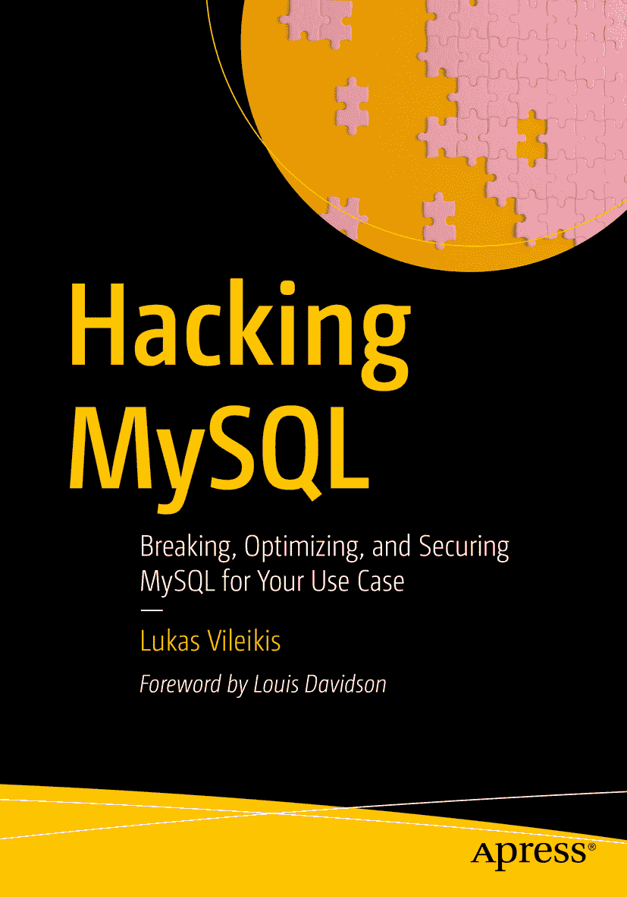

ISBN 979-8-8688-0979-8 e-ISBN 979-8-8688-0980-4 [`doi.org/10.1007/979-8-8688-0980-4`](https://doi.org/10.1007/979-8-8688-0980-4) © Lukas Vileikis 2024
本作品受版权保护。出版商独家拥有所有授权，无论是材料的全部还是部分，特别是翻译、转载、图表再利用、朗诵、广播、缩微胶片或其他任何物理方式进行的复制，以及信息存储和检索、电子改编、计算机软件，或目前已知或未来开发的类似或不同方法的使用权利。本书中使用的通用描述性名称、注册商标、服务标志等，即使未作具体说明，也不意味着这些名称不受相关保护法律法规的约束，因此可自由通用。出版商、作者和编辑可以安全地假设本书中的建议和信息在出版时是真实准确的。出版商、作者或编辑均不对本书所含材料或其可能存在的任何错误或遗漏提供明示或暗示的保证。出版商对出版地图中的管辖权主张和机构从属关系保持中立。

本 `Apress` 印记由注册公司 `APress Media, LLC`（`Springer Nature` 的一部分）出版。

注册公司地址为：1 New York Plaza, New York, NY 10004, U.S.A.

*我将本书献给那些经常无偿分享知识的开发者们——这样做需要付出大量努力，没有你们的努力，就不会有像这样的书存在。*

## 前言

我很高兴为卢卡斯的著作 `Hacking MySQL` 撰写前言。过去几年，我作为编辑，通过卢卡斯为 `Simple Talk` 网站撰写关于 `MySQL` 的文章而与他共事，亲眼见证了他处理 `MySQL` 方面的知识和技能。

本书的标题听起来确实有些不祥，但它实际上并非关于如何入侵 `MySQL` 数据库，而是真实地探讨了什么会破坏 `MySQL`，以及什么能防止它被破坏和入侵。

当你读完本书时，你应该会对所有关于 `MySQL` 的知识了解得更透彻，并且更有能力处理在设置和使用 `MySQL` 进行生产工作时出现的所有常见及非常见问题。

在过去两年里，我从卢卡斯撰写这些主题的文章以及他深入钻研主题的意愿中学到了不少东西。我认为你也会从本书中获得同样的体验，甚至更多。

> Louis Davidson

## 序言

老实说，你拿起这本书很可能是因为它的书名，对吧？什么样的书会以“Hacking”作为书名的一部分？这太疯狂了！正如你从书名可能已经看出的，这不是一本关于开发或数据库管理系统的普通书籍。

传统的数据库书籍往往专注于某个特定方面——比如性能、索引等。这未必是坏事，但它们许多都缺乏对你为何会把数据库破坏到需要书中描述的优化措施这一根本原因的解释。这就是本书的切入点。本书旨在开阔你的视野，让你了解在 `MySQL` 领域真正可能实现的事情，因此它分为三个不同的部分——**破坏**、**优化**和**加固**。本书的第一部分——破坏——将引导你了解你如何破坏了数据库，以至于可能需要对其应用优化；优化部分将告诉你如何优化你的数据库，使其高性能、可靠且安全；最后一部分——加固你的数据库——将帮助你理解如何保护你刚刚优化的数据。

如今，黑客行为无处不在——我这么说并不仅仅因为我们生活在一个 AI 时代。黑客行为的含义非常广泛——它的意义不仅限于存储信息的计算机系统。远非如此——砍倒一棵树或在健身房锤炼你的身体也属于这个范畴。谁能不承认将你的事业“黑”上新高度也不算是一种黑客行为呢？

我希望你能像我享受写作过程一样享受阅读本书的乐趣——最终，我真心希望本书中的信息能在超出本书范围的情境下为你提供帮助。

现在，为自己冲杯咖啡，放松身心，开始享受阅读吧。但别忘了先浏览一下本书的目录！

### 本书的组织结构

除了一个不错的书名，本书还特意分为三个部分——破坏、优化和加固——并额外增加了一个作为引言的部分。

正如我之前提到的，这三个部分各自服务于三个不同的、为实现三个不同目标所必需的目的：

1.  **破坏** 让你理解如何破坏你的数据库，这意味着它将引导你了解你正在做的、可能影响数据库性能、可用性、安全性或所有这些方面的错误事情。好吧，我直说了——它也将引导你了解如何故意破坏你的数据库。这类知识对于举办研讨会、在会议上发言，或只是想向朋友们展示他们的 `MySQL` “魔法”的人可能极为有益。
2.  **优化** 引导你如何针对特定用例优化你的数据库实例。
3.  **加固** 引导你采取必要的安全措施来加固你的数据库实例并保护你的数据。

因此，本书的每个部分都有其特定的职责范围，所以我建议你从第一部分开始阅读，直到最后一部分结束——你也可以选择从优化部分开始阅读，但它可能包含与第一部分类似的内容，而第三部分也可能包含与第二部分相似的内容。

> 提示
>
> 不必从头到尾阅读本书，但由于本书每个部分都服务于一个导向下一个部分的明确目标，如果你随意阅读，某些内容可能会变得模糊不清。对于那些需要快速建议的人，我建议你使用索引跳转到特定问题所在的章节。

### 本书面向的读者

本书的主要读者是数据库专业人员，但这并不意味着其他软件专业人士无法应用书中的建议。

本书适用于所有使用 `MySQL` 的人——这里的关键在于对数据库管理系统的特定处理方法。本书不是教你如何优化数据库内部原理，而是首先告诉你你做错了什么，然后告诉你如何优化这些方面并为未来加固它们。

本书将为初级数据库管理员和经验丰富的 `DBAs` 都奠定坚实的 `MySQL` 知识基础——初级人员将学习为避免问题而不应对数据库做什么，而高级人员则将获得有用的技巧，帮助他们处理日常工作中的问题或未来可能出现的极端情况。

### 本书使用的约定

本书使用的约定如下：

*   `代码` 格式表示代码部分，如下所示：

    ```
    代码
    ```

*   *斜体* 表示文件、目录、文件扩展名或 URL 的名称，强调文本——诸如此类的所有内容。它也用于引入新术语。
*   **加粗文本** 或带下划线的文本提醒你需要注意的事项。

本书还为你提供提示、警告（注意事项）或注释。这些内容将如下所示：

> 提示
>
> 这是一个提示。

> 警告或注意
>
> 这是一个警告或注意事项！

> 注
>
> 这是一个注释。


