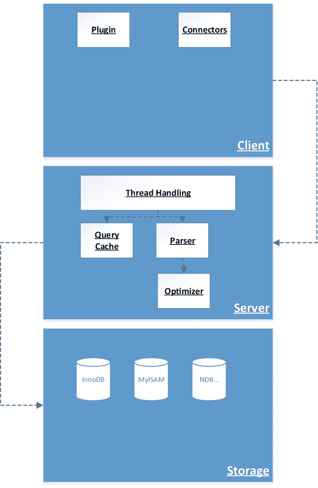

# 第一部分 MySQL 基础

## 1. MySQL 的世界

`MySQL`是世界上使用最广泛的数据库管理系统之一。这并非没有原因——`MySQL`是包括但不限于`Facebook`、`Twitter`、`Netflix`和`Uber`在内的许多科技公司的得力伙伴。

众多公司选择`MySQL`作为其首选数据库管理系统的原因在于其健壮性：`MySQL`支持多种存储引擎，这使得`MySQL`在数据不断变化的当今世界足够灵活——这些存储引擎附带了与性能、可用性或安全相关的特性，充分利用这些特性可以从这个数据库管理系统中获得最大收益。

### 本书中的示例

本书中的代码示例基于`Windows`架构上的`MySQL 8.0`，但也应在其他架构上运行良好。为安全起见，请避免在实际生产环境中运行本书中的代码示例——先测试、验证，然后再将代码推入生产环境。

使用代码示例时需小心——有些示例可能需要额外的上下文，有些可能会减慢甚至破坏您的查询，还有一些将作为反面示例展示。请务必仔细阅读代码示例前的注释，并在安全环境中，在完全彻底理解您操作后果的前提下运行代码示例。

### 评论、问题与关切

如果您对本书有任何评论、问题或关切，欢迎通过电子邮件`lukas@lukasvileikis.com`联系我——我很乐意就各类查询与您联系，受邀在会议上发言或举办研讨会，或做其他事情，而且我通常回复相当及时。

有关数据库、网络安全或我本人的更多信息，请访问：

*   我的网站：[lukasvileikis.com](https://lukasvileikis.com)。
*   我建立的数据库泄露搜索引擎：[BreachDirectory.com](https://breachdirectory.com)（如果您好奇，它也是基于`MySQL`的！）。
*   如果您愿意，可以通过[访问](https://databasedive.com) [@DatabaseDive](https://databasedive.com) [在 YouTube 或其他平台](https://databasedive.com)观看关于数据库性能的视频。

现在，让我们深入探索`MySQL`，好吗？

### 致谢

我要感谢一些直接或间接为本书内容、书中分享的知识做出贡献，或起到催化作用的人们。首先想到的是`Zach Naimon`、`Mikael Oldebäck`和`Louis "Dr. SQL" Davidson`。

这些人在本书中扮演了特别重要的角色——无论是通过审阅我的作品、在必要时批评我，还是提供建议——他们永远令人难忘。没有他们，本书的部分内容将不会存在。

`Zach`，感谢你成为一位很棒的朋友和出色的合作伙伴；`Mikael`，感谢你在必要时推动我前进并成为一位出色的经理；`Louis`，同样感谢你撰写了前言！

`Jonathan Gennick`和`Dr. Charles Bell`在帮助我查明一个关于大数据集中“@”符号的问题（我在`附录`中分享了细节）是`MySQL`内的一个错误方面发挥了关键作用——也要向你们二位表示衷心感谢。

那些多年前传授开发秘诀的人们也永远不会被遗忘：特别感谢`Gediminas Kiltinavičius`、`Artūras Lazejevas`以及其他在立陶宛编程学校塑造我（以及作为开发者的我！）的人们。

当然，要特别感谢`Apress`的编辑`Jonathan Gennick`、`Shaul Elson`、`Krishnan Sathyamurthy`及其他人员，没有他们，本书首先就无法面世。最后，要单独感谢在论坛和诸如`Stack Overflow`、`DBA Stack Exchange`、博客、`YouTube`、会议等媒介上无偿贡献建议的无数人们——关于如何解决特定问题的点点滴滴建议总是弥足珍贵。其中一些建议在开发者最黑暗的时刻帮助了他们，一些帮助解决了较小的问题，还有一些则完全不起作用，但无论如何，开发者社区太棒了！也要向你们表示巨大的感谢。无论你是谁，无论你做什么，分享你的知识就是关怀。感谢你关怀开发者社区并在必要时提供建议。

### 关于作者

### `MySQL`的历史

`MySQL`最初由`Michael Widenius`、`David Axmark`和`Allan Larsson`在 1990 年代开发。该数据库管理系统的开发始于 1994 年，并在几年后首次向公众发布。

在专家圈里，`Michael`常被称为“`Monty`”，据说`Monty`在 1985 年与`Allan Larsson`共同创立的一家小型数据仓库公司工作时，使用`C`编写了一个报告工具，之后萌生了构建`MySQL`的想法。此后不久，据说公司的客户想要一种类似界面的东西来处理他们的数据，而`Monty`受够了不起作用的解决方案，便开始编写一个工具——这个工具就是现在众所周知的`MySQL`。`MySQL`这个名字源于`Monty`长女的名字（`My`）和编程语言`SQL`的结合。

多年来，`MySQL`不断进步。许多读者会知道，如今我们在使用`MySQL`时有三种选择——我们可以使用`MySQL Server`、`MariaDB Server`或`Percona Server`。

`MariaDB Server`和`Percona Server`都是`MySQL Server`的变体——它们差别不大，但提供了其他版本所没有的一些东西。`MariaDB`以其存储引擎而闻名，而`Percona Server`则带来了许多性能改进和功能增强。`MariaDB`以`Monty`最小的女儿`Maria`命名，包含了基于社区反馈开发的功能，而`Percona`则以其数据库咨询能力著称。

### `MySQL`的架构

与所有数据库管理系统一样，`MySQL`有其独特的架构。`MySQL`架构包含三个主要部分，如下所示：

1.  **客户端**：`MySQL`架构的客户端部分；用户运行`MySQL`时与之交互的部分。
2.  **服务器**：`MySQL`的“大脑”。客户端将查询传递给服务器，服务器执行其自身功能。线程处理器处理查询并将其分发到查询缓存和解析器，解析器继而将其转发给查询优化器。
3.  **存储**：最后，一旦客户端处理完查询并将其传递给服务器，服务器就会将所有内容传递给存储。存储指的是为`MySQL`提供支持的存储引擎——目前，最流行的存储引擎是`InnoDB`，其次是`MyISAM`。所有这些存储引擎都有其各自的优缺点，稍后将进行讨论。

这里的要点很简单——上述三个层始终协同工作，为您的服务器提供动力，以使`MySQL`正常运行。图 1-1 将帮助您形象化`MySQL`内部这些组件是如何交互的。

图 1-1：`MySQL`的架构

了解`MySQL`的架构是更好地理解您的数据库如何崩溃、如何优化以及如何保障其安全的第一步。

一旦您理解了架构层如何连接在一起，就该思考`MySQL`的用例了。如果此刻您不太理解也不必担心——随着学习的深入，一切都会变得更加清晰。

### 基本用例和初始考虑因素

MySQL 由三层架构组成，这并非没有道理——每一层对于根据我们的配置正确执行请求都是必不可少的。

MySQL 可以通过一个名为 "my" 的配置文件进行配置——该文件在 Windows 系统上的名称是 `my.ini`，在基于 Linux 的系统上是 `my.cnf`。

配置文件包含一系列不同的参数。其中一些参数如下所列，但要正确理解它们，你还必须理解一个关键点。回到图 1-1 并查看最底层——它写着什么？对，它写着 “存储”。存储指的是 MySQL 内部的存储引擎。MySQL 基于存储引擎的原理构建，目前，该 RDBMS 提供了八种存储引擎供选择：

*   `port`：定义我们的 MySQL Server 的端口。默认为 `3306`，可以更改。
*   `key_buffer_size`：定义内存中键（索引）缓冲区的大小。与 MyISAM 用户相关。
*   `max_allowed_packet`：定义可以通过 MySQL 流动的数据包的最大大小。在 MySQL 8.0 实例上，默认值为 `1GB`。
*   `log_error`：定义与 MySQL 相关的日志文件的存储位置。
*   `log_error_verbosity`：定义要记录哪种类型的错误：
    *   值为 `1` 仅记录错误。
    *   值为 `2` 记录错误和警告。
    *   值为 `3` 记录错误、警告和注释。
*   `innodb_buffer_pool_size`：对于使用 InnoDB 存储引擎的用户来说，这是最重要的参数。此设置定义了 InnoDB 存储引擎的缓冲池大小。缓冲池在访问时缓存表和索引数据。
*   `innodb_data_file_path`：通往 InnoDB 数据文件的路径——`ibdata1`。

如你所见，配置文件包含一系列不同的参数。这里我们面临一个利弊权衡的问题：Windows 上的 `my.ini` 为开发者提供了大量注释，以帮助他们理解 MySQL 的工作原理，但代价是某些参数无法直接调整；而 Linux 上的 `my.cnf` 起初提供的参数较少，内部也没有注释，但在可用功能方面提供了更广阔的领域。Windows 用户选择比 Linux 用户少的原因非常简单——Windows 不适合完成某些优化操作（例如，InnoDB 的 `O_DIRECT` 刷新方法仅在 Unix 系统上可用，因为它需要基于 POSIX 的头文件）。

很有趣，对吧？请继续关注。回到图 1-1 并查看最底层——存储层。听起来熟悉吗？存储指的是 MySQL 内部的存储引擎。MySQL 基于存储引擎的原理构建，目前，MySQL 8.0 提供了 10 种可供选择的存储引擎。

### 存储引擎

目前，MySQL 中提供的主要存储引擎如表 1-1 所示。

表 1-1：主要存储引擎

| 存储引擎 | 说明 |
| --- | --- |
| InnoDB | • 自 MySQL 5.5 起，MySQL 提供的主要存储引擎。 • 一个通用存储引擎，推荐在大多数使用 MySQL 的项目中使用。 • MySQL 中唯一符合 ACID 的存储引擎。 • 提供对外键的支持，并且自 MySQL 5.6 起，支持全文索引。 • 当使用 MariaDB 时，InnoDB 支持虚拟列。 |
| MyISAM | • 在 MySQL 5.5 发布之前，MyISAM 是默认存储引擎——因此，它是 InnoDB 的主要竞争对手。 • MyISAM 不提供 ACID 合规性，并且基于键缓冲区。 • MyISAM 默认支持全文索引。 • MyISAM 在内部存储表行数，因此，虽然总体上比 InnoDB 慢，但在执行 `COUNT(*)` 查询时提供更快的性能。 |

#### 其他存储引擎

除了 InnoDB 和 MyISAM，MySQL 还有其他可供选择的存储引擎。通常不建议更改 MySQL 基础架构的存储引擎，除非你有充分的理由这样做，因为 InnoDB 已经过广泛测试，并被证明是绝大多数用例的最佳存储引擎。但如果你感觉想尝试一些不同的选项，以下就是你的选择以及你可能考虑它们的原因。

| 存储引擎 | 说明 |
| --- | --- |
| MEMORY（在 MySQL 4.1 之前称为 HEAP） | • 此存储引擎将所有数据存储在内存中。 • 提供基于哈希的表存储，使得精确数据检索非常快，但缺点是数据存储在内存中（一旦服务器关闭或内存被清除，数据就会丢失）。 • 在 MySQL 8.0 之前，MySQL 使用 MEMORY 存储引擎来存储与临时表相关的数据。从 MySQL 8.0 开始，对于临时表用例，此引擎已被 TempTable 存储引擎取代。 |
| TempTable | • 此存储引擎主要供优化器用来创建临时表并存储与之相关的数据。 |
| CSV | • 顾名思义，此存储引擎以类似 CSV 的格式存储数据。 • 不支持索引或分区表。 |
| ARCHIVE | • 旨在用作不再使用或应用程序正常运行不再需要的数据的归档。 • 在磁盘上占用空间极小，但代价是不支持 `DELETE`、`REPLACE` 或 `UPDATE` 操作。 • 不支持索引或分区。 |
| BLACKHOLE | • 任何插入此存储引擎的数据都会消失在黑洞中，因此得名。 • 旨在用作沙盒项目的演示解决方案。 |
| MERGE（以前称为 MRG_MyISAM） | • 此存储引擎提供了一组 MyISAM 表的集合，这些表被合并并可以作为一个表使用。 |
| FEDERATED | • 此存储引擎支持查询远程数据，而无需复制或集群。 |
| EXAMPLE | • 旨在作为开发者在 MySQL 内部构建存储引擎的示例。 |

MySQL 是个强大的家伙，对吧？即使不计算主要的那个，也有这么多存储引擎？哦，你知道 Percona 也为这个主要存储引擎——InnoDB——构建了一个增强版本吗？他们增强的存储引擎被称为 Percona XtraDB 或简称 XtraDB，以其提供广泛的功能而闻名，适合那些需要高性能环境的人。

这就是 MySQL 的世界——你现在对一切如何协同工作有了很好的了解。接下来，你将更深入地研究特定的存储引擎，然后，我们将开始剖析你的 MySQL 实例，以弄清楚如何优化和保护它。

### 总结

MySQL 是一个强大但非常复杂的家伙——在其内部有如此多的功能，难怪许多开发者会在其丛林中迷失方向。

好消息是，这个家伙是可以被驯服的——一旦你更多地了解了 MySQL 中可用的存储引擎，你将能够确定你的实例是如何出问题的，然后——如何优化一切使其不再出问题，最后，如何保护你的数据免遭泄露，使你的基础架构更加安全。

现在，去喝杯咖啡，在继续阅读之前，确保你刷新了对 MySQL 中存储引擎的记忆——接下来我们将更深入地研究存储引擎的领域。

