# 第二部分 破坏 MySQL

## 3. 什么会破坏 MySQL？

我带你回顾 MySQL 及其存储引擎历史的原因，是为了让你对 MySQL 整体有更深入的理解。随着你继续阅读本书，了解 MySQL 在底层如何运作将至关重要；MySQL 的历史是这个数据库管理系统的基石，而其存储引擎则让你能更深入地探索 MySQL 的整体功能。

现在你知道了存储引擎是什么，以及它们能为你作为开发者提供什么，是时候熟悉那些会破坏 MySQL 的因素了，这样你才能更好地优化你的数据库管理系统。毕竟，如果你不了解首先会“粉碎”你 MySQL 实例的因素，优化和安全又有什么用呢？

### MySQL 使用案例

本书的许多读者会知道 MySQL 的用途。毕竟，MySQL 的使用案例并非什么高深莫测的学问。这个数据库管理系统已在许多行业留下了印记——网络安全、教育、医疗保健、招聘、营销、房地产、能源、金融、供应链、零售甚至农业。这些行业的各种公司以某种方式使用着 MySQL，虽然不同行业可能以不同方式使用 DBMS，但其核心原则保持不变，且不太可能发生改变。

发生这种情况的主要原因之一是，MySQL 是一个非常可靠的数据库管理系统。它之所以可靠，是因为其主要存储引擎以具备 ACID 特性而闻名，并且因为它需要一个数据库模型才能让 DBMS 大放异彩。

ACID 是一组属性，它保证了 MySQL 在出现那些会让基于 NoSQL 的数据库“颤抖”的错误和问题时仍能保持功能。这些问题包括突然断电、服务器宕机等。ACID 确保我们的数据库在出现这些错误时仍能良好运行。

ACID 代表原子性（Atomicity）、一致性（Consistency）、隔离性（Isolation）和持久性（Durability），在 MySQL 领域中，一切都转化为：

*   **A** 原子性：确保任何事务中的语句作为一个不可分割的单元运行，并且它们的效果要么作为一个整体被看到，要么完全不被看到。
*   **C** 一致性：数据一致性由 MySQL 旗舰存储引擎之一独有的日志功能保证。还记得`InnoDB`及其架构吗？其架构的组件之一是日志文件`ib_logfile*`，这并非没有原因。
*   **I** 隔离性：行可以被隔离——或者锁定——以免受到可能影响它们的查询的影响。换句话说，行级锁。
*   **D** 持久性：`InnoDB`维护一个日志文件，跟踪对数据的所有更改。

换句话说，MySQL——在这种情况下特指`InnoDB`——是一个非常强大的“野兽”，可以在各种不同的场景和用例中帮助你，从列出学校学生到在毫秒级内扫描十亿行数据。这里的问题在于，存储引擎必须经过优化以适应你的特定用例，然后你才能释放其高性能和可靠性。唯一能够遵守 ACID 特性的存储引擎也是`InnoDB`。


### 问题使用场景

讽刺的是，即使 MySQL 如此功能强大，但即便我们认为自己考虑周全了，许多问题仍会接踵而至。这些问题的出现，是因为我们避免优化数据库，或者说“数据库运行得够好——还有什么可优化的？”，然后当我们的应用程序加载耗时过长时又感到沮丧。

数据库问题可以方便地分为多个类别——可用性、性能和安全性是一个很好的起点。在梳理这些问题时，请记住，最简单的事情往往最令人头疼，MySQL 也是如此。尽管这些问题背后的原因在大多数情况下比你想象的要简单，但它们也必须得到妥善处理。

#### 性能小故障

首先，一个长久以来困扰着每一位使用 MySQL（或任何数据库管理系统）的 DBA 和开发人员的问题就是数据库性能问题。数据库性能问题是几乎所有应用程序运行缓慢的核心，无论你的数据库支撑着何种技术架构。

无论何种应用程序，数据库性能在初始阶段很少被深入探究。这并不是说开发者忽视了开源数据库中性能的重要性——他们几乎肯定没有——但经常发生的情况是，开发者只从应用程序的角度来看待性能。这意味着以下一个或多个情况：

*   你的服务器正在做超出其应负荷的工作。
*   你的数据库资源受限。
*   在数据库中运行的查询未针对性能进行优化，因此消耗了过多或过少的资源。
*   你的数据库结构未针对你要求数据库执行的工作进行优化，使得数据库难以胜任你分配的工作。这可能包括数据库中的列没有索引或你未使用它们，在需要时没有进行分区，等等。

看出规律了吗？问题不在于你的数据库本身，而在于你不理解所使用的工具对数据库做了什么，这才是问题的核心。

别担心——从高层次来看，一切都比你想象的要简单。说真的——你所需要做的就是优化四种类型的查询。它们就是 CRUD 邻里——创建、读取、更新、删除。在最基本的层面上，一切工作原理如下：

| 查询类型 | 如何优化？ |
| --- | --- |
| 创建 – `INSERT` | 在执行 `INSERT` 之前，确保表锁、一致性检查和索引更新操作在 `INSERT` 查询完成后进行，并利用批量插入功能。如果这不起作用，则用 `LOAD DATA INFILE` 替代 `INSERT`。 |
| 读取 – `SELECT` | 尽可能少地读取数据。 |
| 更新 – `UPDATE` | 请记住，MySQL 也会更新数据及其上的所有内容（索引或分区）。如果需要，请删除索引和/或分区，使用锁机制，并注意 `NULL` 值——如果你将此类值插入表中的任何分区，它们将驻留在最低的分区中。 |
| 删除 – `DELETE` | 利用 `LIMIT` 子句，并在可行时将 `DELETE` 切换为 `TRUNCATE`（`TRUNCATE` 会删除表中的所有行）。 |

如果你像这样插入数据到数据库中：

```
LOCK TABLE mysql_table;
INSERT INTO mysql_table VALUES ('demo', 'demo', 'demo'), ('data', 'data', 'data'), ('more data', 'more data', 'more data');
INSERT INTO mysql_table VALUES ('more data', 'demo data', 'some data'), ('demo data', 'more demo data', 'something here too'), ('data', 'more data', 'more data');
...
UNLOCK TABLE mysql_table;
```

像这样从数据库中读取：

```
SELECT demo_column FROM mysql_table WHERE some_column >= 500 LIMIT 0,10;
```

像这样更新数据库中的数据：

```
LOCK TABLE mysql_table;
UPDATE mysql_table SET column = 'value' LIMIT 0,5000;
UPDATE mysql_table SET column = 'value' LIMIT 5000,10000;
UPDATE mysql_table SET column = 'value' LIMIT 10000,15000;
...
UNLOCK TABLE mysql_table;
```

或者像这样删除表中的所有数据：

```
TRUNCATE TABLE mysql_table;
```

你认为会发生什么？你的许多数据库性能问题将开始消失。看，一旦你遵循几个基本步骤，一切变得多么容易？我们将在本书第三部分深入探讨性能优化，但上述内容将是数据库性能方面的一个良好起点。

#### 可用性问题

清单上的下一个是可用性问题。这些并非新鲜事——如果你的数据库宕机或应用程序性能陷入停滞，你就遇到了问题。这类问题被广泛讨论，修复它们也并非难事——为了使你的数据库在大部分时间内保持可用（公平地说，一些停机时间不可避免地会发生），请选择可靠的服务器提供商，确保你的应用程序通过 CloudFlare 或任何其他 CDN 路由请求，务必备份数据并经常测试备份，优化在数据库中运行的查询，并在必要时了解负载均衡器在数据库基础设施中的工作方式。

最重要的是，如果需要，在多个服务器之间复制数据，这样就万事大吉了！也不要过分纠结于让你的数据库 100% 时间可访问——考虑到即使是 CDN 提供商也可能被 DDoS 攻击打垮，你数据库背后的服务保证 100% 正常运行时间从来都是不现实的；然而，这并不意味着你不应该尽一切努力来阻止此类攻击的发生。

在数据库领域，可用性问题的产生是因为你的数据库没有得到适当优化，因此务必保持警惕，关注数据库中数据的使用方式。但一旦你确保应用程序处于 CDN 之后以抵御 DDoS 攻击、查询已优化、数据备份可靠并经过测试、应用程序采用了速率限制器，并且你部署了一个或两个负载均衡器，那么就可以放宽心——不太可能出什么问题。但是，务必保持警惕——安全漏洞也近在咫尺。

#### 安全问题

一旦你确信自己的应用程序性能良好，且可用性水平对你的组织或你个人而言都是可接受的，就该向你的数据库提出另一个问题了——其中的数据是否曾被窃取？

不幸的是，在许多情况下，答案都是“是”，即使你从未听说过任何数据泄露事件影响到你的公司或与之相关的任何公司的基础设施。事实是，数据泄露很少会登上你公司的头条——而即使登上了，那也几乎肯定不是你公司经历的第一次数据泄露。

要缓解安全问题，请注意以下几个方面：

1.  通用安全准则
2.  用户安全与访问控制
3.  MySQL 安全组件与插件
4.  企业级安全控制

看似要关注的事情很少，对吧？别高兴得太早，因为就像其他所有事情一样，魔鬼藏在细节中。因此，本书有整整一部分专门讨论安全——当我们讲到 MySQL 的安全部分（这是本书的最后一部分）时，我会告诉你所有你需要知道的，但目前，请遵循以下建议：

| `安全准则` | `建议` |
| --- | --- |
| 通用安全准则 | 确保只有 `root` 用户可以访问 `mysql` 数据库中的用户表，永远不要信任用户提供的数据（这是 `SQL 注入` 的主要原因），并考虑使用 `Web 应用防火墙 (WAF)` 来防护针对你的应用程序和数据库的攻击。 |
| 用户安全与访问控制 | 使用强密码，不要以明文形式或使用弱算法存储密码（可以研究一下 `BCrypt` 或 `Blowfish`），只授予用户完成其操作所必需的权限，并留意账户的锁定与解锁。 |
| MySQL 安全组件与插件 | `MySQL` 提供了实施密码安全策略的能力，只有达到特定长度的密码才能被使用；它自带了专门针对自身的企业级防火墙（参见企业级安全控制）；提供了 `keyring` 插件来安全存储敏感信息以备后用，等等。 |
| 企业级安全控制 | 企业级安全控制包括但不限于用于审计和用户安全的 `MySQL Enterprise Firewall` 和 `MySQL Enterprise Audit` 功能、数据屏蔽流程等。 |

以上是安全的基础知识，我们将在本书的最后一部分深入探讨，但我们还没准备好进入数据库的安全环节——你需要先确保不安全的东西的安全，并优化损坏的东西。目前，请理解在 `MySQL` 的内部，如果你谨慎地对待数据库之路并理解它所涉及的一切，一切都是简单的。数据库涉及数据，数据涉及 `模式`（在 MySQL 世界中，`模式` 也是数据库的同义词），而 `模式` 又涉及 `数据类型`、`索引` 等。理解你的 `数据`、`模式` 以及与之相关的 `数据类型` 似乎是一项简单的任务，但远非易如反掌：它确实需要仔细的考量和关注，才能确保现在和将来都能正常运行——如果 `模式` 和 `数据类型` 不当，你可能会在不知不觉中破坏你的数据库！你很幸运，因为现在我将引导你如何通过选择合适的 `模式`、`数据类型` 和 `排序规则` 来理解你的数据，从而避免这种情况。怎么做？嗯，继续阅读下去，你会发现答案。

### 理解你的数据

要理解你的 `数据`，首先要梳理一下必要的情况：很可能你的数据库中已经有很多 `数据` 了，对吧？那么，这些 `数据` 是如何进入你的数据库的？在任何 `数据` 进入你 `MySQL 服务器` 中的任何数据库之前，你考虑过什么？没错——就是 `表模式`、`数据类型` 和 `排序规则`。这三样东西是驱动你的 `数据` 的“三大基石”：`表模式` 定义了表的概览，`数据类型` 定义了什么 `数据` 可以进入哪一列，而合适的 `排序规则` 则确保 `数据` 不会以你无法理解的符号来表示。

本质上，`表模式`、`数据类型` 和 `排序规则` 为你提供了一条数据的“高速公路”——由你来选择限速。然而，无论限速是多少，如果这条高速公路建造得如此糟糕，以至于你的汽车几乎无法通过，你就无法到达目的地。这就是为什么在开始任何项目之前，选择合适的 `模式`、`数据类型`、`字符集` 和 `排序规则` 至关重要——这些东西为任何项目奠定了基础。


### 选择适当的模式与数据类型

“恰当地选择正确的模式、字符集和数据类型”听起来很专业，但这具体意味着什么？对你来说，它意味着以下几点：

1.  评估你的用例：你使用 MySQL 是为了什么？在许多情况下，你的用例在很大程度上决定了你选择某一种数据类型或排序规则，而不是另一种。

2.  思考你的用例需要哪些数据库和表：你需要多少个数据库或表？为什么？

3.  进行头脑风暴：思考你的表结构，研究你所使用的 MySQL、MariaDB 或 Percona Server 版本中可用的数据类型和排序规则，选择最贴近你用例需求的那一个。模式、数据类型和字符集并非一成不变，它们可以随时间而改变，因此要明智选择，但也不必过于担心。

4.  考虑你的服务器：在进行头脑风暴以选择最佳数据类型或排序规则时，要考虑你的服务器情况——你有多少磁盘空间？你是否有计划扩展你的软件设施，从而在未来需要改变你的数据类型或排序规则？请记住，不同的数据类型占用不同的数据库空间——虽然现在这可能不重要，但当你有百万条或更多记录时，多出的 100 字节就意义重大了。

5.  做出选择：既然你已经理清了以上事项，现在就选择合适的数据类型和排序规则吧！

恰当地选择数据类型和排序规则可能有些棘手，而简化这个过程会很有帮助。使用简单的推理并考虑未来。

在思考选择何种数据类型时，要考虑你打算存储哪种数据，并选择最简单的解决方案。以下是你的选项：

#### 用于 `数值` 数据的数据类型

*   用于存储通用整数值的数据类型：`INTEGER` 或 `INT`、`SMALLINT`、`TINYINT`、`MEDIUMINT` 和 `BIGINT`。这里，一切都与取值范围相关。例如，`SMALLINT` 可以存储从 -32768 到 32767 的有符号整数值，或从 0 到 65535 的无符号值；`TINYINT` 可以存储从 -128 到 127 的有符号值，或从 0 到 255 的 `UNSIGNED` 值。请参考下面的提示和文档以获取更多信息。

*   用于存储精确数值的数据类型：`DECIMAL` 和 `NUMERIC`。在存储精确数值时（例如，用于会计目的的数据）使用这些数据类型。

*   用于存储近似值和浮点值的数据类型：`FLOAT` 和 `DOUBLE`。如果你存储的是单精度值，MySQL 需要四（4）个字节；如果存储的是双精度值，则需要八（8）个字节。

*   `BIT` 数据类型。在存储 1 到 64 位的位值时使用 `BIT`，并通过定义 `BIT(number)` 在括号中指定你的范围，其中 `number` 是 1 到 64 之间的数字。

#### 用于存储 `日期` 和 `时间` 值的数据类型

*   `DATE`、`DATETIME` 和 `TIMESTAMP` 数据类型。如果你存储的是没有时间的 `YYYY-MM-DD` 格式日期，请使用 `DATE` 数据类型；如果你存储的是带时间值（`YYYY-MM-DD hh:mm:ss`）的此类日期，`DATETIME` 会帮到你；`TIMESTAMP` 工作方式相同，只是范围更小：它只接受从 `1970-01-01 00:00:01` 到 `2038-01-19 03:14:07` 的值。所有值均采用 UTC 时间。

*   `TIME` 数据类型，用于存储从 -838:59:59 到 838:59:59 的时间值。

*   `YEAR` 数据类型，用于存储年份值。该数据类型的数据宽度为四个字符。

#### 用于存储 `字符串` 值的数据类型

*   `CHAR` 和 `VARCHAR` 数据类型指的是字符或可变字符值。这些数据类型很相似，这也是它们没有被分开提及的原因，但它们在最大长度和存储空间要求方面有所不同。`CHAR` 值会填充空格至你选择的长度，检索时尾部空格会被移除，而 `VARCHAR` 则不是这样。使用 `VARCHAR` 时，如果值前面有空格，MySQL 也会发出警告。

*   `BINARY` 和 `VARBINARY` 数据类型指的是二进制字符串；除此之外，它们与前面提到的 `CHAR` 和 `VARCHAR` 数据类型非常相似。

*   `BLOB` 和 `TEXT` 数据类型指的是二进制大对象和较大的文本值。这类数据类型很相似，它们的名称以及其值的最大长度是对应的。它们也有相同的存储要求。有四种 `BLOB` 类型：`TINYBLOB`、`BLOB`、`MEDIUMBLOB` 和 `LONGBLOB`；`TEXT` 类型也是如此。

*   `ENUM` 数据类型指的是一个允许值的枚举列表。

*   `SET` 数据类型可以具有在定义（集合）列表中指定的任何值。该列表最多可以有 64 个成员。

#### 用于存储 `地理` 数据的空间（地理空间）数据类型

*   `GEOMETRY`、`POINT`、`LINESTRING` 和 `POLYGON` 数据类型旨在保存单个几何值。

*   `MULTIPOINT`、`MULTILINESTRING`、`MULTIPOLYGON` 和 `GEOMETRYCOLLECTION` 数据类型可用于保存多个几何值。请参阅文档以获取更多信息。

#### `JSON` 数据类型

`JSON` 数据类型适用于存储 `JSON` 数据。

如你所见，你的选择范围很广——评估你的用例，考虑未来，并选择最简单的解决方案。换句话说，如果你打算存储电子邮件地址，`VARCHAR` 解决方案可能比 `TEXT` 更合适；如果你存储的整数值不超过 30,000，`SMALLINT` 很可能就足够了；如果你存储的是带时间值的日期，`DATETIME` 可能就是你要找的选项，但存储不带时间的日期用 `DATE` 就足够了。在许多情况下，最简单（最小）的数据类型就是最好的。

### 提示

为数值数据选择整数数据类型时，请记住，这里一切都与 MySQL 接受的整数范围以及你存储的是 `SIGNED`（有符号）还是 `UNSIGNED`（无符号）值有关。有符号值包括 0、正数和负数，而无符号值指的是 0 和正数。


#### 字符集与排序规则

一旦我们选择了数据类型，还需记住每个表都有自己的字符集和排序规则。许多开发者常常忽略这一点——毕竟字符集和排序规则默认已定义，何必费心呢？

这确实没错——MySQL 默认提供了字符集和排序规则，但 MySQL 的默认选择往往并非最优。毕竟，没有人比你自己更了解你的数据库，对吧？

从字符集说起，MySQL 和 MariaDB 提供了丰富的字符集选项供你选择——甚至无需切换到数据库即可获取可用字符集列表来支持你的数据。登录 MariaDB 后，只需执行一次 `SHOW CHARACTER SET` 查询，系统就会列出所有可用字符集及其描述、默认排序规则以及存储单个字符所需的最大字节数。来看看这个。

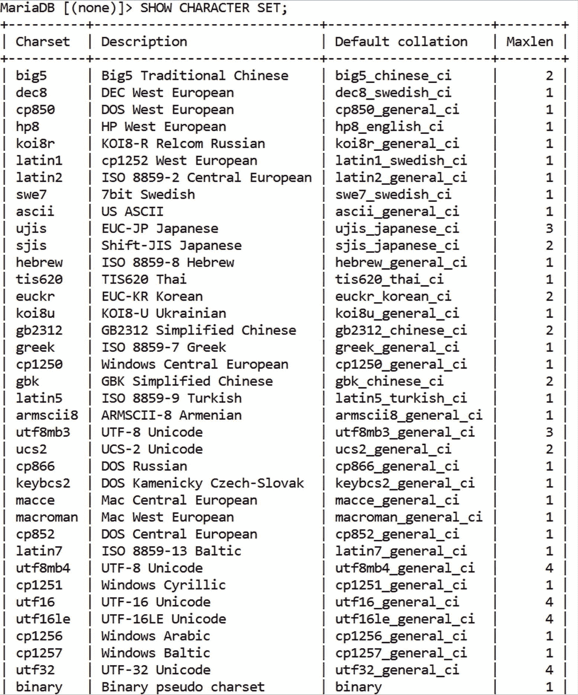

虽然对你和你的数据库而言，最可能的选择是支持 UTF-8 Unicode 的字符集（即 `utf8mb4` 配合排序规则 `utf8mb4_general_ci`），但某些使用场景可能需要其他字符集。处理希腊语数据？使用希腊字符集并搭配 `greek_general_ci` 作为排序规则。与来自以色列、需与你数据库中数据交互的客户打交道？使用希伯来字符集并搭配 `hebrew_general_ci` 作为排序规则。

对于大多数通用场景，`utf8mb4` 是你可靠的伙伴。早些时候，部分工程师最初倾向于使用 `utf8`，但随着 `utf8mb4` 成为 MySQL 的标准排序方法，`utf8` 逐渐淡出。选择使用 `utf8` 而非 `utf8mb4` 并无“不妥”；只是 `utf8` 的原始实现并不支持所有 Unicode 字符——大多数情况下你可能没问题，但如果遇到需要存储表情符号或其他字符的场景，`utf8` 将不够用，因为它仅支持基本多文种平面（BMP）中的字符，并未涵盖所有 Unicode 字符，因此才有了 `utf8mb4` 的实现。

同时也要考虑存储字符所需的最大字节数——几字节的差异看似不大，但如果你存储的是较大数据集，字节数累积的速度会比你想象的快得多。

不想使用 `utf8mb4` 或对你的数据库有其他规划？好消息——MySQL 提供的列表内容广泛、简洁且一目了然。根据你数据库中存储的数据来选择字符集和排序规则，展望未来需求，你就能顺利前行。

### 你的架构一团糟

你的模式、数据类型、字符集和排序规则有什么共同点？没错——它们共同构成了你数据库架构整体中或大或小的一部分。你的数据、其模式、数据类型、字符集和排序规则都是你数据库架构的一部分。其中一些构成较大份额，一些较小，但它们都扮演着角色。要回顾 MySQL 架构的模样，请翻回第一章，浏览标题“MySQL 的架构”。我提醒一下，你的 DBMS 架构主要分为三部分：客户端、服务器和存储：

1.  **客户端**：我们通过命令行界面或 SQL 客户端与 MySQL 交互。

2.  **服务器**：你在数据库管理系统中运行的每个查询都通过服务器执行。最初，你的查询会经过线程处理器，随后是查询缓存和解析器，解析器再将所有内容传递给查询优化器。这也是 MySQL 服务器优化发挥作用的部分：还记得 `my.cnf` 吗？`my.ini` 呢？这些文件的存在是有原因的——它们包含的选项用于让你的 MySQL Server 能够按照你指定的方式，在服务器上消耗指定数量的资源。这听起来像通往天堂的高速公路，对吧？

3.  **存储**：最后，运行你的数据库的存储引擎也有其重要性。对大多数人而言，MySQL 的存储部分可能指 InnoDB 或 Percona XtraDB，并将直接依赖于 `my.cnf` 中设置的选项。

在探究你的数据库架构时，深入审视服务器内部至关重要。想象一下，如果你的服务器会说话——其中的数据库及其内部数据会问你什么？

*   你上一次检查表结构是什么时候？

*   再看一下你的表结构。你拥有的所有列都是你使用场景所必需的吗？

*   检查表结构时，哪些索引是可见的？你知道它们为何存在吗？

*   你的数据库中使用了哪些字符集和排序规则？为什么？

*   如果你的数据库中有超过几百万行数据，你的表是否规范化的？如果是，你采用了哪种规范化形式，为什么？如果不是，为什么？

检查你的数据库架构并非难事，你需要答案的问题也并不复杂。这正是其美妙之处——优化 MySQL 时你无需重新发明轮子，但务必确保使用了合适的字符集和排序规则，明智地使用索引，处理较大数据集时对表进行分区，并在必要时对数据进行规范化。就这样——你已经有了一个良好的开始！

现在，你需要学习如何正确地与数据库沟通以访问它所承载的数据。如果你的服务器和架构设置正确，你仍然需要知道如何通过软件工具与你的数据库交互——开发者在此处犯的错误之多，会让你惊讶。

### 通过软件与 MySQL 通信

了解如何正确地与你的数据库通信，就成功了一半。许多开发人员认为自己知道与数据库沟通的最佳方式，但审视一下与 MySQL 交互的代码，往往会发现事实并非如此。打开搜索引擎的一段代码，检查其中的一些 SQL 查询——你可能会看到类似以下的内容：

1.  ```sql
    SELECT * FROM `table_name` WHERE `column` = 'Search Query';
    ```

2.  ```sql
    SELECT * FROM `table_name` WHERE `column` LIKE '%Search Query%';
    ```

3.  ```sql
    SELECT * FROM `table_name` WHERE(`column`) MATCH('Search Query' [IN ANY FULLTEXT SEARCH MODE]);
    ```

4.  ```sql
    SELECT `product_id`, `product_title`, `category_title` FROM `table_1` INNER JOIN `table_2` ON `products`.`cat_id` = `categories`.`cat_id`;
    ```

你可能会添加一些 `AND` 或 `OR` 条件，然后——瞧！这几乎就是你在应用程序中运行以从数据库返回结果的查询！

“这些查询有什么问题？”——我听到你在问。没什么问题——这些查询本身并“不错误”，但它们中的每一个都为我们提供了独特的视角，让我们了解它们在数据库中可能消耗的资源。一旦我们需要理解是什么拖垮了我们的数据库，特别是在某些查询运行缓慢时，它们就成为了一个极好的起点。

现在停下来，仔细看看每个查询——我已经为你划出了值得额外关注的重点：

1.  `SELECT * FROM` `table_name` WHERE `column` = 'Search Query';

2.  `SELECT * FROM` `table_name` WHERE `column` `LIKE` `%Search Query%`;

3.  `SELECT * FROM` `table_name` WHERE `MATCH`(`column`) `MATCH`('Search Query' `[IN ANY FULLTEXT SEARCH MODE]`);

4.  `SELECT` `product_id`, `product_title`, `category_title` FROM `table_1` `INNER JOIN` `table_2` ON `products`.`cat_id` = `categories`.`cat_id`;

这四个查询中，我划出了 11 个值得关注的点。我这么做有充分的理由：每个点都对你的应用程序及其背后的数据库有着不同的性能影响。每个查询都是一个由更小任务组成的任务：每个任务都会影响性能。性能就是响应时间，响应越快，对所有相关方越好。

换句话说，更高的性能意味着更短的响应时间。要实现良好的结果——一个高性能的数据库——我们需要响应时间尽可能低。为了实现这个目标，我们需要理解导致查询性能缓慢的原因，了解问题的内部机理，并消除它们。

#### 导致查询性能缓慢的主要原因

既然我们通过任何软件工具与 MySQL 通信时都追求性能，花些时间思考 SQL 查询的结构就至关重要，这也是你看到上面四个不同示例的原因。开发者会犯各种性能上的小错误，你看到的这些查询就是很好的例子。

再仔细看看这些查询：你能发现哪些潜在的性能问题？存在多少个？我发现了四个：

1.  **查询结构**：`SELECT * FROM` 意味着我们要从表中选择所有列。选择所有列是必要的吗？很可能不是。如果不是，那你为什么用 `SELECT *` 而不是 `SELECT column`？你能想象当选择一个有 10,000 条记录的表中的所有列时，你的数据库经历了什么吗？100,000 条？1,000,000 条？记录越多，这种做法就越不推荐。在许多情况下，只需发出类似 `SELECT 'column' FROM` 的查询，就能立即看到性能提升，因为我们的数据库需要扫描的行数更少。

2.  **通配符**：在搜索操作中使用通配符本身没有错，但在**查询开头使用通配符**就是在自找麻烦，因为你告诉数据库的是“搜索我提供的文本之前的任何内容。哦，文本后面也可能有任何内容。” *如果你这样做，你的数据库将无法使用索引*，因为它不知道你关心的确切查询是什么。**永远不要在查询开头使用通配符——如有必要，请将它们用在末尾。**

3.  **全文搜索可能有问题**：全文搜索操作是 MySQL 的老朋友了；使用数据库管理系统执行全文搜索操作有很多合理的理由。全文搜索操作为 MySQL 提供了极少有东西能匹敌的强大能力；然而，这种方法可能变得有问题，因为 MySQL 不阻止你在同一列上放置多种索引。请警惕你在数据库管理系统中使用的索引类型，并且要记住，在较大数据集上使用全文索引的查询可能会因为 MySQL 5.7 内部的一个错误而使其崩溃（更多信息请参见附录——使 MySQL 5.7 崩溃的查询）。更新版本的 MySQL 不受此问题影响。

4.  **`INNER JOIN` 是必要的吗？** 使用 `INNER JOIN` 来帮助查询成功本身没有问题，但请记住，在许多情况下，`INNER JOIN` 标志着复杂查询的开始——在一个查询中跨越多个 `INNER JOIN` 并因此拖慢其性能的情况并不少见。毕竟，`INNER JOIN` 是你需要的连接类型吗？你还可以使用其他四种 `JOIN` 类型——还有 `LEFT OUTER JOIN`、`RIGHT OUTER JOIN`、`SELF JOIN` 和 `CROSS JOIN`。

许多导致 `SELECT` 查询性能缓慢的原因都与上述性能问题有关。其他的则可能与定义了但未使用的索引、表未规范化或其他问题有关。一旦你的应用程序完成了必要的查询，关闭连接也至关重要，以免耗尽 MySQL 可处理的连接数——这就是 `max_connections` 变量的作用。在 MySQL 中，默认值是 151，最小值是 1，最大值是 100,000。

我将在本书的第二部分引导你深入了解 SQL 查询优化的方方面面——现在，请理解为了让你的 `SELECT` 查询尽可能快，你需要在为 MySQL 微调服务器资源后，尽可能少地读取数据，同时利用索引和分区。

换句话说，要提升 `SELECT` 查询的性能，就要在将大部分服务器资源分配给 MySQL 的情况下，选择尽可能少的数据。

一旦你进入 `INSERT` 领域，建议就变了——为了让你的 `INSERT` 查询更有效，请记住，虽然索引和分区对 `SELECT` 有帮助，但它们对 `INSERT`、`UPDATE` 和 `DELETE` 有害，因为当数据被插入、更新或删除时，索引或分区中的数据也必须更新。

为了优化 `INSERT` 查询，目标是使用批量 `INSERT` 功能一次性插入尽可能多的数据，像这样：

```sql
INSERT INTO `demo_table` (`col1`,`col2`,`col3`) VALUES(1,2,3),(4,5,6),(7,8,9),...;
```

尽量在索引不存在时插入数据（如果可能，在将数据插入表后再添加索引），如果你发现自己正在处理更大的数据集，那就完全舍弃 `INSERT`，改用 `LOAD DATA INFILE`。

至于 `UPDATE`，它们的工作方式与 `SELECT` 查询类似，但带有 `INSERT` 查询的额外开销。为了优化 `UPDATE`，需注意索引、分区和 `NULL` 值：

*   请注意，如果我们修改了已索引的列，索引会拖慢 `UPDATE` 速度，因为会产生额外开销（你的数据库需要更新数据本身以及索引中的数据）。


*   注意，如果使用了分区，`UPDATE` 查询可能会比平时更慢，因为 MySQL 需要同时更新分区中的数据和数据本身（并且，如有必要，还需要切换数据所在的分区）。
*   还需注意，`NULL` 值在更新方面也有一个陷阱——如果你将一个 `NULL` 值插入分区，它将存储在可能的最低分区中。

最后，为了优化 `DELETE` 查询，可以考虑使用 `LIMIT` 子句来删除数据，如果删除操作耗时很长，可以在删除数据前先删除索引和分区，最终，如果你要删除表中的所有行，可以使用 `TRUNCATE` 代替 `DELETE`：`TRUNCATE` 查询总是比 `DELETE` 更快，因为它不是逐条删除记录，而是一次性删除表中的所有行。

### 总结

如你所知，MySQL 拥有分层架构——这些层可能被破坏，而破坏任何一层都会影响其他层的性能。本章引导你通过为用例正确选择模式和数据类型来理解你的数据，并让你了解 MySQL 中可用的字符集和校对规则。

在可靠的架构上构建 MySQL 并选择与数据库通信的适当方式至关重要——但这还不够。人们还应该以不阻碍数据库帮助你的方式编写查询（例如，如果发现通配符是必要的，请避免在查询开头使用它们等），并在不再需要时关闭数据库连接。

然而，其中一些建议仅在数据库构建时适用，一旦你使用了一段时间后，可能就不一定适用了。随着时间流逝，越来越多的数据库问题会发生，了解如何处理和预防它们至关重要。你们中的一些人可能多年来一直在使用你们的数据库——并且破坏你们的查询。

## 4. 你如何破坏了你的查询

理解你的查询为何缓慢且无法产生必要结果的原因，对于新手和高级用户来说都是一项基本技能。毕竟，我们优化的是坏掉的东西——如果我们甚至不知道自己的哪些行为破坏了它们，又如何能优化查询呢？这就是我将在本章中帮助你探索的内容。本章将重点讨论破坏查询的本质以及一些你可能不知道的事情，所以请务必仔细阅读。本章中的所有建议并非都适用于你的特定用例——权衡我建议的利弊，取你所需。如果对某些内容不确定，你随时可以查阅针对你特定 DBMS 的最新版本文档，或咨询你友好的本地数据库管理员。

### 好的、坏的和丑陋的：理解 MySQL 中的查询

你可能认为你理解你的查询。毕竟，MySQL 中的查询并非火箭科学：你日常工作中依赖的查询只有那么多。这些可能包括 `INSERT`、`SELECT`、`UPDATE`、`DELETE`，以及当这些查询不起作用时你会求助的几个查询。说真的——差不多就这些。然而，人们仍然难以获得性能：他们的 SQL 查询超时，MySQL 以错误信息迎接他们，或者客户因停机问题联系他们。

这在很大程度上与查询编写不当有关——我们在上一章中已经介绍了一些导致查询性能缓慢的原因示例，但你会惊讶于你所做的那些从内部破坏查询的事情。你们中的一些人甚至没有想过它们，但它们就存在——隐藏在显而易见之处。

### 你如何在 MySQL 中破坏了查询

与普遍看法相反，破坏你的查询很容易。事实上如此容易，以至于你的某些同事可能已经在不知不觉中破坏了它们。

你看，开发者和 DBA——无论他们多么资深——都知道如何编写查询：谁不知道呢？问题始于我们开始与数据库沟通不当，并贪多嚼不烂。标准方法很好——直到你的应用程序名声大振。随之而来的是数据库负载的增加，以前帮助你解决数据库问题的方法可能不再适用。

我在第[3]章中已经引导你了解了几个这样的场景：还记得我告诉过你应该花些时间思考你的查询结构吗？正确选择数据类型和校对规则？避免在带有 `LIKE` 子句的查询开头使用通配符？这些建议中的每一点都有其价值——你遵循的相关建议点越多，你就越能让 SQL 查询恢复昔日的辉煌。我现在将引导你了解 MySQL 中的查询类型、查询所不喜欢的因素，并解释为什么、如何以及何时发生这些情况，以便你能防患于性能问题于未然。

### MySQL 中的查询类型

MySQL 为你提供了多种可用的查询类型。这些包括常见的四个 CRUD（创建、读取、更新和删除）查询，还包括专用于 DDL（数据定义语言）、DML（数据操作语言）、DCL（数据控制语言）和 TCL（事务控制语言）的其他 SQL 语句。在 MySQL 世界中，此类语句包括但不限于以下数据语言和语句：

| 语言及说明 | 子句和语句 |
| --- | --- |
| 数据定义语言（DDL） | `ALTER, CREATE, DROP, RENAME, TRUNCATE` |
| 数据操作语言（DML） | `CALL, DELETE, DO, EXCEPT, INSERT, LOAD [DATA|XML], REPLACE, SELECT, UPDATE, UNION, VALUES, WITH (CTEs)` |
| 数据控制语言（DCL） | `GRANT, REVOKE` |
| 事务控制语言（TCL） | `COMMIT, ROLLBACK` |

换句话说，MySQL 中的查询帮助你定义、操作或控制你的数据，或促进处理被视为单个单元的语句组的工作——这些语句组称为事务。因此，事务不能被插入或删除——它们要么被提交（保存在你的数据库中），要么被回滚（恢复到数据库中先前定义的状态）。

#### 破坏 MySQL 中 DML 查询的因素

当涉及到理解是什么破坏了你的查询时，回到基础至关重要：还记得我在上一章告诉你的吗？查询是由其他任务组成的任务。要使其性能更快，就让这些任务的执行更快，或者消除这些任务。这是你可以给任何抱怨查询性能不足的开发者的一条建议。

这是一个非常好的起点——当你开始深入探究其含义时，你开始理解是什么阻碍和破坏了你的查询，一旦你理解了是什么阻碍了你的查询达到目标，你就可以开始解决问题了。

任务是为实现目标而需要完成的工作片段。目标因所使用的查询而异：`INSERT` 查询将数据添加到数据库表中，`UPDATE` 查询更新表中必要的列，等等。每个查询都有一个目标——如果你的查询被破坏了，你将很难实现这个目标。

以显示用户之间发送消息的下表为例。

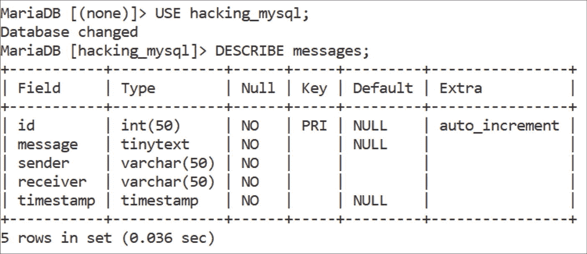

图 4-1

用于演示的表

该表本身并不特殊——这是一个简单的表，显示发送和接收的消息以及时间戳。具有上述结构的表在各种内容管理系统中非常常见。


#### MySQL 查询常见错误与优化

许多用户因选择了不恰当的表结构和数据类型而破坏了自己的 DML 查询。请仔细选择这两者——不恰当的结构意味着你所有的查询都需要做更多工作，而不恰当的数据类型则可能在处理数据时导致错误。

你上面看到的例子使用了四种不同的数据类型：`INT`、`TINYTEXT`、`VARCHAR`和`TIMESTAMP`。这本身没有错——至少在你看向未来之前是这样。想象一下你的数据集变得越来越大：自然地，你会希望在上面添加一些分区或索引，对吧？这样做可以加速读取（`SELECT`）操作，而且从逻辑上讲，你可以添加几个不同的分区来处理在特定时间范围内发送的消息。你的 SQL 查询看起来就会像这样：

```sql
/* 在消息列上添加 B-Tree 索引 */
CREATE INDEX message_idx ON messages(message);
/* 对消息表进行分区 */
ALTER TABLE messages
PARTITION BY RANGE ('timestamp') (
PARTITION p0 VALUES LESS THAN (2018),
PARTITION p1 VALUES LESS THAN (2019),
PARTITION p2 VALUES LESS THAN (2020),
PARTITION p3 VALUES LESS THAN (2021),
PARTITION p4 VALUES LESS THAN (2022),
PARTITION p5 VALUES LESS THAN (2023),
PARTITION p6 VALUES LESS THAN (2024),
PARTITION p7 VALUES LESS THAN (2025),
...
);
```

但你无法对`timestamp`值进行分区——真是可惜！

```
#1659 - Field 'timestamp' is of a not allowed type for this type of partitioning
```

所有插入的值也必须匹配你列的数据类型，否则 MySQL 会报错。

#### 教训

仔细选择表的结构和数据类型——不恰当的结构或数据类型可能是一条通向地狱的高速路，至少从比喻上来说是这样。

我们许多人在这一领域忽视的另一个因素是语法错误。看看这个例子：

```sql
INSERT INTO `messages` (id, message, sender, `receiver`, timestamp)
SELECT id, 10, sender, receiver, timestamp
FROM `messages_old`
WHERE message_id = 1;
```

这里的问题是“10”不是任何列的名称——它是一个我们希望插入到表中的值。

除了`INSERT`查询，下一个可疑对象就是`SELECT`查询——正如我之前简要提到的，你需要确保尽可能少地选择数据。为了有效地做到这一点，你可能需要牺牲那些在数据库中插入、更新或删除数据的 SQL 查询的性能，但这是你必须付出的代价。`GROUP BY`和`ORDER BY`子句同样有代价。记住——任何额外的操作都有性能成本。它可能很小，但小事情累积起来也很快。

你们中的一些人可能也是`UNION`子句的爱好者——这里的主要错误是使用了太多`UNION`，这对性能有着不可否认的影响。尽量减少你调用`UNION`子句的次数，并考虑将这个子句切换为`WHERE [condition] IN()`。

### 破坏 MySQL 中 DDL 查询的因素

当涉及到 DDL 查询时，我们首先需要理解的是，这类查询帮助我们定义数据，因此得名。在 MySQL 中，它们以五种不同的形式出现，帮助我们`CREATE`、`ALTER`、`RENAME`、`DROP`或`TRUNCATE`我们的数据。

这些子句各有不同的优点——`CREATE`帮助我们创建包含表的数据库，`ALTER`帮助我们改变表的结构（移动列、改变它们的数据类型、重命名它们，或添加、修改或删除索引结构），`RENAME`帮助我们重命名包含数据的表，`DROP`删除我们的数据库或其中的表，而`TRUNCATE`删除表中的所有数据。因此，有些查询比其他查询使用得更频繁，相应地，它们也更常被发现出现问题。例如，你使用`ALTER`修改表的次数很可能比你删除表的次数要多。还要记住`ALTER`也有多个等效操作：如下所示，`RENAME`映射为`ALTER`，当你在数据库中创建东西时，请记住`CREATE INDEX`也映射为`ALTER TABLE ... CREATE INDEX`。根据你的用例，删除操作可能比截断操作更常发生，反之亦然，在你考虑了 DDL 查询给数据库带来的好处之后，你需要记住几件事来理解它们为什么会出错。

`CREATE`查询在创建一两个数据库时不太可能变慢；如果你注意到它们变慢了，那很可能是在构建索引时遇到了较慢的性能。在这方面，`CREATE`查询与`ALTER`非常相似。请记住，当构建索引时，这两种子句都以需要 MySQL 重新创建相同表、向其中添加数据、并对刚创建的表执行修改的方式来*修改*（alter）你的表。然后 MySQL 会用新创建的表替换旧表。这些过程中，你都不会看到表或数据被添加到其中——运行这些查询后，你不会立即看到一个新表出现，如果你在运行`ALTER`或`CREATE`后注意到性能下降，这很可能是原因。

当涉及到重命名表时，情况通常是这样的：

```sql
RENAME TABLE `old_table` TO `new_table`;
```

这个语句等同于一个`ALTER`语句：

```sql
ALTER TABLE `old_table` RENAME `new_table`;
```

我将在本书的“优化”部分引导你如何优化你的 DDL 查询，但现在，请研究一下在线 DDL。如果你使用的是 MariaDB Server，请记住 MariaDB 为在线 DDL 操作提供了支持，在后台执行一些魔法，使你的表在这些操作期间保持可访问。为此，`ALTER TABLE`有两个子句——`ALGORITHM`和`LOCK`——它们控制 DDL 操作的执行方式（`ALGORITHM`）以及为它完成分配了多少并发度（`LOCK`）。MariaDB 支持各种算法来促进在线 DDL，包括`COPY`、`INPLACE`、`NOCOPY`和`INSTANT`。`INSTANT`是最有效的算法，而`COPY`是效率最低的。

如果你想利用 MariaDB 中更改算法的能力，在运行`ALTER TABLE`操作之前，在`SET SESSION`子句中指定你希望 MariaDB 为`ALTER`操作使用的算法，如下所示：

```sql
SET SESSION alter_algorithm='INSTANT';
ALTER TABLE `demo_table` ADD COLUMN `last_column` VARCHAR(120) DEFAULT NULL;
```


不过请记住，如果你指定了`COPY`之外的算法，MariaDB 不会将其解读为“我必须使用用户指定的算法”。相反，它会将你对算法的决定视为你所能接受的最低效算法，这就是为什么我也在上文提到了各种算法：这意味着如果你选择`INPLACE`作为首选方案，MariaDB 可以自由选择从`INPLACE`到`INSTANT`之间最高效的算法来执行操作——换句话说，它可以选择使用这三种算法中的任何一种。MariaDB 这样做是因为并非所有算法都支持某些特定操作。例如，如果你正在向表中添加列，只有当你要添加的列是该表的最后一列时，MariaDB 才能选择`INSTANT`算法。

在为在线 DDL 操作选择锁时，情况会简单一些——你只有四个选项，如果未指定任何选项，则默认使用`DEFAULT`：

1.  `DEFAULT`：MariaDB 为你的表选择限制最少的锁。
2.  `NONE`：MariaDB 根本不会锁定你的表。所有并发的 DML 操作都将按预期运行。
3.  `SHARED`：MariaDB 将在允许并发 DML 操作的情况下锁定表以供读取，但仅限于只读操作。
4.  `EXCLUSIVE`：MariaDB 将锁定表以供写入，并且不允许任何并发的 DML 操作。

在处理 DDL 和 DML 操作时，增加`innodb_buffer_pool_size`也可能有所帮助。由于 InnoDB 缓冲池是主要存储引擎 InnoDB 的关键组件，它负责在访问时存储表和索引数据，因此缓冲池越大，你的`INSERT`或`ALTER`操作可能完成得越快，特别是当你要修改的表上有索引时。

### 导致 MySQL 中 DCL 和 TCL 查询失败的因素

在控制数据和事务方面，导致这些问题的因素主要与你没有授予用户必要的权限（说实在的——你上一次检查数据库服务器中所有用户的权限是什么时候？），或者在不再需要时没有撤销它们有关。此外，还包括不理解涉及较大数据集的操作可以从延迟`COMMIT`操作中受益（在将任何数据插入数据库之前设置`autocommit=0`，之后再`COMMIT`你的更改），等等。

要理解，回滚也并不像听起来那么可怕——它们只是将数据库返回到之前状态的操作，但有时它们也可能会失败。如果你听说过“失控的回滚”，你就明白我在说什么了。如果你试图终止一个进程，但它就是不听你的，该怎么办？如果你向你认识的数据库管理员（DBA）询问他们的恐怖故事，他们告诉你一个处于“Sending data”状态的进程，他们将其终止了，但它仍保持在那个状态，你会怎么称呼它？这就是*失控的回滚*，因为你的`KILL`操作耗时极长，很可能是因为 InnoDB 发出的回滚——要解决这个问题，可以尝试将`innodb_force_recovery`设置为 3 以跳过回滚，然后删除导致问题的表。不过，请确保你事先备份了数据。

### 为什么查询速度慢？

现在我们来谈谈数据库领域可能最常被问到的问题：“为什么查询速度慢？”这个问题一直困扰着开发者和 DBA 们。老实说，它很可能也关系到你网站的访客或客户：看看你的支持工单。现在搜索“slow”（慢）或“doesn’t load”（无法加载），数一数你收到的工单数量。

我猜你得到的数字肯定大于 0——如果确实如此，那你现在就有问题了。查询速度慢意味着响应时间长，而响应时间长是性能低下的主要表现。还记得我之前说过什么吗？性能就是响应时间——响应时间越长，对你的数据库、应用程序以及与之相关的每个人来说就越糟糕。

对，你明白了——你需要高性能的查询。而且要快。我建议从底层解决这类问题——这意味着你首先要问自己的问题不是“如何将查询性能提高到<1 秒？”，而是“为什么我的查询速度慢？”

想一想——要想出提高查询性能的策略，你必须首先理解是什么导致了它们变慢，对吧？

那么，回到我们开始的问题——为什么查询速度慢？

答案很简单，但同时也很复杂——这要看情况。之所以要看情况，是因为不同的开发者以不同的方式“搞砸”了他们的查询：有些是在插入数据时搞砸的，有些是在选择已插入的数据时搞砸的，还有些在更新数据时需要帮助（尤其是当数据集较大时）。

然而，无论你发现自己需要优化哪种查询，有一个普遍的答案——查询是由其他任务组成的任务。你的查询速度慢，是因为你的主要任务所涉及的子任务完成得慢。要使你的查询性能更快，你需要让这些子任务更快完成，或者让你的数据库完全忽略它们。就是这样。

好了，现在你得到了为什么查询速度慢的答案：因为其中的子任务速度慢。那么，为什么这些子任务速度慢，它们又是什么？要理解在这一点上是什么破坏了你的查询，你必须进行一些性能剖析（profiling），所以我们现在就来做这件事。

首先，我们需要告诉数据库，通过为我们运行查询的账户启用监控（可选地，为其他所有人禁用监控）来监控任何运行查询的人。首先，我们禁用监控：

```sql
UPDATE performance_schema.setup_actors SET ENABLED = 'NO', HISTORY = 'NO' WHERE HOST = '%' AND USER = '%';
```

然后，我们需要修改性能模式中的`setup_actors`表，为我们的特定账户启用监控（将`username`替换为你的用户名）：
```sql
INSERT INTO performance_schema.setup_actors (HOST,USER,ROLE,ENABLED,HISTORY) VALUES('localhost','username','%','YES','YES');
```

完成后，你需要通过运行以下 SQL 查询来启用语句及其阶段的日志：

```sql
UPDATE performance_schema.setup_consumers SET ENABLED = 'YES' WHERE NAME LIKE '%events_statements_%';
UPDATE performance_schema.setup_consumers SET ENABLED = 'YES' WHERE NAME LIKE '%events_stages_%';
```

然后，启用允许监控你的查询的工具（instruments）：

```sql
UPDATE performance_schema.setup_instruments SET ENABLED = 'YES', TIMED = 'YES' WHERE NAME LIKE '%statement/%';
UPDATE performance_schema.setup_instruments SET ENABLED = 'YES', TIMED = 'YES' WHERE NAME LIKE '%stage/%';
```

像往常一样执行你的查询（确保它们是在你刚刚启用监控的账户下执行的），然后通过运行这个查询来识别你的查询：

```sql
SELECT EVENT_ID, TRUNCATE(TIMER_WAIT/1000000000000,6) as Duration, SQL_TEXT FROM performance_schema.events_statements_history_long WHERE SQL_TEXT LIKE '%Your Query%';
```

最后，要查看与你的查询相关的信息，将`ID`替换为你的查询 ID，并执行这个查询：

```sql
SELECT event_name AS Stage, TRUNCATE(TIMER_WAIT/1000000000000,6) AS Duration FROM performance_schema.events_stages_history_long WHERE NESTING_EVENT_ID = ID;
```

结果将提供大量信息，你可以用来分析你的查询。结果将包含查询的多个阶段，并提供关于查询的特定阶段执行了多长时间的详细信息。


### SQL 查询性能分析

此方法适用于 MySQL 和 MariaDB，因为自 MySQL 5.6.7 起，使用 `SHOW PROFILE` 进行性能分析已被弃用。还有另一种可达到相同效果且更简便的方法。

要从另一个角度进行性能分析，可通过设置 `SET profiling = 1` 来启用查询性能分析，然后运行一个查询，接着使用 `SHOW PROFILES` 来选择您需要分析的查询，最后执行 `SHOW PROFILE FOR QUERY x`，其中 `x` 是您的查询 ID。以下是整个过程的示意图。

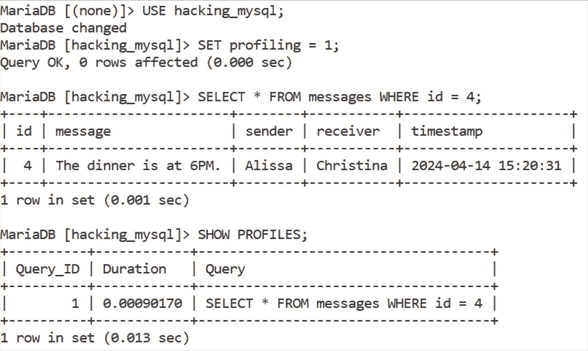

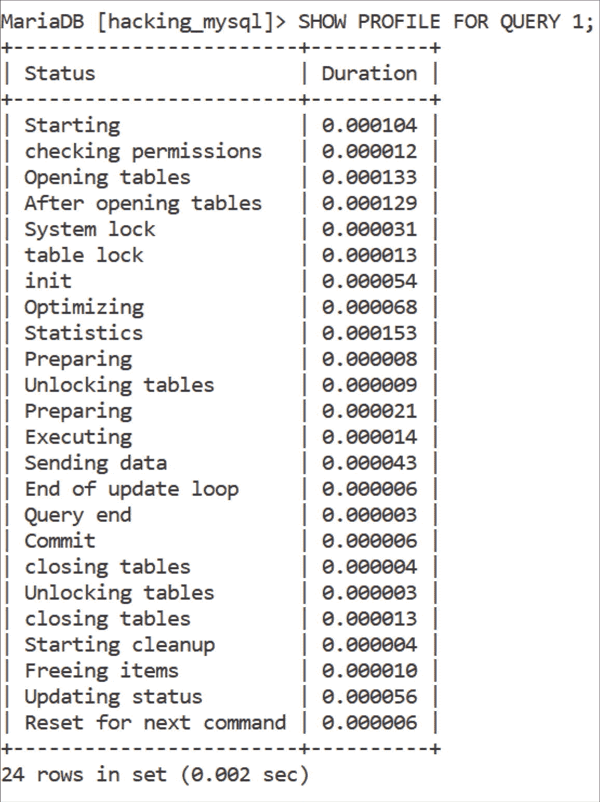

我们有 24 个状态码需要研究——是不是很多？请记住，对于更新版本的 MySQL，结果可能看起来略有不同，并且结果集中会包含更多行，例如 "Executing hook on transaction" 和 "waiting for handler commit"，但以下是它们的含义：

| ID | 状态码 | 解释 |
| --- | --- | --- |
| 1 | `Starting` | 数据库服务器正在初始化查询。 |
| 2 | `checking permissions` | 数据库服务器正在检查我们的用户是否有足够的权限来运行查询。如果没有，我们将收到错误提示。 |
| 3 | `Opening tables` | 数据库服务器确保所有表都已打开，以便对其执行操作。 |
| 4 | `After opening tables` | 数据库服务器在打开表之后正在执行一些杂项操作。 |
| 5 | `System lock` | 数据库服务器正在等待系统锁释放（如果存在的话）。 |
| 6 | `table lock` | 数据库服务器正在等待表锁释放（如果存在的话）。 |
| 7 | `init` | 数据库服务器正在执行初始化过程，例如刷新日志等。 |
| 8 | `Optimizing` | 数据库服务器正在执行内部工作，以确定如何以最佳方式优化查询。 |
| 9 | `Statistics` | 数据库服务器正在计算与统计相关的数据，以制定查询执行计划。 |
| 10 | `Preparing` | 数据库服务器正在准备运行查询。 |
| 11 | `Unlocking tables` | 正在解锁必要的表。 |
| 12 | `Preparing` | 数据库服务器正在准备运行查询。 |
| 13 | `Executing` | 数据库服务器正在执行查询。 |
| 14 | `Sending data` | 我们的数据正被发送到服务器，以便其返回所需的结果。 |
| 15 | `End of update loop` | 数据库服务器在更新数据后到达终点。 |
| 16 | `Query end` | 数据库服务器完成查询执行。 |
| 17 | `Commit` | 正在运行提交操作——数据被保存到数据库中。 |
| 18 (2 个此类值) | `closing tables` | 我们的查询所必需的表正在被关闭。 |
| 19 | `Unlocking tables` | 表正在被解锁。 |
| 20 | `Starting cleanup` | 数据库服务器正在开始清理过程。 |
| 21 | `Freeing items` | 数据库服务器正在释放资源以处理即将到来的查询。 |
| 22 | `Updating status` | 数据库服务器正在更新其状态。 |
| 23 | `Reset for next command` | 数据库服务器正在准备接受后续的查询。 |

看到您的查询为了执行需要完成多少子任务了吗？这些子任务的存在都有其理由——没有一个是多余的。您运行的查询越多，这个列表上的子任务就越多。在本书的优化部分，我将引导您了解如何优化这些子任务——那会在您理解优化的先决条件之后进行。您无法优化没有骨架的东西——而对于您的数据库来说，这个骨架就是您的数据库模式。

### 设计完美的模式设计

问 10 位 DBA 什么是完美的模式设计，您会听到 10 种不同的答案，但他们大多数都会提到规范化、应用高效的约束和索引、数据库实体间的适当关系、最小化磁盘空间使用、使用合适的数据类型等等。归根结底，完美的数据库模式设计对不同的人意味着不同的东西——但无论您的应用程序是什么或您处理什么数据，它都同样重要。要设计出完美的模式设计，请理解以下几点：

*   您的模式设计现在不完美也没关系。
*   您在实施性能相关建议时很可能会犯错，这也没关系。这不是世界末日。
*   经验将是您最好的老师之一。
*   不要过分执着于想出史上最佳的模式设计——简单的解决方案就很好，而且每个模式都可以进一步改进。

明确您希望通过修改数据库模式实现什么目标，并以此为起点。对你们大多数人来说，这个目标将与性能改进或重构相关。

一旦您心中有了目标，请理解模式指的是数据库的结构。您的数据库结构包括其内部的一切——包括数据库表、列类型和大小、属性、各种类型的索引、分区以及其间的所有内容。在 MySQL 领域，数据库本身也可以被称为模式——而模式是您数据的骨架。很可能，当您开始处理它时，这个骨架不会完全笔直，这没关系——您的模式设计并非一成不变，随着数据集的增长和时间的推移，它必然会不断演变。每个模式都可以进一步改进，但基本的建议仍然成立。

首先，您可以通过自己编写所有定义来创建模式，或者让 SQL 客户端或框架为您生成。如果您发现自己在使用 SQL 客户端，很可能会有自动创建模式、像浏览电子表格一样探索表等功能。请利用这些功能，因为 SQL 客户端通常由在该行业至少有十年经验、见证过数据库兴衰存亡的人设计。他们以 SQL 客户端输出形式提供的数据库设计建议，很可能优于您身边开发人员所说的一切。这样的数据库设计建议很可能会防止您原本会犯的错误——而且如果您发现自己使用的是该工具的付费版本，您很可能还能联系专业的 DBA 团队，在一两次咨询电话中获得帮助。我有没有提到，许多此类工具可以生成为此目的专门设计的类似 ERD 的模式？以下是流行论坛内容管理系统 MyBB 的 ERD 模式示例。

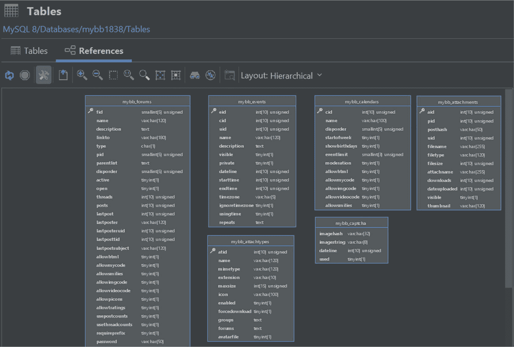

我告诉过您大多数表都被省略显示了吗？您也可以通过拖放表来获得更好的可观察性！

当观察数据库的状况或创建将容纳您最宝贵数据的表时，ERD 模式可以成为一个非常有用的工具。

底线很明确——SQL 客户端可以帮助您创建数据库模式并建议您该做什么、提供模式推荐、告诉您要避免什么，甚至在必要时为您提供建议——但是如果您没有这样的便利条件呢？如果是这样，您就需要自己创建数据库模式。

要设计一个合适的数据库模式，请细致分析数据库背后的软件解决方案的需求——考虑您的项目范围、实体规格以及项目本身的使用场景。草拟一个数据库模式的草图。目前它不必完美。


### 精心设计数据库模式

下一步是要以某种方式可视化您的数据库模式，以便更清晰——这里很多人会建议您找一个 ERD 工具来帮助理清思路，让数据库设计更加连贯。ERD 工具通常在很多 SQL 客户端中默认提供（参见上文示例），但如果您手头没有，您也可以随时搜索免费的替代品：有众多 ER 图工具适用于可视化数据库中的数据，一旦找到，尝试提供您结构的草图，看看整体效果如何。为了优化您的模式，请遵循以下建议：

1.  **选择小数据类型**：每种数据类型在您的数据库中都占据一定的空间，因此考虑选择尽可能小的数据类型。这里，问问自己：您的用例是否真的需要选择`TEXT`而不是`VARCHAR`？如果使用`VARCHAR`，最大值 255 是必要的，还是 45 个字符就够了？您能为数据库分配多少磁盘空间？您有理由相信未来会处理更大的数据集吗？

2.  **选择简单的列类型**：对数字使用数值数据类型（`SMALLINT`有时比`INT`更好），对较小的基于文本的值使用`VARCHAR`，如果有一组有限的可能值，可以考虑使用`ENUM`，等等。

3.  **着眼未来设计您的模式，使其准确反映数据的实际情况**：您需要那个可为空的列是可为空的吗？您需要在该列上设置`DEFAULT`值吗？

遵循这些原则，您将踏上通往性能天堂之路——我将在本书的优化部分详细介绍数据库模式优化，但遵循这些原则将确保您和您的数据库都不会在数据丛林中迷失。

设计高效的模式至关重要，因为高效的数据库模式设计在涉及快速查询和索引效率时，可能是生死攸关的问题。

### 理解数据类型

除了数据库模式（在 MySQL 世界中，模式也是数据库的同义词），还有其他多个因素对数据库性能同样关键。其中之一与数据类型相关，这意味着为数据库实例正确选择数据类型，对您的数据库来说也可能是生死攸关的问题。

MySQL 支持几种不同的数据类型：

1.  **字符串数据类型**：这些 MySQL 数据类型包括`CHAR`和`VARCHAR`、`BINARY`和`VARBINARY`、`BLOB`和`TEXT`，以及最后的`ENUM`和`SET`。

2.  **数值数据类型**：这类数据类型包括整数数据类型（`INT`、`SMALLINT`、`TINYINT`、`MEDIUMINT`、`BIGINT`）、定点数据类型——`DECIMAL`和`NUMERIC`、保存近似值的浮点数据类型：`FLOAT`和`DOUBLE`，以及位值数据类型，如`BIT`。

3.  **日期和时间数据类型**：这类数据类型包括`DATE`、`DATETIME`和`TIMESTAMP`，以及表示`TIME`和`YEAR`的类型。

4.  **空间数据类型**：这类数据类型包括用于保存单个几何值的数据类型，如`GEOMETRY`、`POINT`、`LINESTRING`和`POLYGON`，以及用于保存多个值的数据类型——`MULTIPOINT`、`MULTILINESTRING`、`MULTIPOLYGON`和`GEOMETRYCOLLECTION`。

5.  **JSON 数据类型**：正如其名，这种数据类型适用于保存 JSON 值。

除了支持多种不同的数据类型，所有 MySQL 变体还为其用户提供了定义特定列需要存储多少字符的能力。不同的数据类型具有不同的可存储字符数：

| **数据类型** | **默认字符数或数值数据类型的数值范围** | **最大值、精度或字符数** |
| :--- | :--- | :--- |
| `CHAR, BINARY` | 1 | 255 |
| `VARCHAR, VARBINARY` | 无。必须定义 | 255 |
| `TINYINT` | 4 | 127（有符号）或 255（无符号） |
| `SMALLINT` | 6 | 32767（有符号）或 65535（无符号） |
| `MEDIUMINT` | 9 | 8388607（有符号）或 16777215（无符号） |
| `INT` | 11 | 2147483647（有符号）或 4294967295（无符号） |
| `BIGINT` | 20 | 2⁶³-1（有符号）或 2⁶⁴-1（无符号） |
| `YEAR` | 4 | 2155 |
| `DECIMAL, NUMERIC` | `DECIMAL(10,0)` | 最大精度 – 65 |
| `FLOAT, DOUBLE` | 无法定义 | 无法定义 |
| `BIT` | 1 | 64 |
| `JSON` | 无 | 无固定限制 |

这难道不是一个有趣的数据库吗？一些数据类型有默认的字符数，而一些则没有。

这一切都有充分的理由——MySQL 及其变体为您提供了广泛的数据类型选择，以便您能为特定的用例选择最合适的数据类型。在仔细考虑后选择数据类型：

*   **您将要存储的值的种类**：考虑您正在处理的数据——什么数据进入什么列？数据将如何被访问？

*   **该数据类型所需的磁盘空间量**：一些数据类型比其他类型占用更多磁盘空间，这是为什么您会看到像`TINYINT`、`SMALLINT`、`TINYTEXT`、`SMALLTEXT`这类数据类型的主要原因之一。

*   **您是否可以对该列进行索引**：如果您要索引`TEXT`值，请记住您必须指定索引长度或使用全文索引，但与此同时，您将能够存储比基于`VARCHAR`的列更多的数据。

其他一些需要您考虑的事项包括用于存储数据的行格式（基于 InnoDB 的表的默认行格式是`DYNAMIC`），但大致如此。

除了“普通”数据类型，MySQL 还为您提供了使用`ENUM`或`SET`数据类型向列“指定”值的能力。`ENUM`数据类型考虑一组可能的值，如下所示：

```
`months_choose` ENUM('March', 'April', 'May',...);
```

`SET`数据类型也允许您指定有效值，如下所示：

```
`availability_days` SET('Mon', 'Wed', 'Fri',...);
```

这两种数据类型的区别在于，在`ENUM`中，用户只能使用一个感兴趣的值，而在`SET`中，逻辑相同，但用户可以选择多个感兴趣的值。一个`ENUM`列最多可包含 65,535 个元素，一个`SET`列最多可包含 64 个不同的值。

MySQL 还能够使用`JSON`数据类型存储 JSON 值，这些值被解释并存储为二进制值以加快执行速度。

仔细选择您的数据类型——没有一个是板上钉钉的，但一个好的数据类型无论现在还是将来都会为您的数据库创造奇迹。然而，数据集只是方程式的一部分。

### 理解字符集和校对规则

数据类型，无论多么好，也只是您模式方程式中的单一组成部分。无论您选择使用何种数据类型，您都需要在其中存储数据。数据——无论它可能是什么——可能有不同的解释。想想不同的国家——在美国说英语，在西班牙说西班牙语。在芬兰说芬兰语，在瑞典说瑞典语，在土耳其说土耳其语。现在访问中国，我敢打赌您用上述任何一种语言都不会有太多成功的交流，因为他们说汉语！

面对如此多样化的世界，您的数据库也需要进化。嗯，不完全一样——您不需要制定革命计划来处理来自这些国家的数据——但您需要了解字符集和校对规则。


还记得你向 MySQL 的列中插入外语数据时，每个字符都被解释为“？”符号的那次经历吗？那是因为它无法理解数据所使用的**字符集**。字符集（Charsets）是字符集合（character sets）的简称——而排序规则（collations）是它们的伙伴。

字符集定义了列中可以接受哪些字符集合，排序规则则指代一系列规则，用于定义如何对你提供给列的数据进行排序。它们共同施展了某种魔法，使得字符能够正确显示，而不是让你看到 ??? 符号。要探索 MySQL、MariaDB 或 Percona Server 中可用的字符集和排序规则，请通过 CLI 登录到你的数据库，然后执行查询 `SHOW CHARACTER SET`——无论你使用的是哪种数据库（你甚至不需要先选择一个数据库——该查询在任何情况下都以相同方式工作），你现在应该能看到所有可用的字符集和排序规则，如下所示。

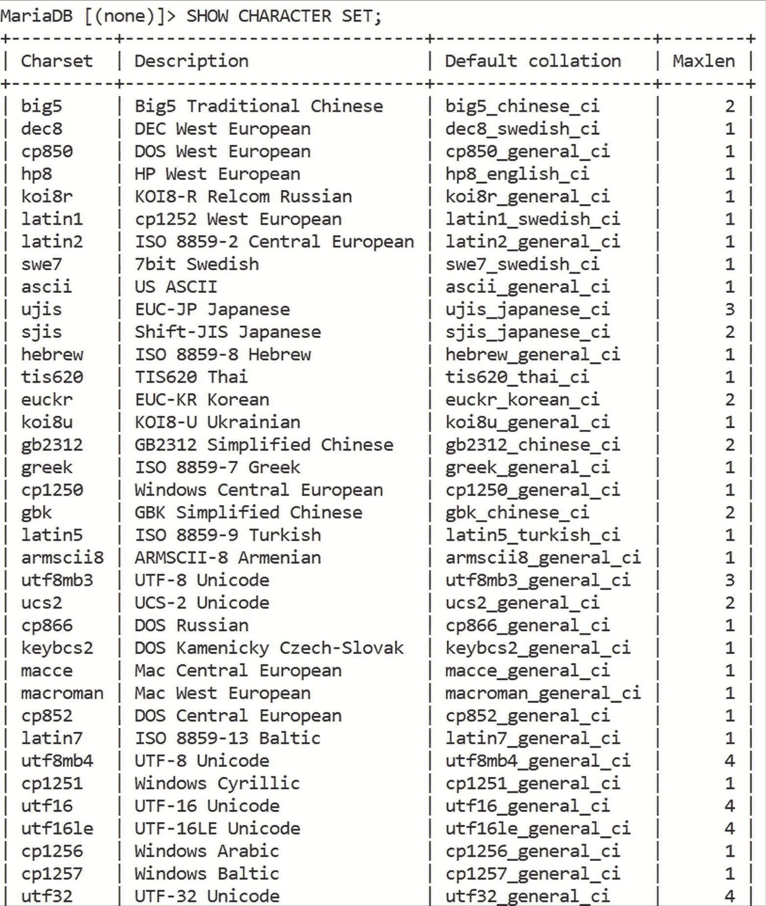

图 4-5

MariaDB 中的字符集和排序规则

四列中有这么多选项！然而，当你深入探究时，一切都会变得如水般清晰：

1.  `Charset` 指的是你可以选择的字符集。
2.  `Description` 通过提供该字符集的简短描述，帮助你了解其可能的适用场景。
3.  `Default collation` 描述了该特定字符集的默认排序机制。
4.  `Maxlen` 指的是你的数据库服务器使用该特定排序规则存储一个字符所需的字节数上限。

你可以将 `SHOW CHARACTER SET` 视作文档的伴侣——在文档的丛林中很容易迷失方向，你们中的一些人甚至可能没有时间阅读关于每一个特定字符集和排序规则的所有内容。这就是 `SHOW CHARACTER SET` 的用武之地！运行这个查询，扫一眼输出，道路应该就会变得清晰。如果仍然不清楚，请查阅文档，但你需要了解的大部分内容都在其中进行了解释。

你们大多数人可能需要搭配使用 `utf8mb4` 字符集以及 `utf8mb4_general_ci` 或 `utf8mb4_unicode_ci` 排序规则，或类似的组合，但请注意 MySQL 确实有几个“陷阱”。例如，MySQL 的 UTF-8 并非真正的 UTF-8：真正的 UTF-8 需要支持每个字符最多 4 个字节，而 MySQL 中的 UTF-8 仅支持 3 个。因此引入了 `utf8mb4`：如今你在 MySQL 安装中看到 `utf8mb4` 而不是 `utf8` 的主要原因是，`utf8mb4` 提供完整的 Unicode 支持，这意味着用户可以放心地使用表情符号和其他字符。Unicode 支持还意味着，当你尝试存储某些字符时，它们不会导致 MySQL 报错并提示 `"Incorrect string value: '\x77\xD0' for column 'demo_column' at row 1"`。

不过，`utf8mb4` 可能并非所有人的首选，因为每个用例都不同——然而，无论你打算使用什么字符集和排序规则，请记住它们并非火箭科学；记住它们的主要目的是使各种语言的数据可读，这样你就应该能够顺利进行！

### 理解索引

当你理解了字符集和排序规则后，接下来不可避免地会进入你视野的，将是关于查询性能的普遍问题。至此，你可能对查询类型、破坏它们的因素以及导致它们变慢的原因有了一定的了解。你也知道了如何设计完美的模式（Schema），并且我也带你了解了各种字符集和排序规则以实现模式的完美，但如果你对这些感兴趣，你也会对索引感兴趣。

你们大多数人可能已经以某种形式使用了索引，并且知道它们是什么。对于那些不了解的人，可以把数据库中的索引想象成书中的索引——它们帮助你的数据库快速找到那些如果没有索引就需要花费一些时间才能找到的东西。你的数据越多，索引就越重要。

它们变得重要是因为其主要目的是帮助你的数据库快速查找并返回行，但即便如此，索引也并非没有缺陷和问题——它们会减慢在你的数据库基础设施中插入、更新或删除数据的查询速度。

无论你使用哪种 MySQL 分支——MySQL Server、MariaDB Server 还是 Percona Server，在索引方面你总是有选项可以选择。如果我说“所有索引都一样”、“所有索引都帮助你的数据库”或者“索引这个列，你就再也不用担心查询性能了”，那我就是在对你说谎——事实并非如此，因为索引并非万能良药——然而，它们极其擅长它们最初设计的两个主要任务：占用存储空间和加速 `SELECT` 查询。

还记得我之前告诉你的吗？查询是由其他任务组成的任务？没错——索引帮助你的数据库轻松处理其中一些任务，虽然所有索引都有其用途，但并非所有索引都相同：

*   MySQL 中典型的索引是 B-Tree 索引：当我们使用精确匹配运算符搜索值时，将会用到这种索引。
*   降序索引将按降序存储所有行：对于执行计算操作或某种数据分析的人来说，这种索引可能是必需的。
*   唯一索引确保列中的所有值都是唯一的：换句话说，这种索引确保列内没有重复项。如果发现重复值，MySQL 将会报错（可以通过指定 `IGNORE` 子句来防止此错误，但我这里不会深入探讨所有细节——我们将会有一章专门讨论索引）。

我还想指出，`PRIMARY KEY`（主键）也是一种索引——这种索引唯一地标识表中的行，并且经常与 `AUTO_INCREMENT` 子句一起使用，以便在插入新行后自动递增列 ID 值。如果在某个列上设置了主键索引，那么在 MySQL 计算表中的行数后，插入到该列的 `NULL` 值将表现为一个行 ID（例如，如果表中有 1,499 行，我们在一个具有主键的列中插入一行 `NULL` 值，那么该 `NULL` 值将变为 1,500）。

理解索引对于任何性能操作都至关重要——请记住，没有任何一种 MySQL 分支会阻止你在同一列上使用多个索引，也不会显示类似“如果你索引此列，你的索引将不会被使用——你应该索引另一列”这样的消息。当然，存在一些限制和技巧，你可以用来充分利用你的特定 DBMS 中已有的索引；然而，要充分利用它们，你首先需要确保你的索引正在被使用。这是困扰许多数据库的问题，而它们的主人却没有意识到——“我已经索引了这个列，为什么查询仍然很慢？！”嗯，这很可能是因为该索引甚至没有被你的数据库使用或考虑过。

我是怎么知道的呢？很简单——选择一个带有已索引列的查询，并对其运行一个 `EXPLAIN` 操作。你会看到两列——`possible_keys` 和 `key`——如果这些列中的任何一列的值不是你希望此查询使用的索引名称，那么你就遇到问题了。为什么？因为键（key）是索引（index）的同义词：键可以为你的查询打开性能天堂之门，但必须以正确的方式使用它们才能做到这一点。


对于许多开发者而言，关于索引的主要问题并非它们不存在——而是它们虽然存在，却未被你的查询所使用！这是怎么发生的？原因很简单：

1.  你没有使用相等运算符进行精确匹配搜索。
2.  你在查询开头使用了通配符进行通配符搜索（还记得我说过`LIKE`查询开头的通配符会导致无法使用任何索引吗？）。
3.  如果你的列有多个可能的索引，查询使用的不是最具选择性的那个（即它没有找到最少数量的行）。
4.  如果你的列有一个跨多列的索引（复合索引），你的查询没有使用该索引的最左前缀。

这四点中的一个或多个，可能就是你的查询在列上已有索引的情况下仍然性能不佳的核心原因——正如并非所有开发者都很优秀，如果某些条件不满足，也并非所有查询都会使用你的索引。

我将在后面专门讲解索引的章节中带你了解更多的相关知识，但请先理解这四点，你就能具备消除索引问题的充分能力。

### 理解分区

除了索引，还有什么能提升查询性能？没错——分区！

分区在某种程度上与索引相似，它们都能最小化数据库在查找任何行时必须筛选的数据量。正如索引有多种类型，分区也有多种类型——可以选择按`RANGE`、`LIST`、`COLUMNS`、`HASH`或`KEY`进行分区，或者对表进行子分区。

分区有一个有趣的功能——它们同样会占用你的磁盘空间，以换取更快的`SELECT`查询。不过，这并非它们的唯一目的——存在于分区中的数据可以通过删除该分区来清除，而这不会对表整体产生删除影响，因为 MySQL 将分区本身视为“迷你表”。换句话说，分区是将一个较大的东西分割成更小部分的实践。

这些部分以文件的形式存储在磁盘上——我们称这些文件为分区。一旦分区为你的表提供支持，MySQL 会在以任何方式选择或更新数据时选择一个分区函数。有多种方式可以对表进行分区：

1.  **按`RANGE`分区**：这种分区方法将表分区的方式是，每个分区包含落在给定范围内的值。
2.  **按`LIST`分区**：MySQL 中的这种分区类型与按`RANGE`分区类似，只是按`LIST`分区使用一个不同整数值的列表来定义数据如何被拆分到分区中。如果某个值没有对应的分区，将返回错误。
3.  **按`COLUMNS`分区**：这种分区类型允许你使用多个列作为分区键。
4.  **按`HASH`分区**：这种分区类型将一列作为分区键。除了该列，还必须定义必要的分区数量。`HASH`分区将数据均匀地分布在所有分区上，并使用一个哈希函数。
5.  **按`KEY`分区**：这种分区类型与按`HASH`分区相似。它也将一列作为分区键，但不使用列作为键或哈希函数，而是利用 MySQL 内部的一个函数。

MySQL 中的分区类型相当容易理解——此外还有子分区，这意味着用户可以选择在分区内再进行分区，但 MySQL 只允许在已经使用`RANGE`或`LIST`分区时使用子分区，并且子分区只允许使用两种分区类型：我们的子分区必须是`HASH`或`KEY`类型。

可以在创建表结构后开始使用分区，如下所示——这里我们定义按范围分区：

```sql
CREATE TABLE `demo_table` (
`id` INT AUTO_INCREMENT PRIMARY KEY,
`username` VARCHAR(122) DEFAULT ''
) PARTITION BY RANGE(id) (
PARTITION `p0_title` VALUES LESS THAN (10),
PARTITION `p1_title` VALUES LESS THAN (15),
PARTITION `p2_title` VALUES LESS THAN (20),
...
);
```

子分区可以像这样定义：

```sql
CREATE TABLE `demo_table` (
`id` INT,
`regdate` DATETIME
) PARTITION BY RANGE(YEAR(regdate))
SUBPARTITION BY HASH(TO_DAYS(regdate)) (
PARTITION part_0 VALUES LESS THAN (2015) (
SUBPARTITION sub_0,
SUBPARTITION sub_1
),
PARTITION part_1 VALUES LESS THAN (2020) (
SUBPARTITION sub_2,
SUBPARTITION sub_3
),
PARTITION part_2 VALUES LESS THAN MAXVALUE (
SUBPARTITION sub_4,
SUBPARTITION sub_5
)
);
```

请记住，在`RANGE`分区中定义`VALUES LESS THAN`时，分区的值必须是递增的。如果你的第一个分区指定小于 2015 的值，其他分区都不能指定更低的值，因为对于`RANGE`分区，值必须严格递增以避免此错误：

```sql
#1493 – VALUES LESS THAN value must be strictly increasing for each partition
```

每种分区类型都不同，我已在上面解释了它们的核心区别——你将使用的具体分区类型将直接取决于你的用例和需求。

然而，无论你选择使用何种分区类型，都必须了解所有 MySQL 分区用户都可能遇到的关键错误。不了解这些问题可能会让你对 MySQL 分区的体验变得糟糕。

#### 分区与大数据

你首先应该意识到的是，分区不会无缘无故地被使用。对许多人来说，原因很明确——分区将数据拆分成更小的表，而数据库的 SQL 层仍然将它们视为一个表。数据库中分区的这种功能意味着，分区是构建大数据应用程序（如搜索引擎）的人们频繁使用的朋友。[数据泄露搜索引擎](https://breachdirectory.com)就是一个完美的例子——这类搜索引擎的目的是提供一种快速、无麻烦的方式，通过允许用户筛选大量已公开的数据泄露，来检查他们的身份是否面临风险。其目的是教育人们应更频繁地更改密码，并提高对过去发生的数据泄露事件的认识，以避免成为身份盗窃的受害者。由于数据泄露如此猖獗，且数据泄露搜索引擎任务如此艰巨，分区扮演着重要角色。

根据个人经验，我可以告诉你，为了为我自己的数据泄露搜索引擎获得“良好”的查询性能（我们指的是完成所有相关 SQL 查询的时间在 0.1 秒或以下），我不得不将每个数据泄露按英文字母表分成 27 个部分（26 个分区对应每个字母，第 27 个使用`MAXVALUE`功能处理其余所有内容），并在被搜索的列上添加索引——这导致表在磁盘上占用的空间显著增加（即使所有数据已完全解析并设置好用于搜索，我也必须使用 8TB 的硬盘驱动器），但也确保了即使在服务器压力下，查询速度也极快。

这就是分区世界的真相——你不太可能每个项目都需要分区，但当你需要时，它对你的硬盘不会太友好。计算你的分区将在磁盘上占用的空间与计算将要插入其中的值同样至关重要。

#### NULL 值处理与分区修剪


### 在 MySQL 中优化查询时应避免的事项

就值而言，在使用 MySQL 时，要特别警惕分区中的 `NULL` 值。MySQL 分区的构建方式使得，如果你向按 `RANGE` 分区的表中插入 `NULL` 值，这些值将存储在可能的最低分区中。MySQL 也将 `NULL` 值视为比普通值“权重更低”。

我再告诉你一个秘密——除了将数据拆分到 MySQL 仍视为一个表的单独表中外，分区还有一个极其有益的用途，那就是数据的**修剪**。还记得我说过“*每个分区在磁盘上都表示为一个具有特定权重的文件*”吗？反过来也是如此——如果你删除那个分区，文件将被删除，你的数据在磁盘上占用的空间也会减少。分区也可以被**截断**。噗——没了。再想想搜索引擎——假设你的表像这样按范围分区（对于那些在值从 A 到 Z 的大数据集中进行搜索的人来说，这种分区方式可能很有益——*被分区的值也可以是字符串*）：

```sql
CREATE TABLE `demo` (
`structure` VARCHAR(115) NOT NULL DEFAULT '',
`nicely` VARCHAR(60) DEFAULT NULL,
`please` VARCHAR(70) DEFAULT '',
`define_partitions_too` VARCHAR(90) NOT NULL
) ENGINE = InnoDB COLLATE utf8mb4_unicode_ci
PARTITION BY RANGE COLUMNS(define_partitions_too)
(
PARTITION partition_a VALUES LESS THAN ('a'),
PARTITION partition_b VALUES LESS THAN ('b'),
PARTITION partition_c VALUES LESS THAN ('c'),
...
PARTITION partition_max VALUES LESS THAN (MAXVALUE)
);
```

为了这个示例，我将创建两个表——一个带分区，一个不带，但两个表的结构完全相同。

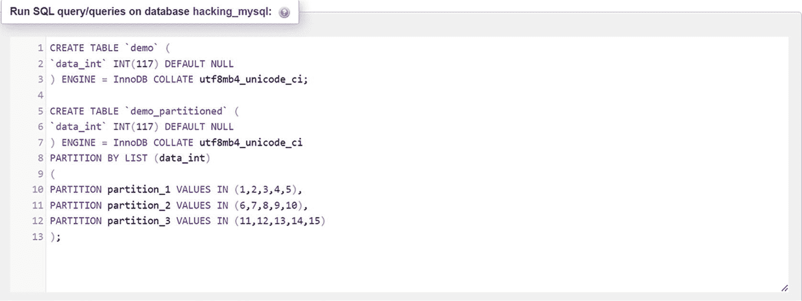

*图 4-6：带分区和不带分区的表*

这些查询执行后，我们将得到两个表。

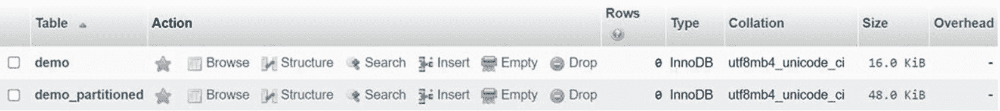

*图 4-7：带分区和不带分区的表大小不同*

如果你还看不出来，那么带分区的表会比不带分区的表更大，而且你拥有的分区越多，这个差异就会变得越大。无论如何，回到我们开始的地方。分区是可以被修剪的。

我现在已经向两个表中填充了记录。

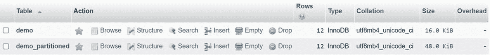

*图 4-8：两条带有记录的 InnoDB 表*

我现在将展示删除分区如何影响你的数据库：

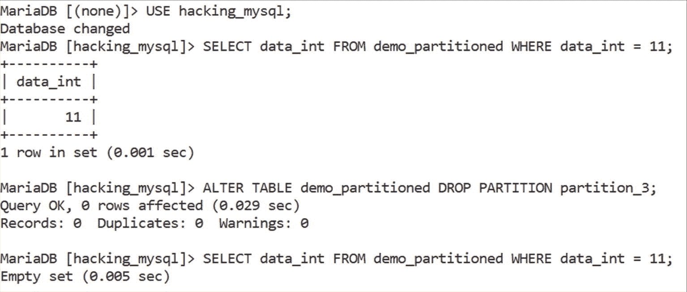

*图 4-9：在 MariaDB 中删除一个分区*

这里的要点很简单——我们的行驻留在第三个分区中（见表结构），一旦我们删除了第三个分区，那行数据就不再存在了。我们修剪了数据——哇呼！

酷——现在你也对分区有所了解了。既然你知道了什么会破坏你的查询，你也应该意识到在优化它们时应避免的事项——我将在本书的“优化”部分带你了解你需要知道的内容，但在游泳前先用脚试试水总没有坏处。

*避免重复不良实践*——随着学习的深入，你会了解到一系列糟糕的数据库实践。它们几乎出现在每个 SQL 博客上；在会议、研讨会、技术交流会等场合被提及。它们无处不在——几乎每个供应商都会有一两篇关于你不应在现在或将来重复的不良实践的博客。在数据库世界中，这些包括：除非必要，否则应避免选择所有列（使用 `SELECT column` 而不是 `SELECT *`）；应避免在 `LIKE` 中使用前导通配符；谨慎在大型数据集上使用 `ORDER BY`（使用 `LIMIT` 限制）；避免对大型数据集或整个 `InnoDB` 表使用 `COUNT(*)`（`MyISAM` 是此规则的例外，因为它内部存储了行数——而 `InnoDB` 没有）；避免在大型数据集上使用 `DISTINCT`（在 Unix 上查看 `sort -u file.txt` 命令——更多内容将在优化部分介绍）；并记住 MySQL 不会阻止你在同一列上放置多种类型的索引。

*避免把事情复杂化*——SQL 基于标准。ACID 已经存在了几十年，并且不太可能很快消失。你将会使用到的几乎所有 SQL 查询也是如此，备份、安全等方面也是如此。事物会变——但基本的东西保持不变。当你可以采用经过数百次尝试和测试的建议时，为什么要重新发明轮子来实现一个目标？

*避免过度优化你的数据库*。说真的——有太多的人建议你这样优化数据库，那样优化数据库，不要使用那个，等等，你可以相当肯定，随着时间的推移，给你建议的人会越来越多。并非所有这些建议都是可信的——请记住，即使是 MySQL 有时也会犯错（如果你想看证据，请看[这里成千上万个 MySQL 漏洞](https://bugs.mysql.com/)），所以在接受任何建议之前，确保你从可信的来源获得它。一旦你收到了你认为解决问题所必需的建议，请务必按所示应用它（否则，你可能会遇到进一步的问题），先在本地环境中运行代码以确保其运行无误，并且在此过程中不会损坏生产数据，同时也要相信你之前的经验。如果上次在某个列上添加索引解决了某个性能相关的问题，现在也试试。看看是否有效。

*始终将你收到的建议与文档的最新版本进行比较*——尽管在某些情况下文档可能会误导你（如下例），但在大多数情况下，它是由在该领域拥有数十年经验、与最初构建产品的人有密切联系的称职人员编写的。要信任，但要核实。

#### 不要盲目信任文档

文档非常棒——它们帮助我们更好地理解产品；这一点毋庸置疑。这正是它们应该做的！当你寻求任何有关查询性能的建议时，你会听到的一件事是，你应该阅读相关产品的文档。这个建议本身并不坏——毕竟，文档应该由构建该产品的公司员工编写，对吧？

情况并非总是如此：[我希望你和我一起深入研究一个关于 InnoDB 并发性的古老例子](https://dba.stackexchange.com/questions/2918/about-single-threaded-versus-multithreaded-databases-performance/2948%25232948)。这种情况发生在十多年前，但仍然足以说明并非所有被记录的内容在任何时候都是 100% 正确的——情况如下：

1.  一个人，为了简单起见，我们称他为 X 先生，在 StackOverflow 上问了一个问题：多线程数据库何时比单线程数据库更有用？


2.  多人加入了帮助行列。其中大部分人提供了可信且值得注意的建议，指出通常性能瓶颈在于磁盘，大多数数据库会创建临时表来处理数据等。

3.  最后，有一个人提到了 InnoDB 中的多线程能力（记住，InnoDB 是 MySQL 及其同类产品提供的主要存储引擎），他说 InnoDB 的线程并发性可以通过调整 MySQL 中的`innodb_thread_concurrency`变量来设置。

4.  此时，有些人可能会查阅关于 InnoDB 线程并发的文档，文档当时大致是这样说的：“将线程并发设置为 5，以将 InnoDB 内可打开的并发线程数上限设置为 5”等等。[但在另一个关于 InnoDB 的回答中](https://dba.stackexchange.com/questions/5666/possible-to-make-mysql-use-more-than-one-core)，同一个人指出，尽管文档如此说，2011 年在纽约举行的 Percona LIVE 会议上，一位 MySQL 专家表示，无论文档怎么说，最好将`innodb_thread_concurrency`变量保持在其默认值 0，这样 InnoDB 可以决定为 MySQL 数据库设置打开最优数量的`innodb_concurrency_tickets`。他随后还说，如果你将`innodb_read_io_threads`和`innodb_write_io_threads`都设置为其最大值 64，你应该能够使用更多的核心（假设你运行合理数量的核心——如果你运行 16 核机器，你可能想避免这个建议）。

明白我的意思了吗？文档是人写的——人会犯错。这些错误可能代价高昂！

所以，总结一下，要避免：

1.  重复不良实践。
2.  把事情过度复杂化。
3.  过度优化你的数据库（只优化你理解的东西，并确保你知道那个东西是如何工作的）。
4.  始终将你收到的建议与最新版本的文档进行比较。

最重要的是，听取来自可靠来源的建议，先在本地环境中运行代码，并相信你过去的经验——从你犯过的错误中学习，为你的应用程序和数据库创造一个更好、更繁荣的未来。

### 总结

在本章中，我带你了解了破坏查询的因素。你现在明白了是什么让查询变慢，以及如何着手为你的数据库构建完美的模式。你也理解了数据类型、字符集和排序规则是如何工作的。我带你了解了索引和分区，揭开了一些围绕分区、`NULL`值和剪枝的秘密，并带你了解了在优化 MySQL 查询时要避免的一些事情。

我这样做是带着一个目标。本章帮助你理解是什么让你的查询出错，随着你的阅读和学习，这种理解将变得越来越重要。

理解如何在你的数据库基础设施中破坏查询至关重要，因为它也能增强你对如何优化和保障数据库安全的理解。我们还没有完成“破坏”的工作。在优化查询和相关基础设施之前，我们必须理解查询组件和你的服务器。我们现在就来做这件事。

## 5. 理解查询组件

既然你已经了解了哪些因素会破坏查询，是时候理解它们的组成部分——查询内部的任务了。这里我们回到我在本书中已经提到过几十次的东西——*查询是由其他任务组成的任务*。为了确保这些任务能够成功执行，我们必须理解它们的组成部分。听起来足够简单，但如果真有那么简单，抱怨查询性能的人就会少得多，对吧？这就是为什么理解查询组件如此关键——对查询内部结构的正确理解可以成就或毁掉你的数据库实例。

### SQL 查询与存储过程

从表面上看，SQL 查询看起来简单且不复杂。但在底层，它们绝非儿戏——它们由许多小任务组成，所有这些任务都需要协同工作，你的数据库才能达到完美。翻回上一章，读一读“为什么查询会慢？”这个标题，你很快就会明白我的意思——有这么多任务要完成，可以合理地假设，读取更大数据集的查询会比那些没有那么多数据要筛选的查询花费更多时间。每种查询完成不同的任务（查询插入、选择、更新或删除数据），但在底层，它们的工作方式都相似。

正如我在上一章已经提到的，MySQL 中有多种类型的查询——包括 DML（数据操作语言）查询、DDL（数据定义语言）查询，以及 DCL（数据控制语言）和 TCL（事务控制语言）查询。这些查询大多工作方式相似——它们在返回任何结果之前会执行大约 20 个子任务。这些查询通常是捆绑在一起的，意思是，一旦你应用程序的用户对表单或类似的东西进行操作，一个 SQL 查询就会在后台执行。更精明的开发人员甚至可能意识到存储过程可以帮助他们成功！

为了理解查询组件对你的 SQL 查询为何如此关键，我希望你以存储过程为例来看一看。在 MySQL 中，存储过程是使用`CALL`语句实现的——该语句调用（调用）一个必须使用`CREATE PROCEDURE`创建的存储过程。MySQL 中的过程是一组存储在数据库中（因此服务器知道）并在使用`CALL procedure`或`CALL procedure()`调用时执行的 SQL 查询。

过程可以有两个参数——一个`IN`参数和一个`OUT`参数。用户可以将值传递到`IN`参数定义的列中，而`OUT`参数定义的列将过程中的值传回给用户。可以像这样定义过程。

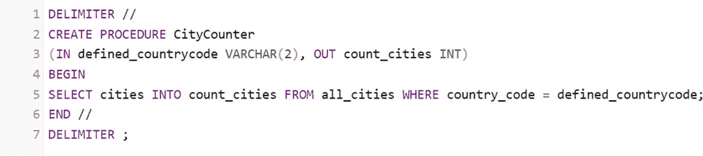

图 5-1

在 MariaDB 中定义过程

在这里，我们将分隔符更改为“`//`”，以防止 MariaDB 将我们查询的结尾解释为过程的结尾，然后定义了过程并告诉它将其结果放入一个名为`count_cities`的变量中。可以按以下方式使用存储过程。

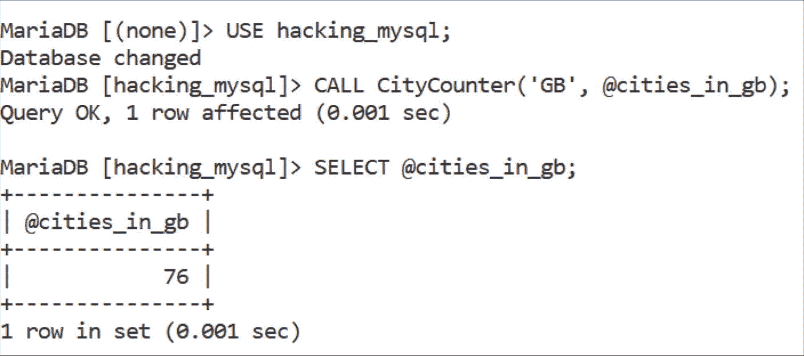

图 5-2

在 MariaDB 中调用过程

我们得到了英国城市的数量！很好。

*存储过程的组成部分是其中的语句，这意味着存储过程的速度取决于这些语句的速度。*

如你所见，MariaDB 中的过程使用起来相当简单——并且由于过程由你的 MySQL 实例“记住”的查询组成，这些过程的性能也将直接依赖于那些查询的性能。

查询性能直接依赖于你的数据库执行查询组件的速度——记住，有 20 多个这样的组件。这些组件依赖于查询执行计划，而查询执行计划又依赖于解析器和优化器。

### 解析器与优化器

在内部，每个 SQL 查询都被转换成一个执行计划。在生成执行计划之前，MySQL 在解析器阶段检查 SQL 查询的语法和语法是否正确——它通过逐个检查查询中的所有字符、根据规则进行匹配来检查错误，如果一切正常，则将查询转交给优化器。

为了让你想象解析器在数据库中如何工作，拿任意一个查询并将其拆分成片段。如果你想看个例子，请看这个：

```sql
SELECT sender,COUNT(*) FROM messages WHERE message LIKE '%What time%';
```

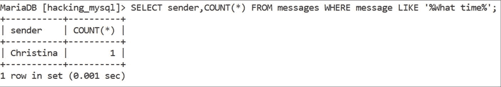

图 5-3

MariaDB 中的 SQL 查询


#### MySQL 查询解析与优化

对于一个 SQL 查询，解析器会解释所有内容。是的，每一个单词和字符！这些单词和字符如下所示：

1.  `SELECT`
2.  `sender`
3.  `,`
4.  `COUNT`
5.  `(`
6.  `*`
7.  `)`
8.  `FROM`
9.  `messages`
10. `WHERE`
11. `message`
12. `LIKE`
13. `'`
14. `%`
15. `What time`
16. `%`
17. `'`
18. `;`

发现规律了吗？查询解析器必须将任何 SQL 查询，无论多么简单或复杂，拆分成多个片段并逐一评估。在它从 MySQL 获得“OK”信号后，它就会转向查询优化器。

MySQL 中的查询优化器试图预测哪些查询执行计划执行得最快，并为 MySQL 选择可用的最佳选项。在这个场景中，我希望您从“成本”的角度来思考一切——MySQL 甚至有一个名为`Last_query_cost`的变量。

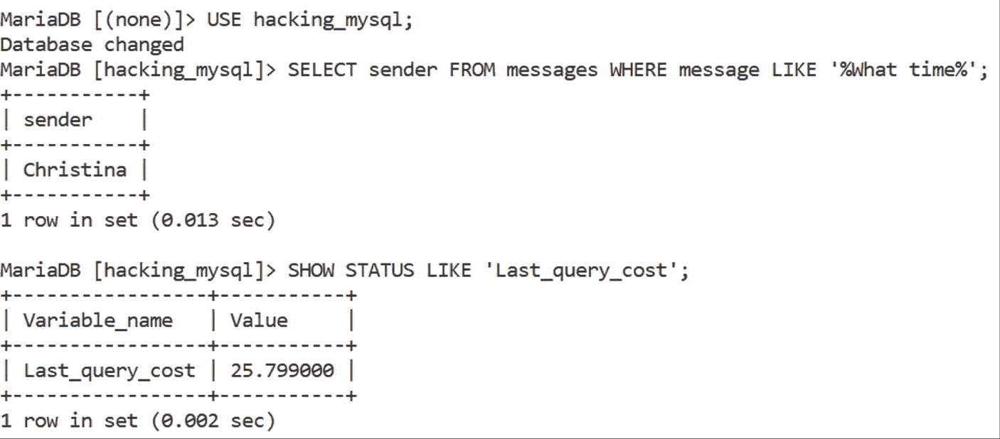

图 5-4

MariaDB 中的`Last_query_cost`

变量`Last_query_cost`显示了查询优化器中**上一次编译查询的“成本”**。该变量的作用域是会话，其默认值 0 表示在当前会话中尚未运行任何查询。变量中的值即为查询的“成本”。成本会被分配给不同的可能性，并且基于 MySQL 内部的“思考”方式，这意味着它不太可能为您执行的最后一个查询提供极其有用的反馈，但它将作为一个有用的测量变量。请记住，根据 MySQL 文档，如果您在 MySQL 8.0.16 之前的版本中使用此变量，除了简单的`SELECT`之外，运行任何查询都很难得到结果，但这并不能否定它的有用性。有人说这个值甚至与实际执行查询的成本不匹配，而是在实际值的“轨道附近”飞行。尽管如此，就解析器和优化器而言，这个变量肯定是您应该谨慎对待的东西。MySQL 还有一个类似的变量——`Last_query_partial_plans`——它显示了查询优化器在为您刚刚运行的查询准备计划时所进行的*迭代*次数。

*查询优化器*的作用正如其名，且不难量化：它的任务是找到执行查询的最佳方法。优化器提炼查询的复杂部分，评估不同的查询执行计划，并确定执行给定 SQL 语句的最佳方式。查询优化器将决定，除其他事项外：

*   **访问数据的最佳方式是什么？** 确定数据访问方式是优化器的任务——您的数据是通过表扫描还是索引扫描访问？询问查询优化器吧！
*   **如何利用索引或分区的能力？** 由优化器决定是否使用索引来定位相关行，如果使用，使用哪个索引以及何时使用。优化器就是为什么当您在查询前添加`EXPLAIN`子句时，会看到`possible_keys`、`key`和`key_len`列的原因。如果优化器认为全表扫描是更好的选择，它也可以决定完全忽略索引。
*   **如果存在`JOIN`查询，执行它们的最佳顺序是什么？** 决定执行`JOIN`查询的最有效顺序是优化器的任务。这可能归结为从操作中“删除”未被连接使用的表，等等。
*   **如何使用`GROUP BY`和`ORDER BY`？** 查询优化器必须决定是否为`GROUP BY`和`ORDER BY`操作使用索引。
*   **如何处理子查询？** 如果您碰巧在 SQL 查询中执行任何子查询，您也是在要求优化器以数据库可以理解的方式简化它们，并确定它们的结果是否可以被缓存。

换句话说，查询优化器将决定优化查询的最佳方法，以使其执行得尽可能快。优化器的任务是帮助您的数据库找到一种高性能执行查询的方式。它之所以被称为优化器，是因为它比解析器承担着更大的任务——解析器检查语法，而优化器不仅需要交付结果，还需要尽可能快地完成。

在 MySQL 中，可以通过深入探究`EXPLAIN`来了解优化器——`EXPLAIN`子句向您显示优化器的查询计划部分，以便您更好地理解数据库执行某些操作的原因。如果您是一名开发人员，`EXPLAIN`无论如何都应该是您词汇的一部分，所以我稍后会深入探讨`EXPLAIN`的功能：正确理解`EXPLAIN`的作用对于区分影响查询成败的因素是必要的。您还应该记住，这不是理解查询组件的唯一工具，因为在 MySQL 上市期间，包括 Percona、MariaDB 等在内的许多公司都试图生成查询性能指标，但由于查询组件本质上是我们之前讨论过的较小任务，它们也能揭示很多秘密，即使您无法访问专业人士开发的工具，也可以深入研究它们。对于面临问题的许多人来说，一个很好的起点是理解 MySQL 在运行某些查询后显示的错误信息所传达的内部含义。

### 查询与错误消息

您知道那种点击一个按钮后您的应用程序返回“MySQL Error #XXXX”的感觉吗？是的。那就是您的数据库在说您的代码搞砸了。

没有人喜欢在运行 SQL 查询后看到错误消息。这是肯定的——同样肯定的是，错误消息的存在是为了帮助我们；它们不是 MySQL 想出的用来危害您数据库的邪恶阴谋，而是为了告诉我们为什么我们做出的特定决定是错误的，并帮助我们改进它。是的，它们可能看起来很吓人——有时也确实如此——但它们并不是世界末日。

MySQL 中的错误遵循特定的格式。每个 MySQL 错误都附带：

*   **错误编号**：每个错误都有一个特定的对应编号。
*   **错误消息**：每个错误都附带一个特定的错误消息，详细说明您做了什么以及为什么您刚刚采取的操作出错。
*   **以`SQLSTATE`值形式表示的错误条件**：`SQLSTATE`值是一个五字符字符串，定义了错误显示后所达到的 SQL 状态。

以下是错误的样子。

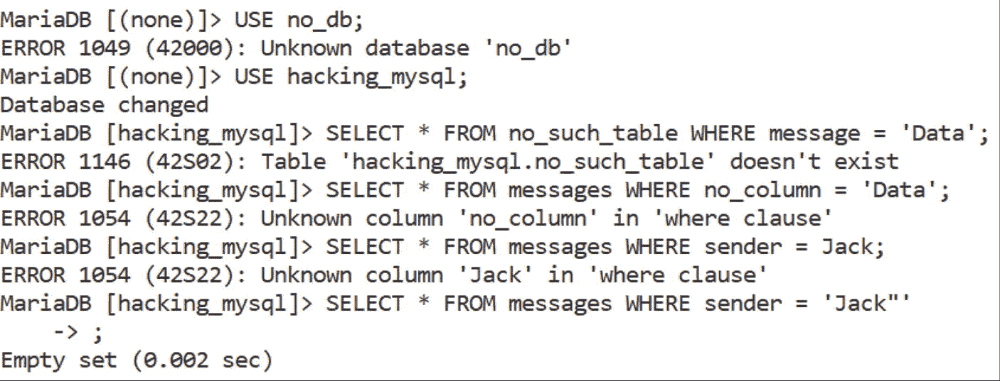

图 5-5

MariaDB 中的错误

看到我们有多少错误了吗？“Unknown database”、“Table doesn’t exist”、“Unknown column in where clause....”。下面，您还将找到黑客在探测 SQL 注入漏洞时寻找的“圣杯”。

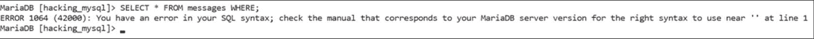

图 5-6

MariaDB 语法错误

“You have an error in your SQL syntax...” 哦，糟了！这是攻击者在探测注入漏洞时寻找的错误，因为这意味着一旦他们添加几个引号、转义字符和一两个分号，您就可以跟您的数据库说再见了。或者至少是里面的数据。噗——没了！这些事情发生是因为开发人员喜欢敞开大门，欢迎用户输入到您的 SQL 查询中，这是一条通往灾难的道路，但我将在本书的最后一部分——“安全防护”中详细介绍。


#### 理解 MySQL 错误

回到错误这个一般性话题，当试图排查故障时，理解 MySQL 错误格式是必要的。这几乎是错误存在的全部意义——错误信息以开发人员和数据库专家都能理解的方式告诉我们哪里出了问题，错误编号让我们可以通过文档或其他方式搜索解决方案，而以 `SQLSTATE` 值形式存在的错误条件则提供了让开发人员能够向其他开发人员询问出了什么问题并寻求解决帮助的能力。双赢！

##### 常见的 MySQL 错误代码

为了让错误最终达成双赢局面，你必须掌握至少一小部分在使用 DBMS 时可能出现的 MySQL 错误代码。这里列举几个：

*   **错误 1040: 连接数过多**：此错误意味着 MySQL 服务器已达到客户端连接的最大数量，因此无法接受新的连接。解决此问题的一个简单方法是确保在数据库中运行的所有查询都已正确结束——即关闭。
*   **错误 1045: 访问被拒绝**：你是否有权运行刚刚尝试执行的 SQL 查询？请仔细检查尝试运行该 SQL 查询的用户的权限，一旦你 100% 确定权限已到位且正确（即允许该用户运行特定查询），请使用 `FLUSH PRIVILEGES;` 语句来保存你的更改。
*   **错误 1064: 语法错误**：此 MySQL 错误表示存在语法错误。请检查导致此错误的查询的语法。
*   **错误 1114: 表已满**：此错误表示磁盘空间不足。此类问题主要发生在数据库中的表非常大、对大型表运行 `ALTER TABLE` 查询或为大型数据库创建备份时。
*   **错误 1659: 字段 “timestamp” 对于此类型的分区是不允许的类型**：一个名为 “timestamp” 的列（字段）不具有特定分区类型所允许的数据类型。我们在上一章中遇到过这个错误，当时我告诉你不能对 timestamp 值进行分区，还记得吗？
*   **错误 2006: MySQL 服务器连接已关闭**：此错误表示 MySQL 服务器已超时并关闭了已初始化的连接。请检查 `wait_timeout` 变量的值，并确保该值对你和你的数据库都是可接受的。
*   **错误 2008: 客户端内存不足**：此错误意味着 MySQL 客户端在执行特定任务时内存耗尽。导致此问题的一个非常常见的原因是返回数百万甚至数十亿结果的查询；如果你需要返回如此多的结果，MySQL 开始发出警告或噪音是完全合理的。哔哔。
*   **错误 2013: 查询期间丢失连接**：此错误也相当不言自明。如果你看到此错误，那就是 MySQL 在告诉你，它在查询执行过程中丢失了与数据库的连接。你确定你的数据库响应查询的时间没有过长吗？如果是，请确保你的互联网连接稳定，你没有遇到任何连接问题，或者尝试增加 `net-read-timeout` 变量中的数字（此变量表示 MySQL 在中止读取操作之前等待连接数据的秒数）。
*   **数据包过大**：这是那些常让开发人员感到困惑的、没有代码的错误之一，但一旦你弄清其根本原因，就相当容易理解：此错误与 `max_allowed_packet` 变量有关，该变量表示服务器和客户端允许的最大数据包大小。如果你遇到此错误，请通过调整 `max_allowed_packet` 变量来增加允许的最大数据包大小。
*   **无法创建/写入文件**：当你的数据库无法在临时目录中创建或写入文件时，通常会出现此错误。请确保临时文件的目录已在 `tmpdir` 变量中正确定义，并确保 MySQL 有能力写入到其中指定的目录。

错误并不是什么可怕的东西——大多数都可以在几分钟内解决，虽然有些确实需要配置更改（更改变量值等），但它们也不是世界末日。随着时间的推移，你会熟悉错误代码，你将明白错误没什么好怕的：深入研究文档，弄清楚像 `HY000`、`42000` 或其他错误代码的含义，然后查阅同一份文档或向你友好的本地 DBA 寻求如何解决问题的建议。我相信你会比想象中更快地解决问题。

### 查询所厌恶的因素

查询组件直接受到你的服务器、应用程序和数据库内部因素的影响，并且你运行的所有查询对你的数据库也有着不同的负担——你已经知道，要使查询性能高效，你需要通过最小化或消除它们执行的任务数量来最小化它们的工作量，但如果你能避免 SQL 查询不喜欢的某些事情，效果会更佳。

#### 隔离你的列！

要记住的第一件事与搜索——`SELECT`——查询有关。如果你发现运行搜索查询的列有索引、已正确分区，并且你运行的是 `SELECT column` 而不是 `SELECT *` 来选择数据库中的数据，但它仍然运行缓慢，你可能需要检查 `WHERE` 子句之后的列是否也被隔离了。这意味着像下面这样的查询肯定不会高效：

```sql
SELECT * FROM `demo_table` WHERE column + 786 = 4425;
```

它们不会高效是因为如果 `WHERE` 子句之后的列没有被隔离（可以说“保持独立”），你的数据库将无法使用索引。因此，你的查询可能会变慢。为避免此问题，请确保 `WHERE` 子句之后的列没有“与他人共谋”来达到某个结果。让它们保持独立——MySQL 将决定如何最好地返回结果。

#### 消除重复索引

MySQL 或其任何变体都不会阻止你在同一列上使用重复索引。看看这个例子：

```sql
CREATE TABLE `demo_table` (
`incrementing_id` INT(25) NOT NULL AUTO_INCREMENT PRIMARY KEY,
`column_2` VARCHAR(120) NOT NULL DEFAULT '',
`column_3` VARCHAR(125) NOT NULL DEFAULT '',
...
INDEX(incrementing_id),
UNIQUE(incrementing_id)
);
```

这可能让缺乏经验的用户感到棘手——有些人可能认为这个 SQL 查询使 `incrementing_id` 列自动递增（理应如此，因此得名），在定义列后在同一列上添加一个索引，并确保该列中的所有值都是唯一的（没有重复值）。一切都很完美，对吧？

有经验的 DBA 会很快注意到不对劲。确实，我们在同一列上有三个索引！MySQL 使用索引来实现 `PRIMARY KEY` 和 `UNIQUE` 约束，因此我们当时就有两个索引。而且既然我们的列也被索引了，那又在同一列上增加了一个索引。一列上有三个索引？然后开发人员就会纳闷他们的数据库结构出了什么问题。

```sql
请记住，MySQL 不会“保护你”免受在同一列上附加多个索引的影响，因此请仔细选择索引类型。
```

我将在接下来的章节中详细介绍索引的方方面面，但现在，请不要让你的列（以及最终你的数据库）受苦——明智地使用索引。

#### 使用 EXISTS 而不是 IN

你们中的一些人可能会选择使用 `IN` 连同子查询，像这样：

```sql
SELECT * FROM `demo_table` WHERE id IN (SELECT id FROM `demo_2` WHERE date >= DATEADD(day, -7, GETDATE()));
```


这样的子查询能够找出最近一周内的记录，但很可能还需要 MySQL 执行全表扫描来返回所需的结果集。这可不好！

考虑将 `IN` 改为 `EXISTS`，以避免对子查询进行全表扫描。如果将 `IN` 子句改为 `EXISTS`，我们会得到一个这样的查询：

```
SELECT * FROM `demo_table` d WHERE EXISTS (SELECT 1 FROM demo_2 d2 WHERE d2.id = d.id AND d2.date >= DATEADD(day, -7, GETDATE()));
```

不再需要全表扫描。好耶！

### 善用存储过程和触发器

许多开发者还会面临需要多次完成相同任务的情况，因此他们一遍又一遍地编写类似的查询，浪费时间和精力（同时也给数据库带来了额外负担）——你的数据库也不喜欢这样。

有一个解决办法——研究一下存储过程和触发器！

存储过程可以帮助你完成某些任务，它们是 SQL 语言的扩展。利用存储过程，你可以在 MySQL 中使用过程化语言——它们是包含 `IF` 语句和循环的 SQL 代码块。

无论你是否是 SQL 专家，你都有可能理解它们所提供的 90% 甚至更多的内容。如果你需要将复杂的 SQL 逻辑分解成可管理、可重用的模块并按需使用，它们会非常有用。

这时触发器就派上用场了——触发器本质上是数据库中的对象，当特定事件发生时会被激活。它们可以用于多种不同的目的，但大多数用例都归结为维护数据库中数据的完整性。使用它们吧！它们也可以用于计算目的，或者，诚然，也可以用来做一些奇怪的事情。基本语法如下所示：

```
CREATE TRIGGER trigger_name
[AFTER|BEFORE] [operation]
ON table_name FOR EACH ROW
BEGIN
--在此定义触发器
END;
```

在这个例子中，`operation` 指的是任何 `INSERT`、`UPDATE` 或 `DELETE` 操作，并且触发器也需要是基于行的，因此有了 `ROW` 定义。

所有这些意味着触发器可以用来做各种不同的事情，这些事情可能（也可能不）有意义。看看下面这个：

```
CREATE TRIGGER slowinsert_trigger
BEFORE INSERT ON users
FOR EACH ROW
BEGIN
DO SLEEP(RAND() * 10);
END;
```

这个触发器会通过生成一个随机数，将其乘以 10 使数字变大，然后在每次 `INSERT` 操作后让你的数据库睡眠（等待）这个数字的秒数，从而使 `users` 表上的任何和所有 `INSERT` 操作变慢。如果你想在大数据集的 `INSERT` 操作完成前给自己冲杯咖啡，可能挺有用的，你懂的。

利用存储过程和触发器，可以最大限度地减少你在数据库中运行的重复 SQL 查询数量——它们的存在是有理由的。即使那个理由可能是为了好玩！

### `SHOW STATUS` 和 `EXPLAIN`

回到严肃的话题，你也应该研究一下 `SHOW STATUS` 和 `EXPLAIN`。这两者对于保持高性能至关重要——`SHOW STATUS` 会引导你了解数据库的状态，而 `EXPLAIN` 则会解释你的查询在执行时所经历的一切。

`SHOW STATUS` 可以单独调用，也可以配合 `LIKE` 或 `WHERE` 表达式使用。`SHOW STATUS` 的主要目的是提供与服务器状态相关的信息（因此得名）：它可以提供当前打开的表的数量、中止的连接数、一堆关于 `InnoDB` 和性能模式的信息、数据库中已运行的查询数量等等。在 MariaDB 中，以原始形式调用 `SHOW STATUS` 可能会返回数百个条目，范围从内部 `InnoDB` 变量到 `SSL` 和运行时间。

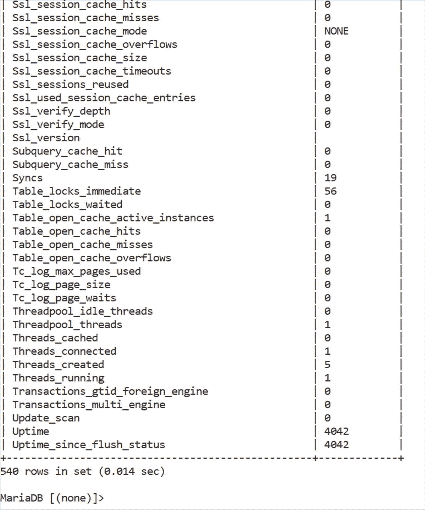

**图 5-7** MariaDB 中原始 `SHOW STATUS` 查询的输出

“540 行结果集”！疯狂，不是吗？有这么多事情要处理。天哪。

这就是为什么 `SHOW STATUS` 支持 `WHERE` 和 `LIKE` 子句——支持它们是为了让你能够过滤出对你重要的信息！当你想观察特定信息时，比如自数据库启动以来已执行的查询数量或有关查询缓存的信息，这些子句非常有用。

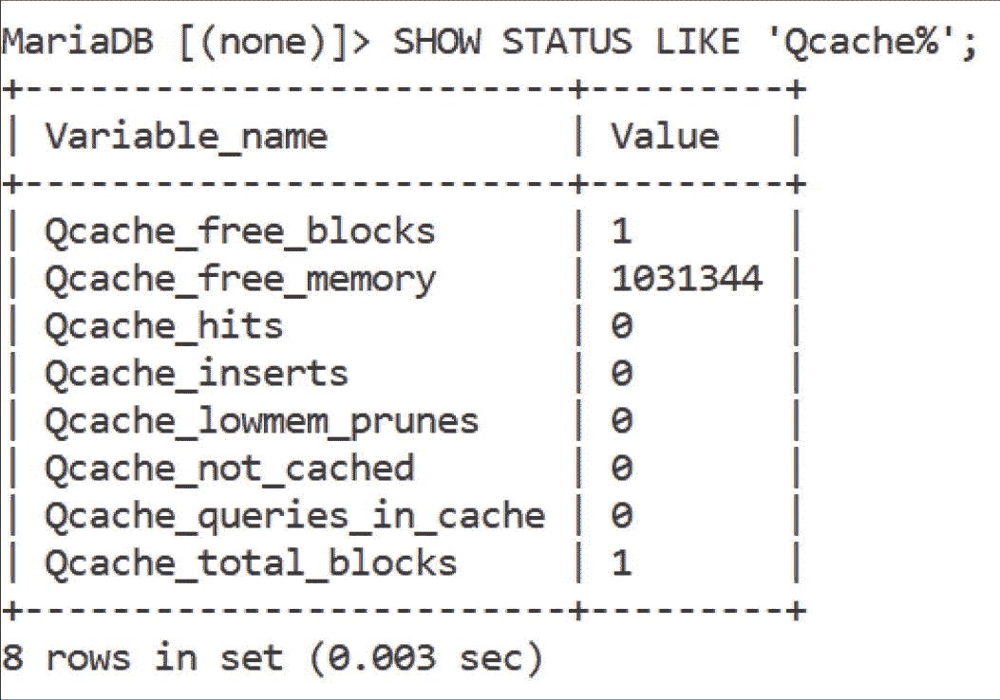

**图 5-8** 关于查询缓存的信息

不幸的是，只知道如何使用 `SHOW STATUS` 不足以让你的数据库臻于完美。观察统计信息很棒，但你应该采取行动来改变现状；仅仅观察指标是不够的。这就是为什么 `SHOW STATUS` 有一个兄弟（或者姐妹，如果你愿意的话）叫做 `EXPLAIN`：它不能像 `SHOW STATUS` 那样单独调用（如果你尝试，会收到错误），但它可以用在 `SELECT`、`INSERT`、`DELETE`、`REPLACE` 或 `DELETE` SQL 查询之前。下面是 `EXPLAIN` 的实际应用。

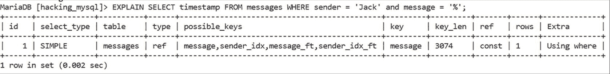

**图 5-9** `EXPLAIN` 实际应用

当对 `SELECT` 查询进行性能分析时，`EXPLAIN` 会返回几列，描绘各种信息：

| 列名 | 说明 | 可能的值 |
| --- | --- | --- |
| `id` | 查询的 ID。 | 数字 ID |
| `select_type` | `SELECT` 查询的类型。如果我们的 `SELECT` 没有使用子查询或 `UNION` 子句，则 `SELECT` 查询类型为 `SIMPLE`；如果使用了 `UNION` 子句，我们会看到 `UNION`；如果我们的 select 是子查询中的第一个 select，我们会看到 `SUBQUERY`，等等。 | `SIMPLE`, `PRIMARY`, `UNION`, `DEPENDENT UNION`, `UNION RESULT`, `SUBQUERY`, `DEPENDENT SUBQUERY`, `DERIVED`, `DEPENDENT DERIVED`, `MATERIALIZED`, `UNCACHEABLE SUBQUERY`, `UNCACHEABLE UNION` |
| `table` | 相关的表。 | 我们正在其上运行查询的表。 |
| `partitions` | 任何适用的分区。 | 非分区表为 `NULL`，否则为分区名称。 |
| `type` | 如果使用了 `JOIN` 查询，则为其类型。 | `system`, `const`, `eq_ref`, `ref`, `fulltext`... 请参阅文档了解所有可能的值。 |
| `possible_keys` | MySQL 可以使用哪些键（索引）来帮助查询？ | 任何适用的索引名称。 |
| `key` | 实际使用的键（索引）。 | 所用索引的名称。 |
| `key_len` | 所使用的键（索引）的长度。 | 所使用的键（索引）的长度。 |
| `ref` | 哪些列与索引进行比较以选择行？ | 任何适用的列名，或者如果值是函数的结果，则为 `func`。 |
| `rows` | MySQL 为执行查询而检查的行数。 | MySQL 认为为了执行查询必须查看的行数。 |
| `filtered` | 表中被条件过滤掉的行的估计百分比。 | 0–100% |
| `Extra` | 任何可能有助于了解 MySQL 如何执行查询的附加信息。 | `Backward index scan`, `const row not found`, `Deleting all rows`, `Distinct`, `FirstMatch`, `Full scan on NULL key`, `No matching min/max row`... 请参阅文档了解所有可能的值。 |

`SHOW STATUS` 和 `EXPLAIN` 都可以成为你数据库工具集中非常有价值的补充——在适当的时候使用它们，但不要忘记，当情况艰难时，它们并不是唯一能帮助你数据库的工具。

### 总结

理解 SQL 查询组件对于每个关心自己数据库的人来说都是一项基本任务。由于每个 SQL 查询都是由许多不同的任务组成的复合任务，这些任务共同帮助你的数据库，因此理解查询在底层的运作方式、它们的构成、它们的解析器和优化器的作用，并自行梳理数据库提供的解释性输出和错误代码，是通向你的应用程序、服务器和数据库更光明、更美好未来的重要一步。


不过，与普遍看法相反，组件并不是让你的数据库运转的唯一因素；你的数据库只是包括你的应用程序和服务器在内的这个更大谜题的一部分。理解这两者以及你的数据库如何协同工作，是实现数据库和谐的关键步骤——这也是为什么我现在邀请你，在讲述如何优化数据库及其中一切之前，先来理解你的服务器。

## 6. 理解你的服务器

在深入优化之前，你需要了解你的服务器及其内部组件。无论数据库内部发生了什么，你的服务器都可能成为其最大的瓶颈——了解你使用的是何种服务器以及其组件如何协同工作，将使你明白如何最好地与服务器协作以实现目标。有些服务器默认会限制你（例如共享主机），但如果你通过使用 VPS 或独立服务器能够访问服务器内部，你就有机会根据需要修改其参数。

要理解你的服务器，你必须高效地编写查询、模拟错误、了解服务器组件及其与 `MySQL` 的交互、为你的服务器配置 `MySQL`、为 `MySQL` 性能和安全性编写代码，并避免那些你不该做的事情。

### 高效使用服务器资源

与你的数据库相关的首要事物可能就是其内部运行的查询。这些查询必须被高效地编写，而这个说法的具体含义可能因你使用的服务器类型而异。

当谈到共享主机时，其实能做的有限——你与数百名用户共享一台物理服务器的一小部分，这降低了你的托管费用，但也限制了你的应用程序（和你的数据库）的活动空间。就你的数据库而言，很可能你也在单一数据库内活动。

这就是为什么在共享主机环境中，你能为你的数据库做的最好的事情，是在不触及内部（即使你想也碰不到）的情况下，修改“其之上”的东西：密切关注你的表结构并监控资源使用情况。也不要忘记数据库之外的事情——使用 CDN、限制插件的使用（你用了好几个，不是吗？），并在必要时压缩文件。

有些性能建议在这里并不适用：分区可能没有必要（首先，人们可能没有足够的空间存储需要分区的大型数据集），但索引会起到应有的作用。也要保持你的数据库整洁——不要存储太多不必要的数据，这样应该就没问题了。

当涉及到 VPS 或独立服务器时，情况就不同了——现在我们可以访问数据库内部，并可以首先查询服务器以了解我们面对的是什么：

*   要显示服务器上的处理器单元数量，请使用 `nproc`。
*   要查看服务器的 CPU 信息，请发出 `lscpu` 命令，或者，如果你想更详细，使用 `cat /proc/cpuinfo`。
*   要检查内存容量，请发出命令 `free -h`。
*   别忘了检查你所选后端语言的版本。使用 `PHP` 的人需要执行 `php -v`。

在许多情况下，登录到你选择的托管服务提供商的账户后，这些统计数据也会立即可用，而这些细节至关重要，因为它们决定了你能在多大程度上优化数据库并与你的应用程序协作。较小 VPS 服务的用户可能只有大约 2-4GB 的 RAM 和 30-50GB 的固态硬盘空间，而高级用户则会有更多活动空间，但无论如何，任何 VPS 都允许你打开并编辑 `my.cnf` 文件，查看缓冲池、日志文件大小、查询缓存、可以存储在缓存中的表数量以及连接缓冲区（它将帮助 `JOIN` 查询更快完成）。在运行查询之前，先做这个：找到你的 `my.cnf` 文件（它很可能位于 `/var/lib/mysql` 目录——如果不在，请在 `/etc/`、`/etc/mysql/` 或 `~/` 目录中搜索），打开它并调整以下参数：

*   `innodb_buffer_pool_size`：将 InnoDB 缓冲池设置为大约可用操作系统的 RAM 的 60-80%（也要为后台运行的进程留出一些空间）。
*   `innodb_log_file_size`：将其设置为大约 InnoDB 缓冲池大小的四分之一 (25%)。
*   `table_open_cache` 和 `max_connections`：这些变量分别影响所有线程打开的表数量以及服务器可以处理的最大同时客户端连接数。
*   `join_buffer_size`：这个变量描述了当运行执行全表扫描的 `JOIN` 查询时所使用的缓冲区的最大大小。

另外，请记住 `MySQL` 从内部看是什么样子——从上到下，我们有文件系统（数据、索引、日志和其他文件）、像 InnoDB 这样的存储引擎、优化器、解析器、SQL 接口、连接池和连接器。哦，在存储引擎与连接池之间某处，以及优化器、解析器和 SQL 接口旁边，还有全局和引擎特定的缓存及缓冲区。换句话说，我们有 `mysqld` 及其文件、连接器、优化器、缓存、表引擎和其他工具（我很快会与你分享一张图）——我们有很多东西需要优化，不是吗？

这就是为什么本书有一整部分专门讲优化；但在深入优化之前，我们还有一堆其他事情要处理！

### 理解和模拟错误

一旦你确信自己正在正确地使用数据库资源，你可能想要研究错误。错误是任何项目的重要组成部分，尤其是那些涉及数据库的项目；根据错误条件，我们可以了解到很多关于哪里出错了以及如何解决问题。在调整服务器时，可能会有一些情况，你会受益于模拟错误的能力。

要理解我们喜爱的数据库管理系统中的错误，我们必须明白 `MySQL` 中的错误与一个名为 `SQLSTATE` 的返回码的值有很大关系：该代码由 5 个字节组成，分为两部分：

1.  第一个和第二个字节与错误的类别有关。
2.  另外三个字节包含一个子类。

每个错误类别可以是以下四种类型之一：

1.  S 类（类别 00）：此类错误类别表示某事成功完成。
2.  W 类（类别 01）：此类错误类别表示一个警告。
3.  N 类（类别 02）：此类错误通知我们没有返回数据，因此是字母 N。
4.  X 类（所有其他类别）：所有其他错误都与某些异常有关，因此是字母 X。

`SQLSTATE` 代码表示任务的成功完成、各种警告、动态 SQL 错误、连接和操作异常、不支持的特性、无效和/或格式错误的 SQL 语句、数据异常、完整性约束违规、无效的事务状态等等。以下是一些 `SQLSTATE` 代码的含义：


#### SQLSTATE 码、MySQL 错误码与服务器配置

##### SQLSTATE 码

| SQLSTATE Code | 含义 |
| --- | --- |
| `01006/01007` | 权限未撤销/授予 |
| `08006` | 连接失败 |
| `42000` | 语法错误或违反访问规则 |
| `23001` | 完整性约束违反 |
| `25000/25001` | 无效的事务状态或存在活动事务时的无效事务状态 |
| `25006` | 无效的事务状态：只读 SQL 事务 |
| `2C000` | 无效的字符集名称 |
| `40000` | 事务回滚 |

细心的读者可能会注意到一个模式——有一个数字描述一般性错误，末尾还有一个额外的数字描述具体出了什么问题。如果你就是其中一员，那么你是对的！如果我们深入探究，很快就会发现 `SQLSTATE` 码落在特定的范围内：

| SQLSTATE 范围 | 解释 |
| --- | --- |
| `00000` | 操作成功完成 |
| `01000-0102F` | 警告（class 01.） |
| `02000 & 02001` | 无数据（class 02.） |
| `07000-46130, HW000-HW007, HV000-HV091, HY000-HY108 and HYC00` | 异常（classes 07,08,09,0A,0D-0Z, 10, 20-28, 2B-2H, 30, 33-36, 38 and 39 等） |

每个 `SQLSTATE` 都有一个类别、类和子类。很酷，对吧？你们中的很多人可能甚至从未想过这一点！

好消息是，你不必记住每个 `SQLSTATE` 状态的含义来帮助你的数据库（这真的可能吗？）——很好地掌握所涉及的内容就足够了，而你应该采取的路径会随着经验变得清晰。

##### MySQL 错误码

既然你知道了某些 `SQLSTATE` 的含义，以下是一些你也应该了解的 MySQL 错误码：

| MySQL 错误码 (`mysql_errno`) | 解释 |
| --- | --- |
| `1004` | 无法创建或复制文件。 |
| `1005` | 无法创建表。 |
| `1007` | 无法创建数据库。数据库已存在。 |
| `1008` | 无法删除数据库，因为它不存在。 |
| `1016` | MySQL 在 InnoDB 数据文件中找不到该表。 |
| `1022` | 表存在重复键。 |
| `1036` | 表为只读。 |
| `1037` | 服务器内存不足。 |
| `1040` | 连接过多——检查并/或调整 `max_connections` 变量。 |
| `1044/1045` | 你用于访问数据库的用户权限不足。 |
| `1046` | 未选择数据库。 |
| `1047` | 未知命令。 |
| `1048` | 列不能为 NULL。 |
| `1049` | 未知数据库。 |
| `1050` | 已存在具有此名称的表。 |
| `1051` | 未知表。 |
| `1052` | 列不明确。 |
| `1053` | 数据库正在关闭。 |

看到我们有多少错误码了吗？这甚至还不是一个详尽的列表！我敢打赌，前面提到的一些 `SQLSTATE` 和 MySQL 错误码会看起来很熟悉。

你们中的一些人可能会在这里产生有趣的想法，是的，你也可以故意模拟错误。还记得触发器吗？像这样的触发器怎么样：

```
CREATE TRIGGER insert_trigger
BEFORE INSERT ON users
FOR EACH ROW
BEGIN
SIGNAL SQLSTATE ‘45000’ SET
MYSQL_ERRNO = 32000,
MESSAGE_TEXT = ‘Your INSERT query has failed. Haha, what a surprise!’;
END;
```

这样的触发器将阻止对用户表进行任何 `INSERT` 操作——这种想法可能并不高明，但如果你想在朋友面前展示你的 SQL 技巧，或者你在举办一两个研讨会时（你可能还需要在查询开头和结尾指定分隔符），它可能有用。

### 服务器组件及其与 MySQL 的交互

在很好地掌握了你可能遇到的错误之后，你应该熟悉你的服务器组件以及它们如何与你的数据库交互。你已经了解了 `my.cnf` 的使用方法；然而，`my.cnf` 的效果取决于你的服务器；你的磁盘、RAM、CPU 以及涉及服务器的其他所有东西同样会拖慢你的查询速度。

以下是整个 MySQL 基础设施的样子：

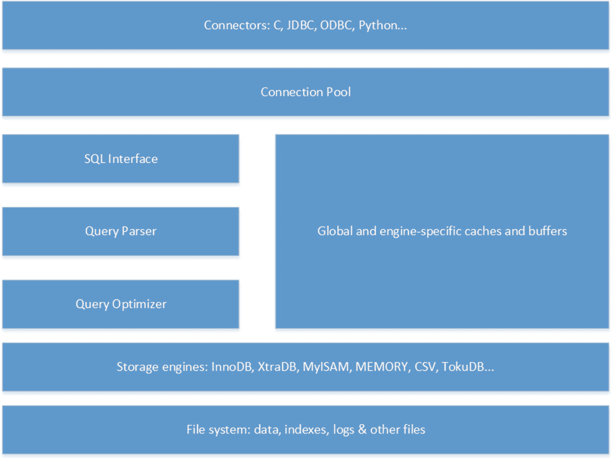

图 6-1: MySQL 基础设施

如你所见，几乎一切都由你的服务器支持——数据、索引和日志存储在 `/var/lib/mysql/[data]` 目录中。根据你使用的存储引擎，你可能会在数据目录中看到一些 `.ibd` 文件，描述表的数据和元数据。

其余的设置（解析器和优化器、全局和引擎特定的缓存和缓冲区等）也直接依赖于你的服务器设置：如果你使用 InnoDB，你的数据和索引很可能会与主表空间（`ibdata1`）分离，`ibdata1` 将只包含元数据——此外，你还会看到文件 `ib_logfile0` 和 `ib_logfile1`，它们将用于在崩溃后恢复 MySQL 中的数据。

### 为 MySQL 选择服务器

为 MySQL 选择服务器时，请考虑：

*   **处理器：** 关注英特尔或 AMD 的现代 CPU，并根据对你重要的参数选择 CPU——考察时钟频率、缓存大小和其他因素。
*   **运行内存大小：** 你的用例需要多少内存？当从任何托管服务提供商处选择服务器时，别忘了检查你有多少操作系统内存可供“使用”。
*   **操作系统：** 请记住，你可以优化和更改的内容会根据服务器运行的操作系统而略有不同。话虽如此，大多数差异都是微小的。
*   **硬盘驱动器：** 你的硬盘对性能有直接影响：它影响操作系统启动速度，影响 SQL 查询速度，还决定了你的数据库可以存储多少数据。这里涉及许多因素——好消息是存储空间便宜，这不是你应该过分纠结的事情：让自己了解基本概念，并着眼未来做出合理的决定。
*   **带宽有多少？** 对你们中的一些人来说，带宽也是一个问题——在做出选择前咨询你的托管服务提供商，并记住 CDN 可以在必要时帮助你的服务器节省带宽。

如果你的服务器能够自动扩展也会有所帮助——如果你达到了硬盘可用空间的上限，只需再添加一块硬盘即可！

### InnoDB 刷新方法与压力测试

我还想强调测试你的 InnoDB 刷新方法的必要性——仅仅因为你邻居的 DBA 在他的项目中使用 `O_DIRECT` 选项，并不意味着你也应该使用相同的选项：`O_DIRECT` 将以 `O_DIRECT` 方式打开数据文件，并使用 `fsync()` 刷新数据和日志。要跳过该选项，你可以使用 `O_DIRECT_NO_FSYNC`，或者使用 `O_DSYNC` 选项打开和刷新日志文件，并使用 `fsync()` 刷新数据文件。想对所有涉及刷新的操作使用 `fsync` 系统调用吗？将刷新方法设置为 `fsync`。更改刷新方法将改变 MySQL 执行刷新操作的方式，因此，你将能够观察到在涉及不同刷新级别时你的数据库行为如何。

能够让你的数据库承受不同程度的负载吗？那就更好了！为此，使用 `mysqlslap`。我们将运行三次 MySQL 压力测试工具的迭代：

1.  `mysqlslap --user=root --host=localhost --auto-generate-sql --verbose`
2.  `mysqlslap --user=root --host=localhost --concurrency=100 --iterations=10 --auto-generate-sql --verbose`
3.  `mysqlslap --user=root --host=localhost --concurrency=50 --iterations=100 --number-int-cols=5 --number-char-cols=20 --auto-generate-sql --verbose`

第一次压力测试迭代以详细输出模式运行自动生成的 SQL 代码。第二次稍微复杂一些，有 100 个并发连接和 10 次 SQL 查询迭代。最后，第三次利用了 50 个并发连接，进行 100 次迭代，包含 5 个数字列和 20 个基于字符的列。结果如何？

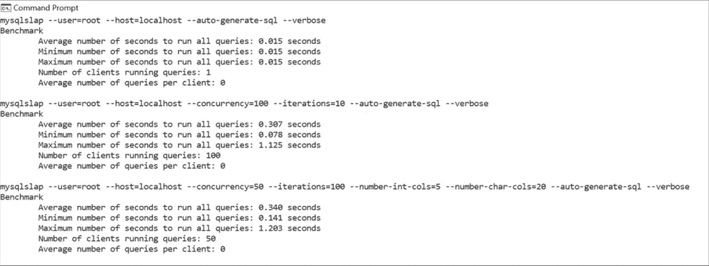

图 6-2: mysqlslap 的结果


感觉还不错，对吧？在本书的优化部分（就在本章之后），我会带你了解可能的优化技巧——现在先"敲打敲打"你的数据库，然后别忘了也要妥善地让你的代码适应数据库。

### 为 MySQL 性能与安全而编码

一旦你理解了你的服务器如何与 MySQL 交互，并调整了一两个参数来帮助你的基础设施（你已经增加了 `InnoDB` 缓冲池大小并调整了日志文件的大小，对吧？），别忘了也要以有助于数据库的方式编写代码。你会惊讶于有多少开发人员仍在编写让数据库"受伤"的代码——你们中的一些人可能也会在这方面犯错。

记住几个关键点：

1.  **切勿将用户输入直接传递给数据库**（这还需要说吗？）：将用户输入直接传递给数据库是通往 SQL 注入的高速公路。

2.  **连接使用完毕后终止，使用速率限制器和负载均衡器**：这看起来很基础，但搜索引擎、API 应用程序和类似应用的操作员可能都遇到过这种情况：他们注意到应用程序运行缓慢，结果发现迟缓是由数据库中运行的查询数量引起的。好吧。如果你运行的应用程序读操作很重，一定要限制在给定时间段内可执行的查询数量，并在必要时让负载均衡器来平衡其余部分。你不需要发明天才级别的速率限制器：几行 PHP 代码应该就能搞定。

3.  **基准测试与性能剖析**：基准测试是一种独特的方法，用于确定当你交给应用程序任务去完成时会发生什么。许多开发人员都遇到过这样的情况：他们计划了 A 方案、B 方案和 C 方案，然后生活给了他们柠檬（意料之外的难题），他们需要制定 D 方案。好吧，好吧，好吧……这就是为什么你需要对你的应用程序和数据库进行基准测试——基准测试将帮助你了解对数据库的期望是否现实，它将帮助你衡量你的应用和数据库能处理什么，并为增长做计划。等我们开始优化 MySQL 时，我会带你了解基准测试和性能剖析策略。

4.  **明智地选择服务器组件**：许多人认为，要实现卓越的性能，就应该使用有史以来最棒的组件。当然，如果你有能力负担，为服务器使用最新的组件会很棒，但由于顶级组件也伴随着高昂的成本，许多人没有这种奢侈。明智地选择组件并研究你的选项——如果你运行一个基于大数据的搜索引擎并且需要大量磁盘空间，你真的需要多个 TB 级的 NVMe 驱动器吗？也许选择一个更大的 HDD 并购买更多 RAM，或者换一个更好的 CPU？记住 `InnoDB` 使用更多核心的例子：要更聪明地利用组件，而不是蛮干。明智地选择组件并展望未来，你将能够比你想象的更充分地发挥服务器的潜力。

5.  **为高性能而索引**：如果你使用索引，那肯定是有原因的，对吧？索引提高了 `SELECT` 查询的性能；然而，在 `WHERE` 子句后的第一列上随意添加索引并不总是最明智的做法。不同的数据库管理系统提供不同类型的索引，因此，你可以采用大量的索引策略来实现你的性能目标。剖析你的查询并明智地建立索引。

6.  **使用代码剖析器找出有问题的代码片段**：如果我告诉你数据库并不是唯一可以剖析的东西呢？PHP 用户可能想看看 [xhprof](https://pecl.php.net/package/xhprof)——这个工具可以剖析 CPU 周期和内存使用情况，帮助你找出瓶颈的原因。其他编程语言也会有类似的工具。

7.  **研究 MySQL 的高级功能**：你不需要成为 MySQL 的超级用户也能使用高级功能。这些功能包括触发器、存储过程和函数、分区、预处理语句、全文搜索，甚至是你定义字符集和排序规则的方式。它们的存在是有原因的——触发器可以在我们修改表中数据时自动"调用"某些操作，而存储过程需要手动调用；分区帮助你的数据库将数据拆分到多个底层表中，同时仍将分区表视为一个不可分割的单位；全文搜索使你能够利用显式能力进行搜索，其中某些不同的字符对你的查询可能有不同的含义，并利用不同的搜索模式；而字符集和排序规则使你的数据库能够理解不同语言的数据并显示符号。

8.  **备份你的数据**：无论你运行什么项目，备份都应该始终放在心上。备份是你很少想到的东西，直到灾难降临——然后每个人都说"哦不，我们上次备份数据库是什么时候？我们的备份能恢复吗？"这就是为什么你需要提前考虑它们。不仅仅是考虑——使用 `mysqldump`、`mydumper` 或其他方法（我们稍后会讨论备份）备份你的数据，并确保你的备份也是可恢复的。

9.  **了解 CSRF 令牌**：你知道在 [BreachDirectory](https://breachdirectory.com) 上每周阻止了多少 CSRF 攻击吗？有时仅搜索引擎页面就有数百起。惊讶吗？不应该。有些人就是混蛋——一旦你的应用获得一点点关注，你肯定会充分认识到这一点。虽然我完全理解为什么人们会从不同的地方通过搜索引擎发起搜索（这是一些封锁的原因），但服务上提供 API 是有原因的。CSRF 令牌不仅对搜索引擎有用，如果你的应用程序允许用户更改密码、通过点击链接确认购买等——任何可能让恶意方认为"嗯，如果我发送一个请求，也许我也能从中受益？"的事情——它们都极其有用。CSRF 令牌可以防止 CSRF 攻击，因为它们对于每个请求/会话都是唯一的，并且由无法猜测的随机值组成。在本书的安全部分，我会带你了解如何实现它们。

10. **编写整洁的代码**：整洁的代码也有助于数据库的持久性。任何不得不重写遗留代码库的人都完全明白我的意思：你浏览着代码库，心里想着"*为什么这个*要包含在这里？！"避免把事情复杂化，保持简单：保持你的代码组织良好、结构清晰，你会看到许多好处：它可能运行得更快，使用更少的内存，而你的数据库、应用程序和未来的自己也会感谢你。

遵守这十点，你的应用程序和数据库肯定会感谢你。话虽如此，请记住这些并非万能药，它们只有在你的应用程序（以及数据库）构建得当时才会起作用。你会犯错（谁不会呢？）——从中学习。

听说过最速降线实验吗？它证明了小球沿着曲线滚动比在直线上更快——请注意这一点：你的错误很可能比那些走"直线"道路的人让你走得更远。快速学习并行动：错误不可避免，但它们并非世界末日。

在编写任何使用 MySQL 的应用程序时，请特别关注你的服务器和数据存储。使用尽可能好的架构并不总是最明智的选择：顶级组件也有着高昂的成本，而摸索 MySQL 组件的经验有时可能比把钱砸在架构上产生更好的结果。


