# 第三部分 MySQL 优化

## 7. 为 MySQL 优化你的服务器

哦，优化。这是许多数据库管理员的最爱，也是许多开发者的烦恼之源。优化对每个数据库来说都是必需的——一个优化良好的数据库是你的应用程序加载迅速、搜索极快、客户源源而来的原因。反之亦然——运行一个缓慢、呆滞、性能低下的数据库，最好的产品也会一败涂地。你的数据库是驱动你的应用程序以及所有与数据相关的操作的主要力量：数据被插入、显示、更新和转换，有时也被删除。

除此之外，请对安全保持开放的心态，并牢记一件事：不存在所谓的“完全安全的应用程序”或“完全安全的数据库”。你永远无法实现 100%的安全，但这并不意味着你应该放弃整个数据库或应用程序的安全。避免向数据库提供用户输入，并尽可能使用`PDO`；学习`OWASP`列表中的前十大攻击；使用 Web 应用防火墙来防范最普遍的攻击；也不要忘记人的因素。

将你的应用程序想象成一座城堡：你将如何保卫它？当然是用多种方法！你会有保安守卫外围，有护城河，以及在敌人进攻时可以摧毁的桥梁，在城堡内部，你还会有许多安全摄像头来通知你所有出错的事情。现在，将这个类比应用到你的应用程序和数据库上：保安可能意味着触发后会阻止请求的防火墙规则；护城河可能指`CDN`和速率限制器，用于限制进入你服务器的请求数量；桥梁则意味着协同工作以促进访问数据库中数据的服务器进程。城堡是你的应用程序，而城堡内部，你有一个由摄像头——触发器、防火墙设备和日志——保护着的数据库。

数据库是你城堡的心脏，作为心脏，它需要特别的关注——保护你的应用程序免受注入、失效认证和敏感数据泄露固然很好，但仅仅学习如何保护你的应用程序免受这些攻击是不够的。保护你用来访问`MySQL`的账户——确保它们都有密码，密码要强，永远不要以明文形式在任何数据库中存储密码，并确保你使用像`Bcrypt`或`Blowfish`这样的单向哈希函数，同时不要忘记你不应该授予任何用户访问`mysql`数据库中用户表的权限（`root`用户除外）。

永远记住，总有办法突破防御，没有应用程序是 100%安全的——也不要忽视人的因素。

### 不该做的事

在处理你的服务器和其中的数据库时，不要忘记有些事情你应该避免做，以免损害你的数据库。首先，是文档——如果你运行的是`MariaDB 11.5`，不要采纳`MySQL 8.0`文档中的建议：虽然这两个数据库管理系统相似，但它们之间存在明显的差异，即使名称相似的工具也可能工作方式不同。虽然`MySQL`中的许多工具确实会作为指向`MariaDB`中相同工具的符号链接（一个典型的例子是`mysqlslap`工具，它是`mariadb-slap`的符号链接），但在大多数情况下，最好基于你所使用的数据库管理系统的具体版本来构建你的知识。

其次，是优化建议——有些人会告诉你，如果增加一次缓冲池大小后你的`INSERT`查询仍然很慢，你就应该继续增加它；或者你应该将查询缓存设置得大于某个百分比，如果你的查询没有利用它，就应该再次增加它，等等。在采纳任何调优建议之前，请确保它本身是合理的：仅仅增加缓冲池大小不太可能让你的`INSERT`查询快 100 倍；然而，放弃`INSERT`而使用`LOAD DATA INFILE`会更有意义，因为`LOAD DATA INFILE`没有`INSERT`那么多的开销。缓存命中率也与缓存大小无关，它取决于服务器内部 I/O 操作的效率。

避免在实时服务器上测试任何东西——即使你 99%确定不会出问题，并且你完全按照预期运行了一个代码块，根据你的应用程序、数据库或服务器配置，仍然可能出现差错。不要假设如果你在教程中看到一个代码块成功执行，它在你的操作系统上也会以同样的方式执行。在预演或演示环境中测试，然后将更改推送到生产环境。信任，但要核实。

互联网是个好地方，`Stack Overflow`也包含许多很棒的建议，但你也不应该想当然地接受在那里找到的一切。许多人提供建议，但区分谁有资格提供并不总是那么容易。与你所选数据库管理系统相关的官方来源是一个好的起点——看看`Planet MySQL`和`Planet MariaDB`，从中识别供应商，并采纳他们的建议。这并不是说你应该盲目信任官方供应商的文档——在将任何东西部署到生产环境之前，都要进行测试！

也永远不要说“这种事情发生的几率很小，所以可能不会发生在我身上”：你们中的许多人可能听过这样的故事，开发人员告诉自己类似这样的话：“这个基础设施 5 年来从未失败过，所以短期内也不会失败”，然后他们因停电或其他事故丢失了数据。抱最好的希望，但做最坏的准备。

最后要记住的是，并非每个人都会真心为你着想——有些人给你建议是因为他们嫉妒，或者只是为了通过贬低别人来让自己感觉好一些。有些人就是混蛋，如果你是个新手，这会让你特别艰难，这就是为什么你应该总是基于研究和官方来源（文档、官方供应商的博客等）或信誉良好的人士提供的事实来做决定，并在测试确保建议有效后再采纳。

### 总结

理解服务器内部组件如何相互作用，对任何开发人员和数据库管理员来说都是一项至关重要的任务：我们必须高效地利用服务器内的资源，从内部理解`MySQL`如何工作，理解错误的原因以及数据库在产生错误时想要表达什么，并仔细选择我们服务器的组件。

一旦我们开始编写高性能和安全的代码，我们绝不能忘记如何优化我们的数据库，并使用必要的工具和知识来微调我们的数据库，为我们的数据库提供驰骋高性能公路所需的工具。

既然你已经了解了你的服务器内部是什么样子、它如何工作以及它使用了什么资源，现在是时候通过优化来理解你可以让你的数据库做些什么，以发挥其最佳性能了。


你的数据库需要帮助：这里说的帮助，并非指心理治疗，而是指你将对服务器工作原理的理解付诸实践，以协助数据库执行所需操作。试想一下——如果你在一台拥有`64GB`运行内存、容量为 TB 级的磁盘驱动器的专用服务器上，使用默认设置构建一个基于数据库的应用程序，这真的有用吗？答案显而易见——没用。但在你急于配置一台性能极其强大的服务器之前，首先你必须明白哪些方面可以优化，而哪些应该保持原样。这正是你的数据库配置发挥作用的地方——对于一些人来说，优化的好处是显而易见的，这类人甚至可能在数据库正式投入使用前就进行优化；但更多人则被一个迫切的问题所困扰：我到底为什么要为 MySQL 优化我的服务器？

### 为何要为 MySQL 优化你的服务器？

“我为什么要为 MySQL 优化我的服务器？”毕竟，你的服务器是一台性能强劲的“猛兽”，而`MySQL`在默认状态下也能运行无误，不是吗？你并没有遇到任何停机或延迟，也许你已经运行`MySQL`一段时间了，也没有注意到任何查询运行缓慢的情况，那为什么还要优化呢？

我敢打赌，你内心深处已经知道答案——你需要为`MySQL`优化你的服务器，因为如果它是你主要使用的数据库管理系统，那么它很可能支撑着你应用程序`110%`的运行。它是你应用程序的支柱，如果数据库出了问题，所有人都会受到影响：使用你应用程序的用户、付费的客户、访客、开发应用程序的开发者、你自己，甚至你的会计都可能会打电话来问：“发生什么事了？税务局无法访问你的网站进行检查。”是的，黑客们也会遇到麻烦，但你不该感到高兴——去黑一个本身就无法正常工作的东西，有什么意义呢？

再想想城堡——你在它周围加固安全措施，是为了让不法之徒更难进入。你需要提前这样做，因为如果敌人正向城堡进军，防御工事需要尽可能长时间地将他们阻挡在远处。在遭受攻击时才开始加固城堡不是个聪明的主意，因为你很可能会被消灭——防御工事无法提供`100%`的保证让你不被消灭，但它们肯定能为你赢得一些时间，以便你为接下来可能发生的事情做准备。

现在回到你的数据库：你需要提前优化，以帮助使用你应用程序的用户获得尽可能流畅的体验。如果你在使用搜索引擎，你知道它每天要处理多少次搜索吗？`10`次？`100`次？也许是`10,000`次？你可以推测，但不可能事先知晓。这就是优化的用武之地——你需要权衡所有参数，以确保无论运行`10`、`100`还是`10,000`次查询，你的数据库都能平稳运行。一个经过适当优化的数据库能防止你的`A 计划`失败——而如果你的`A 计划`足够好，`B 计划`就没有必要了。

当然，你已经知道有很多人愿意给你优化建议——这不是坏事，但在采纳之前，你需要`100%`确定建议的可信度，而要确定这一点，没有比自己了解一些优化秘诀更好的方法了。了解优化之道并不意味着你不再需要建议——它意味着你将有一个良好的基础来判断哪些是可信的，哪些不是。

要正确地为`MySQL`优化你的服务器，你首先需要选择一台好的服务器。这就引出了第一个难题——什么使一台服务器成为“好”服务器？随之而来的是更多的问题——你怎么知道你的`用例`需要多少运行内存？你怎么知道你需要`AMD`还是`Intel`处理器？如何预估多少硬盘空间才算足够？这源于经验。你知道为什么你的同事看了一眼服务器列表，就在`3`分钟内提出了一个似乎面面俱到的解决方案吗？他在这个领域经验丰富。很多人也几乎不假思索地选择服务器，原因也是一样——经验。

获取经验相对容易。错误几乎无需成本就能修复，而且许多服务器也可以逐步升级。下面，你将找到一份粗略的指导原则列表，帮助你选择服务器：

1.  **你之前做过选择吗？** 你是否曾为任何`用例`构建过项目？当时你选择了什么服务器，你的选择明智吗？如果那个决定让你满意，不妨考虑购买类似的服务器，你很可能也不会后悔这次的选择。
2.  **评估你的用例：** 如果你需要一台新服务器，想想你的应用程序每天会产生/处理多少数据，考虑数据类型和字符集，设想什么样的人会使用你的应用程序，以及你的数据库将支持哪些类型的应用。你计划运行多少个应用？它们会使用什么类型的数据库？并发是否是一个需要考虑的因素？
3.  **考虑服务器位置和维护需求：** 考虑服务器的位置至关重要——`CDN`有帮助，但如果你的主要客户在美国，在日本部署服务器就不是好选择。你可能还希望选择一台附带维护和保养服务的服务器——随着时间的推移，你很可能会遇到服务器问题（随便问问任何服务器管理员，他们都能讲出恐怖故事），而外包的维护团队能帮助你将头疼的事减到最少。
4.  **灵活性：** 还要考虑组织提供的服务器是否灵活。如果你计划托管基于大数据的应用，却无法根据需要扩展硬盘，你就会遇到麻烦。
5.  **预算：** 当然，一切都归结于财务问题。你很可能有一个预算，预算越小，你需要承受的压力就越大。较小的预算可能意味着你的服务器和应用程序可能需要离线一段时间，以承受较少的流量。在这种情况下，将预算扩大到每月数千美元也不明智——试着在选择之前研究服务器（及其公司），向同事寻求选择帮助，或直接与托管服务提供商沟通，以找到一个平衡点。支持渠道的存在是有原因的——好好利用它们！

还没做决定？别担心——一旦你了解了影响`MySQL`的常见服务器问题，知道如何移除限制`DBMS`性能的障碍，并将你的数据库管理系统配置为充分利用服务器内部的`I/O`能力及其他强大功能，你就能轻松选择服务器组件了——到那时，你将能够充分利用`InnoDB`或（如果你使用`Percona Server`）`XtraDB`中的`ACID`特性，你的数据库也将迈向繁荣的未来。

### 影响 MySQL 的常见网络服务器问题

你知道你的应用程序、数据库和服务器有什么共同点吗？问题！这些问题正是客户投诉、查询运行缓慢甚至停机的主要原因。有些问题会直接影响你的数据库，有些则不会，但请确信——所有问题都会发出它们存在的警报。还记得`MySQL`中的错误吗？一旦你看到它们，请确信——肯定有地方出错了。


#### MySQL 性能陷阱与基础设施规划

所有的 MySQL 错误都在提醒你数据库内部正在发生某些事情，有些甚至会直接影响到你的服务器硬件。犯错是人之常情，但务必确保你的错误不是下面列出的这些——一旦被触发，其代价可能难以承受：

*   **运行过时、陈旧的软件版本**：这个问题会产生连锁反应。运行旧版本的 PHP，你就无法在 WordPress 中升级插件；不升级 WordPress 插件，你就会面临被黑客攻击的风险。如果你发现自己说“WordPress 只是我网站上的一个博客，我不需要太在意”，那你就是在自找麻烦。我甚至都不想提你的整个基础设施会因此暴露在何等恶劣的安全漏洞之下！到那时，你的数据库很快就会变成你最不需要担心的问题。

*   **避免优化你的应用程序**：如果应用程序使用不当，会消耗大量资源。首先，如果你的 Apache 配置不当，很可能会产生许多不必要的进程。如果你发现自己依赖像 `mod_security` 这样的模块作为防火墙，请记住它也消耗资源——为什么不寻找基于代理服务器的替代方案，比如 CloudFlare 或 Sucuri？见鬼，你甚至可以自己构建一个防火墙，而且这并不那么复杂——我就构建过一个，而且当时我对安全领域还知之甚少！

*   **避免使用 CDN，导致服务器过载**：CDN 提供商会承担一部分流量负载：通过它们提供 CSS 或 JS 文件，可以避免给你的数据库和服务器带来压力。像 CloudFlare、Sucuri 和 Imperva 这样的提供商，以其能够保护你的整个基础设施（无论规模大小）免受 DDoS 攻击而闻名。DDoS 攻击发生的频率比你想象的要高——甚至一个小孩子也可以利用他从网上找到的脚本，或者根据教程制作的脚本，发起对你的整个基础设施的攻击。忽略了 CDN？那就只能自己承担后果了。

*   **磁盘空间不足**：这是一个大问题。即使你确信自己有大量磁盘空间，它也可能突然耗尽；一切都可能变化得非常快——想想 `ALTER` 查询。这些查询会在磁盘上创建表的副本；除非你密切关注磁盘驱动器并留意 `ALTER` 查询的进度，否则你不会“察觉”到空间的消耗。如果你发现自己要为一个大表添加索引，请务必 300% 确定你有足够的磁盘空间——至少以表的当前大小再加上 20-30% 的可用空间作为目标。当然，如果你陷入困境，也有办法避免在更新数据时耗尽磁盘空间——我会引导你了解这些方法——但请时刻牢记可用磁盘空间的数量。

*   **没有备份策略**：备份数据至关重要。无论你如何备份宝贵的数据，都必须确保备份可靠且对数据库的影响最小：在凌晨 1 点备份数据可能比在下午 1 点备份产生的影响更小，并且一定要正确地测试你的备份。定期恢复你所做的备份——所有数据是否按你预期的方式恢复了？恢复过程是否顺利？一旦灾难发生，你备份（或忘记备份）的数据很可能将是你的第一道防线。

一旦你发现上述一个或多个问题，回头审视一下你的服务器——你确定磁盘空间没快用完吗？你的 CPU 状态如何？你给缓冲池分配了多少内存？还记得为服务器的内部进程预留一些内存吗？我们之所以没有直接跳到性能优化——或者很多人喜欢称之为“调优”——是因为，如果你不了解你的服务器就去调优数据库，你的应用程序将会崩溃。它会不堪重负并崩溃，因为那样的话，你就不知道该向你的数据库提出什么合理要求，而你的数据库由于不知道如何帮助你，对于任何被要求执行的任务都将难以胜任。从那时起，一切都将螺旋式下降。因此，忽视任何出现的问题，无论大小，都是不明智的：即使是最小的问题，如果被忽视，也可能毁掉你数据库的未来。一切都归结于基础设施。一旦你弄清楚了如何避免限制数据库性能，你就可以自由选择方向，而无需担心性能、安全或可用性方面的影响。在错误盯上你之前，先关注并解决这些错误。

### 什么限制了 MySQL 的性能？

与普遍看法相反，限制数据库性能的首要因素并非你编写查询的方式——当然，你可能会忘记这里或那里的几个索引，或者在一个普通的 `LIMIT` 就足够的地方重复造轮子，但这并不是限制你数据库性能的根本原因——至少不是罪魁祸首。

你的数据库性能受其配置所限——而这些配置直接依赖于你的服务器硬件能力。这就是为什么正确选择服务器对每个参与者都至关重要：服务器可能成为高负载数据库的瓶颈，但也可能性能严重过剩。选择一个折中方案，然后进行优化。不，你不需要是个天才系统管理员才能选择合适的装备——搜索引擎在 MariaDB 上存储了超过 100 亿行数据，并在毫秒内完成搜索，而无需借助最新的 NVMe 驱动器或其他顶级硬件，所以一切皆有可能。

即使是一台旧服务器也能从 MySQL 中挤出令人印象深刻的性能——这完全取决于你的数据库优化程度。当然，你的应用程序也有发言权：如果你想在严酷的环境中生存（数据泄露事件时有发生，你需要做好准备），你需要遵循最佳的编码和安全实践。但如果你不是使用 Laravel 这样的成熟框架来构建应用程序，而是自己动手凑合，或者发现自己在使用一台旧 VPS 并且无力升级，也并非毫无希望。

### 选择服务器和硬盘

在选择服务器时，从我之前提到的事情开始：审视你以前的选择，仔细评估你的用例，考虑服务器的地理位置和维护、灵活性以及预算。这些将为你提供一个关于可以考察哪些服务器类型的粗略轮廓——它们将定义你是需要共享服务器、VPS 还是专用服务器，而你的用例将决定服务器中必须包含哪些组件才能让你的应用程序正常运行。你的服务器承载着数据库，然后通过 `my.ini` 或 `my.cnf`（取决于你使用的操作系统）进行配置。设置也可以通过命令行指定，但基本原则是相同的——配置将帮助你的数据库与服务器协同工作以实现你的目标。

无论你是使用 MySQL 还是其他数据库管理系统，服务器始终是数据库的限制因素。只有当数据库被配置为利用服务器中可用的组件时，它才能表现良好——而在数据库方面的一个主要限制点就是硬盘及其 I/O 能力，以及你的 CPU。


谨慎选择硬盘驱动器——NVMe 固态硬盘将是最快的选择，但也是最昂贵的。在许多情况下，一块普通的固态硬盘可能就足够了；而在涉及较大数据集的情况下，可以使用机械硬盘存储来存放 TB 级别的数据。如果不确定，许多人会建议你选择折中方案——固态硬盘，因为它比机械硬盘更快，但同样，“好速度”对不同人可能意味着不同的事情：别忘了，硬盘驱动器只是整个系统的一部分，无论如何它都不能解决你所有的问题，所以无需重复造轮子。同时，你应该根据你的使用场景，权衡机械硬盘、固态硬盘和 NVMe 固态硬盘的优缺点，并明智地选择：如果你打算存储较大的数据集（超过几个 TB 的数据），请选择机械硬盘；如果你追求高性能并能承受更高的价格，请选择 NVMe 固态硬盘；对于一般使用场景，请选择固态硬盘。

谈到 CPU，选择一个具有多个核心（最好是 4 个或更多）和一个不错处理器速度（3.5 GHz 是一个良好的起点）的处理器。请记住，MySQL 及其同类产品都是多线程的，因此你应该不需要额外的配置来让 MySQL 使用多个核心。

在做出选择之前，如果可能的话，务必咨询托管公司——那里的工作人员将对可用的服务器有很好的了解，一旦你告诉他们你的使用场景并详细说明需求，他们很可能会为你推荐一台服务器，并在你不喜欢所选服务器时提供退款保证。

### 配置 MySQL 参数

选择之后，请检查你的服务器上是否已经安装了 MySQL。对于某些用户来说，MySQL 很可能已经安装好了，而其他用户则需要自己安装。

在你抽出时间初步了解服务器后，关闭 MySQL 以便进行配置。复制一份配置文件，以便在必要时恢复默认设置（Linux 用户会在 `/etc/`、`/etc/mysql/`、`/var/lib/mysql` 或 `~/` 目录中找到配置文件；对于 Windows 用户，该文件很可能位于 `bin` 目录的数据库管理子目录中），然后决定你将使用哪种存储引擎（大多数人会选择 InnoDB），并配置与之相关的选项。

一旦配置文件被打开，Windows 用户会注意到里面混杂了一堆不同的注释。

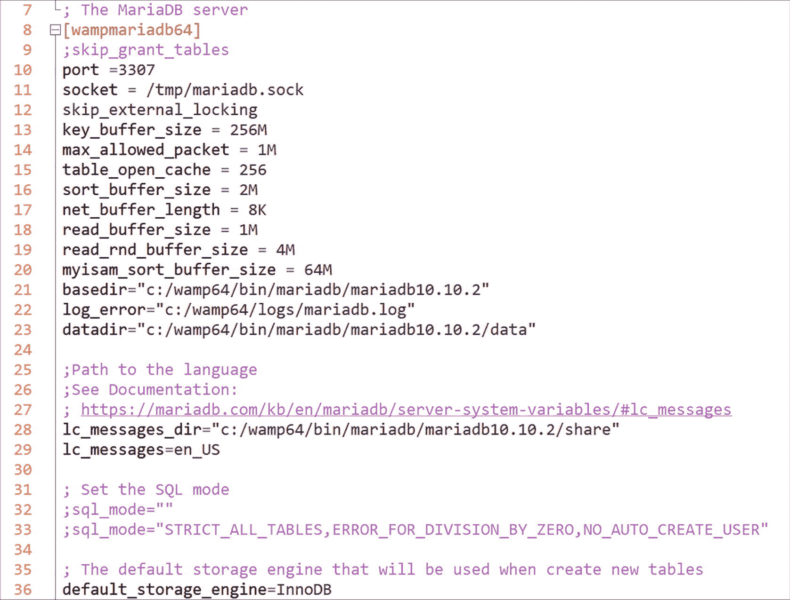

InnoDB 用户需要向下滚动更多（滚动时，如果默认存储引擎尚未调整为 InnoDB，请将其调整为 InnoDB），在存储引擎设置下方，他们会找到一大堆选项。

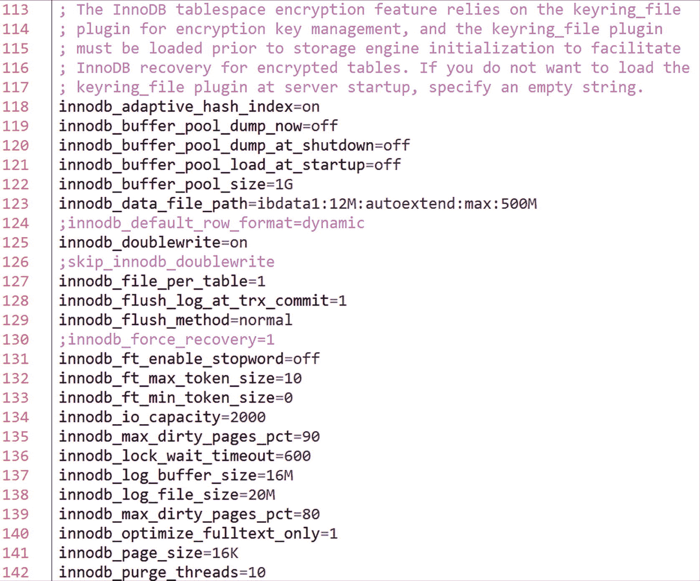

这么多选项！好消息是，你不太可能修改每一个——坏消息是，有些参数是必须更改的。

Linux 用户会比较轻松，因为 Linux 版本的 my.ini——my.cnf——可能只提供与 InnoDB 相关的必要参数，但这些参数同样适用于 Linux 用户。要详细了解每个参数的作用，请回到本书第 2 章，参考标题为“MySQL 和 MariaDB 中的 InnoDB”的部分——一旦你复习了这些内容，就可以优化以下参数，让 InnoDB 引擎发挥最佳性能：

| 参数 | 优化原因 |
| --- | --- |
| `innodb_buffer_pool_size` | 这是 InnoDB 缓冲池的大小，用于存储与 InnoDB 相关的数据、索引和 MVCC 数据。将此参数设置为系统可用 RAM 的至少 60%。 |
| `innodb_log_file_size` | 此参数描述了 InnoDB 内日志文件的大小。恢复时会筛查日志文件——将此参数设置为大约缓冲池大小的四分之一。较大的日志文件大小对性能更好，但较大的日志文件也会导致 InnoDB 恢复时间变长。 |
| `innodb_flush_log_at_trx_commit` | 此参数控制 ACID 合规性与高性能之间的平衡：值为 1 表示符合 ACID，而值为 0 或 2 将允许更高的速度，但会增加丢失最多一秒事务数据的风险。 |
| `innodb_flush_method` | 描述了 InnoDB 用于将数据刷新到磁盘的数据刷新方法。某些值仅对 Linux 用户可用。 |
| `innodb_data_file_path` | 描述了主要 InnoDB 表空间——ibdata1 文件——的文件名和大小。该文件确实可以有任何名称——并且如果我们愿意，可以拆分成独立的文件。 |

我已在本书第 2 章中涵盖了与 InnoDB 相关的大部分参数，因此这里不再重复：但是，我希望你特别注意 InnoDB 内的主系统表空间——`ibdata1`文件。它的存在是有原因的，包含了 InnoDB 正常运行所必需的多类数据，包括数据、索引、多版本并发控制数据、撤销空间、回滚段和两种类型的缓冲——插入缓冲和双写缓冲。这些缓冲具有双重作用：插入缓冲将用于“缓冲”对数据库页面的多次更新，并一次性执行一次大的更新操作；而双写缓冲用于接收从缓冲池刷新的数据：只有当双写缓冲中的数据事先被刷新到磁盘后，InnoDB 存储引擎才会将数据写入磁盘。

`ibdata1`的目的就像一座“城堡”，你的部分数据保存在其中。这座城堡通过将与 InnoDB 表相关的数据保存在两个独立的文件中来保持数据彼此分离：一个文件扩展名为“.frm”，另一个为“.ibd”。此特性被称为`file-per-table`特性：通过调整 InnoDB 中的`file-per-table`变量（可接受的值包括默认值 1 和 0）来控制，从 MySQL 5.6 开始，默认值 1 使得 InnoDB 能够将与 InnoDB 表相关的数据从`ibdata1`中分离出来，以避免数据存储在一起可能引发的问题。值为 0 会将数据和元数据都“粘合”到`ibdata1`中，这可能是导致一个非常令人沮丧问题的原因：用户将无法从 InnoDB 中删除数据以减小其表空间的大小。唯一能在磁盘上不留痕迹地从 InnoDB 删除数据（从而缩小`ibdata1`文件）的方法是删除数据库中的数据或直接删除数据库本身，然后删除`ibdata1`和相关的日志文件`ib_logfile*`。然而，这样做将不可避免地彻底破坏所有与 InnoDB 相关的内容，因此这并不是一个理想的方法。值为 1 会将与 InnoDB 表相关的数据拆分成两个文件——一个保存表数据（`.ibd`文件），另一个保存表元数据（`.frm`文件）。


这是 InnoDB 保护我们数据安全并清理 `ibdata1` 文件的主要方式之一，同时也使其与其他存储引擎有所区别——虽然 InnoDB 的数据也保存在类似于 MyISAM 的 `.MYD`（表数据）和 `.MYI`（索引）的文件中，但 MyISAM 没有可以“依赖”来提供 ACID 能力的文件，而 InnoDB 有。这使得在 MyISAM 中删除数据更容易（我们可以直接删除 `.MYD` 文件来移除 MyISAM 表，或删除 `.MYI` 文件来删除其中的索引），但讽刺的是，这也使得 MyISAM 因其不稳定性和频繁的数据损坏问题，几乎无法用于大多数现代工作负载。

除此之外，可以通过调整 `innodb_data_file_path` 变量来重命名或拆分 `ibdata1` 文件为多个不同的文件——高级用户会知道该文件也可以自动扩展。像这样的定义：
```
innodb_data_file_path=ibdata1:10M:autoextend
```
将使 InnoDB 数据文件大小为 10MB，并允许其在每次需要更多空间时递增大小（每次增加 8MB）。也可以定义多个数据文件，让 InnoDB 将数据一起存储在其中，并指定它们的大小，如下所示（在这种情况下，我们将拥有三个文件——`ibdata1`、`ibdata2` 和 `ibdata3`，大小各不相同）：
```
innodb_data_file_path=ibdata1:10M;ibdata2:100M;ibdata3:500M:autoextend
```
请记住，当 `innodb_file_per_table` 启用时（除非您手动禁用，否则它将被启用），这些文件将只存储与您基础设施中表相关的元数据，因此它们也不需要很大。

### 为您的操作系统配置 MySQL I/O
一旦 InnoDB 开始自行运行，您就应该将目光转向磁盘 I/O。磁盘 I/O 可能成为您数据库的致命弱点，因为无法逃避 I/O 操作，如果它们没有得到适当优化，可能会成为许多痛苦和混乱的根源。

您已经知道一些优化磁盘 I/O 的方法——您已经增加了缓冲池的大小，可能调整了刷新方法，并且可能使用了有助于更快访问数据的存储设备（NVMe 驱动器代替 SSD，或 SSD 代替 HDD 等）。

您知道为什么这些方法能优化磁盘 I/O 吗？一切都很简单：
*   更大的 InnoDB 缓冲池大小允许您的查询在不执行任何磁盘相关操作的情况下访问缓冲池更长时间，从而减少磁盘 I/O。
*   将 InnoDB 刷新方法设置为 `O_DIRECT`——从 MariaDB 10.6 开始的默认选项，并且仅在 Unix 基础设施上可用——允许您的数据库绕过操作系统缓存，并实现更高的一致性。当然，您还有其他选项，例如 `O_DSYNC`，它比 `O_DIRECT` 更快，但是，当使用此选项时，如果您的数据库遇到延迟或崩溃，则无法保证数据一致性。有关 InnoDB 中可用刷新方法的复习，请返回第 2 章。
*   使用现代驱动器（例如 SSD 和/或 NVMe 驱动器）可减少寻道时间。这是不言而喻的：由于 SSD 和 NVMe 驱动器没有任何移动部件，它们的寻道时间可以显著减少。这就是为什么我们中的一些人将操作系统放在 NVMe 驱动器上——我们这样做是为了让系统快速启动。根据众多来源，现代硬盘的寻道时间约为 5-7 毫秒，而 SSD 的寻道时间约为 0.10 到 0.20 毫秒。

这些提示是最低要求——要进一步改善磁盘 I/O，您还需要研究一些额外的参数：
*   `innodb_io_capacity` 和 `innodb_io_capacity_max`：第一个变量定义了 InnoDB 可用的 I/O 操作数，第二个变量定义了当刷新活动落后于指定容量时，InnoDB 可以使用的最大 I/O 操作数。
*   `innodb_page_size`：数据库页面是每个数据库的支柱，提供数据存储单位。数据行存储在数据库页面中，每个页面都有一个大小——对于 InnoDB，该大小可以通过调整 `innodb_page_size` 变量来控制。为了进一步优化 InnoDB 的 I/O 容量，请将其页面大小调整为接近硬盘的扇区大小。
*   `innodb_flush_neighbors`：启用此参数以帮助 InnoDB 优化硬盘驱动器的磁盘 I/O。默认禁用。

除了这些参数，还可以考虑增大日志文件，甚至可能与缓冲池本身一样大。这样的操作将需要 MySQL 在恢复数据时花费更多时间，因为恢复时需要读取日志文件，但另一方面，这可以减少 InnoDB 检查点操作期间的磁盘 I/O。

另外，关于缓冲池，您可以配置 InnoDB 使其执行提前读取数据的操作以“预热缓冲池”，将数据带入内存，从而读取时无需访问磁盘。从 MySQL 5.7 开始，这种行为已成为默认设置——MySQL 将保存 InnoDB 缓冲池的内容并在启动时加载它。

你们中的许多人也会知道，基于 `innodb_buffer_pool_dump_pct` 变量，InnoDB 在其缓冲池中保存了最常访问的数据库页面的四分之一（25%）。

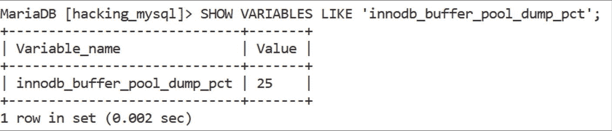
**图 7-3** `innodb_buffer_pool_dump_pct` 变量的默认值

由于此参数的定义是设置缓冲池要读取的最近使用的数据库页面的百分比，因此该参数的值可以在 1 到 100 之间，并且该参数的值是一个百分比，也可以设置为 100，这意味着 InnoDB 将尝试在不进行磁盘读取的情况下访问内存中的所有数据。在将此值设置为 100% 之前，请注意此变量只会保存缓冲池中数据的百分比，而不是整个缓冲池本身，例如，如果您有一个 100GB 大小的缓冲池，并且缓冲池包含 20GB 的数据，将此变量设置为 100% 将仅保存 20GB 的数据。

除了优化磁盘 I/O 之外，请记住 MySQL 中的某些选项仅对使用 Unix 架构的用户可用。前面提到的 `O_DIRECT` 模式将启用 I/O 吞吐量的直接模式，该模式将绕过操作系统的缓存，并使用在 Windows 中不可用的选项。

最后，请记住，操作系统中运行的所有程序也在消耗内存。您的数据库肯定不是唯一使用内存的程序，据说 Windows 通常比 Linux 使用更多内存，因为它预装了许多附加组件，但如果您在 Linux 上安装数千个额外的应用程序，它们也会消耗内存。避免安装不需要的应用程序，您就可以将更多内存分配给数据库和应用程序。

### 测试您的硬件
无论您使用什么操作系统，硬件通常是许多数据库的限制因素。无论您拥有数十亿行数据，还是刚刚起步——如果您的硬件成为限制因素，随着时间的推移，与它们交互可能会变得困难。困难可以通过正确配置数据库来克服，但如果您的硬件不允许，即使配置也可能成为一项艰巨的任务。许多数据库会有某些限制——而其中许多限制与您系统上的硬件有关。


#### MySQL 数据库优化与 ACID 特性详解

##### 实践中的数据库优化

如果您已经读到这里，很可能已经根据服务器内部的硬件配置，采取了优化数据库的措施。测试硬件当前性能最可靠的方法之一，就是与您的数据进行交互。与您的应用程序一起工作一两周——您注意到了什么？是否出现了任何问题？客户或用户是否会就与数据库相关的任何事情联系您？

在与数据库交互时，请记住，保持内存和磁盘资源之间的平衡至关重要。谁不希望所有的数据都能从内存中读取，以获得极速的性能？不幸的是，内存比硬盘空间要有限得多；但即便如此，还有许多其他因素在起作用：我们有查询缓存、读写操作、刷盘、I/O 操作以及许多其他因素，它们中的每一个都能帮助我们使数据库和硬件协同工作。

##### 数据库性能测试工具

有一些工具可以用来测试您的 MySQL 设置——其中一个是前面提到的`mysqlslap`（在 MariaDB 中是`mariadb-slap`），它帮助您模拟多个并发连接到 MySQL 或 MariaDB，并帮助查看您的数据库如何处理问题。CentOS 用户可以利用`sysbench`。还有`mysqlshow`及其在 MariaDB 中的等效命令`mariadb-show`，它们显示与数据库、表及其中列相关的信息，以便您了解从何处着手。让我们来试用一下`mariadb-show`。

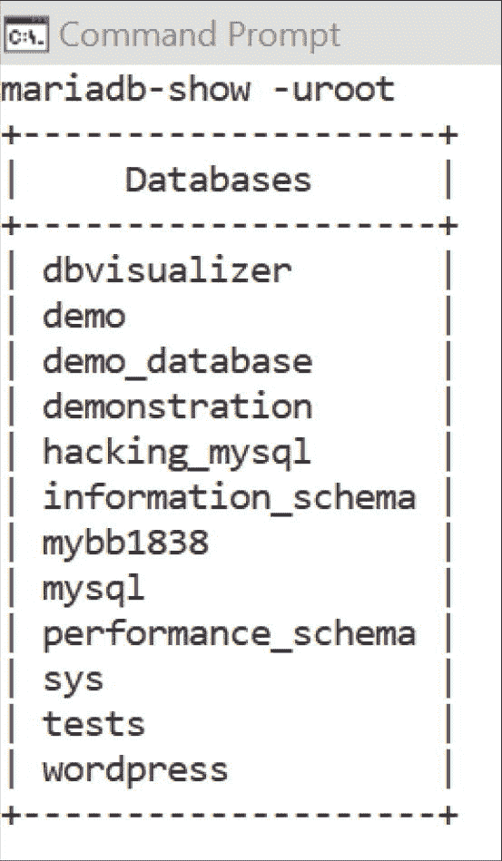
*图 7-4: 默认行为下的 mariadb-show*

默认情况下，此工具只会显示数据库服务器中的数据库。可以通过在选项列表中提供其名称来深入查看特定数据库。我将对 MyBB 数据库进行此操作。

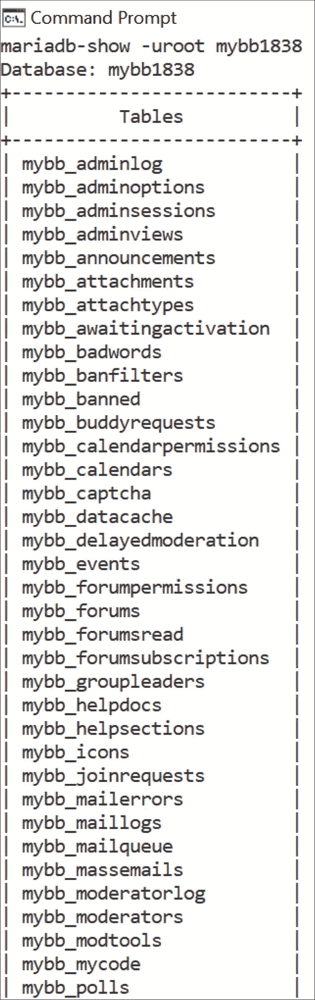
*图 7-5: 在 MariaDB 中深入查看 MyBB 1.8.38 数据库*

`mysql-show`和`mariadb-show`都有很多选项，可以让我们深入了解表结构和其中的数据。运行如下查询：

```
mariadb-show -uroot mybb1838 --count --status --keys
```

将为我们提供大量信息，范围从行数（`--count`）、MyBB 1.8.38 表的额外信息（`--status`），到一些关于索引的信息（`--keys`）。

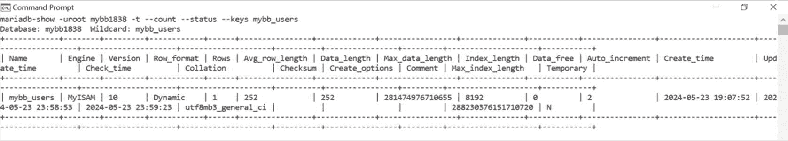
*图 7-6: mariadb-show 实战*

从`mariadb-show`和`mysqlslap`等工具中收集信息，以了解如何最好地优化服务器，使其发挥全部能力来帮助查询成功，但也不要忽视基本数据库标准和特性的重要性。

##### 充分利用 ACID 特性

最后但同样重要的是，如果优秀的数据库不遵守标准和特性，它们又有什么用？谁会相信数据库能够存储他们最珍贵的数据？数据必须可靠地存储——这是一个事实。如果我们从宏观角度来看，所有数据库都能安全地存储数据，对吧？毕竟，哪家公司会把数据存储在一个明知可能随时崩溃的数据库中呢？

所有数据库都允许您安全地存储数据——但数据库所基于的模型之间存在根本性差异。有两种模型——一种追求更好的数据一致性，另一种追求更高的可用性。这两种模型就是 ACID 和 BASE，并且在给定时刻只能使用其中一种模型。ACID 将用于关系数据库管理系统，而基于 NoSQL 的系统将使用 BASE，因此您无法同时利用两者的优点——但这也正是它们各自魅力的所在。

ACID 是一个缩写词，它与关系数据库管理系统相伴而生，帮助它们实现原子性（**A**tomicity）、一致性（**C**onsistency）、隔离性（**I**solation）和持久性（**D**urability）。这正是该缩写词所代表的含义——这也是为什么您会看到像 MySQL 这样的关系数据库在断电或灾难来袭后依然屹立不倒，而许多基于 BASE 的数据库则需要恢复其数据；ACID 帮助我们确保即使在灾难发生时，我们的数据也能保持一致性和持久性。

各种关系数据库管理系统对 ACID 的实现略有不同，因为没有两个数据库是完全相同的，但对于 MySQL，其过程如下：

*   **原子性**由`COMMIT`和`ROLLBACK`语句处理——它确保事务中的所有查询作为一个团队协同操作。
*   **一致性**由 MySQL 日志记录机制和记录 InnoDB 中所有更改的日志文件（`ib_logfile0`和`ib_logfile1`）处理。一旦需要恢复数据，就会扫描日志文件。
*   **隔离性**指的是 InnoDB 中可用的行级锁。
*   **持久性**由错误日志和其他日志文件的性质保证——对某些人来说，这些文件是防御数据库错误的第一道防线。

ACID 就是为什么有时您会听到开发人员说“对数据的更改应该被提交”并疑惑其含义的原因——“提交对数据的更改”意味着将它们保存到数据库文件中。一旦更改被提交，它们就会永久保存并变得对其他会话可见。

ACID 是所有 MySQL 变体中 InnoDB 存储引擎的支柱，这也是为什么 InnoDB 存储引擎是 MySQL 和 MariaDB 中默认可用的存储引擎的原因之一：它遵守 ACID 特性的能力鲜有对手（RocksDB 也支持 ACID），并且它对之前仅在 MyISAM 中可用的功能的支持，使其能够适应即使是最苛刻的工作负载。

在 MySQL 中，也可以通过参数`innodb_flush_log_at_trx_commit`关闭 ACID 合规性，以换取更快的速度，但代价是可能丢失最多一秒的数据。默认情况下，InnoDB 会在事务提交时将数据刷新到日志文件，从而确保 ACID 合规性（这就是为什么该变量初始值设置为 1），但一些技术爱好者会知道该变量也可以有其他值——0、2，如果使用 MariaDB，还可以是 3。每个值执行不同的任务：

*   **值为 0 与重做日志有关。** 如果`innodb_flush_log_at_trx_commit`设置为 0，重做日志每秒只写入并刷新到磁盘一次，因此不保证 ACID 合规性，但速度更快。
*   **值为 1 与 ACID 合规性有关。** 如果`innodb_flush_log_at_trx_commit`设置为 1，InnoDB 将符合 ACID 标准。
*   **值为 2 与提交和刷新操作有关。** 如果`innodb_flush_log_at_trx_commit`设置为 2，InnoDB 将在事务提交时将数据写入日志文件，但每秒只将数据刷新到磁盘一次。
*   **值为 3 与 MariaDB 有关。** 如果`innodb_flush_log_at_trx_commit`设置为 3，MariaDB 将在数据准备好和提交时将其刷新到磁盘，这可能会导致操作变慢。

你们大多数人不需要将`innodb_flush_log_at_trx_commit`参数更改为其他值，但如果需要深入研究数据的原子性、一致性、完整性或持久性，或者需要用速度来交换 ACID 特性，您就知道该找谁了。

ACID 还有一个姐妹叫 BASE——BASE 特性确保高可用性并最终一致。换句话说，BASE 意味着数据库努力确保我们的数据基本可用、处于软状态，并最终能够变得一致。BASE 模型侧重于高可用性，而 ACID 侧重于数据一致性和完整性：

## 8. 优化存储引擎、模式与数据类型

### 概要

每个数据库都运行在服务器上——无论你使用的是哪种服务器，总有可以改进之处。对于大多数开发者来说，一旦他们理解了数据库使用了哪些组件、哪些问题限制了数据库性能、以及如何正确地选择硬盘驱动器和其他组件，并配置与 `InnoDB` 磁盘 I/O 相关的选项，为 MySQL 优化服务器就变成了一项简单的任务。完成这些后，基本可以放心地说，数据库得到了妥善的管理。

为数据库优化服务器涉及的事项远不止磁盘 I/O、可用内存量或调整 CPU——没有哪两个数据库管理系统是完全相同的，所有数据库都有大量可以优化的内部选项以实现性能目标：对于 MySQL 而言，这一切都始于存储引擎。

一旦选择并理解了合适的存储引擎，我们就可以着手优化我们的模式、数据类型，最终——针对包括大数据在内的各种用例优化 SQL 查询。

存储引擎是 MySQL 的支柱——它们驱动着我们的数据，并告诉数据库如何与数据交互。我在本书第 2 章中已经介绍过它们。存储引擎并非孤立存在：它们容纳着数据库模式、数据类型、排序规则、索引等内容，而所有这些内容都有其优点和缺点。无论如何，存储引擎过去、现在和将来都将是点燃火焰的火花；这火焰温暖你的数据，并让你的应用程序用户感到愉悦。

为了让这火焰持续燃烧，让用户感到满意，在处理数据时，你应该遵循许多原则——你的存储引擎应该得到优化，其中的数据库应安全地保存数据，并且你应该格外注意所使用的数据类型。

### 为什么要优化存储引擎和数据类型？

首先，是存储引擎。简而言之，存储引擎是 MySQL 内部的组件，允许 MySQL 对各种数据类型执行特定操作。MySQL 支持多种存储引擎，可以通过修改 Windows 上的 `my.ini` 或 Linux 上的 `my.cnf` 来修改这些存储引擎的内部功能。

打开与你的操作系统相关的配置文件，你会很快发现并非所有 MySQL 存储引擎都有可用的配置选项；Windows 用户的配置文件在选项和注释方面会慷慨得多，而大多数 Linux 用户的可选选项较少，其中大部分选项很可能首先与主要存储引擎——`InnoDB`——相关。

无论如何，`InnoDB` 可以根据你的硬件能力进行尽可能多的优化：你可能想翻回第 2 章，以了解存储引擎中每个变量的功能，但无论你使用何种参数或存储引擎，事实是你会使用它来存储数据；数据以各种形式和形态出现，虽然数据类型看起来像是池塘里的小鱼，但随着越来越多的数据被引入你的数据库，它们的重要性只会增加。没有生产数据库不包含表；数据库中的表意味着其中驻留着数据，而驻留的数据意味着它由一个或多个数据类型所支撑。数据类型并非一成不变：它们可以被调大、调小或完全更改，但没有表可以脱离它们而存在。

### 优化存储引擎

对于许多运行 MySQL 的生产环境来说，优化存储引擎归结为优化 `InnoDB`。它的伙伴 `MyISAM` 可能会偶尔出现，但它不应该是你的优先事项。我已经在本书第 2 章中介绍了可以优化以使 `InnoDB` 正常工作的参数，但在你开始基于它们构建应用程序之前，还应该了解其他一些事项。这些事项包括为运行大量表的设备优化 `InnoDB` 的方法、为只读应用程序优化 `InnoDB`、优化 `InnoDB` 重做日志以及正确处理存储引擎中的事务。

#### 针对包含大量表的应用程序的注意事项

首先，如果你为包含大量表的应用程序使用 `InnoDB`，你这样做是有充分理由的——无论这个理由是什么，关键是要有明确的目标并有效地进行。要在 `InnoDB` 中处理大量表，请考虑：

*   **数据库的排序规则**：字符串根据排序规则进行匹配和排序。一个好的排序规则并非能解决你所有问题的万能钥匙，但它是为你的数据开启更美好未来的一把钥匙。
*   **数据类型和字符集**：数据库中的所有表是否使用相同的字符集？为什么使用/不使用？正在使用哪些数据类型？
*   **向 MySQL 表加载/从中提取数据的方法**：这将取决于你的用例，但也请思考你从数据库加载和提取数据的方式。许多开发者抱怨数据加载缓慢，而你的数据库只负部分责任。其余的责任在你。
*   **你处理的数据/数据类别类型**：仔细选择你处理的数据类别。遵守你和/或你的公司可能知晓的所有规定（除非必要，否则不要存储私人数据），并且在选择数据长度时也要谨慎。
*   **备份策略**：仔细备份你的数据。备份数据库中的表很简单，但如果你的数据量很大，事情可能会变得有点复杂。你可以利用一系列 `SELECT ... INTO OUTFILE` 查询来备份原始数据——我将在“为大数据优化 MySQL”一章中带你了解这类查询，并在专门介绍备份的章节中更详细地介绍备份。

#### 针对只读操作和事务的优化

要为只读操作优化 `InnoDB` 并正确处理事务，请考虑以下几点：

*   **精心设计和选用索引**：MySQL 及其同类产品提供了多种索引供你选择，选择正确的索引类型并谨慎使用，对于你的查询和数据库来说可能是生死攸关的差别。关于索引的建议，请参阅有关索引的章节。


### 优化 MySQL 性能的注意事项

#### 按需分区数据
你已经了解了分区的强大功能，分区与索引结合可以形成一个极其强大的组合。我指的是在毫秒内扫描数十亿行数据——如果你的存储引擎经过优化、索引已就位，但对更大数据集的查询仍然完成得很慢，那么索引可能就是罪魁祸首。

#### 检查 InnoDB 的缓冲池和日志文件
确保 InnoDB 缓冲池和日志文件的大小足够大。我已经多次提到这一点，这样做有助于减轻 InnoDB 不必要的磁盘刷新和其他活动。旧版本的 MySQL 有名为`innodb_buffer_pool_read_requests`和`innodb_buffer_pool_reads`的变量，分别描绘了读取缓冲池的请求次数以及实际发生了多少次读取，这些信息也很有用。但如果你使用的是较新版本的数据库管理系统，这些选项很可能已经消失了。

#### 利用 `START TRANSACTION READ ONLY` 语句
这个语句虽不广为人知，但对于运行只读事务的用户来说，MySQL 5.6 引入了一项重要的更新：MySQL 有意通过避免设置事务 ID 来减少 InnoDB 中只读事务的开销。这是一个小改动，但由于事务 ID 仅用于写操作或带有锁定读的操作，只读事务可以变得更快。

#### 帮助 InnoDB 检测只读事务
这可以通过使用前述的只读语句，或者通过开启`autocommit`设置并运行非锁定的 select 查询来实现。

#### 插入大量数据时关闭 `autocommit`，待所有数据插入完成后再启用
执行此操作后，InnoDB 将不再在每次插入行时提交——而是会在所有事务完成后才进行提交，从而使你的`INSERT`查询更快。

### 数据类型

#### MySQL 中的数据类型
数据库最佳实践之一与数据类型有关：它们直接决定了你数据的大小，而你的数据集越大，数据类型就越重要。正如本书第 3 章已经提到的，MySQL 有多种数据类型，但可以简化为几个主要类别：字符串、数值以及日期和时间类型。

表中的每一列都将有一个数据类型，根据该数据类型，你的数据库将被告知应在该特定列中存储什么数据。此外，请记住，任何表中存储的值都会受到字符集的影响，无论它们使用什么数据类型——根据你所使用的字符集，MySQL 为每个存储的字符分配的字节数可能更多或更少。Latin1 或 ASCII 字符集不太可能每个字符需要超过 1 字节的存储空间，基于 utf8 的字符集可能需要 3 字节，而由于 utf8mb4 涵盖所有 Unicode 字符，存储一个字符最多需要 4 字节的空间。

要完全理解数据类型，你需要比仅仅了解表面更深入——数据类型的存在是有原因的，你插入列中的所有数据也会影响最大列大小。默认情况下，MySQL 的列大小限制为 767 字节，这是导致类似以下错误的主要原因之一：

```
Index column size too large. The maximum column size is 767 bytes.
```

当索引列大小超过 767 字节时会发生此类错误——换句话说，当我们有大约 200 个字符的`VARCHAR`或`TEXT`类型列，并且其排序规则要求每个字符超过 3 字节时，就可能遇到此类错误。可以通过将 InnoDB 表的格式设置为`DYNAMIC`或`COMPRESSED`来克服此类错误，但说实话，如果你面临此类错误，问题可能要深得多：你首先为什么需要索引一个包含 200 个字符的列？哪些读取操作能从如此长的列中受益？换句话说，*你的用例是什么？* 你会惊讶于有多少开发人员在定义列长度时只是随意填个“255”，好像这是定义长度的唯一值似的。你能用更少的字符处理列吗？当然可以——为什么不将列长度设置为你实际预期的最大长度呢？将列长度设置为 60 甚至 40 字符可能才是既能节省磁盘空间、防止错误，又能让你免于头疼的最佳选择。

#### 字符串数据类型
就字符串数据类型而言，如果我们比较 MySQL 和 MariaDB，会发现大多数数据类型是相同的，但仔细观察会发现 MariaDB 支持一些 MySQL 不支持的字符串数据类型，包括`LONG`和`LONG VARCHAR`（这些是`MEDIUMTEXT`的同义词）、用于存储过程的`ROW`数据类型，以及`UUID`数据类型和`INET4`或`INET6`数据类型。

MariaDB 在提供如此广泛的字符串数据类型方面是独特的，虽然 MySQL 不直接提供这些数据类型，但人们可以使用某些函数来实现类似的目标。

MariaDB 提供的字符串数据类型确实独特：该 DBMS 提供的 UUID 数据类型让我们可以存储**通用唯一标识符**，它们是 128 位 36 字符的字符串，用于唯一标识对象；而 INET4 或 INET6 数据类型则适合存储 IPv4 或 IPv6 相关数据。

除了 MariaDB 特有的数据类型外，该 DBMS 也支持“普通”字符串数据类型，如`VARCHAR`和`TEXT`。有些人可能会想知道 MariaDB 对基于字符串的数据类型的支持是否与 MySQL 的做法不同，简短的答案是肯定的，但只在某些有意义的情况下。例如，由于 MariaDB 支持 MySQL 不支持的引擎，如 ColumnStore，如果我们在 ColumnStore 中使用`VARCHAR`数据类型，我们定义的数字将不再代表可以存储的最大字符数——它将代表列的最大字节长度。这是合理的，因为 ColumnStore 适用于极其庞大的数据集（PB 级），如果你在 MariaDB 中存储如此大量的数据，字节可能比列中的字符数更重要。

#### 数值数据类型


#### MariaDB 中的数值数据类型

除了字符串数据类型外，MariaDB 也支持数值数据类型。在这方面，事情稍微简单一些：虽然 MySQL 中不可用的数据类型在这里得到了支持，但这些数据类型并非革命性的，它们更多是代表同义词，而非 MariaDB 独有的全新数据类型。

此类同义词包括数据类型 `INT1`、`INT2`、`INT3`、`INT4` 和 `INT8`。这些数据类型分别是 `TINYINT`、`SMALLINT`、`MEDIUMINT`、`INT` 和 `BIGINT` 的同义词。数值数据类型本身并不特别令人印象深刻，但请记住，它们的类型（如 `TINYINT` 等）与其对应的字符串类型并非完全“直接映射”：例如，`TINYTEXT` 最多支持 255 个字符，而 `TINYINT` 的大小范围并非 0 到 255，而是 -128 到 127。

你无需记住每种数据类型的大小，但要记住 `INT` 并非解决所有问题的唯一选择——许多开发者在 `TINYINT` 就已足够的情况下仍定义 `INT` 作为数据类型，这会让你感到惊讶。请注意表的结构并提前思考——数据类型并非一成不变，但提前定义一个考虑周全的数据类型，无论该数据类型是文本还是整数相关的，都可能在未来为你带来诸多好处。

### 日期、时间、空间和 JSON 数据类型

除了字符串和整数数据类型外，还有一些数据类型也非常适合其他各种用途。这些用途可能包括存储时间值、地理约束或 JSON 数组。

在数据库管理系统中使用多种数据类型的场景不计其数，这就是为什么 MySQL 对字符串或整数数据类型的支持并非终点：许多应用程序会为内部目的记录用户执行操作的时间，这是借助描绘日期和时间值的数据类型完成的。其中最流行的数据类型可能包括 `TIMESTAMP` 和 `DATETIME` 数据类型，还有一些数据类型支持特定格式：`DATE` 数据类型可以让你以 `YYYY-MM-DD` 格式存储日期，`TIME` 数据类型可以以 `HH:MM:SS.ssssss` 格式存储精确到毫秒的时间，而 `YEAR` 数据类型则能够存储年份。几何或空间数据类型，如 `GEOMETRY` 或 `POINT`，有助于存储空间数据，而 `JSON` 数据类型则使开发者能够处理基于 `JSON` 的数据集。

对 `JSON` 数据类型的支持也并非什么新鲜事：开发者确实需要处理 JSON 数据，自然也需要将其存储在数据库中。MySQL 的高级用户会知道，在 MariaDB 中，由于与 MySQL 的兼容性问题以及 SQL 标准问题，`JSON` 与 `LONGTEXT` 是相同的。尽管如此，MariaDB 提供了对 `JSON` 数据的完整支持，甚至为用户提供了函数，允许在向表插入任何数据之前检查其结构的有效性。为此，我们需要创建一个带有 `CHECK` 约束的表，该约束与检查列中数据有效性的 `JSON_VALID` 函数协同工作。整体看起来大致如下：

```sql
--首先，我们创建带有 CHECK 约束的表：
CREATE TABLE `json_demo` (
`json_col` JSON
CHECK (JSON_VALID(`json_col`))
);
--我们的数据库将允许类似这样的 JSON 值：
INSERT INTO `json_demo` VALUES ('{"id": 1, "information": "This book is cool!", "extra": "Read on and learn more things."}');
--但禁止以下无效的非 JSON 值：
INSERT INTO `json_demo` VALUES (`Invalid value`);
```

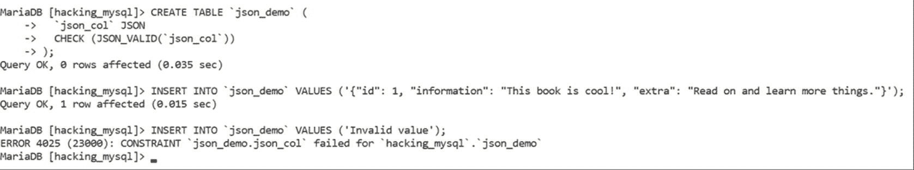

图 8-1：JSON 列验证示例

### 数据类型的存储要求

数据类型并非孤立存在——它们带有你必须考虑的显著开销：该开销与存储要求有关。存储要求不仅取决于数据类型，还取决于你所使用的存储引擎，并且根据你使用的是 InnoDB 还是 NDB 引擎而有所不同。

你必须考虑的主要区别在于存储引擎存储数据的方式：InnoDB 以其行存储格式而闻名，这些格式具有多种不同的特性，这就是人们通过更改行存储格式来“克服”诸如“索引列大小过大”之类问题的原因；要理解为什么切换到不同的 InnoDB 行格式可能解决问题，我们必须了解各种 InnoDB 行格式的特性。下面列出了部分 InnoDB 行格式的特性：

| InnoDB 行格式 | 特性 |
| --- | --- |
| `DYNAMIC` | InnoDB 中的默认行格式。与 `COMPACT` 类似，具有相同的存储要求。支持大索引前缀。 |
| `COMPACT` | 提供紧凑存储支持，但不支持大索引前缀。存储要求与 `DYNAMIC` 相同。 |
| `REDUNDANT` | 此行格式是冗余的，因为它大多已不可用；其目的是为旧版 MySQL 提供支持。 |
| `COMPRESSED` | 以其对表和索引的数据压缩支持而闻名，其他方面与 `DYNAMIC` 行存储格式作用相同。 |

行格式可以全局更改（为此，我们需要修改 `my.ini` 或 `my.cnf` 中的 `ROW_FORMAT` 变量，并将其设置为上述可用值之一），也可以通过类似下面的 `ALTER TABLE` 查询按数据库/表进行更改：

```sql
ALTER TABLE [table_name] ROW_FORMAT=[format here];
```

行格式也有两个“姐妹”——Antelope 和 Barracuda。这两个姐妹指的是 InnoDB 中可用的文件格式，并与行格式协同工作：就 InnoDB 而言，Antelope 支持 `COMPACT` 和 `REDUNDANT` 行格式，在过去，它是 MySQL 中的默认文件格式。Barracuda 支持 InnoDB 中所有可用的行格式，并且是当今 MySQL 和 MariaDB 中的默认文件格式。

现在你了解了文件格式和行格式也在起作用，是时候看看特定数据类型的实际存储要求了。为简化呈现，我将使用两个字母——B 表示“以字节为单位的列长度”，C 表示“以字符为单位的列长度”：

| 数据类型 | 存储要求 |
| --- | --- |
| `VARCHAR(C)` 和 `VARBINARY(C)` | 如果 C 小于 255 字符，则为 B + 1 字节。否则为 B + 2 字节。 |
| `TINYBLOB`/`TINYTEXT`、`BLOB`/`TEXT`、`MEDIUMBLOB`/`MEDIUMTEXT`、`LONGBLOB`/`LONGTEXT`/`JSON` | B + 1 字节、B + 2 字节、B + 3 字节、B + 4 字节 |
| `TINYINT`、`SMALLINT`、`MEDIUMINT`、`INT`/`INTEGER`、`BIGINT` | 分别为 1、2、3、4 和 8 字节。 |
| `YEAR`、`DATE`、`TIME`、`TIMESTAMP`、`DATETIME` | 分别为 1 字节、3 字节、3 字节、4 字节和 5 字节。`TIME`、`TIMESTAMP` 和 `DATETIME` 还需要额外的几个字节来存储小数秒部分。 |

上表并未涵盖绝对所有数据类型，但它将为你提供一个良好的起点。在有了良好的开端之后，请理解存储要求可能会根据你在列中存储的字符数量以及你使用的字符集而发生变化，因为某些字符集可能由于各种原因需要多于一个字节来存储一个字符。

### 选择合适的数据类型

要为你的用例选择合适的数据类型，请从宏观视角审视你的数据库及其内部的表：存储了什么数据？更新频率如何？是否使用了索引？数据是否分布在多个分区上？


这些问题的答案将引导你走向一种对你和你的数据库都可接受的数据类型路径。例如，索引如果使用得当就非常棒——但并非所有索引都能以相同的方式适用于所有数据类型。一旦创建了索引，请注意以下适用规则：

*   如果你为 `BLOB` 或 `TEXT` 数据类型的列创建索引，请注意你无法对它们进行完整索引：这类数据类型需要使用前缀索引。前缀大小取决于所使用的行格式——如果我们使用 `COMPACT` 或 `REDUNDANT` 行存储格式，前缀长度最多可达 767 字节；如果我们使用默认的 (`DYNAMIC`) 或 `COMPRESSED` 行存储格式，长度限制则跃升至 3072 字节。对于使用 `MyISAM` 的用户，此限制将被设置为 1000 字节。

*   数据类型会影响索引大小：索引大小越小，所需的分页操作就越少。此外，如果需要进行比较操作，比较整数值通常会比比较变长字符 (`VARCHAR`) 值更快。

这些规则同样适用于数据库中的分区和其他操作——这些操作直接依赖于你的具体用例。不过，在这里无需“重新发明轮子”：选择合适的数据类型并非难事，你只需要根据具体用例选择最精确的存储单元即可。换句话说，在决定为待存储的值选择何种数据类型之前，请查阅文档。例如，如果你打算存储 0 到 100 的整数值，可以考虑 `TINYINT`。需要存储较大的文本值并且需要为整列创建索引？可以考虑 `VARCHAR`，等等。

#### 为大数据优化模式和数据类型

当涉及更庞大的数据集时，情况就变了。你无需深究就能明白其中存在一种负面看法：“用 MySQL 处理大数据？你疯了吗？！”

如果我们退后一步，就不难理解，只要正确优化你的服务器和其中的数据，一切都是可能的。当然，如果你发现自己使用的是共享主机，运行大型数据集可能会力不从心；但其余部分则归结于经验、阅读和持续学习，而且即便是在普通规模的 VPS 上运行大型数据集，一开始也并非难事。我将在下面给你一个很好的例子：

在以下事项中，当你在中型服务器上为大数据优化数据库时，首先应该关注哪一项？

1.  数据库中有多少张表。
2.  在数据库管理系统中运行的查询数量/种类。
3.  配置文件 (`my.ini` 或 `my.cnf`)。
4.  数据类型。
5.  索引。

思考一下：最合乎逻辑的答案是什么？对——你会查看配置文件。为什么？因为那是一切的起点。你可能已经对所有最紧迫的问题（你的 `INSERT` 查询慢吗？将它们切换到 `LOAD DATA INFILE`，等等）有了答案，但只有在你理解了这些答案的内在机制——一旦你明白了是什么让它们运转——你才能理解是什么让你的数据库发挥出最佳性能。

清单中的所有事项都很重要，这一点无可否认——我们将在本书后面专门讨论大数据的章节中深入探讨如何处理大数据，你将发现所有这些元素协同工作的协同效应对于你的数据库是多么关键——但现在，请回到模式和数据类型的领域。你如何为大数据优化它们？

这个问题很复杂：答案却很简单——保持方法简单，避免复杂的决策。在这个领域，保持简单将为你省去很多麻烦——你已经有大量数据要处理，为什么还要给自己增添额外的问题呢？规则很简单：

1.  仔细构建你的表结构，并着眼于未来。
2.  如果你不需要特定的排序规则，请选择通用的用例排序规则。
3.  保持数据类型简单。
4.  只为必要的内容创建索引。
5.  如果进行分区，请研究分区的细节，并选择最适合你用例的分区类型。

保持简单，并了解数据类型的内在机制，以使自己远离麻烦。始终记住例子——存储 0 到 100 的整数？考虑 `TINYINT`。这同样适用于其他数据类型——查阅文档并与同事交流，以做出明智的决定，这样为大型数据集选择数据类型就不会看起来像一个需要解决的大问题了。

做出明智的决策除了涉及数据类型外，还涉及许多其他方面，而当涉及更大的数据集时，这些操作可能会变得更加困难，这就是为什么本书有一整章专门讨论大数据：有太多的内容需要讲述，所以请保持好奇并跟随阅读——在你学会优化查询之后，我将告诉你关于大型数据集的内容。

### 总结

优化存储引擎、模式和数据类型并非易事，但为了提升查询性能，必须完成这项工作。存储引擎、模式和数据类型构成了冰山隐藏在水下的部分，但对于那些力求在日常使用 `MySQL` 或 `MariaDB` 时实现高性能的人来说，理解它们至关重要。

如果不优化查询本身，很少能实现高性能，而查询的内在机制包含很多内容——现在，我将引导你了解如何做到这一点。

## 9. 优化查询

优化 SQL 查询性能是一项重大的任务。要正确理解其原因，我们必须回到基础：数据可以被插入、更新、选择，必要时也可以被删除。这四项任务需要四种类型的 SQL 查询存在：这些查询是 `INSERT`、`UPDATE`、`SELECT` 和 `DELETE`。还有其他查询，但这四种查询构成了一个“CRUD 三角”：一个可以*创建*、*读取*、*更新*和/或*删除*数据的查询三角。

为了优化这些查询，我们需要理解一个在本书中已被多次重复的简单真理：查询就是任务——要优化其性能，我们就要优化这些任务的性能或者消除它们。要开始优化任务性能或消除它们，我们必须了解这些任务，而要了解它们，我们必须熟悉其内部机制。回顾第 4 章——我们在那里已经熟悉了 `SELECT` 查询的性能剖析。我稍后会回到这个问题，但首先，我会回答这个迫切的问题。

### 为什么要优化 SQL 查询？

“我今天真高兴我的 SQL 查询很慢！”——从来没人这么说过。缓慢的 SQL 查询是导致你作为开发者头疼的许多原因，是你公司获得差评的原因，或者是你老板失去客户的原因。在许多情况下，缓慢的 SQL 查询是任何性能不佳的应用程序的基础：如果我们不优化它们，就别想提升数据库的效率和性能。

你已经知道什么因素可能破坏你的查询：你的模式设计不完美，数据类型在你的数据库中随意存在，或者你有太少（或太多）的分区或索引。答案取决于你正在运行的查询类型。第 4 章已经展示了通过使用 `SHOW PROFILES` 来剖析查询性能的方法：性能剖析文件包含查询执行的任务。剖析你的查询——性能剖析会提供一个良好的起点。完成之后，请记住以下内容：


#### MySQL 查询优化指南

### 优化准则

*   优化 `INSERT` 查询时，应尽可能延迟“通知数据库”（即提交操作）。理想情况下，仅在将一批数据插入数据库后再提交。应尽可能减少开销，利用磁盘 I/O，同时牢记基本原则。如果必要数据位于不同的表中，考虑使用 `SELECT` 查询插入数据；在创建表时运行 `SELECT` 操作（见下例）；并记住，原始数据插入将显著快于使用 `INSERT` 语句插入数据。

*   优化 `SELECT` 查询时，确保数据库扫描尽可能少的数据。真的就是这样——使用 `SELECT column` 而不是 `SELECT *`（避免从数据库中获取所有列的数据），不要获取超出需要的行，并避免重复获取相同数据。

*   优化 `UPDATE` 查询时，应批量更新数据。利用锁机制，注意 `NULL` 值，考虑数据库负载，并使用 `WHERE` 和 `LIMIT` 子句。有时，你也可以利用 `DEFAULT` 子句。稍后会详细说明。

*   优化 `DELETE` 查询时，使用带有 `WHERE` 或 `LIMIT` 子句的 `DELETE` 查询，或者直接将 `DELETE` 切换为 `TRUNCATE`。请记住，MySQL 总是提供了删除部分数据的能力，而你所使用的存储引擎也会有影响。

### 优化特定类型的查询

现在，如何优化特定类型的 SQL 查询？假设你的 `my.cnf`（或 `my.ini`）文件中的设置已针对特定存储引擎进行了优化，你需要利用基本建议以及针对你所用存储引擎的具体建议。这现在听起来可能不太明白，但继续看下去你很快就会明白。

首先，基础知识。一旦我们执行一个 SQL 查询，MySQL 会遵循一个四步流程：

1.  MySQL 客户端将我们的 SQL 查询发送到服务器。
2.  数据库服务器在查询缓存中检查是否有匹配项。
3.  准备并执行查询执行计划。
4.  返回结果。

查询缓存是第一站——奇怪吗？不应该；查询缓存是一些使用 MariaDB 或 MySQL 的应用程序能够即时返回结果的主要原因。商业搜索引擎甚至可以利用这一点作为营销技巧——“嘿，我们的搜索引擎能在毫秒内返回结果！看……” 查询缓存会缓存与特定 SQL 查询对应的结果集：如果找到匹配项，则重用结果集。如果数据库服务器无法从查询缓存返回结果，它将遵循查询执行计划并返回结果。

#### 查询缓存

如果 MySQL 首先停留的地方是查询缓存，我们难道不能尽可能多地从查询缓存返回结果吗？嗯，不能，但我们可以利用 SQL 查询缓存中可用的模式。如果我们在 `SELECT` 语句中指定 `SQL_CACHE`，就启用了 `DEMAND` 模式：

```
SELECT SQL_CACHE customer_id, cat FROM products;
```

我们也可以使用 `SQL_NO_CACHE` 语句告诉 MariaDB 我们完全不想使用 SQL 查询缓存：

```
SELECT SQL_NO_CACHE customer_id, cat FROM products;
```

一般来说，SQL 查询缓存有三种模式——`ON`、`DEMAND` 和 `OFF`。`ON` 将允许查询被缓存，`DEMAND` 允许你按需缓存查询，而将查询缓存设为 `OFF`（或将 `have_query_cache` 变量设置为 `NO`）将禁用查询缓存。在 MariaDB 中，有 7 个变量与查询缓存相关，如下所示。

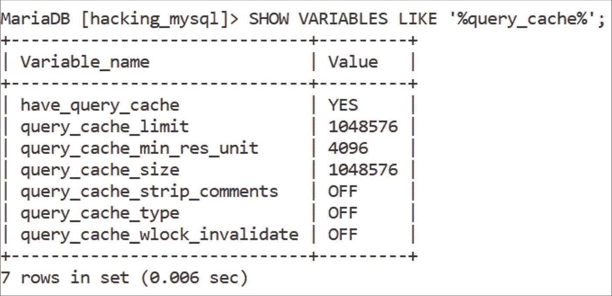

它们的含义如下：

| 变量 | 含义 |
| --- | --- |
| `have_query_cache` | MariaDB 查询缓存是否存在？可用值为 `YES` 和 `NO`。 |
| `query_cache_limit` | 超过此大小限制的结果将不会被缓存。 |
| `query_cache_min_res_unit` | 查询缓存的最小大小（以字节为单位）。 |
| `query_cache_size` | SQL 查询缓存的大小。 |
| `query_cache_strip_comments` | 指定在缓存查询前是否删除所有注释。 |
| `query_cache_type` | 前述的 SQL 查询缓存类型。 |
| `query_cache_wlock_invalidate` | 如果获取了写锁，查询缓存中的 SQL 查询将失效。 |

虽然我不建议仅依赖 SQL 查询缓存，但说查询缓存不是一个有用的帮手也不对。查询缓存是第一站——第二站是查询执行计划。查询执行计划将对你的查询进行测试，并展示你的数据库的能力。

#### 优化 INSERT 查询

我们的第一站与 `INSERT` 查询有关。数据库中的数据之所以存在是有原因的：有人插入了它！真令人惊讶。可以通过以下方式将数据插入数据库：

1.  使用普通的 `INSERT` 查询
2.  使用批量 `INSERT` 功能
3.  将 `SELECT` 与 `INSERT` 结合使用
4.  利用 `LOAD DATA INFILE` 查询

现在，从头开始——首先，我们有像这样的普通 `INSERT` 查询：

```
INSERT INTO 'demo_table' [col_1,col_2,col_3,...] VALUES ('Value 1', 'Value 2', 'Value 3',...);
INSERT INTO 'demo_table' [col_1,col_2,col_3,...] VALUES ('Value 4', 'Value 5', 'Value 6',...);
```

这样的 `INSERT` 查询也可以这样写：

```
INSERT INTO 'demo_table' [col_1,col_2,col_3,...] VALUES ('Value 1', 'Value 2', 'Value 3'), ('Value 4', 'Value 5', 'Value 6'), ...;
```

如你所见，如果值同时插入所有列，指定列名也是可选的。第一个查询是你在许多软件工程和数据库教程中会看到的默认 `INSERT` 查询示例——第二个是你在检查备份时最有可能看到的。这两个查询做的是同一件事——插入数据——但第二个比第一个更强大，因为行由逗号（“,”）分隔，这意味着可以一次性插入更多行。

如果你想进一步加快 `INSERT` 查询性能，可以研究 `autocommit` 参数。此选项可用于将 `COMMIT` 操作延迟到最后一刻，从而使 `INSERT` 查询性能更快。下面是一个完美的例子。

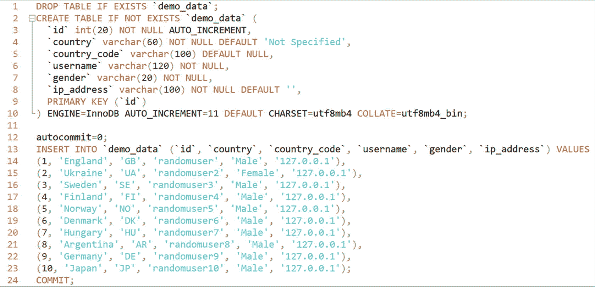

只有一个 `INSERT`！是不是很酷？

你还可以利用锁定和解锁。为此，首先使用 `LOCK TABLE [table_name]` 锁定表，然后插入数据，最后使用 `UNLOCK TABLE [table_name]` 解锁表。如果你发现行的 `VARCHAR` 列较长，可以一次插入较少的行。

提高 `INSERT` 查询性能的下一个方法是像下面这样将 `INSERT` 与 `SELECT` 查询结合使用。

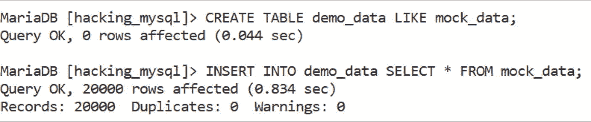


#### 在 MySQL/MariaDB 中插入与优化数据

插入两万行数据耗时不到一秒——还不错吧？如果使用 SSD 或 NVMe 硬盘，你很可能会看到更快的结果。更不用说，`INSERT INTO ... SELECT` 查询通常会比普通的 `SELECT` 查询更慢，因为我们的示例会写入临时文件，而 `SELECT` 查询则是从磁盘上的文件读取数据。不过对于将数据分散存储在多个表/数据库中的情况，这个示例无疑是一个可行的选择。

如果你需要处理更庞大的数据集（≥1 亿行），上述两种方法都将力不从心；这是因为 `INSERT` 查询伴随着大量开销，而对于更大数据集的最佳性能，必须消除这些开销。`LOAD DATA INFILE` 是完成此任务的绝佳选择——这是一个专门设计用于将大数据集从文件加载到磁盘的查询，通过以下方式实现：

*   数据解析所需开销极小
*   允许用户跳过某些行或列
*   允许用户仅将数据加载到特定列
*   处理与重复键相关的错误

使用了部分最常用选项的 `LOAD DATA INFILE` 如下所示：

```
LOAD DATA [LOCAL] INFILE [REPLACE|IGNORE] INTO TABLE `demo_table` [PARTITION (p1)] [CHARACTER SET charset] [FIELDS|COLUMNS TERMINATED BY '|'] [IGNORE number LINES|ROWS];
```

你可能已经看出，`LOAD DATA INFILE` 是个强大的家伙。让我们通过分解来驯服它：

*   可选的 `LOCAL` 选项指定文件位于客户端主机上，而非服务器上。
*   `REPLACE` 或 `IGNORE` 选项可让你替换字符或忽略某些行。
*   如果指定了任何分区，`PARTITION` 选项会将数据加载到特定分区。
*   `CHARACTER SET` 选项在将数据加载到数据库时会使用指定的字符集。
*   `FIELDS|COLUMNS TERMINATED BY` 选项允许你指定哪个字符表示另一列的开始。换句话说，哪个字符会告诉 MySQL/MariaDB 数据应插入到另一列中？
*   `IGNORE number LINES|ROWS` 选项可让你指定应忽略的行数。当文件首行表示文件结构等情况时非常有用。

还有更多选项，这些选项结合 MySQL/MariaDB 实例可配置为 InnoDB 的能力，使得 `LOAD DATA INFILE` 成为一股不可忽视的强大力量。

如果你在处理更庞大的数据集，请记住在创建表时也可以利用 `DEFAULT` 关键字。此关键字让你指定列的默认值，因此 MySQL/MariaDB 会预先用指定值填充该列，而无需你之后运行任何 `UPDATE` 查询，从而节省你的时间。再看一下上面的例子——在创建 country 列时，我也指定了其默认值应设置为 "Not specified"（未指定）。

最后但同样重要的是，可以通过在服务器之间切换数据文件将数据插入 MyISAM 表。请记住——MyISAM 没有附带的文件空间（InnoDB 则不能这么说），这意味着如果你发现自己在处理如下所示的数据和/或索引文件。

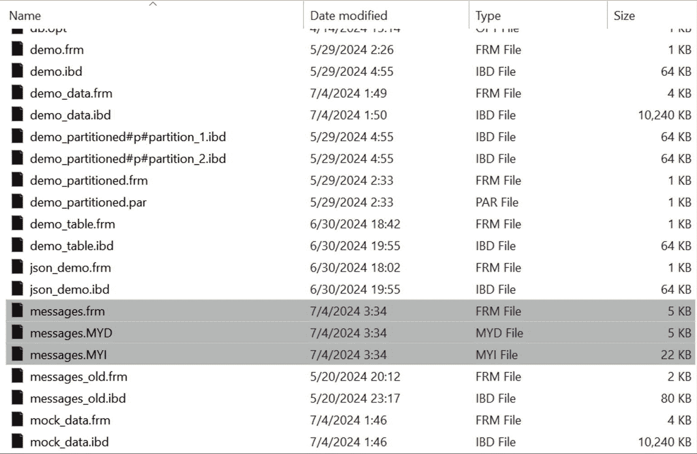
图 9-4：属于 MyISAM 的 MYD 和 MYI 文件

你可以在服务器之间轻松地复制/移动它们：这意味着如果你有两台服务器，并且需要存储基于 MyISAM 存储引擎的数据，你可以创建一个基于 MyISAM 的表，在那里插入数据/进行操作，然后复制底层的数据和索引文件，以将数据复制/移动到另一台服务器。很酷——但这仅适用于 `COUNT` 查询。

### 优化 SELECT 查询

一旦 `INSERT` 查询处理完毕，就来看一下多年来与它们关系非常密切的 `SELECT` 查询。`SELECT` 查询的含义相当明了：它们从数据库中的表中选择数据。这些 SQL 查询的功能相当简单，我们许多人都明白它们只是数据库的一小部分；然而，缓慢的 `SELECT` 查询性能会对你的数据库和应用程序的性能产生巨大影响。

有一天，我像往常一样在处理 BreachDirectory 数据泄露搜索引擎，然后我注意到页面开始异常缓慢地加载。我开始寻找原因，并确定是一位客户向 BreachDirectory 提供了一个包含超过一百万个账户的文件，并要求数据库一次性检查它们是否都存在身份盗窃风险。一次性一百万个账户——而我原本以为速率限制器工作正常。但这次并非如此。问题很快得到了解决，但这恰恰说明 `SELECT` 查询性能绝非儿戏：这里那里的几个错误可能给你的数据库带来灾难。

浏览一下你应用程序的核心功能，并搜索（CTRL+F）"`SELECT ... FROM`"：你看到了哪些查询？它们要求你的数据库提供什么数据？它们对应你应用程序中的哪些功能？几乎可以肯定你的应用程序使用了大量的 `SELECT` 查询：这是因为现代应用程序中的几乎所有内容都存储在数据库中，也从数据库提供给应用程序。还记得 `SHOW PROCESSLIST` 吗？从那里开始。我使用的是本地 MariaDB 服务器，所以我用 `mysqlslap` 进行负载模拟，并同时使用另一个 CLI 来检查数据库的负载，所以我的结果在格式方面看起来相当糟糕，而你的会好看些。

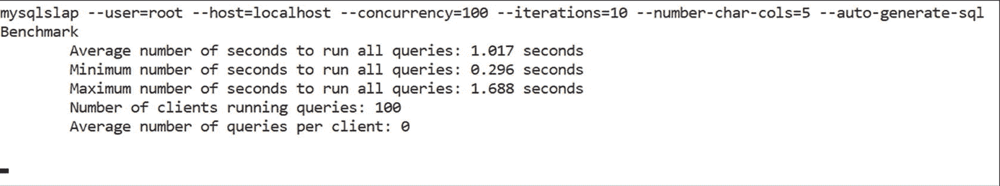
图 9-5：使用 mysqlslap 在 MariaDB 上模拟负载

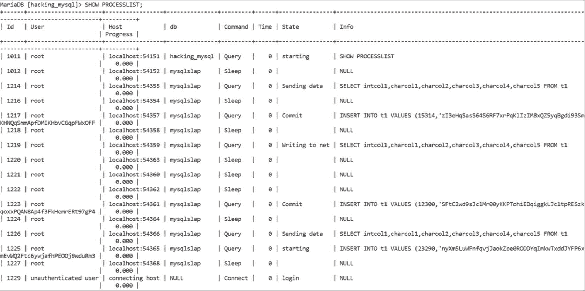
图 9-6：运行 mysqlslap 后 SHOW PROCESSLIST 的输出

值得注意的是，`SHOW PROCESSLIST` 还有几个状态，可以帮助你了解数据库关于某个查询的状态。这些状态可以告诉你很多信息，特别是如果你包含了 `FULL` 语句。以下是 `SHOW PROCESSLIST` 可以提供的一些状态：

*   `starting` 表示查询刚刚开始，尚未执行任何任务。
*   `Sending data` 表示查询正在向服务器发送数据并等待其响应。如果你看到这个状态并且你的应用程序性能陷入停滞，那么处于此状态的查询应该受到怀疑。
*   `Commit` 表示查询正在向服务器提交数据。
*   `Writing to net` 表示查询正在向网络接口写入数据包。
*   `Waiting for source to send event` 表示数据库正在等待源发送数据。
*   `Has read all relay log; waiting for the replica I/O thread to update it` 表示查询已读取中继日志（描述数据库更改的事件），并正在等待副本的 I/O 进程。
*   `NULL` 表示数据库在处理查询方面无所事事（它可能只是在你的 `SHOW PROCESSLIST` 查询“捕获”它时恰好在列表中，就在它完成之前）。

熟悉 `SHOW PROCESSLIST` 是必要的——只有当你理解查询在数据库中运行时处于哪个状态后，你才能开始优化它们。

一旦你了解了查询的状态，你就可以开始调查。调查过程不应该花很长时间：通过查看所有列来识别有问题的查询，确定查询的来源，然后开始钻研代码。在钻研代码时，寻找以下问题的答案：


#### 优化 SQL 查询性能

### 诊断查询状态与数据

1.  **查询处于什么状态？** `SHOW PROCESSLIST` 描绘了怎样的查询状态？为什么查询会停留在此状态？
2.  **SQL 查询处理的是什么数据？** 为什么该查询会在你的数据库中运行，你试图实现什么目标？
3.  **SQL 查询正在读取什么？** 仔细查看你的查询——你的 `SELECT` 语句在读取哪些数据？
4.  **SQL 查询是否运行了多次？** 查询是否作为循环的一部分运行？循环重复多少次，其用途是什么？
5.  **是否多次查询了相同的列？** 曾有过多个查询为获取相似数据而查询同一列的情况——你的情况是否如此？
6.  **查询是否使用了索引或分区？** 如果是，使用了哪些索引和分区；如果不是，是否有任何因素可能阻碍此类查询的性能？
7.  **查询是否使用了子查询/存储过程？** 如果是，为什么以及使用了什么类型的子查询/存储过程？
8.  **你认为查询的哪些部分对数据库来说可能存在问题？** 毕竟，你与应用程序有关——问问你的直觉！

这些问题的答案将为你提供一个良好的起点，并很可能引导你找到可以开始优化查询性能的路径。从顶部开始：仅 SQL 查询的状态就足以让你意识到是什么导致查询“卡住”，从而拖慢应用程序的性能。然后，深入挖掘查询处理的数据：如果你告诉我你使用的查询类似这样，我不会感到惊讶：

```sql
SELECT * FROM `demo_table` INNER JOIN `demo_table2` ON `demo_table`.`col` = `demo_table2`.`col`;
```

一旦有了查询，就使用 `EXPLAIN` 深入探究其周边情况，理解查询是否多次运行、是否使用索引或分区、子查询或 `INNER JOIN` 以及任何相关方面。一旦这些都明确了，就小步推进所有事情：

### 分步检查与优化

1.  **调查表：** 它有多少行，结构是什么样的？对于使用 DbVisualizer、DBeaver 等 SQL 客户端或 phpMyAdmin 等工具的用户，此步骤会更容易，但使用 CLI 的用户将利用 `DESCRIBE` 语句（参见下文示例）。
2.  **你的列发生了什么？** 你使用了多少列？使用了哪些数据类型和排序规则？为什么？你的用例是什么，你的数据类型和排序规则是否针对其进行了优化？
3.  **你的查询是否在帮助你？** 你的查询是以“原始”方式运行，还是使用了索引或分区？如果是，使用了哪种类型的索引或分区？你的查询采取了什么路径？

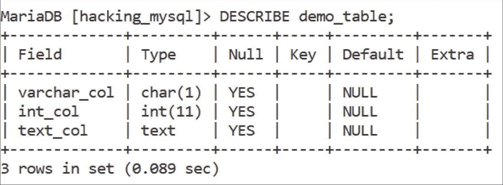
*图 9-7 DESCRIBE 操作示例*

4.  **你向数据库请求了多少数据？** 这最有可能是你的错误。当你一次请求数百万行数据时，数据库陷入停滞还令人惊讶吗？

问题不多，答案很多。第一个问题的答案将决定你针对表结构的操作范围，而表结构决定了你的 `SELECT` 查询的行动方案。在确定查询使用了哪些列之后，考虑正在使用的索引或分区——一旦完成，再查看返回了多少行。

要更深入地理解 `SELECT` 查询，请记住 SQL 查询分析器。换句话说，记住你的 `SELECT` 查询所经历的任务——要优化查询，就必须优化该查询中的任务，对吧？回顾本书的第四章——在那里，我为你提供了一张描绘简单 `SELECT` SQL 查询的图片，并解释了它在迈向完成过程中所经历的 24 项任务。

要优化这些任务，你需要：

| 任务 | 如何优化该任务？ |
| :--- | :--- |
| `Starting` | 拥有一个具有互联网连接的数据库服务器（嘿，基础很重要）。 |
| `Checking permissions` | 确保你用来运行 `SELECT` 查询的用户具有运行它的必要权限——除非你的 `SELECT` 不访问任何表，否则 `SELECT` 权限是必需的。 |
| `OptimizingExecutingSending data` | 确保你的 `SELECT` 扫描尽可能少的数据。 |
| `Query endCommit` | 要使 `COMMIT` 操作更快，请增大 InnoDB 缓冲池的大小。 |

现在你已经记起了内部机制，再次查看使用 `EXPLAIN` 的基本 `SELECT` 查询的输出。

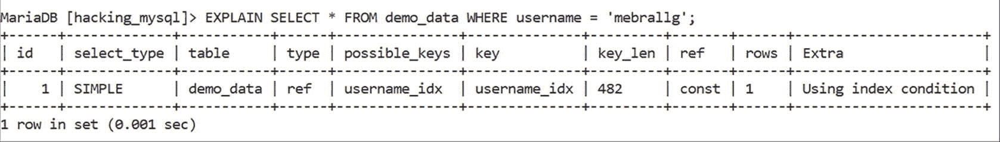
*图 9-8 基本的 SELECT 查询*

快速翻回第五章以详细记住这些列的含义，然后记住 `SELECT` 查询是如何被优化的。记住你的查询是什么样子，以及约束条件对你的 `SELECT` 子句意味着什么，然后优化这些约束条件。

### 优化索引与约束

优化 `SELECT` 查询性能的第一站涉及在列上添加索引。你可能以前使用过索引，如果你的 `SELECT` 查询仍然很慢，那是因为它仍然不知道通往数据的最快路径。索引帮助你的数据库为 `SELECT` 查询提供通往数据的路径——但它们有几种类型，并且必须正确选择。我将在专门讨论索引的章节中深入探讨涉及索引的细节，但要正确理解它们，无论如何你都需要复习一下。首先了解基础：

*   索引是键的同义词，反之亦然。
*   所有索引都有一个名称或标题。
*   所有索引都有一个长度——即索引的大小（以字节为单位），而不是索引中的唯一行数之类的东西。
*   索引有几种类型。为了使 `SELECT` 更快，你们大多数人将使用 B-Tree 索引，我将在后面专门讨论索引的章节中告诉你所有可用索引类型的秘密。
*   索引充当指向数据的指针，使我们的数据库能够从考虑中排除不必要的行。
*   大多数使用索引的人将受益于更快的表扫描。
*   索引扫描总是比磁盘扫描快，但并非所有索引应用都允许索引扫描。
*   索引必须正确应用，并考虑到 MySQL 在同一列上存在多个相同类型的索引时不会报错。

关于索引，请记住 MySQL 中可用的默认索引类型指的是 B-Tree 索引，并且 B-Tree 索引是有序的存在。B-Tree 索引是有序的意味着它们可以从上到下递归地遍历树，既然如此，它们使得使用精确搜索运算符的搜索变得前所未有的快，同时也会占用磁盘空间。索引的这些特性允许围绕它们构建多种不同的属性，MySQL 有许多可用的索引配置文件（类型），包括空间索引、唯一索引、全文索引、降序索引和主键，但为了使 `SELECT` SQL 查询更快，我们现在将专门关注 B-Tree 索引，并在专门讨论索引的章节中深入研究其他类型。

*B-tree 索引是 Balanced Tree 索引的简短缩写。* 这些类型的 SQL 索引是 MySQL Server 及其所有对应产品（如 MariaDB 和 Percona Server）中的默认索引类型。在高层次上，此类索引是有序值列表，被划分为几个范围。

B-Tree 索引对于 `SELECT` 查询很有用，因为它们将行与有助于快速访问它们的组件（键）关联起来。这正是此类索引将加速我们的搜索引擎或任何与搜索相关的事物的精确原因。


但是，拥有一个 B-树索引并不意味着 MySQL 就会使用它：MySQL 会根据规则使用索引，且仅当我们的查询符合某些标准时才会使用。不过，一般而言，MySQL 会考虑对那些**精确匹配数据**的查询使用 B-树索引。这类查询包括以等号（`=`）为主的比较运算符查询，以及使用小于号/大于号的查询。换句话说，B-树索引可以满足大多数此类 `SELECT` 查询：

```
SELECT ... FROM 'hacking_mysql' WHERE 'column' = 'value' ;
SELECT ... FROM 'hacking_mysql' WHERE 'column' ;
SELECT ... FROM 'hacking_mysql' WHERE 'column' > value ;
SELECT ... FROM 'hacking_mysql' WHERE 'column' =;
SELECT ... FROM 'hacking_mysql' WHERE 'column' >= value ;
SELECT ... FROM `hacking_mysql` WHERE `column` => value ;
```

请注意，我并没有说 B-树索引可以满足*所有*这些查询，因为最后一条查询无论如何都不会被满足——由于我们使用了 `=>` 运算符，MySQL 会返回一个语法错误。作为一种变通方法，您可以考虑使用“小于等于”（`=<`）运算符或“大于等于”运算符（`=>`）来实现必要的目标。

另外，请注意，并非所有被比较的值都是字符串，并且上述所有查询都带有表明它们不完整的符号——这是因为在现实中您不太可能看到“简单”的 SQL 查询，而除了相等性检查之外完成的每个操作都会给您的索引和数据库带来额外的压力。

### B-树索引与性能

言归正传，回到 B-树索引：它们之所以能加速 `SELECT` 查询，是因为它们为我们的数据库提供了一把“钥匙”，可以更快地访问所需数据。它们打开大门，并且当与其他能提升基于读取的查询性能的因素以及合理的数据库设计相结合时，可以将我们的查询性能提升数十、数百甚至数千倍。这是因为它们用磁盘空间换取了速度；如果我们的查询使用了它们，我们就可以避免全表扫描，转而使用索引扫描或索引查找操作：*索引扫描*发生在我们的数据库访问索引页以帮助我们获取数据时，而*索引查找*指的是我们的数据库访问特定的行。如果您正致力于让 `SELECT` 查询更快，理解这一点至关重要。

关于*如何*为性能进行索引的建议，请参阅索引章节，但这里提供一些高层次的建议来提升您的 `SELECT` 查询性能。我将从一个列表开始，然后在下文中详细阐述：

*   尽可能少访问数据：如果可能，将 `SELECT *` 改为 `SELECT 'column'`。

*   研究 `JOIN` 操作：使用 `JOIN` 操作将迫使 MySQL 从第一张表和第二张表中过滤数据。这并不是说 `JOIN` 操作自动会比普通的 `SELECT` 查询更慢（计时测试查询始终是个好主意），但我听说过一些案例，其中数十个 `SELECT` 语句被优化为几个 `JOIN` 查询，而这些 `JOIN` 查询极大地提升了整体性能。

*   警惕基于条件的过滤：当使用基于条件的过滤时（即您的表中有 `AND`、`BETWEEN` 和/或其他子句时），会给您的 `SELECT` 查询增加额外压力。审视您需要数据库检索的数据，检查字符集和表，然后思考：是否有办法将查询拆分为多个 `SELECT` 查询？如果可以，所有这些 `SELECT` 查询对于完成您选定的任务都是必要的吗？如果不必要，那个 `AND`/`BETWEEN`/`IN()` 条件是否必须？

*   注意 `BETWEEN ... AND` 和 `IN` 子句：许多人认为，如果您的数据库针对读取操作进行了优化，`BETWEEN` 的性能应该优于 `IN`，但同样，请对这个建议持保留态度：性能取决于是否能使用索引，或者您的数据库是否需要进行全表扫描。

*   注意 `NULL` 的细微差别：本书的许多读者可能知道，在分区中，`NULL` 值需要特定的功能，因为 `NULL` 值可能会被插入到可能的最低分区中，这本身是事实，但您也应该记住，MySQL 在处理 `IS NULL` 时可能与处理数据库中的其他子句并无不同。尝试对在数据库中搜索 `NULL` 值的查询运行 `EXPLAIN` 子句：您很快就会注意到，数据库优化该查询的方式很可能与优化带有相等运算符的 `SELECT` 查询的方式相同。很有趣，对吧？

*   为 `ORDER BY` 子句创建索引：如果您的索引包含您用于排序的所有列，并且顺序与排序顺序一致（即，`INDEX(a,b)` 将满足 `ORDER BY a,b`），那么数据库优化器可能会避免排序，从而使 SQL 查询更快。

*   使用 `LIMIT` 子句：顾名思义，`LIMIT` 子句用于限制返回的行数。对于未指定 `LIMIT` 子句且表非常庞大的普通 `SELECT` 查询，MySQL 每页只会返回 25 行，并允许您翻到其他页面。在这种情况下，只返回一行（`LIMIT [任何数字],1`）将会明显更快，无论数据库中有多少数据。您可能还想从带有 `LIMIT` 子句的查询中省略 `HAVING` 子句，看看运行速度是否会更快。如果您发现将 `LIMIT` 与 `ORDER BY` 一起使用，请考虑也在排序列上使用索引来加速查询。

*   使用技巧避免全表扫描：对于 `SELECT` 查询，全表扫描很少是个好主意。使用带有 `ALL` 子句的 `EXPLAIN` 并观察 `type` 列，可以判断 MySQL 何时决定使用全表扫描。您也可以研究 `FORCE INDEX` 来强制 MySQL 使用索引，而不是进行全表扫描。

*   警惕 `DISTINCT` 子句：如果 `DISTINCT` 与 `ORDER BY` 一起使用，您的数据库可能需要使用临时表。如果您需要搜索大量数据并需要使用 `DISTINCT` 子句，也许创建一个包含唯一值的单独表、索引一两列并使用该表会更好？另外，请参见下面的解释。

对于处理超大数据集的您来说，`DISTINCT` 子句可能会引发更多问题；如果您有数亿甚至更多的记录，请研究 Unix 中的 `uniq` 命令（如果安装了 Cygwin 或类似工具，在 Windows 架构上也可用）。

对于使用 `SELECT ... INTO OUTFILE` 进行备份或从处理原始数据开始的那些人来说，此命令在去除重复项方面将非常有用——然后，您将在“三个方面”提升 SQL 查询的性能：

1.  您的备份大小将显著减小（`LOAD DATA INFILE/SELECT ... INTO OUTFILE` 不包含任何 `INSERT` 语句）。

2.  由于没有 `INSERT` 语句，并且您的数据库处理的是原始数据，它将减少开销（原始数据总是“更轻量级”）。

3.  由于 `uniq` 读取原始数据，它可以在几毫秒内从包含数十亿条记录的文件中去除重复项。


看到一切变得多么简单了吗？当然，要恰当地优化`SELECT`查询，你还需要更深入地研究索引和分区，但这也不成问题——本书也有关于这些内容的独立章节。问题与你的`UPDATE`和`DELETE`查询相关——别忘了也要优化它们。

### 优化 UPDATE 查询

要优化`UPDATE`查询，也需要遵循 MySQL 提供的建议。这方面的问题在于，MySQL 对此说得并不十分清楚：其文档为用户提供了三段信息，本质上是在说“像优化带`INSERT`开销的`SELECT`那样来优化`UPDATE`”。令人困惑，对吧？

当你理解了`UPDATE`查询的作用后，情况会变得稍微清晰一些——它们更新我们数据库中表内的数据。那么，我们如何使更新过程更快呢？首先，让我们探究一个基本`UPDATE`查询的内部机制：

```
UPDATE 'demo_table' SET [column] = ['value'] WHERE [details] [LIMIT x];
```

这里：

*   `SET`之后的列定义了我们需要更新的特定列。如果我们只需要更新一列，在此指定该列就足够了。如果我们要更新多个列的值，在指定第一个列的值之后（在`WHERE`子句之前），需要指定这些列。
*   `WHERE`子句之后的细节让我们可以细化需要更新的数据。我们可以指定只想更新 ID 值大于 500 的字段，等等。
*   `LIMIT`子句让我们定义想要更新的行数。`LIMIT 0,50`子句将更新前 50 行，`LIMIT 50,100`将更新从第 50 行开始的 50 行，等等。本质上，`LIMIT`子句让我们定义更新开始的偏移量并限制其范围，因此得名。

那么，究竟该如何优化我们数据库中的`UPDATE`查询呢？首先，有几点建议我们必须牢记：

*   **索引很可能会拖慢你的查询速度**：这并不意味着“删除你要更新数据所在的所有列上的所有索引”，而是要警惕索引和`UPDATE`查询的内部工作机制。换句话说，要注意`UPDATE`查询如何与索引交互。例如，如果你处理的行数相当少，索引可能不是什么大问题，但如果你的数据集较大，并且`UPDATE`查询需要同时更新数据和索引本身，那么它可能需要花费一段时间才能完成。有变通方法（我马上告诉你一个秘密），但在优化这类查询之前，要始终警惕这种行为。
*   **分区会带来一些细微差别**：分区也可能拖慢`UPDATE`查询，因为如果分区 A 包含从 0 到 1000 的整数值，分区 B 包含从 1000 到 2000 的整数值，并且我们更新一个列来指定其值为 1700，像这样：

    `UPDATE 'demo_table' SET 'int_partitioned_column' = 1700;`

    如果之前的值低于 1000，我们的数据库将需要把值从分区 A 切换到分区 B。这将花费一些时间，因为分区需要连同数据一起更新，而且你还需要记住，更新后的数据现在将驻留在与平常不同的分区中。
*   **注意锁机制**：如果你发现`UPDATE`查询性能不佳，可以尝试的一种方法是锁定表，连续执行多个更新操作，然后解锁。这种方法可能比一次性运行单个`UPDATE`更快，看起来像这样：

    ```
    LOCK TABLE [READ|WRITE] `demo_table`;
    UPDATE `demo_table` SET `column` = 'value' LIMIT 0,10000;
    UPDATE `demo_table` SET `column` = 'value' LIMIT 10000,20000;
    UPDATE `demo_table` SET `column` = 'value' LIMIT 20000,30000;
    ...
    UNLOCK TABLE `demo_table`;
    ```

    可以把这种方法想象成在`INSERT`查询中将`autocommit`设为 0，插入多行数据，然后再提交事务。

对于那些需要更新更大数据集（比如数百万、数十亿行）的情况，情况会有所不同；如果你在锁定和解锁上运气不佳，并且需要一次性更新某列的所有行，请记住还有一个巧妙的变通方法可以替代`UPDATE`子句，同时避免向表中插入数据带来的开销。

假设你有一个包含数百万行的表——我以 20,000 行为例——并且希望让某一列具有相同的值，但磁盘空间有限（如果表相当大，使用`ALTER`更新数据可能会在磁盘上创建该表的副本）。以下是解决该问题的方法：

1.  使用一种在重新导入数据时开销不大的方法制作表的副本（使用`SELECT INTO OUTFILE`备份原始数据而不是`INSERT`语句——我之前提到过这个）：

    

2.  利用`SHOW CREATE TABLE`语句或直接运行`CREATE TABLE another_table LIKE present_table`，创建一个与你正在处理的表相同的表，并在向该表插入数据之前，确保你需要更新的列具有默认所需的值（在此示例中，我将此列设置为“Good Value”）。

    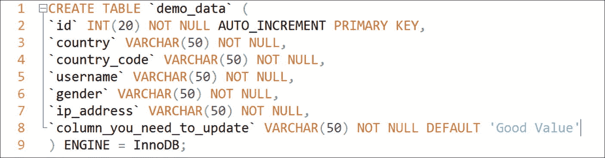

    图 9-9：列上的默认值

3.  创建表，然后在不指定具有默认值的列的情况下重新导入数据（它将被默认填充）——你可能还想在`INTO TABLE`语句之前添加一个`IGNORE`子句，以忽略与此查询可能相关的任何错误。

    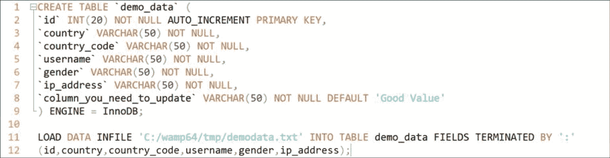

    图 9-10：将数据导入具有默认值列的表

4.  导入数据，然后观察你需要更新的列的值——它应该被默认设置为“Good Value”（或你指定的任何其他值）——现在，就不需要额外的`UPDATE`操作了。

    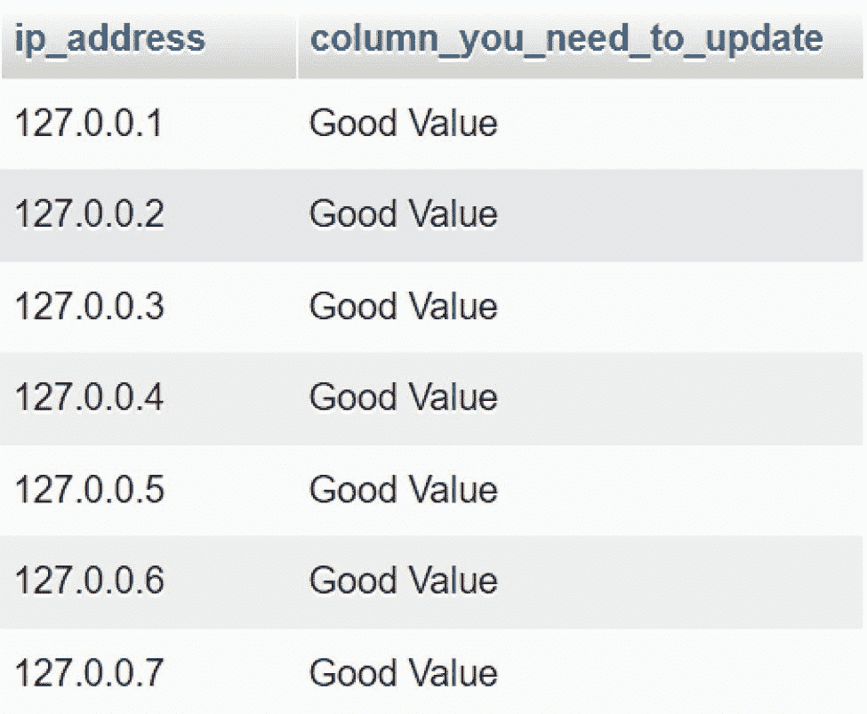

    图 9-11：已更新值的列

也要注意`ALTER`的内部机制——对一些开发者来说，当他们运行`ALTER`查询时，“无缘无故”耗尽磁盘空间是个令人担忧的问题。如果你更新表 X：

1.  制作表 X 的一个副本。我们称之为表 Y。
2.  表 X 中存在的数据被复制到表 Y 中。
3.  所有的更新都在表 Y 中执行。
4.  表 Y 与表 X 交换并被销毁。

这就是你的`ALTER`操作可能耗尽磁盘空间的原因——要警惕其内部机制。

对于那些仍在使用 MyISAM 的人，请记住 MyISAM 不像 InnoDB 那样“连接”到任何表空间，这意味着你可以利用在 InnoDB 中不可能使用的多种“策略”。其中一种策略涉及将 MyISAM 数据移动到拥有“更好装备”（更多 RAM、更好的处理器或其他方面）并针对 MyISAM 优化的另一台服务器上，在那里更新数据，然后将数据（.MYD 数据文件本身）移回原始服务器——你的数据将被更新。愚蠢？也许吧。有效？是的。

### 优化 DELETE 查询

说到删除数据，这确实也没什么革命性的——我们使用`DELETE`查询。嗯，并非在所有情况下——可以使用`TRUNCATE` SQL 查询删除表中的所有行，这将比`DELETE`快得多，但在许多情况下，我们删除的是数据的子集，而不是将整个表从地球上抹去。

要优化数据删除：

1.  **使用** **`WHERE`** **和** **`LIMIT`** **子句**：`WHERE`可用于过滤掉我们不想删除的特定数据，而`LIMIT`可以帮助我们限制删除的行数。


2.  **注意索引和分区的影响**：再次提醒，需要注意索引和分区会拖慢数据删除过程，原因与拖慢更新操作相同。

3.  **注意存储引擎**：还记得 `MyISAM` 与表空间无关吗？这意味着你可以通过删除数据库目录中的 `.MYD` 文件来删除一张表，通过删除 `.MYI` 文件来删除表上的索引，等等。

4.  **必要时仅擦除部分数据**：如果你的数据量很大，考虑使用 `AS` 子句创建一个新表来完全避免使用 `DELETE` 子句，然后删除旧表。例如：
    ```
    CREATE TABLE x AS SELECT a,b FROM table_y;
    ```
    这将使得表 X 仅由来自表 Y 的两列——a 和 b——组成，不包含其他数据。

再次强调，`DELETE` 操作没什么革命性的——确保明确地告知你的数据库你正在删除什么数据以及基于什么条件（使用可用的 `WHERE` 和 `LIMIT` 子句），这样就应该没问题了。

### 为大数据优化查询、避免死锁及其他查询优化技巧

当涉及更庞大的数据集时，请回想一下你为处理大数据而优化数据库所做的工作：你做了些什么？你很可能增加了 InnoDB 缓冲池和 InnoDB 日志文件的大小，以适应你在数据库中存储的数据量，对吧？你还做了其他更改吗？这些更改影响了数据库的哪些参数/部分？

你优化数据库不是没有原因的——利用好那些改动！为了处理涉及更大数据集的查询，请利用上面提供的查询优化建议，并始终记住要循序渐进：只选择你需要使用的必要数据，插入更大数据集时避免 `INSERT` 查询带来的开销（改用 `LOAD DATA INFILE`），分块更新数据，并在删除数据时利用 `WHERE` 和 `LIMIT` 子句及其他建议。

无论你选择遵循哪种建议，如果你想成为一名经验丰富的 DBA，你都需要经历各种挑战。有时你的数据库会出现一些看似完全异常的情况，比如一两个死锁：那时该怎么办？死锁情况发生在我们的数据库正在完成不同的事务，但每个事务都无法继续，因为它们各自持有着完成另一个事务所必需的资源。事务 A 无法继续因为它在等待事务 B，而事务 B 也无法继续因为它在等待事务 A。死锁本质上是“无路可出”的锁。

如何解决这类问题？很简单——遵循你所使用的特定 DBMS 的文档建议，并记住最复杂的问题往往需要最简单的解决方案——死锁也不例外。要解决死锁引发的问题，重启一个事务，并确保所谓的 `Coffman 条件` 不在你的数据库中存在——这些条件常常为死锁的产生创造机会：

1.  **互斥**：一个或多个资源应以无法与其他资源共享的方式被持有。
2.  **持有并等待**：一个或多个进程应持有一些资源，同时请求更多资源，而这些资源中的部分或全部正被另一个进程持有。
3.  **无法“释放”资源**：持有资源的进程不应能够“释放”它们。
4.  **循环等待**：最后，死锁的最终判定条件是循环等待。循环等待是指一个进程在等待另一个进程完成，而另一个进程又在等待第一个进程完成，如此循环。

为了帮助你的查询发挥最佳状态，请避免这些条件——避免了它们，你就能避免死锁。

然而，死锁并不是你唯一需要担心的——为了提升查询性能，请避免在 `WHERE` 或 `HAVING` 子句中使用不必要的子查询，分批执行 SQL 查询，如果你处于读取密集型环境则利用 SQL 查询缓存，考虑在 CDN 层缓存内容以减轻数据库负载，避免在谓词语句中使用函数（那样你的数据库将无法利用索引），并尽量少用 `AVG`、`SUM` 或 `COUNT` 等聚合函数，以最小化数据库需要处理的数据量。

这些技巧将是一个很好的起点，不仅适用于在中低负载的基础设施上优化查询性能，对于某些大数据工作负载的实例也同样适用。

### 总结

许多人认为优化查询性能是一项相当艰巨的任务，但实际上，这完全是正常现象，只是需要熟悉“底层”发生的事情。当然，在你“攻克难关”并获得一些经验之前，优化查询性能可能很困难，但我可以向你保证，从长远来看，获得这些经验是值得的。无论你发现自己正在优化哪种类型的查询——无论是 `INSERT`、`SELECT`、`UPDATE` 还是 `DELETE` 查询，它们都有其特殊之处。同时，优化它们的性能并非登天难事——我们有许多工具可用于衡量它们在特定情况下的性能，并且本地应用程序和数据库副本总能帮助我们，我们可以相当迅速地解决许多紧迫问题。

积累经验很有趣，因为一旦我们经验丰富了，就可以开始帮助经验较少的同事，并拥有一个更大的可以解决问题的“技能包”。经验是通过参与各种各样的项目获得的，对我们中的某些人来说，这些项目最终可能变得相当庞大——大到普通的 SQL 查询性能优化措施不再足够。一旦发生这种情况，我们需要再次仔细评估我们的数据库架构，然后采取措施为更庞大的数据集优化我们的数据库。

## 10. 为大数据优化 MySQL

一旦你优化了数据库实例并且一段时间过去后，你可能会开始注意到，你用来优化 SQL 查询背后数据的措施不再足够。它们可能开始变得不足，因为你的数据在增长——而随着数据的增长，应对这种增长的措施也应该随之增长。

随着数据的增长，你需要考虑很多事情：从磁盘空间和托管到索引和数据碎片。这些事情没有一件是无法处理的，随着时间的推移，所有这些都可以修正和改变。关键在于，修正它们可能需要大量的时间和精力，这甚至还没有考虑到金钱成本。优化你的数据库可能是一项繁琐的任务——而且随着越来越多的数据被引入该数据库，如果你没有为即将到来的情况做好准备，这项任务很可能会变得难以应付。

并非每个人都需要为大数据优化他们的数据库，但将优化技术牢记于心以备不时之需总是一个好主意。当问题找上门时，许多工程师和 DBA 会转向 StackOverflow 提问，我也知道一些 DBA 会使用 1Password 等密码管理器中的安全笔记来提醒自己在网上找到的数据库优化秘诀：如果你发现自己使用密码管理器来保护密码安全，这样做可能是个好主意；如果没有，请将这本书放在触手可及的地方，并在数据增长时回顾本章。

#### MySQL 能应对大数据吗？


关于数据库的现状存在很多误解——其中一个主要误解与关系型数据库和更大的数据集有关。许多人说 MySQL 及其同类产品（MariaDB、Percona Server）由于基于关系型数据库模型，根本不适合大数据集，但这并非问题所在——真正的问题在于**没有为大数据正确优化数据库**。

为大数据优化 MySQL 与为普通大小的数据集优化 MySQL 并无太大不同；数据仍然是数据，只是量更大了。当然，当数据集变大时，可能需要采用不同的方法来处理它，但这并不否定数据库管理系统本身的有效性。

“MySQL 不适合更大数据集”这种说法的核心，可能源于这样一个前提：非关系型数据库管理系统不遵循关系型数据库模型，而当这个模型被 MySQL 及其同类产品（如 MariaDB 或 Percona Server）所遵循的关系模型所取代时，一种模式就出现了——你会听到人们说

*   MySQL 只适合读写操作比例不超过 80%/20%的应用程序。
*   NoSQL 数据库天生就是为大数据服务的！
*   只有 NoSQL 数据库能为大数据集提供性能优势；它们是唯一的选择！

虽然像 MongoDB 及其同类产品这样的非关系型数据库，因其灵活的数据模型和在必要时进行横向扩展的能力，可能对大数据集非常有用，但关键在于，MySQL 是一个极其强大的数据库管理系统，它**能够**像其他数据库管理系统一样处理好大数据——问题仅仅出在我们的配置或使用案例上。一旦你的数据变大，无论数据库供应商是谁，关键都在于你的服务器、数据库配置、模式和查询设计。别误会——你的数据库仍然需要**优化**以利用服务器的配置——但这并不意味着 MySQL 是你能选择的最差选项。

只要你回答了“我的大数据用例是什么？”这个问题，并且**如果你的大数据用例需要将数据存储在数据库和表中，或者说行和列中，而不需要灵活的数据存储模型**，那么 MySQL、MariaDB 或 Percona Server 将始终是处理更大数据集的一个选择。

大数据和 MariaDB 尤其会引起那些从事网络犯罪分析或开源情报工具开发的人的注意——想象一下类似数据泄露搜索引擎的东西。在这个领域，MariaDB 的使用频率超出你的想象，因为这类解决方案经常处理从黑客论坛“摄取”的数据，而这些数据很少（如果有的话）包含`CREATE`或`INSERT`语句。

当你开始理解黑客的运作方式时，一切就开始变得非常合理了；黑客通常会窃取包含数亿用户数据的数据库副本在网上出售（对买家而言，其“好处”在于这些数据可用于撞库攻击），如果你曾瞥一眼这类数据，你会很快注意到其中 90%的数据格式是用冒号“:”来终止列。从攻击者的角度来看，这非常合理，因为以这种方式“渗出”数据几乎不花时间。时间可以用来“清理”（清除黑客进入系统的痕迹），而以这种方式出售的数据可以更快地被“投入使用”去伤害其他用户。毫不意外，一切都是为了“方便”……

当然，并非你们每个人都会处理泄露数据，但前提是相同的——我认为你的系统不太可能为了同样的原因而摄取数百万行基于`INSERT`或`CREATE`查询构建的数据（这并不意味着你永远不需要处理它们，但在导入更大数据集时，它们不会是你主要关心的问题），而 MySQL、MariaDB 和 Percona Server 能够批量插入数据。所以，“MySQL 能处理更大的数据集吗？”这个问题的答案是肯定的，前提是它经过了适当的优化，并且你的用例需要一个“强”数据结构（数据应存储在行和列中）。

MariaDB 用户还有`ColumnStore`，这是一个列式存储引擎，这意味着也不需要单独安装。如果你的用例需要大数据处理和线性可扩展性，或者需要插入大量数据且几乎没有更新/删除操作，`ColumnStore`也是一个可行的选择。

### MariaDB 与大数据：处理大数据集

在你选择使用 MySQL 或 MariaDB 来支持更大的数据集后，不可避免地，你也必须为大数据优化数据库管理系统。与普遍看法相反，为更大的数据集优化 MariaDB 与优化整个数据库管理系统**并没有**任何不同。这就是为什么我已经带你了解了优化数据库性能的方法——一旦你开始处理大数据，你将必须利用你刚刚优化的那些设置。这里没什么新东西——真的，你不需要重新发明轮子或火箭。话虽如此，普通的`INSERT`语句将无法满足需求，为了让处理更大数据集的工作不至于变成一场彻底的噩梦，你必须了解一些事情——这就是我们接下来要介绍有助于简化大数据工作的方法的原因。

在处理大数据之前，先给你的数据一个明确的定义：你什么时候认为你的应用程序/数据库跨入了大数据的范畴？这个问题可能看起来很奇怪，但人们对大数据的定义如此之多，近乎荒谬。在以下示例中，我们将大数据定义为一旦记录数超过 1 亿条即为“大”。

#### 将大数据插入 MariaDB

在你继续将更大的数据集插入 MySQL 之前，有几件事需要牢记：

1.  在大多数情况下，你的数据插入将与`INSERT`查询无关。这是因为`INSERT`查询带有不必要的开销。
2.  你将用于向数据库插入数据的文件很可能是文本文件，因此其大小小于逻辑/物理备份。
3.  你的数据集中的列很可能以冒号“:”、竖线“|”、短横线“-”符号终止，或者如果使用的是 Excel (CSV)文件，则以逗号（“,”）终止。
4.  在数据插入过程中，你将能够使用你的数据库——你的存储引擎起初不太可能显示行数——所有数据插入完毕后才会显示行数。
5.  如果需要分区，请在将数据插入表之前对表进行分区。如果需要索引，建议在数据插入后再创建索引。

当将大数据集插入数据库时，你将使用的查询很可能也会涉及到`secure-file-priv`变量。请确保该变量设置为一个不易访问的目录（即，在`public_html`之外），并且该目录位于有足够空间的硬盘上。空间问题既涉及你将要加载到数据库中的数据文件，也涉及你的数据库可能制作的表/数据副本（我指的是`ALTER`查询的内部功能），以及首先存储所有宝贵数据所需的空间量。

注意


您将要加载数据到数据库中的文件很可能是文本（`.txt`）或 Excel（`.csv`）文件——并非文件中的所有列都可能对您的使用场景必要，但文本或 Excel 文件的大小无论如何都会比包含您数据的表要小，原因多样，从您选择的排序规则和字符集开始，到您可能选择使用的分区和索引结束。请确保您已准备好，并愿意为了大数据的速度而牺牲磁盘空间。`这会很痛苦。`

解决了`secure-file-priv`的问题后，您将使用`LOAD DATA INFILE`查询将数据插入到您的表中。我并不是在下最后通牒，但问题是您没有其他选择——`INSERT` SQL 查询在数据量达到一两千万条记录之前都能正常工作，然后，在等待数据插入的过程中，您会去煮咖啡、去买菜然后回来、看一集您最喜欢的电视节目、跑跑腿，然后会发现进度甚至还不到一半。当然，高级用户不会让他们的服务器（如果是本地工作站，则是 PC）一直开着，Linux 用户会熟悉`nohup`——“不挂起”命令（查询末尾的“&”具有相同效果）——它会在 Linux 用户注销后忽略 HUP（“挂起/停止”）命令，以便您的`INSERT`语句能一直运行，但这只是掩盖了问题。一批在后台运行的`INSERT`查询肯定会阻碍操作——那该怎么办？`SHOW STATUS`, `KILL`？糟糕。只有一半数据导入了。您下周要重新开始吗？您知道的，那时会多出两天，您能确保没人会使用您的应用程序，或者您本地的 MariaDB powerhouse 不需要关机。这可以说是小问题演变成了噩梦场景。

说真的，赶紧把`INSERT`切换成`LOAD DATA INFILE`吧——它能毫无麻烦地插入原始数据，并允许您为正在导入的特定文件定义排序规则，只将数据导入特定列，跳过行/列，以及诸如此类的功能。翻回上一章以保持您的知识更新，您会很快同意——`LOAD DATA INFILE`拥有处理将大数据集导入 MariaDB 所需的一切，而且您会注意到，较大数据集的备份也不是以逻辑备份的形式出现的——大数据的形式非常适合`LOAD DATA INFILE`！那么，您还在等什么？`对于任何可以用你能想到的任意字符分隔（这种分隔对于 MariaDB/MySQL 确定一列结束和另一列开始是必要的）的、文本或 Excel 格式的原始数据集，请使用 LOAD DATA INFILE。`

无论如何，你们中的一些人可能不得不使用`INSERT`命令——如果您要插入数百万行，请利用前面章节中概述的关于`INSERT`查询的技巧，并且永远、*永远*要考虑到磁盘空间。完成了？很好——是时候读取您的大数据集了！

### 使用 MariaDB 读取大数据

当您准备通过大数据集运行`SELECT` SQL 查询时，您可能会惊讶地发现，读取较大数据集与读取普通数据没有太大区别。看看这段描绘 PHP 中`foreach`循环的代码。

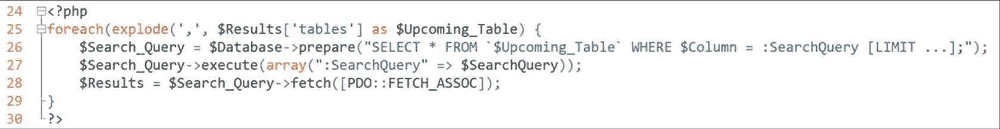

*图 10-1：循环中的 SQL 查询*

这个循环做了几件事：

1.  它获取一组以逗号（“,”）符号分隔的表，并分别处理每个表（这是“喂养”`SELECT`查询所必需的）。
2.  将表名提供给`SELECT`查询，获取之前用`Column`变量指定的列，并将其搜索请求绑定到 SQL 查询。
3.  获取（“检索”）结果集并将结果放入`Results`变量中，然后可以根据需要访问和处理该变量。

此查询之所以放在循环中，是因为我们有很多表需要查询，并且随着时间的推移，新的表可能会被添加到数据库中：这样，当添加新表时，不需要更新任何代码片段。也没有 SQL 注入风险——因为只有 4-5 种搜索类型，并且它们都在白名单中（不可能提供其他值），所以在这方面我们也是安全的。

这样的 SQL 查询在处理海量数据集时可以胜任工作——使它们脱颖而出的是它们尽可能简单这一事实。真的——没有大量的`JOIN`操作，没有 500 个`UNION`操作，或类似的东西。甚至连`LIKE`子句都不存在。这些子句*可以*存在，如果您的`SELECT`确实包含它们，只要您遵循使它们发挥最佳性能的规则（建议参考前一章），这也没问题，但对于这个特定的用例，不需要它们——这正是使上述查询如此高效的原因：通过一个经过良好优化的数据库进行操作的简洁方法。这些查询慢吗？通过添加`LIMIT`和/或`OFFSET`子句让它们读取更少的数据，为相关列添加一个或两个索引或分区，SQL 查询返回结果的速度会比您眨眼还快。一切都很基础，不是吗？

当然，您的`SELECT`查询可能需要使用`JOIN`子句从不同的数据库/表中读取数据，并且您可能也想使用`UNION`查询。看看这个查询示例：

```sql
SELECT a.user_id, a.owner, a.pc_id AS computer_id,
o.m_id as monitor_id, o.m_inch
FROM computers AS a
LEFT OUTER JOIN monitors AS b
ON a.owner = b.owner and a.user_id = b.user_id and b.m_inch = 22
WHERE a.cpu_ghz >= 3.4
```

首先看看查询的格式化方式——这种 SQL 查询的格式化告诉您什么？由于格式化，可以清楚地看到首先选择了什么数据，以及在第一操作完成后我们寻找什么数据：首先，我们从`computers`表中选择数据，然后从`monitors`表中选择数据。

假设两个表都有数亿行，您将如何优化这样的 SQL 查询？没错——您会将查询拆分成几部分，检查两个表的结构，然后运行`EXPLAIN`查询以深入了解具体情况，并像处理其他所有事情一样，牢记最后一章的建议来优化 SQL 查询。很有革命性，对吧？

实际上，您拥有的所有其他`SELECT`查询也是如此。一个常见的误解是，查询大数据集需要数百万个操作，您的数据库难以完成，因此应该把 MySQL 扔出窗外——深入内部，尽可能少地读取数据，并且不要忘记基础。您就可以开始了！

### 在 MariaDB 中更新大数据

更新较大数据集也不是什么高深莫测的事情——还记得`UPDATE`子句吗？

```sql
UPDATE `demo_table` SET [column] = ['value'] WHERE [specific details], [update multiple columns here] [LIMIT x]
```

没有特定的`UPDATE FOR BIG DATA`子句——在这里，情况也是一样的。无论您的数据集有多大，`UPDATE`子句都不会改变——它们的内部功能保持不变，它们看起来一样并接受相同的参数——它们只是更新不同数量的数据。当然，有一些生活技巧可以用来完全避免它们，例如创建一个表并为列分配一个`DEFAULT`值，这样它就会默认预填充，而无需您完全处理该子句，但除此之外，在大数据集上执行`UPDATE`查询的最佳实践包括

*   锁定表，分块更新数据，然后解锁它们：这种做法可能会使通过更大量数据进行的`UPDATE`操作更快。


#### 使用 WHERE、OFFSET 和 LIMIT 子句

这些子句将帮助你最小化数据库在完成更新查询时所需执行的工作。

#### 保持对数据库负载的警惕

在凌晨 2 点更新数据，通常比在高峰使用时段更新表中的数据要更好。

真的，就是这样——在大多数使用场景中，标准做法就是黄金法则。如果你在较大的数据集上运行更新，你的 `UPDATE` 操作可能会有点慢，并且根据你的 InnoDB 缓冲池大小，你可能需要等待——我并不是承诺，如果你遵循我给出的所有建议，它们就能在毫秒内完成——但它们不会给你的数据库带来那么大的压力，并且考虑到你数据库中的行数，它们的速度将保持合理。

如果你发现自己正在使用 `MyISAM`（对于那些需要统计表中行数的人来说，这可能是必需的——我稍后会讲到存储引擎如何与大数据集交互），你可能还需要查看存储引擎内的 `key_buffer_size` 设置。

### 从 MariaDB 中删除大数据

就删除而言，`DELETE` 查询也没有改变。是的，删除大块数据很可能令人头疼，而这种痛苦在涉及分区或索引时会更加明显——这就是为什么保持简单、避免同时执行多个操作很重要：如果你同时执行 CRUD 操作和进行计数或给你的数据库提供另一项任务，事情可能会变得有点困难——这些操作会花费一些时间，但同样，即使它们需要时间，你也可以将所有必要的 SQL 查询放入一个文件中，然后“喂”给你的数据库，让它运行查询并将结果返回到文本文件之类的地方。

在删除大数据集时，请记住，这样的操作对 MariaDB 来说并非易事：删除 1,000,000 行可能是你的数据库能够承担的任务，但如果我说从 MariaDB 中删除 50,000,000 行很容易，那我就是在撒谎——说实话，删除那么多行对你的数据库来说可能意味着完蛋（我听说你也喜欢分区和索引……），*但对 Linux 则不然*。

在这个领域，像 `sed` 或 `sort` 这样的查询会比标准的 SQL 对应物快得多，非常快。它们将作用于原始数据文件，意味着这些文件的尺寸更小，而且最重要的是，它们不会给你的 PC 或服务器带来太大压力——你不需要 NASA 级别的基础设施来完成任务。与其执行 `DELETE FROM demo_table WHERE column = string;`，不如尝试用 `SELECT … INTO OUTFILE` 从你的数据库中导出原始数据（甚至该特定列中的数据），然后使用类似 `sed -i /string/d data.txt` 的命令？是的，也许你需要等待 10–15 分钟——操作仍然需要完成——但 10 分钟不是一周：`-i` 会在不通过 CLI 显示结果的情况下修改文件，`d` 会指示 `sed` 删除数据，`string` 将是你需要删除的字符串，而 `data.txt` 指的是你的文件名。

`sort -u`（一个带有唯一标志的排序操作）也将取代对唯一索引的需求：导出原始数据，然后在你从数据库接收到的文件上运行 `sort -u` 查询，可以在几分钟内（而不是几天）去除重复项。

最后，如果你需要删除表中的所有行，请记住，像 `TRUNCATE TABLE table_name` 这样的查询会比 `DELETE` 查询快得多。

删除索引和分区无论如何都需要一段时间，除非你使用 `MyISAM`——如果你使用 `MyISAM`，你可以自由删除与你的表关联的 `.MYI` 文件，并且与该特定表相关的索引将永久消失，除非文件被重新创建。这只是为大数据集使用不同存储引擎的一个好处。

### 存储引擎与大数据

还记得存储引擎吗？我在本书第二章中已经介绍过它们。MySQL 在允许我们根据用例从多个存储引擎中进行选择方面几乎是独一无二的——PostgreSQL 只支持一个方便地命名为“PostgreSQL”的存储引擎，MongoDB 和其他数据库管理系统确实提供更多选择，但很少有选择像 MySQL 那样广泛。而且 MySQL 有几个变体，包括 MariaDB 和 Percona Server，我们的选择范围甚至更广。

你们中大多数使用 MariaDB 的人会使用 `InnoDB`——它是关系型 DBMS 提供的主要存储引擎——但也有其他选择。其中一个选项是 MariaDB ColumnStore——一种利用 MariaDB 中列式存储优势的存储引擎。通过利用列式存储提供的优势，MariaDB 能够避免像这样存储数据：

| ID    | Name              | Position                 |
| ----- | ----------------- | ------------------------ |
| 52777 | Josh Doe          | Head of Marketing        |
| 52778 | John Surnamey     | Marketing Manager        |
| 52779 | Alissa Surname    | Influencer Marketing Manager |
| …     | …                 | …                        |

而是像这样存储数据：

| 52777 | 52778 | 52779 |
| ----- | ----- | ----- |
| Josh Doe | John Surnamey | Alissa Surname |
| Head of Marketing | Marketing Manager | Influencer Marketing Manager |
| … | … | … |

数据存储的方法——以及随之而来的，你访问更大数据集所需的存储引擎——直接取决于你特定的数据访问模式。

基于行的数据库和存储引擎，如 `InnoDB`，非常适合涉及运行在线事务处理 (`OLTP`) 查询和按行访问数据的事务处理，而基于列的数据库则基于 `OLAP`——在线分析处理——模型。MariaDB 的 ColumnStore 也将始终符合 `ACID`，并提供在线模式更改、高可用性的能力，并带有一个版本缓冲区，用于回滚事务、存储正在被修改的数据等。

MariaDB 也将为你们所有人提供使用其自身可用的“原生”存储引擎的选项，这意味着选择列式存储是一种选择，而非必需。这也意味着你可以迫使 MariaDB 满足你的需求——而不是相反。

其中一些需求可能与 `ACID` 合规性有关——对于许多数据库管理系统来说是一个基本概念，也是你的数据库及其内部数据的可靠守护者。

### ACID 与大数据

当你在任何数据库管理系统中处理大数据时，有一个方面将变得至关重要，那就是数据的一致性和持久性。你最不希望看到的就是你的客户/用户抱怨数据损坏、无法访问或无法使用，对吧？

MariaDB 有一个解决方案——`ACID`。你们大多数人都知道它是什么以及它是如何工作的，我在本书中也已经提到过，但随着你的数据变得越来越大，这个概念可能会变得越来越重要。你们中的一些人可能会达到这样一个点，你会问自己 *你的数据库真的需要 `ACID` 吗？* 也许需要。也许不需要。我知道有些案例，工程师会为了实验而关闭 `ACID` 合规性，然后忘记了他们这样做，让这种速度上的权衡运行了数周，甚至数月。他们的数据库虽然快速，但不遵守 `ACID`，这导致他们的数据烧毁了吗？没有——只要理解你在做什么，关闭 `ACID` 并不必然意味着你数据库的终结。


同时，如果你们中有人期待我说出“将 ACID 换成速度，以牺牲持久性为代价，数据库的写入速度将提升 852%”这样的话，那情况很可能并非如此。你的 `INSERT` 查询确实会显著变快，但关键在于，如果你已经按照我前面展示的方法针对更大数据集优化了你的数据库，那么你一开始很可能就会使用 `LOAD DATA INFILE` 而非 `INSERT`。即使你因任何原因无法使用 `LOAD DATA INFILE`，风险也往往不值得那点收益——但说到底，你是自己决策的主人。你可以随意将 `innodb_flush_log_at_trx_commit` 变量设为 0 或 2，用 ACID 换取速度并观察结果，然后自行判断风险是否值得。

### 大数据陷阱与已知问题

尽管大数据为你的基础设施带来诸多好处，但也要意识到它并非没有缺陷。有起必有落，对吧？在处理启用大数据的项目时，你们中的许多人会很快发现，大数据意味着你有时处理数据会很困难。你不会经历噩梦，但你必须在瓶颈让数据库崩溃或数据损坏之前意识到它们——我将从 `LOAD DATA INFILE` 开始讲起。

`LOAD DATA INFILE` 是你的好帮手——它能快速地将数据加载到数据库中。这正是它的设计目的，但它并非没有细微的差别。你们中许多过去使用过这个查询的人可能注意到，在插入一批数据后，这个查询会变慢。过去，人们会争论说解决此问题的方法是将 InnoDB 切换为 MyISAM，运行像 `DISABLE KEYS` 这样的查询，然后再试一次，但对于当今运行此类查询的人来说，这样的建议已经不合时宜且过时了。`DISABLE KEYS` 对 InnoDB 无效，因为该存储引擎的设计根本不支持使用这样的子句——MyISAM 才支持。然而，对于更大数据集使用 MyISAM 绝对是一场噩梦。即使你的用例确实需要精确的行数，使用 `SELECT … INTO OUTFILE` 导出数据，然后用 EmEditor 或其他能够打开较大数据集的编辑器（Notepad++ 在这里不适用——它会崩溃）来计算文件中的行数，很可能是更好的选择。

让你尽可能快地运行 `LOAD DATA INFILE` 的最佳方法是：运行 InnoDB、依赖 InnoDB 缓冲池，并在必要时，将要导入 InnoDB 的数据拆分成许多小块（为了获得良好的性能，目标是一个文件大约在 5–10 万行的范围内），或者在 `LOAD DATA INFILE` 完成任务前调整 `autocommit`。

还有，你们中有多少人需要在那拥有数亿行的 `ID` 列上建立主索引？仅该列本身就占用多少磁盘空间？30GB？40GB？如果删除该列，那可就是 30GB 的可用硬盘空间。

考虑到列的问题，你会惊讶地发现我们中有多少人在处理大数据集时遵循着“常规”的数据建议。这些建议本身不一定是“坏”的，但当我们的数据增长时，就需要跳出思维定式。唯一索引就是个完美的例子——如果你最多只有一百万行数据，它们可能是个选择，但对于数亿量级的数据，它们很可能就是一场噩梦：你会堵塞你的数据库！深入研究 Linux 选项——即使你使用的是 Windows，安装 `Cygwin` 你就能访问几乎所有这些工具。在原始数据上使用它们——它们很可能比通过 CLI 执行的常规 SQL 查询快得多。

几年前，我在论坛上看到一个帖子，人们在讨论数据或某种搜索引擎。我记得有人评论了一些关于数据解析的内容——大致是“你们如何将数据保存在数据库中？你们如何分析数据，以及你们用什么来使查询快速？”作者回复的大意是“搜索引擎内部的数据都是经过解析的格式，否则会大得多<…>值得庆幸的是，通过在后端使用 MySQL，我们可以让数据库为我们处理所有必要的解析——我们甚至在数据到达生产服务器之前就移除了不必要的数据<…>通过确保数据在本地被解析并可用，我们节省了磁盘空间，并使用本地副本执行数据分析<…>”这让我提到了另一个关键点——*数据解析*。

解析并非什么革命性的东西，但它对于提取你感兴趣的信息来说是绝对必要的。它帮助你将数据转换为结构化格式，以便于阅读、使用，并在必要时进行分析。

数据分析是另一个值得一提的点——如果你有更大的数据集并且需要，比如说，计算表中某一列的特定字符串出现的次数，你可以将这个任务交给 MariaDB：把所有与数据分析相关的查询放入一个文件，让它们在完成后创建描述结果的独立文件，然后通过 MariaDB 在本地环境运行该文件——你需要等待，但 MariaDB 会为你分析数据并将结果写入文件——这不是很棒吗？这里有个例子：

```sql
SELECT SUBSTRING_INDEX(column, '[CHARACTER]', -1) AS x, COUNT(*) AS total
FROM `demo_table` GROUP BY `column2`
INTO OUTFILE '/tmp/demodata_analysis.txt';
```

上面的 SQL 查询将获取特定字符右侧的所有内容（负值获取右侧所有内容，正值则相反），将所有内容放入名为 `x` 的变量中，然后计算并将在指定字符之前或之后出现的内容分组后写入文件。这意味着你完全可以去给自己泡杯咖啡，让 MySQL 分析你的数据并将结果写入文件。

这种数据分析方法可能并不适合所有人，但对于某些用例（例如，统计特定电子邮件顶级域名被使用的次数等），它们可能是黄金解决方案，这就是为什么你必须自己通过了解其优缺点来选择和使用处理数据的方法。大数据分析总是需要时间，但与此同时，你可以让 MariaDB 完成所有工作，然后去做其他事情。

许多大数据陷阱也与索引的使用有关——这不应该令人惊讶，因为索引主要用于加速 `SELECT` 查询，而 `SELECT` 查询构成了许多大数据应用的大部分。它们也必须被恰当地使用——这正是我们现在要探讨的内容。

### 总结

为更大数据集优化 MySQL 或 MariaDB，与为常规用例优化 MariaDB 并没有本质区别。那些在 MariaDB 中运行更大数据集的人必须意识到，有时通过数据库执行某些操作是不可行的，而如果在 Linux 架构上运行这些命令的等效命令（如果我们使用像 `Cygwin` 这样的工具，同样的命令也可以在 Windows 上运行），操作可能会完成得更快。

无论如何，当我们在关系数据库管理系统中处理更大数据集时，有一些事情我们应该注意——但这些都不包括为了非关系数据库管理系统而将 MariaDB 弃之不理。如果我们遵循最佳实践，MariaDB、MySQL 和 Percona Server 都完全有能力处理大数据。索引就是这些最佳实践之一——而且你的数据集越大，它们就会变得越重要。这正是我们现在要探讨的。

## 11. MySQL 索引技术


#### 索引是任何数据库的关键部分

索引是任何数据库的关键部分。许多人甚至会说，没有索引的数据库性能是一个神话——这并非没有原因。索引是一种数据结构，通过利用硬盘空间来促进更快的数据访问；因此，它们并非革命性的发明，但同时，这也是为什么本书有一整章专门讨论键（键是索引的同义词）的原因——如果使用得当，这些键可以以你无法想象的方式打开通往数据库性能天堂的大门。

索引并非对所有情况都有帮助——它们可以使 `SELECT` 查询更快，但同时会损害 `INSERT`、`UPDATE` 和 `DELETE` 的性能。

我重复一遍——索引 *可以* 使查询更快，但不能保证它们 *一定* 会。优化 `SELECT` 查询性能也是一项任务——为了让索引使 `SELECT` 查询更快，它们首先必须被你的数据库使用。本章将帮助你理解如何、为何以及何时使用索引来提高查询性能。

### 为什么需要索引？MariaDB 中可用的索引类型

在做任何事情之前，有必要回答“为什么要做”的问题。索引也是如此——为什么要对数据建立索引？是什么让你认为“索引可能在这里有帮助？”答案很简单——索引充当数据的指针，促进对该数据的更快访问。

把索引想象成书中的目录——如果你想阅读某一特定章节，你会怎么做？你会翻到书的开头，查看里面的所有章节，然后看到该章节从哪一页开始，以确定你应该翻到哪一页。你这样做有充分的理由——如果一本书超过 400 页，没有目录会使查找该章节的任务困难得多，但当你知道了关于索引的章节从 157 页开始，你就可以直接翻到第 157 页开始阅读。

在数据库方面，事情稍微复杂一些——不同类型的数据库管理系统可能提供不同类型的索引供你选择。因此，索引建议可能因数据库而异。同时，建议也可能因 DBMS 而异，但其主要方面随着时间的推移保持不变——理解索引的核心原理将使你始终领先一步，因此，你需要时刻熟悉可用的索引类型。

同时，索引并非解决所有问题的灵丹妙药，从长远来看它们也可能带来问题，但在解决读取数据的速度问题上，它们极其出色和娴熟。

MySQL、MariaDB 和 Percona Server 中的索引类型如下：

1.  **B-Tree 索引**：B-Tree 索引指的是平衡树索引，这种索引是 MySQL 中最常用的索引类型。一旦我们的查询使用相等运算符搜索数据的精确匹配，或者我们使用 `LIKE` 或 `BETWEEN` 运算符时，就会使用此类索引。为了使查询能够利用此类索引，我们必须确保查询使用 =、<、<=、> 或 >= 等运算符来指定精确匹配。

2.  **R-Tree 索引**：R-Tree 索引被称为空间索引。在 MariaDB 及其合作伙伴中，这种索引类型专门用于索引地理对象。

3.  **哈希索引**：此类索引只能与 `MEMORY` 存储引擎一起使用，并且只能与使用相等运算符的 SQL 查询结合使用。使用此类索引的查询速度会非常快，但此类索引只能保存在内存中而不能保存在磁盘上，因此哈希索引的适用场景有限。

4.  **覆盖索引**：MariaDB 中的覆盖索引“覆盖”了查询执行所需的所有列。它们在 MariaDB 中是一种特殊类型的索引，因为如果正确实施此类索引，你的数据库将从索引中读取数据而不是从磁盘读取，从而大大减少访问数据所需的时间。

5.  **聚簇索引**：MariaDB 中的聚簇索引是 `PRIMARY KEY`，或者如果表中不存在主键，则是 `UNIQUE` 索引。

6.  **复合索引**：复合索引覆盖多个列，因此有时被称为多列索引。如果一个索引同时驻留在多个列上，它就是一个复合或多列索引。

7.  **前缀索引**：最后，前缀索引允许我们只索引列的一小部分。对于那些有大量数据要处理而不想索引特定列整个值的人来说，这种做法可能非常受欢迎。

请记住，`PRIMARY KEY` 约束也是索引，`UNIQUE` 索引也是。

如你所见，每种索引类型解决不同的问题；因此，你们大多数人不需要使用所有类型，但了解它们的用法是必要的。同时，请记住每个索引（键）都附带几个相关方面：

1.  **索引的标题是什么？** 所有索引都会有一个分配给它们的标题——你可以选择分配自定义标题，或者让数据库在索引名称下分配一个标题。

2.  **索引的类型是什么？** 索引类型决定了你的查询在访问数据时应遵循的规则。

3.  **索引是否被压缩？** 索引压缩有助于索引在磁盘上占用更少的空间。

4.  **索引驻留在哪一列上？** 索引驻留的列将决定你在 `WHERE` 子句后形成 `SELECT` 查询时的操作。

5.  **索引的基数是多少？** 换句话说，索引有多少个唯一值？基数越高越好。

6.  **注释**：每个索引都可以有与之相关的注释，以方便理解其定义的原因。注释是可选的，在使用某些 SQL 客户端时可能显示也可能不显示。

MariaDB 中索引的这些方面让你理解它们是如何工作的——它们是数据结构，每个数据结构都有细微差别。鉴于所有索引都可以像创建一样轻松地被删除，它们的方面并不是什么大问题，但每个方面都揭示了与你的数据库性能相关谜题的一部分，在解决了那个谜题之后，你将能够使任何数据库的性能飙升，无论数据量有多大。

考虑到这些方面，请记住索引并不总是你能采取的最佳路径。索引并不总是有意义——由于索引促进更快的数据访问，它们只有在我们有大量数据需要读取时才有效。它们也有我上面提到的缺点，所以在添加索引之前，想想你将如何回答以下问题：

1.  你的使用场景是什么？

2.  你的数据集是否足够大，以至于在列上建立索引有意义？

3.  你的服务器具体情况如何？有多少硬盘空间可用？

4.  你以前使用过索引吗？如果是，使用情况如何，结果是什么？

5.  添加索引时，你需要重新创建表，还是修改现有数据就足够了？

上述问题的答案将指引你走向你需要采取的路径。并非所有使用场景都需要索引，索引并不总是有意义的，而且你的服务器可能没有足够的磁盘空间让你的索引驻留在特定列上（在这种情况下，考虑前缀索引并审查服务器的具体情况）；之前使用索引的糟糕经历可能是需要克服的某些信念的原因，而向表添加索引的方法也将直接取决于你的使用场景。


### 引言

其中一些问题可能看起来有点奇怪——例如，看看第 5 个问题。“为什么我重新创建索引或在现有表中修改数据会有影响呢？”——你可能会问。这些问题的答案之所以重要，是因为每个问题背后都隐藏着你的数据库的功能：

1.  你的使用场景描述了你可能需要使用哪种类型的索引。
2.  你的数据集大小决定了索引是否首先有意义。
3.  可用的磁盘空间和其他具体条件决定了索引是否是一个选项，如果是，它会指引你选择一种索引类型。
4.  之前的经验可以帮助你克服与索引相关的障碍。
5.  重新创建表意味着你的数据库不需要在磁盘上复制该表——而修改现有表意味着你的数据库将复制该表，将所有数据复制过去，执行所有必要的操作，然后交换这两个表。

无论这些问题的答案是什么，如果你决定使用索引，你都必须以正确的方式为列建立索引，以帮助你的数据库和其中的查询。当你决定使用索引时，你需要回答的第一个问题将是*对什么建立索引*。

### 什么以及何时索引？

与普遍看法相反，决定对什么以及何时建立索引其实相当简单：如果你的查询需要读取大量数据，就对你查询访问的列建立索引；并且一旦你想给你的查询提供一个指向数据的指针以快速找到记录，就建立索引。

要得到具体的答案，请审视你的使用场景并退一步思考。是什么让你意识到在特定列上建立索引可能是一个选项？你们大多数人会回答：“查询读取数据的速度不令人满意。”没错。那么，对于你的使用场景，什么样的速度被认为是令人满意的？你们大多数人并不要求查询在 0.00001 秒内完成，但任何低于一秒的速度都会非常棒。很好——索引足以胜任这项任务。

在为任何列定义索引之前，请查看有问题的查询：它之所以慢，是因为它访问了大量数据，因此让它只访问必要的数据。可以通过以下方式实现：

*   **查看表中存储的数据类型，特别是你想要索引的列的数据类型。** 特定列的数据类型告诉你的信息远超你的想象；有些数据类型本来就不适合建立索引。
*   **通过用 `SELECT column` 替换 `SELECT *` 来只选择必要的数据。** 这样，你将能够限制访问的行数，从而限制被操作的行数。
*   **使用 `LIMIT` 或 `OFFSET` 子句限制查询需要访问的行数。** 如果用 `SELECT column` 替换 `SELECT *` 不起作用，可以尝试使用 `LIMIT` 子句。
*   **简化查询。** 如果选择必要数据并限制结果数量不起作用，可以尝试简化 SQL 查询。拆分 SQL 查询并“逐部分”检查：由于 SQL 查询的所有部分都向数据库请求某些内容，明智的做法是检查查询的哪一部分做了什么。例如，如果存在 `UNION` 子句，请检查该子句之后的查询部分：它访问了什么数据，为什么？记住前面章节的技巧。

在你确信自己理解了驱动列的数据类型，并且你的查询正在访问有限的数据集之后（我之所以告诉你这样做，是因为当索引到位后，你的查询将进一步收紧被访问的数据范围，从而提高速度），请查看 `WHERE` 子句之后访问的列——这些就是你需要索引的列。

下面你会找到几个例子：

1.  ```sql
    SELECT `regdate`, `activated` FROM `users` WHERE `user_id` = 用户输入;
    ```
2.  ```sql
    SELECT * FROM `demo_data` WHERE `message` = "用户输入";
    ```
3.  ```sql
    SELECT * FROM `demo_data` WHERE MATCH(message) AGAINST("用户输入");
    ```
4.  ```sql
    SELECT `message_id` FROM `demo_data` WHERE `message` LIKE "用户输入%";
    ```
5.  ```sql
    SELECT `car_brand`, `available_amount` FROM `demo_shop` WHERE `car_dealership` = "用户输入" AND `car_brand` != "用户输入（复选框）";
    ```
6.  ```sql
    SELECT * FROM `demo_shop` WHERE `car_brand` = "用户输入" UNION SELECT * FROM `another_shop` WHERE `car_brand` = "用户输入";
    ```

你要索引哪些列以及如何索引？

1.  在 `user_id` 列上建立索引就足够了。
2.  在 `message` 列上建立索引即可。
3.  你需要一个在 `message` 列上的**全文索引**。
4.  只要通配符（“%”）位于搜索语句的末尾，在 `message` 列上建立索引就能胜任这项任务。
5.  这个查询需要两个索引：一个在 `car_dealership` 列上，另一个在 `car_brand` 列上。带有“不等于”（“!=”）符号的查询也会使用索引！
6.  这个查询需要在两个表中的两个列上建立两个索引。需要为 `demo_shop` 表中的 `car_brand` 列定义一个索引，并且相同的查询将需要在名为 `another_shop` 的表中的同一列上使用另一个索引。

这么多细微差别需要考虑！这就是为什么索引如此有趣——也如此强大。然而，如此强大和闪亮的事物必然伴随着先入为主的观念，为了正确定义和操作数据库中的索引，你也需要亲自梳理一遍这些观念。

### 索引的迷思、误解与碎片化问题

关于迷思，可谓层出不穷。Stack Overflow 上的每个工程师并不总是正确的，大学里的每位讲师也不总能帮到你，工作中的同事对事物的理解也可能有误。人们从自己的角度理解事物——对于索引也是如此。一些索引建议可能*听起来*公平合理，但当你深入探究时，会很快发现事实并非如此。这里有几个简单的例子：

| 建议 | 解释 |
| --- | --- |
| *“表上的索引越多，对数据库越好。”* | **错误** – 性能是在索引被数据库**使用**且数据库配置得当的情况下获得的，而索引是否被使用取决于你的查询。 |
| *“索引只对简单的 `SELECT` 查询有意义。”* | **错误** – 事实上，索引对复杂查询也有意义。你只需使用 `EXPLAIN` 子句来了解 MariaDB 是否在利用某个给定的索引。 |
| *“B-Tree 索引会让所有 `SELECT` 查询执行得更快。”* | **错误** – 首先，存在多种类型索引的原因就在于，每种索引类型在开发者面临的不同特定场景下提供帮助。索引同样只有在被使用时才能帮助你的数据库。 |
| *“索引一次就足够了——索引不需要维护或保养。”* | **错误** – 你的索引碎片化越严重，它能帮助数据库的程度就越低。碎片化意味着有问题存在——索引页不再有序，或者数据页中存在大量空闲空间。 |
| *“如果索引对性能没有帮助，那就没有其他办法了。”* | **错误** – 索引不是灵丹妙药，要让它们发挥作用，你必须考虑许多其他因素，比如查询的结构、应用程序的流量、数据类型和校对规则、分区以及数据库的配置。应将索引与其他性能优化技巧结合使用：不要把它当作解决所有性能问题的万能膏药。 |
| *“在列上使用索引会使向该列插入数据变得极其缓慢。”* | **错误** – 虽然索引确实会减慢 `INSERT` 查询，但并非所有插入数据的查询都会因此一落千丈。有时，你甚至注意不到性能差异——问题通常出现在我们向一个已索引且已包含大量数据的列中再插入更多数据时，即便如此，也有办法绕过这个问题。 |

你曾听过这些说法中的一条或多条吗？我肯定你听过。这些迷思之所以出现，并非因为开发者愚蠢——远非如此——而是因为他们做过或听说过某些事情，这些事情在索引被使用时产生了特定的结果。

索引是精妙的，要让它们帮助查询成功，它们需要充当查询的锚点——锚点可能无法提供必要的结果，因为它们未能履行其职责，或者它们可能随着使用而变得迟钝，可能需要更新或更换。

当你日复一日地处理数据库时，你有时不得不更新、删除或向一个带有索引的列中插入数据。我们中的一些人经常这样做，以至于一开始甚至没注意到索引的存在——这种对表及其内部列的频繁维护会给我们的索引带来负担。当我们对相关列执行任何操作时，索引都会受到影响，而某些操作的影响比其他操作更为严重。

我听说过一个情况，一位 DBA 被要求调查查询性能急剧下降的原因，尽管最近数据库并未做出任何更改。查询性能问题似乎凭空出现，没有任何明显原因——经检查，DBA 注意到该查询正在使用一个索引，而重建索引解决了性能问题。这就是为什么索引，就像数据库中的其他一切一样，需要维护。“那一定是索引的 bug 之类的，”你们中的一些人会说。不，不是的——*问题在于索引列内的数据被频繁更新，从而导致索引随时间产生碎片化。* 要了解你的索引是否碎片化，可以查看其大小：如果大小比“应该”的要大，那么你就有问题了。

碎片化有多种形式：有内部碎片化和外部碎片化，这意味着要么数据库页未被数据完全填满，要么索引内的数据页分散且可能不按顺序排列。当这两种情况发生时，查询仍然使用索引，但它们可能会变慢，因为它们将访问比必要更多的数据。

如果你的索引对查询性能有影响，你就需要它；而如果你需要它，有时你就需要去关心它。把碎片化的索引想象成一本部分页面被水浸湿的书：触摸、握持和阅读都会很不舒服，你首先想到的会是晾干这些页面，或者在这种情况下，*对索引进行碎片整理*。索引碎片整理通常很容易完成，可以通过执行如下所示的 `ALTER TABLE` 查询来实现：

```
ALTER TABLE `demo_table` ENGINE = InnoDB;
```

或者，你总是可以选择通过删除表并重新加载其中的所有数据来重建表。

无论你采取哪种方法，请记住，晾干页面只是谜题的一部分——这个谜题始于你最前端的硬件。

### 硬件、数据库与索引

如果要说所有索引都有一个共同点，那就是它们都会占用磁盘空间。它们都伴随着成本——将其添加到数据库的时间成本、对你硬盘的成本以及对查询的成本。

这个成本有一个不起眼的开始——一切都始于你服务器内部的硬件。你有列上的索引是因为你有数据库，你有数据库是因为你有服务器——移除硬件，你的整个应用程序就会崩溃。

索引以给硬件带来压力而闻名——无论你使用的是哪种处理器、硬盘或带宽分配，索引是一种“安装”在列上的特定“装备”，而列又“安装”在磁盘上。因此，无论你使用哪种索引类型，它的某些功能都将直接依赖于你服务器的内部构造。

我们很多人不会想到索引的这一面。责怪开发者是不公平的——毕竟，他们只是在完成自己的工作，并应用通过相关工具的文档或实践经验获得的建议。

以 StackOverflow 的 DBA 版块为例，你会很快发现诸如“我的查询很慢，我该如何……”、“阻止某些查询出现在慢查询日志中”、“重组或重建索引”之类的问题，而一旦你瞥一眼答案，许多开发者会建议重建查询、研究列数据类型或查阅文档——有些人会建议你查看数据库的配置，但硬件却很少被提及。强大的硬件应该已经是理所当然的了，对吧？*一切都与你的硬件相关*——从你运行的软件，到 PHP 版本，再到你几乎记不清名字的表中列上的索引。这就是为什么选择硬件是一项不应被忽视的任务。如果你希望你的数据库完成用例所需的任务，你就需要运行足够好的硬件。

回到索引，键在数据库的心目中占有特殊的位置。对你们大多数人来说，它们是伙伴，但当情况变糟时，它们往往是最先被指责的对象。它们已经存在了很长时间，它们的大部分概念没有改变——它们经常承担过错，因为你数据库背后的硬件没有配备好来处理它们。


当数据集足够大时，索引可能成为争议点。它们之所以成为争议点，是因为它们会影响你的硬件。因此，如果你的硬件没有准备好应对挑战，索引也无法解决必要的问题。索引会影响硬件，因为每个索引都有索引页，其中包含指向所需数据片段所在位置的引用。对于 MySQL 及其同类产品，默认的数据库页大小是 16KB（16,385 字节），但这个大小可以增加到 64KB（65,535 字节）。

由于数据库使用固定大小的页面来存储数据和索引，它们也存储在缓冲池中。你的数据库页越大，它能处理的数据就越多。在 MySQL 中，绑定到数据库页的最大行长度是可变的（其他数据库管理系统也是如此），但在大多数情况下，最大行长大约是数据库页大小的一半。这就是我们使用数据类型的原因，也是为什么我们不能基于 `TEXT` 列的全长进行索引，但可以自由索引 `VARCHAR`。

关于索引的限制也应该引起你的数据库和硬件的兴趣——你不能仅仅因为拥有 PB 级的硬盘空间就把所有列都塞进一个索引，因为你的数据库不会允许你这样做。根据你使用的 MySQL 版本不同，你可能可以在一个索引中放入 16（MySQL）或 32（MariaDB）列，但不能再多。此外，你的表也不是带有无限数量的列——你最多只能使用 4096 列。坦率地说，我还没见过任何操作需要如此大量的列，所以在这方面你很可能没问题。

我知道很多开发人员会觉得索引的内部原理是一个相当无聊的话题，所以我不会在这方面让你太无聊。但我希望你现在能理解，你的硬件不仅对你的数据库至关重要，对其中的索引也至关重要。

### 索引类型

看看这张图。

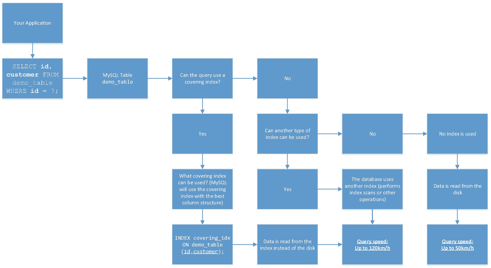

图 11-1

覆盖索引在行动

这张图描绘了覆盖索引在数据库管理系统中的功能。诚然，这个图示过于简化（查询可能不同，查询速度也不是以公里/小时衡量的——我添加这个是为了说明目的），但它阐明了要点：*索引可能会让你的查询更快。*

索引可能对你的查询有帮助，也可能没有。确实存在许多索引类型，每种索引类型都能帮助特定类型的查询更快地完成。如果你过去定义过一两个索引，你可能已经了解围绕索引类型的情况，这使你能够得出结论并决定采用特定的索引类型。但即使你没有，索引类型也不难理解：翻回几页，刷新一下对索引类型的记忆，然后深入了解一下。

#### B-树索引

B-树索引指的是平衡树索引。它们之所以被称为 B-树索引，是因为理想情况下，这种索引的所有叶节点在视觉上都位于同一级别，从而提供一种平衡。在现实世界中，结果往往远非完美，因为开发人员经常添加/删除与所讨论的索引列相关的数据，从而为索引碎片化铺平了道路。但无论如何，B-树索引在数据库世界中占有稳固的地位，并且很可能在未来多年保持这一地位。

要理解 B-树索引，理解二叉搜索树可能有所帮助。一个基本的二叉搜索树（BST）图示如下：

```
A
/  \
B    E
/ \     \
C   D     F
/
G
```

二叉搜索树（BST）是一种类似树状的结构，由节点组成。BST 中的节点最多可以有两个子节点在两侧。当你看到这样的结构时，你就会开始理解为什么使用索引的查询通常比从磁盘读取数据的查询快得多。


#### B 树索引：结构、用法与优化

##### B 树索引简介
B 树索引是一种带有变体的二叉树索引：这种类型的索引允许其成员拥有两个以上的子节点，这也是其主要区别。以下是 B 树索引的基本示意图。

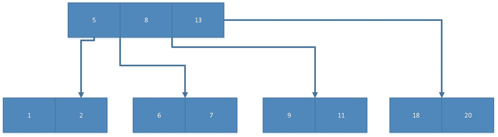

图 11-2：B 树索引

B 树索引能提升查询性能，因为其结构使数据库能够跳过遍历不必要的行：它们使用指针快速定位数据，索引的中间层每个节点可以容纳更多条目，但无论单个节点有多少条目，B 树索引的基本原理保持不变。

##### 在 MySQL 中定义 B 树索引
在所有 MySQL 版本中，B 树索引可以在创建表时定义，也可以在修改特定表结构时定义。也就是说，无论你选择如何定义 B 树索引，它们的内部功能不会改变。索引所在的列、其基数以及其他具体细节可能会变，但这些细节中的绝大部分与你的查询和数据库内部机制相关。你的查询内部机制也决定了选择哪种索引。

要充分利用 B 树索引，请使用等于运算符、`BETWEEN`或不带前导通配符的`LIKE`。如果你发现自己使用`IS [NOT] NULL`子句，B 树索引也会有所帮助；在使用`AND`子句时同样有效。

##### 实践演示
好了，现在来看示例。为了测试 B 树索引的功能，我将创建一个用于演示的表。

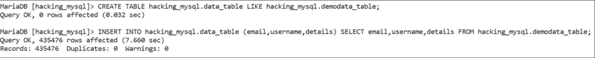

图 11-3：为演示目的创建表

请注意我创建表的方式——我没有使用转储文件从备份中恢复表；而是重新创建了表结构（第一个查询），然后插入了一些（并非全部）先前表中存在的数据（第二个查询）。

我还要说明一点，我们已经在`username`列上有了一个 B 树索引；因此，所讨论的`INSERT`查询的速度会比平时慢。

如果你生成数据，然后对包含生成数据的列创建索引，那么索引的基数可能会相当低。


图 11-4：在用户名列上的 BTREE 索引

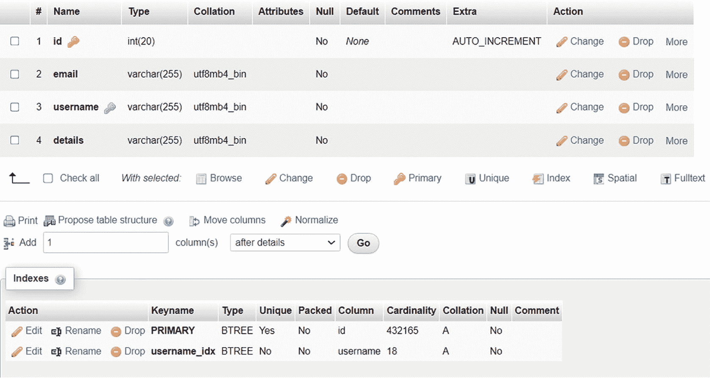

图 11-5：列上索引的较低基数

现在，如果你正在自己的环境中复制粘贴我的操作来学习，你们中的许多人可能没有 50 万条记录可供操作。为此，可以找一个能生成大量随机数据的网站（generatedata.com 是个不错的起点），或者从备份中恢复数据并在必要时进行匿名化处理。为此，我们将使用几个查询——并非所有查询都适用于你的具体情况，因此请按需取用并相应地调整表名/列/条目：

1.  `` UPDATE `demo_data` SET `column` = ELT(FLOOR(RAND()*3) +1, 'Anonymized Row', 'Anonymous', 'Private'); ``
2.  `` UPDATE `demo_data` SET `id` = RAND(); ``
3.  `` UPDATE `demo_data` SET `email` = REPLACE(`email`, 'gmail.com', 'demo.com'); ``
4.  `` UPDATE `demo_data` SET `ip` = '127.0.0.1'; ``
5.  `...`

你还可以采用许多其他方法，但对于这个例子，这些就足够了——第一个查询会将列的所有值设置为你指定的三个值之一（要提供更多值，请增加`RAND()`乘以的数字，然后添加更多条目），第二个查询会将`id`列中的所有值设置为随机值，第三个查询会将所有`gmail.com`的电子邮件域名替换为`demo.com`，第四个查询会将所有 IP 地址设置为`127.0.0.1`。你也可以自由发挥，自己想些办法。让我们看看它们是如何工作的。

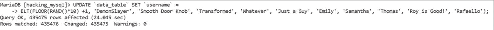

图 11-6：将用户名设置为随机用户名

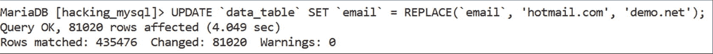

图 11-7：将电子邮件设置为随机电子邮件

很好——它们按预期工作。让我们运行几个查询，看看 MariaDB 是如何使用我们的 B 树索引的。

##### 测试索引性能
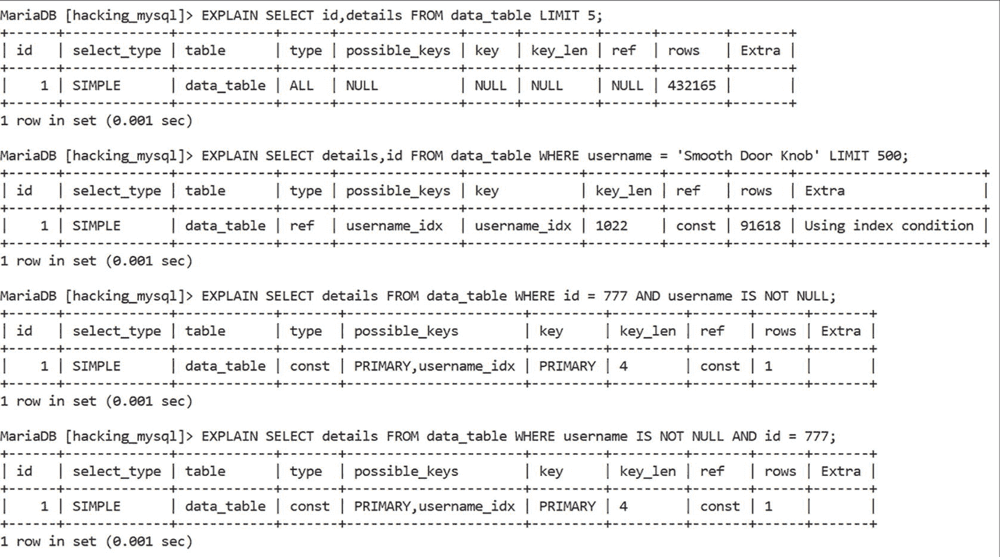

图 11-8：在`username`列上测试 B 树索引：第 1 轮

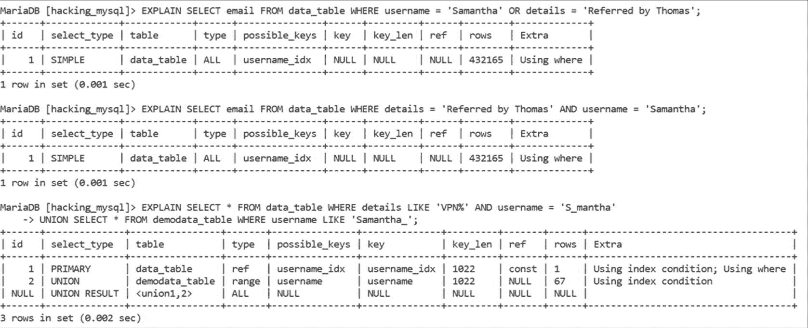

图 11-9：在`username`列上测试 B 树索引：第 2 轮

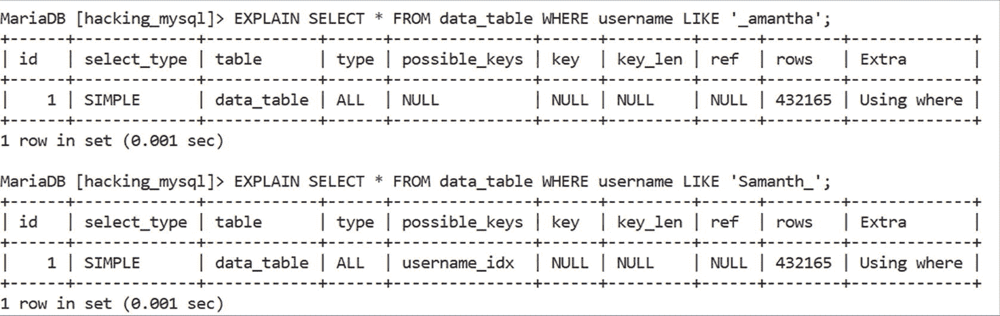

图 11-10：在`username`列上测试 B 树索引：第 3 轮

我假设你的查询看起来与显示的类似——如果是这样，关于在 MySQL 中使用 B 树索引的经验教训如下（我通过判断索引是否可能被使用以及是否被 MariaDB 使用来推导这些，主要查看`possible_keys`和`key`列）：

1.  **为了让你的查询能够使用索引，必须“接触”该列。** 看看第一个查询——它与`username`列毫无关系，因此甚至没有考虑该列上的索引。
2.  **当使用`LIMIT`、`OFFSET`或类似子句时，可以使用 B 树索引。** 如果你在`WHERE`子句后使用了被索引的列，`LIMIT`、`OFFSET`和类似子句不会削弱索引在 MariaDB 中的实用性。
3.  **如果存在 B 树索引和`PRIMARY KEY`索引的选择，MySQL 仍然可能选择使用主键索引，无论查询结构是否“允许”MySQL 考虑不同的 B 树索引。** 进行实验和调整，为你的查询找到最佳匹配。
4.  **MySQL 可以考虑一个索引，但如果认为它对查询没有好处，就不会使用它。**
5.  **MySQL 可以在查询的不同部分使用不同的索引。** 在涉及`UNION`或其他子句时尤其如此。
6.  **“%”并不是唯一可能使你的查询失效的通配符。** 正如你可能知道的，表示单个未知字符的“_”字符也是一个通配符。因此，查询未知字符在前的查询也可能比平时慢。

##### 关键注意事项与优化
请注意，如果你将任何列设置为多个随机值，索引基数会相当低。为了确保你对 B 树索引的体验不至于变糟，也要注意索引叶结构的长度——你的索引大小取决于索引中的行数、列数、索引数以及列中值本身的大小。

也有办法预测索引的大小——方法可能因数据库而异，但对于基于 MariaDB 的索引，你可以利用`mysql`数据库中的`innodb_index_stats`表。

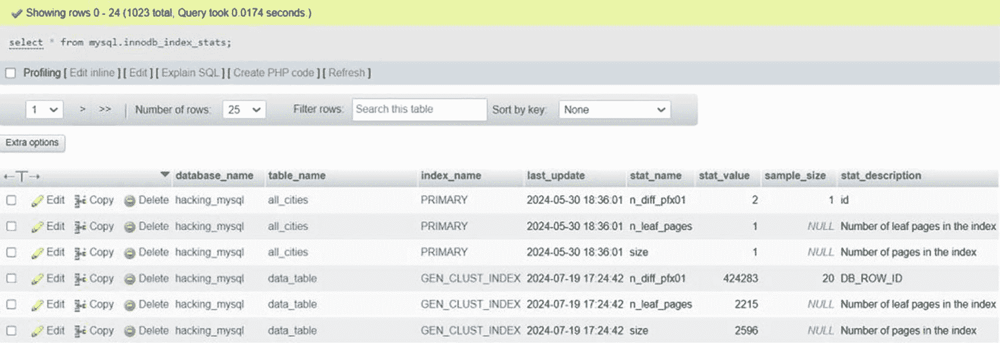

图 11-11：MariaDB 中的 InnoDB 索引详细信息

你们中的大多数人不会花很长时间查看这些统计数据，因为它们相当复杂，所以为了提取必要的信息，我们可以使用如下查询——这个查询将为我们提供所有数据库中索引的大小（以 MB 为单位）。该查询将排除主键：

```
SELECT database_name, table_name, index_name,
ROUND(stat_value * @@innodb_page_size / 1024 / 1024, 2) idxsize_mb
FROM mysql.innodb_index_stats
WHERE stat_name = 'size' AND index_name != 'PRIMARY'
ORDER BY idxsize_mb DESC;
```

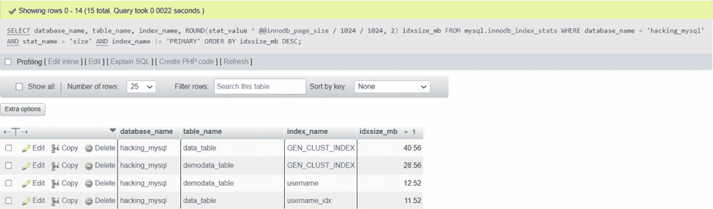

图 11-12：显示特定数据库中的索引详细信息

为了减小索引的大小，考虑尽量减少你所用数据类型的长度，并使用在磁盘上占用空间更少的数据类型（例如，用`VARCHAR`代替`TEXT`）或使用其他类型的索引（记住——你也可以只索引列的一部分）。


一旦你确保只索引了那些值得索引的列，请记住查询优化器总会选择最快的方式为你提供数据。永远记住一点——查询优化器会寻找使你的查询更快的方法，如果它选择的路径没有用到你的索引，那是因为优化器判定另一条路径能让查询更快完成。也许你的索引基数（cardinality）相当低？如果不是，也许换一种不同类型的索引能让你的查询性能飙升。

### 覆盖索引

对你们许多人来说，索引工作不会止步于几个零散的 B-tree 索引。每个应用都不同，一旦你开始涉足索引领域，你很可能会开始寻找其他解决方案，以便在其它场景下也能覆盖你的需求。

这就引出了覆盖索引——本质上，它们与 B-Tree 索引是同一类东西，但有一个关键不同：此类索引“覆盖”了一个查询执行所需的所有列，因此得名。

覆盖索引的功能与 B-tree 索引没有太大区别，因为覆盖索引本身就是 B-tree 索引，所以在这一点上没有变化。但尽管如此，这类索引有一个关键区别——使用覆盖索引的查询很可能比使用普通 B-tree 索引的查询完成得更快，因为覆盖索引索引了查询所使用的所有列，从而让你的数据库能够直接从索引中读取数据，而不是从磁盘读取，最终为你的数据库带来巨大的性能收益。

关于覆盖索引的一些常见误解包括，声称一个覆盖索引覆盖了表中的所有列，但情况往往并非如此。一个有用的覆盖索引可以是任何建立在我们正在执行 `SELECT` 查询所涉及列上的单一索引。另一个常见的争议点与覆盖多列的索引有关。如果这些索引没有覆盖查询执行所需的列，那么它们就不是覆盖索引，因此它们属于一个不同（但相关）的类别——它们是多列索引。

覆盖索引就是 B-tree 索引，因此它们的定义方式与 B-tree 索引完全相同。但考虑到此类索引的特性，它们需要在事前回答一些问题。所有最重要的问题都会以某种方式与我们查询所使用的列相关——我们的查询使用了哪些列，我们在搜索什么数据，我们的列使用了什么数据类型，以及我们期望得到什么结果？

对这些问题的回答将决定我们需要做哪些事情才能让我们的查询以最佳方式工作。首先，考虑你的用例——你在搜索什么数据，你想达到什么目的？只有回答了这个问题，我们才能定义一个真正有助于我们的数据库，而不仅仅是占用磁盘空间的索引。

一旦我们有了那个问题的答案，我们就可以自由地创建表并添加必要的索引。我将修改一个现有的表，并在两个列——`username` 和 `details`——上添加一个覆盖索引，因为我即将搜索注册在模拟论坛上的用户的详细信息（覆盖索引也可以添加在现有的 B-tree 索引之上）。

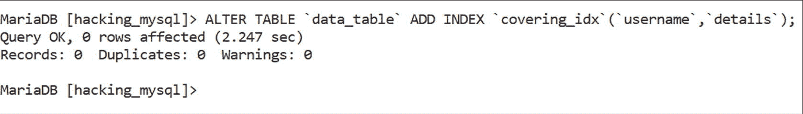
图 11-13
在表上添加覆盖索引

覆盖索引相当容易理解——复杂的部分是索引中列的顺序，这也是覆盖索引的主要挑战：覆盖索引通过满足明确的要求，使你的查询能够从索引中读取数据。这些要求是索引中列顺序的基石，而构思出一个能帮助你的用例及其中查询的顺序绝非易事。我给你举个例子——对于一个像这样的查询：

```sql
SELECT user, infraction_details FROM demo_forum WHERE last_infraction = `Minor` AND referred_by = `Thomas`;
```

哪一个覆盖索引会是最高效的？

1.  ```sql
    CREATE INDEX `covering_idx` ON `demo_forum`(`user`,`infraction_details`,`last_infraction`,`referred_by`);
    ```

2.  ```sql
    CREATE INDEX `covering_idx` ON `demo_forum`(`referred_by`,`last_infraction`,`infraction_details`,`user`);
    ```

3.  ```sql
    CREATE INDEX `covering_idx` ON `demo_forum`(`user`,`infraction_details`,`referred_by`,`last_infraction`);
    ```

4.  ```sql
    CREATE INDEX `covering_idx` ON `demo_forum`(`infraction_details`,`referred_by`,`last_infraction`,`user`);
    ```

很难回答，对吧？以上所有索引都能构成一个合适的、可用的覆盖索引，但其中只有一两个是任务的最佳选择，具体取决于你所使用的 MySQL 类型——对于 MySQL < 8.0 和 MariaDB 的用户，只有第一个索引能胜任，但如果你运行的是 MySQL >= 8.0，第二个查询也是一种选择，因为新版本的 MySQL 也可以执行向后的索引扫描。

下面可以看到一些使用覆盖索引的例子。

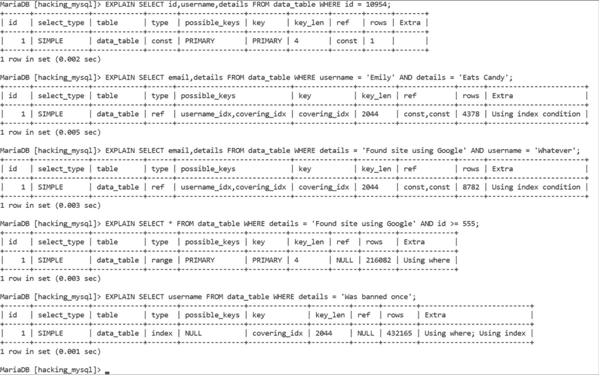
图 11-14
MariaDB 中使用的覆盖索引

1.  第一个查询没有使用覆盖索引，因为我只在 `WHERE` 子句后定义了 `id`。
2.  第二个查询使用了覆盖索引，因为我们的要求非常明确：尽管这类查询在现实中可能不常见（我们基本上是在 `WHERE` 子句中定义列值之后再选择这两个列），但它们是覆盖索引何时会被使用的一个好例子。
3.  第三个查询通过向后扫描索引（`details, username`）来使用索引。
4.  第四个查询仅使用了 `id` 列上的主键索引，因为我们只搜索 `id`，没有其他内容。
5.  最后一个查询使用了覆盖索引，因为我们正在寻找一个具有特定详细信息的用户的用户名，并且该查询的构造方式使其成为覆盖索引的完美应用场景，无需向后读取。

最后，请记住，那些覆盖了太多列，同时也覆盖了查询执行所需列的索引，也属于覆盖索引，但它们可能会显得多余。要正确地使用覆盖索引，请记住：

1.  在 `WHERE` 子句的前后索引每一列。
2.  避免包含你未使用的列。
3.  覆盖索引可以被向后读取。
4.  一张表可以利用多个覆盖索引——这完全取决于你的查询结构。

最后，保持简单——简单的方法往往是最好的。

### 多列（复合）索引

现在，我们来讨论多列索引。多列或复合索引经常与覆盖索引混淆，因为两种索引都利用了多个列，但只有覆盖索引能让你的数据库直接从索引中读取数据。

多列索引正如其名——它们是建立在多个列上的索引。此类索引也是 B-tree 索引，它们可能“覆盖”也可能不“覆盖”一个查询执行所需的所有列，但无论结果如何，它们都被视为复合索引。

多列索引有其自身独特的一些特性——MySQL 只允许这类索引为 B-tree 类型，而其他数据库管理系统如 PostgreSQL 则允许 GIN、BRIN 和 GiST 类型。一些开发者甚至可能将多列索引比作一个排序数组。

在 MySQL 中，复合索引最多可由 16 列组成，它们要求查询使用复合索引中的部分或所有列，并且，正如之前的复合索引一样，它们拥有一个至关重要的特性——索引中列的顺序。

以下是一个复合索引的基本定义：

```sql
CREATE INDEX `composite_idx` ON `demo_table`(`col_1`,`col_2`,`col_3`);
```


#### 复合索引、覆盖索引及其他索引类型

复合索引理解起来并不复杂——要使用它们，我们必须按指定的顺序使用索引中的一个或多个列。前述的索引定义将满足使用 `col_1` 列、`col_1` 和 `col_2` 两列或所有三列组合的查询。

现在，再次来看例子。我将再次使用覆盖索引，但首先通过运行如下查询来重命名它——这个查询非常直观：

```sql
ALTER TABLE `database`.`table` RENAME INDEX `covering_idx` TO `composite_idx`;
```

这意味着现在我们的表有一个由两列——`username` 和 `details`（最多可包含 16 列）——组成的复合索引；检查时，MariaDB 应在多列索引的第一列的 Key 列中返回 “MUL”。

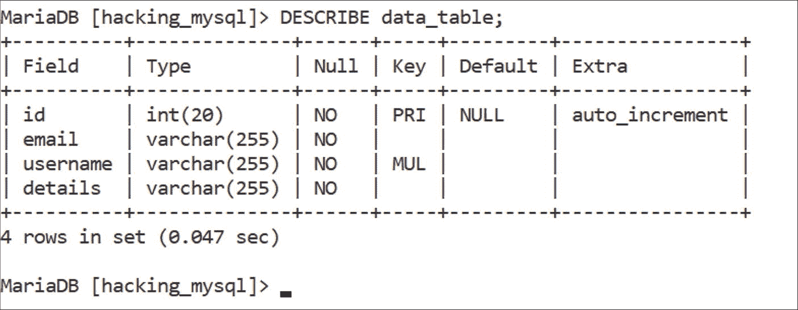

图 11-15

MariaDB 中多列索引显示为 “MUL”

让我们来测试一下。

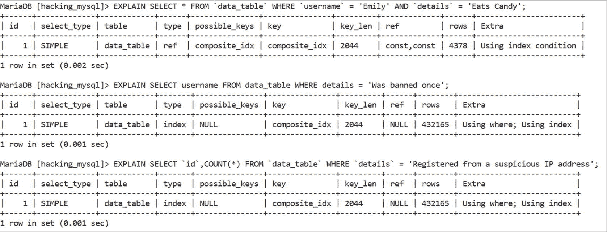

图 11-16

复合索引：第一轮

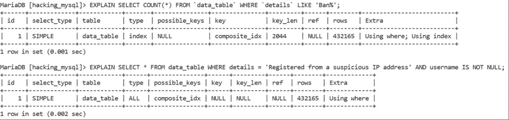

图 11-17

复合索引：第二轮

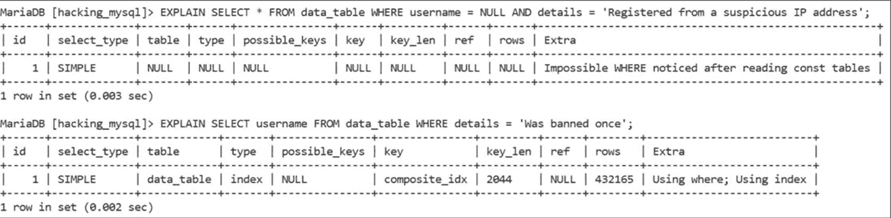

图 11-18

复合索引：第三轮

我们得到了结果！

你可以看到，无论我们是查询 `username` 列和 `details` 列，还是 `details` 列和 `username` 列，数据库仍然能够使用该索引。有时 MariaDB 确实考虑使用索引但决定不使用，因为它认为不使用索引完成查询会更快，有一次 MariaDB 返回了一条注释：`Impossible WHERE noticed after reading const tables`。这个错误可能让一些人感到困惑，但它本质上意味着在你的表中没有找到满足 `WHERE` 子句中一个或多个条件的行。换句话说，你很可能检查了不该检查的东西（在 `NOT NULL` 列中检查 `NULL` 值，或反之），或者某个子句没有匹配任何记录，因此 MariaDB 没有费心处理其余部分。

覆盖索引无疑很有趣，并且在使用某些子句时也可以使用——如果你搜索最左边的列，然后使用带有等值运算符的 `ORDER BY` 对其余列进行排序，`ORDER BY` 效果最好。覆盖索引也可以向后扫描。

##### 前缀索引

覆盖索引和复合索引都很棒——那么在索引整个列空间不足的情况下该怎么办呢？在这种情况下，你需要使用前缀索引——一种只覆盖列中部分字符的索引，因此与其他索引相比相当小，但仍提供足够的选择性，使其成为一个可行的选择。

前缀索引的定义与常规索引类似，只是用数字表示应覆盖列中的多少个字符。此示例将在 `demo_table` 的 `demo_column` 的前 10 个字符上添加一个前缀索引：

```sql
ALTER TABLE `demo_table` ADD INDEX `prefix_idx`(demo_column(10));
```

可以看出，以这种方式定义的索引选择性较低，但如果定义得当，仍然可以提供可行的性能优势。这实际上是关键所在——`挑战在于如何恰当地定义它们`。除了前缀索引在磁盘上使用更少的空间外，对于索引 `BLOB` 或 `TEXT` 数据类型来说，它们也是必需的——由于其大小，无论你是否愿意定义，此类数据类型都要求定义前缀索引。

前缀索引对一些人来说很繁琐——开发人员常常觉得寻找合适的索引长度任务过于繁重，因为他们没有可遵循的“规则”来找到一个黄金平衡点。

不过，找到一个好的前缀索引长度并非难事——一个简单的做法是深入研究你的用例，并找到相关行的平均长度。行的平均长度应该是一个很好的起点——目标是长度足够长，使其结果与整个列的索引尽可能相似，但不要覆盖整个列以节省磁盘空间。

定义理想的前缀索引需要实践，而且由于此类索引只能用于“普通” SQL 查询，并且不覆盖列中的所有值，因此它们不能用作覆盖索引。部分索引不能使用 `ORDER BY` 或 `GROUP BY` 子句，因此它们也不是适用于所有用例的理想选择。

##### 空间（R-Tree）、哈希和聚簇索引

除了前缀索引，你也可能有使用空间索引的用例。有些人可能甚至没听说过它们，这没关系；空间索引有非常特殊的任务——它们索引几何数据，因此，使用此类索引的列必须存储基于 `POLYGON`、`LINESTRING` 或 `MULTIPOINT` 数据类型的空间数据。空间索引的定义需要 `SPATIAL` 关键字：

```sql
ALTER TABLE `demo_table` ADD SPATIAL INDEX `spatial_idx`(`column`);
```

空间索引的工作方式类似于 B-tree 索引，它们也能加快精确值的搜索速度。

空间索引通过空间参考标识符（SRID）工作——这些是与几何值关联的 ID 值，为了在使用空间索引时优化数据，建议通过运行如下 SQL 查询来验证列中的所有值是否具有相同的 SRID：

```sql
SELECT ST_SRID(`column_title`) FROM `demo_table`;
```

MySQL 仅支持 MyISAM 存储引擎的 RTREE 索引——MariaDB 也将 Aria 存储引擎列入支持列表。

至于哈希索引，它们与 MEMORY 和 InnoDB 存储引擎一起工作。此类索引不支持基于前缀的查询，只与精确匹配运算符一起使用，也不支持 `ORDER BY` 子句，但通常来说，由于数据存储在内存中，它们异常快速。

此类索引没有很多用例，但有时可能对测试是必要的：当使用 MEMORY 存储引擎时，其所有数据都保存在内存中，并在关闭时销毁；当使用 InnoDB 存储引擎时，此类索引仍然可用，但在后台被转换为 B-tree 索引。

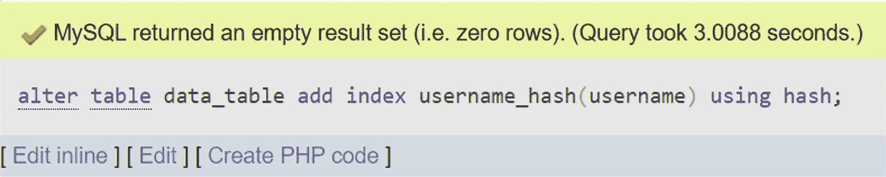

图 11-19

在表上添加哈希索引

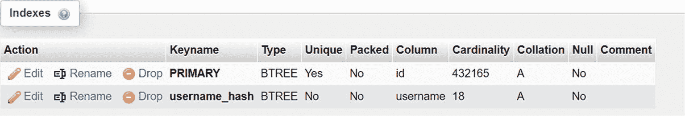

图 11-20

哈希索引变成了 B-tree 索引

换句话说，如果你在存储引擎的列上定义哈希索引，InnoDB 不会报错——它很可能会将你的哈希索引更改为 b-tree 索引，因为它认为哈希索引与 b-tree 索引作用相同，因此不需要单独的定义。

聚簇索引有点不同——此类索引可以被你的查询使用，但在大多数情况下，MySQL 及其同类将此类索引视为主键。换句话说，聚簇索引是一个包含自动递增值并定义为带有 `auto-increment` 选项的主键的 B-tree 索引。此类索引可以且将会遵循 B-tree 索引规则被使用。


由于聚簇索引会存储行数据，因此每个表只能有一个此类索引。大多数情况下，聚簇索引会被放置在`id`列上，并且会自动递增，从而实现其目的。如果不存在自动递增的列，MySQL 也会创建一个聚簇索引，因为在这种情况下，聚簇索引将是第一个键列定义为`NOT NULL`的`UNIQUE`索引。如果这种情况也不存在，并且你使用的是`InnoDB`存储引擎，那么它会生成一个名为`GEN_CLUST_INDEX`的不可见聚簇索引，并根据`InnoDB`分配的 ID 对行进行排序。

使用这种索引的查询很可能快如闪电，因为当使用索引时，`InnoDB`会直接定位到包含该行数据的数据库页面，从而节省了不必要的磁盘 I/O。

大多数表很可能会同时使用聚簇索引和 B-tree 索引：这是一个事实。无论你的表存储了 100,000 条还是 100,000,000 条记录，B-tree 索引无疑都会有所帮助。一旦你需要决定索引的设计，问题就会出现：你可能对索引的方方面面了如指掌，但如果你不知道如何在特定用例中以有助于查询的方式进行索引，你所有的知识仍然可能导致你的数据库陷入停顿。在这一切之后，一个合乎逻辑的问题可能会出现：*你是怎么知道的？* 这是一个需要单独回答的问题。

### 设计完美的索引方案

要提出一个完美索引设计的策略，请回答一个问题：你认为什么是“完美”索引？对你们大多数人来说，完美索引是指使用它时查询速度比 X 更快的索引。X 是多少？为什么是这个数字？

为了给你指引方向，我稍微回溯一下：大约在 2016 年，出现了一批新的数据泄露搜索引擎；那些当时关注该领域的人肯定记得他们的 Twitter（现在是 X）动态：他们 50%的推文都专注于*“看看我们——即使在压力下，我们的查询也在 0.0003 秒内完成，而我们竞争对手的网站只能维持 0.04 秒的速度！这难道不是一个停止使用他们的服务并转而使用我们的好理由吗？！”* 或者 *“我们的竞争对手在返回结果时只返回 200 行，而我们的结果没有限制！”*

这些推文之所以出现，似乎是因为这些搜索引擎的运营商正在尝试索引/数据库设计；什么样的索引能使某个特定查询完成得最快，以及为什么？

*这些推文之所以出现，很可能是因为这些搜索引擎的运营商知道，设计完美的索引方案对许多开发者来说是一个棘手的难题，因为他们大多精通某一门特定语言，但对数据库，尤其是数据库的衍生品了解不多。* 你的用例可能与数据泄露搜索引擎的用例大相径庭，也可能完全相同，但无论如何，如果你的表有超过一百万行，你就需要事先设计好合适的索引，以免索引在长期内给你带来问题。

你们中的许多人不会那么在意微秒级的索引速度，只要查询能在一秒内完成，你就会觉得可以接受，但请记住，你的数据库也需要进行压力测试：考虑到你的用例、数据库承受的压力、你的硬件和数据库容量，在速度方面，一个合理的估计范围是多少？请根据以下因素大胆猜测：

*   **用例**：你的用例会为你指引可能的索引类型。
*   **数据类型**：所使用的数据类型也会提示索引类型。例如，如果你的用例需要`TEXT`列，那么无论如何你都必须考虑前缀索引。如果你的搜索是基于`id`列的，也许添加一个*聚簇索引*就足够了？
*   **数据库压力**：你们中的许多人会选择进行索引，以免因为访问量激增或类似原因给数据库带来额外压力；你数据库当前的负载是多少？繁忙月份的平均负载？过去 3 个月的负载？这些负载是否与你即将索引的查询结构有关？
*   **硬件和数据库容量**：使用的是什么硬盘？它们的容量和原因是什么？如果你有很多空间，但运行的是`HDD`而不是`NVMe`驱动器，你是否可以考虑*覆盖索引*，以完全避免从磁盘读取数据？数据库中是否存在一些数据可以被删除，以便为新数据腾出空间？

把这些因素考虑进去，你就成功了一半——良好的开端是成功的一半，对吧？现在，是时候进行设计本身了。

在本例中，我们的用例是一个电子商务商店后台数据库中的基本表，用于描述用户及其最近购买的物品。

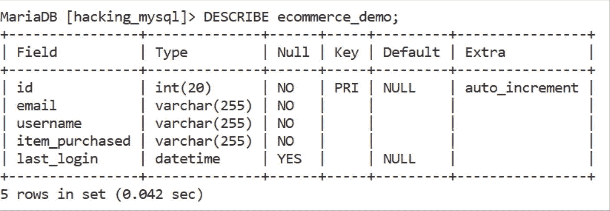

图 11-21：电子商务商店表结构

在现实生活中，如果你要为一个电子商务商店后台的表设计索引，可能会包含更多的列，但在本例中，这个表就足够了。好的——我们的用例是什么？我们很可能是在使用某个系统搜索什么用户购买了什么物品，对吧？考虑到这样的用例，数据类型方面呢？我们是否需要在所有地方都使用`varchar(255)`？可能不需要，所以让我们来处理一下——更小的数据类型意味着磁盘上的数据更少。


图 11-22：`ALTER TABLE`的第一阶段

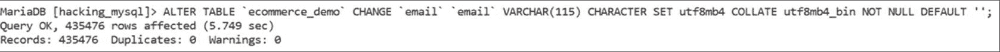

图 11-23：`ALTER TABLE`的第二阶段

如果你在运行`ALTER`查询时看到“Stage: 1 of 2...”请不要惊讶：`MariaDB`只是在解释它所经历的内部过程。另外，请记住，在重置列的数据类型时，通过同时更改列的第二个定义，你也可以重命名列。

在我们对表进行了一些调整之后，我们得到了以下结果。

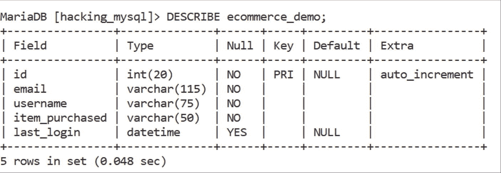

图 11-24：优化了数据类型的电子商务表

好多了——我们可以准备进行索引设计了。

为此，我们需要审视我们应用程序的功能：它是做什么的？用户在搜索引擎中有哪些选项？*搜索和显示的是什么数据？* 最后一个问题尤为重要，因为它的答案决定了查询结构，而查询结构决定了索引设计。

假设我们搜索最近购买的物品，以确定某个客户的最后登录日期，检查该客户是否仍在登录商店，以及他的电子邮件地址，这样我们就可以联系他提供折扣和其他详情。这就是我们问题最大部分的答案——索引什么。我们通常为被搜索的列创建索引，所以在这种情况下，我们需要在`item_purchased`列上有一个索引。如果没有其他东西来辅助我们的搜索努力（添加任何其他列都将需要`AND`/`OR`子句的存在），那么我们在那方面的搜索就结束了。

要决定索引类型，我们需要再次深入研究我们的用例：在这个案例中，由于应用程序的性质，很明显我们将需要一个`B-tree`索引，但我们需要全文索引吗？在这个案例中，可能不需要；全文索引仅在以下情况下是必要的：

1.  我们希望能够在搜索查询中包含布尔字符，以告诉查询从搜索结果中包含/排除某些内容等——这就是布尔搜索模式的全部意义。
2.  我们依赖于“隐含知识”，即我们搜索“cheese”，并且希望我们的结果集包含“cheddar cheese”、“blue cheese”等——这就是查询扩展模式存在的原因。
3.  我们有像`TEXT`这样的大型文本字段，并且打算对其运行查询。


#### 索引基础与初步设计

首先，必须遵守所有全文搜索规则：全文索引对搜索的最小字符串长度有要求（InnoDB 为 3 个字符，MyISAM 为 4 个字符），并且包含一个针对特定存储引擎的停用词列表（例如“the”、“it”、“on”等词），因此我们需要确保搜索查询不包含这些词。

我们的 B-tree 索引需要是一个覆盖索引吗？这完全取决于我们拥有多少记录以及查询的结构。如果我们的数据集不大，覆盖索引可能没有必要；但如果数据集更大，并且我们改变用例，使其需要购买商品本身之外或与购买商品相关的其他数据（例如，购买商品的类型、数量等），覆盖索引将会有所帮助。在这个例子中，我们可以使用覆盖索引（我们有 50 万行数据，并且想查看哪些用户购买了哪些商品），但一个普通的 B-tree 索引也能很好地工作，并且我们也不需要它是一个前缀索引。

那么，基于这些事实，我们如何定义索引呢？在这种情况下，一切都很简单。我们的查询如下所示：

```sql
SELECT email,last_login FROM `ecommerce_demo` WHERE `item_purchased` = ;
```

基于此以及我们的用例，我们需要为 `item_purchased` 列建立索引——我们将它命名为 `search_idx`（索引可以任意命名，如果不设置，名称将默认为列名）：

```sql
ALTER TABLE `ecommerce_demo ` ADD INDEX `search_idx`(`item_purchased`);
```

完成了——并不难，对吧？从对索引什么以及如何索引毫无头绪，到几分钟内在表上拥有一个功能性的索引。这是怎么做到的？回答几个问题就像一个漏斗，引导你找到答案：如果你知道要问什么问题，你就会找到答案。

#### 索引设计与大数据考量

当你的索引设计非常出色之后（面对现实吧——没有什么是 100% 完美的），你的数据增长了，时间也流逝了一段时间；你们中的一些人会发现自己需要重新评估索引设计的选择。重新评估索引设计可能有几个原因，但大多数都与用例、数据或你获得的经验的变化有关。

当你拥有大量数据时，你定义的索引结构可能不再像以前那样有效。你们中的一些人甚至可能不再处理与以前相同的数据——也许你已经构建了一个不同的项目，需要处理比之前项目多得多的数据。这很正常——事物在变化，你的索引也需要随之发展。

当情况发生变化时，重要的是不要随波逐流，并记住数据库本身变化不大。变化更多地与你的用例相关，换句话说，这意味着你发现自己要做的大部分事情，与处理普通数据集时采取的行动不会有太大区别。

十亿条记录是大量的数据，如果你需要索引这么多数据，首先要回归的还是你的用例：是什么需要在数据库中存储如此多的数据，你的应用程序在做什么？数据是被写入数据库表中，频率如何？或者你的数据库是一个只读环境？*你为什么要从如此庞大的数据中提取洞察？*

回答这些问题，重新评估索引的基础，你将再次找到应该走的道路。你们中的许多人会惊讶地发现，你需要采取的行动与你通常所做的没有太大不同——只是需要比平时更多的考量。举个例子：

如果我们决定为列建立索引，我们再次需要知道我们应用程序的核心在做什么。如果我们有数亿行数据需要查询，那么尽可能限制数据量对我们最有利。首先，表中的数亿行数据是如何出现的？它们都是必要的吗？我们能否添加一个唯一索引来处理重复项？我们需要向用户展示什么以及如何展示？

如果你有那么多数据，网站内的搜索功能也可能不同。对于一些场景，拥有大量数据需要在应用程序内提供一个高级、详细的搜索功能——这种设施的目的在于在两个方面发挥作用：

1.  帮助用户/客户进一步细化他们正在搜索的内容以及期望找到的结果。
2.  帮助你的数据库以某种方式访问数据，甚至在考虑使用索引之前就排除某些行。

这方面的一个完美例子是允许在多个类别中搜索内容的汽车相关网站——我将在括号中提供示例并稍后解释原因：

1.  汽车品牌（例如，“**Toyota**”）
2.  汽车的具体型号（例如，“Toyota **Corolla**”）
3.  汽车的制造年份（例如，“**2019** Toyota Corolla”）
4.  汽车使用的燃料类型（例如，“**Gasoline** 2019 Toyota Corolla”）
5.  汽车价格（例如，“Gasoline 2019 Toyota Corolla **Under $10,000**”）
6.  汽车是否发生过事故（例如，“Gasoline 2019 Toyota Corolla Under $10,000 **without Accidents**”）
7.  汽车的前任车主数量（例如，“Gasoline 2019 Toyota Corolla Under $10,000 without Accidents **with Less than 3 Owners**”）
8.  你希望如何支付汽车费用（例如，“Gasoline 2019 Toyota Corolla Under $10,000 without Accidents with Less than 3 Owners **Available Through a Lease**”）

等等。所有这些子句都有其意义，并对你的索引及其背后的数据库产生重大影响。许多此类网站使用相当简单的查询来搜索数据——筛选器越多，数据库需要查询的数据就越少，因此，一旦涉及到一个能进一步减少可访问数据量的适用索引，查询仍然能快速完成。这就是为什么你可能同时看到“列表中有 156,521,776 辆汽车”和“查询在 0.12 秒内完成”的主要原因。

另一方面，构建索引来帮助此类查询可能并非易事——构建遵循用户指定的所有条件的查询可能需要许多子句来访问表中的各个列数据（我们可能需要 `AND`/`OR` 等）；我们可能需要访问不同表中的数据（我们为此使用 `UNION` 子句，并且要使用它，两个表需要有相同的结构）或甚至完全不同的数据库。对于更大数据集上的索引，`DESCRIBE` 和 `EXPLAIN` 都是很好的出发点。

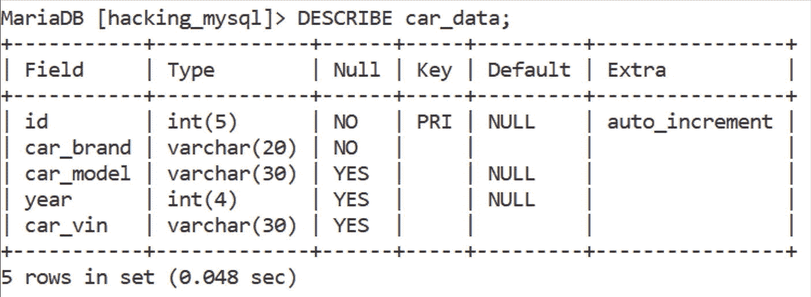

图 11-25 `car_data` 表

注意我们使用的数据类型——所有数据类型都经过仔细考虑，并应用了合理的长度。现在，如果我们正在搜索所有字段（不包括 ID 字段），我们是否需要四个独立的索引分别对应四个字段？不一定。在这种情况下，我们可以使用一个复合索引，因为我们某种程度上隐式地知道用户选择的顺序——首先，他必须选择汽车品牌（例如，“Toyota”），然后是车型（例如，“Corolla”），只有在那之后他才能选择其余选项，包括年份，如果我们的应用程序需要，还可以定义可能的 VIN 唯一标识符。在选择品牌之前选择车型，或在选择车型之前选择年份，都是不可能的，所以我们某种程度上隐式地知道什么会在什么之后发生。如果我们的应用程序需要使用所有字段，我们的索引甚至可能是覆盖索引！在构建索引时，让我们利用这一点：

```sql
ALTER TABLE `car_data` ADD INDEX `composite_idx`(`car_brand`,`car_model`,`year`, `car_vin`);
```


#### 索引与查询优化

现在，要构建一个查询，我们需要考虑需要返回的数据：在这种特定情况下，我们可能需要选择除 ID 外的所有内容，因为这类网站的性质需要向客户提供大量信息。结果页面可能包括汽车的标题、年份、类型、VIN 代码、动力类型、变速箱以及车主所在的城市。专注于此类用例的表可能更大，但我们的演示表列数不多也不是问题。

对于我们的用例，我们也知道何时需要精确匹配。我们不会在此处使用通配符或`LIKE`查询，所以这也不在考虑范围内。我们是这样处理的：

1.  我们的应用很可能会列出可用的汽车品牌并提供表中的所有数据，所以是`SELECT * FROM car_data WHERE car_brand = 'BRAND'`。
2.  选择品牌后，我们的应用会列出可选的汽车型号——一旦选择了某个型号，我们就需要考虑它（`AND car_model = 'Model'`）。
3.  选择型号后，用户还可以选择该型号汽车的生产年份范围（`AND year [>=|<=] YEAR`）。

综合考虑，通过应用程序搜索 2015 年或更新的丰田卡罗拉的查询如下所示：

```sql
SELECT * FROM car_data WHERE car_brand = 'Toyota' AND car_model = 'Corolla' AND year >= 2015;
```

让我们看看这个查询是否使用了索引。

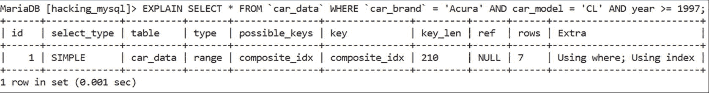

**图 11-26**

查看查询是否使用索引

无论返回多少行，即使我们甚至没有搜索 VIN（那是覆盖索引中的最后一列），我们看到`possible_keys`和`key`列都包含了我们索引的名称。我们的数据库使用索引找到了数据——太好了！

同样的规则适用于许多其他数据集，包括数据泄露搜索引擎。你认为拥有数十亿条记录的数据泄露搜索引擎会运行其他类型的查询吗？回顾上一章或查看下面。


**图 11-27**

在 100 亿条记录中循环搜索

*这个循环搜索了超过 100 亿条记录！* 你见过比这看起来更复杂的查询，不是吗？简单的东西往往是最好的——大数据集也不例外。

真的——为大数据集建立索引，你需要做的归结为简单的事情：

1.  你的用例以及其中可用的部分
2.  合适的数据类型
3.  对索引类型及其相关知识的理解
4.  访问有限的数据集
5.  返回有限的数据集

底线是：在选择索引时，考虑你的用例，选择不会给数据库带来太大压力的数据类型，在做出选择前了解每种可用索引类型的优缺点，并确保在首先访问有限的数据集后再涉及索引。

遵循这个建议将使你定义的索引能够帮助你的数据库，而不是像车轮里的辐条一样碍事，但一如既往，没有什么是绝对的保证——在考虑在实际环境中应用任何东西之前，请反复测试你收到的建议。

### 总结

索引是许多现代应用程序的支柱：正确定义的索引擅长使`SELECT`查询飞速执行，即使你遇到硬盘空间不足、无法使用某些数据类型或其他情况等各种阻碍，索引也能提供帮助。索引通过最小化数据库中的可读数据量来实现这一点，但索引并不是让查询性能飙升的唯一方法。

这时就引入了分区——你表中的迷你表，它们将数据分割成易于访问的块，进一步最小化了可访问数据的范围，并进一步提高了某些类型查询的性能。

## 12. 优化分区

当索引没有帮助或只有部分帮助时，开发人员会寻求其他方法来提高查询性能。其中一种方法是分区——分区是一个概念，它允许用户将数据库划分为几个独立的部分，而数据库层仍然将这些部分视为一个整体。

对于许多数据库管理系统的用户来说，分区是一个熟知的概念——MySQL 用户也不例外。数据库中的表被分区是为了使其中的数据更易于管理和访问，或者是为了负载均衡。在 MySQL、MariaDB 和 Percona Server 中，只有两种存储引擎支持分区：它们是 InnoDB 和 NDB。

### 为什么要分区数据？

要理解我们为什么要分区数据，我们首先需要理解分区的目的。在这方面，分区与索引的作用类似。一旦我们访问分区中的数据，我们的数据库就会读取更少的数据（例如，1500 万行而不是 1 亿行），因此，我们的查询可以更快地完成。*分区也可以与索引结合使用*，以使读取操作的性能更快——这种方法对于拥有数十亿条记录的人可能有益。

分区是有益的，因为它们的目的是将大数据集拆分成更小、可管理的部分，并且由于每个分区包含数据的一个子集，管理拆分到这些子集中的数据变得容易得多。分区数据有助于提高可扩展性、可管理性和性能，代价是空间——就像索引一样，分区有自己独特的文件，存储与该分区相关的数据，这些文件会占用磁盘空间。分区彼此分开存储，你的数据库将每个分区视为一个单独的表，同时通过 SQL 层将表及其分区视为一个对象。这样做是为了减轻数据访问负担，使分区更易于访问和使用。

### 何时分区数据？

为了回答这个领域可能最重要的问题，我将从一个我在 Stack Overflow 上看到的例子开始。这个例子的主要观点如下（我将提问的用户称为用户 X，给出被采纳答案的用户称为用户 Y）：

1.  用户 X 说他运行一个大约 200 万行、39 列的表，并且该表每天都在增长。然后，他提到查询这样一个数据集需要很长时间，并说有人（可能是他的工作同事）建议他对这个大表进行分区。
2.  用户 X 有几个问题：
    1.  什么时候是分区数据的时候？
    2.  分区表是否可能提高查询性能？
    3.  如果他对表进行分区，分区是否会导致需要更改任何正在运行的`SELECT`、`INSERT`或其他语句？
    4.  执行分区需要很长时间吗？
    5.  如果分区有帮助，该如何进行？如何识别应该分区的列和应该保持原样的列？

许多用户插话提供建议——一个被用户 X 采纳的建议以以下方式回答了问题：
    1.  可能永远不会。
    2.  分区可能会稍微降低查询性能。查询耗时很长通常是因为缺少适用的索引，可能是一个复合索引。你构建查询的方式也有影响，而且查询的设计对查询的影响可能远大于分区。
    3.  视情况而定。
    4.  视情况而定。
    5.  分区不会有帮助，因为你的表只有大约 200 万行。从优化运行缓慢的查询性能开始，当你有更大的数据集需要处理时再考虑分区。


为什么用户 Y 会这样回答问题？他话语背后隐藏着什么？让我们一探究竟：

1.  要让分区特别有效，你需要有大规模的数据集可供处理。“大”至少意味着拥有数千万行的数据。因此，他说“可能永远用不上”，意思其实是“你的数据量还不足以达到需要分区的程度”。
2.  分区要发挥作用，它必须与查询协同工作，而不是取代查询或替查询完成工作。用户需要先关注查询设计并添加任何适用的索引，如果那还无济于事，再转向分区。
3.  这要看情况，因为从未提供过查询供检查——如果查询 200 万行数据已经很慢，那么除了分区之外，已经存在足够多的问题。
4.  这取决于你的数据库配置和适用服务器的资源——一切都归结于所涉及的存储引擎（我猜用户 X 在使用 `InnoDB`），并且为了让分区尽可能快地完成，需要适当地优化某些参数，并且数据插入的方式不能阻碍数据库。
5.  如果查询已经很慢，对 200 万行数据进行分区可能不会有多大好处——事实上，弊可能大于利，因为如果你的查询在 200 万行数据上就已经一团糟，而且你的数据还在增长，我只能想象一旦你的数据超过 8 位数会发生什么。

这些回答对某些人来说可能显得有点刻薄，但它们很有分量——在这个案例中，分区是不必要的，因为根本没有足够的数据来证明其必要性。那么，何时才应该决定是时候对数据进行分区了呢？

这里没有“一刀切”的解决方案；当您已经优化了模式、查询和索引，但发现这些方法都无法将查询性能提升到令人满意的水平时，就是考虑数据分区的时候了。您的查询性能可能仍在下降，因为您要搜索大量数据，而您的数据库认为如此多的数据难以处理。这对你们中的许多人来说可能不太会发生，但一旦发生，就是时候考虑分区了。你们中的一些人可能无需做到那一步就能判断您的用例是否需要分区：如果您已经知道您的用例需要用户搜索超过 1 亿行数据，那么推迟分区值得您花费时间和精力吗？不值得。

换句话说，当您知道将在一个表中存储大量行时，就对表进行分区。一个表的行数超过 1 亿了？是时候分区了。有理由相信您的数据集将超过一个表 1 亿行？分区。用索引优化了数据库和查询，但查询仍然很慢？考虑分区。但是，有一件事您不应该做，那就是对您看到的一切都进行索引/分区：一切皆有代价，索引和分区都会减慢更新、插入或删除数据的查询速度。换句话说，要谨慎分区，并且只有在完全理解给定分区类型的含义之后才进行。

### 数据库分区内部原理

分区将数据拆分到独立的表中，但对许多人来说，这难以理解，因为您的数据库在后台默默处理分区：一旦运行 `SHOW TABLES`，它不会显示关于分区表的信息，默认情况下也不会提供太多信息。因此，如果您不知道如何查看分区背后发生了什么，您可能很难为其他开发人员提供该做什么和哪里出了问题的建议。值得庆幸的是，MySQL 及其衍生版本确实提供了让开发者获取数据库中分区信息的方法。可以使用 `SHOW CREATE TABLE` 语句。

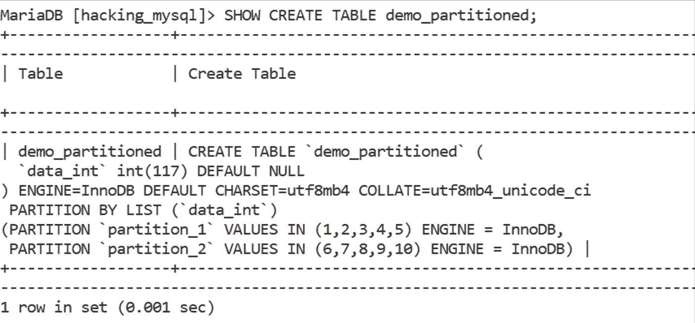

图 12-1
MariaDB 中的 `SHOW CREATE TABLE`

或者，可以通过 `SHOW TABLE STATUS` 选项来了解表是否已分区——检查 `Create_options` 列即可（注意此查询不会显示实际的分区，只显示表是否被分区）。

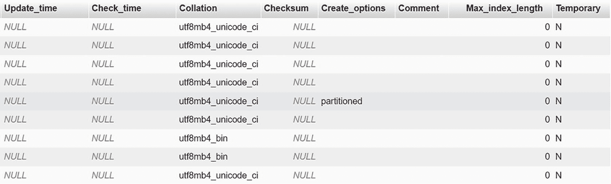

图 12-2
MariaDB 中 `SHOW TABLE STATUS` 的部分输出

`SHOW TABLE STATUS` 不会显示分区的名称和类型，但它会提供许多其他有用的信息，例如表使用的引擎、表中存在的行数、平均数据长度、索引长度、表是否有自动递增列、其排序规则是什么等等。

对于那些希望通过命令行界面操作的人，如果我们检查 MariaDB 或 MySQL 的数据目录并看到 `[table_name]#p#[title].ibd` 文件，就可以了解数据是否被分区。但为了避免文件名被误解，输出需要一点知识才能理解每个部分的含义（`table_name` 指的是表名，`#p#` 指的是分区，`title` 指的是分区的名称，而 `.ibd` 指的是数据文件。）

例如，我将列出 `hacking_mysql` 数据库中可用的文件。看看——你在这里看到了哪些分区，它们属于哪个表？

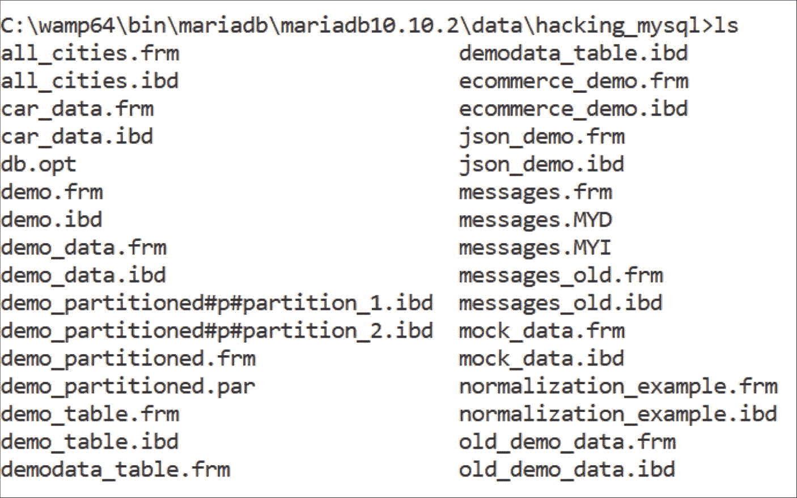

图 12-3
MariaDB 中的数据文件

我们看到两个分区，名为 `partition_1` 和 `partition_2`。这些分区位于运行 `InnoDB` 存储引擎的 `demo_partitioned` 表上——明白了吗？

当然，文件不会说明使用了哪种分区类型，这是一个缺点。分区类型可能决定分区本身的有效性，因此在考虑是否对表进行分区以及如何分区时，明智的做法是追根溯源，首先了解分区允许的选项。

### MySQL 中的分区类型

MySQL 及其衍生版本中允许的分区选项直接取决于您所使用的分区类型。MySQL 及其衍生版本中可用的分区类型包括四种——每种分区类型都有其优缺点，如下所示：

1.  按 `RANGE` 或 `RANGE COLUMNS` 分区：按范围分区是 MariaDB 和 MySQL 中最常用的数据分区方式之一。按范围分区使我们能够为落入给定范围内的数据启动单独的分区，因此按范围分区允许您将值小于 `100` 的行存储在一个分区中，值小于 `50` 的行存储在另一个分区中，并使用另一个分区存储值小于 `25` 的行。按 `RANGE COLUMNS` 分区还允许用户提供一个或多个列的列表，用于定义分区范围。
2.  按 `LIST` 或 `LIST COLUMNS` 分区：此类分区类型接受一个值列表作为分区键。当使用此类分区类型时，数据会根据是否包含在列表中而落入不同的分区。
3.  按 `HASH` 分区：按哈希分区可确保数据在定义的多个分区之间均匀分布。只有数字表达式才能作为分区键。
4.  按 `KEY` 分区：按键分区类似于按哈希分区，但按哈希分区接受用户输入，而按键分区则接受服务器提供的输入（即使用内部哈希函数）。因此，我们只需要定义分区的数量。

除了这些分区类型之外，许多数据库管理系统还支持子分区，MySQL 也不例外。

按 `RANGE` 分区可能是 MySQL 中最常用的数据分区方式之一。这种分区类型相当容易理解。看看这个例子：


### 创建分区表示例

```sql
CREATE TABLE `demo_partitioned` (
`first_name` VARCHAR(30) NOT NULL DEFAULT '',
`last_name` VARCHAR(30) NOT NULL DEFAULT '',
`work_department_id` SMALLINT(20) NOT NULL DEFAULT 0,
`salary` INT(10) NOT NULL DEFAULT 10000
)
PARTITION BY RANGE (work_department_id) (
PARTITION p0 VALUES LESS THAN (5),
PARTITION p1 VALUES LESS THAN (10),
PARTITION p2 VALUES LESS THAN (15),
PARTITION p3 VALUES LESS THAN (20),
PARTITION p4 VALUES LESS THAN (25),
PARTITION p5 VALUES LESS THAN (30)
);
```

### 范围分区

你认为这里发生了什么？我们将 `work_department_id` 列分成了六个独立的分区（`p0` 也是一个分区——我们只是从 0 开始计数）。所有小于 5 的值都存储在名为 `p0` 的分区中，小于 10 的值存储在 `p1` 分区中，依此类推。这种方法默认会使我们的表变大（96kB 而不是 16kB），但也使得数据驻留在六个独立的“子表”中。


**图 12-4**

分区表更大。

在使用分区时，你应该注意的一点是，当对列进行分区时，如果明确定义了复合索引，那么用于分区表达式的列必须是唯一键的一部分。这意味着，如果你在表中包含 `id` 列并尝试以相同方式对表进行分区，可能会遇到如下错误：

```
#1503 – A PRIMARY KEY must include all columns in the table's partitioning function
```

回到范围分区，一切都很直观：值 27 将存储在名为 "p5" 的分区中，值 3 将存储在名为 `p0` 的分区中，等等。如果我们插入一个超出分区范围的值，将会出现错误。可以通过添加一个值为 `MAXVALUE` 的额外分区来解决此类错误——换句话说，就是容纳所有剩余的值：

```sql
PARTITION p6 VALUES LESS THAN MAXVALUE
```

从现在起，任何与分区 0 到 5 中定义的值不匹配的值都将驻留在分区 6 中。如果你使用这种方法，请注意不要在 `MAXVALUE` 分区中放入过多值；这种方法是有益的，但仅在你所有其他分区协同工作时才有益。如果你只有两个分区，而 `MAXVALUE` 分区容纳了总值的 90%，那就说明有问题，你应该重新考虑你的方法。

除此之外，范围分区也可以考虑字符串值——这时，可以使用 `RANGE COLUMNS` 分区代替 `RANGE` 分区，一切看起来会像这样：

```sql
CREATE TABLE `demo_partitioned` (
`first_name` VARCHAR(30) NOT NULL DEFAULT '',
`last_name` VARCHAR(30) NOT NULL DEFAULT '',
`work_department_id` VARCHAR(20) NOT NULL DEFAULT '',
`salary` INT(10) NOT NULL DEFAULT 10000
)
PARTITION BY RANGE COLUMNS (work_department_id) (
PARTITION p0 VALUES LESS THAN ('a'),
PARTITION p1 VALUES LESS THAN ('b'),
PARTITION p2 VALUES LESS THAN ('c'),
...
PARTITION p3 VALUES LESS THAN MAXVALUE
);
```

注意 `work_department_id` 列现在具有 `VARCHAR` 数据类型。

### 列表分区

`LIST` 分区也相当直观：这种分区类型让我们可以根据值来定义分区键。分区表达式必须是列值或基于列值的、返回整数值的表达式。这是一个例子（注意，如果提供整数作为分区键，并且该列有默认值，则默认值也应该是整数）：

```sql
CREATE TABLE `demo_partitioned_list` (
`first_name` VARCHAR(30) NOT NULL DEFAULT '',
`last_name` VARCHAR(30) NOT NULL DEFAULT '',
`work_department_id` INT(20) NOT NULL DEFAULT 0,
`salary` INT(10) NOT NULL DEFAULT 10000
)
PARTITION BY LIST(work_department_id) (
PARTITION p0 VALUES IN (1,3,5,7),
PARTITION p1 VALUES IN (2,4,6,8),
PARTITION p2 VALUES IN (10,12,14,16),
PARTITION p3 VALUES IN (11,13,15,17)
);
```

这样的分区定义会产生四个分区，并且如前所述，与分区中定义的值不匹配的值将被拒绝。

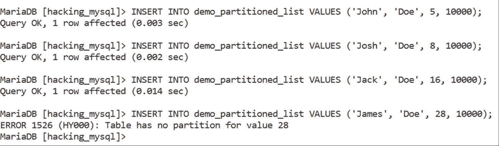

**图 12-5**

给定值没有对应的分区

当然，可以改用 `INSERT IGNORE INTO`，但如果你选择这种方法，不要惊讶某些值会丢失。

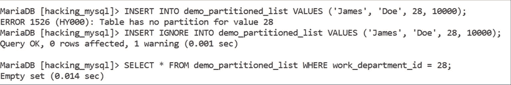

**图 12-6**

分区中没有值

如果 `LIST` 分区不适合你，或者你使用的列的数据类型不是整数，请记住 `LIST COLUMNS` 分区也是可行的。

### 哈希分区

`HASH` 分区也并非不同寻常——这种分区类型使我们能够均匀地拆分表中的值。我们只需定义一个指定适用分区数量的整数，然后 MySQL 会将适用的值均匀地分配到所有分区中：

```sql
CREATE TABLE `demo_partitioned_hash` (
`first_name` VARCHAR(30) NOT NULL DEFAULT '',
`last_name` VARCHAR(30) NOT NULL DEFAULT '',
`work_department_id` INT(20) NOT NULL DEFAULT 0,
`salary` INT(10) NOT NULL DEFAULT 10000
)
PARTITION BY HASH(salary)
PARTITIONS 4;
```

哈希分区免去了你指定存储值的分区的负担——你的数据库会为你决定。

关于哈希分区，Stack Overflow 上有过讨论，称可以通过运行如下查询来确定哈希分区的名称（这里 `[input]` 指定你的输入，`[number]` 是分区数量）：

```sql
SELECT partition_name from information_schema.partitions
where table_name = 'table_name'
and partition_ordinal_position = 1+ ABS(MOD([input], [number]));
```

### 键分区

最后，我们有键分区。按键分区的工作方式与按哈希分区几乎相同，唯一的区别是使用的分区函数。当使用键分区时，该函数将从服务器派生。此外，请记住，当使用键分区时，用作分区表达式一部分的所有列必须构成主键的一部分或全部，并且我们还必须指定所需的分区数量。键分区如下所示：

```sql
CREATE TABLE `demo_partitioned_key` (
`id` INT(20) NOT NULL AUTO_INCREMENT PRIMARY KEY,
`first_name` VARCHAR(30) NOT NULL DEFAULT '',
`last_name` VARCHAR(30) NOT NULL DEFAULT '',
`work_department_id` INT(20) NOT NULL DEFAULT 0,
`salary` INT(10) NOT NULL DEFAULT 10000
)
PARTITION BY KEY(id)
PARTITIONS 2;
```

### 分区的好处与数据修剪

无论使用何种分区类型，你的数据库都会使用分区函数来确定将数据放入哪个分区。分区的主要好处之一是它可以帮助你的数据库将大型数据集拆分为更小的块，以便你的应用程序更轻松地“吸收”或使用。此外，请记住，某些分区类型会限制你可以使用的数据类型。

除了帮助更快地访问数据外，分区还可用于数据修剪。

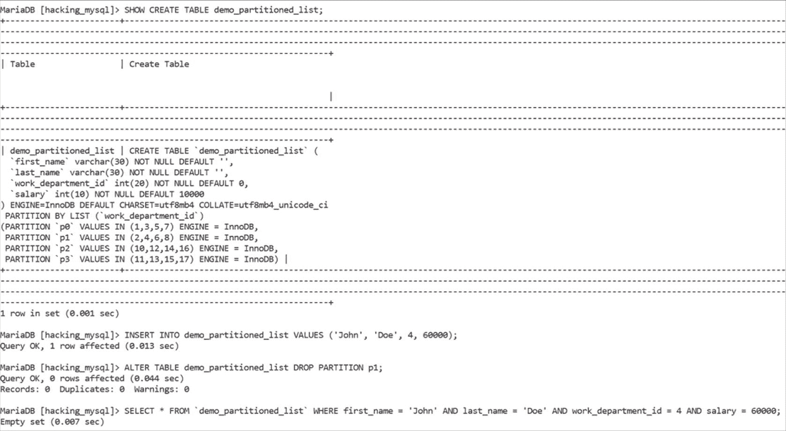

**图 12-7**

修剪分区中的数据

如果你的表已分区，并且你发现自己处于知道结果将在一个或多个分区中，并且知道某些分区是不必要的场景，那么移除分区将有助于回收磁盘上的一些空间。

查询优化器也可以执行分区修剪，当查询使用任何等号（`=`、`<`、`>`、`<=`、`>=` 或 `<>`）或 `IN` 子句时，优化器将仅扫描包含该值的分区中的数据。如果你使用这种方法进行分区修剪，数据本身不会从分区中删除——它们只是不会被搜索。

### 分区技巧：子分区、限制、NULL 值等


#### MySQL 分区：关键概念与操作

当谈及分区时，MySQL 及其同类产品确实有一个特殊之处：在这个领域需要记住的首要规则是，作为数据库管理系统，`MySQL treats` `NULL` `values as being less significant than other values`。这并不意味着`NULL`值不会被存储在分区中——它们确实会被存储——但 MySQL 中某些类型的分区处理`NULL`值的方式与其他类型有所不同。

##### 不同分区类型对 NULL 值的处理
如果使用`RANGE`分区，请记住，任何用于确定分区的`NULL`值都将被插入到最低的分区中。`LIST`分区如果其列表中包含`NULL`值，则允许插入`NULL`值。对于按`HASH`或`KEY`分区的表，如果插入的值产生`NULL`，则该值被视为零（0）。

##### 理解子分区
子分区是另一个你应该牢记的相当有趣的概念——如果我们对分区进行再分区，那就是子分区。子分区的定义是明确的，通常看起来像这样：

```sql
CREATE TABLE `demo_subpartitioned` (
`first_name` VARCHAR(30) NOT NULL DEFAULT '',
`last_name` VARCHAR(30) NOT NULL DEFAULT '',
`join_date` DATE NOT NULL,
`salary` INT(10) NOT NULL DEFAULT 10000
)
PARTITION BY RANGE(YEAR(join_date))
SUBPARTITION BY HASH(salary)
(
PARTITION p0 VALUES LESS THAN (60000),
PARTITION p1 VALUES LESS THAN (80000),
PARTITION p2 VALUES LESS THAN MAXVALUE
);
```

在这个例子中，我们按范围对`join_date`进行分区，然后为`salary`添加子分区。在定义任何分区（包括子分区）时，我们需要遵守所有分区规则（见下文）。

##### 定义分区的关键规则
在定义分区时，请记住几条关键规则：

1.  截至 MySQL 8.4，只有`InnoDB`和`NDB`存储引擎支持分区。MariaDB 增加了更多存储引擎——它们是`MERGE`、`SPIDER`和`CONNECT`。

2.  分区是你表内的表，但 SQL 层仍将“粘合一切”，不会按分区显示单独的表。可以通过运行`SHOW CREATE TABLE`或`SHOW TABLE STATUS`查询来观察分区。

3.  分区有几种类型——按范围分区允许我们为落在给定范围内的数据定义单独的分区，按范围列分区允许用户提供 MySQL 应按范围分区的列列表，按列表分区接受值列表作为分区键，按哈希分区确保数据在多个分区中均匀分布，按键分区将内部哈希函数作为分区键。

4.  分区有其限制（见上文）。

5.  分区不仅对补充搜索操作有用——它们可以被“修剪”，从而释放磁盘空间并清除分区内的数据。

6.  如果使用`VALUES LESS THAN`，则必须以严格递增的方式定义值。

7.  分区可以与索引一起使用，反之亦然。如果一个表同时使用分区和索引，其大小将比通常大得多，但同时，你的数据库在读取数据时会更容易。

8.  `MAXVALUE`意味着“其他分区中未定义的所有内容”。

##### 索引与分区的结合
明智的做法是稍作停顿，关注一下索引——分区是数据的划分，但仍被数据库视为一个完整的数据集。因此，*被分区的列也可以被索引*——同时使用分区和索引可以将你的查询性能提升到难以想象的水平。为了理解这个概念，考虑一个有 10 亿行的表：举例来说，我们假设该表中的所有行平均分布在 10 个分区中：这已经是 10 亿行表中有 1 亿行被分离出来（记住——你的数据库将分区视为表）。索引将通过排序数据并知道在搜索时访问数据的哪个子集来进一步最大化`SELECT`查询的效率。换句话说，没有索引或分区，你的数据库将不得不读取 100%的数据，仅使用分区，这个比例会下降到 10%甚至更少（取决于指定了多少个分区），而索引将帮助对这 10%的数据进行排序，以便你的数据库在搜索特定行时访问更少的数据。

##### 分区与表的相互转换
另一个需要注意的点是，MariaDB 允许你将分区转换为表，反之亦然。如果我们使用像`CONVERT PARTITION ... TO TABLE ...`这样的查询，我们的分区将被转换为表；如果我们使用像`CONVERT TABLE ... TO [partition definition]`这样的查询，我们的表将被转换为分区。此功能在 MariaDB 10.7 及更高版本中可用。参见下文示例。

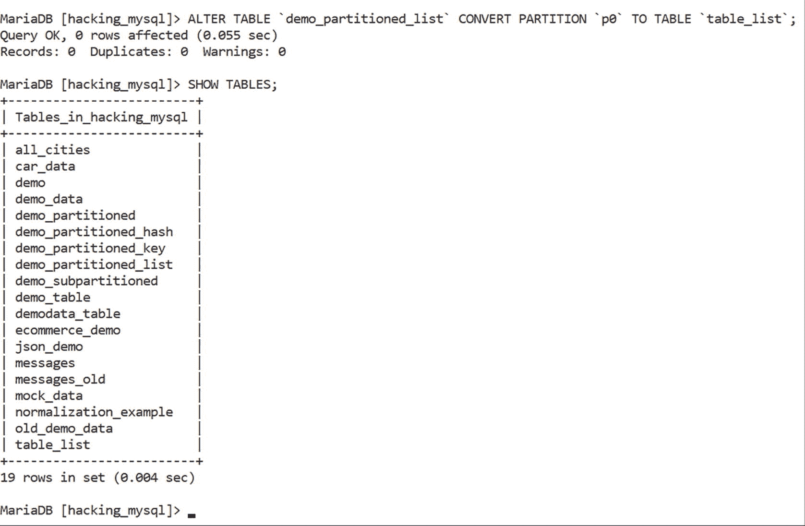

图 12-8 将分区转换为表

将表转换为分区也是同样的道理。

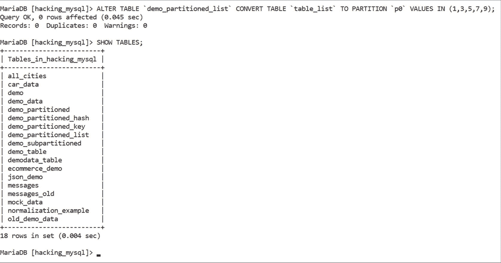

图 12-9 将表转换为分区

##### 分区的维护操作
请记住，分区像表一样，也可以通过查询进行分析、检查、修复或优化，如下所示：

```sql
ALTER TABLE [table_name] ANALYZE|CHECK|REPAIR|OPTIMIZE PARTITION [partition names];
```

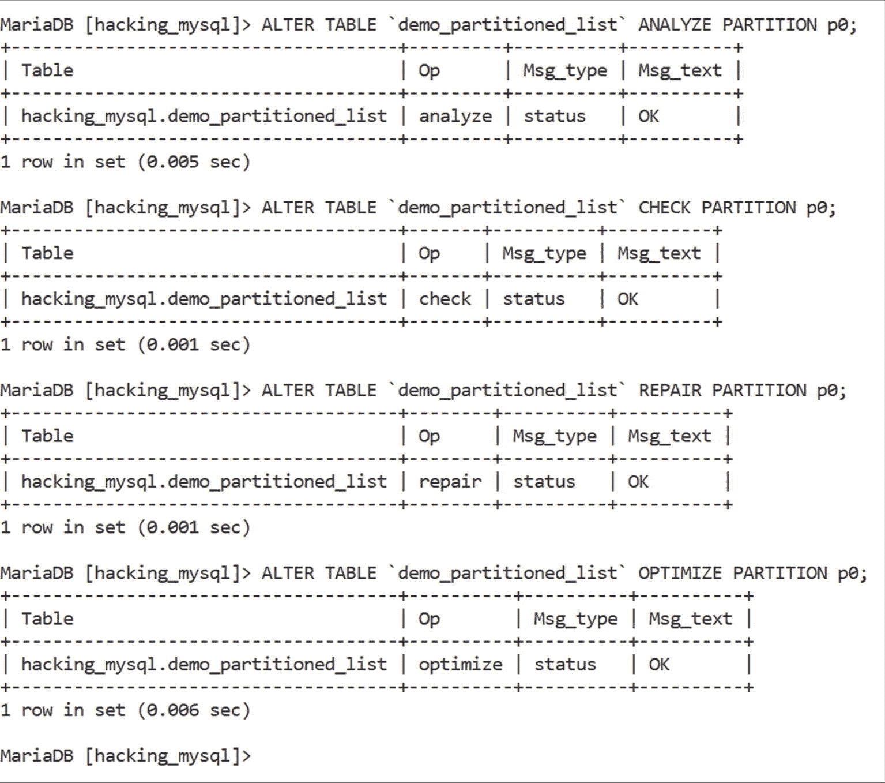

图 12-10 分析、检查、修复和优化分区

##### 分区的重组
分区可以被重组——一个分区可以被拆分成多个分区，与现有分区合并，或重命名。哦，你也可以改变它们的内部结构（即它们覆盖的值）。

分区可以像这样拆分：

```sql
ALTER TABLE `table_name` REORGANIZE PARTITION `p1` INTO (
PARTITION `reorg_p1` VALUES LESS THAN (2000),
PARTITION `reorg_p2` VALUES LESS THAN (3000)
);
```

像这样合并：

```sql
ALTER TABLE `table_name` REORGANIZE PARTITION `p0`,`p1` INTO (
PARTITION p2 VALUES LESS THAN (3000)
);
```

以及像这样重命名：

```sql
ALTER TABLE `table_name` REORGANIZE PARTITION `p0` INTO (
PARTITION `p0_renamed` VALUES LESS THAN (1000)
);
```

最后，你还可以减少列中的分区数量。为此，请使用`COALESCE PARTITION`语句（此语句适用于所有分区作为一个整体，而非任何单个分区）：

```sql
ALTER TABLE `demo_table` COALESCE PARTITION 2;
```

##### 分区的限制
在你涉足分区领域之后，请记住分区有其独特的一些限制：

1.  不能使用存储过程、函数或用户定义变量作为分区表达式。
2.  除`NDB`外的所有存储引擎最多支持 8192 个分区。对于`NDB`，数量取决于所使用的`NDBCluster`版本。
3.  分区表达式不允许使用运算符`|`、`&`、`^`、`<<`、`>>`或`~`。
4.  `InnoDB`上的分区表不支持外键。
5.  `ALTER TABLE ORDER BY`——如果我们在分区列上运行像`ALTER TABLE ORDER BY`这样的语句，我们应该注意，只有分区列内的值才会被排序。
6.  无法在分区表上添加`FULLTEXT`索引。
7.  不能使用`ENUM`数据类型来表示分区键。
8.  分区键不能是子查询。
9.  不能分区日志表。


10. 如果定义了子分区，则必须通过 `HASH` 或 `KEY` 进行分区。
11. 从 MySQL 8.4 开始，MySQL 为每个分区使用 130kB 的内存进行缓冲，以提升 `LOAD DATA INFILE` 语句的性能。

尽管存在这些限制，分区对许多人来说仍然是一个非常有用的助手——通过一个经过良好优化的数据库、查询结构和明智的索引决策，分区将帮助你在读取数据时克服性能负担。

但在选择分区之前，请权衡你已做出的所有其他决策——检查数据库结构、数据类型和字符集、可能存在于表中任何列上的索引以及其他因素：分区只能作为辅助工具，而非替代工具。如果你使用的是不同风味的 MySQL（例如 MariaDB 或 Percona Server），也要格外注意服务器中可用的存储引擎：因为分区直接依赖于你所使用的存储引擎，而且由于不同风味的 MySQL 配备了不同的存储引擎，这些引擎也将允许你对分区执行许多有趣的操作。MariaDB 的用户会了解 `MERGE`、`SPIDER` 和 `CONNECT`：在这个领域中，`SPIDER` 允许你通过将同一表的分区移动到不同的服务器上来进行数据分片，而 `CONNECT` 则使你能够构建分区使用不同存储引擎的表，即使这些引擎本身可能不支持分区。

以下是一个使用 `CONNECT` 存储引擎在 MariaDB 中支持分区的示例：
```sql
CREATE TABLE `demo_table` (
`id` INT(5),
`account_name` VARCHAR(20) NOT NULL DEFAULT '',
`assigned_supportagent` VARCHAR(20) NOT NULL DEFAULT '',
key(`account_name`)
) ENGINE = SPIDER COMMENT = 'wrapper "mysql", table "demo_table"'
PARTITION BY RANGE COLUMNS(`account_name`)
(
PARTITION `p1` VALUES LESS THAN ('L') COMMENT = 'Values stored in server Mercury',
PARTITION `p2` VALUES LESS THAN (MAXVALUE) COMMENT = 'Values stored in server Venus'
);
```
在这种情况下，所有小于 K（K 在 L 之前）的值都将存储在名为 Mercury 的服务器中，其余的值将存储在名为 Venus 的服务器中。很有趣！不过，我们还有更多要学习的内容。

### 总结

分区是一种将数据库中的表拆分成若干不同表的方法——在底层，你的数据库会将分区视为一堆不同的表，但由于 SQL 层仍会将分区视为一个表，因此你永远无法在任何 SQL 客户端或 phpMyAdmin 中将你的分区视为单独的表。不过，你会得到诸如 `SHOW TABLES` 或 `SHOW CREATE TABLE` 等语句的帮助：第一条语句将显示特定表上是否设置了分区，第二条语句将为你提供一个查询，让你能够重建一个带分区的表。

然而，分区只是蛋糕的一部分，不应随意进行分区——只有在你拥有足够多的数据（比如 1 亿行或更多）来证明其必要性时再进行分区，并且首先确保你对分区内部机制非常熟悉。

无论你做什么，请记住分区只是与你的表相关的一个环节，而这些表位于包含数据的数据库之后。为避免问题，该数据库需要得到妥善且频繁的备份，而要制定一个合适的备份计划，你也需要为恢复做好规划。来杯咖啡——是时候备份了。

## 13. 优化备份与恢复

你确实在备份，对吧？说真的——备份和恢复流程的存在是有原因的，这个原因与让你作为开发人员或 DBA 的生活变得更困难或更复杂无关。每个开发人员都知道为什么应该备份他们最宝贵的资产——数据——但并非每个人都付诸行动。

并非每个人都备份数据——这就是当今网络的现实。当然，也许对你来说，没有必要每天都备份数据——但这并不是完全忘记备份的理由，不是吗？

在这个瞬息万变的世界里，备份是必需品；备份的存在是为了保护你组织的数据免受硬件故障、人为错误甚至自然灾害的影响。许多人忘记了备份——有些人则忽视了它们。无论你未备份数据的原因是什么，备份都是必需的，如果备份尚未成为你的 DBA 的例行工作，它应该成为其中之一。

谈到数据库，许多 DBMS 提供了多种不同的数据库备份和恢复方法。MySQL 和 MariaDB 也不例外，但在深入探讨当你进入 MariaDB 备份和恢复领域时可能涉及的内容之前，首先，我们必须了解人们为何、何时以及如何备份像 MySQL 这样的数据库。

### 为何、何时以及如何备份 MariaDB？

备份数据是为了在未来灾难来袭时能够恢复数据。备份的方式因应用程序和你的具体用例而异，正如有多种方式可能搞砸并丢失你数据库中的所有数据一样，也有多种方式可以备份 MySQL 或其任何同类产品中的数据。本书侧重于 MariaDB，因此这里展示的选项对于使用 Percona Server、MySQL，甚至是未来将发布的较新版本 MariaDB 的用户来说可能会有所不同。

至于为何你应该备份 MariaDB 中的数据，一切都很明显——频繁地备份和测试你的数据库备份将帮助你避免灾难发生时可能出现的麻烦。如果你尚未这样做，请将备份纳入你作为开发人员的日常工作——你可能不需要每天都完成备份，因此请制定一个你和你的数据库都认为可接受的备份频率计划，并据此执行。将备份加入你的开发流程，你永远不会后悔这个决定。

如果你还没有备份，现在就备份你的数据。然后，制定一个可行的备份间隔，它不会影响你的工作流程，并能在持有你资产的硬件崩溃时减少你的麻烦。

接着，要备份 MariaDB 中的数据，我首先建议你从宏观角度审视备份，并决定几件事。考虑回答以下问题：

*   `你正在备份什么样的数据？` 换句话说，为你的应用程序提供支持的数据库背后有什么样的用例？你正在采取哪种备份？
*   `你需要备份多少数据，为什么？` 备份更大的数据集将需要你采取不同的操作。
*   `你以前备份过吗？是什么类型的备份？` 你进行过逻辑备份吗？物理备份？两者都有？频率如何？
*   `你的备份过程是手动的还是自动的？` 为什么？
*   `你需要多久备份一次数据？` 换句话说，你的应用程序需要什么样的备份频率，为什么？
*   `你将数据备份到什么介质上？` 你是将数据备份到云服务、单独的 VPS、网络附加存储设备，也许是外部硬盘驱动器，甚至是 U 盘上？
*   `你遵循备份最佳实践吗？` 这里，我指的是像“万无一失的备份”这样的事情，它要求将数据备份存储在各种不同的位置，以便无论导致你最初丢失数据的事件规模如何，你都能在必要时访问数据进行恢复。

回答这些问题以获取关于各种不同事情的了解。这些事情可能包括但不限于以下内容：

1.  你将必须进行逻辑备份还是物理备份，以及在恢复它们时你有哪些选择。
2.  你将知道如何更好地备份你的数据。


3.  你将了解过去积累的经验能否帮助你改善数据库当前的状态。
4.  你会清楚在备份数据库内部数据时可以使用哪些**多种多样的备份脚本**。
5.  最后，你将知道特定设备大致能存储备份的数量，以及需要多久轮换一次备份（即，保留/删除多少份备份等）。

总而言之，理解这些内容将为你在备份数据时指明需要考虑的方向。例如，如果你的备份是**逻辑备份**，那么你需要研究能帮助你备份用于重建数据的 SQL 语句的工具。另一方面，如果你的备份是**物理备份**，你就会明白无论做什么，你都需要复制数据库内的文件，因此你将被迫只关注那些能进行数据物理复制的工具——复制文件，而不是复制存储在文件内的、用于重建数据的 SQL 语句。

从那时起，设备选择的大门将为你敞开——你现在会知道应该使用哪些设备来以你期望的方式备份数据。选择以逻辑方式备份数据的用户可能会使用像 `mariadb-dump` 这样的工具，而进行物理备份的用户则可能使用 Windows 或 Linux 内置的简单命令。

请注意，物理备份恢复起来可能稍微困难一些，因为在 MariaDB 中，这类备份只能恢复在运行相同数据库管理系统以及相同（或基本未变）版本 MariaDB 的**类似硬件**上。这是因为物理备份所备份的数据会随着时间推移而发生变化。因此，物理备份的恢复通常灵活性较低，尽管这种备份可能同时具有更快、资源消耗更少的特点。

如果你知道你将数据备份到空间有限的云端（比如 5GB），你就有依据来假设你的特定云账户能存储备份的数量。换句话说，**细致了解**你的用例也有助于你假设应该以怎样的频率备份数据。事实证明，一切比看起来要简单得多，对吧？

当谈到实际备份数据时，你备份数据的方式再次直接与你需要进行的备份种类相关——物理备份要求你备份来自数据库的文件；逻辑备份则要求你备份用于重建数据的语句。人们可以使用“手动”方式，借助喜欢的 SQL 客户端的导出功能等工具来获取逻辑类型的备份，而物理备份则需要更多的知识。

### 备份类型与工具

当谈到 MySQL 中可用的备份类型时，你可以选择多种数据备份策略。MySQL 的备份类型分为多个类别：有些人根据数据备份的方式（如果我们备份 SQL 语句，我们的备份就是逻辑备份；如果我们备份文件，我们的备份就是物理备份）来分类。有些人则根据备份是热备份还是冷备份（热备份在系统**在线**时备份数据，冷备份在系统**停机**后备份数据），或者根据它们是在线还是离线完成来分类。备份也可以是完全备份、增量备份、差异备份或基于快照的备份。备份还可以被压缩。

备份的特性如此之多，对吧？我们将深入探讨它们，但首先，是备份类型。我将通过使用一个表格来厘清一切：

| 备份内容是什么？ | 进行备份时的数据库状态 | 完全、增量还是差异备份？ |
| --- | --- | --- |
| 如果备份的是 SQL 查询，我们就是在进行 `逻辑备份`。如果数据库内部的文件被“触及”并备份，我们就是在进行 `物理备份`。 | 当备份在数据库 `在线` 时进行，将被视为热备份。当备份在数据库 `离线` 时进行，将被视为冷备份。 | `完全备份` 备份数据库中的所有内容（所有数据）。`差异备份` 备份自上次完全备份以来发生变化的数据。`增量备份` 仅备份自上次完全备份或增量备份以来发生变化的数据。 |

所以，如你所见，备份在几个方面有所不同。它们的不同在于：

*   我们备份的数据——我们可以备份用于重建数据的 SQL 语句，或者备份数据本身。
*   我们备份数据时数据库的状态——数据库可以在线或离线。
*   我们进行的实际备份类型——数据库备份可以是完全备份、差异备份或增量备份。

回到备份类型，完全备份指的是在一次备份操作中备份与你用例相关的所有数据的过程。这种类型的备份被称为“完全备份”，因为它创建了组织所控制数据资产的完整副本。在数据库领域，完全备份通常指备份所有数据库中的所有表，但不包括系统使用/创建的数据库。

要对存储在 MariaDB 中的数据进行完全备份，首先要决定是进行物理备份还是逻辑备份。然后，遵循相应的步骤。

要对存储在 MariaDB 内部的数据进行逻辑备份，可以考虑使用 `mysqldump` 的等效工具——`mariadb-dump`。`mariadb-dump` 对 MariaDB 中现有的数据进行逻辑备份，在撰写本书时，它是备份运行中等规模数据集的 MariaDB 数据库实例的最佳方法之一。直到 MariaDB 11.0.1 之前，`mysqldump` 都是 `mariadb-dump` 的一个符号链接——现在已不再是这种情况了。要使用 `mariadb-dump` 进行备份，首先通过 `CLI` 导航到 MariaDB 的 bin 目录，然后调用 `mariadb-dump` 以查看可用选项。熟悉可用选项后，再调用 `mariadb-dump` 并添加适合你备份的选项，像这样调用：

```
mariadb-dump [OPTIONS]
```

与 `mariadb-dump` 相关的选项众多，一旦调用该工具，屏幕上就会显示这些选项。

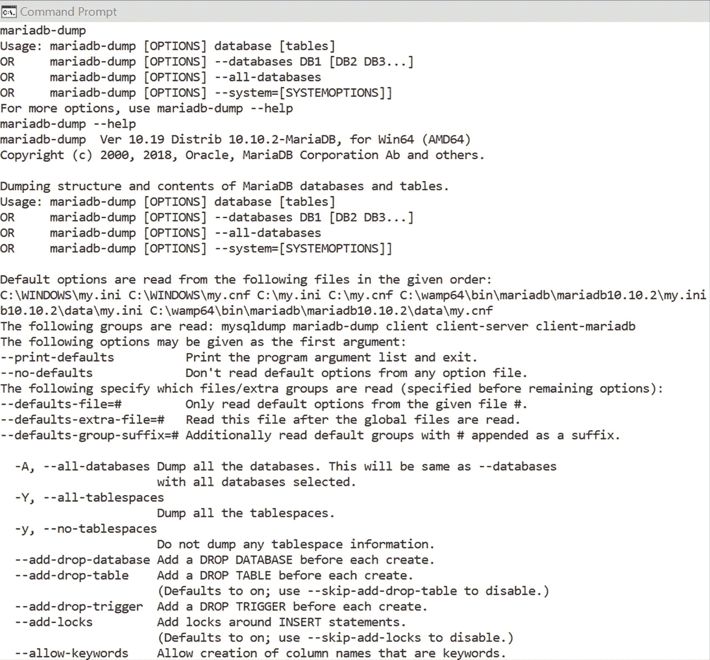

图 13-1: mariadb-dump 中可用的选项

一些最常用且可供你使用的选项包括但不限于（两个值意味着你可以任选其一，多个值有解释）：


#### MariaDB 备份工具详解

### 备份选项

| **选项** | **用途或含义** |
| --- | --- |
| `-A` `--all-databases` | 当需要备份所有数据库中的全部数据时，使用这些选项。 |
| `-B` `--databases` | 这些选项仅转储指定的数据库。使用这些选项时，MariaDB 会将第一个标题参数视为数据库名称。数据库名称应以空格分隔（参见下面的示例）。 |
| `--add-drop-database` `--add-drop-table` `--add-drop-trigger` `--add-locks` | 根据所使用的选项，在重新创建每个数据库前添加`DROP DATABASE`选项，在创建表前添加`DROP TABLE`选项，在创建触发器前添加`DROP TRIGGER`选项，或在运行`INSERT`查询前添加一些锁定语句。 |
| `--lock-all-tables` `-x` | 在备份运行期间，锁定所有数据库中的所有表。 |
| `--lock-tables` `-l` | 当转储数据库时，备份其内部数据之前将锁定表。 |
| `--no-autocommit` | `INSERT`语句前将添加`SET autocommit=0`选项，并且在所有数据插入表后，将开始执行`COMMIT`。 |
| `--no-data` `-d` | 将备份表，但不包含与其相关的任何内部信息（内容）。 |
| `--order-by-size` | 备份操作按大小排序：最小的表优先，最大的表最后。 |
| `--order-by-primary` | 如果表上存在主键，则按主键排序表行。如果不存在主键，则按第一个唯一索引排序行。 |

### 使用示例

下面展示了几个`mariadb-dump`的使用示例。

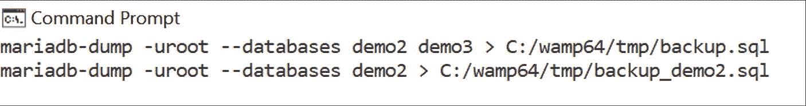

图 13-2

使用`mariadb-dump`备份数据库

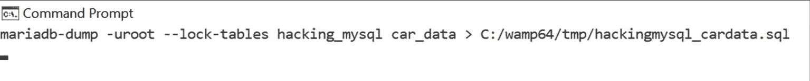

图 13-3

备份`hacking_mysql`数据库中`car_data`表内的数据。在表转储之前，添加了`LOCK TABLE`语句。

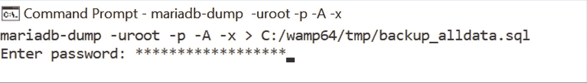

图 13-4

在锁定所有数据库中的所有表的同时，备份所有数据库中的所有数据

要使用`mariadb-dump`进行部分备份，只需备份部分表或数据库。对于增量备份，需要设计一种方法来识别数据库或其内部表的更改，然后备份自上次备份以来更改的数据和新创建的数据。

然而，无论`mariadb-dump`看起来多么强大，都需要注意该工具仅执行逻辑备份。如果希望进行物理备份，则需要使用不同级别的工具：其中之一是`Mariabackup`，可用于对 InnoDB、MyRocks、Aria 或 MyISAM 表背后的数据执行物理备份。该工具可以执行完全、增量或部分备份，也可以恢复数据。根据 MariaDB 的说法，`Mariabackup`应被视为 Percona XtraBackup 的替代品，因为 MariaDB 不提供对 XtraBackup 的官方支持，并且在可预见的未来也没有计划提供支持——[该问题已知](https://perconadev.atlassian.net/browse/PXB-1550)，但 Percona XtraBackup 在 MariaDB 中仍不受支持，这就是 MariaDB 建议用户使用`Mariabackup`的原因。

`Mariabackup`可以使用与 Percona XtraBackup 类似的选项，如下所示：

```
mariabackup [--backup|--prepare] [--copy-back|--move-back] [options]
```

要使用`mariabackup`备份数据，请使用`--target-dir`选项指定备份应存储的目录，并指定可以执行备份的用户和密码，如下所示：

```
mariabackup --backup --target-dir=/tmp/backups/ --user=hackingmysql --password=verystrongpassword
```

由于`mariabackup`的工作方式与 Percona XtraBackup 类似，使用`mariabackup`获取的备份在恢复之前需要准备好，因为数据文件需要保持一致：为此，使用`--prepare`选项运行查询——别忘了指定备份所在的目录：

```
mariabackup --prepare --target-dir=/tmp/backups/
```

其他可用选项如`--copy-back`或`--move-back`将指定是否将备份文件复制或移动回数据库服务器的`datadir`目录——如果出于任何原因想保留数据副本，请使用`--copy-back`。否则，请使用`--move-back`。您将在恢复备份时使用它们：

```
mariabackup --copy-back --target-dir=/tmp/mariadb/backup/
```

### 增量备份

要使用`mariabackup`进行增量备份，请使用`--target-dir`和`--incremental-basedir`选项进行完整备份：

```
mariabackup --backup --target-dir=/tmp/mariadb/incremental1 --incremental-basedir=/tmp/mariadb/backup/ --user=root --password=verystrongpassword
```

这些命令将创建存储数据增量更改的文件，从而允许您将备份恢复为增量备份。

要恢复增量备份，需要再次准备备份（参见上面的示例），然后使用`--incremental-dir`选项将增量更改应用到完整备份：

```
mariabackup --prepare --target-dir=/tmp/mariadb/backup --incremental-dir=/tmp/mariadb/incremental1
```

只有在将所有增量备份应用到基础备份后，您才能使用`--move-back`或`--copy-back`选项以及像往常一样使用`--target-dir`选项来恢复备份：

```
mariabackup --copy-back --target-dir=/tmp/mariadb/backup/
```

除了了解备份类型外，在需要备份海量数据、压缩和保护备份，当然还有在问题发生时恢复所有备份的情况下，您也会遇到这些情况。

### 备份压缩与安全

正如可以进行备份一样，备份也可以被压缩。备份压缩使开发人员和数据库管理员在存储备份时能够节省磁盘空间，并且恢复压缩备份通常会减少磁盘 I/O，因此这在各方面都是双赢的。

安全性也是如此——备份可以在进行时加密，并在恢复时解密。加密和解密通过 OpenSSL 完成，而压缩和解压通常通过`gzip`或 7Zip 完成。我将从压缩开始，然后介绍安全性，最后将两者结合起来。

问题是——MariaDB 中的备份压缩并不复杂，如果您过去使用过 MySQL 或 Percona Server，也不需要重新学习。对于大多数人来说，MariaDB 备份的压缩和解压缩将使用`gzip`实现，加密将使用`openssl`实现——在压缩和加密备份时，大多数人也会使用`mariabackup`，因此在这方面也不需要重新发明轮子。

使用`mariabackup`在备份时压缩文件的基本用例需要`gzip`功能，如下所示（一如既往，请将`username`替换为适用的用户名）：

```
mariabackup --user=[username] --backup --stream=xbstream | gzip > [backupnamehere].gz
```

这里`--user`选项指定了执行备份的用户，`--backup`选项指定我们正在执行备份，`--stream`选项指定`xbstream`作为并行复制和压缩备份的选项，最后，`gzip`选项指定我们希望使用 GZip 压缩备份。

您也可以使用 7Zip 代替来压缩备份——这里应用了非常相似的逻辑：

```
mariabackup --user=[username] --backup --stream=xbstream | 7z a --si [backupnamehere].xb.7z
```

要解压缩使用`gzip`获取的备份，我们将使用`gunzip`，如下所示：

```
gunzip -c [backupnamehere].gz | mbstream -x
```

要解压缩使用 7Zip 获取的备份：

```
7z e [backupnamehere].xb.7z -so | mbstream -x
```

不是很复杂，对吧？如果您愿意，还可以使用其他方法来压缩备份，但 GZip 和 7Zip 应该能为您提供一个足够好的起点。


#### 备份压缩与加密

谈到加密，一切也很简单：许多使用 GZip 的人会选择用 OpenSSL 加密他们的备份。操作方式看起来与上一个示例几乎一模一样，只是加入了 OpenSSL 和 AES-256 的相关选项——别忘了在 `-k` 参数后指定你用来加密备份的密码（`.enc` 扩展名表明备份是加密过的）：

```
mariabackup --user=[username] --backup --stream=xbstream | gzip | openssl enc –aes-256-cbc –k [encryptionpw] > [backupnamehere].gz.enc
```

要解密同一个备份，请使用带 `-d`（解密）选项的 GZip，如下所示，并确保在 `-in` 参数后将备份文件指定为输入：

```
openssl enc -d -aes-256-cbc -k [encryptionpw] -in [backupnamehere].gz.enc |gzip -d| mbstream –x
```

要加密使用 7Zip 创建的备份，请在调用 `7z` 后通过命令行界面（CLI）添加 `-p` 选项，并指定加密备份所需的密码——7Zip 应该内置了 AES-256 加密模式。

要压缩和保护逻辑备份，你也可以使用 `mariadb-dump` 或 `mysqldump`，并将其输出通过管道传输到 GZip 或 7Zip 等压缩工具。`mysqldump` 的用户应该已经熟悉这种选项：

```
mysqldump -u[username] [databasename] | gzip > backup.sql.gz
```

`mariadb-dump` 的操作方式完全相同，只是注意它不支持 7Zip 选项，因此如果你在压缩逻辑备份，就只能使用 `gzip/gunzip`。

备份压缩和安全并非高不可攀的学问，只要付出一些努力并掌握相关知识，你的备份就能占用更少的磁盘空间，同时也能以加密方式存储。很酷，对吧？

### 备份大数据集

要备份更大的数据集（假设“大数据”指任何达到一亿行量级的数据），你又需要回归基础，理解一个道理：备份如果附带的开销尽可能小，速度就会快，而且你无论如何都得等待备份完成（毕竟，你正在复制更大的数据集，不是吗？）。

适用于 `mariabackup` 和 `mariadb-dump` 等工具的建议依然有效：*所有内容依然适用*，但在备份更大的数据集时，请记住细节决定成败。对于那些使用 `mariadb-dump` 备份大数据集的人，我建议：

1.  在调用 `mariadb-dump` 时，通过选项指定你需要备份哪种数据库和/或其中的哪些表，以避免备份所有内容。
2.  调整 `--max-allowed-packet` 选项，以设置应发送/接收的最大数据包长度（最大值为 1GB）。
3.  使用 `--no-autocommit` 选项包裹 `INSERT` 语句，为批量插入操作关闭自动提交。
4.  在必要时研究 `--add-drop-database` 或 `--add-drop-table` 选项。这不是一个提升性能的选项，但这样你就不必手动删除数据库/表，备份会为你重建它们。
5.  逐行备份数据，而不是在备份前缓冲数据，以节省内存（你确实有很多数据，对吧？）——为此，请使用 `--opt` 或 `--quick`。
6.  避免在 `INSERT` 语句中使用 `-c` 或 `--complete-insert` 选项，以跳过指定列名——如果你的表中有很多列，并且你的用例需要逻辑备份，跳过列名应该能显著减小备份文件的大小。
7.  如有必要，使用 `--default-character-set` 设置默认字符集。MariaDB 设置的默认字符集是 `utf8mb4`，但如果你需要存储其他语言的字符而调整字符集，`--default-character-set` 就是解决之道。或者，使用 `set-charset` 选项将 `SET NAMES default_character_set` 添加到备份中。
8.  如果表上有索引，可以尝试使用 `-K` 或 `--disable-keys` 选项。此选项将在所有行插入后，再为表添加必要的键（索引）。
9.  利用 `--fields-terminated-by` 或 `--fields-escaped-by` 选项。使用它们，备份中的字段将由你选择的字符串进行分隔或转义。
10. 研究一下 `-f` 或 `--force` 选项。这个选项可以让备份即使遇到错误也继续运行——对于各种用例都非常有用！

再次强调——这并非什么革命性的创新，只是一些你可以使用的默认选项。我不保证你的备份会瞬间完成——它们几乎肯定不会——但好事多磨，对吧？

然而，如果你不想/不需要使用 `mariabackup` 或 `mariadb-dump`，你还有另一个我已经多次提到的选项——你可以使用 `SELECT ... FROM ... INTO OUTFILE` / `LOAD DATA INFILE`——类似这样的命令会起作用：

```
SELECT * FROM 'table_name' INTO OUTFILE '/tmp/table_backup.txt' FIELDS TERMINATED BY '|' [other options...];
```

这种方法的问题在于，如果你有很多表（你几乎肯定有），一直手动运行相同的查询就变得不可行了。为了至少自动化部分工作，你可以利用内置的计划任务，像这样：

```
CREATE EVENT event_daily ON SCHEDULE EVERY 1 DAY
STARTS CURRENT_DATE [+ INTERVAL X DAY + INTERVAL Y MINUTE]
DO
此处放置查询...
```

这样的事件将从你指定的日期开始每天运行（例如，如果你指定 `INTERVAL 1 DAY + INTERVAL 1 MINUTE`，事件将在明天 00:01 开始），并且会运行 `DO` 规范之后的任何查询，这意味着如果你提供像 `UPDATE 'customers' SET 'days_retained' = 'days_retained' + 1` 这样的查询，它就会更新 `customer` 表的 `days_retained` 列，并将客户的留存期增加 1 天。使用 `SELECT * INTO OUTFILE` 进行备份也是同样的道理——像这样指定一个事件：

```
CREATE EVENT event_daily ON SCHEDULE EVERY 1 DAY
STARTS CURRENT_DATE + INTERVAL 1 DAY
DO
SELECT * FROM `your_table` INTO OUTFILE '/tmp/your_table_backup.txt' FIELDS TERMINATED BY '|';
```

然后，MariaDB 将每天为你提供一个名为 `your_table_backup.txt` 的备份文件，其中包含 `your_table` 中的所有内容，字段以 `|` 字符分隔。当然，这种方法的问题是，你将需要创建另一个脚本，每天将文件从 `/tmp/` 目录移动到其他地方，因为同名的两个文件无法共存，但以这种方式备份也是可行的。如果你懒得为将文件移出 `/tmp/` 目录编写脚本/解决方案，你可以给文件取一个与当前日期相关的名字，但这准备起来会稍微复杂一些。尽管如此，当我们使用这样的查询时，它仍然是可能的：

```
SET @backup_prepare = CONCAT("SELECT * FROM `your_table` INTO OUTFILE 'C:/wamp64/tmp/backups/", DATE_FORMAT(NOW(), '%d%m%Y'), ".csv'");
PREPARE x FROM @backup_prepare;
EXECUTE x;
DROP PREPARE x;
```

完成之后，我们的备份文件将位于 tmp 目录内的 backups 目录中。

并非每个人都会使用 `SELECT ... INTO OUTFILE`，它也不是适合所有用例，但由于这个语句允许我们备份原始数据，对于处理大数据集的人来说，它是一个非常好的选择。


### 恢复 MariaDB

在备份数据时，你已经考虑到了为最坏的情况做准备。为最坏情况做准备是必要的，因为最坏的情况有时会以数据损坏、磁盘故障、断电、托管事故等形式降临：一旦发生，你就需要知道如何恢复已备份的数据。

备份数据而不测试如何在另一台服务器上恢复它，几乎没什么用：只有在数据成功恢复后，你才能安心确认备份没有白做。

要使用 `mariadb-dump` 恢复逻辑备份，请如下调用 `mariadb-dump`，其中 `backup.sql` 是你的备份文件名：

```
mariadb-dump -u[username] [database_name] < backup.sql
```

如果需要，请提供密码（如果你未在 `my.ini` 或 `my.cnf` 中定义密码，系统应会提示你输入），然后你的备份就会被恢复到你刚刚指定的数据库中。通常无需指定字符集或排序规则——备份时已考虑了这些设置，恢复时应会自动应用这些设置。

请注意，你也可以通过直接查看备份文件（打开它）并复制必要的 `CREATE TABLE` 和 `INSERT INTO ...` 语句来恢复逻辑备份的 `部分内容`。完全没必要恢复整个文件，虽然这种方法可能不适合所有人，但恢复部分数据是完全可行的。

回到恢复操作，要恢复压缩的备份（大多数会有 `.gz` —— GZip 扩展名），可以使用类似 `gunzip` 的工具——将 `database_name` 替换为你的数据库名：

```
gunzip < backup.sql.gz | mysql -uroot [-ppassword] database_name
```

对于物理备份，按我之前展示的那样，使用 `--prepare` 选项进行准备：

```
mariabackup --prepare --target-dir=/tmp/backup/
```

然后，停止 MariaDB，清空数据目录或确保其为空，并使用 `--copy-back` 或 `--move-back` 选项运行 `mariabackup`：

```
mariabackup --copy-back --target-dir=/tmp/backup/
```

就是这样——这里同样不需要高深的数学知识（但你必须确保备份文件位于 `target-dir` 中——别忘了这一点）。

#### 恢复大数据

恢复较大的数据集时，采用相同的实践。当然，你等待备份恢复的时间会更长，但如果备份最初是以有助于数据库的方式创建的，它至少应包含 `mariadb-dump` 中一些有助于尽快恢复的选项（参见“备份大数据集”标题下的选项）。

如果你是通过运行 `SELECT ... INTO OUTFILE ...` 来备份 MariaDB 实例中的数据（即，你的备份由原始数据组成），则可以通过运行类似以下的查询来恢复（你可能需要根据你的实际情况，替换文件名、表名以及字段终止符）：

```
LOAD DATA INFILE '/tmp/backup_file.csv' INTO TABLE `table_name` FIELDS TERMINATED BY ',';
```

就是这样——如果你的数据库经过优化，以这种方式恢复数百万甚至数十亿行数据也不应是一项非常困难的任务。

### 备份与恢复的陷阱

了解了如何备份和恢复你最宝贵的数据之后，你还应该意识到备份和恢复过程中的陷阱。

从基础开始——从高层次检查你最近一次的备份。你注意到了什么？一个大小为 X MB|GB|TB 的文件。没错——所有备份都有一定的体积。你的数据集越大，体积就越大。这是什么类型的文件？你执行了完全逻辑备份？部分逻辑备份？原始数据备份？备份中的所有数据是否都必要，还是可以只备份必要数据以节省磁盘空间？`这个备份能恢复吗？`

最大的备份与恢复陷阱之一与数据恢复相关——你会惊讶于人们经常备份，却不尝试恢复他们的资产！现在想象一下，当你急需恢复数据时却无法做到。这可不是什么好情景，对吧？务必测试你所作的备份——数据越多，这条建议就越适用。

其次，确保将至少部分备份任务自动化——我已经提供了一个如何优化和自动化数十亿行数据备份的例子，如果你能自动化数十亿行数据的备份，又有什么理由认为自己无法自动化更小的备份任务呢？说真的——利用事件来自动化备份任务，或者必要时研究一下 cronjobs。

在测试备份是否可恢复时，也要考虑存储备份的位置：你的备份是使用云存储，还是使用另一台服务器上的硬盘/SSD？如果是后者，或许明智的做法是将数据迁移到云端，以避免与另一台服务器相关的成本？如果这不是一个选项，或许可以考虑以“滚动方式”存储备份，例如只保留不超过 1 个月的备份？想想这能节省多少空间！

此外，充分利用热备份——它们的存在有其道理，为用户提供了一种绝佳的备份数据方式，同时不会妨碍数据库管理系统内的任何操作：仅仅因为 MariaDB 不支持 XtraBackup，并不意味着 `mariadb-dump` 无用！时至今日，在许多情况下，`mariadb-dump` 仍然是你数据库中不可或缺的组成部分。

如果你使用存储过程、触发器或函数来支持数据操作，请记住这些是与数据分开存储的，因此也需要单独备份。这里无需重新发明轮子（`--routines` 标志应该就足够了），但在备份时也要照顾到这些。

也别忘了配置文件——如果你在另一台服务器上恢复数据，你很可能也需要一份相同的配置来驱动那台数据库服务器。在这种情况下，没有备份配置文件自然会给你和你的数据库带来麻烦。

最后，考虑存储备份的位置——如果有必要将备份存储在另一台服务器上，请将其存放在公众无法访问的地方（例如，在 `public_html` 目录之下）。

#### 大数据的陷阱

同样的情况也适用于大数据集——大数据集的备份不也是备份嘛，对吧？

根据实践经验，我可以告诉你，较大数据集备份/恢复的许多陷阱往往与以下方面有关：

1.  使用配置不当的数据库备份/恢复逻辑备份，然后抱怨备份恢复时间相当慢
2.  使用 `LOAD DATA INFILE` 恢复原始备份时未遵循最佳实践
3.  索引和/或分区

是的——就是这三件基本的事情！从头说起，如果你对较大的数据集进行了逻辑备份，你必须知道自己在做什么。我希望你的数据库是优化的，并且索引是在数据插入表之后添加的，因为否则，你就是在自找麻烦。

对于较大的数据集，批量 `INSERT` 操作总是会比较慢（是的，即使你的数据库已经优化到了极致），除非你已经用 `LOAD DATA INFILE` 替换了这些操作，否则你将需要准备好应对对数据库的冲击。信息仍然会被写入，只是速度不如使用 `LOAD DATA INFILE` 那么快。


为确保逻辑备份尽可能快速完成，请推迟自动提交操作（记住——`autocommit=0`应置于`INSERT`操作之前，`COMMIT`放在末尾）；如果表中存在主键，请考虑在插入数据前添加主键，因为若主键预先存在，MySQL（以及 MariaDB）会在每次`INSERT`操作时检查`PRIMARY KEY`的完整性。索引亦是同理。同样地，如果表中存在多种类型的索引，首先问问自己是否真的需要多种索引——你确定要把 B-树索引和`FULLTEXT`索引强行组合在一起吗？这些索引辅助何种使用场景？如果确实需要，又该进行何种全文搜索操作？

`LOAD DATA INFILE`也有其影响，你可以通过 StackOverflow 搜索“`LOAD DATA INFILE` slow”来熟悉这些影响。让我与你探讨其中一个案例，你将迅速明白我的意图——我将提问者称为 A，回答者称为 B。问题如下：

1.  A 在 StackOverflow 发帖称，他正使用`LOAD DATA INFILE`将一个约 100GB 大小的文件加载到他某个数据库的表中。
2.  A 继续说道：“<…>我现在正在尝试使用 InnoDB <…>加载开始时速度很快，大约 10MB/秒 <…>在插入几 GB 数据后，速度降至 2-3MB/秒的范围 <…>”。
3.  A 还表示他的 InnoDB 缓冲池大小约为 8GB，并且在运行`LOAD DATA INFILE`之前执行了几个查询——这些查询如下：

    ```
    SET @@session.sql_log_bin=0;
    SET autocommit=0;
    SET unique_checks=0;
    SET foreign_key_checks=0;
    ALTER TABLE 'tbl_name' DISABLE KEYS;
    ```
4.  A 还说，他感觉 InnoDB 不支持将超过几 GB 的大型数据集加载到表中。

这里的问题相当清楚——`LOAD DATA INFILE`启动很快，但即使设置了那些据称能帮助数据库的选项，一段时间后速度仍会下降。为什么？让我们来看看 B 给出的被采纳的回答。其中指出：

1.  `DISABLE KEYS`对 InnoDB 无效，因为该语句会关闭 MyISAM 上二级索引的更新，但由于 InnoDB 的系统表空间包含处理二级索引的结构，InnoDB 处理索引的方式与 MyISAM 不同，因此该选项没有必要。
2.  将`autocommit`设置为关闭会将数据堆积在`ibdata1`中，因此用户 A 应考虑保持其开启状态。
3.  用户 B 指出，InnoDB 特有的 MVCC 和 ACID 特性在插入大型数据集时往往会使该存储引擎成为瓶颈，而将`ROW_FORMAT`设置为`Fixed`值可以进一步加快 MyISAM 表上的`INSERT`查询速度，但代价是表会变得显著更大，更难处理。
4.  其他用户插话支持用户 B 的说法，称 MyISAM 作为存储引擎很简单，但在这种情况下，用户 A 的需求也很简单，因此一切应该没问题。如果用户遇到更多问题，他可能需要将文件拆分成单独的部分。如果用户运行的是高性能服务器，他还应考虑根据需要为 MyISAM 和 InnoDB 优化服务器，但要做到这一点，他需要修改两种机制。

这些建议大部分没问题，但其中一些现在已经过时了——首先，如果你的用例不需要`COUNT(*)`查询，切勿在生产环境中使用 MyISAM。正如我在存储引擎章节中已经告诉过你的，随着 MySQL 的发展，最初在 MyISAM 存储引擎中可用的大多数功能已经过时，现在已在 InnoDB 中可用。当使用`LOAD DATA INFILE`时，你可以将`autocommit`功能保持为默认设置，但关于`DISABLE KEYS`的建议仍然有效。对你们大多数人来说，事情不会那么复杂，你不需要过度思考——只需优化你的数据库，并在恢复大型数据集时利用采用优化参数的`LOAD DATA INFILE`（本章通篇都可以找到`LOAD DATA INFILE`的使用示例）。确保索引和任何适用的键也在数据插入后加载到数据库中，这样应该就没问题了。

### 摘要

备份数据是必要的——这一点毫无疑问。然而，正如数据需要备份一样，它也需要正确地恢复，我衷心希望本章的建议能帮助你完善数据备份和恢复流程，以满足你的必要目标。

无论你选择如何备份或恢复数据，请始终牢记，备份有一个朋友——他的名字是复制。数据库副本不是备份，也不是备份的替代品，而是一种确保一个数据库服务器上发生的事情能快速复制到另一个服务器上的方法。现在让我们来探讨它们。

## 14. 优化复制

与备份一样，复制也是全球许多数据库管理员关注的重点。正确构建的复制架构可提高数据可用性，因此它也是数据库架构以及灾难恢复的基本策略。然而，尽管复制看似基础，但应考虑这种机制的优缺点。

### 理解复制

从高层次来看，数据库管理系统中的复制很容易理解：复制有助于将数据复制到另一台服务器（可以不止一台），并保持这些服务器之间的数据同步，从而帮助提高数据库的可用性和可靠性。在 MySQL 领域，复制有几种形式：我们可以有同步、半同步或异步复制，以及基于语句、基于行或混合模式的复制。MariaDB 仅支持异步和半同步复制，并附带 Galera 集群机制。

同步复制确保在提交更改之前，更改已被接收并应用；而异步复制则在收到事务时立即提交，而不等待副本服务器的回复。半同步复制旨在通过确保一个或多个副本服务器已确认数据更改来提供两者之间的折衷方案。当谈到 MySQL 和 MariaDB 中可用的复制格式时，有基于语句的复制（在另一台服务器上复制`INSERT`、`UPDATE`和`DELETE`语句）和基于行的复制（复制对行的更改，因此得名）。据说基于行的复制更精确；与基于语句的复制相比，它提供了更好的兼容性，并且是 MySQL 和 MariaDB 中的默认复制模式。混合模式复制则集两者之长，服务器根据特定场景选择最佳的数据复制方式。

你们中有些人无疑对复制及其一些优势很熟悉，但尽管如此，我觉得有必要向你们介绍一些围绕复制的术语：


### 术语与背景

| 术语 | 含义 |
| --- | --- |
| Master 或 Master Server | 作为主要数据源的数据库服务器。 |
| Slave 或 Slave Server | 作为 Master Server 只读副本的数据库服务器。 |
| Source 或 Source Server | 与 Master Server 相同。 |
| Secondary, Secondary Server, Replica 或 Replica Server | 与 Slave Server 相同。 |

我敢打赌，你听说过上述大部分（或至少部分）术语，因为你们中的许多人会熟悉复制技术能提供什么。然而，你可能没有意识到的是，复制术语在过去几年中发生了一些变化：虽然许多 DBA 可能知道主-主和主-从拓扑，但你也应该知道，在 2020 年，MySQL 已经承认了诸如“master”和“slave”等初始术语的负面含义，并宣布团队正朝着实施众多术语更改的方向迈进，这些更改应该很快就会被引入 MySQL：团队还表示，他们正在考虑用“blocklist”替换“blacklist”一词，用“allowlist”替换“whitelist”一词。

这些词的引用不会在单个版本中全部删除，因为这根本不可能做到——根据 MySQL 团队的说法，新语法将成为推荐的语法，而不是替代方案。

### 配置与实施复制

抛开语法问题不谈，要使复制发挥其作用，必须选择要实施的复制类型，然后根据需要进行配置。要配置和实施复制，你首先需要拥有两台或多台安装、配置并运行了 MySQL 的服务器。

一旦你确认 MySQL 已在两台服务器上安装、配置并运行，就可以开始配置复制了。在此示例中，我们将配置主从复制，之后我会介绍可能的复制类型。话虽如此，在 MySQL 中配置复制的基本步骤如下（请注意，Windows 架构上二进制日志的位置可能不同，可以在 `C:\ProgramData\MySQL\MySQL Server *.*` 或 my.ini 中配置的其他位置找到）：

1. 备份 MySQL 或 MariaDB 中的现有数据，备份 my.ini 或 my.cnf 文件，然后停止 MySQL（MariaDB）。

2. 打开 my.ini 或 my.cnf，取消注释 `log_bin` 和 `server_id` 选项。`server_id` 将使你的数据库能够在复制设置中区分多个服务器，而 `log_bin` 变量允许 MySQL 读取二进制日志，这是复制所必需的（目录可能不同）。另外，你可能需要通过 `binlog_do_db` 参数后指定数据库名称来包含你希望复制的数据库：

    ```ini
    [mysqld]
    log_bin = /var/log/mysql/mysql-bin.log
    server_id = 1
    binlog_do_db = testdb
    ```

3. 确保从（Slave）服务器上有一个拥有足够权限处理复制的用户，可以通过创建用户或如所示授予权限——请记住，我们使用 `mysql_native_password` 而不是 `caching_sha2_password`，因为我们可能没有服务器之间的加密连接，并且 `FLUSH PRIVILEGES` 可以保存我们的权限：

    ```sql
    CREATE USER '[username]'@'[slaveserver_ip]' IDENTIFIED WITH mysql_native_password BY '[password]';
    GRANT REPLICATION SLAVE ON *.* TO '[username]'@'[slaveserver_ip]';
    FLUSH PRIVILEGES;
    ```

4. 由于复制从日志文件中读取更改，我们需要检索其位置。为此，锁定数据库，以便位置在数据被修改时不会“移动”，可以通过运行类似 `FLUSH TABLES WITH READ LOCK` 的查询来实现。

5. 然后，通过发出 `SHOW MASTER STATUS` 查询来获取二进制日志文件的状态信息。查询的输出应提供 bin 文件的名称，格式如 `mysql-bin.000002` 或类似，位置（例如，“761”或类似），以及其他参数，例如在 `Binlog_Do_DB` 列中复制了什么数据库，或在 `Binlog_Ignore_DB` 列中忽略了什么数据库，以及其他信息。请记住显示的 bin 文件名称和位置，如果可能，将其复制并粘贴到另一个位置——你稍后会需要它。

6. 我们假设这是一个全新的主从配置，并且主服务器上还没有任何数据——因此，我们可以通过运行 `UNLOCK TABLES` 来解锁数据库。

7. 回到从服务器，打开 my.ini 或 my.cnf，将 `server-id` 变量的值更改为 2（数字不能冲突），然后将其他适用的变量设置为与主服务器相同的值（例如，`log_bin` 变量应设置为 `SHOW MASTER STATUS` 查询中的 bin 文件值——在本例中是 `mysql-bin.000002`，`binlog_do_db` 变量应设置为主服务器上 `Binlog_Do_DB` 变量的值，等等）。

8. 仍在修改 my.ini 或 my.cnf 时，将 `relay-log` 变量调整为从服务器内部日志文件的位置。如果你使用的是 Linux 架构，该值很可能是类似 `/var/log/mysql/mysql-relay-bin.log` 的值。

9. 保存更改并重新启动 MySQL 或 MariaDB。

10. 指示从服务器二进制日志文件的位置及其内容。这是一个包含源自 `SHOW MASTER STATUS` 查询值的单一查询——`SOURCE_USER` 和 `SOURCE_PASSWORD` 是你为复制创建的用户的用户名和密码值：

    ```sql
    CHANGE REPLICATION SOURCE TO
    SOURCE_HOST='ip_of_master_server',
    SOURCE_USER='replication_user',
    SOURCE_PASSWORD='replication_user_password',
    SOURCE_LOG_FILE='mysql-bin.000002',
    SOURCE_LOG_POS=761;
    ```

现在你可以开始复制过程了！在从服务器上运行 `START REPLICA`，你应该就可以开始了。可以通过运行 `SHOW REPLICA STATUS` 来检查副本服务器的状态——当运行此类查询时，MariaDB 将返回副本服务器的状态（例如，“Waiting for master to send event”，而 `Source_host` 和 `Source_user` 将是主服务器的 IP 和用户名。

如果你的主服务器有想要迁移的数据，可以使用 `scp` 将数据备份“上传”到从服务器（这里，`backup.sql` 是你的备份名称，`slave_user` 和 `slave_ip` 分别是用户从服务器的用户名和 IP）。我将备份移动到 `/tmp/` 目录，以便简化即将进行的数据导入过程：

```bash
scp backup.sql slave_user@slave_ip:/tmp/
```

完成后，返回从服务器，创建一个数据库，并从 `/tmp/` 目录导入备份。其余步骤不变。

### 复制类型

如前所述，MariaDB 和 MySQL 中的复制有几种类型：MySQL 支持 `同步`、`半同步` 和 `异步` 复制，而 MariaDB 支持 `异步` 和 `半同步` 复制选项，并提供对 `Galera Cluster` 的支持。


#### MariaDB 复制技术概述

我已经向您介绍了同步、异步和半同步复制的奥秘。就 Galera Cluster 而言，在 MariaDB 上，它只支持 `InnoDB` 存储引擎，尽管开发团队正在实验性地支持 `MyISAM` 和 `Aria`。Galera Cluster 的缺点在于，该集群组件主要仅在 Linux 架构上可用，但它也有一些独特的优势，包括为用户提供**近乎同步**的复制，这意味着虽然复制是同步完成的，但数据库节点的写入和提交是异步或独立进行的。Galera Cluster 用户可以将读写操作定向到任何数据库节点；它基于认证的复制，失败的数据库节点会自动从数据库集群中移除，且不会对操作造成任何中断。

考虑到 Galera Cluster 节点具有高可用性和可扩展性，它具有确保没有复制延迟的功能，并且根据上述定义的特性不会丢失任何事务，这就很容易理解为什么 Galera Cluster 成为许多开发人员和数据库管理员的首选解决方案。

然而，MariaDB 中默认的复制类型是异步主从复制（主-副本复制）。它也支持主-主复制以及所谓的多主复制。

MariaDB 中可用的“默认”复制类型也是 MySQL 用户最早可用的复制选项，它只需要你拥有一个主服务器和一个或多个副本（从属）服务器。在这种复制设置中，读写操作将分布在多个数据库服务器上，因此可以平衡数据库的负载。上面提供的设置复制的示例就是一个很好的主-副本数据库复制设置示例。

另一种流行的数据库复制类型是主-主复制设置。这种类型的复制要求你至少有两台服务器充当“主服务器”（即接受读写查询）。每个主服务器可以运行多个副本服务器，同时利用异步复制能力。

如果你有多个主服务器，你就必须使用 Galera Cluster，并享有上述所有特性。

如果辨别 MariaDB 中每种复制类型的特性、优点和缺点似乎有点复杂；我也将所有内容整理到了下面的表格中：

| 数据库复制类型 | 解释与特性 |
| --- | --- |
| 主从复制 | MariaDB 中的默认复制模式。当我们拥有一台主服务器和多台副本服务器时，就会使用这种复制设置。 |
| 主主复制 | 一种至少有两台服务器充当主服务器的复制设置。每个主服务器可以拥有多个节点（从服务器）。 |
| 多主复制 | 一种有多个数据库节点（服务器）充当主服务器的复制设置。任何 MariaDB 服务器都可用于读写数据。在 MariaDB 中，此设置与 Galera Cluster 相同。 |

无论你选择使用哪种类型的复制，请记住，所有类型的复制在复制之前都会读取写入二进制日志的事件。因此，二进制日志是至关重要的部分，因为它记录了 MariaDB 数据库中内容的修改。换句话说，二进制日志记录了其他服务器需要执行的数据变更，并使数据与主服务器保持一致。二进制日志驻留在 MariaDB 的 `datadir` 中。

在数据库世界中，复制领域也有一些其独有的概念：有“复制延迟”（延迟复制）的概念，有服务器具有全局事务 ID（`GTID`）的概念，有服务器读取包含对数据库所做所有更改记录的二进制日志的概念，等等——它们也很重要，因为在处理复制时，不可避免地会遇到它们。

复制延迟很容易理解——顾名思义，这个术语指的是在设置任何类型的复制时，服务器与其他服务器不同步。“延迟”指的是服务器返回的状态与“当前”状态（可查看/使用的状态）之间的差异。当事情“不够快”时，就会发生复制延迟，例如，当副本接收或应用数据变更的速度不够快时，或者当主服务器无法足够快地向副本发送数据变更时，等等。

可以通过最小化源数据库上的事务持续时间（使用我们讨论过的查询优化技巧——它们都适用）、最小化网络延迟或确保我们的磁盘 I/O 操作足够强大来减少复制延迟。

当涉及到 `GTID` 时，它们指的是全局事务标识符，并且在整个复制拓扑中是唯一的。`GTID` 在事务写入二进制日志时“出现”，每个事务都会被分配一个自动递增的 ID。自然地，这也意味着未写入二进制日志的事务不会收到 `GTID`。一旦一个带有 `GTID` 的事务在服务器上提交，就不会再执行具有相同 `GTID` 的其他事务。对有些人来说，全局事务标识符类似于哈希值，每个 `GTID` 的表示形式如下：`hash-like source_id:transaction_id`，它将由一个服务器标识符（很可能是 `server_uuid`）和一个数字事务 ID 组成。事务 ID #1337 表示它是服务器上提交的第 1337 个事务：

```
7B17FA77-84FD-44D7-9B11-N65FF2978613:1337
```

### 复制注意事项与技巧

尽管复制功能强大，但事先有几件事你应该注意，以免淹没在它的能力之中！

复制提供的远不止几个自动递增的 `GTID`；复制要求在主服务器上启用二进制日志，而这样做时，每个副本服务器都会给主服务器增加一些负载。从高层次来看，复制的工作原理如下：

1.  主服务器读取其二进制日志并注意到数据的更改。
2.  从（副本）服务器将二进制日志事件复制到其中继日志。
3.  从（副本）服务器重放中继日志中的事件，从而更新其数据。

二进制日志通知副本数据的更改，然后这些更改被读入中继日志——中继日志中的事件被重放，数据得到更新。二进制日志文件和中继日志文件通常以相同的方式格式化，在 MariaDB 中，可以通过运行类似 `SHOW RELAYLOG EVENTS` 的查询来检查中继日志事件——在这种情况下，空的结果集将表明复制尚未设置。

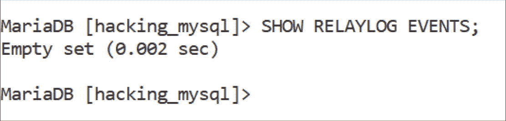

图 14-1
MariaDB 中的 SHOW RELAYLOG EVENTS

一旦复制设置完成，它总是涉及多个数据库服务器和必须配置为连接并从主服务器读取的账户（请参阅下面标题中的说明）。所有这一切意味着，从高层次来看，复制看起来是这样的。

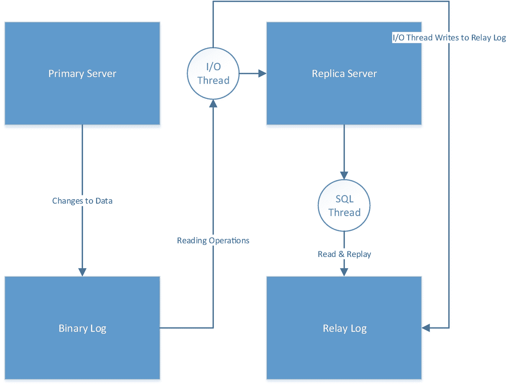

图 14-2
关系数据库管理系统中的复制


因此，复制技术并不复杂——它也不是备份的替代品。确实，复制会将数据复制到另一台服务器，这与备份操作非常相似，但任何形式的复制与备份之间的核心区别在于：一旦主服务器上的数据更新，副本服务器上的数据也会随之更新。

### 保护复制安全

当你了解了复制的内部机制后，不可避免地会考虑到所复制数据的安全性。为了确保对业务至关重要的资产——数据——的安全，必须事先采取安全和隐私保护措施，并根据复制的特性来采取行动。

为确保数据传输安全，请确保在主服务器上启用了 SSL/TLS，更好的做法是在主服务器和副本服务器上都启用。启用 TLS 并不困难，可以通过 `my.ini`（Linux 系统中为 `my.cnf`）配置，或通过执行 `status` 等简单 SQL 查询的输出来查看。

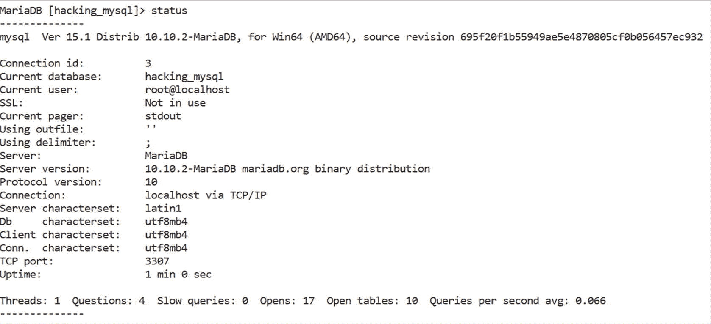

图 14-3：MariaDB 中 `status` 命令的输出

注意 SSL 部分——如果使用了 SSL，你会看到不同的输出，例如 `Cipher in use is DHE-RSA-AES256-SHA` 或类似信息。

你也可以通过配置文件确认服务器是否使用了 SSL：打开配置文件，如果在 `[mariadb]` 标签下看到 `ssl_cert`、`ssl_key` 和 `ssl_ca` 等 TLS 系统变量定义，那就没问题了。

`status` 命令的输出也很有用，因为它提供了数据库、连接和客户端的字符集、运行时间，以及可用于连接 MariaDB 的 TCP 端口（对于使用 MariaDB 支持 WordPress、vBulletin、IPBoard 或 MyBB 等内容管理系统的用户来说，端口信息可能很有用）。

无论如何，如果你的服务器使用了 SSL，可能需要通过执行 `CHANGE MASTER` 查询来告诉 MariaDB 在复制设置中使用 TLS——为此，可以查看 `MASTER_SSL`、`MASTER_SSL_CA`、`MASTER_SSL_CAPATH`、`MASTER_SSL_CERT`、`MASTER_SSL_KEY`、`MASTER_SSL_VERIFY_SERVER_CERT` 以及其他可在 `CHANGE MASTER` 查询中使用的 TLS 相关选项。

设置好这些选项，应该就可以正常工作了——真的就这么简单。

当然，如果适用，你还需要遵守 HIPAA 和 GDPR 等隐私标准，但我会在本书最后一部分介绍安全时，为你揭示其中的奥秘。

### 总结

复制是一头难以驯服的野兽——它形态各异，本质上是一种有助于确保数据可用性的过程。复制有几种类型，可以复制行或 SQL 语句，与所有数据库相关的事物一样，复制也有其独特的问题，但无论如何，它是一种完美的机制，可以确保数据“存在于”另一台服务器上，而无需手动干预。

然而，复制并非数据库唯一的朋友——安全也至关重要。听说过最近的数据泄露事件吗？是的——它们很可怕。十多年前的泄露事件也并不“更好”，影响数千万甚至上亿人，在这样的环境中，如果你不想看到公司名字出现在下一次重大数据泄露的新闻中，妥善保护数据库就至关重要。

## 15. 安全优化

现在，你已经对存储引擎、导致 MariaDB 实例及其中查询出错的因素、如何理解服务器并优化服务器、如何优化特定存储引擎、模式、数据类型、排序规则和查询本身、如何为更大数据集优化 MariaDB，以及索引、分区、备份和复制等有了一定了解，那么是时候学习如何为安全优化你的数据库管理系统了，不是吗？


安全至关重要——这正是你们中的一些人拿起这本书的首要原因，不是吗？也许你甚至曾遭遇数据泄露，并因此被推荐本书，以了解如何处理围绕你的 MySQL 或 MariaDB 实例的安全问题？

### 理解 MariaDB 中的安全

我首先陈述一个显而易见的事实——总体而言，保护 MariaDB 和 MySQL 的安全性远没有你想象的那么难。诚然，你需要了解一些与 MariaDB 相关的具体细节，但总的来说，安全相关问题可以分为几个类别：

1.  通用安全准则
2.  访问控制
3.  用户安全
4.  安全相关组件和插件
5.  企业级安全控制

看看这个——这么多类别，对吧？我同意，MariaDB 安全领域中的类别可能看起来不多，但仔细想想，每一个 MariaDB 安全问题都根源于这些类别中的一个或多个。随着你继续阅读，你应该能够很快明白，这确实是事实。

让我们从一般性地审视你的数据库开始——从安全角度出发，你需要检查的第一件事是数据库存储的数据类别。这可以通过更仔细地审视你的用例来完成——假设你使用 MariaDB 托管一个用户相互交互的论坛（CMS），你的数据库将包含多个表，其中：

*   一些表包含日志数据。
*   一些表包含附件及其相关数据（类型、谁附加了什么等）。
*   一些表包含封禁过滤器。
*   一些表包含与反垃圾邮件操作相关的数据（例如验证码等）。
*   一些表包含与论坛事件相关的数据。
*   一些表包含用户组数据（即普通用户、版主、管理员、VIP 用户或捐赠者、其他用户组等的数据）。
*   一些表包含用户本身的详细信息（用户等级、用户名、电子邮件地址、违规详情、发送/接收的消息、加盐哈希的密码、管理备注等）。
*   一些表包含与 CMS 安装相关的详细信息，以及安装是否被锁定等（安装完成后，许多内容管理系统会锁定其目录以防外部访问）。
*   一些表包含与 CMS 文档相关的详细信息。
*   一些表可能包含论坛上创建的投票数据，以及哪些用户在何时对哪些投票进行了投票等。
*   一些表可能包含与用户声誉相关的数据（例如，100% 的声誉可能意味着“清白”，而 20% 的声誉则意味着你应该仔细核查该用户的建议，因为有许多用户举报了他）。
*   一些表可能包含与论坛中发送和接收的帖子及消息相关的数据。
*   一些表包含消息和附件的元数据或类似内容。

因此，即使你认为你的论坛与其他论坛相比并不那么受欢迎，论坛中仍然有你需要管理和保护的数据。攻击者仍有东西可偷！

诚然，许多攻击者可能只对你的论坛的 `user` 表及其内部细节感兴趣（被盗数据能为攻击者的业务带来“收益”，因为这些数据通常在暗网上出售，然后被重新用于身份盗窃、凭证填充和其他类型的攻击），但其他类别的数据也不应被忽视——以 2015 年 Experian 数据泄露事件为例，据报道，泄露的数据不仅包括敏感的用户登录信息，还包括用户性别、收入水平、电话号码、地址、信用状况信息、家庭详情以及许多其他敏感数据类别。其他数据泄露事件还可能包括前面提到的论坛内的帖子和主题、多年来来回发送的消息等等。

我想在这里表达的是，你的数据库中包含什么内容取决于你的用例——你首先需要保护数据库内部的一切，但对于 CMS 用例，你还需要格外注意 SSL、所使用的密码哈希函数、密码是否加盐以及存储了何种用户数据。

从你的用户表开始，因为用户数据能为潜在攻击者带来最大价值（如前所述，用户数据可以且经常被出售给其他恶意方，然后用于身份盗窃攻击）——审查所使用的密码哈希函数，你的哈希值是否加盐（当大量哈希值被破解时，盐值可以减慢密码破解速度），并尝试从黑客的角度看待一切——如果 *你* 是攻击者，你会做什么，哪些数据对你有价值？问问任何安全专家，你会很快得到建议：暗网上曾有被盗的用户数据库（即攻击者从更大的数据集中获取并解析后出售的用户表）以数万美元的价格出售：你凭什么认为你的数据库/用例不值得被“研究”？

检查完用户表后，再检查其他存储了潜在恶意方可能感兴趣的表（这些也可能包括消息和元数据——你永远不知道用户在聊什么），然后，你将开始对现有安全措施和可改进之处有一个清晰的图景。

你们每个人看到的状况都会不同——它理应不同，因为没有一个用例是相同的，但这也正是安全如此令人兴奋的原因。对于那些运行内容管理系统的用户来说，安全的起点可能如下所示。

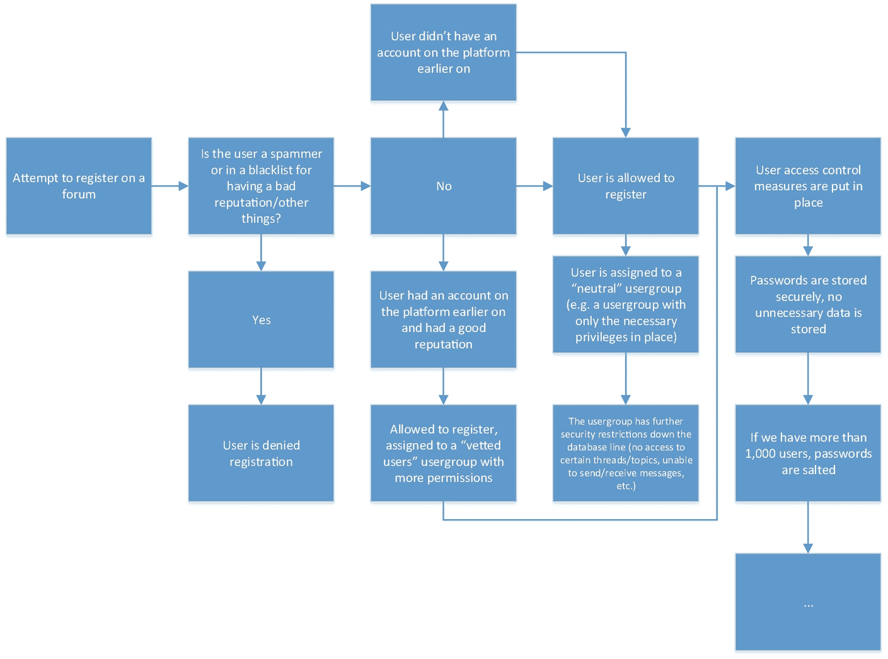

图 15-1

从安全角度看论坛用户注册

是的，有很多事情你需要考虑——所有这些都与上述安全类别有关。

正如你已经可以看出的，这个特定用例与通用安全准则、访问控制和用户安全关系更密切，但 CMS 后端的服务器也可能使用安全相关组件和插件来完成图中描绘的某些操作。因此，安全链的所有组成部分都同样重要，尽管每个部分都可能涉及你的数据库处理不同的事情，但它们协同工作，共同推动你的数据库在安全格局上向前发展：

| 准则 | 涉及内容？ |
| --- | --- |
| 通用安全准则 | 在项目架构、设计和实施阶段仔细评估用例，然后对服务器进行整体安全保护和加固。 |
| 访问控制 | 防止用户访问其不应访问的论坛部分，涉及用户组、警告、声誉及相关事项。 |
| 用户安全 | 使用 `BCrypt` 或 `Blowfish` 等安全机制对密码进行哈希/加盐处理，并在用户注册论坛时及注册后，就如何增强其账户安全提供建议。 |
| 安全相关组件和插件 | 安装和设置与 CMS 协同工作的插件和设备，执行广泛职责，从不允许用户通过论坛上可能的上传表单上传某些类型的文件（.exe、.pdf、.php、具有双扩展名的文件等），到通过电子邮件或短信通知管理员存在未经授权的访问，并在设备检测到数据泄露时锁定整个论坛。 |

然而，无论你的用例是什么，你都将从基础开始保护你的 MariaDB 安装，而一旦你决定 *安装* MariaDB，你就处于这个基础上。

### 在安装时保护 MariaDB


向任何有经验的数据库管理员（DBA）提问“如何在安装后加固 MariaDB 安全？”，你听到的第一个答案通常会涉及到一个名为 `mariadb-secure-installation` 的 Unix 脚本。这个脚本的缺点是它仅适用于 Unix（Linux）架构，你无法在基于 Windows 的服务器上利用其功能（Windows 用户可以手动完成部分步骤以达到类似效果），但这并不减损其有用性。可以通过输入 `mariadb-secure-installation` 而无需任何额外参数来调用该脚本，调用后，它将引导你完成一系列操作，以确保新安装的 MariaDB 实例的安全。该脚本：

1.  允许你更改数据库主用户（即 `root` 用户）的密码。请确保 `root` 用户使用的密码是强密码。
2.  移除 MariaDB 内部的匿名用户。这一步很重要，因为默认情况下，新安装的 MariaDB 会包含一个匿名用户（即允许任何人无需账户即可登录服务器）。任何生产环境都不应存在匿名账户。
3.  为 `root` 用户设置限制，仅允许其从 `localhost` 连接，而不允许从其他位置连接。
4.  移除名为“test”的数据库，该数据库可被任何人访问。顾名思义，该数据库是为测试目的而设置的，应在生产环境中移除。
5.  重新加载权限表（保存通过完成前述步骤所做的所有更改）。

这些步骤将标志着你与 MariaDB 的安全之旅的开始。是的，它们并非革命性的举措，但它们将帮助你在开始构建任何基于 MariaDB 的项目时奠定坚实的基础。如果你在任何 Unix 服务器上运行 MariaDB，请务必运行 `mariadb-secure-installation`，并且在确保 MariaDB 安装安全后，请务必在应用的所有阶段都将安全性放在首位——在构建、设计和实施所有系统时，都要牢记安全。请注意你的应用程序所使用的库和框架，编写代码以减少攻击面，清理用户提供的所有输入，切勿将用户输入直接传递给数据库，使用参数化查询，必要时对输出进行编码，验证输入，加固你的环境，并且如果适用，在你的应用程序、数据库或两者之上添加防火墙。在本书的安全章节，我将指导你了解可以采取的安全措施。

### 通用安全措施

在你的 MariaDB 安装得到加固之后，是时候在构建任何与该数据库管理系统交互的应用程序时遵循通用安全措施了。遵循以下规则：

1.  切勿将用户输入直接传递给数据库，在将用户输入传递给数据库或/及其内部的表之前，始终进行清理。
2.  如果你存储用户数据，只存储必要的数据，并对敏感数据（如密码）进行加密或哈希处理。如果你有更多（约数千）用户，请考虑对数据加盐。
3.  限制用户权限，并基于“必须知晓”原则进行构建：如果对“这个用户必须知道这个信息吗？”这个问题的回答以“不”开头，就不要向他们展示这些信息，并限制他们的访问权限。记住——访问敏感数据的人越少，数据被盗的概率就越低。
4.  设计上安全的系统，并在适用/可能时对其进行加固——“安全性内嵌于设计”意味着安全性从系统诞生之初就集成其中，而不是后来“添加”在上面的东西。
5.  为性能而编码，但要牢记安全。浏览最新版的 `OWASP` 十大安全风险，并尽可能在每个角落将这些原则应用到你的应用程序中。妥善处理错误，并谨慎对待向最终用户暴露可能敏感的数据。
6.  利用威胁建模——在完成软件中某个特定功能的开发后，检查你的代码是否存在安全漏洞，更好的是，请一位具有安全意识的朋友帮你审查代码。也许他会注意到一个你曾忽略的漏洞？

遵循这些安全措施，你必将为你的应用程序和数据库确保一个光明的未来；然而，请记住，这些步骤和措施仅仅是冰山一角。为了确保你的应用程序、数据库及其中的数据安全，请确保你指导你的开发人员/员工/用户在其特定场景下受益的安全措施，并通过阅读网络安全新闻来保持对该领域最新动态的了解，以掌握行业内发生的任何事情。

随着时间的推移，关于增强你的应用程序和/或数据库安全的建议可能会发生变化，但基本原则可能保持不变。与行业保持联系，参加会议、研讨会和讲座，阅读博客、书籍和白皮书，你将在数据库安全领域获得一个良好的开端。

### 总结

为安全而优化 MariaDB 看似一项艰巨的任务；然而，当你洞察到数据库管理系统安全格局背后的实质时，你会很快意识到一切都比听起来简单。

MariaDB 的安全性并不要求你必须是一名高级安全工程师才能保护你的所有资产：你只需要遵循通用安全建议，然后遵循与你的特定用例/场景相关的建议，就应该可以应对自如。

至此，本书的优化部分实际上已经结束——现在我们将进入黑客安全领域。

