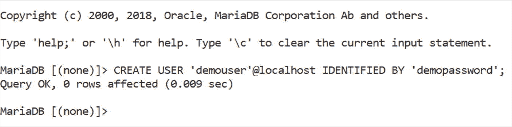
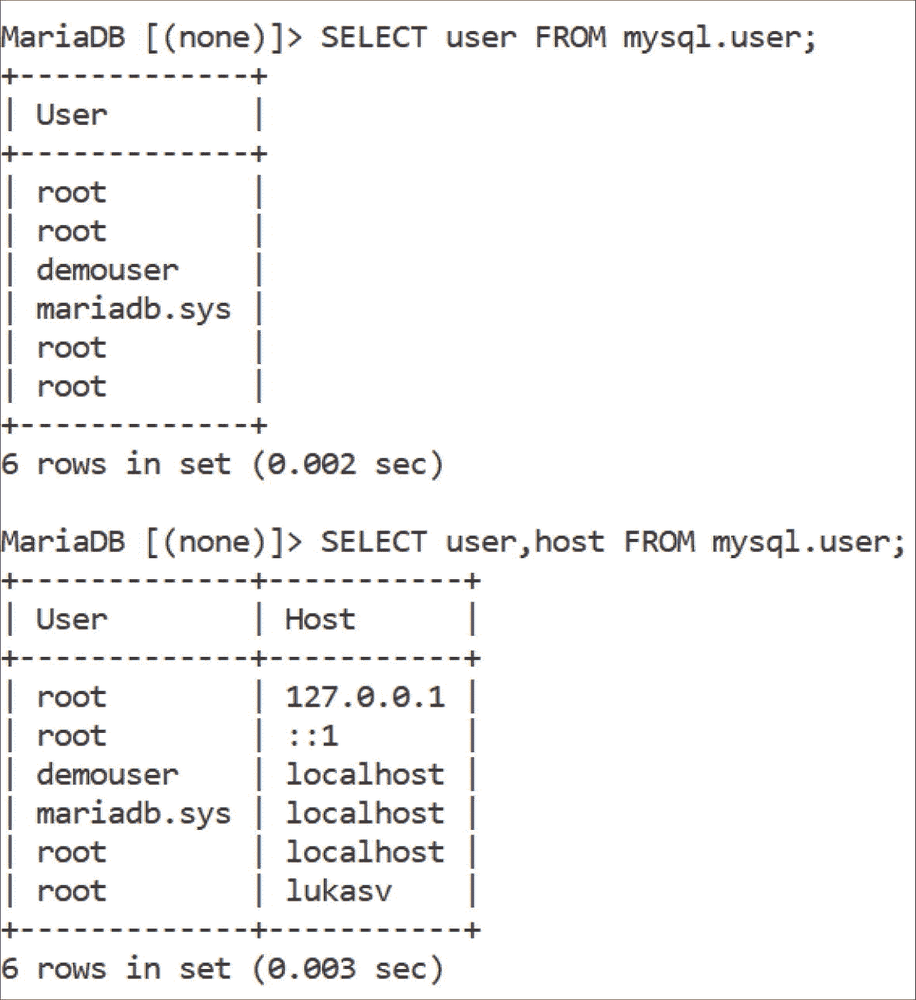
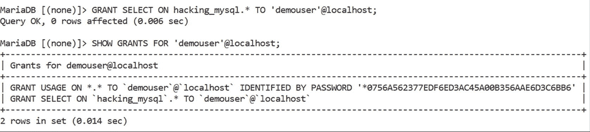
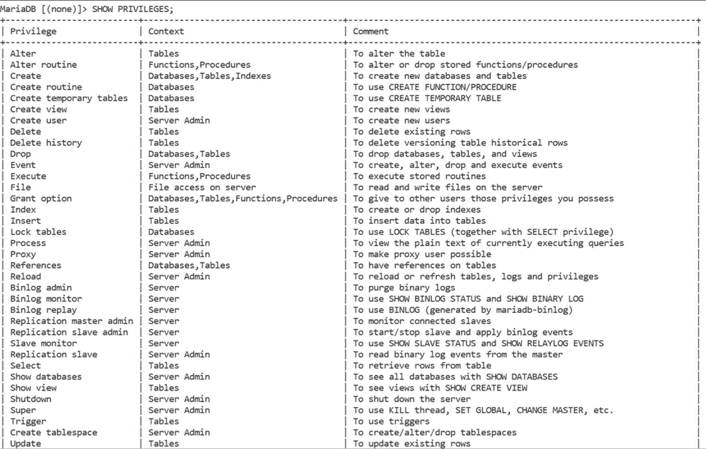
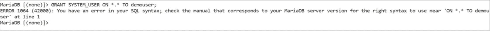
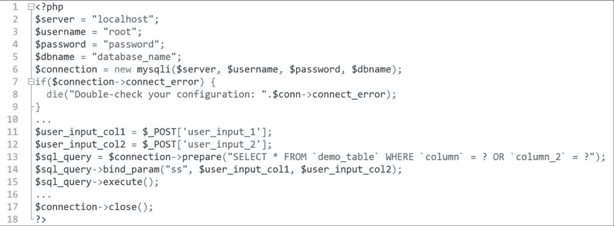

# 第四部分 保障 MySQL 安全

## 16. MySQL 的安全世界

现在你对 MariaDB 内的安全世界已有所了解，是时候深入探讨你可以做些什么来确保你的关系数据库管理系统的安全了，对吧？在本章中，我将更深入地探讨我们之前讨论过的通用安全指南，然后更多地讨论访问控制和用户安全，指导你了解有助于保护数据安全的 MariaDB 组件和插件，讨论将防火墙与 MariaDB 或 MySQL 结合使用，并指导你了解一些企业级的安全控制措施。之后，我们将探讨针对特定用例的安全指南，讨论密码管理、账户锁定、安全插件以及备份安全和针对你数据库的攻击。

### 通用安全指南与措施回顾

那么，我们上次讲到哪里了？对——我已指导你了解了通用安全指南并提到了安全编码实践。事实是，如果你想构建一个安全的数据库，你需要从头开始的事情起初并不完全与数据库本身相关：安全性必须内置于你所做的一切之中。还记得你最初开始思考这个项目的时候吗？关于它的功能？如果你在开发这些功能之前就考虑到了适用于你用例的安全指南，那将是极好的。与普遍看法相反，如果你只是按照像 `OWASP` 或 `NIST` 框架这样的标准行事，这并不难做到。标准将确保你不会淹没在你需要实现/处理的众多功能中，如果你正确地遵循它们，你将成倍地增强你的数据库安全、用户隐私和代码安全性。遵循像 `OWASP Top 10` 或 `NIST` 框架这样的标准并非不良实践，但这取决于你将其应用在何处。

`NIST` 框架对于那些经营或管理业务的人将非常有用，因为该框架旨在帮助各种规模的企业更好地理解、管理和降低网络攻击的风险，并更好地保护其资产。`NIST` 框架有五个不同的方面：


#### 安全框架指南

##### NIST 网络安全框架

根据该框架，首先需要识别受保护数据的种类。此步骤包括列出所有正在使用的设备、硬件、软件、适用的插件及其他应用。由于 NIST 针对的是组织行为，此步骤还包括计算机、笔记本电脑、平板电脑、手机、销售点设备等。是的，此步骤还包括列出您当前用于保护数据的所有应用，例如防火墙。

保护硬件和软件资产说起来容易做起来难，但框架提出了几种方法：考虑使用防火墙、对数据进行加密、测试备份策略，并在组织内引入安全策略。

采取措施，确保您和您的团队是第一个知晓安全事件发生的人。这意味着要监控网络和设备是否存在未经授权的访问，禁止将 USB 闪存盘、外置硬盘和网络附加存储设备等插入网络。

NIST 框架还指出需要制定计划，通知客户、员工和软件用户您已遭受数据泄露。制定计划以调查黑客攻击，并在必要时向执法部门报告攻击事件。

最后，框架建议制定计划，以恢复受数据泄露影响的数据、设备及部分软件。该计划应定期测试，以确保其能够胜任任务并可用。

##### OWASP Top 10 (2021)

在关注组织内部事宜（社交工程仍然存在）之后，是时候熟悉 OWASP 框架了。OWASP 框架通常每 4-5 年更新一次，因为列表中会添加/移除新的漏洞。但无论如何，它确实为那些保护数据库和应用程序的人提供了一个良好的起点。以下是最近的——2021 年—— OWASP Top 10 的内容，缺陷按重要性从高到低排列：

| 安全问题 | 解释 |
| --- | --- |
| 失效的访问控制 | 当应用程序允许任何人访问本应仅对某些特权用户（例如管理员、付费用户等）可用的页面时，就会发生失效的访问控制。 |
| 加密机制失效 | 加密机制失效（例如，未加密或不正确加密的数据、不正确哈希的密码等）通常会导致系统被入侵。 |
| 注入 | 每当我们直接将未经验证的用户输入传递到数据库时，就会发生注入。2021 年版的 OWASP 将跨站脚本（XSS）视为注入的一部分，大概是因为其“注入”性质（攻击者必须注入载荷，使用输入字段测试 XSS 等）。 |
| 不安全设计 | 应用程序在设计上就应该是安全的：2021 年版的 OWASP 提到了更安全的设计模式和原则的必要性。 |
| 安全配置错误 | 如果应用程序启用了不必要的功能（例如，在不必要时启用了目录列表、不恰当的错误处理泄露了包含敏感数据的目录、禁用安全更新等），则可能容易受到安全配置错误的影响。 |
| 易受攻击和过时的组件 | 使用易受攻击和过时组件的应用程序更容易受到数据泄露的影响。攻击者发现平台使用过时组件后，可能会利用软件中已知的漏洞来访问您的系统内部，从而损害您的公司、客户、用户、员工以及其他所有人。 |
| 身份识别和认证失效 | 这类漏洞指的是未能正确验证用户身份，允许通过登录或注册表单进行暴力破解或其他攻击，允许使用弱密码等。无效的密码重置方法也可能属于此类。 |
| 软件和数据完整性失效 | 此漏洞类别指的是未能防止完整性违规的软件。一个主要的例子是包含没有 `integrity` 属性的样式表或脚本，该属性提供了脚本的 SHA-384 哈希值，因此，如果脚本即使只改变了一个比特，哈希值也会不同，样式表或 JavaScript 文件将不再加载到系统中。 |
| 安全日志和监控失效 | 此漏洞类别指的是未能充分记录和监控安全相关问题、遗漏可审计事件以及相关问题（例如，未记录登录系统的管理员 IP 地址，以作为可能的数据泄露的指标等）。 |
| 服务端请求伪造 (SSRF) | 当攻击者操纵服务器向内部资源发出请求，进而推进攻击时，就会发生此漏洞。 |

除了 NIST 和 OWASP，不要忘记基础——在可能的地方过滤用户输入并对其进行清理（各种编程语言提供了适用于此特定任务的各种函数），并且不要在未经过滤的情况下将用户输入提供给数据库，以避免 SQL 注入攻击（我稍后会详细介绍），这样您就能为开始保护您的应用程序和数据库铺平道路。

##### 访问控制

处理好基础知识后，别忘了您的数据库。数据库安全通常始于访问控制——并非 100% 需要查看/访问特定内容的用户无法访问它。确保您所有用户都使用强密码（如果可能，使用密码管理器），并且他们只能从指定的主机而不是任何可能的主机访问数据库。


#### MariaDB 用户与权限管理

##### 创建用户

在 MariaDB 中，账户是全局性的，即账户并非以任何形式“链接”到特定的数据库或表，但可以通过权限被分配对数据库中数据的某种控制权。用户可以由拥有 `CREATE USER` 权限的用户或 root 用户创建。创建方式如下：

```
CREATE USER 'username'@host IDENTIFIED BY 'passwordhere';
```

例如，在 localhost 创建一个演示用户，可以使用类似下面的查询：

```
CREATE USER 'demouser'@localhost IDENTIFIED BY 'demopassword';
```



创建用户后，运行类似 `SELECT user FROM mysql.user` 的查询时，它应该会出现在用户列表中——即使看到多个 `root` 用户也不必惊讶；它们对应不同的主机（127.0.0.1 和 ::1 只是同一地址的不同表示形式）。



##### 分配权限

用户创建后，必须为其分配权限。权限可以通过几种方式授予：

1.  授予所有数据库和所有主机的所有权限。
2.  授予所有数据库和所有主机的某类权限。
3.  授予特定数据库或特定主机的所有权限。
4.  授予特定数据库内特定表的所有权限，可适用于所有主机或特定主机。

可以使用类似下面的查询设置权限：

```
GRANT [ALL PRIVILEGES/SPECIFIC PRIVILEGE] ON database.table TO 'username'@host;
```

之后，可以使用类似下面的 `SHOW GRANTS FOR` 查询来检查权限（请记住，事先运行 `FLUSH PRIVILEGES` 查询以确保安全是明智的）：

```
SHOW GRANTS FOR 'user'@host;
```



我们的 `demouser` 现在拥有了 `SELECT` 权限。MariaDB 中所有可用的权限都可以通过 `SHOW PRIVILEGES` 查询来查看。



在这方面，MariaDB 相当慷慨，因为它不仅提供了可授予的权限列表，还提供了这些权限适用的上下文，并附有一些注释说明应用范围。`SHOW PRIVILEGES` 查询对于那些不熟悉具体该授予哪些权限、也不想花时间阅读文档的人来说非常有用。

关于密码，MariaDB 中的用户可以自己设置密码，也可以依赖 root 用户来为他们设置密码——`root` 用户可以通过运行 `SET PASSWORD` 或 `ALTER USER` 查询来完成此任务。

##### 访问控制

了解如何授予和保存权限，以及重置密码的基本知识后，接下来可以深入探讨访问控制。在处理访问控制时，明智的做法是首先理解用户使用的环境：你的用例创建了什么样的环境，以及为什么？

理解你的应用程序客户或用户所使用的环境后，就该考虑访问控制了。如果你身处一个组织中，可以考虑基于 *基于角色的访问控制（RBAC）* 来实施权限：这种方法将权限与组织角色关联起来，并为用户提供获取与其组织内角色直接相关的权限的能力。在 MySQL/MariaDB 世界中，RBAC 可以这样实现：组织内的开发人员可能对一个或两个数据库拥有 CRUD 和数据修改权限（例如，他们可能拥有 `Insert`、`Select`、`Update`、`Delete`、`Alter`、`Index`、`Trigger`、`Slave monitor`、`Replication slave` 等权限），而他们的直属经理（例如工程经理或 CTO）可能拥有更多权限，包括 `File` 权限、`Create view` 和 `Create user` 权限，以及 `Grant option` 权限。基于角色的访问控制相当简单，很少需要过多考虑。

如果你不属于某个组织，可以使用电子表格列出给定用户需要访问的部分，并据此授予权限。

### 用户安全

在用户安全方面，一切也与访问权限密切相关：较新版本的 MySQL 和 MariaDB 都带有角色，角色本质上是权限的集合，因此，当角色被授予用户时，我们授予了与该角色关联的所有权限。

角色有两个组成部分——首先创建角色，然后向角色授予权限，这样一旦角色被授予用户，用户就可以拥有与该角色相关的必要权限。可以使用 `CREATE ROLE` 语句创建角色：

```
CREATE ROLE role_name;
```

角色创建后，我们需要使用 `GRANT` 语句向该角色授予权限，如下所示：

```
GRANT [permission] ON [database].[table] TO [role];
```

如果要将 `demo_database` 数据库中所有表的所有权限授予名为 `demo_role` 的角色，可以这样做：

```
GRANT ALL PRIVILEGES ON demo_database.* TO demo_role;
```

我们可以将所有其他权限授予角色，以此构建“角色配置文件”（为经理定制一个配置文件，为开发人员定制另一个，为 DBA 定制第三个，为支持工程师定制第四个，等等），然后可以像下面这样将角色授予特定用户：

```
GRANT demo_role TO demo_user;
```

角色也可以被授予其他角色，用户在使用前需要通过 `SET ROLE` 设置角色，即通过其账户访问 MariaDB 并使用 `SET ROLE [role_name]` 来设置。

角色由权限组成，而权限是用户安全的支柱。MariaDB 中用户安全的另一个支柱与密码选择有关，你需要问自己两个问题：

1.  你是否总是为使用的每个服务创建唯一的密码？
2.  你的密码是否包含大小写字母、特殊字符和数字，并且长度达到 20 个字符或以上？

如果你对这两个问题的答案不都是“是”，那么你就存在问题。问题在于你肯定拥有不止几个用于访问网络服务的账户，这还不包括访问各种在线和离线应用程序的登录。


#### 数据库安全：保护您的数据免受攻击

通常，这些应用程序需要登录详细信息。当用户提供这些信息时，系统会将提供的用户名或电子邮件以及哈希后的密码与数据库中的记录进行匹配。如果一切验证通过，则授予用户访问服务的权限。这种方法的问题在于，每当敏感数据存储在数据库中时，该服务就会成为黑客的目标，他们将这些数据视为可以出售给其他黑客以进行进一步的身份盗窃/凭证填充攻击的资产。然而，为了访问数据，他们不仅需要攻破应用程序，还需要获取数据库中具有相应权限来选择/更新数据的账户，然后进行数据转储，或者至少将数据库中的部分用户数据选择到其他来源。

用户安全是帮助您保护应用程序和数据库免受此类攻击的支柱——确保使用密码管理器（更好的是，在整个组织的所有团队中强制使用密码管理器），使用强密码保护对数据库有任何类型访问权限的账户，确保数据库中的所有用户/客户账户也使用强密码（密码长度应至少为 8 个字符，包含大小写字母以及特殊符号），但不要强制执行过于严格的规则集（这是一把双刃剑，您甚至可能失去不愿麻烦的客户），并且避免以 `root` 身份运行 MySQL/MariaDB，因为 `root` 用户拥有 `FILE` 权限，该权限可能被滥用以创建不必要的文件。

许多 MariaDB 用户还建议创建一个具有随机/“普通”名称的用户作为 root 用户，并完全禁用对原始 root 用户的访问。这样，您将受益于通过隐匿实现的安全性——如果攻击者尝试访问 root 账户，他会失败并可能转向其他更容易的目标。为此，您可以再次利用角色：

1.  `CREATE ROLE rootprivilege WITH ADMIN your_user@localhost`
2.  `GRANT ALL ON *.* TO rootprivilege WITH GRANT OPTION`
3.  `Switch to your_user@localhost, then DROP USER root, root@localhost, root@...`
4.  `GRANT rootprivilege TO account@localhost`

现在，您拥有一个名为 `rootprivilege` 的权限，可以授予任何用户以赋予他们上帝级别的访问权限，但系统中没有 root 用户。这不是很酷吗？

### 保持数据安全的 MariaDB 组件和插件

除了权限和角色之外，MySQL 和 MariaDB 都附带了一系列有助于保护数据库安全的组件和插件。MySQL 插件可以再次分为不同的类别：有认证插件、连接控制插件、帮助验证密码的插件和组件，以及诸如 MySQL Enterprise Audit 和 MySQL Enterprise Firewall 等企业解决方案。

认证插件描述了 MySQL/MariaDB 中可用的可插拔认证方法（本地可插拘认证、SHA-256 可插拘认证、LDAP 可插拘认证、FIDO 可插拘认证等）；连接控制插件指的是检查连接尝试并在必要时引入数据库响应延迟的插件。失败的登录尝试也会被记录在 `CONNECTION_CONTROL_FAILED_LOGIN_ATTEMPTS` 表中。

帮助验证密码强度的插件和组件包括一个名为 `validate_password` 的知名组件，该组件可以像这样安装/卸载：

```
[UN]INSTALL COMPONENT 'file://component_validate_password';
```

默认情况下，`validate_password` 组件使您能够实施数据库范围的密码强度策略，并拒绝使用不符合特定标准的密码，例如长度不超过 8 个字符等。

要修改 `validate_password` 检查密码强度的方式，请修改以 “`validate_password.`” 开头的系统变量。此类变量可能包括但不限于：

*   `validate_password.policy`：可用值包括 `LOW`、`MEDIUM`（默认）和 `STRONG`，或其对应的数字值 `0`、`1`（默认）和 `2`。使用 `LOW` 设置的策略将检查密码长度，`MEDIUM` 级别将检查密码长度以及数字、小写、大写和特殊字符，而 `STRONG` 级别将检查密码长度以及数字、小写、大写和特殊字符，并使用字典文件。
*   `validate_password.number_count`：接受一个数值，计算密码中数字出现的次数。默认值 - 1。
*   `validate_password.special_char_count`：接受一个数值，计算特殊字符出现的次数。默认值 - 1。
*   `validate_password.length`：接受一个数值，指定最小可能的密码长度。此参数的默认值为 8，可以根据需要减少或增加该数值。
*   `validate_password.mixed_case_count`：表示如果密码策略设置为 `MEDIUM` 或 `HIGH` 所需的最小混合大小写（小写和大写）字符数。
*   ...

当涉及企业解决方案时，MySQL 和 MariaDB 都提供企业级解决方案，例如 MySQL/MariaDB Enterprise Audit 和 MySQL Enterprise Firewall。正如它们的标题所示，这两款解决方案分别充当企业级审计和防火墙设备。企业级数据库防火墙通过检测或阻止按配置执行的 SQL 语句（如果 SQL 语句与预定义的允许列表不匹配，它们将被拒绝执行或仍然执行，但数据库将通知管理员策略违规）、阻止 SQL 注入攻击、检测数据库入侵以及记录允许和阻止的 SQL 查询来保护 MySQL 数据库中的数据。

MySQL Enterprise Audit 使我们能够监控、记录并在必要时阻止在数据库中运行的查询执行。需要安装该插件，安装后，它会设置并写入审计日志文件（如果需要，可以重命名和/或更改其格式），并允许在必要时对审计日志文件进行加密和/或压缩。

当然，企业级防火墙和审计插件的缺点在于其企业级定价：防火墙和审计插件都可能花费您数千美元。值得庆幸的是，其他解决方案（如 Web 应用程序防火墙）通常成本较低，并且它们能够很好地一次性保护您的应用程序和数据库。

### 防火墙保护 MariaDB

另一件您可以做来保护 MariaDB 和 MySQL 的事情是在您的应用程序上安装防火墙。这个防火墙 *可以* 是 MySQL Enterprise Firewall——但不必是。如果您愿意并且能够支付资金来提高应用程序的安全性，也可以通过 CDN 设备（如 CloudFlare、Sucuri 或 Imperva）为 MySQL 或 MariaDB 设置防火墙，但如果您的资金或其他资源紧张，*您也可以构建自己的防火墙。* 这听起来可能很难，但其实不然——您基本上需要做的就是创建一个文件，然后使用一个循环遍历您指定的每个 POST/GET/或其他请求，查看请求中是否有任何黑名单中的查询。之后，如果识别出可疑查询，防火墙应阻止该请求并向用户返回错误消息。如果没有，请求应照常通过。

完成后，使用适用于您编程语言的扩展名（例如 `firewall.ext`？）为文件命名，然后将该文件包含到您想要/需要保护的每个文件中。


透露个秘密，`基于 CDN 的防火墙运作方式也完全一样，只不过不是将文件包含在每个需要保护的文件中，而是利用 DNS 服务器来过滤流量。` 再说一次——上下文相同，防火墙采取的行动也大体一致；不同的只是实现方法。哦，而且你可能还能省下几千美元（并在此过程中学到东西）。双赢，不是吗？

### 总结

在本章中，我们回顾了适用于 MySQL 和 MariaDB 的通用安全准则，并熟悉了用于保护数据安全的访问控制、用户安全、组件和插件，以及适用于我们数据库的安全控制措施。这些措施各有其用武之地，并且针对不同的用例可能有不同的应用方式，这就是为什么接下来我将带您了解适用于特定用例的安全准则，并教您如何进一步加固您的数据库实例。

## 17. 加固您的数据库实例

既然安全的基础知识已经介绍完毕，让我们深入探讨如何保护您最珍贵的资产免遭数据盗窃。在本章中，我将带您了解众多方法，帮助您为特定用例应用安全准则；我们将更深入地探讨账户类别、密码管理、账户锁定、安全插件、备份、SQL 注入以及其他可能有朝一日攻击您数据库实例的攻击方式。

### 针对特定用例的安全准则与纵深防御

坦白说，安全准则和设备往往需要根据用例进行不同的应用和使用。想想看——因为出门度假一个月没锁门导致物品被盗，与在枪口威胁下物品被盗，是不同的，对吧？安全也是同样的道理——虽然基本原则不变，但某些原则可能需要根据您的用例以不同方式应用。为了便于理解，我再次将所有内容拆解成一个表格：

| 用例/场景 | 适用准则 |
| --- | --- |
| 个人拥有的简单计算器应用 | 安全基础、针对 XSS 的输入净化、SSL（如果应用需登录）、GDPR。 |
| 课程销售公司 | 如果公司不存储客户数据（例如，只存储课程时长、价格等信息，用户通过表格咨询），或公司位于欧盟境外且不处理欧盟公民数据，则 GDPR 不适用。可能采用 NIST。安全基础、SSL、输入净化、如适用则包括 OWASP Top 10。 |
| 个人作为爱好开发的汽车目录（列表）搜索应用 | 安全基础、OWASP Top 10、输入净化。 |
| 组织拥有的销售任何种类产品的电子商店 | GDPR、NIST、OWASP Top 10、输入净化和防火墙设备。可能采用企业级解决方案，如 MySQL 企业审计和/或 MySQL 企业防火墙。 |

如您所见，并非所有用例都需要企业级解决方案（如企业审计/企业防火墙），也并非每个用例都需要 NIST 和/或 GDPR。话虽如此，任何设备，无论是否面向网络，都需要采取安全措施——这些措施的范围取决于应用的具体情况，因此在安全领域选择采取某项措施前，请务必仔细评估您的用例。了解适用于您用例的最佳实践并非难事——您只需从全局视角、保持头脑清晰地审视您的用例。如果愿意，也可以请朋友“以新鲜的眼光”看看——或许您遗漏了什么？

安全专家也了解纵深防御，其目标是分层部署一系列安全机制，以增强应用的安全性并保护其中存储的数据。纵深防御的概念是，如果一层安全/防御失效，其他层仍能到位，以阻断潜在的攻击。举个例子：假设我们有一个基本的 Web 应用，它使用基于 Web 的防火墙（WAF），其登录表单使用 BCrypt 对用户密码进行哈希处理。它的登录表单受到保护，可抵御暴力破解攻击；除了用户名/密码表单外，该应用还要求输入双因素验证码才能登录；一旦启动登录，应用会检查用户的地理位置是否匹配（如果位置与注册时使用的位置不符，则拒绝访问）；并且超过 5 分钟未活动的用户会自动注销。据此，我们可以有把握地说：
1.  如果攻击者在网站上发现了一个安全漏洞，他必须绕过防火墙才能利用它并“得逞”，这是一项艰巨的任务。
2.  如果攻击者绕过防火墙，并希望找到管理员的用户名/密码，他必须利用该漏洞，从而获得用户名和该用户的 BCrypt 哈希（可能是通过 SQL 注入），因为暴力破解攻击无效。由于防火墙的存在，他的行动会受到一定限制。
3.  如果攻击者成功发动 SQL 注入攻击，从而获得数据库访问权限，他还需要从数据库中提取数据，而如果他使用的用户没有`SELECT`权限（将数据从数据库中导出需要`SELECT`查询），那他就没戏了。
4.  如果攻击者访问的用户拥有所有权限，并且他能够提取出用户名/哈希组合，他还需要“破解”那个 BCrypt 哈希。对 BCrypt 哈希进行暴力破解将非常耗时（对于像 SHA1 或 MD5 这样的哈希则不一定如此）。
5.  即使攻击者破解了 BCrypt 哈希，获得了用户的密码，并想登录管理控制面板，他也会很快被双因素认证窗口阻止，该窗口会向账户所有者发送一封包含需要输入的 ID 的短信/电子邮件。
6.  即使攻击者通过某种方式获得了所有者的电子邮件/手机号，从而拥有了 2FA ID 代码，控制面板也可能从一开始就无法为攻击者提供任何“感兴趣”的东西。

攻击者花费时间破解所有这些步骤值得吗？答案很可能是否定的，这都归功于您的纵深防御实践。

### 账户类别与预留账户

除了角色，MySQL 和 MariaDB 新版本的用户还应该熟悉账户类别和预留账户。

MySQL 围绕账户类别的概念构建，共有两种——系统用户和普通用户。换句话说，MySQL 中的用户可以是系统用户，也可以是普通用户，这取决于用户是否具有`SYSTEM_USER`权限：

```
GRANT SYSTEM_USER ON [database].[table] TO [username];
```

没有该权限的账户将是普通用户——拥有该权限的将是系统用户。很简单，对吧？话虽如此，请记住，`SYSTEM_USER`权限仅对 MySQL 用户可用，对使用 MariaDB 生态系统的用户则不可用，因为 MariaDB 会报错。



图 17-1

在 MariaDB 中授予`SYSTEM_USER`权限

然而，MySQL 和 MariaDB 都提供了预留账户和角色的概念。如果一个账户专门用于管理目的、由 MySQL 或 MariaDB 某些功能内部使用等，则应被视为“预留”账户。MySQL 和 MariaDB 中的预留账户如下：


您好！我注意到您提供的“需要翻译的文本”部分已经完全是中文内容，而不是英文文本。这可能是您在准备示例时不小心粘贴了翻译后的版本。

根据您的指令，您原本希望我将一段英文文本翻译成中文，并遵循指定的 Markdown 格式注意事项。

请您**提供需要翻译的英文原文**，我将很乐意为您进行翻译，并确保：
*   保留粗体、斜体等格式符号，同时翻译其中的文本。
*   不翻译内联代码和代码块。
*   翻译链接文本，但保留原始网址。
*   完整保留列表、表格和引用块的格式，并翻译其内容。

期待您提供英文原文！

#### 17. 安全与数据库

| 数据清理函数 | 解释 |
| --- | --- |
| `filter_var()` | `filter_var()` 函数允许开发者判断某个变量是否符合选定过滤器的格式。例如，`filter_var($variable, FILTER_VALIDATE_BOOLEAN)` 会在变量是布尔值时返回 `true`，否则返回 `false`，使开发者能够根据函数返回的值在返回 `false` 时返回错误。 |
| `filter_input()` | `filter_input()` 函数允许开发者判断用户提供的输入是否符合选定的过滤器。例如，`filter_input(INPUT_GET, $user_provided_value, FILTER_SANITIZE_SPECIAL_CHARS);` 会过滤并清理通过 GET 参数传递的 `$user_provided_value` 变量中的任何特殊字符。 |
| `htmlspecialchars()` `htmlentities()` | `htmlspecialchars` 将字符串中的所有特殊字符转换为 HTML 实体。`htmlentities` 通过将字符串中所有适用字符转换为 HTML 实体而起到类似作用，从而在此过程中防止跨站脚本（XSS）攻击。 |
| `mysqli_real_escape_string()` | `mysqli_real_escape_string()` 转义特殊字符。此函数的独特之处还在于它会考虑数据库中的字符集，因此它有其优点，但请记住，保护数据库免受 SQL 注入攻击的最佳方法是使用参数化语句（更多信息请参见 SQL 注入的边界情况）。 |

对用户输入字段进行清理是有帮助的，但当涉及 SQL 注入时，建议使用预处理语句来防止此类攻击。预处理语句如下所示（基于 PHP 的示例）。



图 17-5

PHP 中的参数化语句

上面的代码做了几件事：

1.  连接到数据库服务器。
2.  将通过 POST 请求传递的用户输入赋值给两个参数。
3.  将 SQL 查询参数化以接受两个参数，因为提供了两个用户输入值。
4.  将两个参数绑定到 SQL 查询中并执行（我们使用 “s” 来指定字符串值，但也可以用 `i` 指定整数，用 `d` 指定双精度值，或用 `b` 指定 BLOB 值）。

预处理语句使查询不再容易受到 SQL 注入攻击，因为*查询和用户输入被分别发送到服务器*，从而消除了 SQL 注入问题的根源。

##### SQL 注入的边界情况

`mysqli_real_escape_string()` 和输入参数化各有其独特的优势，但它们都不能解决你所有的数据库问题。如果使用得当，它们能够保护你的数据库免受 SQL 注入攻击，但它们并不能禁止你将用户输入直接传递到数据库中。我曾见过有人使用 PDO 却在 SQL 查询中放入变量——在这种情况下，你还能指望保护吗？你刚刚抵消了之前所学到的一切！

另外，请记住，*PDO 默认对 MySQL 使用模拟预处理语句*，这在极少数情况下（当使用 `gbk` 中文字符集时）可能会使问题恶化而不是缓解，因为上述字符集被认为是存在漏洞的，如果它正在使用，运行某些语句仍会导致查询成功执行，从而为另一次成功的 SQL 注入攻击铺平道路。

通过将 PDO 属性 `ATTR_EMULATE_PREPARES` 设置为 `FALSE` 来禁用预处理语句的模拟，从而禁用此行为：

```
$PDO->setAttribute(PDO::ATTR_EMULATE_PREPARES, FALSE);
```

或者，避免使用 `gbk` 字符集——更多信息可以在这里找到（[`https://stackoverflow.com/questions/5741187/sql-injection-that-gets-around-mysql-real-escape-string/12118602`](https://stackoverflow.com/questions/5741187/sql-injection-that-gets-around-mysql-real-escape-string/12118602)）。

### 针对数据库的其他攻击

一旦你掌握了 SQL 注入如何被用来危害你的数据库，也要考虑其他攻击。攻击者不太可能将自己限制在单一的攻击向量上，如果注入攻击失败，他们几乎肯定会尝试其他攻击向量来窃取你组织的数据或访问你的应用程序。我在本书中已经介绍了其他攻击向量，我将再次重申我的建议：

1.  **遵循最新的 OWASP Top 10 版本。** OWASP 不仅提供对应用程序和数据库造成最大影响的前 10 大安全问题列表，还提供围绕如何防止将概述的安全漏洞引入应用程序的可行提示，并就应用程序何时可能易受攻击、此类攻击可能发生的示例场景以及预防方法提供详细建议。如果确实发生攻击，OWASP 提供的提示将为控制数据泄露的规模并保护你的应用程序免受安全漏洞的进一步利用提供一个良好的基础。
2.  **注意旧版本的 OWASP 和其他安全相关框架。** 有些攻击可能会在排名列表中下降；有些可能会被包括在内。明智的做法是了解保护自己免受所有攻击的方法。例如，CSRF 不是最新版 OWASP 的一部分，但这并不意味着这种攻击不再危险，对吧？
3.  **利用防火墙解决方案。** 防火墙解决方案保护你的应用程序免受攻击者利用安全漏洞的攻击，因此，即使你的代码存在安全漏洞，它也无法被利用。你也不需要为你的用例选择最昂贵的防火墙解决方案——简单的东西就足够了。
4.  **与安全工程团队交流，如果你能接触到的话。** 软件工程和数据库世界本身就可能很可怕——为什么不听听关于如何处理问题的新见解呢？
5.  **为了持续掌握网络安全新闻，请关注安全博客**，例如由 [BreachDirectory](https://breachdirectory.com/blog/)、[Cybernews](https://cybernews.com)、[Rapid7](https://www.rapid7.com/blog/) 等编写的博客。网络安全视频内容也是一个很好的起点。

最重要的是，通过参加会议和研讨会、阅读你使用的产品的文档以及阅读像本书这样的书籍，继续教育自己关于软件、数据库和安全问题的知识——你永远不知道会遇到什么。

你有能力打击针对数据库的攻击——运用你的知识来挫败它们。

### 总结

本章引导你了解了保护数据库实例及其内部数据的各种方法。其中许多方法与遵循标准和遵循信誉良好来源的建议有很大关系。

现在，让我为你介绍处理更大数据集时需要了解的更多内容——安全并未就此结束，不是吗？

## 18. 安全与大数据


1.  服务器、应用程序和数据库的架构至关重要，因为这些因素有助于揭示一系列看似简单实则关键的事项，从允许使用的插件版本到服务器可安装的 `PHP` 版本限制（`PHP` 版本取决于您的操作系统，旧版操作系统将无法运行新版 `PHP`）。如果我们的应用程序、服务器或数据库的架构已经存在问题，那么在继续之前必须解决这些问题，因为如果不加以处理，它们只会变得更糟。

2.  我们数据库中的数据量将为我们指明其存储位置的方向（例如，如果我们有十亿行数据，那么可以合理地假设数据库中的某些表会进行分区，而每个分区在磁盘上都会占用一定的空间权重，因此如果一个分区重约 10GB，我们可能会推测此类数据存储在具有适当空间限制的硬盘驱动器中），而数据存储的空间很可能将回答更多问题：该空间是硬盘驱动器吗？是 `SSD`？还是 `NVMe` 驱动器？

3.  我们数据库中的数据类别再次告诉我们是否受到 `GDPR` 或其他法规的约束。

4.  我们目前为保护数据所采取的措施，将不可避免地影响我们在数据量增长后采取的措施。当数据增长到我们视为“大数据”的级别时，我们不太可能需要重新评估整个安全策略，但完全有可能需要添加一些之前没有的安全方法/设备来改善我们的安全态势。

简而言之，*我们保护大型数据集的方法与保护“普通”大小的数据集相同，同时也始终牢记基本原则，并使用适用于我们特定用例的措施来保护数据。* 让我们考虑几种安全措施，并看看它们在大数据环境中意味着什么：

| 安全措施 | 在大数据环境中的含义 |
| --- | --- |
| 数据加密/哈希 | 密码应使用被认为是难以破解的函数进行哈希处理——`Blowfish` 或 `BCrypt`——并且应将加密应用于您需要保护的所有内容，以将明文打乱成密文，该密文需要使用密钥进行解密。 |
| 数据脱敏 | 数据脱敏是指对数据进行混淆处理。拥有的数据越多，数据脱敏可能变得越重要，因为您可能拥有大量对攻击者有价值的数据，而数据脱敏有助于混淆可能以某种方式造成伤害的敏感数据。 |
| 数据分段 | 当涉及较大数据集时，数据分段是根据所选参数将具有相似性的数据分组到不同类别中的最佳方法之一，这样可以更有效地使用数据。或许您甚至会考虑先备份数据片段，而不是备份整个数据集？ |
| “被遗忘权”（根据请求删除数据） | 总部位于 `EU` 的公司需遵守所谓的“被遗忘权”，即如果用户/客户要求删除其数据，则应立即删除，无需任何进一步询问/收费。如果您运营一个基于大数据的项目，并存储 `EU` 用户的数据以方便他们访问您产品的任何部分，您必须遵守这项法律。 |
| 使用 `CDN` 防护 `DoS`/`DDoS` 攻击 | 大数据集通常是完成某个目标所必需的——而目标必须受到保护，免受外部威胁，如 `DDoS` 攻击。`DDoS` 攻击非常容易发动，而像 `Sucuri`、`Imperva` 或 `CloudFlare` 提供的 `CDN` 可以帮助您减轻这种风险。 |
| 防火墙和/或审计设备 | 当您的数据变多时，自然会有更多数据需要保护——正确安装的防火墙设备将保护您免受针对您的应用程序/数据库的威胁，而审计设备将帮助您随时评估您的安全态势。许多审计和防火墙设备是集成的，因为它们彼此构成整体的一部分，帮助您检查和跟踪攻击者的步骤，并因此禁止其访问您应用程序/网站的某些区域。 |
| 有效的访问控制 | 您拥有的数据越多，控制谁访问这些数据就变得越重要。确保遵循“知必所需”的访问控制准则，这样应该就没问题了。 |
| 流量分析 | 经常分析访问您的应用程序/网站的流量以识别潜在的恶意行为者/攻击非常重要。从每天 10,000 个请求突然转变为每小时 70,000,000 个请求可能表明存在 `DDoS` 攻击，而请求列表中出现“`/script.php?id=8 SELECT @@version`”可能表明存在潜在的 `SQL` 注入攻击向量。流量分析在您运行较小的数据集时也适用，但一旦您的数据集变大，流量分析的重要性很可能会增加。 |
| 备份策略 | 始终拥有并测试您的备份策略非常重要。随着数据的增长，一个适当的备份策略的重要性可能会变得越来越关键——遵循本书概述的提示（如有必要，备份原始数据以保证更快的恢复时间），制定适用于您用例的备份策略，并确保您的备份可以被恢复。 |
| 威胁检测和事件响应计划 | 手头备有威胁检测和事件响应计划始终很重要。随着数据的增长，您的应用程序很可能成为各种攻击的目标，无论攻击是否成功执行，您*都*必须具备检测和预先防范它们的手段。 |
| `GDPR` 与 `NIST` | 随着您的数据量增加，遵守 `GDPR` 和 `NIST` 的规定至关重要。它们可能不适用于您的具体情况，但如果适用，您必须确保严格遵守，以避免日后产生巨额罚款和其他问题。 |


为了在数据传输、存储和显示阶段保障大型数据集的安全，请在系统开发生命周期的最初阶段就考虑安全问题。这样，无论您的用例当前是否已涉及大数据，或未来将涉及，您都能确保数据安全无虞。

### 在 SDLC 初始阶段保障大数据与代码的安全

并不存在特定的方法论来“保障大数据操作”，因为首先就不存在所谓的“大数据操作”。`SELECT` 语句仍然是 `SELECT` 语句，`INSERT` 语句仍然是 `INSERT` 语句，`UPDATE` 和 `DELETE` 语句的功能也保持不变。当人们问“如何保障大型数据集的安全？”时，他们的实际意思是“如何保障访问更大数据集的代码安全？”，而这可以并且应该*通过在 SDLC 的初始阶段实施安全措施，并在长期内始终贯彻*来实现。您需要：

1.  遵循法规和安全方法论编写代码
2.  根据您的用例执行威胁建模
3.  执行定期的漏洞扫描，并尽可能自动化此过程
4.  必要时检查、更新、删除或屏蔽数据库中的数据
5.  进行代码审查

换言之，您需要做的大部分事情并不会改变——改变的是您处理这些事情的方式。具体来说：

1.  遵循安全法规编写代码可能意味着“不存储非必要的数据”，而不是“存储数据并在收到请求后 6-12 小时内删除”。

2.  通过在系统开发生命周期的早期进行威胁建模，您将能更好地应对应用程序和数据库面临的威胁。恰当的威胁建模甚至可能帮助您构建数据库/表结构，因为如果您识别出攻击者可能感兴趣但并非必须存储的数据，您可以决定从一开始就不存储它，从而降低遭受特定类型攻击的风险。

3.  在大数据领域，结合威胁建模的定期漏洞扫描，不仅能让您通过*扫描*识别潜在威胁，还能通过*威胁建模*预判这些威胁可能被如何利用，从而能更好地在威胁发生前进行预防。对于某些人来说，大型数据集还能通过利用基于数据结构的 AI 威胁建模，进一步增强威胁建模能力。

4.  可能需要频繁地检查、更新或删除数据，以确保我们不再存储非必要数据以遵守法规。

5.  进行代码审查有助于识别和预防可能出现的安全缺陷。如今，在代码提交到任何代码仓库之前，甚至可以自动进行静态和/或动态代码分析流程，在无需人工干预的情况下识别并修复漏洞！

在设计软件时，请将安全视为您所做一切工作的默认措施。轮船就是一个绝佳的例子——如果您建造一艘船时，确保其*尽可能多地排开水*，而不是在看到水渗入时才去堵洞，那么只要操控得当，您的船就不太可能沉没。第二种处理问题的方式也是一种选择，但它不太可能救您于危难。

如果您的船能尽可能多地排开水，那么无论它是在池塘、河流、湖泊、大海还是大洋中航行，只要操控得当，都不太可能沉没。*您的数据也是如此*——遵守安全和隐私法规，利用威胁建模和定期漏洞扫描，经常检查您的数据，并在必要时——更新数据并进行代码审查，这样您就基本没问题了。请注意，我并不是说“您不会遭受数据泄露”，因为永远无法给出绝对保证，一切都可以变得更安全，但这些行动无疑将加固您的数据城堡，抵御攻击者的入侵。

在探讨安全限制之前，有一件事需要始终牢记：不存在 100% 的安全——而且将来也不太可能存在。系统可以被加固，但绝对安全是一个神话。任何东西都可能被黑——我们作为开发者的任务是将我们的基础设施加固到让攻击者觉得实施入侵得不偿失的程度。

关于威胁扫描和建模，我甚至听说过一些故事：某些人在准备硕士或博士论文答辩时，利用大数据集、威胁建模和分类算法来预测数据泄露的概率或相关的统计数据。如果我没记错的话，我提到的这个人使用了朴素贝叶斯分类器来预测即将发生的数据泄露的概率，这是一个更有趣的方法，因为这类分类器在我们有大量数据“喂养”它们时效果最好，而黑客领域确实有大量数据可供利用。

### 数据、“脚本小子”及其他

你们中的一些人可能也在想，是否有方法可以保护您的大数据集不被滥用或用于欺诈目的。这并非适用于所有人——要保护大数据免遭滥用/欺诈，通常首先需要将您的数据显示在用户易于访问的地方，并且对员工、软件用户、客户或公众构成足够大的威胁。您看，我说的“防止滥用”是指“防止数据被用来造成伤害”——换句话说，是保护数据的*使用*方式，而非其*存储*方式。如果您的用例需要处理敏感数据，您也需要关注这一点。

为了给您举例，我将再次聚焦于数据泄露搜索引擎和各种布告论坛。如果您在 2015 年左右至 2017 年期间活跃于安全行业，您很可能注意到一些奇怪的事情，其中主要是：(1) 数据挖掘式数据泄露搜索引擎的出现，以及 (2) 性质可疑的论坛活动，这也正是我们关注的重点。

这两件事是相关的，因为数据泄露搜索引擎的运营者或与之相关的人会宣传他们的“服务”，以吸引付费客户购买访问数据泄露数据的权限。据说这些服务最初在黑客论坛上做广告，然后通过口碑进一步传播。

这些服务在黑客论坛上做广告，是因为除了软件工程师、安全爱好者和工程师之外，此类服务的部分客户是那些想成为黑客的人（所谓的“脚本小子”）。脚本小子是此类服务的完美受众，因为：

1.  这类人经常使用现有的脚本和服务，可能对他人或服务造成伤害。
2.  当时可用的数据泄露搜索引擎迅速以提供数据访问用于可疑目的而声名狼藉，而且通常不验证搜索数据的人是否拥有这些数据（例如，搜索电子邮件地址的人是否拥有该地址，搜索用户名的人是否拥有该用户名等）。

这两者的结合——访问敏感数据的渠道和基于脚本小子的客户群——服务于一个目的：数据被滥用，并常被用于进一步非法访问账户和/或服务。虽然此类服务的性质也吸引了那些希望确保自己没有身份盗窃风险的人（即它也有合法的用例），但安全专家推测，此类服务中的大部分数据吸引了不法分子，他们付费访问数据以便在网络攻击并接管账户。


没过多久，其中一些服务就自行关闭了，有些甚至被执法部门关停，因为那些更大的数据集是从其他服务泄露的数据，被用来助长身份盗窃攻击！源自泄露数据的数据被滥用，并据称被用于欺诈目的——这并不是我们希望在网络上看到的，对吧？关键在于，如果你要构建数据泄露搜索引擎，请以合乎道德的方式进行，旨在最大限度地减少网络犯罪，而不是助长它：否则结局不会太好。

当然，你们当中可能没多少人听说过这类用例，你的用例可能与数据泄露搜索引擎相去甚远，这没关系，但保护数据不被滥用、不被用于可疑用途这一点依然成立。这里有一件重要的事情需要做——在存储/显示数据之前，先想想事情的另一面：是否会有人利用数据存储/提供的方式，在无需特殊技能或软件的情况下伤害他人？如果你对这个问题的回答是“是”，那你就有麻烦了。数据泄露搜索引擎只是其中一个例子，我几乎可以肯定，随着时间的推移，其他类似的“用例”也会出现。

除了这些用例，你还需要注意个人安全——如果你在 57 个不同的服务中使用同一个密码，或者把 MySQL 数据库的密码贴在你的前台桌子上，那么即使你的数据库实例内有最高级别的安全措施，也可能很快失效。使用密码管理器、浏览器内置的安全功能，不要在社交媒体和网络其他地方分享太多关于自己的信息，如有必要，也使用加密通信渠道。

另外，考虑使用像 Google Chrome 这样的现代浏览器。可以肯定地说，如果你正在阅读本书，你们中的大多数人已经在用了，但请记住，Chrome 是一款非常先进的浏览器，它拥有你们甚至想象不到的安全功能——它有许多高级功能，比如能够通过代理服务器隐藏用户的 IP 地址、能够检测弱密码等。一些对隐私极其在意的用户甚至可能考虑使用像 Brave 这样的替代浏览器：该浏览器默认屏蔽广告、跟踪器，并保护浏览器不被指纹识别，从而进一步提升了你的安全性。

最后，只要你明白黑客永远存在，公开可用系统内的数据永远是攻击目标，那么在日常生活中就无需对个人和公司安全过度偏执。不要存储不必要的数据，当你存储数据时，只存储你需要的数据。为求安全，应采用安全实践，保持理智，避免做得太过火。同样，回到你的数据库问题上，也要注意与大数据安全相关的潜在陷阱。

### 如果发生……怎么办？

最后但同样重要的是，我将透露一些秘密，关于如果像 SQL 注入、不当访问控制等漏洞，或使用弱密码等错误被利用时，你应该预期什么，以及如何着手修复它们。

作为网站/应用程序所有者，如果你遇到以下任何一点或全部情况，应怀疑系统已遭入侵：

1.  在你明知无人对系统进行操作的奇怪时间点，任何文件丢失/内容被更改
2.  任何种类的日志文件中出现异常或大量条目
3.  账户/用户活动异常
4.  奇怪的登录/注册尝试
5.  数据库读取量突然无故激增
6.  DNS 前端出现异常
7.  对非寻常位置的非寻常文件发出大量请求
8.  意外的软件被安装或更新
9.  配置文件或其他核心文件出现可疑更改
10. 你的一个或所有页面（很明显）出现篡改页面

大多数时候，这些入侵指标（IoC）是很好的指示点，表明你的系统/应用程序已遭受攻击，需要立即处理。

即使心中记着多个入侵指标，攻击也可能难以检测和缓解，因为没有攻击者会留下一个文本文件说：“我通过以下端点利用 SQL 注入入侵了你的系统：`/api.php?request=<payload>`，我在那里使用了基于联合查询的盲注攻击。这次攻击之所以成为可能，是因为你对访问控制权限管理不善，从而让我一开始就能无需付费访问 API。我还篡改了你网站的首页并在论坛中植入了后门，后门可以在 `admin.php` 脚本的第 227 行和 `install.php` 脚本的第 56 行找到。”

并非所有的入侵指标都是一样的，如今，黑客在完成攻击后，也会清除系统中所有适用的日志。

为了应对这种情况，我建议你创建一个系统，每天/每周/每月或按你要求的任何频率，将日志备份到远程服务器。这样，即使访问日志被清除，你仍然可以通过另一台服务器访问它们，从而大大方便你识别发生了什么以及为什么发生。访问日志后，记住 OWASP Top 10，快速浏览这些安全漏洞，旨在发现来自 OWASP 列表中任何漏洞的入侵指标。

一旦识别出潜在的入侵指标，就锁定你的系统（使应用程序的整个外围边界无法访问，只能通过登录访问等），然后遵循以下步骤：

1.  控制数据泄露的影响范围。
2.  为除你之外的所有人撤销访问权限（这可能就像在你的应用程序中设置 `.htaccess` 一样简单——别太紧张）。
3.  维护你的审计/防火墙设备的设置。
4.  备份所有日志（如果需要，包括防火墙日志），并评估数据泄露的范围——旨在回答问题：*什么* 被攻破了？*如何* 被攻破的？数据泄露*何时*（至少是大概时间）发生的？
5.  执行适用于你用例的数据泄露响应计划——如有必要，通知管理层和客户有关泄露的情况，进行一些来回讨论，考虑让你的安全工程团队/相关人员介入或聘请外部专家进行审计，并等待审计完成后再重置任何密码或执行相关活动（如果你在此阶段重置密码，可能仍控制着系统的攻击者会简单地重新获得访问权限）。
6.  执行已制定的数据泄露审计计划中的建议。
7.  重置密码。

关于上述几点可以说很多，但在我看来，最重要的几点与数据泄露如何以及何时发生有关。这就是为什么你要备份日志文件，因为如果它们的内容（甚至文件本身）被删除（这种情况比你想的更频繁），它们仍然会保留其价值，因为它们将作为帮手，帮助你初步调查数据泄露，并识别可能的 IP 地址、发出的请求以及关于肇事者的其他细节。

从已发出的请求中，你通常能获得足够好的鸟瞰视角，以识别应用程序或网站中的问题位置，甚至能说出这些地方被利用了哪些漏洞。例如，在 `access.log` 中一堆像这样的请求：


### 安全日志分析

```
127.0.0.1 - [27/Mar/2024 : 17:36:42 +0300] "Get /admin/ HTTP/1.1" 200 1254 "https://website.com/admin/login.php"
127.0.0.1 - [27/Mar/2024 : 17:38:00 +0300] "Get /admin/ HTTP/1.1" 200 1254 "https://website.com/admin/panel.php"
127.0.0.1 - [27/Mar/2024 : 17:39:42 +0300] "Get /admin/ HTTP/1.1" 200 1254 "https://website.com/panel.php?do=backup"
127.0.0.1 - [27/Mar/2024 : 17:42:00 +0300] "Get /admin/ HTTP/1.1" 200 1254 "https://website.com/panel.php?do=modifyroles"
127.0.0.1 - [27/Mar/2024 : 17:53:00 +0300] "Get /admin/ HTTP/1.1" 200 1254 "https://website.com/admin/logout.php"
```

结合 `error.log` 中这样的请求：

```
[Fri Mar 27 10:42:29.902022 2024] [core:error] [pid 35708:tid 4328636416] [client 127.0.0.1] File does not exist: https://website.com/backup/backup.sql
```

可能表明以下情况：

1.  一个 `127.0.0.1` 的 IP 很可能属于或以某种方式与攻击者相关联。

2.  攻击发生在 3 月 27 日当天或前后，攻击者可能花了将近一整天来完成（大致时间线：上午 10 点–下午 6 点）。

3.  攻击者曾尝试定位数据库的备份。该请求发生在上午 10:42，并且未成功（该请求记录在 `error.log` 中）。

4.  攻击者于 GMT+3 时区的 17:38:00 访问了网站的管理员面板，并在其中停留了 15 分钟。

5.  在这 15 分钟内，攻击者曾尝试备份网站内的数据并修改某些用户的权限（或许包括他自己的）。从备份操作只花了几分钟（攻击者不到三分钟后就继续修改了权限）这一事实来判断，我们可以假设攻击者并未导出数据库中的全部数据，而只导出了我们“数据蛋糕”中的一小部分（也许是 `user` 表？）。

日志文件可能包含数千甚至数十万条请求，并非所有请求都是恶意的——这就是为什么你必须非常仔细地关注日志文件的内容。当你这样做时，经验和注意力很可能会为你指明正确的方向。你将能够识别应用程序或脚本有问题的部分，修补它们，并与你的应用程序和数据库一起走向更加繁荣的未来。请求如此之少，信息却如此丰富！

在识别出泄露原因（并且你的应用程序仍然对外界保持锁定状态）后，你就可以开始着手修复问题。一旦你确信安全漏洞已被消除，并且在你已经扫描了应用程序周边是否存在其他类型的安全漏洞和问题（`OWASP Top 10` 总是一个很好的起点）并清理了你的基础设施之后，你可以强制要求登录你应用程序的用户重置密码，然后开始重新向外界开放你的应用程序。

请记住，如果你的基础设施曾经遭受过数据泄露，它可能再次遭受数据泄露——不要假设攻击者已经感到疲倦，保持警惕。始终遵循安全领域的最佳实践，阅读网络安全博客，保持信息更新，那么无论你拥有多少数据，你的数据库以及构建在其上的应用程序都应该能够蓬勃发展。

### 总结

安全是任何数据库的关键方面，当涉及更大数据集时，这一点更为至关重要。在保护更大的数据集时，请牢记三个 V（容量、速度、多样性）以及你需要保护数据的各个阶段——传输、存储和显示。遵循安全最佳实践和框架，采用最有效的方法来阻止网络内外最突出的攻击（参考 `OWASP Top 10`），并保持警惕。

除了这三个 V，还要留意未来对你的应用和数据库可能带来的挑战。威胁在演变，你保护数据库和应用免受其害的方式也应该与时俱进。

如果不幸降临到你的数据库上，无论你做什么，请记住在完成保护应用程序所必需的步骤之前不要重置密码。同时，确保让你的用户/访客/客户了解正在发生的事情，并告诉他们需要知道的一切，因为他们很可能无论如何都会弄明白一切。

在社交媒体上要谨慎，保护好你的设备，警惕网络钓鱼攻击，安全购物，使用密码管理器以避免重复使用密码，也许最重要的是，*保持简单*并保持冷静的头脑。

保持简单，因为当你的数据城堡着火时，你需要在寻找消防水带或呼叫消防员之前找到一条逃生之路。

我希望这本书能帮助你做到这一切——你现在理解了你的数据库城堡是如何被攻破的，如何以高性能的方式利用数据库城堡中的数据，以及如何保护整个城堡免受入侵者侵害。

请务必通过本书开头的联系方式与我联系，告诉我你对它的看法——我渴望听到你的想法。

至此——再会。


