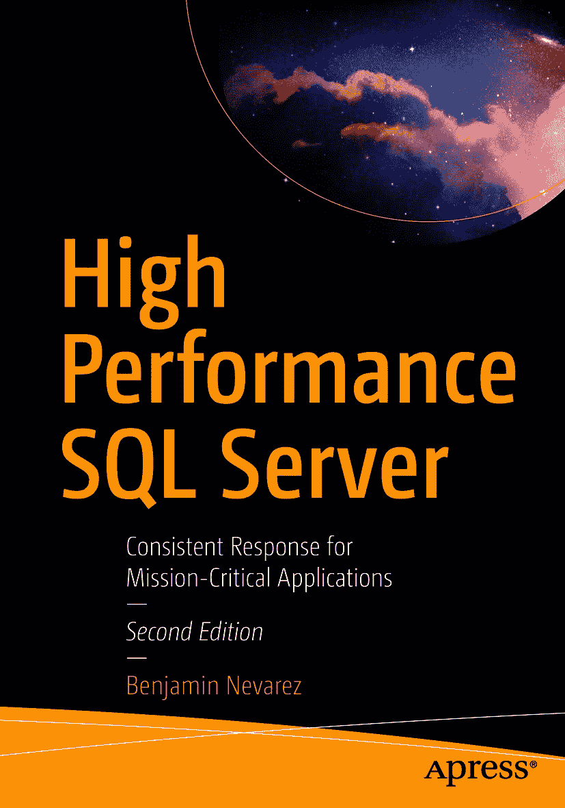

ISBN 978-1-4842-6490-4 e-ISBN 978-1-4842-6491-1 [`doi.org/10.1007/978-1-4842-6491-1`](https://doi.org/10.1007/978-1-4842-6491-1) © Benjamin Nevarez 2021
本书受版权保护。出版者保留所有权利，无论涉及材料的全部或部分，具体包括翻译权、重印权、图表的再利用、朗诵、广播、缩微胶片或其他任何物理方式的复制，以及信息存储与检索、电子改编、计算机软件，或使用目前已知或今后开发的类似或不同方法进行传播的权利。在本出版物中使用通用描述性名称、注册商标、服务标志等，即使未作特别声明，也不意味着这些名称不受相关保护性法律法规的约束，因而可自由通用。出版者、作者和编辑可以安全地认为本书中的建议和信息在出版时是真实准确的。出版者、作者或编辑均不对本材料所含内容或任何可能存在的错误或遗漏作任何明示或暗示的保证。对于出版地图中的管辖权主张和机构从属关系，出版者保持中立。本书由 Springer Science+Business Media LLC 全球发行至图书贸易市场，地址：1 New York Plaza, Suite 4600, New York, NY 10004。电话 1-800-SPRINGER，传真 (201) 348-4505，电子邮件 orders-ny@springer-sbm.com，或访问 www.springeronline.com。Apress Media, LLC 是一家加利福尼亚州有限责任公司，其唯一成员（所有者）是 Springer Science + Business Media Finance Inc (SSBM Finance Inc)。SSBM Finance Inc 是一家特拉华州公司。

*本书献给我的母亲，瓜达卢佩·查韦斯*

### 引言

多年来，我一直通过博客和演讲分享关于查询调优和优化的内容。我甚至还写过几本关于这个主题的书：*Inside the SQL Server Query Optimizer* 和 *Microsoft SQL Server 2014 Query Tuning & Optimization*。查询调优和优化对于数据库和应用程序的性能极其重要。

同等重要的是，从一开始就拥有一个精心设计和配置的系统。`SQL Server` 的默认配置对于某些应用程序可能适用，但关键任务和高性能应用程序则需要深思熟虑的设计和配置。如果系统配置不当，编写良好且经过调优的查询也无法发挥其光彩。例如，如果未正确配置最大并行度设置，查询将无法以最优方式使用处理器资源。如果数据库使用默认的文件自动增长设置，或者存储未得到妥善配置，数据库性能将受到影响。配置不当的 `tempdb` 数据库在许多繁忙系统上可能会出现争用。即使是查询优化器，面对糟糕的数据库设计或编写不当的查询时也会举步维艰。这些仅仅是实际生产系统中存在的一些常见配置问题。

此外，即使一个设计精良的应用程序上线投产，性能调优工作也并未结束。监控和故障排除是应用程序和数据库生命周期中极其重要的部分，因为性能问题最终总会出现。工作负载可能会发生变化，希望是向好的方向（例如，应用程序需要处理业务交易意外增长的情况）。有时，这些变化将需要重新设计、修改，甚至可能引入新的配置。

因此，这实际上是一个迭代过程，包括设计和配置，然后是实施、监控和故障排除，而这又可能导致新的设计或配置、监控等等。此外，收集性能数据、创建基线并执行趋势分析是生产实施的重要组成部分，不仅是为了排查问题，也是为了预见潜在问题或了解未来的增长和附加需求。主动估算和跟踪这些变化至关重要，而不是等到系统突然难以应对变化的工作负载时才恍然大悟，或者更糟，面临本可避免的停机。有多种工具可帮助完成此过程，包括 `SQL Server 2016` 引入的 `Query Store`。

我日常工作的一个重要部分就是处理所有这些事项，因此我决定写一本关于它们的书。我想涵盖你关于 `SQL Server` 性能所需了解的一切，而不需要你必须懂得查询调优、研究执行计划或“对抗”查询优化器。有许多领域需要涵盖，而且随着 `SQL Server` 上出现新的功能和技术，如 `In-Memory OLTP`、`columnstore indexes` 以及前述的 `Query Store`，更多的领域还在不断增加。

本书涵盖了目前所有受支持的 `SQL Server` 版本，并主要侧重于 `SQL Server 2019`。尽管从实践角度来看这是一本关于性能的书，但理解 `SQL Server` 内部机制也非常重要。排查问题的最佳方式是了解其工作原理和问题发生的原因。因此，在必要时，我会重点阐述数据库引擎的内部机制。

最后，本书是我关于查询调优和优化著作的补充。如果你是一名数据库开发人员或关心查询性能的 `SQL Server` 专业人士，阅读这两本书都会让你受益。如果你是一名数据库管理员、数据库架构师或系统管理员，并且希望在不进行查询调优的情况下提升系统性能，那么只阅读本书即可。

既然我提到实施高性能数据库服务器是一个迭代过程，包括设计和配置，然后是实施、监控和性能故障排除，我决定将本书章节分为四个部分：`SQL Server Internals`、`Design and Configuration`、`Monitoring` 以及 `Performance Tuning and Troubleshooting`。我试图将关于这些领域的章节区分开来，但我确信有些章节可能会涉及多个类别。

如前所述，理解 `SQL Server` 内部机制对于更好地优化系统和排查数据库问题非常重要，因此本书首先解释 `SQL Server` 数据库引擎的工作原理，并涵盖从建立数据库连接到执行查询并将结果返回给客户端这一过程中系统中发生的一切。第 1 章包含诸如 `SQL Server` 使用的 `Tabular Data Stream (TDS)` 和网络协议、`SQLOS` 以及 `SQL Server` 关系引擎执行的工作等主题，重点是查询处理和最常见的查询运算符。在本版中新增的第 2 章，涵盖了 `Linux` 上的 `SQL Server`。从 `SQL Server 2017` 开始，`SQL Server` 现在可在 `Linux` 上使用，也可以在 `Docker` 容器中运行。本章涵盖了 `Linux` 上的 `SQL Server` 架构以及数据库引擎在此操作系统上的工作方式。

## 第 2 部分，设计与配置

第 2 部分包含第 3 章和第 4 章。第 3 章阐述了许多实例级配置设置，这些设置会极大地影响你的 SQL Server 实现的性能。一个有趣的情况是，该章展示了一些最初为解决特定问题而引入的跟踪标志，现在如何被实现为 SQL Server 的配置默认值。

第 4 章涵盖`tempdb`配置，这一点尤其重要，因为该数据库是在 SQL Server 实例上的所有用户数据库和系统数据库之间共享的。该章重点讨论了`tempdb`分配页的闩锁争用以及`tempdb`磁盘溢出问题，即当某些查询处理器操作没有足够内存时发生的性能问题。

## 第 3 部分，监控 SQL Server

第 3 部分专注于监控 SQL Server，涵盖分析等待统计信息和`查询存储`。等待在 SQL Server 实例中无时无刻不在发生。第 5 章介绍了等待性能方法学，该方法可用于排查性能问题，尤其是在其他方法无法精确定位性能问题时。

第 6 章涵盖`查询存储`，这是 SQL Server 2016 引入的一个非常有前景的查询性能功能。`查询存储`可以帮助你收集查询和计划信息及其运行时统计信息，你可以利用这些信息轻松识别与查询性能相关的问题，甚至强制使用现有的执行计划。该章最后提到了一些相关的新功能，如`实时查询统计信息`和`SQL Server Management Studio`计划比较工具。

## 第 4 部分，性能调优与故障排除

第 4 部分，性能调优与故障排除，包含本书剩余的五个章节，涵盖诸如内存中技术、索引、智能查询处理以及磁盘和存储等主题。

内存中技术在第 7 章中介绍，包括`内存 OLTP`和`列存储`索引。这两项功能在其最初发布时都存在严重限制，因此本章涵盖这些技术的工作原理及其当前的改进之处。该章最后介绍了操作分析，该技术结合了上述两种技术，允许在 OLTP 系统中实时执行分析查询。内存中技术有望成为关系数据库技术的未来。

第 8 章展示了主动收集和持久化性能信息对于理解特定系统如何工作、创建基线以及了解性能何时偏离理想或预期行为是多么有益。该章还涵盖了最关键的`性能计数器`、`动态管理对象`和事件，以及一些用于显示和收集此类数据的工具。本章内容无疑与第 3 部分“监控”有重叠。

索引是数据库性能的必备主题，在第 9 章中进行了介绍，该章解释了索引的工作原理以及它们在 OLTP 和数据仓库环境中的重要性。该章强调使用 SQL Server 工具来帮助创建索引，例如`缺失索引功能`和更复杂的`数据库引擎优化顾问`。

本书第二版的另一个新增章节，第 10 章，概述了`智能查询处理`，这是一组随 SQL Server 2017 引入的功能，旨在提升查询性能。`智能查询处理`功能无需更改应用程序，只需很少甚至无需额外工作即可提供性能改进。

最后，第 11 章解释了 SQL Server 存储。磁盘传统上一直是数据库系统中速度最慢的部分，但基于闪存的存储等新技术提供了巨大的性能改进，并且随着其成本持续下降，正逐渐成为事实上的企业标准。该章还指出，存储优化不仅仅是使用尽可能快的磁盘，还要通过实施本书多章中涵盖的方法（如适当的索引或某些查询调优技术）来最小化磁盘的使用。

## 致谢

首先，我要感谢那些直接帮助我撰写本书的人，从 Apress 团队的每个人开始。感谢 Jonathan Gennick，他最初给了我撰写这本书的机会，并鼓励我撰写第二版，尤其是在我们所有人都深陷全球大流行病的困难和不确定时期。感谢协调编辑 Jill Balzano，我几乎每天都与她共事。我还要感谢我的出色技术审稿人 Mark Broadbent，他为本书每一章都提供了反馈，工作非常出色。

我总是同样感谢那些在我所有之前的书籍中间接帮助过我的人——我通过阅读他们的书籍和学术论文学习这项技术的人，包括 Kalen Delaney、Michael Stonebraker、Goetz Graefe、Ken Henderson 和 Sunil Agarwal，仅举几例。同样感谢 SQL Server 社区中的人们，我也从他们那里学到了很多。一长串的名字不可能在此一一列出。

最后，感谢我的家人，我的儿子们 Diego、Benjamin 和 David，以及我的妻子 Rocio。再次感谢你们所有人在我进行又一次写作冒险的许多个夜晚和周末所给予的支持和耐心。

## 关于作者 关于技术审稿人

## 第一部分：SQL Server 内部原理

