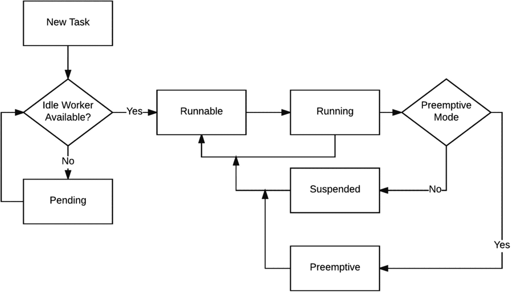
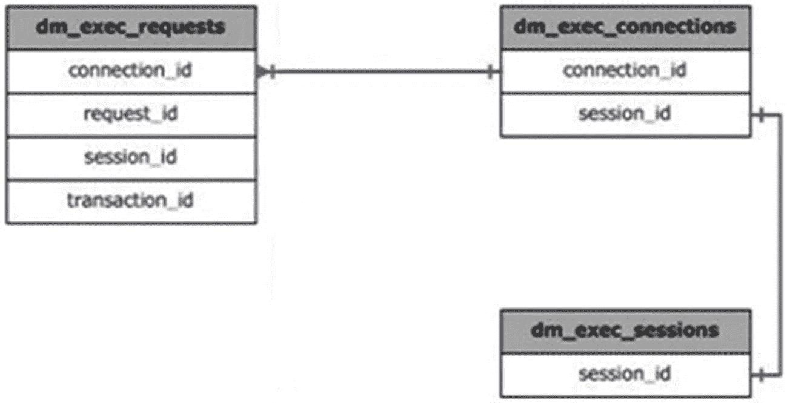
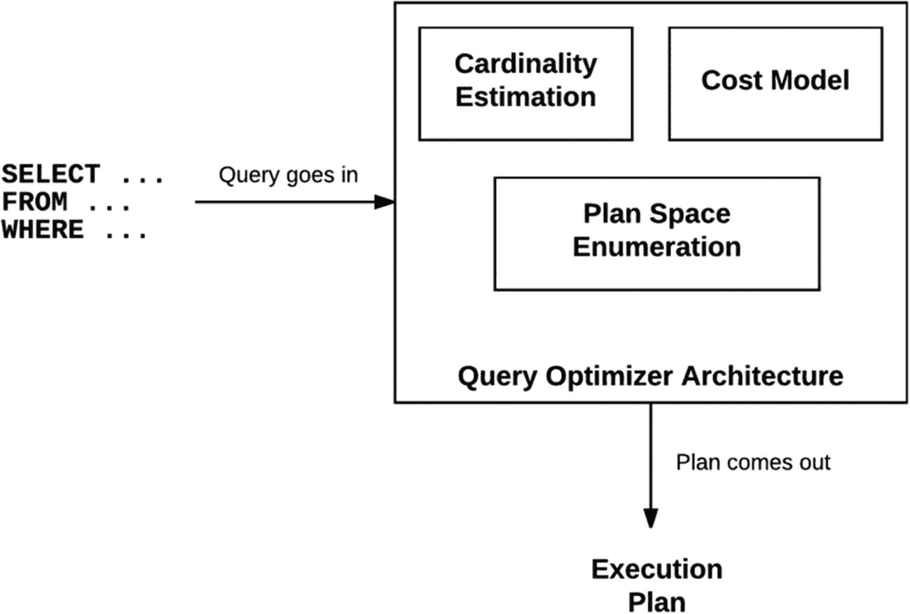
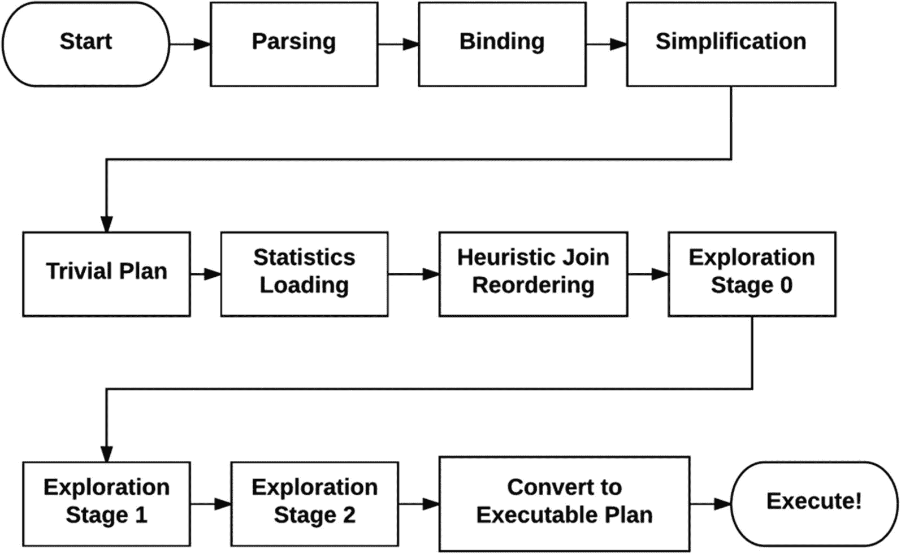
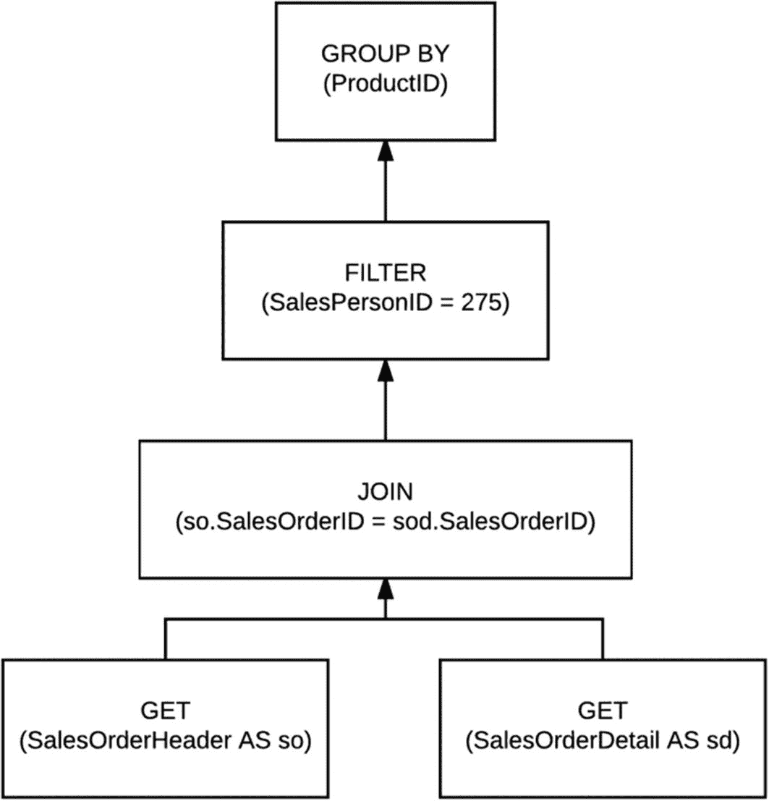
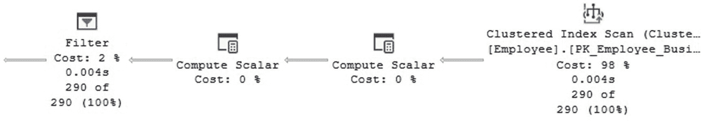
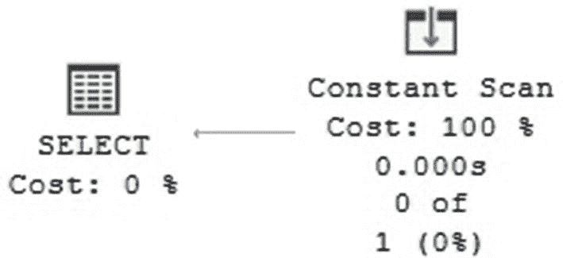
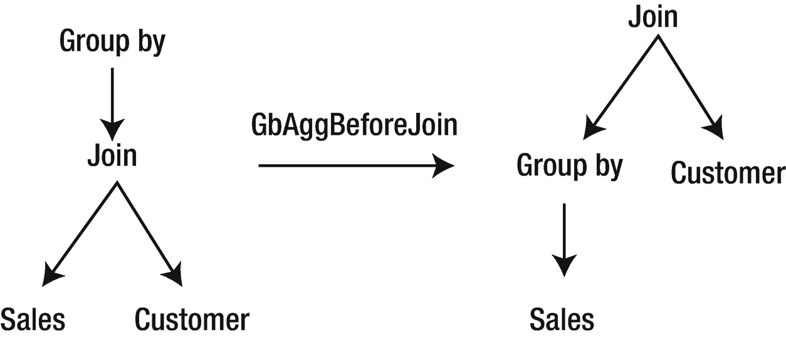
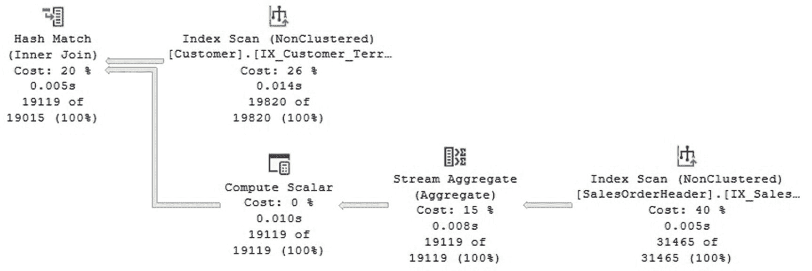

# 1. SQL Server 工作原理

SQL Server 的默认配置允许你在知识或管理精力投入较少的情况下运行非关键应用程序。对于运行该产品较低**库存单位（SKU）**（如 SQL Server Express 版本）的应用程序尤其如此。然而，对于大多数生产应用程序，你需要遵循一个包含四个步骤的数据库实施周期：设计、配置、监控和故障排除。这对于**任务关键型应用程序**至关重要，在这些场景中，性能、可用性或安全性等领域是基本要求。我想强调的是，这同时也是一个循环。一旦这四个步骤成功完成且应用程序上线，事情并不会就此结束。监控至关重要。随着工作负载、数据库或应用程序的变化——甚至在常规活动期间——问题将会出现，这可能需要重新进行思考、设计和配置，再次回到前面提到的循环中。本书重点关注性能，将引导你了解所有这四个领域，为你提供从数据库中获取最佳性能所需的工具和知识。

在深入这四个领域之前，本介绍章节将阐释 SQL Server 数据库引擎的工作原理，并涵盖从客户端通过网络协议使用表格数据流（TDS）协议建立连接开始，到查询执行完毕并将结果返回给客户端期间，系统中发生的所有事情。尽管在此过程中可能发生很多事情，并且可能需要一整本书来涵盖，但我将重点放在 `SQLOS`、关系引擎（由查询优化器和执行引擎组成）以及其他重要的性能相关因素（如内存授予、锁和闩锁）所执行的工作上。本章内容是本书其余部分的基础。

本书不明确涵盖查询调优和优化，因此你无需是高级查询编写者或理解执行计划也能使用它。本书可以帮助数据库管理员、架构师和数据库开发人员更好地理解 SQL Server 的工作原理以及如何解决性能问题。有关查询调优和优化的信息，你可以参考我的书 *Microsoft SQL Server 2014 查询调优与优化*（McGraw-Hill Education，2015）。

## TDS/网络协议

SQL Server 是一个客户端-服务器平台，客户端通常通过网络协议使用表格数据流（TDS）协议与数据库服务器建立长连接。`TDS` 是一种应用层协议，用于促进客户端与 SQL Server 之间的交互。它最初由 Sybase Inc. 于 1984 年为其 Sybase SQL Server 关系数据库引擎设计和开发，后来成为了 Microsoft 的产品。尽管 `TDS` 规范没有定义特定的网络传输协议，但当前版本的 `TDS` 已在 `TCP/IP` 和 `命名管道` 网络传输协议上实现。虚拟接口架构（`VIA`）网络协议已被弃用，但在旧版本 SQL Server 中仍可用。它最终在 SQL Server 2016 中被移除。

**注意**
你也可以使用 `共享内存` 协议连接到 SQL Server 实例，但它只能用于从运行数据库引擎的同一台计算机连接；无法用于从网络上的其他计算机访问。

`TDS` 提供多种功能，包括身份验证和标识、通道加密协商、SQL 请求和批量插入操作的规范、存储过程或用户定义函数的调用以及数据返回。开放数据库连接（`ODBC`）、Java 数据库连接（`JDBC`）和对象链接与嵌入数据库（`OLE DB`）是使用 `TDS` 在客户端和 SQL Server 之间传输数据的库。客户端和 SQL Server 之间的 `TDS` 请求和响应可以通过使用不同的网络协议分析工具（如 `Wireshark`）来检查。另一个流行工具 Microsoft 消息分析器（`MMA`）已于 2019 年 11 月退役。

SQL Server 客户端在与数据库服务器通信时，可以使用 `TDS` 执行以下类型的请求：

*   SQL 批处理：发送一条 SQL 语句或一批 SQL 语句
*   远程过程调用：发送一个包含存储过程或用户定义函数名称、选项和参数的远程过程调用
*   批量加载：发送用于批量插入/批量加载操作的 SQL 语句

请注意，存储过程或用户定义函数名称可以通过远程过程调用或 SQL 批处理来请求。有关 `TDS` 的更多详细信息，你可以在 [`https://msdn.microsoft.com/en-us/library/dd304523.aspx`](https://msdn.microsoft.com/en-us/library/dd304523.aspx) 找到 `TDS` 规范。

`TCP/IP` 是迄今为止 SQL Server 实现中最常用的协议。数据库引擎使用的默认 `TCP/IP` 端口是 `1433`，尽管可以配置其他端口，并且在某些情况下是必需的，例如在同一服务器上运行多个实例时。其他一些服务可能使用不同的端口。例如，SQL Server Browser 服务启动并声明 UDP 端口 `1434`。当 SQL Server 数据库引擎使用不同于默认值的 `TCP/IP` 端口时，必须在客户端的连接字符串中指定端口号，或者，如果已启用，也可以通过 SQL Server Browser 服务来解析。当配置了 `命名管道` 协议时，会使用默认管道 `\sql\query`。

客户端可以使用以下应用程序接口（API）或库连接到 SQL Server 实例：

*   `ODBC`：`ODBC`（开放数据库连接）是一种基于调用级接口（`CLI`）规范的开放式标准 API，最初由 Microsoft 在 20 世纪 90 年代初开发。`ODBC` 已成为关系型和非关系型数据库管理系统中数据访问的事实标准。
*   `OLE DB`：`OLE DB`（对象链接与嵌入数据库）是 Microsoft 设计的一种 API，不仅用于访问基于 SQL 的数据库，还用于以统一方式访问其他一些不同的数据源。尽管 `OLE DB` 最初旨在作为 `ODBC` 的高级替代品和继承者，但 `ODBC` 仍然是使用最广泛的数据库访问标准。
*   `JDBC`：`JDBC`（Java 数据库连接）是 Sun Microsystems 开发的一种 API，定义了客户端如何从 Java 编程语言访问关系数据库。`JDBC` 是 Java 标准版平台的一部分，该平台现已被 Oracle 公司收购。
*   `ADO.NET`：`ADO.NET`（用于 .NET 的 ActiveX 数据对象）是一组公开数据访问服务的类，是 Microsoft .NET 框架不可或缺的一部分。`ADO.NET` 通常用于访问存储在关系数据库系统中的数据，但它也可以访问非关系数据源。

## 工作执行方式

既然我们已经了解了客户端如何连接到数据库服务器，现在可以回顾接下来发生的事情，看看客户端请求的工作是如何执行的。在 SQL Server 中，每个用户请求都是一个操作系统线程，当客户端连接时，它会被分配给一个特定的调度器。调度器在 `SQLOS` 级别处理，该级别也处理任务和工作线程等其他功能。向上提升一个级别，我们有连接、会话和请求。让我们首先介绍 `SQLOS`，然后回顾调度器、任务和工作线程。


## SQLOS

SQLOS 是 SQL Server 的**应用层**，负责管理所有操作系统资源，包括管理非抢占式调度、内存和缓冲区管理、I/O 函数、资源调控、异常处理和扩展事件。SQLOS 代表其他数据库引擎层向操作系统发起调用来执行这些功能，或者在调度等情况下，提供针对 SQL Server 特定需求优化的服务。

SQL Server 调度器是在 SQL Server 7 中引入的，因为在此之前，它依赖于 Windows 调度设施。这里的主要问题是，为什么需要 SQLOS 或数据库引擎来替代可用的操作系统服务。操作系统服务是通用服务，有时并不适合数据库引擎的需求，因为它们扩展性不佳。与其为任何进程使用通用调度设施，不如优化调度并使其适应 SQL Server 的特定需求。两者之间的主要区别在于，Windows 调度器是抢占式调度器，而 SQL Server 是协作式调度器或非抢占式调度器。这提高了可扩展性，因为让线程自愿让出（CPU）比让 Windows 内核介入以防止单个线程独占处理器更有效率。

> **注意**
>
> 在 *Operating System Support for Database Management* 一文中，Michael Stonebraker 探讨了若干操作系统服务是否适用于支持数据库管理功能，如调度、进程管理、进程间通信、缓冲池管理、一致性控制和文件系统服务。您可以在 [`www.csd.uoc.gr/~hy460/pdf/stonebreaker222.pdf`](http://www.csd.uoc.gr/%257Ehy460/pdf/stonebreaker222.pdf) 在线找到此出版物。

### 调度器

调度器负责调度任务，并映射到系统中的单个逻辑处理器。它们通过允许线程暴露给单个处理器、接受新任务并将其交给工作线程来执行，以此管理线程调度（工作线程稍后会有更详细的描述）。在任何给定时间，只有一个工作线程可以暴露给单个逻辑处理器，因此，在这样一个处理器上只有一个任务可以执行。

执行用户请求的调度器，其 ID 号小于 1048576，您可以使用 `sys.dm_os_schedulers` DMV（动态管理视图）来显示其运行时信息。SQL Server 启动时，调度器的数量将与实例可用的逻辑处理器数量相同。例如，如果您的系统分配给 SQL Server 有 16 个逻辑处理器，`sys.dm_os_schedulers` 可以显示从 0 到 15 的 `scheduler_id` 值。ID 大于或等于 1048576 的调度器由 SQL Server 内部使用，例如专用管理员连接调度器，其 ID 始终为 1048576。（在 SQL Server 2008 及更早版本中是 255。）这些通常被称为隐藏调度器，顾名思义，用于处理内部工作。除非处理器关联掩码配置为这样做，否则调度器不会在特定处理器上运行。

`sys.dm_os_sys_info` DMV 的 `max_workers_count` 列显示可以创建的最大工作线程数，而 `sys.dm_os_schedulers` 的 `active_worker_count` 列显示在任何给定时间处于活动状态的工作线程数。如果您监控这个值，就可以找出您的 SQL Server 实例实际使用的最大工作线程数。例如，在我的测试系统上（有 16 个逻辑处理器）运行以下查询，显示了最大 512 个工作线程，但在执行查询时只有 32 个处于活动状态：

```sql
SELECT max_workers_count FROM sys.dm_os_sys_info
SELECT SUM(active_workers_count) FROM sys.dm_os_schedulers
```

任务是一个执行请求，代表需要完成的工作；而工作线程映射到操作系统线程（当使用默认的线程模式时），或者如果使用了 Windows 纤程（轻型池）配置选项，则映射到 Windows 纤程。图 1-1 展示了任务执行过程。



图 1-1 任务执行过程

如前所述，在 SQL Server 中，调度器以非抢占模式运行，这意味着任务会周期性地自愿释放控制权，并会运行到其允许的时间配额用完，或者直到在同步对象上被挂起为止（时间配额或时间片是允许进程运行的时间段）。在此模型下，线程必须在常见的点自愿让出给另一个线程，而不是被 Windows 操作系统随机地上下文切换出去。SQL Server 代码的编写方式是，它会在必要时并在适当的位置进行让出，以提供更好的系统可扩展性。

图 1-1 显示任务也可以在抢占模式下运行，但这只会在任务运行 SQL Server 域之外的代码时发生，例如执行扩展存储过程、分布式查询或其他一些外部代码。在这种情况下，由于代码不受 SQL Server 控制，工作线程会切换到抢占模式，任务将在此模式下运行，因为它不受调度器控制。您可以通过查看 `sys.dm_os_workers` DMV 的 `is_preemptive` 列来识别工作线程是否在抢占模式下运行。

如前所述，SQL Server 默认以线程模式运行。另一种选择是在 Windows 纤程模式下运行。很少推荐在 Windows 纤程模式下运行 SQL Server，因为它仅适用于工作线程的上下文切换是性能关键瓶颈的某些情况。此外，在轻型池下不支持公共语言运行时 (CLR) 执行。可以使用 `lightweight pooling` 服务器配置选项（默认值为 0）来启用 Windows 纤程模式，例如运行以下语句：

```sql
EXEC sp_configure 'lightweight pooling', 1
```

`lightweight pooling` 选项是一个高级配置选项。如果您使用 `sp_configure` 系统存储过程来更新设置，则只能在 `show advanced options` 设置为 1 时更改 `lightweight pooling`。设置在服务器重启后生效。当然，如果您在测试环境中尝试此操作，别忘了在继续之前将其设置回 0。查看 `sys.dm_os_workers` DMV 的 `is_fiber` 列将显示工作线程是否正在使用轻型池运行。


### 工作线程

如果使用了并行处理，一个请求也可以使用多个工作线程或线程。动态管理视图 `sys.dm_os_tasks` 的 `task_state` 列显示任务的状态，其文档记录的定义如下：

*   PENDING：等待工作线程

*   RUNNABLE：可运行，但等待接收时间片

*   RUNNING：当前正在调度器上运行

*   SUSPENDED：拥有工作线程，但正在等待某个事件

*   DONE：已完成

*   SPINLOOP：陷入自旋锁

同样，你可以使用 `sys.dm_os_waiting_tasks` 找到有关等待某些资源的任务的附加信息。我们将在第 5 章详细讨论等待。

`max worker threads` 配置选项的默认值为 `0`，这使得 SQL Server 可以在启动时自动配置工作线程的数量，具体数量取决于 CPU 的数量以及 SQL Server 是在 32 位还是 64 位体系结构上运行，如表 1-1 所示。

**表 1-1** 最大工作线程数默认配置

| 处理器数量 | 32 位体系结构 (最高至 SQL Server 2014) | 64 位体系结构 (最高至 SQL Server 2016 SP1) | 64 位体系结构 (从 SQL Server 2016 SP2 开始) |
| --- | --- | --- | --- |
| 4 个或更少处理器 | 256 | 512 | 512 |
| 8 个处理器 | 288 | 576 | 576 |
| 16 个处理器 | 352 | 704 | 704 |
| 32 个处理器 | 480 | 960 | 960 |
| 64 个处理器 | 736 | 1472 | 2432 |
| 128 个处理器 | 1248 | 2496 | 4480 |
| 256 个处理器 | 2272 | 4544 | 8576 |

> **注意**
> 从 SQL Server 2016 开始，数据库引擎不再提供 32 位体系结构版本。

工作线程以按需方式创建，直到达到配置的 `max worker threads` 值（根据默认配置，表 1-1 显示的值），尽管该值没有考虑系统任务所需的线程。如前所述，动态管理视图 `sys.dm_os_sys_info` 上的 `max_workers_count` 列将显示可以创建的最大工作线程数。

当工作线程闲置超过 15 分钟或出现内存压力时，调度器会将工作线程池缩减到最小大小。出于负载均衡的目的，调度器有一个关联的负载因子，用于指示其感知到的负载，并用于确定放置此任务的最佳调度器。当任务分配给调度器时，负载因子会增加。当任务完成时，负载因子会减少。该值可以在动态管理视图 `sys.dm_os_schedulers` 的 `load_factor` 列中看到。

最后，SQLOS 还有一个调度器监视器，它是一个持续运行的任务，其功能是监视调度器的运行状况。它包括多项功能，例如确保任务定期让出（yield）、确保分配给进程的新查询能被工作线程拾取、确保 I/O 完成能在合理时间内得到处理，以及确保工作线程在所有调度器之间均衡分配。这些问题中的任何一个都可能导致 SQL Server 错误 `17883`、`17884` 和 `17887`。调度器监视器还使用环形缓冲区维护运行状况记录，其中包含进程和内存利用率信息，可以从动态管理视图 `sys.dm_os_ring_buffers` 中检查，如下所示。

```sql
SELECT timestamp, CONVERT(xml, record) AS record
FROM sys.dm_os_ring_buffers
WHERE ring_buffer_type = 'RING_BUFFER_SCHEDULER_MONITOR'
```

> **注意**
> 环形缓冲区是一种固定大小的循环数据结构。

一个返回示例：

```xml
<Record>
  <SchedulerMonitorEvent>
    <SystemIdle>12</SystemIdle>
    <ProcessUtilization>4</ProcessUtilization>
    <MemoryUtilization>98</MemoryUtilization>
    ...
  </SchedulerMonitorEvent>
</Record>
```

了解了调度器、任务和工作线程后，让我们上升到一个更高的层面，讨论连接、会话和请求。

你可以使用动态管理视图 `sys.dm_exec_connections` 查看到数据库服务器的物理连接。一些有趣的信息可以在 `net_transport` 列中找到，它显示此连接使用的物理传输协议，例如 `TCP`、`Shared Memory` 或 `Session`（当连接启用了多个活动结果集，即 MARS 时）；`protocol_type` 列是自解释的，其值可能为 `TSQL`、`Service Broker` 或 `SOAP`；以及其他一些重要信息，例如连接到数据库服务器的客户端的网络地址以及用于 TCP/IP 连接的客户端计算机上的端口号。连接和会话之间是一对一映射关系，如图 1-2 所示。

> **注意**
> 调度器、工作线程和任务是 SQLOS 级别的对象，因此包含在与 SQL Server 操作系统相关的 DMV 中，而连接、会话和请求则包含在与执行相关的 DMV 组中。

会话信息使用 `sys.dm_exec_sessions` 显示，其中包含一些有助于排查性能问题的重要信息，例如会话的状态、某些 SET 选项的会话值，或会话使用的事务隔离级别。`status` 列的可能文档记录值如下：

*   `Running`：当前正在运行一个或多个请求。

*   `Sleeping`：已连接但当前未运行任何请求。

*   `Dormant`：由于连接池，会话已被重置，现在处于预登录状态。

*   `Preconnect`：会话处于资源调控器分类器中。

最后，`sys.dm_exec_requests` 是客户端在执行引擎级别发出的查询请求的逻辑表示。它提供了大量丰富的信息，包括请求的状态（可以是 `Background`、`Running`、`Runnable`、`Sleeping` 或 `Suspended`）、SQL 文本和执行计划的哈希映射（分别为 `sql_handle` 和 `plan_handle`）、等待信息以及为查询执行分配的内存。它还提供了大量丰富的性能信息，例如以毫秒为单位的 CPU 时间、自请求到达以来经过的总毫秒数、读取次数、写入次数、逻辑读取次数以及此请求已返回给客户端的行数。

> **注意**
> 自 SQL Server 2016 起可用的动态管理视图 `sys.dm_exec_session_wait_stats` 允许你在会话级别收集等待信息。有关此 DMV 的更多详细信息将在第 5 章中提供。



**图 1-2** 与执行相关的 DMV 映射

### Linux 上的 SQL Server

如你可能知道的，从 2017 版本开始，SQL Server 现在可以在 Linux 上运行，更具体地说，可以在 Red Hat Enterprise Linux、SUSE Linux Enterprise Server 和 Ubuntu 上运行。此外，SQL Server 可以在 Docker 上运行。Docker 本身可以在多个平台上运行，这意味着可以在 Linux、Mac 或 Windows 上运行 SQL Server Docker 镜像。

尽管创建 SQLOS 是为了消除或抽象掉操作系统差异，但其最初目标并非提供平台独立性或可移植性，或帮助将数据库引擎移植到其他平台。但即使 SQLOS 没有提供将 SQL Server 移植到另一个操作系统所需的抽象功能，它在 Linux 版本上仍然扮演着非常重要的角色。

Linux 上的 SQL Server 不是原生的 Linux 应用程序，而是使用了 Drawbridge 应用程序沙盒技术。这意味着 Drawbridge 提供了所需的抽象功能。Linux 上的 SQL Server 是 SQLOS 和 Drawbridge 这两种技术结合的产物，也是后来被称为 SQLPAL 的新平台抽象层的诞生。Linux 上的 SQL Server 如何工作将在第 2 章中更详细地解释。

## 查询优化

我们已经了解了当请求提交到 SQL Server 后，调度器和工作线程如何执行任务。在空闲的工作线程拾取一个待处理任务后，提交的查询在执行之前需要先进行编译和优化。为了理解查询是如何执行的，我们现在从 SQLOS 的世界切换到关系引擎（也称为查询处理器）所执行的工作。关系引擎包含两个主要组件：查询优化器和执行引擎。查询优化器的工作是使用数据库引擎提供的算法为查询组装一个高效的执行计划。计划创建后，将由执行引擎执行。

查询处理器需要对查询执行的第一个操作是解析和绑定，这由一个称为 `algebrizer` 的组件完成。查询处理器执行的下一步是查询优化过程。如图 1-3 所示，查询优化过程基本上是对候选执行计划的枚举，并根据它们的成本（使用基数估计和成本估计）从中选择最优的计划。SQL Server 查询优化器是一个基于成本的优化器，虽然它使用规则来探索搜索空间，但它依赖于一个成本估计模型来估计每个候选计划的成本并选择最高效的一个。


**图 1-3** 查询优化器架构

关系引擎实现了许多物理操作，这些操作由查询优化器选择以组装执行计划。因此，简单来说，查询优化可以看作是将初始树表示中表达的原始逻辑操作映射到执行引擎实现的物理操作的过程。显然，这不是一对一的运算符匹配，而是一个更复杂的过程。逻辑操作和物理操作都可以在执行计划的每个运算符上看到。例如，一个逻辑聚合操作必须映射到一个物理流聚合或一个哈希聚合。另一方面，一个逻辑连接可以映射到嵌套循环连接、合并连接或哈希连接物理运算符。


**图 1-4** SQL Server 查询处理过程

查询处理过程遵循多个步骤，如图 1-4 所示，尽管主要的优化过程是在最后通过最多三个探索阶段执行的。这是使用转换规则生成候选计划并估计基数和成本的部分。优化过程不必执行所有三个探索阶段，只要找到一个良好的执行计划，就可以在任何一个阶段停止。

除了此时已转换为逻辑操作树的查询文本以及与查询直接相关的对象的元数据外，查询优化器还将从其他对象（如约束、索引等）以及优化器统计信息中收集额外信息。

如前图 1-4 所示，理论上，为了找到查询的最佳执行计划，一个基于成本的查询优化器应该生成搜索空间中存在的所有可能的执行计划，并正确估计每个计划的成本。这些操作中的每一个都非常复杂，这就是为什么查询优化（使用算法术语）被认为是一个 NP-hard 问题。因此，查询优化器不可能对所有可能的计划进行穷举搜索，因为一些复杂的查询可能有成千上万甚至数百万个可能的解决方案。例如，仅考虑查询中的连接顺序，根据要连接的表的数量，可能的解决方案数量可以计算为

```
(2n – 2)!/(n – 1)!
```

其中两个感叹号 (`!`) 符号代表数学上的阶乘运算。表 1-2 显示了从 2 个表到 12 个表的查询可能解决方案数量的示例，使用了两种典型的连接形状。

**表 1-2** 左深树和丛生树的连接顺序

| 表数 | 左深树 | 丛生树 |
| --- | --- | --- |
| 2 | 2 | 2 |
| 3 | 6 | 12 |
| 4 | 24 | 120 |
| 5 | 120 | 1,680 |
| 6 | 720 | 30,240 |
| 7 | 5,040 | 665,280 |
| 8 | 40,320 | 17,297,280 |
| 9 | 362,880 | 518,918,400 |
| 10 | 3,628,800 | 17,643,225,600 |
| 11 | 39,916,800 | 670,442,572,800 |
| 12 | 479,001,600 | 28,158,588,057,600 |

**注意**
像 `left-deep`、`right-deep` 和 `bushy trees` 这样的名称通常用于标识逻辑树中连接顺序的形状。`Left-deep` 树也称为线性树或线性处理树。`Bushy trees` 的集合包含了 `left-deep` 和 `right-deep` 树的集合。更多细节，您可以查看我的博文：[`www.benjaminnevarez.com/2010/06/optimizing-join-orders/`](http://www.benjaminnevarez.com/2010/06/optimizing-join-orders/)。

为了探索搜索空间，需要一个计划枚举算法来探索语义上等价的计划。等价候选解决方案的生成由查询优化器使用转换规则完成。查询优化器也使用启发式方法来限制考虑的选择数量，以保持优化时间合理。查询优化器考虑的替代计划集合被称为搜索空间，并在优化过程中存储在一个称为 `memo` 的组件中。

枚举候选计划后，查询优化器需要估计这些计划的成本，以便可以选择最优的、成本最低的计划。查询优化器使用考虑资源使用（如 I/O、CPU 和内存）的成本公式来估计 `memo` 结构中每个物理操作符的成本，尽管稍后在查询计划中只能看到 CPU 和 I/O 成本的报告。计划中所有操作符的成本之和就是查询的成本。成本估计是按操作符进行的，取决于物理操作符使用的算法以及需要处理的记录的估计数量。这个记录数量的估计被称为基数估计。


基数估计使用一种数学模型，该模型依赖于统计信息以及基于简化假设（如均匀性、独立性、包含性和包含性——这些假设对于 SQL Server 2014 引入的新基数估计器仍然成立）进行的计算。统计信息包含描述表中一个或多个列值分布的信息，由直方图、全局计算的密度信息以及可选的特殊字符串统计信息（也称为 `tries`）组成。基础表的基数可以直接使用统计信息获取，但大多数其他基数的估计——例如，过滤器或连接的中间结果——必须使用预定义的模型和公式来计算。然而，该模型并未涵盖所有可能的情况，有时如前所述，会使用假设。默认情况下，统计信息由 SQL Server 自动创建和更新，管理员也有多种选择来管理它们。

注意

关于 SQL Server 查询优化器内部行为的大多数信息，可以使用未公开的语句和跟踪标志来检查，尽管这些不受 Microsoft 支持，也不打算在生产系统中使用。我们将在本章后续部分介绍其中一些内容。

由于本章的重点是理解 SQL Server 的工作原理，在介绍之后，现在让我们更详细地回顾查询优化过程，从解析和绑定开始。

### 解析与绑定

如前所述，解析和绑定是提交查询执行时执行的第一个操作。解析检查查询的语法是否正确，包括关键字的正确使用和拼写，并将其信息转换为代表查询逻辑操作符的关系代数树。

绑定过程检查查询中引用的表、列和任何其他元素是否存在，将逻辑树上的每个对象与系统目录中的相应对象关联起来。此过程也称为名称解析。绑定还会验证请求的查询对象之间的操作是否有效，以及这些对象对运行查询的用户是否可见（即用户是否具有所需的权限）。绑定操作后的结果树随后被发送给查询优化器。例如，以下查询的树表示如图 1-5 所示，该图显示了数据访问、连接、过滤和聚合操作：

```
SELECT ProductID, COUNT(*)
FROM Sales.SalesOrderHeader so JOIN Sales.SalesOrderDetail sod
ON so.SalesOrderID = sod.SalesOrderID
WHERE SalesPersonID = 275
GROUP BY ProductID
```

注意

本书中的大多数示例使用的是 AdventureWorks 数据库，您可以从 [`https://docs.microsoft.com/zh-cn/sql/samples/adventureworks-install-configure`](https://docs.microsoft.com/zh-cn/sql/samples/adventureworks-install-configure) 下载。请下载 `AdventureWorks2017.bak` 和 `AdventureWorksDW2017.bak` 备份文件，它们分别是 OLTP（在线事务处理）和数据仓库数据库，并在 SQL Server 中将它们还原为 `AdventureWorks2017` 和 `AdventureWorksDW2017`。本书中的所有代码都在 SQL Server 2019 中测试过，因此您还需要确保将这些数据库的兼容级别更改为 150。



图 1-5
查询树表示

视图的名称解析还包括视图替换过程，其中视图引用被展开以包含实际的视图定义。如图 1-5 所示的查询树表示，代表了查询执行的逻辑操作，并与查询的原始语法密切相关。这些逻辑操作包括诸如“从 Sales 表获取数据”、“执行内连接”、“执行聚合”等。查询处理器在整个优化过程中将使用不同的树表示，这些树将有不同的名称。

尽管这些逻辑树在文档中没有明确定义，但以下查询将返回这些树表示的名称：

```
SELECT * FROM sys.dm_xe_map_values
WHERE name = 'query_optimizer_tree_id'
```

以下是在 SQL Server 2019 累积更新 4 上执行此查询的输出。我系统中的 `@@VERSION` 函数还返回 `Microsoft SQL Server 2019 (RTM-CU4) (KB4548597) - 15.0.4033.1 (X64)`，其中 `KB4548597` 是描述该累积更新的知识库文章，`15.0.4033.1` 是产品版本。从 SQL Server 2017 开始，不再提供服务包，新的服务模式将基于累积更新（以及需要时的一般分发版本，或 GDRs），并且仅发布 CU。


**注意：** 累积更新旨在最初版本（称为 RTM 或 Release to Manufacturing）发布后更频繁地发布，然后在这种新服务模型中减少频率。在完整的 5 年主流生命周期的前 12 个月中，每月将提供一次累积更新，然后在剩余的 4 年中每 2 个月提供一次。有关此新服务模型的更多详细信息，您可以查看 [`https://techcommunity.microsoft.com/t5/sql-server/announcing-the-modern-servicing-model-for-sql-server/ba-p/385594`](https://techcommunity.microsoft.com/t5/sql-server/announcing-the-modern-servicing-model-for-sql-server/ba-p/385594)（或搜索“Announcing the Modern Servicing Model for SQL Server”）。

以下是查询结果。

| map_key | map_value |
| --- | --- |
| 0 | CONVERTED_TREE |
| 1 | INPUT_TREE |
| 2 | SIMPLIFIED_TREE |
| 3 | JOIN_COLLAPSED_TREE |
| 4 | TREE_BEFORE_PROJECT_NORM |
| 5 | TREE_AFTER_PROJECT_NORM |
| 6 | OUTPUT_TREE |
| 7 | TREE_COPIED_OUT |

有几个未文档化的跟踪标志（`8605`、`8606` 和 `8607`），它们可以允许您检查那些内部树的内容，尽管信息将以文本形式打印，不如图形执行计划那样直观。此外，该树将显示关系代数运算，这些运算可能与我们在查询计划上看到的逻辑和物理运算不太相似。接下来是一个使用跟踪标志 `8605` 显示 SQL Server 创建的查询初始树表示的示例。

```
DBCC TRACEON(3604)
SELECT DatabaseLogID
FROM dbo.DatabaseLog
WHERE DatabaseLogID = 1
OPTION (RECOMPILE, QUERYTRACEON 8605)
```

在这种情况下，`QUERYTRACEON` 是一个查询提示，允许您在查询级别启用影响计划的跟踪标志。如我们所知，跟踪标志是一种众所周知的机制，用于设置特定的服务器特性或更改 SQL Server 中的特定行为。

**注意：** `QUERYTRACEON` 查询提示多年来一直是未文档化且不受支持的，直到最近才得到支持，但仅支持有限数量的可用跟踪标志。您可以通过查看 [`https://docs.microsoft.com/en-us/sql/t-sql/queries/hints-transact-sql-query`](https://docs.microsoft.com/en-us/sql/t-sql/queries/hints-transact-sql-query) 的文档获取有关 `QUERYTRACEON` 支持的跟踪标志的更多信息。

`RECOMPILE` 在此查询中并非严格必需，但它允许您在决定多次运行查询时强制优化。`DBCC TRACEON` 和跟踪标志 `3604` 是必需的，以便将跟踪输出重定向到执行语句的客户端，在本例中是 SQL Server Management Studio。输出将显示在“消息”选项卡上。此示例的输出为

```
*** Converted Tree: ***
LogOp_Project QCOL: [AdventureWorks2017].[dbo].[DatabaseLog].DatabaseLogID
LogOp_Select
LogOp_Get TBL: dbo.DatabaseLog dbo.DatabaseLog TableID=901578250 TableReferenceID=0 IsRow: COL: IsBaseRow1001
ScaOp_Comp x_cmpEq
ScaOp_Identifier QCOL: [AdventureWorks2017].[dbo].[DatabaseLog].DatabaseLogID
ScaOp_Const TI(int,ML=4) XVAR(int,Not Owned,Value=1)
AncOp_PrjList
```

最后，提醒一下，本书（尤其是本章）包含许多未文档化和不受支持的功能及语句。因此，您可以在测试环境中将其用于学习或故障排除目的，但不建议在生产环境中使用。在生产环境中使用它们可能会导致 Microsoft 不再提供支持。当某个语句、功能或跟踪标志是未文档化且不受支持时，我会予以说明。

尽管所列出的关系代数运算完全没有文档化，并且在这种晦涩的文本格式中可能很难阅读，但我们可以识别出查询的三个主要操作（即 SELECT、FROM 和 WHERE 子句）分别对应于关系代数运算 Project 或 `LogOp_Project`、Get 或 `LogOp_Get`、以及 Select 或 `LogOp_Select`。更复杂的是，`LogOp_Select` 运算与 SELECT 子句无关，而更多地与过滤操作或 WHERE 子句相关。`LogOp_Project` 用于指定结果中所需的列。最后，`LogOp_Get` 指定查询中使用的表。

总之，跟踪标志 `8605` 可用于显示 SQL Server 创建的查询初始树表示，跟踪标志 `8606` 将显示优化过程中使用的其他逻辑树（例如，输入树、简化树、连接折叠树、项目规范化前的树或项目规范化后的树），跟踪标志 `8607` 将显示优化输出树。有关这些跟踪标志的更多详细信息，您可以查看我博客中的以下文章：[`www.benjaminnevarez.com/2012/04/more-undocumented-query-optimizer-trace-flags`](http://www.benjaminnevarez.com/2012/04/more-undocumented-query-optimizer-trace-flags)。

在解析和绑定完成后，真正的查询优化过程开始了。查询优化器将获取生成的逻辑树，并从简化过程开始。

### 简化

简化的下一步是查询优化过程，实际上也是查询优化的第一步，由查询优化器执行。一旦查询优化器获得特定查询的最终逻辑树，如前一节所述，它会在进入完整的优化过程之前尝试对其进行简化。其中一些简化操作包括：

1.  **谓词下推**：在这种简化优化中，`WHERE`子句中的过滤器可能会被下推到逻辑查询树中，以便实现早期数据过滤。此过程还可以帮助在完整的优化过程中更好地匹配索引和计算列。
2.  **矛盾检测**：在此步骤中检测并移除矛盾。矛盾可能与检查约束或查询的编写方式有关。通过移除查询中的冗余操作，查询执行得到改进，因为无需将资源花费在不必要的操作上。例如，移除对不需要的表的访问可以节省`I/O`资源。
3.  **子查询简化**：子查询被转换为连接。但是，由于子查询并不总是直接转换为内连接，因此可能会根据需要添加`GROUP BY`和外连接操作。
4.  **冗余连接移除**：可以移除冗余的内连接和外连接。外键连接消除是这种简化的一个例子。当外键约束可用且仅请求引用表的列时，连接可以被移除。

矛盾检测是我在会议演讲中最喜欢展示的主题之一，所以我想至少在这里展示一个例子。让我们从一个检查约束开始。`AdventureWorks`数据库有以下检查约束（无需运行代码，它已经存在）：
```
ALTER TABLE [HumanResources].[Employee] WITH CHECK ADD CONSTRAINT [CK_Employee_VacationHours]
CHECK (([VacationHours]>=(-40) AND [VacationHours]<=(240)))
```
这意味着`VacationHours`列将不接受-40 和 240 范围之外的值。例如，如果您运行以下查询，您将得到如图 1-6 所示的计划，这是一个非常正常的预期计划：

图 1-6
`VacationHours`谓词的计划
```
SELECT * FROM HumanResources.Employee
WHERE VacationHours < 300
```
然而，有趣的是观察查询优化器在您运行以下查询时的行为：
```
SELECT * FROM HumanResources.Employee
WHERE VacationHours > 300
```
我们没有得到与图 1-6 所示相同或类似的计划，而是得到了图 1-7 中的计划。

图 1-7
矛盾检测
这个非常简单的、只有一个常量扫描操作的计划基本上意味着查询优化器决定根本不创建计划。由于检查约束，查询优化器知道查询不可能返回任何记录，因此创建了一个常量扫描算子，该算子实际上不执行任何工作。

您可以通过禁用检查约束并运行以下语句来验证检查约束确实在优化中起到了帮助作用：
```
ALTER TABLE HumanResources.Employee NOCHECK CONSTRAINT CK_Employee_VacationHours
```
禁用检查约束后，如果您再次运行最后一个查询（使用`VacationHours > 300`谓词），您应该会再次看到图 1-6 中所示的执行计划，其中需要聚集索引扫描。如果没有检查约束，`SQL Server`别无选择，只能扫描表并执行过滤以验证是否存在任何符合请求谓词的记录。

在结束这个练习之前，别忘了重新启用检查约束：
```
ALTER TABLE HumanResources.Employee WITH CHECK CHECK CONSTRAINT CK_Employee_VacationHours
```
最后，如果有人这样写查询会怎样？
```
SELECT * FROM HumanResources.Employee
WHERE VacationHours > 240 AND VacationHours < 100
```
这个查询再次代表了一个明显的矛盾，因为这两个谓词条件不可能同时存在。查询将不返回任何数据，但更重要的是，查询处理器根本不需要任何时间就能发现这一点，创建的计划将只是另一个常量扫描，如图 1-7 所示。您可能仍然认为没有人会写这样的查询，但这只是一个展示概念的非常简单的例子。查询优化器仍然会在具有多个表和谓词的非常复杂的查询中发现问题，或者即使一个谓词在一个查询中而矛盾的谓词在一个视图中。

简化部分完成后，我们终于可以进入完整的优化过程了。但首先，是否需要检查一下是否真的需要优化呢？

### 简单计划优化

在某些情况下可能不需要完整的优化。对于非常简单的查询就是这种情况，其中计划的选择可能非常简单或显而易见。查询优化器有一种称为简单计划的优化，可用于避免昂贵的优化过程。如前所述，优化过程的初始化和运行可能成本很高。

我们最后执行的一个查询可能是简单计划的一个好例子：
```
SELECT DatabaseLogID
FROM dbo.DatabaseLog
WHERE DatabaseLogID = 1
```
当您运行这样的查询时，您可以请求一个执行计划来确认它是一个简单计划。

注意：有几种方法可以请求估计的或实际的执行计划。要请求实际的图形执行计划，请在`SQL Server Management Studio`工具栏上选择“包括实际执行计划”（或`Ctrl-M`）。获得图形执行计划后，可以右键单击它并选择“显示执行计划 XML …”。有关执行计划的更多详细信息，请参阅文档 [`https://docs.microsoft.com/en-us/sql/relational-databases/performance/execution-plans`](https://docs.microsoft.com/en-us/sql/relational-databases/performance/execution-plans)。

获得执行计划后，有几种方法可以验证它是简单计划优化。例如，您可以通过选择计划并查看“视图”➤“属性窗口”来查看计划属性。然后您可以查找“优化级别”属性。如果您查看`XML`计划，您会看到类似这样的内容：

如果一个计划不符合简单优化的条件，`StatementOptmLevel`将显示值`FULL`，这意味着需要完整的优化。

最后，如果查询不符合简单计划的条件，查询优化器将执行完整的优化。我们将在本节接下来介绍这个内容。但首先，如前所述，一个查询可能有数百万个可能的候选执行计划。因此，我们需要选择来创建替代计划，并清除可能不需要的计划。转换规则创建替代计划。一些定义的启发式方法用于清除或限制考虑的计划数量。转换规则是这类优化器的基本算法。事实上，一些优化器甚至被称为基于规则的优化器。然而，即使`SQL Server`优化器使用规则来搜索替代计划，它实际上被称为基于成本的优化器，因为关于选择计划的最终决定将是基于成本的决定。所以，接下来让我们讨论转换规则。


### 转换规则

如前所述，SQL Server 查询优化器使用**转换规则**来生成替代的执行计划。最终的执行计划将在基数和成本被估算后被选出。转换规则基于关系代数操作。查询优化器将对先前生成的逻辑操作符树应用转换规则，并由此创建额外的等效逻辑和物理替代方案。换句话说，它将接收一个关系操作符树，并生成等效的关系树。

在优化过程的开始，如我们之前所见，查询树只包含逻辑表达式。一旦应用了转换规则，它们可能会生成额外的逻辑和物理表达式。一个逻辑表达式可以是，例如，SQL 语言中连接的定义，而物理表达式则是在查询优化器选择其中一个物理操作符（如嵌套循环连接、合并连接或哈希连接）时产生。类似地，一个逻辑聚合操作可以通过两种物理算法实现：流聚合和哈希聚合。

### 规则分类

转换规则可分为三种类型：简化规则、探索规则和实现规则。
-   简化规则主要用于我们之前介绍过的简化阶段，其目的是简化当前的操作逻辑树。
-   探索规则，也称为逻辑转换规则，用于生成等效的逻辑替代方案。
-   另一方面，实现规则，也称为物理转换规则，用于生成等效的物理替代方案。

### 备忘录结构与成本估算

在查询优化过程中生成的所有逻辑和物理替代方案都存储在一个名为 `memo` 的内存结构中。但请记住，找出替代方案只是解决了问题的一部分，仍需要选出最佳选择。一个成本估算组件将估算物理操作的成本（无需估算逻辑操作的成本）。即使所有替代计划是等效的并且会产生相同的查询结果，它们的成本也可能有天壤之别。显然，更高的成本意味着消耗更多的资源，如 CPU、I/O 或内存，从而影响查询性能，因此需要承担选择最佳或最低成本计划的责任。

最后，请记住，查询优化过程极其复杂，也因此并不完美。例如，对于某个特定查询，由于可能产生数百万甚至数千万个计划，其中许多计划可能被丢弃或根本不予考虑，因此可能根本无法生成最优计划。又或者，完美的计划可能已被生成并存储在 `memo` 结构中，但由于错误的成本估算选择了另一个计划，导致它根本未被选中。

### 检查转换规则

转换规则的工作方式非常简单。它们接收一个逻辑操作树，并产生一个等效的操作树，如果执行，将返回完全相同的查询结果。由于每个树或计划的性能可能不同，我们努力寻找能找到的最佳计划。查询优化器可用的转换规则可以使用 `sys.dm_exec_query_transformation_stats` 动态管理视图列出，该视图虽然未完全文档化，但显示了可用规则的名称。在 SQL Server 2019 CU4 上运行以下查询将返回 420 条规则：

```sql
SELECT * FROM sys.dm_exec_query_transformation_stats
```

下表是与连接优化相关的前几行示例。

| name | promise_total |
| --- | --- |
| JNtoNL | 721299 |
| LOJNtoNL | 841440 |
| LSJNtoNL | 32803 |
| LASJNtoNL | 26609 |
| JNtoSM | 1254182 |
| FOJNtoSM | 5448 |
| LOJNtoSM | 318398 |
| ROJNtoSM | 316128 |
| LSJNtoSM | 9414 |
| RSJNtoSM | 9414 |
| LASJNtoSM | 10896 |
| RASJNtoSM | 10896 |

SQL Server 文档中关于转换规则或其工作方式的内容不多。但也有一些未文档化的语句，可以让你检查并了解更多关于转换规则和优化过程的信息。

### 优化示例：GbAggBeforeJoin 规则

为了向你展示转换规则如何工作，我将展示一个常见优化的完整示例。我在会议演示中经常展示的一个众所周知的优化是，当查询优化器决定在连接之前下推分组聚合时。执行此优化的转换规则称为 `GbAggBeforeJoin`（连接前分组聚合）。


*图 1-8：连接前分组聚合优化*

如图 1-8 所示，假设我们最初拥有左侧的逻辑树，在应用 `GbAggBeforeJoin` 规则后，查询优化器能够生成右侧的逻辑树。这类查询的传统优化方式是先对两个表执行连接，然后使用连接结果执行聚合。然而，在某些情况下，在连接之前执行聚合可能更高效。

图 1-8 中的两棵树是等效的，如果执行，将产生完全相同的结果。但是，正如到目前为止多次提到的，一棵树或执行计划可能比另一棵更高效，这就是我们进行此优化的原因（也是查询优化器存在的首要原因）。

现在让我向你展示该优化过程在 SQL Server 上如何工作。让我们为以下查询获取一个执行计划：

```sql
SELECT c.CustomerID, COUNT(*)
FROM Sales.Customer c JOIN Sales.SalesOrderHeader o
ON c.CustomerID = o.CustomerID
GROUP BY c.CustomerID
```

此查询产生图 1-9 中的计划。


*图 1-9：包含连接前分组聚合优化的计划*

有几种未文档化的方法可以了解生成此执行计划时考虑了哪些转换规则。其中一种方法，虽然输出非常冗长，是使用未文档化的跟踪标志 2373，如下例所示：

```sql
DBCC TRACEON(3604)
SELECT c.CustomerID, COUNT(*)
FROM Sales.Customer c JOIN Sales.SalesOrderHeader o
ON c.CustomerID = o.CustomerID
GROUP BY c.CustomerID
OPTION (RECOMPILE, QUERYTRACEON 2373)
```

虽然此标志的目的是提供有关优化过程的内存信息，但我们将用它来了解在此过程中考虑了哪些转换规则。运行上述查询将在 SQL Server Management Studio 的“消息”选项卡上产生大量输出（注意我们使用了跟踪标志 3604 来获取此输出）。我删除了大部分输出，仅包含与优化使用的转换规则相关的信息。


