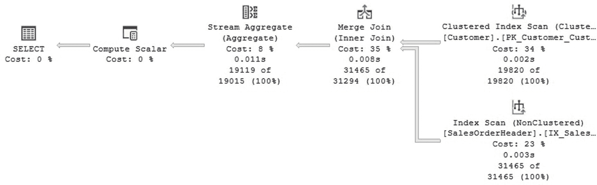
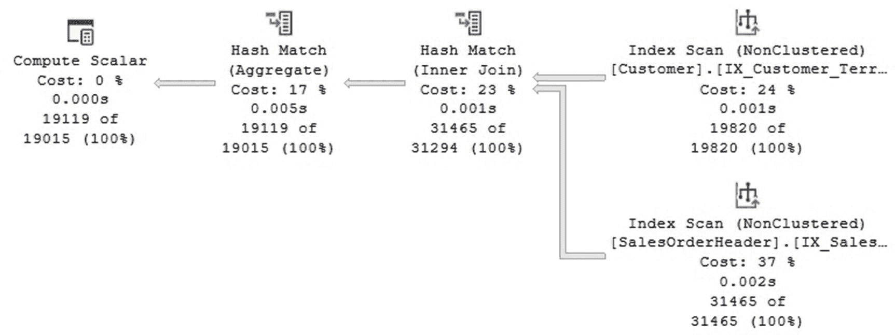
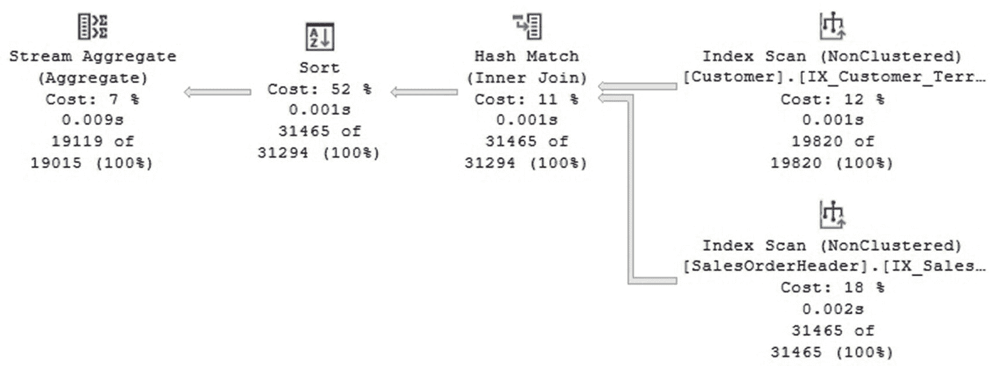

# SQL Server 查询优化器规则探索

## 规则执行内存开销示例

```
Memory after rule NormalizeGbAgg: 28
Memory after rule IJtoIJSEL: 29
Memory after rule MatchGet: 29
Memory after rule JoinToIndexOnTheFly: 29
Memory after rule JoinCommute: 29
Memory after rule JoinToIndexOnTheFly: 29
Memory after rule GbAggBeforeJoin: 29
Memory after rule IJtoIJSEL: 33
Memory after rule NormalizeGbAgg: 34
Memory after rule GenLGAgg: 35
Memory after rule NormalizeGbAgg: 36
Memory after rule ReduceForDistinctAggs: 36
Memory after rule JoinOnGbAgg: 37
Memory after rule GbAggAfterJoin: 37
Memory after rule JoinCommute: 37
Memory after rule JoinToIndexOnTheFly: 37
Memory after rule GenLGAgg: 38
Memory after rule NormalizeGbAgg: 39
Memory after rule LocalAggBelowJoin: 39
Memory after rule ReduceForDistinctAggs: 39
Memory after rule GbAggToHS: 40
Memory after rule JNtoIdxLookup: 41
Memory after rule SelIdxToRng: 41
Memory after rule GetToIdxScan: 41
Memory after rule SelIdxToRng: 41
Memory after rule GetToScan: 41
Memory after rule GetToIdxScan: 41
Memory after rule JNtoSM: 41
Memory after rule GetToIdxScan: 41
Memory after rule JNtoHS: 42
Memory after rule JNtoIdxLookup: 42
Memory after rule SelIdxToRng: 43
Memory after rule ImplRestrRemap: 43
Memory after rule JNtoIdxLookup: 43
Memory after rule SelIdxToRng: 43
Memory after rule SelIdxToRng: 43
Memory after rule JNtoSM: 43
Memory after rule ImplRestrRemap: 43
Memory after rule ProjectToComputeScalar: 43
Memory after rule GbAggToStrm: 44
Memory after rule EnforceSort: 44
Memory after rule GetToIdxScan: 44
Memory after rule EnforceSort: 44
Memory after rule JNtoSM: 44
Memory after rule JNtoHS: 44
Memory after rule GbAggToStrm: 44
Memory after rule JNtoIdxLookup: 45
Memory after rule ImplRestrRemap: 45
Memory after rule ProjectToComputeScalar: 45
Memory after rule GbAggToStrm: 45
Memory after rule EnforceSort: 45
```

## 未文档化规则探索方法

我们有另一种未文档化的方法来操作这些规则，这可以帮助我们更好地理解它们的工作原理。但请注意，这些是未文档化的语句，因此**绝不应该**在生产环境中使用。我甚至不建议在任何其他共享环境中使用它们，即使该环境是非生产环境。但您可以在个人的 SQL Server 安装中用于学习或故障排除目的。

### 会话级别禁用规则

我们可以使用未文档化的`DBCC RULEOFF`语句，仅为当前会话禁用`GbAggBeforeJoin`规则。禁用意味着查询优化器将完全无法使用它。

```
DBCC RULEOFF('GbAggBeforeJoin')
```

再次运行我们之前的查询，现在将显示如图 1-10 所示的执行计划。



图 1-10：禁用 GbAggBeforeJoin 规则后的执行计划

在这个计划中，我们可以看到 `GbAggBeforeJoin` 优化已被禁用，找到的最佳计划显示聚合现在位于连接之后。如果您想知道为什么选择一个计划而不是另一个，您可能需要检查计划的成本。原始计划的成本是 0.309581，而没有 `GbAggBeforeJoin` 优化的计划成本是 0.336582，所以显然原始计划是赢家。成本方面，数值越低显然越好。尽管这些数字可能没有显示出很大的差异，但请记住，这些是非常小的表，在真实的生产数据库上差异会更大。

我们还可以尝试使用之前展示的其他优化或规则。例如，我们看到最终计划使用了合并连接。想知道如果没有合并连接，查询优化器会怎么做吗？运行以下命令来禁用“连接转换为合并连接”规则：

```
DBCC RULEOFF('JNtoSM')
```

运行相同的查询现在将生成如图 1-11 所示的计划。



图 1-11：没有“连接转换为合并连接”优化后的执行计划

最后，我之前提到过，查询优化器为优化聚合实现了两种物理算法：哈希聚合和流聚合。目前，图 1-11 中的计划使用的是哈希聚合。让我们也禁用哈希聚合。

```
DBCC RULEOFF('GbAggToHS')
```

新的计划如图 1-12 所示。此时，您不会感到惊讶，因为它现在使用的是流聚合，而不是哈希聚合。



图 1-12：禁用哈希聚合后的执行计划

您想知道如果也禁用流聚合会发生什么吗？尝试以下未文档化的语句，然后再次运行原始的 AdventureWorks 查询：

```
DBCC RULEOFF('GbAggToStrm')
```

这一次，根本无法生成计划，您将收到以下错误消息：

```
Msg 8624, Level 16, State 1, Line 60
Internal Query Processor Error: The query processor could not produce a query plan. For more information, contact Customer Support Services.
```

### 重新启用规则与查看状态

最后，在结束这个练习之前，您应该重新启用被禁用的规则或者关闭会话。`RULEOFF` 和 `RULEON` 语句在会话级别操作。如果您继续在同一个会话中工作，可能会遇到非常奇怪的行为，因为您实际上已经改变了查询优化器的行为。您可能还记得禁用了哪些规则，或者您可以利用未文档化的语句 `DBCC SHOWOFFRULES` 来显示这个列表。运行以下命令：

```
DBCC TRACEON(3604)
DBCC SHOWOFFRULES
```

您将看到类似以下的输出：

```
DBCC execution completed. If DBCC printed error messages, contact your system administrator.
Rules that are off globally:
JNtoSM
GbAggToStrm
GbAggToHS
GbAggBeforeJoin
DBCC execution completed. If DBCC printed error messages, contact your system administrator.
```

同样，您可以使用未文档化的语句 `DBCC SHOWONRULES` 来列出所有仍然启用的规则，在我们的例子中，这将是查询优化器可用的剩余 416 条规则。要启用被禁用的规则，请运行未文档化的语句 `DBCC RULEON`，如下所示：

```
DBCC RULEON('JNtoSM')
DBCC RULEON('GbAggBeforeJoin')
DBCC RULEON('GbAggToStrm')
DBCC RULEON('GbAggToHS')
```

启用列出的转换规则后，您可以再次运行查询并验证一切是否恢复正常。您也可以运行 `DBCC SHOWOFFRULES` 来验证是否没有列出任何禁用的规则。

## 查询级别禁用规则

有一种替代方法，也是未文档化的，可以在查询级别禁用规则。尝试以下使用未文档化提示 `QUERYRULEOFF` 的查询，这将仅为该特定查询执行禁用 `GbAggBeforeJoin` 规则：

```
SELECT c.CustomerID, COUNT(*)
FROM Sales.Customer c JOIN Sales.SalesOrderHeader o
ON c.CustomerID = o.CustomerID
GROUP BY c.CustomerID
OPTION (RECOMPILE, QUERYRULEOFF GbAggBeforeJoin)
```

如果您指定一个用逗号分隔的列表，可以包含多个规则，如下例所示：

```
SELECT c.CustomerID, COUNT(*)
FROM Sales.Customer c JOIN Sales.SalesOrderHeader o
ON c.CustomerID = o.CustomerID
GROUP BY c.CustomerID
OPTION (RECOMPILE, QUERYRULEOFF GbAggBeforeJoin, QUERYRULEOFF GbAggToHS)
```

运行最后一个例子：

```
SELECT c.CustomerID, COUNT(*)
FROM Sales.Customer c JOIN Sales.SalesOrderHeader o
ON c.CustomerID = o.CustomerID
GROUP BY c.CustomerID
OPTION (RECOMPILE, QUERYRULEOFF GbAggToStrm, QUERYRULEOFF GbAggToHS)
```

正如前面解释的，以下查询也不会创建计划，因为我们再次为流聚合和哈希聚合都禁用了规则。但这次您将收到不同的错误消息，因为查询优化器检测到您正在使用提示。


