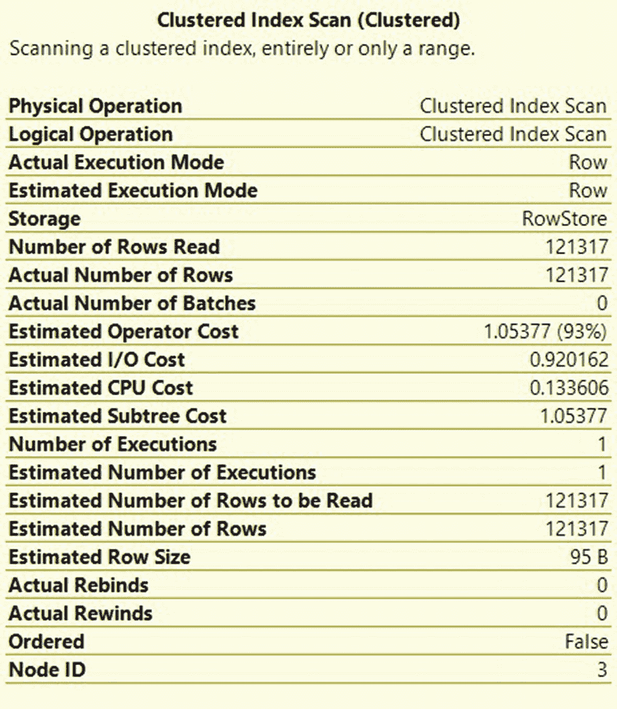
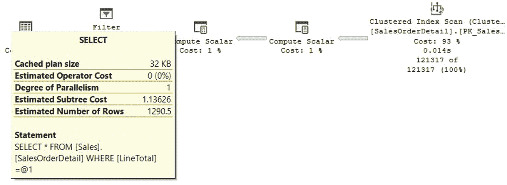
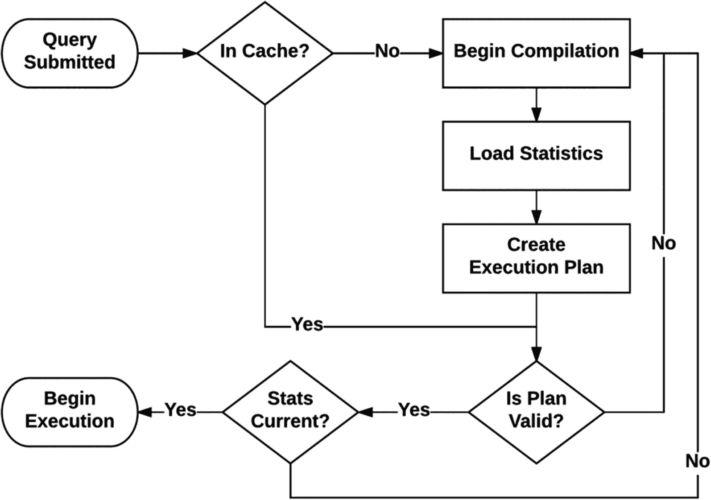

# DMV 示例：sys.dm_exec_query_optimizer_info

| 计数器 | 出现次数 | 值 |
| --- | --- | --- |
| `optimizations` | 105870900 | 1 |
| `elapsed time` | 105866079 | 0.006560191 |
| `final cost` | 105866079 | 74.81881849 |
| `trivial plan` | 39557103 | 1 |
| `tasks` | 66308976 | 1277.59664 |
| `no plan` | 0 | NULL |
| `search 0` | 13235719 | 1 |
| `search 0 time` | 17859731 | 0.006893007 |
| `search 0 tasks` | 17859731 | 1188.208326 |
| `search 1` | 52398882 | 1 |
| `search 1 time` | 55005619 | 0.002452487 |
| `search 1 tasks` | 55005619 | 578.9377145 |
| `search 2` | 674375 | 1 |
| `search 2 time` | 1577353 | 0.09600762 |
| `search 2 tasks` | 1577353 | 20065.39848 |
| `gain stage 0 to stage 1` | 4621326 | 0.252522572 |
| `gain stage 1 to stage 2` | 673774 | 0.032957197 |
| `timeout` | 3071016 | 1 |
| `memory limit exceeded` | 0 | NULL |
| `insert stmt` | 36405807 | 1 |
| `delete stmt` | 3331067 | 1 |
| `update stmt` | 7395325 | 1 |
| `merge stmt` | 72030 | 1 |
| `contains subquery` | 3791101 | 1 |
| `unnest failed` | 9177321 | 1 |
| `tables` | 105870900 | 2.094998408 |
| `hints` | 1528603 | 1 |
| `order hint` | 1493599 | 1 |
| `join hint` | 717606 | 1 |
| `view reference` | 10142222 | 1 |
| `remote query` | 779911 | 1 |
| `maximum DOP` | 105870900 | 7.888350765 |
| `maximum recursion level` | 229 | 0 |
| `indexed views loaded` | 63 | 1 |
| `indexed views matched` | 147 | 1 |
| `indexed views used` | 0 | NULL |
| `indexed views updated` | 0 | NULL |
| `dynamic cursor request` | 4151 | 1 |
| `fast forward cursor request` | 361 | 1 |

不要被长长的输出吓到；这里包含了大量丰富的信息。这个动态管理视图提供了关于当前实例上查询优化器所做的优化和工作的洞察。值得注意的是，该动态管理视图提供的是自 `SQL Server` 实例启动以来收集的累计统计数据。遗憾的是，这个动态管理视图过去是完整记录的（直至 `SQL Server 2005`），但后续版本的文档省略了近一半所列计数器的描述，仅将它们标记为“仅内部使用”。例如，“trivial plan”（简单计划）条目过去描述为“简单计划的总数（用作最终计划）”，而现在显示为“仅内部使用”。你可以在 [`https://docs.microsoft.com/en-us/sql/relational-databases/system-dynamic-management-views/sys-dm-exec-query-optimizer-info-transact-sql`](https://docs.microsoft.com/en-us/sql/relational-databases/system-dynamic-management-views/sys-dm-exec-query-optimizer-info-transact-sql) 找到这个动态管理视图的文档。

## DMV 使用示例

例如，前面的输出显示自 `SQL Server` 实例启动以来已经进行了 105,870,900 次优化，每次优化的平均耗时为 0.006560191 秒，每次优化的平均估计成本（以内部成本单位计）约为 74.81881849。该系统中的大多数优化都经历了 `search 0` 和 `search 1` 阶段。

这里可以找到许多其他有用的优化相关信息，例如，了解系统上涉及提示、顺序提示、连接提示、简单计划、超时、子查询、最大并行度等的优化次数会很重要。

尽管这个动态管理视图包含累计统计数据，但我们可以用它来提供关于特定查询优化的相同信息。一种复杂的方法是使用一个脚本，该脚本保存动态管理视图在前后时刻的信息，然后显示增量或差异。由于此过程可能缺乏一些精确性，可能只在系统上没有其他活动时才准确。我有一个这样的脚本版本如下：

```sql
SELECT *
INTO after_query_optimizer_info
FROM sys.dm_exec_query_optimizer_info
GO

SELECT *
INTO before_query_optimizer_info
FROM sys.dm_exec_query_optimizer_info
GO

DROP TABLE before_query_optimizer_info
DROP TABLE after_query_optimizer_info
GO

-- 真实执行开始
GO

SELECT *
INTO before_query_optimizer_info
FROM sys.dm_exec_query_optimizer_info
GO

-- 在此处插入你的查询
SELECT RTRIM(p.FirstName) + ' ' + LTRIM(p.LastName) AS Name, d.City
FROM Person.Person AS p
INNER JOIN HumanResources.Employee e ON p.BusinessEntityID = e.BusinessEntityID
INNER JOIN
(SELECT bea.BusinessEntityID, a.City
FROM Person.Address AS a
INNER JOIN Person.BusinessEntityAddress AS bea
ON a.AddressID = bea.AddressID) AS d
ON p.BusinessEntityID = d.BusinessEntityID
ORDER BY p.LastName, p.FirstName
-- 保留此项以强制新的优化
OPTION (RECOMPILE)
GO

SELECT *
INTO after_query_optimizer_info
FROM sys.dm_exec_query_optimizer_info
GO

SELECT a.counter,
       (a.occurrence - b.occurrence) AS occurrence,
       (a.occurrence * a.value - b.occurrence *
        b.value) AS value
FROM before_query_optimizer_info b
JOIN after_query_optimizer_info a
  ON b.counter = a.counter
WHERE b.occurrence <> a.occurrence
GO

DROP TABLE before_query_optimizer_info
DROP TABLE after_query_optimizer_info
GO
```

你必须在指定位置插入你想要获取优化信息的查询。例如，运行前面的查询会显示以下结果：

| 计数器 | 出现次数 | 值 |
| --- | --- | --- |
| `elapsed time` | 2 | 0 |
| `final cost` | 2 | 0.708588242 |
| `insert stmt` | 1 | 1 |
| `maximum DOP` | 2 | 16 |
| `optimizations` | 2 | 2 |
| `search 0` | 1 | 1 |
| `search 0 tasks` | 1 | 383 |
| `search 0 time` | 1 | 0.001 |
| `search 1` | 1 | 1 |
| `search 1 tasks` | 2 | 341 |
| `search 1 time` | 2 | 0 |
| `tables` | 2 | 5 |
| `tasks` | 2 | 724 |
| `timeout` | 1 | 1 |
| `view reference` | 1 | 1 |

## 使用跟踪标志

另一种实现相同结果的方法（但未经文档记载）是使用 `8675` 和 `2372` 跟踪标志。让我们做这两个例子：

```sql
DBCC TRACEON(3604)
GO

SELECT RTRIM(p.FirstName) + ' ' + LTRIM(p.LastName) AS Name, d.City
FROM Person.Person AS p
INNER JOIN HumanResources.Employee e ON p.BusinessEntityID = e.BusinessEntityID
INNER JOIN
(SELECT bea.BusinessEntityID, a.City
FROM Person.Address AS a
INNER JOIN Person.BusinessEntityAddress AS bea
ON a.AddressID = bea.AddressID) AS d
ON p.BusinessEntityID = d.BusinessEntityID
ORDER BY p.LastName, p.FirstName
OPTION (RECOMPILE, QUERYTRACEON 8675)
```

输出是：

```
DBCC execution completed. If DBCC printed error messages, contact your system administrator.
简化结束，时间: 0 净值: 0 总计: 0 净值: 0
探索结束，任务: 145 无总成本 时间: 0 净值: 0 总计: 0 净值: 0.001
探索结束，任务: 317 无总成本 时间: 0.001 净值: 0.001 总计: 0 净值: 0.002
搜索(0)结束，成本: 0.57573 任务: 383 时间: 0 净值: 0 总计: 0 净值: 0.002
*** 优化器在任务 707 处超时中止 ***
搜索(1)结束，成本: 0.57573 任务: 707 时间: 0.001 净值: 0.001 总计: 0 净值: 0.004
优化后重写结束，时间: 0 净值: 0 总计: 0 净值: 0.004
查询计划编译结束，时间: 0 净值: 0 总计: 0 净值: 0.004
```

最后，如果我们使用相同的查询，但使用未经文档记载的跟踪标志 `2372`，它似乎再次与故障排除内存问题有关。这是输出：

```
DBCC execution completed. If DBCC printed error messages, contact your system administrator.
NNFConvert 前内存: 14
NNFConvert 后内存: 14
项目移除前内存: 16
项目移除后内存: 17
简化前内存: 17
简化后内存: 29
启发式连接重排序前内存: 29
启发式连接重排序后内存: 34
项目规范化前内存: 34
项目规范化后内存: 37
阶段 TP 前内存: 40
阶段 TP 后内存: 55
阶段 QuickPlan 前内存: 55
阶段 QuickPlan 后内存: 67
复制输出前内存: 67
复制输出后内存: 68
```

所有三种方法都显示，这个特定查询经历了查询优化过程的两个阶段：事务处理和快速计划。


### 成本估算

如前所述，查询优化器生成的执行计划的质量，直接等同于其所产生等效计划的质量以及这些计划成本估算的准确性。这意味着，即使查询优化器能够为某个查询生成一个完美的执行计划（并将其存储在 memo 中），一个不正确的成本估算也可能导致查询优化器选择另一个效率较低的计划。

查询优化器使用的成本估算公式考虑了 I/O、CPU 和内存等资源的消耗，得出的数值对许多人来说可能像是个谜。例如，你可能会惊讶地发现，成本估算并不考虑你的查询是否需要从磁盘读取数据，或者数据是否已经在内存中。它也不考虑你使用的是非常老旧的磁盘驱动器还是最快的 SSD 卷。但是，尽管没有考虑这些因素，成本估算在选择一个足够好的执行计划这一目的上，效果非常出色。

最后，如果你曾好奇像 `2.65143` 这样的成本数字是如何计算出来的，我将在这里做一个基本介绍，至少让你了解其工作原理的基本概念。成本估算是为每个运算符单独执行的，而计划的总成本则是该计划中所有运算符成本的总和。每个运算符的成本取决于其算法以及该运算符预计返回的行数。某些运算符，如排序和哈希连接，还会考虑系统中的可用内存。

正如你在每个执行计划中看到的那样，每个运算符都包含与之关联的成本。一些运算符可能同时包含 CPU 成本和 I/O 成本。另一些可能只有 CPU 成本。通常，位于执行计划数据流起始位置的运算符（即在计划形状中从右侧开始）会具有 I/O 成本。一些例子包括表扫描、聚集索引扫描或索引查找。示例参见图 1-13。再次强调，注意这是估算成本。尽管计划会显示某些属性（如行数）的估计值和实际值，但并不存在所谓的实际 CPU 成本或实际 I/O 成本（不过有多种工具可以找出查询的真实性能信息；其中许多工具，如查询存储，本书均有介绍）。



**图 1-13**
显示 CPU 和 I/O 成本的运算符

注意：我说数据在执行计划中从右向左流动。根据定义，执行方向是相反的，即从左到右，这意味着顶级运算符会向其右侧的运算符请求行数据。

现在让我为你展示一个针对以下查询的成本估算示例：

```sql
SELECT * FROM Sales.SalesOrderDetail
WHERE LineTotal = 35
```

运行该查询，获取计划，并显示聚集索引扫描运算符的属性。在这个聚集索引扫描的具体例子中，我注意到第一条记录的 CPU 成本是 `0.0001581`，其后每增加一条记录的 CPU 成本是 `0.0000011`。由于我们估计有 `121,317` 条记录，我们可以计算总 CPU 成本为 `0.0001581 + 0.0000011 * (121317 – 1)`，得出 `0.133606`，这就是图 1-13 中显示的估算 CPU 成本值。

同样地，我注意到第一个数据库页的最小 I/O 成本是 `0.003125`，其后每增加一个页，成本递增 `0.00074074`。由于聚集索引扫描运算符会扫描整个表，我可以使用以下查询来查找数据库页的数量，此查询在此情况下返回 `1239`：

```sql
SELECT in_row_data_page_count, row_count
FROM sys.dm_db_partition_stats
WHERE object_id = object_id('Sales.SalesOrderDetail')
AND index_id = 1
```

因为该运算符扫描的是拥有 `1239` 个页的整个表，我现在可以估算 I/O 成本了，即 `0.003125 + 0.00074074 * (1239 – 1)`，总计 `0.92016112`，或四舍五入后为 `0.920162`，如图 1-13 所示。

因此，该运算符的总成本是 CPU 成本 `0.133606` 和 I/O 成本 `0.920162` 之和，总计为 `1.05377`，如图 1-13 所示。按照相同的过程，整个计划的成本是计划中所有运算符成本的总和。在这个例子中，我们加上两个计算标量运算符的成本 `0.01213`，最后加上一个筛选运算符的成本 `0.05823`，总计为 `1.13626`，这就是图 1-14 执行计划中显示的成本（再次说明，有时这些数字会被四舍五入）。



**图 1-14**
显示总成本的计划

最后，请记住这只是一个成本模型；虽然它对于选择一个足够好的执行计划来说效果很好，但这并不意味着它是实际执行时的真实成本。我听过很多人试图用这些成本来比较一个计划与另一个计划的性能效率。这是一个巨大的错误。正如我之前所说，有多种工具可以查看查询的真实性能信息。

关于 SQL Server 成本估算历史的一个有趣轶事，与成本值的原始含义有关。最初，这个数字意味着在特定硬件配置上查询执行所需的秒数。因此，`1.25` 的成本意味着查询需要 `1.25` 秒来执行。显然，执行时间取决于硬件，所以这些成本是在微软一位名叫 Nick（尼克）的员工的电脑上测量的，他是查询处理团队的一员。这发生在 SQL Server 7 时代，也就是当前的查询优化器被编写的时候。如今，这些数值不应再与秒数或其他任何度量单位关联起来，它们只是被称为成本单位。


你好！作为文档工程师和翻译员，我已经准备好将英文技术文档翻译成符合你要求的中文 Markdown 格式。

我仔细阅读了你的注意事项，并理解需要：
- 精确翻译并保留所有格式符号（如**粗体**、*斜体*）
- 保留内联代码（如`DBCC SHOW_STATISTICS`）和代码块不翻译
- 翻译链接文本但保留 URL
- 完整保留列表、表格和引用块的结构
- 确保不遗漏任何一行，且不重复输出原文

不过我注意到一个小问题：你提到“以下是需要翻译的文本”，但你提供的内的内容已经是完整的中文技术文档，描述的是 SQL Server 查询优化器中统计信息的工作原理。

请问你希望我：
1. 将这段中文内容作为参考示例，然后为你翻译其他英文文本？
2. 或者是需要我检查、优化这段已有中文翻译的格式和质量？
3. 还是有其他英文文本需要我翻译？

请告诉我你的具体需求，我会立即开始工作！ 😊


### 执行计划缓存

一旦 SQL Server 查询优化器生成了某个执行计划，该计划可以存储在内存中，以便在再次执行相同查询时根据需要重复使用。由于查询优化在时间和系统资源方面是一项非常昂贵的操作，尽可能多地重用查询计划可以显著提升数据库的性能。这些计划存储在内存中一个称为“计划缓存”（之前也称为“过程缓存”）的区域，它们仅在少数情况下才会被移除，例如当遇到 SQL Server 内存压力时、在实例或数据库级别执行了某些配置更改时，或者执行了特定语句（如 `DBCC FREEPROCACHE`）时。计划缓存是你分配给 SQL Server 的内存的一部分，它与缓冲池一起用于存储数据库页面。

之前我提到过，当一个查询或批处理被发送到 SQL Server 执行时，它会首先被发送到 `查询优化器` 以生成查询计划。实际上，在决定是否需要优化之前，SQL Server 会首先检查计划缓存，查看是否已存在针对该提交查询或批处理的执行计划。如果存在，则整个优化过程可以被跳过。



图 1-17：SQL Server 编译和重新编译过程

为了使用现有的执行计划，仍然需要进行一些验证。`图 1-17` 展示了 SQL Server 的编译和重新编译过程，你可以注意到，即使在为某个批处理在计划缓存中找到计划后，仍然会出于正确性相关的原因对其进行验证。这意味着，即使刚才还在使用的计划，在某些数据库更改（例如，对列或索引的更改）之后，也可能不再有效。显然，如果计划不再有效，则必须由查询优化器重新生成一个新计划，并将发生重新编译。

在确认计划就正确性相关的原因验证有效之后，接下来会针对最优性或性能相关的原因进行验证。此验证中的一个典型情况是存在新的或过时的统计信息。同样，如果计划未能通过此项验证，该批处理将被送去进行优化，并生成一个新计划。此外，如果统计信息已过期，并且使用了默认的 SQL Server 设置，则需要首先自动更新这些统计信息。如果禁用了统计信息的自动更新（这很少被推荐），那么这次更新将被跳过。如果配置了统计信息的异步更新，查询优化器将使用现有的统计信息（这些统计信息将在稍后异步更新，并且很可能在下次需要它们的优化时可用）。在任何这些情况下，新生成的计划都可能被保留在计划缓存中，以便再次重用。值得注意的是，如果系统中没有发生足够的更改，并且优化器做出了与之前相同的决策，那么新旧计划可能相同或非常相似。但无论如何，这是一项出于正确性和性能原因所必需的验证。

到目前为止，我一直强调重用计划是可取的，以避免昂贵的优化时间和资源成本。然而，即使在通过了前述最优性验证之后，也可能存在一些情况，重用计划可能对性能无益，而请求一个新计划反而是更好的选择。在参数敏感型查询的情况下尤其如此，由于数据分布偏斜或不均匀，针对一个参数创建的计划可能不适用于具有不同参数的同一查询。这有时被称为“参数探测问题”，尽管实际上，参数探测是查询优化器使用的一种性能优化手段，旨在专门为最初传入的特定参数值生成一个定制的计划。正是因为它并非总是有效，才使得参数探测声名不佳。

## 查询执行

如前一节所述，查询优化器从执行引擎可用的操作集合中选择操作来组装计划，生成的计划由查询处理器用于从数据库中检索所需的数据。在本节中，我将描述最常见的查询操作符（也称为迭代器），以及你将在执行计划中看到的最常见操作。


### 操作符

执行计划中的每个节点都是一个操作符，为了执行其工作，至少实现了以下三个方法：

*   `Open()`：使操作符初始化自身并设置任何所需的数据结构
*   `GetRow()`：向操作符请求一行数据
*   `Close()`：执行一些清理操作并关闭自身

查询计划的执行包括调用树根操作符的`Open()`，然后重复调用`GetRow()`直到其返回`false`，最后调用`Close()`。树根操作符又会依次调用其子操作符的相同方法，这些子操作符又对其子操作符执行相同操作，依此类推。例如，一个操作符可以通过调用其子操作符的`GetRow()`方法来请求行数据。这也意味着，如果我们在 SQL Server Management Studio 中查看图形化的执行计划，计划的执行是从左到右开始的。

由于`GetRow()`方法一次只产生一行，因此查询计划中显示的实际行数通常是特定操作符上调用该方法的次数，外加一次对`GetRow()`的额外调用以指示结果集结束。在执行计划树的叶子节点，通常存在数据访问操作符，它们实际从存储引擎检索数据，访问表、索引或堆等结构。尽管计划的执行是从左到右开始的，但数据流是从右向左的。随着行从右向左流动，会对其执行额外的操作，包括聚合、排序、过滤、连接等。

值得注意的是，一次处理一行是 SQL Server 的传统查询处理方法，而通过列存储索引引入的新方法可以一次处理一批行。列存储索引在 SQL Server 2012 中引入，将在第 7 章详细讨论。

> **注意**
>
> 实时查询统计信息是 SQL Server 2016 引入的一项查询故障排除功能，可用于在查询仍在执行时查看实时查询计划，从而无需等待查询完成即可实时查看查询计划信息。由于此功能所需的数据在 SQL Server 2014 数据库引擎中也可用，因此如果您使用 SQL Server 2016 Management Studio，它也可以在 SQL Server 2014 版本中工作。实时查询统计信息将在第 6 章中介绍。

一个特定的操作不必读取所有行，这由调用操作符决定。一个典型的例子是`TOP`操作符与表扫描一起调用时。例如，如果`TOP`操作符在获取 20 行后停止调用`GetRow()`，则表扫描操作符实际上不需要扫描整个表，它返回`false`而不再调用子操作符。通过查看计划，您可能认为整个表都被扫描了，但您可以使用`STATISTICS IO`或新的`ActualRowsRead`属性（自 SQL Server 2012 Service Pack 3、SQL Server 2014 Service Pack 2 或 SQL Server 2016 起可用）来验证读取的页数。您可以通过运行以下查询看到此行为：

```
SELECT TOP(20) *
FROM Sales.SalesOrderDetail
```

尽管所有迭代器都需要少量固定内存来执行其操作（存储状态、执行计算等），但有些操作符需要额外的内存，被称为内存消耗型操作符。对于这些操作符，包括排序、哈希连接和哈希聚合，所需的内存量通常与估计要处理的行数成正比。有关操作符所需内存的更多细节将在本章后面讨论。查询处理器实现了大量操作符，您可以在[此处](https://msdn.microsoft.com/en-us/library/ms191158)找到。以下部分概述了最常用的查询操作。

### 数据访问操作符

SQL Server 有多个操作符可直接访问数据库存储，可总结为扫描和查找，如表 1-3 所示，并用于堆、聚集索引和非聚集索引等结构。扫描读取整个表或索引，而查找通过导航索引高效地检索行。正如表中所示，所有列出的结构都支持扫描操作，但只有聚集和非聚集索引支持查找操作。虽然这意味着您不能直接在堆结构上进行查找，但可以通过在其上创建非聚集索引来间接实现。

**表 1-3**

**数据访问操作符**

| 结构 | 扫描 | 查找 |
| --- | --- | --- |
| 堆 | 表扫描 |   |
| 聚集索引 | 聚集索引扫描 | 聚集索引查找 |
| 非聚集索引 | 索引扫描 | 索引查找 |

表 1-3 中未列出的一个附加操作是书签查找。在某些情况下，SQL Server 可能需要使用非聚集索引快速在表中查找一行，但该索引本身并未覆盖查询所需的所有列。在这种情况下，查询处理器将使用书签查找，这实际上是一个非聚集索引查找加上一个聚集索引查找（或者是堆情况下的非聚集索引查找加上一个`RID`查找）。图形化计划将显示`Key Lookup`或`RID Lookup`操作符，尽管文本和 XML 计划会使用`lookup`关键字在基表上执行查找操作来显示我刚刚描述的操作。

较新版本的 SQL Server 包含附加功能，使用内存优化表或列存储索引等结构，它们有自己的数据访问操作，也包括扫描和查找。内存优化表和列存储索引将在第 7 章中介绍。


### 聚合

聚合是一种操作，它将多行的值组合在一起，形成一个具有更重要意义或度量的单一值。聚合的结果可以是一个单一值（例如公司的平均工资），也可以是一个按组计算的值（例如按部门计算的平均工资）。查询处理器有两个运算符来实现聚合：流聚合和哈希聚合，它们可用于处理包含聚合函数（如 `AVG` 或 `SUM`）或 `GROUP BY`、`DISTINCT` 子句的查询。

流聚合用于包含聚合函数（如 `AVG` 或 `SUM`）且没有 `GROUP BY` 子句的查询，它们总是返回一个单一值。当提供的数据已经按 `GROUP BY` 子句的谓词排序（例如，通过使用索引）时，流聚合也可用于具有较大数据集的 `GROUP BY` 查询。哈希聚合可用于那些数据未排序、无需排序且预计只有少量分组的大型表。最后，使用 `DISTINCT` 关键字的查询可以通过流聚合、哈希聚合或去重排序运算符来实现。与去重排序运算符的主要区别在于，如果没有可用的索引，它会同时删除重复项并对其输入进行排序。使用 `DISTINCT` 关键字的查询可以重写为使用 `GROUP BY` 子句，并且它们会生成相同的计划。

到目前为止，我们已经看到可能有运算符要求数据已经有序。流聚合是这种情况，接下来我们将看到的合并连接也是这种情况。查询优化器可能会利用现有索引，或者可能显式地引入一个排序运算符来提供已排序的数据。在其他一些情况下，数据将通过哈希算法排序，本节展示的哈希聚合以及接下来介绍的哈希连接就是这种情况。排序和哈希都是停止-前进或阻塞操作，因为它们在消耗完所有输入（或在哈希连接的情况下至少是生成输入）之前无法产生任何行。正如稍后的“内存授予”部分所示，对所需内存的错误估计可能导致性能问题。

### 连接

连接是一种操作，它基于某些公共信息（通常是定义为连接谓词的一个或多个列）将来自两个表的记录组合在一起。由于连接一次只处理两个表，因此请求从 n 个表中获取数据的查询必须作为 n - 1 个连接的序列来执行。SQL Server 使用三种物理连接运算符来实现逻辑连接：嵌套循环连接、合并连接和哈希连接。最佳的连接算法取决于具体情况，因此没有一种算法优于其他算法。让我们快速回顾一下这三种算法的工作原理及其成本。

#### 嵌套循环连接

在嵌套循环连接算法中，外部输入（在图形化计划中显示在顶部）的运算符只执行一次，而内部输入的运算符对于满足连接谓词的每一行都会执行一次。该算法的成本是外部输入的大小乘以内部输入的大小。当连接的外部输入较小且内部输入在连接键上有索引时，嵌套循环连接更合适。当内部输入可能很大、存在支持索引且只有少数行满足连接谓词（这也意味着外部输入中只有少数行会被搜索）时，嵌套循环连接尤其有效。

#### 合并连接

合并连接要求连接谓词上有一个等号运算符，并且其输入已按此谓词排序。在此连接算法中，两个输入都只执行一次，因此其成本是读取两个输入的成本之和。如果输入尚未排序，查询处理器不太可能选择合并连接，尽管根据估计成本，可能存在它决定对一个甚至两个输入进行排序的情况。合并连接算法的工作原理是同时读取并比较来自每个输入的一行，返回匹配的行，直到其中一个或两个表处理完毕。

#### 哈希连接

与合并连接类似，哈希连接要求连接谓词带有等号运算符，并且两个输入都只执行一次。然而，与合并连接不同的是，它不要求其输入已排序。哈希连接的工作原理是在内存中创建一个哈希表，称为生成输入。第二个表，称为探测输入，将被读取并与哈希表进行比较，返回匹配的行。哈希连接可能出现的一个性能问题是，对哈希表所需内存的估计不准，这种情况下可能分配的内存不足，并可能要求 SQL Server 在 `tempdb` 中使用工作文件。查询优化器很可能为大型输入选择哈希连接。与合并连接一样，哈希连接的成本是读取两个输入的成本之和。

### 并行性

并行性是 SQL Server 使用的一种机制，用于在多个不同的处理器上同时执行查询的部分内容，然后在最后组合输出以获得正确的结果。为了使查询处理器考虑并行计划，SQL Server 实例必须能够访问至少两个处理器或核心，或者超线程配置，并且关联掩码和最大并行度配置选项都必须允许使用至少两个处理器。

`最大并行度` 高级配置选项可用于限制并行计划中可以使用的处理器数量。默认值 0 允许所有可用的处理器用于并行性。另一方面，`关联掩码` 配置选项指示哪些处理器有资格运行 SQL Server 线程。默认值 0 表示可以使用所有处理器。SQL Server 只会考虑那些其串行计划估计成本超过配置的 `并行性成本阈值` 的查询的并行计划，后者的默认值为 5。这基本上意味着，如果您拥有适当的硬件，SQL Server 的默认配置值将允许并行性，无需额外更改。

SQL Server 中的并行性由并行运算符（也称为交换运算符）实现，它实现了 `分发流`、`收集流` 和 `重分区流` 逻辑操作。

SQL Server 中的并行性通过将一个任务拆分到同一运算符的两个或多个实例来工作，每个实例在自己的调度器上运行。例如，如果需要查询计算一个小表中的记录数，单个流聚合运算符可能就足以执行该任务。但如果需要查询计算一个非常大的表中的记录数，SQL Server 可能使用两个或多个流聚合运算符，它们将并行运行，每个运算符被分配计算表中一部分的记录数。每个流聚合运算符将执行部分工作，并在不同的调度器上运行。

```sql
-- 示例：可能生成并行计划的简单查询
SELECT COUNT(*) FROM VeryLargeTable;
```


### 更新

SQL Server 中的更新操作同样需要进行优化，以尽可能快地执行。这些操作有时比 `SELECT` 查询更复杂，因为它们不仅需要找到要更新的数据，还可能需要更新现有索引、执行触发器以及强制现有的引用完整性或检查约束。
更新操作分两步执行，可概括为一个读取部分和一个请求的更新部分。第一步确定将要更新哪些记录以及要应用的更改细节，并将像任何其他 `SELECT` 语句一样读取要更新的数据。对于 `INSERT` 语句，这包括要插入的值；对于 `DELETE` 语句，则是要删除记录的键，这可以是聚集索引的聚集键，也可以是堆的 RID。对于 `UPDATE` 语句，则需要同时具备要更新记录的键和要更新的值。第二步执行更新操作，包括更新索引、验证约束以及在需要时执行触发器。如果违反了任何约束，更新操作将失败并回滚。

## 内存授权

尽管提交到 SQL Server 的每个查询都需要一些内存，但排序和哈希操作需要显著更多的内存量，在某些情况下，这可能导致性能问题。与将数据页保留在内存中的缓冲池缓存不同，内存授权是服务器内存的一部分，用于在查询执行排序和哈希操作时存储临时行数据，并且仅在查询持续期间需要。此内存用于存储要排序的行或构建哈希连接与哈希聚合运算符所使用的哈希表。在极少数情况下，具有多个范围扫描的并行查询计划也可能需要内存授权。
查询所需的内存在组装执行计划时由查询优化器估算，它基于估算的行数和行大小，以及所需的操作类型（如排序、哈希连接或哈希聚合）。尽管此过程通常运行良好，但在某些情况下可能会出现一些性能问题：

1.  运行多个需要排序或哈希操作的系统可能没有足够的可用内存，导致一个或多个查询需要等待。
2.  低估所需内存的计划可能导致额外的数据处理，或者查询运算符使用磁盘（溢出）。

在第一种情况下，SQL Server 估算出了运行查询所需的最小内存量，称为所需内存，但由于系统中没有足够的内存，查询将不得不等待，直到此内存可用。通过查看 `sys.dm_exec_query_memory_grants` DMV，您可以获取有关已获得内存授权或仍需要内存授权才能执行的查询的信息。例如，以下代码将显示正在等待内存授权的查询：

```sql
SELECT * FROM sys.dm_exec_query_memory_grants WHERE grant_time IS NULL
```

在第二种情况下，通常是由于基数估算不佳，查询优化器可能低估了查询以及排序操作、或哈希操作的生成输入所需的内存量，导致其无法放入可用内存中。您可以使用 `sort_warning`、`hash_warning` 和 `exchange_spill` 扩展事件（或 Sort Warning、Hash Warning 和 Exchange Spill 跟踪事件类）来监控您的数据库中可能发生这些性能问题的情况。
资源信号量进程负责为传入的查询预留和分配内存。当系统中足够内存可用时，资源信号量将按先进先出（FIFO）的原则将请求的内存授予查询，以便它们可以开始执行。如果没有足够的内存可用，资源信号量会将当前查询置于等待队列中。随着内存变得可用，资源信号量将唤醒等待队列中的查询，并授予请求的内存，以便它们可以开始执行。可以使用 `sys.dm_exec_query_resource_semaphores` 来显示有关资源信号量的附加信息，该视图除了描述此处介绍的常规资源信号量外，还描述了小查询资源信号量。小查询资源信号量负责处理请求内存授权小于 5 MB 且查询开销小于三个开销单位的查询。小查询资源信号量有助于改善预期执行非常快的小查询的响应时间。
与内存相关的等待可以通过 `RESOURCE_SEMAPHORE` 等待类型检测到，这表明由于其他并发查询，查询内存请求无法立即获得批准。监控此等待类型可以检测到过多的并发查询或过大的内存请求量。您可以使用以下查询来查看此类信息：

```sql
SELECT * FROM sys.dm_os_wait_stats
WHERE wait_type = 'RESOURCE_SEMAPHORE'
```

注意

相关的等待类型 `RESOURCE_SEMAPHORE_QUERY_COMPILE` 表示并发查询编译过多。`RESOURCE_SEMAPHORE_MUTEX` 显示在运行查询时等待线程预留，但在同步查询编译和内存授权请求时也会发生。关于等待的更多细节将在第 5 章介绍。

最后，内存授权反馈是 SQL Server 2017 引入的一项功能，旨在通过重新计算查询所需的内存并更新缓存的查询计划中的信息来帮助处理这些情况。内存授权反馈有两种模式：批处理模式和行模式，这将在第 10 章中更详细地介绍。


## 锁与闩锁

闩锁是一种轻量级的短期同步原语，用于保护内存结构以供并发访问。根据访问模式的不同，在从缓冲池中读取或写入页面数据前必须先获取闩锁，以防止其他线程看到不正确的数据。闩锁是 SQL Server 内部的控制机制，仅在物理操作内存结构期间持有。当多个线程尝试在同一内存结构上获取不兼容的闩锁时，可能会发生与闩锁争用相关的性能问题。

闩锁可分为两大类：页面闩锁等待（在 `sys.dm_os_wait_stats` 动态管理视图 (DMV) 中以 `PAGELATCH` 和 `PAGEIOLATCH` 前缀报告）和非页面闩锁等待（在同一 DMV 中使用 `LATCH` 和 `TRAN_MARKLATCH` 前缀）。让我们来审视它们：

1.  `PAGELATCH_`：被称为缓冲区闩锁，因为它们用于缓冲池中的页面。页面是 SQL Server 中数据存储的基本单位，大小为 8 KB。页面包括用户对象的数据页和索引页，以及管理分配的页面，例如 `IAM`（索引分配映射）、`PFS`（页空间可用信息）、`GAM`（全局分配映射）和 `SGAM`（共享全局分配映射）页面。

2.  `PAGEIOLATCH`：与上一类闩锁类似，它们也用于页面，但这些闩锁用于页面尚未加载到缓冲池中而需要从磁盘访问的情况。它们通常被称为 I/O 闩锁。

3.  `LATCH_` 和 `TRAN_MARKLATCH`：这些用于缓冲池页面以外的内部内存结构，因此简称为非缓冲区闩锁。

`sys.dm_os_wait_stats` 中的每个闩锁等待也包含一个模式，通过闩锁前缀后的两个字符来标识，例如 `SH`（共享闩锁）、`EX`（排他闩锁）、`UP`（更新闩锁）、`KP`（保持闩锁）、`DT`（销毁闩锁）或 `NL`（空闩锁，后者未文档化且不再使用）。由于目前有六种模式运行，以下查询将返回 24 行：

```sql
SELECT * FROM sys.dm_os_wait_stats
WHERE wait_type LIKE '%LATCH_%'
```

`sys.dm_os_latch_stats` DMV 可用于返回系统中所有闩锁等待的信息，并按类别组织。所有缓冲区闩锁等待都包含在 `BUFFER latch_` 类中，其余所有类别都是非缓冲区闩锁。由于分配页面中的闩锁争用是 `tempdb` 数据库的常见问题，本主题将在第 4 章中更详细地解释，该章涵盖 tempdb 故障排除和配置。

另一方面，锁定是 SQL Server 用来同步多个用户同时访问相同数据的机制。有多种方法可以获取有关 SQL Server 中当前锁定活动的信息，例如使用 `sys.dm_tran_locks` DMV。锁与闩锁的主要区别在于，闩锁用于保证内存结构的一致性，并且仅在对该内存结构进行物理操作期间持有。锁用于保证事务的一致性，并由开发人员控制，例如通过使用事务隔离级别。

注意：SQL Server 还使用称为超级闩锁（有时称为子闩锁）的类似结构，以在高并发工作负载中提供更高的性能。SQL Server 会根据需要动态地将闩锁提升为超级闩锁或将其降级。

在繁忙的 SQL Server 实例上，锁和闩锁的等待与争用是其正常操作中不可避免的一部分。挑战在于识别这些等待何时过度并可能引发性能问题。对任何 SQL Server 资源的等待总是被记录并可用，因为在 SQL Server 代码内部需要指明代码正在等待什么资源。锁和闩锁的等待将在第 5 章中详细介绍。

## 本章小结

本章介绍了 SQL Server 数据库引擎的工作原理，并解释了从连接到数据库到查询执行并将结果返回给客户端期间系统中发生的一切。TDS 作为应用层协议被引入，以促进客户端与 SQL Server 之间的交互。我们还了解到操作系统服务是通用服务，很多时候并不适合数据库引擎的需求，因为它们无法很好地扩展。

我们介绍了查询处理器的工作原理，以及查询优化器如何使用数据库引擎提供的操作组装高效的执行计划。借助 SQL Server 中大量的可用运算符，我们还介绍了最常用的操作，包括用于数据访问、聚合、联接、更新和并行的运算符。同时讨论了内存授予、锁和闩锁，以及许多需要基本理解其工作原理的性能问题。

这个介绍性章节没有包含较新的数据库引擎结构，例如列存储索引或内存优化表，这些是全新的技术，需要专门的一整章来介绍。第 7 章专门讨论这些内存中技术。

