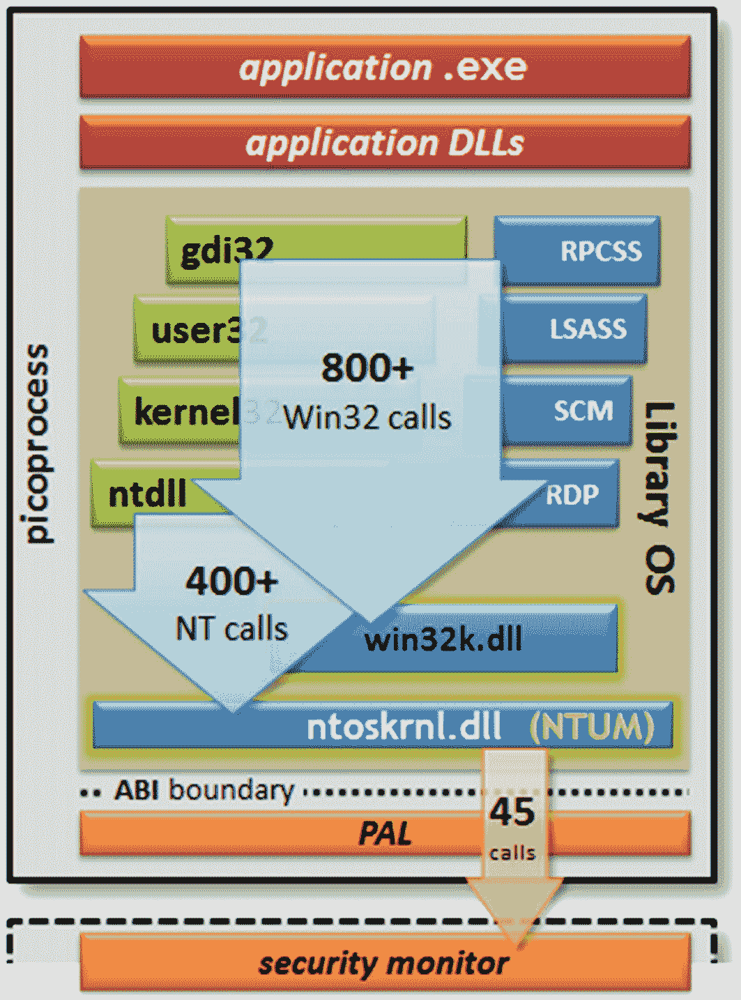
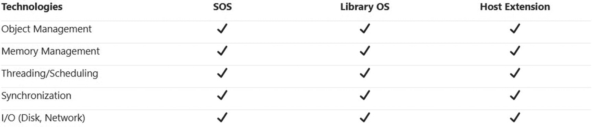
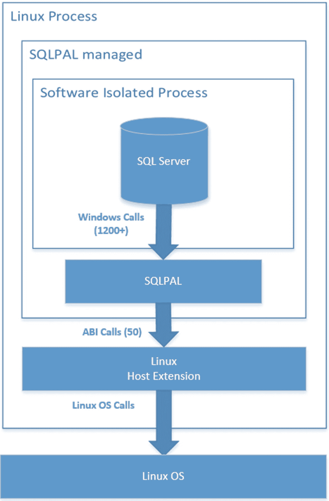
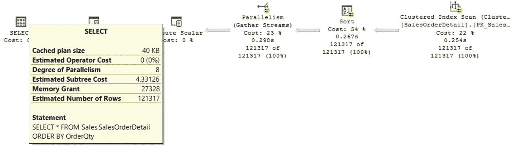

# 2. SQL Server on Linux

我的 IT 职业生涯始于使用 Unix 系统和数据库。这包括在像 System V Release 4、IBM AIX、HP-UX、Sun Solaris，当然还有 Linux 这样的平台上的数据库和应用程序。早在 1991 年，我就在小型机上使用 Unix，并且我一直在想如何能在更便宜的硬件（比如 PC）上运行 Unix，以便更好地测试和学习其工作原理。后来，我在阅读一本个人计算机杂志的文章时发现了 Linux。

我很幸运成为最早的 Linux 用户之一，当时我从互联网上下载它，并将镜像保存到四、五张软盘中。我知道当时使用 Linux 的人不多，因为甚至没多少人听说过它。事实上，我那时从不知道有其他人使用或甚至知道 Linux 的存在。在那个年代，甚至没多少人能访问互联网。互联网主要只在少数大学可用。

虽然我在 1990 年代后半期开始使用 SQL Server 6.5，但我也在 Windows 和 Unix 上从事其他数据库技术的工作。几年后，当我决定专攻并完全专注于 SQL Server 时，我以为我再也不会接触 Unix 系统了。但几年后，到 2016 年，这一切即将改变。


## 微软的重大宣布

2016 年 3 月，在纽约举办的 Data Driven 大会上，当微软云与企业部执行副总裁**斯科特·格思里**宣布 SQL Server 将登陆 Linux 平台时，我们整个科技界都感到无比震惊。你仍可在此阅读当时的公告：[`https://blogs.microsoft.com/blog/2016/03/07/announcing-sql-server-on-linux/`](https://blogs.microsoft.com/blog/2016/03/07/announcing-sql-server-on-linux/)。在那一天之前，我们偶尔只会听到 SQL Server 将被移植到 Linux 的消息，结果发现那只是在 4 月 1 日或愚人节发布的玩笑。但这一次，并非儿戏。

该产品的首批代码，即后来成为 SQL Server 2017 的首个公开预览版或 CTP（社区技术预览版），于同年 11 月在同一个城市的 Microsoft Connect() 大会上发布。

> **注意**
>
> 我对 SQL Server 在 Linux 上运行的可能性感到无比兴奋，以至于我自己写了一整本关于 SQL Server on Linux 的书。如果你对更多细节感兴趣，可以阅读由麦格劳-希尔出版的 `SQL Server on Linux`。

在同一活动中，微软还发布了 SQL Server 2016 Service Pack 1，并宣布从该版本开始，**在 SQL Server 的历史上首次**，所有应用和可编程性功能都将在产品的所有版本中提供。诸如内存中 OLTP、列存储索引、数据库快照、压缩、分区、全程加密、行级安全、动态数据屏蔽和变更数据捕获等功能，都将从免费的 Express 版到 Standard 和 Enterprise 版，在所有 SQL Server 版本中可用。这显然也影响了 Linux 版 SQL Server，因为它计划成为 SQL Server 2017 发布的一部分。

所有应用和可编程性功能在所有版本中都可用，这将使应用程序更具可移植性，可以在任何版本上进行开发和部署，现在还可以在多个平台上——或至少在 Windows、Linux 和 Docker 上运行。此外，自 2016 年 3 月起，从 SQL Server 2014 开始的 SQL Server Developer 版本也免费提供。

在这两场活动宣布了多项重大消息之后，似乎我们仍未准备好迎接又一个大惊喜。就在上述 Linux 版 SQL Server 的首个 CTP（后来成为首个 Linux 版 SQL Server）发布两天后，多家媒体（从 `The Register` 开始）指出，该产品并非像几乎所有人预期的那样是（代码）移植，而是使用了一种基于名为 Drawbridge 研究项目的虚拟化技术。你仍然可以在 [`www.theregister.com/2016/11/18/microsoft_running_windows_apps_on_linux`](https://www.theregister.com/2016/11/18/microsoft_running_windows_apps_on_linux) 阅读到类似《微软 Linux？微软在 Linux 上运行其 Windows SQL Server 软件》这样的文章。

尽管微软从未明确表示这是（代码）移植（即编译 SQL Server 代码并将其作为原生 Linux 应用程序运行），但这是最合乎逻辑的假设。第一次从微软外部的其他消息来源听说情况恰恰相反时，感觉很奇怪。SQL Server 团队在一个月后才公开了其架构，主要通过文章《SQL Server on Linux: How? Introduction》，这篇文章至今仍值得一读，你可以在 [`https://cloudblogs.microsoft.com/sqlserver/2016/12/16/sql-server-on-linux-how-introduction/`](https://cloudblogs.microsoft.com/sqlserver/2016/12/16/sql-server-on-linux-how-introduction/) 找到它。

虽然从宣布到最终交付软件成品用了不到三年时间，但这项工作实际上跨越了产品的两个版本。虽然对 Linux 的支持工作始于 2014 年底和 2015 年初，但 SQL Server 2016 在 2016 年 5 月发布。而首个支持 Linux 的版本 SQL Server 2017，直到 2017 年 10 月才发布。

目前，只有最新的两个 SQL Server 版本，2017 和 2019，可以在 Linux 上运行。它们可以在 Red Hat Enterprise Linux、SUSE Linux Enterprise Server 和 Ubuntu 上运行。这些版本的 SQL Server 也可以在 Docker 上运行，而 Docker 本身可在 Linux、Windows 和 Mac OS 平台上运行。

> **注意**
>
> 在 Linux 上安装 SQL Server 或在 Docker 上运行 SQL Server 超出了本书的范围。有关如何执行此操作的详细信息，请参阅 [`https://docs.microsoft.com/en-us/sql/linux/sql-server-linux-overview?view=sql-server-ver15`](https://docs.microsoft.com/en-us/sql/linux/sql-server-linux-overview?view=sql-server-ver15) 中的安装部分。

我将用本章剩余的部分来解释 SQL Server on Linux 背后的架构。可能还需要一点历史背景来提供视角。

## 一点历史

尽管 SQL Server 作为仅限 Windows 的软件产品已有二十多年，但没多少人知道它起源于 Unix 世界。SQL Server 最初是 Sybase 的产品，运行在多个 Unix 平台上，最初被称为 DataServer。在那个年代，为了在多个平台上运行软件，代码必须针对每个操作系统进行移植和编译。所以 SQL Server 最初是一项多平台技术。在那些早期日子里，Windows 甚至还不存在（或者至少服务器软件不存在，最初称为 Windows NT）。一段时间后，Sybase 与 Microsoft 合作，首先将 SQL Server 带到 OS/2，后来带到 Windows。

微软和 Sybase 甚至与 Ashton-Tate 有过短暂的合作，这次合作的成果是于 1989 年 5 月发布了用于 OS/2 的 Ashton-Tate/Microsoft SQL Server 1.0。与 Ashton-Tate 的协议结束后，产品名称更改为 Microsoft SQL Server，其第一个版本 1.1 于 1990 年夏天发布。

几年后，微软发布了一个新的基于服务器的操作系统 Windows NT。其第一个版本 Windows NT 3.1 于 1993 年 7 月发布（没有版本 1 或 2）。Windows NT 的内核最初打算用于 OS/2。Windows NT 是用 C、C++ 和汇编语言编写的。很快，微软决定将 SQL Server 从 OS/2 移植到 Windows NT。

用于 OS/2 的 SQL Server 4.2 被移植到 Windows NT，产生了 SQL Server 4.21，并于 1993 年发布。1994 年 4 月，微软和 Sybase 宣布结束他们的开发协议，各自决定开发自己的 SQL Server 或数据库产品。SQL Server 4.2B 是该产品在 OS/2 上的最后一个版本。

在 SQL Server 的那些早期日子里，无论是作为 Sybase 产品还是微软产品，总面临着一个两难的抉择：是让产品具有可移植性并能够运行在多个平台上，还是让产品为单一操作系统而设计、编写和优化。这是微软在离开 OS/2 平台并保留 SQL Server 为仅限 Windows 软件时做出的决定之一。当微软尝试将 SQL Server 移植到 Linux 时，同样的关切再次出现。可移植性的目标有时与性能目标相冲突。换句话说，一个软件项目要么需要为每个支持的平台进行重大的重新工程，要么采取“最低公分母”的方法，无法充分利用每个平台的特性。

> **注意**：你可以通过阅读 Kalen Delaney 所著的 `Inside Microsoft SQL Server 2000` 的第 1 章 来了解更多关于 SQL Server 的历史，你也可以在线找到该章节：[`www.sqlserverinternals.com/s/History-of-SQL-Server.pdf`](https://www.sqlserverinternals.com/s/History-of-SQL-Server.pdf)。


## SQLOS

正如第 1 章所提到的，`SQLOS` 是为 `SQL Server 2005` 版本构建的。当时，`SQL Server` 是仅限 `Windows` 的应用程序，因此 `SQLOS` 从未旨在提供平台独立性或可移植性。它的创建不是为了帮助将数据库引擎移植到其他操作系统。当时并不需要一个平台抽象层（`PAL`）。

如前所述，`SQLOS` 的主要目的是利用新的可用硬件功能，例如具有极大内存量的硬件、非统一内存访问（`NUMA`）系统、对称多线程（`SMT`）和每插槽多核心的多 `CPU` 配置系统，以及支持热插拔内存和 `CPU`。这些以及其他新的硬件和硬件趋势将使数据库引擎受益。`SQLOS` 成为了 `SQL Server` 的应用层，负责管理所有操作系统资源，如内存和缓冲管理、非抢占式调度、`I/O` 功能、异常处理、资源调控、死锁检测和扩展事件。

如前所述，操作系统服务是通用服务，有时不能满足数据库引擎的需求。这些通用服务在被数据库引擎使用时可能无法很好地扩展。这些服务可以针对数据库引擎的特定需求进行重写、优化和定制。

然而，即使 `SQLOS` 从未旨在提供平台独立性，但在后来决定将数据库引擎引入 `Linux` 时，它却扮演了一个非常重要的角色，这一点连 `SQL Server` 团队当时也未曾预料到。

> 注意
>
> 有关 `SQLOS` 的更多细节，请阅读 `Slava Oks` 的论文“SQL Server 2005 中利用新硬件能力及其趋势的新平台层”，链接如下：
> `https://docs.microsoft.com/en-us/archive/blogs/slavao/platform-layer-for-sql-server`

## Project Helsinki

`SQL Server` 团队之前曾多次考虑将 `SQL Server` 移植到 `Linux`。从微软退休的杰出工程师兼总经理 `Hal Berenson` 在其 2011 年的博文“将 Microsoft SQL Server 移植到 Linux”中描述了这段经历，文章链接如下：
`https://hal2020.com/2011/07/27/porting-microsoft-sql-server-to-linux`。这篇文章至今读来仍非常有趣。微软数据库系统部门的总经理 `Rohan Kumar` 也在 2017 年的这次采访中提到了几次发布 `Linux` 版本 `SQL Server` 的尝试，链接如下：
`https://techcrunch.com/2017/07/17/how-microsoft-brought-sql-server-to-linux/`。

在 2015 年底，将 `SQL Server` 引入 `Linux` 的项目被重新提上议程，并催生了 `Project Helsinki`，该项目以 `Linux` 内核的创建者及历史上的主要开发者 `Linus Torvalds` 的出生地命名。`Helsinki` 团队由 `Slava Oks`（`SQL Server` 合作伙伴工程经理）、`Tobias Ternstrom`（`SQL Server` 首席项目经理）和 `Scott Konersmann`（`SQL Server` 合作伙伴工程经理）领导。`Slava` 也是构建 `SQLOS` 的团队成员之一，正如所提到的，`SQLOS` 在 `SQL Server 2005` 版本中得以实现。

值得注意的是，该项目在严格的保密协议（`NDA`）下运行，并且据报道没有发生任何泄露。即使是那些与微软签有现行 `SQL Server NDA` 的人，例如微软 `MVP` 社区，也对该毫不知情。

`Helsinki` 团队设想在 `Linux` 上的产品在质量、功能、性能、应用程序兼容性、可扩展性和安全性方面与 `Windows` 版本完全相同。此外，该产品还需要在代码库中保持快速的创新步伐，以确保修复和新功能在 `Windows` 和 `Linux` 平台上同步出现。

移植到 `Linux`，通常也被描述为纯粹主义者的方法，通常是第一个被考虑的方法。但根据微软团队的说法，直接进行移植将是一个庞大的项目，并会面临以下挑战：

*   拥有超过 `4000` 万行 `C++` 代码和近 `30` 年的开发历史，将代码移植以在 `Linux` 上编译将需要数年时间才能完成。
*   在移植项目期间，随着新功能、更新和修复的不断进行，实际代码库仍在变化。赶上当前的代码库本身将是一个巨大的挑战。
*   经过几十年在单一平台（`Windows`）上的开发，代码库中存在大量的操作系统依赖项。这些依赖项是进行代码移植到 `Linux` 的最大挑战。`SQL Server` 团队在以下库中发现了依赖项：
    1.  `Windows` 内核库（`ntdll.dll`）
    2.  `Win32` 库（例如 `user32.dll`）
    3.  `Windows` 应用程序库（例如 `MSXML`、`SQLCLR`、由 `SQL Server Agent` 和 `MS DTC`（即 `Microsoft Distributed Transaction Coordinator`）使用的 `COM` 组件和库）

其中，`Windows` 应用程序库是最复杂的依赖项。仅重写所有这些库就无法在合理的时间内完成。很快，很明显直接进行移植是不可接受的。至少，微软之前曾考虑过移植路径，但这样的项目从未获得批准。因此，`Helsinki` 团队开始寻找移植之外的替代解决方案。

`SQLOS` 无法提供所有所需的抽象。例如，在 `SQLOS` 之外仍然进行了许多 `Windows` 调用。此外，`XML` 和 `SQL Server Agent` 等几个组件位于 `SQL Server` 外部，根本未使用 `SQLOS`。因此，一个考虑是，不重写这些库，而是专注于将 `SQLOS` 发展为一个适当的抽象层。也就是说，所有对 `Windows API` 的调用都将通过 `SQLOS` 路由，由 `SQLOS` 与底层操作系统交互。正因为如此，需要一种新的方法，于是考虑了一种名为 `Drawbridge` 的虚拟化解决方案。


## Drawbridge

Drawbridge 是一个微软研究项目，旨在基于 Windows 的库操作系统版本，为应用沙盒化提供一种新的虚拟化形式。尽管虚拟化技术多年来已极为流行，但其存在的一个问题在于需要运行整个操作系统实例和大量服务，因此显得非常**沉重**。研究致力于构建仅包含所需资源的、更轻量级的虚拟机版本。

Drawbridge 的主要目的是大幅降低在同一硬件上托管多个虚拟机时的虚拟化资源开销，在某种程度上，这类似于 Docker 后来所实现的目标。根据微软的说法，Drawbridge 为容器技术提供了宝贵的见解。Docker 于 2013 年 3 月作为开源项目发布，而 Drawbridge 项目则早两年完成。

Drawbridge 项目的最初目的是在 Azure 中托管小型应用程序。为此，Drawbridge 将 Windows 内核提取出来，在用户模式下运行，以创建一个能够运行 Windows 应用程序的高密度容器。换句话说，Drawbridge 实际上是将整个 Windows 操作系统置于用户模式下运行。之后，团队开始测试在其他操作系统中运行 Drawbridge。这使他们能够利用这种技术作为容器，在不同平台上运行 Windows 应用程序。Linux 是经过测试的操作系统之一。

Drawbridge 包含两个主要组件：一个称为 `picoprocess` 的进程和一个库操作系统，有时被称为 `LibOS`，如图 2-1 所示。库操作系统是一个 Windows 用户模式库，它使得 Drawbridge 能够在指定的主机上运行 Windows 程序。该库实现了 `Win32` 和 `Windows NT` 调用的很大一部分子集，同样如图 2-1 所示。


图 2-1：Drawbridge Windows 库操作系统

库操作系统实现了超过 1500 个 Windows 调用，并且由于它也实现了 `Win32` 和 `Windows NT` 层的一部分，SQL Server 团队能够托管 `MSXML`、`SQLCLR` 以及其他 SQL Server 组件所需的 API。通过使用库操作系统，该团队无需重写像 `MSXML` 或 `SQLCLR` 这样的完整功能。SQL Server on Linux 项目并不需要 `picoprocess` 组件。

**注意：** 您可以在微软研究页面 [`www.microsoft.com/en-us/research/project/drawbridge/`](http://www.microsoft.com/en-us/research/project/drawbridge/) 上找到关于 Drawbridge 项目的更多信息，以及在 [`www.microsoft.com/en-us/research/publication/rethinking-the-library-os-from-the-top-down/`](http://www.microsoft.com/en-us/research/publication/rethinking-the-library-os-from-the-top-down/) 上找到《从顶向下重新思考库操作系统》一文。


图 2-2：SQL Server 在 Linux 上的首次启动

曾参与原始 Drawbridge 项目的 Andrew Baumann 已经完成了 Drawbridge 的移植，并拥有了在 Linux 上运行的 Drawbridge 原型。得益于这个原型，团队在不到一个月的时间内，即 2015 年 2 月底，就实现了 SQL Server 在 Linux 上的启动和运行。图 2-2 是这次首次启动的屏幕截图，后来由 Slava 在一篇题为《SQL Server on Linux, aka project Helsinki: Story behind the idea》的博客中发布，您仍可在 [`https://docs.microsoft.com/en-us/archive/blogs/slavao/sql-server-on-linux-aka-project-helsinki-story-behind-the-idea`](https://docs.microsoft.com/en-us/archive/blogs/slavao/sql-server-on-linux-aka-project-helsinki-story-behind-the-idea) 找到。

显而易见的是，让 SQL Server 在 Linux 上运行并非仅仅是将其运行在 Drawbridge 上并修复几个错误那么简单。仍然需要一个平台抽象层 (`PAL`) 来抽象底层操作系统的调用和库。尽管 `SQLOS` 无法提供所需的全部抽象，但将其用于该项目仍然大有裨益。不过，结合使用 Drawbridge 的 `LibOS` 和 `SQLOS` 的部分组件，提供了所需的解决方案。通过结合这些技术，`SQLPAL` 应运而生。


## SQLPAL

将 `SQLOS` 与 `Drawbridge LibOS` 结合，发展成 `SQLPAL` 是完美的解决方案。除了 `SQLOS` 和 `Drawbridge LibOS`，还需要一个新的层来帮助 `SQLPAL` 与操作系统交互。这个被称为 `host extension` 的层被添加到 `SQLOS` 底部，将 `SQLPAL` 内部的调用映射到操作系统调用。`SQLPAL` 允许绕过 `Windows` 库，通过直接调用 `SQLPAL` 来获得相同的功能。

即使在项目的这个阶段，如你从图 2-3 所见，`SQLOS`、`Drawbridge library OS` 和 `host extension` 提供的选项之间存在一些服务重复。一些不需要或重复的功能将需要被移除。合并重复的功能也将需要进行更改。



图 2-3

赫尔辛基项目功能重叠

`SQL Server` 团队决定保留 `SQLOS` 核心作为主要组件（有时称为 `SOSv2`），并使用 `Drawbridge library OS` 和 `Linux host extension` 的部分功能。最终形成的 `SQL Server on Linux` 系统架构如图 2-4 所示。所有 `SQL Server` 代码，包括 `SQLPAL`，都是为 `Windows` 编译的。`host extension` 是一个原生的 `Linux` 应用程序，为 `Linux` 编译。



图 2-4

`SQL Server on Linux` 架构

与 `Windows` 平台上的 `SQL Server` 不同，单个 `Linux` 进程同时托管 `SQL Server` 数据库引擎和 `SQL Server Agent`。此外，每个服务器只能运行一个 `SQL Server` 实例，称为默认实例；目前还不支持命名实例。

最后，值得一提的是，`SQL Server on Linux` 几乎包含了 `SQL Server for Windows` 的所有功能，包括 `SQL Server 2017` 和 `SQL Server 2019`。在未包含的功能中，我们有事务复制和快照复制（从 `SQL Server 2017 Cumulative Update 18` 开始可用）、合并复制、带有第三方连接的分布式查询、具有 `EXTERNAL_ACCESS` 或 `UNSAFE` 权限集的 `CLR` 程序集、`Polybase`（不适用于 `SQL Server 2017`）、`Stretch DB`、系统扩展存储过程、文件表、数据库镜像和缓冲池扩展。

此外，一些服务如 `SQL Server Browser Service`、`SQL Server Analysis Services`、`SQL Server Reporting Services`、`SQL Server R Services`、`StreamInsight`、`Data Quality Services` 和 `Master Data Services` 尚未在任何版本的 `SQL Server on Linux` 中提供。

有关 `SQL Server on Linux` 上可用功能的完整列表，请参阅文档中的以下条目：[`https://docs.microsoft.com/en-us/sql/linux/sql-server-linux-editions-and-components-2019?view=sql-server-ver15`](https://docs.microsoft.com/en-us/sql/linux/sql-server-linux-editions-and-components-2019%253Fview%253Dsql-server-ver15)。有关不可用功能的完整列表，您可以查看以下链接：[`https://docs.microsoft.com/en-us/sql/linux/sql-server-linux-editions-and-components-2019?view=sql-server-ver15#Unsupported`](https://docs.microsoft.com/en-us/sql/linux/sql-server-linux-editions-and-components-2019%253Fview%253Dsql-server-ver15%2523Unsupported)。请记住，这些链接是针对 `SQL Server 2019` 的，但如果您仍然需要使用 `SQL Server 2017`，也可以轻松导航到相关的 `SQL Server 2017` 文章。当前不可用的功能可能会在未来的版本中包含。

## 总结

在本章中，我们介绍了适用于 `Linux` 平台的 `SQL Server`，其内容适用于该产品的最新版本，即 `SQL Server 2017` 和 `2019`。第 3 章将是唯一一章仅涵盖与 `Linux` 版本相关的功能。本书的其余部分将主要适用于所有支持的 `SQL Server` 版本。

将 `SQL Server` 引入 `Linux` 的成功主要依赖于 `SQLOS` 和 `Drawbridge` 项目。`SQLOS` 是为 `SQL Server 2005` 版本构建的，但它从未旨在提供平台独立性或可移植性。虽然 `SQLOS` 无法提供所需的所有抽象层，但它使将 `SQL Server` 移植到 `Linux` 变得容易得多。实现 `Drawbridge library OS` 结合 `SQLOS` 的部分提供了所需的解决方案。通过结合这些技术，`SQLPAL` 应运而生。

`SQL Server` 最终可用于 `Red Hat Enterprise Linux`、`SUSE Linux Enterprise Server`、`Ubuntu` 和 `Docker`。

## 第二部分 设计与配置

## 3. SQL Server 配置

正确配置 `SQL Server` 对于数据库和应用程序的性能至关重要。尽管该产品经过多年更新以确保其默认配置尽可能最佳，但仍然存在许多情况，特别是对于高性能工作负载，可能需要额外的配置和优化。

那么，`SQL Server` 是如何配置的呢？有多个级别和方法来配置 `SQL Server`。例如，在实例、数据库甚至表或对象级别都有一些配置选项。执行实例级别配置的 traditional 且最常见的方法是使用 `sp_configure` 存储过程，它显示至少 70 个实例级别配置选项，这些选项在 `sys.configurations` 目录视图中也可见。还有一些操作系统配置选项直接或间接影响 `SQL Server`。跟踪标志也用于配置 `SQL Server` 中的某些项目，它们可以在实例、数据库或其他级别工作。跟踪标志是改变 `SQL Server` 中特定行为的一种方法，并且根据定义，从来不是一种永久配置选择。

您可能会问，如果这些选择是最佳实践、建议或指南，为什么我们必须在任何新实例上一直启用它们，以及为什么它们不是由 `SQL Server` 默认启用的。现实情况是，一些配置选项最初设计为默认启用（例如自动创建和自动更新统计信息选项），而另一些选项随着时间的推移成为最佳实践，并最终成为 `SQL Server` 中的默认选项。其他一些配置建议将取决于特定的工作负载，因此不会默认在每次安装中启用。

与往常一样，当产品的新版本更改了默认值时，`SQL Server` 提供了将此默认值更改回原始行为的方法，以最大程度地减少回归或您的应用程序可能对先前行为存在的某些其他依赖性而导致性能问题。

本章讨论的配置选择并非旨在全面，而是我主要选择了主要影响性能的选项（大多在实例级别），并重点关注 `SQL Server 2017` 和 `SQL Server 2019` 中的新功能。为了更好的可管理性、可维护性或可恢复性而进行的一些配置选择也可能包括在内。在列举了许多可能的选择之后，好消息是通常默认配置值对于大多数 `SQL Server` 实例来说是一个不错的选择，或者至少是一个良好的起点。

有趣的是，最初作为跟踪标志 `2371`、`1117` 和 `1118` 开始的行为，从 `SQL Server 2016` 开始现在默认启用。让我们从本章开始讨论所有这些变化。第 4 章将更详细地介绍跟踪标志 `1117` 和 `1118`。

## 统计信息更新

### 自动统计信息的创建与更新

默认情况下，SQL Server 会自动创建并更新查询优化统计信息。你可以更改此数据库级别的默认设置，但这几乎从不被推荐，因为这将要求开发人员或管理员手动创建和更新所有必需的统计信息。虽然可以禁用统计信息的创建，但这没有太大意义，因为查询优化器可以高效地为你创建所需的统计信息。当你为索引键中涉及的列创建索引时，一些其他统计信息也会自动创建。然而，有些统计信息（如多列统计信息）不会自动创建，需要手动创建（不过，像 Database Engine Tuning Advisor 这样的工具可以在此提供帮助）。

更新统计信息则略有不同。当达到特定阈值时，SQL Server 可以自动更新统计信息。尽管有两种阈值或算法来实现这一点（我稍后会详细介绍），但一个常见问题是用于更新统计信息对象的样本大小。高性能数据库需要更主动地更新统计信息方法，而不是让 SQL Server 使用非常小的样本去触发这两种阈值中的任何一种。

### 自动更新机制的问题

我认为自动统计信息更新的主要问题是传统的 20% 固定更改阈值，需要达到此阈值才能触发更新操作。对于大表，这需要非常大量的更改。提到的第二种算法（通常通过使用跟踪标志 `2371` 来启用）稍微改善了自动更新统计信息所需的阈值，但样本大小的问题仍然存在。统计信息更新是在查询优化过程中触发的——当你运行一个查询时，但在它执行之前。从技术上讲，由于它属于执行过程的一部分，因此只使用非常小的样本。这个小样本可能并不总是足够，但至少有一定道理，因为你可能不希望在查询执行过程中使用更大的样本，因为它可能主导执行时间。

### 主动维护方法

前述过程对于许多工作负载可能是高效的，但对于性能要求更高的应用程序，需要一种更主动的方法。这种主动方法通常意味着拥有一个计划的维护作业，以定期更新统计信息。这种方法解决了前面提到的两个问题：无需等待达到特定的大阈值，并提供了更好的样本大小（如果不是使用整个表的话，这称为 `fullscan`）。

> **注意**
>
> 请记住，拥有维护作业并不意味着你需要一个完全无活动的维护窗口，因为这个作业和其他维护作业可以与用户事务一起运行。然而，显然强烈建议在活动量较低的时段进行。

在我看来，新算法也不足够，但它肯定比没有自动统计信息更新要好。新算法对于大表的好处是显而易见的，但在如此大的表中使用小样本可能仍然不充分。这就是为什么我首先建议主动更新统计信息，但为了以防万一，仍将自动更新作为第二选择保留启用状态。

### 实施挑战

尽管有免费的工具和脚本可用于更新统计信息（甚至在 SQL Server 内部），但创建一个高效执行此更新的脚本并不像听起来那么容易，特别是对于大型数据库。你的脚本将必须处理以下部分或全部问题：应该更新哪些表、索引或统计信息？应使用表的百分之多少作为样本大小？我需要执行 `fullscan` 吗？我需要多长时间更新一次统计信息？更新统计信息会影响我的数据库性能活动吗？我需要维护窗口吗？频繁更新会影响我的计划缓存吗？大多数这些问题的答案将取决于具体实现，因为涉及太多不同的因素。

### 确定更新时机

首先，我们必须定义更新统计信息的时机点。例如，决定何时重建索引非常容易，因为我们可以基于索引碎片级别做出这样的决定。此类信息可以通过 `sys.dm_db_index_physical_stats` DMV 轻松获取，其文档可在 [`https://msdn.microsoft.com/en-us/library/ms188917.aspx`](https://msdn.microsoft.com/en-us/library/ms188917.aspx) 找到。该 DMV 文档甚至提供了碎片阈值和入门脚本。但为统计信息做类似的事情则稍微复杂一些。

传统上，数据库管理员依赖于根据统计信息的最后更新日期（例如，可以使用 `DBCC SHOW_STATISTICS` 语句或 `STATS_DATE` 函数查看）或 `sys.sysindexes` 兼容视图中较旧的列（如 `rowmodctr`）来更新统计信息，这两者都有缺点。如果表在特定时间段内没有太大变化，那些统计信息可能仍然有用。此外，`rowmodctr` 列不考虑主统计信息列的更改，而以下解决方案则会考虑。引入于 SQL Server 2012 Service Pack 1 和 SQL Server 2008 R2 Service Pack 2，你可以使用一个新的 DMF——`sys.dm_db_stats_properties`，来返回有关特定统计信息对象的信息。其中一列 `modification_counter`，返回自上次更新对象统计信息以来主统计信息列的更改次数，因此此值可用于决定何时更新它们。更新的时机点将取决于你的数据，并且可能难以估计，但至少你拥有比以前更好的选择。

### 与索引维护的协调

除了统计信息维护作业外，通常还应该有重建或重组索引的作业，这使得选择更新统计信息的时机变得更加复杂。重建索引将更新统计信息，其效果等同于表级别的 `fullscan`。重组索引则完全不触及或更新统计信息。我们通常只希望根据碎片级别重建索引，因此只会更新这些索引的统计信息。我们可能不希望统计信息作业再次更新这些统计信息。传统上，这留给你的脚本来解决，面临着更新哪个统计信息对象的困难决定，有时最终导致同一个对象被更新两次。如前所述，目前可以通过使用 `sys.dm_db_stats_properties` DMF 来解决或最小化这个问题。

### 未使用统计信息的维护

最后，目前没有记录在案的方法来了解统计信息是否正在被查询优化器使用。让我们假设一个临时查询只执行了一次，它在某些列上创建了统计信息。假设这些统计信息再未被任何查询使用，维护作业仍将继续更新这些统计信息对象，只要这些列存在，就可能一直更新下去。

> **注意**
>
> 如果你需要 SQL Server 维护解决方案，我强烈推荐使用 Ola Hallengren 的脚本进行备份、完整性检查以及索引和统计信息维护。此维护解决方案是免费的，可以从 [`https://ola.hallengren.com/`](https://ola.hallengren.com/) 下载。

## 标准自动统计信息更新

自动更新统计信息的功能自 SQL Server 7 版起就已提供，当时查询处理器被重新架构，并引入了统计信息功能。自那时起，自动更新统计信息的算法变化不大；对于超过 500 行的表，当列修改计数器（`colmodctrs`）或统计信息前导列上的更改次数达到“20% 的变化量加上 500”时，自动更新就会触发。

请记住，SQL Server 7 和 SQL Server 2000 则依赖于 `rowmodctrs` 或行级修改计数器来实现相同的行为。显然，使用 `rowmodctrs` 并非最优方案，因为它并非基于统计信息的前导列。例如，假设在列 `c1` 上有一个统计信息对象，列 `c2` 发生了 25% 的更改，但列 `c1` 没有更改。这仍然会触发对列 `c1` 的统计信息更新，而这是完全不需要的。

关于自动更新统计信息算法的更多细节，特别是涉及 500 行或更少的表、临时表和筛选统计信息的情况，可以在本节末尾列出的白皮书中找到。

### 跟踪标志 2371

跟踪标志 2371 随 SQL Server 2008 R2 引入，作为一种改变并降低自动更新统计信息阈值的方法，并且与任何其他跟踪标志一样，它必须手动启用。新算法将使用新公式（定义为 `SQRT(1000 * 行数)`）和旧公式（使用表大小的 20%）中计算结果较小的那个值。如果你用两个公式都算一下，你会发现阈值在表有 25,000 行时发生变化，此时两种情况返回的值相同，都是 5000 次更改。例如，默认算法要求 20% 的更改，如果一个大表有十亿行，则需要 2 亿行更改才会触发更新。而跟踪标志 2371 则需要一个更小的阈值，在这种情况下是 `SQRT(1000 * 1000000000)` 或 100 万次。

从 SQL Server 2016 开始，当你使用兼容性级别 130、140 和 150 时，跟踪标志 2371 的行为默认启用，这基本涵盖了该产品的最新三个版本。

最后，由于全面详细地介绍统计信息超出了本书的范围，我推荐参阅微软白皮书《Microsoft SQL Server 2008 中查询优化器使用的统计信息》，你仍然可以在 [`https://msdn.microsoft.com/en-us/library/dd535534`](https://msdn.microsoft.com/en-us/library/dd535534)`(SQL.100).aspx` 找到它。虽然该文是为 SQL Server 2008 编写的，但其内容对于所有受支持的产品版本仍然适用。

## tempdb 配置

`tempdb` 数据库有多个配置选项，可能极大地影响 SQL Server 实例的性能。此外，SQL Server 2016 引入了几项你需要了解的更改。这些包括能够在安装过程中根据系统上可用处理器的数量自动创建多个数据文件，以及新的默认 `tempdb` 配置，该配置整合了跟踪标志 1117 和 1118 的行为。这些及其他更改在第 4 章中有详细说明，该章专门讨论 tempdb。

## 查询优化器修复程序服务模型

从 SQL Server 2000 Service Pack 3 开始，查询优化器修复程序默认是禁用提供的，需要不同的跟踪标志来启用它们（例如，使用 4101 到 4135 之间的某些跟踪标志）。要求显式启用它们的原因是为了保持执行计划的稳定性并避免计划回退。虽然这些更新的目的是修复一些其他问题，但由于它们也包含了查询优化器的改进，回退仍然是可能的。对于后续版本（从 SQL Server 2005 Service Pack 3 累积更新 6、SQL Server 2008 Service Pack 1 累积更新 7 和 SQL Server 2008 R2 RTM 开始），微软决定将大多数查询优化器升级合并到一个单一的跟踪标志 4199 下。仍然有一些特定情况需要它们自己的跟踪标志，但大部分都使用 4199。计划是将那些可以在未来版本中默认启用的所有更新都归入同一个跟踪标志下。这个未来版本就是 SQL Server 2016。

从 SQL Server 2016 开始，在使用最新的兼容性级别时，所有以前版本中需要跟踪标志 4199 的查询优化器相关修复程序，现在都将自动启用。如果你遇到计划回退或任何其他问题，只需回退到之前的兼容性级别即可禁用这些查询优化器更新，前提是跟踪标志 4199 是禁用的。

跟踪标志 4199 现在将用于启用在 SQL Server RTM 版本之后发布的新的查询优化器修复程序。最后，如果你使用之前的兼容性级别并禁用跟踪标志 4199，你将同时禁用在 SQL Server RTM 之前和之后发布的查询优化器修复程序。

表 3-1 显示了在 SQL Server 文档中定义的、使用兼容性级别和跟踪标志 4199 时所有可能场景的摘要。

表 3-1：SQL Server 的跟踪标志 4199 服务模型

| SQL Server 版本 | 数据库兼容性级别 | TF 4199 | 来自所有先前数据库兼容性级别的 QO 变更 | RTM 后的 QO 变更 |
| --- | --- | --- | --- | --- |
| SQL Server 2016 | **100 至 120** | 关闭 | 禁用 | 禁用 |
| | | 开启 | 启用 | 启用 |
| | **130**（默认） | 关闭 | 启用 | 禁用 |
| | | 开启 | 启用 | 启用 |
| SQL Server 2017 | **100 至 120** | 关闭 | 禁用 | 禁用 |
| | | 开启 | 启用 | 启用 |
| | **130** | 关闭 | 启用 | 禁用 |
| | | 开启 | 启用 | 启用 |
| | **140**（默认） | 关闭 | 启用 | 禁用 |
| | | 开启 | 启用 | 启用 |
| SQL Server 2019 | **100 至 120** | 关闭 | 禁用 | 禁用 |
| | | 开启 | 启用 | 启用 |
| | **130 至 140** | 关闭 | 启用 | 禁用 |
| | | 开启 | 启用 | 启用 |
| | **150**（默认） | 关闭 | 启用 | 禁用 |
| | | 开启 | 启用 | 启用 |

如你所料，表 3-1 中描述的服务模型将应用于产品的未来版本，例如，在这些版本中，可以使用更新的兼容性级别来启用该版本之前的查询优化器修复程序，而使用之前的兼容性级别在发生性能回退时禁用它们（再次强调，假设跟踪标志 4199 是禁用的）。更多详情，请参阅 [`https://support.microsoft.com/en-us/kb/974006`](https://support.microsoft.com/en-us/kb/974006) 上的“SQL Server 查询优化器修复程序跟踪标志 4199 服务模型”。

此外，SQL Server 2016 的另一项新功能是，你可以使用新的 `ALTER DATABASE SCOPED CONFIGURATION` 语法中的 `QUERY_OPTIMIZER_HOTFIXES` 选项，在数据库级别启用查询优化器修复程序，而不考虑其兼容性级别。你可以按如下语句使用此语法：

```
ALTER DATABASE SCOPED CONFIGURATION SET QUERY_OPTIMIZER_HOTFIXES = ON
```


## 配置与查询提示

有关新的 `ALTER DATABASE SCOPED CONFIGURATION` 语句的更多详细信息，请参阅 [`https://msdn.microsoft.com/en-us/library/mt629158.aspx`](https://msdn.microsoft.com/en-us/library/mt629158.aspx)。

最后，在查询级别启用查询优化器修补程序也是可能的，可以使用跟踪标志 4199 与 `QUERYTRACEON` 提示，或者使用 `USE HINT('ENABLE_QUERY_OPTIMIZER_HOTFIXES')` 查询提示。例如，以下两个查询是等效的：

```sql
SELECT * FROM Sales.SalesOrderDetail
ORDER BY OrderQty
OPTION (QUERYTRACEON 4199)

SELECT * FROM Sales.SalesOrderDetail
ORDER BY OrderQty
OPTION (USE HINT('ENABLE_QUERY_OPTIMIZER_HOTFIXES'))
```

> 注意
>
> 虽然在网络上常见将大量跟踪标志与 `QUERYTRACEON` 提示结合使用，但只有少数几个是 Microsoft 文档化并支持的。你可以在 [`https://support.microsoft.com/en-us/kb/2801413`](https://support.microsoft.com/en-us/kb/2801413) 查看此类列表。我自己的许多帖子和文章也包含了这种未文档化的跟踪标志，并且，如往常一样，我总是会澄清它们是未文档化的、不受支持的，并且不打算在生产环境中使用。

## 最大并行度

这个配置选项在过去几年中一直是一个争论的话题，尤其是在拥有大量处理器的新硬件开始变得普遍之后。

基本上，“最大并行度”配置选项定义了查询处理器可以用于单个查询的并行度，或者换句话说，一个查询在执行时可以使用的逻辑处理器数量。当使用默认值 0 时，SQL Server 可以在运行时决定执行并行计划所使用的逻辑处理器数量，最多可达 64 个。请记住，这并不意味着每个并行查询都会一直使用最大数量的可用处理器。例如，如果你的系统有 64 个逻辑处理器并且使用默认配置，一个查询仍然很可能只使用八个处理器并以八个线程运行。同样，这是查询处理器在执行时做出的决定。

Microsoft 提出了使用最大并行度为八的建议，文档记录在 [`https://support.microsoft.com/en-us/kb/2806535`](https://support.microsoft.com/en-us/kb/2806535)。基本上，这个最佳实践要求将“最大并行度”配置选项设置为与系统中逻辑处理器数量相同，最多不超过八。而且，由于现在拥有八个或更多处理器非常普遍，八可能是一个常见的配置。再次强调，将此设置更改为八并不意味着每个并行查询都会使用八个线程。

然而，请记住，Microsoft 的建议仅仅是一个建议或指导方针。文档本身指定该指南适用于典型的 SQL Server 活动，并且根据你的工作负载或应用程序模式，也可以考虑并彻底测试此设置的其他值。例如，假设你的系统有 16 个逻辑处理器，并且工作负载中同时运行的查询数量较少，那么可以考虑使用最大并行度值为 16。另一方面，对于同一系统中查询数量很多的工作负载，值为 4 也可能是最佳选择。

首先，运行 SQL Server 的硬件必须能够运行并行查询，根据当前的趋势，这几乎包括了今天的所有服务器，甚至包括大多数用于生产实例的虚拟机配置。其次，关联掩码配置选项（现已弃用）或 `ALTER SERVER CONFIGURATION SET PROCESS AFFINITY` 语句必须允许多处理器使用，而它们默认都是允许的。最后，查询处理器必须决定使用并行是否确实可以提高查询性能。

还有一系列功能本身就不支持并行，即使你的查询足够昂贵以证明其合理性。在这些功能中，包括有标量值用户定义函数；杂项内置函数如 `ERROR_NUMBER()`、`OBJECT_ID()` 和 `@@TRANCOUNT`；具有数据访问权限的 CLR 用户定义函数；动态游标；TOP 子句；序列函数；多语句表值用户定义函数；以及全局标量聚合。执行计划也可以通过查看 `NonParallelPlanReason` 属性来告诉你为什么没有使用并行。


此外，仅当查询开销较大时才会考虑并行执行，而“昂贵查询”本身又由另一个配置设置——“并行开销阈值”来定义。该阈值的默认值为 5，同样地，一些数据库管理员也可能考虑提高此值。该阈值意味着，只有当查询处理器创建的初始串行计划成本达到或超过 5 个成本单位时，才会考虑并行计划；但这并不意味着总是会选择并行计划。例如，可能出现以下情况：查询处理器最初估计某个串行计划的成本为 5.5，于是决定考察并行方案；在发现一个成本为 6.3 的并行计划后，它决定保留串行方案，因为系统会选择成本最低的方案。但对于开销更大的查询，则很可能生成并行计划。当选择执行并行计划时，计划本身并不定义并行度；这将在运行时由查询处理器确定。完全有可能同一个计划在不同执行时改变其并行度。

另外，即使您决定为“最大并行度”配置选项设置特定值，它也不是一个硬性限制。任何用户都可以通过使用 `MAXDOP` 查询提示运行查询，向查询处理器请求或建议使用更多处理器来运行并行查询。对并行度指定硬性限制的唯一方法是使用 `Resource Governor`，该功能于 SQL Server 2008 引入。

## 常见误解：CXPACKET 等待

关于并行的另一个常见误解（如第 5 章所述），是当人们看到大量 `CXPACKET` 等待事件时，便认为是并行出了问题，并决定更改此配置或其他设置以最小化或消除并行。正如所解释的，大多数情况下，并行本身并非问题所在。我们可能都听说过有人将配置值设为 1 以消除并行的情况，这显然是完全错误的。可能存在一些极端情况，需要您将值设为 1 并在实例级别完全禁用并行，但必须有经过充分研究的、非常好的理由。也有一些应用程序，如 Microsoft SharePoint，明确要求将最大并行度设置为 1。

## 使用 ALTER DATABASE SCOPED CONFIGURATION 覆盖

最后，自 SQL Server 2016 起，您还可以使用之前介绍的 `ALTER DATABASE SCOPED CONFIGURATION` 语句中的 `MAXDOP` 设置选项，来覆盖为特定数据库在服务器级别配置的最大并行度。

## 示例：最大并行度如何工作

接下来，我将通过一个示例展示 `最大并行度` 的工作方式。在我的测试环境中，采用 SQL Server 默认配置，并拥有八个逻辑处理器，以下查询创建了一个成本为 4.33126 的并行计划。该信息显示在图 3-1 的执行计划中。



图 3-1：并行计划

```sql
SELECT * FROM Sales.SalesOrderDetail
ORDER BY OrderQty
```

在此计划中，有两个操作以并行方式执行：排序操作和聚集索引扫描。请注意，并行是在操作符级别工作的，因此并行计划中的所有操作符并非都必须并行运行。实际执行计划甚至告诉我，对于这次特定的执行，每个线程为这两个操作分别处理了多少行数据，如下方 XML 执行计划片段所示：

### 更改最大并行度

假设您希望将 `最大并行度` 设置更改为 1：

```sql
sp_configure 'max degree of parallelism', 1
RECONFIGURE
```

再次运行前面的 `SELECT` 语句显然会创建图 3-2 所示的串行计划。


图 3-2：串行计划

但是，您可以通过使用 `MAXDOP` 查询提示来覆盖它，如下所示，使用 `MAXDOP 8`：

```sql
SELECT * FROM Sales.SalesOrderDetail
ORDER BY OrderQty
OPTION (MAXDOP 8)
```

前面的查询再次创建了一个使用八个线程的并行计划。您可以尝试 `MAXDOP` 的其他几个值，并观察其行为。最后，别忘了将 `最大并行度` 设置改回默认值：

```sql
sp_configure 'max degree of parallelism', 0
RECONFIGURE
```

## 并行开销阈值

如前一节所述，`并行开销阈值` 配置设置的默认值为 5，它定义了在查询优化过程中，查询处理器开始考虑并行计划的开销阈值。是使用此默认值还是更高的值，以及使用哪个值，正成为一个新的争论话题。网上一些推荐的主要问题在于，关于提高此值以及针对特定工作负载使用哪个值，缺乏明确的研究或性能数据，更不用说来自 Microsoft 的官方建议。

虽然默认值 5 对许多工作负载来说可能是一个不错的选择，但对于某些特定场景，您也可以考虑提高此值。使用哪个值取决于您的工作负载，并且应该经过彻底测试。例如，如果您决定将此配置值从 5 更改为 25，这大致意味着，所有原始串行成本估计在 5 到 25 之间的计划将不再被考虑并行化，而继续作为串行计划执行。您可以选择研究这些查询，以查看新的串行选择是否不会影响执行性能，特别是对于那些关键查询或频繁执行的查询；或者，您也可以对整个工作负载进行整体测试。

请记住，选择默认值也并非不佳。毕竟，并行能够提升查询性能，并且当选择了并行计划时，查询处理器已经比较了串行计划和并行备选方案，并选择了最佳方案。假设成本估计是充分的，它的性能会更好。此外，如第 5 章所述，单独看到大量 `CXPACKET` 等待并不意味着您需要更改此配置或“最大并行度”配置设置。

最后提醒，此配置设置与“最大并行度”设置协同工作，这意味着如果选择了一个并行查询计划来执行，其并行度将在执行前根据后一个配置设置来定义。


## 即时文件初始化

即时文件初始化是一项可以显著提升数据库创建和恢复操作，或添加、恢复、扩展数据文件等操作性能的功能。可以通过向 SQL Server 数据库引擎服务账户授予“执行卷维护任务”权限来启用此功能。遗憾的是，其性能优势仅适用于数据文件，而不适用于事务日志文件。

当 SQL Server 向 Windows 请求文件空间时，默认情况下，文件必须首先通过填充零来初始化。此操作可能非常耗时，尤其是对于大文件或大型增长操作。然而，使用即时文件初始化时，SQL Server 可以跳过文件置零过程，使操作几乎瞬间完成。使用此功能的唯一缺点是文件不会进行零初始化，使用某些高级技术可能会看到该文件中先前存在的信息。此外，如前所述，此性能提升无法用于事务日志文件，因此它们仍然必须进行零初始化。这就是为什么建议预先设定事务日志文件大小的原因之一，以便（根据事务需求）增长不太可能发生并可以避免。

要启用即时文件初始化，您需要使用本地安全策略应用程序（`secpol.msc`）向 SQL Server 数据库引擎服务账户授予“执行卷维护任务”权限，具体操作如文档 [`https://msdn.microsoft.com/en-us/library/ms175935(v=sql.130).aspx`](https://msdn.microsoft.com/en-us/library/ms175935%2528v%253Dsql.130%2529.aspx) 所述。从 SQL Server 2016 开始，您也可以在 SQL Server 安装过程中的安装级别授予此权限，方法是勾选“向 SQL Server 数据库引擎服务授予执行卷维护任务权限”复选框，如图 3-3 所示。


图 3-3

安装期间的“执行卷维护任务”权限

安装屏幕还显示了之前提到的安全警告，内容为：“此权限通过避免数据页置零来实现即时文件初始化。这可能导致信息泄露，因为它可能允许未经授权的主体访问已删除的内容。”对于命令行安装，也可以使用 `/SQLSVCINSTANTFILEINIT` 参数指定授予“执行卷维护任务”权限。

## 基数估计器

在使用任何最新版本的 SQL Server 时，影响应用程序性能的另一个重要选择是基数估计器的选择。当查询处理器在 SQL Server 7 中重新架构时，SQL Server 引入了原始的基数估计器。最近，从 SQL Server 2014 开始，引入了一个新的基数估计器，以克服原始估计器的一些限制。从该版本开始，您必须选择其中之一，大多数情况下，选择将取决于数据库兼容性级别。

但什么是基数估计器？基数估计器是查询优化器的一个组件，在优化期间用于估计查询中每个操作将返回的行数。此信息对于帮助查询优化器估计每个操作的成本，并据此就用于组装执行计划的物理操作做出最佳决策至关重要。

与原始估计器相比，新的基数估计器包含多种变化，这些变化记录在 Microsoft 白皮书《使用 SQL Server 2014 基数估计器优化查询计划》中，地址为 [`https://msdn.microsoft.com/en-us/library/dn673537.aspx`](https://msdn.microsoft.com/en-us/library/dn673537.aspx)。新的基数估计器也包含针对最新版本的一些额外更新。

您可能会问，如果新的基数估计器修复了旧版的限制，为什么仍然可以选择使用旧版的基数估计器。答案是计划性能回归。由于查询优化过程的复杂性，即使在问题得到修复的情况下，回归也可能在之前执行时间可接受的查询上产生性能问题。这有时被称为“两个错误等于正确”，例如，当两个错误的估计，一个高估，另一个低估，相互抵消，结果给出了一个好的估计。在仅修复其中一个估计之后，现在有可能得到一个糟糕的估计，查询优化器最终可能选择一个性能较差的执行计划。

新的基数估计器可以通过使用所用 SQL Server 版本的最新数据库兼容性级别来启用。例如，SQL Server 2014 是 120，SQL Server 2016 是 130，SQL Server 2017 是 140，最新版本是 150。也可以使用以下语句显式更改兼容性级别：

```sql
ALTER DATABASE AdventureWorks SET COMPATIBILITY_LEVEL = 150
```

任何较旧的数据库兼容性级别都将使用旧的基数估计器。当前版本中最旧的兼容性级别是 SQL Server 2008（100）。

还有几个选择可以定义在查询优化期间使用的基数估计器。如果您需要使用旧的基数估计器但需要保留新的数据库兼容性级别，可以使用新的 `ALTER DATABASE SCOPED CONFIGURATION` 的 `LEGACY_CARDINALITY_ESTIMATION` 选项：

```sql
ALTER DATABASE SCOPED CONFIGURATION
SET LEGACY_CARDINALITY_ESTIMATION = ON
```

启用旧基数估计器的另一个选择是使用跟踪标志 9481，可以在服务器级别定义，或者如果在查询中使用 `QUERYTRACEON` 查询提示，也可以在查询级别定义，如下所示：

```sql
SELECT * FROM Person.Address WHERE City = 'Burbank' AND PostalCode = '91502'
OPTION (QUERYTRACEON 9481)
```

## 即时(ad hoc)工作负载优化

查询优化是一项开销很大的操作，因此 SQL Server 会尝试将创建的执行计划保存在称为计划缓存（在一些较旧的 SQL Server 版本中称为过程缓存）的内存区域中。如果同一查询需要再次执行，这可以节省优化时间和资源。然而，对于具有大量即时查询的工作负载，一个众所周知的问题是执行计划可能会一直保留在计划缓存中，但从未被再次使用，从而浪费了此计划缓存内存。

执行查询始终需要生成一个计划，但当您使用“即时(ad hoc)工作负载优化”配置选项时，SQL Server 在第一次编译和执行查询时将不会保留执行计划。相反，它将保留一个小型计划存根，该存根仅使用整个计划所需内存的一小部分。如果再次执行相同的查询，数据库引擎通过查看计划存根会知道这是第二次执行，并将执行新的优化，但这次会将结果计划保留在缓存中。换句话说，此新的查询计划将替换计划存根，并可用于后续执行。

尽管您几乎可以在任何 SQL Server 实例上启用此配置选项，但此选择主要推荐用于具有即时工作负载的实例。对于其他一些工作负载，一个小缺点是每个有效且重用的查询都将必须进行第二次优化，以便将计划保留在缓存中。


## SQL Server 企业版

如果您正在为数据库和应用程序寻求最佳性能，您需要使用 SQL Server 的企业版。位于 [`https://docs.microsoft.com/en-us/sql/sql-server/editions-and-components-of-sql-server-version-15`](https://docs.microsoft.com/en-us/sql/sql-server/editions-and-components-of-sql-server-version-15) 的文档 "SQL Server 2019 (15.x) 的版本和支持的功能" 比较了 SQL Server 2019 各个版本支持的可扩展性限制和功能。您也可以从这些页面访问 SQL Server 2017 及其他旧版本的相同文档。

SQL Server 企业版支持操作系统支持的所有内存和处理器。对于 Windows Server 2016 标准版或数据中心版，这意味着 SQL Server 最多可使用 24 TB 内存和 512 个核心。对于 Windows Server 2019 标准版或数据中心版，它最高可支持 24 TB 内存和无限数量的核心。另一方面，SQL Server 标准版将被限制为最多 4 个插槽或 24 个核心以及 128 GB 内存。

如第 2 章所述，从 SQL Server 2016 Service Pack 1 开始，一些曾经仅限企业版的功能现已在产品的所有版本中可用。这些功能包括内存中 OLTP、列存储索引、数据库快照、压缩、分区、Always Encrypted、行级安全、动态数据屏蔽和变更数据捕获等。

如您在前一份文档中所见，仍有大量功能仅在 SQL Server 企业版中可用。仅列举最重要的部分，特别是从性能角度考虑，我们有：

*   资源调控器
*   联机非聚集列存储索引重新生成
*   内存优化的 tempdb 元数据
*   分区表并行处理
*   NUMA 感知和大页面内存及缓冲区数组分配
*   预读
*   高级扫描
*   自动调优
*   行存储的批处理模式
*   行模式内存授予反馈
*   批处理模式自适应联接
*   批处理模式内存授予反馈
*   分布式分区视图
*   并行索引操作
*   查询优化器自动使用索引视图
*   并行一致性检查
*   星型联接查询优化
*   全局批处理聚合
*   Always On 可用性组（请参阅以下注释）
*   联机索引创建和重新生成
*   可恢复的联机索引重新生成
*   快速恢复

> **注意**
> SQL Server 标准版提供基本的 Always On 可用性组，支持单个数据库和单个副本的故障转移环境。基本可用性组旨在取代已弃用的数据库镜像功能，并提供类似级别的功能支持。

## 内存配置

SQL Server 可以自动动态地管理内存，无需更改默认内存配置。当 SQL Server 作为单一实例安装在专用服务器上时，这在大多数情况下可以完美运行。在这种情况下，您可以保留 `max server memory` 和 `min server memory` 的默认设置，因为没有其他应用程序或服务器组件在竞争服务器内存。SQL Server 设计为仅在需要时动态分配内存，并且为了防止操作系统将内存分页到磁盘，如果可用内存不多，则会释放内存。如果您追求高性能 SQL Server 安装，强烈建议使用专用服务器来托管您的生产 SQL Server 实例，因为同一服务器上的其他应用程序或组件可能会竞争内存和其他服务器资源。

然而，在某些情况下，您可能需要为特定情况调整内存配置——例如，如果您想限制 SQL Server 可用的内存，或者您遇到了内存问题。如果您使用多个 SQL Server 实例，使用这些设置配置内存至关重要，但再次强调，对于高性能生产安装，不建议使用多个实例。为了估算 `max server memory`，您应该考虑操作系统和其他必需的服务器组件（如果有）需要多少内存。如 [`https://msdn.microsoft.com/en-us/library/ms178067.aspx`](https://msdn.microsoft.com/en-us/library/ms178067.aspx) 所述，`max server memory` 计算以下内容：

1.  缓冲池内存
2.  所有缓存
3.  内存授予
4.  编译内存
5.  锁管理器内存
6.  CLR 内存

它还计算基本上在 `sys.dm_os_memory_clerks` 上定义的所有内存 clerk。不受 `max server memory` 配置设置控制的内存包括以下内容：

1.  内存堆
2.  除 SQL Server 外的链接服务器提供程序
3.  线程堆栈
4.  非 SQL Server DLL

`Max server memory` 是高水位标记，除下述情况外，SQL Server 不能使用超过此配置设置中指定值的内存。从 2012 版本开始，当由于内存碎片导致没有足够的连续可用内存时，SQL Server 可能会分配超过为 `max server memory` 配置的值。SQL Server 可以执行超额分配，而不是拒绝内存请求，通过这样做，会短暂超过配置的 `max server memory` 设置。

在配置 `min server memory` 时，SQL Server 不会立即分配所有最小内存。和之前一样，只有当其工作负载需要时，它才会分配更多内存。但是一旦达到 `min server memory`，内存永远不会释放到低于该点。

例如，要将 `max memory` 配置为 492 GB，您可以运行以下语句：

```sql
sp_configure 'max server memory', 503808
GO
RECONFIGURE
```

要恢复为其默认值，请运行以下语句：

```sql
sp_configure 'max server memory', 2147483647
GO
RECONFIGURE
```

您可以使用 `sys.dm_os_sys_info` 和 `sys.dm_os_process_memory` DMV 来获取有关系统内存的常规信息。其他一些内存配置选择与 32 位相关，但目前这种架构正在消失。实际上，SQL Server 2016 是第一个不再提供 32 位架构的数据库引擎版本。另一个 SQL Server 架构，安腾（Itanium），也在几年前随 SQL Server 2008 R2 和 Windows Server 2008 R2 一起被弃用。

## 在内存中锁定页面

在内存中锁定页面是 Windows 的一项策略，可防止操作系统将物理内存中的数据分页到磁盘，这通常是一项开销很大的操作。尽管此配置选项可能不如早期版本相关，但它在所有最新版本的 SQL Server 中仍然可用。虽然在 SQL Server 2012 标准版和其他旧版本中需要跟踪标志 845，但后续版本的产品则不需要。SQL Server 企业版从来不需要跟踪标志 845。

要启用在内存中锁定页面，您需要使用 Windows 组策略工具 (`gpedit.msc`) 为 SQL Server 数据库引擎使用的服务帐户启用同名策略。有关如何执行此操作的详细信息，请参阅 [`https://msdn.microsoft.com/en-us/library/ms190730.aspx`](https://msdn.microsoft.com/en-us/library/ms190730.aspx)。


## 备份压缩默认值

“备份压缩默认值”是另一个有趣的选项，它有助于压缩您的数据库备份，默认情况下是禁用的。虽然压缩 SQL Server 备份可能会增加处理器使用的开销，但它将最小化 I/O 操作，从而提升备份速度，同时还能节省磁盘空间。您也可以选择在备份级别使用`DATABASE BACKUP`语句的`COMPRESSION`设置选项来启用压缩，但建议将其设为服务器默认值。

备份压缩功能随 SQL Server 2008 引入，目前仅在企业版和标准版中可用。

## 查询调节器成本限制

“查询调节器成本限制”配置选项允许您定义在 SQL Server 实例中执行的查询的成本限制，这里的成本限制指的是执行计划的估计成本。您也可以使用`SET QUERY_GOVERNOR_COST_LIMIT`语句在单个连接级别上实现相同的效果。

例如，运行以下语句，将查询调节器成本限制临时更改为 20：

```
sp_configure 'query governor cost limit', 20
RECONFIGURE
```

尝试运行如下这样一个开销较大的查询，将会导致错误消息“查询已被取消，因为此查询的估计成本 (%d) 超过了配置的阈值 %d”：

```
SELECT * FROM Sales.SalesOrderDetail s1 CROSS JOIN Sales.SalesOrderDetail s2
```

测试完成后，别忘了将配置值设回默认值：

```
sp_configure 'query governor cost limit', 0
RECONFIGURE
```

## 阻塞进程阈值

“阻塞进程阈值”是一个实用的配置选项，可用于指定生成阻塞进程警报的阈值。阈值以秒为单位指定，此配置选项的默认值为 0，意味着不生成警报。配置此设置后，仍需明确定义警报才能触发相应操作。运行以下语句将阻塞进程阈值更改为 5 秒：

```
sp_configure 'blocked process threshold (s)', 5
RECONFIGURE
```

创建警报的一种方法是使用`blocked_process_report`扩展事件，并按如下方式创建会话：

```
CREATE EVENT SESSION blocked_process_test ON SERVER
ADD EVENT sqlserver.blocked_process_report
GO
ALTER EVENT SESSION blocked_process_test ON SERVER
STATE = START
```

会话创建并启动后，每当有进程被阻塞达到 5 秒时，它就会开始捕获事件。

测试结束后，别忘了将配置值设回默认值。

```
sp_configure 'blocked process threshold (s)', 0
RECONFIGURE
GO
ALTER EVENT SESSION blocked_process_test ON SERVER
STATE = STOP
GO
DROP EVENT SESSION blocked_process_test ON SERVER
```

## 高级跟踪标志

几年前，微软在一篇题为“SQL Server 在高性能工作负载下的调优选项”（Tuning Options for SQL Server When Running in High-Performance Workloads）的文章中，记录了一系列有用的跟踪标志，这些标志可在 SQL Server 运行高性能工作负载时帮助提升性能。您可以在 [`https://support.microsoft.com/en-us/kb/920093`](https://support.microsoft.com/en-us/kb/920093) 找到该文章，在本节中，我将对所列的跟踪标志做一个总结。

首先，这些是高级跟踪标志，可能带来副作用，因此仅建议在穷尽了所有传统调优选项之后使用。此外，由于其中一些建议可能较为极端，文章警告应在生产系统实施前，于测试系统上评估其对工作负载的影响。所列的跟踪标志如下：

1.  使用跟踪标志 652 来禁用预取扫描，即预读。如果您知道您的工作负载可以通过禁用预读获益，这或许是一个值得考虑的选择。
2.  使用跟踪标志 8744 来禁用嵌套循环联接运算符使用的范围预取。
3.  使用跟踪标志 661 来禁用幻影记录删除过程。启用此跟踪标志可以提升性能，因为无需删除已删除的记录，但这显然会影响磁盘使用率和扫描操作的性能。
4.  使用跟踪标志 834 为缓冲池分配的内存启用 Windows 大页面分配。此跟踪标志要求将“锁定内存页”权限分配给 SQL Server 数据库引擎服务账户，如前所述。请注意，如果您使用此跟踪标志，则不支持列存储索引。列存储索引将在第 7 章中介绍。
5.  使用跟踪标志 836 为缓冲池启用最大服务器内存选项。此跟踪标志仅适用于 32 位版本的 SQL Server，但我真心希望您不再使用该架构。
6.  使用跟踪标志 2301 来启用高级决策支持优化。跟踪标志 2301 也在文章“Query Processor Modeling Extensions in SQL Server 2005 SP1”中有更详细的介绍，地址为 [`https://blogs.msdn.microsoft.com/ianjo/2006/04/24/query-processor-modelling-extensions-in-sql-server-2005-sp1/`](https://blogs.msdn.microsoft.com/ianjo/2006/04/24/query-processor-modelling-extensions-in-sql-server-2005-sp1/)。
7.  使用跟踪标志 8020 来禁用工作集监视。
8.  使用多个跟踪标志来禁用各种环形缓冲区，包括使用 8011 禁用资源监视器环形缓冲区，8012 禁用调度程序的环形缓冲区，8018 禁用异常环形缓冲区，以及 8019 禁用异常环形缓冲区的堆栈收集。禁用这些环形缓冲区可以提升 SQL Server 的性能，但具有讽刺意味的是，它们也提供有助于您进行故障排除的诊断信息。我不建议禁用这些环形缓冲区，但同样，这是您可以考虑的事情，并且希望只在短期基础上使用。


## 在 Linux 上配置 SQL Server

如前所述，SQL Server 的最新两个版本——2017 和 2019——可以在 Windows 和 Linux 操作系统上运行。此外，它们还能在 Docker 上运行，而 Docker 本身又可在 Windows、Linux 和 Mac OS 上运行。本章前面提到的所有配置同样适用于 Linux 系统。然而，本章的剩余部分将重点介绍仅适用于 Linux 实现的配置。这些配置主要分为两类：使用 `mssql-conf` 实用工具进行的配置和操作系统配置。

虽然你可以使用 `mssql-conf` 实用工具的 `setup` 选项来安装和配置 SQL Server，但本节假设你已经安装了 SQL Server 和命令行工具。有关如何安装的详细信息，你可以参考 SQL Server 文档或我由 McGraw-Hill 出版的书 *SQL Server on Linux*。为了完整起见，以下是你很可能用来安装并初步配置 SQL Server 的命令：

```
sudo /opt/mssql/bin/mssql-conf setup
usermod: no changes
Choose an edition of SQL Server:
1) Evaluation (free, no production use rights, 180-day limit)
2) Developer (free, no production use rights)
3) Express (free)
4) Web (PAID)
5) Standard (PAID)
6) Enterprise (PAID) - CPU Core utilization restricted to 20 physical/40 hyperthreaded
7) Enterprise Core (PAID) - CPU Core utilization up to Operating System Maximum
8) I bought a license through a retail sales channel and have a product key to enter.
Details about editions can be found at
https://go.microsoft.com/fwlink/?LinkId=2109348&clcid=0x409
Use of PAID editions of this software requires separate licensing through a
Microsoft Volume Licensing program.
By choosing a PAID edition, you are verifying that you have the appropriate
number of licenses in place to install and run this software.
Enter your edition(1-8): 2
The license terms for this product can be found in
/usr/share/doc/mssql-server or downloaded from:
https://go.microsoft.com/fwlink/?LinkId=2104294&clcid=0x409
The privacy statement can be viewed at:
https://go.microsoft.com/fwlink/?LinkId=853010&clcid=0x409
Enter the SQL Server system administrator password:
Confirm the SQL Server system administrator password:
Configuring SQL Server...
ForceFlush is enabled for this instance.
ForceFlush feature is enabled for log durability.
Setup has completed successfully. SQL Server is now starting.
```

尽管你可以通过多种方式配置多个设置——例如，在 Windows 上运行 SQL Server Management Studio，同时连接到运行在 Linux 上的 SQL Server 实例——但在其他情况下，使用 `mssql-conf` 工具是执行这些更改的唯一方式。配置全局跟踪标志或 TCP/IP 端口就是需要使用 `mssql-conf` 工具的典型例子，而在 Windows 世界中，我们会使用 SQL Server 配置管理器。正如前面第 2 章所述，SQL Server 配置管理器在 Linux 上不可用。

要查看可用的 `mssql-conf` 选项，请不带参数运行该实用工具：

```
### /opt/mssql/bin/mssql-conf
usage: mssql-conf [-h] [-n]  ...
positional arguments:
setup             Initialize and setup Microsoft SQL Server
set               Set the value of a setting
unset             Unset the value of a setting
list              List the supported settings
get               Gets the value of all settings in a section or of an
individual setting
traceflag         Enable/disable one or more traceflags
set-sa-password   Set the system administrator (SA) password
set-collation     Set the collation of system databases
validate          Validate the configuration file
set-edition       Set the edition of the SQL Server instance
validate-ad-config
Validate configuration for Active Directory
Authentication
setup-ad-keytab   Create a keytab for SQL Server to use to authenticate AD
users
optional arguments:
-h, --help          show this help message and exit
-n, --noprompt      Does not prompt the user and uses environment variables
or defaults.
```

从该输出可能无法立即看出，但你可以通过两种不同的方式使用 `mssql-conf`。

#### 使用特定参数

第一种是使用列出的参数之一，例如 `traceflag` 或 `set-sa-password`，它们分别用于启用或禁用一个或多个跟踪标志，或设置系统管理员密码。

#### 使用 `set` 和 `unset` 参数

第二种是使用 `set` 或 `unset` 参数来设置或取消设置特定设置的值。例如，一个常用的设置可能是 `memory.memorylimitmb`，它可用于设置 SQL Server 的内存限制。你可以通过以下命令查看所有可用设置的列表：

```
/opt/mssql/bin/mssql-conf list
```

SQL Server 2019 目前返回 60 个条目，我稍后将提到其中最有用的几个。但首先让我向你展示如何使用 `mssql-conf` 来配置前面提到的所有三个例子。

#### 配置示例

要在实例级别启用一个跟踪标志，例如 3226，你可以运行以下命令：

```
### /opt/mssql/bin/mssql-conf traceflag 3226 on
SQL Server needs to be restarted in order to apply this setting. Please run
'systemctl restart mssql-server.service'.
```

按照建议运行 `systemctl restart mssql-server.service`。同样地，以下命令将从系统中禁用该跟踪标志：

```
### /opt/mssql/bin/mssql-conf traceflag 3226 off
```

要设置系统管理员密码，请使用 `set-sa-password`，如下例所示：

```
/opt/mssql/bin/mssql-conf set-sa-password
Enter the SQL Server system administrator password:
Confirm the SQL Server system administrator password:
Configuring SQL Server...
ForceFlush is enabled for this instance.
ForceFlush feature is enabled for log durability.
The system administrator password has been changed.
Please run 'sudo systemctl start mssql-server' to start SQL Server.
```

接下来是一个使用 `set` 参数配合特定设置的例子，此处是 `memory.memorylimitmb`：

```
/opt/mssql/bin/mssql-conf set memory.memorylimitmb 503808
SQL Server needs to be restarted in order to apply this setting. Please run
'systemctl restart mssql-server.service'.
```

这会将 SQL Server 的内存限制设置为 503,808 MB，即 492 GB。如前所述，`memory.memorylimitmb` 是 SQL Server 2019 中 60 个可能设置之一。以下是一些最有用的设置：

## 在 Linux 上配置 SQL Server

### 使用 mssql-conf 工具配置

可使用 `mssql-conf` 工具来配置运行在 Linux 上的 SQL Server 实例。该工具位于 `/opt/mssql/bin` 目录。以下表格列出了 `mssql-conf set` 命令支持的参数及其说明。

| 参数名 | 说明 |
| --- | --- |
| `coredump.captureminiandfull` | 选择捕获小型和完整核心转储 |
| `coredump.coredumptype` | 选择要收集的转储内存文件类型 |
| `filelocation.defaultdatadir` | 更改默认数据目录位置 |
| `filelocation.defaultdumpdir` | 更改默认转储目录位置 |
| `filelocation.defaultlogdir` | 更改默认日志目录位置 |
| `filelocation.masterdatafile` | 更改主数据库数据文件的目录位置 |
| `filelocation.masterlogfile` | 更改主数据库日志文件的目录位置 |
| `filelocation.masterdatafile` | 更改主数据库数据文件的名称 |
| `filelocation.masterlogfile` | 更改主数据库日志文件的名称 |
| `filelocation.errorlogfile` | 更改错误日志文件的默认目录位置 |
| `filelocation.defaultbackupdir` | 更改默认备份目录位置 |
| `hadr.hadrenabled` | 启用高可用性和灾难恢复的可用性组 |
| `language.lcid` | 设置 SQL Server 要使用的区域设置标识符 |
| `memory.memorylimitmb` | 设置 SQL Server 内存限制 |
| `network.rpcport` | 为 Microsoft 分布式事务协调器 (MSDTC) 配置 `rpcport` |
| `network.tcpport` | 更改 SQL Server 用于传入连接的 TCP 端口 |
| `sqlagent.enabled` | 启用 SQL Server 代理 |
| `sqlagent.databasemailprofile` | 设置默认数据库邮件配置文件 |
| `sqlagent.errorlogfile` | 配置 SQL Server 代理日志文件路径 |
| `sqlagent.errorlogginglevel` | 配置 SQL Server 代理日志记录级别 |
| `telemetry.customerfeedback` | 配置客户反馈 |
| `telemetry.userrequestedlocalauditdirectory` | 设置用于添加本地审核文件的目录 |

一个实际的例子是启用 SQL Server 代理，它使用了上表中的 `sqlagent.enabled` 参数：

```
#### /opt/mssql/bin/mssql-conf set sqlagent.enabled true
SQL Server needs to be restarted in order to apply this setting. Please run
'systemctl restart mssql-server.service'.
```

最后，你可以通过查看 `/var/opt/mssql/mssql.conf` 文件的内容来确认配置的更改，如下所示：

```
#### more /var/opt/mssql/mssql.conf
[sqlagent]
enabled = true
[EULA]
accepteula = Y
[memory]
memorylimitmb = 503808
[traceflag]
traceflag0 = 3226
```

### 使用环境变量配置

你也可以使用环境变量来配置 Linux 上的 SQL Server 实例，但这只适用于在 Linux 主机上使用 `mssql-conf setup` 命令进行初始安装，或作为 Docker 中的全新 SQL Server 容器安装。在这两种场景安装后配置 SQL Server，只需使用前面介绍的 `mssql-conf` 实用程序即可。

以下是截至 SQL Server 2019 所支持的环境变量（除最后四个外，其余在 SQL Server 2017 中均可用）：

| 环境变量 | 说明 |
| --- | --- |
| `ACCEPT_EULA` | 设置值以确认接受最终用户许可协议 |
| `MSSQL_SA_PASSWORD` | 配置 `sa` 用户密码 |
| `MSSQL_PID` | 设置 SQL Server 版本或产品密钥 |
| `MSSQL_LCID` | 设置 SQL Server 要使用的语言 ID |
| `MSSQL_COLLATION` | 设置 SQL Server 的默认排序规则 |
| `MSSQL_MEMORY_LIMIT_MB` | 设置 SQL Server 可以使用的最大内存量（以 MB 为单位）。默认是物理内存总量的 80% |
| `MSSQL_TCP_PORT` | 配置 SQL Server 监听的 TCP 端口。默认端口为 `1433` |
| `MSSQL_IP_ADDRESS` | 设置 IP 地址 |
| `MSSQL_BACKUP_DIR` | 设置默认备份目录位置 |
| `MSSQL_DATA_DIR` | 更改新 SQL Server 数据库数据文件的创建目录 |
| `MSSQL_LOG_DIR` | 更改新 SQL Server 数据库日志文件的创建目录 |
| `MSSQL_DUMP_DIR` | 更改 SQL Server 默认保存内存转储和其他故障排除文件的目录 |
| `MSSQL_ENABLE_HADR` | 启用可用性组 |
| `MSSQL_AGENT_ENABLED` | 启用 SQL Server 代理 |
| `MSSQL_MASTER_DATA_FILE` | 设置主数据库数据文件的位置 |
| `MSSQL_MASTER_LOG_FILE` | 设置主数据库日志文件的位置 |
| `MSSQL_ERROR_LOG_FILE` | 设置错误日志文件的位置 |

例如，你可以使用以下环境变量方式来安装 SQL Server Developer 版本，指定 `sa` 的密码并接受 SQL Server 最终用户许可协议：

```
sudo ACCEPT_EULA="Y" MSSQL_PID="Developer" MSSQL_SA_PASSWORD='Pa$$w0rd' /opt/mssql/bin/mssql-conf setup
```

### 性能最佳实践

与 Windows 环境类似，在 Linux 上运行和优化 SQL Server 的性能时，你通常无需担心需要执行大量的操作系统配置。显然，选择正确的硬件，或者在虚拟化平台上为虚拟机选择正确的配置仍然至关重要。同样，正确配置存储（如第 11 章所述）也极其重要。

不过，对于 Linux 上的 SQL Server，有一些配置指南可供参考，我将在下文介绍。一些刚接触 Linux 的 SQL Server 管理员可能会对自行执行这些配置更改感到不安，因此可能建议他们与系统管理员密切合作。有时，即使在 Windows 系统中也是如此，我们通常需要与系统和存储管理员紧密合作，以充分利用可用的硬件、操作系统和存储。

我将使用本章的最后这一节来描述其中一些配置指南，首先从内存配置开始。

#### 内存与内存不足终止进程 (Out-of-Memory Killer)

默认情况下，SQL Server 在 Linux 上只使用最多 80% 的可用物理内存，因此你可能需要使用 `mssql-conf` 和 `memory.memorylimitmb` 设置将其配置为更高的值。该设置用于配置内存限制，其值必须以 MB 为单位指定。前一节提供了一个使用 `memory.memorylimitmb` 设置的示例，我们将内存限制设置为 492 GB。

然而，内存配置不当的系统也可能产生问题。你需要确保为操作系统以及可能在同一系统上运行的任何其他进程预留足够的内存。由于许多应用程序会预先分配所需内存，且通常不会使用所有这些内存，因此 Linux 内核的设计支持内存过量使用，以使内存使用更加高效。更糟糕的是，内存不足的系统可能导致内核开始终止进程以释放内存并保持运行。由于 SQL Server 很可能是使用大部分内存的进程，它也最有可能被终止。

如果你怀疑 SQL Server 因此被终止，你应该检查 `/var/log/messages` 文件的内容，并查找一条表明 `sqlservr` 进程确实因为系统内存不足而被终止的消息。如果发现此证据，避免此问题的最佳方法是正确配置 SQL Server 所需的内存，并为 Linux 和在同一系统上运行的任何其他进程预留足够的内存。


### 内核设置

对于那些在 Unix 世界（例如 Oracle）中使用过其他数据库的人来说，需要配置内核设置应该不会令人惊讶。在本节中，我将讨论 Microsoft 为 Linux 环境推荐的 CPU 和磁盘内核设置。您可能还想查阅您的 Linux 发行版文档，了解如何执行这些配置。在本节中，我将介绍 Red Hat Enterprise Linux 的基础知识。

在 Red Hat Enterprise Linux 中，您还可以使用性能调优配置文件。Linux 提供了预定义的调优配置文件，我们也可以创建自己的配置文件，接下来我们将这样做。为此，我们将使用 `tuned-adm` 工具。

首先，我们可以使用 `tuned-adm` 获取系统中可用调优配置文件的列表：

```bash
#### tuned-adm list
Available profiles:
- accelerator-performance     - Throughput performance based tuning with disabled higher latency STOP states
- balanced                    - General non-specialized tuned profile
- desktop                     - Optimize for the desktop use-case
- hpc-compute                 - Optimize for HPC compute workloads
- intel-sst                   - Configure for Intel Speed Select Base Frequency
- latency-performance         - Optimize for deterministic performance at the cost of increased power consumption
- network-latency             - Optimize for deterministic performance at the cost of increased power consumption, focused on low latency network performance
- network-throughput          - Optimize for streaming network throughput, generally only necessary on older CPUs or 40G+ networks
- powersave                   - Optimize for low power consumption
- throughput-performance      - Broadly applicable tuning that provides excellent performance across a variety of common server workloads
- virtual-guest               - Optimize for running inside a virtual guest
- virtual-host                - Optimize for running KVM guests
Current active profile: virtual-guest
```

以下命令显示当前活动的调优配置文件（在前面的示例中也显示过）：

```bash
#### tuned-adm active
Current active profile: virtual-guest
```

最初，当适用于 Linux 的 SQL Server 刚刚随 2017 版本发布时，Microsoft 推荐使用 `throughput-performance` 配置文件。如果您仍然需要此配置文件，可以使用以下命令启用它：

```bash
#### tuned-adm profile  throughput-performance
```

然而，从 Red Hat Enterprise Linux 8.0 开始，Microsoft 与 Red Hat 共同开发了一个 `mssql` 配置文件，以提供针对 SQL Server 实现的最佳性能相关调优。顺便说一句，您可以通过运行 `cat /etc/os-release` 来验证您的 Red Hat Enterprise Linux 系统版本。例如，我得到以下部分输出：

```bash
#### cat /etc/os-release
NAME="Red Hat Enterprise Linux"
VERSION="8.2 (Ootpa)"
ID="rhel"
ID_LIKE="fedora"
VERSION_ID="8.2"
PLATFORM_ID="platform:el8"
PRETTY_NAME="Red Hat Enterprise Linux 8.2 (Ootpa)"
```

这是由 Microsoft 和 Red Hat 提出的配置文件，您可以看到，它包含了前面提到的系统定义的 `throughput-performance` 配置文件。配置文件定义文件中的 `include` 参数允许您在现有配置文件的基础上构建自己的 `tuned` 配置文件。

```ini
#
#### A tuned configuration for SQL Server on Linux
#
[main]
summary=Optimize for Microsoft SQL Server
include=throughput-performance
[cpu]
force_latency=5
[sysctl]
vm.swappiness = 1
vm.dirty_background_ratio = 3
vm.dirty_ratio = 80
vm.dirty_expire_centisecs = 500
vm.dirty_writeback_centisecs = 100
vm.transparent_hugepages=always
vm.max_map_count=1600000
net.core.rmem_default = 262144
net.core.rmem_max = 4194304
net.core.wmem_default = 262144
net.core.wmem_max = 1048576
kernel.numa_balancing=0
kernel.sched_latency_ns = 60000000
kernel.sched_migration_cost_ns = 500000
kernel.sched_min_granularity_ns = 15000000
kernel.sched_wakeup_granularity_ns = 2000000
```

为了实施所提出的配置文件，请按照以下步骤操作。

如所示创建 `mssql` 目录：

```bash
#### mkdir /usr/lib/tuned/mssql
```

将前面展示的配置文件定义保存为 `/usr/lib/tuned/mssql` 下的 `tuned.conf` 文件。

相应地更新权限，在本例中，以便任何人都可以执行 `tuned.conf` 文件：

```bash
chmod +x /usr/lib/tuned/mssql/tuned.conf
```

此时，您可以验证该配置文件是否可用。运行以下命令，仅显示部分输出：

```bash
#### tuned-adm list
Available profiles:
- mssql                       - Optimize for Microsoft SQL Server
```

然后，您可以通过运行以下命令来启用该配置文件：

```bash
#### tuned-adm profile mssql
```

最后，验证它是否已启用：

```bash
#### tuned-adm active
Current active profile: mssql
```

表 3-2 和表 3-3 显示了 Microsoft 推荐的 CPU 和磁盘设置。您可能会注意到，其中一些值已经包含在之前创建的自定义 `mssql` 调优配置文件中。接下来让我们更详细地讨论这些设置和值。

表 3-2

推荐的 CPU 相关内核设置

| 设置 | 值 | 详情 |
| --- | --- | --- |
| CPU frequency governor | performance | 请参阅您发行版文档中的 `cpupower` 命令 |
| ENERGY_PERF_BIAS | performance | 请参阅您发行版文档中的 `x86_energy_perf_policy` 命令 |
| min_perf_pct | 100 | 请参阅您关于 intel p-state 的文档 |
| C-States | C1 only | 请参阅您的 Linux 或系统文档，了解如何确保 C-States 设置为 C1 only |

表 3-3

推荐的磁盘相关内核设置

| 设置 | 值 | 详情 |
| --- | --- | --- |
| disk readahead | 4096 | 请参阅 `blockdev` 命令 |
| sysctl settings | kernel.sched_min_granularity_ns = 10000000 | 请参阅 `sysctl` 命令 |
| kernel.sched_wakeup_granularity_ns = 15000000 |
| vm.dirty_ratio = 40 |
| vm.dirty_background_ratio = 10 |
| vm.swappiness = 10 |

表 3-3 展示了 `sysctl` 命令，该命令用于在运行时配置内核参数。尽管表中列出的设置已在本节前面创建的 `mssql` 配置文件中配置并启用，但我将向您展示此命令的工作原理。您可以使用 `sysctl` 命令查看当前的内核值，如下例所示：

```bash
#### sysctl kernel.sched_min_granularity_ns
kernel.sched_min_granularity_ns = 15000000
```

这将返回我们刚刚在配置文件中设置的值；您也可能会看到一个默认值。如果您想设置一个新值，可以使用

```bash
#### sysctl -w kernel.sched_min_granularity_ns=10000000
kernel.sched_min_granularity_ns = 10000000
```

您可以使用 `--all` 选项显示系统中当前配置的所有内核设置：

```bash
#### sysctl -–allsysctl
```

我当前的安装返回了 942 个值。

如表 3-3 所示，您可以使用 `blockdev` 命令来设置磁盘预读（readahead）属性。让我们从获取系统中所有设备的报告开始：

```bash
#### blockdev --report
RO    RA   SSZ   BSZ   StartSec            Size   Device
rw  8192   512  4096          0     21474836480   /dev/sdb
rw  8192   512  4096       2048     21472739328   /dev/sdb1
rw  8192   512  4096          0     68719476736   /dev/sda
```

我们现在可以使用 `--getra` 和 `--setra` 选项分别读取和设置预读值：

```bash
#### blockdev --getra /dev/sda

#### blockdev --setra 4096 /dev/sda
#### blockdev --report
```

再次运行报告将显示 4096，如表 3-3 中所推荐。

前面创建的配置文件还在多节点 NUMA 系统上禁用了自动 NUMA 平衡。需要禁用此性能配置，因为默认情况下启用此属性。

```bash
#### sysctl kernel.numa_balancing
kernel.numa_balancing = 1
#### sysctl -w kernel.numa_balancing=0
```


最后，调优配置文件中设置的另一个属性是 `vm.max_map_count`。其默认值 `65536` 对于 SQL Server 实例来说可能不够高。建议将此值更改为 `256K` 或 `262,144`，如下所示：

```
#### sysctl vm.max_map_count
vm.max_map_count = 65536
#### sysctl -w vm.max_map_count=262144
vm.max_map_count = 262144
```

### 附加配置

关于运行 SQL Server 的 Linux 系统，有三个重要的附加配置需要考虑：透明大页、交换文件以及文件的最后访问日期和时间属性。

请注意，在我们的调优配置文件中，`vm.transparent_hugepages` 的值被设置为“always”。透明大页是一个抽象层，它使用大尺寸的内存页，例如 `2 MB` 和 `1 GB`，这对于像 SQL Server 这样使用大量内存的应用程序是推荐的。但是，如果在 SQL Server 部署中遇到高内存分页活动，您可能需要使用“madvise”这个值。在这种情况下，系统范围内的透明大页被禁用，但对于调用 `madvise` 在 `madvise` 区域分配内存的应用程序仍然可用。以下是一种实现方式，方括号中的值表示当前激活的值：

```
more /sys/kernel/mm/transparent_hugepage/enabled
[always] madvise never
#### echo madvise > /sys/kernel/mm/transparent_hugepage/enabled
#### more /sys/kernel/mm/transparent_hugepage/enabled
always [madvise] never
```

您也可以修改我们的调优配置文件，将 `always` 替换为 `madvise`，并通过运行以下命令再次激活 `mssql` 配置文件：

```
#### tuned-adm off
#### tuned-adm profile mssql
```

与 Windows 平台一样，在 Linux 上正确配置交换文件对 SQL Server 的性能很重要。当可用物理内存已满且非活动页被移动到交换空间时，可以使用交换文件。有关如何实现和维护交换文件的详细信息，请参阅您的 Linux 发行版文档。

Linux 在每次对文件执行读取操作时都会写入一个日期和时间戳。这意味着从技术上讲，每次访问文件时都会产生写入活动。虽然某些应用程序可能需要此属性，但对于像 SQL Server 这样的数据库系统来说，它并非必需且开销很大。

建议在 SQL Server 使用的文件系统上禁用此行为。为此，您需要在相关文件系统的挂载选项中添加 `noatime` 属性。

请查阅您的操作系统文档以获取执行此操作的综合说明。一种方法是编辑 `/etc/fstab` 文件，如下所示。以下命令显示了 `/etc/fstab` 文件的一部分：

```
more /etc/fstab
/dev/mapper/rootvg-usrlv /usr           xfs     defaults                0 0
```

编辑该文件，在选项列中添加 `noatime`：

```
more /etc/fstab
/dev/mapper/rootvg-usrlv /usr           xfs     defaults,noatime        0 0
```

使用 `mount` 命令重新加载文件系统信息：

```
#### mount -o remount /
```

## 总结

本章介绍了有助于提高数据库和应用程序性能的 SQL Server 配置设置。我们还讨论了一些配置选项如何默认设置为最佳可能值或一个良好的起点。然而，由于工作负载因安装实例而异，可能需要一些额外的配置，特别是对于高性能安装。

我们还看到一些最初作为跟踪标志实现的功能——可能是为了解决特定问题的临时方案——最终如何成为数据库引擎的默认配置。跟踪标志 `2371`、`1117` 和 `1118` 就是这种情况，从 SQL Server 2016 开始，它们的行为现在默认启用。我们在本章介绍了跟踪标志 `2371`，虽然我们还简要介绍了跟踪标志 `1117` 和 `1118`，但它们在第 4 章中有更详细的介绍。

如果您使用其他 SQL Server 功能，例如 Always On 可用性组、压缩或加密等，应考虑一些性能相关的配置。其他一些功能，如内存中技术，对性能极为关键，将在第 7 章中更详细地介绍。

最后，我们介绍了在 Linux 上配置 SQL Server。这包括配置 SQL Server 设置的方法，例如使用 `mssql-conf` 工具，以及配置 Linux 设置以提高 SQL Server 的性能。

