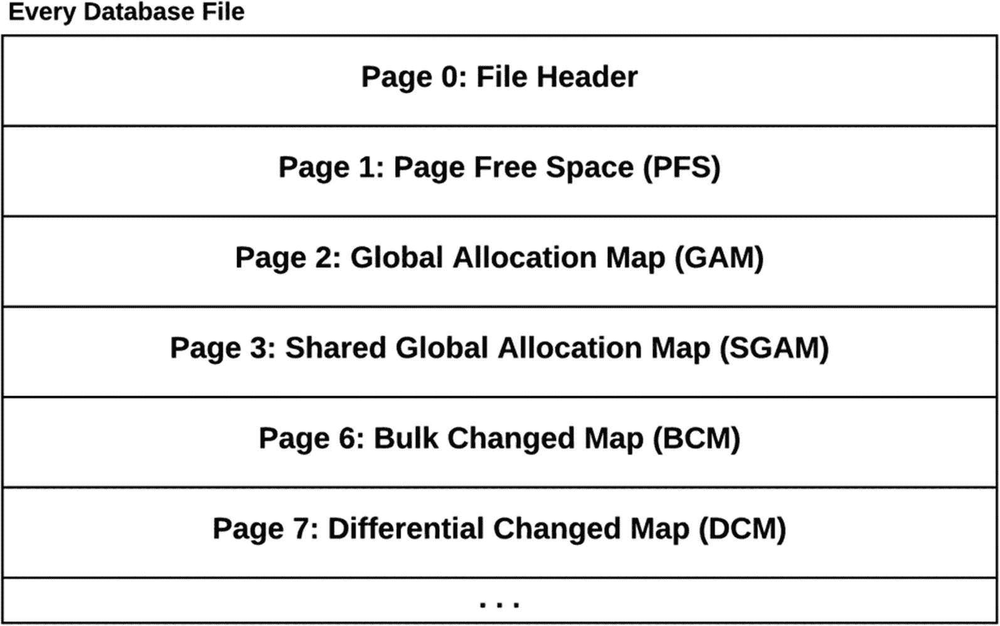
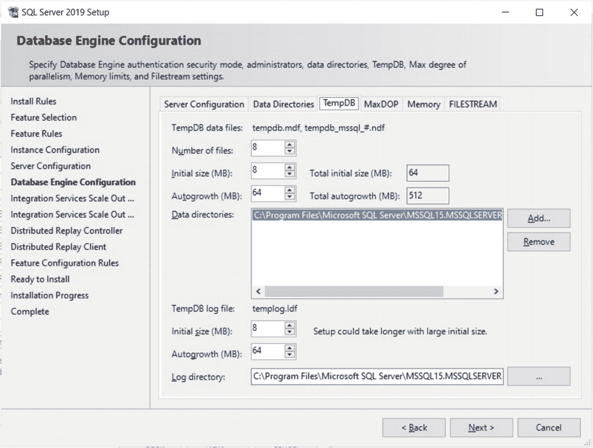
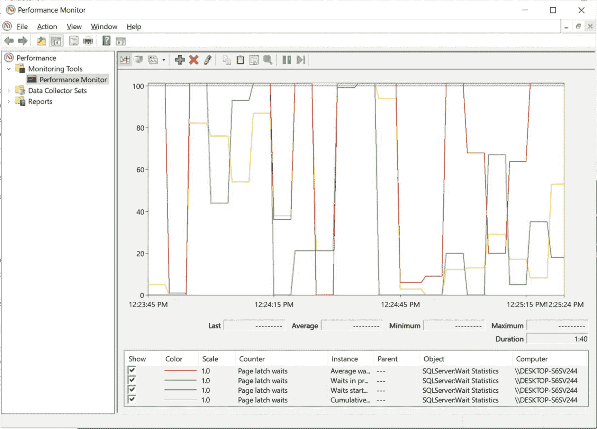
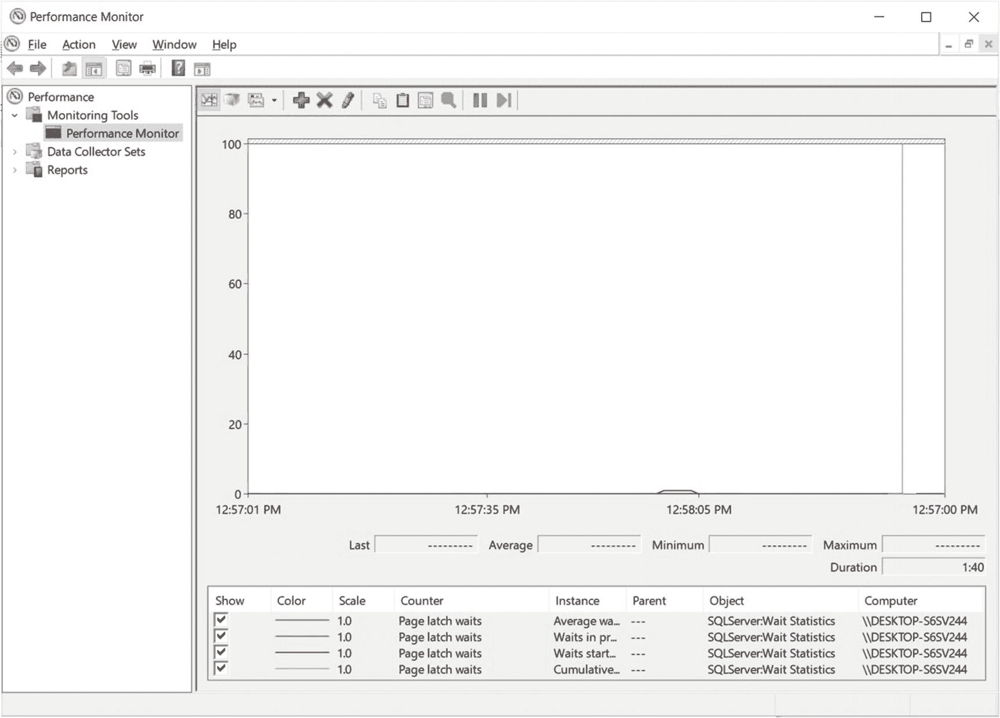

# 4. tempdb 故障排除与配置

`tempdb` 是一个系统数据库，用于保存由用户或系统创建的临时对象。与其他数据库不同，`tempdb` 在每次 SQL Server 启动时都会重新创建。`tempdb` 的各种用途通常可分为三类：用户对象、内部对象和版本存储对象。

1.  **用户对象**：用于用户直接创建的对象，如全局和局部临时表、表变量或临时存储过程。

2.  **内部对象**：用于内部对象，包括存储排序、Spool、游标和服务中介器信息的临时数据的工作表，以及用于哈希连接和哈希聚合操作的工作文件。用户无法直接创建这些内部对象。

3.  **版本存储对象**：用于快照隔离级别的行版本控制、联机索引操作、`AFTER` 触发器和 MARS（多个活动结果集）。

本章讨论的性能问题主要影响前两个领域，即用户对象和内部对象。其中一个性能问题——在我早年担任数据库管理员时，我们在一个新应用程序上线那天才艰难地意识到的问题——是 `tempdb` 争用。在短时间内创建大量用户对象可能导致分配页的闩锁争用，也称为 DML（数据操作语言）争用。系统目录的争用，也称为 DDL（数据定义语言）争用，虽然不常见，但在某些重度使用场景下也可能发生。

关于内部对象，一些查询处理器操作，例如为排序存储中间运行结果或为哈希连接和哈希聚合存储哈希表，在使用 `tempdb` 时可能会产生性能问题，因为这些操作最初设计为在服务器内存而非磁盘上工作。在后一种情况下，`tempdb` 本身并不是问题，而是这些操作需要使用 `tempdb`，这显然比内存访问慢。

SQL Server 2019 引入了该产品历史上可能最大的 tempdb 性能改进。从这个版本开始，可以配置 tempdb 使用基于内存优化的元数据，这是一个基于内存中 OLTP 的功能。启用此配置后，tempdb 元数据现在可以移动到无闩锁的非持久化内存优化表中，从而完全消除元数据争用。

由于内存优化的 tempdb 元数据在 SQL Server 2019 中是一个可选配置，并且 DML 争用在所有版本的产品中仍然是一个性能问题，我仍将在本章首先更详细地介绍这个问题。内存优化的 tempdb 元数据将在本章后面介绍。


## DML 争用

如前所述，`tempdb` 面临的两大性能问题之一是在分配页上的锁存争用，这也被称为 DML 争用，因为它主要是由临时表上的 `INSERT`、`UPDATE` 和 `DELETE` 操作引起的。为了分析问题并讨论变通方法和可能的解决方案，让我们从介绍分配页开始。锁存已在第 1 章介绍过。如图 4-1 所示，每个数据库的数据文件都以一个文件头页开始，后面跟着 `PFS`、`GAM`、`SGAM`、`BCM` 和 `DCM` 页。



图 4-1：数据文件页

`PFS`（页面可用空间）页记录数据库文件中每个页的分配状态，是文件头页之后数据库中的第一页。`PFS` 页中的每个字节记录一个特定页的信息，这意味着一个 `PFS` 页只能覆盖有限数量的页，在这种情况下是 8088 个。在一个足够大的数据库中，数据文件中每 8088 个页就会出现一个新的 `PFS` 页，大约每 64 MB 一个，因此您可以在第 1、8088、16176、24264 等页找到 `PFS` 页。`PFS` 页中每个字节的第 0-2 位表示该页是否为空，或者如果非空则表示其满的百分比，而第 3-7 位则保存与我们主题无关的其他页面信息。

`GAM` 和 `SGAM` 与区有关，因此让我首先解释页和区。如第 1 章所述，页是 SQL Server 中数据存储的基本单位，其大小为 8 KB。一个区是八个页，因此其大小为 64 KB。SQL Server 传统上使用两种区：混合区和统一区。混合区用于小对象，这些对象至少最初可以容纳在一个页中。通过使用混合区，它们最多可以分配八个不同的对象。另一方面，统一区（也称为专用区）用于较大的对象，其中所有八个页都由同一个对象使用。

`GAM`（全局分配映射）页使用每个区仅一位的信息来跟踪已分配的区。一个 `GAM` 页跟踪 64,000 个区的信息，这涵盖了近 4 GB 的数据。`GAM` 和 `SGAM` 页每 511,232 个页出现一次，因此您可以在第 3、511232、1022464、1533696 等页找到 `GAM` 页。

`SGAM`（共享全局分配映射）页跟踪至少有一个未使用页的混合区。与 `GAM` 页类似，它每个区使用一位，并包含 64,000 个区的信息，覆盖近 4 GB 的数据。值 1 表示至少有一个未使用页的混合区，值 0 表示统一区或没有空闲页的混合区。如前所述，您可以在第 4、511233、1022465、1533697 等页找到 `SGAM` 页。

`IAM`（索引分配映射）页跟踪表或索引每个分配单元使用的区，覆盖 4 GB 数据库文件中的区。

`DCM`（差异更改映射，也称为 DIFF）页跟踪自上次 `BACKUP DATABASE` 语句以来已更改的区，对于已修改的区值为 1，对于未修改的区值为 0。

`BCM`（批量更改映射）页跟踪自上次 `BACKUP LOG` 语句以来通过批量日志记录操作修改的区，对于已修改的区值为 1，对于未修改的区值为 0。它也被称为 `ML`（最小日志记录）。

您可以使用未公开的语句 `DBCC PAGE` 来验证一个页是 `PFS`、`GAM` 还是 `SGAM` 页，其语法如下：

```
DBCC PAGE ( {'dbname' | dbid}, filenum, pagenum [, printopt={0|1|2|3} ])
```

**注意**：尽管 `DBCC PAGE` 是一个未公开且不受支持的语句，使用风险自负，但它相对安全，并被 SQL Server 社区广泛使用。

页类型将在页头中显示为 `m_type`。虽然有很多页类型，但就本章目的而言，一些有趣的值包括：

*   1: 数据页
*   2: 索引页
*   8: `GAM` 页
*   9: `SGAM` 页
*   10: `IAM` 页
*   11: `PFS` 页
*   15: 文件头页
*   16: `DCM` 映射页
*   17: `BCM` 映射页

例如，运行

```
DBCC TRACEON(3604)
DBCC PAGE('tempdb', 1, 1, 0)
```

其中前三个参数分别是数据库名称、文件 ID 和页码。最后一个选项 `printopt` 为 0，请求仅打印我们要检查的页的页头信息。需要 `DBCC TRACEON(3604)` 将语句的输出发送到 SQL Server Management Studio，您可以在“消息”选项卡中查看输出。部分输出如下所示，其中 `m_type 11` 显示它是一个 `PFS` 页，在本例中是文件中的第一个 `PFS` 页：

```
m_pageId = (1:1)                  m_headerVersion = 1                m_type = 11
m_typeFlagBits = 0x1              m_level = 0                        m_flagBits = 0x0
m_objId (AllocUnitId.idObj) = 99  m_indexId (AllocUnitId.idInd) = 0
Metadata:
AllocUnitId = 6488064
Metadata: PartitionId = 0         Metadata: IndexId = 0              Metadata: ObjectId = 99
```

对于 `pagenum` 使用值 2、3、6 和 7 将分别返回 `GAM`、`SGAM`、`DCM` 和 `BCM` 页。您可以尝试使用其他提到的值，例如 8088、16176、24264 等，来获取其他的 `PFS` 页（假设文件足够大）。

SQL Server 2019 新增的 `sys.dm_db_page_info` DMF（动态管理函数）最终成为一个有文档记录且受支持的获取数据库中页面信息的方法。虽然 `DBCC PAGE` 功能更多，但 `sys.dm_db_page_info` DMF 在许多情况下仍然非常有用。当需要页面的全部内容时，仍然需要 `DBCC PAGE`。

`sys.dm_db_page_info` 的参数与 `DBCC PAGE` 所需的参数非常相似。您需要提供数据库 ID、文件 ID、页面 ID 和一个模式（mode），该模式决定了返回信息的详细程度。`mode` 的值可以是 `LIMITED` 和 `DEFAULT`。例如，我们最后的 `DBCC PAGE` 语句可以用以下方式运行：

```
SELECT * FROM sys.dm_db_page_info(2, 1, 1, 'DETAILED')
```

有关 SQL Server 页和区的更多详细信息，请参阅“页和区体系结构”，网址为 [`https://technet.microsoft.com/en-us/library/cc280360`](https://technet.microsoft.com/en-us/library/cc280360)`(v=sql.105).aspx`。有关 `DBCC PAGE` 的更多详细信息，请参阅 [`https://blogs.msdn.microsoft.com/sqlserverstorageengine/2006/06/10/how-to-use-dbcc-page/`](https://blogs.msdn.microsoft.com/sqlserverstorageengine/2006/06/10/how-to-use-dbcc-page/)。

## 描述 tempdb 闩锁争用

每当需要在 `tempdb` 中创建一个新对象（通常是临时表），并且至少插入一行数据时，必须从混合区中分配两个新页面并分配给该新对象。一个是 IAM 页面，第二个是数据页。在此过程中，SQL Server 还必须访问并更新数据文件中的第一个 PFS 页面和第一个 SGAM 页面。

如第 1 章所述，一次只能有一个线程通过请求其上的闩锁来更改一个分配页。当活动量很大，并且在 `tempdb` 中创建和删除大量临时表时，PFS 和 SGAM 页面上可能会发生争用。请记住，这不是一个 I/O 问题，因为在这种情况下分配页已经在内存中。显然，这种争用会影响创建这些表的进程的性能，因为它们可能必须等待，并且 SQL Server 可能会在短时间内显得无响应。请记住，尽管用户数据库也使用分配页，但它们不太可能遇到闩锁争用问题，因为不像在 `tempdb` 中那样同时创建那么多对象。

回到 SQL Server 2000 时代，当删除临时表时，这些页面需要被释放，这需要在 PFS 页面上获得一个新的闩锁，并可能在 SGAM 页面上再获得一个闩锁。SQL Server 2005 引入了一项优化——临时表缓存，通过在删除临时表时缓存一个 IAM 页面和一个数据页来改进此机制，如果必须再次创建相同的临时表或表变量，则可以重复使用它们，从而避免访问分配位图页面。然而，这种缓存机制有一些局限性，在 `tempdb` 使用繁重的系统上并不能完全避免闩锁争用。

检查 `tempdb` 分配页上是否存在闩锁争用问题的最简单方法是查看数据库活动中的 `PAGELATCH_XX` 等待。请注意，它们与 `PAGEIOLATCH_XX` 等待不同。运行以下代码：

```sql
SELECT * from sys.dm_os_waiting_tasks
WHERE wait_type LIKE 'PAGE%LATCH%'
AND resource_description LIKE '2:%'
```

或者，你也可以尝试以下方法：

```sql
SELECT * FROM sys.dm_exec_requests
WHERE wait_type LIKE 'PAGE%LATCH%'
AND wait_resource LIKE '2:%'
```

或

```sql
SELECT * FROM sysprocesses
WHERE lastwaittype LIKE 'PAGE%LATCH%'
AND waitresource LIKE '2:%'
```

注意

传统上，`sysprocesses` 被广泛用于获取这些闩锁等待信息，你很可能在旧代码示例和其他来源中仍然看到它。由于它是 SQL Server 2000 的系统表，在新版本中仅作为视图包含以保持向后兼容性，因此不应在新代码中使用。

`sys.dm_os_waiting_tasks` 中的 `resource_description` 列根据所消耗的资源有大量格式。对于闩锁争用，我们感兴趣的格式是 `<db-id>:<file-id>:<page-in-file>`，分别代表数据库 ID（对于 tempdb 始终为 2）、文件 ID 和文件中的页。如果你看到 `resource_description` 为 `2:1:1` 和 `2:1:3`，你立即就能知道它们分别是 PFS 和 SGAM 页面。`wait_type` 通常是 `PAGELATCH_UP`，尽管 `PAGELATCH_EX` 也可能出现，文件 ID 很可能为 1。文件 ID 大于 1 的情况并不常见，因为创建额外的文件是解决此问题的一种方法，如下一节所示。

## 修复 tempdb 闩锁争用

在我看来，对于闩锁争用问题没有完美的解决方案，因为随着操作数量的增加，数据库引擎应该能够自动升级并正常工作。一个显而易见的解决方案可能是最小化同时在 `tempdb` 中创建的临时表数量，但这可能不容易实现，因为它需要代码和应用程序的更改。请记住，内部对象（例如由排序和哈希操作创建的对象）不是由用户显式创建的，并且不需要本节讨论的分配方法。然而，这些内部对象由于其他原因也是性能问题，我们将在后面讨论。

在 SQL Server 2016 之前，历史上解决这些问题的变通方法是以下一种或多种选择的组合：

1.  使用多个数据文件
2.  启用跟踪标志 1118
3.  启用跟踪标志 1117

我们将在以下各节中介绍这些方法。

### 使用多个数据文件

解决闩锁争用问题的一种可能方法是为 `tempdb` 使用多个数据文件。通过使用多个文件，分配位图将分布在这些文件上，从而最小化争用，因为 SQL Server 将在它们之间平衡传入请求。使用多个文件可以帮助解决 PFS 和 SGAM 页面的问题，并且使用如后文所示的跟踪标志 1118 也可以大大减少 SGAM 页面的使用。

多年来一直争论的一个问题是 `tempdb` 的最佳文件数量应该是多少。事实上，应用程序可以以不同的方式使用 `tempdb` 并具有不同的工作负载，因此很难为每种情况推荐一个特定的数字。幸运的是，有一个很好的建议适用于大多数用例，即为 SQL Server 实例可用的每个逻辑处理器创建一个数据文件，最多八个文件。如下所示，从 SQL Server 2016 开始，此建议现在成为安装软件时 `tempdb` 的默认配置选项。如第 1 章所述，SQL Server 为可用的每个逻辑处理器创建一个调度器，因此逻辑处理器的数量也是并发线程的最大数量。拥有多个文件意味着有多个 PFS 和 SGAM 页面，这意味着可以同时进行更多的分配，减少争用，因为线程不必等待一组分配页面。但这只是一个通用准则，在某些情况下，高 `tempdb` 使用率仍可能显示争用。在这些情况下，建议以四个为增量创建额外的数据文件，直到达到系统中可用的逻辑处理器数量。

如下一节所述，`tempdb` 上的数据文件应创建为相同的大小并具有相同的自动增长设置。


#### 跟踪标志 1117 和 1118

由于 SQL Server 使用 SGAM 页面来查找至少有一个未使用页面的混合区，解决 SGAM 争用问题的一个可能方法是完全避免混合区，改为专门使用统一区。自 SQL Server 2000 起，`跟踪标志 1118` 就可用于实现此目的。通过禁用大多数单页分配并改用专用区，可以减少 SGAM 页面上的争用。使用 `跟踪标志 1118` 的一个缺点是，每个对象都将使用一个专用区，这需要八个页面。如果对象小到只能容纳一个页面，这实际上是在浪费空间。也就是说，如果对象只需要 8 KB 的空间，它将不得不使用 64 KB，从而浪费 56 KB 的存储空间。另一个缺点是，此配置在实例级别生效，同样会影响用户数据库。SGAM 页面仍将被使用，因为 IAM 页面仍需要从混合区进行单页分配，但 SGAM 争用很可能会被消除或大幅最小化。

`跟踪标志 1117` 与 SQL Server 在启用文件组中所有文件的均匀增长时如何增加数据库文件的大小有关。此讨论需要先介绍三个要点：

1.  不要依赖自动增长。
2.  配置数据库即时文件初始化。
3.  创建大小相等的数据文件。

不要依赖默认的自动增长配置，但应启用它并配置合适的文件增长参数，以便将其作为最后的手段。生产环境很可能有一个专用的驱动器用于 `tempdb`，如果不是为数据文件和事务日志文件分别准备专用驱动器的话。如果你处于这种情况，只需为 `tempdb` 文件分配尽可能多的空间。这将有助于避免在生产操作期间增长数据库文件，从而导致不必要的开销。同时，它将最大限度地减少碎片。

配置数据库即时文件初始化，这在第 3 章中有详细介绍，并在下一节中简要描述。

创建大小相等的数据文件。SQL Server 使用一种称为比例填充算法的机制，该算法会考虑数据库文件的当前大小（至少在文件组级别）。此算法决定了文件被使用和写入的顺序。它试图以轮询方式将分配分散到各个页面上。当文件大小不相同时，会存在一个不幸的行为：它不会在数据库的所有数据文件之间均匀分散 GAM 分配，而是会倾向于最大的文件。因此，确保所有数据文件大小相同至关重要。

`跟踪标志 1117` 通过按配置的增量同时增长所有 `tempdb` 文件来帮助你避免此问题。然而，与 `跟踪标志 1118` 的情况类似，`跟踪标志 1117` 适用于整个 SQL Server 实例，在用户数据库上作用于文件组级别。你可能需要检查此设置，因为它可能会对用户数据库上的文件组造成问题。

正如我们将在下一节看到的，`跟踪标志 1117` 和 `1118` 的行为现在可以在数据库级别进行配置。

#### SQL Server 2016 增强功能

SQL Server 2016 针对 `tempdb` 引入了几项重要的增强功能，因此我们在本节中讨论它们。如本章引言所述，之前的某些 `tempdb` 建议现在在 SQL Server 2016 中默认配置或启用。让我们从 SQL Server 安装过程开始。

在 SQL Server 安装过程中的一个屏幕（如前一章图 3-3 所示），现在允许你选择授予 SQL Server 数据库引擎服务帐户“执行卷维护任务”特权，从而自动启用即时文件初始化。在早期版本的 SQL Server 中，这是一个必须与 SQL Server 安装或配置过程分开进行配置的选项。

默认情况下，当创建或还原数据库（或添加、扩展或还原文件）时，文件首先通过填充零来初始化。在某些情况下，根据文件大小，这可能非常耗时。通过启用即时文件初始化，SQL Server 会跳过文件清零过程，使该过程几乎是瞬间完成的。跳过此过程的唯一缺点，正如图 3 中提到的安装屏幕所警告的那样，是避免清零数据页“可能导致信息泄露，因为它可能允许未经授权的主体访问已删除的内容”。有关即时文件初始化功能的更多详细信息，请参阅第 3 章。

在安装过程的后期，SQL Server 允许你配置 `tempdb`。与早期版本的 SQL Server 不同，安装过程现在建议数据文件的数量与系统中可用的逻辑处理器数量相同，最多为八个。如果你不采取任何操作，这将是默认配置，如图 4-2 所示。



图 4-2

安装过程中的 Tempdb 配置

注意

如图 4-2 所示，也请务必根据你的应用程序工作负载和要求正确配置初始数据文件大小和自动增长大小。

如果你执行命令行安装，此默认数据文件数量也将自动配置；并且，你可以选择使用 `/SQLTEMPDBFILECOUNT` 安装参数指定不同的值。有关此参数和其他与 `tempdb` 相关的安装参数的更多详细信息，请参阅“从命令提示符安装 SQL Server”，网址为 [`https://docs.microsoft.com/en-us/sql/database-engine/install-windows/install-sql-server-from-the-command-prompt`](https://docs.microsoft.com/en-us/sql/database-engine/install-windows/install-sql-server-from-the-command-prompt)。

在撰写本文时，创建 Microsoft Azure SQL Server 2019 映像仍会为多处理器虚拟机预配单个数据文件。因此，你可能仍需要手动相应地配置文件数量。

SQL Server 2016 引入的另一个重大变化是，`tempdb` 中不再需要 `跟踪标志 1117` 和 `1118`，因为它们的行为现在为此数据库自动启用。SQL Server 2016 及更高版本中的 `tempdb` 将使用统一区进行对象分配，并且默认情况下也会同时按配置的增量增长所有 `tempdb` 文件。`跟踪标志 1117` 和 `1118` 最初提供的行为，现在通过 `ALTER DATABASE` 语句在数据库级别提供。


从 SQL Server 2016 开始，跟踪标志 1118 的行为已成为 `tempdb` 和所有用户数据库的默认行为。这意味着在这些数据库上创建的对象将使用统一区。剩余的系统数据库，`master` 和 `msdb`，仍将使用混合区。一个新的 `ALTER DATABASE` 选项，`MIXED_PAGE_ALLOCATION`，允许你更改此默认设置，并在单个数据库级别改为使用混合区。

对于用户数据库，跟踪标志 1117 的行为默认是禁用的，但可以使用 `ALTER DATABASE` 的 `AUTOGROW_SINGLE_FILE` 和 `AUTOGROW_ALL_FILES` 文件及文件组选项在数据库级别进行更改。`AUTOGROW_SINGLE_FILE` 是默认选项，允许增长文件组中的单个文件；而 `AUTOGROW_ALL_FILES` 则允许在达到自动增长阈值时增长文件组中的所有文件。

对于 `tempdb`，`AUTOGROW_ALL_FILES` 文件组属性默认是开启的，并且无法修改（`tempdb` 只允许使用主文件组）。`MIXED_PAGE_ALLOCATION` 数据库选项默认是关闭的，同样无法修改。尝试更改这些设置中的任何一个都会返回错误消息，指出该选项无法在 `tempdb` 数据库中设置。这意味着 `tempdb` 的配置完全符合 SQL Server 2016 之前通过跟踪标志所建议的最佳实践。

最后，请记住，即使从 SQL Server 2016 开始提供了这些配置和默认设置，在 `tempdb` 使用率高的系统上，争用仍然可能发生，因此本章提供的额外信息对于解决这些问题可能仍然有用。

## SQL Server 2019 中的新内容

SQL Server 2017 主要是为了发布 Linux 版本，因此在 tempdb 方面没有太多重要的增强功能。可能唯一的改进是安装过程现在允许指定初始 tempdb 文件大小，最高可达每个文件 256 GB，但也就仅此而已。实际上，颇具讽刺意味的是，SQL Server 2016 的改进之一——在安装过程中创建多个数据文件的功能——甚至没有进入 2017 年的 Linux 版本。

从 SQL Server 2019 开始，你现在也可以在 Linux 上新安装 SQL Server 期间创建多个数据文件，与在 Windows 上安装 SQL Server 一样。

针对最新版本的第二个改进是对 PFS 更新的改进。在此版本中，PFS 页面（本章前面已描述）现在可以使用共享锁存器而非独占锁存器进行更新，极大地有助于缓解 PFS 页面上的页面锁存争用。此行为默认在所有实例数据库（显然包括 tempdb）上启用。

但毫无疑问，SQL Server 2019 版本最重要的 tempdb 增强功能是内存优化的 tempdb 元数据。我将在下一节介绍此功能。

## 内存优化的 tempdb 元数据

如本章开头所述，SQL Server 2019 引入了可能是该产品历史上最大的 tempdb 性能改进，最终缓解了一个多年来一直影响 SQL Server 的问题。从这个版本开始，你现在可以配置 tempdb 使用内存优化的元数据，这是一项基于内存中 OLTP（In-Memory OLTP）技术的功能。通过启用此 tempdb 配置，tempdb 元数据现在可以移动到无锁存、非持久化的内存优化表中，从而从技术上消除了元数据争用。

要启用内存优化的 tempdb 元数据，你可以使用以下语句：

```
ALTER SERVER CONFIGURATION SET MEMORY_OPTIMIZED TEMPDB_METADATA = ON
```

你可以随时运行以下代码来验证该功能是否已启用：

```
SELECT SERVERPROPERTY('IsTempdbMetadataMemoryOptimized')
```

启用该功能需要重启 SQL Server 服务。如果你日后因任何原因决定禁用该功能，同样需要重启服务。

此功能仍有一些限制，但它仍然是一个巨大的改进，我们希望这些限制能在未来的累积更新或产品的新版本中得以消除。该功能当前的限制是：

1.  正如我们将在第 7 章中介绍的，内存中 OLTP 的一个当前限制是单个事务不能访问多个数据库中的内存优化表。对于 tempdb 也是如此，这意味着你不能在同一个事务中访问用户数据库中的内存优化表的同时访问 tempdb 中的系统视图。
2.  在启用内存优化的 tempdb 元数据时，无法在临时表上创建列存储索引。
3.  不支持使用 `sp_estimate_data_compression_savings` 的 `COLUMNSTORE` 或 `COLUMNSTORE_ARCHIVE` 参数。
4.  如前所述，启用或禁用此功能需要重启 SQL Server 服务。

如你所见，此列表中的第一个限制实际上是内存中 OLTP 的一个限制，并且由于它主要影响目录或系统视图，可能对你的应用程序限制不大。最后，如果你需要禁用此功能，可以运行以下语句，这需要重启 SQL Server 服务：

```
ALTER SERVER CONFIGURATION SET MEMORY_OPTIMIZED TEMPDB_METADATA = OFF
```

让我们运行一个完整的示例。以下代码创建一个临时表并向其插入一行。我们将通过同时运行此代码数千次来创建一个开销较大的工作负载。实现此目的的一种简单方法是使用 ostress 实用程序。将以下代码保存到一个名为 tempdbtest.sql 的文件中：

```
CREATE TABLE #tempdbtest (id int, name char(7000))
INSERT INTO #tempdbtest VALUES (1, 'tempdb test')
```

注意：你可以从 [`www.microsoft.com/en-us/download/details.aspx`](https://www.microsoft.com/en-us/download/details.aspx%253Fid%253D4511) 下载 ostress 实用程序，它是 SQL Server 的 RML 实用程序的一部分。

准备好你的系统以运行以下命令：

```
ostress -n5000 -itempdbtest.sql
```

基本上，这会使用 5000 个同时连接来运行我们保存在文件 tempdbtest.sql 中的代码。你可能还需要提供一个文件路径。

我们将以两种不同的方式监控等待：使用性能监视器 (perfmon) 和查询 `sys.dm_os_waiting_tasks` DMV。请准备好在负载运行时运行以下查询。我们知道在交互式运行查询时可能会错过一些等待，因此我们想用性能监视器的数据来补充。`sys.dm_os_waiting_tasks` 和 `PAGE_LATCH` 等待在本章前面已介绍过。收集等待信息的其他方法将在下一章介绍。

```
SELECT * FROM sys.dm_os_waiting_tasks
WHERE wait_type LIKE 'PAGE%LATCH%'
AND resource_description LIKE '2:%'
```

打开性能监视器并添加以下计数器：

*   对象: `SQLServer:Wait Statistics`


## 页面锁等待与内存优化 tempdb

*   计数器：页面锁等待
*   实例：全部
*   平均等待时间（毫秒）
*   每秒累计等待时间（毫秒）
*   正在进行的等待
*   每秒开始的等待数

使用 `ostress` 运行首次负载测试。你可能会看到类似图 4-3 中所示的性能监视器数据。



图 4-3

显示 `PAGE_LATCH` 等待的性能监视器

你也可以交互式地运行 `sys.dm_os_waiting_tasks` DMV 查询。我们只对获取一个小样本感兴趣，因此无需多次运行。以下是我系统上的一个示例结果：

| waiting_task_address | session_id | exec_context_id | wait_duration_ms | wait_type |
| --- | --- | --- | --- | --- |
| 0x00000187F8053848 | 115 | 0 | 217 | PAGELATCH_EX |
| 0x00000187E55BB848 | 59 | 0 | 235 | PAGELATCH_EX |
| 0x00000187E55BB088 | 108 | 0 | 235 | PAGELATCH_EX |
| 0x00000187F8053C28 | 123 | 0 | 210 | PAGELATCH_EX |

如你所见，系统中存在大量的 `PAGELATCH_EX` 等待。对于本次练习，数字并不重要。现在执行以下命令以启用内存优化的 `tempdb` 元数据。然后重新启动 `SQL Server` 服务。

```
ALTER SERVER CONFIGURATION SET MEMORY_OPTIMIZED TEMPDB_METADATA = ON
```

在 `SQL Server` 重新上线后，再次运行 `ostress` 负载。查看性能监视器数据并再次运行等待查询。两者都将显示完全没有 `PAGELATCH_EX` 等待。性能监视器屏幕如图 4-4 所示，显示没有任何等待（你必须相信我确实运行了负载）。



图 4-4

无页面锁等待的性能监视器

如果需要，你可以如前面所示禁用内存优化 `tempdb` 元数据特性来结束练习。我将在下一章更详细地介绍等待。

## tempdb 事件

你可以通过检查分配环形缓冲区来分析 `tempdb` 数据库中的分配和解除分配信息，这可以使用未文档化的跟踪标志 1106 来启用。但请注意，启用它肯定会影响系统的性能，因此不要在生产或繁忙的系统上使用它。以下是一个工作原理示例。首先启用跟踪标志 1106。

```
DBCC TRACEON (1106, -1)
```

然后你可以使用以下代码检查分配环形缓冲区：

```
DECLARE @ts_now bigint;
SELECT @ts_now=cpu_ticks/(cpu_ticks/ms_ticks)
FROM sys.dm_os_sys_info;
SELECT record_id,
DATEADD(ms, -1 * (@ts_now - [timestamp]), GETDATE()) as event_time,
CASE
WHEN event = 0 THEN 'Allocation Cache Init'
WHEN event = 1 THEN 'Allocation Cache Add Entry'
WHEN event = 2 THEN 'Allocation Cache RMV Entry'
WHEN event = 3 THEN 'Allocation Cache Reinit'
WHEN event = 4 THEN 'Allocation Cache Free'
WHEN event = 5 THEN 'Truncate Allocation Unit'
WHEN event = 10 THEN 'PFS Alloc Page'
WHEN event = 11 THEN 'PFS Dealloc Page'
WHEN event = 20 THEN 'IAM Set Bit'
WHEN event = 21 THEN 'IAM Clear Bit'
WHEN event = 22 THEN 'GAM Set Bit'
WHEN event = 23 THEN 'GAM Clear Bit'
WHEN event = 24 THEN 'SGAM Set Bit'
WHEN event = 25 THEN 'SGAM Clear Bit'
WHEN event = 26 THEN 'SGAM Set Bit NX'
WHEN event = 27 THEN 'SGAM Clear Bit NX'
WHEN event = 28 THEN 'GAM Zap Extent'
WHEN event = 40 THEN 'Format IAM Page'
WHEN event = 41 THEN 'Format Page'
WHEN event = 42 THEN 'Reassign IAM Page'
WHEN event = 50 THEN 'Worktable Cache Add IAM'
WHEN event = 51 THEN 'Worktable Cache Add Page'
WHEN event = 52 THEN 'Worktable Cache RMV IAM'
WHEN event = 53 THEN 'Worktable Cache RMV Page'
WHEN event = 61 THEN 'IAM Cache Destroy'
WHEN event = 62 THEN 'IAM Cache Add Page'
WHEN event = 63 THEN 'IAM Cache Refresh Requested'
ELSE 'Unknown Event'
END as event_name,
session_id as s_id,
page_id,
allocation_unit_id as au_id
FROM
(
SELECT
xml_record.value('(./Record/@id)[1]', 'int') AS record_id,
xml_record.value('(./Record/SpaceMgr/Event)[1]', 'int') AS event,
xml_record.value('(./Record/SpaceMgr/SpId)[1]', 'int') AS session_id,
xml_record.value('(./Record/SpaceMgr/PageId)[1]', 'varchar(100)') AS page_id,
xml_record.value('(./Record/SpaceMgr/AuId)[1]', 'varchar(100)') AS allocation_unit_id,
timestamp
FROM
(
SELECT timestamp, convert(xml, record) as xml_record
FROM sys.dm_os_ring_buffers
WHERE ring_buffer_type = N'RING_BUFFER_SPACEMGR_TRACE'
) AS the_record
) AS ring_buffer_record
-- WHERE session_id = 52
ORDER BY record_id
```

要测试它，请尝试创建一个临时表，例如使用以下代码。你可以尝试一次运行一行代码，然后运行前面的代码来检查分配环形缓冲区，看看每条语句创建了哪些事件。如果你从其他会话获得太多事件，可以取消注释 `session_id` 部分并指定一个会话 ID 值，以便针对特定会话进行筛选：

```
CREATE TABLE #temp (c1 int, c2 varchar(20), c3 datetime)
INSERT INTO #temp VALUES (1, 'test', GETDATE())
DROP TABLE #temp
```

你可能会看到类似下面的输出：

| **record_id** | **event_name** | **s_id** | **page_id** | **au_id** |
| --- | --- | --- | --- | --- |
| 0 | PFS Alloc Page | 52 | 1:321 | 34:1 |
| 1 | Format Page | 52 | 1:321 | 34:1 |
| 2 | GAM Clear Bit | 52 | 1:336 | 34:4 |
| 3 | PFS Alloc Page | 52 | 1:336 | 34:4 |
| 4 | IAM Set Bit | 52 | 1:336 | 34:4 |
| 5 | Allocation Cache Add Entry | 52 | 1:336 | 34:4 |
| 6 | Format Page | 52 | 1:336 | 34:4 |

在继续之前，别忘了禁用跟踪标志 1106：

```
DBCC TRACEOFF (1106, -1)
```

> 注意
>
> 详细探讨每个事件超出了本书的范围，但你可以将其用作故障排除和学习工具。


之前的代码适用于 SQL Server 2012 及更高版本。对于早于 SQL Server 2012 的版本，您可以使用以下代码，因为当时环形缓冲区的名称是 `RING_BUFFER_ALLOC_TRACE`，并且该脚本还需要一些其他小改动：

```sql
DECLARE @ts_now bigint;
SELECT @ts_now=cpu_ticks/(cpu_ticks/ms_ticks)
FROM sys.dm_os_sys_info;
SELECT record_id,
DATEADD(ms, -1 * (@ts_now - [timestamp]), GETDATE()) as event_time,
CASE
WHEN event = 0 THEN '分配缓存初始化'
WHEN event = 1 THEN '分配缓存添加条目'
WHEN event = 2 THEN '分配缓存移除条目'
WHEN event = 3 THEN '分配缓存重新初始化'
WHEN event = 4 THEN '分配缓存释放'
WHEN event = 5 THEN '截断分配单元'
WHEN event = 10 THEN 'PFS 分配页'
WHEN event = 11 THEN 'PFS 释放页'
WHEN event = 20 THEN 'IAM 置位'
WHEN event = 21 THEN 'IAM 清位'
WHEN event = 22 THEN 'GAM 置位'
WHEN event = 23 THEN 'GAM 清位'
WHEN event = 24 THEN 'SGAM 置位'
WHEN event = 25 THEN 'SGAM 清位'
WHEN event = 26 THEN 'SGAM 置位 NX'
WHEN event = 27 THEN 'SGAM 清位 NX'
WHEN event = 28 THEN 'GAM 清除区'
WHEN event = 40 THEN '格式化 IAM 页'
WHEN event = 41 THEN '格式化页'
WHEN event = 42 THEN '重新分配 IAM 页'
WHEN event = 50 THEN '工作表缓存添加 IAM'
WHEN event = 51 THEN '工作表缓存添加页'
WHEN event = 52 THEN '工作表缓存移除 IAM'
WHEN event = 53 THEN '工作表缓存移除页'
WHEN event = 61 THEN 'IAM 缓存销毁'
WHEN event = 62 THEN 'IAM 缓存添加页'
WHEN event = 63 THEN 'IAM 缓存请求刷新'
ELSE '未知事件'
END as event_name,
session_id as s_id,
page_id,
allocation_unit_id as au_id
FROM
(
SELECT
xml:record.value('(./Record/@id)[1]', 'int') AS record_id,
xml:record.value('(./Record/ALLOC/Event)[1]', 'int') AS event,
xml:record.value('(./Record/ALLOC/SpId)[1]', 'int') AS session_id,
xml:record.value('(./Record/ALLOC/PageId)[1]', 'varchar(100)') AS page_id,
xml:record.value('(./Record/ALLOC/AuId)[1]', 'varchar(100)') AS allocation_unit_id,
timestamp
FROM
(
SELECT timestamp, convert(xml, record) as xml:record
FROM sys.dm_os_ring_buffers
WHERE ring_buffer_type = N'RING_BUFFER_ALLOC_TRACE'
) AS the_record
) AS ring_buffer_record
-- WHERE session_id = 52
ORDER BY record_id
```

## 使用扩展事件进行监控

除了前面介绍的 DMV 和视图外，您还可以使用扩展事件来捕获和监控与分配页上的闩锁争用相关的事件。跟踪事件的一个明显好处是，您不必在问题发生的那一刻进行观察，因为信息可以收集起来供您稍后查看。以下事件可用：

*   `latch_suspend_begin`：当执行任务必须挂起以等待闩锁以请求的模式变为可用时发生。
*   `latch_suspend_end`：当执行任务在等待闩锁后恢复时发生。
*   `latch_suspend_warning`：当等待闩锁超时时发生，可能导致性能问题。

捕获这些事件时，您可以看到的一些有趣字段如下：

*   `address`：闩锁所在的内存地址。
*   `database_id`：闩锁保护的页的数据库 ID。
*   `duration`：请求者为等待闩锁花费的微秒数（在 `latch_suspend_begin` 上不可用）。
*   `file_id`：闩锁保护的页的文件 ID。
*   `is_superlatch`：指示闩锁是否为超级闩锁。
*   `mode`：闩锁请求的模式。
*   `page_id`：闩锁保护的页的页 ID。

例如，以下代码创建了一个与闩锁相关的扩展事件会话。请注意，我们筛选了 `database_id` 为 2 且 `page_id` 为 1 和 3 的情况。

```sql
CREATE EVENT SESSION [test] ON SERVER
ADD EVENT sqlserver.latch_suspend_begin (
WHERE (database_id = 2 AND (page_id = 1 OR page_id =3))
),
ADD EVENT sqlserver.latch_suspend_end (
WHERE (database_id = 2 AND (page_id = 1 OR page_id =3))
),
ADD EVENT sqlserver.latch_suspend_warning (
WHERE (database_id = 2 AND (page_id = 1 OR page_id =3))
)
GO
```

会话创建后，您可以通过运行以下代码来启动它：

```sql
ALTER EVENT SESSION [test] ON SERVER
STATE = START
GO
```

以下是一个捕获到的 `latch_suspend_end` 数据事件样本，显示了争用情况。您可以使用“实时监视数据”功能轻松查看事件（在 SQL Server Management Studio 中，查看“管理”文件夹 ➤ “扩展事件” ➤ “会话”，右键单击您的活动会话，然后选择“实时监视数据”）。

| `address` | 513679079488 |
| --- | --- |
| `database_id` | 2 |
| `duration` | 42990 |
| `file_id` | 1 |
| `is_superlatch` | False |
| `mode` | UP |
| `page_id` | 1 |

最后，不要忘记关闭并删除会话以完成此练习：

```sql
ALTER EVENT SESSION [test] ON SERVER
STATE = STOP
GO
DROP EVENT SESSION [test] ON SERVER
GO
```

## DDL 争用

值得澄清的是，本节讨论的分配页争用有时被称为 DML 争用，因为它主要是由于对临时表的 `INSERT`、`UPDATE` 和 `DELETE` 操作引起的。这不同于，例如，DDL 争用，后者也可能发生在 `tempdb` 中，但肯定比 DML 争用少见，并且涉及记录用户创建对象信息所需的系统目录上的争用。要查看 `tempdb` 中是否有 DDL 争用，您可以使用前面描述的与 DML 争用相同的方法，但是，您可能看到的是属于系统目录表的页上的争用，而不是分配页上的争用。不幸的是，解决 DDL 争用需要最小化在 `tempdb` 中创建和删除的用户对象数量。


## tempdb 溢出警告

尽管 SQL Server 中的每个查询都需要一些内存来执行其工作，但某些查询操作（如哈希、排序和交换）可能需要显著更多的内存，具体取决于它们需要处理的数据量。这些内存用于存储待排序的行，或用于构建哈希连接和哈希聚合运算符所使用的哈希表。在某些情况下，并行查询计划（包含多个范围扫描）也可能需要内存授权。查询优化器通常能较好地估算所需内存量，如果内存可用，它将在执行时提供给运算符。

然而，如第 1 章所述，当分配的内存不足，哈希、排序和并行或交换运算符被迫进行额外的数据处理或使用 `tempdb` 数据库（溢出到磁盘）时，可能会导致性能问题。这些问题通常源于基数估计不佳，查询优化器可能低估了查询所需的内存量。由于授予查询的内存可能少于所需，排序操作或哈希操作的生成输入可能无法容纳在可用内存中。一旦查询开始执行，即使没有足够的内存，它也必须继续运行。

你可以使用 `sort_warning`、`hash_warning` 和 `exchange_spill` 扩展事件（或 `Sort Warning`、`Hash Warning` 和 `Exchange Spill` 跟踪事件类）来监控系统中可能发生的这些性能问题。从 SQL Server 2016 开始，你还可以使用第 6 章介绍的“实时查询统计信息”功能，这也有助于实时查看这些性能问题，因为这些操作可能占据查询执行的很大一部分。

除了性能问题外，由于访问磁盘比访问内存慢数倍，这些操作可能在 `tempdb` 上创建大量内部对象，从而导致磁盘空间问题。我曾在此类场景中见过问题查询向 `tempdb` 写入数十或数百 GB 的数据。我们将在下一节更详细地讨论如何监控 `tempdb` 使用的磁盘空间量。

由于此问题的主要原因是查询优化器低估了所需内存，因此修复它的最佳行动方案是确保统计信息存在且是最新的。根据具体问题，将给出额外的建议，如下三节所示。

### 排序警告

排序警告由需要排序的查询产生，例如使用 `ORDER BY` 子句时。`sort_warning` 扩展事件提供了用于排查此问题的附加数据，包括实际排序行数、授予的内存量、使用的内存量，以及从工作表读取和写入的页数。你应该特别注意 `sort_warning_type` 列，它显示是否需要单次额外遍历或多次遍历来获取排序输出。此警告类型信息也可通过使用 `EventSubClass` 列的 `Sort Warning` 跟踪事件获得。该事件还包括 `query_operation_node_id` 列，你可以使用它来识别是哪个运算符导致了 `tempdb` 溢出，或者也可以查看执行计划以查找排序运算符上的警告或 `SpillToTempDb` 属性。避免排序警告的一个典型解决方案是为查询添加适当的索引。更多关于索引的详细信息将在第 9 章介绍。

### 哈希警告

当哈希连接没有足够的内存来创建其哈希表时，会产生哈希警告。哈希连接的工作原理是在内存中创建一个称为生成输入的哈希表。连接的第二个输入（称为探测输入）将被读取并与哈希表进行比较，返回匹配的行。查询优化器将选择两个连接表中较小的一个作为生成输入，并且通常能正确估计其哈希表所需的内存量。如果估计不正确，查询处理器甚至可以在执行时反转这两个角色，选择新的较小输入作为生成输入。

但是，当对此哈希表所需内存的估计不佳时，仍然可能出现性能问题。由于查询可能没有分配足够的内存，可能需要 SQL Server 在 `tempdb` 中使用一个工作文件。

当生成输入无法容纳在可用内存中时，SQL Server 必须首先将其行分成多个分区，分别进行处理。如果其中任何分区仍然无法容纳在可用内存中，它们将被分成子分区，并再次分别处理。此拆分过程将持续进行，直到每个分区都能容纳在可用内存中，或者达到最大递归级别。最大递归级别在事件的 `recursion_level` 列（或 SQL 跟踪中的 `IntegerData` 列）中显示，并对应于生成输入被子分区的次数。此整个过程称为哈希递归。

当哈希递归达到最大递归级别时，查询处理器将尝试使用称为哈希中止的不同过程来处理剩余数据。SQL Server 将在执行期间使用 `hash_warning_type` 事件列（或 `Hash Warning` 跟踪事件中的 `EventSubClass` 列）显示使用的是哈希递归还是哈希中止。

与前面讨论的排序警告类似，`hash_warning` 扩展事件提供了额外的故障排除数据，例如包括实际唯一哈希行数、授予的内存量、使用的内存量，以及从工作表读取和写入的页数。

要避免哈希警告问题，除了前面提到的关于统计信息的一般建议外，你可以尝试使用不同的连接类型。或者，如果你服务器上的内存有限，可以增加可用内存。使用不同的连接类型可能需要使用查询提示，并且应仔细测试以验证其是否确实提高了查询性能。

### 交换警告

最后，交换警告比其他两种更少见，它发生在并行计划中的通信缓冲区被临时写入 `tempdb` 数据库时。如第 1 章所述，交换运算符负责通过同时使用多个处理器执行查询来实现 SQL Server 中的并行。交换警告问题仅在你有多个有序范围扫描的情况下发生。在这种情况下，你可以尝试避免使用 `ORDER BY` 子句，尝试避免多个范围扫描，尝试使用索引提示以不同的方式访问表，甚至极端情况下避免并行计划，例如使用 `MAXDOP` 查询提示。


