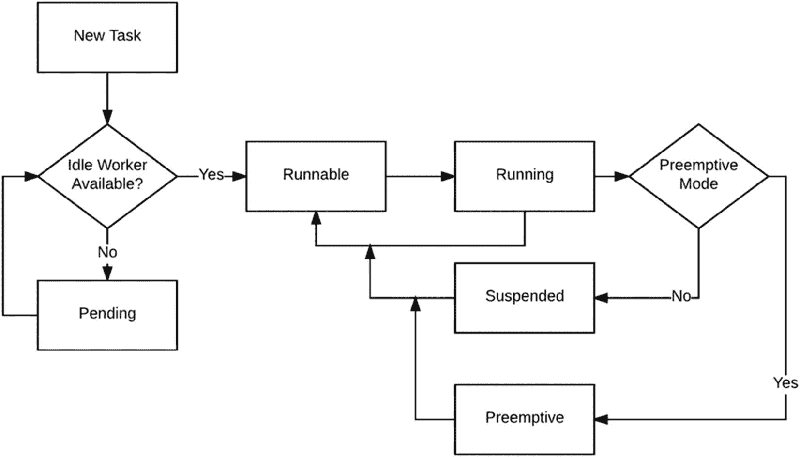
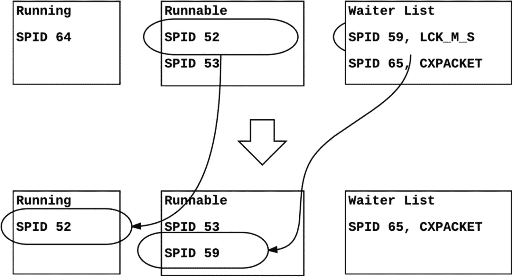
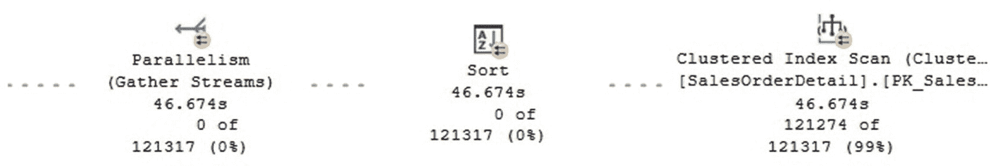

# 第三部分 监控

## 监控磁盘空间

虽然监控 `tempdb` 上的磁盘空间本身并不直接属于性能范畴，但看到意外的大量磁盘空间使用情况有时可能是性能问题或其他问题的征兆。`tempdb` 中大多数与磁盘空间相关的问题是由版本控制引起的（当使用两种快照隔离中的任何一种时），或者由排序或哈希联接创建的内部对象引起，这已在上一节中介绍过。

你可以使用 `sys.dm_db_file_space_usage` 动态管理视图（DMV）来返回数据库中每个文件的空间使用情况信息。事实上，在较早版本的 SQL Server 中，此 DMV 仅适用于 `tempdb`，但后来被扩展到包含每个数据库的信息，尽管内部对象和版本存储相关的列仍然仅适用于 `tempdb`。以下查询通常用于报告不同对象使用的空间：

```sql
USE tempdb
GO
SELECT
SUM (user_object_reserved_page_count) * 1.0 / 128 as user_object_mb,
SUM (internal_object_reserved_page_count) * 1.0 / 128 as internal_objects_mb,
SUM (version_store_reserved_page_count) * 1.0 / 128  as version_store_mb,
SUM (unallocated_extent_page_count) * 1.0 / 128 as free_space_mb,
SUM (mixed_extent_page_count) * 1.0 / 128 as mixed_extents_mb
FROM sys.dm_db_file_space_usage
```

有时，你可能需要查找可能导致磁盘空间问题的特定进程。在这种情况下，你可以使用 `sys.dm_db_task_space_usage` DMV，它按任务返回页面分配和释放活动，并且仅适用于 `tempdb` 数据库。一个示例是以下查询，借鉴了本章摘要中提到的 `tempdb` 白皮书：

```sql
SELECT t1.session_id, t1.request_id, t1.task_alloc,
t1.task_dealloc, t2.sql_handle, t2.statement_start_offset,
t2.statement_end_offset, t2.plan_handle
FROM (SELECT session_id, request_id,
SUM(internal_objects_alloc_page_count) AS task_alloc,
SUM (internal_objects_dealloc_page_count) AS task_dealloc
FROM sys.dm_db_task_space_usage
GROUP BY session_id, request_id) AS t1,
sys.dm_exec_requests AS t2
WHERE t1.session_id = t2.session_id
AND (t1.request_id = t2.request_id)
ORDER BY t1.task_alloc DESC
```

## 总结

`tempdb` 是一个特殊的系统数据库，它与 SQL Server 实例上的所有数据库和活动共享，用于保存临时对象或中间结果集。在本章中，我们从 SQL Server 性能角度介绍了 `tempdb`。向读者推荐的另一份资料是 Microsoft 白皮书《在 SQL Server 2005 中使用 tempdb》，尽管它涵盖的是较旧版本的 SQL Server，但仍包含大量相关且有用的信息。你可以在以下网址找到这份白皮书：[`https://technet.microsoft.com/en-us/library/cc966545.aspx`](https://technet.microsoft.com/en-us/library/cc966545.aspx)。

与 `tempdb` 相关的两个最常见的性能问题是分配页的闩锁争用，以及当某些查询处理器操作（如排序、哈希联接或使用范围扫描的交换）没有足够内存时发生的 `tempdb` 溢出。SQL Server 2016 引入的新默认设置有助于避免或最小化 `tempdb` 争用问题，方法是在安装期间自动配置多个数据文件，并包含了以前版本需要显式配置跟踪标志 1117 和 1118 的行为。

此外，SQL Server 2019 引入的内存优化 tempdb 元数据是多年来最有前途的 tempdb 新功能。此功能旨在通过将 tempdb 系统表移动到无闩锁的非持久化内存优化表中来消除元数据争用。

## 5. 分析等待统计信息

当特定问题缺乏信息时，我用于故障排除性能问题的主要建议之一是运行 SQL 跟踪或扩展事件会话以找出最耗资源的查询。此方法通常会根据一个或多个指标（包括持续时间、CPU 使用率、逻辑读和物理读、写入、行数等）向我们显示最耗资源的查询。很多时候选择的指标是持续时间，即查询执行所需的时间。我们通常假设整个持续时间都是有效工作，当然这可以优化。在许多情况下，这种方法可以找到有问题的查询，调整它们就能解决性能问题。

然而，在这个持续时间指标中隐藏或不明显的是，查询执行有效工作花了多少时间，以及什么都不做（基本上是在等待其他事情发生）花了多少时间。了解这两个值很重要，因为两者都可以被优化或处理。例如，一个查询可能显示持续时间为 30 秒——20 秒用于工作（例如扫描表），剩下的 10 秒用于等待系统资源或被阻塞。查询调优者通常会忽略等待部分，并且他们只能优化工作部分，因为大多数工具只显示那部分信息。例如，他们可以轻松地在执行计划中找到表扫描，而使用索引查找可能更合适。

同样正确的是，有时优化工作部分也可能间接优化等待部分，但并非总是如此。阻塞可能仍在发生，所以我们可能只解决了一半的问题。在其他一些情况下，等待可能主导持续时间，因此优化其他领域只会带来适度的性能改进。这些情况表明，为什么等待分析是性能故障排除的重要组成部分。总之，性能问题的发生是因为 SQL Server 要么执行了过多的工作，要么可能什么都没做，只是等待资源可用的时间太长。虽然一个查询长时间等待并不真正使用资源，但它对最终用户来说会显得很慢。

幸运的是，SQL Server 会跟踪数据库引擎中发生的每次等待，这些信息可以通过多种方式获得。虽然该信息在产品的所有版本中都可用，但本章展示的 DMV 和技术是在 SQL Server 2005 及更高版本中引入的。

等待性能调优方法，也称为故障排除等待和队列，是一种广泛使用的调优方法，最初由 Tom Davidson 的 Microsoft 白皮书《SQL Server 2005 Waits and Queues》引入，你仍然可以在 [`https://technet.microsoft.com/en-us/library/cc966413.aspx`](https://technet.microsoft.com/en-us/library/cc966413.aspx) 找到。

一旦我们知道 SQL Server 在等待什么，我们应该拥有解决问题所需的所有信息，对吗？不幸的是，事情并非那么简单。等待和队列性能方法通常需要一些经验和来自其他来源的额外分析，包括查看系统范围内的性能数据。等待在 SQL Server 中随时发生。事实上，即使有大量的等待通常也不意味着存在问题。在许多情况下，SQL Server 等待某些东西是完全正常的。一些特定的等待，通常称为良性等待，可以始终被忽略，因此将它们从我们的分析中过滤掉也很重要。

当我们获得等待信息时，我们通常只得到一个数字，因此挑战在于知道等待何时是异常或过度的。在大多数情况下，你必须将等待信息与你可以从 SQL Server 的各种来源（包括 DMV、性能计数器、SQL 跟踪、扩展事件等）获得的其他一些信息关联起来，然后解释和关联所得的数据。


### 引言

第 1 章介绍了 SQLOS 并解释了 SQL Server 使用的是一个**非抢占式调度器**。在这种调度器中，任务会周期性地主动释放控制权，并且只要其**时间量子**允许，就会一直运行，直到它在某个同步对象上被挂起。我们还了解到，在少数情况下，当任务运行 SQL Server 域之外的代码时，它可以在抢占模式下运行。这两种情况都体现在图 5-1 中，该图展示了第 1 章已解释过的任务执行过程。在本章中，我们将扩展此主题，并解释该任务执行过程如何契合**等待与队列**性能方法论。



**图 5-1**
任务执行过程

从用户的角度来看，一个请求似乎总是在运行。毕竟，当我们运行一个查询时，它看起来一直在执行。但是，如图 5-1 所示，一个请求有时在运行，有时在等待。当它运行时，它正在使用处理器时间执行有用的工作。当它被挂起时，它在等待某物——可能是一个资源，可能是一个同步对象——或者可能在等待分配工作。此时，任务被称为处于**等待者列表**中。当它**可运行**时，任务已准备好执行，但它首先必须等待分配给它的处理器时间片，这被称为处于**可运行队列**中。在可运行队列中等待处理器时间所花费的时间称为**信号等待时间**。当这些部分中的任何一个耗时过长，无论是运行还是等待，理解其原因都非常重要，因为在这两种情况下都可能存在改进的可能。SQL Server 会跟踪关于请求为何等待、等待了多久以及在等待什么的所有信息。

正如第 1 章所述，SQL Server 为每个逻辑处理器配备一个调度器，此外，还有一些用于内部任务的隐藏调度器，以及一个用于 DAC（专用管理员连接）的调度器。你可以通过查看`sys.dm_os_schedulers`动态管理视图（DMV）的`status`列来识别它们。该 DMV 中一个有趣的列是`quantum_length_us`，它显示了调度器使用的时间量子，通常为 4 毫秒（或 4000 微秒）。另外，请记住图 5-1 只展示了一个调度器或逻辑处理器。在一个拥有八个逻辑处理器的系统上，相同的流程会发生八次，可能同时有八个任务在运行并使用 CPU，以及八个等待者列表和可运行队列。

一个特殊情况（也在图 5-1 中标出）是从“运行”到“可运行”的转换。当一个任务用完了它的时间量子而无需等待任何资源时，就可能发生这种情况。SQL Server 的代码被设计用于检测代码中可能发生这种情况的区域，并在时间量子达到极限（通常为四毫秒）时，通过编程使其自愿让出处理器时间。即使该任务是系统中唯一的用户任务，它也必须让出时间，这在活动系统中显然并不常见。即使在几乎空闲的系统上，也存在其他作为后台系统进程运行的进程。

从技术上讲，你可以使用`sys.dm_os_waiting_tasks` DMV 查看等待者列表。与稍后讨论的可运行队列不同，等待者列表没有任何特定的顺序，任务可以在任何时刻到达，并且由于它们等待的资源可能在任何时候变得可用，它们也可以随时停止等待并离开列表。一旦资源可用，任务将被发出信号，被放置到可运行队列的末尾。`sys.dm_os_waiting_tasks` DMV 的`resource_description`列显示了任务正在等待的资源，该列可能包含大量可能的值，这些值在 [`https://msdn.microsoft.com/en-us/library/ms188743.aspx`](https://msdn.microsoft.com/en-us/library/ms188743.aspx) 上有很好的文档说明。

可运行队列通常作为一个先进先出（FIFO）列表工作，这意味着任务被放入此队列并按照它们到达的顺序得到服务。唯一的例外是当配置了资源调控器来改变此优先级时，但那是一种特殊配置，并不常见。`sys.dm_os_schedulers` DMV 上的`runnable_tasks_count`列显示了特定调度器的可运行队列上的工作线程数。

图 5-1 所示的任务执行过程将持续到查询执行完成，除了少数查询被取消、超时或因某些其他原因无法完成的情况。下一章将介绍的新功能**查询存储**，也允许你在需要对这些查询进行故障排除时跟踪它们。

任务执行状态（运行、可运行或挂起）可以通过`sys.dm_exec_requests`的`status`列显示，正如第 1 章所述，该视图返回有关 SQL Server 中正在执行的每个请求的信息。SQL Server 中还有两种额外的任务执行状态：**后台**和**睡眠**。“后台”用于后台系统进程。“睡眠”可以用于任何连接（无论是用户进程还是系统进程），这些连接已完成工作，当前已连接但未积极工作或正等待工作。如前所述，等待信息可在多个 DMV 和其他来源中找到，并将在下一节详细说明。

如前所述，等待在 SQL Server 中随时发生，你可以通过多种方式查看此信息，包括运行`sys.dm_exec_requests` DMV。让我们构建一个简单的示例来向你展示如何获取此信息。打开一个 SQL Server Management Studio 会话并运行以下语句：

```sql
BEGIN TRANSACTION
UPDATE Sales.SalesOrderDetail
SET OrderQty = 5
WHERE SalesOrderDetailID = 121317
```

请注意，一个事务已启动但尚未提交或回滚。打开另一个会话并运行：

```sql
SELECT * FROM Sales.SalesOrderDetail
WHERE SalesOrderDetailID = 121317
```

然后打开第三个会话并运行：

```sql
SELECT * FROM Sales.SalesOrderDetail
ORDER BY OrderQty
```

由于第一个会话在`Sales.SalesOrderDetail`表上持有一个未提交事务的锁，另外两个会话将被阻塞。在一个新的会话上运行：

```sql
SELECT * FROM sys.dm_exec_requests r JOIN sys.dm_exec_sessions s
ON r.session_id = s.session_id
WHERE s.is_user_process = 1
```

**注意**

我们与`sys.dm_exec_sessions`进行连接的唯一原因是使用`is_user_process`列，该列指示会话是系统进程还是用户进程。我们不能再像在之前版本的 SQL Server 中那样仅仅依赖`session_id`值。

你应该会看到类似以下内容（为适应页面进行了汇总）：

| session_id | status | Command | blocking_session_id | wait_type | last_wait_type | wait_resource |
| --- | --- | --- | --- | --- | --- | --- |
| 59 | suspended | SELECT | 55 | LCK_M_S | LCK_M_S | KEY: 5:72057594057588736 (722affd45fb5) |
| 64 | running | SELECT | 0 | NULL | MEMORY_ALLOCATION_EXT |   |
| 65 | suspended | SELECT | 0 | CXPACKET | CXPACKET |   |


## 会话阻塞场景分析

会话 55 正在阻塞会话 59。（它也阻塞着 65，但此处未显示，稍后详述。）会话 59 是第一个 `SELECT`，正在等待 `KEY` 资源。会话 65 是第二个 `SELECT`，正在等待 `CXPACKET`。会话 55 是未提交的事务，它甚至没有出现在 `sys.dm_exec_requests` 中，因为从技术上讲它当前没有执行任何操作。`UPDATE` 语句已完成，但事务仍未关闭。会话 59 和 65 处于挂起状态并位于等待者列表中。即使在这个拥有四个处理器的系统中，也只有一个任务（64，即正在运行 DMV 的会话）在运行。

在第一个会话上运行以下语句：

```
ROLLBACK TRANSACTION
```

> **注意**
> 在使用 `sys.dm_exec_requests` DMV 分析等待时，一个主要限制是在分析并行查询时。此 DMV 每个会话只显示一条记录，因此它只显示父任务的信息，而不显示子任务的信息。本章稍后将提供一种解决并行查询问题的替代方案。

事务回滚后可能发生多种情况；我将简要描述我捕获到的情况。实际上，这是一个非常简化的示例。在执行这些任务期间会发生更多等待，如下一节所示，如果需要详细的等待信息，SQL Server 提供了捕获这些等待的方法。

事务回滚后，会话 59 所需的 `KEY` 资源变为可用，因此会话 59 被唤醒并置于可运行队列中。最终，会话 59 获得处理器时间并能够完成其工作。会话 59 有可能再次等待其他资源，但通过手动运行此 DMV 很难捕获这些等待。然而，如前所述，可以通过其他方法捕获。

会话 65 也得以继续。一旦它等待的资源可用，它就被置于可运行队列中，最终获得处理器时间并继续运行。由于这是一个更昂贵的查询，它很可能发生了更多等待，并可能多次被置于等待者列表和可运行队列中。我捕获到的是会话 65 在 `ASYNC_NETWORK_IO` 上的等待者列表中。此查询请求的排序可能运行得足够快，以至于您可能看不到它，或者您可能会看到其他等待。可运行状态可能非常短暂，除非您查看更繁忙的系统，否则无法捕获它。

| session_id | status   | command | blocking_session_id | wait_type         | last_wait_type    | wait_resource |
| ---------- | -------- | ------- | ------------------- | ----------------- | ----------------- | ------------- |
| 64         | running  | SELECT  | 0                   | NULL              | MEMORY_ALLOCATION_EXT |               |
| 65         | suspended| SELECT  | 0                   | ASYNC_NETWORK_IO  | ASYNC_NETWORK_IO  |               |

最后，如果再次运行 DMV，两个 `SELECT` 语句都将完成，因此您将不再看到 DMV 的任何输出，除了运行 DMV 的会话 64。

这个简化场景总结在图 5-2 中，其中包括了另外两个会话（52 和 53），它们未在 DMV 中捕获，但为完整起见而显示，因为在仅包含少量事务的示例中捕获可运行任务很困难。



**图 5-2** 任务执行过程示例

在图 5-2 中，spid 64 最初正在执行，spid 52 位于可运行队列顶部。在 spid 64 完成（或因任何原因离开运行状态）后，spid 52 从可运行状态转为运行状态，而 spid 53 现在位于可运行队列顶部。由于 spid 59 等待的锁现已可用，它被唤醒并移动到可运行队列末尾。在短时间内，spid 65 仍位于等待者列表中，如图 5-2 所示，但由于它间接等待与 59 相同的资源，它最终也将被移动到可运行队列。

## 系统进程的等待

您可能已经注意到我们过滤掉了系统进程。SQL Server 还有一些专用线程，我们通常不应该担心它们的等待。例如，在检查等待类型和等待时间的同时，运行以下查询几次：

```
SELECT * FROM sys.dm_exec_requests
WHERE wait_type = 'REQUEST_FOR_DEADLOCK_SEARCH'
```

死锁监视器通常在两次死锁检测事件之间等待 `REQUEST_FOR_DEADLOCK_SEARCH` 等待类型，最长可达五秒。`wait_time` 永远不会超过五秒（以毫秒计）。`command` 列显示内部系统进程执行的任务类型，本例中是 `LOCK MONITOR`。还有其他几个具有类似等待的系统进程，如稍后的“计时器等待类型”部分所示。

尽管在 `sys.dm_exec_requests` 上显示的等待时间会被重置，但它实际上会被累积并可在 `sys.dm_os_wait_stats` 中获取。例如，以下查询

```
SELECT * FROM sys.dm_os_wait_stats
WHERE wait_type = 'REQUEST_FOR_DEADLOCK_SEARCH'
```

可能显示以下输出。

| wait_type                  | waiting_tasks_count | wait_time_ms | max_wait_time_ms | signal_wait_time_ms |
| -------------------------- | ------------------- | ------------ | ---------------- | ------------------- |
| REQUEST_FOR_DEADLOCK_SEARCH | 20                  | 100118       | 5014             | 100118              |

此信息显示时间被重置了 20 次；换句话说，发生了 20 次独立的等待，最大等待时间为 5014 毫秒。由于该进程并非严格等待某个资源，信号等待时间与等待时间相同。

## 等待信息的收集

尽管我们可以在 `sys.dm_exec_requests` 和 `sys.dm_os_waiting_tasks` 上看到与等待相关的信息，但这些 DMV 主要侧重于实时信息，或者在我们需要关于当前正在执行的特定进程的数据时非常有用。很多时候，我们希望累积统计等待信息或收集这些信息以供后续分析。主要有三种方法可以实现此目标：使用 `sys.dm_os_waits` DMV、SQL Server 扩展事件，以及 SQL Server 2016 引入的 `sys.dm_exec_session_wait_stats` DMV。让我们逐一回顾，并了解在何种场景下每种方法可能是最佳选择。


### sys.dm_os_wait_stats

`sys.dm_os_wait_stats` 动态管理视图一直是获取 SQL Server 实例等待信息的传统方式。即使该 DMV 是在 SQL Server 2005 中引入的，相同的信息在更早的版本中也可以通过使用已弃用且不再文档化的 DBCC `SQLPERF('waitstats')` 语句获取，该语句在当前版本中仍然有效。你可以通过运行以下语句直接获取等待信息，但通常我们希望进行额外的过滤和数据聚合，如下文所示：

```
SELECT * FROM sys.dm_os_wait_stats
```

你也可以查询以下目录视图来列出可用的等待类型：

```
SELECT * FROM sys.dm_xe_map_values WHERE name = 'wait_types'
```

`sys.dm_os_wait_stats` DMV 显示自 SQL Server 实例上次启动或等待统计信息上次清除以来发生的所有等待。它列出了所有可用的等待类型，甚至包括那些尚未发生等待的类型，对于这些类型，等待时间和计数值将为 0。SQL Server 2019 中该 DMV 显示 1080 个等待类型，其中大量是未文档化的。由于此 DMV 返回的是数值，你需要将其与其他信息结合使用，例如与基线比较、与不同时间点的快照比较，并可能进行额外分析以从中获取价值。例如，`wait_time_ms` 的值 10808265 是好是坏？

`sys.dm_os_wait_stats` 与 `sys.dm_exec_requests` 和 `sys.dm_os_waiting_tasks` 的另一个区别在于，后两者显示的是仍在进行中的等待信息，而 `sys.dm_os_wait_stats` 仅在等待完成后才累积信息。例如，如果你多次刷新前面提到的使用 `sys.dm_exec_requests` 的查询，你会注意到 `CXPACKET` 和 `LCK_M_S` 的等待时间会随着进程被另一个会话阻塞而持续增加。一旦等待完成，等待统计信息将被记录到 `sys.dm_os_wait_stats` 中。

SQL Server 文档传统上将等待分为三类：

#### Resource

任务正在等待一个不可用或正被其他任务（如 I/O、锁或闩锁）使用的资源。

#### Queue

任务正在等待分配工作。通常用于系统后台任务。

#### External

任务正在等待外部进程完成，例如链接服务器查询或扩展存储过程。

其他一些来源增加了其他类别，如 I/O（在我们的例子中属于 Resource 类别），或将锁和闩锁分离到它们自己的同步类别中。

`sys.dm_os_wait_stats` DMV 包含以下列：

*   `wait_type`: 等待类型，大多数在 [`https://msdn.microsoft.com/en-us/library/ms179984.aspx`](https://msdn.microsoft.com/en-us/library/ms179984.aspx) 上有文档。我将在本章后面介绍最重要的几种。
*   `waiting_tasks_count`: 指定等待类型的等待次数。
*   `wait_time_ms`: 总等待时间（毫秒）。此时间包括下文描述的信号等待时间。
*   `max_wait_time_ms`: 指定等待类型的最大等待时间（毫秒）。
*   `signal_wait_time_ms`: 信号等待时间（毫秒）。如前所述，这是任务在可运行队列中等待处理器时间的时间。

有许多等待类型无需关注，在收集或聚合等待信息时将其过滤掉是典型做法。以下是一个此类查询的示例：

```
SELECT
wait_type,
wait_time_ms,
wait_time_ms * 100.0 / SUM(wait_time_ms) OVER() AS percentage,
signal_wait_time_ms * 100.0 / wait_time_ms as signal_pct
FROM sys.dm_os_wait_stats
WHERE wait_time_ms > 0
AND wait_type NOT IN (
'BROKER_DISPATCHER', 'BROKER_EVENTHANDLER',
'BROKER_RECEIVE_WAITFOR', 'BROKER_TASK_STOP',
'BROKER_TO_FLUSH', 'BROKER_TRANSMITTER',
'CHECKPOINT_QUEUE', 'CHKPT',
'CLR_AUTO_EVENT', 'CLR_MANUAL_EVENT',
'CLR_SEMAPHORE', 'DBMIRROR_DBM_EVENT',
'DBMIRROR_DBM_MUTEX', 'DBMIRROR_EVENTS_QUEUE',
'DBMIRROR_WORKER_QUEUE', 'DBMIRRORING_CMD',
'DIRTY_PAGE_POLL', 'DISPATCHER_QUEUE_SEMAPHORE',
'EXECSYNC', 'FSAGENT',
'FT_IFTS_SCHEDULER_IDLE_WAIT', 'FT_IFTSHC_MUTEX',
'HADR_CLUSAPI_CALL', 'HADR_FILESTREAM_IOMGR_IOCOMPLETION',
'HADR_LOGCAPTURE_WAIT', 'HADR_NOTIFICATION_DEQUEUE',
'HADR_TIMER_TASK', 'HADR_WORK_QUEUE',
'KSOURCE_WAKEUP', 'LAZYWRITER_SLEEP',
'LOGMGR_QUEUE', 'ONDEMAND_TASK_QUEUE',
'PWAIT_ALL_COMPONENTS_INITIALIZED', 'QDS_ASYNC_QUEUE',
'QDS_PERSIST_TASK_MAIN_LOOP_SLEEP', 'QDS_SHUTDOWN_QUEUE',
'QDS_CLEANUP_STALE_QUERIES_TASK_MAIN_LOOP_SLEEP', 'REQUEST_FOR_DEADLOCK_SEARCH',
'RESOURCE_QUEUE', 'SERVER_IDLE_CHECK',
'SLEEP_BPOOL_FLUSH', 'SLEEP_BUFFERPOOL_HELPLW',
'SLEEP_DBSTARTUP', 'SLEEP_DCOMSTARTUP',
'SLEEP_MASTERDBREADY', 'SLEEP_MASTERMDREADY',
'SLEEP_MASTERUPGRADED', 'SLEEP_MSDBSTARTUP',
'SLEEP_SYSTEMTASK', 'SLEEP_TASK',
'SLEEP_TEMPDBSTARTUP', 'SLEEP_WORKSPACE_ALLOCATEPAGE',
'SNI_HTTP_ACCEPT', 'SP_SERVER_DIAGNOSTICS_SLEEP',
'SQLTRACE_BUFFER_FLUSH', 'SQLTRACE_INCREMENTAL_FLUSH_SLEEP',
'SQLTRACE_WAIT_ENTRIES', 'WAIT_FOR_RESULTS',
'WAITFOR', 'WAITFOR_TASKSHUTDOWN',
'WAIT_XTP_HOST_WAIT', 'WAIT_XTP_OFFLINE_CKPT_NEW_LOG',
'WAIT_XTP_CKPT_CLOSE', 'XE_DISPATCHER_JOIN',
'XE_DISPATCHER_WAIT', 'XE_TIMER_EVENT')
ORDER BY percentage DESC
```

收集等待信息的一个绝佳选择是启用 SQL Server 数据收集功能，该功能随 SQL Server 2008 引入。此功能不仅可以收集等待信息，还可以收集各种性能信息并将其持久化到数据库中。它还包括多个图表和报告来呈现收集的数据。图 5-3 展示了一个部分数据收集报告的示例，其中等待统计信息按多个类别进行了聚合。有关启用和使用数据收集功能的更多详细信息，请参阅 SQL Server 文档。


图 5-3

数据收集 SQL Server 等待报告

最后，可以使用以下语句清除等待统计信息，尽管这可能并不总是可取的，因为这些历史信息可能被其他工具使用：

```
DBCC SQLPERF('sys.dm_os_wait_stats', CLEAR)
```

当 SQL Server 重新启动时，等待显然也会被清除。可以使用 `sys.dm_os_performance_counters` DMV 上的“SQL Server 等待统计信息”对象获取有关等待的额外信息，例如：

```
SELECT * FROM sys.dm_os_performance_counters
WHERE object_name = 'SQLServer:Wait Statistics'
```

前面的查询适用于 SQL Server 默认实例。如果你有一个命名实例，则需要相应地替换实例名，使得 `object_name` 的 SQLServer 前缀变为 `MSSQL$<instance>`。如果不确定如何指定实例名，可以尝试以下查询：

```
SELECT * FROM sys.dm_os_performance_counters
WHERE object_name like '%Wait Statistics%'
```

`sys.dm_os_performance_counters` DMV 上可用的信息需要额外处理才能正确解释，如第 8 章所述。


#### sys.dm_exec_session_wait_stats

`sys.dm_exec_session_wait_stats` 是在 SQL Server 2016 中引入的，它最终提供了一种长期以来需要的方法来查找每个会话的等待情况，而在此之前，这可能需要运行一个潜在的、开销很大的 SQL Server 扩展事件会话。该 DMV 中的列与 `sys.dm_os_wait_stats` 完全相同。与 `sys.dm_os_wait_stats` 类似，但不同于 `sys.dm_exec_requests` 和 `sys.dm_os_waiting_tasks`，此 DMV 仅报告已完成的等待。例如，如果一个任务等待资源 3000 毫秒，后两个 DMV 可能报告部分进度，比如 1500 或 2500 毫秒，但 `sys.dm_exec_session_wait_stats` 只会在任务仍在等待时报告 0，或者在等待完成时报告 3000 毫秒。下一个示例将检查会话 52 的已完成等待。

```sql
SELECT * FROM sys.dm_exec_session_wait_stats
WHERE session_id = 52
```

#### 扩展事件

SQL Server 中有三个与等待相关的扩展事件：`wait_completed`、`wait_info` 和 `wait_info_external`。`wait_completed` 和 `wait_info` 非常相似，并且共享大部分字段。它们都捕获系统中发生的等待，但 `wait_info` 会在等待开始时和等待结束时都捕获信息，这由字段 `opcode`（其值为 “Begin” 和 “End”）定义。`wait_completed` 只捕获已完成的等待。其他常见字段是 `duration` 和 `signal_duration`（分别是持续时间和信号持续时间，以毫秒为单位），以及 `wait_resource` 和 `wait_type`（分别是等待所依据的资源和等待类型）。当发生调度器让出操作以及线程再次获得处理器时间时，也会产生 `wait_info`。`wait_info_external` 则是在 SQL Server 以抢占模式运行外部任务时产生。

如前所述，等待在 SQL Server 中无时无刻不在发生，即使是在未执行任何用户查询的空闲系统上也是如此。在捕获这些事件时应极其小心，因为它可能会生成大量数据。你应该只进行短时间的故障排除，或尽可能过滤掉等待。

让我们运行以下练习来查看其中一些等待。首先，为 `wait_info` 事件创建一个新的扩展事件会话。（确保根据你的测试环境使用正确的驱动器和文件夹。）你可能希望收集整个实例的等待，或指定筛选器以限制事件数量。在本例中，你希望查看特定查询的等待，因此一个好的筛选器可以是你的会话 ID。在你的会话中找到 `spid` 并在以下创建名为 `waits` 的扩展事件会话的语句中相应替换。

```sql
CREATE EVENT SESSION waits ON SERVER
ADD EVENT sqlos.wait_info (
WHERE (sqlserver.session_id = 58))
ADD TARGET package0.event_file
(SET FILENAME = 'C:\data\waits.xel')
```

然后启动会话，运行你想要分析的查询（在本例中是一个排序语句），然后关闭会话。

```sql
ALTER EVENT SESSION waits ON SERVER STATE = START
GO
USE AdventureWorks2017
GO
SELECT * FROM Sales.SalesOrderDetail
ORDER BY OrderQty
GO
ALTER EVENT SESSION waits ON SERVER STATE = STOP
```

以下语句将显示捕获的数据。例如，我的测试系统只显示了几千个事件。

```sql
SELECT *, CAST(event_data AS XML) AS 'event_data'
FROM sys.fn_xe_file_target_read_file('C:\data\waits*.xel', NULL, NULL, NULL)
```

仅作参考，我捕获的数据中某个事件的 `event_data` 列如下所示：

```
<event name="wait_info" package="sqlos" timestamp="2023-10-27T10:00:00.000Z">
  <data name="wait_type">
    <type name="wait_type" package="package0"/>
    <value>CXPACKET</value>
    <text>CXPACKET</text>
  </data>
  <data name="opcode">
    <type name="wait_opcode" package="sqlos"/>
    <value>1</value>
    <text>End</text>
  </data>
  <data name="duration">
    <type name="uint64" package="package0"/>
    <value>3000</value>
  </data>
  <data name="signal_duration">
    <type name="uint64" package="package0"/>
    <value>100</value>
  </data>
  <data name="wait_resource">
    <type name="binary_data" package="package0"/>
    <value>0x0000007128e19ec0</value>
  </data>
</event>
```

你可以看到前面提到的 `wait_info` 事件的字段。在本例中，等待类型是 `CXPACKET`，`opcode` 是 `End`，并且捕获了一些 `duration`、`signal_duration` 和 `wait_resource` 的值。

让我们将数据保存到一个临时表中，以便更容易进行一些额外处理：

```sql
CREATE TABLE #waits (
event_data XML)
GO
INSERT INTO #waits (event_data)
SELECT CAST (event_data AS XML) AS event_data
FROM sys.fn_xe_file_target_read_file (
'C:\data\waits*.xel', NULL, NULL, NULL)
```

最后，运行以下查询以执行一些聚合：

```sql
SELECT
    waits.wait_type,
    COUNT (*) AS wait_count,
    SUM (waits.duration) AS total_wait_time_ms,
    SUM (waits.duration) - SUM (waits.signal_duration) AS total_resource_wait_time_ms,
    SUM (waits.signal_duration) AS total_signal_wait_time_ms
FROM
    (SELECT
        event_data.value ('(/event/@timestamp)[1]', 'DATETIME') AS datetime,
        event_data.value ('(/event/data[@name=''wait_type'']/text)[1]', 'VARCHAR(100)') AS wait_type,
        event_data.value ('(/event/data[@name=''opcode'']/text)[1]', 'VARCHAR(100)') AS opcode,
        event_data.value ('(/event/data[@name=''duration'']/value)[1]', 'BIGINT') AS duration,
        event_data.value ('(/event/data[@name=''signal_duration'']/value)[1]', 'BIGINT') AS signal_duration
    FROM #waits
    ) AS waits
WHERE waits.opcode = 'End'
GROUP BY waits.wait_type
ORDER BY total_wait_time_ms DESC
```

我的测试摘要输出（仅包含顶部事件）如下所示。

| 等待类型 | 等待计数 | 总等待时间（毫秒） | 总资源等待时间（毫秒） | 总信号等待时间（毫秒） |
| --- | --- | --- | --- | --- |
| CXPACKET | 5301 | 11662 | 11649 | 13 |
| NETWORK_IO | 7057 | 482 | 478 | 4 |
| LATCH_EX | 23 | 19 | 9 | 10 |
| LATCH_SH | 4 | 14 | 0 | 14 |

最后，关闭并删除扩展事件会话，并删除临时表。

```sql
DROP EVENT SESSION waits ON SERVER
DROP TABLE #waits
```

在这个练习中，我们按会话 ID 进行了筛选，但你也可以按其他字段进行筛选。下一节讨论 `system_health` 会话时展示了一个示例，其默认代码按等待类型和持续时间进行筛选。


#### system_health 扩展事件会话

`system_health` 会话是一个扩展事件会话，用于自动收集可用于排查性能问题的系统数据。它在每个 SQL Server 安装中默认配置，会在实例启动时自动开始并持续运行。虽然可以关闭和删除 `system_health` 会话，但不建议这样做，因为它的运行不会产生明显的性能影响。

`system_health` 会话收集多个领域的信息（详情请参阅 [`https://msdn.microsoft.com/en-us/library/ff877955.aspx`](https://msdn.microsoft.com/en-us/library/ff877955.aspx)），同时也会捕获多种等待类型。以下代码是 SQL Server `system_health` 的部分定义，描述了它捕获的等待类型，并基于等待时长进行了过滤：

```sql
ADD EVENT sqlos.wait_info(
ACTION(package0.callstack,sqlserver.session_id,sqlserver.sql_text)
WHERE ([duration]>(15000) AND ([wait_type]>=N'LATCH_NL' AND ([wait_type]>=N'PAGELATCH_NL'
AND [wait_type]=N'PAGEIOLATCH_NL'
AND [wait_type]=N'IO_COMPLETION' AND
[wait_type]=N'FCB_REPLICA_WRITE' AND wait_type
AND wait_type AND ([wait_type]>=N'PREEMPTIVE_OS_GENERICOPS' AND
[wait_type]=N'PREEMPTIVE_OS_INITIALIZESECURITYCONTEXT' AND
[wait_type]=N'PREEMPTIVE_OS_AUTHZGETINFORMATIONFROMCONTEXT' AND
[wait_type]=N'PREEMPTIVE_OS_CRYPTACQUIRECONTEXT' AND
[wait_type]=N'PREEMPTIVE_OS_NETGROUPGETUSERS' AND
[wait_type]=N'PREEMPTIVE_OS_NETVALIDATEPASSWORDPOLICYFREE' AND
wait_type AND
([wait_type]>=N'PREEMPTIVE_OS_SETNAMEDSECURITYINFO' AND
[wait_type]=N'PREEMPTIVE_OS_RSFXDEVICEOPS' AND
[wait_type]=N'PREEMPTIVE_OS_DTCOPS' AND
[wait_type]=N'PREEMPTIVE_OS_CLOSEHANDLE' AND
[wait_type]=N'PREEMPTIVE_OS_GETCOMPRESSEDFILESIZE' AND
[wait_type]=N'PREEMPTIVE_OS_DISCONNECTNAMEDPIPE'AND
[wait_type]<=N'PREEMPTIVE_CLOSEBACKUPMEDIA' OR
[wait_type]=N'PREEMPTIVE_OS_AUTHENTICATIONOPS' OR
[wait_type]=N'PREEMPTIVE_OS_FREECREDENTIALSHANDLE' OR
[wait_type]=N'PREEMPTIVE_OS_AUTHORIZATIONOPS' OR
[wait_type]=N'PREEMPTIVE_COM_COCREATEINSTANCE' OR
[wait_type]=N'PREEMPTIVE_OS_NETVALIDATEPASSWORDPOLICY' OR
[wait_type]=N'PREEMPTIVE_VSS_CREATESNAPSHOT'))))
```

此外，`system_health` 事件会话使用了 `sp_server_diagnostics_component_result`，该过程本身会收集包括部分等待信息在内的各种诊断数据和健康信息。有关 `sp_server_diagnostics_component_result` 的更多信息，请参阅 [`https://msdn.microsoft.com/en-us/library/ff878233.aspx`](https://msdn.microsoft.com/en-us/library/ff878233.aspx)。`sp_server_diagnostics_component_result` 定义如下：

```sql
ADD EVENT sqlserver.sp_server_diagnostics_component_result(SET collect_data=(1)
WHERE ([sqlserver].[is_system]=(1) AND component))
```

最后请记住，尽管 `system_health` 会话收集的信息会被捕获到文件和环形缓冲区两种目标中，但它可能只保留最近的事件，并且这些信息不会持久化存储，而是如下面所示进行循环利用。您可能需要执行一些额外步骤才能将这些信息持久化保存到磁盘。

```sql
ADD TARGET package0.event_file(SET filename=N'system_health.xel',max_file_size=(5), max_rollover_files=(4)),
ADD TARGET package0.ring_buffer(SET max_events_limit=(5000),max_memory=(4096))
```

该定义显示，文件目标的 `max_file_size`（最大文件大小，单位为兆字节）为 5 MB，`max_rollover_files`（文件系统中保留的最大文件数）为 4，因此最大可存储 20 MB 的信息。可以使用以下查询读取文件目标：

```sql
SELECT *, CAST(event_data AS XML)
FROM sys.fn_xe_file_target_read_file('system_health*.xel', NULL, NULL, NULL)
```

同样地，`system_health` 会话使用的环形缓冲区目标设置了 `max_events_limit` 为 5000，这意味着它最多在环形缓冲区中保留 5000 个事件，当达到此限制时，较旧的事件将被丢弃。它还定义了最大内存量为 4096 千字节。默认情况下，达到这些限制时，最旧的事件会被丢弃，但另一个配置选项 `occurrence_number` 允许您根据事件类型配置在被丢弃前所保留的事件数量。

您可以使用以下查询作为起点，开始检查 `system_health` 会话捕获的信息，特别是环形缓冲区目标：

```sql
SELECT CAST(t.target_data AS xml)
FROM sys.dm_xe_session_targets t
JOIN sys.dm_xe_sessions s
ON s.address = t.event_session_address
WHERE s.name = 'system_health'
```

**注意**

如果在尝试打开 XML 列时遇到意外的文件结尾解析错误，您可能需要增加 SQL Server Management Studio 会话中从服务器检索的 XML 数据的字符数。为此，请使用 `工具` 菜单，选择 `选项` ➤ `查询结果` ➤ `SQL Server` ➤ `结果到网格` ➤ `检索到的最大字符数`，并将 `XML 数据` 更改为 `无限制`（默认值为 2 MB）。

与 `system_health` 会话类似，SQL Server 在多个产品版本中都提供了默认跟踪。虽然它不捕获任何等待信息，但默认跟踪会持久化记录一些主要与 SQL Server 配置选项相关的活动和更改。随着 SQL 跟踪的推出，默认跟踪已被弃用。

## 示例：分析 CXPACKET 等待

由于等待类型众多（截至 SQL Server 2019 已超过一千种），分析即使是最常见的几种也需要一整本书的篇幅。本章后面将描述最常见的等待类型。在本节中，我将向你展示如何对最常见的等待之一 `CXPACKET` 进行故障排查。让我们创建一个能演示此类等待的问题。

### 创建演示问题

如果你运行以下查询，它很可能会使用排序操作符和平行计划，毫无问题地运行几秒钟：

```sql
SELECT * FROM Sales.SalesOrderDetail
ORDER BY OrderQty
```

在我的拥有四个逻辑处理器的测试系统上，我能看到一个为聚簇索引扫描和排序操作使用四个线程的并行计划。不过，假设我们遇到了一个性能问题，并且看到了 `CXPACKET` 等待。让我们通过阻塞一行来模拟等待。在另一个会话中运行此语句：

```sql
BEGIN TRANSACTION
UPDATE Sales.SalesOrderDetail
SET OrderQty = 5
WHERE SalesOrderDetailID = 121317
```

请注意，`UPDATE` 语句已完成，但事务保持打开状态。（尚未发出 `COMMIT` 或 `ROLLBACK TRANSACTION` 语句。）

在不同的 Management Studio 会话中再次运行之前的 `SELECT` 语句。如果你使用新的 `实时查询统计信息` 功能，可以看到它正在使用并行计划，并且该进程在排序操作符上被阻塞，如图 5-4 所示。即使聚簇索引扫描操作符已经处理了 121,199 行，在阻塞结束前，排序操作符将永远不会处理任何行。新的 `实时查询统计信息` 功能将在下一章中更详细地介绍。



*图 5-4：被阻塞查询的实时查询统计信息*

### 分析等待统计信息

使用正在运行 `SELECT ORDER BY` 语句的查询的 `session_id` 编号运行以下语句，在我的情况下是 52：

```sql
SELECT * FROM sys.dm_exec_requests WHERE session_id = 52
```

这是我在测试系统上得到的结果：

| session_id | request_id | 状态 | 命令 | blocking_session_id | wait_type | wait_time | last_wait_type | wait_resource |
| --- | --- | --- | --- | --- | --- | --- | --- | --- |
| 52 | 0 | suspended | SELECT | 0 | CXPACKET | 219773 | CXPACKET |   |

通常，人们在排查等待问题时，一旦看到 `CXPACKET` 等待类型，往往会认为是并行度问题，并执行一些错误的配置或查询更改，专注于禁用并行度。（顺便说一句，前面的输出中未显示，但在 SQL Server 2016 中引入的，你还可以看到 `DOP`（即并行度）和 `parallel_worker_count` 列，在我的情况下两者都显示为四。）

另一个问题是 `sys.dm_exec_requests` 并未显示问题的根源，需要一些其他工具。动态管理视图 `sys.dm_os_waiting_tasks` 在这方面可能更有效。运行以下查询，记得将 `session_id` 更新为你正在执行的查询：

```sql
SELECT * FROM sys.dm_os_waiting_tasks WHERE session_id = 52
```

现在我们得到了这些数据：

| session_id | exec_context_id | wait_duration_ms | wait_type | blocking_session_id | blocking_exec_context_id | resource_description |
| --- | --- | --- | --- | --- | --- | --- |
| 52 | 3 | 1256486 | LCK_M_S | 55 | NULL | pagelock fileid=1 pageid=28576 dbid=5 subresource=FULL id=lockdbc49b0380 mode=IX associatedObjectId=72057594057588736 |
| 52 | 4 | 1256486 | CXPACKET | 52 | NULL | exchangeEvent id=Portdbf1ce8300 WaitType=e_waitPortOpen nodeId=2 |
| 52 | 0 | 1256605 | CXPACKET | 52 | 1 | exchangeEvent id=Portdbf1ce8300 WaitType=e_waitPortOpen nodeId=2 |
| 52 | 2 | 1255426 | CXPACKET | 52 | 4 | exchangeEvent id=Portdbf1ce8300 WaitType=e_waitPortOpen nodeId=2 |
| 52 | 1 | 1256486 | CXPACKET | 52 | 3 | exchangeEvent id=Portdbf1ce8300 WaitType=e_waitPortOpen nodeId=2 |

我们可以看到主进程，即执行上下文 0，正被同一进程的上下文 ID 1 阻塞，而上下文 ID 1 又被上下文 ID 3 阻塞。它们都显示为 `CXPACKET` 等待。然而，上下文 ID 3 正被一个不同的会话以 `LCK_M_S` 等待阻塞，该会话就是运行 `UPDATE` 语句的那个会话。这是一个很好的例子，说明表面上看似一种等待类型的问题，在现实中可能与另一种等待类型相关。换句话说，看起来像并行度问题的情况，实际上并非如此。输出中未显示，但你也可以通过查看 `waiting_task_address`（显示等待任务的地址）和 `blocking_task_address`（即当前持有该任务正在等待的资源的地址）来获取相同的信息并得出相同的结论。同时列出的还有 `resource_description`，它对理解所消耗的资源也非常有帮助。

### 定位阻塞语句

在运行 `UPDATE` 的会话上运行以下语句：

```sql
ROLLBACK TRANSACTION
```

阻塞将会结束，排序操作也将能够完成。

最后，我们如何找到造成阻塞的语句？毕竟，该语句已经执行完毕，不会出现在一些典型的动态管理视图中。即使是旧的 `sysprocesses` 兼容目录视图，如果你查询它以查看特定会话 ID 当前正在做什么，也只会显示“AWAITING COMMAND”。有几个简单的解决方案是使用旧的 `DBCC INPUTBUFFER` 语句和新的 `sys.dm_exec_input_buffer` 动态管理函数。

`DBCC INPUTBUFFER` 显示 SQL Server 为指定会话 ID 执行的最后一条语句。使用方法示例如下：

```sql
DBCC INPUTBUFFER(55)
```

在 SQL Server 2014 Service Pack 2 中引入的新 `sys.dm_exec_input_buffer` DMF（动态管理函数）可以接受与 `DBCC INPUTBUFFER` 相同的参数，如下所示：

```sql
SELECT * FROM sys.dm_exec_input_buffer(55, NULL)
```

两者都将返回已执行的语句 `BEGIN TRANSACTION UPDATE Sales.SalesOrderDetail SET OrderQty = 5 WHERE SalesOrderDetailID = 121317`，输出略有差异。

这个例子展示了对 `CXPACKET` 等待进行故障排查可能会揭示其他类型的等待问题，在这个案例中是 `LCK_M_S` 或阻塞，而它恰好是问题的根本原因。同时请记住，一般来说，排查等待问题还需要从其他来源获取额外的信息。在某些情况下，并行度可能确实是问题所在。大多数问题通常可以通过更新相关表的统计信息、创建适当的索引或使用其他传统的查询调优和优化技术来解决。


请求被拒绝，因其被视为高风险


## CXPACKET

这是并行处理等待。系统中出现此类等待并不一定意味着存在问题，或并行处理本身有问题。不幸的是，网上一些错误的观点与此相左，这给并行处理带来了不好的声誉。因此，许多人对此类等待的错误反应就是有时禁用并行处理。事实是，我们可能需要进行额外的研究来确认并行处理是否真的是问题所在。正如本章前面的例子所介绍的，要排查 `CXPACKET` 等待，我们应该从查看其他子并行线程上的等待开始。

此外，从 SQL Server 2016 Service Pack 2 和 SQL Server 2017 CU3 开始，`CXPACKET` 等待被分离为 `CXPACKET` 和 `CXCONSUMER` 等待，主要是将生产者线程和消费者线程的等待分开。因此，`CXPACKET` 现在仅适用于与查询处理器交换操作符同步以及为消费者线程生成行相关的等待。消费者线程等待现在使用 `CXCONSUMER` 等待类型单独跟踪。

## CXCONSUMER

如前所述，从 SQL Server 2016 Service Pack 2 和 SQL Server 2017 CU3 开始，`CXPACKET` 等待现在被分离为 `CXPACKET` 和 `CXCONSUMER` 等待。`CXCONSUMER` 是消费者线程等待生产者线程发送行，通常可以安全地忽略。

## PAGELATCH_* 和 PAGEIOLATCH_*

闩锁及与闩锁相关的等待已在第 1 章介绍，本章前面也已讨论过。此外，与 `tempdb` 中分配页上的争用相关的闩锁等待将在第 4 章详细讨论。

## ASYNC_NETWORK_IO

尽管此等待类型的名称可能暗示网络问题，但最常见的场景是客户端处理数据的问题。通常，建议是确保客户端处理数据的速度足够快，或验证客户端本身是否存在性能问题。网络连接问题不太常见，但也建议检查一下。

## SOS_SCHEDULER_YIELD

正如第 1 章和本章开头所介绍的，SQL Server 使用非抢先式调度程序，因此当一个任务用完其时间片时，它被设计为自愿让出 CPU。该任务永远不会被挂起，而是直接从运行状态转到可运行状态，因为它不需要等待任何资源或其他任何东西。在可运行队列中的这种等待反映为 `SOS_SCHEDULER_YIELD` 等待，通常并不意味着存在问题。由于在之前讨论的 DMV 中，`wait_time` 包含 `signal_wait_time`，对于等待 `SOS_SCHEDULER_YIELD` 的任务，这两个值将相同或非常接近。

这种等待类型也可能意味着自旋锁争用，但如前所述，这并不常见。

## THREADPOOL

如第 1 章所述，SQL Server 中的工作线程是按需创建的，直到达到配置的“最大工作线程数”值。如果没有足够的工作线程用于查询执行，任务可能不得不等待，此时就会看到这种等待类型。这并不意味着必须增加“最大工作线程数”的值，因为通常建议使用默认值 0。还应该调查其他一些等待或性能问题。显示这些等待的查询很可能应该进行优化，特别是当它们使用大量线程的并行计划时。

“最大工作线程数”配置值没有考虑后台系统进程所需的工作线程，其默认值允许 SQL Server 自动配置最大工作线程数。更多详细信息，请参阅以下联机丛书条目：[`https://msdn.microsoft.com/en-us/library/ms190219.aspx`](https://msdn.microsoft.com/en-us/library/ms190219.aspx)。

## PREEMPTIVE_*

`PREEMPTIVE_` 前缀包含大量等待（在 SQL Server 2019 中有 225 种），所有这些等待都发生在 SQLOS 调度程序切换到抢先模式以执行特定的外部操作时。在抢先模式下，您会看到任务状态为 `Running`，因为实际上它的执行超出了 SQLOS 的控制。

## OLEDB

当任务正在等待来自 SQL Server Native Client OLE DB 提供程序的数据时，您会看到 `OLEDB` 等待。您应该检查这些来源（在许多情况下是链接服务器或 SSIS 包），看看是否有优化的可能性。执行 DMV 或 `DBCC CHECK` 命令也会显示 `OLEDB` 等待，因为它们在内部是作为特殊的 `OLEDB` 调用来实现的。

## IO_COMPLETION

此等待类型发生于多种与读写操作相关的 I/O 等待，这些读写操作不涉及数据库页。此类 I/O 操作的一些例子包括：在 `tempdb` 上读写排序或哈希工作文件；从事务日志中读写记录或任何其他信息（除了下面将解释的 `WRITELOG`）；以及将 eager spool 读写到 `tempdb`。如前所述，数据页上的 I/O 等待显示为 `PAGEIOLATCH_` 等待。

## WRITELOG

当线程正在等待 SQL Server 将日志块写入事务日志时，会发生 `WRITELOG` 等待，这主要是事务提交或检查点操作的结果。请记住，每个更新操作都需要一个事务，即使没有显式创建，例如使用 `BEGIN/COMMIT TRANSACTION` 语句。尽管网上的一些建议要求减少对数据库的更改量，但假设这已经优化，剩下的就是使用更快的 I/O 子系统，至少对于事务日志文件而言。此外，您还可以考虑实现延迟持久性，这是 SQL Server 2014 引入的一项功能。


## 计时器等待类型

通常由后台系统进程使用的几种等待类型，其等待时间长并不一定意味着存在问题。之前介绍 `REQUEST_FOR_DEADLOCK_SEARCH` 等待时，已涉及其中一种。让我们更新之前的查询，加入部分此类等待类型，以便查看哪些任务使用了它们：

```sql
SELECT session_id, command, wait_type, wait_time FROM sys.dm_exec_requests
WHERE wait_type IN ('BAD_PAGE_PROCESS',
'BROKER_EVENTHANDLER',
'BROKER_TRANSMITTER',
'CHECKPOINT_QUEUE',
'DBMIRROR_EVENTS_QUEUE',
'DBMIRRORING_CMD',
'KSOURCE_WAKEUP',
'LAZYWRITER_SLEEP',
'LOGMGR_QUEUE',
'ONDEMAND_TASK_QUEUE',
'REQUEST_FOR_DEADLOCK_SEARCH',
'SQLTRACE_BUFFER_FLUSH',
'WAITFOR')
```

在我的测试系统上获得以下输出：

| session_id | Command | wait_type | wait_time |
| --- | --- | --- | --- |
| 1 | LAZY WRITER | LAZYWRITER_SLEEP | 938 |
| 3 | LOG WRITER | LOGMGR_QUEUE | 79 |
| 4 | SIGNAL HANDLER | KSOURCE_WAKEUP | 445305651 |
| 5 | LOCK MONITOR | REQUEST_FOR_DEADLOCK_SEARCH | 4736 |
| 6 | BRKR TASK | BROKER_TRANSMITTER | 445366653 |
| 12 | RESOURCE MONITOR | ONDEMAND_TASK_QUEUE | 42312 |
| 14 | CHECKPOINT | CHECKPOINT_QUEUE | 9784594 |
| 25 | BRKR EVENT HNDLR | BROKER_EVENTHANDLER | 445322210 |
| 29 | BRKR TASK | BROKER_TRANSMITTER | 445366652 |
| 55 | WAITFOR | WAITFOR | 100651 |

如你所见，特别是如果你多次运行查询监控其输出，有些等待时间极长，而其他等待的时间似乎会定期重置。

其中一些等待类型的等待时间会在特定秒数后重置为 0。例如，延迟写入器（lazy writer）会在 1 秒后重置，资源监视器任务（resource monitor task）会在 60 秒后重置。这些后台任务中的一些拥有专用的工作线程，因此它们不会每次需要执行工作时都创建新任务，而是在工作间隔期间被挂起。在示例输出中，`WAITFOR` 是由执行 `WAITFOR` 语句的用户查询显式执行的，因此会话 ID 55 并非后台进程。

部分有趣的后台进程如下：

1.  延迟写入器
2.  日志写入器
3.  信号处理器
4.  锁监视器
5.  资源监视器
6.  检查点

你可以使用 `sys.dm_exec_requests` 的 status 列来列出所有作为后台任务运行的会话，如下列查询所示：

```sql
SELECT session_id, command, wait_type, wait_time, status FROM sys.dm_exec_requests
WHERE status = 'background'
```

## SQL Server 2019 的新特性

SQL Server 2019 引入了两个与等待统计信息相关的变更。第一个是新的等待类型 `WAIT_ON_SYNC_STATISTICS_REFRESH`，它显示在同步统计信息刷新操作上累积的等待时间。此外，`sys.dm_exec_request` DMV 的 command 列现在会在 `SELECT` 语句等待此类同步统计信息时显示 `SELECT (STATMAN)`。

请记住，同步统计信息刷新操作是在查询优化过程中执行的常规优化统计信息更新，这显然不同于通过 `ALTER DATABASE` 语句的 `AUTO_UPDATE_STATISTICS_ASYNC` 选项手动配置的异步统计信息刷新操作。关于统计信息及统计信息维护的更多详细信息，请参阅第 1 章和第 3 章。

## 阻塞

阻塞本身是一个很大的主题，即使不写一整本书，也值得用一章来阐述。由于深入探讨阻塞超出了本书范围，我将在本节介绍基础知识，并在末尾提供更多信息的参考。阻塞与锁等待相关，对其进行故障排除的最佳方法之一是使用 `sys.dm_tran_locks` 或 `sys.dm_os_waiting_tasks` DMV，它们会显示为 `LCK_` 等待类型。锁可以在 RID、键、页、区、表、元数据、数据库及其他级别获取。资源锁模式也有多种，包括共享（S）、更新（U）、排他（X）、意向、架构、大容量更新（BU）和键范围。

如此多的选择产生了大量的锁和锁等待类型（在当前所有支持的 SQL Server 版本中总共 63 种），由 `LCK` 前缀标识，例如之前示例中显示的 `LCK_M_S`、`LCK_M_U`、`LCK_M_X` 等，以及根据资源不同而有多种不同的资源格式，所有这些都在 `sys.dm_os_waiting_tasks`（[`https://msdn.microsoft.com/en-us/library/ms188743.aspx`](https://msdn.microsoft.com/en-us/library/ms188743.aspx)）文档的锁资源所有者部分有记录。例如，页资源格式为：

```
pagelock fileid= pageid= dbid= subresource=
```

像往常一样，不要自动假定锁本身就是性能问题的根本原因，因为通过最小化事务大小和其他优化措施，有可能避免或最小化此类等待。我经常看到一个糟糕的建议是直接使用 `NOLOCK` 提示来避免锁。这并不意味着 `NOLOCK` 提示永远不应该使用。该提示的存在有其原因，但我看到它被滥用了。开发人员应该理解 `NOLOCK` 的实际工作原理，以及它对于他们正在使用的业务事务是否有意义。还应考虑替代解决方案，例如实现快照隔离。

阻塞进程阈值配置选项使用了前面提到的死锁监视器后台线程，并且可以使用 `sp_configure` 进行配置。默认配置为 0，表示不生成阻塞进程报告。下面是一个将阻塞进程阈值配置为五秒的示例：

```sql
sp_configure 'blocked process threshold', 5
RECONFIGURE
```

注意：你可以使用 "blocked process threshold" 或 "blocked process threshold(s)"，或者从技术上讲，任何其他属于配置名称一部分的唯一字符串。这对于任何其他配置选项也是如此。

当两个或多个进程永久相互阻塞时，就会发生死锁。然而，你通常没有时间对这些等待做出反应。SQL Server 引擎会在五秒内检测到它们并终止涉及的其中一个进程。虽然由数据库引擎自动处理，但它们仍然是个问题，SQL Server 提供了多种工具来对其进行故障排除。文档中还发布了几条关于如何处理它们的建议，包括保持事务简短以及以相同顺序访问对象。死锁由死锁监视器后台线程检测。

有关锁的更多信息，请参阅 [`https://technet.microsoft.com/en-us/library/ms190615(v=sql.105).aspx`](https://technet.microsoft.com/en-us/library/ms190615%28v=sql.105%29.aspx) 上的“数据库引擎中的锁定”。

### 内存 OLTP

尽管内存 OLTP（有时以其原项目名称 Hekaton 为人所知）在第 7 章中有详细介绍，但在本节中，我将介绍其性能优势，特别是与锁和闩锁等待相关的方面。内存 OLTP 包含基于新硬件趋势的若干性能优势，例如：

1.  表和索引针对纯内存使用进行了优化。
2.  新的原生编译存储过程被编译为本机代码。
3.  无需锁和闩锁。

基于依赖于版本控制的新乐观并发方法，这项新技术不使用锁和闩锁，从而消除了阻塞。然而，仍然需要处理事务冲突，在某些情况下，可能需要重新提交事务。值得注意的是，这个新的版本控制过程完全基于内存，与 SQL Server 2005 引入并用于快照隔离、MARS 或触发器等功能的 `tempdb` 版本控制技术不同。


## 概要

本章介绍了 **waits 性能分析方法**，该方法可用于解决性能问题，尤其是在其他传统方法无法准确定位性能瓶颈时。一种高级方法通常需要查看 SQL Server 实例上的其他性能信息，并进行关联分析，有时甚至需要关联客户端或其他与 SQL Server 交互的数据源的信息。此外，由于等待事件在 SQL Server 实例中持续发生，因此需要额外的知识和建立基准线，才能判断等待在何时真正构成了问题。

