# 6. 查询存储

你是否曾因某个查询意外地获得了不同的执行计划而遇到性能问题？你是否曾在 SQL Server 升级后发现计划回退，并想了解某个查询之前的执行计划是什么样的？**查询存储**（`Query Store`）是 SQL Server 2016 引入的一项功能，可以帮助你排查和解决与执行计划变更相关的这些及其他性能问题。

**查询存储**会自动捕获查询、执行计划和运行时统计信息的历史记录，使你能够发现查询计划的回退、识别开销大的查询，甚至强制查询处理器使用先前捕获的执行计划。此功能最初作为“云优先”功能在 Azure SQL Database 上发布，目前已在所有版本的 SQL Server 中提供。

本章将**查询存储**作为收集和排查工具进行介绍，并展示如何通过强制使用现有执行计划来快速解决性能问题。然而，与使用查询提示类似，强制计划并非长久之计，可能仍需要传统的查询调优技术来解决查询性能问题。本章还会介绍**实时查询统计信息**（`Live Query Statistics`），这是 SQL Server 2016 引入的另一项与查询性能相关的功能。

## 查询为何变慢？

要理解**查询存储**的好处，我先从查询排查过程说起。你可以使用**查询存储**或其他工具，查明性能问题是否因为一个或多个查询变慢导致，并识别出这些具体查询。一旦检测到性能问题源于某个查询变慢，下一步就是找出原因。显然，并非每个查询性能问题都与计划变更有关。一个原本运行良好的查询突然变慢可能有多种原因。有时可能与阻塞或等待其他系统资源有关，这已在第 5 章讨论过。在许多情况下，原因是某些东西发生了变化，但挑战在于找出具体是什么变了。通常，我们没有关于系统资源使用情况、查询执行统计信息或性能历史的基线。事实上，我们常常连旧的计划是什么都不清楚。可能是数据、架构或查询参数等方面的变化导致查询处理器生成了一个新计划。也可能是，在数据量增加、工作负载加大或其他变化后，新计划虽然执行时间比以前长，但可能成为了适应新数据库状态的“好计划”。

## 计划变更

由印度科学研究所开发的 **Picasso 数据库查询优化器可视化工具**（`Picasso Database Query Optimizer Visualizer`）可用于展示查询计划为何变更，以及基于谓词的选择性，同一查询可能选择多少个不同的计划。**Picasso 数据库查询优化器可视化工具**的一个示例如图 6-1 所示。

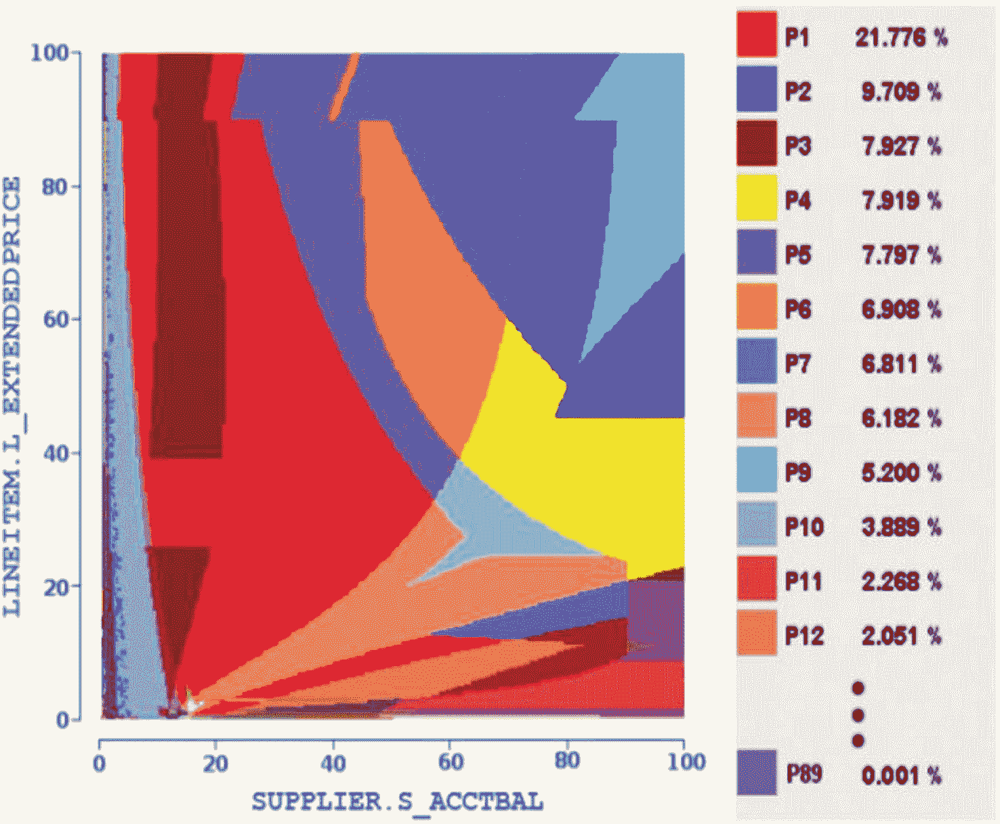

图 6-1 Picasso 数据库查询优化器可视化工具

图中的每种颜色代表同一查询的一个不同计划，每个计划都是根据谓词的选择性选定的。有趣的是，当跨越图中的某个边界并选择了不同的计划时，大多数情况下，两个计划的成本和性能应该是相似的，因为选择性或估计行数只是略有变化。例如，当向表中添加了符合所用谓词条件的新行时，就可能发生这种情况。然而，在某些情况下，主要是由于查询优化器成本模型存在局限性，无法正确建模某些因素，导致新计划与先前的计划相比性能差异巨大，从而给应用程序及其用户带来问题。需要澄清的是，图中显示的计划是查询优化器根据所用参数的选择性为同一查询选定的最终计划，而不是优化器在考虑选择时众多备选方案中的一部分。你可以在 `http://dsl.cds.iisc.ac.in/projects/PICASSO` 找到关于 **Picasso 数据库查询优化器可视化工具**的更多信息。

计划的另一个众所周知的问题是，由于 SQL Server 累积更新（CU）、服务包或版本升级后的变更导致的性能回退。提到查询优化器内部的变更，一个主要担忧就是计划回退，这被认为是查询优化器改进的一大障碍。回退是指对查询优化器应用修复后引入的问题，有时被称为经典的“两个或多个错误抵消成正确”。例如，当两个错误的估计值——一个高估了某个值，另一个低估了它——相互抵消，幸运地给出了一个良好的估计，从而整体上产生了一个良好的执行计划时，就可能发生这种情况。在查询优化器改进后，只修正其中一个值可能导致错误的估计，从而对计划选择产生负面影响，引发性能回退。

## 查询存储如何提供帮助

通过收集查询和计划信息、收集运行时统计信息，并允许你强制使用现有的查询计划，**查询存储**在以下场景中非常有用：

1.  计划回退
2.  SQL Server 升级
3.  应用程序/硬件变更
4.  识别开销大的查询
5.  识别即席工作负载

### 计划回退

在早期版本的 SQL Server 中，没有简便的方法来判断是否发生了计划回退，因为只能看到特定计划的当前版本。**查询存储**通过将查询计划的历史存储在系统中，并捕获每个计划随时间推移的性能表现，使你能够识别出那些随时间推移变慢的查询。“回退查询”报告可用于识别那些执行指标最近出现回退、可能正在数据库中引发性能问题的查询。


### SQL Server 升级

你可以使用查询存储（Query Store）和数据库兼容级别（`COMPATIBILITY_LEVEL`）设置来最小化 SQL Server 升级的风险。兼容级别会将某些数据库行为设置为与指定版本的 SQL Server 兼容。例如，你可以升级到 SQL Server 2019，同时将 `COMPATIBILITY_LEVEL` 设置保持为 140（对应 SQL Server 2017），这样你就可以使用前一个版本的查询处理器。通过启用查询存储，你可以收集查询和性能数据以创建基线，之后再将 `COMPATIBILITY_LEVEL` 设置更改为 150（对应 SQL Server 2019）来使用最新版本的查询处理器。如果发现执行计划回归，你将能够使用查询存储在不同层级缓解问题，包括强制特定执行计划、调整查询或更改回原始的 `COMPATIBILITY_LEVEL` 设置。此方案也可用于 SQL Server 累积更新（CU）或服务包，尽管在这种情况下数据库兼容级别保持不变。

> 注意：如第 3 章所述，跟踪标志 4199 也可用于控制在你升级到 SQL Server 2019 并使用数据库 `COMPATIBILITY_LEVEL` 150 后是否启用查询优化器修复。此外，如第 1 章所述，从 SQL Server 2017 开始，不再使用服务包，新的服务模型基于累积更新。

### 应用程序/硬件变更

与前面提到的 SQL Server 升级概念类似，你可以使用查询存储来测试系统中的重大变更，包括数据库、应用程序或硬件变更。同样，你可以收集查询和计划数据来创建基线，实施所需的变更，然后使用查询存储来分析工作负载并识别任何性能回归。

### 识别开销大的查询

虽然在之前版本的 SQL Server 中，你可以使用 DMV 或其他一些可用的性能数据语句来识别开销大的查询，但这些方法通常有一些限制。过去使用的其他技术可能需要捕获开销大的跟踪并进行复杂的分析才能获得类似的信息。正如我稍后将解释的，查询存储消除了一些此类限制，使你能够根据特定的执行指标快速识别数据库中开销最大的查询。要访问此信息，请在 SQL Server Management Studio 的查询存储文件夹中使用“消耗资源最多的查询”报告。选择一个你感兴趣的执行指标，以识别在提供的时间区间内对数据库资源消耗影响最大的查询。

> 注意：请记住，即使你在系统中找到了开销大的查询，你仍然可能需要应用标准的查询调整技术来改进其性能。查询调整超出了本书的范围。一个很好的参考资料是作者之前的书 *Microsoft SQL Server 2014 Query Tuning & Optimization*。

### 识别临时工作负载

你可以使用查询存储来识别临时工作负载，其特征通常是大量不同的查询很少执行，通常只执行一次。临时工作负载在查询优化上花费了系统资源的很大一部分，并在计划缓存中使用大量内存。识别临时工作负载将在本章后面介绍。

### 架构

查询存储直接与查询处理器交互。如图 6-2 所示，每次 SQL Server 编译或执行查询时，都会向查询存储发送一条消息。

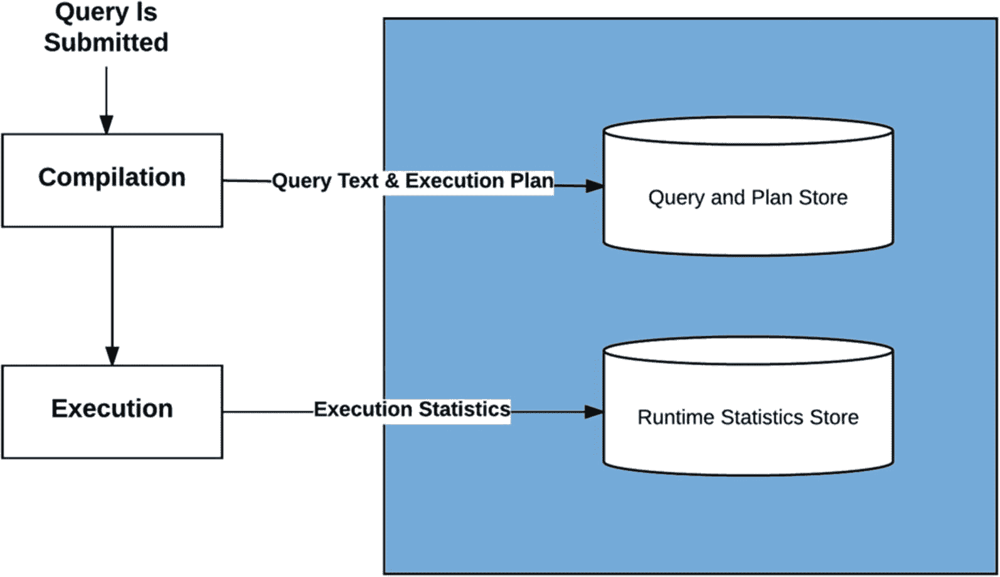
*图 6-2 查询存储工作流概览*

图 6-3 也显示了更详细的查询编译和执行流程。

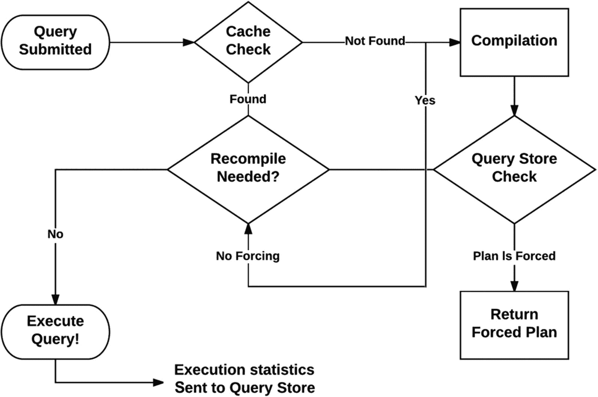
*图 6-3 查询编译与执行*

查询编译和执行流程如下：

1.  当查询提交给 SQL Server 执行时，SQL Server 会尝试在计划缓存中查找现有的执行计划。
2.  如果未找到计划，它将继续运行查询编译和优化过程。生成执行计划后，它会将查询文本和查询计划发送到查询存储。
3.  如果查询被配置为使用查询存储中的现有计划，查询处理器将尝试使用强制计划中提供的信息创建计划。
4.  在前面列出的三种场景（在缓存中找到计划、新优化或强制计划）中的任何一种之后，查询处理器将检查是否需要重新编译。
5.  如果在重新编译过程中创建了新计划，查询处理器会再次将查询文本和新的查询计划发送到查询存储。同一查询的所有查询计划都将保留在查询存储中，最多保留由 `MAX_PLANS_PER_QUERY` 配置选项定义的数量。
6.  一旦计划被选择并执行，查询处理器将运行时执行统计信息发送到查询存储。

优化和执行信息首先保存在内存中，稍后根据查询存储配置持久化到磁盘。数据根据 `INTERVAL_LENGTH_MINUTES` 参数（默认为一小时）进行聚合，并根据 `DATA_FLUSH_INTERVAL_SECONDS` 参数刷新到磁盘。如果系统存在内存压力，数据也可能更早刷新到磁盘。无论如何，当你运行 `sys.query_store_runtime_stats` 目录视图时，你将能够访问内存和磁盘中的所有数据，因为它被设计为从两个来源检索数据。

查询文本的定义从语句的第一个标记的第一个字符开始，到最后一个标记的最后一个字符结束。其内部的空格和注释会被计算在内，但如果它们位于之前或之后，则不被视为查询文本的一部分。查询还必须位于同一对象上才会被视为相同查询。如果相同的查询用于两个不同的存储过程，它将被视为不同的查询，并且对象的 `object_id` 会保存在查询存储目录视图中。建议你在维护对象时使用 `ALTER` 语句而不是 `DROP` 和 `CREATE` 语句，以保持相同的 `object_id` 值（除了保留权限等其他好处）。

> 注意：如果你仍然需要使用 `DROP` 和 `CREATE` 语句，SQL Server 2016 还引入了新的 `DROP IF EXISTS` 语法，允许你仅在对象已存在时才条件性地删除它。有关存储过程的示例，请参阅 SQL Server 文档 [`https://msdn.microsoft.com/en-us/library/ms174969.aspx`](https://msdn.microsoft.com/en-us/library/ms174969.aspx)。
> 
> ```
> DROP IF EXISTS
> ```


### 启用、清空与禁用查询存储

查询存储默认处于禁用状态。要在当前数据库上启用它，可以使用 `ALTER DATABASE CURRENT SET QUERY_STORE = ON` 语句。查询存储一旦启用，便会开始收集查询计划与性能数据，你可以通过查询存储目录视图来分析这些数据。信息在编译和执行后立即可用。

你可以主动分析收集到的信息，以了解应用程序中查询性能的变化；也可以在遇到性能问题时，进行事后分析。查看存储的不同指标后（这些指标与 `sys.dm_exec_query_stats` 动态管理视图中存储的指标非常相似），你就可以决定针对特定指标进行优化，例如查询持续时间、CPU 时间、逻辑 IO 读取、逻辑 IO 写入、物理读取等。一旦识别出问题，你可以使用传统的查询调优技术来尝试解决，或者使用查询存储来强制使用之前的某个计划。该计划必须已被查询存储捕获才能被强制使用，这显然意味着它是一个有效的计划（或至少在收集时是有效的——稍后会详细说明），并且它之前是由查询优化器生成的。要强制计划，你需要同时知道 `plan_id` 和 `query_id`，这可以在 `sys.query_store_plan` 目录视图中找到。从技术上讲，你也可以不使用查询存储，而是通过计划指南来强制计划，但这会更复杂，并且你首先仍需要手动收集和找到所需的计划。

即使查询存储处于禁用状态，你也可以通过运行以下语句来查询其当前配置值：

```sql
SELECT * FROM sys.database_query_store_options
```

这将返回以下数据：

| `desired_state` | 0 |
| --- | --- |
| `desired_state_desc` | OFF |
| `actual_state` | 0 |
| `actual_state_desc` | OFF |
| `readonly_reason` | 0 |
| `current_storage_size_mb` | 0 |
| `flush_interval_seconds` | 900 |
| `interval_length_minutes` | 60 |
| `max_storage_size_mb` | 100 |
| `stale_query_threshold_days` | 30 |
| `max_plans_per_query` | 200 |
| `query_capture_mode` | 1 |
| `query_capture_mode_desc` | ALL |
| `size_based_cleanup_mode` | 1 |
| `size_based_cleanup_mode_desc` | AUTO |

要在 AdventureWorks2017 数据库上启用查询存储，请使用以下语句：

```sql
ALTER DATABASE AdventureWorks2017 SET QUERY_STORE = ON
```

注意

初始还原 AdventureWorks2017 数据库时，查询存储可能已经处于启用状态。

启用查询存储后，只有状态会发生改变。所有其他默认值将保持不变。你也可以在启用查询存储时更改一个或多个配置值，如下文所示。如果再次显示 `sys.database_query_store_options` 目录视图，你会看到 `desired_state` 和 `actual_state` 列现在的值都是 2，并且 `desired_state_desc` 和 `actual_state_desc` 已切换为 `READ_WRITE`。这两个状态用于区分用户显式设置的期望操作模式与实际或真实状态。当这两个值不同时，最常见的情况是请求了 `READ_WRITE` 模式，但查询存储由于磁盘空间不足而自动切换到了 `READ_ONLY` 模式。

或者，你也可以使用 SQL Server Management Studio 执行相同的操作。右键单击你的数据库并选择“属性”。然后选择“查询存储”页。在“常规”的“操作模式（请求）”中，选择“读写”。请记住，使用 SQL Server Management Studio 时，会默认填充多个值，但你可以更改其中任何值，完成后单击“确定”。查询存储页面如图 6-4 所示。

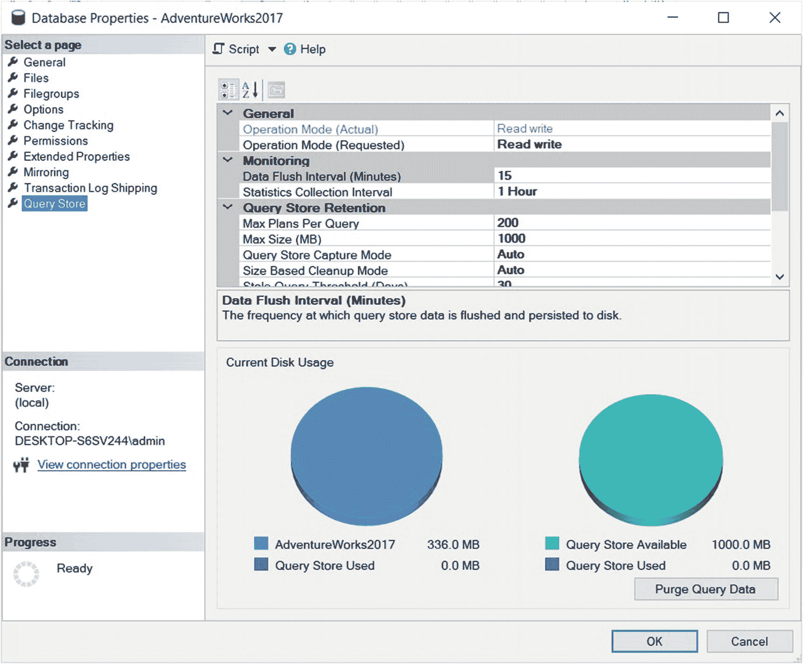

图 6-4. 查询存储配置

默认情况下，以下语句和值将被发送到 SQL Server：

```sql
ALTER DATABASE AdventureWorks2017 SET QUERY_STORE = ON
GO
ALTER DATABASE AdventureWorks2017 SET QUERY_STORE (OPERATION_MODE = READ_WRITE, CLEANUP_POLICY = (STALE_QUERY_THRESHOLD_DAYS = 367), DATA_FLUSH_INTERVAL_SECONDS = 900, INTERVAL_LENGTH_MINUTES = 60, MAX_STORAGE_SIZE_MB = 100, QUERY_CAPTURE_MODE = ALL, SIZE_BASED_CLEANUP_MODE = OFF)
GO
```

注意

你总是可以通过使用 SQL Trace 或 Extended Events 来捕获 SQL Server Management Studio 或其他工具发送的语句。你甚至可以捕获 Profiler 和 Extended Events GUI 本身发送的语句！

查询存储的默认选项对于快速入门来说是合适的，但你应该根据你的工作负荷和性能故障排除需求来更新其中一些选项。初次配置后，你可以监控查询存储随时间推移的表现，并相应地调整其配置。如你所见，`MAX_STORAGE_SIZE_MB` 仅为 100 MB，因此这可能是你首先想要更改或最初就配置为更高值（根据你的需要）的设置。`MAX_STORAGE_SIZE_MB` 是在数据库内为查询存储分配的磁盘空间。如果你不确定，可以至少从 1024 MB 或更大的值开始，但需要相应地监控磁盘空间使用情况，因为数据收集将取决于你系统的工作负荷和活动。不幸的是，如果分配的空间已满，查询存储将直接停止收集新数据，不会发出通知，并会静默切换到 `READ_ONLY` 状态，这意味着它将不再收集有关你查询的任何额外信息。你可以使用以下查询监控此状态：

```sql
SELECT actual_state_desc, desired_state_desc, current_storage_size_mb,
max_storage_size_mb, readonly_reason
FROM sys.database_query_store_options
```

在我的测试中，我曾短暂地超过了为配置大小分配的空间而没有出现问题，因为看起来空间使用情况并未进行实时验证。它只是在一段时间后才进入 `READ_ONLY` 状态，如下列配置值所示：

| `actual_state_desc` | `READ_ONLY` |
| --- | --- |
| `desired_state_desc` | `READ_WRITE` |
| `current_storage_size_mb` | 4 |
| `max_storage_size_mb` | 1 |
| `readonly_reason` | 65536 |

目前，目录视图不显示 `readonly_reason` 的描述，但文档显示 65536 表示查询存储已达到 `MAX_STORAGE_SIZE_MB` 选项设置的大小限制。文档错误地指出，在扩展 `MAX_STORAGE_SIZE_MB` 值后，你需要将状态更改回 `READ_WRITE`，但我的测试表明无需这样做。扩展 `MAX_STORAGE_SIZE_MB` 将自动使查询存储返回到 `READ_WRITE` 状态：

```sql
ALTER DATABASE AdventureWorks2017 SET QUERY_STORE (MAX_STORAGE_SIZE_MB = 2048)
```

请记住，虽然你可以更改查询存储的大小，但其内部表始终存储在数据库的主文件组中，目前无法更改。或者，你可以激活查询捕获和清理策略来控制磁盘空间的使用，如下文所述。

如前面 SQL Server Management Studio 生成的代码所示，你可以使用以下语法一次更改多个属性，并用逗号分隔：

```sql
ALTER DATABASE database_name SET QUERY_STORE ( [,... n])
```

如果你需要清空查询存储数据，可以单击查询存储页面上的“清除查询数据”按钮，如前文图 6-4 所示。这将发送以下语句，你也可以直接键入该语句以获得相同的结果：

```sql
ALTER DATABASE AdventureWorks2017 SET QUERY_STORE CLEAR ALL
```


要再次禁用查询存储，您可以使用 SQL Server Management Studio 并在“操作模式（请求）”中选择“关闭”，或者使用以下语句：

```sql
ALTER DATABASE AdventureWorks2017 SET QUERY_STORE = OFF
```

除了 `MAX_STORAGE_SIZE_MB` 外，查询存储中还可以配置以下选项：

1.  `OPERATION_MODE`：更新查询存储的操作模式，可为 `OFF`、`READ_ONLY` 和 `READ_WRITE`。如前所述，查询存储的状态可以通过目录视图 `sys.database_query_store_options` 中的 `desired_state_desc` 和 `actual_state_desc` 查看。查询存储禁用时为 `OFF`，启用时为 `READ_ONLY` 和 `READ_WRITE`。查询存储启用后，通常处于 `READ_WRITE` 状态。如前文所述，如果存在磁盘空间问题，或者您手动更改操作模式，查询存储可能会自动进入 `READ_ONLY` 状态。

2.  `MAX_PLANS_PER_QUERY`：指示为每个查询维护的最大计划数，默认值为 200。查询存储使您能够探索特定查询在生产工作负载中可能创建了多少个不同的执行计划，这在以前是不可能的，除非使用像 Picasso Database Query Optimizer Visualizer 这样的第三方工具。

3.  `INTERVAL_LENGTH_MINUTES`：定义将运行时执行统计信息数据聚合到查询存储中的时间间隔，默认值为 60 分钟。存储每一次查询执行是不现实的，因为有些查询可能在短时间内执行数千或数百万次。查询存储将按指定的时间间隔为每个查询存储一行，其中包含聚合的运行时统计信息。例如，如果一个查询在一小时内执行了 2000 次，目录视图 `sys.query_store_runtime_stats` 中的间隔将显示 2000 次 `count_executions`，但所有这些执行的性能数据将被聚合。使用较小的值在需要更精细粒度时可能有用，但也会占用更多磁盘空间。

4.  `CLEANUP_POLICY`：定义查询存储的数据保留策略。目前，唯一可能的值是 `STALE_QUERY_THRESHOLD_DAYS`，它指定查询信息在查询存储中保留的天数。如本节开头 `ALTER DATABASE` 语句所示，其默认值为 367 天。此配置值也会影响查询存储所需的磁盘空间，对于某些工作负载而言 367 天可能过高，因此您可能需要将其配置为较低的值。

5.  `DATA_FLUSH_INTERVAL_SECONDS`：定义将写入查询存储的数据持久化到磁盘的频率。其默认值为 900 秒或 15 分钟。如架构部分所示，查询存储收集的数据是立即可用的，但出于性能考虑，它们只是异步写入磁盘。

最后，查询存储还具有用于定义查询捕获和清理策略的配置选项。定义查询捕获策略可以通过 `QUERY_CAPTURE_MODE` 完成，其值为 `ALL`、`AUTO` 和 `NONE`，描述如下：

1.  `ALL`：定义捕获所有查询。这是默认值。

2.  `AUTO`：指示仅根据执行次数和资源消耗捕获相关查询。使用此选项时，编译和执行时间短且执行频率低的查询不会被收集。频率、编译和执行时间的阈值是内部确定的，无法手动配置。

3.  `NONE`：请求查询存储停止捕获新查询。使用此配置选项时，查询存储将仅收集已捕获查询的编译和运行时统计信息。应谨慎使用此配置，因为会错过新查询的重要信息。

清理策略使用 `SIZE_BASED_CLEANUP_MODE` 配置选项定义，其值为 `OFF`（默认值）和 `AUTO`。`OFF` 表示策略已禁用，不会自动删除数据。如果定义了 `AUTO` 值，当磁盘大小达到 `MAX_STORAGE_SIZE` 中定义值的 90% 时，策略将自动激活。清理策略首先删除最不常用和最旧的查询，并在达到 `MAX_STORAGE_SIZE` 定义的磁盘空间约 80% 时停止。


## 使用查询存储

在上一节中，我们了解了如何启用和配置查询存储。现在，让我们通过运行一些查询来实际操作一下。在我们的示例中，我们可以在数据收集后立即进行检查。然而，在生产环境中，你可能希望等待一段时间，直到收集到具有代表性的工作负载，这取决于你的应用程序，可能需要例如一整天或一周的时间。让我们用我在 `AdventureWorks2017` 数据库上最喜欢的一个查询来测试它，这个查询的优势在于它极其简单，并且在这种情况下可以展示参数敏感问题。创建以下存储过程：

```sql
CREATE PROCEDURE test (@pid int)
AS
SELECT * FROM Sales.SalesOrderDetail
WHERE ProductID = @pid
```

> **Note**
>
> 请记住，这是一个简化的练习，旨在展示查询存储的工作原理。你当然可以使用其他技术来解决参数敏感查询的问题，但在像 `AdventureWorks2017` 这样的小型数据库中模拟计划回归会付出更多的努力。而且，是的，查询存储也可以用来查找参数敏感查询（或更常称为与参数探测相关的问题）。

根据提供给过程的参数值，可能会创建两种可能的执行计划。这相当于图 6-1 中的毕加索图，仅显示两种颜色。使用 `ProductID` `898` 执行存储过程将创建一个包含索引查找和键查找运算符的计划，而使用值 `870` 则会选择表扫描。在这两种情况下，创建的计划都将适合所提供的参数。尝试任何其他可能的值仍将创建这两种计划之一，前提是需要并执行了新的优化。但作为一个参数敏感的查询或过程，当重用一个可能不适合所提供参数的现有计划时，可能会出现性能问题。

例如，对 `ProductID` `898` 运行使用表扫描计划的过程可能会导致一些性能问题，因为必须扫描整个表才能返回仅 9 行数据。但最高的性能问题将发生在使用索引查找/键查找计划的 `ProductID` `870` 上，因为它执行了 14,000 次逻辑读取，而整个表扫描只需 1200 次读取。性能问题的原因在于索引查找/键查找组合非常昂贵，只有在返回少量行时才是一个好的解决方案。让我们创建这个场景，看看查询存储是否能检测到该性能问题。首先，运行 `SET STATISTICS IO ON` 以启用 SQL Server 显示有关查询产生的磁盘活动量的信息，并运行 `ALTER DATABASE SET QUERY_STORE CLEAR ALL` 来清除查询存储当前存储的任何信息。运行以下语句：

```sql
SET STATISTICS IO ON
GO
ALTER DATABASE AdventureWorks2017 SET QUERY_STORE CLEAR ALL
```

运行第一个查询以创建表扫描计划。你可以选择在 SQL Server Management Studio 中通过选择“包含实际执行计划”来可视化该计划。

```sql
EXEC test @pid = 870
```

运行前面的语句将显示 1248 次逻辑读取，你可以在“消息”选项卡上看到（根据几个因素，这个值可能会有微小差异）。如果你随后尝试以下查询，它将重用表扫描计划，因此将具有相同的逻辑读取次数（假设该计划尚未从计划缓存中删除）：

```sql
EXEC test @pid = 898
```

事实上，任何参数都将使用相同的计划，并且性能也将相同。至少在这种情况下，性能是稳定和一致的，尽管对于最后一种情况（必须扫描整个表才能返回仅 9 行）来说，可能不是一个完美的解决方案。

但是，使用索引查找和键查找运算符的计划会出现更大的性能差异。我们假设当前计划已从计划缓存中清除，并且下一次执行使用 `ProductID` `898`，从而创建一个新的优化和一个新计划。为了模拟这一点，我们将使用 `DBCC FREEPROCCACHE` 语句，虽然这不是实现此目的的最佳方法，但它是一种简单的方法，以便我们专注于主要观点。运行以下查询：

```sql
DBCC FREEPROCCACHE
GO
EXEC test @pid = 898
GO
EXEC test @pid = 870
```

> **Note**
>
> `DBCC FREEPROCCACHE` 将从整个计划缓存中删除所有计划，因此请小心，不要在生产环境中运行此类语句。

这些执行的逻辑读取次数分别为 29（获取 9 行）和 14,077（获取 4688 行）。14,077 是一个巨大的数字，对于之前显示仅需 1266 次逻辑读取即可执行表扫描操作的表来说。这一次，执行时间不稳定，它将取决于提供的参数，更准确地说，取决于所需的索引查找/键查找次数。换句话说，使用表扫描的计划将始终具有相同的性能，具体取决于表中的页数。但使用索引查找/键查找的计划将取决于读取的行数，因此其开销可以从非常小到非常大。

确保你已执行前面的查询，我们现在可以运行此查询来显示查询存储收集的一些信息：

```sql
SELECT rs.avg_logical_io_reads, qt.query_sql_text,
q.query_id, qt.query_text_id, p.plan_id, rs.runtime_stats_id,
rsi.start_time, rsi.end_time, rs.avg_rowcount, rs.count_executions
FROM sys.query_store_query_text AS qt
JOIN sys.query_store_query AS q
ON qt.query_text_id = q.query_text_id
JOIN sys.query_store_plan AS p
ON q.query_id = p.query_id
JOIN sys.query_store_runtime_stats AS rs
ON p.plan_id = rs.plan_id
JOIN sys.query_store_runtime_stats_interval AS rsi
ON rsi.runtime_stats_interval_id = rs.runtime_stats_interval_id
```

我们得到以下输出；仅显示所需的行：

| `平均逻辑 IO 读取次数` | `1249` | `7054` |
| --- | --- | --- |
| `查询 SQL 文本` | (@pid int)SELECT * FROM | (@pid int)SELECT * FROM |
| `查询 ID` | 1 | 1 |
| `查询文本 ID` | 1 | 1 |
| `计划 ID` | 1 | 2 |
| `运行时统计信息 ID` | 1 | 2 |
| `平均行数` | 2348.5 | 2348.5 |
| `执行次数` | 2 | 2 |

这表明，对于 `计划 ID` 1（表扫描计划），平均逻辑 IO 读取次数为 1249，因为整个表有 1249 页。对于 `计划 ID` 2（包含索引查找和键查找运算符的计划），平均值为 7054，这大约是 29 加上 14,077 除以 2，因为有两次执行。

SQL Server Management Studio 也可以向你显示此信息和其他查询存储信息。在数据库下的查询存储文件夹中，右键单击“性能回归查询”，然后选择“查看性能回归查询”。该报表将让你选择 CPU 时间 (us)、持续时间 (us)、逻辑读取、逻辑写入、内存消耗 (KB) 和物理读取。单击“以网格格式查看性能回归查询及其详细信息”。图 6-5 显示了按逻辑读取排序的报表。

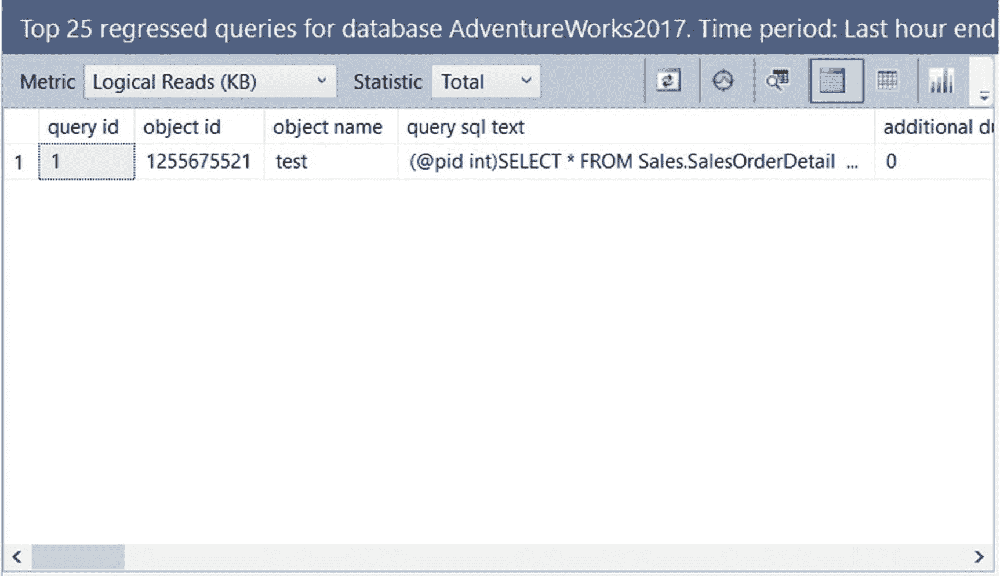

图 6-5：按逻辑读取排序的前 25 个性能回归查询

单击我们感兴趣的查询。（即使你遵循了相同的步骤，你也可能有不同的 `查询 ID`。）在右上角窗格中，你会看到一个类似于图 6-6 的屏幕，其中显示了两个计划，由两个小圆圈表示。单击一个圆圈将显示每个计划的运行时信息，图形化计划将显示在底部窗格中（图 6-6 中未显示）。

> **Note**


查询存储的早期版本以**页**为单位显示逻辑读取量。最新版本则以 KB 为单位显示相同的信息。例如，您可能会看到平均逻辑读取为 7054，或平均逻辑读取（KB）为 56,432。正如我们在第 1 章所学，一个数据页大小为 8 KB。

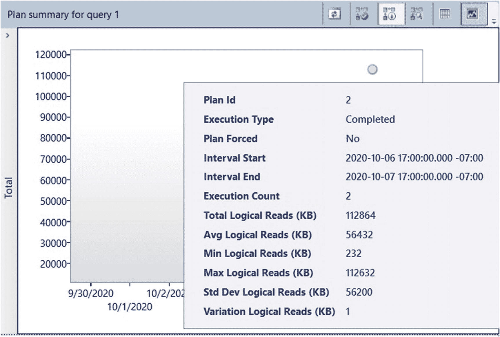

### 图 6-6：查询窗格的计划摘要

此时，您可以研究为什么这两个计划的性能差异如此之大，并尝试应用任何传统的查询优化技术。查询存储提供了一个解决方案，并且该方案无需任何查询调优工作即可立即使用，那就是强制使用任何可用的执行计划——假设您希望该特定查询的每次执行都使用该计划。

那么，下一步该做什么？虽然对于此示例而言，这并非完美的解决方案（这就是为什么参数敏感的查询难以修复，并且通常需要其他方法），但假设我们想要一致的性能，并决定使用包含表扫描的计划。让我们通过在"查询计划摘要"窗格中选择该计划，并在底部窗格显示计划时单击"强制计划"来强制执行该计划。计划摘要还为您提供了强制计划的选项。只有当计划保存在查询存储中时，您才能强制它。在系统要求确认时回答"是"。如果您在跟踪中捕获该查询，您会看到发送了类似的语句：

```
EXEC sys.sp_query_store_force_plan @query_id = 1, @plan_id = 1
```

您可以使用 `sp_query_store_force_plan` 来为特定查询强制执行特定计划。每当 SQL Server 遇到此查询时，如果计划缓存中没有可用的此类计划，它就会尝试强制执行提供的计划。如果强制计划失败，则会触发 `plan_guide_unsuccessful` 扩展事件（或 Plan Guide Unsuccessful 跟踪事件），并指示查询优化器以正常方式优化查询。强制的计划会保存在计划缓存中，并根据需要重用。值得注意的是，此查询的计划只有在指定的存储过程内执行时才会被强制。如果相同的查询在不同的存储过程或即席查询中执行，则此操作将不适用。

此时，即使您清除计划缓存并使用值 898 运行查询，您也将始终获得包含表扫描的计划。尽管执行计划中的 `Use Plan` 属性将为 true，但这并不表示这是一个强制计划。目前，了解此信息的唯一方法是查看 `sys.query_store_plan` 目录视图中的 `is_forced_plan` 列。

SQL Server Management Studio 还在同一图形界面上提供了取消强制计划的选项。执行该操作将向 SQL Server 发送类似的语句：

```
EXEC sys.sp_query_store_unforce_plan @query_id = 1, @plan_id = 1
```

强制计划在后台使用计划指南。当计划被强制时，SQL Server 会隐式地添加一个 `USE PLAN` 提示，其中包含与该语句关联的 XML 计划片段，因此您不再需要单独使用计划指南。此外，请注意，当单独使用计划指南时，查询优化器不保证会生成完全请求的强制计划，而至少是与其类似的计划。另外，您应该意识到，在某些情况下强制计划可能不起作用，一个典型的例子是当架构发生更改时。因此，如果某个计划使用了索引但该索引已不复存在，则无法重用和强制该计划。在这种情况下，SQL Server 将执行正常的优化，并会在 `sys.query_store_plan` 目录视图中记录强制计划操作失败的事实。计划强制失败将在本章后面解释。有关可使用查询存储和 `USE PLAN` 强制的查询计划元素的更多详细信息，请参阅 [`https://technet.microsoft.com/en-us/library/ms186954`](https://technet.microsoft.com/en-us/library/ms186954)`(v=sql.105).aspx`。

清除或禁用查询存储也将禁用任何强制的查询计划。一旦清除了计划，就无法再强制它，因为该计划已从查询存储数据库中永久删除。但是，如果在某个计划配置为强制时禁用了查询存储，那么一旦查询存储再次启用，该计划将被重新强制（假设该计划未被其他方式删除）。在我们的示例中，取消强制先前的计划，并使用 ProductID 898 再次运行该过程，将执行正常的查询优化，创建包含索引查找/键查找组合的原始计划，并且执行计划中将不再出现 `Use Plan` 属性。

最后，强制计划不应被视为长期解决方案，因为与使用查询提示类似，数据库数据和架构可能会发生变化，而强制的计划可能不再是最优的。因此，仍然需要使用传统的查询调优技术来修复有问题的查询。


## 性能故障排除

正如前一节所述，你可以分析查询存储收集的信息，无论是主动分析以了解应用程序中的查询性能变化，还是被动分析以应对性能问题。查询存储可用于找出资源消耗高的查询，其方式与我们过去使用 `sys.dm_exec_query_stats` 动态管理视图的方式大致相同。相比于使用此动态管理视图，查询存储提供了一些额外优势，包括：

1.  使用 `sys.dm_exec_query_stats` 动态管理视图只能查看当前位于计划缓存中的计划。每个计划只存在当前版本，而且即使是这个版本也可能随时从计划缓存中被清除。查询存储则会持久化保存每个查询所有历史版本的计划。

2.  并非所有计划都会被缓存，因此也不会通过 `sys.dm_exec_query_stats` 动态管理视图暴露出来。而查询存储会存储所有的计划，甚至是未完成的查询计划，后文将对此进行说明。

要显示数据库中资源消耗最高的查询，你可以使用 `SQL Server Management Studio` 中的“前几大资源消耗查询”报告。该报告允许你选择不同的指标，包括 CPU 时间、持续时间、执行次数、逻辑读取、逻辑写入、内存消耗和物理读取。图 6-7 展示了以 CPU 时间为指标的示例。

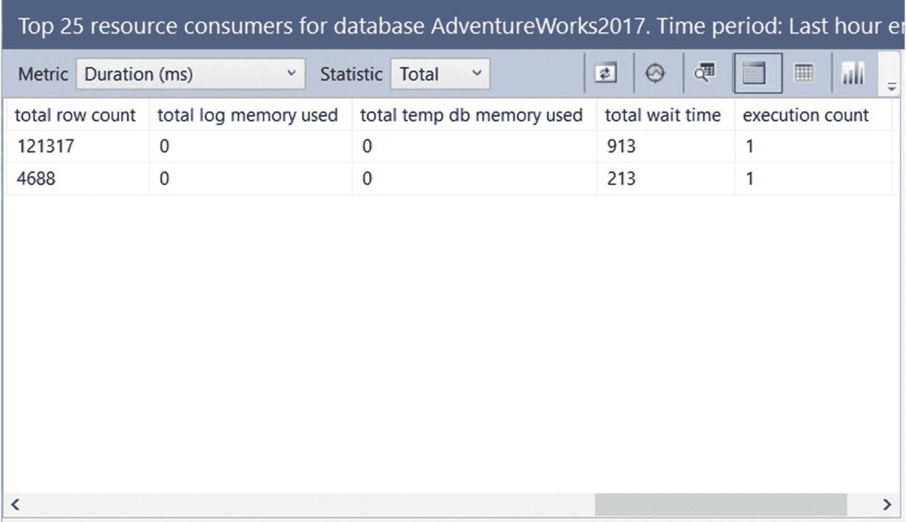

图 6-7：前 25 大资源消耗查询报告

为了获得更大的灵活性，你可以结合使用 `sys.query_store_runtime_stats` 运行时统计信息视图以及其他查询存储目录视图，编写自己的查询。

我最喜欢的一种技巧是：在 `SQL Server Management Studio` 中运行跟踪或扩展事件会话，运行“前几大资源消耗查询”报告并选择我需要的指标，然后查看提交给引擎的是哪个查询。例如，在运行图 6-7 所示的以 CPU 时间为指标的报告时，我看到提交了以下查询（此处已稍作编辑，包括移除了一个筛选特定时间段以获取最近一小时内最耗资源查询的过滤器）：

```sql
SELECT TOP 25
p.query_id query_id,
qt.query_sql_text query_text,
CONVERT(float, SUM(rs.avg_cpu_time * rs.count_executions)) total_cpu_time,
SUM(rs.count_executions) count_executions,
COUNT(DISTINCT p.plan_id) num_plans
FROM sys.query_store_runtime_stats rs
JOIN sys.query_store_plan p ON p.plan_id = rs.plan_id
JOIN sys.query_store_query q ON q.query_id = p.query_id
JOIN sys.query_store_query_text qt ON q.query_text_id = qt.query_text_id
GROUP BY p.query_id, qt.query_sql_text
ORDER BY total_cpu_time DESC
```

如前所述，你可以使用查询存储来识别数据库中的即席工作负载。由于即席工作负载可能包含大量不同的查询，它们通常会在查询优化上消耗相当大比例的系统资源，并在计划缓存中占用大量内存。要识别即席工作负载，你可以使用前面介绍的“前几大资源消耗查询”报告，并选择“执行次数”作为报告指标。图表或报告中出现大量执行次数为 1 的查询，可能就表明存在即席工作负载。你可能还需要查看超过默认 25 个查询的更多查询，并设置一个更大的数值。为此，请选择“配置”（位于屏幕右上角区域），然后点击“返回”，并在“前几大查询”部分指定一个新值。报告显示后，你也可以点击“执行次数”列，以便从执行次数值为 1 的查询开始查看，如前图 6-7 所示。

如果你有大量即席查询，你可能需要启用“即席工作负载优化”配置选项，SQL Server 可以利用此选项来提高计划缓存的效率。启用此配置后，SQL Server 通过仅在计划缓存中存储一个小型的已编译计划存根，而非为仅执行一次的查询存储完整的已编译执行计划，从而最小化计划缓存的内存使用量。有关“即席工作负载优化”配置选项的更多详细信息，请参阅第 3 章。

另一种重用计划的替代方案是在数据库级别强制实施参数化，尽管此方法更为激进。当多个相似的即席查询可以从使用相同的执行计划中受益时，此配置可能很有用。强制使用相同的计划可能并非总是好的解决方案，因此这是一个需要仔细和全面测试的选择。可以通过使用 `ALTER DATABASE SET PARAMETERIZATION FORCED` 语句来实现数据库级别的强制参数化。


## 未完成的查询

查询存储一个非常有趣的功能是，你可以查看一条查询的最终状态。这对于查找那些未能成功完成的查询信息尤其有用。在 SQL Server 中，使用其他现有方法要实现这一点曾经非常困难。你可以通过查看 `sys.query_store_runtime_stats` 目录视图的 `execution_type` 和 `execution_type_desc` 列来找到这些信息。根据文档，`execution_type` 列的可能值如下：

*   0：常规执行（成功完成）
*   3：客户端发起中止的执行
*   4：异常中止的执行

你的大多数查询将返回值 0，表示它们已成功执行。因此，让我们运行一个示例，看看当查询未成功执行时是如何工作的。首先清空查询存储，以便更容易管理我们查询中的可用结果：

```sql
ALTER DATABASE AdventureWorks2017 SET QUERY_STORE CLEAR ALL
```

运行以下查询（请注意，如果任其执行，此查询将运行很长时间）：

```sql
SELECT * FROM Sales.SalesOrderDetail s1 CROSS JOIN Sales.SalesOrderDetail s2
```

让查询运行大约五秒，然后取消它。现在运行以下查询：

```sql
SELECT COUNT(*) FROM Sales.SalesOrderDetail s1 CROSS JOIN Sales.SalesOrderDetail s2
```

与之前被取消的执行不同，此查询应很快完成，并报出一条关于算术溢出错误（将表达式转换为数据类型 int 时发生）的错误消息。

最后，运行以下查询，它应在不到一秒内成功完成：

```sql
SELECT COUNT_BIG(*) FROM Sales.SalesOrderDetail s1 CROSS JOIN Sales.SalesOrderDetail s2
```

现在，让我们通过运行以下查询来检查执行类型值：

```sql
SELECT rs.avg_logical_io_reads, qt.query_sql_text,
q.query_id, execution_type_desc, qt.query_text_id, p.plan_id, rs.runtime_stats_id,
rsi.start_time, rsi.end_time, rs.avg_rowcount, rs.count_executions
FROM sys.query_store_query_text AS qt
JOIN sys.query_store_query AS q
ON qt.query_text_id = q.query_text_id
JOIN sys.query_store_plan AS p
ON q.query_id = p.query_id
JOIN sys.query_store_runtime_stats AS rs
ON p.plan_id = rs.plan_id
JOIN sys.query_store_runtime_stats_interval AS rsi
ON rsi.runtime_stats_interval_id = rs.runtime_stats_interval_id
```

输出应包含以下数据：

| `avg_logical_io_reads` | `query_sql_text` | `execution_type_desc` |
| --- | --- | --- |
| `942` | select count(*) from sales.SalesOrderDetail s1 cross join sales.SalesOrderDetail s2 | Exception |
| `343572` | select * from sales.SalesOrderDetail s1 cross join sales.SalesOrderDetail s2 | Aborted |
| `942` | select count_big(*) from sales.SalesOrderDetail s1 cross join sales.SalesOrderDetail s2 | Regular |

如你所见，查询存储能够追踪所有先前的查询，并为我们提供查询状态或查询执行类型，以及运行时和性能信息。这在查询失败并需要查看诸如资源使用情况、持续时间等额外信息的场景中非常有帮助。请记住，查询必须是有效的，且必须已生成执行计划并开始执行，才能在其失败或取消后被追踪。如果查询编译失败，则没有任何信息可追踪。例如，如果查询尝试使用一个不存在的表，则不会生成计划，也不会有查询执行发生。比如，如果你运行：

```sql
SELECT * FROM authors
```

你将收到“对象名 'authors' 无效”的错误，并且根本没有进行优化或执行，因此查询存储也不会捕获任何信息。

追踪未成功完成的查询时，一个常见的问题与 `.NET` 应用程序的默认查询超时设置有关，该设置为 30 秒。你可以使用以下代码测试一个 `.NET` 应用程序的默认超时。由于默认的 `.NET` 超时未被更改，并且代码中执行的查询肯定会运行超过 30 秒，你将得到如前所述的 Exception 类型的查询执行结果：

```csharp
using System;
using System.Data.SqlClient;
public class Test {
public static void Main() {
string connectionString = "Data Source=(local);Initial Catalog=AdventureWorks2017;Integrated Security=SSPI";
string queryString = "SELECT * FROM Sales.SalesOrderDetail s1 CROSS JOIN Sales.SalesOrderDetail s2";
using (SqlConnection connection = new SqlConnection(connectionString)) {
connection.Open();
SqlCommand command = new SqlCommand(queryString, connection);
try {
command.ExecuteNonQuery();
}
catch (SqlException e) {
Console.WriteLine("Got expected SqlException due to command timeout ");
Console.WriteLine(e);
}
}
}
}
```

**注意**

测试此示例无需安装 Visual Studio，只需安装 Microsoft `.NET` 框架即可。如果你也安装了 SQL Server，那么它应该已经安装。典型安装会在 `C:\Windows\Microsoft.NET` 文件夹下有一个或多个版本的 Microsoft `.NET` 框架，你可以在那里找到 Microsoft Visual C# 编译器或 `csc.exe`。如果你没有使用默认的 SQL Server 实例或没有使用 Windows 身份验证，则可能需要更新提供的代码。

编译代码的一个简单方法是运行以下命令，假设代码保存在名为 test.cs 的文件中：

```shell
"C:\Windows\Microsoft.NET\Framework64\v4.0.30319\csc.exe" test.cs
Microsoft (R) Visual C# Compiler version 4.8.3752.0
for C# 5
Copyright (C) Microsoft Corporation. All rights reserved.
```

运行创建的可执行文件 test.exe 将产生预期的错误：

```shell
Got expected SqlException due to command timeout
System.Data.SqlClient.SqlException (0x80131904): Execution Timeout Expired.  The timeout period elapsed prior to completion of the operation or the server is not responding. ---> System.ComponentModel.Win32Exception (0x80004005): The wait operation timed out
```

既然我已经提到查询存储会追踪在配置的数据库中执行的所有查询，你可能会问，它是否也会捕获使用了 `RECOMPILE` 提示的查询、维护语句或跨数据库查询。让我用以下例子来回答。在测试数据库上创建一个小表，为运行跨数据库查询做准备：

```sql
USE Test
CREATE TABLE Orders (SalesOrderID int)
INSERT INTO Orders VALUES (43659)
```

回到 AdventureWorks2017。再次清空查询存储，以便更容易查看存储在目录视图中的查询：

```sql
USE AdventureWorks2017
GO
ALTER DATABASE AdventureWorks2017 SET QUERY_STORE CLEAR ALL
```

运行以下语句，确保将备份目标更新为有效路径：

```sql
ALTER INDEX IX_SalesOrderDetail_ProductID ON Sales.SalesOrderDetail REBUILD
GO
DBCC CHECKDB
GO
SELECT * FROM Sales.SalesOrderDetail
WHERE ProductID = 898
OPTION (RECOMPILE)
GO
BACKUP DATABASE AdventureWorks2017 TO  DISK = 'c:\data\delete_me.bak'
GO
SELECT * FROM Sales.SalesOrderDetail a JOIN Test.dbo.Orders b
ON a.SalesOrderID = b.SalesOrderID
```

使用之前的查询来检查哪些查询被查询存储捕获了。除了 `DBCC CHECKDB` 和 `BACKUP DATABASE` 语句外，其余所有查询都被捕获了。


## 强制失败

如前所述，强制执行计划应是在研究和实施长期解决方案期间的一种临时措施。与使用查询提示的情况类似，强制计划也应受到监控，因为在数据库发生变更后，其性能可能会下降。此外，SQL Server 也可能无法强制执行指定的计划。查询存储通过 `sys.query_store_plan` 目录视图的 `last_force_failure_reason` 和 `last_force_failure_reason_desc` 列提供有关强制计划失败的信息。这些列的文档记录值如下：

*   8637: `ONLINE_INDEX_BUILD`：当目标表有一个正在联机构建的索引时，查询尝试修改数据。
*   8683: `INVALID_STARJOIN`：计划包含无效的星型连接规范。
*   8684: `TIME_OUT`：优化器在搜索强制计划指定的计划时，超出了允许的操作数。
*   8689: `NO_DB`：计划中指定的某个数据库不存在。
*   8690: `HINT_CONFLICT`：由于计划与查询提示冲突，查询无法编译。
*   8694: `DQ_NO_FORCING_SUPPORTED`：由于计划与分布式查询或全文检索操作的使用冲突，无法执行查询。
*   8698: `NO_PLAN`：查询处理器无法生成查询计划，因为无法验证强制计划对查询是否合法。
*   8712: `NO_INDEX`：计划中指定的索引不再存在。
*   8713: `VIEW_COMPILE_FAILED`：由于计划中引用的索引视图存在问题，无法强制查询计划。
*   <其他值>: `GENERAL_FAILURE`：一般性强制错误（未涵盖在上述原因中）。

一个展示此功能的简单示例是，禁用强制计划中正在使用的一个现有索引。首先，清空查询存储和计划缓存：

```sql
ALTER DATABASE AdventureWorks2017 SET QUERY_STORE CLEAR ALL
GO
DBCC FREEPROCCACHE
```

通过运行以下代码创建强制执行的计划（假定该存储过程已如之前所示创建）：

```sql
EXEC test @pid = 898
```

仅为此练习的目的，假定你可能至少有另一个计划，并且希望强制使用带有索引查找操作符的那个计划。运行以下查询以获取其 `plan_id`：

```sql
SELECT plan_id, q.query_id, query_sql_text FROM sys.query_store_plan p
JOIN sys.query_store_query AS q
ON p.query_id = q.query_id
JOIN sys.query_store_query_text qt
ON q.query_text_id = qt.query_text_id
WHERE query_sql_text LIKE '%SELECT * FROM Sales.SalesOrderDetail%'
```

检查结果，找到查询文本 `“(@pid int)SELECT * FROM Sales.SalesOrderDetail WHERE ProductID = @pid”`。获取 `query_id` 和 `plan_id` 值。在我的例子中，`query_id` 是 1，`plan_id` 是 1。运行以下命令以强制所需的计划：

```sql
EXEC sys.sp_query_store_force_plan @query_id = 1, @plan_id = 1
```

你也可以选择如前所述在 SQL Server Management Studio 中执行此过程。验证查询是否运行，是否使用了带有索引查找的计划，并且执行计划中的 `Use Plan` 属性是否设置为 true。最后，禁用该索引：

```sql
ALTER INDEX IX_SalesOrderDetail_ProductID ON Sales.SalesOrderDetail DISABLE
```

如果你再次运行查询，强制计划将会失败，因为该计划所使用的索引不再可用。你将得到一个正常的查询优化和一个使用表扫描的计划。以下查询（首先将 `plan_id` 更新为你之前使用的值）

```sql
SELECT * FROM sys.query_store_plan
WHERE plan_id = 1
```

将返回 `force_failure_count` 为 1，这是强制此计划失败的次数。请记住，此值显示的是优化尝试次数，而非查询执行次数。结果还显示 `last_force_failure_reason` 为 8712，`last_force_failure_reason_desc` 为 `NO_INDEX`，这与本节开头的文档记录一致。但是，如果你启用或重建索引，计划将继续被强制执行。运行以下语句：

```sql
ALTER INDEX IX_SalesOrderDetail_ProductID ON Sales.SalesOrderDetail REBUILD
```

查询处理器将再次使用该强制计划，并且 `sys.query_store_plan` 目录中的 `force_failure_count`、`last_force_failure_reason` 和 `last_force_failure_reason_desc` 的值将分别重置为 0、0 和 NONE。

## 等待统计

如前一章所述，从 SQL Server 2016 开始，可以通过使用 `sys.dm_exec_session_wait_stats` DMV 在会话或查询级别跟踪等待统计信息。显然，我指的是数据库引擎级别。尽管查询存储在同一版本中发布，但在 SQL Server 2017 中才实现了在查询存储中收集等待信息的功能。毫无疑问，此功能是查询存储自最初发布以来最重要的改进。

等待统计在查询存储中默认是启用的。例如，你可以创建一个新数据库，并在不启用查询存储的情况下，查看 `sys.database_query_store_options` 以确认 `wait_stats_capture_on` 已启用。因此，如果你启用了查询存储，等待统计功能将随之自动启用。

你也可以通过运行以下语句显式启用等待统计：

```sql
ALTER DATABASE AdventureWorks2017 SET QUERY_STORE (WAIT_STATS_CAPTURE_MODE = ON)
```

类似地，你可以使用 `WAIT_STATS_CAPTURE_MODE = OFF` 的相同语句来禁用该功能。

查询存储中的等待类型被分组到等待类别中，其方式类似于第 5 章图 5-3 所示的数据收集功能。让我们尝试一个快速练习，看看此功能如何工作。在确保等待统计功能已启用后，尝试运行一些开销较大的查询。一个简单的例子是运行以下 SELECT 语句各十次：

```sql
SELECT * FROM Person.Person
GO 10
SELECT * FROM Sales.SalesOrderDetail
GO 10
```

查询完成后，你可以立即访问等待信息。为此，你可以使用 SQL Server Management Studio 并从查询存储文件夹运行“查询等待统计信息”报告。你可能会看到一个类似于我在图 6-8 中展示的报告。该图基于“等待类别”指标，但你可以将其更改为其他选择，如平均等待时间、最小等待时间、最大等待时间、等待时间标准差、总等待时间或执行计数。我的示例显示了我们的两个查询，称为查询 ID 1 和 2，包括它们的等待信息。

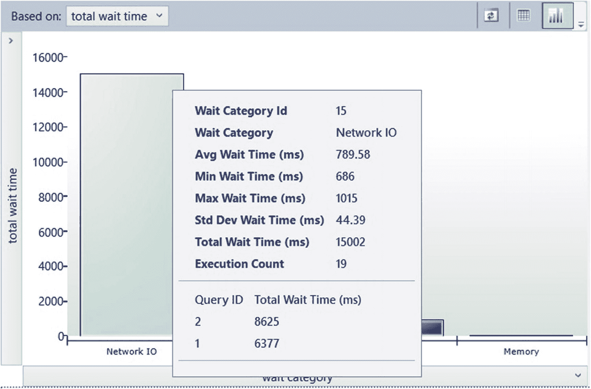

图 6-8 查询存储等待统计信息

单击任何等待类别将带我们进入第二个屏幕，在那里我们可以看到每个查询的等待信息，包括任何可用的执行计划，如图 6-9 所见。

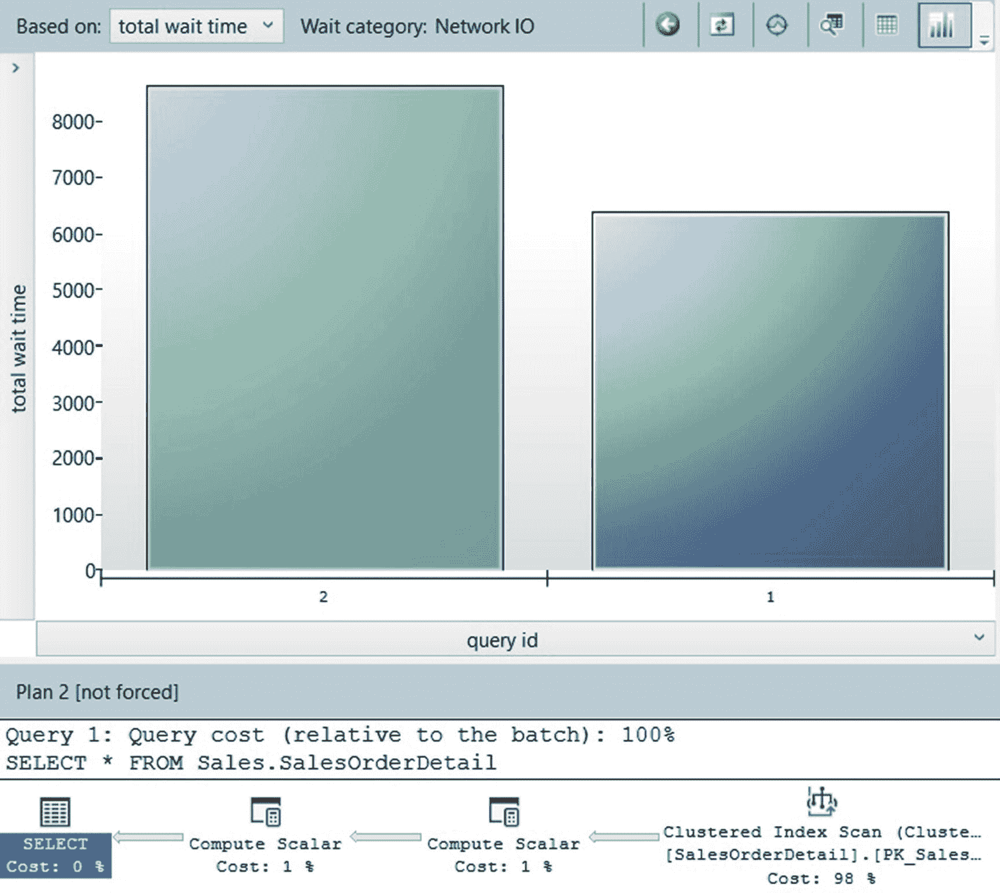

图 6-9 查询等待统计信息

最后，如前所述，等待被分组到类别中，而不是列出像 `CXPACKET` 或 `ASYNC_NETWORK_IO` 这样的特定等待。例如，所有 `LCK_M_%` 等待被分组到“锁”类别，所有 `LATCH_%` 分组到“闩锁”类别，`PAGELATCH_%` 分组到“缓冲区闩锁”，`PAGEIOLATCH_%` 分组到“缓冲区 I/O”，`CXPACKET` 和其他一些分组到“并行”，`ASYNC_NETWORK_IO` 和其他一些分组到“网络 I/O”，而 `SOS_SCHEDULER_YIELD` 单独列为“CPU”，这仅列举了我们通常看到的最常见的一些。你可以通过查看文档中的 `sys.query_store_wait_stats` 来查看完整列表。你也可以在第 5 章中看到有关等待的更多详细信息。


## 目录视图

最后，尽管我们已经使用过一些查询存储目录视图，但让我们在本节中回顾所有这些视图。如前所述，收集的数据持久化在磁盘上，并存储在启用了查询存储的用户数据库中。查询存储目录视图如图 6-10 所示，包含以下视图。

| 视图名称 | 描述 |
| --- | --- |
| `sys.query_store_query_text` | 查询文本信息 |
| `sys.query_store_query` | 查询信息，包括查询哈希、参数化、编译和优化信息 |
| `sys.query_store_plan` | 执行计划，包括历史记录 |
| `sys.query_store_runtime_stats` | 查询运行时统计信息。查询存储对每个已执行计划按时间间隔存储聚合统计信息。该间隔由配置选项 `INTERVAL_LENGTH_MINUTES` 定义 |
| `sys.query_store_runtime_stats_interval` | 间隔的开始和结束时间 |
| `sys.query_context_settings` | 查询上下文设置信息 |

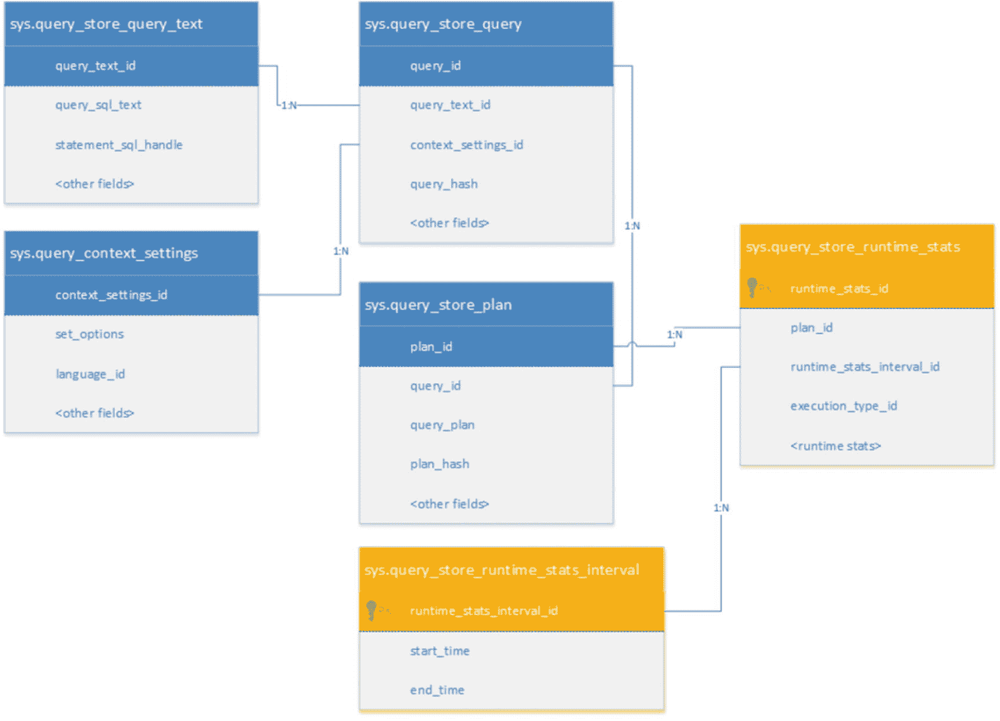

**图 6-10** 查询存储目录视图

仅当查询执行结束时（包括如前面所示查询被取消或中断的情况）才会捕获收集的数据。`sys.query_store_query` 目录视图的 `query_hash` 列是基于逻辑查询树的单个查询的 MD5 哈希值，它也包括优化器提示。此外，如前所述，如果相同的查询用于即席查询或存储过程中，或用于不同的存储过程中，则将被视为不同的查询。

具有不同上下文设置（即使用影响执行计划的不同 SET 选项）的查询被视为不同的查询。影响执行计划的 SET 选项会影响执行计划的选择，因为它们会影响优化过程中常量表达式计算的结果等。影响执行计划的 SET 选项如下：

- `ANSI_NULL_DFLT_OFF`
- `ANSI_NULL_DFLT_ON`
- `ANSI_NULLS`
- `ANSI_PADDING`
- `ANSI_WARNINGS`
- `ARITHABORT`
- `CONCAT_NULL_YIELDS_NULL`
- `DATEFIRST`
- `DATEFORMAT`
- `FORCEPLAN`
- `LANGUAGE`
- `NO_BROWSETABLE`
- `NUMERIC_ROUNDABORT`
- `QUOTED_IDENTIFIER`

您可以通过阅读 Microsoft 白皮书 “Plan Caching in SQL Server 2008” 在 [`msdn.microsoft.com/en-us/library/ee343986(v=sql.100).aspx`](https://msdn.microsoft.com/en-us/library/ee343986(v=sql.100).aspx) 找到有关影响执行计划的 SET 选项的更多信息。

最后，除了前面介绍的 `sp_query_store_force_plan` 和 `sp_query_store_unforce_plan` 之外，查询存储还提供了以下存储过程：

- `sp_query_store_remove_query`: 从查询存储中删除一个查询及其所有关联的计划和运行时统计信息。
- `sp_query_store_remove_plan`: 从查询存储中删除特定计划。
- `sp_query_store_reset_exec_stats`: 从查询存储中清除特定查询计划的运行时统计信息。
- `sp_query_store_flush_db`: 将查询存储在内存中的部分数据刷新到磁盘。

## 实时查询统计信息

实时查询统计信息是 SQL Server 2016 引入的另一个查询故障排除功能，您可以在查询仍在执行时使用它来查看实时查询计划。使用此功能（正如稍后解释的，它也可用于 SQL Server 2014），您可以实时查看查询计划信息，而无需等待查询完成。实时查询统计信息对于确定查询的哪一部分可能运行缓慢，以及对那些要么永不完成、要么运行数小时后失败、要么需要很长时间才能完成的查询进行故障排除非常有用。通常，长时间执行查询面临的一个挑战是缺乏运行时执行统计信息（如 `sys.dm_exec_query_stats` DMV 或 `SET STATISTICS IO` 和 `SET STATISTICS TIME` 语句提供的信息）或实际执行计划。通常，仅使用估计执行计划不足以解决查询问题。例如，由于它只提供估计信息，因此无法用于检测基数估计问题。

实时查询统计信息使用通过 `sys.dm_exec_query_profiles` DMV 可用的信息。由于此 DMV 是在 SQL Server 2014 中引入的，因此只要您使用 SQL Server 2016 Management Studio 或更高版本，实时查询统计信息也可以用于 SQL Server 2014，因为该功能是在此工具中实现的。请记住，此功能使用大量系统资源，因此应仅在故障排除场景中使用。在 SQL Server Management Studio 中有几种启用此功能的方法，包括在 SQL 编辑器工具栏上选择“包括实时查询统计信息”，或在“工具”菜单或“活动监视器”上使用类似选项。要测试实时查询统计信息如何工作，请使用前面三种方法中的任何一种启用该功能，然后针对 AdventureWorks2017 数据库运行以下查询。

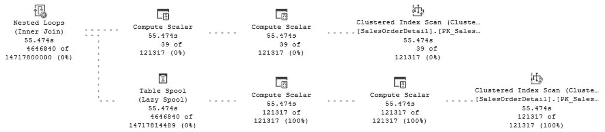

**图 6-11** 实时查询统计信息执行

```sql
SELECT * FROM Sales.SalesOrderDetail s1 CROSS JOIN Sales.SalesOrderDetail s2
```

这应该显示一个类似于图 6-11 中的计划，其中实时查询统计信息同时显示整体查询进度以及查询计划操作符的进度和已用时间，并且信息会在查询执行时实时更新。在撰写本文时，Hekaton 内存中编译存储过程不受实时查询统计信息功能支持。

目前，实时查询统计信息揭示的信息不如 DMV 多，因此您可能还想查询 DMV。为了更好地理解通过实时查询统计信息可用的信息，我们可以检查 DMV 提供的数据。DMV 返回丰富的性能信息列表，包括行数、倒带次数、重新绑定次数、已用时间、CPU 时间、表或索引扫描次数、逻辑读取次数、物理读取次数、预读次数、LOB 逻辑读取次数、LOB 物理读取次数和 LOB 预读次数等。（请参阅文档获取完整列表。）这些计数器是每个操作符、每个线程的。

为了使用 `sys.dm_exec_query_profiles` DMV，您首先需要启用运行时执行计划统计信息收集，可以使用 `SET STATISTICS PROFILE ON` 或 `SET STATISTICS XML ON` 语句，在您将要运行的、作为实时统计信息焦点的查询所在的同一会话中启用。作为一个例子，请按照以下练习操作。打开一个您计划运行查询以获取信息的会话，并获取其会话 ID。（您可以查看 SQL Server Management Studio 编辑器或运行类似 `SELECT @@SPID` 的语句。）运行以下语句：

```sql
SET STATISTICS PROFILE ON
```

现在运行

```sql
SELECT * FROM Sales.SalesOrderDetail s1 CROSS JOIN Sales.SalesOrderDetail s2
```


打开第二个会话并运行以下代码，将会话 ID 替换为你在上一步中获取的信息：

```
SELECT * FROM sys.dm_exec_query_profiles
WHERE session_id = 55
```

你将为每个当前正在执行的操作符获得一行数据，并且如果你执行几次，应该能看到一些计数器（如 `row_count`、`cpu_time_ms` 或 `logical_read_count`）随着查询的执行而更新其信息。要结束练习，不要忘记取消第一个查询，因为它会运行很长时间并消耗大量资源。

最后，SQL Server Management Studio 还包含一个计划比较工具，可用于比较执行计划以进行故障排除。此工具在查询调优场景中非常有用，例如测试查询的更改或查询所使用对象（如索引）的更改。有关此工具的更多信息，请参阅 [`http://blogs.msdn.com/b/sql_server_team/archive/2015/10/12/comparison-tool-released-with-latest-ssms.aspx`](http://blogs.msdn.com/b/sql_server_team/archive/2015/10/12/comparison-tool-released-with-latest-ssms.aspx)。

## 总结

查询存储和实时查询统计是 SQL Server 2016 引入的两个最重要的数据库引擎功能，旨在帮助你进行查询性能故障排除。查询存储通过收集优化和执行运行时统计信息，允许你排除查询性能故障，帮助你精确定位可能已出现性能回退的查询。其数据也可用于查找可作为额外查询调优候选的昂贵查询。最后，查询存储可用于强制查询使用特定计划，这在发现计划回退时非常有用。

虽然查询存储处理的是已完成查询的数据，但实时查询统计可用于在查询仍在运行时对其进行故障排除，这对于那些要么永远无法完成、要么运行数小时后失败、要么需要数小时才能完成的查询非常有用。

