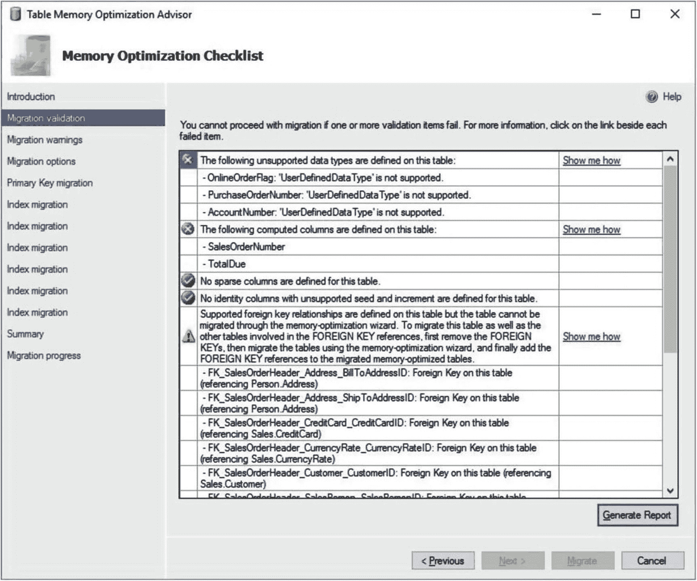
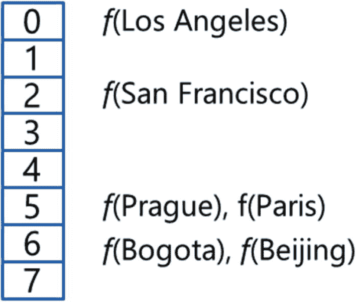
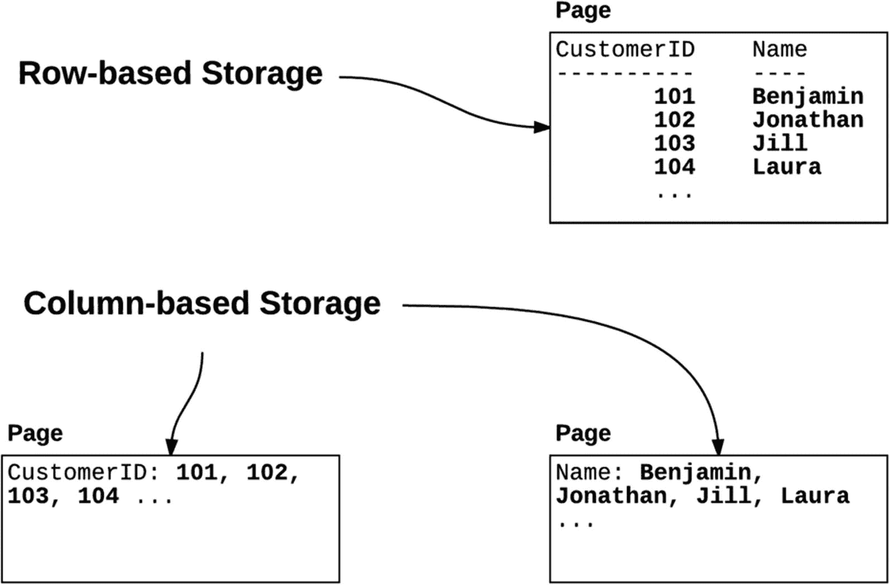
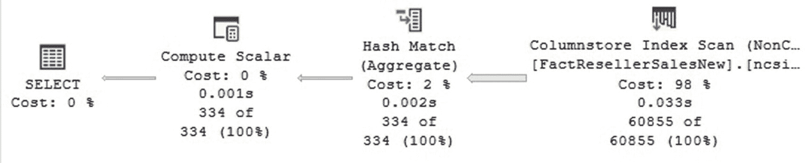
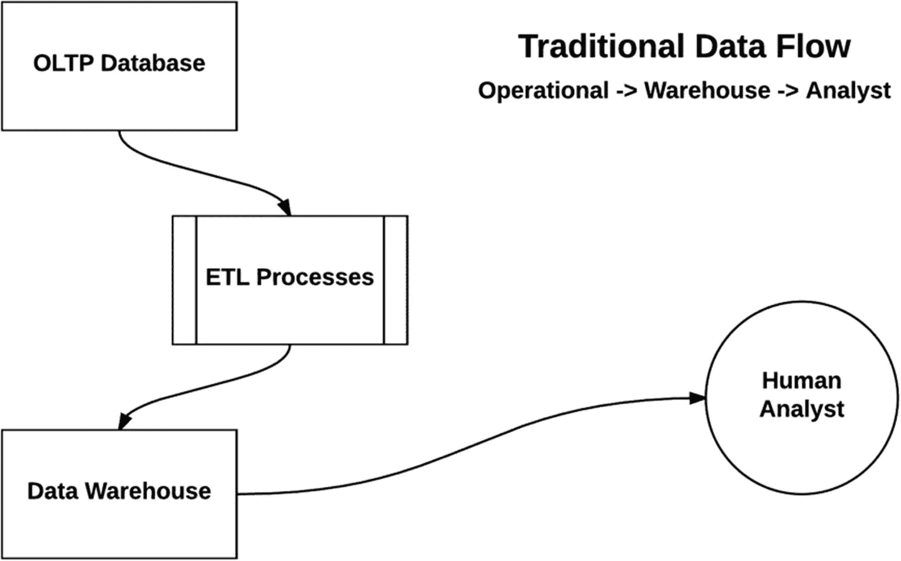
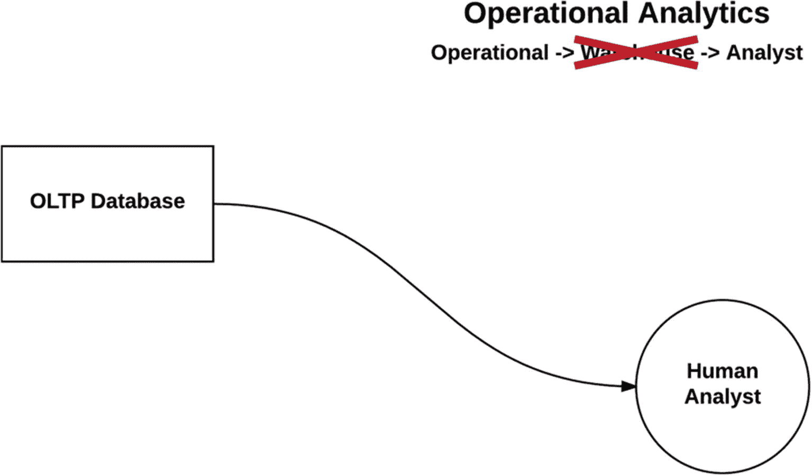
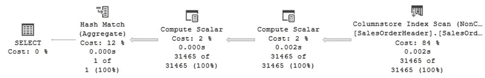
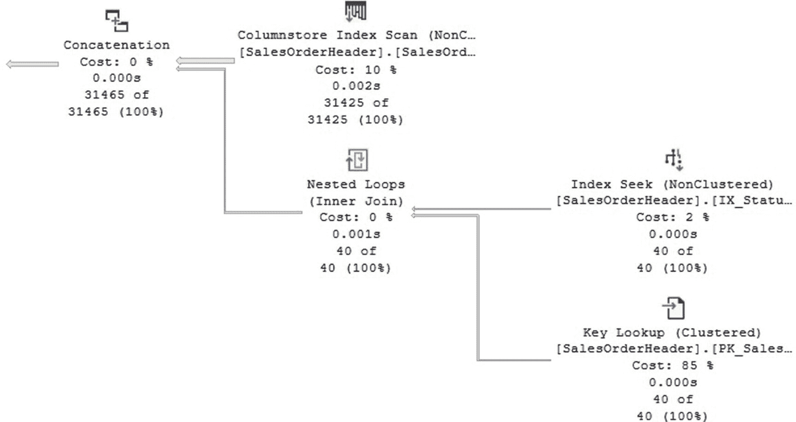

# 第四部分 性能调优与故障排除

## 7. SQL Server 内存中技术

本章涵盖内存中数据库以及一些其他新技术和范式，这些技术从根本上脱离了传统基于磁盘的行存储架构和查询处理算法，而大多数关系数据库几十年来一直使用这些传统技术。当前的关系数据库架构可追溯到 20 世纪 70 年代末，当时硬件与今天完全不同，数据库太大无法全部装入内存，并被假定保存在磁盘上。除了更快的处理器和不断下降的内存成本外，当前硬件的内存容量已大幅增加，以至于现在大多数事务数据库可以完全放入内存中。

微软首先在分析和数仓领域引入了内存中数据库技术。这项基于列的存储引擎技术最初作为 Excel 的 PowerPivot 插件的一部分提供，后来包含在 Analysis Services 产品中。它最终以列存储索引的形式进入了 SQL Server 关系引擎，并在 SQL Server 2012 中首次引入，经过几个版本的发展，如今已有了非常重要的增强。尽管这项技术是基于列的存储，但值得注意的是，它也是一项内存优化技术，事实上，它有时被称为内存中列存储。通过列存储索引，SQL Server 引入了另一种新范式——批处理执行模式，与 SQL Server 所有版本中一直使用的传统基于行的执行相比，这是一种查询处理改进。

内存中技术首次亮相于事务处理领域是在 2014 年推出 SQL Server 2014 时，其内存中 OLTP（在线事务处理）功能，因其项目名称而在 2012 年底宣布时被广泛称为 Hekaton。内存中 OLTP 还引入了一种新型存储过程，称为本机编译存储过程，它被编译为机器本机代码，并以进程内 DLL（动态链接库）的形式加载到内存中。与列存储索引的初期类似，Hekaton 在其初始版本中存在相当大的限制。幸运的是，随着产品新版本的发布，它已得到极大改进，允许更多应用程序迁移到它上面。

SQL Server 2012 为分析和数据仓库工作负载引入了列存储索引，SQL Server 2014 为事务数据库引入了内存中 OLTP，而 SQL Server 2016 版本则结合了这两项技术，通过允许你在操作表上创建列存储索引来提供实时分析。这些列存储索引现在是可更新的，并且可以如前所述在操作表上创建，这些表既可以是常规的基于磁盘的表，也可以是内存优化的 Hekaton 表。

尽管本章包含的代码可能比本书其余章节更多，但主要重点是展示新的内存中功能、它们的特性和性能优势。它并非编程指南，因此实现某个功能可能需要查阅 SQL Server 文档。

由于本章涵盖新技术和新范式，它也使用了与本书其他部分不同的术语。它使用术语“基于磁盘的表”来指代传统表，以区别于新的内存优化表。本机编译存储过程也与传统存储过程形成对比。此外，它使用术语“行存储”来指代传统的行存储，以区别于新的基于列的技术（或列存储）。


### 内存 OLTP

在论文《OLTP Through the Looking Glass, and What We Found There》中，Michael Stonebraker 等人使用一个开源数据库进行研究，展示了现代数据库系统中查询执行时间的分布情况。他们的结果表明，对于该特定的数据库系统，查询执行时间主要由缓冲区管理器、锁存、锁定和日志记录等组件主导，分别占执行时间的 34.6%、14.2%、16.3% 和 11.9%。这四个领域大约占执行时间的 77%。

**注意**  
《OLTP Through the Looking Glass, and What We Found There》这篇论文是推荐阅读材料。你可以在线找到它：[`http://nms.csail.mit.edu/~stavros/pubs/OLTP_sigmod08.pdf`](http://nms.csail.mit.edu/%7Estavros/pubs/OLTP_sigmod08.pdf)。

SQL Server 性能工程团队进行了一项类似的分析，展示了在 SQL Server OLTP 系统中时间占查询执行总时间的百分比分布。他们的分析结果同样有趣，表明通信栈占用了总查询执行时间的 10%。I/O 和线程管理又占了 10%，而存储引擎（包括访问方法、事务、锁和日志管理器）使用了 45%。最后，查询处理器占用了总执行时间的 35%。理解 OLTP 系统中的时间分布是他们研究的关键部分，这使他们能够专注于数据库系统中那些有更多优化机会的组件。

Hekaton 是一个为 OLTP 工作负载设计的内存优化引擎，它受益于当前硬件，并旨在最小化在之前列出的一些组件上花费的查询执行时间。内存 OLTP 通过以下特性实现更好的性能：

*   **内存优化引擎**：数据始终位于内存中，并且 Hekaton 引擎的数据结构和算法针对内存访问进行了优化。新结构包括内存优化的非聚集索引和哈希索引。
*   **多版本并发控制和乐观并发**：消除了锁和锁存器，因此不再有对锁存器和自旋锁的争用、用户等待锁或阻塞。与 SQL Server 2005 中引入的快照隔离级别类似，Hekaton 引擎使用版本控制，尽管其版本存储在内存中而非 `tempdb` 数据库中。
*   **本机代码**：查询优化器仍用于生成执行计划，但此计划还会被翻译成 C 代码，编译成 DLL，并加载到内存中。本机代码比传统的解释式查询计划执行得更快。

Hekaton 随 SQL Server 2014 发布，并且与列存储索引类似，它最初存在相当多的限制。主要限制是表创建后无法以任何方式更改。无法添加或删除列或索引，也无法更改其任何属性。从 SQL Server 2016 开始，可以对内存优化表使用 `ALTER TABLE` 来更改大多数表属性。但与传统的基于磁盘的表类似，你仍然希望从一开始就以最佳方式设计内存优化表，因为在生产后进行更改可能需要维护窗口，并可能导致数据库停机。

内存优化的数据结构目前包括表和表变量，而本机编译的模块包括存储过程、触发器以及标量和表值用户定义函数。这些内存优化的数据结构是使用新的 `MEMORY_OPTIMIZED` 和 `NATIVE_COMPILATION` 子句定义的。与传统的数据库引擎存储结构不同，内存优化的数据不存储在数据页中。行始终在内存中，表至少需要一个索引。在 Hekaton 中，表必须完全适合内存，并且其所有数据始终在内存中。但是，你不必将整个数据库移到内存中，可以选择要迁移数据库中的哪些表。你还可以选择哪些存储过程要迁移到本机编译形式。

尽管列存储索引和 Hekaton 都是内存技术，但 Hekaton 的三个性能优势都不直接适用于列存储索引，因为它们用于不同的工作负载并且具有不同的架构。列存储索引中仍然持有锁和锁存器，它们也不实现本机编译代码。列存储索引的性能优势更多地与其基于列的存储、高压缩率和批处理执行算法有关。列存储索引将在下一节中介绍。

**注意**  
尽管列存储索引和 Hekaton 都是内存技术，但只有后者要求表完全适合内存。列存储索引通常用于非常大的表，不要求完全适合内存。

有趣的是，在 SQL Server 2012 发布后几天，微软技术院士 David Campbell 在他的论文《The Coming In-Memory Database Tipping Point》中暗示了将为事务工作负载推出新的内存引擎，这也是一篇推荐阅读材料。你可以在以下网址找到它：[`https://blogs.technet.microsoft.com/dataplatforminsider/2012/04/09/the-coming-in-memory-database-tipping-point`](https://blogs.technet.microsoft.com/dataplatforminsider/2012/04/09/the-coming-in-memory-database-tipping-point)。同年晚些时候在西雅图的一次会议上，Hekaton 被正式宣布。

#### 初始版本后的增强功能

从 SQL Server 2016 开始，内存 OLTP 现在能够使用 `ALTER TABLE` 和 `ALTER PROCEDURE` 语句来更改表和本机过程。

Hekaton 的原始版本在内存方面还有一个严重限制，即数据库中所有表的总内存大小不应超过 256 GB。随着 SQL Server 2016 的发布，此限制最初扩展到 2 TB，并且不是一个严格的硬性限制，而是一个支持限制。在 SQL Server 2016 RTM 发布几周后，微软宣布正在取消此类限制，并支持操作系统可用的任意内存量。

现在表扫描操作可以并行执行。虽然对于纯 OLTP 工作负载来说这不是一个大要求，但它现在可以使操作分析查询受益，如本章后面所述。

查询优化器使用的统计信息现在会自动更新，就像基于磁盘的表一样。你现在也可以在手动更新统计信息时指定采样方法，因为在 SQL Server 2014 中，`FULLSCAN` 是唯一可用的选择。然而，更新后的统计信息不会像传统存储过程那样立即使本机编译模块受益。也就是说，无论是手动还是自动更新统计信息，都不会触发本机编译模块的新优化。你将必须手动重新编译它们，例如，使用 `sp_recompile` 系统存储过程。

最后，从 SQL Server 2017 开始，Hekaton 移除了每个表或表类型最多八个索引的原始限制。虽然你现在可以定义任意数量的索引，但适用于基于磁盘的表的相同建议仍然适用，你应该只定义真正需要的索引。

#### 内存优化表

让我们开始探索这项技术。首先，我们需要创建一个启用了 Hekaton 的数据库。为此，我们需要使用 `CONTAINS MEMORY_OPTIMIZED_DATA` 子句创建一个文件组，如下列代码所示。你可以选择将此类文件组添加到现有数据库中，但每个数据库只允许一个这样的文件组。请确保你的系统拥有必要的驱动器和文件夹，或者根据实际情况进行调整。

创建数据库：

```sql
CREATE DATABASE Test
ON PRIMARY (NAME = Test_data,
FILENAME = 'C:\DATA\Test_data.mdf', SIZE=500MB),
FILEGROUP Test_fg CONTAINS MEMORY_OPTIMIZED_DATA
(NAME = Test_fg, FILENAME = 'C:\DATA\Test_fg')
LOG ON (NAME = Test_log, Filename='C:\DATA\Test_log.ldf', SIZE=500MB)
```

在下一个例子中，我将尝试创建一个与 `AdventureWorks` 中完全相同的表，作为一个快速练习，以理解将基于磁盘的表迁移到内存 OLTP 时需要进行的一些更改。为此，我将使用 SQL Server Management Studio 中的脚本功能（例如，右键单击表并选择“将表脚本化为”->“CREATE 到”->“新建查询编辑窗口”）。

> **注意**
>
> 本章中所有的 Hekaton 示例都将使用我们刚刚创建的 `Test` 数据库。

这是一个可以成功创建为基于磁盘表的最小版本（仅移除了三个需要用户定义数据类型的列，这在 Hekaton 中不支持）。我添加了 `WITH (MEMORY_OPTIMIZED=ON)` 子句，以便你可以在自己的系统上进行测试。

```sql
CREATE TABLE dbo.SalesOrderHeader(
SalesOrderID int IDENTITY(1,1) NOT FOR REPLICATION NOT NULL,
RevisionNumber tinyint NOT NULL,
OrderDate datetime NOT NULL,
DueDate datetime NOT NULL,
ShipDate datetime NULL,
Status tinyint NOT NULL,
SalesOrderNumber  AS (isnull(N'SO'+CONVERT(nvarchar(23),SalesOrderID),N'*** ERROR ***')),
CustomerID int NOT NULL,
SalesPersonID int NULL,
TerritoryID int NULL,
BillToAddressID int NOT NULL,
ShipToAddressID int NOT NULL,
ShipMethodID int NOT NULL,
CreditCardID int NULL,
CreditCardApprovalCode varchar(15) NULL,
CurrencyRateID int NULL,
SubTotal money NOT NULL,
TaxAmt money NOT NULL,
Freight money NOT NULL,
TotalDue  AS (isnull((SubTotal+TaxAmt)+Freight,(0))),
Comment nvarchar(128) NULL,
rowguid uniqueidentifier ROWGUIDCOL  NOT NULL,
ModifiedDate datetime NOT NULL,
CONSTRAINT PK_SalesOrderHeader_SalesOrderID PRIMARY KEY CLUSTERED (
SalesOrderID ASC
)
) WITH (MEMORY_OPTIMIZED = ON)
```

尝试运行 `CREATE TABLE` 语句会返回以下部分错误消息或建议：

1.  聚集索引（主键的默认索引）在内存优化表中不受支持。请指定一个 `NONCLUSTERED` 索引。
2.  计算列在内存优化表中不受支持（从 SQL Server 2017 开始支持计算列）。
3.  `ROWGUIDCOL` 功能在内存优化表中不受支持。

最后，接下来是一个可以正常工作的版本，使用了 dbo 架构：

```sql
CREATE TABLE dbo.SalesOrderHeader(
SalesOrderID int PRIMARY KEY NONCLUSTERED NOT NULL,
RevisionNumber tinyint NOT NULL,
OrderDate datetime NOT NULL,
DueDate datetime NOT NULL,
ShipDate datetime NULL,
Status tinyint NOT NULL,
CustomerID int NOT NULL,
SalesPersonID int NULL,
TerritoryID int NULL,
BillToAddressID int NOT NULL,
ShipToAddressID int NOT NULL,
ShipMethodID int NOT NULL,
CreditCardID int NULL,
CreditCardApprovalCode varchar(15) NULL,
CurrencyRateID int NULL,
SubTotal money NOT NULL,
TaxAmt money NOT NULL,
Freight money NOT NULL,
Comment nvarchar(128) NULL,
ModifiedDate datetime NOT NULL
) WITH (MEMORY_OPTIMIZED = ON)
```

幸运的是，SQL Server 提供了一种更好的方法来帮助你在将表迁移到内存 OLTP 时查找和评估不兼容性。一个名为“表内存优化顾问”（在新版本中简称为“内存优化顾问”）的工具可以帮助你将基于磁盘的表迁移到内存优化表。要运行此工具，请在 `AdventureWorks2017` 数据库中右键单击 `Sales.SalesOrderHeader` 表，然后选择“内存优化顾问”。运行迁移验证部分将显示如图 7-1 所示的屏幕，该屏幕指示无法继续进行迁移，并提供了附加信息和建议。



图 7-1

表内存优化顾问

SQL Server 为存储过程和其他代码提供了一个类似的工具，称为“存储过程本机编译顾问”（或简称“本机编译顾问”），你可以通过右键单击要检查的代码对象来找到它。SQL Server 2016 及更高版本还包含了“事务性能分析概述”报告，该报告可以帮助你决定首先将哪些表和代码迁移到 Hekaton。要运行此报告，请右键单击你的数据库，选择“报告”，然后选择“标准报告”。SQL Server 2014 提供了类似的报告，但你必须使用“数据收集器”工具来启用和配置它们。

#### 索引

在我们之前创建表的例子中可能不太明显，但每个表都至少需要一个索引。（在 SQL Server 2014 和 2016 版本中，最多可以定义八个。如果尝试创建超过此最大数量的索引，将返回错误 1910。）Hekaton 引入了两种新的索引类型：内存优化非聚集索引和哈希索引，但它们的用途截然不同。索引会自动更新，且仅存在于内存中；它们永远不会持久化到磁盘上，并且实际上每次 SQL Server 启动时都会重建。

**注意**
内存优化非聚集索引最初（并且有时仍然）被称为范围索引，但后来被重命名为非聚集索引。这种命名约定有时会令人困惑，因为现在我们有用于传统表的非聚集索引、用于列存储索引的非聚集索引以及用于内存优化表的非聚集索引。

哈希索引的设计旨在通过比任何其他 SQL Server 索引更快地找到单行来提供最佳性能。哈希索引使用了一些对 SQL Server 用户来说是新的概念，并且要求我们通过指定桶大小来配置其初始大小。桶基本上是行的虚拟容器，内置的哈希函数用于将值映射到这些桶中。例如，图 7-2 显示了在 `City` 列上创建的具有八个桶的哈希索引。使用此哈希索引查找行 `San Francisco` 将使用返回桶 2 的哈希函数，然后 Hekaton 引擎将在该处找到该行。


*图 7-2：显示哈希冲突的哈希索引*

然而，使用哈希索引时也可能发生冲突。如果您尝试查找行 `Prague`，哈希函数将正确返回桶 5。但是，由于存在不止一行，引擎将不得不搜索链表以找到请求的行。虽然行数较少不是问题，但当每个桶中的行数很多时，可能会出现性能问题。哈希函数总是能高效地找到正确的桶，但遍历长链表可能是一个性能问题。我们可以通过查看动态管理视图 `sys.dm_db_xtp_hash_index_stats` 的 `avg_chain_length` 列来监控此类信息，该列记录了索引中所有哈希桶的平均行数。

不幸的是，桶计数不能动态更改，在 SQL Server 2014 中，这需要使用新的 `BUCKET_COUNT` 配置创建一个新表。SQL Server 2016 及更高版本现在允许使用 `ALTER TABLE` 语句来更改桶大小，但这仍然是对表结构的重大更改，并且是一个阻塞操作，您可能只希望在维护窗口期间执行，因为它很可能需要应用程序中断。由于此限制，估算和规划最佳的桶数量值极为重要。因为当每个桶中的行数较少时可以获得最佳性能，所以主要建议是将 `BUCKET_COUNT` 值配置为与索引中的唯一行数相同或是其两倍。

让我用一个小型化的 `SalesOrderHeader` 为例向您展示一些例子。创建哈希索引需要 `NONCLUSTERED HASH` 关键字以及 `BUCKET_COUNT` 定义：

```sql
CREATE TABLE dbo.SalesOrderHeader(
    SalesOrderID int PRIMARY KEY NONCLUSTERED HASH WITH
        (BUCKET_COUNT = 10000),
    OrderDate datetime NOT NULL,
    ShipDate datetime NULL,
    Status tinyint NOT NULL,
    CustomerID int NOT NULL,
) WITH (MEMORY_OPTIMIZED = ON)
```

表填充数据后，您可以使用 `sys.dm_db_xtp_hash_index_stats` 分析桶的使用情况：

```sql
SELECT OBJECT_NAME(object_id), * FROM sys.dm_db_xtp_hash_index_stats
```

`total_bucket_count` 列将显示索引中哈希桶的总数，该数字被向上取整到下一个 2 的幂。在请求 10,000 个桶的示例中，索引将创建为 16,384 个桶。

非聚集索引是内存优化的 B 树索引，更类似于我们习惯的磁盘表上的非聚集索引。它们只需要 `NONCLUSTERED` 关键字。

```sql
CREATE TABLE dbo.SalesOrderHeader(
    SalesOrderID int PRIMARY KEY NONCLUSTERED,
    OrderDate datetime NOT NULL,
    ShipDate datetime NULL,
    Status tinyint NOT NULL,
    CustomerID int NOT NULL,
) WITH (MEMORY_OPTIMIZED = ON)
```

**注意**
虽然是一篇计算机科学水平较高的论文，但您可以在 Justin Levandoski 等人撰写的论文 “The Bw-Tree: A B-Tree for New Hardware Platforms” 中了解更多关于新范围索引的信息，您可以在线找到： [`www.microsoft.com/en-us/research/publication/the-bw-tree-a-b-tree-for-new-hardware`](http://www.microsoft.com/en-us/research/publication/the-bw-tree-a-b-tree-for-new-hardware)。

总而言之，哈希索引为使用等值谓词搜索行提供了最佳性能（再次假设 `BUCKET_COUNT` 已正确配置和维护）。哈希索引不能用于使用非等值谓词或利用哈希索引的顺序来查找行。如果没有找到更好的索引，之前的操作将需要进行哈希索引扫描。内存优化非聚集索引的行为与基于磁盘的非聚集索引非常相似。您可以执行所有典型操作，包括使用等值和非等值谓词搜索行、利用索引顺序、范围谓词，尽管如前所述，哈希索引在等值搜索方面更优。


#### 原生编译模块

如前所述，在 SQL Server 2016 及更高版本中，有三种类型的原生编译模块，包括存储过程、标量和表值用户定义函数以及触发器。最初在 SQL Server 2014 中引入 Hekaton（内存优化技术）时，仅支持存储过程。我们在此回顾所有这些模块。以下代码是一个原生编译存储过程的基本定义：

```
CREATE PROCEDURE test
WITH NATIVE_COMPILATION, SCHEMABINDING,
EXECUTE AS OWNER
AS
BEGIN ATOMIC WITH (
TRANSACTION ISOLATION LEVEL = SNAPSHOT,
LANGUAGE = 'us_english')
SELECT SalesOrderID, OrderDate, CustomerID
FROM dbo.SalesOrderHeader
END
```

其执行示例如下：

```
EXEC test
```

用户定义函数有时会被提及可能引发性能问题。原生编译的用户定义函数性能更佳，但仍应仅在适当的情况下使用。接下来是最基本的标量用户定义函数，用以展示所需的语法：

```
CREATE FUNCTION test_function()
RETURNS int
WITH NATIVE_COMPILATION, SCHEMABINDING
AS BEGIN ATOMIC WITH (TRANSACTION ISOLATION LEVEL = SNAPSHOT, LANGUAGE = 'English')
RETURN 1
END
```

您可以使用以下语句调用它：

```
SELECT dbo.test_function()
```

以下是一个表值用户定义函数的示例：

```
CREATE FUNCTION dbo.test_tvf()
RETURNS TABLE
WITH NATIVE_COMPILATION, SCHEMABINDING
AS
RETURN SELECT SalesOrderID, OrderDate, Status FROM dbo.SalesOrderHeader
```

您可以使用以下语句调用它：

```
SELECT * FROM dbo.test_tvf()
```

类似地，以下是您用于创建触发器的代码。原生编译触发器仅可用于内存优化表，并且这些是内存优化表上唯一允许的触发器类型。

```
CREATE TRIGGER Insert_SalesOrderHeader
ON dbo.SalesOrderHeader
WITH NATIVE_COMPILATION, SCHEMABINDING
FOR INSERT, UPDATE, DELETE
AS BEGIN ATOMIC WITH (TRANSACTION ISOLATION LEVEL = SNAPSHOT, LANGUAGE = 'us_english')
-- trigger code
END
```

为了避免对原生编译模块进行不必要的运行时检查（这些检查必须在执行时进行），某些选项必须在编译时定义。任何原生编译模块所需的选项如下：

*   `SCHEMABINDING`: 将原生编译模块绑定到底层表或表的架构。
*   `EXECUTE AS`: 指定执行原生编译模块的安全上下文。
*   `ATOMIC`: 指示整个块作为原子块执行，整个块要么全部提交，要么全部回滚。属于 ANSI SQL 标准的一部分。
*   `TRANSACTION ISOLATION LEVEL`: 定义事务隔离级别，但只有以下三种选择可用：`SNAPSHOT`、`REPEATABLE READ` 和 `SERIALIZABLE`。与传统的 SQL Server 代码不同，原生编译模块没有默认的事务隔离级别，因此必须指定此选项。
*   `LANGUAGE`: 指定代码的语言环境。

另外两个选项虽然不是必需的，但它们是 `DATEFIRST` 和 `DATEFORMAT`，分别用于指定一周的第一天和日期格式。如果未指定，则从 `LANGUAGE` 选项中推断。

#### 修改表和原生编译模块

现在可以使用 `ALTER TABLE` 来更改表的大多数属性，包括添加和删除列、添加和删除索引，或更改哈希索引的 `BUCKET_COUNT` 值。对于内存优化表，不允许使用 `CREATE INDEX` 和 `DROP INDEX`；必须改用 `ALTER TABLE`。让我们看几个示例，假设初始表如下：

1.  添加列。以下代码添加了三列（顺便提一下，这三列最初从基于磁盘的表中删除，因为它们基于用户定义数据类型）：

```
CREATE TABLE dbo.SalesOrderHeader(
SalesOrderID int PRIMARY KEY NONCLUSTERED NOT NULL,
RevisionNumber tinyint NOT NULL,
OrderDate datetime NOT NULL,
DueDate datetime NOT NULL,
ShipDate datetime NULL,
Status tinyint NOT NULL,
CustomerID int NOT NULL,
SalesPersonID int NULL,
TerritoryID int NULL,
BillToAddressID int NOT NULL,
ShipToAddressID int NOT NULL,
ShipMethodID int NOT NULL,
CreditCardID int NULL,
CreditCardApprovalCode varchar(15) NULL,
CurrencyRateID int NULL,
SubTotal money NOT NULL,
TaxAmt money NOT NULL,
Freight money NOT NULL,
Comment nvarchar(128) NULL,
ModifiedDate datetime NOT NULL
) WITH (MEMORY_OPTIMIZED = ON)
```

2.  添加索引。以下代码添加了一个非聚集索引和一个哈希索引：

```
ALTER TABLE dbo.SalesOrderHeader
ADD OnlineOrderFlag bit NOT NULL,
PurchaseOrderNumber nvarchar(25) NULL,
AccountNumber nvarchar(25) NULL
```

3.  更改索引的桶数。以下代码重建一个索引并将桶数更改为 100,000：

```
ALTER TABLE dbo.SalesOrderHeader
ADD INDEX IX_ModifiedDate (ModifiedDate),
INDEX IX_CustomerID HASH (CustomerID) WITH (BUCKET_COUNT = 10000)
```

4.  删除列或索引。以下代码删除了先前添加的三列：

```
ALTER TABLE dbo.SalesOrderHeader
ALTER INDEX IX_CustomerID
REBUILD WITH (BUCKET_COUNT = 100000)
```

```
ALTER TABLE dbo.SalesOrderHeader
DROP COLUMN OnlineOrderFlag, PurchaseOrderNumber, AccountNumber
```

对表进行更改可能会干扰原生编译模块的 `SCHEMABINDING` 属性。假设您有以下使用 `SalesOrderHeader` 表中若干列的原生编译存储过程：

```
CREATE PROCEDURE dbo.test
WITH NATIVE_COMPILATION, SCHEMABINDING, EXECUTE AS owner
AS
BEGIN ATOMIC
WITH (TRANSACTION ISOLATION LEVEL = SNAPSHOT, LANGUAGE = 'us_english')
SELECT SubTotal, ModifiedDate FROM dbo.SalesOrderHeader
END
```

尝试从表中删除该过程引用的某一列

```
ALTER TABLE  dbo.SalesOrderHeader
DROP COLUMN SubTotal
```

将返回以下错误：

```
Msg 5074, Level 16, State 1, Line 1
The object 'test' is dependent on column 'SubTotal'.
Msg 4922, Level 16, State 9, Line 1
ALTER TABLE DROP COLUMN SubTotal failed because one or more objects access this column.
```

但是，您可以删除任何未被此过程或其他架构绑定对象引用的列：

```
ALTER TABLE dbo.SalesOrderHeader
DROP COLUMN TaxAmt
```

幸运的是，在这种情况下不允许使用星号 (*) 来选择表中的所有列。尝试这样做会得到错误 1054，提示在架构绑定对象中不允许使用此类语法。

SQL Server 2016 的新功能是，您还可以更改原生编译存储过程。其他原生编译对象（如触发器以及标量和表值用户定义函数）也可以被更改。例如，以下代码更改了先前创建的存储过程，从 `SELECT` 列表中移除一列并更改了隔离级别：

```
ALTER PROCEDURE dbo.test
WITH NATIVE_COMPILATION, SCHEMABINDING, EXECUTE AS owner
AS
BEGIN ATOMIC
WITH (TRANSACTION ISOLATION LEVEL = REPEATABLE READ, LANGUAGE = 'us_english')
SELECT SubTotal FROM dbo.SalesOrderHeader
END
```


#### 本地编译

本地编译适用于创建内存优化表和本机编译模块。在这两种情况下，系统会生成 C 代码，进行编译和链接，最终创建一个 DLL，并将其加载到与 SQL Server 可执行文件进程内的内存中以提升性能。你可以通过查询 `sys.dm_os_loaded_modules` DMV 来查看当前系统中已加载的 DLL 列表，如下所示，在我的测试系统中，它列出了几个指向 `C:\Program Files\Microsoft SQL Server\MSSQL15.MSSQLSERVER\MSSQL\DATA\xtp\` 文件夹的文件。

```sql
SELECT * FROM sys.dm_os_loaded_modules
WHERE description = 'XTP Native DLL'
```

数据库社区有时会关注创建文件的安全访问权限问题。总之，我要告诉你不必为此担心。当 DLL 文件创建时，它会被自动加载到内存中，无需备份这些创建的文件或对它们进行任何维护。这些文件不再被需要。每次 SQL Server 启动时，它都会为内存优化表创建新的 DLL。本机编译模块仅在首次执行时进行编译。从技术上讲，创建的 DLL 文件具有与数据文件相同的安全访问权限。进入前面列出的 `xtp` 文件夹后，你会发现以配置数据库的数据库 ID 命名的附加文件夹，其中包含具有以下扩展名的文件（每个内存优化表和本机编译模块都会创建一组这样的文件）：

| 扩展名 | 描述 |
| --- | --- |
| `.c` | C 语言源代码 |
| `.dll` | 动态链接库文件 |
| `.obj` | C 编译器生成的目标文件 |
| `.out` | C 编译器生成的日志文件（包含编译器使用的参数） |
| `.pdb` | C 编译器生成的符号文件 |
| `.xml` | MAT（混合抽象树）文件 |

注意

内存 OLTP 功能最初被称为极端事务处理，XTP 这个缩写在 SQL Server 的许多地方仍然保留。

在我的系统中，C 编译器和 Microsoft 链接器分别位于 `C:\Program Files\Microsoft SQL Server\MSSQL15.MSSQLSERVER\MSSQL\Binn\Xtp\VC\bin` 目录下的 `cl.exe` 和 `link.exe`。下面是一个用于说明目的的小型 C 代码片段。（生成的代码并非供人类阅读。）

```c
#include "hkenggen.h"
#include "hkrtgen.h"
#include "hkgenlib.h"
#define ENABLE_INTSAFE_SIGNED_FUNCTIONS
#include "intsafe.h"
#define HOTPATCH_BUFFER_SIZE 256
typedef struct _PATCH_BUFFER {
unsigned short PointerIndex;
unsigned short Fill1;
unsigned short BufferSize;
unsigned short Fill2;
unsigned __int64 Buffer[(HOTPATCH_BUFFER_SIZE - 8) / sizeof(__int64)];
} PATCH_BUFFER;
PATCH_BUFFER HotPatchBuffer = {0, 0, HOTPATCH_BUFFER_SIZE, 0};
int memcmp(const void*, const void*, size_t);
void *memset(void*, int, size_t);
#pragma deprecated (memcpy)
#define offsetof(s,f)   ((size_t)&(((s*)0)->f))
struct NullBitsStruct_322100188
{
unsigned char hkc_isnull_3:1;
};
```

注意

有关 Hekaton 编译器架构的更多详情，你可以阅读 Cristian Diaconu 等人撰写的论文“Hekaton: SQL Server’s Memory-Optimized OLTP Engine”，你可以在网上找到它：[`www.microsoft.com/en-us/research/publication/hekaton-sql-servers-memory-optimized-oltp-engine`](http://www.microsoft.com/en-us/research/publication/hekaton-sql-servers-memory-optimized-oltp-engine)。

#### 内存优化表变量

从 SQL Server 2016 开始，你现在可以使用内存优化表变量来替代传统的表变量或临时表。内存优化表变量比它们在 `tempdb` 中的对应物性能高出数倍，其优点之一是它们始终位于内存中，并且不使用 `tempdb`。因此，它们不受限于 `tempdb` 的 I/O 访问或争用分配等限制。

注意

SQL Server 2019 的新功能是，你现在可以配置 tempdb 使用基于内存 OLTP 技术的内存优化元数据。通过启用此 tempdb 配置，元数据现在可以移入无锁、非持久的内存优化表中，从而在技术上消除了元数据争用。你可以在第[4]章（我们讨论 tempdb 故障排除和配置的地方）找到更多细节。

让我们看一个例子。以下代码创建了一个常规临时表及其等效的内存优化表变量。请注意，创建内存优化表变量需要两个步骤。首先，我们必须使用 `MEMORY_OPTIMIZED = ON` 子句创建一个类型，该类型像任何其他内存优化表一样需要一个索引。然后我们必须使用该类型声明一个内存优化表变量。

```sql
CREATE TABLE #temp (
CustomerID int,
Name varchar(40)
)
GO
CREATE TYPE test
AS TABLE (
CustomerID int INDEX IX_CustomerID,
Name varchar(40)
)
WITH (MEMORY_OPTIMIZED = ON)
GO
DECLARE @mytest test
SELECT * FROM @mytest
SELECT * FROM #temp
```

你可能使用具有 `SCHEMA_ONLY` 持久性的内存优化表获得类似行为，但主要区别在于，表架构在 SQL Server 重启或数据库因其他方法离线后，仍然是数据库的一部分。具有 `SCHEMA_ONLY` 持久性的表在其他一些业务场景中也很有用，例如 Web 应用程序的会话状态以及用于 ETL（提取、转换和加载）目的的临时暂存表。

#### 当前限制

尽管 SQL Server 2019 是 Hekaton 的第四个版本，但在决定开始使用此功能进行项目开发之前，你仍然需要了解一些限制。你可以在“Transact-SQL Constructs Not Supported by In-Memory OLTP”（[`https://msdn.microsoft.com/en-us/library/dn246937.aspx`](https://msdn.microsoft.com/en-us/library/dn246937.aspx)）和“Unsupported SQL Server Features for In-Memory OLTP”（[`https://msdn.microsoft.com/en-us/library/dn133181.aspx`](https://msdn.microsoft.com/en-us/library/dn133181.aspx)）中找到此类信息。

两份文档都提供了指向先前 SQL Server 版本的链接，但强烈建议你在较新版本上实现新的 Hekaton 项目。


### 列存储索引

尽管基于列的存储技术研究可以追溯到 20 世纪 70 年代，但其在数据库引擎上的首次实现直到 90 年代才出现，晚了 20 年。列存储为数据仓库数据库提供了性能优势，因为星型连接查询通常只需要事实表中的少数几列。虽然在 SQL Server 中它也是一种内存中技术，但与`Hekaton`不同，`列存储索引`通常用于非常大的表，并不要求完全装入内存。图 7-3 比较了基于行的存储和基于列的存储，从中我们可以看到，数据库页不是承载一行中的所有列，而是只包含来自一个特定列的数据。


**图 7-3** 行存储与列存储对比

**注意**
关于此主题的一篇开创性论文和重要参考资料是 Mike Stonebraker 等人的《C-store：一个面向列的 DBMS》，你可以在 [`https://web.stanford.edu/class/cs245/readings/c-store.pdf`](https://web.stanford.edu/class/cs245/readings/c-store.pdf) 在线找到。

`列存储索引`技术首次引入于 SQL Server 2012 版本，最初是作为一种只读的非聚集`列存储索引`，可以创建在`堆`或`聚集索引`上。由于这是一种只读结构，它只对数据仓库有意义，而不适用于操作系统（但正如我们很快将看到的，在 SQL Server 的后续版本中，`列存储索引`也可以创建在操作系统上）。

当时通常有三种方法来更新只读的`列存储索引`数据，包括使用分区和分区切换、简单地重新创建索引，或使用`UNION ALL`将只读`列存储索引`和常规可更新表的数据组合起来。在后续版本中，这些变通方法不再需要。在查询处理方面，`列存储索引`技术还引入了`批处理模式`，这是一种基于向量或向量化的执行方法，旨在通过一次处理多行而不是使用传统的一次处理一行的操作符来提高查询性能。

该功能的下一代版本包含了创建可更新的`聚集列存储索引`的选项。在这种情况下，`列存储索引`成为表或主要存储。换句话说，`列存储存储`现在可以取代整个`行存储`结构。这在 SQL Server 2014 中引入，并且如果表中没有其他`列存储索引`，只读非聚集`列存储索引`的选项仍然可用。请记住，作为非聚集索引，它必须从基表复制所需的列，因此需要额外的存储空间。但它也可以受益于高压缩率，使得这额外所需的存储空间平均只有 10%。在`聚集列存储索引`上不支持其他索引，即使是`行存储`索引也不行，并且内存优化表不支持`列存储索引`。

从 SQL Server 2016 开始，现在可以创建可更新的非聚集`列存储索引`，它可以创建在`堆`或`聚集索引`上（以前只可能创建只读版本）。这种可更新的非聚集`列存储索引`可以创建在 OLTP 表上，这有助于实时分析查询（本章稍后将介绍），并且也可以支持筛选条件。可更新的`列存储索引`也可以创建在 OLTP 内存优化表上，尽管必须包含所有列，并且不允许筛选条件。在某些性能场景下，可以使用`压缩延迟`来提供帮助。

值得一提的是，在 SQL Server 2014 中的默认行为——拥有一个只读非聚集`列存储索引`——在产品的后续版本中不再可能，尽管如果需要，你可以使用只读文件组来模拟其行为。最后，现在可以在`聚集列存储索引`上创建基于`行存储`的非聚集索引。

总之，`列存储索引`最初有一些限制，使得 SQL Server 2016 成为改进此技术功能的第三个版本。如果出于任何原因，你仍在使用之前的版本，可以使用以下文档来确定特定版本可用哪些功能：[`https://msdn.microsoft.com/en-us/library/dn934994.aspx`](https://msdn.microsoft.com/en-us/library/dn934994.aspx)。

`列存储索引`包括多项性能优势，例如：

*   **列存储**：由于数据仓库星型连接查询通常只从事实表中选择少数几列，因此只读取所需列的页面可以带来巨大的 I/O 节省。完全不需要读取查询不需要的列所在的页面。
*   **压缩**：由于同一列的数据存储在相同的页面中，相似数据是连续存放的，这意味着高压缩率，再次节省了 I/O 资源。
*   **批处理模式**：`列存储索引`技术使用基于向量或向量化的执行模型，其引擎一次处理多行（通常最多 900 行）。这种处理在查询操作级别完成，并且每个版本包含的操作越来越多。这与传统的查询执行模型形成对比，后者一次只处理一行，并且用于所有版本的 SQL Server。有关每个 SQL Server 版本支持`批处理模式`的操作列表，请参阅 [`https://msdn.microsoft.com/en-us/library/dn935005.aspx`](https://msdn.microsoft.com/en-us/library/dn935005.aspx)。
*   **段消除**：如前所述，同一列的数据存储在相同的页面中，多个页面被分组为一个段。类似于分区消除的概念，可以根据查询中用作筛选器的值来消除某些段。
*   **聚合下推**：从 SQL Server 2016 开始，聚合操作被下推并预先在存储引擎中计算。聚合可以被下推到扫描操作，从而将查询性能提升几个数量级。


#### 示例

##### 创建非聚集列存储索引

第一个示例展示了如何创建非聚集列存储索引，该操作适用于自 SQL Server 2012 以来的所有产品版本。作为一个非聚集索引，它假设表已存在，因此我将在 `AdventureWorksDW2017` 中先创建一个表。

> 注意
>
> 如第 1 章所述，你可以从 [`https://docs.microsoft.com/en-us/sql/samples/adventureworks-install-configure`](https://docs.microsoft.com/en-us/sql/samples/adventureworks-install-configure) 下载 `AdventureWorksDW2017`。

```sql
USE AdventureWorksDW2017
GO
CREATE TABLE dbo.FactResellerSalesNew(
ProductKey int NOT NULL,
OrderDateKey int NOT NULL,
DueDateKey int NOT NULL,
ShipDateKey int NOT NULL,
ResellerKey int NOT NULL,
EmployeeKey int NOT NULL,
PromotionKey int NOT NULL,
CurrencyKey int NOT NULL,
SalesTerritoryKey int NOT NULL,
SalesOrderNumber nvarchar(20) NOT NULL,
SalesOrderLineNumber tinyint NOT NULL,
RevisionNumber tinyint NULL,
OrderQuantity smallint NULL,
UnitPrice money NULL,
ExtendedAmount money NULL,
UnitPriceDiscountPct float NULL,
DiscountAmount float NULL,
ProductStandardCost money NULL,
TotalProductCost money NULL,
SalesAmount money NULL,
TaxAmt money NULL,
Freight money NULL,
CarrierTrackingNumber nvarchar(25) NULL,
CustomerPONumber nvarchar(25) NULL,
OrderDate datetime NULL,
DueDate datetime NULL,
ShipDate datetime NULL,
CONSTRAINT PK_SalesOrderNumber_SalesOrderLineNumber PRIMARY KEY CLUSTERED (
SalesOrderNumber ASC,
SalesOrderLineNumber ASC)
)
```

我们现在可以通过选择表列的子集来创建非聚集列存储索引：

```sql
CREATE NONCLUSTERED COLUMNSTORE INDEX ncsi_FactResellerSalesNew ON dbo.FactResellerSalesNew (
SalesOrderNumber, SalesOrderLineNumber, ProductKey, OrderDateKey, DueDateKey, ShipDateKey,
ResellerKey, EmployeeKey, PromotionKey, CurrencyKey, SalesTerritoryKey, RevisionNumber,
OrderQuantity, UnitPrice, ExtendedAmount, UnitPriceDiscountPct, DiscountAmount, ProductStandardCost,
TotalProductCost, SalesAmount, TaxAmt, Freight, CarrierTrackingNumber, CustomerPONumber,
OrderDate, DueDate, ShipDate)
```

如前所述，从 SQL Server 2016 开始，非聚集列存储索引现在是可更新的，因此我们可以在索引创建后加载数据。（如果你在早期版本的 SQL Server 中测试此代码，其中列存储索引可能是只读的，你可能需要先加载数据。）

```sql
INSERT INTO dbo.FactResellerSalesNew SELECT * FROM dbo.FactResellerSales
```

##### 星型连接查询示例

接下来是一个利用该索引并以批处理执行模式运行的星型连接查询示例，如图 7-4 中的执行计划所示。



*图 7-4 事实表上的列存储索引*

```sql
SELECT ProductKey, SUM(SalesAmount) FROM dbo.FactResellerSalesNew
GROUP BY ProductKey
```

##### 尝试创建聚集列存储索引

接下来，尝试创建聚集列存储索引：

```sql
CREATE CLUSTERED COLUMNSTORE INDEX csi_FactResellerSalesNew ON dbo.FactResellerSalesNew
```

这不会成功有两个主要原因。直接原因是我们的表已经有一个聚集索引，显然每个表只允许一个。即使你删除聚集索引，或使用 `CREATE CLUSTERED COLUMNSTORE INDEX WITH (DROP_EXISTING = ON)`，下一个限制是每个表只允许一个列存储索引，SQL Server 将报错 35339。

##### 清理操作

接下来，通过删除索引进行清理：

```sql
DROP INDEX dbo.FactResellerSalesNew.ncsi_FactResellerSalesNew
```

显然，如果你也要删除表，则不需要删除索引，如下所示：

```sql
DROP TABLE FactResellerSalesNew
```

##### 创建无聚集索引的表并创建聚集列存储索引

对于下一个练习，创建一个没有聚集索引的表版本：

```sql
USE AdventureWorksDW2017
GO
CREATE TABLE dbo.FactResellerSalesNew(
ProductKey int NOT NULL,
OrderDateKey int NOT NULL,
DueDateKey int NOT NULL,
ShipDateKey int NOT NULL,
ResellerKey int NOT NULL,
EmployeeKey int NOT NULL,
PromotionKey int NOT NULL,
CurrencyKey int NOT NULL,
SalesTerritoryKey int NOT NULL,
SalesOrderNumber nvarchar(20) NOT NULL,
SalesOrderLineNumber tinyint NOT NULL,
RevisionNumber tinyint NULL,
OrderQuantity smallint NULL,
UnitPrice money NULL,
ExtendedAmount money NULL,
UnitPriceDiscountPct float NULL,
DiscountAmount float NULL,
ProductStandardCost money NULL,
TotalProductCost money NULL,
SalesAmount money NULL,
TaxAmt money NULL,
Freight money NULL,
CarrierTrackingNumber nvarchar(25) NULL,
CustomerPONumber nvarchar(25) NULL,
OrderDate datetime NULL,
DueDate datetime NULL,
ShipDate datetime NULL)
```

现在你可以创建聚集列存储索引，这基本上会将整个表存储从行存储转换为列存储。这可以从堆（如本例）或基于行的聚集索引（如后所示）转换而来。

```sql
CREATE CLUSTERED COLUMNSTORE INDEX csi_FactResellerSalesNew ON dbo.FactResellerSalesNew
```

你可以如前所述加载数据，因为自 SQL Server 2014 引入以来，聚集列存储索引始终是可更新的。类似地，此时尝试创建非聚集列存储索引将返回错误 35339。

##### 直接创建为聚集列存储的表

你也可以直接将表创建为聚集列存储。这是一个仅使用上一个表中几列的示例：

```sql
DROP TABLE dbo.FactResellerSalesNew
GO
CREATE TABLE dbo.FactResellerSalesNew (
ProductKey int NOT NULL,
OrderDateKey int NOT NULL,
DueDateKey int NOT NULL,
ShipDateKey int NOT NULL,
ResellerKey int NOT NULL,
EmployeeKey int NOT NULL,
PromotionKey int NOT NULL,
CurrencyKey int NOT NULL,
SalesTerritoryKey int NOT NULL,
INDEX csi_FactResellerSalesNew CLUSTERED COLUMNSTORE)
```

##### 在聚集列存储上创建非聚集行存储索引

我们之前看到不能在聚集列存储上创建非聚集列存储（实际上，不能创建超过一个任何类型的聚集索引），但我们可以创建行存储非聚集索引。示例如下：

```sql
CREATE INDEX IX_ProductKey ON dbo.FactResellerSalesNew(ProductKey)
```

##### 使用 `DROP_EXISTING` 子句转换索引类型

假设一个表是行存储聚集索引，你可以使用 `DROP_EXISTING` 子句将其转换为列存储聚集索引。运行以下语句创建一个行存储：

```sql
DROP TABLE dbo.FactResellerSalesNew
GO
CREATE TABLE dbo.FactResellerSalesNew (
ProductKey int NOT NULL,
OrderDateKey int NOT NULL,
DueDateKey int NOT NULL,
ShipDateKey int NOT NULL,
ResellerKey int NOT NULL,
EmployeeKey int NOT NULL,
PromotionKey int NOT NULL,
CurrencyKey int NOT NULL,
SalesTerritoryKey int NOT NULL)
```

如果你运行以下查询，`type_desc` 列将返回 `HEAP` 作为索引类型的描述：

```sql
SELECT * FROM sys.indexes
WHERE object_id = OBJECT_ID('dbo.FactResellerSalesNew')
```

运行以下代码创建基于行的聚集索引：

```sql
CREATE CLUSTERED INDEX IX_ProductKey ON dbo.FactResellerSalesNew (ProductKey)
```

这次，`type_desc` 将是 `CLUSTERED`，但仍然是基于行存储的。通过运行以下语句，存储将从聚集行存储更改为聚集列存储。`sys.indexes` 上的 `type_desc` 将返回 `CLUSTERED COLUMNSTORE`。

```sql
CREATE CLUSTERED COLUMNSTORE INDEX IX_ProductKey ON dbo.FactResellerSalesNew
WITH (DROP_EXISTING = ON)
```

##### 将列存储转换回行存储

你也可以将列存储转换回行存储，可以是堆或聚集索引。删除列存储将创建一个堆，如以下示例所示。接续前面的示例，删除索引将使 `type_desc` 恢复为 `HEAP`：

```sql
DROP INDEX dbo.FactResellerSalesNew.IX_ProductKey
```

或者，不删除索引，你可以运行下一段代码；`type_desc` 将变回基于行的聚集索引：

```sql
CREATE CLUSTERED INDEX IX_ProductKey ON dbo.FactResellerSalesNew(ProductKey)
WITH (DROP_EXISTING = ON)
```


### 列存储索引中的碎片

最后，列存储索引也可能像常规的 B 树索引一样产生碎片。你可以使用 `dm_db_column_store_row_group_physical_stats` DMV 来找出碎片级别：

```sql
SELECT OBJECT_NAME(object_id),
100 * (ISNULL(deleted_rows,0)) / total_rows AS fragmentation, *
FROM sys.dm_db_column_store_row_group_physical_stats
```

当碎片级别达到 20% 或更高时，你可以考虑进行碎片整理。与基于磁盘的索引类似，你可以使用 `ALTER INDEX REORGANIZE` 和 `ALTER INDEX REBUILD` 语句。`ALTER INDEX REORGANIZE` 的基本示例如下：

```sql
ALTER INDEX csi_FactResellerSalesNew ON dbo.FactResellerSalesNew REORGANIZE
```

类似地，`ALTER INDEX REBUILD` 的基本语法如下所示：

```sql
ALTER INDEX csi_FactResellerSalesNew ON dbo.FactResellerSalesNew REBUILD
```

列存储索引中的碎片处理方式与行存储不同，其技术细节超出了本书的范围。要了解入门方法，请查看《列存储索引碎片整理》一文，链接位于 [`https://msdn.microsoft.com/en-us/library/dn935013.aspx`](https://msdn.microsoft.com/en-us/library/dn935013.aspx)。

## 操作分析

如前所述，从 SQL Server 2016 开始，通过在 OLTP 表上实现可更新的列存储索引，你现在能够在 OLTP 系统上直接运行实时分析查询。非聚集列存储索引并非新特性，但在之前的 SQL Server 版本中它们是只读结构，现在可以在基于磁盘的 OLTP 表上实现。也可以在内存优化表上创建聚集列存储索引，以提供操作分析功能。

为了更好地理解在事务系统上进行实时分析查询的好处，让我们快速回顾一下传统的数据仓库或分析架构，如图 7-5 所示。在此架构中，我们通常将 OLTP 和数据仓库/分析工作负载分离在两个不同的服务器上，并使用 ETL 作业将数据从一个或多个位置移动到数据仓库中。



图 7-5：传统数据仓库/分析架构

SQL Server 操作分析可用于需要实时数据的场景，通过直接在 OLTP 环境中运行查询实现。简化的架构如图 7-6 所示。



图 7-6：SQL Server 操作分析

该架构具有以下优点：

*   **无数据延迟：** 操作分析是实时的。事务一旦提交，其数据即可被分析查询获取。然而，典型的数据仓库需要定期运行 ETL 作业，例如每天一次。在这种情况下，数据仓库中的数据可能滞后一天。某些分析需求可能需要实时或接近实时的数据。
*   **无需 ETL：** 你直接从 OLTP 数据库访问事务数据。
*   **成本：** 不需要额外的服务器基础设施或许可证费用。当然，这假设你的服务器性能和可用资源能够同时支持事务和分析工作负载。
*   **无需更改 OLTP 应用程序。** 当然，如果你的分析查询已经存在，则需要对其进行更改。

显然，虽然在 OLTP 工作负载上保持最佳性能至关重要，但在添加额外的列存储索引和分析工作负载后，你可能会对性能有所担忧。这种新架构的缺点如下：

*   **无额外数据源：** 由于列存储索引是在事务数据库上创建的，实时查询仅针对单一数据源。你可以访问 OLTP 数据库的实时数据，并可能访问同一实例甚至另一个实例上其他 SQL Server 数据库的数据。典型的数据仓库则集成了来自多个来源的数据，包括其他关系型或非关系型数据源。
*   **分析查询在星型模式上更快：** 数据仓库通常实现星型模式。OLTP 模式中的数据规范化程度更高，通常使用第三范式 (3NF) 以最小化数据重复并确保引用完整性。然而，列存储索引比直接访问 OLTP 规范化表提供更好的性能。
*   **性能考虑：** 虽然创建和维护额外的非聚集索引可能不是性能问题，但在对同一数据库运行新的分析查询时必须考虑一些因素。你的服务器应该能够支持这个新的工作负载。下文展示了一些性能建议。
*   **无多维数据集或其他预聚合数据：** 更复杂的聚合或分析查询可能仍需要传统的数据仓库方法。

如前所述，在同一数据库上同时运行操作和分析工作负载时，提高性能的一些建议包括：

*   **使用 Always On 可用性组在辅助副本上运行查询：** 你可以将分析工作负载卸载到 Always On 可用性组的辅助副本上。列存储索引仍需要在主副本上更新，但分析查询在辅助副本上执行，对主副本的性能干扰最小。
*   **使用列存储筛选索引：** 当事务和分析工作负载访问最新或“热点”数据存在争用时，可以使用此解决方案。由于每个插入、删除和更新操作都需要反映在列存储索引中，你可以考虑避开那些频繁更新的行。这可以通过从列存储索引中过滤掉这些行来实现。分析查询仍然可以通过对大多数数据使用列存储索引，对最新数据使用事务表来访问所有数据。这个过程是透明的，由查询优化器决定如何实现。本章稍后将展示一个如何实现的例子。
*   **使用压缩延迟：** 在定义筛选索引不容易或不实际的情况下，另一个选择是延迟列存储索引的压缩。如前所述，行会在此类索引上被压缩，但由于与筛选索引相同的原因，有时“热点”数据可能变化频繁。如果行过早压缩，随着数据不断更新，它们可能需要多次重新压缩。`COMPRESSION_DELAY` 选项可用于帮助解决此压缩开销。有关此选项的更多详细信息，请参阅 [`https://msdn.microsoft.com/en-us/library/dn817827.aspx`](https://msdn.microsoft.com/en-us/library/dn817827.aspx)。

现在，让我们看一下基于磁盘的表和内存优化表的使用示例。


### 使用基于磁盘的表

由于我们希望在 OLTP 数据库上运行这些示例，我们现在将切换回 `AdventureWorks2017` 数据库。让我们在 `SalesOrderHeader` 表上创建一个非聚集列存储索引：
```sql
CREATE NONCLUSTERED COLUMNSTORE INDEX SalesOrderHeader_ncci ON Sales.SalesOrderHeader (
SalesOrderID, RevisionNumber, OrderDate, DueDate, ShipDate, Status,
OnlineOrderFlag, PurchaseOrderNumber, AccountNumber, CustomerID, SalesPersonID,
TerritoryID, BillToAddressID, ShipToAddressID, ShipMethodID, CreditCardID,
CreditCardApprovalCode, CurrencyRateID, SubTotal, TaxAmt, Freight, Comment,
ModifiedDate)
```

创建这样的索引就足以让我们开始运行分析查询了。例如，以下查询将使用非聚集列存储索引，如图 7-7 中的执行计划所示，其中扫描操作以批处理执行模式运行：



图 7-7：在 OLTP 表上的非聚集列存储索引

```sql
SELECT MAX(TotalDue)
FROM Sales.SalesOrderHeader
```

当然，是否使用列存储索引或其他任何数据结构，是由查询优化器决定的。如果你查看上一个查询的成本，它将显示 0.017469 个成本单位。运行下一个查询，要求查询优化器不使用此类索引，则估计成本为 0.569733，这显然更昂贵。你也可以尝试在不使用提示的情况下直接删除索引，以获得相同的行为和成本。
```sql
SELECT MAX(TotalDue)
FROM Sales.SalesOrderHeader
OPTION (IGNORE_NONCLUSTERED_COLUMNSTORE_INDEX)
```

注意：`IGNORE_NONCLUSTERED_COLUMNSTORE_INDEX` 提示要求查询优化器在查询中忽略任何非聚集列存储索引。在 `SQL Server` 由于某些原因未能为你提供良好的执行计划时，你可以使用它。

现在，我将展示一个使用筛选的非聚集列存储索引可能很有用的练习，但我们需要先删除当前的索引。尝试创建第二个非聚集列存储索引是不支持的，并会导致错误消息 35339。
```sql
DROP INDEX Sales.SalesOrderHeader.SalesOrderHeader_ncci
```

让我们假设“热门”数据的状态为 1。（出于某种原因，`AdventureWorks2017` 中没有实现这一点，整个表的值都是 5。）让我们更新几行具有最近发货日期的记录：
```sql
UPDATE Sales.SalesOrderHeader
SET Status = 1
WHERE ShipDate = '2014-07-07 00:00:00.000'
```

运行以下语句以创建一个筛选的非聚集列存储索引，包含所有状态为 5 的行，这是表中的大部分行：
```sql
CREATE NONCLUSTERED COLUMNSTORE INDEX SalesOrderHeader_ncci ON Sales.SalesOrderHeader (
SalesOrderID, RevisionNumber, OrderDate, DueDate, ShipDate, Status,
OnlineOrderFlag, PurchaseOrderNumber, AccountNumber, CustomerID, SalesPersonID, TerritoryID, BillToAddressID, ShipToAddressID, ShipMethodID, CreditCardID, CreditCardApprovalCode, CurrencyRateID, SubTotal, TaxAmt, Freight, Comment, CreditCardApprovalCode, CurrencyRateID, SubTotal, TaxAmt, Freight, Comment, ModifiedDate)
WHERE Status = 5
```

即使查询处理器可以从中受益并访问状态为 5 的所有数据，尝试运行先前的分析查询也不会选择列存储索引。原因很简单：没有廉价的方法来访问剩余的少数状态为 1 的行，而不对基表进行表扫描。因此，查询无论如何都在进行常规的表扫描。为了提供帮助，建议在 `Status` 列上创建一个基于行的聚集或非聚集索引。让我们尝试第二种选择：
```sql
CREATE INDEX IX_Status ON Sales.SalesOrderHeader(Status)
```

一旦创建了这个行存储索引，运行先前的分析查询将使用非聚集列存储索引来处理大部分数据，并使用行存储非聚集索引来处理剩余的所需行，如图 7-8 中的部分执行计划所示。



图 7-8：使用筛选列存储索引的查询

像下面这样更复杂的分析查询将产生类似于图 7-8 的计划，对大部分数据使用列存储索引，加上使用行存储索引导航到额外的行：
```sql
SELECT SalesPersonID, SUM(TotalDue), AVG(TotalDue)
FROM Sales.SalesOrderHeader
WHERE TerritoryID > 3
GROUP BY SalesPersonID
```

最后，为了清理，删除本练习中创建的两个索引，并将 `Status` 列设置回其原始值：
```sql
DROP INDEX Sales.SalesOrderHeader.IX_Status
DROP INDEX Sales.SalesOrderHeader.SalesOrderHeader_ncci
UPDATE Sales.SalesOrderHeader
SET Status = 5
WHERE ShipDate = '2014-07-07 00:00:00.000'
```


### 使用内存优化表

我们刚刚看到了如何在基于磁盘的 OLTP 表上创建非聚集列存储索引。如果我们想在内存优化表上执行相同的操作，则存在一些重要的区别。首先，我们不能使用非聚集列存储索引；只允许创建聚集列存储索引。此外，根据内存优化表的要求，整个索引必须放入内存中。

然而，这并不意味着需要双倍的内存，因为列存储索引通常具有很高的压缩级别。来自微软的数据显示平均压缩率可达十倍，因此额外的列存储索引所需的内存仅比内存优化表本身多出约 10%。

让我们创建这个表。请注意，列存储索引是在创建表时定义的。也可以在现有的内存优化表上创建索引，后面将展示如何操作的示例。

```
CREATE TABLE SalesOrderHeader (
SalesOrderID int PRIMARY KEY NONCLUSTERED NOT NULL,
RevisionNumber tinyint NOT NULL,
OrderDate datetime NOT NULL,
DueDate datetime NOT NULL,
ShipDate datetime NULL,
Status tinyint NOT NULL,
CustomerID int NOT NULL,
SalesPersonID int NULL,
TerritoryID int NULL,
BillToAddressID int NOT NULL,
ShipToAddressID int NOT NULL,
ShipMethodID int NOT NULL,
CreditCardID int NULL,
CreditCardApprovalCode varchar(15) NULL,
CurrencyRateID int NULL,
SubTotal money NOT NULL,
TaxAmt money NOT NULL,
Freight money NOT NULL,
Comment nvarchar(128) NULL,
ModifiedDate datetime NOT NULL,
INDEX SalesOrderHeader_cci CLUSTERED COLUMNSTORE)
WITH (MEMORY_OPTIMIZED = ON)
```

为了运行一些基本的分析查询，我们需要填充一些数据。尝试直接从 `AdventureWorks2017` 复制数据会返回以下错误，所以我们分两步进行，使用一个临时表：

```
Msg 41317, Level 16, State 5, Line 1
访问内存优化表或原生编译模块的用户事务不能访问超过一个用户数据库或 model 和 msdb 数据库，也不能写入 master。
```

运行以下语句将数据复制到临时表：

```
SELECT
SalesOrderID,
RevisionNumber,
OrderDate,
DueDate,
ShipDate,
Status,
CustomerID,
SalesPersonID,
TerritoryID,
BillToAddressID,
ShipToAddressID,
ShipMethodID,
CreditCardID,
CreditCardApprovalCode,
CurrencyRateID,
SubTotal,
TaxAmt,
Freight,
Comment,
ModifiedDate
INTO #temp
FROM AdventureWorks2017.Sales.SalesOrderHeader
```

最后，将数据插入内存优化表：

```
INSERT INTO dbo.SalesOrderHeader (
SalesOrderID,
RevisionNumber,
OrderDate,
DueDate,
ShipDate,
Status,
CustomerID,
SalesPersonID,
TerritoryID,
BillToAddressID,
ShipToAddressID,
ShipMethodID,
CreditCardID,
CreditCardApprovalCode,
CurrencyRateID,
SubTotal,
TaxAmt,
Freight,
Comment,
ModifiedDate)
SELECT * FROM #temp
```

成功填充表后，您可以运行一些类似于上一节中的分析查询，这两种情况都将受益于之前创建的列存储索引：

```
SELECT MAX(SubTotal)
FROM dbo.SalesOrderHeader
SELECT SalesPersonID, SUM(SubTotal), AVG(SubTotal)
FROM dbo.SalesOrderHeader
WHERE TerritoryID > 3
GROUP BY SalesPersonID
```

您也可以向现有的内存优化表添加列存储索引。例如，假设该表已存在，请遵循以下代码：

```
CREATE TABLE SalesOrderHeader (
SalesOrderID int PRIMARY KEY NONCLUSTERED NOT NULL,
RevisionNumber tinyint NOT NULL,
OrderDate datetime NOT NULL,
DueDate datetime NOT NULL,
ShipDate datetime NULL,
Status tinyint NOT NULL,
CustomerID int NOT NULL,
SalesPersonID int NULL,
TerritoryID int NULL,
BillToAddressID int NOT NULL,
ShipToAddressID int NOT NULL,
ShipMethodID int NOT NULL,
CreditCardID int NULL,
CreditCardApprovalCode varchar(15) NULL,
CurrencyRateID int NULL,
SubTotal money NOT NULL,
TaxAmt money NOT NULL,
Freight money NOT NULL,
Comment nvarchar(128) NULL,
ModifiedDate datetime NOT NULL)
WITH (MEMORY_OPTIMIZED = ON)
```

您只需要添加以下语句即可获得与之前相同的结果：

```
ALTER TABLE SalesOrderHeader ADD INDEX SalesOrderHeader_cci CLUSTERED COLUMNSTORE
```

当前的一个限制是，您需要将内存中表的所有列都包含在列存储索引中。内存优化表不支持非聚集列存储索引。尝试使用 `ALTER TABLE ADD INDEX` 语句添加此类索引将返回以下错误消息：

```
Msg 10794, Level 16, State 76, Line 1
The feature 'NONCLUSTERED COLUMNSTORE' is not supported with memory optimized tables.
```

## 总结

本章涵盖了 SQL Server 的内存技术。尽管主要目的是介绍针对内存优化的数据库，但也引入了一些相关的趋势和范式，包括原生编译模块、列式数据库和批处理。这些新趋势分别是对解释执行、基于行的存储和逐行查询执行等传统技术的补充或竞争。列存储索引和内存 OLTP 在最初发布时都存在严重的限制，但在后续版本中得到了改进。

我们介绍了内存 OLTP 和列存储索引，这两个功能最初发布时存在一些限制，但经过几个 SQL Server 版本的迭代已得到改进。本章最后介绍了操作型分析，现在可以在基于磁盘或内存优化的事务表上创建列存储索引，以允许执行实时分析查询。

我们期望本章介绍的技术和范式能代表 SQL Server 乃至整个关系数据库技术的未来。


