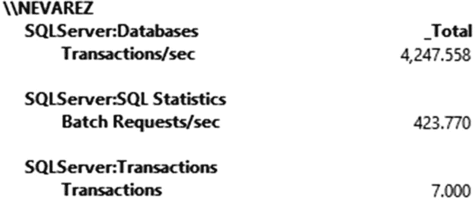
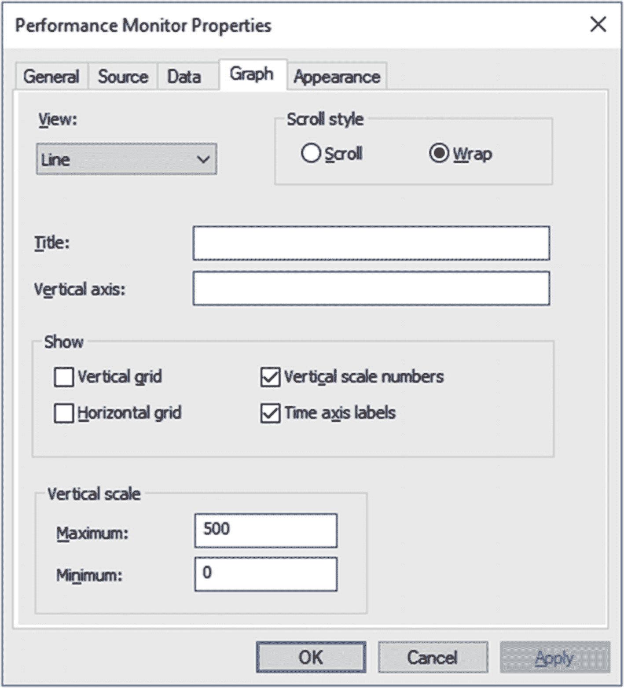
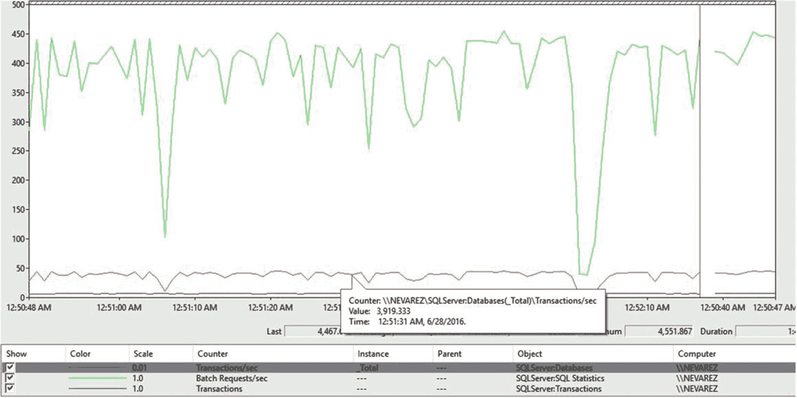
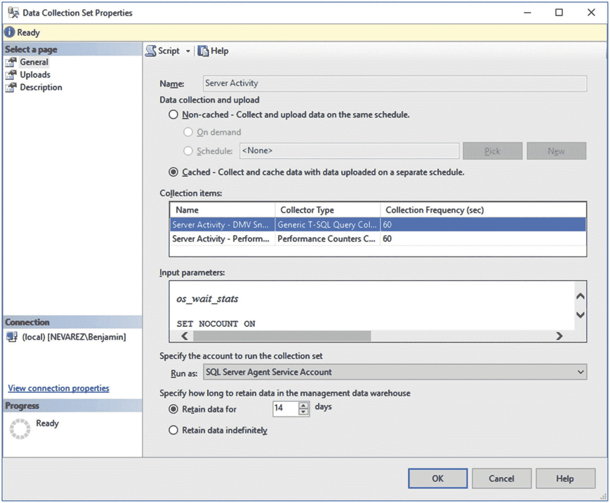

# 8. 性能故障排除

本章讨论在排查 SQL Server 性能问题时需要寻找哪些信息，既包括检查实时数据，也包括为后续分析收集信息。SQL Server 中的性能信息通过多种方式暴露，通常需要使用不同的工具来查看或收集这些数据。其中一种新颖且极具前景的工具 `查询存储` 已在第 6 章中详细阐述。我确信 `查询存储` 将成为 SQL Server 2016 及以上版本查询性能故障排除的主要工具。除了查询性能，还有许多性能领域并不属于查询故障排除的范畴。

**主动收集信息**对于高性能系统至关重要。你不能仅仅依赖在接到性能问题排查请求后才去获取当前可用信息。当你连接到 SQL Server 实例进行研究时，所需的信息可能已经消失了。然而，收集到的数据可以直接、快速地显示问题所在。此外，你可能需要一个基准，甚至可能还需要性能趋势，以了解系统如何运行，并主动发现情况何时开始偏离理想或预期的行为，无论是由于意外问题还是工作负载增加所致。

本章涵盖了多种性能信息，包括性能计数器、通过 `DMV`（动态管理视图）或 `DMF`（动态管理函数）等对象提供的信息以及 SQL Server 事件，目前包括扩展事件和目前已弃用的 `SQL Trace`（更广为人知的是其客户端工具 `SQL Profiler`）。这些性能信息由 SQL Server 提供，在某些情况下也由 Windows Server 甚至其他 Windows 应用程序、服务或驱动程序提供。话虽如此，性能计数器、事件或管理对象的数量非常庞大，并且随着每个版本甚至服务包的发布都会引入越来越多，因此这里仅描述最重要或最有用的那些。本书其他章节中也使用并描述了更多此类信息。如果你需要查看完整列表或更多详情，我也会提供文档链接。

注意
本章不教授如何使用这些工具，因为假定读者已具备使用这些工具的基本知识和经验。`查询存储` 是个例外，因为它是一个新工具，但已在第 6 章中详细涵盖。

最后，在许多情况下，为某些性能计数器或其他性能信息提供“神奇值”历来是个问题，有时关于这些值的糟糕建议来自互联网。还有一种情况是，其中一些值在过去曾经是好的建议，但现在已不再那么有意义。一个经典的例子是 `页面预期寿命 (PLE)` 著名的值 300，它已不再是一个好的建议（如果它曾经是的话）。因此，在大多数情况下，建议不是去寻找某个特定的“神奇值”，而是与基准进行比较。

## 性能计数器

性能计数器是提供信息以监控系统活动的对象。尽管 Windows 自身提供这些计数器，但它们显示的信息不仅关于操作系统，也关于一些其他 Windows 应用程序、服务和驱动程序。作为 Windows 应用程序，SQL Server 提供了丰富的性能计数器数量，但在排查 SQL Server 问题时，通常也需要来自操作系统以及一些其他 Windows 服务或驱动程序的性能计数器。

与第 5 章中介绍的等待信息类似，性能计数器提供的值有时可能难以解释，可能需要经验或系统基准进行比较。如前所述，网上也有一些糟糕建议的情况，其中推荐的值可能对你的系统并不完全合适，或者即使在过去曾是有效的建议，现在可能也不再是一个好的值。

性能计数器使用三个基本术语：`对象`、`计数器` 和 `实例`。SQL Server 性能对象的格式为 `SQLServer:<对象名称>`，并且可能包含多个计数器。例如，`SQLServer:Databases` 对象包含诸如 `数据文件大小 (KB)` 或 `日志增长` 等计数器，这两者将在后面解释。某些对象可能有多个实例。沿用此例，对于 `SQLServer:Databases`，这里的实例由服务器上可用的系统和用户数据库表示。你可以从一个、部分或所有实例的组合中获取性能信息。SQL Server 性能计数器名称会根据你使用的是默认实例还是命名实例而略有变化。例如，`SQLServer:Databases` 在默认 SQL Server 实例上定义了一个计数器，但在命名实例上将被称为 `MSSQL$<实例名称>:Databases`。

注意
性能计数器实例和 SQL Server 实例都使用术语“实例”，但它们并非相关概念。

存在大量的 SQL Server 性能计数器，其中大部分以 `SQLServer` 开头，还有一些以 `SQLAgent` 开头。除了这两组之外，还有几个用于 SQL Server 内存 OLTP 的对象，称为 `SQL Server <版本> XTP`，例如 `SQL Server 2017 XTP 存储` 或 `SQL Server 2017 XTP 事务`。你可以在 [`https://technet.microsoft.com/en-us/library/ms190382.aspx`](https://technet.microsoft.com/en-us/library/ms190382.aspx) 获取 SQL Server 性能计数器的完整列表和详细信息，在 [`https://technet.microsoft.com/en-us/library/dn511015.aspx`](https://technet.microsoft.com/en-us/library/dn511015.aspx) 获取 SQL Server 内存 OLTP 性能计数器的详细信息。

SQL Server 还提供了 `sys.dm_os_performance_counters` `DMV`，虽然可以轻松查询，但不幸的是它只涵盖 SQL Server 计数器，因此你仍然需要从外部寻找你可能需要的其余 Windows 计数器。此外，`sys.dm_os_performance_counters` 需要对其数据进行额外处理，我们将在后面讨论。


### 性能监控与计数器

尽管收集性能计数器数据通常不会影响系统性能，但应注意不要收集过多计数器或设置过短的更新间隔。用于显示和收集性能计数器的主要工具是 **Windows 性能监视器**，尽管还有其他一些相关流行工具，例如 **PAL（日志性能分析）** 工具。PAL 用于分析性能计数器数据，可以在 `https://pal.codeplex.com` 找到。**SQL Server 2008** 引入时，曾可以选择使用性能监视器和分析器来关联性能计数器和 **SQL 跟踪**事件的信息。如今，随着分析器和 **SQL 跟踪**被弃用，目前尚不清楚未来是否会有替代工具来用扩展事件完成相同的工作。

最后，**数据收集器**（一个随 **SQL Server 2008** 引入的工具，在某些文档中称为 **MDW**（管理数据仓库））可用于收集最重要的性能计数器以及其他一些信息。启用此工具的一个直接好处是，您无需决定收集哪些性能计数器。数据收集器将根据 **Microsoft 技术支持**的故障排除场景配置最有用的计数器。不过，您可以通过包含额外的性能计数器来微调此列表。移除性能计数器也是可能的，但很少需要。

在下一节中，我将介绍一些最有用的性能计数器，但如前所述，还有很多其他计数器，您可以参考前面列出的文档以获取完整列表或其他详细信息。

#### 比较批处理与事务

测量每秒批处理请求数和每秒事务数是衡量 **SQL Server** 实例吞吐量的主要指标。它显示了您的实例当前执行的工作量。请记住，对于工作负载繁重的服务器，这些计数器可能显示的是实例的最大容量，但如果服务器不够繁忙，则只意味着它能够处理客户端应用程序发送的所有请求，并且可以在需要时处理更多请求。另一方面，特别是当您遇到性能问题时，等待分析可能表明应用程序发送的请求超出了 **SQL Server** 实例的处理能力，而等待信息可能指明了限制所在。

例如，如果一个 **SQL Server** 实例显示每秒 10,000 个批处理请求，这可能意味着它要么是实例能够处理的最大值，要么是应用程序提交的最大值。如果被请求，此实例有可能处理每秒 12,000 个批处理请求。

此外，相同的每秒批处理请求数在不同 **SQL Server** 实例之间可能并不意味着完全相同的吞吐量，因为它们的工作负载可能不同。例如，一个实例可能运行纯粹的 **OLTP** 事务，而另一个可能是带有某些批处理的 **OLTP** 系统，还有一个可能是处理更昂贵查询的报表或分析系统。我尚未见过纯粹的 **OLTP** 生产系统（如果它真的存在的话）。

这些计数器的定义很简单：

*   `SQLServer:Databases Transactions/sec`: 每秒事务数
*   `SQLServer:SQL Statistics Batch Requests/sec`: 每秒接收到的批处理请求数
*   `SQLServer:Transactions`: 活动事务总数

为了更好地可视化和比较每秒批处理请求数与每秒事务数，让我们看以下练习。首先，创建一个表：
```sql
CREATE TABLE t1 (id int IDENTITY(1,1), name varchar(20))
```

运行以下包含十个隐式事务的批处理。为了有足够时间可视化服务器活动，我们使用 `GO` 命令运行该批处理 10,000 次。请根据您的测试系统随意调整。
```sql
BEGIN
INSERT INTO t1 VALUES ('Hello')
INSERT INTO t1 VALUES ('Hello')
INSERT INTO t1 VALUES ('Hello')
INSERT INTO t1 VALUES ('Hello')
INSERT INTO t1 VALUES ('Hello')
INSERT INTO t1 VALUES ('Hello')
INSERT INTO t1 VALUES ('Hello')
INSERT INTO t1 VALUES ('Hello')
INSERT INTO t1 VALUES ('Hello')
INSERT INTO t1 VALUES ('Hello')
END
GO 10000
```

图 8-1 显示了我在执行过程中在性能监视器上截取的一个快照。请注意，每秒事务数大约是每秒批处理请求数的十倍，正如预期的那样。



**图 8-1**
比较每秒批处理请求数与每秒事务数

您也可以使用性能监视器中的折线图可视化相同的信息，尽管它们并非使用相同的比例尺进行绘制。（例如，图 8-2 中的值 3,919.333 在垂直轴上显示为 39.19。）您可以使用性能监视器属性更改垂直比例尺，如图 8-3 所示。



**图 8-3**
性能监视器垂直比例尺配置



**图 8-2**
比较每秒批处理请求数与每秒事务数图表

要进行清理，请删除表：
```sql
DROP TABLE t1
```


#### 日志增长

日志增长是一种开销很大的操作，可能对数据库性能产生负面影响。在 `SQLServer:Databases` 性能对象下，`Log Growths` 计数器显示了数据库日志增长的总次数。这个性能计数器尤为重要，它揭示了为何正确设置数据库文件大小至关重要，更关键的是，解释了为何不应依赖默认大小配置。是的，现实中确实存在使用这些默认配置的生产数据库。此外，**即时文件初始化**（在第 3 章和第 4 章均有提及）有助于跳过数据文件的零初始化过程，使文件增长操作几乎瞬间完成，但此功能对事务日志文件无效。

我们来做一个快速练习。创建一个使用默认配置的数据库：

```
CREATE DATABASE test
```

通过检查数据库属性（例如，在 SQL Server Management Studio 中使用“文件”页），你可以看到事务日志文件的初始大小为 8 MB，并且启用了自动增长，配置为每次增长 64 MB。打开性能监视器（Performance Monitor），并跟踪 `SQLServer:Databases` 对象下的 `Log Growths` 和 `Log File(s) Size (KB)` 这两个计数器。`Log File(s) Size (KB)` 是数据库中所有日志文件的累计大小（尽管通常一个数据库只需一个这样的文件）。请确保只选择 `test` 数据库。

让我们创建一些事务。我们将稍微修改之前的表示例，使行更大，从而能更快地填满数据页。运行以下语句：

```
USE DATABASE test
GO
CREATE TABLE t1 (id int IDENTITY(1,1), name char(8000))
```

添加数据以给事务日志文件施加压力：

```
BEGIN
INSERT INTO t1 VALUES ('Hello')
INSERT INTO t1 VALUES ('Hello')
INSERT INTO t1 VALUES ('Hello')
INSERT INTO t1 VALUES ('Hello')
INSERT INTO t1 VALUES ('Hello')
INSERT INTO t1 VALUES ('Hello')
INSERT INTO t1 VALUES ('Hello')
INSERT INTO t1 VALUES ('Hello')
INSERT INTO t1 VALUES ('Hello')
INSERT INTO t1 VALUES ('Hello')
END
GO 30000
```

最初，`Log Growths` 会显示 0，而 `Log File(s) Size (KB)` 显示 8184，这对应于前面提到的 8 MB。在运行代码时，请仔细查看性能监视器。在这种情况下，如果选择将数据可视化为报告，可能更容易跟踪。`Log Growths` 很快就会达到 10，此时你可以取消查询。10 次文件增长，每次 64 MB，加上原始的 8 MB，总大小应为 648 MB，这正是我在练习结束时看到的文件大小。换句话说，`Log File(s) Size (KB)` 将显示 663,544，而 `Log Growths` 显示 10。练习结束后，请删除该数据库以结束练习。

如前所述，强烈建议将事务日志文件大小设置为所需的最大值，以避免日志增长；更糟糕的是，如果文件变满且无法扩展，可能导致事务失败和潜在的应用程序中断。通常，找到最优文件大小需要进行一些测试，但不幸的是，仍可能发生意外的活动或长时间运行的事务，导致日志需要增长。不过，遵循之前的建议，你可以避免或最小化这些情况的发生。

与事务日志文件增长操作相关的性能问题可能非常难以排查，除非您正在跟踪或收集数据，因为通常在文件大小增加后，性能会恢复正常，没有任何信息能显示问题所在。`PREEMPTIVE_OS_WRITEFILEGATHER` 等待类型也可能表明某个文件正在进行零初始化，但根据您捕获等待信息的方式，您可能没有指向特定数据库或文件的额外信息。有关使用等待排查性能问题的更多详细信息，请参见第 5 章。

最后，您可能能够使用 SQL Server 默认跟踪查看这些事件，并通过运行“磁盘使用情况报告”立即可视化其信息。要运行报告，请右键单击 `test` 数据库，选择“报表” > “标准报表” > “磁盘使用情况”。信息显示在“数据/日志文件自动增长/自动收缩事件”部分。请记住，默认跟踪的文件大小有限，较旧的事件最终会被删除。

#### 数据文件大小 (KB)

与前一节解释的 `Log File(s) Size (KB)` 类似，`Data File(s) Size (KB)` 性能计数器显示数据库中所有数据文件的累计大小。与事务日志文件不同，数据库中拥有多个数据文件是非常常见的。

尽管没有像 `Log Growths` 那样针对数据文件的对应计数器，但您可以使用 `Data File(s) Size (KB)` 计数器来判断数据文件增长操作何时发生。再次强调，正确设置数据文件大小并启用即时文件初始化，可以帮助您避免与数据文件增长操作相关的性能问题。

注意
SQL Server 默认跟踪和“磁盘使用情况报告”也有助于显示数据文件自动增长事件。

#### 每秒页面读取数

在 `SQLServer:Buffer Manager` 性能对象下，`Page reads/sec` 显示 SQL Server 读取的物理数据库页数。排查 `Page reads/sec` 过高的问题需要额外信息，例如找出哪些查询正在执行大量读取，或者分析某些 DMV（如 `sys.dm_io_virtual_file_stats` 或 `sys.dm_db_index_usage_stats`）的输出。查看内存信息也可能有帮助。

排查与查询相关的问题需要使用传统的查询优化技术，包括分析查询执行计划、查看是否需要一个或多个索引、查找是否正在执行过多的表扫描或索引查找，或者研究参数敏感的查询是否影响了 I/O 操作。

注意
如本章后面所示，从 SQL Server 2016 和 SQL Server 2014 Service Pack 2 开始，您可以在执行计划中找到操作符级别的性能信息，包括 I/O 统计信息。

#### 每秒页面写入数

在 `SQLServer:Buffer Manager` 性能对象下，`Page writes/sec` 显示每秒发出的物理数据库页写入数。关于 `Page reads/sec` 的大多数建议也可能适用于此。您还可以尝试将此计数器与后面解释的日志刷新计数器关联起来分析。


#### 页面预期寿命

`SQLServer:Buffer Manager` 对象下的性能计数器 **页面预期寿命 (PLE)** 显示了数据页在缓冲池中停留的平均秒数。尽管网上仍有许多建议将 300 及更低的值视为 PLE 出现问题的阈值，但这已不再是一个好的推荐。这个建议最初是微软多年前根据论文《**五分钟规则：用内存交换磁盘访问，以及五字节规则：用内存交换 CPU 时间**》发布的。该规则指的是基于成本（包括价格和性能）决定一个页面应保留在内存中还是从磁盘访问的临界点。

> 注意
>
> 这篇论文至今读来仍很有趣，你可以在网上找到它：[`www.hpl.hp.com/techreports/tandem/TR-86.1.pdf`](http://www.hpl.hp.com/techreports/tandem/TR-86.1.pdf)。此外，五分钟规则在 10 年和 20 年后得到了重新审视，你可以通过阅读《**五分钟规则十年回顾及其他计算机存储经验法则**》（网址：[`http://research.microsoft.com/en-us/um/people/gray/5_min_rule_sigmod.pdf`](http://research.microsoft.com/en-us/um/people/gray/5_min_rule_sigmod.pdf)）和《**五分钟规则二十年回顾：闪存如何改变规则**》（网址：[`http://cacm.acm.org/magazines/2009/7/32091-the-five-minute-rule-20-years-later`](http://cacm.acm.org/magazines/2009/7/32091-the-five-minute-rule-20-years-later)）来了解新的发现。

基于当前的硬件趋势，更好的做法是建立一个基线，并且只在 PLE 长时间下降时才考虑它存在问题。PLE 短时间下降可能不是问题，因为一些昂贵的查询和作业可能导致这种情况，但它应该能够很快恢复。

关于 PLE 需要考虑的第二点是，如果你正在使用**非统一内存访问架构**（这在当今非常普遍）。如果你使用 NUMA，你应该使用`SQLServer:Buffer Node`对象中的 PLE，因为`SQLServer:Buffer Manager`会显示所有 NUMA 节点的通用值。在这种情况下，可能出现某个 NUMA 节点的 PLE 有问题需要你关注，但如果你只关注通用 PLE，这个问题可能就不明显。同样地，一个节点的重大变化——例如，一个维护作业大幅降低 PLE——也可能影响通用值，使得问题看起来像是一个系统范围的问题。

#### 缓冲区缓存命中率

这个同样来自`SQLServer:Buffer Manager`的性能计数器，显示了无需访问磁盘就从缓冲池返回的页面百分比。该比率仅考虑最近几千次页面访问计算得出，期望达到 100%或接近 100%的比率。

#### 处理器时间百分比

一个需要监控且易于理解的关键性能计数器，`Processor`对象下的**处理器时间百分比**，测量处理器执行非空闲线程所花费时间的平均百分比，它是处理器活动的主要指标。

显然，高处理器使用率之后首先要验证的是它是否与 SQL Server 相关，在专用服务器上，这很可能是情况。话虽如此，高性能安装要求 SQL Server 不仅运行在自己的服务器上，而且作为唯一的 SQL Server 实例运行。但即使在这样的配置中，排除其他 Windows 服务或应用程序可能是问题所在的情况也是好的。我在生产环境中也见过这样的情况。

要分析处理器执行特定进程所花费时间的百分比，你可以使用`Process`对象下的处理器时间百分比。在性能监视器中查看此计数器时，你可能需要选择 SQL Server 进程或你怀疑消耗处理器时间的其他几个进程。你的服务器可能列出大量实例（本例中是进程）。数据库引擎服务名为`sqlservr`（对应可执行文件`C:\Program Files\Microsoft SQL Server\MSSQL15.MSSQLSERVER\MSSQL\Binn\sqlservr.exe`）。根据你的安装选择，可能还会运行一些其他 SQL Server 服务，例如 SQL Server 代理（名为`SQLAGENT.EXE`）、SQL Server 浏览器（`sqlbrowser.exe`）等。

一旦你确认确实是 SQL Server 使用了大部分处理器时间，接下来要做的是找出 SQL Server 内部哪些进程可能正在利用这些资源，例如，通过查看最昂贵的查询。你可以使用查询存储、数据收集器功能收集的数据或其他工具。如果你没有收集任何性能数据，你可以简单地查看来自`sys.dm_exec_query_stats` DMV 的当前数据，假设问题查询仍在计划缓存中。以下是一个查询示例，它将按 CPU 使用率列出 20 个最昂贵的查询：

```sql
SELECT TOP 20 qstats.query_hash,
SUM(qstats.total_worker_time) / SUM(qstats.execution_count) AS avg_total_worker_time,
MIN(qstats.statement_text) AS statement_text
FROM (SELECT qs.*, SUBSTRING(st.text, (qs.statement_start_offset/2) + 1,
((CASE statement_end_offset
WHEN -1 THEN DATALENGTH(ST.text)
ELSE qs.statement_end_offset END
- qs.statement_start_offset)/2) + 1) AS statement_text
FROM sys.dm_exec_query_stats qs
CROSS APPLY sys.dm_exec_sql_text(qs.sql_handle) AS st) AS qstats
GROUP BY qstats.query_hash
ORDER BY avg_total_worker_time DESC
```

此外，你也可以使用`sys.dm_exec_requests` DMV 查看当前正在执行的查询，如下所示：

```sql
SELECT TOP 20 SUBSTRING(t.text, (r.statement_start_offset/2) + 1,
((CASE statement_end_offset
WHEN -1 THEN DATALENGTH(t.text)
ELSE r.statement_end_offset END
- r.statement_start_offset)/2) + 1) AS statement_text, *
FROM sys.dm_exec_requests r
CROSS APPLY sys.dm_exec_sql_text(r.sql_handle) t
ORDER BY cpu_time DESC
```

请注意，在这两个查询中，数据都是按处理器时间排序的，第一个查询使用`total_worker_time`列，第二个使用`cpu_time`列。如第 6 章所述，`sys.dm_exec_query_stats`和`sys.dm_exec_requests`还包括其他列，你可以轻松更新之前的查询以按不同的性能指标（如逻辑读或物理读）进行排序。最后，一旦你找出哪些查询消耗了处理器资源，就可以专注于它们的调优和优化。

#### 处理器队列长度

这个列在`System`对象下的计数器，指示所有处理器处理器队列中的线程数。处理器队列长度计数器值过大通常意味着线程数量超过了当前处理器能够高效处理的数量。与处理器时间百分比计数器类似，查找和优化昂贵的查询可能是提高系统性能的好方法。

#### 锁存器

`SQLServer:Latches`对象包含多个计数器，可以帮助你监控必须等待的锁存器请求数量及其平均等待时间（以毫秒为单位）。锁存器是用于保护内存结构以进行并发访问的短期、轻量级同步原语，在第 1 章和第 5 章中有更详细的介绍。这些性能计数器还提供有关当前为**超级锁存器**的锁存器数量、已提升为超级锁存器的锁存器数量以及已降级为常规锁存器的超级锁存器数量的信息。


## 锁

与锁存器类似，`SQLServer:Locks` 对象包含多种计数器，提供诸如每秒锁请求、每秒锁等待、每秒锁超时和每秒死锁数量等信息，以及每次导致等待的锁请求的平均等待时间（以毫秒为单位）等信息。锁和阻塞也在第 5 章中介绍过。

## 逻辑磁盘 和 物理磁盘

`LogicalDisk` 和 `PhysicalDisk` 对象提供了大量计数器，可帮助你监控系统中的 I/O 操作。`LogicalDisk` 和 `PhysicalDisk` 提供相同的计数器，但它们分别从逻辑磁盘或物理磁盘的角度提供信息。特别值得关注的是“平均磁盘队列长度”（Avg. Disk Queue Length），它表示为特定磁盘排队的读写请求的平均数量。

你可能想尝试前面“日志增长”部分中的练习，看看是否能在测试系统中对“平均磁盘队列长度”造成压力。有关这些性能计数器和存储压力工具的更多详细信息，请参阅第 11 章。

## SQL 编译/秒 和 重编译/秒

在 `SQLServer:SQL Statistics` 对象下，这些性能计数器可帮助你监控系统中发生的编译和重编译。编译指的是查询优化过程，其中查询优化器为待执行的查询生成高效的执行计划。

查询只优化一次，并且由于查询优化是一项昂贵的操作，生成的执行计划预期会保留在内存中并尽可能多地重用。这对于可重用代码（如存储过程）尤其如此。因此，大量的编译或重编译可能表明存在问题，需要进行研究。可能的情况是，你有一个即席工作负载或大量即席查询，导致了大量的优化操作。即席工作负载通常提交只使用一次的不同查询，每个查询都需要一次优化，并可能为可能不再需要的计划使用计划缓存内存。虽然在这种情况下你无法最小化优化次数，但你可以通过启用“针对即席工作负载进行优化”（optimize for ad hoc workloads）配置选项来减少计划缓存使用的内存，如第 3 章所述。如果允许更改应用程序，你可以尝试通过使用存储过程来促进代码重用。

重编译是对查询的新优化，通常已经存在一个执行计划。重编译可能由多种原因引起，包括对象模式的更改（例如添加列或索引）、与会话相关的 SET 选项的更改、统计信息更新，甚至在代码中显式请求重编译（例如，使用 `RECOMPILE` 提示）。计划也可能因多种原因从计划缓存中移除，包括内存压力、某些实例或数据库配置更改，或发出直接影响计划缓存的语句，如 `DBCC FREEPROCCACHE`。在这些情况下，由于计划已被清除，执行新的查询优化被视为一次新的编译，而不是重编译。

重用计划是帮助系统性能的最佳方法之一，如果你遵循一些简单的建议，如使用存储过程，SQL Server 可以自动完成这一点。尽管重用计划在几乎所有情况下都完美有效，但你需要意识到少数情况下它可能成为问题。典型的场景是运行参数敏感的查询，其中重用错误的计划可能对系统性能造成灾难性影响。

你可以通过参考第 1 章获取有关编译、重编译和计划缓存的更多信息。此外，我推荐阅读 Microsoft 白皮书“SQL Server 2008 中的计划缓存”（Plan Caching in SQL Server 2008），可从 [`https://technet.microsoft.com/en-us/library/ee343986 (v=sql.100).aspx`](https://technet.microsoft.com/en-us/library/ee343986) 获取。

## 内存授予

在 `SQLServer:Memory Manager` 中，“内存授予”（Memory Grants Outstanding）和“挂起的内存授予”（Memory Grants Pending）分别返回已成功获取或正在等待内存授予的进程数量。你可以使用 `SQLServer:Wait Statistics` 对象上的“内存授予队列等待”（Memory Grant queue waits）获取额外的等待信息，包括平均等待时间（毫秒）、每秒累计等待时间、进行中的等待以及每秒开始的等待。内存、内存授予及其对系统性能的影响已在第 1 章中介绍。

## 被阻塞的进程

在 `SQLServer:General Statistics` 对象下，“被阻塞的进程”（process blocked）返回当前被阻塞的进程数。有关阻塞的更多信息，包括等待和故障排除信息，可在第 5 章中找到。

## 日志刷新计数器

在事务提交后，SQL Server 必须将日志缓冲区中的日志记录刷新到磁盘，将此信息持久保存到事务日志文件中。在 `SQLServer:Databases` 下，SQL Server 有四个性能计数器可帮助你确定将日志记录刷新到磁盘是否是系统中的性能瓶颈。同样，它们的定义是直接的，如下列所示：

| 计数器名 | 描述 |
| --- | --- |
| `Log Flushes/sec` | 每秒日志刷新次数 |
| `Log Flush Waits/sec` | 每秒等待日志刷新的提交次数 |
| `Log Flush Wait Time` | 刷新日志的总等待时间，以毫秒为单位 |
| `Log Flush Write Time (ms)` | 在过去一秒内完成的日志刷新写入所需的时间，以毫秒为单位 |

## 检查点页/秒

同样在 `SQLServer:Buffer Manager` 对象下，“检查点页/秒”（Checkpoint pages/sec）性能计数器监视由检查点或任何其他需要将所有脏页刷新到磁盘的操作每秒刷新到磁盘的页数。检查点是数据库引擎的一项操作，其中内存缓冲池中已修改的页面（也称为脏页）和任何必需的事务日志信息被写入磁盘。

## 内存管理器

`SQLServer:Memory Manager` 对象包含多种与内存相关的计数器，有助于监控连接、数据库缓存、锁、日志池、查询优化或授予执行进程（用于哈希、排序和创建索引操作）的内存使用。其他一些计数器提供有关系统内存的一般信息，包括以下内容：

*   可用内存 (KB) (`Free Memory (KB)`)：表示服务器当前未使用的已提交内存量
*   目标服务器内存 (KB) (`Target Server Memory (KB)`)：指定服务器可以消耗的理想内存量
*   服务器总内存 (KB) (`Total Server Memory (KB)`)：表示服务器当前正在消耗的内存量


### sys.dm_os_performance_counters

`sys.dm_os_performance_counters` 动态管理视图包含了一个子集，其内容与你可以通过 Windows（例如，如前文所述，使用性能监视器）访问的性能计数器相同。但是，此动态管理视图仅包括与 SQL Server 相关的计数器。该视图返回大量行，行数也取决于某些计数器可用实例的数量。例如，在 `SQLServer:Databases` 对象中，每个 `counter_name` 和 `instance_name` 列（在这种情况下是每个数据库）都有一个条目。换句话说，拥有 60 个计数器和 10 个数据库将单独产生 600 个条目。

表 8-1 显示了此动态管理视图的一个小样本输出。

表 8-1

样本输出

| object_name | counter_name | instance_name | cntr_value | cntr_type |
| --- | --- | --- | --- | --- |
| SQLServer:Buffer Manager | Buffer cache hit ratio |   | 1133 | 537003264 |
| SQLServer:Buffer Manager | Buffer cache hit ratio base |   | 1175 | 1073939712 |
| SQLServer:Buffer Manager | Page lookups/sec |   | 162331031 | 272696576 |
| SQLServer:Buffer Manager | Free list stalls/sec |   | 0 | 272696576 |
| SQLServer:Buffer Manager | Database pages |   | 285880 | 65792 |
| SQLServer:Buffer Manager | Target pages |   | 16138240 | 65792 |
| SQLServer:Buffer Manager | Integral Controller Slope |   | 127 | 65792 |
| SQLServer:Buffer Manager | Lazy writes/sec |   | 24010 | 272696576 |

此外，数据是以原始形式公开的，可能需要进行额外处理才能使数据变得有用。更多信息，请参阅文章“解读来自 *sys.dm_os_performance_counters* 的计数器值”，链接为 [`https://blogs.msdn.microsoft.com/psssql/2013/09/23/interpreting-the-counter-values-from-sys-dm_os_performance_counters`](https://blogs.msdn.microsoft.com/psssql/2013/09/23/interpreting-the-counter-values-from-sys-dm_os_performance_counters)。

根据该文章，`cntr_value` 列的值应根据 `cntr_type` 列进行解释。例如，缓冲区缓存命中率的 `cntr_type` 值为 537003264，根据文章，这对应于表 8-2 中所示的 `PERF_LARGE_RAW_FRACTION` 值。

表 8-2

样本输出

| Decimal | Hexadecimal | Counter Type Define |
| --- | --- | --- |
| 1073939712 | 0x40030500 | PERF_LARGE_RAW_BASE |
| 537003264 | 0x20020500 | PERF_LARGE_RAW_FRACTION |
| 1073874176 | 0x40020500 | PERF_AVERAGE_BULK |
| 272696576 | 0x10410500 | PERF_COUNTER_BULK_COUNT |
| 65792 | 0x00010100 | PERF_COUNTER_LARGE_RAWCOUNT |

`PERF_LARGE_RAW_FRACTION` 计数器类型表示其对应的 `PERF_LARGE_RAW_BASE` 计数器值的一个分数，该值也在表 8-2 中显示为 1073939712。对于我们的示例，`PERF_LARGE_RAW_BASE` 表示缓冲区缓存命中率基数，也在前面的动态管理视图样本输出中列出。然后我们可以使用以下公式：

缓冲区缓存命中率 % = 100 * 缓冲区缓存命中率 / 缓冲区缓存命中率基数

在我们的例子中，使用前面动态管理视图输出的值，我们有 100 * 1133 / 1175，即 96.43%。有关其他计数器的更多详细信息，请参阅提到的文章。

## 动态管理视图和函数

我们在本书的其他章节中已经介绍了很多动态管理视图。本节将包括一些对性能故障排除至关重要的额外动态管理视图。你可以在 [`https://msdn.microsoft.com/en-us/library/ms188754.aspx`](https://msdn.microsoft.com/en-us/library/ms188754.aspx) 找到所有已记录的动态管理视图和动态管理函数的完整列表。

### sys.dm_io_virtual_file_stats

`sys.dm_io_virtual_file_stats` 动态管理函数为数据库中的每个数据和日志文件提供了丰富的 I/O 信息，不仅包括 I/O 活动数据，还包括等待延迟信息。返回的统计信息是自 SQL Server 实例启动以来或数据库或数据文件从离线状态更改为联机状态以来累积的指标。此动态管理函数替代了旧的 `fn_virtualfilestats` 函数。

仅由此动态管理函数返回的 I/O 活动可能没有太大意义，因为它取决于 SQL Server 实例（或数据库或文件）已联机的天数，但当与同一实例上的其他文件进行比较时，它会很有帮助。一旦你发现某个数据库文件可能有过度的 I/O 活动，你可能需要关联其他一些性能信息来采取措施。很多时候，你可以通过调整和优化查询（例如，提供正确的索引，查看改进执行计划，验证统计信息等）来缓解这些问题。在其他时候，根据你的结果，将数据库文件放置在不同的卷上也可能有所帮助，例如，将繁忙卷的 I/O 分散到额外的卷上。尝试将 I/O 活动与 `sys.dm_db_index_usage_stats` 关联也可以提供有价值的信息。

`sys.dm_io_virtual_file_stats` 动态管理函数有两个可选参数，数据库 ID 和 文件 ID，可以如下例所示使用：
```
SELECT * FROM sys.dm_io_virtual_file_stats(DB_ID('AdventureWorks2017'), NULL)
```
不带参数调用此动态管理函数将列出所有数据库中的所有文件，如下例所示：
```
SELECT DB_NAME(mf.database_id), physical_name, fs.*
FROM sys.dm_io_virtual_file_stats(NULL, NULL) fs
JOIN sys.master_files mf
ON mf.database_id = fs.database_id
AND mf.file_id = fs.file_id
```
表 8-3 显示了一个部分样本输出。

表 8-3

样本输出

| database_name | num_of_bytes_read | io_stall_read_ms | num_of_bytes_written | io_stall_write_ms |
| --- | --- | --- | --- | --- |
| tempdb | 18735104 | 5642 | 2605056 | 999 |
| tempdb | 1015808 | 186 | 2162688 | 281 |
| tempdb | 2260992 | 803 | 1507328 | 201 |
| tempdb | 2121728 | 322 | 1613824 | 1388 |
| tempdb | 2301952 | 420 | 1662976 | 714 |
| AdventureWorks2017 | 275603456 | 147988 | 43155456 | 9587 |
| AdventureWorks2017 | 185999360 | 12248 | 202964992 | 258568 |
| AdventureWorksDW2017 | 113778688 | 35233 | 74670080 | 3129 |
| AdventureWorksDW2017 | 1130496 | 2322 | 47136768 | 14632 |

所有列都提供了重要的 I/O 信息。仅列出最关键的几个：
*   `num_of_reads`：在数据库文件上执行的读取次数。
*   `num_of_bytes_read`：在数据库文件上读取的总字节数。
*   `io_stall_read_ms`：用户为在数据库文件上执行的读取而等待的总时间。以毫秒为单位。
*   `num_of_writes`：在数据库文件上执行的写入次数。
*   `num_of_bytes_written`：写入数据库文件的总字节数。
*   `io_stall_write_ms`：用户为在数据库文件上完成的写入而等待的总时间。以毫秒为单位。
*   `io_stall`：用户为在数据库文件上完成的 I/O 而等待的总时间。它基本上是 `io_stall_read_ms` 加上 `io_stall_write_ms`。以毫秒为单位。
*   `size_on_disk_bytes`：磁盘上用于数据库文件的字节数。


### `sys.dm_os_volume_stats`

`sys.dm_os_volume_stats` 这一 DMF（动态管理函数）根据提供的数据库 ID 和文件 ID，返回系统中有关卷的信息。与本书中的其他函数不同，此函数必须提供参数。返回的部分信息包括：卷挂载点、逻辑卷名、文件系统类型（如 NTFS、FAT 或 RAW）、卷总大小（字节）、可用空间、卷是否支持操作系统压缩、备用数据流或稀疏文件，以及卷是否为只读和已压缩。

以下是一个请求 `AdventureWorks` 中 `file_id` 为 1 的卷信息的示例：

```
SELECT * FROM sys.dm_os_volume_stats (DB_ID('AdventureWorks2017'), 1)
```

**注意**

挂载点是一种在不需要驱动器号的情况下将卷添加到文件系统的方法，可以在 NTFS 文件系统的目录中创建。挂载点随 Windows Server 2000 引入。

### `sys.dm_db_index_usage_stats`

`sys.dm_db_index_usage_stats` 这一 DMV（动态管理视图）返回有关数据库中表和索引所执行操作的信息，包括用户查询和系统查询产生的查找、扫描、书签查找和更新的次数。它还报告这些操作最后一次执行的时间。此信息按索引和表（即聚集索引或堆）报告。用户活动指用户和应用程序提交的查询。系统查询是内部生成的查询，例如执行统计信息更新所需的操作。

此 DMV 可与 `sys.dm_io_virtual_file_stats` DMV 结合使用，以深入分析数据库中哪些对象可能具有过高的 I/O 活动。但是，它的工作方式与 `sys.dm_io_virtual_file_stats` 不同，因为它不显示字节或等待时间，而主要从查询处理的角度显示活动。请注意，此 DMV 返回整个实例的信息，因此你可能希望仅选择特定数据库的结果，如下面的代码所示：

```
SELECT OBJECT_NAME(object_id), * FROM sys.dm_db_index_usage_stats
WHERE database_id = DB_ID()
ORDER BY object_id, index_id
```

你可以选择将此 DMV 与 `sys.indexes` 联接以获取额外的索引详细信息。以下是一个基本查询示例：

```
SELECT OBJECT_NAME(s.object_id) AS object_name, i.name, s.*
FROM sys.dm_db_index_usage_stats s JOIN sys.indexes i
ON s.object_id = i.object_id AND s.index_id = i.index_id
WHERE database_id = DB_ID()
ORDER BY object_id, index_id
```

一个基本的样本输出如表 8-4 所示。

表 8-4
样本输出

| 名称 | 索引 ID | 用户查找次数 | 用户扫描次数 | 用户书签查找次数 | 用户更新次数 |
| --- | --- | --- | --- | --- | --- |
| PK_ProductReview_ProductReviewID | 1 | 1 | 0 | 0 | 0 |
| PK_Document_DocumentNode | 1 | 1 | 0 | 0 | 0 |
| PK_SalesOrderDetail_SalesOrderID_SalesOrderDetailID | 1 | 0 | 46 | 14 | 0 |
| IX_SalesOrderDetail_ProductID | 8 | 14 | 8 | 0 | 0 |
| PK_SalesOrderHeader_SalesOrderID | 1 | 0 | 8 | 4 | 3 |

### `sys.dm_exec_query_stats`

`sys.dm_exec_query_stats` 这一 DMV 返回 SQL Server 中缓存查询计划的查询性能信息。尽管此 DMV 中的信息非常有帮助，但我还强烈建议你启用查询存储（或者如果你使用的是较旧的 SQL Server 版本，则启用数据收集器）以收集更高质量的查询性能数据。

如第 6 章所述，查询存储为使用此 DMV 提供了一些额外的好处，包括以下几点：

1.  使用 `sys.dm_exec_query_stats` DMV 仅提供当前位于计划缓存中的计划的视图。计划的当前版本是唯一存在的，并且即使此版本也可能随时从计划缓存中移除。查询存储持久保存每个查询的所有历史计划。
2.  并非每个计划都会被缓存，因此也就不会通过 `sys.dm_exec_query_stats` DMV 暴露。所有计划和查询信息都由查询存储存储，即使是那些不完整的查询的计划。

话虽如此，`sys.dm_exec_query_stats` DMV 仍然具有许多优点，因为它可以在没有任何性能影响的情况下进行查询。这相对于旧版本的 SQL Server 是一个巨大的改进，在旧版本中获取类似信息需要运行昂贵的 SQL Trace 会话以及复杂的方法来处理和聚合数据。

该 DMV 跟踪性能信息，例如工作线程时间（CPU 时间）、物理读取、逻辑写入、逻辑读取、公共语言运行时 (CLR)、已用时间和返回的行数。对于这些指标中的每一个，都会返回总计、最后、最小值和最大值统计数据。本章前面关于性能计数器的部分包含一个典型示例，该示例使用 `sys.dm_exec_query_stats` DMV 获取系统中按 CPU 排序的最昂贵查询，该示例可以轻松更新，以列出按其他可用指标（如逻辑读取或物理读取）排序的昂贵查询。从 SQL Server 2016 开始，此 DMV 包含与并行度、保留内存授予量、理想内存授予量、保留并行线程数和已用并行线程数相关的附加性能信息。


### `sys.dm_db_index_physical_stats`

此动态管理视图（DMV）可用于获取表和索引的碎片信息。碎片可能存在三种形式：页碎片、逻辑碎片和区碎片。当数据页未完全填满时，就会出现页碎片。另一方面，当对象的页在物理上未按顺序排列时，就会出现逻辑碎片和区碎片。逻辑碎片是指页未按索引的逻辑顺序在物理上排序。区碎片是一个类似的概念，指堆的区在物理上未按顺序排列。

碎片可能仅在表和索引扫描操作时导致性能问题，例如执行预读操作时。主要由索引查找组成的工作负载不会受到碎片影响（至少逻辑或区碎片不会）。`sys.dm_db_index_physical_stats` 中的两列 `avg_page_space_used_in_percent` 和 `avg_fragmentation_in_percent` 反映了表或索引的碎片级别。

`avg_page_space_used_in_percent` 列指示数据页中已使用空间的平均百分比，这基本上表示了页的填充度。通常可以通过配置适当的填充因子值来控制页填充度，该值指定数据页应被数据填充的百分比，可以在从服务器到对象级别的不同层级进行配置。例如，填充因子为 90 意味着页面填充了 90%，仅留下剩余的 10% 用于新行。最佳值取决于应用程序和数据库的使用情况。服务器默认配置的填充因子值为 0（顺便说一句，这与 100 完全相同），意味着页面将被填满容量，并且在行通常添加到表末尾时（例如使用 `IDENTITY` 约束时）工作状态良好。此默认值对于磁盘空间使用也是最优的，因为页面已满，扫描也会很高效（意味着无需扫描部分空白页面执行额外的 I/O 操作）。但对于随机插入数据操作，完全填满的页面可能并非最优，因为这将需要页面拆分，除了产生碎片外还会导致性能问题。

对于需要随机插入数据操作的情况，小于 100% 的值可能是合适的。这可以通过根据应用程序特定的插入数据需求调整填充因子配置来实现。当 SQL Server 在页面中没有空间用于额外的行，或用于更新现有行而其新的较大尺寸不再适合该页面时，就会发生页面拆分。拆分操作基本上会创建一个新页面，将原始页面中大约一半的行移动到新页面。页面拆分是一项昂贵的操作，并会导致碎片，因为最终会产生两个大约只填满 50% 的页面。应避免或最小化页面拆分，可以使用 `SQLServer:Access Methods` 性能计数器中的 Page Splits/sec 或 `page_split` 扩展事件进行监控。如第 9 章所述，索引的一个性能建议是使用一个始终递增的值以最小化这些问题。

`avg_fragmentation_in_percent` 列指的是索引的逻辑碎片百分比或堆的区碎片百分比。逻辑碎片指的是索引叶级页中未按顺序排列的页的百分比，即页未按索引的逻辑顺序在物理上排序。区碎片是堆的一个类似概念，指堆的区在物理上未按顺序排列。

修复数据库中的页碎片需要调整填充因子配置级别（如果您的应用程序需要在现有页上插入行）。逻辑或区碎片可以通过重建或重新组织索引或表来修复。您通常只需要更新一次填充因子。另一方面，重建或重新组织索引或表可能需要定期执行，通常在数据库维护作业中进行。决定何时重建或重新组织索引取决于您的数据库，但通常一个安全的起点是当碎片率在 10% 到 40% 之间时重新组织索引，当碎片率大于 40% 时重建索引。根据定义，堆不包含聚集索引，但您也可以通过在其上创建聚集索引然后删除它来对其碎片整理。在堆上创建聚集索引将以最优方式重新分布数据，不留任何碎片，之后删除它只会移除索引的元数据定义，数据保持不变。

以下代码将通过查看 `avg_fragmentation_in_percent` 列中碎片大于 10% 的情况，返回当前数据库中可能需要碎片整理的索引：

```sql
SELECT *
FROM sys.dm_db_index_physical_stats (DB_ID(), NULL, NULL , NULL, 'LIMITED')
WHERE avg_fragmentation_in_percent > 10
```

然后，您可以编写一个脚本，根据百分比选择运行 `ALTER INDEX REORGANIZE` 或 `ALTER INDEX REBUILD`，如下面的伪代码所示：

```sql
IF avg_fragmentation_in_percent = 30.0
SET @command = 'ALTER INDEX ' + ... + ' REBUILD'
EXEC (@command)
```

`sys.dm_db_index_physical_stats` 的文档位于 `https://msdn.microsoft.com/en-us/library/ms188917.aspx`，其中包含了执行此操作的基本代码，您可以根据特定需求进行调整。

注意：我强烈建议使用 Ola Hallengren 的 SQL Server 维护解决方案来进行备份、完整性检查以及索引和统计信息维护。此维护解决方案是免费的，可以从 `https://ola.hallengren.com/` 下载。

### `sys.dm_exec_query_optimizer_info`

`sys.dm_exec_query_optimizer_info` 动态管理视图返回有关查询优化器执行的优化的信息。您可以使用此信息获取有关系统或特定工作负载的查询优化信息。目前，该 DMV 返回 39 行，列出了大量信息，例如优化总数、每次优化的平均耗时、每次优化的平均预估成本，以及关于优化的详细信息，如简单计划、超时、优化期间的内存问题，或与插入、删除、更新、合并、子查询、提示、视图引用、远程查询和索引视图相关的优化数量。这可以为您提供有关系统中发生的优化的详细信息。此 DMV 的某些条目是未文档化的。

表 8-5 展示了一个简短的输出示例。

表 8-5：示例输出

| counter | occurrence | value |
| --- | --- | --- |
| timeout | 495 | 1 |
| memory limit exceeded | 0 | NULL |
| insert stmt | 12836 | 1 |
| delete stmt | 93 | 1 |
| update stmt | 12 | 1 |
| merge stmt | 0 | NULL |
| contains subquery | 7161 | 1 |
| unnest failed | 11783 | 1 |


## SQL 跟踪/扩展事件

### sys.dm_os_sys_info

`sys.dm_os_sys_info` 这个动态管理视图 (DMV) 返回有关运行 SQL Server 的系统的信息，包括服务器和 SQL Server 实例的信息。从 SQL Server 2016 开始，它包含一个更广泛的列列表，其中包括诸如逻辑处理器数量、服务器上的物理内存总量、非抢占式任务的量子（以毫秒为单位）、最大工作线程数、在 SQL Server 进程中配置的用户调度程序数量、调度程序总数、SQL Server 实例上次启动的日期和时间，以及 SQL Server 是否在虚拟机或 NUMA 配置中运行等信息。

例如，我的测试系统返回的示例见表 8-6。（结果只有一行。以下列表仅包含少数几列。）

**表 8-6**

**示例输出**

| 列名 | 值 |
| --- | --- |
| cpu_count | 4 |
| hyperthread_ratio | 4 |
| physical_memory_kb | 8266712 |
| virtual_memory_kb | 137438953344 |
| os_quantum | 4 |
| max_workers_count | 512 |
| scheduler_count | 4 |
| scheduler_total_count | 15 |
| sqlserver_start_time | 2016-06-17 07:49:24.397 |
| affinity_type_desc | AUTO |
| virtual_machine_type_desc | NONE |
| softnuma_configuration_desc | OFF |

### sys.dm_os_windows_info

当 SQL Server 在此操作系统中运行时，`sys.dm_os_windows_info` 提供 Windows 信息。此 DMV 返回 Microsoft Windows 信息，如操作系统版本、服务包级别、库存单位 (SKU) 和 Windows 区域设置标识符 (LCID)。要在 Linux 系统上访问类似信息，可以使用 `sys.dm_os_host_info` DMV。

注意

如第 2 章所述，从 SQL Server 2017 版本开始，SQL Server 现在可以在 Windows、Linux 和 Docker 容器上运行。

### sys.dm_os_host_info

`sys.dm_os_host_info` 返回操作系统信息，适用于 Windows 和 Linux。`host_platform` 列返回 `Windows` 或 `Linux`，而 `host_distribution` 列返回操作系统的描述。所有其他列仅适用于 Windows，也可以使用前面描述的 `sys.dm_os_windows_info` DMV 查看。

## SQL 跟踪/扩展事件

除了性能计数器和直接从 DMV 与 DMF 获取的数据外，SQL 跟踪和扩展事件是监控 SQL Server 或获取数据以排查性能问题的主要工具。不过，与性能计数器、DMV 和 DMF 不同，从事件收集数据通常成本更高，因此只会在需要时收集数据，例如在排查性能问题并进行充分筛选时。尽管扩展事件随 SQL Server 2008 引入，但截至 SQL Server 2012，SQL 跟踪已被弃用，并计划在 SQL Server 的未来版本中移除。然而，SQL 跟踪的使用（主要通过其客户端工具 SQL Profiler）非常广泛，因此在我看来，它不会很快从产品中移除。

与性能计数器类似，扩展事件和 SQL 跟踪都有大量的事件。例如，运行以下代码返回现有扩展事件，对于 SQL Server 2019 RTM 将返回 1846 个事件（相比之下，SQL Server 2016 RTM 返回 1303 个事件，SQL Server 2014 RTM 返回 870 个事件）：

```
SELECT name, description
FROM sys.dm_xe_objects
WHERE object_type = 'event'
ORDER BY name
```

尽管您很可能使用脚本来处理扩展事件并运行诸如 `CREATE EVENT SESSION`、`ALTER EVENT SESSION` 和 `DROP EVENT SESSION` 之类的语句，但通过其 SQL Server Management Studio 用户界面可以轻松入门。该界面还可以帮助您为所选事件和选项编写脚本。扩展事件用户界面还允许您根据一些常见的故障排除场景选择现有模板，这与长期以来在 SQL Profiler 中使用模板的方式非常相似。也可以创建自定义模板。

要涵盖常见事件及其使用方法的讨论需要单独一章。此外，我们在第 5 章中介绍了一个使用扩展事件跟踪特定进程等待的示例，因此您可能需要参考它。但如果您在排查性能问题时没有额外信息，首要任务之一是查看正在运行的高开销查询，并寻找优化机会。以下事件列表有助于收集此类信息，可用于排查高开销查询：

*   `sql_statement_completed`：指示 SQL 语句已完成。其 SQL 跟踪对应事件是 `SQL:StmtCompleted`。
*   `sp_statement_completed`：当存储过程内的 SQL 语句完成时发生。其 SQL 跟踪对应事件是 `SP:StmtCompleted`。
*   `module_end`：当模块的执行完成时发生。其 SQL 跟踪对应事件是 `SP:Completed`。
*   `sql_batch_completed`：指示批处理已完成。其 SQL 跟踪对应事件是 `SQL:BatchCompleted`。
*   `rpc_completed`：指示远程过程调用已完成。其 SQL 跟踪对应事件是 `RPC:Completed`。

这些事件只会查找已完成的 SQL 语句。遗憾的是，无法使用事件来查找未能完成的语句的性能信息，但您可以使用新的查询存储功能获取此类信息，如第 6 章所述。在某些情况下，未完成的语句可能是性能问题，因此排查这些情况可能是必要且重要的。

您可以在 [`https://msdn.microsoft.com/en-us/library/ms175481.aspx`](https://msdn.microsoft.com/en-us/library/ms175481.aspx) 找到已记录的 SQL 跟踪事件。

注意

尽管在撰写本文时我尚未看到完整的扩展事件文档在线发布，但您可以使用 SQL Server Management Studio 用户界面通过键入事件全名或部分名称来快速搜索事件。选择特定事件还可以显示其描述及其事件字段的描述。


### SQL Server 数据收集器

SQL Server 数据收集器是随 SQL Server 2008 引入的一项功能，是用于收集系统数据和解决性能问题的绝佳工具。它绝对是被使用最少的 SQL Server 工具之一，也是我过去广泛使用的一个工具。收集系统数据对于排查性能问题至关重要，因为常见的情况是，当问题没有症状时去调查，相关信息可能已经无法获取了。

收集的信息包括以下内容：

1.  磁盘使用情况：包括数据文件和事务日志文件的磁盘使用信息
2.  查询统计信息：包括查询性能信息
3.  服务器活动：包括大量的性能计数器和服务器活动信息，如等待、调度器、虚拟文件统计信息以及其他一些 DMV 的数据

这三项对应于启用数据收集器时定义的三个收集集。你可以通过查看其属性来获取每个收集集所收集数据的具体详情。例如，在 `SQL Server Management Studio` 中，展开 `管理` 文件夹，选择 `数据收集`，然后选择 `系统数据收集集`，右键单击任一收集集并选择属性。

作为示例，图 8-4 显示了 `服务器活动` 收集集属性，其中包含两个收集项。你可以检查第一个名为“服务器活动–DMV 快照”的收集项所使用的 `T-SQL` 代码，该代码从多个 DMV 获取数据。列表中的第二个收集项名为“服务器活动–性能计数器”，显示了已定义的性能计数器。它包含一个很长的性能计数器列表，并且正如本章前面提到的，你可以通过包含额外的性能计数器来微调此列表。以下是这些性能计数器的一个非常小的示例列表：



*   `\Memory % Committed Bytes In Use`
*   `\Memory \Available Bytes`
*   `\Memory \Cache Bytes`
*   `\Memory \Cache Faults/sec`
*   `\Memory \Committed Bytes`
*   `\Memory \Free & Zero Page List Bytes`
*   `\Memory \Modified Page List Bytes`
*   `\Memory \Pages/sec`
*   `\Memory \Page Reads/sec`
*   `\Memory \Page Writes/sec`
*   ...

该工具收集的数据被持久化存储在一个数据库中，你可以根据需要定义保留策略。最后，数据收集器包含报告，你可以用这些报告以美观的图形方式查看收集到的信息。你也可以创建自己的报告或编写自定义查询，直接从 `数据收集器` 数据库获取数据。有关 `数据收集器` 的更多详情，请参阅 SQL Server 文档。

## 操作符级性能统计

随 SQL Server 2016 引入，后来作为 SQL Server 2014 Service Pack 2 的一部分包含，现在可以在执行计划中看到操作符级别的性能信息，这对于查询执行故障排除来说是一条非常有用的信息。在早期版本的 SQL Server 中，只能获取非常基础的信息，例如实际行数。

查看 `XML` 计划将提供如此丰富且有价值的信息，可用于排查性能问题，例如实际读取的行数（这与 SQL 所有版本中都可用的实际行数不同）、实际 `CPU` 时间、实际耗时、实际逻辑读取、实际物理读取、实际预读、实际 `LOB` 逻辑读取、实际 `LOB` 物理读取或实际 `LOB` 预读（显然在适用时）。

例如，在 `AdventureWorks2017` 中运行以下查询并检查其生成的执行计划：

```sql
SELECT * FROM Sales.SalesOrderDetail
```

检查生成的计划将显示一个聚集索引扫描操作，其中包含以下信息，其中的 `RunTimeCountersPerThread` 元素，顾名思义，包含了每个线程的运行时性能信息计数器，如下 `XML` 片段所示：

```xml
<RunTimeCountersPerThread Thread="0" ActualRows="31465" ActualRowsRead="31465" ActualEndOfScans="1" ActualExecutions="1" ActualExecutionTime="2.0156" ... />
```

尽管此性能信息是按线程显示的，但为简单起见，前面的示例是一个串行计划，并且只显示了线程 0。并行计划将按线程显示相同详细级别的信息。例如，在我的具有四个逻辑处理器的测试系统中，我可以看到 `RunTimeCountersPerThread` 的五个条目：一个用于线程 0（即协调器或主线程），另外四个条目用于执行实际聚集索引扫描操作的每个实际线程。

你可以通过请求实际执行计划来查看此信息。如我们所知，从 `SQL Server Management Studio` 获取实际执行计划很简单，且操作开销不大。从生产环境中应用程序执行的查询获取实际执行计划可能开销更大，因为它需要捕获所需的事件。作为替代方案，可以使用一个新的扩展事件 `query_thread_profile` 来获取相同的信息。该事件在查询执行结束时由计划中使用的每个操作符和线程触发。此外，你可以使用该事件中的 `node_id` 属性将其与计划中相应的操作符关联起来。

## 计划中的跟踪标志

随 SQL Server 2014 Service Pack 2 和 SQL Server 2016 Service Pack 1 引入，执行计划现在会显示有关已启用跟踪标志的信息。这包括在优化时和执行时（如果请求了实际执行计划）启用的实例级别、会话级别和查询级别跟踪标志。会话和查询级别在计划中均显示为会话。

注意：查询级别跟踪标志使用 `QUERYTRACEON` 查询提示来指示，尽管此提示已在 SQL Server 的多个版本中可用，但直到最近才被文档化，并且仅支持有限数量的跟踪标志，如 [`https://support.microsoft.com/en-us/kb/2801413`](https://support.microsoft.com/en-us/kb/2801413) 所示。

通过使用这个新功能，你可以查看特定的行为是否是通过跟踪标志引入的，这会影响执行计划的选择，或者可能以其他方式影响查询性能。当你需要共享执行计划，而你又没有直接访问生成该计划的服务器时，此功能将特别有用。

## 总结

本章介绍了通过监控或从 SQL Server 实例收集数据来进行性能故障排除。它还演示了主动收集和持久化这些数据以供后续分析，对于理解特定系统如何工作、创建基线以及了解性能何时偏离理想或预期行为是多么有益。

性能问题可能由多种原因引起，其中有些甚至是良性的，例如网站客户和销售额的增加。因此，主动监控和理解性能趋势对于预见和应对这些变化至关重要。虽然不可能列出一个详尽的清单，但本章涵盖了最关键的性能计数器、动态管理对象和事件，以及一些用于显示和收集此类数据的工具。本书的其他章节以及与当前主题相关的部分也引入了一些其他的性能计数器、动态管理对象和事件。

