# 9. 索引

毫无疑问，索引是提升查询和应用程序性能的最佳方法之一，本书若不涵盖此主题便不算完整。本章将阐述索引的工作原理，如何为应用程序定义合适的索引，以及如何利用 SQL Server 提供的一些工具（包括缺失索引功能和数据库引擎优化顾问，亦称 DTA）来帮助你做出最优的索引决策。

本章还将说明为何缺乏索引，甚至设计不良的索引，会对查询执行性能产生负面影响。毕竟，拥有合适的索引可能意味着需要扫描整张表与只需读取几页数据就能找到所需信息之间的天壤之别。索引听起来可能像是一项琐碎的任务，事实上，经常可以看到初学者数据库专业人士通常只是盲目地在列上创建索引，而没有对数据库、架构或查询进行适当的分析或了解背景，寄希望于创建的索引能奇迹般地提升数据库性能。

尽管本章很大一部分重点在于使用工具来设计索引，但始终强调，此类工具给出的任何建议都不应在未经适当分析和性能测试的情况下应用，因为很多时候它们是被盲目实施的。换言之，是否采纳推荐的索引并验证它们是否真的提升了查询性能，这取决于 SQL Server 专业人士。为此，本章首先介绍索引是什么，以及在何种情况下它们可能是一个好的选择。

为了正确设计索引，除了了解你的工作负载和查询外，你还需要知道索引如何工作以及在哪些情况下它们可能有用。像 DTA 这样的工具能很好地做到这一点。如果你为它们提供适当的工作负载和查询，它们可以协助你并完成大部分工作。但最终，你需要判断所提供的建议是否真的对你的查询有利。

我是否推荐一直使用 DTA？是的。即使是经验丰富的数据库专业人士，看看 DTA 的建议也总是有益的。毕竟，DTA 使用查询优化器的估算来选择最佳的索引方案，这很有意义，因为在查询最终执行时，同样是查询优化器决定你的索引是否有用。此外，这个工具能在你仅仅盯着一条查询试图理解其作用的大致相同时间内，分析成千上万种选择。但请再次记住，估算终究只是估算。

最后，本章重点讨论传统表和索引，例如聚集索引、非聚集索引和筛选索引，它们要么是堆，要么是 B 树结构。较新的技术，如内存中 OLTP（亦称 Hekaton）或列存储索引，包含了可以大幅提升数据库性能的新型索引。这些新技术将在第 7 章中详细讨论，该章专门介绍 SQL Server 内存功能。还有一些其他类型较少使用的索引，如 XML、空间或全文索引，它们仅用于更特殊的情况，此处不作讨论。

## SQL Server 如何使用索引

在数据库设计阶段通常很难预见所有必需的索引，因此在许多情况下，新索引总是在应用程序投入生产后才被添加。随着新的业务功能或新代码（例如查询或存储过程）被引入数据库，索引也会被添加。虽然本章并非旨在成为查询调优和优化课程，但它主要关注 SQL Server 提供的、能让工作更轻松的工具。话虽如此，深入理解 SQL Server 的工作原理始终是重要的。在本节中，我将向你展示 SQL Server 如何使用索引，以及这如何有助于提升你的查询性能。

创建合适的索引可能从非常简单到极其繁重不等。我见过许多初学者 SQL Server 专业人士只是简单地说：好吧，我的查询 `WHERE` 子句使用了列 `col1`，所以我只需要在 `col1` 上创建一个索引。对，这或许有帮助。但在生产场景中，选择通常很多且更复杂，创建合适的索引可能非常耗时。除了了解索引如何工作之外，在为数据库设计索引之前，你应该具备以下知识或至少考虑以下部分或全部要点：

1.  理解数据库架构和工作负载类型，如 OLTP、报表、数据仓库或这些类型的某种混合。我不确定是否存在纯粹的 OLTP 工作负载；我所见过的每一个 OLTP 数据库都包含一些其他非 OLTP 查询。
2.  理解你的查询，尤其是哪些是关键查询，哪些是最常执行的查询。
3.  理解索引可用的查询谓词（例如，等于、不等于或复杂表达式，稍后详述）。
4.  理解在表设计中是使用聚集索引还是堆。
5.  理解是使用聚集索引还是非聚集索引。
6.  理解是需要单列索引还是多列索引，以及列的顺序可能是什么。
7.  理解哪些查询谓词可能受益于索引及其选择性如何。
8.  理解是否需要唯一索引或筛选索引。
9.  理解除了索引键之外是否还需要包含列。
10. 理解是否需要更改默认的填充因子值。
11. 理解是否需要考虑分区或文件组放置。

> 注意
>
> **选择性**是衡量谓词返回行数的一个指标。返回少量行的谓词被称为具有高选择性。

如前所述，`CREATE INDEX` 语句的语法有大量的选项，你可以在文档 [`https://msdn.microsoft.com/en-us/library/ms188783.aspx`](https://msdn.microsoft.com/en-us/library/ms188783.aspx) 中查看。一些选项如 `ASC`（升序）或 `DESC`（降序）很少需要，因为创建索引时升序是默认值，而且数据库引擎可以正反方向导航此类索引。但是，如果你需要遍历两个或更多列，并且其中至少一个列需要以相反方向访问，则需要显式使用这些选项。例如，如果你在列 `col1` 和 `col2` 上都有索引，它可能用于 `ORDER BY col1, col2` 的查询，但不能用于 `ORDER BY col1, col2 DESC` 的查询。如果帮助此类查询很重要，你可以将索引定义为 `col1, col2 DESC`，使其匹配请求的查询顺序，从而避免可能代价高昂的排序操作。

### 正如本章引言所述，尽管索引有多种用途，但**最重要**的无疑是导航，即尽可能快速高效地找到一行或多行数据。传统上，这是通过使用 B 树结构来实现的。索引搜索使用随机磁盘 I/O，对于少量或有限行数的检索极为有效，因此对于 OLTP 工作负载至关重要。然而，每次随机磁盘 I/O 通常需要读取几个数据库页面，因此随着行数的增加，其代价变得越来越高。这种代价高昂的原因在于，它需要从根节点遍历 B 树结构直到叶子节点，可能读取多个数据库页面。尽管每个页面通常包含许多行，但大多数时候只需要其中一行。

出于这个原因，当 SQL Server 需要处理大量行时，查询优化器很可能会转而选择执行顺序磁盘 I/O，例如表扫描或索引扫描。一些在报表和数据仓库工作负载中大量使用的查询处理操作（如排序和哈希）无疑也会从这种顺序磁盘 I/O 中受益。星型连接查询或使用聚合的查询就是这样的例子。

另一个有趣的现象是，随机磁盘 I/O 的代价在很大程度上取决于所访问的行数，这与顺序磁盘 I/O 完全不同——后者的代价通常与请求的行数无关。例如，无论我们只请求 5%的行还是整个表，表扫描的代价是相同的。然而，随机磁盘 I/O 的代价，如果只请求几行，或者请求几百或几千行，其代价会急剧增加，从极其高效的操作迅速转变为非常昂贵的操作。此外，当所选索引无法覆盖查询时（很可能还需要访问基表），每次搜索可能需要执行两次随机磁盘 I/O。最后，如果对查询性能有帮助，SQL Server 可能一次使用多个非聚集索引。这种操作称为索引交叉，与往常一样，做出此选择将是一个基于代价的决策。

### 在何处使用索引

SQL Server 查询优化器在以下方式中使用索引：

1.  根据筛选谓词或联接谓词查找行。
2.  按特定顺序交付行。
3.  如果索引覆盖查询（即包含所有所需列），则根本不需要访问主表。

让我们更详细地看看这些选择。SQL Server 可以对如下表达式上的索引进行利用：

```
col1 = 12
col2 = 'California'
col3 > 30
col4 IN (7, 23, 38)
col5 BETWEEN 23 AND 38
```

SQL Server 可能无法匹配更复杂表达式上的索引，例如：

```
col6 = ABS(col1)
col7 = (col1 * 3.1416) / col2
```

正如我们稍后将展示的，等式与非等式谓词对索引的选择有很大影响。复杂的表达式也是查询处理器的一个有趣的限制。您可能会惊讶地发现，查询优化器无法解析其中一些表达式。这意味着查询优化器不仅无法选择索引来查找符合此表达式的行，而且还无法估计该谓词返回的行数。这种估计称为基数估计，通常由统计信息提供，对于查询优化过程至关重要。显然，即使基数估计很差，SQL Server 也始终会返回正确的数据；只是在某些情况下，获取数据的方式可能效率不高。

例如，以下查询将使用索引查找创建高效的执行计划，因为`SalesOrderDetail`表在`ProductID`列上有一个索引：

```sql
USE AdventureWorks2017
GO
SELECT * FROM Sales.SalesOrderDetail
WHERE ProductID = 898
```

但是，如果我们尝试以下添加了函数的查询，则会得到如图 9-1 所示的最昂贵的计划，该计划必须执行表扫描，读取表中的所有行，并在稍后的过程中引入筛选运算符以返回正确的数据：

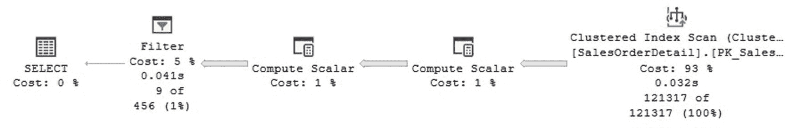

**图 9-1** 忽略非聚集索引的计划

```sql
SELECT * FROM Sales.SalesOrderDetail
WHERE ABS(ProductID) = 898
```

计算列可能对这两种情况都有帮助——既能提供更好的基数估计，又能创建和使用索引。它们通过向查询优化器提供更多信息来提供帮助，因为现在需要时会自动创建统计信息。如果计算列有助于快速查找行，您也可以在其上创建索引。

尽管 SQL Server 社区有时会使用术语"sarg"（搜索参数），但它并未真正用于官方文档或数据库研究社区，因此我将不在此使用它。Sarg 指的是可以转换为索引操作的谓词，但它是一个源自旧 Sybase 代码和文档的古老术语，不应再应用于 SQL Server。在《*The Guru’s Guide to SQL Server Architecture and Internals*》中，Ken Henderson 表示：“与旧版本的产品相比，所有近期版本的 SQL Server 中的查询优化器在利用索引加速查询的能力方面要复杂得多”（Addison-Wesley，2004）。由于查询优化器使用索引的能力不再局限于简单表达式，术语“sarg”已不再适用。


虽然我尚未见过一个纯粹的 OLTP 系统，但索引需求会根据系统从 OLTP 转向报表或数据仓库的方式而变化。OLTP 更侧重于快速查找一行或极少量行，因此非聚集索引对于此类工作负载至关重要。另一方面，OLTP 系统存在大量更新操作，所以限制索引数量也很重要。报表和数据仓库工作负载则专注于处理海量数据，尽管可以使用传统索引来辅助查询（如第 7 章所述），但列存储索引是更合适的选择。

创建索引的主要目的是辅助筛选和连接谓词，使 SQL Server 能尽快找到符合条件的数据行。筛选谓词通过查询中的`WHERE`子句指定（通常为等值比较），而连接谓词则在两表连接时指定。使用`WHERE`子句配合大于、小于或`BETWEEN`比较的查询通常称为范围查询，它们也能从索引中受益——尤其当索引覆盖查询时。有时可定义聚集索引来辅助此类范围查询，但由于每表仅允许一个聚集索引，次选方案可能是创建非聚集覆盖索引。若查找操作数量过多，查询优化器不太可能选择非覆盖的非聚集索引来执行范围扫描操作。

按顺序返回数据行是索引的另一重要用途，这种情况可能出现在多种场景中：例如请求特定顺序的数据（使用`ORDER BY`操作），或当查询优化器发现某些受益于有序数据的操作符（如合并连接或流聚合）时。此类索引能避免昂贵的排序操作或其他效率较低的查询处理策略。

总之，索引查找虽有用，但通常仅适用于相对较少的数据行。只要索引能覆盖查询，对任意数量的数据行使用索引进行范围扫描都很有帮助。这就是为什么范围扫描在聚集索引上效果显著——因为根据定义，聚集索引覆盖了表中的所有列。

### 索引使用验证

创建索引后验证其执行计划至关重要，需确保索引不仅被查询使用，而且符合预期方式。例如：你为特定查询创建索引，虽然执行计划选择了该索引，但它可能执行的是索引扫描而非期望的索引查找操作。情况或许不至于如此极端，但你可能定义了多列索引，虽然看到索引查找操作，但查找谓词仅用于首列。显然，性能指标才是衡量索引策略成功与否的主要依据。若查询原先需执行一分钟，在创建所需索引后缩短至一两秒，你可能认为效果已足够理想。

需要明确的是：查询优化器选择索引并不等同于能获得良好性能。后文将说明，遍历索引 B 树结构是昂贵操作，仅当搜索少量或相对较少的数据行时才值得采用。如同查询优化决策的常见情况，存在一个临界点——超过该点后成本会急剧上升，此时采用其他访问方法（如扫描表）可能更高效。若索引未能覆盖查询所需的所有列，成本会进一步增加，因为可能需要两次遍历 B 树结构：第一次遍历非聚集索引，第二次遍历主表（通常是聚集索引）。此类操作称为键查找。主表也可能是堆结构（无 B 树），但类似的操作——行 ID 查找——同样不可避免。

虽然查询优化器被设计为能在这些情况下做出正确决策，但问题仍可能出现，或许源于基数估计错误或查询处理器的其他限制。此外，某些可复用代码（如存储过程）可能因参数敏感性问题产生此类状况，特别是在数据分布不均的情况下。此时查询优化器会在存储过程首次执行时创建最优计划。如第 1 章所述，查询优化器通过首次提供的参数来决定执行查询的操作方案。当后续以不同参数再次运行该查询时，问题可能显现——先前创建的执行计划可能不再适用。

最后，查询谓词中存在`WHERE`子句并不意味着必须创建新索引，也不代表查询优化器必须使用已有索引。这本质上是基于成本的决策，某些情况下其他遍历方式可能更合适且成本更低。典型情况包括：查询谓词的选择性不足，或索引未能覆盖查询。查询优化器不选择索引可能存在多种原因（即使假设索引创建正确）：
1.  **成本因素**：当前参数值下使用索引可能是好选择，但其他值下则不然。此问题常见于数据分布不均的情况，本章后续将展示相关案例。
2.  **复杂表达式**：可能因使用了函数或复杂表达式，至少当前版本的 SQL Server 查询优化器无法完全解析。
3.  **无实用性**：索引可能完全无效。可调查索引未被使用的原因并考虑删除。索引使用情况记录在`sys.dm_db_index_usage_stats` DMV 视图中（详见第 8 章）。
4.  **基数估计错误或其他查询处理器限制**。

若分析后怀疑索引确实有用而查询优化器未选择它，可通过使用提示强制索引来研究查询行为。通常我不建议使用查询提示，因为它们破坏了查询的声明式规范，限制了查询优化器的选择空间，且查询提示本质上形成了新的依赖关系，会增加维护难度。例如：若查询提示使用了特定索引，删除该索引将导致查询失败。


## 索引维护

我们显然不希望为系统中的每一个查询都创建索引。索引应仅用于提升关键或频繁使用的查询的性能，因为创建过多的索引可能会引入新的性能问题。由于每个索引都需要维护——无论是通过数据库引擎在每次插入、更新或删除操作时自动维护，还是由数据库管理员在调度作业以消除碎片或更新统计信息时手动维护——因此应限制每个表创建的索引数量。此外，索引会占用宝贵的存储空间，并可能消耗更多内存资源。

在表上创建索引的数量也取决于系统类型：是数据时刻变化的 **OLTP** 系统，还是数据仅定期变化（例如，使用 **ETL** 作业）的**数据仓库**。这两种工作负载的索引特性也不同：前者可能用于辅助单次查找，后者则用于辅助数据聚合。总而言之，拥有过多索引可能引发的部分问题如下：

1.  更新操作（如 `INSERT`、`UPDATE`、`DELETE`、`MERGE` 等）的性能可能会受到负面影响。
2.  用于索引重建或索引重新组织操作（以消除或最小化索引碎片）或统计信息更新的维护作业可能耗时更长，消耗更多资源，并扩大数据库维护窗口。
3.  将需要更多的磁盘空间存储，并可能占用更多内存。

关于碎片的更多详情，可以参考第 8 章，其中我们还讨论了 `sys.dm_db_index_physical_stats` 这个 **DMV**。

## 堆表

堆表本身并非索引或 **b-tree** 结构，但在此仍需涵盖，因为任何表都必须配置为堆表或聚集索引。堆表是一种数据结构，其中的行以无特定顺序存储。尽管在堆表和聚集索引表之间做选择有时是一个值得讨论的话题，并且取决于您的数据库和工作负载，但通常设计良好的聚集索引具有能提供顺序的优势，这种顺序可用于范围扫描或返回排序数据。话虽如此，堆表也可用于其他一些情况，例如小表，或者当建议的候选聚集键可能大于堆表的行标识符（`RID`）时。`RID` 仅长八字节，用作堆表中行的定位器。小表不仅可以配置为堆表，而且可能根本不需要非聚集索引，因为在某些情况下，扫描整个表的成本可能低于遍历任何替代的 **b-tree** 索引结构。

尽管大多数情况下建议使用聚集索引，因为它们提供了按顺序访问数据的好处，但使用堆表也有一些其他优势，特别是对于小表或为了避免页面拆分等问题并最小化碎片。关于选择聚集索引还是堆表的精彩讨论，请参阅位于 [`https://technet.microsoft.com/en-us/library/cc917672.aspx`](https://technet.microsoft.com/en-us/library/cc917672.aspx) 的文章“**Clustered Indexes and Heaps**”。

## 聚集索引

通常，一个表会拥有，或者更准确地说，它本身就是一个聚集索引。前文“堆表”部分列出了一些例外情况。之前提到过一种情况，即当建议的聚集索引键过大，而堆表 `RID` 仅使用八字节时。可以通过使用标识属性（可以是 `int` 或 `bigint` 数据类型，分别使用四字节和八字节）来实现与这个八字节堆表 `RID` 大小相似的东西。也就是说，您可以开始使用 `int` 数据类型，如果需要，以后再升级为 `bigint`。如果您事先就知道需要 `bigint`，则应一开始就使用它，以避免日后在生产使用时进行转换维护。

由于堆表不提供任何顺序，并且需要非聚集索引来查找特定行，因此聚集索引的优势在于已经提供了这种好处。但由于只有一个聚集键或顺序可用，因此必须明智地选择。聚集索引键的最佳选择是能辅助范围查询的那种，使得索引可以快速找到范围内的第一行，并沿着逻辑（希望也是物理）索引顺序找到其余行。范围查询是指使用大于或小于运算符（如 `>`、`>=`、`<` 或 `<=`）或 `BETWEEN` 子句来过滤谓词的查询。聚集索引也有助于 `JOIN` 谓词，例如在定义主细表和外键约束时。如果 `ORDER BY` 和 `GROUP BY` 查询基于表的聚集键，它们也将大大受益。

多年来的最佳实践表明，出于性能和磁盘空间使用的考虑，建议聚集索引键具备唯一、窄小、静态且始终递增的特性。作为旁注，这四个建议对堆表来说不是问题，因为 `RID` 遵循这四个特性。`RID` 相对窄小，因为它只使用八字节。让我们回顾一下为聚集索引键推荐的唯一、窄小、静态和始终递增这四个特性：

1.  **唯一**：建议聚集索引键是唯一的。如果不是，将添加一个四字节的唯一标识符（uniqueifier）以确保其唯一性。
2.  **窄小**：建议聚集键尽可能窄小，以节省磁盘存储和内存使用。这一点非常重要，因为每个非聚集索引行也会存储此聚集键，再次影响存储和内存使用。聚集键可以是一个或多个列，因此建议使用尽可能少的列或单个列，并且键要短。
3.  **静态**：我认为这应该是聚集键的一个要求。易变的聚集键（可能发生变化或持续变化）可能导致严重的性能问题，因为行必须从一个页面移动到另一个页面，并导致页面拆分和碎片。
4.  **始终递增**：建议使用始终递增的值，例如由 `IDENTITY` 属性提供的值。这有助于始终将新行添加到索引末尾的新页面中，避免页面拆分和碎片。然而，在高并发、非常密集的工作负载下，可能因所有新行始终插入到最后一个相同页面而引发争用问题。这个问题通常被称为“最后一页插入争用”，也可能影响堆表。

**注意**

如果“最后一页插入争用”问题是您应用程序中的严重瓶颈，您绝对应考虑使用内存优化表和内存中 **OLTP**。有关此 **SQL Server** 功能的详细信息，请参见第 7 章。碎片和页面拆分在第 8 章中有更详细的介绍。

最后，定义主键时，默认情况下也会使用 **T-SQL** 或 **SQL Server Management Studio** 创建一个聚集索引。要更改此行为（例如，改为创建非聚集索引），则需要明确指定。


### 非聚集索引

非聚集索引是 SQL Server 使用的传统二级索引，可以创建在主聚集索引或堆上。因此，它们只包含基础表中的一列或几列作为索引键。它们还可以选择性地包含一个或多个列，这些列不作为键，而是作为额外的数据以覆盖查询，这通过 `INCLUDE` 子句实现。

非聚集索引对于精确匹配查询至关重要，这类查询用于通过相等比较来查找一行或多行数据。与聚集索引类似，它们对于范围查询也可能极其有用，但前提是索引必须覆盖查询。当使用非覆盖索引时，范围查询可能仅在处理非常有限数量的行时才有帮助，因为那种情况下仍然需要访问主表，而且如前所述，随着行数的增加，随机磁盘 I/O 会变得非常昂贵。非聚集索引也能使 `ORDER BY` 和 `GROUP BY` 查询受益，同样假设它们覆盖了查询。

如前所述，如果想包含一个并非搜索所必需的列，可以使用 `INCLUDE` 子句将其添加到索引中。例如，如果包含了 `col1` 列，查询可以返回它，但你不能在过滤谓词（如 `col1 = 12`）中用它进行搜索。我在文档中见过这样的建议：`INCLUDE` 列可以帮助你规避索引的 16 个键列或 900 字节键大小的限制，但如果你的索引设计已经接近这些限制，你应该重新考虑。如前所述，它扮演的角色并不完全相同，因为这些列不能用于搜索谓词。需要提醒的是，非聚集索引也覆盖了聚集索引键，并且与这些键类似，我们也应该使非聚集索引尽可能小。

最后，请注意术语“非聚集索引”也用于内存中 OLTP 和列存储索引技术，因此通常的良好实践是始终称这些新技术中的索引为内存优化非聚集索引和非聚集列存储索引。

> 注意
>
> 对于聚集索引推荐的属性（唯一、狭窄、静态、始终递增）要么不适用于非聚集索引，要么相关性较低。

### 过滤索引

过滤索引随 SQL Server 2008 引入，在可以从查询结果中排除数据子集的情况下非常有用。过滤索引的典型场景包括具有稀疏列的数据、具有大量 `NULL` 值的数据或具有异类数据的列。过滤索引需要一个带有过滤谓词的 `WHERE` 子句，以指示要包含在索引中的行。

> 注意
>
> 稀疏列同样随 SQL Server 2008 引入，它们是对 `NULL` 值进行了优化存储的列，用于列中大量值为 `NULL` 的情况。

## 索引的使用

让我们快速浏览一下，为几个基本场景创建一些索引，回顾本章解释的一些概念，并在此过程中了解缺失索引功能，展示其一些优点和局限性。创建一个名为“test”的新数据库，并运行以下代码为其填充一些数据。请记住，缺失索引功能并非索引优化工具，并且如前所述，它有许多局限性。它的帮助在于它总是可用的，即使没有请求也能提供反馈。如果你需要索引优化工具，应该使用 DTA（数据库引擎优化顾问）。

```sql
SELECT *
INTO dbo.SalesOrderDetail
FROM AdventureWorks2017.Sales.SalesOrderDetail
GO
SELECT *
INTO dbo.SalesOrderHeader
FROM AdventureWorks2017.Sales.SalesOrderHeader
```

此时，我们已准备好在 test 数据库上运行一些查询。让我们尝试几个简单的查询，同时查看生成的执行计划。我们将立即看到缺失索引功能的几个局限性，第一个是它不能用于推荐聚集索引。以下查询对于此类工具推荐聚集索引将是一个很好的示例，因为它有助于先找到 `SalesOrderID` 为 50000 的行，然后遍历索引到 `SalesOrderID` 70000，从而执行范围扫描：

```sql
SELECT * FROM SalesOrderHeader
WHERE SalesOrderID BETWEEN 50000 AND 70000
```

我们在图形化执行计划上没有看到任何缺失索引的建议。然而，可能存在第二个限制阻碍了提供任何建议。生成的计划是一个**平凡计划**，缺失索引功能对平凡计划同样不起作用。缺失索引信息由查询优化器在完整优化期间提供，而平凡计划跳过了此优化阶段，因此不会提供缺失索引信息。有几种方法可以避免平凡计划，尽管实际上，在你的真实数据库中很少会遇到此问题，因为即使是一些微小的更改也会使查询需要完整优化。避免平凡计划的一个简单方法是使用一个未公开的跟踪标志来强制进行完整优化。这就是跟踪标志 8757，并且作为一个未公开的跟踪标志，它不受支持，不应在生产环境中使用。

尝试以下查询将创建一个完整优化的计划，但关于聚集索引的限制仍然存在，我们仍然没有得到建议。顺便说一下，稍后介绍的 DTA 会为此范围查询推荐在 `SalesOrderID` 列上创建聚集索引。

```sql
SELECT * FROM SalesOrderHeader
WHERE SalesOrderID BETWEEN 50000 AND 70000
OPTION (QUERYTRACEON 8757)
```

很多时候，创建聚集索引以及为此类索引选择哪些键的决定是在数据库或表设计期间做出的。让我们手动为两个表创建聚集索引。

```sql
CREATE CLUSTERED INDEX PK_SalesOrderHeader ON SalesOrderHeader(SalesOrderID)
GO
CREATE CLUSTERED INDEX PK_SalesOrderDetail
ON SalesOrderDetail(SalesOrderID, SalesOrderDetailID)
```

在这个主明细表上设置外键约束将是一个自然的选择。我可能不会进行得那么远来覆盖整个练习，而只是讨论基本步骤来了解工具如何工作。让我们继续练习，使用一个非常简单的查询：

```sql
SELECT * FROM SalesOrderDetail
WHERE ProductID = 898
```

这次，我们得到了一个聚集索引扫描（技术上是表扫描），目前还没有缺失索引建议，如图 9-2 所示。

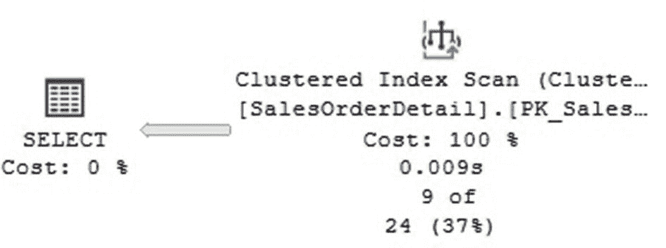

图 9-2
没有缺失索引建议的计划

即使有了聚集索引，平凡计划的限制仍然存在。让我们再次尝试使用跟踪标志 8757 来禁用平凡优化：

```sql
SELECT * FROM SalesOrderDetail
WHERE ProductID = 898
OPTION (QUERYTRACEON 8757)
```


现在，通过查看执行计划，你可以验证优化级别是完整的，但正如预期，我们仍然得到相同的计划，因为实际上没有任何改变。但这次我们得到了一个缺失索引的建议。这是生成的代码：

```
CREATE NONCLUSTERED INDEX []
ON [dbo].[SalesOrderDetail] ([ProductID])
INCLUDE
([SalesOrderID],[SalesOrderDetailID],[CarrierTrackingNumber],[OrderQty],[SpecialOfferID],
[UnitPrice],[UnitPriceDiscount],[LineTotal],[rowguid],[ModifiedDate])
```

注意
要在 SQL Server Management Studio 中显示此代码，请右键单击执行计划顶部的绿色“缺失索引”消息，然后选择“缺失索引详细信息”。这将打开一个新的查询窗口并列出该代码。

对于一个从 121,317 行中返回 9 行的查询来说，这个建议似乎是个好主意。但是，尽管在 `ProductID` 上创建索引看起来方向正确，但将表中的所有剩余列都包含在索引中似乎有些过度。基本上，这将复制表所需的空间。更好的选择可能只是在 `ProductID` 上创建索引，不包含任何列，如下所示：

```
CREATE NONCLUSTERED INDEX IX_ProductID
ON SalesOrderDetail (ProductID)
```

让我们再次运行查询。我们现在不再需要跟踪标志，因为我们已经有了索引，它会创建替代方案，查询优化器将必须执行完全优化。

```
SELECT * FROM SalesOrderDetail
WHERE ProductID = 898
```

我们现在得到了一个完全优化的计划，如图 9-3 所示。

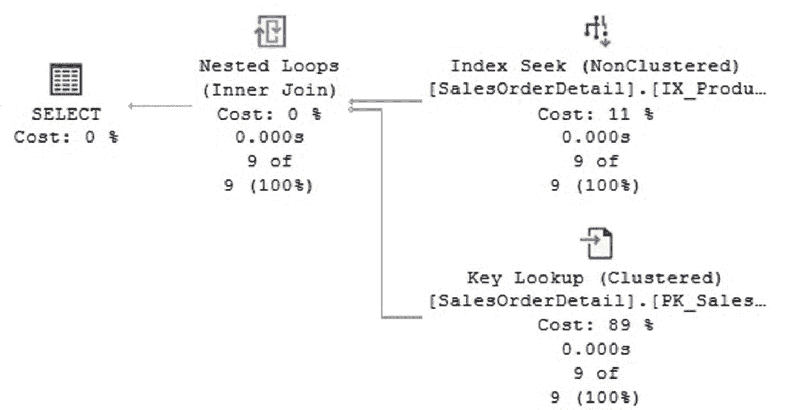

图 9-3
使用索引查找操作的计划

由于我们现在看到了希望看到的索引查找操作以充分利用索引，这个计划现在看起来好多了。在这种特定情况下，没有缺失索引的建议，因为似乎最佳索引已经存在并被使用。但我们遇到了其他情况，即键查找。需要进行键查找是因为我们请求了表中的所有列，而单独的索引并未涵盖所有列。如前所述，键查找（或其在堆上的等效操作，即 `RID` 查找）是一项开销很大的操作，仅对相对较少的行数有意义。无法给出百分比作为示例，但它非常低，并且取决于查询优化器的估计。现在让我们用不同的 `ProductID` 值运行以下相同的查询：

```
SELECT * FROM SalesOrderDetail
WHERE ProductID = 870
```

这一次，它返回了 4688 行，但它回到了表扫描，因为查询优化器估计，对于如此大量的行使用索引查找和键查找可能比扫描整个表的开销更大。你可以通过查看计划来验证这两种开销，但你必须强制为 `ProductID` 870 使用索引。表扫描的开销为 1.25303 单位，而使用以下查询强制使用索引的开销为 5.27841，差异巨大。你可以使用以下 `INDEX` 提示强制进行索引查找，并在生成的执行计划中验证两者的开销：

```
SELECT * FROM SalesOrderDetail
WITH (INDEX (IX_ProductID))
WHERE ProductID = 870
```

虽然我提到了查询开销来解释查询优化器的决策，但现实是，对于我们的性能分析，我们不应该过分关注这些开销，而应该关注实际的执行性能数据。如果你使用像 `SET STATISTICS IO ON` 这样的语句来分析两个查询的 I/O 性能，你可能会发现，对于 `ProductID` 870，使用带有索引查找的计划将比扫描整个表多使用 12 倍的 I/O。

这里值得一提的是，同一个查询出现不同计划的原因是一种称为“自动参数化”的行为。虽然它可以帮助重用计划，但其方式非常保守。由于无法预测查询将返回多少行，这样的查询可能返回 0、1 或很多行，甚至可能返回整个表。因此，查询优化器决定不重用之前的计划，而是创建一个针对新值量身定制的新计划。如果我们使用的是存储过程（主要鼓励重用计划），则将重用现有计划。你可能想知道这两个计划中哪一个会被重用。显然，是第一个优化时创建的计划。

总而言之，索引查找和键查找对于少量行来说极其高效，但随着行数的增加，它们会变得非常昂贵。显然，这并不意味着你应该避免它们。事实上，没有绝对不好的查询运算符，在适当的情况下，每个运算符都可能是最佳选择。有时，我看到开发人员试图完全摆脱键查找，这不是正确的方法。必须取得平衡，特别是当你无法为每个查询创建索引时。

让我们假设我们将查询稍微更改为以下内容：

```
SELECT SalesOrderID, SalesOrderDetailID, ProductID FROM SalesOrderDetail
WHERE ProductID = 870
```

这一次，我们得到了一个仅包含索引查找而没有键查找的新计划，如图 9-4 所示。

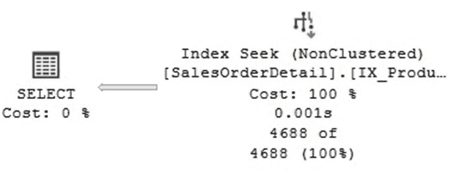

图 9-4
没有键查找的计划

那么为什么键查找消失了？每个非聚集索引都包含表的聚集键，因此在这种情况下，`SalesOrderID` 和 `SalesOrderDetailID` 无需访问基表即可获得。让我们再添加一列：

```
SELECT SalesOrderID, SalesOrderDetailID, ProductID, UnitPrice FROM SalesOrderDetail
WHERE ProductID = 870
```

因为索引不包含 `UnitPrice` 列，所以它不再覆盖查询，我们又回到了聚集索引扫描。但这次我们得到了一个新的索引建议。大多数 SQL Server 版本会显示以下索引定义：

```
CREATE NONCLUSTERED INDEX []
ON [dbo].[SalesOrderDetail] ([ProductID])
INCLUDE ([SalesOrderID],[SalesOrderDetailID],[UnitPrice])
```

在这种情况下，这看起来是一个不错的建议。然而，我们不想包含 `SalesOrderID` 和 `SalesOrderDetailID`，因为如前所述，它们已经包含在非聚集索引中。即使我们添加它们，它们也不会被复制，但在索引定义中不这样做会更清晰。SQL Server 2019 修复了索引定义中的这种列重复问题，它只包含 `UnitPrice` 列。

让我们删除现有索引并根据建议创建一个新索引：

```
DROP INDEX SalesOrderDetail.IX_ProductID
GO
CREATE NONCLUSTERED INDEX IX_ProductID
ON SalesOrderDetail (ProductID)
INCLUDE (UnitPrice)
```

再次运行我们最后一条 `SELECT` 语句将获得使用索引查找的最佳可能计划，与图 9-4 中的类似。假设这个查询值得（例如，它被多次使用），你可以创建包含该包含列的索引。何时使用 `INCLUDE` 由你决定，因为过于频繁地这样做将需要数据复制。索引创建后，我们就拥有了针对该查询的最佳索引，无论参数是 898 还是 870，或者事实上任何其他参数。在这两种情况下，我们只有索引查找，而无需进行键查找。


## 索引的其他用途

我们刚刚介绍了过滤谓词，稍后将介绍连接谓词，但让我们先看看刚刚创建的索引的其他一些好用法。该索引还能提供其他好处，例如按顺序返回数据（例如，在使用 `ORDER BY` 的查询中，或者当查询处理器需要添加一些操作如合并连接时）以及聚合操作。让我们先删除该索引：

```sql
DROP INDEX SalesOrderDetail.IX_ProductID
```

运行以下查询：

```sql
SELECT SalesOrderID, SalesOrderDetailID, ProductID FROM SalesOrderDetail
ORDER BY ProductID
```

如图 9-5 所示，为了提供所需的顺序，必须添加一个开销很大的排序操作。

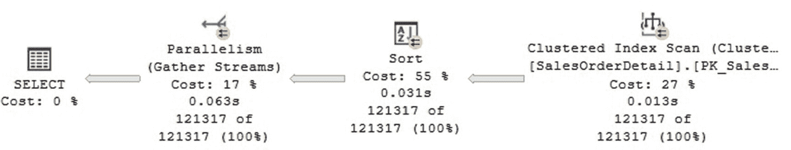

重新创建索引：

```sql
CREATE NONCLUSTERED INDEX IX_ProductID
ON SalesOrderDetail (ProductID)
```

再次运行查询将创建一个非常简单的计划，仅使用已创建的索引，无需排序操作。如图 9-6 所示。

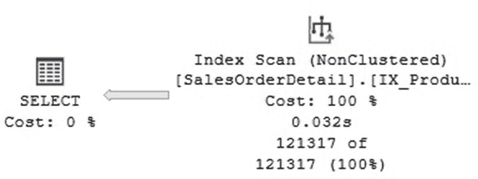

在这种情况下，由于数据已经排序，因此不需要排序操作。只需要进行索引扫描，因为我们需要所有行。如果您查看执行计划，该操作的 `Ordered` 属性将显示为 `True`，这意味着它正在利用数据已经有序这一事实。

该索引也将用于以下查询，按 `ProductID` 聚合数据，否则将需要表扫描和哈希聚合。生成的计划只会扫描非聚集索引，并执行一个称为流聚合的简单聚合，利用数据已经排序的事实。索引扫描操作符的 `Ordered` 属性再次为 `True`。

```sql
SELECT ProductID, COUNT(*) FROM SalesOrderDetail
GROUP BY ProductID
```

总之，本节展示了如何使用索引来执行以下操作：

1.  快速查找过滤谓词的数据（使用 `WHERE` 子句）
2.  按顺序返回数据（使用 `ORDER BY` 子句）
3.  聚合数据（使用 `GROUP BY` 子句）

## 连接谓词的索引建议

对于连接谓词，一个好的索引建议是什么？尽管查询优化器可以就连接的索引做出几种不同的决策，但数据库管理员通常可以关注两个主要选择：连接整个表或连接表并附加筛选条件。

1.  **连接整个表**：在这种情况下，由于无论如何都要扫描整个表，索引的相关性较低，可能不会被使用。
2.  **连接两个表并附加筛选条件**：索引在这里至关重要，因为连接谓词上的索引有助于高选择性的查询。一个索引可用于通过过滤谓词快速查找行，而额外的索引可用于根据连接谓词在第二个表中查找匹配的行。同样，查询选择性和成本估算会影响查询优化器的决策。

例如，运行以下查询将创建如图 9-7 所示的计划：

```sql
SELECT * FROM SalesOrderDetail d
JOIN SalesOrderHeader h
ON d.SalesOrderID = h.SalesOrderID
WHERE ProductID = 898
```

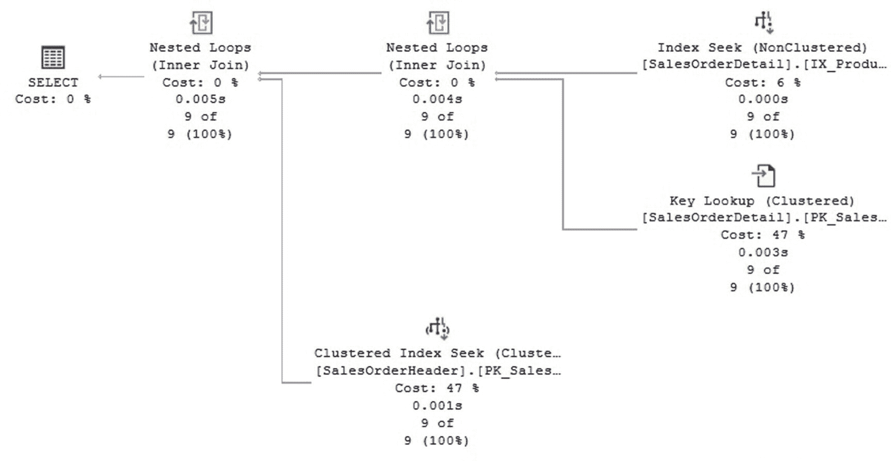

这是一个非常高效的计划。`IX_ProductID` 索引用于高效地找到 `ProductID` 为 898 的九行数据，并且需要九次额外的键查找来从同一表中获取剩余的列。一旦我们在 `SalesOrderDetail` 上获得了这九行，就可以使用索引（在本例中是聚集索引）高效地在主表 `SalesOrderHeader` 中找到九个匹配的行（假设它们存在）。

然而，将谓词改为选择性较低的条件将产生完全不同的计划（参见图 9-8）。

```sql
SELECT * FROM SalesOrderDetail d
JOIN SalesOrderHeader h
ON d.SalesOrderID = h.SalesOrderID
WHERE ProductID = 870
```

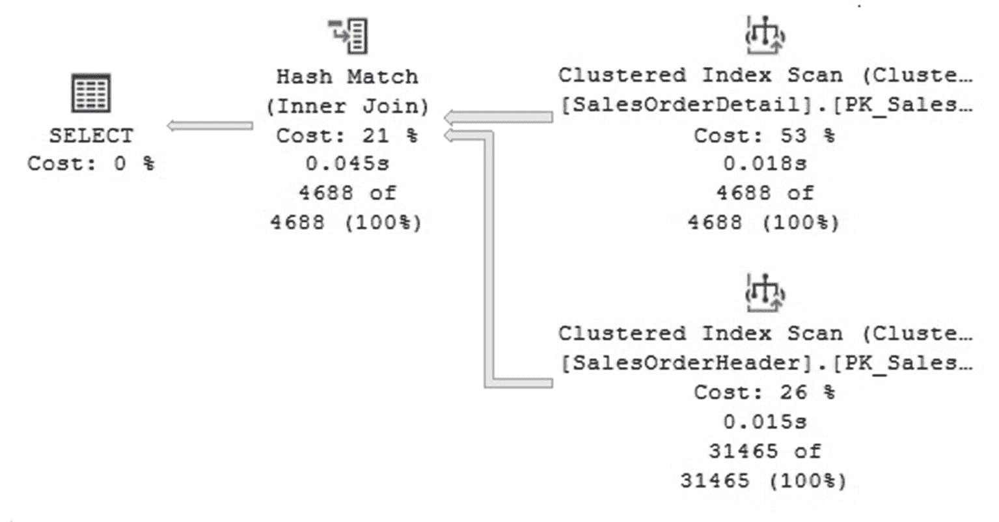

该计划现在使用了两个表扫描，如图 9-8 所示，但请记住，您更可能使用存储过程来重用计划。因此，在这种情况下，其中一个计划将被所有提供参数的实例重用。这也是一个可能推荐两个或更多索引的场景，但您可能已经注意到，缺失索引功能仅为特定查询执行一次推荐一个索引。如果您检查执行计划的 XML 版本或缺失索引 DMV，情况也是如此。

接下来，我将展示一个使用 `INDEX` 查询提示的查询。如前所述，如果删除该索引，查询将失败。请记住，这是一个可能出现的场景，因为索引维护常常与代码维护分开进行。如果您使用 `INDEX` 提示，应该记录它们或在删除索引之前研究其可能的使用位置。例如，之前我们尝试了以下查询来在查询优化器未选择时强制使用 `ProductID` 索引：

```sql
SELECT * FROM SalesOrderDetail
WITH (INDEX (IX_ProductID))
WHERE ProductID = 870
```

删除我们为 `ProductID` 列创建的索引：

```sql
DROP INDEX SalesOrderDetail.IX_ProductID
```

现在尝试运行之前的 `SELECT` 语句将会失败，并返回以下错误消息：

```sql
Msg 308, Level 16, State 1, Line 1
Index 'IX_ProductID' on table 'SalesOrderDetail' (specified in the FROM clause) does not exist.
```

## 检查索引深度

最后，让我们看一下索引深度属性，它显示了索引的层级数，也可以粗略地告诉您索引在查找特定行时使用的页面数量。您可以使用 `sys.dm_db_index_physical_stats` DMV，如下所示。这次让我们针对 AdventureWorks2017 数据库运行这个练习：

```sql
SELECT name, index_depth, index_level, page_count, record_count
FROM sys.dm_db_index_physical_stats(DB_ID (),
OBJECT_ID ('Sales.SalesOrderDetail'), null, null, null) s
JOIN sys.indexes i
ON s.index_id = i.index_id
WHERE name in ('IX_SalesOrderDetail_ProductID',
'PK_SalesOrderDetail_SalesOrderID_SalesOrderDetailID')
```

您也可以使用 `INDEXPROPERTY` 函数的 `IndexDepth` 属性来获得相同的结果：

```sql
SELECT INDEXPROPERTY(OBJECT_ID('Sales.SalesOrderDetail'),
'IX_SalesOrderDetail_ProductID', 'IndexDepth')
SELECT INDEXPROPERTY(OBJECT_ID('Sales.SalesOrderDetail'),
'PK_SalesOrderDetail_SalesOrderID_SalesOrderDetailID', 'IndexDepth')
```

在这两种情况下，聚集索引 `PK_SalesOrderDetail_SalesOrderID_SalesOrderDetailID` 的深度为 3，而非聚集索引 `IX_SalesOrderDetail_ProductID` 的深度为 2。类似地，您可以使用以下语句来测量查询使用的页面数量：

```sql
SET STATISTICS IO ON
```

如果您运行以下使用聚集索引查找（遍历索引 b 树）的语句，查看“消息”选项卡，您会看到三次逻辑读取：

```sql
SELECT * FROM Sales.SalesOrderDetail
WHERE SalesOrderID = 43659 AND SalesOrderDetailID = 1
```

在类似的练习中，要查看以下查询所示的非聚集索引查找所使用的逻辑页数，您会看到两次逻辑读取：

```sql
SELECT ProductID FROM Sales.SalesOrderDetail
WHERE ProductID = 898
```

## 缺失索引功能

### 功能概述

我们已经见识过缺失索引功能的实际应用。让我们在本节中总结一下缺失索引功能是什么，并了解一下缺失索引 DMV。基本上，缺失索引功能是数据库引擎的一种行为，默认启用，它是查询优化器分析当前正在优化的查询可从中受益的索引的结果。在此过程中，查询优化器会估算如果某个索引存在，是否会使查询性能受益，并将此信息提供在执行计划中。此外，SQL Server 会将此信息保存在缺失索引 DMV 中。但是，再次提醒，这是一种估算，并存在一些局限性，其中部分局限性已在前面演示过：

1.  它不适用于简单计划。
2.  它不推荐聚集索引或筛选索引。
3.  缺失索引 DMV 最多只能收集大约 500 个索引组的信息。
4.  DMV 中的数据不会持久保存。
5.  它不是一个索引优化工具。

在 XML 计划中查看缺失索引信息可能很复杂。幸运的是，SQL Server Management Studio 可以帮助你为推荐的索引组装 `CREATE INDEX` 语句，如前所示。

### 缺失索引 DMV

总之，缺失索引 DMV 包括以下几个：

*   `sys.dm_db_missing_index_group_stats`：返回有关缺失索引组的摘要信息。
*   `sys.dm_db_missing_index_groups`：返回有关特定缺失索引组的信息。
*   `sys.dm_db_missing_index_details`：返回有关缺失索引的详细信息。
*   `sys.dm_db_missing_index_columns`：返回有关数据库表中缺失索引的列的信息。

### 使用缺失索引 DMV

为了快速了解如何使用缺失索引 DMV，让我们跟随这个练习。创建一个新的测试数据库并再次运行这些语句，以获取一些可供操作的数据：

```sql
SELECT *
INTO dbo.SalesOrderDetail
FROM AdventureWorks2017.Sales.SalesOrderDetail
GO
SELECT *
INTO dbo.SalesOrderHeader
FROM AdventureWorks2017.Sales.SalesOrderHeader
```

由于使用如此简单的表和模式可能会再次遇到简单计划的限制，让我们再次使用未公开的跟踪标志 `8758`。（请记住切勿在生产环境中使用此跟踪标志。）

```sql
SELECT * FROM SalesOrderDetail
WHERE ProductID = 898
OPTION (QUERYTRACEON 8757)
```

你的执行计划会显示如前所述的建议。但这次我们将从缺失索引 DMV 收集的数据中查看。运行以下查询：

```sql
SELECT g.*, statement, column_id, column_name, column_usage
FROM sys.dm_db_missing_index_details AS d
CROSS APPLY sys.dm_db_missing_index_columns(d.index_handle)
INNER JOIN sys.dm_db_missing_index_groups AS g
ON g.index_handle = d.index_handle
WHERE d.database_id = DB_ID()
ORDER BY g.index_group_handle, g.index_handle, column_id
```

注意我们正在按当前数据库进行筛选，因此我们希望连接到测试数据库来运行此查询。如果没有这样的筛选，可能会返回关于你实例中其他数据库的大量信息。将返回索引组中的缺失索引信息，并且由于我们刚刚创建了测试数据库，现在只有一个索引组。此索引组的信息与我们可以在图形或 XML 计划中看到的信息相同。下面是一个简化的输出，以适应页面，显示了现有索引组的列信息。`column_usage` 列将显示查询如何使用该列，可能包含 `EQUALITY`、`INEQUALITY` 和 `INCLUDE` 值。这可以帮助你构建推荐索引的 `CREATE INDEX` 语句，但请记住，SQL Server Management Studio 也可以为你做这件事。

| **Statement** | **column_id** | **column_name** | **column_usage** |
| --- | --- | --- | --- |
| [test].[dbo].[SalesOrderDetail] | 1 | SalesOrderID | INCLUDE |
| [test].[dbo].[SalesOrderDetail] | 2 | SalesOrderDetailID | INCLUDE |
| [test].[dbo].[SalesOrderDetail] | 3 | CarrierTrackingNumber | INCLUDE |
| [test].[dbo].[SalesOrderDetail] | 4 | OrderQty | INCLUDE |
| [test].[dbo].[SalesOrderDetail] | 5 | ProductID | EQUALITY |
| [test].[dbo].[SalesOrderDetail] | 6 | SpecialOfferID | INCLUDE |

以下查询将使用 `sys.dm_db_missing_index_group_stats` DMV 返回有关缺失索引的额外性能信息：

```sql
SELECT d.*, s.*
FROM sys.dm_db_missing_index_group_stats AS s
INNER JOIN sys.dm_db_missing_index_groups AS g
ON s.group_handle = g.index_group_handle
INNER JOIN sys.dm_db_missing_index_details AS d
ON g.index_handle = d.index_handle
WHERE d.database_id = DB_ID()
```

在这些信息中，我们有 `avg_user_impact` 列，在 SQL Server Management Studio 中也显示为 Impact，在本例中值为 `99.31`。`avg_user_impact` 是如果实现缺失索引组，用户查询将获得的平均百分比收益。此值基于查询成本，因此不代表任何特定单位。

运行下一个查询：

```sql
SELECT * FROM SalesOrderDetail
WHERE OrderQty = 1
OPTION (QUERYTRACEON 8757)
```

运行前面的查询以显示有关缺失索引 DMV 的信息，将显示第二个 `index_group_handle`，其中包含为 `OrderQty` 列创建索引的详细信息，并包含表的其他几列。本练习中的第二个 `SELECT` 查询将显示 `avg_user_impact` 为 `96.97`，以及其他性能信息。SQL Server 将继续累积此信息，直到达到 500 个缺失索引组的限制。

### 结论

最后，当你考虑到缺失索引功能的局限性时，请记住这些信息始终可用。它对性能没有任何影响，并且你无需付出任何额外努力即可获取它。即使你不打算应用其任何建议，也可以将其视为一个警告，表明也许是时候审查你的索引策略了，至少对于你当前正在处理的执行计划是这样。

> **注意**
> 有一个有文档记录的 SQL Server 启动选项可用于禁用缺失索引功能，但据我所知，收集此数据从未成为问题，也无人需要使用它。

## 数据库引擎调整顾问

数据库引擎调整顾问自 SQL Server 2005 起可用。其前身索引调整向导是在 SQL Server 7.0 中引入的，当时其数据库引擎包含了一个重新设计的查询处理器。

DTA 通过使用查询优化器估算的成本来工作。这一 DTA 架构决策非常合理，因为实际上正是查询优化器在查询优化过程中决定是否使用索引。现在，你可能会问，查询优化器究竟如何估算一个尚不存在的索引的成本？事实是，查询优化器在查询优化期间从不直接使用索引数据，而只使用其统计信息。统计信息包含有关一列或多列数据分布的信息。对于 DTA 来说，临时创建索引将非常昂贵且耗时，并且需要磁盘空间和其他资源，这在生产环境甚至某些其他环境中可能是不可取的。但 DTA 可以为候选索引临时创建统计信息。这些索引统计信息是为 DTA 会话临时创建的，被称为假设索引。虽然你可以使用未文档化的 `CREATE INDEX WITH STATISTICS_ONLY` 语句来创建此类索引，但这没有太大意义，因为它们仅在 DTA 会话期间有用。例如，即使你自己创建了这些索引，查询优化器也会忽略它们。

你可以通过查看 `sys.indexes` 目录视图的 `is_hypothetical` 列来判断一个索引是否是假设索引。由于这些索引在 DTA 会话中不再需要时会自动删除，因此如果例如 DTA 在索引被删除之前崩溃，其中一些索引可能会保留下来。如果没有 DTA 会话使用它们，删除那些假设索引总是安全的。

通过查阅 Surajit Chaudhuri 和 Vivek Narasayya 的学术论文，你可以获得更多关于 DTA 和索引调整向导最初如何架构的有趣细节：
- 在 `www.microsoft.com/en-us/research/publication/an-efficient-cost-driven-index-selection-tool-for-microsoft-sql-server/` 上的《An Efficient, Cost-Driven Index Selection Tool for Microsoft SQL Server》
- 在 `www.microsoft.com/en-us/research/publication/self-tuning-database-systems-a-decade-of-progress/` 上的《Self-Tuning Database Systems: A Decade of Progress》

DTA 可以分析来自多种不同来源的工作负载：包含查询的文件、包含 SQL 跟踪的文件或表，或者从 SQL Server 2012 开始，可以直接从计划缓存中获取。随着 SQL Server Management Studio 16.2 的引入，你还可以使用查询存储来选择要调整的工作负载。如第 6 章所建议的，使用查询存储与计划缓存之间的区别在于，前者包含更长的查询历史记录，而计划缓存仅包含最近执行的查询子集。我们稍后将尝试其中一些工作负载源。

除了推荐聚集索引、非聚集索引、筛选索引以及沿途的统计信息外，DTA 还可以选择推荐索引视图、分区和列存储索引。使用跟踪工作负载选项需要使用 SQL Profiler 提供的 Tuning 模板捕获跟踪，或者手动使用该模板上定义的事件。

我们在本章前面尝试了一个简单的练习，依赖于我们对索引工作原理的理解、缺失索引功能以及从执行计划中获取反馈。现在，让我们将相同的查询提供给 DTA，看看我们会得到什么建议。为确保从头开始，你可以删除测试数据库上的当前表，或者删除整个数据库并重新创建。然后运行以下语句来填充这些表：

```sql
SELECT *
INTO dbo.SalesOrderDetail
FROM AdventureWorks2017.Sales.SalesOrderDetail
GO
SELECT *
INTO dbo.SalesOrderHeader
FROM AdventureWorks2017.Sales.SalesOrderHeader
GO
```

创建要调整的查询文件。复制以下查询并将其保存在文件系统中的一个文件中：

```sql
SELECT * FROM SalesOrderHeader
WHERE SalesOrderID BETWEEN 50000 AND 70000
GO
SELECT * FROM SalesOrderDetail
WHERE ProductID = 898
GO
SELECT * FROM SalesOrderDetail
WHERE ProductID = 870
GO
SELECT SalesOrderID, SalesOrderDetailID, ProductID FROM SalesOrderDetail
WHERE ProductID = 870
GO
SELECT SalesOrderID, SalesOrderDetailID, ProductID, UnitPrice FROM SalesOrderDetail
WHERE ProductID = 870
GO
SELECT SalesOrderID, SalesOrderDetailID, ProductID FROM SalesOrderDetail
ORDER BY ProductID
GO
SELECT ProductID, COUNT(*) FROM SalesOrderDetail
GROUP BY ProductID
GO
SELECT * FROM SalesOrderDetail d
JOIN SalesOrderHeader h
ON d.SalesOrderID = h.SalesOrderID
WHERE ProductID = 898
GO
SELECT * FROM SalesOrderDetail d
JOIN SalesOrderHeader h
ON d.SalesOrderID = h.SalesOrderID
WHERE ProductID = 870
GO
```

打开 DTA 并创建一个新会话。在会话的“常规”选项卡上，提供一个会话名称或使用提供的默认名称。指定测试数据库既是要调整的数据库，也是用于工作负载分析的数据库。使用“工作负载”和“文件”选项选择包含要调整的查询的文件。所选选项如图 9-9 所示。

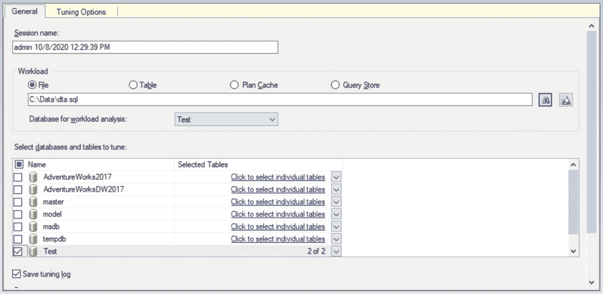

图 9-9 DTA 常规选项卡

“会话调整选项”包含非常重要的选择。对于本练习，我们将使用原始默认值，如图 9-10 所示。我稍后会解释最重要的部分。

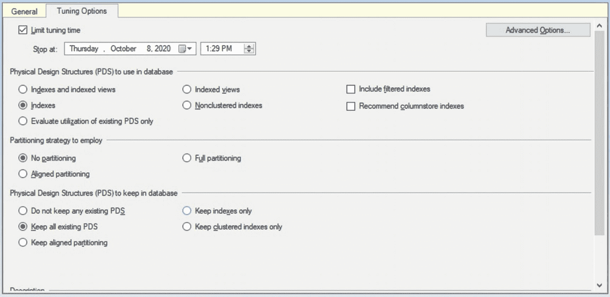

图 9-10 DTA 调整选项选项卡

默认选择将调整时间限制为一小时。接下来的三个选择允许你选择要在数据库中使用的物理设计结构、要使用的分区策略以及要在数据库中保留的物理设计结构。当你做出选择时，页面底部的描述将显示摘要。原始默认选择如下：

> 数据库引擎调整顾问将推荐聚集索引和非聚集索引以提高工作负载的性能。将不考虑分区策略。新推荐的结构将是非分区的。所有现有结构在调整过程结束时将在数据库中保持完整。

某些选择的组合可能是无效的，相反，你将收到消息“你选择的调整选项集无效”，并附有其无效的原因说明。在提供正确的选择之前，你将无法继续。

**注意**

DTA 会记住你选择的调整选项，这些选项将被视为任何未来会话的新默认值，直到再次更改。


从工具栏点击 `Start Analysis`。虽然计划的分析时间最长可达一小时，但对于本练习，分析应在几分钟内完成。随后将显示 `Progress` 选项卡，或者您可以选择该选项卡查看调优过程的进度。分析完成后，您可以使用 `Recommendations` 选项卡查看建议，或者使用 `Reports` 选项卡查看调优摘要和报告。`Recommendations` 选项卡的一部分内容（因篇幅过大无法在本书中完整呈现）如图 9-11 所示。

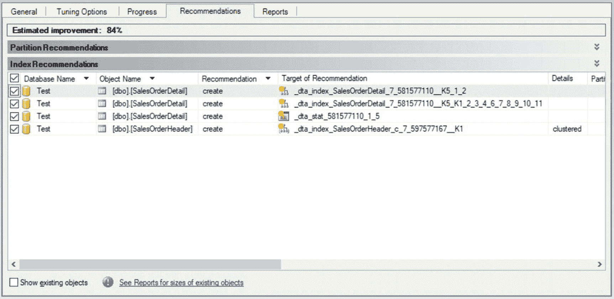

### 图 9-11
#### DTA 建议选项卡

`Recommendations` 选项卡显示诸如建议创建或删除的对象以及执行此类操作所需代码等信息。`Target of Recommendation` 列显示了将要创建的对象（在本例中），其中统计信息以 `_dta_stat` 开头，索引以 `_dta_index` 开头，视图以 `_dta_mv` 为前缀。建议选项卡的最后一列是 `Definition` 列，该列可点击，会显示创建建议对象的代码。以下是本练习中四个建议对象的代码。（代码按原样显示，因此不遵循本书其余部分的风格和格式。）

```sql
CREATE STATISTICS [_dta_stat_565577053_1_5] ON [dbo].SalesOrderDetail
CREATE NONCLUSTERED INDEX [_dta_index_SalesOrderDetail_9_565577053__K5_1_2] ON [dbo].[SalesOrderDetail]
(
[ProductID] ASC
)
INCLUDE ([SalesOrderID],
[SalesOrderDetailID]) WITH (SORT_IN_TEMPDB = OFF, DROP_EXISTING = OFF, ONLINE = OFF) ON [PRIMARY]
SET ANSI_PADDING ON
CREATE NONCLUSTERED INDEX [_dta_index_SalesOrderDetail_9_565577053__K5_K1_2_3_4_6_7_8_9_10_11] ON [dbo].[SalesOrderDetail]
(
[ProductID] ASC,
[SalesOrderID] ASC
)
INCLUDE ([SalesOrderDetailID],
[CarrierTrackingNumber],
[OrderQty],
[SpecialOfferID],
[UnitPrice],
[UnitPriceDiscount],
[LineTotal],
[rowguid],
[ModifiedDate]) WITH (SORT_IN_TEMPDB = OFF, DROP_EXISTING = OFF, ONLINE = OFF) ON [PRIMARY]
CREATE CLUSTERED INDEX [_dta_index_SalesOrderHeader_c_9_581577110__K1] ON [dbo].[SalesOrderHeader]
(
[SalesOrderID] ASC
)WITH (SORT_IN_TEMPDB = OFF, DROP_EXISTING = OFF, ONLINE = OFF) ON [PRIMARY]
```

让我们快速分析一下这些建议。与我们之前在缺失索引练习中得到的结果相比，我们看到建议略有不同，这主要是因为我们知道 `SalesOrderHeader` 和 `SalesOrderDetail` 是主从表，并且我们决定预先为其创建聚集索引。正如我们讨论过的，缺失索引功能无法建议聚集索引。本练习表明，仅使用默认设置，我们就获得了关于聚集索引、非聚集索引和统计信息的建议。

正如预期的那样，建议在 `SalesOrderHeader` 表上创建的聚集索引是我们提供的范围查询（即带有 `WHERE SalesOrderID BETWEEN 50000 AND 70000` 谓词的查询）的结果。我们还获得了几个非聚集索引和一个多列统计信息对象的建议。这些建议可能是个不错的选择，但它们与我们之前的练习并不匹配，因为我们手动在 `SalesOrderDetail` 上创建了一个聚集索引，而这是这些主从表原始设计的一部分。由于我们没有提供任何范围查询，因此没有建议为 `SalesOrderDetail` 创建聚集索引。显然，DTA 无法就其未知的信息提出建议，因此向其提供所有重要查询至关重要。同样值得注意的是，DTA 建议在 `SalesOrderID` 和 `ProductID` 上创建多列统计信息。多列统计信息永远不会由 SQL Server 自动创建。

如您所见，即使对于这个简单的练习，您也可能需要花费一些时间在测试环境中分析、评估和验证所提供的建议，但这绝对是在将其部署到生产实例之前必须做的工作。我必须再次强调，我们绝不能盲目实施这些建议。

`Reports` 选项卡显示了关于调优过程的大量有趣信息，包括包含调优信息的摘要以及 15 个不同的报告。DTA 中呈现的所有信息都存储在 `msdb` 数据库中，因此如果您有特殊需求，可以查看一下。这些信息存储在 `DTA_` 表中，并将一直保留，直到您删除 DTA 会话。

最后，如前所述，产品最新版本中引入了两个非常有用的 DTA 功能：您现在可以使用计划缓存和查询存储作为要分析的工作负载源，因此您根本不需要收集任何数据。这非常有意义，因为您最昂贵的查询很可能就在其中，正如我们在第 8 章通过 `sys.dm_exec_query_stats` DMV 或在第 6 章通过查询存储向您展示的那样。

让我们通过以下练习来看看这些功能。为了模拟计划缓存中的真实工作负载，您可以在 SQL Server Management Studio 中运行我们的测试查询，并在前面加上 `DBCC FREEPROCCACHE` 语句，该语句用于清除现有的计划缓存，如下所示：

```sql
DBCC FREEPROCCACHE
GO
SELECT * FROM SalesOrderHeader
WHERE SalesOrderID BETWEEN 50000 AND 70000
GO
SELECT * FROM SalesOrderDetail
WHERE ProductID = 898
GO
SELECT * FROM SalesOrderDetail
WHERE ProductID = 870
GO
SELECT SalesOrderID, SalesOrderDetailID, ProductID FROM SalesOrderDetail
WHERE ProductID = 870
GO
SELECT SalesOrderID, SalesOrderDetailID, ProductID, UnitPrice FROM SalesOrderDetail
WHERE ProductID = 870
GO
SELECT SalesOrderID, SalesOrderDetailID, ProductID FROM SalesOrderDetail
ORDER BY ProductID
GO
SELECT ProductID, COUNT(*) FROM SalesOrderDetail
GROUP BY ProductID
GO
SELECT * FROM SalesOrderDetail d
JOIN SalesOrderHeader h
ON d.SalesOrderID = h.SalesOrderID
WHERE ProductID = 898
GO
SELECT * FROM SalesOrderDetail d
JOIN SalesOrderHeader h
ON d.SalesOrderID = h.SalesOrderID
WHERE ProductID = 870
GO
```

查询执行后，它们很可能会进入计划缓存，然后您可以创建一个 DTA 会话，选择 `Plan Cache` 作为工作负载。当您调优计划缓存时，您并没有显式提交查询。因此，在调优会话结束时查看报告（例如 `Statement detail` 报告）以了解调优了哪些类型的查询就更加重要了。您可以如前所述在 `Reports` 选项卡上找到这些内容。在我的案例中，我得到了与之前文件练习相同的建议，但需要提醒的是，当您调优计划缓存时，您对要调优哪些查询的控制可能较少。

好奇 DTA 如何决定从计划缓存中调优哪些查询吗？您可以使用 SQL 跟踪或扩展事件查看 DTA 提交给数据库引擎的查询。这是我在测试中得到的结果，它显示 DTA 提交了以下查询，以根据持续时间找出最耗费资源的 1000 个查询：

```sql
select top 1000 isnull(st.objectid,0),
isnull(st.dbid,0), avg(cp.execution_count), st.text
from sys.dm_exec_query_stats cp
cross apply sys.dm_exec_sql_text(cp.plan_handle) st
where cp.creation_time < N'2016-08-08 03:47:06.273' and st.dbid in (9)
group by st.text,st.objectid,st.dbid
order by sum(total_elapsed_time) desc
```

您可以遵循完全相同的练习来改用 `Query Store`；只需确保此组件已启用并配置好。有关如何执行此操作的详细信息，请参阅第 6 章。


## 本章小结

本章介绍了 SQL Server 如何使用索引，以及为什么它们对于数据库应用程序的性能至关重要。索引对于 OLTP（联机事务处理）工作负载至关重要，因为它们允许你在可能很大的表中快速找到一行或少数几行。虽然使用此类索引通过代价较高的随机 I/O 提升了查找性能，但其使用范围仅限于少量行。索引还能提供一些其他好处，例如，无需执行代价高昂的排序操作即可提供有序数据，或通过覆盖查询提供所有需要的列，从而无需使用基表，减少了所需的数据库页数和逻辑读取次数。

本章还着重介绍了使用 SQL Server 工具来辅助创建索引，例如 `缺失索引` 功能以及更强大的 `数据库引擎优化顾问`。最后，也解释了索引的维护注意事项。索引虽有用，并不意味着你应该拥有大量索引，因为数据库引擎和用户维护操作都需要来保持索引的更新和碎片整理。

