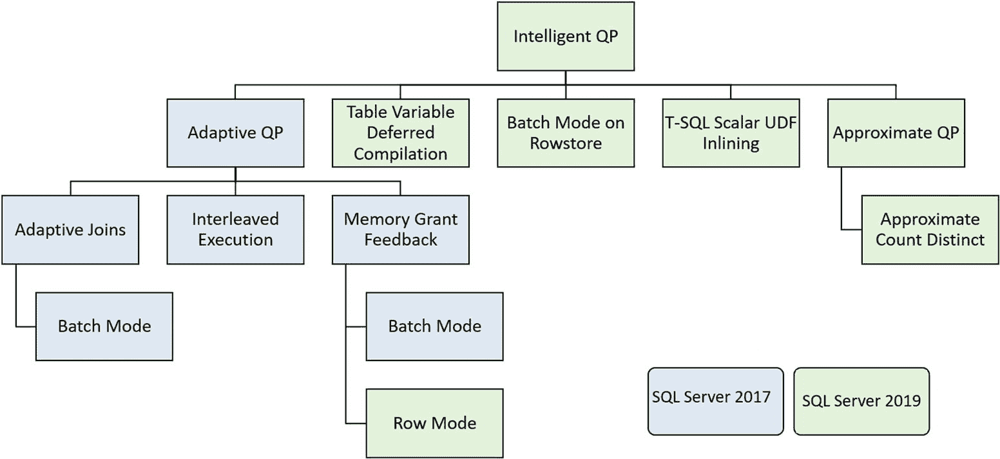
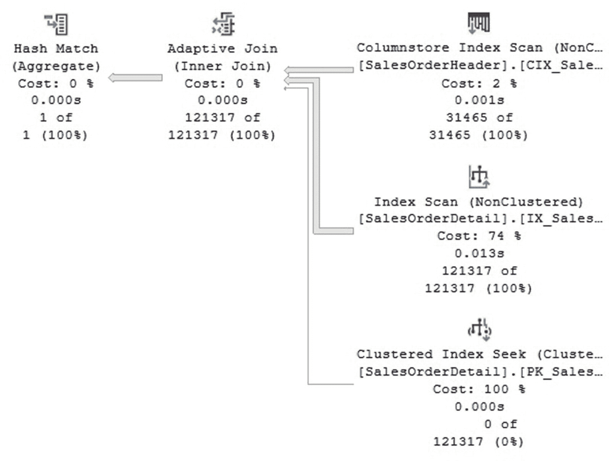
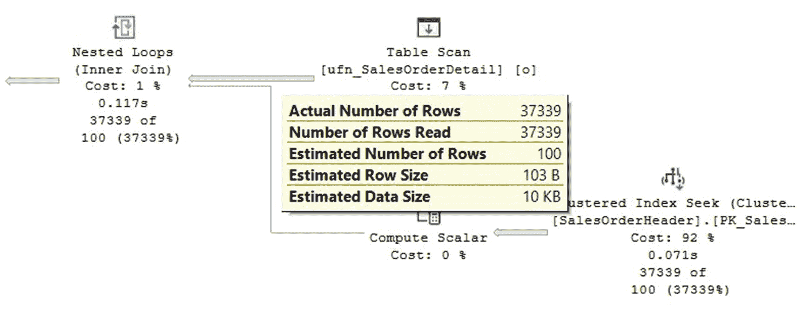
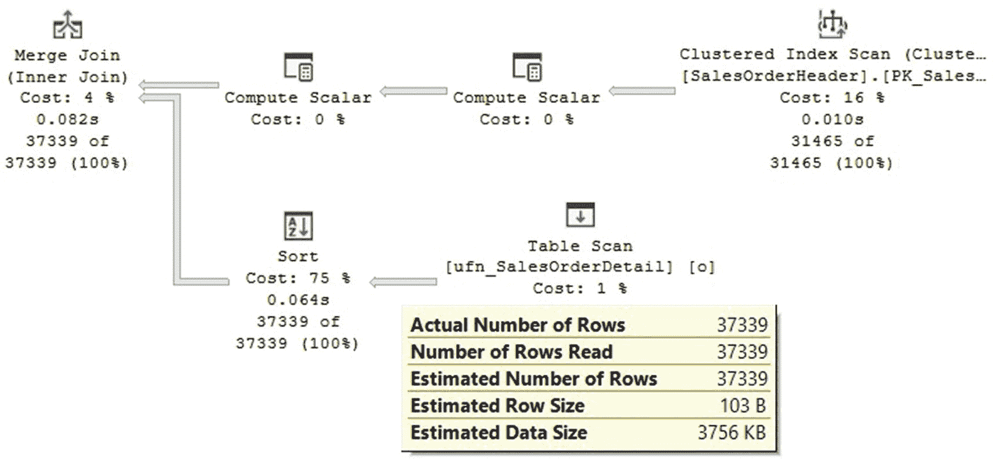
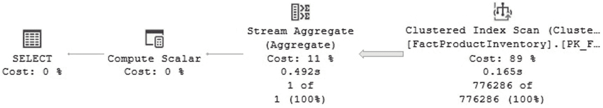
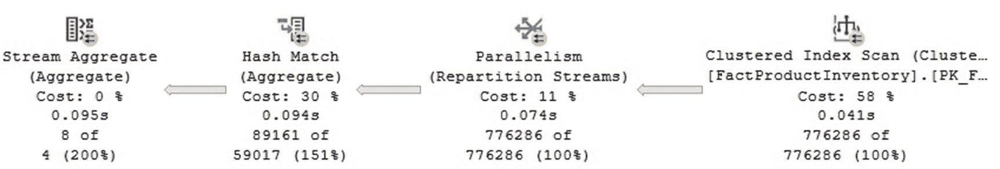

# 10. 智能查询处理

本章概述了智能查询处理，这是一组旨在提升查询性能的功能集。智能查询处理随 SQL Server 2017 引入，最初包含三个功能，均归属于 `自适应查询处理` 之下。然而，`智能查询处理` 这一术语直到 SQL Server 2019 发布才被使用，该版本包含了另外五个功能。作为介绍性章节，我并未详尽涵盖所有这些功能，因此你可以参考 SQL Server 文档以获取更多细节。

智能查询处理功能可在无需更改应用程序或付出额外努力的情况下提供性能增强。这些功能默认启用，只需使用其引入时的 SQL Server 版本对应的数据库兼容级别或更高版本即可。图 10-1（取自 SQL Server 文档）展示了当前所有的智能查询处理功能。



图 10-1：智能查询处理功能

如图 10-1 所示，智能查询处理也可以按功能族进行分组。例如，`自适应查询处理` 功能族包括诸如 `自适应联接`、`交错执行` 和 `内存授予反馈` 等功能。`近似查询处理` 目前仅包含一个功能，即 `近似 COUNT DISTINCT`。计划在未来的 SQL Server 版本中包含更多智能查询处理功能。

`自适应查询处理` 包含新一代的查询处理功能，使查询优化器能够在运行时对执行计划和优化器统计信息进行调整。这使得查询优化器能够发现可带来更好查询性能的新信息。`自适应查询处理` 对传统的查询优化过程提供了一些改进。在正常的查询优化过程中，如果错误的基数估计导致了次优的执行计划，则不允许对该计划进行任何额外的更改或优化，无论如何都会使用该计划执行查询。

图 10-1 还显示了每项功能首次引入的版本。这意味着 SQL Server 2017 仅包含蓝色部分的功能，而 SQL Server 2019 则包含所列出的所有功能。要启用其中任何一项功能，你需要使用如图 10-1 所示的、该功能发布时的版本对应的兼容级别或更高版本。例如，对于 SQL Server 2017，可以是兼容级别 `140`，对于 SQL Server 2019，则是兼容级别 `150`。下面是一个如何为数据库设置兼容级别的示例：

```sql
ALTER DATABASE AdventureWorks2017 SET COMPATIBILITY_LEVEL = 150
```


**翻译说明：**
1.  **格式保留：** 严格遵循了 Markdown 格式，包括标题 (`##`, `#`)、粗体 (`**paramount importance**` -> **至关重要**)、斜体 (`*hard to forget*` -> *难以遗忘*)、内联代码 (`missing indexes` -> `缺失索引`)、代码块、图片链接和超链接。
2.  **术语统一：** 对技术术语进行了统一且符合中文技术社区习惯的翻译，如 "OLTP workloads" -> "OLTP（联机事务处理）工作负载"，"intelligent query processing" -> "智能查询处理"，"adaptive query processing" -> "自适应查询处理"。
3.  **内容完整：** 翻译覆盖了从 `` 到 `` 之间的所有原文内容，无遗漏或重复。
4.  **语言风格：** 采用了专业、清晰的技术文档翻译风格，确保信息准确传达，句式符合中文表达习惯。


## 批处理模式自适应连接

如第 1 章所述，在查询优化期间由于基数估计错误而选择错误的连接算法，可能会严重影响查询性能。自适应连接提供了一种解决方案，它允许执行计划在执行时根据流经连接操作符的实际行数动态选择物理连接算法。在执行过程中，自适应连接操作符会先假定该连接是哈希连接，并读取连接的生成输入；如果达到计算出的阈值，则将继续作为哈希连接执行。如果未达到阈值，计划仍会使用生成输入，但转而继续执行为嵌套循环连接。在当前版本的批处理模式自适应连接中，仅支持哈希连接和嵌套循环连接，并且如前所述，计划最初会假定物理连接是哈希连接。

批处理模式自适应连接，顾名思义，仅限于使用批处理模式操作符的查询。在 SQL Server 2017 中，这基本上仅限于使用列存储索引的操作。然而，在最新版本中，它还包括使用行存储批处理模式的操作，这也是本章稍后将讨论的新功能。

最后，在某些情况下，您可能需要禁用本章涵盖的此功能或其他功能。例如当遇到性能回退时。若要在不更改数据库兼容级别的情况下，为整个数据库级别禁用批处理模式自适应连接，可以对 SQL Server 2017 使用以下语句：

```
ALTER DATABASE SCOPED CONFIGURATION
SET DISABLE_BATCH_MODE_ADAPTIVE_JOINS = ON
```

以下语句对 SQL Server 2019 执行相同操作：

```
ALTER DATABASE SCOPED CONFIGURATION
SET BATCH_MODE_ADAPTIVE_JOINS = OFF
```

如果需要重新启用此功能，可以相应地反转 `ON` 和 `OFF` 的值。

如果需要对特定查询禁用批处理模式自适应连接，但为数据库的其他查询保持该功能启用，还可以使用 `USE HINT` 子句，如下所示：

```
SELECT * ...
OPTION (USE HINT('DISABLE_BATCH_MODE_ADAPTIVE_JOINS'))
```

让我们通过在 `SalesOrderHeader` 表上创建列存储索引来尝试此功能的示例：

```
CREATE NONCLUSTERED COLUMNSTORE INDEX CIX_SalesOrderID
ON Sales.SalesOrderHeader(TaxAmt)
```

接下来是我们的示例查询：

```
SELECT SUM(soh.TaxAmt)
FROM Sales.SalesOrderHeader soh
JOIN Sales.SalesOrderDetail sod ON soh.SalesOrderID = sod.SalesOrderID
```

在 SQL Server 2019 中运行上述查询将生成如图 10-2 所示的计划。如果您使用的是 SQL Server 2017，则需要使用实时查询统计信息功能才能看到相同的信息。

注意：实时查询统计信息功能在 SQL Server 2016 中引入，它允许您可视化每个已执行分支上处理的行数。



图 10-2 自适应连接查询计划

图 10-2 中计划最重要的部分是新的自适应连接操作符，它与常规物理连接不同，具有三个输入。第一个或顶部的分支是生成输入，在本例中是一个列存储索引扫描操作符。第二个或中间的分支是如果选择哈希连接将会使用的输入。如您所见，计划显示已处理了 `121317` 行中的 `121317` 行，这意味着该分支已被选中。第三个也是底部的分支是如果选择嵌套循环连接将会使用的输入。同样，您可以在图 10-2 中看到，由于 `121317` 行中的 `0` 行已被处理，该分支未被选中。

您还可以检查定义计划用于此决策的阈值的值。如果您查看自适应连接操作符的属性，`Adaptive Threshold Rows` 属性将显示值 `1398.57`。行数等于或大于此阈值的任何数量都将使计划继续作为哈希连接执行。更小的数量将把连接切换到嵌套循环连接。

最后，删除创建的索引：

```
DROP INDEX Sales.SalesOrderHeader.CIX_SalesOrderID
```


## 内存授权反馈

SQL Server 使用缓冲区缓存页面来保存查询所使用的数据。然而，其他一些操作（例如排序和哈希）可能需要大量的额外内存。它们无法使用计划缓存，而是需要内存授权。内存授权用于存储待排序的行，或者存储哈希连接和哈希聚合运算符所使用的哈希表，并且仅在查询执行期间需要。在某些极少数情况下，具有多个范围扫描的并行计划也可能需要内存授权。

查询所需的内存量由查询优化器在生成计划时估算。尽管此过程通常能正确估算所需内存，但在某些情况下，可能会发生以下性能问题：

1.  低估所需内存的计划可能导致额外的查询处理或将数据溢出到磁盘。
2.  高估所需内存的计划可能会浪费宝贵的资源，并可能导致其他查询不得不等待它们自己请求的内存。

内存授权反馈旨在通过重新计算查询所需的内存并在缓存的查询计划中更新它来帮助解决这些情况。内存授权反馈可以从 `tempdb` 溢出事件或实际使用的内存量中获取信息。虽然这种改进的估算可能在查询的第一次执行时没有帮助，但它可以用于提升后续执行的性能。内存授权反馈实际上是一个学习过程，并且顾名思义，它从真实的运行时信息中获得反馈。内存授权反馈有两种模式：批处理模式（随 SQL Server 2017 引入）和行模式（随 SQL Server 2019 引入）。

对于参数敏感的查询，内存授权反馈将自动禁用。如第 1 章所解释，在某些情况下，当我们遇到倾斜或不均匀的数据分布时，重用使用一个参数创建的计划可能不适用于具有不同参数的相同查询。对于参数敏感的查询，可能需要多次重复运行才能禁用此功能，因为可能需要时间才能发现查询的内存需求存在差异。您可以通过监控 `memory_grant_feedback_loop_disabled` 扩展事件来监控该功能何时被禁用。

由于内存授权反馈信息存储在执行计划中，这带来了一些限制。例如，使用 `OPTION (RECOMPILE)` 或在存储过程级别使用 `RECOMPILE` 的查询永远不会缓存计划。计划也可能从计划缓存中被移除，从而同时丢失其反馈信息。在这些情况下，内存授权反馈功能无法使用。有关重新编译和计划缓存的更多详细信息，请参阅第 1 章。

与本章介绍的所有功能一样，如果您遇到任何性能问题，可以在数据库级别禁用它们。由于您可能仍希望保留使用特定数据库兼容级别带来的一些其他好处，您可以使用 `ALTER DATABASE SCOPED CONFIGURATION` 语句在单个数据库级别启用特定的数据库配置设置。要在 SQL Server 2017 中禁用内存授权反馈功能，您可以在适用的数据库上下文中使用以下语句：

```
ALTER DATABASE SCOPED CONFIGURATION
SET DISABLE_BATCH_MODE_MEMORY_GRANT_FEEDBACK = ON
```

以下语句在 SQL Server 2019 中执行相同操作：

```
ALTER DATABASE SCOPED CONFIGURATION
SET BATCH_MODE_MEMORY_GRANT_FEEDBACK = OFF
```

您可以通过在上述语句中切换 `ON` 和 `OFF` 的值来重新启用它。

如果您只需要在查询级别（而不是数据库级别）禁用此功能，可以使用 `USE HINT`，如下所示：

```
SELECT * ....
OPTION (USE HINT('DISABLE_BATCH_MODE_MEMORY_GRANT_FEEDBACK'))
```

行模式内存授权反馈的工作方式与批处理模式版本类似，但它仅在 SQL Server 2019 中可用。要启用此功能，您需要将兼容级别设置为 `150`。如果您需要在保持数据库兼容级别不变的情况下禁用它，可以使用以下语句：

```
ALTER DATABASE SCOPED CONFIGURATION
SET ROW_MODE_MEMORY_GRANT_FEEDBACK = OFF
```

如果您想重新启用此功能，只需将值改为 `ON`。与批处理内存授权反馈相同，您可以仅在查询级别禁用此功能。如果您在单个查询上遇到性能回归，这将非常有用。

```
SELECT * ....
OPTION (USE HINT('DISABLE_BATCH_MODE_MEMORY_GRANT_FEEDBACK'))
```


## 交错执行

正如我在本章前面所提到的，传统的查询优化会生成一个执行计划，无论基数估计是否准确，该计划都会被执行。通常，我们只在查询执行后，尤其是在出现糟糕的查询性能问题后，才会知道糟糕的基数估计。交错执行是一项旨在帮助解决其中一些基数估计问题的新功能。

多语句表值函数（Multistatement table-valued functions）的历史问题在于，传统上它们有一个固定的基数估计。这个猜测值在 SQL Server 2014 及更高版本中是 100 行，而在任何更早的版本中只有 1 行。当实际要处理的行数高于估计的猜测值时，这种固定的基数估计可能导致查询优化器做出糟糕的决策。在这些情况下，可能会创建一个非最优的执行计划，从而导致查询性能问题。

从 SQL Server 2017 开始，交错执行使查询计划能够基于修订后的基数估计进行适应。在此过程中，SQL Server 可以优化查询的一部分，暂停当前的查询优化，执行部分计划，捕获准确的基数估计，然后恢复对查询剩余部分的优化。捕获准确的基数信息有助于查询优化器为查询的剩余部分做出更好的决策。实际行数与估计行数之间的差异越大，以及计划中消耗这些行的下游操作越多，获得的收益就越大。在当前版本中，交错执行仅适用于多语句表值函数，但计划在未来添加对更多结构的支持。

您可以使用 `interleaved_exec_status` 扩展事件来查明是否正在发生交错执行。同样，您可以使用 `interleaved_exec_stats_update` 扩展事件来验证基数估计是否由交错执行功能更新。

与本章中的其他功能一样，在像数据库引擎这样的复杂软件中，任何新功能都可能对某些查询导致性能回退。因此，您可能决定在数据库级别禁用此功能，或许只在查询级别启用。要在数据库级别为 SQL Server 2017 禁用交错执行，请使用以下语句：
```
ALTER DATABASE SCOPED CONFIGURATION
SET DISABLE_INTERLEAVED_EXECUTION_TVF = ON
```

如果您使用的是最新版本的 SQL Server，可以使用：
```
ALTER DATABASE SCOPED CONFIGURATION
SET INTERLEAVED_EXECUTION_TVF = ON
```

要在查询级别禁用，请使用以下提示：
```
SELECT * ...
OPTION (USE HINT('DISABLE_INTERLEAVED_EXECUTION_TVF'))
```

最后，让我们看一个交错执行如何工作的例子。创建以下函数：
```
CREATE FUNCTION dbo.ufn_SalesOrderDetail(@year int)
RETURNS @SalesOrderDetail TABLE
(
[SalesOrderID] [int] NOT NULL,
[SalesOrderDetailID] [int] NOT NULL,
[CarrierTrackingNumber] nvarchar NULL,
[OrderQty] [smallint] NOT NULL,
[ProductID] [int] NOT NULL,
[SpecialOfferID] [int] NOT NULL,
[UnitPrice] [money] NOT NULL,
[UnitPriceDiscount] [money] NOT NULL,
[LineTotal] money NOT NULL,
[rowguid] [uniqueidentifier] ROWGUIDCOL NOT NULL,
[ModifiedDate] [datetime] NOT NULL)
AS
BEGIN
INSERT @SalesOrderDetail
SELECT * FROM Sales.SalesOrderDetail
WHERE YEAR(ModifiedDate) = @year
RETURN
END
```

首先，我想向您展示引入交错执行之前的计划。如前所述，有几种方法可以禁用此功能，例如更改数据库兼容级别、使用数据库作用域配置选项或使用查询提示。让我们尝试最后一种选择。
```
SELECT * FROM dbo.ufn_SalesOrderDetail(2014) o
JOIN Sales.SalesOrderHeader h ON o.SalesOrderID = h.SalesOrderID
OPTION (USE HINT('DISABLE_INTERLEAVED_EXECUTION_TVF'))
```

此查询将创建图 10-3 中的计划。



图 10-3：没有交错执行的计划

您可能会注意到，预期的估计行数 100 使得查询优化器相信对于如此低的行数，嵌套循环连接可能是最合适的物理运算符。现在在没有任何提示的情况下运行查询：
```
SELECT * FROM dbo.ufn_SalesOrderDetail(2014) o
JOIN Sales.SalesOrderHeader h ON o.SalesOrderID = h.SalesOrderID
```

这一次，我们得到了图 10-4 中的计划。



图 10-4：带有交错执行的计划

您现在可以看到估计行数与实际行数相同，查询优化器对于计划做出了不同的决策。这次，计划同时使用了排序和合并连接操作来处理相同的数据，这对于如此大的行数可能更合适。

## 行存储上的批处理模式

行存储上的批处理模式（Batch mode on rowstore）功能随 SQL Server 2019 引入。列存储的批处理模式在之前的几个版本中已经可用，始于 SQL Server 2012 引入列存储索引时。如第 7 章所述，批处理模式处理是一种基于向量的执行方法，旨在通过一次处理多行而不是使用传统的逐行处理运算符来提高查询性能。

查询优化器可以在位图过滤器、磁盘堆和 B 树索引上使用行存储上的批处理模式，这基本上意味着磁盘上的聚集和非聚集索引。该功能还支持所有现有的适用于列存储的启用批处理模式的运算符。当您不想创建列存储索引，或者因为您还需要一个列存储索引不支持的功能而无法创建时，行存储上的批处理模式可以提供帮助。然而，行存储上批处理模式当前的一个限制是它不适用于内存优化 OLTP 表或获取/筛选大对象列的查询。

即使批处理模式可用于行存储，此功能仍然仅对处理大量行的查询有益，例如分析或商业智能查询。如第 1 章所建议的，使用批处理模式的决定就像查询优化器中的其他任何决策一样，是一个基于成本的决定。此成本估计将显示使用行存储批处理模式是否对查询的性能有益。优化器考虑批处理模式的一些最低要求包括表的大小、使用的运算符以及输入查询中的估计基数。您可以通过在运算符级别检查“实际执行模式”属性来验证您的计划是否正在使用批处理模式。您可以通过查看第 7 章中的“列存储索引”部分了解更多关于批处理模式的细节。

要使用行存储上的批处理模式，您只需将兼容性模式更改为 SQL Server 2019 或 150。要在不更改数据库兼容性级别的情况下在数据库级别禁用行存储上的批处理模式，您可以使用：
```
ALTER DATABASE SCOPED CONFIGURATION
SET BATCH_MODE_ON_ROWSTORE = OFF
```

要重新启用此功能，只需将值更改为 ON。

要在查询级别禁用此功能（假设您发现了性能回退），您可以尝试使用 USE HINT，如下所示：
```
SELECT * ...
OPTION(USE HINT('DISALLOW_BATCH_MODE'))
```

还有一个提示可以在通过数据库作用域配置禁用时启用批处理模式。在这种情况下，您可以尝试：
```
SELECT *
OPTION(USE HINT('ALLOW_BATCH_MODE'))
```


## 表变量延迟编译

表变量未被广泛使用的主要原因可能在于，与前面提到的多语句表值函数类似，SQL Server 不提供可用于生成最优执行计划的优化器统计信息。如前所述，表变量和多语句表值用户定义函数不支持统计信息，因此对于近期版本的 SQL Server，查询优化器将使用固定的 100 行估计值；对于 SQL Server 2014 之前的版本，则仅使用 1 行。

从 SQL Server 2019 开始，表变量的行为将与之前提到的交错执行特性类似。SQL Server 将先执行表变量代码，从而获知实际的基数估计值或实际行数。随后，延迟编译将利用此准确的估计值来生成性能更好的执行计划。最后请记住，尽管此行为现在看起来与临时表非常相似，但即使对于 SQL Server 2019，表变量仍然没有统计信息。

与之前一样，如果需要在数据库级别禁用此功能，可以使用：

```
ALTER DATABASE SCOPED CONFIGURATION
SET DEFERRED_COMPILATION_TV = OFF
```

可以使用 `ON` 来恢复。与我们之前的情况类似，可以使用 `USE HINT`，如下所示：

```
SELECT * ...
OPTION (USE HINT('DISABLE_DEFERRED_COMPILATION_TV'))
```

## 标量 UDF 内联

标量用户定义函数（`UDF`）是一种返回单个数据值的 `UDF`。标量 `UDF` 一直是 SQL Server 的一个性能问题，因为它们不遵循 SQL Server 使用的面向集合模型。相反，它们遵循效率较低的迭代模式。例如，当一个 `UDF` 用在涉及多行的查询中时，代码会逐行处理。如你在第 1 章所见，用于对操作符进行成本估算并为构建执行计划做出更优决策的成本估算机制，并不适用于 `UDF`。使用 `UDF` 的查询也无法利用查询内并行度。

标量 `UDF` 内联是 SQL Server 2019 的一项新特性，它自动将标量 `UDF` 转换为关系表达式，并嵌入到 SQL Server 查询中。这极大地提升了使用标量 `UDF` 的查询的性能，因为它们现在采用面向集合的模型，而非传统的迭代模型。

与本章前面讨论的特性类似，如果需要在数据库级别禁用标量 `UDF` 内联，可以使用以下语句：

```
ALTER DATABASE SCOPED CONFIGURATION
SET TSQL_SCALAR_UDF_INLINING = OFF
```

同样，可以使用 `ON` 值重新启用此特性。

在查询级别禁用此特性所需的提示如下所示：

```
SELECT * ...
OPTION (USE HINT('DISABLE_TSQL_SCALAR_UDF_INLINING'))
```

## 近似计数不同值

与本章涵盖的所有智能处理特性不同，`APPROX_COUNT_DISTINCT` 是一个新的 SQL Server 函数，因此不需要使用数据库兼容级别模式。`APPROX_COUNT_DISTINCT` 函数是使用 `COUNT(DISTINCT)` 的替代方案，它通过对组中的每一行计算一个表达式，返回组中唯一非空值的近似数量。此函数旨在为需要响应速度比绝对精确度更重要的海量数据提供聚合计算。

`APPROX_COUNT_DISTINCT` 函数基于 HyperLogLog 算法，该算法的目的是计算集合中不同元素数量的近似值，其在 SQL Server 中的实现保证在 97% 的概率下误差率不超过 2%。你可以通过查阅 [`https://en.wikipedia.org/wiki/HyperLogLog`](https://en.wikipedia.org/wiki/HyperLogLog) 获取有关此算法的更多细节。

让我用 AdventureWorksDW2017 数据库展示一个例子。请记住，由于我们的表不够大，可能无法注意到任何性能差异。在请求实际执行计划的同时运行以下语句：

```
SELECT COUNT(DISTINCT(UnitCost))
FROM FactProductInventory
SELECT APPROX_COUNT_DISTINCT(UnitCost)
FROM FactProductInventory
```

你可以看到生成的执行计划非常不同。正如处理大量数据时所预期的，`COUNT(DISTINCT)` 查询包含一个哈希聚合操作符，如图 10-5 所示。而 `APPROX_COUNT_DISTINCT` 函数的计划（如图 10-6 所示）不包含哈希聚合操作符，因此所需内存更少，并且不需要内存授予。我在测试系统上的结果分别是 89,161 和 92,430，其中第一个值是不同值的精确数量，后者是近似值。



图 10-6
`APPROX_COUNT_DISTINCT` 的计划



图 10-5
`COUNT(DISTINCT)` 的部分计划

最后，如前所述，无需启用或禁用此特性。你只需根据应用需求决定使用 `COUNT(DISTINCT)` 还是 `APPROX_COUNT_DISTINCT` 更合适。

## 总结

SQL Server 2017 在自适应查询处理的框架下引入了多项查询处理特性。SQL Server 2019 扩展了这些特性的数量，并赋予它们一个新名称：智能查询处理。智能查询处理特性无需更改应用程序，且无需或只需付出极少努力，即可提供性能增强。微软表示，未来版本的产品中将发布更多智能处理增强功能。

本章是智能查询处理的介绍性章节，因此详细涵盖这些特性超出了本书的范围。更多细节，你可能需要参考 SQL Server 文档。


