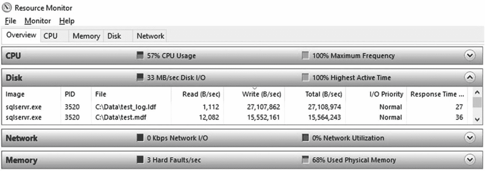
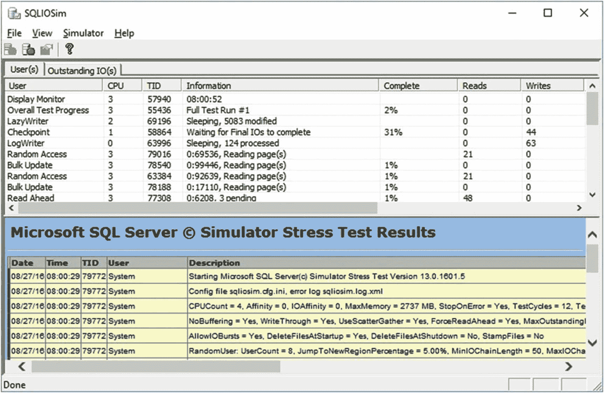
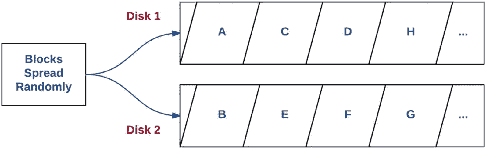
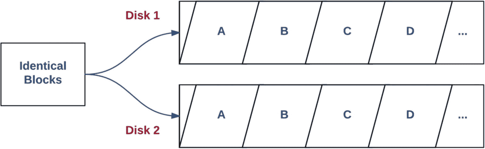
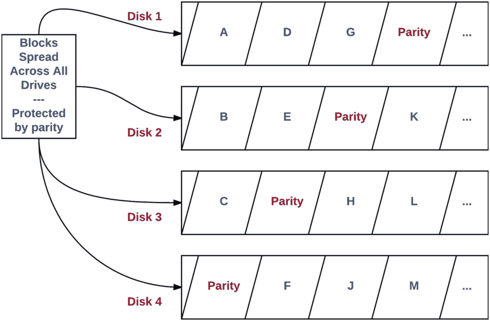
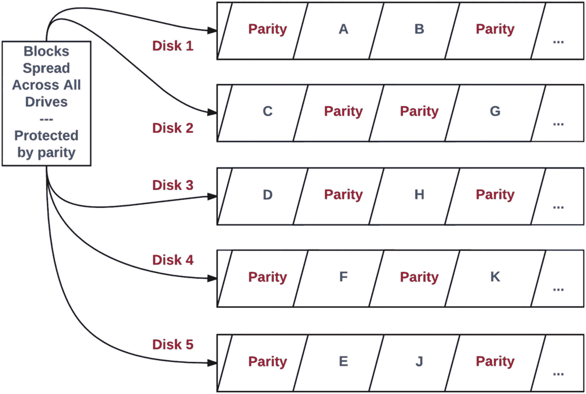
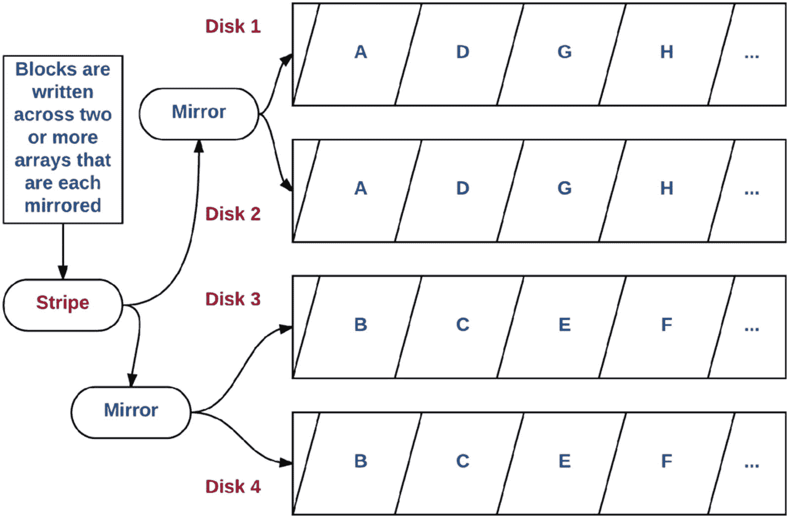

# 11. SQL Server 存储

本章将从 SQL Server 的视角来探讨存储。虽然在选择配置存储时，可用性与可恢复性等因素也至关重要，但我们主要关注性能方面。磁盘传统上是数据库系统中最慢的组件，因此为性能优化存储至关重要，通常涉及两个高层领域：直接调优存储，以及调优组件以高效利用存储。前者指的是对存储硬件本身进行调优和配置，而后者则涉及调整系统的其他组件，以优化存储的使用，包括诸如正确配置 SQL Server 和创建合适的索引等事项。

到目前为止，本书中讨论的所有主题主要涉及 SQL Server 数据库专业人员，包括数据库开发人员、数据库管理员和数据库架构师等角色。但在生产环境中实现高性能应用程序总是涉及公司内的其他角色，有时甚至是不同的团队。对于存储而言，这一点尤为真实。

我依然记得过去的日子，那时我与 Windows 管理员一起，使用 `RAID` 1、5 或 10 为我们的服务器配置驱动器。随着存储——尤其是企业级存储——变得越来越复杂，其调优和管理通常会超出 SQL Server 数据库专业人员的职责范围，甚至很可能落在不同的团队身上。

无论公司内的职责如何划分，存储对 SQL Server 专业人员来说不必是一个黑盒。因此，理解存储的工作原理，并向存储团队正确传达数据库需求至关重要。性能不仅关乎初始配置，还包括持续的监控和故障排除，所以这应该是一个迭代的过程。事实上，与负责应用程序其余部分（无论是操作系统、应用服务器、Web 服务器还是硬件本身）的团队保持良好沟通也是如此。

在硬件趋势方面，正如我们在第 7 章中提到的，关系数据库最初是基于 1970 年代可用的硬件架构设计的。当时内存容量有限，关系数据库的设计基于无法将全部数据装入内存这一事实，仅在需要时从磁盘读取数据，并创建缓冲区管理器将最常用的数据保留在内存中。尽管处理器和内存速度以及内存和磁盘容量已大幅提升，但磁盘访问速度并未同步提高，导致磁盘访问时间与处理器、内存处理时间之间存在巨大差距。受限于移动机械部件，磁盘传统上一直是数据库系统中最慢的组件（或者如已故的 Jim Gray 有时所描述的，“磁盘是新的磁带”）。

数据量增大、高可用性要求和虚拟化等新趋势给数据库系统带来了额外的要求。我依然记得几十 GB 大小被认为是大型数据库的日子，但现在数据库大小已以 TB 计量，甚至 PB 级别也已常见。数据现在还要求 7*24 小时可用（讽刺的是，我最初写下这段话时，正值达美航空的一次重大中断，导致其业务运营停摆数天）。数据可用性，甚至更糟的数据丢失，会严重影响业务。虚拟化和云服务是另一个重要趋势，越来越多的高性能和关键任务应用程序正迁移到 Amazon AWS 或 Microsoft Azure 等服务上。

幸运的是，也有新技术来应对这些新趋势和苛刻的要求。随着基于闪存的存储成本持续下降，闪存驱动器预计将在数据中心逐步取代基于主轴的磁盘，成为主要存储的企业实际标准。但由于关系数据库引擎仍在使用 1970 年代定义的相同架构，有人建议开发新的查询处理算法来利用这种更快的存储。此外，由于许多数据库现在可以装入内存，诸如内存数据库等新技术正在被开发和实施。SQL Server 融入了这些技术，它们将在第 7 章中介绍。

如前所述，优化存储的第二部分在于您的数据库内部。很多时候，看似是存储问题或存储性能难以跟上需求的问题，可以在 SQL Server 内部解决。我们将在本书的其余部分介绍许多此类技术。例如，当存储无法满足工作负载需求时，可以通过创建合适的索引、正确配置 SQL Server 和 `tempdb`，或利用新的内存中技术（如 `In-Memory OLTP` 或 `列存储` 索引）来解决问题。随着闪存驱动器取代基于主轴的磁盘，一个误区很快出现，认为优化数据库和代码不再重要。事实绝非如此。

最后，在选择和评估存储解决方案时，除了性能，还需要考虑可靠性、可用性等其他重要因素。诸如 `RAID`（独立磁盘冗余阵列）的冗余选择，或高可用性与灾难恢复解决方案，如 `Windows 故障转移群集` 或 `SQL Server Always On 可用性组`，通常会在关键任务应用程序中实施。


## 存储类型

虽然本书不涉及 SQL Server 常用存储的详细内容，但我认为它们通常可分为以下几类（除非另有说明，否则各类均可使用传统的基于盘片的磁盘、闪存盘存储或混合存储）：

1.  存储区域网络（`SAN`）：提供对整合存储访问的专用网络。这是关键任务应用最常见的存储形式。

2.  基于 PCI Express（`PCIe`）的固态硬盘（`SSD`）：这是通过此总线标准连接的闪存盘存储。

3.  内部存储：使用服务器托架上的传统存储驱动器，如串行连接 SCSI（`SAS`）或串行 ATA（`SATA`）。

4.  直连存储（`DAS`）：直接连接到服务器的存储，而非内部存储或通过网络访问的存储。`DAS` 可以是通常通过主机总线适配器（`HBA`）连接到服务器的 `SAS`/`SATA` 驱动器。

5.  文件共享/服务器：可用于 SQL Server 数据库的文件服务器，例如服务器消息块（`SMB`）文件服务器。`SMB` 文件共享也可用于 Windows 故障转移群集安装。详见 [`https://msdn.microsoft.com/en-us/library/hh759341.aspx`](https://msdn.microsoft.com/en-us/library/hh759341.aspx)。

虽然我曾将这些存储类型用于 SQL Server 实施，但在我职业生涯中见过的大多数关键任务或高性能应用程序都使用某种 `SAN` 存储。`SAN` 存储种类繁多，范围从传统的基于盘片的磁盘到全闪存盘存储或混合存储。`SAN` 存储解决方案还提供与 SQL Server 中类似的功能，如快照、复制和压缩，尽管在某些情况下这些功能可以与 SQL Server 的功能互补。在其他情况下，它们可能执行相同的功能，并在启用时争夺资源，因此务必与存储管理员一起审查这些选项以及哪些选项可能有益于实施。再次强调，与存储管理员密切合作对于定义应用程序的数据库和存储架构至关重要。

使用 `SAN` 存储还有其他优势，例如提供传统故障转移群集所需的共享存储。`SAN` 允许 SQL Server 群集的节点访问相同的存储卷，并在节点之间移动存储。但一次只有一个节点可以访问该卷。

最后，其他一些高可用性或灾难恢复解决方案，如日益普及的 Always On 可用性组，或目前已弃用的数据库镜像技术，可以与任何类型的存储配合工作。可用性组和数据库镜像的工作方式类似，都在数据库级别以同步或异步方式复制数据。数据库镜像仅支持单个辅助副本，而可用性组可以有多个副本或辅助副本（但仅在 SQL Server 企业版中）。可用性组的一种形式，称为基本可用性组，可在 SQL Server 标准版上使用，以实现针对单个数据库的故障转移环境解决方案。

## 基于闪存的存储

随着基于闪存的存储成本持续下降，闪存驱动器有望逐渐取代数据中心中基于盘片的磁盘，成为主要存储的事实上的企业标准。闪存存储已经出现了一段时间。但正如其他流行技术所经历的那样，最初的大规模采用可能比较缓慢，因为有时技术要么最初价格过高，要么需要时间才能成熟。

与闪存（一种非易失性半导体技术，没有移动机械部件）相比，基于盘片的机电磁盘包含旋转盘片和可移动的读写头。闪存用于随机 I/O 读取时比磁盘快许多倍，尽管对于顺序读取，尤其是写入，性能提升较为一般。它们的性能和价格比较取决于闪存驱动器的类型，范围从消费级如 `TLC`（三层单元）或 `MLC`（消费级多层单元）到企业级存储如 `EMLC`（企业级多层单元）或 `SLC`（单层单元），尽管在最佳情况下已报告有亚毫秒级延迟。

由于这些性能特性，对于具有大量随机 I/O 读取请求的应用程序（例如使用 OLTP 数据库的应用程序），闪存可能是一个绝佳的选择。具有大量顺序读取的数据仓库工作负载受益较少。闪存的另一个限制是它具有有限的可写次数，称为编程-擦除周期，这可能引入错误和故障，影响存储寿命。同样，错误的概率取决于闪存的类型，从消费级到企业级逐级降低。

最后，当闪存驱动器最初问世时，其速度引发了一些神话，表明使用这种存储后不再需要查询优化（例如，无需担心索引调整、碎片整理或其他优化）。我甚至记得直接从供应商那里听到过这些说法。现实情况是，即使闪存提高了磁盘访问性能，特别是对于随机 I/O，所有这些优化和配置仍然是必需的并且强烈建议进行。特别是当瓶颈存在于其他地方时，因为除非该瓶颈被解决，否则闪存驱动器的性能不会充分发挥。

## 数据库配置

了解您的 I/O 工作负载以及数据库如何使用磁盘，对于专注于性能的高效设计至关重要。请务必进行此项研究，并向存储管理员提供所需信息，以便相应地配置磁盘。有时，I/O 工作负载可能难以提前估算。很容易说 OLTP 数据库只会使用随机磁盘 I/O，但我尚未见到纯粹的 OLTP 工作负载。OLTP 系统通常包含一些报表查询、运行聚合的查询，甚至与业务相关的批处理作业。此外，OLTP 系统还需要数据库维护活动，如数据库备份、数据库完整性检查、索引重建和重组、统计信息更新等，这些活动需要顺序磁盘 I/O 读取。另一方面，报表工作负载和数据仓库数据库主要为顺序 I/O，以读取为主，另外还有定期更新数据库中数据的 ETL 作业。最后，正如第 7 章所涵盖的，随着可更新的非聚集列存储索引的引入，现在也可以在 OLTP 系统上运行分析工作负载，从而创建随机和顺序 I/O 相结合的工作负载。


### 数据库文件

数据库文件的放置仍然至关重要。传统上，一项最佳实践是将数据文件、事务日志文件和 `tempdb` 文件分离到不同的卷中。尽管在某些情况下，SAN 存储抽象可能使得这种分离并非绝对必要，但它仍然是一个良好的实践，因为分离也有助于维护和管理目的。与 `tempdb` 类似（如第 4 章所述），为数据库拥有多个数据文件而非一个庞大的单一数据文件，可以提升性能和管理性，尤其是当您能将它们分离到不同驱动器以避免争用时。如果需要，您可以使用 `sys.dm_io_virtual_file_stats` DMV 研究每个文件的 I/O 使用情况信息，如第 8 章所述。与 `tempdb` 一样，数据文件应初始配置为相同大小，以利用比例填充算法的优势。

绝大多数情况下，每个数据库仅需一个事务日志文件。唯一可能需要第二个文件的例外情况，或许是当一个卷意外填满，您需要使用来自不同卷的空间时。事务日志文件受益于顺序读取，因此，如果您有多个数据库，您可以考虑将每个数据库的事务日志文件分离到各自的卷上。将多个数据库的事务日志文件放在同一个卷上，可能会将顺序读取变为随机读取，因为活动可能同时发生在所有数据库上。

正确调整数据库文件大小并配置自动增长设置也很重要，因为通常 SQL Server 的默认值并不合适。使用的数值将取决于您的数据库大小和需求，并且如本书前文所述，建议根据分配的驱动器来指定最大文件大小，以避免代价高昂的自动增长操作和可能的碎片。请记住，即时文件初始化对数据文件有帮助，但对事务日志文件尚不可用。研究事务日志文件可能增长到的最大大小并设置该大小，是提升性能的最佳实践。除非您确定文件不会再增长，否则切勿收缩此文件。文件大小增长操作非常缓慢，尤其是在事务日志文件中，并且也可能引入一种特定类型的碎片，这将在本节稍后介绍。

例如，如果您为一个数据库分配了 512 GB 的卷（包括未来增长的空间），请从一开始就分配所有可能的磁盘空间，或许仅留下您的磁盘监控工具所需的空间（这样您就不会收到那些磁盘已满或即将满的通知）。显然，如果多个数据库共享该卷，情况会变得稍微复杂一些，因此跟踪数据库增长趋势和统计数据可以帮助您做出这些决策。

在数据库文件上设置最大大小，即使留有大量空白空间，也不会影响备份的大小，尽管它会影响用于可用性组、日志传送或数据库镜像配置的数据库副本。复制到其他环境（如 QA 和开发环境）的数据库也会受到影响，尽管在还原时可以收缩它们以节省一些磁盘空间。

### 碎片

碎片是可能在聚集索引、非聚集索引以及堆中发生的一个问题，并且可能损害执行扫描或顺序 I/O 的工作负载的性能。执行随机磁盘 I/O 的操作不受碎片的影响。碎片还可能限制预读操作的效率，因为它依赖于磁盘上连续的页面。SQL Server 使用的预读机制通过在查询实际使用之前将数据页引入缓冲池，来预测满足查询请求所需的数据页。一次预读操作最多可以读取 64 个连续页面或 512 KB。在基于闪存的存储上，监控和处理碎片也很重要。

可以通过定期运行索引重新组织和索引重建维护作业，并为索引配置适当的填充因子来修复碎片。这些主题在第 9 章中介绍。事务日志文件也可能出现碎片，接下来将进行介绍。

### 虚拟日志文件

SQL Server 事务日志文件被划分为虚拟日志文件 (VLF)，当创建大量这些 VLF 时，可能会导致内部碎片。此类文件碎片会影响事务日志操作的性能，并增加数据库恢复时间。足够数量的 VLF 取决于事务日志文件的大小，尽管没有具体的推荐值，但它绝对不应该是数百或数千个。

当最初创建事务日志文件时，它会具有初始数量的 VLF，这通常是足够的。但每次发生自动增长操作或手动扩展大小时，SQL Server 会添加几个 VLF（通常是 4、8 或 16 个，具体取决于添加的大小）。随着时间的推移执行多次增长操作，可能会创建数百或数千个 VLF。要显示事务日志文件中的 VLF 数量，请运行以下语句，它将为每个 VLF 文件返回一行：

```
DBCC LOGINFO
```

一个典型的汇总输出如下。

| **RecoveryUnitId** | **FileId** | **FileSize** | **StartOffset** | **FSeqNo** | **Status** | **Parity** | **CreateLSN** |
| --- | --- | --- | --- | --- | --- | --- | --- |
| 0 | 2 | 458752 | 8192 | 70 | 2 | 64 | 0 |
| 0 | 2 | 458752 | 466944 | 71 | 2 | 64 | 0 |
| 0 | 2 | 458752 | 925696 | 72 | 2 | 128 | 0 |
| 0 | 2 | 712704 | 1384448 | 73 | 2 | 128 | 0 |

注意

有关确定在创建、增长和自动增长操作中添加多少 VLF 所用算法的更多详细信息，您可以参考以下文章：[www.​sqlskills.​com/​blogs/​paul/​important-change-vlf-creation-algorithm-sql-server-2014/​](http://www.sqlskills.com/blogs/paul/important-change-vlf-creation-algorithm-sql-server-2014/)。


### 压缩

压缩是另一个可用于提升 I/O 性能和优化存储使用的 SQL Server 功能，尽管其代价是额外的 CPU 资源。SQL Server 提供了多种压缩类型。常规表的**行压缩**和**页压缩**功能随 SQL Server 2008 引入，并且这是一个需要在多个级别显式启用的功能：堆、聚集索引、非聚集索引和索引视图。如果使用了分区，还可以在分区级别进行配置。另一方面，列存储索引始终使用压缩，并且此功能不可由用户配置。最后，也可以在数据库备份上启用压缩。

SAN 和其他一些存储解决方案也可能提供压缩功能，因此在做决定前，请与您的存储管理员协调，了解有哪些可用选项，尤其是在两个地方都启用压缩可能会额外消耗资源却可能没有带来额外收益的情况下。

最后，**延迟持久性**是随 SQL Server 2014 引入的一项功能，在某些特定场景下可能对您有帮助。当您希望通过延迟日志缓冲区刷写到磁盘来提升事务性能时，但有一个非常重要的注意事项：在系统发生故障时，您可能会丢失事务。即使数据丢失仅在系统故障时才可能发生，这也可能是不可接受的，特别是当有大量应用程序期望保证持久性事务时。管理员可以在数据库级别使用 `ALTER DATABASE SET DELAYED_DURABILITY` 语句，或在 Hekaton 本地编译存储过程中使用 `DELAYED_DURABILITY` 子句来指定延迟持久性。`ALTER DATABASE SET DELAYED_DURABILITY` 语句还允许在事务级别启用延迟持久性，在这种情况下，必须在每个需要的事务中显式声明。有关更多详细信息，请参阅 SQL Server 文档。

## 指标与性能

在本节中，我将向您展示用于衡量存储性能的主要指标，以及您可以用来查看这些信息的工具，无论是来自 Windows 还是 SQL Server。主要指标如下：

1.  IOPS（每秒输入/输出操作数）：指每秒执行的输入/输出操作次数。
2.  **延迟**：也称为响应时间，是指完成单个输入/输出操作所需的时间。延迟通常以毫秒为单位衡量，而基于闪存的存储现在完成单个输入/输出操作只需几毫秒的几分之一。
3.  **吞吐量**或**带宽**：指在特定时间内传输的数据量，例如，以 MB/秒为单位。

这三个指标——IOPS、延迟和带宽——是密切相关的。由于延迟是完成单个输入/输出操作所需的时间，通过延迟，我们可以估算每秒可能完成多少操作（IOPS）。例如，如果您有 1 毫秒的延迟，您大约可以每秒处理 1000 次操作，即 1000 IOPS。同样，吞吐量可以显示每秒传输的数据量。

在第 8 章中，我们介绍了 `LogicalDisk` 和 `PhysicalDisk` 对象如何提供大量有助于监控系统中 I/O 操作的计数器。`LogicalDisk` 和 `PhysicalDisk` 提供相同的计数器，但它们分别从逻辑磁盘或物理磁盘的角度提供信息。通过查看最有用的性能计数器，您可以轻松关联哪些计数器测量 IOPS、延迟或带宽。

以下性能计数器用于测量延迟：

*   平均磁盘秒/传输（Avg. Disk sec/Transfer）：`Avg. Disk sec/Transfer` 是平均磁盘传输时间（以秒为单位）。
*   平均磁盘秒/读取（Avg. Disk sec/Read）：`Avg. Disk sec/Read` 是从磁盘读取数据的平均时间（以秒为单位）。
*   平均磁盘秒/写入（Avg. Disk sec/Write）：`Avg. Disk sec/Write` 是向磁盘写入数据的平均时间（以秒为单位）。

以下性能计数器用于测量吞吐量：

*   磁盘字节/秒（Disk Bytes/sec）：`Disk Bytes/sec` 是在写入或读取操作期间，字节传输到或从磁盘传输的速率。
*   磁盘读取字节/秒（Disk Read Bytes/sec）：`Disk Read Bytes/sec` 是在读取操作期间，从磁盘传输字节的速率。
*   磁盘写入字节/秒（Disk Write Bytes/sec）：`Disk Write Bytes/sec` 是在写入操作期间，传输到磁盘的字节速率。

以下性能计数器用于测量 IOPS：

*   磁盘传输/秒（Disk Transfers/sec）：`Disk Transfers/sec` 是磁盘上读取和写入操作的速率。
*   磁盘读取/秒（Disk Reads/sec）：`Disk Reads/sec` 是磁盘上读取操作的速率。
*   磁盘写入/秒（Disk Writes/sec）：`Disk Writes/sec` 是磁盘上写入操作的速率。

最后，一个重要的性能计数器 `Avg. Disk Queue Length` 显示了特定磁盘上排队的读取和写入请求的平均数量。

有几种工具可用于测量存储性能，这有助于在生产环境实施数据库前后建立基线或进行性能故障排除。这些工具范围广泛，从性能监视器（Performance Monitor，这是数据库专业人员非常熟悉的工具，第 8 章已介绍）及其重要性能计数器，到其他 Windows 工具如资源监视器（Resource Monitor），或一些实用程序如 `Diskspd` 或 `SQLIOSim`。过去一些非常流行的实用程序，如 `sqlio` 或 `SQLIOStress`，已被取代。现在应使用 `Diskspd` 或 `SQLIOSim` 代替。在本节中，我将对这些工具进行概述。

### 资源监视器

资源监视器是一个 Windows 实用程序，可用于实时获取有关硬件（如处理器、内存、磁盘和网络）以及软件（如文件句柄和模块）和资源使用情况的信息。为了快速了解如何实时查看文件性能信息，让我们创建一个练习来对系统施加压力，执行与第 8 章中相同的练习。使用 SQL Server 默认选项创建一个新数据库，并运行以下语句：

```
CREATE TABLE t1 (id int IDENTITY(1,1), name char(8000))
```

添加数据以对事务日志文件施加压力：

```
BEGIN
INSERT INTO t1 VALUES ('Hello')
INSERT INTO t1 VALUES ('Hello')
INSERT INTO t1 VALUES ('Hello')
INSERT INTO t1 VALUES ('Hello')
INSERT INTO t1 VALUES ('Hello')
INSERT INTO t1 VALUES ('Hello')
INSERT INTO t1 VALUES ('Hello')
INSERT INTO t1 VALUES ('Hello')
INSERT INTO t1 VALUES ('Hello')
INSERT INTO t1 VALUES ('Hello')
END
GO 30000
```

在资源监视器中，选择“磁盘”并按“写入 (B/秒)”排序，您将看到压力测试对数据库文件（包括数据文件和事务日志文件）的影响，如图 11-1 所示。



*图 11-1* Windows 资源监视器显示磁盘信息


### Diskspd

Diskspd（或 Diskspeed）实用工具是一个命令行存储测试工具，它替代了 sqlio——一个多年来 SQL Server 专业人员广泛使用但现已无法下载的工具。Diskspd 的主要侧重点是性能测试，尽管准确性同样重要，因为该工具会验证数据是否被正确读取和写入。与 SQLIOSim（它使用最少数量的参数并自动测试所有常见的 SQL Server 存储访问模式）不同，Diskspd 对 SQL Server 存储使用一无所知，需要由你来使用正确的参数来模拟适当的测试。

Diskspd 可用于各种存储，例如本地磁盘、SAN 上的 LUN 或 SMB 文件共享，并且与 SQLIOSim 一样，不需要安装 SQL Server。Diskspd 可从 [`https://gallery.technet.microsoft.com/DiskSpd-a-robust-storage-6cd2f223`](https://gallery.technet.microsoft.com/DiskSpd-a-robust-storage-6cd2f223) 下载，并且由于它目前是开源的，其 C++ 源代码也已在 [`https://github.com/microsoft/diskspd`](https://github.com/microsoft/diskspd) 提供。

如果你之前使用过 sqlio，那么 Diskspd 应该非常简单直接，因为其工作方式非常相似。如果你是第一次接触这类实用工具，可能需要一些时间来学习如何使用它来模拟特定的 SQL Server I/O 模式。

Diskspd 包含其自带的文档，随软件下载一起提供，此外还包括关于使用 Diskspd 模拟 SQL Server 工作负载的指导文档。该文档名为“在 SQL Server 环境中使用 DiskSpd”，其中包含 SQL Server 在不同操作（如常规活动、检查点、惰性写入器、大容量插入、备份、还原、`DBCC CHECKDB`、索引重建、数据文件的预读或日志文件的常规活动）中使用的典型读写模式信息。例如，SQL Server 的常规活动读取和写入的数据块大小从 8 KB 到 128 KB 不等，预读最多使用 512 KB，而检查点可以写入 64 KB 到 128 KB 的数据。该文档还包含有关使用的线程数以及 I/O 模式是随机还是顺序的信息。你可以使用此工具在 Diskspd 中帮助模拟这些 SQL Server I/O 模式。更多详情请参阅该文档。

让我们创建一个练习：以管理员身份打开命令提示符窗口并执行以下命令：

`diskspd -c1024M -d120 -r -w0 -t8 -o8 -b8K -L test.dat`

所选参数的含义如下：

-   `-c1024M`: 创建一个 1,024 MB 的文件
-   `-d120`: 测试持续时间，本例为 120 秒
-   `-r`: 随机 I/O
-   `-w0`: 写入请求的百分比，本例为 0，因为是只读工作负载
-   `-t8`: 线程数
-   `-o8`: 每个线程的未完成 I/O 请求数
-   `-b8K`: 块大小
-   `-L`: 测量延迟统计数据
-   `test.dat`: 为测试创建的文件

可选地，你可以使用输出参数来更好地控制输出的数据，而不仅仅是在命令提示符窗口中查看。测试完成后，将显示类似以下的信息。第一部分将显示所用参数的摘要。第二部分将显示每个处理器的 CPU 利用率摘要，如下所示：

```
CPU |  Usage |  User  |  Kernel |  Idle
0|  21.38%|  14.66%|    6.72%|  78.62%
1|  22.47%|  15.53%|    6.94%|  77.53%
2|  19.36%|  14.52%|    4.84%|  80.64%
3|  23.29%|  17.40%|    5.90%|  76.71%
avg.|  21.63%|  15.53%|    6.10%|  78.37%
```

接下来的三个部分显示读取 I/O、写入 I/O 和总 I/O。由于我只请求了读取，写入 I/O 将显示为 0，而读取 I/O 和总 I/O 将相同。一个小型示例如下：

```
Read IO
thread | bytes    | I/Os  | MB/s | I/O per s | AvgLat  | LatStdDev | file
0 | 16072704 | 1962  | 0.13 | 16.35     | 489.401 | 267.067   | test.dat (1024MB)
1 | 15753216 | 1923  | 0.13 | 16.02     | 498.270 | 282.754   | test.dat (1024MB)
2 | 15998976 | 1953  | 0.13 | 16.27     | 491.140 | 266.429   | test.dat (1024MB)
3 | 15687680 | 1915  | 0.12 | 15.96     | 501.054 | 279.055   | test.dat (1024MB)
4 | 15982592 | 1951  | 0.13 | 16.26     | 491.862 | 271.641   | test.dat (1024MB)
5 | 16105472 | 1966  | 0.13 | 16.38     | 488.446 | 271.681   | test.dat (1024MB)
6 | 15613952 | 1906  | 0.12 | 15.88     | 503.282 | 275.617   | test.dat (1024MB)
7 | 15769600 | 1925  | 0.13 | 16.04     | 498.274 | 266.536   | test.dat (1024MB)
total:   126984192 | 15501 | 1.01 | 129.17    | 495.157 | 272.671
```

报告的最后部分显示延迟，由 `-L` 参数请求，同样在本例中只有读取：

```
%-ile |  Read (ms) | Write (ms) | Total (ms)
min |      0.007 |        N/A |      0.007
25th |    313.126 |        N/A |    313.126
...
max |   1816.870 |        N/A |   1816.870
```

注意：此外，你也可以使用 CrystalDiskMark 实用工具，它具有图形用户界面，但在后台运行 Diskspd。

### SQLIOSim

与 Diskspd 不同，SQLIOSim 旨在直接模拟 SQL Server I/O 模式，并且更侧重于检查正确性和损坏问题。SQLIOSim 用于对存储系统执行可靠性和完整性测试，它通过模拟 SQL Server 的读取、写入、检查点、备份、排序和预读活动来实现这一点。你可以使用 Diskspd 进行一些类似的测试，但你必须了解 I/O 模式并定义所需的命令行语句。

SQLIOSim 替代了 SQLIOStress，并且自 SQL Server 2008 版本起就包含在其中，你可以在 Binn 文件夹中找到它（例如，默认安装在 `C:\Program Files\Microsoft SQL Server\MSSQL15.MSSQLSERVER\MSSQL\Binn`）。它也可以从 [`https://support.microsoft.com/en-us/kb/231619`](https://support.microsoft.com/en-us/kb/231619) 下载。该工具是对 Diskspd 的补充，因为它提供了不同的测试，因此你不必在两者之间做选择，而是在测试存储基础架构时同时使用两者。

尽管 Diskspd 和 SQLIOSim 都是命令行实用工具，但 SQLIOSim 也具有图形界面，使其更易于使用。通过指定一些最少的参数，该实用工具将执行所有必需的测试，并且可能需要相当长的时间才能完成。执行 SQLIOSim 的示例见图 11-2。



图 11-2：正在运行的 SQLIOSim 压力测试

SQLIOSim 压力测试设计用于在生产实施前测试存储，因此请勿在实际生产环境中运行此测试。在共享存储上运行此测试可能会影响其他连接的存储系统或用户，即使你的卷或 LUN 没有被其他人使用。在运行此类压力测试之前，请与你的存储管理员沟通。


### DMVs/DMFs

多个 DMV 和 DMF 可用于显示存储使用情况和信息，这些将在第 8 章中介绍，包括 `sys.dm_io_virtual_file_stats` DMF、`sys.dm_os_volume_stats` DMF、`sys.dm_db_index_physical_stats` DMV 和 `sys.dm_db_index_usage_stats` DMV。

`sys.dm_io_virtual_file_stats` DMF 为数据库中的每个数据和日志文件提供了丰富的 I/O 信息，不仅包括 I/O 活动数据，还包括等待延迟信息。`sys.dm_os_volume_stats` DMF 根据提供的数据库 ID 和文件 ID 返回有关系统中卷的信息。`sys.dm_db_index_physical_stats` DMV 允许你获取表和索引的碎片信息。`sys.dm_db_index_usage_stats` DMV 返回有关在数据库的表和索引上执行的操作的信息，包括用户查询和系统查询的查找、扫描、书签查找和更新次数。更多细节和其他 DMV，请参阅该章节。

此外，出于调优目的，有时你可能想了解哪些查询使用了最多的 I/O 资源。如果你启用了查询存储，则可以收集这些查询，如第 6 章所述。另外，你可以使用 `sys.dm_exec_query_stats` DMV 基于计划缓存中可用的查询统计信息来列出此类查询。同样在第 8 章中介绍，你可以使用此 DMV 根据 I/O 资源（如逻辑读取、物理读取或逻辑写入）来列出开销最大的查询。最后，查询 I/O 信息也可以通过使用 `SET STATISTICS IO` 语句来获取。

## 卷配置

Windows 分配单元大小和磁盘分区对齐是配置存储时常被忽略的两个主题。尽管格式化 NTFS 卷时 Windows 分配单元大小的默认值是 4 KB，但微软长期以来一直建议在格式化将用于 SQL Server 数据文件和事务日志文件的 NTFS 卷时使用 64 KB 大小。

磁盘分区对齐仍然是一个重要的考虑因素，尤其是在旧版本的 Windows 上。分区未对齐是指存在于 Windows 2003 及更早版本中的一个问题，其中写入分区的第一个数据块大小为 63K。但是由于 Windows 更倾向于处理偶数大小的数据块，例如 4K 或 64K，这样的磁盘操作将需要跨越两个扇区，从而导致性能问题。

附加到 Windows Server 2008 或更高版本的现有分区可能仍存在此问题，因为当服务器升级到 Windows Server 2008 时，分区不会自动对齐，因此必须重建分区才能获得最佳性能。即使在新版本的 Windows 上磁盘分区对齐不是问题，也可以验证正确的配置。要验证正确的分区对齐或修复分区对齐问题，请参阅文章 [`https://support.microsoft.com/en-us/kb/929491`](https://support.microsoft.com/en-us/kb/929491)。有关磁盘分区对齐的更多详细信息，请参阅微软白皮书 "Disk Partition Alignment Best Practices for SQL Server"，网址为 [`https://technet.microsoft.com/en-us/library/dd758814(v=SQL.100).aspx`](https://technet.microsoft.com/en-us/library/dd758814%2528v%253DSQL.100%2529.aspx)。

## RAID 级别

正如本章前面所述，SQL Server 存储解决方案通常实现某种形式的 RAID（独立磁盘冗余阵列），因此让我们在本节讨论一些最流行的配置，包括 RAID 级别 0、1、5、6 和 10。RAID 也可以在软件级别实现，但与使用硬件 RAID 控制器相比，它存在限制和性能损失。RAID 采用镜像、条带化和奇偶校验错误检测等技术。

再次记住，即使你拥有一些企业级存储，并且只需要向存储管理员请求磁盘空间，你仍然需要了解这些卷可能具有的 RAID 配置类型，甚至可能需要根据你的需求请求特定配置。

### RAID 0

RAID 0，或称条带化，指的是将数据分布在两个或多个驱动器上的过程。仅条带化不提供数据冗余，因此一个驱动器故障意味着你将丢失数据。RAID 0 没有额外的存储成本，因为所有驱动器容量都被使用。由于没有冗余，它不应用于数据或事务日志文件，但可能在其他地方有用途，例如作为备份复制到永久位置之前的临时存储。RAID 0 配置如图 11-3 所示。



图 11-3 RAID 0

### RAID 1

RAID 1，或称镜像，同时将相同的数据写入两个或多个驱动器。显然，这种实现的成本至少是所用存储的 50%。RAID 1 可以从驱动器故障中恢复，因为数据至少有第二个副本。在这种情况下，应尽快更换故障驱动器，以便 RAID 控制器可以再次复制驱动器数据，因为在故障驱动器完全重建之前，数据将处于风险之中。只有在镜像驱动器重建之前第二个驱动器也发生故障时，才可能发生数据丢失。

RAID 1 的一个典型用途是镜像服务器的本地操作系统驱动器，该驱动器通常也托管 SQL Server 安装软件。RAID 1 如图 11-4 所示。



图 11-4 RAID 1

### RAID 5

RAID 5，或称带奇偶校验的磁盘条带化，与 RAID 0 类似，数据分布在两个或多个驱动器上，但此外还存储奇偶校验信息。奇偶校验信息并非仅存储在一个驱动器上，而是存储在所有驱动器中，如图 11-5 所示。RAID 5 提供故障保护，同时最小化磁盘使用量，至少与 RAID 1 相比是这样。



图 11-5 RAID 5

使用 RAID 5 的成本是计算奇偶校验信息的成本加上存储它所使用的空间，即所用 n 个驱动器的 1/n。例如，在图 11-5 中，使用了四个驱动器，而仅奇偶校验信息就使用了一个驱动器，因此成本是 1/4。RAID 5 可以从一个驱动器故障中恢复，但不能从两个或更多驱动器故障中恢复。RAID 5 配置中的最小驱动器数量是三个。

### RAID 6

RAID 6，或称带双奇偶校验的磁盘条带化，与 RAID 5 类似，但它增加了另一级奇偶校验信息，基本上通过添加另一个奇偶校验块来扩展 RAID 5。如果 RAID 5 防止单磁盘故障，RAID 6 则可以容忍丢失两个磁盘。

使用 RAID 6 的成本是计算奇偶校验信息的成本加上存储它所使用的空间，即所用 n 个驱动器的 2/n。例如，在图 11-6 中，使用了五个驱动器，而奇偶校验使用了两个驱动器，因此成本是 2/5。



图 11-6 RAID 6


### RAID 10

`RAID 10`，或称 `RAID 0+1` 或镜像与条带化，是基础 `RAID` 级别 `RAID 0` 和 `RAID 1` 的组合。因此，此配置使用镜像和条带化，而不使用奇偶校验信息。与 `RAID 1` 类似，此实现的成本是所用存储的 50%。在 `RAID 10` 中，数据首先被镜像，然后被条带化，如图 11-7 所示。此配置的一个变体是 `RAID 01` 或 `RAID 0+1`，其中数据首先被条带化，然后被镜像。



图 11-7 `RAID 10`

总之，对于 `SQL Server` 数据和事务日志文件，`RAID 5` 可能是最受欢迎的，因为它提供了冗余且成本不高。在某些情况下，也会使用 `RAID 10`，甚至 `RAID 1`；事实上，后者被推荐用于事务日志文件，因为它有助于顺序写入操作，尽管当同一卷包含多个数据库的日志文件时，这一优势会最小化或丧失。

## 查询处理

查询优化和处理是存储使用的关键部分。正如我们在本书前面提到的，一个好的查询优化器应该创建一个计划，尽早过滤掉数据以提高查询性能。如果这种过滤可以在存储引擎级别完成，查询将非常高效，因为不需要为不需要的行进行额外的处理。不幸的是，出于多种原因，有时查询必须扫描整个表并在多个查询操作中处理所有行，只是为了在最后过滤掉所需的行，这是一个非常昂贵的过程。一个典型的例子在第 9 章中展示，其中查询处理器能够为以下查询创建一个非常高效的计划：

```
SELECT * FROM Sales.SalesOrderDetail
WHERE ProductID = 898
```

但是，一旦过滤谓词变为 `WHERE ABS(ProductID) = 898`，查询处理器就无法理解它，转而需要进行非常昂贵的全表扫描。话虽如此，通常拥有正确的索引是帮助查询性能的最佳方法之一，但不是唯一的方法。正如你在这个例子中看到的，即使有一个完美的索引，由于查询处理器的限制，`SQL Server` 也无法使用它。这正是额外的查询调整和优化可能有助于进一步提高数据库性能的地方。

这里值得提醒的是，查询优化器的限制绝不意味着你可能得到错误的数据，因为它更多地关系到你获取数据的效率。

最后，近期的数据库研究关注基于闪存的存储对数据库和查询处理算法的影响。在“Query Processing Techniques for Solid State Drives”（你可以在 [`http://nms.csail.mit.edu/~stavros/pubs/SSD_sigmod09.pdf`](http://nms.csail.mit.edu/%7Estavros/pubs/SSD_sigmod09.pdf) 找到）中，Goetz Graefe 等人展示了如何使用新的数据结构和算法可以利用闪存存储来提高数据库性能，因为当前的关系数据库引擎是基于传统的磁盘使用开发的。此外，在“Do Query Optimizers Need to be SSD-aware?”（你可以在 [`www.adms-conf.org/p44-PELLEY.pdf`](http://www.adms-conf.org/p44-PELLEY.pdf) 阅读）中，Steven Pelley 等人分析了查询优化器的成本估算模型是否需要更新，以考虑固态硬盘上随机 I/O 操作速度的提升。

## 总结

本章从 `SQL Server` 的角度介绍了存储，并展示了如何在多个级别优化存储使用，从存储硬件本身一直到数据库设计和配置以及查询调整和优化。同时介绍了存储趋势，包括随着成本持续下降，基于闪存的存储如何成为主要存储的企业标准。

最后，重点放在了通过使用本书几章中展示的技术来最小化数据库请求的存储使用上，例如，创建正确的索引，如第 9 章所述；正确配置 `SQL Server` 和 `tempdb`，如第 3 和 4 章所述；或利用新的内存技术，如内存中 `OLTP`（联机事务处理）或列存储索引，这些在第 7 章中解释。


