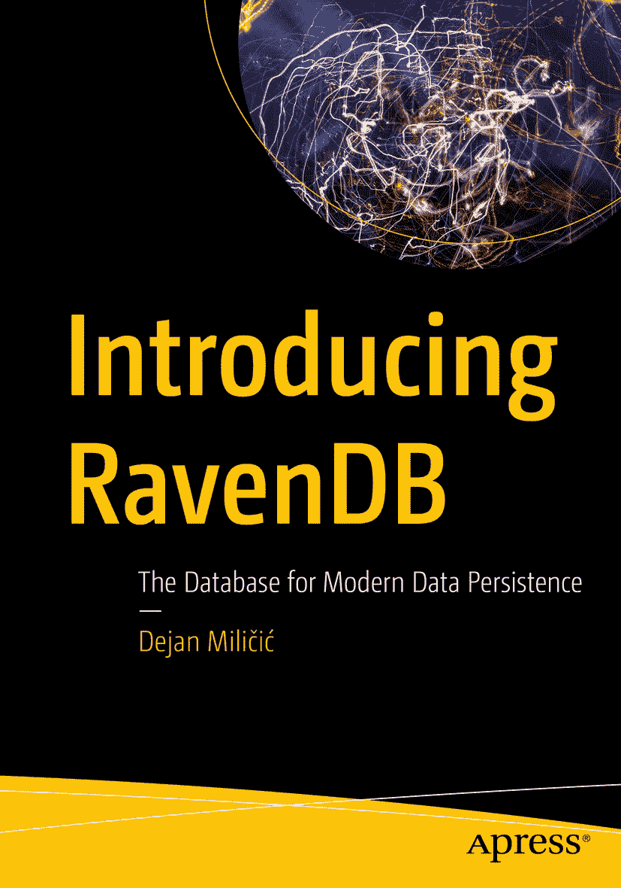

`ISBN` 978-1-4842-8918-1 `e-ISBN` 978-1-4842-8919-8 [`doi.org/10.1007/978-1-4842-8919-8`](https://doi.org/10.1007/978-1-4842-8919-8) © Dejan Miličić 2022
本作品受版权保护。所有权利均由出版方独家许可，无论涉及材料的全部或部分，特别是翻译、转载、插图重用、朗诵、广播、缩微胶片或其他任何物理方式的复制，以及信息存储与检索、电子改编、计算机软件，或当前已知或今后开发的类似或不同方法的权利。在出版物中使用通用描述性名称、注册商标、服务标志等，即使未作具体说明，也不意味着这些名称不受相关保护法律法规的约束，因此可自由用于一般用途。出版方、作者和编辑可以安全地假设本书中的建议和信息在出版时是真实准确的。出版方、作者或编辑均不对本出版物所含材料或其中可能存在的任何错误或遗漏提供明示或暗示的保证。对于已出版地图中的管辖权主张和机构从属关系，出版方保持中立。

本 `Apress` 印记由注册公司 `APress Media, LLC` 出版，该公司隶属于 `Springer Nature`。
注册公司地址为：1 New York Plaza, New York, NY 10004, U.S.A.

## *献给 Filip、Olivera 和 Renata。*

## 引言

你上一次注意到家里的窗户是什么时候？大概是在它们脏了需要清洁的时候，或者其中一扇坏了需要更换的时候。但如果一切完好，你根本不会去注意它。

一个好的数据库就像一扇窗户。它“只是默默工作”。它快速而可靠，无需你成为一名数据库专家。在理想情况下，你不会注意到它的存在——你会专注于处理自己的业务，而数据库就在那里为你提供支持。

在过去的 40 多年里，我们一直使用着关系型数据库。很自然地会认为，我们已经掌握了它们，以至于普通开发者能够构建出随着组织成长而扩展的应用程序，支持不断增长的流量和数据量。此外，随着 20 世纪 90 年代 Web 应用程序的出现，我们拥有了潜在无限的用户群体，而 TB 级数据也成为了新的 GB 级。

即使你拥有多年关系型数据库经验，你也早已知道项目一开始会面临什么：连接多张表的查询（有时多达七、八张），用于弥补缓慢查询的缓存层，随着数据库中数据量随时间增长而出现的众多性能问题，以及额外的数据持久化建模层。

即使是有 20 多年经验的应用开发者，遇到 20%的请求因为关系型数据库而永久性地运行缓慢的情况也并不罕见。然后，他们就体验到了帕累托法则——花费 80%的维护时间去“呵护”那 20%运行不够快的代码。久而久之，这会演变成不安全感和长期的“冒名顶替综合征”。

如果你是专家，那一切会容易得多！但你并不是专家。你没有几个月的时间可以深入钻研数据库的内部原理。你不想专注于优化数据库。你想专注于开发你的应用程序。

`RavenDB` 正是为这个目标而创建的数据库——旨在让你无需成为数据库专家也能取得出色的成果。专业的知识已内嵌其中，因此在你开发应用程序时，数据库会协助你、建议你、并保护你。最常见反模式（如全表扫描）会被主动阻止。

我在十年前遇到了 `RavenDB`，并在这些年里爱上了它。我发现 `RavenDB` 适用于小型项目、快速原型设计，并能扩展到企业级的 `领域驱动设计` 项目。

本书是对 `NoSQL` 概念的温和介绍。从零开始，你将学习 `RavenDB` 这一 `NoSQL` 文档数据库的基础知识、其查询语言以及索引引擎。你还将发现 `RavenDB` 如何对你的操作行为作出反应，从而保护和引导你。完成本书后，你将能够安装 `RavenDB` 并使用它来高效地存储和查询数据。

要跟随本书的内容，你只需要一个现代的 Web 浏览器和基础的 `JavaScript` 知识。你将掌握 `NoSQL` 原则（如 `map/reduce`）并理解 `RavenDB` 的机制。完成学习后，你可以轻松地将这些知识应用到使用任何现代编程语言构建应用程序中。

那么，让我们一起潜入 `RavenDB` 的奇妙世界吧！

## 致谢

我要感谢 `Apress` 的 Jonathan Gennick 和 Jill Balzano，他们向我提出了撰写本书的想法，并一路耐心地支持我，尽管过程并非总是一帆风顺。

我最深切的谢意献给 `Oren Eini`、`Paweł Pekról` 和 `Arkadiusz Paliński`。

通过无数次的讨论，`Marcin Lewandowski`、`Danielle Greenberg`、`Grzegorz Lachowski` 和 `Igal Merhavia` 回答了我所有的问题，并帮助我澄清了概念和想法。

与 `Đorđe Đukić`、`Aleksandar Sabo`、`Shahar Erez` 和 `Federico Lois` 的讨论富有启发性。

`Christopher Balnave`、`Igor Ivanović` 和 `David Ben Horin` 阅读了早期草稿；他们的评论很有帮助。

如果没有我的家人——我的妻子 Renata、女儿 Olivera 和儿子 Filip 的支持与鼓励，这本书就不可能完成。

## 关于作者 关于技术审阅者

