# 1. RavenDB 入门

从狭义上讲，*数据库* 是信息的集合。从这个术语的更广泛含义来说，*数据库管理系统 (`DBMS`)* 是我们谈论“数据库”时通常想到的东西——一个提供操作数据库以定义、存储、管理和检索数据的手段的系统。

尽管许多开发者仍然认为关系型数据库是“黄金标准”，但它们只是数据持久化解决方案历史中的一个阶段。本章将简要回顾 `DBMS` 的历史，包括它们的起源、发展和产生的解决方案。正如你将看到的，关系型数据库是作为解决一组特定问题的方案而出现的。同样地，工程师们创造了 `NoSQL` 数据库来解决下一代挑战。

最后，我们将介绍 `RavenDB` 作为第二代 `NoSQL` 数据库，并了解其起源、历史以及一些使其无论对于小型项目还是大型企业系统都成为出色选择的特点。


## 数据库简史

自计算诞生之初，机器就在产生计算结果并将其持久化存储。随着时间的推移，出现了不同的数据存储解决方案。然而，为了最大化速度，所有这些系统都与硬件和操作系统紧密耦合，牺牲了灵活性和标准化。随着硬件持续发展，这种妥协变得越来越没有必要，于是许多通用数据库管理系统应运而生。最早的一批此类系统中，**集成数据存储** 是由查尔斯·巴赫曼在 20 世纪 60 年代初开发的，它采用了 `导航数据库模型`。

1970 年 6 月，埃德加·F·科德发表了开创性论文“大型共享数据库的关系模型”，其中介绍了 `关系型数据库管理系统` (`RDBMS`)。他突破性思想的重要性在于，它提出了仅使用数据的自然结构来描述数据的概念，避免了为低层次机器表示而强加任何额外结构的需要。这种高层次的数据表示为高级数据语言提供了基础，使此类程序独立于机器表示的低级细节和 `RDBMS` 的内部数据组织。

与需要程序循环遍历来收集记录的导航式方法不同，科德的解决方案提供了面向集合的声明式语言。这种方法催生了 1974 年 `结构化查询语言` (`SQL`) 的诞生。在这一标准化之后，Oracle 于 1979 年发布了首个 `SQL` 的商业实现。

对于关系模型而言，1980 年是具有里程碑意义的一年。IBM 为其大型机发布了相关产品，而规模较小的供应商也开始销售第二代关系系统，并取得了巨大的商业成功。在整个 20 世纪 80 年代，`RDBMS` 最终成熟，并确立了自己作为政府机构和金融机构中常见的大型数据集的首选存储方案。此外，关系型持久化也成为了全球开发者的默认选择。

### 关系型数据库管理系统的问题

然而，正如任何技术一样，并不存在所谓的“银弹”。不同的问题呼唤不同的解决方案。在关系型数据库成为主流持久化解决方案之前就已存在的非关系型数据库，依然继续存在。自 20 世纪 60 年代末以来，层次型、图数据库和面向对象的数据库就一直存在。其原因在于 `RDBMS` 面临几个挑战：

*   关系型数据库最适合处理存储在结构化表中的**结构化数据**。对于非结构化数据，具有固定预定义模式的表格并非最佳选择。
*   用户可以通过在更强大（也更昂贵）的服务器上运行关系型数据库来进行**扩展**。这种方法称为“纵向扩展”，在一定范围内是可行的。超过这个范围后，数据库就必须分布在多个服务器上——即“横向扩展”。关系型数据库本质上是单服务器数据库，其分布式解决方案并不优雅且难以无缝衔接。
*   关系型数据库原生不支持数据分区和分布式设置。作为 `RDBMS` 基石的 `ACID` 事务，与分布式计算存在根本性的冲突。

### 阻抗失配

在开发计算机软件时，开发者会为真实领域建模数据结构。这些模型（是面向对象语言中对象的一部分）是非线性的，几乎总是包含复杂的结构，比如原始值的集合或包含其他原始值的嵌套对象。另一方面，许多流行的关系型数据库除了标量值（如数字和字符串）外无法存储任何东西。因此，关系型数据库无法直接存储和操作您的对象和数据结构。这种不兼容性是一个众所周知的现象，被命名为 `阻抗失配`。

在将对象存入关系型数据库之前，需要将它们转换为符合 `RDBMS` 模式的一组结构。反之亦然——表中的数据需要被操作和重塑以填充对象。因此，向关系型数据库存储数据并再次取出它们，需要一个双向转换的过程。

这种转换发生在两个模型之间——您的（通常是面向对象的）领域模型和用于保存到数据库的表模型。

因此，开发者需要创建一个额外的数据模型，并提供双向翻译服务。此外，每次对主要领域模型进行更正或更改时，他们都必须更新这个转换逻辑。建模两次并维护翻译服务是一项复杂的任务，会让变更变得更加困难，并且在面对客户不断涌来的变更请求时，开发进度会变慢。

### 对象关系映射器

`对象关系映射器` (`ORM`) 是一种工具，可以自动完成将数据从关系表示形式转换为应用程序所用对象模型这一繁琐的任务。然而，正如许多使用 `Hibernate` 或 `Entity Framework` 等众多 `ORM` 的开发者所知，这些库存在许多缺点：

*   `ORM` 抽象掉了 `RDBMS` 的细节，因此随着时间的推移，开发者不可避免地开始将数据库视为内存中的数据集合。
*   生成的 `SQL` 语句不如手写的 `SQL`。
*   `ORM` 会带来不可避免的性能开销。
*   `ORM` 的初始配置可能很复杂。

泰德·纽阿德在其 2006 年的博客文章《计算机科学的越南》中写道：

> `对象/关系映射` 是计算机科学的越南。它代表了一个泥潭，开始时很顺利，但随着时间推移变得越来越复杂，不久就将用户困在一个承诺中，这个承诺没有明确的界点，没有明确的胜利条件，也没有明确的退出策略。

的确，随着应用程序的成长和扩展，`ORM` 的使用将导致反模式的积累。

`Select N+1` 问题只是这些反模式之一。您的代码会先从数据库获取 `N` 个实体，然后遍历这个集合，对每个对象进行额外调用以获取其他引用的对象。一个典型的例子是一个渲染文章列表的网页。每篇文章都有评论，您需要额外调用数据库以获取最新的评论，并随每篇文章一起显示。此外，您还想显示评论作者的位置。如您所见，这是一系列级联的父子关系，在每一步中，您都在访问下一层级，深入层级结构，并进行越来越多的调用。


### 规范化

`规范化`是一种建模技术，是 Codd 关系数据库模型的核心组成部分。20 世纪 70 年代初，存储成本高昂，消除数据冗余是数据库系统设计者的关键设计考量。

Codd 定义了第一（`1NF`）、第二（`2NF`）和第三（`3NF`）`范式`，作为数据建模最佳实践的理论基础。通过应用`3NF`原则，你可以通过将记录分解到最原子化的形式、将这些片段存储在不同的表中、然后通过`外键`（`FK`）将它们关联起来，从而消除冗余。

`FK`不过是一个指针。例如，在`Customers`表中存储客户信息时，你会将他们的地址分离出来并保存在`Address`表中。然后，你会创建一个`FK`来连接这两个表，以建立`Customers`表中的行与包含客户地址的`Address`表中的行之间的关系。

在发展出消除数据冗余的规范化概念后，Codd 构建了规范化的数学理论，并提供了关于`3NF`能够保证数据一致性以及在插入、更新和删除行时防止异常的理论保证。

如今，存储成本低廉。不仅如此，你的服务器 RAM 很可能拥有数十 GB 的可用内存，通常与你的数据库大小相当。优秀的`DBMS`会检测到这一点，并通过将数据库的大部分加载到工作内存中来进行优化。因此，随着时间的推移，作为规范化动机的冗余逐渐消失，如今你只会听到关系数据库支持者在讨论数据库一致性时才会提及`3NF`。

然而，规范化会导致几个问题，其中有两个是主要问题。

第一个挑战与`投影`有关。每次你需要显示一个包含复杂数据的网页时，你都必须创建一个投影——即来自不同表的行的组合。例如，要显示一张发票，你将需要合并来自多个表的数据，包括`Invoices`、`Customers`、`Addresses`、`Products`和`Employees`。连接五个表并不是一个繁重的操作。但是，一旦你的数据库加载了数万张发票，并且你开始创建用于回答诸如“我们出口最多的前 5 个国家是哪些”这类问题的聚合查询时，你将会注意到`RDBMS`的性能下降。因此，关系数据库中的投影给开发者和数据库本身都带来了负担。

规范化的第二个主要问题是`时间快照`。正如我们已经提到的，`RDBMS`以其坚实的理论背景为傲，这保证了数据不会被破坏。然而，一个简单的例子将向你展示，在数据随时间变化的情况下，规范化是多么脆弱。回到用规范化方法建模的发票故事，我们可以看到`Invoices`存在于一个表中，指向`Companies`表。此外，`Companies`与包含所有国家列表的`Countries`表相关联。这样，`Invoices`通过`Companies`与`Countries`建立关系。现在，想象一下`Company`从伦敦搬迁到柏林——你需要进入`Companies`表，并将与`Countries`表相关的`FK`更改为指向包含德国的行。

这个简单的更改本不应产生严重的后果。然而，由于规范化的建模方式，你刚刚执行的修改会产生连锁反应。虽然你在这个过程中没有触及`Invoices`，但它们受到了影响，因为它们与更改了地址的`Company`相关联。结果，下次你重复那个聚合查询“我们出口最多的前 5 个国家是哪些”时，你可能会发现英国不再位列其中。换句话说——通过简单地更改一个`Company`的地址，你在历史数据层面引入了数据损坏。

规范化无法对此类时间依赖性进行建模。要存储发票的快照，你将不得不应用反规范化过程。最终，我们可以得出结论：规范化非但没有带来承诺的数据一致性和有效性，反而会破坏你的历史数据。

### 现代 Web 应用程序

在 20 世纪 70 年代和 80 年代，到达你应用程序的数据是可预测且高度结构化的。随着互联网的出现和用户群的全球化，事物开始更快地发展。今天，现代互联网应用程序服务于广泛的用户群体，提供多种服务并快速发展。拥有数百个并发用户的应用程序已不足为奇。

二三十年前，你只有在部署到大型企业的应用程序中才会体验到这种情况。三十年前，你会收到一份`需求规格说明书`，其中精确定义了需要存储在关系数据库中的数据模式。然后你会应用瀑布模型，花费数月时间来实现它，最终发布。今天，你在为期 2 周的冲刺中工作，变更请求在交付可工作功能后几天内就会到来。

关系数据库在本质上是为写入数据而优化的。读取数据是次要优先级。现代 Web 应用程序通常会存储一次数据，然后在进行下一次写入之前请求它数十次或数百次。在写入过程中被拆解成原子单元并存储在数十个表中的数据，现在需要重新组装，以生成用于在网页上呈现信息的模型。而且这不仅仅发生一次。成千上万的 Web 应用程序访问者将触发许多这样的调用。

渲染现代网页会产生许多对数据库的请求。这些请求页面的用户也会与你的应用程序交互并生成需要存储的新数据。想想二十年前的一家小型夫妻店——他们运行一个`POS`系统，交易数量受到物理因素的限制——顾客排队，一次只能服务一个顾客。小店设法生存并扩展，现在它已上线。不再有物理性质的限制；它们现在处于一个虚拟世界中，50 个顾客可以在 3 分钟内完成购买。

关系数据库模型构思于不同时期——读取请求较少，用户不那么频繁，数据高度结构化，应用程序变更节奏缓慢。可以说，现状恰恰相反。

## NoSQL

我们刚才描述的问题随着时间的推移只会变得更加棘手。随着变更请求的节奏加快，随着用户数量和数据量的指数级增长，很明显我们需要一些替代方案。显而易见，`RDBMS`并非在所有情况下都是最合适的解决方案，一些系统需要不同的数据存储和查询方法。

本节将探讨在 20 世纪 90 年代和 21 世纪初兴起的演变，这种演变导致了`NoSQL`运动的产生。我们将审视`NoSQL`作为一个术语的起源、此类数据库的优势和挑战，以及最终，这场运动对整个行业的更广泛影响。


### “NoSQL”名称的由来

`NoSQL` 数据库是数据库的进一步演进。可以说，在`RDBMS`发明之前，就已经存在可以定性为“非关系型”的数据库。然而，NoSQL 运动并非回归这些历史解决方案；它们代表了数据持久化解决方案的进一步发展。

颇具讽刺意味的是，NoSQL 这个缩写词最初是用作卡洛·斯特罗齐于 1998 年构建的一个关系数据库管理系统的名称。NoSQL 这个名称的灵感来源于该系统并非传统数据库，而是一个 Shell 层级的工具，数据以常规的`UNIX` ASCII 文件形式存储，可以使用各种`UNIX`实用程序和编辑器进行操作。因此，其刻意不支持`SQL`作为查询语言，便成了命名的灵感来源。

约翰·奥斯卡松是首位使用我们今天所认可的“NoSQL”一词的人。他当时在为 2009 年 6 月在旧金山组织的一个聚会寻求一个名称。该聚会展示了多种非关系型分布式数据库。在随后的几个月和几年里，“NoSQL”一词被广泛采用，但它从未被标准化或精确定义，因此我们只能讨论属于这一广泛类别的数据库所表现出的一些普遍特征。

### 为何需要 NoSQL？

正如我们将看到的，NoSQL 代表了解决 2000 年代末期出现问题的一系列广泛的异构方法。在那段时期：

*   Web 应用兴起，数据开始以各种形式和样貌涌现——结构化、半结构化、非结构化和多态。预先定义全面的模式变得几乎不可能，或者往好了说，这类尝试最终产生的解决方案操作繁琐且长期维护困难。
*   存储成本急剧下降。在数据库层面进行数据重复不再是创建复杂数据模型的决定性因素。开发人员及其宝贵时间，而非磁盘存储，成为了软件开发的主要成本因素。以提升生产力而非节省存储空间为目标进行优化，成为了主要的驱动因素。
*   云计算在 2000 年代末期日益普及，并成为托管应用和数据的合理选择。随着开发人员开始将数据分布到多个服务器上，他们需要一种能够**横向扩展**而非**纵向扩展**的方式，使其应用具备弹性，并将数据**地理分布式**地部署在用户附近。
*   《敏捷宣言》获得了广泛认可，快速变化的需求不再被视为干扰因素，而是被视为开发人员生活中需要接受、拥抱并纳入开发周期的事实。全球的软件工程师开始认识到需要快速修改代码，而重塑持久化数据是其中不可或缺的一部分。NoSQL 数据库作为一种灵活的解决方案，在这个难题中找到了自己的位置，它可以提供更少痛苦的即时转向和建模调整能力。

### 特征

`NoSQL`一词如今描述的是为满足现代应用需求而出现的各种数据库技术。它们都具有一些共同特征：

*   首先也是最明显的一点是名称中的否定含义——NoSQL 数据库不使用`SQL`，即属于非关系型。
*   NoSQL 数据库源于开源社区。尽管如今你也能找到像`IBM`、`Oracle`和`Amazon`这样的闭源厂商提供的 NoSQL 解决方案，但总体而言，NoSQL 数据库主要仍是开源项目。
*   大多数 NoSQL 数据库支持集群设置，这对它们的一致性处理和数据建模方式产生了重大影响。
*   NoSQL 数据库没有强制性的模式，因此记录中的字段可以在无需先定义结构变更的情况下进行添加和删除。
*   它们基于现代 Web 应用的需求而构建，在这类应用中，海量并发用户可以存储形态各异的海量数据。

这些是宽泛的特征，并且由于这些数据库的异构性质，我们很可能永远无法得到一个明确、连贯的定义。

### 额外优势

除了上述已描述的问题外，NoSQL 数据库还提供了一些额外优势：

*   **横向扩展**——随着数据库负载增加而购买更强大的服务器（即所谓的**纵向扩展**）多年来一直是关系型数据库的标准做法。然而，随着事务速率和可用性要求的提高，NoSQL 数据库提供了一种不同的解决方案。**横向扩展**是将数据库分布在多个服务器或虚拟化环境中的方法。大多数`RDBMS`需要专门或昂贵的硬件来纵向扩展，而 NoSQL 数据库则可以在廉价的商用硬件上横向扩展。
*   **经济性**——传统上，`RDBMS`依赖于昂贵的专有服务器和存储系统。大多数 NoSQL 数据库采用开源许可。结合前述的在廉价商用服务器（甚至像`Raspberry Pi`这样的玩具机器）上运行的能力，NoSQL 数据库管理系统的总拥有成本以及每 GB 或每秒事务的成本都要低得多。
*   **大数据**——在过去十年中，现代应用极大地增加了持久化数据的体量。`RDBMS`的容量一直在增长以满足这一需求，但特定关系系统的限制成为了企业的制约因素。目前，像`Hadoop`这样的“大数据”NoSQL 解决方案的容量已经超过了最大型`RDBMS`系统的能力。
*   **管理**——NoSQL 数据库在大多数情况下从设计之初就明确旨在比关系型数据库需要更少的关注和管理。更简单的数据模型、自动维护、数据分发以及基于环境因素的内部重新配置，消除了对专职`DBA`（数据库管理员）的需求。尽管关系系统在可管理性方面有了诸多改进，但使用`RDBMS`的组织仍然需要专业人员的专门知识来安装、设计和维护`RDBMS`。当然，NoSQL 数据库仍然要求用户具备一定程度的知识，但它们消除了能够运行一个高效的数据库驱动系统所必需的强制性专业知识。


### 挑战

没有任何技术是万能的银弹，采用任何新的技术范式都有其他方面的考量。以下是一些与采用 NoSQL 数据库相关的挑战：

*   *成熟度* - 关系数据库管理系统（RDBMS）已存在超过四十年。它们发展完善、成熟且稳定，对大多数用户而言是可靠的保障。那句源自 1970 年代的“购买`IBM`从来不会让人丢掉饭碗”的心态一直延续至今——RDBMS 被视为“安全的选择”，而 NoSQL 则被看作是在用新的“酷”技术进行赌博。从许多公司的角度来看，NoSQL 是一项独特、年轻、前沿的技术，对开发者来说可能令人兴奋，但在生产环境中却是一个巨大的未知数。

*   *技术支持* - 在系统故障的情况下，及时而专业的技术支持对于每个组织的业务连续性计划都至关重要。所有 RDBMS 供应商都竭尽全力提供此类支持。另一方面，许多 NoSQL 产品是开源的，缺乏提供支持选项的商业实体。即使存在，这些公司也往往是小型初创企业，没有全球影响力、支持资源，也不具备`IBM`、`Oracle`或`Microsoft`那样的可信度。

*   *分析与商业智能* - 数据是每家公司的宝贵资源。他们分析数据、进行数据挖掘并得出结论，从而改进决策流程、提高效率，并最终提升市场盈利能力。商业智能（BI）是大多数公司的战略领域。多年来，RDBMS 的核心功能因一个丰富的产品生态系统而得到增强，这些产品为数据分析提供了额外的 BI 服务。直到最近，NoSQL DBMS 才开始迎头赶上，提供类似的解决方案。

### 结论

NoSQL 数据库的出现并未消除对关系数据库的需求。相反，它帮助我们达到了一种不教条、更平衡的立场：即数据持久化还有其他合法且可靠的选择。

这种思想上的解放始于 2006 年，当时 Neal Ford 创造了`多语言编程`（Polyglot Programming）一词。这个理念提倡使用多种语言实现应用程序，认识到特定问题可以通过不同的语言以更直接、更便捷的方式解决。简单来说——不同的编程语言在解决特定问题时各有优劣。

`多语言持久化`（Polyglot persistence）是一个遵循相同哲学的理念。不同的情况和环境可能需要不同的方式来建模和存储持久化数据。此外，一个业务领域常常可以划分为多个子领域。不同的数据模型可能是不同子领域的最佳表示。多语言持久化的理念承认这一点，并避免了为了将所有数据模型都塞进一个数据库而做出妥协。

因此，在开始下一个项目时，你不应该不假思索地默认选择关系数据库作为解决方案，而需要考虑数据的性质、业务场景以及你计划如何操作数据，然后在各种持久化数据的技术中考虑最佳匹配。因此，组织正在从将数据库视为集成点的概念，转向应用程序数据库，最终形成一种由不同应用程序通过不同技术满足不同需求的混合模式。

这种思想上的解放随着领域驱动设计和微服务的兴起而进一步发展，其中一个解决方案由多个数据库组成，可以是持久化技术的混合体。这样，数据库将数据封装在应用程序内部，而服务则负责执行集成。

### NoSQL 数据库类型

如前所述，各种非关系型数据库采用不同的方法来满足存储和查询数据的需求。NoSQL 数据库主要有四种类型，每种类型都解决了关系数据库无法充分解决的问题。

#### 键值存储

著名示例：`Redis`、`Memcached`和`CosmosDB`

在某些场景下，使用功能强大、索引完善且数据检索能力强的全功能数据库可能是杀鸡用牛刀。你需要的是一种快速简便的方法，将任意信息片段用键标记并存储在数据库中。之后，当你提供键时，数据库就会返回关联的值。

`键值存储`是数据库，但高度专业化，其构建目的单一，且在设计和功能上刻意做了限制。有些是极简主义的，例如`Memcached`，它甚至不将数据存储在磁盘上。其他的，如`CosmosDB`，虽然随着时间的推移添加了更多功能，但仍然基于键值范式。

总体而言，键值存储旨在用于缓存或在应用程序服务之间共享通用数据等基础任务。许多关系数据库也可用作键值存储，但它们会消耗大量资源，且效率低于专业解决方案。如果你用一辆 18 轮大卡车去超市购物，同样会造成资源和能力的过度配置。

#### 文档存储

著名示例：`MongoDB`、`RavenDB`、`Couchbase`和`DocumentDB`

文档存储扩展了键值存储提供的功能，不仅能持久化和检索信息，还能理解信息的结构。在文档存储的术语中，文档是表示业务对象的半结构化数据。你可以根据文档的内部结构对其进行索引、管理和操作。

文档存储了解文档的内部结构，因此你可以按地址城市查询业务合作伙伴，而键值存储只能提供存储和检索它们的方法。

关系数据库迫使你人为地将对象拆分为多个子实体，然后存储在表和行中。文档存储可以接受自然形式的文档，对它们进行索引，并为你提供创建投影的方法，其效果与关系数据库中的`JOIN`相同，但效率要高得多。

在存储之前，你的对象会被序列化为某种标准格式或编码。常见的编码包括`JSON`、`XML`、`YAML`以及二进制格式如`BSON`。

#### 图数据库

著名示例：`Neo4j`、`OrientDB`、`TigerGraph`和`ArangoDB`

`图`是一种数学结构，用于表示一组对象，其中成对的对象相互关联。图数据库实现了这一概念，将实体之间的关系视为与实体本身同等重要。因此，图数据库适用于所有那些关系是模型核心的业务领域。

图数据库是高度专业化的 NoSQL 数据库。可以说，它们建立在关系数据库奠定的基础上，将连接和关系提升到了数据库世界中的“一等公民”地位。因此，除了数据，图数据库还包含元数据或“关于数据的数据”，而这些元数据往往比数据本身更重要。

使用图数据库，无论数据集总规模大小，你都可以高效地探索高度连接的数据、基于模式进行搜索，并将与数据的交互隔离在一个极小的子集内。

#### 宽列存储

著名示例：`Bigtable`、`DynamoDB`、`Cassandra`、`ScyllaDB`和`HBase`

此类别也被称为`可扩展记录存储`。与关系数据库类似，宽列存储使用表、行和列。然而，列不是固定的，如果需要，记录可以拥有数十亿列。从键值存储的角度来看，可以说宽列存储是一个二维的键值存储。


### 多模型数据库

多模型数据库并非 NoSQL 数据库的第五个类别，而是一个新兴趋势，最早由卢卡·加里于 2012 年提出。他从多语言持久化（Polyglot persistence）的概念出发，设想了第二代 NoSQL 数据库，即一个产品能够支持不同的数据模型。这种方法将结合 NoSQL 的理想——为应用的每个子领域选择最合适的持久化方式，而无需使用多个不同的数据库。因此，你无需在建模上做出妥协，最终只需学习和管理一个数据库即可。

数据库的选择充满困难和风险，因为这个选择需要预先承诺一个特定的模型。考虑到现代应用程序必须支持的快速变化节奏，这个选择很容易因不可预测的未来变化而失效。

采用多模型数据库意味着数据库选择的风险可以降低。随着你从客户那里收到的需求变更流不断演进你的数据模型，你的数据库能够在各种情况下为你提供支持。

## RavenDB

在本节中，我们将介绍 `RavenDB`，一个第二代 NoSQL 数据库。你将了解它的历史、为什么 `RavenDB` 是应用程序数据持久化的良好选择，以及如何立即开始使用 `RavenDB`。

### 历史

`RavenDB` 由以色列开发者奥伦·艾尼创建。在 2000 年代末，他是 `NHibernate` 项目的活跃贡献者，这是著名的 Hibernate ORM 的 .Net 移植版本，也是全球开发者最常用的映射器之一。除了参与开源社区，奥伦还为使用关系型数据库的公司担任顾问。他以 Ayende Rahien 的笔名在 `https://ayende.com` 上 prolific 地撰写博客，记录了他帮助各种公司的经历。这感觉就像是一个漫长的“土拨鼠日”——他们都遇到了应用程序的问题，而典型的 `RDBMS` 导致了我们大多数人都经历过的这些问题——缺少索引、`Select N+1`、连接了七、八个表的投影……难道这么多开发者都在错误地使用关系型数据库吗？还是说它们本身存在一些固有的问题？你是否需要成为数据库专家才能快速开发应用程序并产生一个持久可靠的解决方案？

软件开发者随时间推移观察到问题、思考它们并热衷于解决它们，这并不罕见。你可以说 `RavenDB` 的诞生，一半源于对数据库现状的挫折，一半源于对解决实际问题、创造优雅方案的 passion。

2010 年 5 月，奥伦发布了 `RavenDB` 的 1.0 版本。10 月，第一个商业安装获得成功，此后，`RavenDB` 开始获得普及——直到 2015 年 9 月达到了 100 万开发者的下载量。

如今，`RavenDB` 是一个成熟可靠的数据库，从在 `Raspberry Pi` 这样的小型机器上的安装，到包含超过一百万节点的集群，都经历了实战考验。让我们来看看一些帮助 `RavenDB` 成为如此通用数据库的原因。

### RavenDB 的优势

除了 `RavenDB` 作为文档型 NoSQL 数据库所具备的所有优势（我们在前面章节已讨论过）之外，一些具体特性使其脱颖而出。

#### 极致性能

`RavenDB` 高度优化。即使在像 `Raspberry Pi 400` 这样的玩具机器上，你也能够每秒处理超过 2,000 个并发读取请求。商用硬件将使你达到 150,000 次写入/秒和 1,000,000 次读取/秒，而且所有这些都具有低延迟。此外，你的查询将持续在预计算的索引上运行，因此你将能极快地获得结果。

#### 完全事务性

从最初开始，`RavenDB` 就提供完全事务性的 `ACID` 保证。同时也支持多文档和多集合事务，以及集群范围的事务。我们将在后面的章节中介绍 `ACID`，但现在可以说——`ACID` 是任何数据库都应保证的最低要求。它将确保你的数据不会丢失，并且你的数据库在面对所有挑战时保持一致性。

#### 自动调优

`RavenDB` 是一个成熟的数据库，懂得如何自我管理。如果你尝试执行一个没有索引支持的查询，`RavenDB` 会为你创建一个索引。如果由于某种原因你的集群中某个节点变慢，流量将被动态重定向到最快的节点。你的集群处于持续进行的自我监控模式。它会跟踪关键参数，如 `CPU` 使用率或内存利用率，并据此采取行动。总的来说，`RavenDB` 会观察其环境并智能地做出反应。

#### 默认安全

默认安全包含许多方面，`RavenDB` 以其尖端的技术解决方案和一组默认设置为荣，这些将使你能在几分钟内启动并运行。这不仅包括你必须做的事情，还包括你不被强制要求去做也能产生安全应用程序的事项列表。以下是这些功能的子集：

*   `加密` - 默认的传输中加密和可选的静态加密意味着你的数据永远不会以明文形式暴露给任何可能监听应用程序与 `RavenDB` 之间流量的人。
*   `身份验证` – 使用 `X.509` 数字证书进行访问控制，以及作为通过 `HTTPS` 访问 `RavenDB` 集群的基础。
*   `限制每个会话的数据库调用次数` – 单个数据库会话中请求过多是危险的。如果开发者不小心，像 `Select N+1` 这样的反模式可能导致获取数据以呈现一个网页时进行数十甚至数百次调用。`RavenDB` 客户端将尽可能批处理多个调用，如果你超过了每个会话 30 次调用的默认阈值，它将引发异常。然而，正如你稍后将看到的，在大多数情况下，你可以将调用次数减少到一两次。这对你的应用程序是一个显著的加速，并降低了数据库的负载。

#### 高可用性

`RavenDB` 是一个本质上分布式的数据库。即使你只运行一个节点，它也会被视为一个单节点集群。集群通常由多个节点组成，最常见的是三个。这种多节点设置将提供数据库的多个精确副本，只要有一个节点正常运行，你的数据就是可用的。

#### 拓扑结构

`RavenDB` 集群可以从一个节点扩展到数百万个节点。你的设置可以包括云托管、本地机器和各种异构安排。最后，支持各种星型拓扑，中心位置与数百万边缘位置进行双向的完整或过滤复制。


## 如何开始？

开始使用 RavenDB 最简单的方式是打开浏览器并访问 [`http://live-test.ravendb.net/`](http://live-test.ravendb.net/)。展现在你面前的将是 RavenDB Studio。

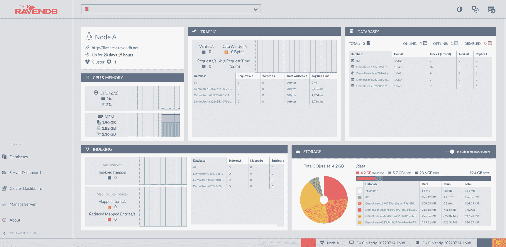

一张 Raven D B Studio 的截图，左侧显示 5 个标签页，右侧显示 5 个小窗口。窗口标题分别为：流量、数据库、C P U 和内存、索引以及存储。标签页包括：数据库、服务器仪表板、集群仪表板、管理服务器和关于。

图 1-1

RavenDB 游乐场服务器 Studio

你在图 1-1 中看到的就是 RavenDB Studio，这是一个用于管理你的 RavenDB 服务器的 Web 应用程序。如你所见，无需安装任何东西——你的服务器为你提供了一个可通过所有主流 Web 浏览器访问的 Web 应用程序。

游乐场服务器是 RavenDB 的一个公共实例，无需认证即可供所有人使用。你可以创建新的数据库，随意操作，并评估 RavenDB 的工作方式。

注意

请勿将游乐场服务器用于除评估 RavenDB 之外的任何目的。请勿在任何数据库中存储任何敏感数据。这些数据库未受保护，世界各地任何人都可以访问、查看所有数据库以及读取和修改数据。此外，所有数据库会定期清除。

在你的机器上运行 RavenDB 最简单的方式是使用 Docker。如果你的机器上已经安装了 Docker，你只需运行以下命令：

```
docker run -d -p 8080:8080 -p 38888:38888 -e RAVEN_ARGS="--Setup.Mode=None --License.Eula.Accepted=true" ravendb/ravendb
```

Docker 将获取最新的 RavenDB 镜像，并启动一个新容器来运行此镜像。现在，如果你打开 `http://127.0.0.1:8080/`，你将在浏览器中看到 Studio。

注意

你现在正以开发人员模式运行 RavenDB。此模式下未强制执行任何身份验证或授权。开发人员模式是 RavenDB 唯一允许未经验证访问的情况。

你也可以在 Windows、Linux、OSX 甚至 Raspberry Pi 上原生运行 RavenDB。

例如，要在 Windows 机器上设置 RavenDB，请访问 [`https://ravendb.net/download`](https://ravendb.net/download)，选择“Windows 64”平台，并下载 zip 压缩包。解压后，执行 `run.ps1` 文件，你将启动 RavenDB。

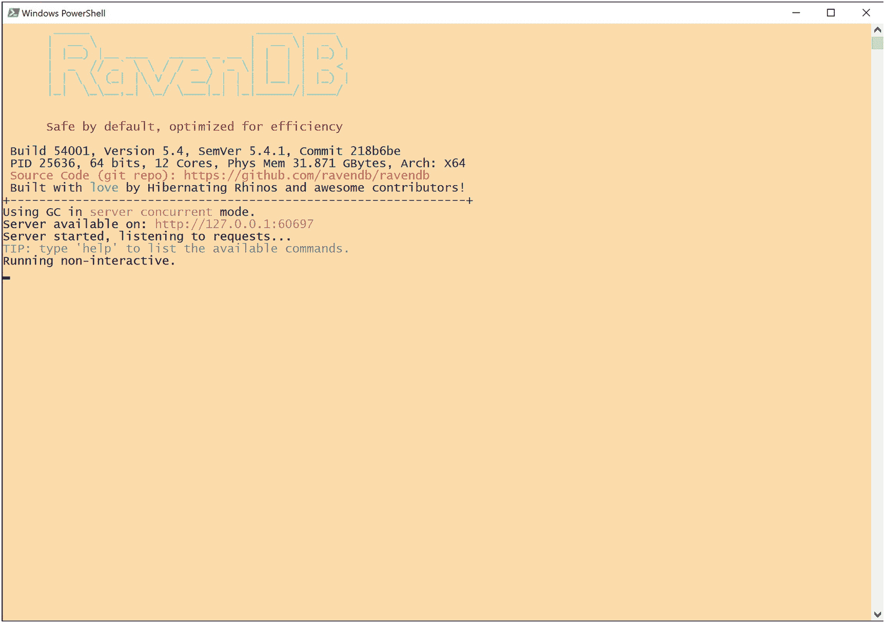

一张 Windows PowerShell 的截图，显示 Raven D B 控制台。其中有多行文本，显示构建版本和规格。

图 1-2

Windows 中的 RavenDB PowerShell 控制台

如图 1-2 所示，服务器将在 IP 地址 `127.0.0.1` 上运行，并且默认浏览器将打开并显示 RavenDB 最终用户许可协议。

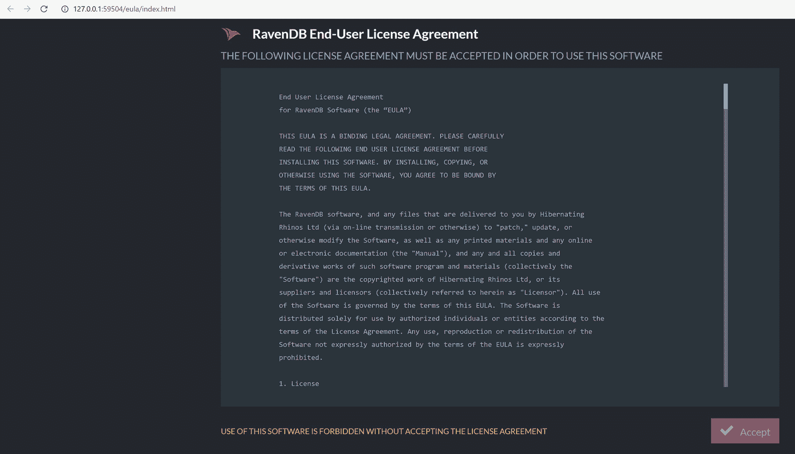

一张窗口截图，显示在安装 Raven D B 软件过程中的最终用户许可协议。右下角有一个接受按钮，用于完成安装。

图 1-3

默认浏览器中的 RavenDB 许可协议

接受图 1-3 所示的许可协议后，你将看到安装向导的第一步。

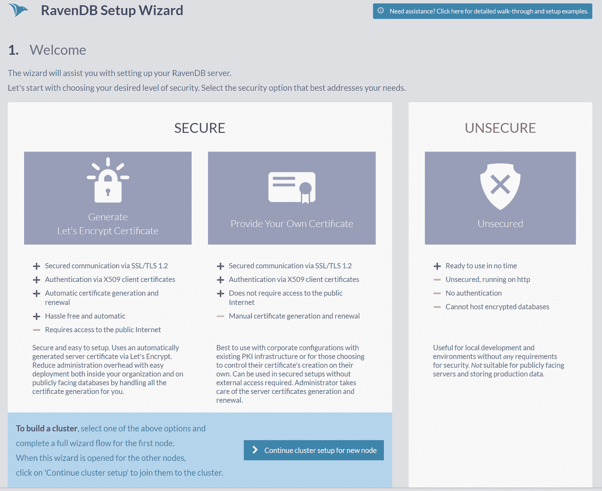

一张 Raven D B 安装向导窗口的截图。它显示了两种设置安全选项，每种选项都有详细说明。

图 1-4

RavenDB 安装向导，第一步

由于你将出于开发目的运行本地实例，你可以选择“不安全”模式，如图 1-4 所示。这将引导你进入安装向导的第二步——不安全模式设置。

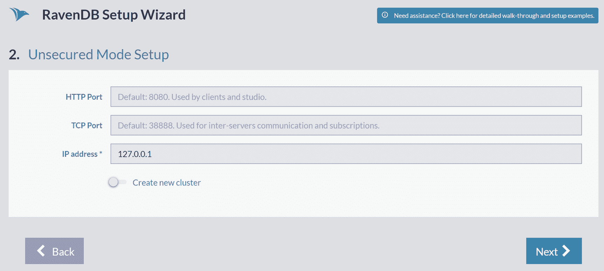

一张 Raven D B 安装向导、不安全模式设置页面的截图。它有 3 个文本框，标签分别为：H T T P 端口、T C P 端口和 I P 地址。下方有一个创建新集群的选项，底部有 2 个按钮，分别标为“上一步”和“下一步”。

图 1-5

RavenDB 安装向导，第二步

接受图 1-5 所示的默认选项，并点击 `下一步`，将带你进入设置过程的第三步，也是最后一步。

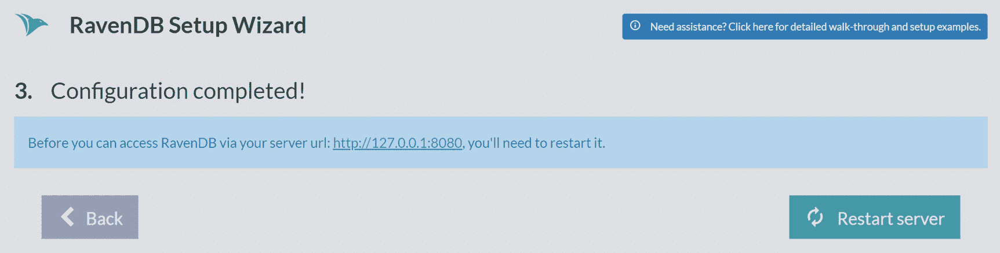

一张 Raven D B 安装向导第三步的截图，显示已完成的配置，以及一个重启服务器或返回的选项。

图 1-6

RavenDB 安装向导，第三步也是最后一步

在你能够开始在 Windows 下使用本地 RavenDB 实例之前，只需再完成一步，如图 1-6 所示。点击 `重启服务器` 按钮将重启服务器并重新加载你的浏览器窗口。最后，`http://127.0.0.1:8080/studio/index.html` 将会打开，你将看到与图 1-1 相同的屏幕。


### 创建你的第一个数据库

现在你已经启动并运行了 RavenDB 服务器，是时候创建你的第一个数据库了。首先，点击 Studio 左侧栏中的 `Databases` 选项。你会看到一个提示，显示没有数据库，并附带一个创建数据库的行动号召。你也可以通过点击右上角的 `New database` 来创建新数据库，如图 1-7 所示。

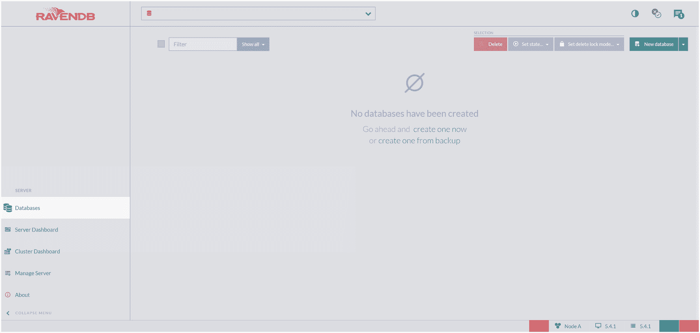

图 1-7：RavenDB Studio 截图，显示左侧 5 个选项卡，其中“数据库”选项卡被选中。主页面显示文本：“尚未创建任何数据库”。

创建新数据库

这将打开 `New database` 对话框。

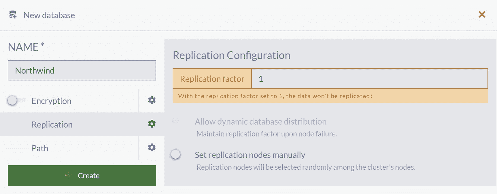

图 1-8：“新建数据库”对话框截图，显示一个已填充的“名称”文本框，其下方有三个带单选按钮的选项，包括加密、复制和路径，其中“复制”被选中。主页面上的复制因子设置为 1。

此时，如图 1-8 所示，你只需输入新数据库的名称并点击 `Create` 按钮。将你的新数据库命名为 Northwind，接受所有默认设置，一个新的空数据库将被创建。

现在你回到了最初看到的同一个 `Databases` 屏幕，但这次你可以看到刚刚创建的 Northwind 数据库，如图 1-9 所示。

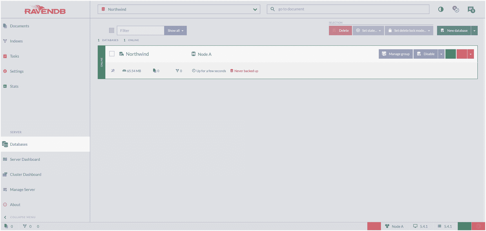

图 1-9：RavenDB Studio 窗口截图，显示名为 Northwind 的数据库。其下方描绘了数据库的相关信息，右侧是设置项。

数据库列表

更仔细地观察图 1-10，你可以看到关于新数据库的基本信息：
*   驻留在节点 A 上。
*   在硬盘上分配了 65.54 MB 空间。
*   包含 0 个文档和 0 个索引。
*   运行时间是“几秒钟”。
*   从未备份过。

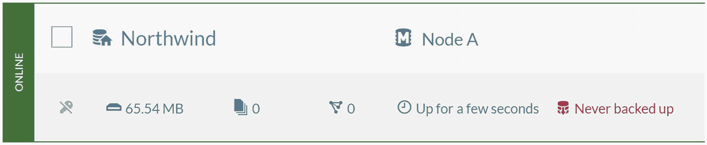

图 1-10：截图显示数据库信息如下：驻留在节点 A，分配 65.54 MB，0 个文档，0 个索引，运行时间几秒钟，且从未备份。

点击数据库名称 `Northwind` 会打开文档列表，你会看到你的数据库确实是空的，如图 1-11 所示。

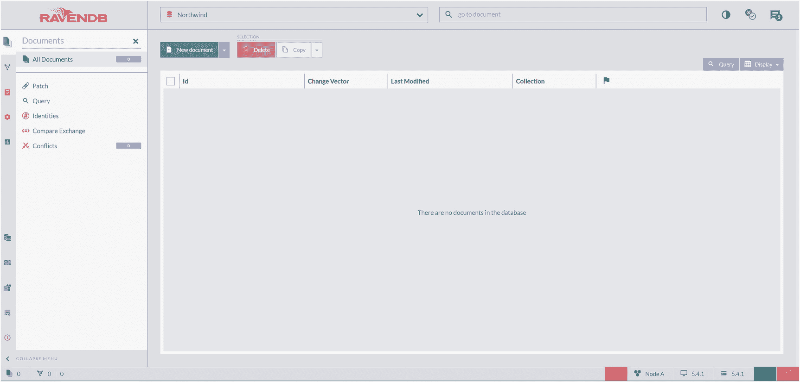

图 1-11：RavenDB Studio 窗口显示 Northwind 数据库的文档页面。数据库中没有文档。文档表格的列标签包括：ID、变更向量、最后修改时间、集合和一个旗标符号。

### 填充示例数据

一个空数据库能做的不多。RavenDB 可以为你创建示例数据。点击屏幕左边缘的 `Tasks` 图标，然后选择 `Create Sample Data` 选项，如图 1-12 所示。

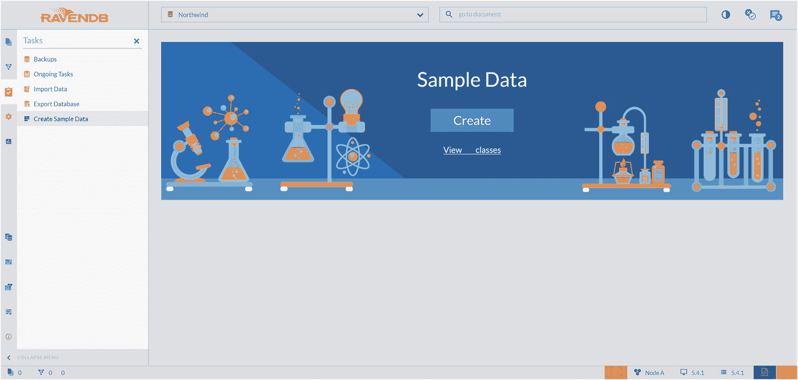

图 1-12：RavenDB Studio 窗口显示左侧 5 个任务，其中“创建示例数据”被选中。选中的选项卡描绘了一个示例数据页面，上面有一个标有“创建”的按钮。

向空数据库填充示例数据

> **提示**
>
> 填充示例数据仅适用于完全空的数据库。即使你只有一个文档，RavenDB 也会禁用 `Create` 按钮。

### Northwind 数据库

回到 `Documents` 菜单项会显示文档和集合，如图 1-13 所示。

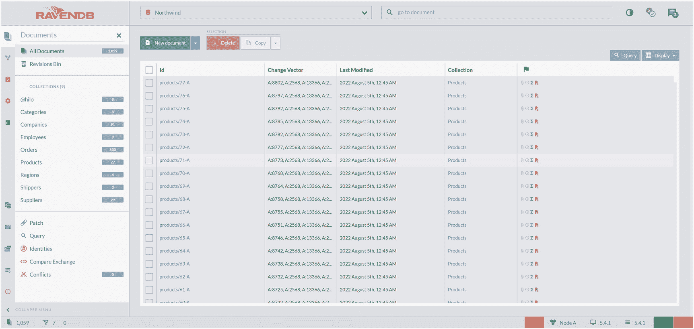

图 1-13：RavenDB Studio 窗口描绘了数据库的文档页面。文档列表在列标签 ID、变更向量、最后修改时间、集合和一个旗标符号下描绘。集合列表及每个集合中的文档数量显示在左侧。

集合是 RavenDB 中的基本概念之一。它们包含文档，与关系数据库中的表非常相似。但是，一个集合中的文档不要求结构相同或遵循任何模式。每个文档只属于一个集合，你通常会将类似的文档分组到一个集合中。

你面前的数据库是 `Northwind`。这是 Microsoft 随 Access 和 SQL Server 应用程序一起发布的示例数据库之一。自 1994 年以来，它一直被用作各种数据库产品中各种功能的教程和演示基础。更广泛的社区接受它作为小型企业 ERP 的优秀教程模式，并且它已被移植到多种非 Microsoft 数据库，包括 PostgreSQL。因此，在 RavenDB 中选择此数据作为示例是合乎逻辑的。普通用户很有可能已经熟悉其关系版本。

Northwind 数据库包含一个名为“Northwind Traders”的虚构公司的销售数据，该公司在全球范围内进口和出口特色食品。

该数据集包含以下示例数据：
*   `Categories`（8 个文档）：产品类别
*   `Companies`（91 个）：从 Northwind 购买产品的客户
*   `Employees`（9 个）：Northwind Traders 的员工详细信息
*   `Orders`（830 个）：客户与 Northwind Traders 公司之间发生的销售订单交易
*   `Products`（77 个）：产品信息
*   `Regions`（4 个）：划分为四个区域的城市列表
*   `Shippers`（3 个）：将货物从贸易商运送给最终客户公司的承运商详细信息
*   `Suppliers`（29 个）：Northwind Traders 的供应商和卖主

将此列表与 RavenDB Studio 中的集合进行比较，你会注意到其中一个集合不在此列表中：`@hilo`。这个集合是一个系统集合，由数据库创建和维护。尽管它是公开可见的，但你很少会去检查其内容。你在其中看到的文档用于为你的集合中的文档创建唯一标识符。此外，请注意这个集合名称的特定前缀；它的名称以“at”符号开头。这个前缀是 RavenDB 内部使用的所有属性和名称的标准约定。尽管没有什么能阻止你使用相同的前缀来命名你的属性，但我们建议你避免这样做，以防止与系统名称发生任何冲突。


### 文档

点击 *Orders* 集合，你将看到此集合中所有文档的列表。现在，按照图 1-14，点击 *Id* `orders/830-A` 来打开你的第一个 RavenDB 文档。

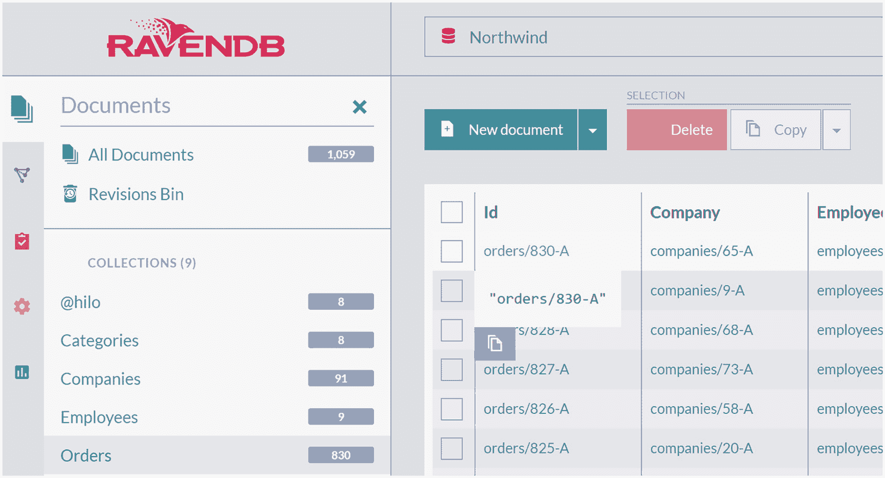

一幅屏幕截图描绘了 RavenDB Studio 的文档页面。页面左侧显示了一个集合列表，其中选中了 Orders。在文档列表中，选中了 orders/830-A。

图 1-14

Orders 集合中的文档

你现在看到的是存储在 Northwind 数据库中的 JSON 文档，如图 1-15 所示。

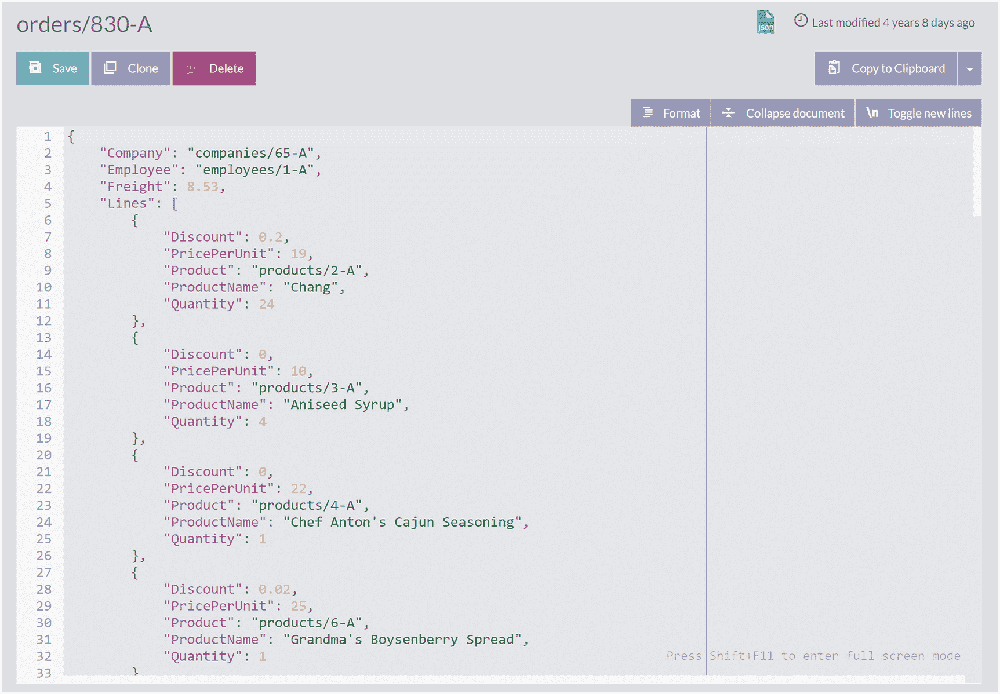

一幅屏幕截图描绘了一个标题为 orders/830-A 的文档。标题下的按钮标为“保存”、“克隆”和“删除”。该文档显示了 JSON 结构中的 33 行代码。

图 1-15

JSON 文档

如果你之前使用的是关系型数据库，这景象并不熟悉。没有列。整个文档就是一个 JSON 结构。*Lines* 属性是一个由 JSON 对象组成的数组。向下滚动，你会看到 *ShipTo* 属性，它包含一个复杂的嵌套 JSON 结构。

将这个文档与通常的 RDBMS 建模进行比较，你会发现我们不必为了满足关系型数据库的表状特性而将其拆分成多个部分。例如，*Company* 和 *Employee* 属性是对该数据库中其他文档的引用，但它们并不是特殊属性——它们只是简单的字符串。

基于文档的建模是一个重要主题，我们将在后续章节中更详细地介绍。现在，请随意点击其他集合并检查它们的文档。

## 本章小结

在本章中，我们简要介绍了关系型数据库的历史及其诞生、优点以及这些系统的一些缺点。作为数据持久化演化的下一步，NoSQL 数据库应运而生。我们探讨了创建这类新数据库的动机、它们解决的一些问题及其主要类别。我们介绍了 RavenDB，并涵盖了安装步骤、创建你的第一个数据库、示例数据集概述以及 JSON 文档的基本概念。

在下一章中，我们将展示使用 NoSQL 文档数据库进行数据建模的方法，解释如何在 RavenDB 中应用它们。此外，我们还将介绍为 NoSQL 文档间关系建模的技术。

