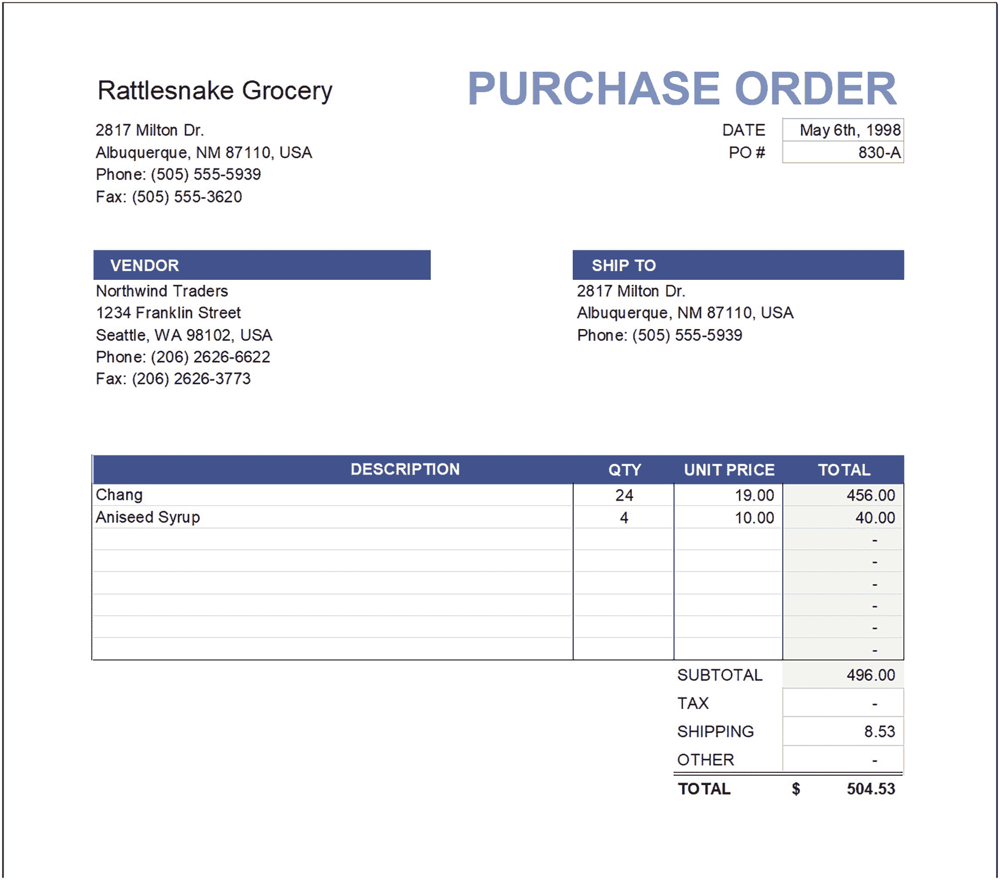
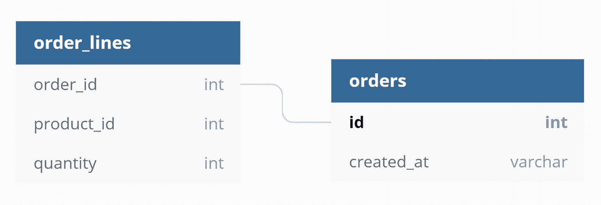
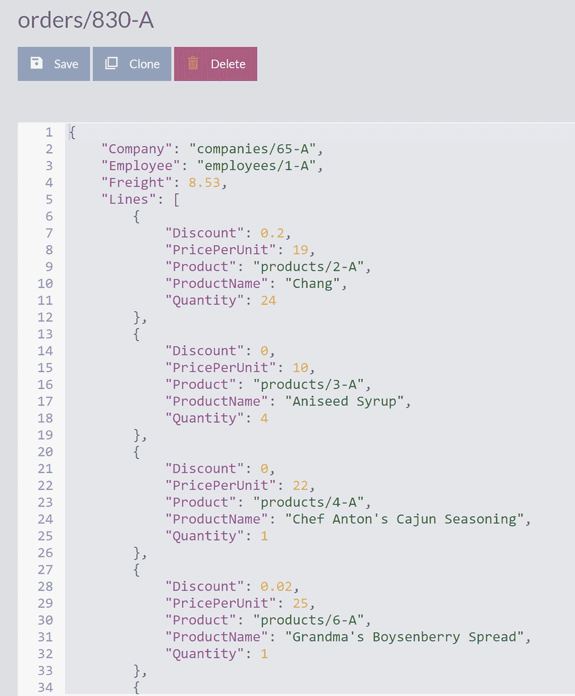
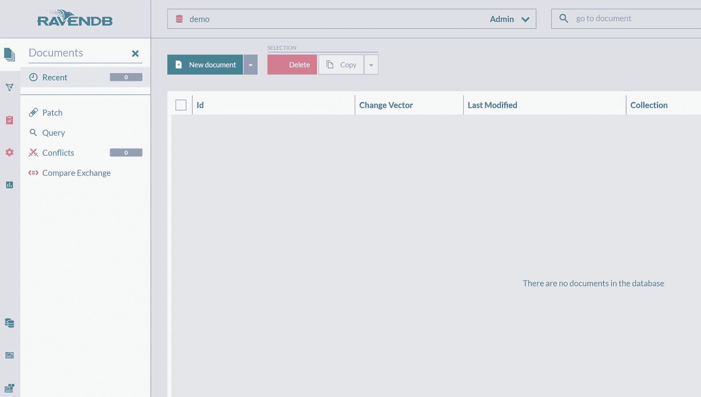
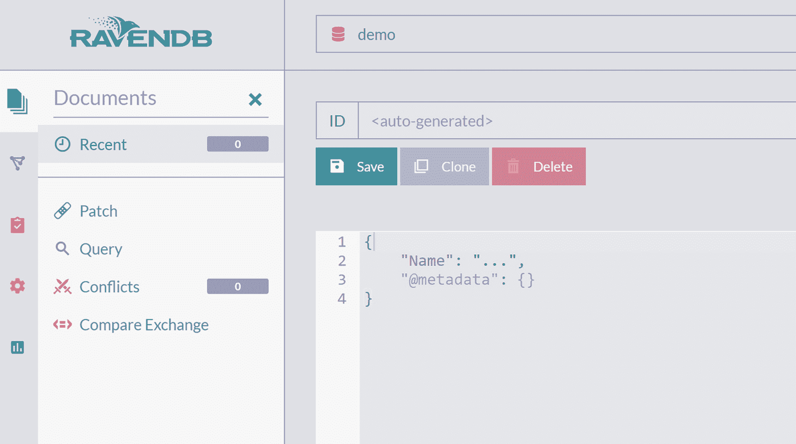
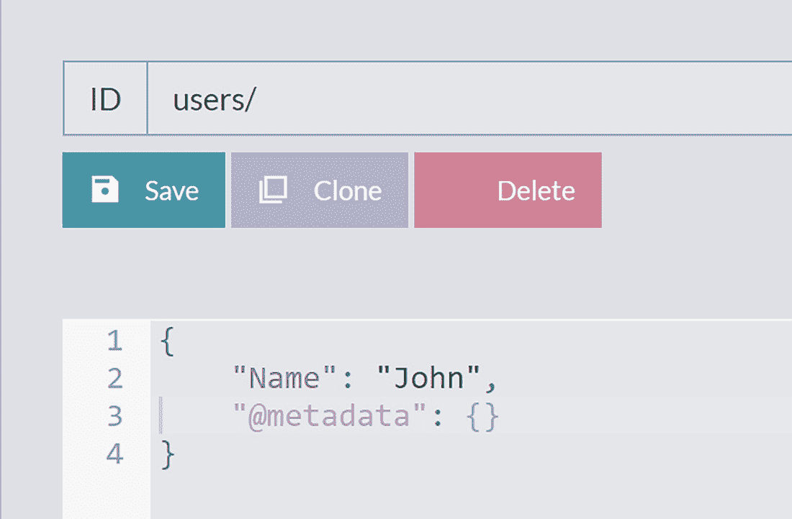
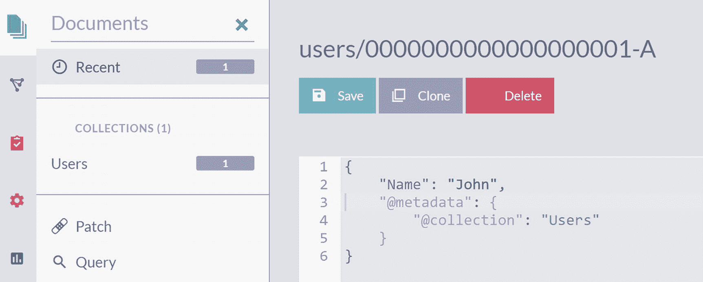
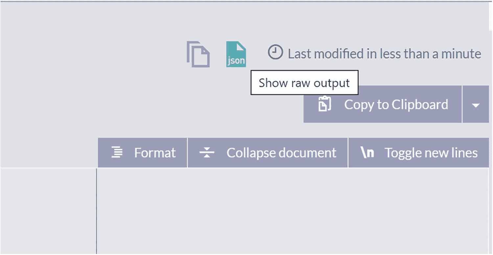

# 2. 文档建模

建模是每个应用程序开发核心的关键过程。我们可以很容易地为这个主题专门写一整本书，因此仅用一章来讨论这个主题不可避免地会导致许多遗漏。然而，我们的目标是向你简要介绍建模过程及其影响因素，并解释基于文档的方法。

在本章中，我们将首先探讨建模的概念概述。之后，我们将回顾如何在关系型数据库中建模数据、影响此过程的因素以及存在的局限性。接下来，我们将研究基于文档的建模方法、这一概念背后的思想及其主要特征。之后，我们将讨论你在从关系型建模过渡到基于文档的建模期间可能有的一些常见疑虑。最后，你将看到在 NoSQL 数据库中为文档间关系建模的标准技术。

## 抽象与泛化

英国统计学家 George E. P. Box 有一句名言：“所有模型都是错的，但有些是有用的。” 这句话不仅适用于数学和统计学，也适用于任何需要描述现实的情况。从构建心理模型来理解生活事件，到用 C# 编写发票处理应用程序，你总是需要创建现实的表示。

软件开发者编写计算机程序来描述特定的生活领域，并使用户能够跟踪现实世界的实体、它们的关系以及这些实体相互影响的各种方式。实际上，环境并非 *简单*（由少数对象组成），而通常是 *复杂*（许多组件）的。

此外，现实并非直观（易于理解），而是 *复杂* 的。在这样的系统中，对象之间的连接和交互并不明显。许多活动部分高度相互关联。因此，一个或多个实体发生的任何变化不仅会影响它们自身，还会传播到系统的其余部分。这种涟漪效应难以把握，那些变化带来的不可预见的后果也难以理解、控制和用编程语言描述。

幸运的是，软件开发者在面对这些挑战时并非束手无策，多年来我们开发了许多工具和方法。其中最重要的之一是 *抽象*（abstraction）。在建模时，我们将范围缩小到只涵盖我们感兴趣的实体的子领域。此外，我们将审视这些实体的属性，并隔离主要的属性，忽略所有对构建我们子领域的表示没有贡献的细节。这个过程是 *抽象* 的核心——移除各种对理解我们正在建模的子领域没有贡献的信息。我们可以说这与 *泛化*（generalization）的过程非常相似——选择一组特定的对象，观察它们的共同或共享属性，然后使用这些属性来描述它们。

例如，假设我们正在为一个小区书店构建一个应用程序。书店老板打算为顾客创建一个会员俱乐部。他们可以加入，填写他们的兴趣领域和个人基本信息，并接收每周阅读推荐、独家折扣以及感兴趣的新书到货通知。面对构建这样一项服务的挑战，你首先需要理解领域、用户、他们之间的交互以及你的应用程序需要产生的结果。接下来，你将着手为系统中所有识别出的实体建模。

仅看其中一个实体——顾客——就会揭示几乎无穷无尽的细节。顾客有名字、姓氏、电子邮件地址和出生日期。但他们也有眼睛颜色、最喜欢的香水和最喜欢的餐厅。回到我们的目标，即构建一个图书推荐服务，将揭示这些客户属性中哪些对我们的努力有帮助，哪些我们可以忽略。在与书店老板进行简短交谈后，我们得出结论，眼睛颜色、香水和餐厅选择并不影响图书选择，我们决定将它们从模型中省略。

我们可以重复应用这个心理过程，逐一移除与我们目标无关的任何属性。任何对我们的意图没有贡献的模型属性都将被移除，从而简化我们的模型。这样，我们的应用程序将只包含相关数据，这些数据将具有狭窄的范围。更少的数据意味着更简单（复杂度更低）的模型，并且将导致我们需要实现的更不复杂的过程。有趣的是，在建模时，如果我们忽略实体的属性，我们将获得更好的结果。因此，一个不那么精确和不那么全面的模型在描述我们的领域和满足应用程序需求方面会更好。


此外，我们必须意识到，我们正在构建的软件和创建的模型本身并非目标。模型是支持我们用户的手段。因此，随着现实生活和环境的演变，我们也应该开发、修改和扩展我们的应用程序以支持这些变化。我们的模型应该描述当前状态，并支持构建应用程序初始阶段发生的过程。同时，它们还必须能够承受修改，以便以我们合理的努力来支持变化。领域会扩展，生活中会出现意想不到的事情，我们的模型也将不可避免地随之演进，以跟上这些变化。

## 关系数据库中的建模

数据模型是描述和操作我们数据的结构与形状的集合。在关系数据库占主导地位的时期，主导的数据模型是关系数据模型（`RDM`）。它由一组表组成，每个表包含一系列行。每一行代表一个实体，由列（单元格）构成。一列可能包含对同一表或另一表中某一行的引用，从而实现实体之间关系的概念。

让我们看一个简单的数据模型示例。图 2-1 展示了一份采购订单文档。



响尾蛇杂货店采购订单的截图。列出的标签有供应商和收货方，一个包含 4 列的表格指示了描述、数量、单价和总价。

图 2-1

采购订单文档

图 2-2 展示了一个典型的关系数据模型。有两个实体，可以转化为表。`orders` 实体每个订单包含一行，而 `order_lines` 实体每个订单行项目包含一行。



一幅插图描绘了关系数据模型。列出了两个带有标题的表：订单行和订单。

图 2-2

订单的关系数据库模型

如您所见，这种关系数据库模型为我们提供了存储订单文档的方法。每一行都是简单值的集合。行无法表示任何复杂的东西——您无法存储列表或嵌套结构。因此，我们无法保存作为订单组成部分的订单行。换句话说，缺乏高级功能迫使我们将像订单这样的复杂实体拆分为两个表：`orders` 和 `order_lines`。

正如我们刚才看到的，`RDBMS` 表与 Excel 工作表非常相似——一行接一行的单元格，包含简单的线性信息——如数字、字符串或日期。订单行无法持久保存订单行列表，因此我们不得不引入另一个表来保存订单行，并在这两个表之间建立关系以表示父子连接。

审视这份普通文档的建模练习，揭示了我们必须做的三件事：

1.  创建 `orders` 表。

2.  创建 `order_lines` 表。

3.  定义这两个表之间的所有权连接。

我们从一个在现实生活中作为单张纸存在的文档开始。为了在关系数据库中为这份纸质文档建模，我们必须创建两个实体并建立连接。这种将订单与其行项目分离的做法，是由于 `RDBMS` 本身的技术限制而强加给我们的。

## 数据封装挑战

关系数据库的一个常见做法是它们过度暴露于直接访问。数据库应被视为一种持久化内存中实体的方式。一个厚实的领域层应该将数据库屏蔽起来，防止直接访问。该领域可以并且应该实现领域规则，包括静态和动态的。数据库结构不应暴露给使用您应用程序的客户端。您持久化数据的完整性有多个层面，它们应由您的领域业务逻辑（用您的编程语言实现）来检查。

## NoSQL 数据库中的建模

本节将探讨 NoSQL 数据库建模方法的起源、可以表示数据的技术以及一些最佳实践。

看看编程语言，您可以用任何语言表达您的想法——确实，用汇编语言开发 ERP 系统是可能的。但汇编并不是完成该任务的最佳工具——随着岁月的流逝，我们的行业为开发业务应用程序开发了更好的工具。

数据库也是如此——您可以在关系数据库和 NoSQL/文档数据库中为相同的领域建模。没有技术限制。然而，与关系建模相比，许多开发人员会发现面向文档的建模更加自然。面向文档的模型更接近被建模的真实生活文档，并且您需要做的调整比数据库技术方面所要求的要少。

当使用文档数据库时，您最大的障碍将是您的习惯。多年来，甚至几十年来，您一直以一种方式做事，而现在，突然之间，您需要放弃，忘记所有最佳实践，并开始遵循一套新的最佳实践，这需要一次信念的飞跃。

关系数据库基于表及其之间的关系。当为 `RDBMS` 建模时，您遵循这一点。我们可以在关系数据库中将所有东西建模为一组表，但同样的东西也可以在 NoSQL 数据库中建模为一个文档。真正的挑战是创建一个模型，使您能够利用所使用的特定数据库提供的功能。一个合适且恰当的文档数据模型可以让您的生活更轻松，并让您几乎完全忘记数据库——您的数据库可以成为开发周期中一个“无聊”的组件。

因此，良好面向文档建模的第一条规则是“不要将关系数据库建模技术应用于 NoSQL”。关系数据库和文档数据库是两个不同的世界。它们应用不同的范式，具有不同的方法，并且有着完全不同的理念。

如果您未能遵循这个建议，您最终将得到一个不恰当且非最优的模型。这会使您的生活更加艰难，即使执行简单的任务，您也可能要与数据库“斗争”。但是，您不应该将数据库视为敌人。您应该将其视为盟友和朋友。而朋友就是用来帮助的。

### JSON 文档

NoSQL 文档数据库的第一个基本特征是它们存储文档的格式。对于大多数 NoSQL 数据库，`JSON` 是原生或支持的格式。`JSON` 由 Douglas Crockford 在 21 世纪初定义，代表 JavaScript 对象表示法。这种格式是文本化的，由 `ECMA` 标准化，尽管它是 JavaScript 的一个子集，但 `JSON` 是语言无关的。

回到我们包含订单行的订单示例，我们可以用 `JSON` 格式表示它，如下所示：

```json
{
"Company": "ACME",
"Total": 496,
"Lines": [
{
"ProductName": "Chang",
"PricePerUnit": 19,
"Quantity": 24
},
{
"ProductName": "Aniseed Syrup",
"PricePerUnit": 10,
"Quantity": 4
}
]
}
```

与关系数据库不同，我们没有技术限制迫使我们将这个订单拆分为多个实体。此外，`JSON` 是数据交换的行业标准格式。所有主要语言，如 `C#`、`Java` 或 `Python`，都支持将对象序列化为 `JSON` 格式以及从 `JSON` 反序列化回对象。

因此，在为 NoSQL 数据库建模数据领域时，我们的目标是开发一组描述我们子领域的 `JSON` 文档。在下一节中，我们将看到如何处理这项非同寻常的任务。


### 建模良好文档的特性

没有一种算法可以确保达到完美模型。建模技巧是通过多个项目的经验积累获得的。你会尝试构建一个模型，实施它，然后随着应用程序的运行和变更请求的到来，随时间推移对其进行评估。此外，建模事物的方式永远不止一种。存在许多变体，你无法将任何变体标记为“恰当的”、“最佳的”、“最合适的”或“符合规范的”。许多因素将影响这一过程——你需要考虑性能、存储分配、查询类型、业务规则和方向。你的应用程序极有可能会不断演进。

然而，尽管我们无法制定严格的规则和配方来塑造和构建文档，但我们可以观察建模良好的文档所具有的一些良好特性。多年的建模经验告诉我们所需的特性是：

*   *独立性*：文档应该独立于任何其他文档而存在。
*   *隔离性*：文档应该能够独立于其他文档进行更改。
*   *一致性*：文档应该无需参考其他文档即可自行理解。

这些理想结果的好处，可以通过展示不遵循这些原则的建模后果来最轻松地解释。让我们再次查看上一节中的 JSON 模型（如清单 2-1 所示）。

```json
{
  "Company": "ACME",
  "Total": 496,
  "Lines": [
    {
      "ProductName": "Chang",
      "PricePerUnit": 19,
      "Quantity": 24
    },
    {
      "ProductName": "Aniseed Syrup",
      "PricePerUnit": 10,
      "Quantity": 4
    }
  ]
}
```
**清单 2-1** JSON 订单文档

清单 2-1 展示了一个订单的 JSON 表示。如你所见，此订单有两个订单行。观察第一个：

```json
{
  "ProductName": "Chang",
  "PricePerUnit": 19,
  "Quantity": 24
}
```

现在，让我们从第一个目标——*独立性*的角度考虑，我们是否可以将这个订单行建模为一个单独的文档。这个订单行是独立的吗？它能有意义地存在吗？进一步想想，你是否见过一张只印有订单行、没有更多细节的纸？答案很明确——订单行无法独立存在；在其父订单的范围之外，它没有意义。我们将订单行建模为单独的文档将导致 JSON 失去实质内容。

接下来，让我们检查我们的订单与系统中其他文档相比的隔离程度。如果更新一个文档也意味着你需要更新数据库中的任何其他文档，那么该文档就不是*隔离*的。所以我们可以问一个问题——此订单内容的任何更改是否会影响产品或公司？答案是否定的。因此，我们验证了订单模型符合*隔离性*原则。从否定该原则的角度来看，这里有一个不具备隔离性的订单模型示例：

```json
{
  "Company": {
    "Name": "ACME",
    "TotalOrders": 1,
  },
  "Total": 496,
  "Lines": [
    {
      "ProductName": "Chang",
      "PricePerUnit": 19,
      "Quantity": 24
    },
    {
      "ProductName": "Aniseed Syrup",
      "PricePerUnit": 10,
      "Quantity": 4
    }
  ]
}
```

在这个例子中，我们决定扩展公司信息以跟踪总订单数。因此，每当我们创建一个新订单时，都需要更新同一公司的所有现有订单，并将 `TotalOrders` 值加一。这样一个扩展后的模型就不再具有隔离性了。我们在一个文档范围内所做的更改会产生连锁反应，导致必须更改一个或多个其他文档。

最后，如果文档不具备*一致性*，就无法仅凭其包含的信息确定其含义。审视我们的订单，我们可以得出结论，我们拥有所有需要的信息：Acme 公司下了一个包含两种产品各多个数量的订单；我们可以看到我们承诺给他们的价格以及此订单的总价值。然而，仔细检查后，我们发现不知道将订购的货物送到哪里。我们需要查阅另一个包含 Acme 地址的文档，才能获得关于此订单的完整信息。以下是我们可以如何扩展订单模型以使其一致：

```json
{
  "Company": "ACME",
  "ShippingAddress": {
    "City": "Albuquerque",
    "Country": "USA",
    "Line1": "2817 Milton Dr."
  },
  "Total": 496,
  "Lines": [
    {
      "ProductName": "Chang",
      "PricePerUnit": 19,
      "Quantity": 24
    },
    {
      "ProductName": "Aniseed Syrup",
      "PricePerUnit": 10,
      "Quantity": 4
    }
  ]
}
```

在本节中，我们了解了建模良好的文档所具有的三个特性。之后，我们依据这些原则检查了我们最初的订单模型，并最终将初始模型修正为最终版本。这个最终的订单文档包含了关于订单的完整信息（*一致性*），我们对它所做的任何更改都不会迫使我们更新其他文档（*隔离性*）。此外，该模型的*独立*性质使我们能够自由地制作纸质版本并放入信封邮寄——收件人能够检查并理解它，无需提出额外问题。

通过这种建模，我们还成功地实现了另一个方面——我们创建了一个*时间快照*模型。我们的文档捕获了文档创建时所有相关信息的状态。例如，我们记录了两种产品的价格——如果这些产品在订单创建后降价或涨价，该变化将不会影响我们的文档。此外，配送地址经过验证是有效的。如果它在未来发生变化，例如公司搬迁，我们将有一个精确的记录表明货物是送往美国阿尔伯克基，而不是其他城市或国家。这种防止数据损坏的重要性不容小觑。

在下一节中，我们将看到，除了这些优质模型的特性外，我们还有一个更强大的心智模型用于开发文档模型。

## 聚合

正如我们在前一章所见，NoSQL 生态系统拥有由不同数据库实现的多种不同风格和方法。然而，键值存储、文档存储和列族存储这三类数据库共享一种共同的方法，即为你提供定义*聚合*的能力。

*聚合*是一个源自域驱动设计（DDD）的术语，它代表被视为一个单一单元的一组相关对象。假设你将纸质文档拆分为信息片段视为规范化过程。那么，聚合导向则代表相反的过程——*反规范化*——决定这些分离的数据块中哪些属于一起，并将它们汇集到一个单元中。

随之而来的自然问题是“这个单元应该多大、多全面”？如果第三范式是一个极端，我们是否应该走向另一个极端，将整个域建模为一个大的单元？要回答这个问题，我们需要深入探究聚合这个单元所代表的本质。

## 变更单元与一致性单元

聚合是一个*变更单元*，也是一个*一致性单元*。

一个*变更单元*将是你数据库模型中能够处理所有请求的变更，而无需访问其他文档的每一个实体。换句话说，我们所做的变更都在一个聚合内部传播。

回到我们文档良好建模的三个属性，我们可以看到聚合符合以下要求：

*   独立且内聚——它们是相关对象的集合，在一个 `Document` 中组合在一起。这些对象包含完整且全面的信息，可以作为一个独立的单元存在。我们可以在无需查看相关聚合的情况下理解一个聚合。
*   隔离——作为一个变更单元，聚合可以独立于其他文档进行修改。

聚合的第二个重要属性是它们代表一个*一致性单元*。一个一致的数据库在任何时间点都只包含有效数据。存储在数据库中的所有信息都将符合所有业务规则、约束和验证检查。无论我们对聚合应用什么变更，如果我们使用了验证规则，它们在保存到数据库时将保持有效。

回到我们通用的 `Order` 示例，如果我们在 `Lines` 集合中再添加一行，我们还需要通过重新计算 `Order` 的新总值来更新 `Total` 属性。如果它包含更多属性，比如 `VAT` 或运输成本，它们也需要更新。我们构建的系统可能会有一些更高级的规则——例如，我们可能为海外运输提供批量折扣。在这种情况下，仅仅添加一行订单就会触发一系列更新、规则检查、验证检查以及各种计算带来的一些额外更新。在应用所有更新之后，我们将以原子方式将 `Order` 持久化到数据库中；我们的 `Order` 聚合包含了一组同时更改的单元。这个变更集已经过验证，符合所有业务和其他验证规则。我们现在可以确信，我们的数据库中保存的 `Order` 只包含有效数据。

## 分布式系统

然而，数据库只是我们正在构建的软件系统的一个组成部分。从更宏观的视角来看，我们会发现现代应用程序是复杂的。它们由许多组件组成，形式多样——从工具类、进程内服务，到物理分离的服务，并在互联机器的网络上执行。服务之间通过同步或异步方式进行通信。

举个例子，看一个简单的网店。客户可以将产品添加到购物车并完成 `Order`。`Order` 被保存在网店应用程序中，发送确认邮件，并被推送到作为运营核心的 `ERP` 系统。即使在这个小系统中，我们也能看到三个主要的分离组件：

*   网店应用程序
*   邮件服务器
*   ERP 系统

这是三个存在于分离机器上、通过网络通信的隔离组件。以这种方式构成的系统被称为*分布式系统*。

从业务逻辑的角度来看，发送确认邮件、创建新的 `Order` 并将其推送到 `ERP` 系统是一个事务性操作。然而，在像这样的分布式系统中，你所习惯的标准事务概念不再适用。例如，当你尝试发送新的 `Order` 时，如果 `ERP` 系统不可用，会发生什么？我们应该放弃它吗？在这种情况下，我们将在何时发送确认邮件？

分布式系统之所以具有挑战性，是因为它们很复杂，并且因为你通常所做的许多假设不再成立。之前你作为同步执行的操作，在分布式系统中可能是异步的。每次通过网络通信时，你都必须为通信失败的场景提供回退方案。在分布式组件之间发送的消息有时会被排队，并在你最初发送后的几十秒、甚至几分钟后才送达。

因此，在大多数情况下，在分布式系统中，你将无法依赖应用程序的事务特性。分布式系统具有*最终一致性*的概念。你的业务事务最终会完成，但无法保证你发出的变更需要多长时间才能被系统组件传递和接受。在这个传播过程结束时，你的分布式系统将变得一致，但这个事实是你必须时刻意识到的。

## 分布式系统中的聚合

在分布式系统的背景下重新审视*聚合*的概念，揭示了其对聚合边界设计的重大影响。具体来说，聚合边界的范围将决定哪些数据单元成为其一部分。回到聚合是*变更单元*和*一致性单元*这一事实，我们可以得出结论：修改聚合并将其保存到数据库将代表一个*事务*。

什么是事务？事务代表一个单独的、不可分割的操作，它要么作为一个完整的单元成功，要么失败。事务的部分完成是不可能的，并且当事务处理完成后，你将获得关于结果的精确而可靠的反馈。这个特性通常被称为*原子性*，正是因为事务的不可分割性。

为什么原子性很重要？事务通常代表一组紧密耦合的操作。仅执行其中一部分可能会使你的数据陷入不一致和损坏的状态。举个例子，想象一下向 `Order` 添加一个新产品。你将：

*   创建一个包含该产品的新订单行。
*   重新计算订单总额以包含新订单行的金额。

如果这两个操作只执行了一个，会发生什么？你要么收取了一个未包含在 `Order` 中的产品的费用，要么产品在 `Order` 中但没有增加 `Total`。换句话说，你要么给自己，要么给客户造成了财务损失。

因此，很明显，我们需要将这两个操作视为一个原子单元。结果，它们要么都成功（创建了新的订单行并且 `Total` 被正确更新），要么都失败（订单总额保持不变，因为没有添加新的订单行）。事务失败本身并不严重。你可以通过几种标准方式处理它，包括在显示错误消息之前重试它。然而，关键的是，在成功或不成功的两种情况下，你的数据都将保持一致的状态。

## 聚合作为事务边界

我们可以得出结论，聚合是支持事务的。我们将加载一个代表聚合的 `Document`，在数据库层面以事务方式更新它并将其保存回数据库，从而保证我们 `Document` 的一致性。

你可以自问——为什么我们不能在一个事务中更新两个文档？这确实是可能的。正如我们已经提到的，建模是一项微妙的智力活动。没有复杂的规则，到目前为止你所读到的一切都是基于这些原则实际应用中学到的最佳实践建议。因此，在一个事务中更新两个聚合文档是可能的。然而，推荐的方法是将那些需要在事务中一起更改的事物分组到一个聚合中，然后以最终一致的方式将更改传播到系统的其余部分。此外，在很多情况下，你将受限于分布式系统的性质而不得不采用最终一致性。

一个典型的例子是将你的应用程序分离为微服务。每个微服务通常会有自己的数据库。跨越驻留在不同数据库中的两个或多个聚合的事务是不可行且困难的。在开发、维护和演进这样的应用程序时，这种方法带来的问题将多于好处。

因此，你应该将聚合的边界视为事务边界。对于应用程序中的大多数更改，你将只需要加载、更改和保存一个 `Document`——一个代表你聚合的文档。

系统中发生的其他一切将不是事务性的，而是最终一致的。你应该考虑到这一点并实现错误处理机制。此外，你应该仔细处理应用程序中的每一个业务场景，确定何时同步通信是必须的，何时可以使用异步通信。

## RavenDB 中的建模

本节将展示 `RavenDB` 如何处理文档，以及你如何创建和检查文档。同时，我们也将了解分配给每个 `RavenDB` 文档的标识符。

### 文档

`RavenDB` 以 `JSON` 格式存储文档，它们的大小几乎是无限的——最大可达 `2Gb`。但是，你应该将文档的大小限制在不超过几兆字节。大于此大小的 `JSON` 加载和保存回数据库会很麻烦，并且这通常是你的模型并非最优的强烈信号。

在上一章中，我们创建了一个空数据库并用一些示例数据对其进行了初始化。在图 2-3 中，你可以看到来自 `Orders` 集合的一个 `Order` 文档。



一张包含 34 行代码的截图，用于创建订单文档，具有保存、克隆和删除选项。

图 2-3

RavenDB 中的订单文档

此文档包含两个主要元素：

*   标识符 `orders/830-A`

*   `JSON` 主体

这两个是必需的。每个 `RavenDB` `Document` 必须有一个唯一的标识符和非空的 `JSON` 内容。

让我们创建我们的第一个 `Document`。首先，按照上一章的指示创建一个新的空数据库。数据库成功创建后，你将看到一个如图 2-4 所示的屏幕。



一张空的 Raven D B 数据库截图。它有 2 个部分。在文档部分下，列出了最近、补丁、查询、冲突和比较交换的图标。另一个部分是一个包含 4 列的表格，标题为：I d，变更向量，最后修改时间和集合。

图 2-4

空的 RavenDB 数据库

要创建一个新文档，你需要点击 `New document` 按钮，这将打开如图 2-5 所示的屏幕。



一张创建新文档并写有代码的截图。

图 2-5

创建新文档

在 `ID` 字段中填入 `users/`，对于 `JSON` 主体中 `Name` 字段的值，你可以填入任意字符串，如图 2-6 所示。



一张填充新文档的截图。一个四行的任意字符串指示了用户名称，I D 字段填充为 users 斜杠。

图 2-6

填充新文档

在你点击 `Save` 按钮后，你的 `Document` 将被创建，你将看到这个新 `Document` 的详细信息，如图 2-7 所示。



一张截图描绘了新文档内容。屏幕在文档保存后显示了用户详细信息。

图 2-7

新文档的内容

这里有几件有趣的事情需要注意，让我们逐一回顾。

在 `Save`、`Clone` 和 `Delete` 按钮上方，值 `users/0000000000000000001-A` 是为你生成的 `ID`。你记得，你在 `ID` 字段中填入了 `users/`。`RavenDB` 将此值作为未来 `ID` 的前缀，生成了唯一的后缀 `0000000000000000001-A`，并将其附加到你的前缀后。一旦分配，`ID` 就无法更改——它是这个 `Document` 的唯一标识符。

你还会注意到你的前缀 `users/` 在另外两个地方出现。一个是在左列，你可以看到创建了新的集合 `Users`，而你新创建的 `Document` 被放在其中。但是，这种集合关联性存储在哪里呢？答案在于 `@metadata` 属性：

```json
"@metadata": {
"@collection": "Users"
}
```

如你所见，`@metadata` 本质上只是另一个 `JSON` 属性。与其他属性的唯一区别在于 `@metadata` 是一个保留名称。所有 `RavenDB` 系统名称都以 `@` 符号开头，因此它们不会与你的属性冲突。在 `@metadata` 内，属性 `@collection` 包含了集合的名称。

图 2-5 仅显示了代表你 `Document` 的 `JSON` 的部分视图。然而，`RavenDB` Studio 具有你可以用来检查原始和完整 `JSON` 的功能。如图 2-8 所示，在文档内容上方的区域，有一个 `Show raw output` 图标。



一张截图描绘了显示原始输出的图标，该文档在不到一分钟前被修改过。

图 2-8

显示原始输出图标

点击此图标将打开一个新的浏览器标签页，显示你 `Document` 的完整原始 `JSON`：

```json
{
Name: "John",
@metadata: {
@collection: "Users",
@change-vector: "A:1-4Ocnef4WVEaQ9NeWn3Yhig",
@id: "users/0000000000000000001-A",
@last-modified: "2021-05-05T20:05:53.1467758Z"
}
}
```

你现在能够看到 `@metadata` 包含的所有系统属性：

*   `@collection` - 你的 `Document` 将被放置的集合名称。

*   `@change-vector` – 变更向量。这是一个更高级的概念，但我们简要提及，变更向量提供了在数据库集群的多个节点上对同一 `Document` 的变更进行部分排序的方法。

*   `@id` – 你的 `Document` 的标识符。

*   `@last-modified` – `Document` 最后一次更改的 `UTC` 时间戳。

### 标识符

标识符是每个 RavenDB 文档的必需部分。一旦分配，标识符就无法修改。只要文档存在，它就将拥有在创建时分配给它的相同标识符。此外，RavenDB 将确保每个文档在数据库级别都有一个唯一的标识符。

重新审视上一节中的 `@metadata` 属性，我们可以看到 `@id` 是一个字符串：

```
@id: "users/0000000000000000001-A"
```

当你创建一个新文档时，你可以为 id 传递各种字符串值，RavenDB 会以不同的方式做出反应：

*   空字符串 – 当你传递一个空字符串作为 `id` 时，RavenDB 将生成一个 GUID 并将其分配为 `id`。
*   `集合名称/` – 一个任意字符串后跟一个正斜杠。传递 `users/` 就是一个例子。字符串 `users` 将是集合的名称，而斜杠将向 RavenDB 发出信号，为文档生成一个唯一的标识符。此标识符将被生成为一个前面补零的数字，并加上节点名称。例如，将 `users/` 作为文档的 Id 传递，将导致 RavenDB 分配 `users/0000000000000000001-A` 作为唯一标识符。
*   `集合名称|` - 任意字符串后跟一个管道字符。任意字符串将被视为集合的名称，而管道字符将触发集群范围内的协调，以在集群级别生成一个唯一的数字。因此，将 `users|` 作为文档的 Id 传递，将导致 RavenDB 分配 `users/1`。
*   在所有其他情况下，当字符串非空且不包含斜杠或管道字符时，RavenDB 将接受它并不加修改地分配为你新文档的 id。

如果你的 ID 没有很强的理由，最好让 RavenDB 生成 ID。采用 `集合名称/` 将产生唯一的标识符，这些标识符也将是可排序的，使 RavenDB 能够为搜索和提取进行优化存储。如果你出于某些原因需要生成自己的标识符，建议找到一个可以生成词法可排序标识符的库。

### 文档关系建模

你使用的数据库名称中不包含 `关系` 这个词，并不意味着你无法对文档所代表的聚合之间的关系进行建模。本节将探讨 RavenDB 中文档之间可能的关系类型、建模它们的各种方法，以及如何验证可能解决方案的强项和弱项。

上一节重点介绍了 RavenDB 文档的 JSON 内容，而本节则侧重于这些文档之间的连接。这些关系不是实际数据，而是元数据，关系建模的要点是如何扩展文档以包含这些额外信息。

尽管实体之间可以通过多种方式互连，但我们将研究三种最常见和基本的方式：一对一、一对多和多对多。

#### 一对一关系

这是我们第一次提到这种类型的关系，但你之前已经有机会观察到它了。让我们重新审视我们最喜欢的带有 `收货地址` 的订单示例：

```
Id: orders/1
{
  "Company": "ACME",
  "ShippingAddress": {
    "City": "Albuquerque",
    "Country": "USA",
    "Line1": "2817 Milton Dr."
  }
}
```

一个订单有其物理身份（通常以纸质文档的形式出现）及其唯一标识符 `orders/1`。这个唯一标识符为我们提供了一种识别同一订单的多个实例的方法——比较两个订单归结为比较它们的 Id 值。

另一方面，如果我们检查 `ShippingAddress`，我们会意识到它没有在独特的、可区分的存在意义上的身份。每个订单都是唯一的，而我们可以有多个运往同一地址的货件。要确定两个货件是否发往完全相同的地点，我们必须比较地址的三个组成部分：`City`、`Country`、`Line1`。因此，我们可以得出结论，它的值代表了地址的身份。在领域驱动设计中，这些对象被标记为 `值对象`。

`值对象`的存在与其父文档紧密耦合。它们是嵌入其中的实体所具有的唯一上下文，这赋予了 `值对象` 完整的意义。让我们再观察一个 `值对象` 的例子：

```
Id: users/1
{
  "Name": "John",
  "Age": 63
}
```

想象一下，给你看一个数字 `63`。这个数字代表什么？某人的体重？温度？小时？价格？你根本无法判断——`63` 本身可以代表太多事物，甚至可能是一个不代表任何东西的随机数字。

现在，用属性名称来补充它，`"Age": 63`，我们可以理解它表示年龄。但我们无法知道谁是 63 岁？也许是一座桥或一栋建筑的年龄？不幸的是，我们再次缺乏上下文。

最后，在观察它所属实体内的这个属性时，我们有了完整的图景——约翰是 63 岁。

这个思维练习为我们提供了一个识别 `值对象` 的简单方法。每当你需要上下文来确定信息的精确含义时，你就会发现 `值对象`。正如你所见，`值对象` 可以像一个数字那样简单，也可以像 `收货地址` 那样复杂的结构，它们是实体的基本构建块。

##### 嵌入

对于 `年龄` 和 `收货地址`，我们都应用了一种称为 `嵌入` 的技术。在这两种情况下，它们单独存在的理由都不充分，因此我们将这些小文档插入到代表实体的大文档中。


##### 引用

然而，存在一些情况，我们会注意到两个文档，它们各自拥有独立的标识和存在的理由——并且它们处于一种一对一的关系中。例如，想象一个包含组织内所有员工信息的人力资源管理系统。除其他事项外，我们为每个 `Employee` 保存一份 `Resume`——它是在候选人申请职位时输入到 HRM 系统中的。当她接受工作邀请后，我们将此候选人晋升为全职 `Employee`。观察 `Employee` 和 `Resume`，我们可以看到它们都具有物理存在和自己的身份。同时，它们具有清晰的一对一关系：每个 `Employee` 恰好有一份 `Resume`，而对于每份 `Resume`，我们都可以确定是哪个 `Employee` 提交了它。然而，在我们决定如何建立关系之前，首先需要进行一些初步建模。清单 [2-2] 展示了 `Employee` 实体的一个模型。

```
Id: employees/1
{
Name: "John Doe",
DateOfBirth: "1958/05/08"
}
```
清单 2-2 Employee 文档模型

接下来，我们为 `Resume` 建模，如清单 [2-3] 所示。

```
Id: resumes/1
{
Employee: "employees/1",
Education: "Yale",
Specialty: "IT"
}
```
清单 2-3 Resume 文档模型

这两个模型是简化的，但它们展示了基本信息。仔细观察 `Resume` 模型，我们可以看到属性 `Employee: "employees/1"` 直接将 `Resume` 链接到一个 `Employee`。

这就是一个**引用**。RavenDB 中的引用只不过是包含其他文档字符串 ID 的属性。

由于 `Resume` 通过引用指向 `Employee`，我们可以说这个链接代表“由...拥有”——`Resume` 被一个 `Employee` 拥有。我们可以反转这个关系，如清单 [2-4] 所示。

```
Id: employees/1
{
Resume: "resumes/1"
Name: "John Doe",
DateOfBirth: "1958/05/08"
}
Id: resumes/1
{
Education: "Yale",
Specialty: "IT"
}
```
清单 2-4 具有反转引用的 Employee 和 Resume 文档

我们现在拥有的是 `Employee` 持有一个指向 `Resume` 的引用：`Resume: "resumes/1"`。这个引用可以解读为“拥有”——`Employee` 拥有一个 `Resume`。

当然，你也可以建立双向的一对一关系，如清单 [2-5] 所示。

```
Id: employees/1
{
Resume: "resumes/1",
Name: "John Doe",
DateOfBirth: "1958/05/08"
}
Id: resumes/1
{
Employee: "employees/1",
Education: "Yale",
Specialty: "IT"
}
```
清单 2-5 具有相互引用的 Employee 和 Resume 文档

`Employee` 和 `Resume` 现在通过包含对方文档 ID 的属性相互指向。在一个显示 `Employee` 详细信息的屏幕中，我们可以轻松地提供 `Resume` 屏幕，因为 `Employee` 持有对其简历的引用。同样，显示 `Resume` 的屏幕可以提供一个指向相关 `Employee` 的链接，因为我们可以轻松访问 `Employee` 属性中的引用。

正如我们已经提到的，建模不是一个有严格规则的精确过程。我们对 `Employee` 和 `Resume` 所做的是：首先发现它们是相关的，然后确定这是一对一关系，最后应用了这种关系的三种可能实现方式：

1.  单向：`Resume` 指向 `Employee`。
2.  单向：`Employee` 指向 `Resume`。
3.  双向：`Employee` 和 `Resume` 都持有指向对方的引用。

然而，由于在数据库层面没有技术限制，我们还可以应用另一种方法——**嵌入**。我们已经提到 `Employee` 和 `Resume` 之间的关系是一对一，但也谈到了所有权。`Employee` 拥有 `Resume`，而 `Resume` 被一个 `Employee` 所拥有。这种“拥有”的措辞是嵌入的一个清晰方向，如清单 [2-6] 所示。

```
Id: employees/1
{
Name: "John Doe",
DateOfBirth: "1958/05/08",
Resume: {
Education: "Yale",
Specialty: "IT"
}
}
```
清单 2-6 带有嵌入式 Resume 的员工

在这种情况下，我们嵌入的不是一个没有身份的**值对象**，而是一个具有清晰身份的**实体**。这之所以可能，是因为存在清晰的所有权情况——`Employee` 恰好有一个 `Resume`，并且每个 `Resume` 属于一个特定的 `Employee`。

这种建模**一对一**关系的第四种方法是完全合理的。这取决于你来审视所有可能的方向，思考你应用程序中的流程和工作流，并确定可接受的建模解决方案。

此外，你还应该考虑未来。你的应用程序可能以哪些方式演进？你的用户可能会提出什么请求？随着数据量增长或文档变大，会发生什么？

考虑到这一点，让我们观察清单 [2-5] 中呈现的 `Employee` 建模变体。为了简单起见，我们有意使 `Employee` 和 `Resume` 都人为地过度简化。然而，如果你回想现实中的简历可能相当大，有时是三到四页，你就会意识到你将嵌入一个相当大的文档。不仅如此，在 `Resume` 包含员工参与项目列表的场景中，你会看到 `Resume` 随着月份和年份而增长。如果你需要加载、操作并将 `Employee` 保存到数据库，那就意味着 `Employee` 文档的大小会随着时间的推移而增长。

此外，假设你决定应用相同的技术，以同样方式嵌入更多文档。在这种情况下，你不可避免地会看到你的 `Employee` 文档变得非常庞大且操作起来非常笨重。

最后，如果需求发生变化，公司管理层决定为每个 `Employee` 引入不止一份简历——即公司申请合同，并且作为投标活动的一部分，为所有项目成员生成定制简历的场景，会发生什么？这将打破你的一对一建模，转变为**一对多**（一个 `Employee` 可以有多份 `Resume`）。修改数据库模型和你的代码以适应这个变更请求需要付出多少努力？像“我们想在数据库中支持一个 Employee 拥有多份 Resume”这样直接的句子，是否会导致工作量大得不成比例？

所有这些都表明建模是复杂的。你永远不会处于完成模型并宣布其为“最佳可能”的情况。因此，你永远不应追求完美和“唯一正确的方式”。同时，你也不应该试图预测未来，然后将你所有能预见到的变体都作为领域模型的一部分构建起来。相反，你应该做的是创建一个尽可能简单的模型，它既覆盖当前需求，又不会阻碍那些将成为你应用程序生命周期中正常且可预期的变更请求。


## RavenDB 中的引用完整性

正如你在上一节看到的，在 RavenDB 文档中建立引用非常简单。你只需引入一个具有明确名称的属性，并填入被引用文档的 ID。从 RavenDB 的角度来看，这个属性并无特殊之处，它只是另一个值为字符串的属性。因此，对于数据库引擎而言，这两个属性在结构和功能上是等同的：

```
Resume: "resumes/1",
Name: "John Doe",
```

RavenDB 不会检查 Id 为 `resumes/1` 的 `Resume` 是否存在。同样，你可以给你的 `Employee` 分配任意名称，也可以为 `Resume` 引用设置随机值：

```
Resume: "resumes/000",
Name: "Random Randomsson",
```

在这个例子中，我们创建了一个指向不存在的 `Resume` 的引用。在数据库层面，并没有机制能防止我们引入数据损坏。因此，很自然会产生疑问——关系数据库能在数据库层面保护我们免受数据损坏，RavenDB 暴露的这种行为是否是一种退步？我为什么要使用一个不能防止我犯下破坏数据错误的数据库？

此外，由于 `JSON` 格式的限制，你无法为特定属性指定具体类型。因此，如果你有一个整数类型的“age”属性，RavenDB 不会阻止你向其中存储“John”。而在关系数据库中，这样的尝试会导致错误。那么，该如何解释这一点？你为什么要选择一个会让你的应用可靠性降低、更容易出错的数据库？一个允许你向数据中引入损坏的数据库？

## 与关系数据库的比较

是的，如果将数据库视为系统中孤立的部分来看，这确实是真的。像 `SQL Server` 或 `PostgreSQL` 这样的关系数据库，会为你提供强类型列和检查引用完整性的方式，防止你建立指向不存在实体的引用。然而，在数据持久化这一更广阔的背景下观察数据库，则会带来一个显著不同的视角。

## 领域驱动建模

与 20 世纪 80 和 90 年代不同，当今的建模方法（如领域驱动设计）不再将数据库作为建模过程的起点。相反，它们推荐在编程语言中对业务领域进行建模，然后将领域实体持久化到数据库中。过去，大多数规划会议都始于白板前，开发人员会在上面绘制关系数据库表、字段以及大量用于建立它们之间关系的 `外键`。这个过程看起来与构建 `UML` 图非常相似，只不过数据库是“世界的中心”，整个系统的规划都始于数据库建模。遵循持久化模型，再对编程语言中的实体以及用于管理这些实体的 `CRUD` 操作进行建模。

从数据库“中心主义”的角度来看，将验证逻辑下推到数据库是很自然的追求。然而，随着领域建模技术的进步和发展，我们达到了今天这样在概念层面使用 `聚合`、`实体` 和 `值对象` 进行建模的阶段。我们分析流程，将企业项目划分为子域，并在 `子域` 范围内进行建模。进行这项活动的目的是纯粹地审视我们子域的业务和流程方面，同时记住这个活动的产物最终需要被持久化。尽管如此，持久化只是一个次要的考虑因素，而非主要的。

每个子域通常都有其特有的实体。不仅如此——每个子域都有其自己的一套业务规则，实体应根据这些业务约束进行验证。一个经验法则是，精心设计的业务领域应能防止无效对象的实例化。一个好的规则是“不可能的状态应该不可表示”这一原则。换句话说，你可以将某人的年龄声明为整数，并将检查工作下推给数据库，但从业务领域的角度来看，允许创建并存储一个年龄为 -50 或 0 的 `Employee` 是正确的吗？关系数据库提供的数据完整性机制只能覆盖你数据整体业务有效性中的一小部分。完整的验证和数据完整性规则集合是庞大的。它通常包含各种静态和动态约束，常常涉及处于不同状态的多个不同实体。例如，未成年人不应能够将啤酒添加到购物车中。

## 数据库的角色

审视数据库的主要角色，我们可以得出结论：当你将实体存储到其中时，数据库应该提供一种可靠的机制，以逐字且健全的方式持久化内存中的对象。因此，你可以将数据库视为一种将对象图从内存镜像到持久化媒介（通常是硬盘）的方式。

所以，透过狭隘的视角来看，关系数据库确实能够执行类型级别和引用完整性检查，在尝试存储无效数据时抛出错误，这一点是正确的。然而，在每个可靠的应用程序中，都应该存在高层次业务规则和检查机制的多层结构。采用良好的软件开发方法，你将永远不会让你的对象处于无效状态。

因此，在应用开发过程中，数据库应被置于适当的位置——不再是中心，而是一种持久化机制。其角色应该是可靠地存储已验证的对象，并提供快速可靠的手段来索引和查询这些数据。


### 一对多关系

对于这种关系类型，我们将再次以订单（`Orders`）为例，但这次我们将观察它们与公司（`Companies`）的关系。每个公司都可以有一个或多个订单。此外，我们将考虑每种建模方式的优点和约束条件。

回顾*独立性*、*隔离性*和*一致性*的原则，我们可以看到公司和订单应该被建模为单独的文档。将所有订单嵌入到公司文档中的选择是糟糕的——不仅因为公司和订单拥有独立的存在且彼此独立变化——而且随着时间的推移，订单数量的增长将导致公司文档变得异常庞大。此外，在一个文档中存在多个订单会引入并发问题；同时编辑现有订单和创建新订单会引发乐观并发冲突。正如你所见，这个内省过程给了我们足够的论据来高度确定地判定嵌入是一个次优选择。因此，很明显公司和订单应该是分开的文档。

下一步是决定如何在它们之间建立关系。回顾一对一建模，我们可以看到有两种选择。第一种选择如清单 2-7 所示，展示了一个公司持有订单文档 ID 列表的模型。

```
Id: employees/1
{
Name: "John Doe",
DateOfBirth: "1958/05/08",
Orders: [
"orders/1",
"orders/2",
"orders/3"
]
}
```
**清单 2-7**
一个带订单 ID 列表的员工

`Orders`属性包含属于该公司的订单 ID 列表。将此作为建立公司和订单之间关系的可能解决方案，会暴露出几个弱点：

*   我们放弃嵌入式设计的原因之一，是我们预见到订单数量会随时间增长。本质上，我们在这里面临同样的问题。想象一下公司可能拥有数百甚至数千个订单。这会导致`Orders`属性显著增长。操作订单列表将变得笨拙，并且随着时间的推移越来越困难。
*   加载公司的订单需要先加载公司文档，处理其`Orders`属性，然后通过获得的 ID 获取订单。这不是一个决定性的障碍，但它在我们的代码和逻辑中引入了不必要的复杂性，产生了额外的数据库请求。
*   随着公司订单数量的增长，对公司文档的读写操作也在不断增加。随着时间的推移，乐观并发冲突的可能性会成比例地增长。

你可以看到我们使用排除法得出了最后一个建模选项，如清单 2-8 所示。

```
Id: orders/1
{
"Company": "companies/1",
"ShippingAddress": {
...
}
}
Id: orders/2
{
"Company": "companies/1",
"ShippingAddress": {
...
}
}
Id: orders/3
{
"Company": "companies/1",
"ShippingAddress": {
...
}
}
```
**清单 2-8**
指向公司的订单

这个模型在订单侧实现了引用。每个订单都有一个`Company`属性，其中包含其所属公司的 ID。现在让我们对这个模型进行一系列检查：

*   公司和订单是两个独立的集合。它们各自有自己的标识，并且遵守隔离和独立的原则。
*   随着月份或年份推移，订单数量的增长不会影响文档的大小。
*   执行查询以获取特定公司的所有订单，不需要我们先加载公司文档。

正如你所见，我们得到的模型通过了我们的检查。我们可以得出结论，我们成功地在公司和订单之间建立了一个关系，它能够支持我们可预见的操作。

在这个例子中，我们发现了一对多建模的一个既定原则。它俗称为“较小侧引用”，指的是应该存储 ID 引用的关系一方。作为通用的最佳实践，你应该始终从这样一个模型开始：多个文档持有对单个文档的一个引用，而不是让一个文档持有一个指向多个文档的长 ID 列表。

典型的例子包括：

*   我们刚才观察的公司和订单
*   教授和学生，学生指向教授
*   公司和产品，产品指向公司
*   出版商和书籍，书籍指向出版商

当然，每种情况都是特定的。从“较小侧”方法出发，我们还应该考虑各种当前和未来的场景。一些可能的例外情况示例如下：

*   父母和子女，其中父母可能持有对所有子女的引用
*   所有者和公司，所有者指向公司
*   团队和球员，团队持有对球员的引用

与关系数据库相比，我们没有技术限制——我们的关系可以双向指向。这取决于我们需要什么方向。我们可以通过将事物置于情境中、思考我们正在建模的内容，并投入同等甚至更多的精力来规划我们应用程序和数据库的未来增长，从而实现这一点。

### 多对多关系

一旦你理解了一对多关系的本质，扩展到多对多关系就很容易了。让我们看一些多对多关系的现实例子。

*   社区（`Communities`）和成员（`Members`）——每个社区可以有多个成员，并且每个人可以属于多个社区。
*   祖父母（`Grandparents`）和孙辈（`Grandchildren`）——祖父母可以有多个孙辈，每个孙辈也有多个祖父母。
*   学生（`Students`）和课程（`Courses`）——学生可以注册多门课程，每门课程也有许多学生参与者。
*   书籍（`Books`）和作者（`Authors`）——一本书可以有多个作者，每位作者也可以写一本或多本书。

所有这些关系的建模方式与我们建模一对多关系的方式相同：我们将在较小的一方保持一个 ID 列表。因此：

*   成员将持有一个他的社区 ID 列表，因为社区可以有成千上万的成员。
*   一个孩子可能拥有的祖父母数量少于祖父母拥有的孙辈数量，因此我们将在孩子文档上保持一个关联列表。
*   课程可能有数百名学生，因此我们将在学生文档中扩展出一个课程列表。
*   多产的作者可以写几十本书，而书籍通常只有几位作者，因此我们将在书籍文档上建模一个作者 ID 列表作为属性。

现在我们知道如何建模存储在 RavenDB 数据库中的文档并建立它们之间的关系，下一章将展示如何查询这些文档。

## 总结

在本章中，我们介绍了 NoSQL 文档数据库中的通用建模原则。在比较了 NoSQL 和 SQL 方法之后，我们介绍了 JSON 文档的基础知识、聚合、良好建模文档的属性以及分布式系统中最终一致性的概念。最后，我们研究了 RavenDB 建模的具体内容，展示了标识符、关系以及引用完整性的一种方法。

在下一章中，我们将重点关注现代应用程序中最常见的操作——查询。你将学习执行过滤、排序和分页等基本功能。我们还将介绍更高级的主题，包括投影、聚合和解除关系引用。

