# 3. 查询

大多数现代 Web 应用程序执行的写操作相对较少，但读操作却非常频繁。本章将探讨你的应用程序将执行的最常见活动，以及 RavenDB 如何支持它。我们将学习 Raven 查询语言的基础知识以及使用它进行查询的基本方法。


## 在 RavenDB Studio 中查询

RavenDB Studio 有一个专门用于运行查询的面板。要打开它，请打开 `文档` 区域，其中列出了所有集合。在它们下方，如图 3-1 所示，有一些附加选项。`查询` 是其中的第二个选项。

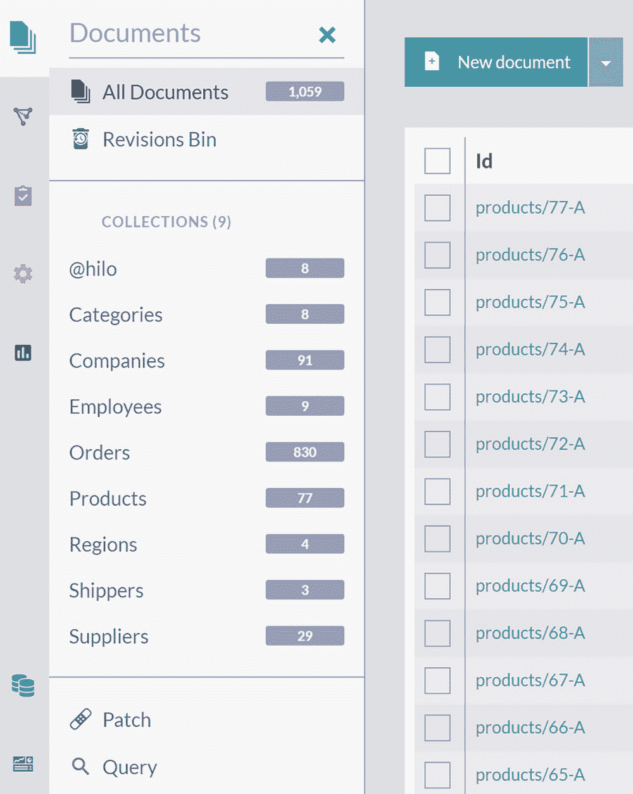
RavenDB Studio 文档页面的截图。左侧是集合列表和标有“补丁”与“查询”的选项卡，右侧列出了多个文档。
图 3-1：集合列表下方的查询选项

点击此菜单选项后，你将看到一个用于在 Studio 中运行查询的面板，如图 3-2 所示。

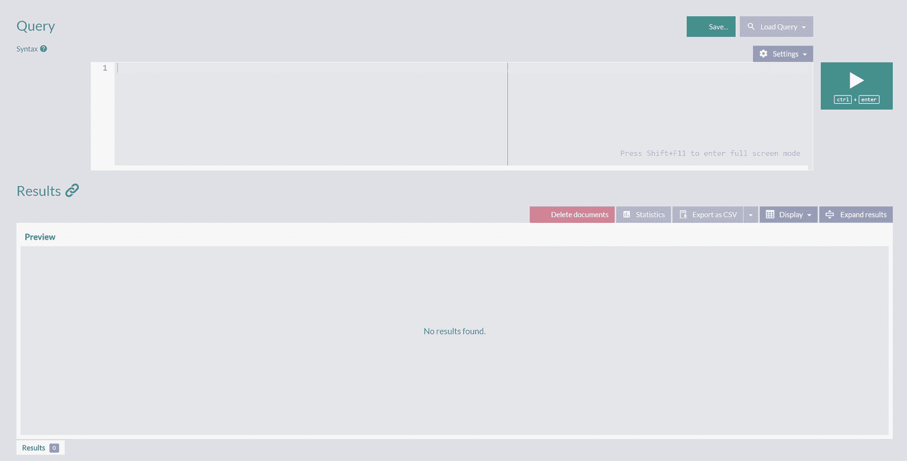
查询页面的截图包含两个面板。上面的面板描绘了一个用于输入查询的文本框。下面的面板描绘了用于显示结果的空间。顶部面板的右侧是一个播放按钮，顶部还有另外三个按钮。
图 3-2：RavenDB Studio 中的查询面板

如你所见，此面板有两个字段——上方用于编写查询，下方用于显示查询执行的结果。

编写查询后，你可以通过在键盘上按下 `ctrl+enter` 或点击右侧的 `播放` 按钮来运行它。

下一节将探讨使用 Raven 查询语言进行查询的基础知识。

## Raven 查询语言基础

Raven 查询语言或 `RQL` 是 RavenDB 的类 SQL 查询语言。第 1 章提到关系数据库共享一种称为结构化查询语言 - `SQL` 的标准化查询语言。这种通用的声明式语言是关系数据库管理系统（RDBMS）取得重大成功的因素之一。

与此相比，NoSQL 数据库没有标准化的查询语言。考虑到 NoSQL 生态系统的动态和分散特性，任何标准出现的可能性都很低。因此，每当一个新的 NoSQL 数据库诞生时，其作者都面临为其数据库设计查询语言这一繁琐任务。而这个任务带来沉重的负担——一旦你确定并创建了语言，开发者就会开始用它来构建应用程序。从那时起，你能对查询语言所做的修改就变得有限——任何重大的设计更改都会破坏向后兼容性并惹恼你的用户。

RavenDB 背后的团队面临着同样的挑战。最终，决定以 `SQL` 为基础，但进行若干扩展和修改，使 `RQL` 成为一种强大的语言。这样，熟悉关系数据库和 `SQL` 的开发者会认识到类似的概念，并快速掌握 `RQL` 的基础。我们不要忘记——查询是我们应用程序中执行的主要活动，快速的查询直接有助于提升用户对你应用程序速度的感知。

让我们从最直接的查询开始，我在代码清单 3-1 中展示。

```
from Employees
代码清单 3-1：关键词 “from”
```

执行时，此查询将返回 `Employees` 集合中的所有文档，如图 3-3 所示。

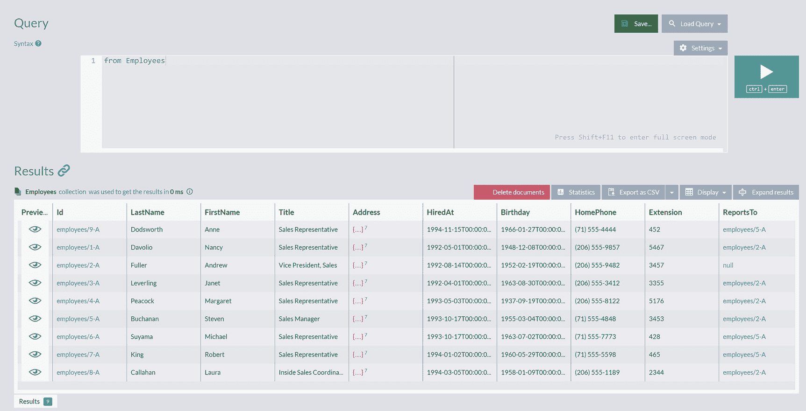
查询页面的截图包含两个面板。顶部面板键入的文本是 from employees。底部的结果面板显示了标有“employees”的 9 个文档，这些文档列在 11 个列下。
图 3-3：从 Employees 集合中选择所有文档

你可以以表格形式查看结果，但这只是一种可视化呈现。每一行显示 `Employees` 集合中的一个 JSON 文档，其属性显示在单元格中。通过点击如图 3-4 所示的 `显示` 按钮，你可以显示或隐藏特定属性。

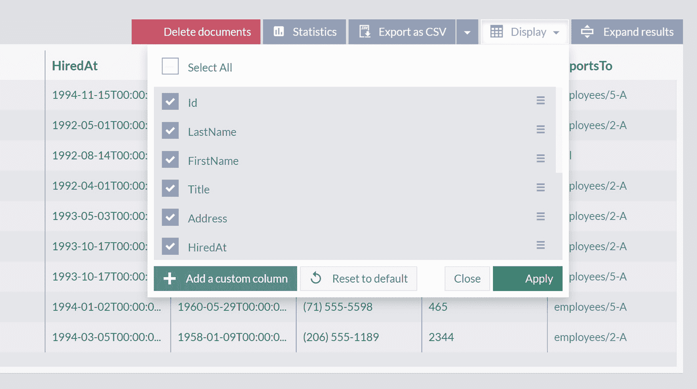
结果面板的截图顶部有 5 个选项，分别是：删除文档、统计信息、导出为 CSV、显示和展开结果，其中“显示”被选中。“显示”中的选定选项是：id、姓氏、名字、职位、地址和雇用时间。
图 3-4：调整员工属性的可见性

可见属性的初始配置将只显示其中一部分。如果你想预览整个文档，表格的第一列中有一个 `预览` 图标。点击它，你将获得特定文档的完整 JSON 预览。

### 过滤

在上一节中，我们学习了 `from`，这是第一个也是基础的 `RQL` 关键词。它将是你编写的每个 `RQL` 查询的一部分。我们看到它与集合名称一起使用，`from Employees`，以返回所有九个 `Employee` 文档。

然而，这只是在示例数据上进行的一个简单演示。在实际应用中，你很少会进行这种无限制的查询。想象一家拥有 10,000 名员工的公司——不仅获取所有员工需要很长时间，而且你只能在屏幕上显示其中的几个。我们在应用程序中通常想要做的是获取并显示集合文档的一个特定子集。再次查看 ID 为 `employees/2-A` 的 `Employee` 结构

```
{
"LastName": "Fuller",
"FirstName": "Andrew",
...
}
```

我们可以看到它包含值为 `Fuller` 的 `LastName` 属性。让我们使用代码清单 3-2 中的查询来查看所有具有该姓氏的员工列表。

```
from Employees where LastName = 'Fuller'
代码清单 3-2：关键词 “where”
```

执行此查询将显示 Andrew 是 Northwind 贸易公司中唯一具有此姓氏的员工，如图 3-5 所示。

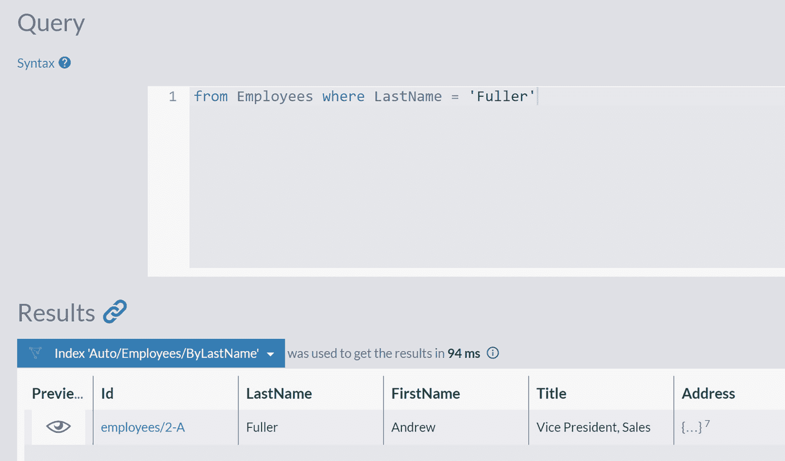
查询页面的截图包含两个面板。顶部查询面板中的文本是：from employees where last name equals fuller。底部的结果面板显示了一个文档，其中姓氏是 fuller。
图 3-5：根据 LastName 属性值过滤员工

与代码清单 3-1 相比，我们在 `from Employees` 的基础上添加了 `where LastName = 'Fuller'`。关键词 `where` 用于过滤，即根据特定条件选择所有文档。在本例中，过滤条件以 `[propertyName]='[value]'` 的形式表示。遵循此模式，我们可以使用代码清单 3-3 中的查询获取所有名字为 Andrew 的员工。

```
from Employees where FirstName = 'Andrew'
代码清单 3-3：过滤所有名字为 Andrew 的员工
```

执行此查询将产生相同的结果——只有一个文档——Andrew Fuller 在公司范围内拥有独特的名字和姓氏。

在我们的示例中，用于过滤的字符串值被撇号包围，但我们也可以使用引号：

```
from Employees where FirstName = "Andrew"
```

这将产生相同的结果。


## 按不存在的属性查询

如果我们尝试按不存在的属性进行筛选，如代码清单 3-4 所示，会发生什么？

```rql
from Employees where FistName = 'Andrew'
```

代码清单 3-4: 通过不存在的属性筛选所有员工

在代码清单 3-4 中，我们故意打错了字——`FistName`。如果您是习惯关系型数据库的开发者，执行此查询时会预期收到错误。

然而，在 RavenDB 中，尝试通过不存在的属性名称来筛选集合**不会**产生任何错误。您将得到一个空的结果集。为什么会这样？如果您还记得，RavenDB 是一个无模式数据库。在关系型数据库中，模式是每个表的一组强制性字段。RavenDB 集合的无模式特性意味着，对属于同一集合的文档**没有**施加任何强制性结构。不存在这样一组文档必须拥有的强制性属性。因此，按您能想到的任何属性名称进行筛选都不会产生错误——它可能只会导致一个意外的空结果集。

## 按非字符串属性查询

除了按字符串值筛选，您还可以按包含数值的属性进行筛选：

```rql
from Orders where Freight = 8.53
```

或按包含布尔值的属性进行筛选：

```rql
from Products where Discontinued = true
```

## 按复杂属性筛选

在上一节中，我们根据各种属性的值来筛选文档。所有这些属性都是简单属性，位于文档的第一层。回到员工文档，如代码清单 3-5 所示，并查看 `Address` 属性。

```json
{
"LastName": "Fuller",
"FirstName": "Andrew",
"Title": "Vice President, Sales",
"Address": {
"Line1": "908 W. Capital Way",
"Line2": null,
"City": "Tacoma",
"Region": "WA",
"PostalCode": "98401",
"Country": "USA",
"Location": {
"Latitude": 47.614329,
"Longitude": -122.3251939
}
}
}
```

代码清单 3-5: 员工 JSON 文档结构

我们可以看到它很复杂，由多层的嵌套属性组成。RavenDB 也支持对此类属性进行查询，如代码清单 3-6 所示。

```rql
from Employees where Address.Country = 'USA'
```

代码清单 3-6: 通过嵌套属性筛选所有员工

代码清单 3-6 中的查询将选择所有居住在美国的员工。请注意属性名称 `Address.Country` 的格式——查看代码清单 3-5 中的 JSON，您会观察到 `Country` 是 `Address` 属性内的一个嵌套属性。

将 JSON 属性的嵌套结构转换为适合筛选查询的线性形式是直截了当的。您将父属性写在第一层（本例中为 `Address`），然后添加第二层中所需的属性（本例中为 `Country`），并用点号分隔。

同样的方法也适用于更深层级的属性。因此，要按代码清单 3-5 中可见的 `Latitude` 属性进行筛选，我们将首先说明顶层祖先 `Address`，然后通过 `Location` 下降到 `Latitude`。每当我们下降一层，就会在属性名称之间添加一个点号作为分隔符。因此，我们最终的扁平化形式是 `Address.Location.Latitude`。从左到右读取这个连接的属性时，每遇到一个点号，你就下降一层。

最终，我们访问第三层属性的筛选查询如下所示：

```rql
from Employees where Address.Location.Latitude = 47.614329
```

它将返回所有居住在指定 `纬度` 的员工。

## 按 Id 筛选

遵循查询属性名称的约定，我们可能认为按标识符筛选遵循相同的模式。然而，尝试执行

```rql
from Employees where id = 'employees/2-A'
```

将返回一个空的结果集，尽管我们可以检查到 ID 为 `employees/2-A` 的员工是存在的。

为什么会这样？正如我们在前一章中看到的，*标识符* 是位于 `@metadata` 中的一个名为 `@id` 的唯一属性。然而，这是标识符的默认位置，它也是可配置的。因此，您需要使用函数 `id()`，它将返回保存文档标识符的属性名称。

了解这一点后，我们可以将之前的查询重写为

```rql
from Employees where id() = 'employees/2-A'
```

结果将显示这是我们老朋友，Andrew Fuller。

## 跨集合查询

在代码清单 3-3 中，我们演示了如何按名字查询所有员工。也可以查询所有包含具有特定值的特定属性的文档。RavenDB 提供了 `@all_docs` 关键字，它表示您数据库中所有集合的所有文档。因此

```rql
from @all_docs where FirstName = 'Andrew'
```

将找到所有集合中所有具有值为 `Andrew` 的 `FirstName` 属性的文档。此查询结果与代码清单 3-3 相同，在那里我们指定了集合名称。原因很明显——只有员工文档具有 `FirstName` 属性。

但是，如果我们按一个存在于不同集合中的属性进行查询

```rql
from @all_docs where Address.Country = 'USA'
```

我们将得到一个由来自不同集合的文档组成的结果集，如图 3-6 所示。

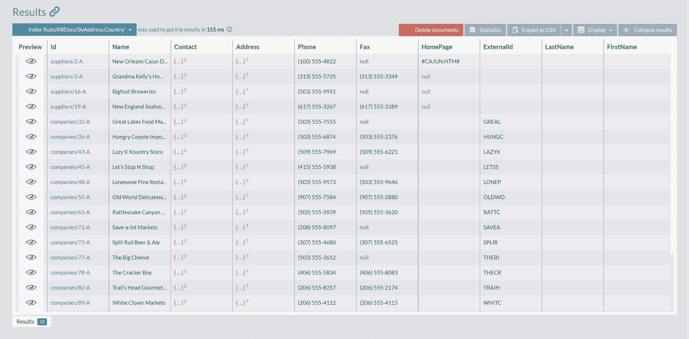

图 3-6: 跨所有集合的查询结果

此查询总共返回了来自供应商、公司和员工集合的 22 个文档。所有这些文档都代表位于美国的商业实体。

也可以编写一个查询，检查所有文档或特定集合中的哪些文档包含特定属性。如下查询

```rql
from @all_docs where exists(Address.Country)
```

将总共返回 129 个在 `Address` 属性中包含 `Country` 属性的文档。但是，请注意，这也会返回那些特定属性值为 `null` 的文档。从 RavenDB 的角度来看，`null` 没有什么不同——它是属性可以拥有的常规值。因此，`exists()` 将检查指定属性是否存在，而忽略其内容。

## 不等式查询

使用不等式运算符 `!=`，我们可以表达与等于运算符 `=` 相反的筛选条件。例如，执行查询

```rql
from Employees where FirstName != 'Andrew'
```

将选择所有名字不是 Andrew 的员工。

还有另一种编写此查询的方法；您可以使用 `<>` 运算符，它是 `!=` 运算符的同义词：

```rql
from Employees where FirstName <> 'Andrew'
```


### 逻辑运算符

逻辑运算符返回布尔值 `true` 和 `false`。回顾清单 3-6 中的查询：

```js
from Employees where Address.Country = 'USA'
```

我们能够选择所有居住在美国的员工。但如果我们想获取所有居住在美国 **和** 英国的员工呢？为此，我们可以使用 `or` 运算符：

```js
from Employees where Address.Country = 'USA'
or Address.Country = 'UK'
```

执行此查询将产生一个联合结果——来自这两个国家的员工合并列表。然而，查看前一个查询，很明显添加更多国家将需要输入大量文本来生成一连串的条件。对于这种情况，我们可以使用 `IN` 运算符，以更短的查询实现相同的结果：

```js
from Employees where Address.Country IN ('USA', 'UK')
```

`IN` 运算符接受一个值列表，如果指定的属性具有列表中的任何一个值，则将返回 `true`。

与 `or` 运算符类似，`and` 将筛选出满足所有指定条件的文档：

```js
from Products where PricePerUnit = 14 and UnitsInStock = 16
```

此查询将返回两个产品，`products/34-A` 和 `products/67-A`，它们各有 16 个库存单位，单价为 14。

遵循 `or`/`IN` 组合背后的逻辑，很自然地会问——是否存在类似于 `IN` 但用于 `and` 运算符的东西。仔细查看适用的案例，我们会采用如下查询：

```js
from Companies where Address.City = 'London' and Address.City = 'New York'
```

并将其缩短。然而，像这样的查询将始终返回空结果集——你无法让一个属性同时拥有两个值。确实，简单属性的单个值不能，但包含多个值的复杂属性可以。

图 3-7 展示了一个 `regions/1-A` 文档，它有一个 `Territories` 属性，这是一个区域的集合。

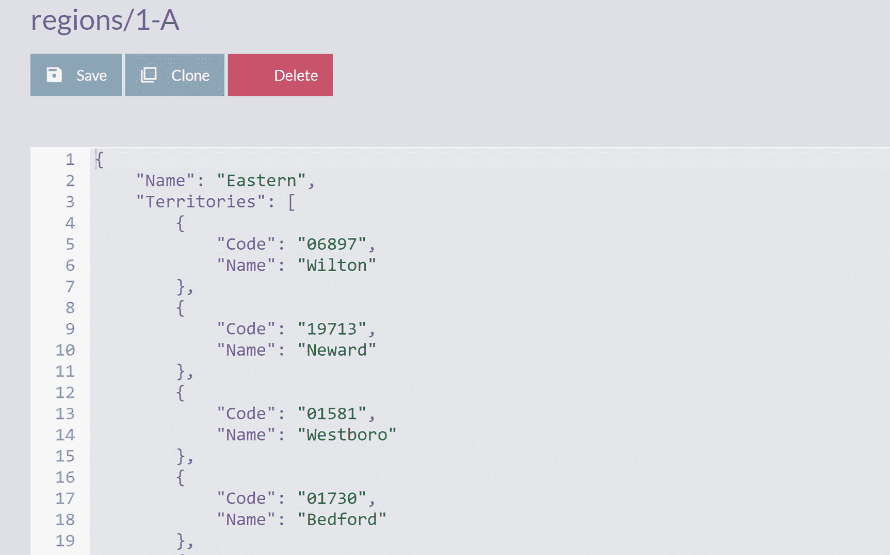

一张截图描绘了一个标题为“regions slash 1 A”的文档。标题下方的选项是：保存、克隆和删除。该文档包含 19 行代码。
**图 3-7. 区域文档**

借助 `Territories` 属性，我们现在可以构建一个包含 `and` 条件的查询：

```js
from Regions where Territories[].Name = 'Wilton' and Territories[].Name = 'Neward'.
```

此查询将返回所有在 Territories 属性中同时包含 Wilton 和 Neward 的区域。我们可以将其简写为：

```js
from Regions where Territories[].Name ALL IN ('Wilton', 'Neward').
```

我们可以观察到两个有趣的特性。第一个是 `ALL IN` 运算符，它提供了一种将多个值与数组进行匹配的方法。第二个是表达式 `Territories[].Name`，它获取 `Territories` 集合的所有元素，并从每个元素中提取 `Name` 属性。

`ALL IN` 运算符的一个典型用例是选择所有被指定标签集标记的文档。

### 范围查询

到目前为止，我们一直使用相等和不等运算符通过精确匹配进行筛选。也可以使用其他运算符来创建范围查询。

以下查询：

```js
from Products where UnitsInStock > 26
```

将返回库存单位多于 26 的所有产品，而：

```js
from Products where UnitsInStock >= 26
```

将列出库存单位大于或等于 26 的所有产品。我们将类似运算符 `<` 和 `<=` 的使用留作练习。

我们可以组合这些运算符，因此以下查询：

```js
from Products where UnitsInStock > 1 and UnitsInStock < 3
```

将返回库存单位为 2 的所有产品（因为整数条件），而：

```js
from Products where UnitsInStock >= 1 and UnitsInStock <= 3
```

则列出库存单位为 1、2 或 3 的所有产品。

我们可以缩短最后一个查询——秉承 `IN` 和 `ALL IN` 运算符的精神，RavenDB 还提供了 `BETWEEN` 运算符，因此我们可以将之前的查询重写为：

```js
from Products where UnitsInStock BETWEEN 1 and 3
```

请注意，`BETWEEN` 在区间的下限和上限都是**包含**的。

### 大小写

重新审视清单 3-3 中我们熟悉的例子，我们可以像这样修改它：

```js
from Employees where FirstName = 'ANDREW'
```

尽管你可能预期没有结果（因为我们将名字全部大写了），但此查询将返回 Andrew Fuller 作为唯一结果。为什么会这样？

RavenDB 在查询中默认进行**不区分大小写**的匹配。在这种情况下，筛选条件的值与文档中的实际属性值不同，但 `Andrew` 和 `ANDREW` 匹配了，因为 RavenDB 忽略了大小写差异。这种不区分大小写的处理是一个有意识的决定，因为在大多数场景下，字符串的不区分大小写比较会按照你的期望产生结果。

然而，在某些特定情况下，比如匹配 BASE64 编码的字符串时，你需要精确匹配。RavenDB 通过 `exact()` 方法支持这一点，以下查询将返回空结果列表：

```js
from Employees where exact(FirstName = 'ANDREW')
```


### 全文搜索

对数据进行全文搜索是现代应用程序的标准功能之一。随着时间的推移，您将构建的大多数应用程序中都不可避免地会存在此类搜索。幸运的是，这是 RavenDB 擅长的领域之一。我们将在后续章节提供更多信息，但目前可以这么说，RavenDB 内部使用 Lucene.net 进行索引。Lucene 是当今可用的最佳索引引擎之一，多年来它已确立了自己作为可靠、标准解决方案的地位。作为基础设施的一部分，它已出现在多个知名品牌产品中，例如 Solr 和 Elastic Search。因此，RavenDB 可以为您提供一流的全文搜索功能，并消除对任何额外解决方案的需求。

此类搜索的一个例子是按员工名字的通用前缀查询所有员工：

```
from Employees where StartsWith(FirstName, 'an')
```

此查询使用 `StartsWith()` 函数，该函数将每个员工的 `FirstName` 属性内容与前缀 `an` 进行匹配。执行后，您将获得结果，如图 3-8 所示。

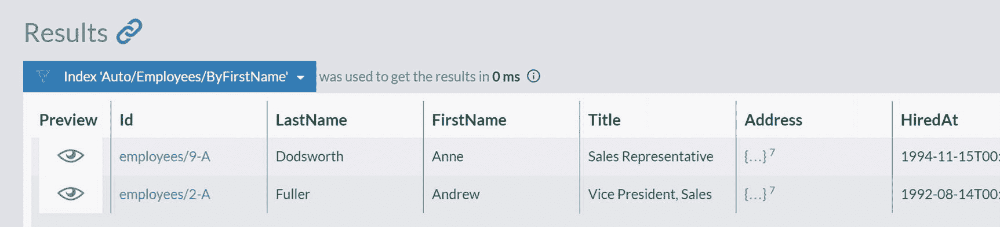

查询窗口结果面板的截图显示，在标签“索引 自动/雇员/按名字”下有 2 份文档。这两份文档中的名字分别是 Anne 和 Andrew。

**图 3-8**

按 `FirstName` 前缀搜索员工

我们得到了两个结果，两名员工，他们的名字都以“an”开头。请注意，在这种情况下，我们的查询也是不区分大小写的。

除了按前缀搜索外，还可以搜索字段内任意位置的术语。例如，如果我们想搜索名称中包含单词 `stop` 的所有公司，我们会编写以下查询：

```
from Companies where Search(Name, 'stop')
```

执行时，此查询将返回两家公司：“Let’s Stop N Shop”和“QUICK-Stop”，如图 3-9 所示。

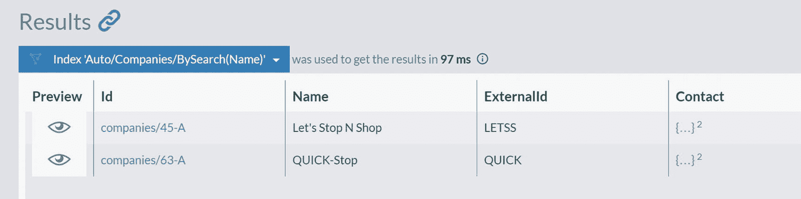

查询窗口结果面板的截图显示，在标签“索引 自动/公司/按搜索名称”下有 2 份文档。这两份文档中的名字分别是 let’s stop N shop 和 quick stop。

**图 3-9**

按名称内容搜索公司

这两家公司的名称中都包含单词“stop”。

当我们执行相等过滤（进行精确匹配）时，情况很清楚，但在这种可以发生任意位置部分匹配的情况下，幕后发生了什么？为了提供此功能，RavenDB 将获取公司的 `Name` 并应用*分词*：名称将被拆分为单词，每个这样的单词都将被索引。例如，公司名称“Let’s Stop N Shop”将被分成四个标记：“Let”、“Stop”、“N”、“Shop”。执行全文搜索查询后，RavenDB 会将您的搜索术语与一组标记进行匹配并显示结果。因此，可以说全文搜索仍然是精确匹配，但不是针对完整的属性值——而是匹配组件（标记）。

我们也可以按多个术语进行搜索。 following query

```
from Companies where Search(Name, "monde cheese")
```

将搜索名称中包含“monde”或“cheese”的所有公司，返回包含三家公司的结果集，如图 3-10 所示。

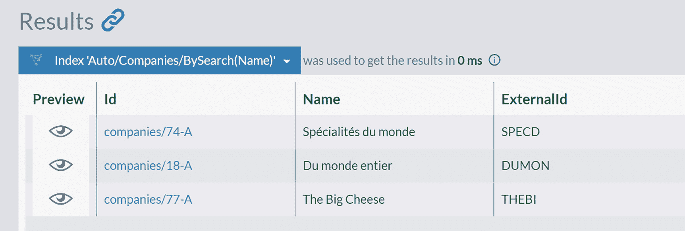

查询窗口结果面板的截图显示，在标签“索引 自动/公司/按搜索名称”下有 3 份文档。这三份文档中的名字分别是 spécialités du monde、Du monde entire 和 the big cheese。

**图 3-10**

使用多个术语按名称内容搜索公司

对于不是简单属性而是复杂属性的情况呢？ `Address` 是这种嵌套属性的一个常见例子。

```
"Address": {
"Line1": "87 Polk St. Suite 5",
"Line2": null,
"City": "San Francisco",
"Region": "CA",
"PostalCode": "94117",
"Country": "USA",
"Location": {
"Latitude": 37.7774357,
"Longitude": -122.4180503
}
}
```

RavenDB 也会对嵌套属性应用分词过程；首先，它会将复杂属性分离为一组嵌套属性。之后，每个嵌套属性将被分词——分离为简单组件——并被索引。结果，当您执行查询

```
from Companies where Search(Address, "London Sweden")
```

时，您将获得位于伦敦或瑞典的公司列表。如您所见，`Address` 的所有属性都被索引了，因此全文搜索会同时检查 `City` 和 `Country` 字段。

### 排序

重新审视我们第一个查询示例，来自清单 3-1

```
from Employees
```

执行后，您将获得如图 3-11 所示的结果。

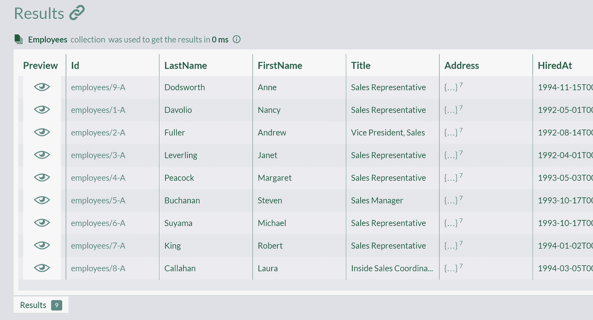

查询窗口结果面板的截图显示，在标签“employees”下有 9 份文档。文档列在列标签下：preview, I d, last name, first name, title, address, and hired at。

**图 3-11**

所有员工的未排序列表

如您所见，我们获得了所有员工，但他们的顺序是任意的；他们是未排序的。RavenDB 提供 `order by` 子句对结果进行排序；因此

```
from Employees order by LastName asc
```

将按员工姓氏的升序对员工进行排序。您也可以指定多个字段进行排序，所以

```
from Employees order by LastName asc, FirstName asc
```

将在两名员工姓氏相同的情况下，应用按名字的二级排序。

也可以在数字字段上进行排序：

```
from Products order by PricePerUnit desc
```

执行此查询将导致产品排序，如图 3-12 所示。

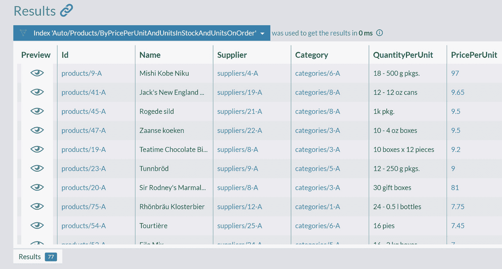

查询窗口结果面板的截图显示了一个文档列表。文档列在列标签下：preview, I d, name, supplier, category, quantity per unit, and price per unit。

**图 3-12**

所有产品的排序列表

然而，仔细观察 `PricePerUnit` 列，会发现它并非如我们所期望的那样按降序排序。为什么会发生这种情况，以及如何正确地按此列对 `Products` 进行排序？

原因在于 RavenDB 处理存储数据的方式。字段没有类型，在我们没有表达意图的情况下，RavenDB 默认采用词法顺序，即字段默认被当作字符串处理。使用降序词法顺序时，81 会排在 9 之前，这就解释了我们得到的排序顺序。

幸运的是，我们可以快速修复此问题。我们需要告诉 RavenDB 应用哪种排序顺序：

```
from Products order by PricePerUnit as double desc
```

此查询将通过将字段视为 `double` 类型的值来应用排序。我们也可以应用 `as long` 来截断任何小数部分，并将这些截断后的值作为整数进行比较：

```
from Products order by PricePerUnit as long desc。
```


### 分页

分页是大多数业务应用程序中的常见功能。每次你需要展示长于屏幕尺寸的结果列表时，很可能就需要使用分页。RavenDB 原生支持分页，其语法如下所示：

```
from Companies limit 10, 5
```

此查询将跳过前十个结果，并返回接下来的五个。当然，分页可以与其他功能结合使用，因此查询

```
from Companies where Address.Country = 'USA' order by Name asc limit 5, 5
```

将筛选出来自美国的公司，按名称升序排序，跳过前五个，并获取接下来的五个。

## 高级查询

在上一节中，我们介绍了 RQL 以及基础的筛选、排序和分页操作。现在我们将探讨高级功能——投影、聚合和包含。

## 投影结果

到目前为止，我们所有的查询都是返回完整的文档。例如

```
from Employees order by LastName asc
```

将按姓氏对员工进行排序，并将他们作为完整文档返回。然而，在构建应用程序时，你很少会需要整个文档。你通常只会展示文档字段的一个子集。例如，我们可能只想显示每位员工的名和姓。RavenDB 有一个专用的关键字 `select`，正是用于此目的，其工作方式与 SQL 中的类似，如清单 3-7 所示。

```
from Employees order by LastName asc
select FirstName, LastName
```

清单 3-7
`select` 关键字的用法

执行此查询将产生如图 3-13 所示的结果。

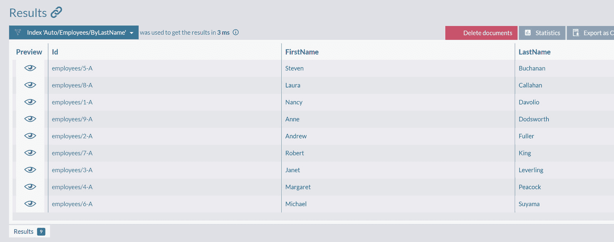

查询窗口结果面板的截图，标签“index auto slash employees slash by last name”下有 9 个文档。文档列表中的姓氏按升序排列。

图 3-13

使用 `select` 关键字的结果

如你所见，`select` 与 SQL 中的变体非常相似——它将选择并仅返回字段的一个子集。

你可以通过使用 `select` 语句的别名来重命名返回的字段。因此，查询

```
from Employees
select FirstName as Name, Address.City as City
```

将返回具有以下结构的文档列表：

```
{
"Name": "Andrew",
"City": "Tacoma",
}
```

投影也可以操作不简单的值。在下面的例子中，我们对对象和数组使用投影：

```
from Orders
select ShipTo, Lines[].ProductName as Products
```

执行此查询将返回具有以下结构的文档：

```
{
"ShipTo": {
"City": "Reims",
"Country": "France",
"Line1": "59 rue de l'Abbaye",
"Line2": null,
"Location": {
"Latitude": 49.25595819999999,
"Longitude": 4.1547448
},
"PostalCode": "51100",
"Region": null
},
"Products": [
"Queso Cabrales",
"Singaporean Hokkien Fried Mee",
"Mozzarella di Giovanni"
]
}
```

`ShipTo` 对象被按原样选中，`Products` 属性包含从所有订单行中选择的产品名称组成的投影。

### 使用对象字面量进行投影

我们目前看到的投影都是简单、扁平且线性的。它们本质上是模仿 SQL 投影，你选择要返回的属性子集作为线性值的简单集合。RQL 可以做得更多——你可以使用 `对象字面量` 语法投影出复杂的结果，如清单 3-8 所示。

```
from Orders as o
select {
Country: o.ShipTo.Country,
FirstProduct: o.Lines[0].ProductName,
LastProduct:  o.Lines[o.Lines.length - 1].ProductName
}
```

清单 3-8
使用对象字面量进行投影

执行时，此查询会返回一组投影。对于文档 `orders/1-A`，它看起来像这样：

```
{
"Country": "France",
"FirstProduct": "Queso Cabrales",
"LastProduct": "Mozzarella di Giovanni",
"@metadata": {
"@id": "orders/1-A"
}
}
```

如你所见，我们使用了简单的路径来选择收货国家，并使用复杂的表达式来深入选择订单行集合中的第一个和最后一个产品。请注意，在清单 3-8 中，我们必须使用别名 `as o`，以便能够在复杂的投影表达式中引用 `o`。

清单 3-8 的另一个要点是，`对象字面量` 不是 JSON 表达式——它是 JavaScript 字面量，任何有效的 JavaScript 表达式都会被执行。作为一个例子，我们可以查看员工文档的 `HiredAt` 属性：

```
"HiredAt": "1994-03-05T00:00:00.0000000"
```

此字符串表示 ISO 8601 格式的日期，使用对象字面量，可以编写如清单 3-9 所示的 JavaScript 来处理此日期并提取年份。

```
from Employees as e
select {
Id: id(e),
Year: new Date(e.HiredAt).getFullYear(),
Fullname: e.FirstName + " " + e.LastName
}
```

清单 3-9
在对象字面量中使用 JavaScript 进行投影

将返回具有以下结构的文档集合：

```
{
"Id": "employees/9-A",
"Year": 1994,
"Fullname": "Anne Dodsworth"
}
```

清单 3-9 中的查询使用 JavaScript 来填充所有三个字段：

*   `Id` —— 调用函数 `id()`，该函数以文档作为参数并确定其标识符。
*   `Year` —— 调用 `Date` 对象的 JS 构造函数，参数为 ISO 8601 字符串。之后，`Date.getFullYear()` 方法返回年份。
*   `Fullname` —— 用分隔符连接文档的两个属性。

### 在查询中声明函数

使用 RQL，你可以将 JavaScript 代码提取为函数，然后从对象字面量中调用，如我们在清单 3-10 中所做的那样。

```
declare function getFullName(e)
{
return e.FirstName + " " + e.LastName;
}
from Employees as e
select {
Id: id(e),
Year: new Date(e.HiredAt).getFullYear(),
Fullname: getFullName(e)
}
```

清单 3-10
从对象字面量调用 JavaScript 函数

在此示例中，我们将连接名和姓的代码提取到函数 `getFullName()` 中，然后从对象字面量中调用它。

你可以拥有多个这样的函数。它们的限制是 JavaScript 的标准限制，外加其使用性质带来的额外约束。如果 JavaScript 代码需要 5 秒执行，你的查询就会额外增加 5 秒。考虑到所有这些，你可以生成任意复杂的功能，如清单 3-11 中的示例所示。

```
declare function lineItemPrice(l) {
return l.PricePerUnit * l.Quantity * (1 - l.Discount);
}
from Orders as o
select {
TopProducts: o.Lines
.sort((a, b) => lineItemPrice(b) - lineItemPrice(a) )
.map(x => x.ProductName)
.slice(0,2),
Total: o.Lines.reduce((acc, l) => acc + lineItemPrice(l), 0)
}
```

清单 3-11
对象字面量中复杂 JavaScript 代码的示例

执行时，清单 3-11 中的代码将生成一个文档列表，其中包含订单的总价值和每个订单中最贵的两个产品，例如：

```
{
"TopProducts": [
"Mozzarella di Giovanni",
"Queso Cabrales"
],
"Total": 440
}
```


## 聚合

聚合是数据分组的过程。本节我们将探讨 RQL 如何提供数据聚合功能，使你能够以多种方式汇总文档数据。

回想一下，每个订单都有一个包含公司标识符的 `Company` 属性，如图 3-14 所示。

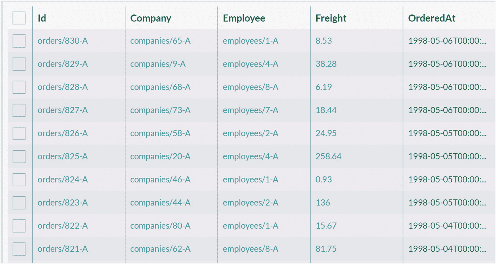

一张包含 5 列 10 行的表格截图。列标签为 Id、company、employee、freight 和 ordered at。

**图 3-14**
订单包含带有公司标识符的 Company 属性

让我们查找数据库中每个公司拥有的订单数量，如代码清单 3-12 所示。

```
from Orders
group by Company
select Company, count()
```

**代码清单 3-12**
按公司对订单进行分组

正如你可能预期的那样，用于此操作的合适关键字确实是 `group by`。执行此查询后，我们将得到如图 3-15 所示的结果。

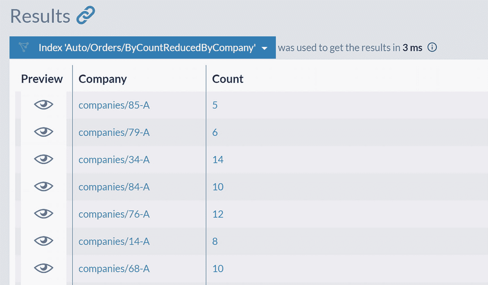

查询窗口结果面板的截图，在标签“index auto slash orders slash by count reduced by company”下有 7 个文档。文档列在列标签 preview、company 和 count 下。

**图 3-15**
按公司分组的订单

我们分析的下一步将是对此列表进行降序排序：

```
from Orders
group by Company
order by count() as long desc
select Company, count()
```

然后，仅筛选出订单数超过 20 个的公司：

```
from Orders
group by Company
where count() > 20
order by count() as long desc
select Company, count()
```

我们应始终将查询视为为在应用程序屏幕上显示而提取数据的一种方式。从这个角度来看，很容易看出向用户显示诸如 "companies/71-A"、"companies/20-A" 和 "companies/63-A" 这样的公司标识符并不太友好。因此，在这个简要分析的最后一步，我们将用实际的公司名称替换公司标识符：

```
from Orders
group by Company
where count() > 20
order by count() as long desc
load Company as c
select c.Name, count()
```

与之前的查询相比，你会注意到新增了一行 `load Company as c`。`load` 命令将指示 RQL 加载 `Company` 属性中包含的 id 所对应的文档，并为其分配别名 `c`。完成此操作后，我们可以在最后一行通过引用 `c.Name` 来访问公司名称。最后，我们可以向用户显示“Save-a-lot Markets”、“Ernst Handel”和“QUICK-Stop”是订单数超过 20 的 3 家公司。

在大多数应用程序中，聚合查询是从数据库中获取有用信息的主要工具。我们刚刚演示的 RQL 聚合基础是汇总数据的一种方式。RavenDB 还有另一种更强大的机制，将在后续章节中介绍。

### 处理关系

在上一章关于建模的内容中，我们学习了能生成具有平衡的独立性、隔离性和一致性级别的文档的合适建模原则。然而，即使是这样的文档，你仍然需要将它们组合成视图模型，这些模型将来自两个或多个文档的属性组合成适合可视化表示的形式。让我们看看 RavenDB 如何在此类场景中为你提供支持。

#### 访问相关文档

在上一节的最后，我们使用了 `load()` 来访问相关文档。在一个不简单的应用程序中，你的模型将由引用其他文档的聚合组成。让我们看一个这样的文档，id 为 `orders/830-A` 的订单：

```
{
  "Company": "companies/65-A",
  "Employee": "employees/1-A",
  "Freight": 8.53,
  "Lines": 
    ...
```

以这种形式向用户展示订单并无太大价值——用户必须手动检查 id `companies/65-A` 背后是哪家公司。

为了在屏幕上显示包含完整信息的订单，我们需要再对数据库进行两次调用以加载引用的公司和员工。为了优化这一点，RQL 为你提供了 `load()` 函数，该函数接受文档引用并返回引用的文档。这样，我们可以仅进行一次数据库调用，而不是三次，来获取此订单的完整信息，如代码清单 [3-13 所示。

```
from Orders as o
where id() = 'orders/830-A'
load o.Company as c, o.Employee as e
select {
  CompanyName: c.Name,
  EmployeeName: e.FirstName + " " + e.LastName
}
```

**代码清单 3-13**
加载引用的 Company 和 Employee

执行时，此查询将返回以下投影结果：

```
{
  "CompanyName": "Rattlesnake Canyon Grocery",
  "EmployeeName": "Nancy Davolio"
}
```

如代码清单 3-13 所示，我们为 `load` 提供了引用列表以及用于解引用文档的别名。之后，在 `select` 投影中，我们可以使用文档 `c` 和 `e`。

这里需要注意的一个重要事项是执行顺序。回顾代码清单 3-13 中的关键字，顺序如下：

*   From
*   Where
*   Load
*   Select

RavenDB 将获取查询的 `from`-`where` 部分并运行它，产生中间结果。之后，RavenDB 将执行 `load()` 以从中间结果获取引用的文档。最后，`select` 将创建投影，作为此查询的最终结果集。注意这里的顺序至关重要——`load` 是在最后应用的，在结果被过滤、获取以及基本查询执行完成之后。因此，`load()` 不影响查询的代价。

如果你将此与关系型数据库进行比较，你会发现执行顺序有很大不同。你会编写一个首先执行 *连接* 的查询，该连接提供对引用行的访问，然后对连接后的表应用过滤。然而，请注意，我们会连接这些表中的所有行，然后才执行过滤。换句话说，RDBMS 引擎会花费资源连接行，然后只在应用过滤后丢弃它们。RavenDB 不仅在此方面，而且在许多其他方面都进行了优化。因此，你的应用程序将更快，并且相同查询所需的工作量将更低。

你也可以直接在投影或 JavaScript 函数中使用 `load()`，如下例所示：

```
declare function getFullName(empId)
{
  var e = load(empId);
  return e.FirstName + " " + e.LastName;
}
from Orders as o
where id() = 'orders/830-A'
select {
  CompanyName: load(o.Company).Name,
  EmployeeName: getFullName(o.Employee)
}
```


## Include（包含）

除了使用投影（projections），还有另一种方法可以访问相关文档。RQL 提供了 `include` 子句，这是减少获取完整信息所需往返次数的另一种方式：

```
from Orders
where id() = 'orders/830-A'
include Company, Employee
```

此查询将返回一个完整的订单文档，但同样在单次往返数据库的过程中，它还会生成两个额外的集合，如图 3-16 所示。

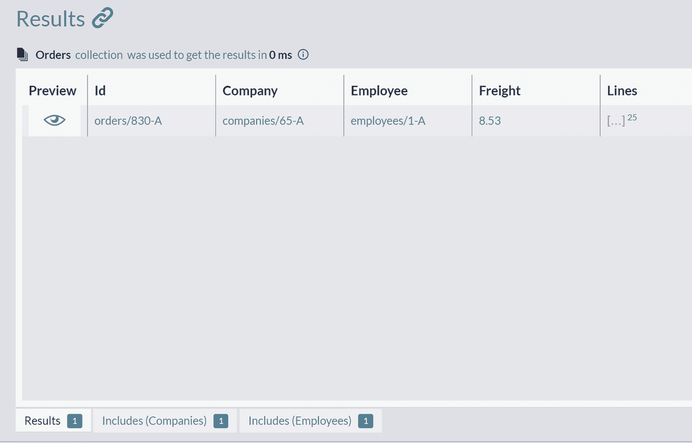

查询窗口结果面板的截图显示，在"orders"标签下有一个文档。该文档按以下列标签列出：preview、I d、company、employee、freight 和 lines。

图 3-16

包含关联公司和员工的订单

在图 3-16 的底部，你可以看到另外两个结果集。由于我们只返回了一个订单，这两个集合各自只包含一个公司和一个员工。

Include 语法旨在用于当你想从数据库获取完整文档，并在同一次数据库往返中一并拉取所有相关文档的场景。然后，你可以在这些文档上执行一些额外的操作，而无需被迫向数据库发出更多请求。

## Summary（总结）

在本章中，我们介绍了如何在 RavenDB 中编写查询。除了过滤、查询和分页，我们还涵盖了高级主题——投影、聚合和解引用关系。

在下一章中，我们将介绍索引（indexes），这是所有数据库用来优化和加速查询的关键数据结构。

