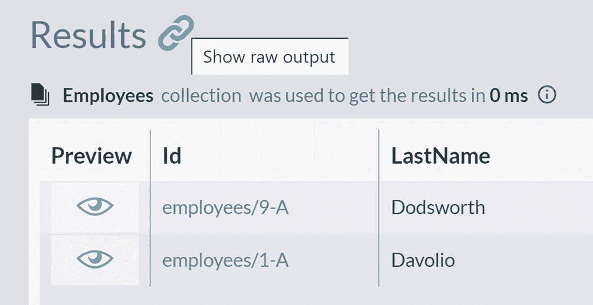
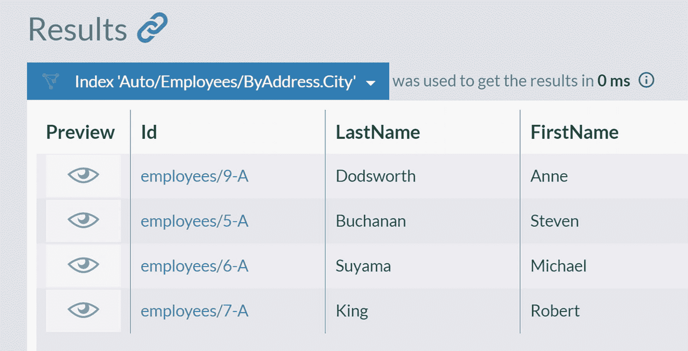
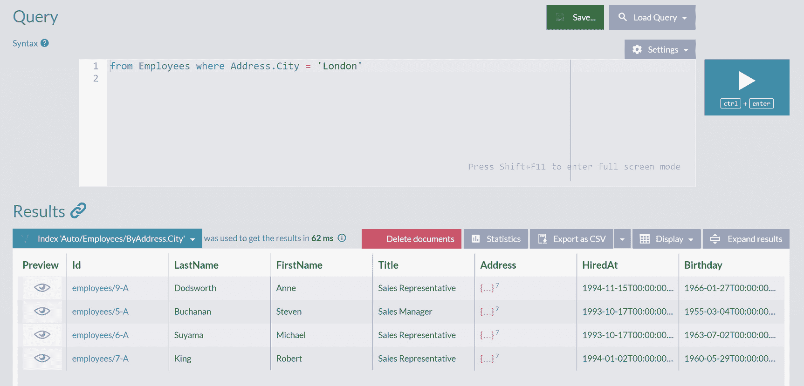
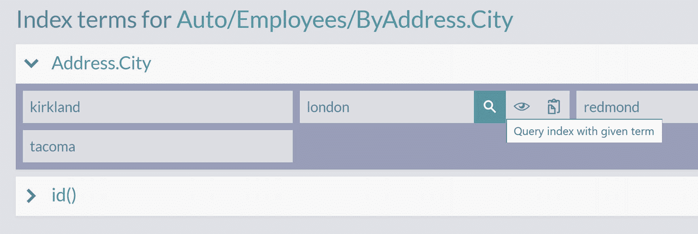
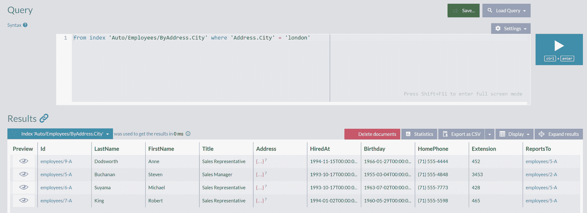
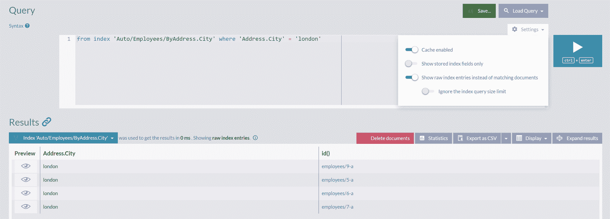

# 4. Indexes（索引）

在上一章中，我们了解了如何运行查询以返回所需的数据。本章将介绍当你运行此类查询时背后发生了什么，以及数据库如何执行它们。我们还将展示数据库需要解决的一些挑战，以及数据库如何应对不断增长的数据。本章将提出一些可能的优化解决方案。最后，我们将展示 RavenDB 如何防止查询中的常见问题。

## Queries from the Perspective of a Database（从数据库角度看查询）

作为用户和开发人员，我们针对数据库执行查询以获取结果。这个操作如此标准，以至于我们很少去思考提供结果的底层机制和工具。此外，在使用关系型数据库时，你很可能使用对象关系映射器（Object-Relational Mapper），这代表了你的代码和数据库之间的一个额外的抽象层。随着时间的推移，在我们与数据库打交道的过程中，我们往往会忘记背后发生的事情。

### Unbounded Queries（无界查询）

第一个重要的概念是无界查询的概念。此类查询将返回整个集合，没有任何限制。执行时，它们将返回集合中的所有文档，无论你拥有多少。即使你有一百万名员工，你也会全部获取回来。清单 4-1 展示了一个简单的无界查询。

```
from Employees
Listing 4-1
对 Employees 集合的无界查询
```

数据库引擎将从磁盘获取所有员工并返回。无界查询可能是危险的，因为情况不在你的控制之下。执行结果是非确定性的，它取决于文档的数量。如果我们正在处理员工，我们不知道我们会迭代 10 个还是 10,000 个员工。此外，对于公司员工的所有可视化展示，我们很少需要全部数据。

### Paging（分页）

通常，我们希望呈现分页列表或某种分页的变体（例如，当用户向下滚动列表时获取批次数据）。如前一章所示，RavenDB 内置了对分页的支持，形式如下：

```
from [Collection] limit [skip], [take]
```

因此，查询 `from Employees limit 0, 2` 将返回前两名员工。

然而，除了分页结果集，还可以在同一次数据库往返中获取集合中的文档总数。如图 4-1 所示，在"Results"标题旁边有一个链接图标。



结果面板的截图，显示了一个链接图标及其旁边的文本框，文本框显示"show raw output"。在索引"employees"下，列出了一个包含三列的表格：preview、I d 和 lastname。

图 4-1

"显示原始输出"图标

点击此图标将显示 RavenDB 服务器返回的原始 JSON：

```
{
TotalResults: 9,
LongTotalResults: 9,
CappedMaxResults: 2,
...
```

客户端（在本例中是 RavenDB Studio）会解析此响应以向你展示查询结果。并非所有返回 JSON 的属性都会在 Studio 中渲染——如你所见，第一个属性包含了结果总数。因此，只需一次服务器请求，你就可以在分页查询中显示结果总数。

### Filtering（过滤）

然而，这个简单的请求很少是我们真正需要的——我们通常希望根据特定字段过滤员工。那么，让我们看看我们数据库中的这九名员工，哪些人居住和工作在伦敦，如清单 4-2 中的查询所定义。

```
from Employees
where Address.City = 'London'
Listing 4-2
查询居住在伦敦的员工
```

图 4-2 显示了执行此查询的结果。



查询窗口结果面板的截图，索引为"auto/employees/by-address.city"。列出了一个表格，包含以下列：preview、I d、last name 和 first name。

图 4-2

居住在伦敦的员工

如你所见，引擎成功找到了那些居住在伦敦的员工。那么，如果你必须执行相同的任务，你会怎么做？

想象一下，你有九份文件，分别代表每位员工。你逐一查看，检查地址（Address），确认城市（City）是否是伦敦。如果是，你就把文件放到右边的一叠。否则，你就把它放到左边。处理完所有文件后，右边的那叠文件将包含所有四名居住在伦敦的员工。

你刚刚所做的非常类似于数据库引擎在某些情况下可能做的事情，这被称为顺序扫描（sequential scan）或全表扫描（full table scan）。乍一看，这似乎是一个合乎逻辑的做法。然而，随着数据库中员工数量的增长，会发生什么？或者，如果你在零售业务中过滤订单，几年后你会有成千上万的订单。根据某些属性过滤订单需要多长时间？无论磁盘或 CPU 多快，你的应用程序迟早会因全表扫描而开始受影响。

用算法复杂度的术语来说，此操作具有 O(n) 复杂度——如果你将数据量增加十倍，过滤将花费十倍的时间。显然，这种方法不是可持续的，我们需要不同的方法。然而，无论我们使用什么方法，数据库引擎仍然需要访问每位员工以检查居住城市。


## 索引

因此，如果我们无法消除这种顺序扫描，一个概念性的解决方案是只执行一次，并将结果保存起来供后续查询使用。所有现代数据库解决这一挑战的方式正是如此。你可以指定一个字段，然后引擎会遍历所有文档，检查该字段的内容。发现的值将被存储在一个称为 `索引` 的特定数据结构中。索引是随文档一起存储的一个附加数据结构（`元数据`，即“关于你的数据的数据”）。数据库会从你的内容中派生出索引的内容，并且它永远不会改变你的原始内容。

在我们的例子中，我们会在 `Employee` 文档的 `Address.City` 字段上定义一个索引，并称这个字段是 *已索引的*。在计算此索引的内容时，数据库会提取所有不同的值（所有城市），并将它们存储在一个专门的数据结构中。多年来已经开发了各种索引结构，但它们都有一个明确的目的——提供一种基于某些条件快速获取文档的方式。

在形成 `Employee.Address.City` 索引并用员工居住的所有城市填充它之后，无论查询什么值，数据库引擎都能快速回答我们的问题。当我们执行查询所有伦敦员工的请求时，引擎将不再遍历文档。相反，它会查阅索引。在那里，它将找到表 4-1 所示的条目。

**表 4-1**

`Employee.Address.City` 索引的内容

| Address.City | ID |
| --- | --- |
| Kirkland | employees/3-A |
| London | employees/9-Aemployees/5-Aemployees/6-Aemployees/7-A |
| Redmond | employees/4-A |
| Seattle | employees/1-Aemployees/8-A |
| Tacoma | employees/2-A |

现在获取所有来自伦敦的员工列表变得轻而易举。他们的标识符将被收集起来，然后从磁盘获取并返回这些文档。可以说，我们已经为所有可能的 `Address.City` 查询提前做好了准备。我们预计算了结果，并将它们与文档一起存储。因此，我们的查询会很快。不再需要表扫描：不再需要遍历文档并加载它们来检查是否应该包含在结果集中。我们有了一个可以直接从磁盘读取的 ID 列表，并且可以确信这是一个完整的结果集。

### 索引类型

如果某种计算是不可避免的，那么就没有办法避免执行它。但是，你可以只执行一次，并在查询执行前将结果保存到磁盘。索引就是以专门数据结构存储的预计算结果，它提供了一种快速获取结果的方式。

在表 4-1 中，我们展示了一个包含文档 ID 的索引。这样的索引被称为 `二级索引`。

当使用 `二级索引` 来服务查询时，在将员工列表返回给你之前还需要一个额外的步骤。数据库需要使用从 `二级索引` 获取的 ID 来获取完整的员工文档。这个操作需要是高效的，因此数据库会维护另一个索引，该索引根据标识符跟踪每个文档的确切存储位置。这个索引被称为 `键值索引`，如果你曾使用过关系型数据库，你会认出类似的内部数据结构——`主索引`。

总的来说，像下面这样的查询将要求数据库执行两个操作。首先，获取已索引属性的值，然后查阅 `二级索引` 以获取标识符列表。其次，使用 `主索引` 从数据库存储中高效地获取员工文档。

```
from Employees
where Address.City = 'London'
select FirstName
```

然而，在某些情况下，这可以减少到仅一次操作。即，你可以扩展索引以包含整个文档，而不仅仅是一个标识符。这样的索引称为 `聚簇索引`，你可以在表 4-2 中看到其结构。

**表 4-2**

聚簇索引的内容

| City | ID | Document |
| --- | --- | --- |
| Kirkland | employees/3-A | {id: "employees/3-A", "FirstName": "Janet"..} |
| London | employees/9-Aemployees/5-Aemployees/6-Aemployees/7-A | {id: "employees/9-A", "FirstName": "Anne"..}{id: "employees/5-A", "FirstName": "Steven"..}{id: "employees/6-A", "FirstName": "Michael"..}{id: "employees/7-A", "FirstName": "Robert"..} |
| Redmond | employees/4-A | {id: "employees/4-A", "FirstName": "Margaret"..} |
| Seattle | employees/1-Aemployees/8-A | {id: "employees/1-A", "FirstName": "Nancy"..}{id: "employees/8-A", "FirstName": "Laura"..} |
| Tacoma | employees/2-A | {id: "employees/2-A", "FirstName": "Andrew"..} |

有了 `聚簇索引`，数据库引擎只需一次存储访问就能获取员工文档列表。不幸的是，这种索引在存储方面开销很大，因为它本质上会将主数据存储中的所有记录复制到元数据结构中。各种关系型数据库使用不同的方法来克服这一挑战。SQL Server 每个表只允许一个 `聚簇索引`；MySQL 将 `主索引` 实现为聚簇索引，而 `二级索引` 条目则指向主键。

介于非聚簇索引（仅存储引用）和聚簇索引（存储完整数据）之间的是 `覆盖索引`，也称为 *包含列的索引*。让我们观察以下查询：

```
from Employees
where Address.City = 'London'
select FirstName
```

在这种情况下，我们并非要求获取完整的员工文档。我们感兴趣的是伦敦员工的名字。名字通常是数据的小片段，我们可以将表 4-1 中的非聚簇 `二级索引` 扩展为表 4-3 所示的形式。

**表 4-3**

覆盖索引的内容

| Address.City | ID | FirstName |
| --- | --- | --- |
| Kirkland | employees/3-A | Janet |
| London | employees/9-Aemployees/5-Aemployees/6-Aemployees/7-A | AnneStevenMichaelRobert |
| Redmond | employees/4-A | Margaret |
| Seattle | employees/1-Aemployees/8-A | NancyLaura |
| Tacoma | employees/2-A | Andrew |

`覆盖索引` 是一种折中方案，它使得数据库能够仅使用索引本身来回答某些查询（因此术语 *覆盖*，因为此类索引覆盖了一些查询），而无需分配过多的空间。


## 索引的缺点

索引听起来是个好主意，但也有其缺点。在磁盘上存储额外的数据结构必然会占用额外空间。在我们的示例中，我们只为 `Employee` 文档的一个字段定义了索引。如果我们想为用户在其他字段（如 `FirstName` 或 `LastName`）上提供高效过滤，就必须用这两个字段的条目来扩展 `EmployeeIndex`。随着时间的推移，当你定义新索引、用额外字段扩展现有索引，并且数据库中的文档数量增加时，索引的总大小将不可避免地增长，为这些元数据分配越来越多的空间。

然而，还有另一个更具挑战性的任务——索引维护。每当我们更新员工的居住城市或任何其他被索引的字段时，我们都需要更新索引。每当我们数据库中创建一个新员工时，索引也需要更新。结果就是，每次数据库写入都会伴随一次或多次额外的索引更新操作。写入数据和索引更新这两者将一起执行，从而使你的写入操作变慢。

这导致了一个有趣的权衡：我们引入索引来加速查询，但这会拖慢写入速度。我们想要快速的查询，但同时又不想减慢写入速度。因此，我们应该根据应用程序的使用模式，仔细选择应该对哪些字段建立索引。这种权衡解释了为什么数据库默认不会索引所有内容——这种方法会引入不必要的开销。

尽管通过索引查询（相对于查询原始数据）是每个开发者都应该做的事情，但缺少索引可能是程序员中最常见的反模式。导致这一可悲事实的因素有很多，但需要手动创建索引是最主要的一个。即使你知情并意识到这一点，也很容易忘记或遗漏。此外，这个错误通常在少量数据的情况下隐藏得很好。开发者在小数据集上测试应用程序时，不会体验到全表扫描的可怕后果。如果没有进行负载测试，开发者就会将没有索引的数据库部署到生产环境中。

最终，缺少索引将导致应用程序显著且令人恼火地变慢。当数据库中的数据量较小时，应用程序速度会很快，但随着时间的推移，随着数据量的增长，性能将开始线性下降。这种逐渐的性能下降是应用程序扩展的严重障碍，并将迫使你回头修复性能问题，这会消耗你的时间和金钱。

## RavenDB 的索引哲学

RavenDB 作为数据库的设计哲学，其核心不是帮助你解决问题和挑战，而是预防它们。这种方法具有独特的后果——你的数据库会使坏事无法发生，或者当你有所疏漏时，RavenDB 会做出反应并纠正你的操作。

作为这种预防哲学的一部分，在 RavenDB 中，所有查询总是通过索引执行。从技术上讲，查询不可能绕过索引执行。这样，手动的遗漏就不可能发生，所有的过滤查询都会是高效的。

那么，当我们尝试运行清单 4-2 中的查询而没有预先定义索引时，会发生什么？我们会得到错误还是警告？图 4-3 显示了查询执行的结果。



图 4-3
结果面板

不仅没有显示错误，我们还得到了实际的结果集。这是怎么回事？

仔细观察结果面板的左上角，你可以看到 RavenDB Studio 指示了用于处理此查询的索引名称。图 4-4 屏幕这部分的特写显示了索引名称和执行时间。


图 4-4
索引详情

使用了名为 `Auto/Employees/ByAddress.City` 的索引，获取结果耗时 62 毫秒。我们可以通过展开下拉菜单并选择第一个选项 `View Index` 来检查此索引，如图 4-5 所示。


图 4-5
查看索引选项

你现在可以看到映射结构——`Employees` 集合中的文档被处理，并且从 `Address.City` 字段中提取值。图 4-6 显示了此索引的结构。


图 4-6
索引结构

RavenDB Studio 提供了一种检查此索引内容的方法。如果你点击右上角的 `Terms` 按钮，将会显示 `Index terms`，如图 4-7 所示。


图 4-7
索引术语

展开 `Address.City` 和 `id()` 部分将显示从这些字段中提取的值。很容易看出，九名员工有唯一的标识符（因此我们有九个标识符），但有些人住在同一个城市，因为我们有五个不同的城市。我们可以将鼠标悬停在任何字段上并点击放大镜图标来针对此索引执行过滤查询，如图 4-8 所示。




一张截图展示了 `auto/employees/by address.city` 的索引项，包含 **ID** 和 **Address.City** 两个部分，显示了四个城市：Kirkland、London、Redmond 和 Tacoma。

## 图 4-8：基于索引项进行查询

执行查询

```
from index 'Auto/Employees/ByAddress.City'
where 'Address.City' = 'london'
```

的结果如图 4-9 所示。



查询窗口的截图描绘了两个面板、搜索查询、设置菜单以及保存和运行按钮。一条查询语句读作 `auto/employees/by address.city where address.city equals London`。底部的结果面板包含一个有 11 列的表格。

### 图 4-9：在索引上执行查询的结果

如图 4-9 所示，我们现在直接查询索引，结果与我们从清单 4-2 执行查询时相同。这是符合预期的，因为当我们直接查询集合时，使用的是同一个索引。

Studio 还提供了一种查看此索引内容的方法。点击 `Settings`，然后开启 `Show the raw index entries instead of matching documents`，将可以深入了解此索引的内部数据结构，如图 4-10 所示。



查询窗口的截图描绘了两个面板、包含 4 个切换按钮的设置下拉菜单、搜索查询、保存、运行和删除按钮。顶部面板包含一条查询语句，底部的结果面板有一个包含 3 列的表格。

### 图 4-10：原始索引项

再次查看表 4-1，我们可以看到这正是“London”的那一组条目。修改此查询并针对图 4-8 中的其余城市运行它，将返回表 4-1 中的剩余条目。

尝试再次运行 `from Employees where Address.City = 'London'` 查询。你会得到预期的结果集，但这里关键的是执行时间，如图 4-11 所示。


查询窗口结果面板的截图，带有一个链条图标，显示下拉菜单中索引 `auto/employees/by address.city` 的执行时间为 0 毫秒。

### 图 4-11：查询执行时间

我们之前没有提到，但这个 `Query execution time` 测量的是服务器端的执行时间。即使你经历了一段漫长的等待才在浏览器中看到结果，你等待的是结果集传输到你的浏览器。此处显示的测量值是数据库实际生成这些结果所花费的时间。

将此次尝试的查询耗时与图 4-3 中的前一次进行比较，你可以看到这次我们快了很多。在第一次运行时，在未能找到合适的索引后，RavenDB 不得不创建一个。这个操作花费了一些时间——数据库必须从磁盘获取所有九名员工，处理他们的 `Address.City` 字段，提取值，并根据这些值构建索引。

在我们刚刚进行的第二次运行中，系统立即检测到并使用了一个合适的索引来交付结果。在任何后续运行中都会发生同样的情况——将从磁盘读取预计算好的值并返回。

## 总结

在本章中，我们介绍了索引的概念，它是一种专门的数据结构。索引是数据库内与你的数据并排放置的元数据，是加速查询的可能解决方案之一。我们展示了 RavenDB 的设计方法如何帮助你避免索引的常见问题。

在下一章中，我们将展示如何控制索引创建并自行定义，而不是让 RavenDB 自动创建它们。

