# 5. 映射索引

上一章介绍了索引，几乎所有数据库都使用它来加速和优化查询。在本章中，我们将展示如何掌控索引。你可以明确地将它们指定为“静态”索引，而不是依赖 RavenDB 自动创建它们。除了对一个或多个集合进行索引的方法外，你还将学习如何处理引用文档以及创建存储字段、动态字段和计算字段。最后，我们将介绍索引数据库中分层数据模型的技术。

## 静态索引

在上一章中，我们看到 RavenDB 不允许对原始数据进行查询。查询总是在索引上执行，如果你没有索引，RavenDB 的 `查询优化器` 会为你创建一个。

执行查询

```
from Employees where FirstName = 'Nancy'
```

将触发 `Auto/Employees/ByFirstName` 自动索引的创建。一旦创建，此索引将在查询结果生成后保持活动状态，RavenDB 将把它用于未来所有针对相同字段的筛选和排序查询。

Raven 查询语言允许你直接查询索引，如清单 5-1 所示

```
from index 'Auto/Employees/ByFirstName' where FirstName = 'Nancy'
清单 5-1
直接查询索引
```

这样的查询将产生与之前查询相同的结果。

因此，你可以使用 `from [集合]` 形式让查询优化器为你选择，或者使用 `from index '[索引名称]'` 形式来掌控用于交付结果的索引选择。

你可以更进一步掌控。不依赖查询优化器来创建索引，你可以自己定义它。这样的索引被称为 `静态索引`。


### 静态映射索引

你可以通过编写查询来检查 `Auto/Employees/ByFirstName` 自动索引的内容：

```
from index 'Auto/Employees/ByFirstName'
```

然后选择 *设置 ➤ 显示原始索引条目而非匹配文档*，如图 5-1 所示。

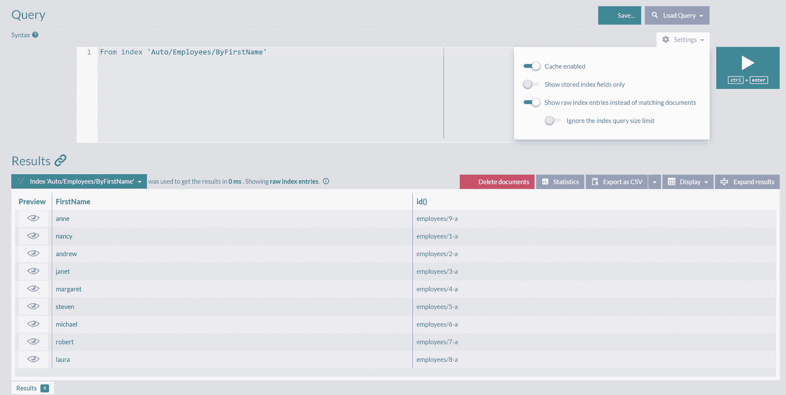

图 5-1：自动索引的内容

你可以根据图 5-1 的内容创建一个静态索引。在左侧栏选择 *索引列表* 选项，然后点击 *新建索引* 按钮。你现在将看到一个用于定义新索引的屏幕，如图 5-2 所示。

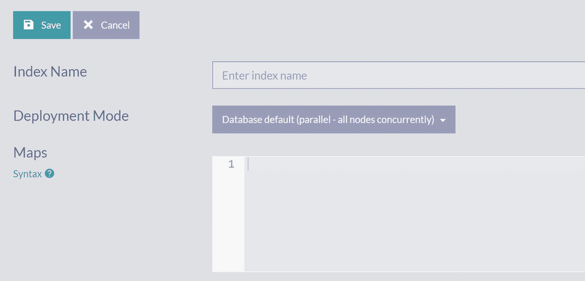

图 5-2：创建新索引对话框

首先，你需要为新索引选择一个名称。通常采用以下格式的名称：

```
[COLLECTION]/By[FIELD]
```

例如，`Auto/Employees/ByFirstName` 已经采用了这种格式。

因此，使用 `Employees/ByFirstName` 作为名称。

映射索引的内容是一个 JavaScript 函数 `map`，它将接收集合并为每个文档返回一个对象；这些对象将成为索引项。因此，该函数名为 `map`，因为它将文档映射到索引项。代码清单 5-2 展示了这样的映射函数。

```
map("Employees", function(emp) {
return {
FirstName: emp.FirstName
}
})
```

代码清单 5-2：`Employees/ByFirstName` 索引的内容

点击 *保存* 按钮将创建一个新索引，它将与其他自动和静态索引一起列出，如图 5-3 所示。

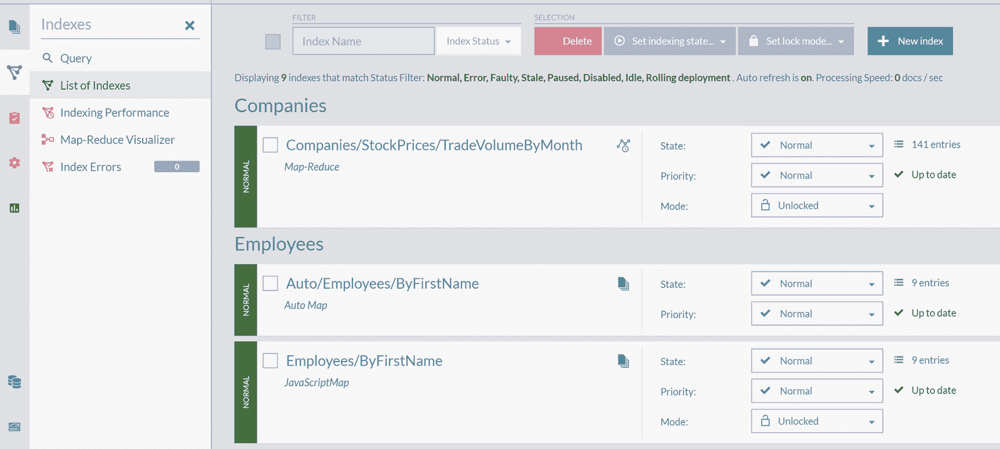

图 5-3：索引列表

你可以看到，自动索引 `Auto/Employees/ByFirstName` 包含九个条目，与你刚刚创建的 `Employees/ByFirstName` 相同。如果你查询它：

```
from index 'Employees/ByFirstName' where FirstName = 'Nancy'
```

你将得到相同的结果。

### 静态索引分析

让我们分析代码清单 5-2 中索引的所有元素。从顶层结构来看，你可以看到这个映射索引具有以下形式：

```
map("[COLLECTION]", function(doc) {...})
```

第一个参数是集合名称。文档将从该集合中逐一获取，并传递给 JavaScript 函数，即第二个参数。

观察函数本身：

```
function(emp) {
return {
FirstName: emp.FirstName
}
}
```

你可以看到它接收来自集合中的一个文档，并返回 JavaScript *对象字面量*：

```
{
FirstName: emp.FirstName
}
```

这个对象字面量将成为索引项。

如果我们用紧凑的 *箭头函数表达式* 替换传统的函数表达式，索引可以被稍微简化，如代码清单 5-3 所示。

```
map("Employees", emp => {
return {
FirstName: emp.FirstName
}
})
```

代码清单 5-3：`Employees/ByFirstName` 索引的简化版本

### 扩展映射索引

索引项的结构将限制我们可以过滤的字段。尝试执行以下查询：

```
from index 'Employees/ByFirstName' where LastName = 'Davolio'
```

将会导致错误：

```
The field 'LastName' is not indexed, cannot query/sort on fields that are not indexed
```

你的第一反应可能是创建一个新的 *Employees/ByLastName* 索引，如代码清单 5-4 所示。

```
map("Employees", emp => {
return {
LastName: emp.LastName
}
})
```

代码清单 5-4：`Employees/ByLastName` 索引

这个索引现在可以被查询：

```
from index 'Employees/ByLastName' where LastName = 'Davolio'
```

并产生结果。

然而，与其增加一个索引，我们不如将 *Employees/ByFirstName* 索引扩展，包含 `LastName` 字段。遵循我们之前介绍的约定，可以将其命名为 *Employees/ByFirstNameByLastName*，并定义其内容如代码清单 5-5 所示。

```
map("Employees", emp => {
return {
FirstName: emp.FirstName,
LastName: emp.LastName
}
})
```

代码清单 5-5：`Employees/ByFirstNameByLastName` 索引

检查此索引的原始内容，可以发现每个文档的 `FirstName` 和 `LastName` 都被索引，如图 5-4 所示。

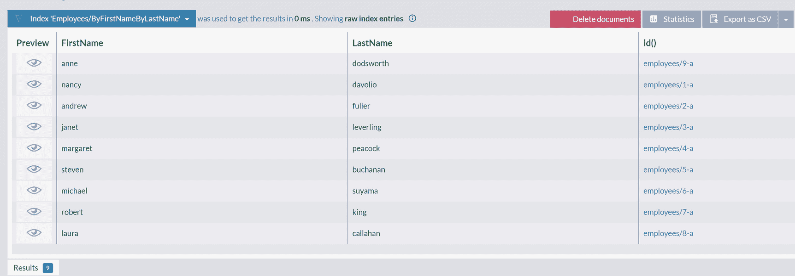

图 5-4：索引 `Employees/ByFirstNameByLastName` 的原始内容

你可以在这个新索引上查询 *FirstName* 字段：

```
from index 'Employees/ByFirstNameByLastName' where FirstName = 'Nancy'
```

也可以查询 *LastName* 字段：

```
from index 'Employees/ByFirstNameByLastName' where LastName = 'Davolio'.
```

这样，你就可以仅用一个索引来覆盖一个集合中文档的多个字段。

## 存储字段

在前一章中，我们介绍了不同类型的索引：非聚集索引（仅保存文档引用）、聚集索引（存储整个文档）和覆盖索引（包含一组选定的字段）。到目前为止，本章中我们开发的静态索引都是非聚集索引。你可以通过运行以下查询轻松检查到这一点：

```
from index 'Employees/ByFirstNameByLastName'
```

获取员工文档后，点击 `Settings` 并选择选项 `Show stored index fields only`。你将得到如图 5-6 所示的结果。

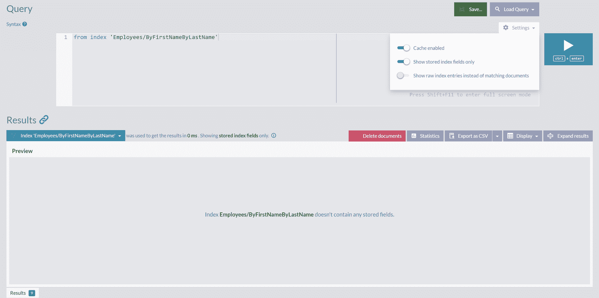

一张截图展示了一个查询、一个包含 3 个切换按钮中启用了 2 个的设置菜单、搜索查询以及保存和播放按钮。结果面板在预览存储的索引字段时显示无数据。

**图 5-6**

索引 `Employees/ByFirstNameByLastName` 无存储字段

如你所见，索引不包含任何存储字段。因此，当你运行带有投影的查询时

```
from index 'Employees/ByFirstNameByLastName'
where FirstName = 'Nancy'
select FirstName, LastName
```

数据库引擎将首先根据索引执行过滤，得到单个 ID `employees/1-A`。之后，引擎将再进行一次存储往返以获取该文档并读取其 `FirstName` 和 `LastName` 属性。

你可以通过指示 RavenDB 存储特定字段，将非聚集索引转换为覆盖索引。返回索引编辑表单并查看屏幕底部，你可以在图 5-7 中看到 `Fields` 选项卡。

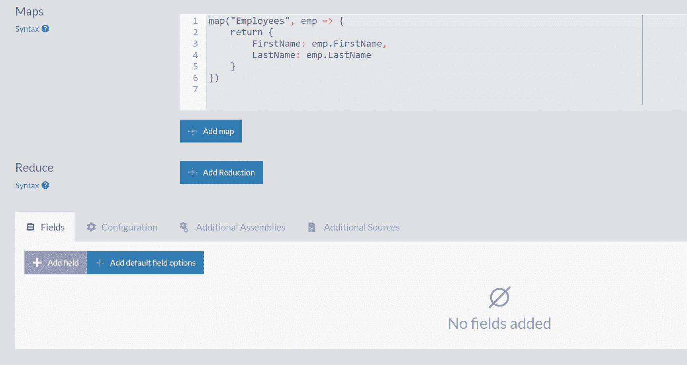

一张包含 2 个部分的截图：包含 6 行语法和按钮“添加映射”以及“添加归约”的映射部分；包含 4 个选项卡和“添加字段”、“添加默认字段”按钮的归约部分（位于“字段”选项卡中）。

**图 5-7**

编辑索引页面上的字段选项卡

此选项卡显示没有字段添加到索引。通过点击 `Add field` 按钮添加字段 `FirstName` 和 `LastName`，填入它们的名称，并在 `Store` 选项中选择值 `Yes`，如图 5-8 所示。

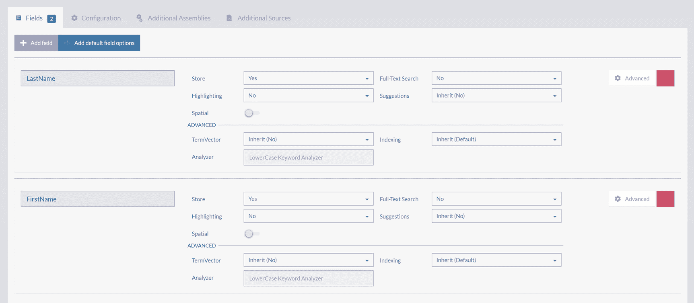

一张包含 4 个选项卡的截图，分别是字段、配置、附加程序集和附加源。“字段”选项卡有 2 个按钮：“添加字段”和“添加默认字段选项”，用于在姓氏和名字下添加详情。

**图 5-8**

在索引中添加 `FirstName` 和 `LastName` 作为存储字段

保存更改后的索引定义后，重复图 5-6 中的查询将显示索引 `Employees/ByFirstNameByLastName` 的存储字段，如图 5-9 所示。

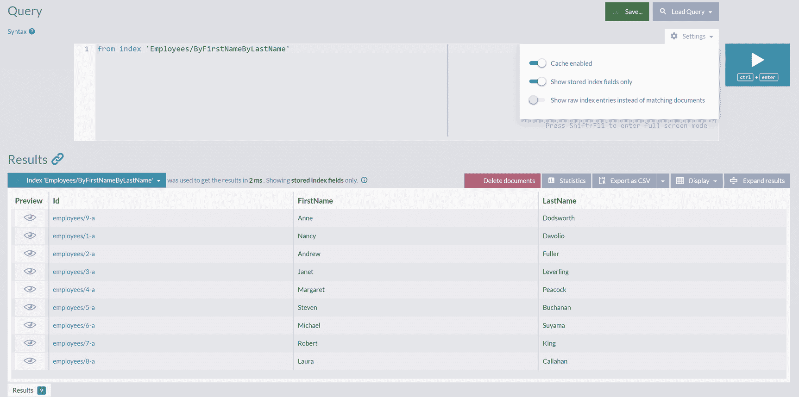

一张截图展示了一个查询、一个包含 3 个切换按钮中启用了 2 个的设置下拉框、搜索查询、保存、播放和删除文档按钮。结果面板显示了一个包含 4 列的表格。

**图 5-9**

索引 `Employees/ByFirstNameByLastName` 的存储字段

由于你刚刚所做的更改，数据库引擎将能够仅通过一次存储往返就创建出由 `FirstName` 和 `LastName` 组成的投影。通过过滤操作获取的索引条目将包含这两个字段，并且这些字段将立即可用。

我们已经提到，覆盖索引是一个很好的折中方案，因为它们产生结果所需的往返次数更少，但同时又不存储完整的文档。借助 RavenDB Studio，你现在可以检查所有索引和集合的实际分配存储。通过点击左侧边缘的 `Stats` 图标，然后选择 `Storage report`，你将能够检查分配详情，如图 5-10 所示。

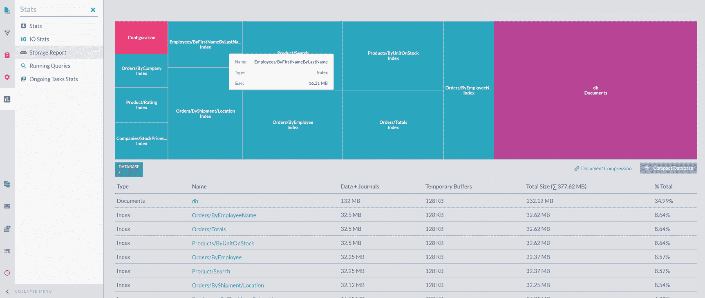

存储报告的截图，显示了点击统计信息图标时索引存储的分配详情和各个字段。

**图 5-10**

存储报告

你可以向索引存储中添加或移除各种字段，并在 `Storage report` 中检查你更改的影响。


## 计算字段

到目前为止，你已经创建了几个包含字段值的静态索引。在某些情况下，比如 `Employees/ByFirstName` 索引，字段值是直接从已处理的文档中读取的。而在其他情况下，比如 `Orders/ByEmployeeName`，会加载被引用的文档，然后索引其字段的内容。

然而，也可以创建包含不存在于任何文档中的值的索引字段。这样的字段被称为**计算字段**。我们通常基于一个或多个其他字段来计算它们的值。

清单 5-9 展示了一个包含计算字段的索引示例。

```javascript
map("Orders", order => {
    var employee = load(order.Employee, 'Employees');
    var total = 0;
    for (var i = 0; i < order.Lines.length; i++) {
        var line = order.Lines[i];
        total += line.Quantity * line.PricePerUnit * (1 - line.Discount);
    }
    return {
        EmployeeName: employee.FirstName,
        Total: total
    }
})
```
清单 5-9
包含计算字段 `Total` 的索引 `Orders/ByEmployeeNameByTotal`

清单 5-9 中定义的索引基于 `Orders/ByEmployeeName`，但扩展了字段 `Total`。它的值代表订单的总货币价值，计算方式如下：

```javascript
var total = 0;
for (var i = 0; i < order.Lines.length; i++) {
    var line = order.Lines[i];
    total += line.Quantity * line.PricePerUnit * (1 - line.Discount);
}
```

这是一段相对标准的命令式 JavaScript 代码。它遍历 `order.Lines` 数组，对于每一行，其小计为 `quantity * price * (1 – discount)`。行小计被累加起来，在处理完所有行后，变量 `total` 就保存了该订单的计算总额。

你可以使用 JavaScript 语言的所有特性，比如循环、函数等。你甚至可以将代码提取到 JS 函数中，从索引的 `map` 函数调用，如清单 5-10 所示。

```javascript
function GetTotal(order) {
    var total = 0;
    for (var i = 0; i < order.Lines.length; i++) {
        var line = order.Lines[i];
        total += line.Quantity * line.PricePerUnit * (1 - line.Discount);
    }
    return total;
}

map("Orders", order => {
    var employee = load(order.Employee, 'Employees');
    return {
        EmployeeName: employee.FirstName,
        Total: GetTotal(order)
    }
})
```
清单 5-10
功能被提取到 JS 函数中的索引 `Orders/ByEmployeeNameByTotal`

也可以使用 JavaScript 的声明式风格，如清单 5-11 所示。

```javascript
function GetTotal(order) {
    return order.Lines.reduce((partial_sum, l) => partial_sum + (l.Quantity * l.PricePerUnit) * (1 - l.Discount), 0)
}

map("Orders", order => {
    var employee = load(order.Employee, 'Employees');
    return {
        EmployeeName: employee.FirstName,
        Total: GetTotal(order)
    }
})
```
清单 5-11
使用声明式 JS 函数的索引 `Orders/ByEmployeeNameByTotal`

还可以将你领域的业务逻辑和业务规则嵌入到索引中。清单 5-12 给出了一个这样的例子。

```javascript
function GetTotal(order) {
    var total = 0;
    for (var i = 0; i < order.Lines.length; i++) {
        var line = order.Lines[i];
        var discount = line.Discount;
        // 为波兰订单额外应用 10% 的折扣
        if (order.ShipTo.Country === "Poland") {
            discount += 0.1;
        }
        total += line.Quantity * line.PricePerUnit * (1 - discount);
    }
    return total;
}

map("Orders", order => {
    var employee = load(order.Employee, 'Employees');
    return {
        EmployeeName: employee.FirstName,
        Total: GetTotal(order)
    }
})
```
清单 5-12
扩展了业务规则的索引 `Orders/ByEmployeeNameByTotal`

我们为运往波兰的订单提供了 10% 的折扣，这条规则作为计算字段计算的一部分被嵌入到索引中。

因此，现在你可以执行一个查询：

```javascript
from index 'Orders/ByEmployeeNameByTotal'
where Total > 15000
```

来获取所有总货币价值超过 15,000 的订单。

所以，利用计算字段，你可以基于现有属性，通过应用可能非常复杂的逻辑，创建新的计算属性。如果需要，你可以将大部分业务逻辑卸载到数据库中。

## 动态字段

正如我们之前提到的，RavenDB 是一个**无模式数据库**。你无需预先定义模式，就能够接受各种半结构化甚至非结构化的数据。项目开始时正是你对领域了解最少的时候。能够推迟关于将使用何种数据结构的决策是一个显著优势。它不仅能加快开发速度，还能在实现过程中以及产品上线后，不可避免地出现更多需求时，提供急需的灵活性。

在其他情况下，你有非常明确的需求，但需要存储在数据库中的数据本质上是异构的。一个典型情况是应用全球化的需求。将业务扩展到世界新的地区，通常意味着需要了解你之前忘记涵盖的概念，并修改你的应用和数据库以考虑它们。

以地址的概念为例。世界各地不同的国家有不同的地址方式。只需阅读全球各国不同的行政区划术语——州、郡、省、区、府、酋长国、州、市、道、县、州——就能理解对这种异构数据建模的完全复杂性。

RavenDB 中文档的无模式 JSON 数据格式，将为你存储的实体提供急需的灵活性以进行扩展。然而，你需要将这些更改传播到查询和应用本身。并且，由于查询使用索引，你也不得不扩展 RavenDB 索引定义。一旦它被更改，这将触发整个索引的重新计算，这可能既计算密集又耗时。

RavenDB 为这种情况提供了一个方便的解决方案，即**动态字段**。你可以以编程方式定义字段，而不是显式声明字段名称及其值。这样的索引可以适应不同的文档结构。此外，当带有新字段的文档到达数据库时，动态字段将防止索引的完全重新计算。清单 5-13 展示了一个为员工地址生成的包含动态字段的索引。

```javascript
function CreateDynamicFields(addr) {
    var ret = [];
    for (const property in addr) {
        ret.push(createField(property, addr[property], { indexing: 'Exact', storage: false, termVector: null }))
    }
    return ret;
}

map("Employees", emp => {
    return {
        _: CreateDynamicFields(emp.Address)
    }
})
```
清单 5-13
`Employees/DynamicFields` 索引

从 `map` 定义可以看出，这个索引处理所有员工，并将为他们的地址创建动态字段。清单 5-14 展示了一个示例地址。

```json
{
    "Line1": "4726 - 11th Ave. N.E.",
    "Line2": null,
    "City": "Seattle",
    "Region": "WA",
    "PostalCode": "98105",
    "Country": "USA",
    "Location": {
        "Latitude": 47.66416419999999,
        "Longitude": -122.3160148
    }
}
```
清单 5-14
employees/8-A 的地址字面量

图 5-11 显示了这种形式地址的索引项集合。

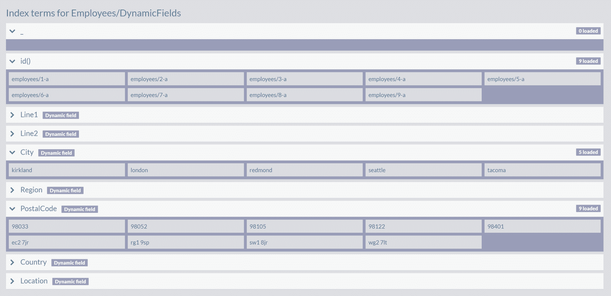
图 5-11
`Employees/DynamicFields` 索引的索引项

地址的每个属性（如 `Line1`、`Line2`、`City` 等）都是一个项的集合。该集合中的值是从任何员工文档上该属性的所有出现位置中提取出来的。

让我们看看索引的定义。你可以看到动态字段的定义有一个特殊的形式：

```javascript
_: CreateDynamicFields(emp.Address)
```


## 动态字段

使用下划线 `_` 作为对象字面量名称只是一种约定。图 5-11 显示，将创建一个名为 `_` 的集合，但它没有内容。

生成动态字段集合的函数定义如下：

```javascript
function CreateDynamicFields(addr) {
var ret = [];
for (const property in addr) {
ret.push(createField(property, addr[property], { indexing: 'Exact', storage: false, termVector: null }))
}
return ret;
}
```

首先定义一个空数组。索引引擎将遍历地址的所有属性，并为每个属性添加一个新的动态字段。

RavenDB 内置了以下 JS 函数：

```javascript
createField(name, value, {options}).
```

你可以使用它来创建一个动态字段 `name:property`。

请注意，`CreateDynamicFields` 函数是完全通用的——没有指定确切的字段名。它可以处理传递给它的任何对象字面量，提取所有属性名称及其值，并为找到的每个属性创建动态字段。

此外，修改员工文档将触发索引更新，并向索引词条中添加一个新字段。作为一个练习，请打开 ID 为 `employees/8-A` 的员工，并使用以下属性扩展其 Address：

```json
"Continent": "North America"
```

保存更改后，验证是否已创建一个名为 `Continent` 的新索引词条集合。

总的来说，动态字段是创建灵活索引的工具，这些索引可以处理异构数据，同时还能适应你的领域模型可能引入的未来变更。

## 扇出索引

到目前为止，我们创建的索引都是处理文档的，并且为每个文档创建一个索引条目。例如，索引 `Employees/ByFirstName` 将获取所有九份员工文档，读取他们的名字，并为每个文档输出一个索引条目。图 5-12 显示了此索引的摘要。

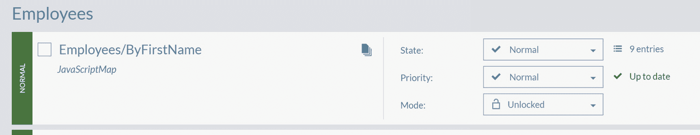

一张截图显示了名为 employees 的索引，带有一个复选框，显示“employees slash by first name”，共显示 9 个条目，状态为“up to date”，模式为“normal”，优先级为“normal”，锁定状态为“unlocked”。

图 5-12

索引 `Employees/ByFirstName` 的摘要

摘要显示九个条目，每个文档一个。索引条目数等于集合中的文档数。

可以编写一个索引，使其对每个处理的文档输出不止一个而是多个条目。这样的索引称为 *扇出索引*。代码清单 5-15 展示了这样一个索引的示例。

```javascript
map('Orders', order => {
var res = [];
order.Lines.forEach(l => {
res.push({
ProductName: l.ProductName
})
});
return res;
})
代码清单 5-15
Orders/ByProductName 索引
```

扇出索引可以为每个文档产生数十甚至数百个条目。代码清单 5-15 中的索引遍历每个订单中的所有订单项，并为每个订单项创建一个索引条目。每个这样的条目都包含一个产品名称。因此，对于每个订单文档，该索引将创建与订单项数量一样多的条目。

现在，你可以查找所有包含指定产品名称订单项的订单：

```rql
from index 'Orders/ByProductName' where ProductName = 'chocolade'
```

图 5-13 显示，检查特定订单的索引条目可以揭示其所有条目，并帮助你理解扇出原理。

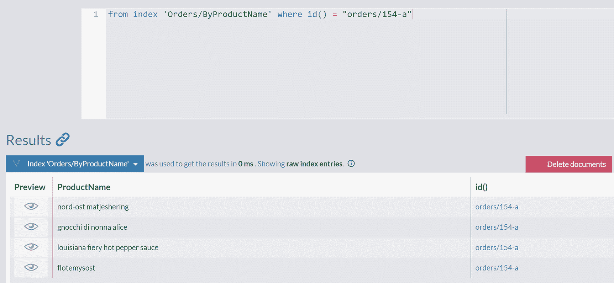

一张截图显示了从索引 orders slash by product name 中查询 where i d = orders slash 154-a 的结果。结果面板中有一个包含 3 列的表格，分别是预览、产品名称和 i d，以及一个删除文档按钮。

图 5-13

`Orders/154-a` 的索引条目

回到索引概览，你会看到该索引包含 2,155 个条目，处理了 830 个订单。

同样地，你可以为所有带有嵌入值的文档建立索引。

## 多地图索引

到目前为止，我们定义的所有索引都是处理单个集合，加载其文档的属性，并将它们的值提取到索引条目中。然而，不同集合中的文档拥有相同属性的情况并不少见。一个典型的例子就是地址——在我们的示例数据集中，`Employees`、`Companies` 和 `Suppliers` 都拥有这个属性。

`Companies` 和 `Suppliers` 都是法人实体，不难想象在某些业务场景下，你希望按城市搜索这两者。一个可能的解决方案是创建 `Companies/ByCity` 和 `Suppliers/ByCity` 索引。但是，你需要执行两次搜索才能得到完整结果：

```rql
from index 'Companies/ByCity' where City = 'paris'
from index 'Suppliers/ByCity' where City = 'paris'
```

RavenDB 提供了一种将这两个索引合并为一个的方法。这种索引称为 *多地图索引*。

对于我们的场景，定义这样一个索引并不比定义单地图索引更困难。首先，你需要选择一个名称。由于扫描了两个集合，你可以使用一个描述业务功能而非集合名称的名字，例如 `Search/ByCity`。代码清单 5-16 展示了这个索引的定义。

```javascript
map("Companies", company => {
return {
City: company.Address.City
}
})
map("Suppliers", supplier => {
return {
City: supplier.Address.City
}
})
代码清单 5-16
Search/ByCity 索引
```

你像往常一样添加第一个地图。然后，点击“添加地图”按钮。将会再打开一个文本区域，以便你添加第二个地图定义。你的多地图索引已准备好进行查询，如图 5-14 所示。

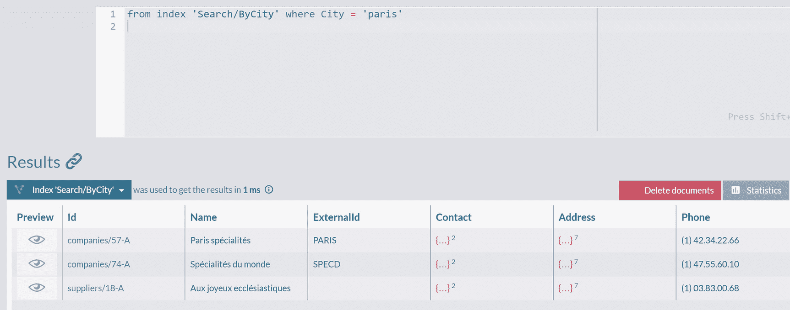

一张截图显示了从索引 search slash by city 中查询 where city = paris 的结果。结果面板中有一个包含 7 列的表格，分别是预览、i d、名称、外部 I d、联系人、地址和电话号码，以及一个删除文档按钮。

图 5-14

查询多地图 `Search/ByCity` 索引

你得到的结果是所有位于巴黎的公司和供应商。

你可以用另一个处理 `Employees` 的地图来扩展这个索引。我们将其留作你的练习。


## 索引层次结构数据

除了简单的线性关系外，你的应用程序不可避免地需要表示和存储更复杂的结构。其中一种结构是层次结构——一系列按顺序指向下一个文档的链。层次数据的典型代表是家谱树或博客文章的评论线程。

我们的示例数据库包含一个层次数据的例子，如代码清单 5-17 所示。

```
{
"LastName": "Dodsworth",
"FirstName": "Anne",
...
"ReportsTo": "employees/5-A",
...
```

代码清单 5-17
`employees/9-A` 文档的 `ReportsTo` 属性

每位员工都有一个 `ReportsTo` 属性，其中包含另一名员工的标识符。在本章中，你已经看到了如何索引相关文档的示例，因此很容易想到代码清单 5-18 中展示的索引。

```
map("Employees", emp => {
return {
Manager : load(emp.ReportsTo, "Employees").FirstName
}
})
```

代码清单 5-18
`Employees/ByReportsToFirstName` 索引

查看此索引的索引项，你会看到它只包含两个名字：Andrew 和 Steven。查询索引获取这两个名字

```
from index 'Employees/ByReportsToFirstName' where Manager = 'Andrew'
from index 'Employees/ByReportsToFirstName' where Manager = 'Steven'
```

将揭示 Northwind Traders 公司的结构：Anne、Michael 和 Robert 直接向 Steven 汇报。其他所有人，包括 Steven，都直接向 Andrew 汇报。这个层次结构也体现在员工的职称上。Andrew 是“销售副总裁”，Steven 是“销售经理”。所有其他员工则担任“销售代表”和“内部销售协调员”。

这里需要注意的一个重要事项是 Andrew 的 `ReportsTo` 属性：

```
"ReportsTo": null
```

此属性为 null，`Employees/ByReportsToFirstName` 将执行以下行：

```
load(null, "Employees").FirstName
```

然而，与大多数编程语言不同，这里的 null 引用不会造成任何问题。RavenDB 会识别尝试加载不存在文档的操作，并优雅地处理——它不会为 Andrew 生成任何索引条目。如果你检查此索引的概述，你会看到它针对九名已处理员工只有八个条目。

我们刚才计算的层次结构并不完整——只获取了直接上级。在为每位员工获取了直接经理后，我们可以继续沿着层次树向上攀升，直到到达层次结构中的最高层经理。代码清单 5-19 定义了一个索引，用于收集每位员工的直接和间接经理。

```
map("Employees", empl => {
if (empl.ReportsTo == null) return null;
var managerNames = [];
while (true) {
empl = load(empl.ReportsTo, "Employees");
if (empl == null)
break;
managerNames.push(empl.FirstName);
}
return {
Manager: managerNames
}
})
```

代码清单 5-19
`Employees/ByManagers` 索引

此索引包含的索引项与上一个索引（`Employees/ByReportsToFirstName`）相同，但索引条目不同，如图 5-15 所示。

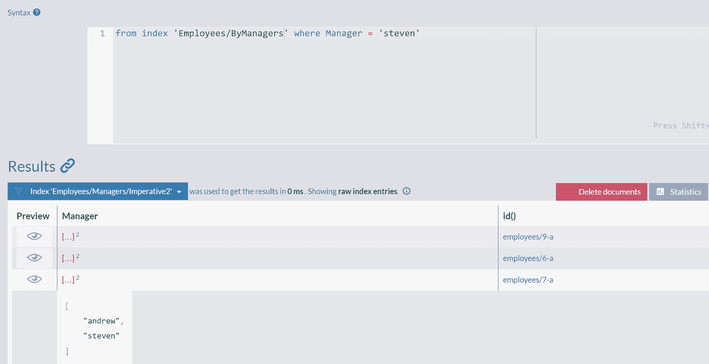

屏幕截图显示了对索引 `employees slash by managers where manager = steven` 的查询。结果面板包含一个有 3 列（预览、经理和 i d）的表格、统计信息选项卡和删除文档按钮。

图 5-15
`Employees/ByManagers` 索引的索引条目

如你所见，我们查询了经理是 Steven 的所有员工，并且我们得到了所有三个人。然而，这些员工的索引条目同时包含了 Steven 和 Andrew——正如我们在代码清单 5-19 中循环向上遍历层次结构时，Steven 被添加到数组中，然后是作为 Steven 上级官员被加载的 Andrew。

此索引的递归性质可以用声明性的方式表达。RavenDB 提供了 JS 函数 `recurse`，形式如下：

```
recurse(start_document, func(doc) -> doc)
```

它将从指定的文档开始，以递归方式应用 `func`——返回的文档将作为输入传递给 `func`。如代码清单 5-20 中定义的调用链将持续进行，直到 `func` 返回 null。

```
map("Employees", empl => {
var reportsTo = load(empl.ReportsTo, "Employees");
return recurse(reportsTo, x => load(x.ReportsTo, "Employees"))
.map(boss => {
return { Managers: boss.FirstName };
});
})
```

代码清单 5-20
`Employees/ByManagers` 索引的递归版本

此索引的命令式和声明式版本在结果上是等价的。你将能够通过链中的任何值查询层次结构。

## 总结

在本章中，我们介绍了静态索引以显式定义索引。你了解了索引单个或多个集合的方法，并指定了此类索引的动态字段、存储字段和计算字段。我们介绍了索引对其他文档引用的技术，以及处理层次数据结构的方法。

下一章将展示如何创建执行数据聚合的索引。

