# 6. MapReduce 索引

上一章展示了对索引定义和生命周期的完全控制。介绍了 Map 和 MultiMap 索引，以及各种可用于过滤和排序文档的计算字段的方法。本章将展示如何在 RavenDB 中执行分组和聚合。将介绍 MapReduce 和 MultiMapReduce 索引的概念，以及将索引内容具体化到新集合的方法。

## 分组

上一章执行的查询是关于过滤的。定义了过滤条件，数据库返回所有匹配的文档。这类典型查询如下所示：

```
from index 'Auto/Employees/ByFirstName'
where FirstName = 'Nancy'
```

或

```
from index 'Orders/ByEmployeeNameByTotal'
where Total > 15000
```

除了过滤文档，RavenDB 还能够对数据进行分组。假设我们想按发货国家/地区分析订单。你可以通过运行代码清单 6-1 所示的查询来实现。

```
from Orders as o
group by o.ShipTo.Country
select o.ShipTo.Country
```

代码清单 6-1
按发货国家/地区对订单进行分组

此查询将生成一个包含 Northwind Traders 发送订单的 21 个不同国家/地区的列表，如图 6-1 所示。

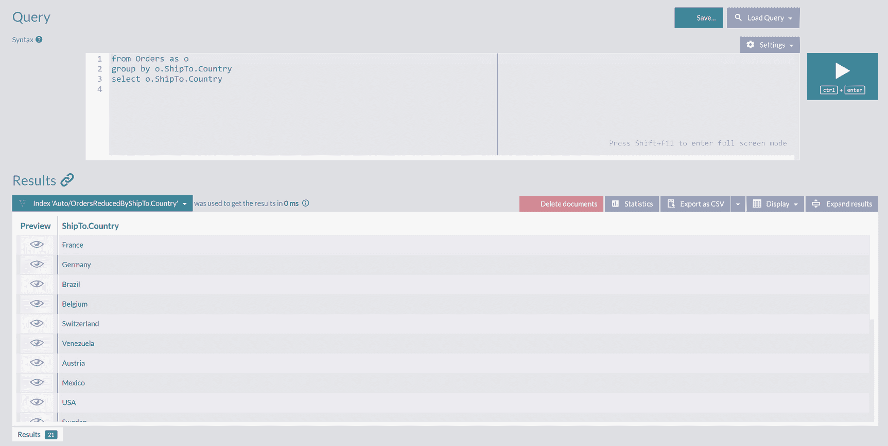

查询结果快照，显示一个包含 21 个国家/地区的列表。法国、德国、比利时、巴西是列表中的一些国家/地区。

图 6-1
订单的发货国家/地区

与你之前看到的所有查询一样，此查询也使用索引来返回结果。由于我们没有预先定义静态索引，RavenDB 创建了自动索引 `Auto/OrdersReducedByShipTo.Country`，该索引在数据库的所有索引列表中可见。单击它将显示如图 6-2 所示的索引详细信息。

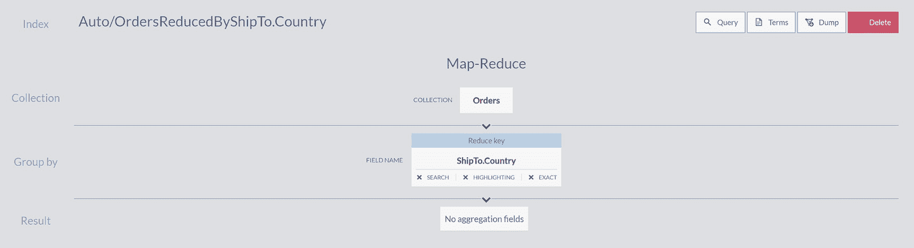

数据库中所有索引的快照，按国家/地区分类。

图 6-2
自动索引 `Auto/OrdersReducedByShipTo.Country` 的结构

处理了来自 `Orders` 集合的文档，提取了它们的 `ShipTo.Country` 值，并将具有相同值的订单 ID 存储在索引条目中。RavenDB 使用一种特定的编程模型来处理分组任务，我们将在下一节中研究它。


## MapReduce

图 6-2 展示了索引中数据分组管道的可视化。在此图的顶部，你会看到 `Map-Reduce` 标题，表示此索引类型。这种由 Google 推广的技术，其另一种拼写为 `MapReduce`，用于跨多台机器并行处理数据。在典型设置中，数据首先被拆分成批次。每个批次被发送到不同的设备，该设备将使用 `map` 函数转换接收到的集合中的所有条目。然后，映射后的条目通过 `reduce` 函数组合，产生最终结果集。

上一章介绍了自动和静态索引的示例，它们实现了映射函数来将文档转换为索引条目。MapReduce 索引将获取此类映射条目，并对其应用归约函数，输出分组后的条目。RavenDB 使用了这种编程模型的一个变体。

与 Google 等公司使用的原始 MapReduce 不同（其数据批次分布在成百上千台机器上），RavenDB 在单台机器上执行此过程。多个线程将接收数据包，首先应用映射函数以输出投影，然后对这些投影应用归约函数。

RavenDB 有一个 MapReduce 可视化器，可以帮助你检查 MapReduce 索引。你可以通过点击侧边栏中的“索引”选项，然后点击“Map-Reduce Visualizer”选项来打开它，如图 6-3 所示。如果你是第一次使用 MapReduce，或者需要在大数据集上调试结果，理解这个过程可能会有点繁琐。

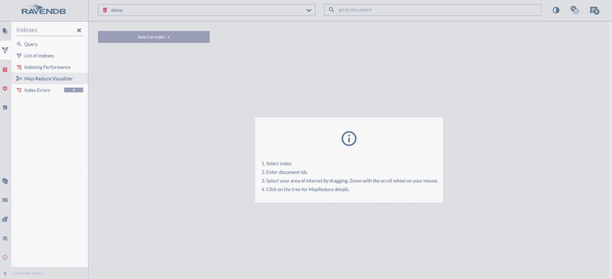

Map-Reduce 菜单中选择索引、输入文档、兴趣区域以及 map-reduce 详细信息选项的截图。

图 6-3

Map-Reduce 可视化器初始屏幕

在此屏幕上，你可以选择你刚才查询创建的索引，`Auto/OrdersReducedByShipTo.Country`，并选择文档以展示可视化效果。选择 `orders/1-a` 和 `orders/103-a` 将生成如图 6-4 所示的表示。

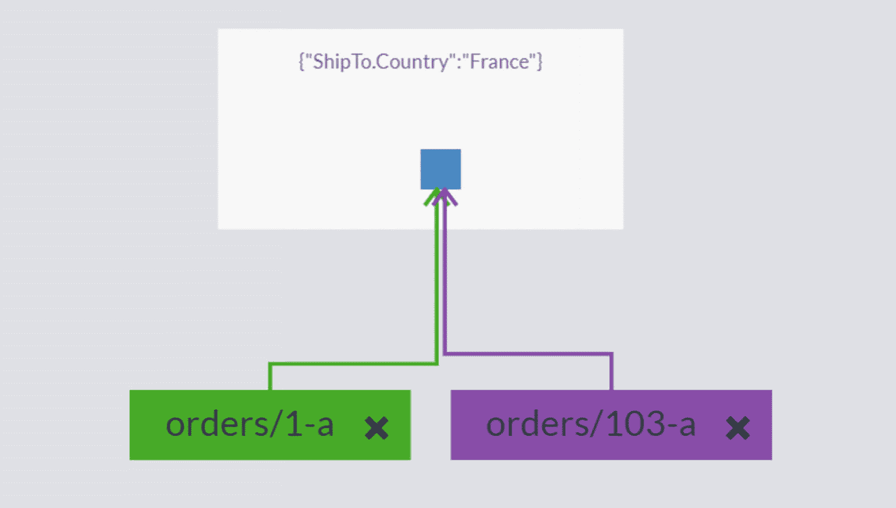

准备发往法国的订单截图。

图 6-4

Auto/OrdersReducedByShipTo.Country 索引对于 orders/1-a 和 orders/103-a 的 Map-Reduce 可视化

索引的映射阶段提取了 `ShipTo.Country`，而归约阶段收集了所有具有相同发货国家的订单。在图 6-4 中，你可以看到归约阶段将这两个订单收集在一起，因为它们的发货国家匹配。如果你查看这两个订单的文档，你会知道它们被发往了法国。

点击归约框将展开树的根节点，如图 6-5 所示。

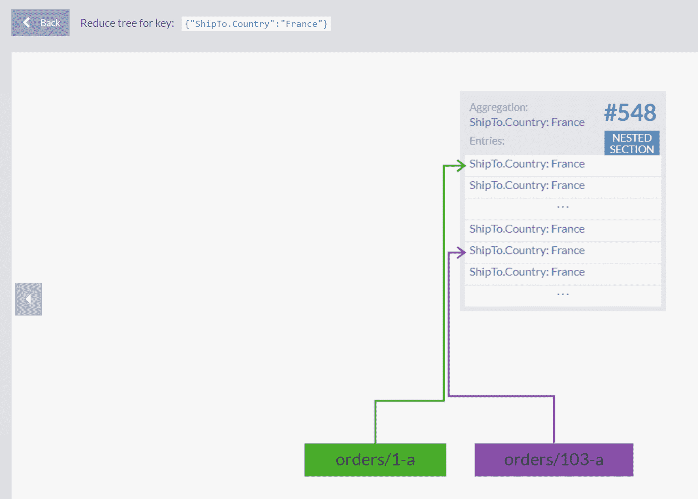

两个订单的树根扩展截图。

图 6-5

归约结果详情

你可以看到归约阶段将发往法国的众多订单分组，而我们选择的两个订单只是众多订单中的两个。点击归约框将显示所有这些订单的可滚动列表，如图 6-6 所示。

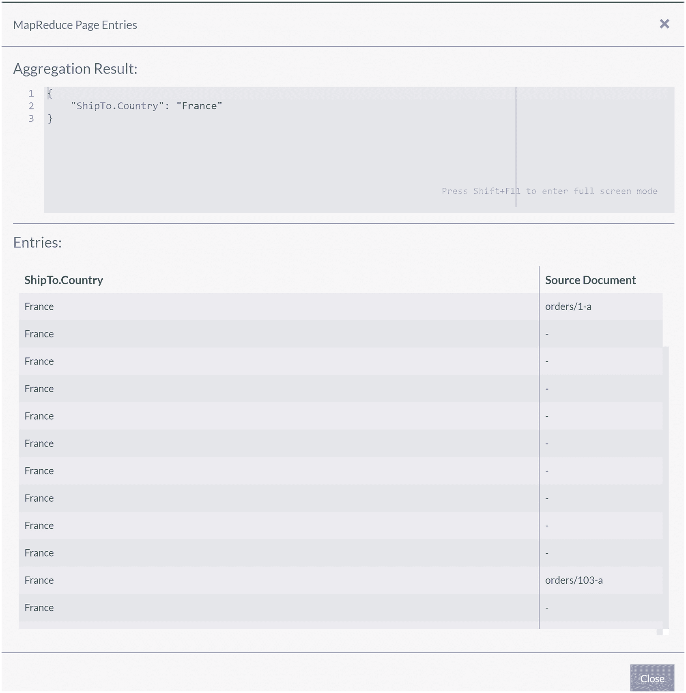

所有订单的可滚动列表截图。

图 6-6

归并发往法国的订单

数据库能够执行此类分组固然不错，但其价值并不太大。分组能力的真正威力在于聚合，我们将在下一节中介绍。

## 聚合

我们以清单 6-1 所示的查询开始了本章。执行时，它将产生一个发货国家列表。然而，我们想看到有多少订单被发往了这些国家。显示该信息的查询如清单 6-2 所示。

```
from Orders as o
group by o.ShipTo.Country
select o.ShipTo.Country, count()
```

清单 6-2
按发货国家对订单进行分组和计数

如果你将清单 6-2 与清单 6-1 中的前一个查询进行比较，可以看到我们用 `count()` 扩展了 select 语句。此查询扩展将导致结果的增加，如图 6-7 所示。

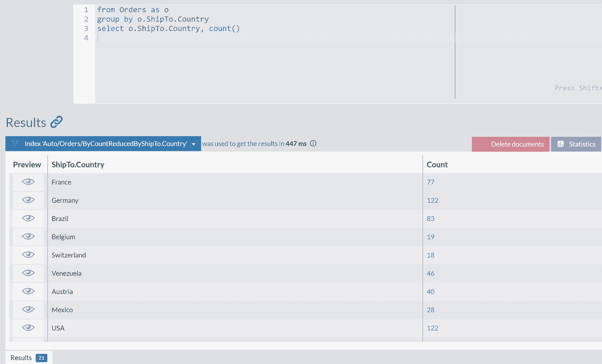

发货国家及其订单数量截图。

图 6-7

扩展了计数的订单发货国家

显示的计数是通过应用 `aggregation`（聚合）过程计算的——即为一组结果计算合并值。在此情况下，RavenDB 为 `国家组` 中的每个订单计数为一，并计算出总和。最后，我们可以执行此查询：

```
from Orders as o
group by o.ShipTo.Country
order by count() as long desc
select o.ShipTo.Country, count()
```

并获得关于“Northwind Traders”业务的一些有用信息——其大部分订单（122 个）被交付给了美国和德国的客户。

如你所见，此查询创建了新的自动索引 `Auto/Orders/ByCountReducedByShipTo.Country`，在索引列表中点击其名称将揭示其内部结构，如图 6-8 所示。

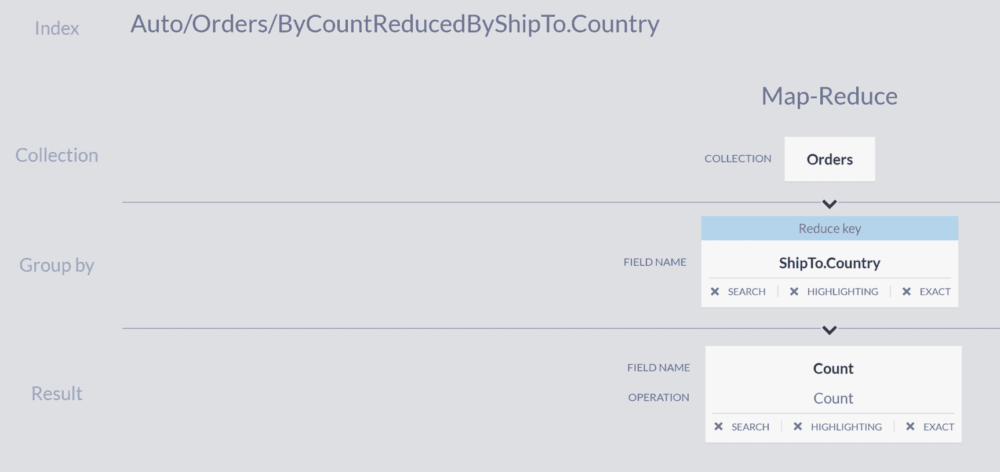

订单的集合、分组依据和归约结果的截图。

图 6-8

`Auto/Orders/ByCountReducedByShipTo.Country` 的结构

如果你将此与图 6-2 进行比较，可以看到原始的自动索引在聚合阶段增加了 `count` 操作。

检查此索引的索引项，会发现名为 `Count` 和 `ShipTo.Country` 的字段。这两个聚合类别为我们提供了一种方法来找出有多少批货发往了芬兰：

```
from index 'Auto/Orders/ByCountReducedByShipTo.Country'
where 'ShipTo.Country' = 'finland'
```

或者获取所有订单发货数量超过 80 的国家列表：

```
from index 'Auto/Orders/ByCountReducedByShipTo.Country'
where 'Count' > 80
```


## 静态 MapReduce 索引

上一章介绍了静态 Map 索引的概念。它们是 Map 索引的自然延伸，提供了一种映射文档并随后指定如何聚合这些映射的方法。同样，也可以编写静态 MapReduce 索引。本节将重新创建自动索引 `Auto/Orders/ByCountReducedByShipTo.Country` 的静态版本。

首先创建一个映射索引，如清单 6-3 所示：

```
map("Orders", order => {
return {
Country: order.ShipTo.Country
}
})
Listing 6-3
Orders/ByCountry 映射索引
```

这个索引与前一章的 `Employees/ByFirstName` 索引没有太大区别——对于每个订单文档，RavenDB 将创建一个带有 `Country` 值的索引条目。

此静态索引的最终目标是统计总数，因此让我们扩展映射，添加你稍后要聚合的数字，如清单 6-4 所示：

```
map("Orders", order => {
return {
Country: order.ShipTo.Country,
Count: 1
}
})
Listing 6-4
用计数扩展 Orders/ByCountry 映射索引

```

此类扩展映射索引的原始索引条目可在图 6-9 中找到。

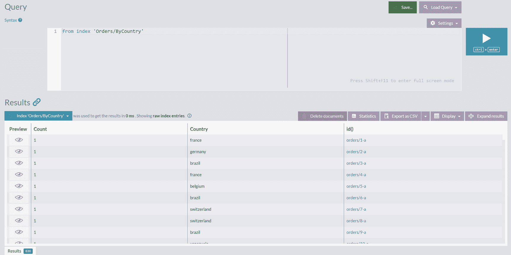

按国家排序的订单索引快照。

图 6-9
扩展映射索引 `Orders/ByCountry` 的原始索引条目

该索引现在执行的就是你手动会做的任务——逐一遍历每个订单，并记录下每个 `ShipTo.Country` 字段中出现的国家。在记录完所有订单的此类标记后，你会返回并进行汇总。这正是 MapReduce 索引的归约阶段所做的事情。

要添加归约脚本，请打开索引进行编辑，然后单击“添加归约”按钮。将打开一个新面板，你可以在其中添加用于归约映射函数发出的所有映射的 JS 代码。清单 6-5 中显示了此代码：

```
groupBy(map => map.Country)
.aggregate(group => {
var country = group.key;
var count = 0;
group.values.forEach(el => {
count += el.Count;
})
return {
Country: country,
Count: count
}
})
Listing 6-5
索引 Orders/ByCountry 的归约代码
```

图 6-10 显示了 Orders/ByCountry MapReduce 索引的最终形式。

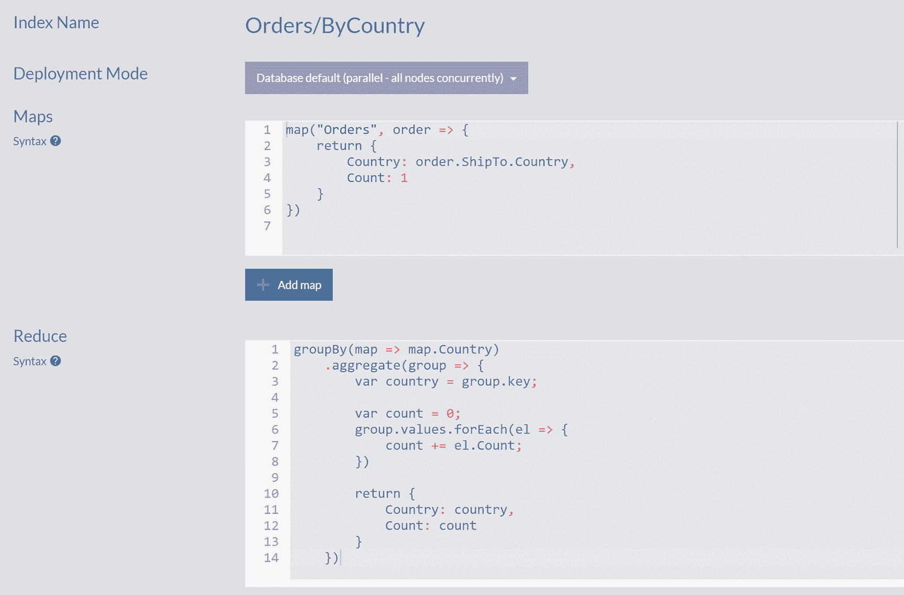

按国家排序的订单代码快照。

图 6-10
MapReduce 索引 `Orders/ByCountry`

清单 6-5 中的归约脚本可以重构。重构是在不改变行为的情况下更改实现的过程。让我们重新组织代码，使其更加简洁。

首先，你可以用基于 `reduce` 函数的函数式等价项替换清单 6-8 中定义的命令式 `forEach` 循环：

```
groupBy(map => map.Country)
.aggregate(group => {
var country = group.key;
var count = group.values.reduce((res, el) => res + el.Count, 0);
return {
Country: country,
Count: count
}
})
```

Reduce 方法可能看起来很奇怪，但它是命令式 `for` 循环的声明式等价物。它在 JavaScript 中对数组进行操作，形式如下：

```
array.reduce(reducer, initialValue);
```

Reduce 方法从 `initialValue`（在我们的例子中为零）开始，然后对数组的所有元素应用 `reducer` 操作。你可以这样理解归约器：

```
reducer(result_from_previous_call, arrayElement) => new_result
```

在第一次应用时，没有前一次调用的结果，因此将使用 `initialValue`，并消耗数组的第一个元素，结果为

```
var res0 = reducer(0, arr[0])
```

之后，将处理下一个数组元素：

```
var res1 = reducer(res0, arr[1])
```

此过程将继续，直到所有数组元素都被处理完毕。因此，我们以递归声明的方式迭代了所有数组元素。

归约器函数本身是对两个参数的简单相加：

```
reducer(accumulatedValue, el) = accumulatedValue + el.Count
```

作为我们索引归约阶段重构的第二步也是最后一步，你可以内联 `country` 和 `count` 变量：

```
groupBy(map => map.Country)
.aggregate(group => {
return {
Country: group.key,
Count: group.values.reduce((res, el) => res + el.Count, 0)
}
})
```

此时，自动索引 `Auto/Orders/ByCountReducedByShipTo.Country` 已通过静态索引 `Orders/ByCountry` 复制完成，因此你可以找出有多少货物发往芬兰：

```
from index 'Orders/ByCountry'
where 'Country' = 'finland'
```

或者获取所有发货量超过 80 笔的国家列表：

```
from index 'Orders/ByCountry'
where 'Count' > 80
```

## 静态索引与自动索引

你刚刚花费了一些精力来实现一个由 RavenDB 自动创建的索引的静态替代方案，你可能会问自己，“为什么？” 确实，如果 RavenDB 可以自行完成工作，那么意义何在？

你想要控制索引的创建及其定义有多个原因。其中最重要的两个原因将在以下部分中讨论。

### 初始索引时刻

创建索引（无论是自动的还是静态的）后，将执行初始索引。所有文档都将从磁盘中获取并由索引处理。如果被索引的集合为空，则新创建的索引将立即准备就绪。然而，如果集合不为空，处理所有文档将需要一定的时间。

执行清单 6-1 中的查询将触发自动索引的创建，根据数据库中订单的数量，初始索引过程可能需要相当长的时间。在索引过程进行期间，索引将处于 `过时` 状态。这意味着索引包含许多索引条目，但此集合仍不完整。因此，在过时索引上执行的查询也可能返回不完整的结果集。例如，以下查询

```
from index 'Auto/Orders/ByCountReducedByShipTo.Country'
where 'Count' > 80
```

可能会忽略一些国家，因为并非所有订单都已被处理。在这种情况下，RavenDB 可能会等待最多 15 秒，直到索引变为非过时状态。15 秒后，如果索引仍然过时，你将获得部分结果集，索引将在后台继续进行。此决策背后的推理很简单——RavenDB 不是报告错误，而是返回可能不完整的结果集，并附带通知，说明某些结果可能缺失。

在生产环境中，你通常希望在实时数据库上部署或创建索引，等待索引过程完成，然后部署使用这些新索引的代码。

使用静态索引，你可以更好地控制此过程。与在首次查询时创建的自动索引不同，静态索引是显式定义的。因此，索引过程将在保存静态索引定义后开始。总体而言，静态索引更明确且可预测，你将在查询数据库之前有意地创建它们。


### 聚合的复杂性

清单 [6-2] 中创建了自动索引 `Auto/Orders/ByCountReducedByShipTo.Country`，它通过对具有相同运输国家的订单出现次数进行求和来执行聚合。遗憾的是，这种简单的聚合是自动 MapReduce 索引的极限。对于任何更高级的操作，您都必须编写静态 MapReduce 索引。

例如，我们可以跟进对各国订单数量的初步分析，按运输国家分析订单的总价值。然而，检查示例数据库中的任何订单，您会发现它们缺少总货币价值的属性。我们无需计算此值并修补订单文档，而是可以计算它并将其作为索引的一部分存储，如清单 [6-6] 所示：

```csharp
map("Orders", order => {
    return {
        Country: order.ShipTo.Country,
        Total: order.Lines.reduce((total, line) => (line.Quantity * line.PricePerUnit) * (1 - line.Discount), 0)
    }
})
groupBy(map => map.Country)
.aggregate(group => {
    return {
        Country: group.key,
        Total: group.values.reduce((res, el) => res + el.Total, 0)
    }
})
```

清单 6-6：`Orders/ByCountryTotals` 索引

此索引的映射阶段处理订单行，考虑行折扣以计算每个订单的总值。之后，这些总值会按运输国家相同的订单组进行求和。

您现在可以执行如下分析：

```text
from index 'Orders/ByCountryTotals'
where Total > 50000
```

在此示例中，我们应用了复杂的聚合，并将其结果用作数据模型的一部分，而无需更改数据库中的文档。

### 多地图归约索引

观察我们销售对象的公司和我们采购对象的供应商，您可以执行以下两种聚合。在清单 [6-2] 中，我们按运输国家分析了订单。让我们继续检查我们的数据集以探索最活跃的国家。

我们销售到的国家：

```text
from "Companies" as c
group by c.Address.Country
select c.Address.Country, count()
```

我们从其采购的国家：

```text
from "Suppliers" as s
group by s.Address.Country
select s.Address.Country, count()
```

这两个查询将返回按国家分组的公司和按国家分组的供应商。此外，这两个查询将产生两个自动索引。手动聚合这两个结果集将回答 Northwind Traders 与哪些国家业务往来最多的问题。

在上一章中，我们介绍了多地图索引的主题，这些索引同时操作多个集合。为了编写一个静态索引来替换两个自动索引，我们可以以多地图索引为基础，然后对生成的投影应用归约阶段。这样的索引被称为 **多地图归约索引**。

您首先定义多地图索引 `Countries/Business` 的两个映射阶段，如清单 [6-7] 所示。

```csharp
map("Companies", company => {
    return {
        Country: company.Address.Country,
        Companies: 1,
        Suppliers: 0
    }
})
map("Suppliers", company => {
    return {
        Country: company.Address.Country,
        Companies: 0,
        Suppliers: 1
    }
})
```

清单 6-7：多地图索引 `Countries/Business`

如果您将此清单与清单 [6-4] 进行比较，您会发现我们再次进行计数，但这次略有修改。我们需要为每个公司出现计一次，但同时，我们还需要计算供应商的事件。

RavenDB 要求在一个索引中定义的所有映射函数具有相同的输出。因此，在计算公司数量时，您还需要返回供应商数量，反之亦然。为了符合这一点，您可以使用一个简单的方法——返回您感兴趣的数据，对于所有其他字段，返回零值。这将产生如图 [6-11] 所示的索引条目。

公司、供应商和国家列表的快照。
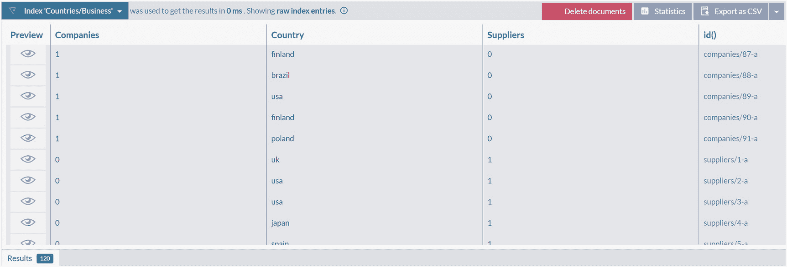

多地图索引 `Countries/Business` 的原始索引条目。

如您所见，对于正在处理的每个公司和供应商文档，索引将提取其国家，并在相应的属性中计数为一。

现在剩下的就是添加聚合。因此，我们使用归约阶段扩展索引，这给了我们如清单 [6-8] 所示的最终形式。

```csharp
map("Companies", company => {
    return {
        Country: company.Address.Country,
        Companies: 1,
        Suppliers: 0
    }
})
map("Suppliers", company => {
    return {
        Country: company.Address.Country,
        Companies: 0,
        Suppliers: 1
    }
})
groupBy(map => map.Country)
.aggregate(group => {
    return {
        Country: group.key,
        Companies: group.values.reduce((res, el) => res + el.Companies, 0),
        Suppliers: group.values.reduce((res, el) => res + el.Suppliers, 0)
    }
})
```

清单 6-8：多地图归约索引 `Countries/Business`

最后，您可以运行查询：

```text
from index 'Countries/Business'
```

以获取包含公司和供应商数量的国家列表。


## 人工文档

除了计算聚合结果并将其存储在索引中，你还可以将此类索引条目具体化（materialize）为称为 `人工文档` 的文档。它们将驻留在一个任意命名的集合中；每次索引更新时，此集合也会随之更新。本节将展示何时需要创建人工文档，介绍其配置过程，并了解如何对它们执行索引。

查询列表 6-8 中的索引会得到如图 6-12 所示的原始索引结果。

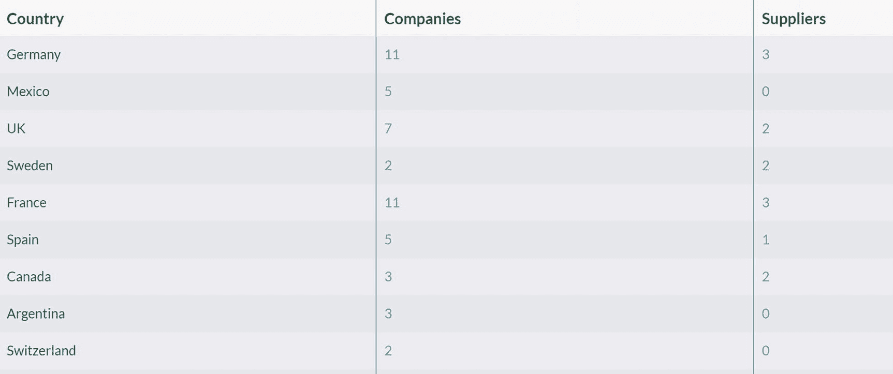
*国家、公司和供应商列表的快照。*
**图 6-12**
`Countries/Business` 索引的原始索引条目

现在，你可以使用索引的这两个字段，根据我们与之有业务往来的公司数量对国家进行排序：
```sql
from index 'Countries/Business'
order by Companies as long desc
```
以及根据供应商数量排序：
```sql
from index 'Countries/Business'
order by Suppliers as long desc
```
但是，如果我们想查看总数呢？如果你要出差，哪个城市会是你的首选？在哪个地方，你有机会拜访到最多与你公司有业务往来的实体？

解决这个问题的一种方法是扩展索引，增加一个 `Total` 字段，用于汇总 `Companies` 和 `Businesses`，如列表 6-9 所示。
```javascript
map("Companies", company => {
return {
Country: company.Address.Country,
Companies: 1,
Suppliers: 0,
Total: 1
}
})
map("Suppliers", company => {
return {
Country: company.Address.Country,
Companies: 0,
Suppliers: 1,
Total: 1
}
})
groupBy(map => map.Country)
.aggregate(group => {
return {
Country: group.key,
Companies: group.values.reduce((res, el) => res + el.Companies, 0),
Suppliers: group.values.reduce((res, el) => res + el.Suppliers, 0),
Total: group.values.reduce((res, el) => res + el.Total, 0)
}
})
```
**列表 6-9**
扩展了 `Total` 字段的 Countries/Business 索引

有了扩展后的索引，你现在可以查询：
```sql
from index 'Countries/Business'
order by Total as long desc
```
来获取所需的信息。

除了扩展索引，你可能还想使用列表 6-10 中显示的查询。
```sql
from index 'Countries/Business'
order by (Companies + Suppliers) as long desc
```
**列表 6-10**
使用计算字段查询索引

执行此查询将导致错误。

在第 4 章中，我们讨论了 RavenDB 的索引方法——你所有的查询始终针对索引执行，并且使用预先计算好的索引条目来提供闪电般快速的数据库响应。在任何情况下，查询都不能包含任何计算。所有此类计算都必须在查询发生之前，在索引本身内部完成。正是出于这个原因，列表 6-10 中的查询会导致错误——我们试图将 `Companies` 和 `Suppliers` 相加，然后根据该标准对国家进行排序。重新审视列表 6-9 中的扩展索引，你可以看到我们确实在索引阶段进行了总数求和。

检查扩展前索引的原始索引条目（如图 6-12 所示），揭示了一种适合编写简单映射索引的数据结构。不幸的是，RavenDB 索引只能操作文档，不能操作其他索引中的原始索引条目。

不过，RavenDB 提供了一种方法，可以将原始索引条目具体化为实际的文档，这样你就可以查询甚至索引它们。在下一节中，我们将展示如何实现这一点。

### 创建人工文档

首先，将索引 `Countries/Business` 恢复到列表 6-8 中的状态，即在用 `Total` 字段扩展它之前的状态。当你打开索引进行编辑时，在 `Reduce` 脚本区域的下方，有一个 `Output Reduce Results to Collection`（将 Reduce 结果输出到集合）选项，如图 6-13 所示。

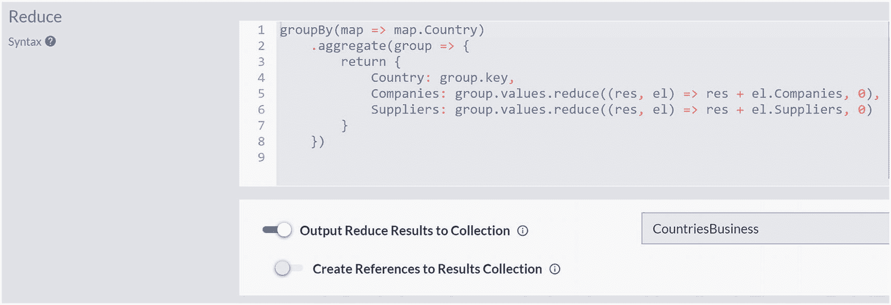
*公司和供应商分组值代码的快照。*
**图 6-13**
将索引 Reduce 结果输出到 `CountriesBusiness` 人工集合

结果，原始索引条目（与你能在图 6-12 中看到的相同）将被提取并加载到正确的 JSON 文档中。如果你检查集合列表，你会注意到那里出现了一个新的集合——`CountriesBusiness`——如图 6-14 所示。

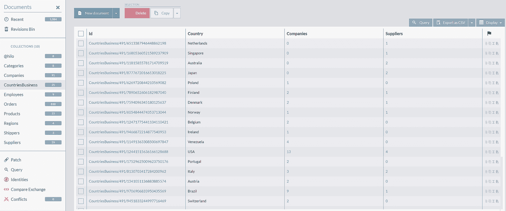
*文档 ID、公司、供应商和国家列表的快照。*
**图 6-14**
人工集合 CountriesBusiness 中的文档

这个集合被称为 `人工集合`，属于此集合的文档是 `人工文档`。打开其中一份文档将揭示如列表 6-11 所示的结构。
```json
{
"Country": "Finland",
"Companies": 2,
"Suppliers": 1,
"@metadata": {
"@collection": "CountriesBusiness",
"@flags": "Artificial, FromIndex"
}
}
```
**列表 6-11**
一份人工文档的结构

人工文档可以从包含索引条目的 MapReduce 或 MultiMapReduce 索引创建。如果你将图 6-12 中的原始索引条目与生成的人工集合内容进行比较，你会看到人工集合代表了索引的一个转储。人工文档将包含所有索引字段作为其属性，其元数据属性将有一个 `flag` 标记，标明它是 `Artificial, FromIndex`（人工，来自索引）。

每次创建新订单或更新/删除现有订单时，所有索引订单的索引都会被更新。`Countries/Business` 索引也会发生同样的情况，其聚合条目将被增量更新以考虑最新的更改。此外，由于 `Countries/Business` 定义了输出集合，这个人工集合也将被更新。

除了由 RavenDB 自动创建外，人工文档是完全正常的文档。因此，你可以运行如下查询：
```sql
from 'CountriesBusiness'
where Country = 'UK'
```
以获取来自英国的公司和供应商数量，以及：
```sql
from 'CountriesBusiness'
where Companies > 1 and Suppliers > 1
select Country
```
以获取至少有一个公司和供应商的国家列表。

### 索引人工文档

执行上一节中的两个查询后，你会发现 RavenDB 创建了自动索引 `Auto/CountriesBusiness/ByCompaniesAndCountryAndSuppliers`，这是数据库的预期行为。

人工文档是完全常规的文档，因此也可以编写 Map 甚至 MapReduce 索引，以便在需要时处理和聚合它们。因此，为了回答我们最初关于寻找供应商和公司最多的国家的问题，我们可以首先定义映射索引 `CountriesBusiness/Totals`，如列表 6-12 所示。
```javascript
map("CountriesBusiness", entry => {
return {
Country: entry.Country,
Total: entry.Companies + entry.Suppliers
}
})
```
**列表 6-12**
CountriesBusiness/Totals 索引

现在，你终于可以执行一个查询，该查询将生成一个国家列表，并按业务活动数量降序排列：
```sql
from index 'CountriesBusiness/Totals'
order by Total as long desc
select Country
```
很容易看出，你下一个出差目的地应该是美国、德国和法国。


## 概要

本章介绍了 MapReduce 和 MultiMapReduce 索引，用于对数据进行分组和聚合。我们介绍了编写这些索引的静态版本的技术，以及将它们的内容具体化为人工文档的方法。下一章将展示如何使用 RavenDB 对数据进行全文搜索。

