# 7. 全文搜索

我们在第 3 章已经提到过 RavenDB 的全文搜索功能，本章将对该章引入的概念进行扩展。我们将展示基本的搜索功能，包括运算符、通配符和排名。您将了解 RavenDB 索引在内部如何处理文本以提供所有这些能力。最后，我们将演示如何通过静态索引对索引过程获得更多控制并应用高级技术。

## 全文搜索基础

观察现代应用程序中的标准功能，您会很快发现执行全文搜索的能力在此列表中排名很高。几乎每个应用程序都需要它。在数据量庞大的情况下，搜索能力变得至关重要；无法轻松检索的信息基本上是无用的。

在前面的章节中，我们看到了如何基于精确匹配执行过滤——您指定属性名和值，数据库将返回具有该属性值的一个或多个文档。

全文搜索的美妙之处在于部分匹配——您可以搜索作为文本一部分的特定术语。例如，您可以找到所有标题包含“London”的书籍，或者所有名称中包含“chocolate”的产品。您还可以指定前缀或后缀，并获取所有匹配的文档。可以传递多个术语，数据库将返回包含其中任何一个术语的文档的并集。

让我们看看使用 RavenDB 搜索文本的各种方式。

### 单一术语

如图 7-1 所示，示例数据库中产品的名称由一个或多个单词组成。

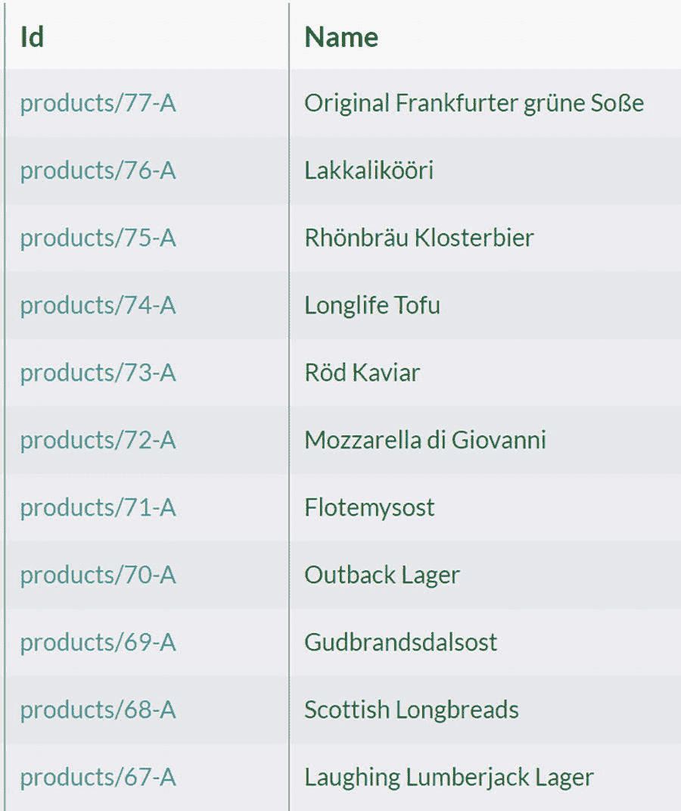

一个包含 11 个产品名称和标识的表格。产品 ID 分别为 77-A, 76-A, 75-A, 74-A, 73-A, 72-A, 71-A, 70-A, 69-A, 68-A 和 67-A。

图 7-1

产品名称

您可以搜索豆腐产品：

```rql
from "Products"
where search(Name, 'Tofu')
```

这个查询将返回名称为`*Tofu*`和`*Longlife Tofu*`的产品。您搜索的术语可以位于产品名称的开头、结尾或任何位置；RavenDB 可以轻松匹配任何位置。

请注意，以下查询将产生相同的结果。

```rql
from "Products"
where search(Name, 'tofu')
```

在默认设置下，RavenDB 中的全文搜索功能不区分大小写。

在执行搜索之前，RavenDB 会通过删除特殊字符和标点符号来规范化术语。因此，所有这些术语都将产生相同的结果：

*   "tofu"
*   " tofu "
*   "-tofu,"

### 多个术语

您可以搜索多个术语：

```rql
from "Products"
where search(Name, 'tofu vegie')
```

这个查询将产生如图 7-2 所示的结果。

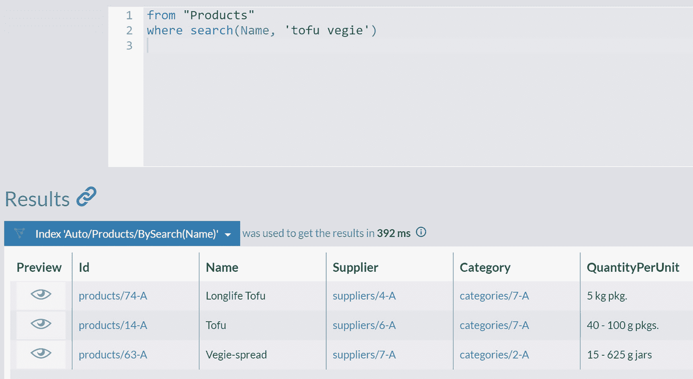

一个针对术语`tofu vegie`的结果表格。标记的索引列为预览、标识、名称、供应商、类别和每单位质量。

图 7-2

术语“tofu vegie”的搜索结果

这个查询将返回所有在名称中包含“tofu”或“vegie”的产品。您可以进一步扩展，添加更多术语：

```rql
from "Products"
where search(Name, 'tofu vegie chocolade')
```

从而，包括在`Name`属性中包含这些术语中任何一个的产品。

### 对复杂对象进行搜索

RavenDB 不仅可以对简单的文本字段进行搜索，还可以对复合字段进行搜索。员工地址的结构是 JSON，如清单 7-1 所示。

```json
"Address": {
"Line1": "4726 - 11th Ave. N.E.",
"Line2": null,
"City": "Seattle",
"Region": "WA",
"PostalCode": "98105",
"Country": "USA",
"Location": {
"Latitude": 47.66416419999999,
"Longitude": -122.3160148
}
}
```
清单 7-1
Employee 文档的 Address 属性的嵌套结构

您可以按员工的地址属性进行搜索，以获取所有居住在西雅图的员工：

```rql
from Employees where search(Address, "Seattle")
```

在这种情况下，RavenDB 通过扁平化并索引来自不同级别的所有属性，正确处理了复杂的嵌套结构。

也支持对集合进行搜索。示例数据库中的订单包含订单行集合。您可以使用以下查询搜索所有包含油炸产品的订单：

```rql
from Orders
where search(Lines.ProductName, "Fried")
```

### 通配符

全文搜索的部分匹配提供了一种指定单词以在文本中搜索的方法。通配符可以增强部分搜索的能力——当搜索词的开头或结尾未知时，您可以替换一个或多个字母。

因此，与其搜索所有名为`*Anne*`的员工

```rql
from "Employees"
where search(FirstName, 'Anne')
```

您可以使用通配符仅指定搜索词的一部分。以下查询将搜索任何以`*An*`为前缀的名字。

```rql
from "Employees"
where search(FirstName, 'An*')
```

执行此查询将返回`*Andrew*`和`*Anne*`。

同样，您可以执行后缀搜索：

```rql
from "Employees"
where search(LastName, '*an')
```

此查询将从我们的示例数据集中返回 Steven Buchanan 和 Laura Callahan。

最后，结合前两种方法，我们可以执行中缀搜索：

```rql
from "Employees"
where search(FirstName, '*an*')
```

这种中缀全文搜索将返回`*Anne*`、`*Nancy*`、`*Andrew*`和`*Janet*`。

使用通配符时，另一个需要考虑的关键因素是性能。使用前导通配符会显著降低搜索速度。当然，在小型数据集（如我们当前使用的示例数据集）上，这种减速可能并不明显。但是，随着数据库中文档数量的增加，它可能成为一个因素。因此，您应牢记这一点，并评估每个后缀全文搜索场景的理由及其潜在的负面影响。

如果您确定应用程序需要此类搜索，有几种替代方法：

*   创建一个静态索引，其中对文本进行反向索引，从而将前导通配符搜索（按后缀搜索）转换为尾随通配符搜索（按前缀搜索）。
*   创建一个使用非默认分析器的静态索引。

本章稍后将介绍第二种技术。

### 建议

有时，搜索不会返回任何结果。例如，没有产品名称包含单词“chaig”，这可以通过执行以下查询来验证：

```rql
from Products
where search('Name', 'chaig')
```

在这种情况下，RavenDB 提供了`*suggest*`功能。您可以通过调用`suggest()`函数来使用它，如清单 7-2 所示。

```rql
from Products
select suggest('Name', 'chaig')
```
清单 7-2
选择建议

执行此查询将返回如图 7-3 所示的建议。

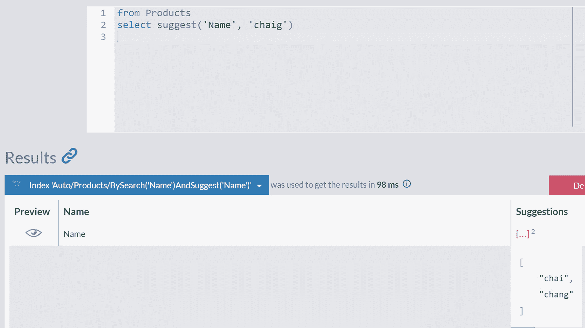

一个算法图示了针对术语'chai'和'chang'的搜索结果和建议。标记的索引列为预览和名称。

图 7-3

针对单词“chaig”的建议

建议功能将根据计算出的距离算法值，找到与传递的术语相似的单词。如果您想实现类似 Google 的“您是不是要找？”建议，这非常方便。


### 操作符

我们已经展示了你可以为全文搜索使用多个术语，并且你会获得满足其中任何一个条件的所有文档。本质上，RavenDB 会隐式地应用 `or` 逻辑操作符。这意味着查询

```
from Employees where search(Address, "Seattle London")
```

等价于

```
from Employees where search(Address, "Seattle London", or)
```

并将返回所有居住在西雅图或伦敦的员工。

应用 `and` 操作符

```
from Employees where search(Address, "Seattle London", and)
```

将不返回任何结果，因为没有地址中同时包含这两个城市的员工。

你可以进一步组合这些操作符：

```
from 'Employees'
where search(Notes, "Spanish Portuguese", and)
or search(Notes, "Manager")
```

此查询将返回要么是经理，要么同时会说西班牙语和葡萄牙语的员工。

## 内部发生了什么？

查看上一节展示的多种执行部分搜索的方法，可能会让你认为背后发生了许多复杂的事情。尽管全文搜索并非一个简单的机制，但大多数内部实现概念相对简单。正如我们在过滤、排序和聚合中已经看到的——一切都归结为使用合适的数据结构。其次，为了避免在查询时进行计算（这总是危险的，因为查询执行时间取决于数据集的大小），RavenDB 会提前准备索引条目。因此，全文搜索既高效又快速。一定量的工作是不可避免的，但最多只做一次，提前完成并存储结果以供重用，是实现高性能查询的关键。

### 文本分析

在索引期间，RavenDB 将使用分析器（analyzer）将文本分割成片段。这些片段被称为 `令牌`，它们将构成索引术语（index terms）。之后，当你执行全文搜索时，你的搜索术语会与索引中包含的 `令牌` 进行匹配。因此，这种方法会将搜索术语对文本的部分匹配，转化为对文本分析过程中产生的 `令牌` 集合的精确匹配。当然，这句话简化了整个过程，但从概念上很好地描述了匹配机制。

分析器主要执行文本的 `令牌化`。令牌化将文本分解为词法单元，也称为 `令牌`。`令牌` 是最小的可搜索单位，令牌化过程将输入文本转换为令牌流。

此外，由分词器（tokenizer）产生的 `令牌` 会通过一个或多个 `过滤器`。过滤器将检查令牌流，并可能保持 `令牌` 不变、修改它们、丢弃它们，甚至创建新的。修改可能包括将字符规范化为全小写或不带变音符号的版本。标点符号和停用词（stop words）如 `the` 和 `is` 通常会被移除，其他可能影响搜索质量的无用 `令牌` 也是如此。

分词器和过滤器通常组合成一个管道（pipeline，有时也称为 chain），其中一个的输出是另一个的输入。分析器（analyzer）就是一个分词器和过滤器序列的术语，它以文本作为输入并产生一组 `令牌`。

### 标准分析器

RavenDB 附带了多个分析器，其中 `标准分析器` 是默认的。标准分析器由 `标准分词器` 和两个过滤器组成——`小写令牌过滤器` 和 `停用词过滤器`。

`标准分词器` 会通过将空格、换行、标点和其他特殊字符视为 `令牌` 边界来对文本进行分段。这样生成的令牌流会通过 `小写令牌过滤器`，将其规范化为全小写字母。最后，`停用词过滤器` 将从令牌流中移除英文 `停用词`。例如 `a`、`the` 和 `is`——这些是所谓的 `功能词`，在全文搜索的上下文中是模糊的或几乎没有词汇意义。

例如，以下句子

```
A quick Fox jumps over the lazy Dog!
```

通过标准分析器后将被转换为令牌流：

```
[quick], [fox], [jumps], [over], [lazy], [dog]
```

这个过程会移除感叹号和常见单词如 `a` 和 `the`。此外，所有 `令牌` 都被转换为小写。

正如我们在前几章所见，运行各种查询会触发 RavenDB 创建相应的索引以高效地服务于这些查询。同样，当你运行全文搜索查询时，RavenDB 会创建一个自动的全文搜索索引。标准分析器将应用于一个或多个被搜索的字段。它们的内容将被令牌化，并生成一组索引条目。

一个有趣的事实是，分析器不仅在索引期间应用于输入文本，也会应用于搜索术语。因此，在执行查询

```
from "Employees"
where search(FirstName, 'Andrew Anne')
```

时，RavenDB 会将标准分析器应用于字符串 `"Andrew Anne"`，将其转换为令牌流 `[andrew], [anne]`，然后才执行这些 `令牌` 与索引术语的实际匹配。这条规则有一个例外——如果搜索术语包含通配符（wildcard），它将被保留。分析器不会应用于包含通配符的搜索术语。

除了标准分析器，RavenDB 还附带了其他分析器：

*   关键词分析器
*   小写空白分析器
*   N 元语法分析器
*   简单分析器
*   停用词分析器
*   空白分析器

你可以使用其中一些来为你的全文搜索索引填充不同形态的 `令牌`。我们将在本章后面介绍一个这样的案例。

最后，RavenDB 支持自定义分析器。根据具体情况，你可能对令牌化和过滤有特定需求。在这种情况下，你可以编写自己的自定义分析器并提供给 RavenDB。一个典型的例子是分析不同语言的内容。你可能已经猜到，`停用词` 的集合是依赖于语言的。例如，英文单词 `car` 在法语中是 `停用词` 之一。自定义分析器超出了本书的范围，但了解 RavenDB 高度可定制的特性是很好的。


## 排名

为了让全文搜索结果对用户有帮助，并让应用程序的用户满意，最相关的结果应排在最前面，其次是相关性较低的结果。RavenDB 是如何确定相关性的呢？

让我们看一些例子。

运行查询

```ravendb
from Employees where search(Address, "Seattle Redmond")
select Address.City
```

你会看到，来自西雅图的两名员工排在最前面，然后是一名来自雷德蒙德的员工。如果我们改变城市顺序为：

```ravendb
from Employees where search(Address, "Redmond Seattle")
select Address.City
```

你会注意到结果与前一个查询相比排序相反，遵循了搜索词的顺序——首先是来自雷德蒙德的员工，然后是来自西雅图的两名员工。

如你所见，这种排序并非随机。RavenDB 根据相关性对搜索结果进行排序，因此用户更有可能在列表顶部看到更相关的结果。当搜索“Redmond Seattle”时，RavenDB 会认为第一个搜索词比第二个更重要，因此来自雷德蒙德的员工会排在来自西雅图的员工之前。你可以像在代码清单 7-3 中那样，引入额外的搜索词。

```ravendb
from Employees where search(Address, "London Seattle Redmond")
select Address.City
```
代码清单 7-3
搜索多个词

此查询将把伦敦的员工排在最前，然后是西雅图的员工，最后任何雷德蒙德的员工将位于列表底部。

对于每一个全文搜索匹配项，RavenDB 都会计算索引评分，并用它来确定结果的排名。该评分包含在每个搜索结果 `@metadata` 中的 `@index-score` 属性里。你可以通过预览代码清单 7-3 中查询的任意结果来检查它，如图 7-4 所示。`@index-score` 是 `@metadata` 的最后一个属性。

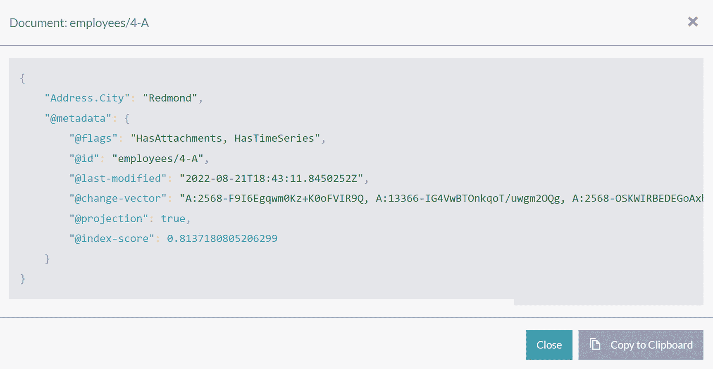

用于计算文档 employee/4-A 的索引评分的算法。标记的查询包括 address city、metadata、flags、identification、last-modified、change-vector、projection 和 index-score。

图 7-4
位于元数据内的索引评分

`@index-score` 值越大，结果的相关性就越强。索引评分通过 `score()` 函数暴露出来。因此，代码清单 7-3 中的查询在功能上等同于以下查询：

```ravendb
from Employees where search(Address, "London Seattle Redmond")
order by score() desc
select Address.City
```

如果需要，你可以使用 `score()` 函数来反转排名，先显示最不相关的结果：

```ravendb
from Employees where search(Address, "London Seattle Redmond")
order by score() asc
select Address.City
```

RavenDB 还可以向你详细解释它是如何计算评分的。在查询中包含 `explanations()` 函数，如下所示：

```ravendb
from Employees where search(Address, "Redmond Seattle")
select Address.City
include explanations()
```

这次，查询结果会伴随着排名评分显示在一个额外的选项卡中，如图 7-5 所示。

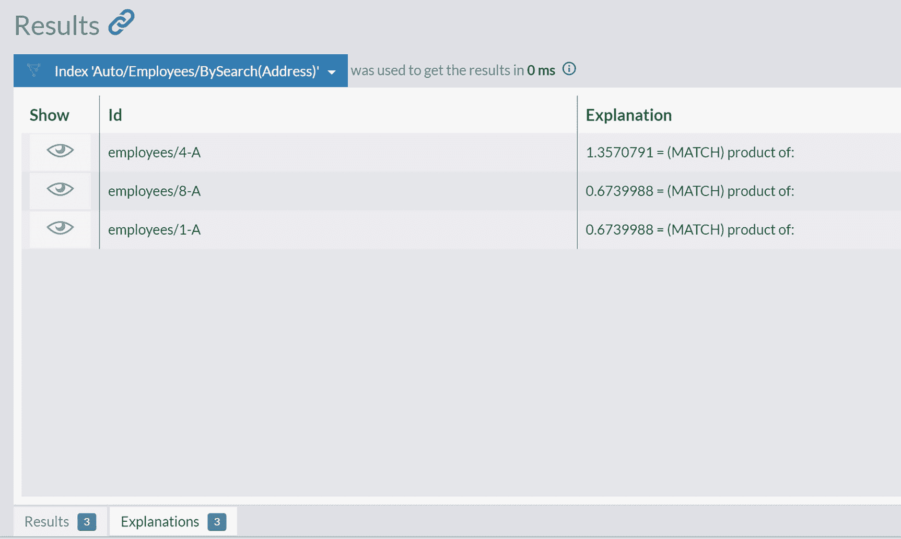

用于计算员工排名评分的算法。标记的索引包括 show、identification 和 explanation。ID 分别为 employees/4-A、employees/8-A 和 employees/1-A。

图 7-5
包含排名评分的“解释”列

点击 *Show* 图标将为你提供索引评分如何计算的详细解释，如图 7-6 所示。

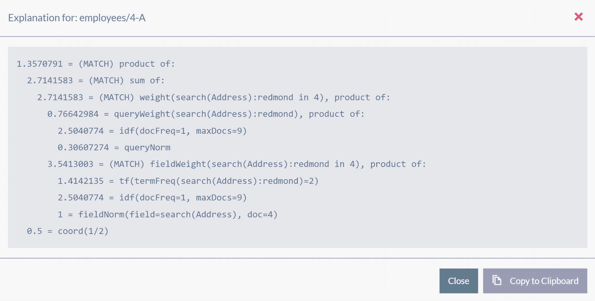

一个描绘了 employees/4-A 索引评分详细解释的算法图。

图 7-6
索引评分的详细解释

这种分解有助于你确定特定结果排序方式的原因。


## 权重提升

并非所有搜索词都生而平等。有时，你希望赋予特定搜索词比其他词更高的权重。**权重提升**是一个改变权重因子的过程，使你能够使某些搜索词相比其他词更具相关性。正如我们在前一节看到的，RavenDB 会为每个词分配一个权重因子，并用它来计算每个匹配文档的索引分数。

每个搜索词也可以关联一个**提升因子**。提升因子越高，搜索词的相关性就越强。此功能可以提高结果的准确性，对文档进行排序，使更相关的文档位于结果列表的顶部。

例如，你可能搜索巴黎、伦敦或西雅图的公司，但优先考虑巴黎，然后是伦敦，最后是西雅图。要编写这样的查询，你可以利用`boost()`函数，它接受提升因子作为第二个参数，如代码清单 7-4 所示。

```
from Companies
where
boost(search(Address.City, 'paris'), 15) or
boost(search(Address.City, 'london'), 10) or
boost(search(Address.City, 'seattle'), 5)
select Address.City
Listing 7-4
应用了 boost() 函数的全文搜索查询
```

执行代码清单 7-4 中的查询后，RavenDB 将返回来自这三个城市的公司，排序如图 7-7 所示。

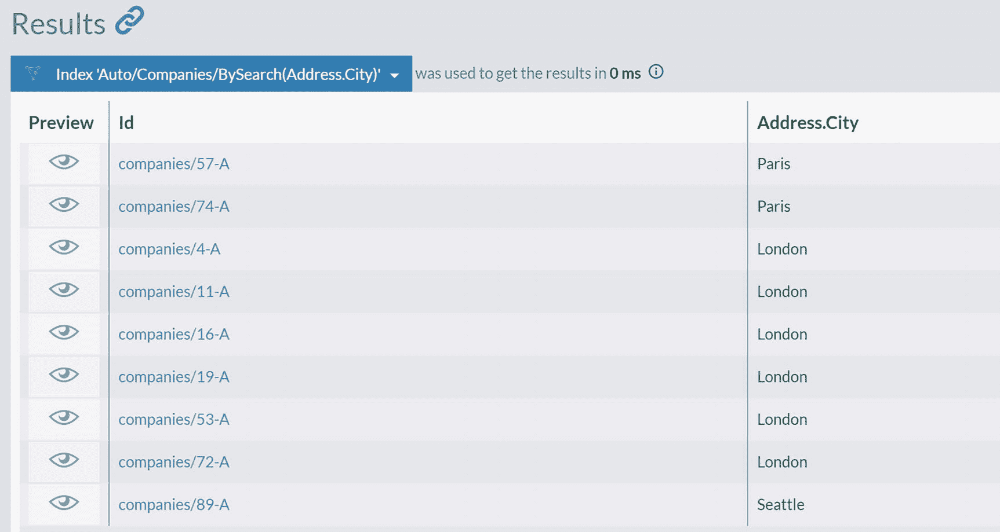

一个包含 9 家公司的结果表格。标签列是预览、标识和地址/城市。这些公司和地址是：57-A、74-A 为巴黎；4-A、11-A、16-A、19-A、53-A、72-A 为伦敦；89-A 为西雅图。

图 7-7

使用`boost()`函数修改的结果排序

你可以扩展代码清单 7-4 中的查询，加入解释说明，如代码清单 7-5 所示。

```
from Companies
where
boost(search(Address.City, 'paris'), 15) or
boost(search(Address.City, 'london'), 10) or
boost(search(Address.City, 'seattle'), 5)
select Address.City
include explanations()
Listing 7-5
包含解释说明的提升查询
```

通过这样一个扩展查询，你将能够看到分数概览，如图 7-8 所示。

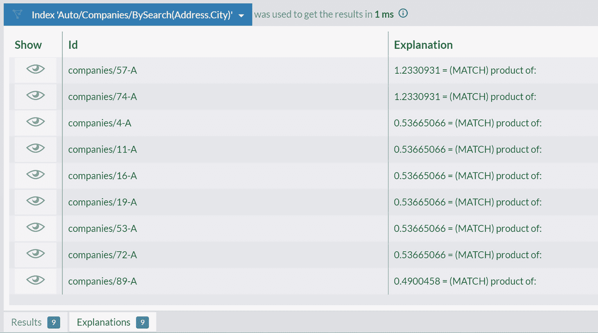

一个展示了 9 家公司计算分数的解释选项卡的图示。标签列显示索引、标识和解释。

图 7-8

带有计算分数的解释选项卡

你可以点击“显示”图标，进一步查看这些分数是如何计算出来的。

利用提升的另一种可能性是使特定字段更具相关性。例如，我们可能需要定位所有具有管理能力的员工。一个很好的搜索候选是 `Title` 和 `Notes` 字段。然而，这两个字段有本质的不同——`Title` 包含当前在公司的职位，而 `Notes` 包含员工的描述，可能提及各种技能和之前的工作。当前担任管理职位的员工比过去有行政职能的员工更相关。

因此，我们可以在代码清单 7-6 的查询中表达这一点。

```
from "Employees"
where boost(search(Title, 'manager'), 2)
or search(Notes, 'manager')
Listing 7-6
Title 字段相对于 Notes 字段的提升
```

执行结果如图 7-9 所示。

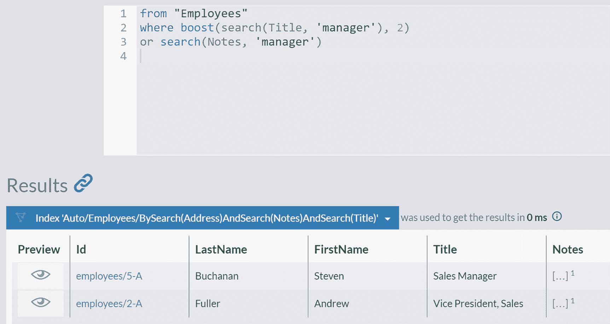

一个展示了员工查询执行结果的图示。标签列是预览、标识、姓氏、名字、职称和备注。

图 7-9

提升 Title 字段 over Notes 字段的结果

如你所见，Steven 的排名高于 Andrew，因为他的 `Title` 字段中有 Manager 这个词。使用这种方法，你可以微调排名并提供更好的准确性。

## 静态索引：单字段

通过从自动索引切换到静态索引，我们可以更深入地控制索引过程。你已经在第 5 章和第 6 章学习了如何创建静态索引。代码清单 7-7 展示了一个用于搜索产品名称的简单索引。

```
map("Products", function(product) {
return {
Name: product.Name
}
})
Listing 7-7
Products/ByName 索引
```

在保存此新索引的定义之前，你还需要执行一个步骤——指定 `Name` 不是一个普通字段，而是一个全文搜索字段。你需要将索引字段 `Name` 标记为将被视为全文搜索字段的字段。

点击 `Add field` 按钮。字段定义面板将打开。在名称栏填写 `Name`，并将 `Full-Text Search` 属性切换到 `Yes`。如你在图 7-10 中所见，在高级选项中，有一个 Analyzer 属性，其中包含 `Standard Analyzer` 作为全文搜索字段的默认分析器。

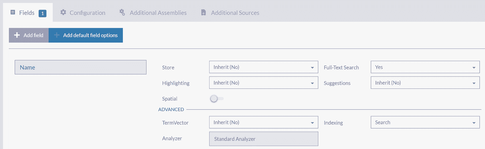

一个字段选项表格。标签列是名称、存储、高亮显示、空间、高级、词向量、分析器、全文搜索、建议和索引。

图 7-10

字段选项

保存此新索引的定义后，RavenDB 将处理 `Products` 集合中的所有文档，提取其 `Name` 属性的值，并应用 `Standard Analyzer` 对产品名称进行分词。你可以在图 7-11 中看到索引项。

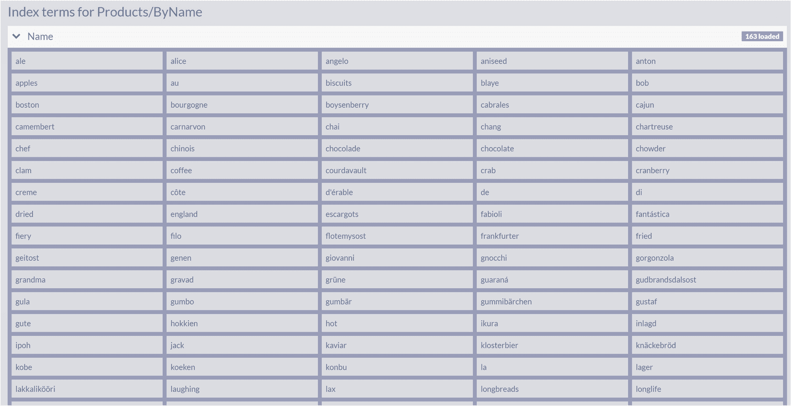

一个展示了产品和名称的标准分析器索引项的表格。该索引处理了 16 个产品。

图 7-11

标准分析器索引项

查看产品的原始索引条目，你可以观察到标准分析器为每个产品生成的标记数组，如图 7-12 所示。

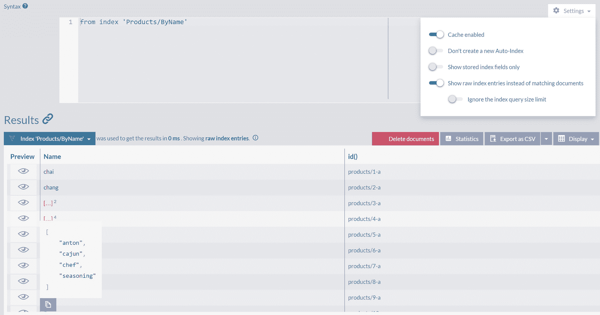

一个展示了原始索引条目的图示。标签列是缓存已启用、不创建新的自动索引、仅显示已存储的索引字段、显示原始索引条目而非匹配文档，以及忽略索引查询大小限制。

图 7-12

原始索引条目

我们现在可以搜索所有拉格啤酒：

```
from index 'Products/ByName'
where search(Name, "lager")
```

所有以 `cha` 开头的产品名称

```
from index 'Products/ByName'
where search(Name, "cha*")
```

或名称中任何单词以 `ra` 结尾的产品

```
from index 'Products/ByName'
where search(Name, "*ra")
```


## 静态索引：不同的分析器

在之前的一个章节中，我们提到过使用通配符前缀可能对性能产生显著影响。静态索引为我们提供了完全的灵活性，因此我们可以配置索引过程来克服此类挑战。

一种可能的解决方案是改变索引项的计算方式。我们可以更改分词方式 — 不使用 `标准分析器`，而是使用 `NGram 分析器`。

但是 `NGram` 这个词是什么意思呢？`NGram` 是一个滑动窗口，它在文本上移动并生成指定长度的分词。例如，单词 "brown" 可以被拆分为以下 3-gram：`[bro], [row], [own]`。类似地，对 "jumps" 应用 2-grams 分词会得到分词流 `[ju], [um], [mp], [ps]`。

RavenDB 中可用的 `NGram` 分词器将滑动大小为 2、3、4、5 和 6 的窗口以生成各种大小的分词。与此分词器一起，`NGram 分析器` 将使用 `停用词` 和 `小写化` 过滤器。

例如，对于句子：

*The quick brown fox jumped over the lazy dogs.*

`NGram 分析器` 将生成以下 3-grams：

```
[azy] [bro] [dog] [fox] [ick] [jum] [laz] [mpe] [ogs] [ove] [own] [ped] [qui] [row] [uic] [ump] [ver]
```

`停用词` 过滤器将消除两个 "the" 实例和句号。

你现在可以打开在上一节中定义的索引 `Products/ByName` 并更改此索引的分析器。向下滚动到字段部分，找到 `Name` 字段的设置。点击 `标准分析器`，你将看到一个预定义的分析器列表，如图 7-13 所示。

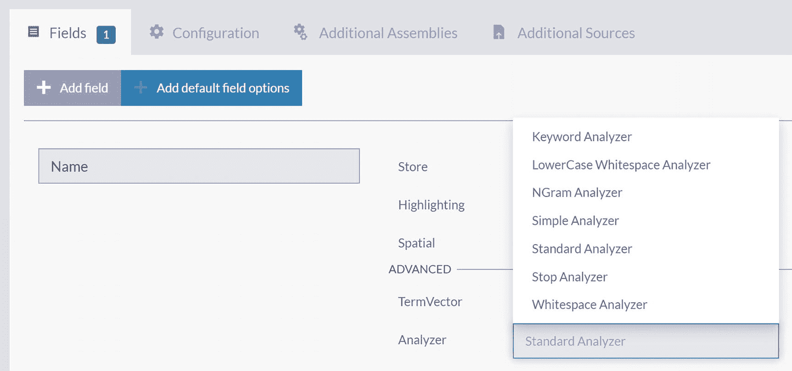

一张示意图，展示了更改索引分析器的操作。标注的分析器有：关键字、小写空白、N-gram、简单、标准、停用词和空白分析器。

**图 7-13：更改索引分析器**

选择 `NGram 分析器` 后，保存重新定义的索引。

由于你更改了索引的定义，RavenDB 将通过读取 `Products` 集合中的所有文档，将它们通过 `NGram 分析器` 处理，并填充索引项来从头构建它。图 7-14 显示了索引项现在的样子。

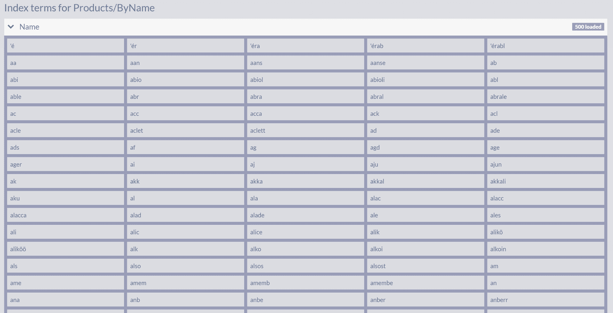

一个展示了产品及其名称的 N-gram 索引项的表格。共有 16 个已标注的项。

**图 7-14：NGram 索引项**

这些索引项与由 `标准分析器` 生成的分词不同。`NGram 分析器` 产生的索引项是产品名称上 2-grams、3-grams、4-grams、5-grams 和 6-grams 的并集。

最后，使用更新后的 `Products/ByName` 索引，我们可以将通配符查询：

```
from index 'Products/ByName'
where search(Name, '*late*')
```

替换为无通配符的变体

```
from index 'Products/ByName'
where search(Name, 'late')
```

这将返回相同的结果集，但不会带来任何性能损失。

## 静态索引：多字段

在前两节中，我们定义并配置了一个仅覆盖单个字段的索引。本节将展示如何将其扩展为处理来自一个或多个集合的文档的多个字段。

## 索引来自多个集合的属性

我们可以将 `Products/ByName` 扩展为一个索引，该索引不仅可以按名称搜索产品，还可以按名称搜索 `供应商` 和 `公司`。这样，我们将创建一个索引来覆盖来自三个集合的文档内容。

首先克隆 `Products/ByName` 索引 — 点击 `克隆` 按钮并将名称更改为 `Search/ByName`。

添加以下两个映射：

```
map("Companies", function(company) {
return {
Name: company.Name
}
})
```

和

```
map("Suppliers", function(supplier) {
return {
Name: supplier.Name
}
})
```

完成后，索引定义将如图 7-15 所示。

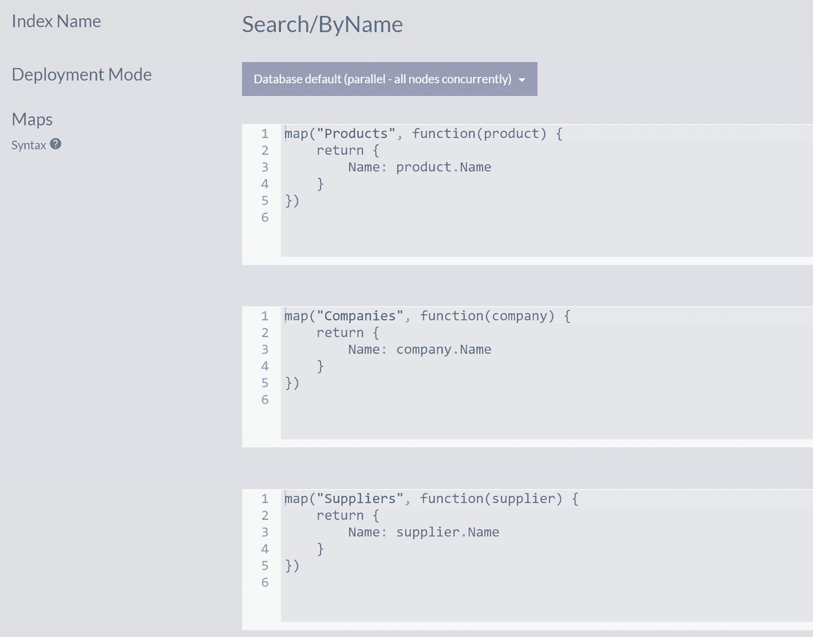

三个算法示意图描绘了产品、公司和供应商的索引定义。标注的字段有：索引名称、search/by name、部署模式和映射。

**图 7-15：Search/ByName 索引**

由于我们是从克隆现有索引 `Products/ByName` 开始的，因此你新创建的索引开箱即用地支持对 `Name` 字段的全文索引。

现在，你可以执行跨越三个集合内容的搜索查询。

搜索

```
from index 'Search/ByName'
where search(Name, "cho")
```

将返回在 `Name` 中包含 `cho` 三连音的产品和公司，如图 7-16 所示。

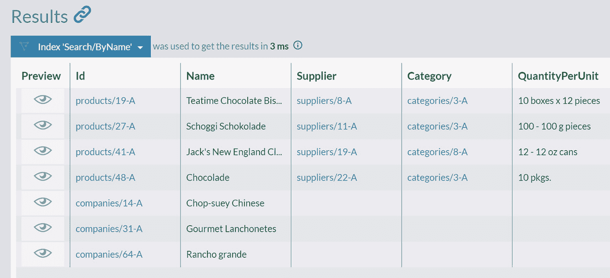

一个表格展示了由产品和公司组成的搜索结果。标注的列有：预览、标识、名称、供应商、类别和单位质量。

**图 7-16：由产品和公司组成的搜索结果**

类似地，以下查询

```
from index 'Search/ByName'
where search(Name, "ost")
```

将返回在 `Name` 字段中包含三连音 `ost` 的产品、公司和供应商。

## 索引来自单个集合的多个字段

提供一种索引（并随后搜索）来自同一集合的文档的多个属性可能非常方便。在编写静态索引时，你可以构造一个包含多个值的数组。RavenDB 将正确处理此类数组，为每个文档创建多个索引项。

清单 7-8 展示了这样一个索引的实现。别忘了将 `Query` 字段配置为全文搜索字段。

```
map("Employees", function(employee) {
return {
Query: [employee.FirstName, employee.LastName]
}
})
```

**清单 7-8：`Employees/ByFirstNameByLastName` 索引**

图 7-17 显示，名字和姓氏被提取出来并作为索引项插入。

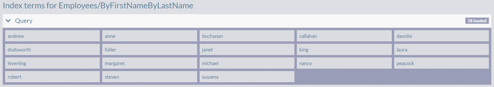

一个表格展示了员工的名字和姓氏被提取出来并作为索引项插入。

**图 7-17：由员工名字和姓氏组成的索引项**

有了这个索引，你现在可以按名字搜索：

```
from index 'Employees/ByFirstNameByLastName'
where search(Query, "Andrew")
```

或按姓氏搜索。

```
from index 'Employees/ByFirstNameByLastName'
where search(Query, "fuller")
```

### 从多个集合索引多个字段

上一节演示的方法可以进一步扩展。由于你可以在索引过程中加载被引用的文档，因此可以从不同集合收集信息，以提供 Omni 搜索功能。

这里我们可以使用数组将多个属性打包在一起，但我们将展示另一种方法：声明一个 JavaScript 数组并用代码填充它。清单 7-9 展示了`Orders/Search`索引的定义。请在你的数据库中创建它，并且不要忘记将`Query`字段标记为全文搜索字段。

```javascript
map("Orders", function(order) {
    var query = [];
    var company = load(order.Company, 'Companies');
    query.push(company.Name);
    var employee = load(order.Employee, 'Employees');
    query.push(employee.FirstName, employee.LastName);
    order.Lines.forEach (line => {
        var product = load(line.Product, 'Products');
        query.push(product.Name)
        var supplier = load(product.Supplier, 'Suppliers');
        query.push(supplier.Name);
    })
    return { Query: query }
})
```
清单 7-9. `Orders/Search` 索引

我们来分析这个索引。

第一行指定了要处理的集合——`Orders`。在索引定义的第二行，我们声明了一个空数组：
```javascript
var query = [];
```
它将由代码填充。在最后，我们的 JavaScript 代码将返回一个名为`Query`的字段，其内容正是这个数组：
```javascript
return { Query: query }
```
此外，对于每个被处理的订单，都会加载其引用的公司，并将其名称添加到`query`数组中——对于引用的员工也是如此，考虑到他们有名字和姓氏。最后，我们遍历订单行，获取其产品，并为每个产品加载供应商，将其名称添加到数组中。

因此，查看索引层级的嵌套结构，我们有以下结构：
*   订单
    *   公司
    *   员工
    *   订单行
        *   产品
        *   供应商

我们向下遍历了三层引用，加载被引用的文档并索引它们的属性。索引项将包括公司、员工、产品和供应商的名称。有了这个索引，你就可以根据各种条件搜索订单。

例如，你可以搜索由 Nancy 创建的所有订单：
```sql
from index 'Orders/Search'
where search(Query, "nancy")
```
所有包含*tofu*的订单可以通过执行以下查询获取：
```sql
from index 'Orders/Search'
where search(Query, "tofu")
```
要查看与供应商*Lyngbysild*相关的所有订单：
```sql
from index 'Orders/Search'
where search(Query, "Lyngbysild")
```
因此，你现在拥有一个单一索引，可以服务于各种条件的查询。

## 总结

在本章中，我们介绍了 RavenDB 的全文搜索功能。除了介绍基本要素外，我们还解释了全文搜索索引的内部工作原理。最后，你了解了高级索引选项，以及如何通过手动编写的静态索引来更精细地控制索引过程。

索引
A 抽象 管理 高级查询 聚合 声明函数 包括 使用对象字面量投影 关系
聚合 定义 反规范化 分布式系统 事务边界 变更单元 一致性单元
聚合
敏捷宣言
人工文档 创建索引
B 大数据
书店 boost()函数 提升
C 大小写
云计算
聚簇索引
集合
复杂聚合 计算
存储成本
覆盖索引
跨集合查询
D 数据库管理系统
数据库 数据库管理系统 过滤 NoSQL 分页 关系数据库管理系统 关系模型 无界查询
数据封装
数据完整性机制
数据模型
分布式系统
面向文档的模型
文档关系 多对多关系 一对多关系 最佳实践 检查 并发问题 异常 订单 ID 公司指向 指向公司的订单 原则 关系数据库 较小的一侧引用 弱点 一对一关系
文档 按钮 内容创建 空数据库 JSON @metadata 属性 订单文档 填充 前缀 显示原始输出图标
文档存储
领域驱动设计
动态字段
E 经济学
Employee.Address.City 索引
实体 解释()函数
F 扇出索引
FirstName 属性
forEach 循环
全文搜索 提升 复杂对象 多个术语 操作符 排名 单个术语 标准分析器 建议 文本分析 通配符
功能词
G 泛化
getFullname()函数
图 图数据库
数据分组
H 层次数据
人力资源管理系统
I 标识符
阻抗失衡
索引 *Address.City* 定义 细节 缺点 执行查询 RavenDB 设计 结构 术语 类型
不等式查询
初始索引
集成数据存储
J JavaScript 对象表示法
K 键值索引
键值存储
L LastName 属性
逻辑运算符
M MapReduce 索引
成熟度
心理过程
建模文档关系 NoSQL 数据库 JSON 文档 关系数据库 规则 RavenDB 关系数据库
模型
多地图索引
多地图归约索引
多模型数据库
N NGram 分析器
NGram 分词器
非聚簇索引
规范化 定义 反规范化过程 外键 范式 投影 连锁效应 存储 时间快照
Northwind 数据库
Northwind 贸易商 NoSQL 优势 挑战 特征 数据库类型 文档存储 图数据库 键值存储 宽列存储 结果 UNIX ASCII 文件
O 对象关系映射器
一对一关系 数据库引擎 嵌入式 思维练习 订单，收货地址 引用 应用内嵌入 员工与简历文档 员工文档 员工实体 人力资源管理系统 实现 建模 模型 简历场景 参照完整性 中心数据库 JSON 格式 建模方法论 关系数据库 子域 随机值，简历引用 唯一标识符 值对象
P, Q 分页
多持久化
多语言编程
主索引
R 范围查询
RavenDB 优势 自动调优 完全事务性 高可用性 性能 默认安全 拓扑 命令，运行 创建 默认选项/Next docker 许可协议 新建数据库创建对话框 信息 列表 文档列表 游乐场 服务器 工作室 重启服务器按钮 示例数据 设置向导 软件开发人员 不安全模式 版本 窗口
RavenDB 查询语言 大小写 复杂属性 跨集合查询 过滤 全文搜索 不等式 逻辑运算符 不存在属性 非字符串属性 分页 范围查询 排序
RavenDB 工作室 查询列表 查询面板
关系数据库管理系统
关系数据库
关系数据模型 实体 限制 订单文档 普通行文档 行 表
S 横向扩展
Score()函数
次要索引
软件开发人员
排序
标准分析器
标准分词器
StartsWith()函数
静态索引 分析 计算字段 不同分析器 动态字段 扩展 地图 扇出 层次数据 地图 多地图 多个字段 多个集合 属性 单个集合 单个字段 引用 存储字段 存储字段
静态 Map 索引
静态 *vs.* 自动索引 聚合 复杂性 初始索引
存储报告
结构化查询语言
T 时间快照模型
分词器
U, V 无界查询
W, X, Y, Z Web 应用程序
建模良好的文档 一致性因素 独立性 隔离 JSON 模型 订单行属性 时间快照模型
宽列存储
通配符