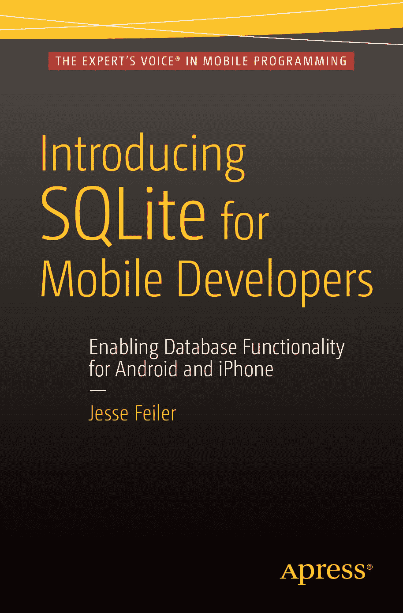

# 面向移动开发者的 SQLite 入门指南

杰西·费勒

**专业人士为专业人士打造的图书®**

**移动编程领域的专家之声®**

**面向移动开发者的 SQLite 入门指南**

*《面向移动开发者的 SQLite 入门指南》*是一本面向 `iOS` 和 `Android` 开发者的 `SQLite` 基础入门指南。本书包含 `SQL` 的简单介绍、关于何时使用 `SQLite` 的讨论，以及专门介绍如何将 `SQLite` 与最常用的编程语言（`Java`、`PHP`、`Swift` 和 `Objective-C`）结合使用的章节。接着，本书介绍了如何为 `Android` 或 `iOS` 应用程序添加简单的数据库功能，最后一章讨论了如何管理应用程序的生命周期。

**你将学到：**

- `SQLite` 的基础知识
- 有效使用 `SQLite` 所需的 `SQL` 知识
- 如何将数据库功能集成到你的移动应用中
- 如何维护应用程序

**为 Android 和 iPhone 启用数据库功能**

杰西·费勒

**美国定价：24.99 美元**

ISBN 978-1-4842-1765-8

5 2 4 9 9

分类：数据库/SQL

读者水平：初级–中级

[www.apress.com](http://www.apress.com)

**面向移动开发者的 SQLite 入门指南**

杰西·费勒

**面向移动开发者的 SQLite 入门指南**

版权所有 © 2015 杰西·费勒

本作品受版权保护。无论涉及材料的全部或部分，出版方保留所有权利，特别是翻译、转载、插图 reuse、朗诵、广播、缩微胶片或其他任何物理方式的复制，以及信息存储和检索、电子改编、计算机软件，或目前已知或未来开发的任何类似或不同的方法。对此法律保留的例外情况是，为进行评论或学术分析而摘录的简短片段，或专门为在计算机系统上输入和执行而提供的材料，仅供作品购买者专用。仅允许根据出版方所在地现行《版权法》的规定复制本出版物或其部分内容，且必须始终获得施普林格的许可。使用许可可通过版权许可中心的 RightsLink 获取。侵权行为将根据相应的《版权法》追究责任。

ISBN-13 (平装): 978-1-4842-1765-8

ISBN-13 (电子): 978-1-4842-1766-5

本书可能出现商标名称、标识和图像。我们并非在每次出现商标名称、标识和图像时都使用商标符号，而仅在编辑意义上且为了商标所有者的利益而使用这些名称、标识和图像，并无侵犯商标的意图。

本书中使用商品名称、商标、服务标志和类似术语，即使未明确标识，也不应被视为表达意见，判断它们是否受专有权利约束。

尽管本书中的建议和信息在出版时被认为是真实和准确的，但作者、编辑或出版商均不承担因可能出现的任何错误或遗漏而产生的任何法律责任。出版商对本出版物所含材料不作任何明示或暗示的保证。

董事总经理：Welmoed Spahr
执行编辑：Jeffrey Pepper
技术审校：Aaron Crabtree 和 Cliff Wootton
编辑委员会：Steve Anglin, Pramila Balan, Louise Corrigan, Jonathan Gennick, Robert Hutchinson, Celestin Suresh John, Michelle Lowman, James Markham, Susan McDermott, Matthew Moodie, Jeffrey Pepper, Douglas Pundick, Ben Renow-Clarke, Gwenan Spearing
协调编辑：Mark Powers
文字编辑：Lori Jacobs
排版：SPi Global
索引：SPi Global
美工：SPi Global

通过 Springer Science+Business Media New York 面向全球图书贸易发行，地址：233 Spring Street, 6th Floor, New York, NY 10013。电话：1-800-SPRINGER，传真：(201) 348-4505，电子邮件：`orders-ny@springer-sbm.com`，或访问 `www.springer.com`。Apress Media, LLC 是一家位于加利福尼亚州的有限责任公司，其唯一成员（所有者）是 Springer Science + Business Media Finance Inc (SSBM Finance Inc)。SSBM Finance Inc. 是一家特拉华州公司。

有关翻译信息，请发送电子邮件至 `rights@apress.com`，或访问 `www.apress.com`。

Apress 和 friends of ED 的图书可批量购买用于学术、企业或促销用途。大多数图书也提供电子书版本和许可。更多信息，请参考我们的批量销售-电子书许可网页：`www.apress.com/bulk-sales`。

作者在文中引用的任何源代码或其他补充材料，读者可在 `www.apress.com/9781484217658` 获取。有关如何查找图书源代码的详细信息，请访问 `www.apress.com/source-code/`。读者也可以通过 SpringerLink 在各章节的补充材料部分访问源代码。

## 内容概览

关于作者
关于技术审校
致谢
引言

■ 第 1 章：快速掌握数据库与 SQLite
■ 第 2 章：理解 SQLite 是什么
■ 第 3 章：SQLite 基础：存储与检索数据
■ 第 4 章：使用关系模型和 SQLite
■ 第 5 章：使用 SQLite 特性——你能用 `SELECT` 语句做什么
■ 第 6 章：将 SQLite 与 `PHP` 结合使用
■ 第 7 章：将 SQLite 与 Android/`Java` 结合使用
■ 第 8 章：将 SQLite 与 Core Data (`iOS` 和 `OS X`) 结合使用
■ 第 9 章：将 SQLite/Core Data 与 `Swift` (`iOS` 和 `OS X`) 结合使用
■ 第 10 章：将 SQLite/Core Data 与 Objective-C (`iOS` 和 Mac) 结合使用
■ 第 11 章：将简易数据库用于 `PHP` 网站
■ 第 12 章：将简易数据库用于 Core Data/`iOS` 应用
索引

iii

## 目录

关于作者
关于技术审校
致谢
引言

