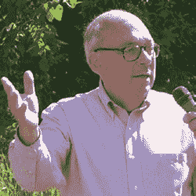
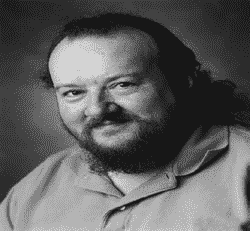

# 摘要

## ix

## 目录

### 第 12 章：在 Core Data/iOS 应用中使用简单数据库

故事继续……

调整数据模型和模板以适配 Core Data

移除键并修订数据模型

将 `timeStamp` 改为 `name`

在你的设备或模拟器上创建新数据库

在应用中添加分数表和界面

确保可以在主视图控制器中通过 + 添加新用户

使用详情视图

为分数功能使用详情视图

使用 `NSManagedObject` 子类

为 `DetailViewController` 使用表格视图控制器

修改 `DetailViewController` 的代码以用于 `DetailViewController`

修改 `MasterViewController` 以将用户传递给 `DetailViewController`

## 摘要

## 索引

## 关于作者

`Jesse Feiler` 是一名专注于数据库技术和基于位置的应用的开发者、顾问和作家。他曾在从大型机到 iPhone、iPad 和 Apple TV 的计算机上使用从 DB2（IBM）和 DMSII（Burroughs）到企业对象框架和 Core Data、MySQL、Oracle，当然还有 SQLite 的各种数据管理工具，处理数据库和数据管理工作。

在互联网早期，他使用一个在某些方面类似于 SQLite 的关系型数据库库，为 Mac 的 Prodigy 网络浏览器构建了页面缓存机制。

他是会议管理应用 Minutes Machine 的创建者，也是 Saranac River Trail 应用的创建者——这是一款包含基于位置的更新以及社交媒体工具的步道指南。他的应用可在 App Store 上获得，并由 Champlain Arts Corp (champlainarts.com) 发布。作为一名顾问，他曾与小企业和非营利组织合作，参与生产控制、出版、营销和项目管理等项目，通常涉及 FileMaker 和其他数据库。

他的著作包括：

*iOS Programming with Swift for Dummies* (Wiley, 2015)
*Swift for Dummies (Wiley, 2015)*
*iOS App Development for Dummies* (Wiley, 2014)
*iWork for Dummies* (Wiley, 2012)

视频包括：

*Mixed Language App Development with Objective-C and Swift* (O’Reilly, 2015)
*iOS Developer’s Guide to Views and View Controller* (O’Reilly, 2015)
*Learning Objective-C Programing* (O’Reilly, 2015)

他是 WAMC 公共广播电台东北部 The Roundtable 节目的常客，也是 Friends of Saranac River Trail 的创始人。他是华盛顿特区本地人，曾在纽约市居住，目前居住在纽约州普拉茨堡。

可以通过 northcountryconsulting.com（咨询）和 champlainarts.com（应用开发）联系他。

## 关于技术评审

`Aaron Crabtree` 接受过计算机工程、多媒体和图形设计方面的培训，在该行业工作了 15 年。经验告诉 Aaron，在大多数情况下，为了获得更大的灵活性和控制权，以编程方式创建应用程序的每个部分是必要的。在 Twitter 上给他发消息：@aaron_crabtree

`Cliff Wootton` 是 BBC News 的前交互式电视系统架构师。在那里开发的“News Loops”服务获得了 BAFTA 提名，并赢得了皇家电视学会技术创新奖。他作为特邀演讲者参加了 Apple WWDC 大会的视频压缩预处理主题演讲。曾教授研究生 MA 学生关于实际计算、多媒体、视频压缩、元数据以及研究基于开放标准的下一代交互式电视系统的部署。目前正在从事研发项目，探索新的交互式电视技术，参与 MPEG 标准工作组，撰写更多相关书籍，并在伦敦艺术大学讲授多媒体课程之余在会议上发表演讲。

## 致谢

我最喜欢数据库工作的地方就是把拼图的碎片拼凑起来——我的一个朋友过去称之为“从混乱中创造秩序”。当涉及到思考 SQLite 时，有很多碎片需要拼凑——从 20 世纪 60 年代关系型数据库的早期工作，到可以适当适配重型计算机以及小型电池供电移动电话和旨在探索远离家园相对安全的其他世界的自主卫星的轻量级代码库理念。

这本书的出版首先要归功于 D. Richard Hipp，他于 2000 年开始（并持续）了 SQLite 项目。众多贡献和测试代码的人不胜枚举，但你们知道自己是谁。

更贴近来说，Apress 的 Jeff Pepper 再次合作非常愉快，Mark Powers 也是如此。与 Waterside Productions 的 Carole Jelen 一起，他们共同使得提供这本 SQLite 基础入门书籍成为可能。

## 引言

我曾使用过多种类型、多种平台上的数据库。尽管几乎所有的数据库都基于关系模型。我也曾涉足过一些古老的数据库结构，如 IMS（一种层次型数据库），以及最近接触过非结构化数据，但在每种情况下，这都关乎一个基本原则：找到组织数据的最简单方式，使其有意义。（正如我常对客户说的，“数据不会说谎。”当你将数据以这种方式、那种方式以及各种方式排列时，我发现其内在结构会逐渐变得清晰——如果存在的话。如果没有内在结构，可能清晰呈现的是某种从未有人想到过的数据结构。而有时，数据固执地拒绝揭示我们能理解的结构。

这听起来可能非常自命不凡和深奥，但我确实认为，作为数据库设计师，我们的工作最终是寻找模式的工作。如果我们找不到逻辑上内在且必然的模式，最好的选择是为手头的任务找到最可用的最佳模式。

如果不了解组织数据的方式（事实上是很多），我们就无法生成这些数据模型，而如今，这归结于关系模型和 SQL 工具。这个过程是迭代性的（过早采用部分数据库模型的设计团队要遭殃了），它依赖于灵活的工具，以及想象力，并不断质疑项目中的每个人。

