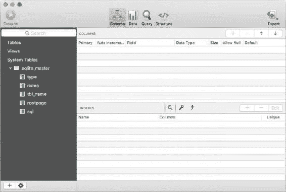
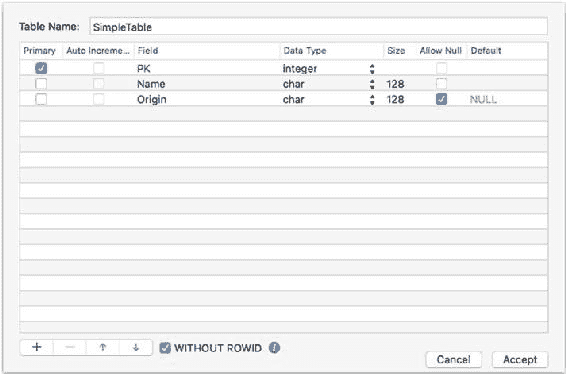
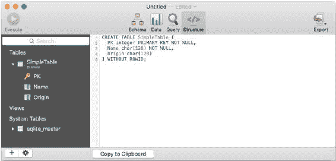
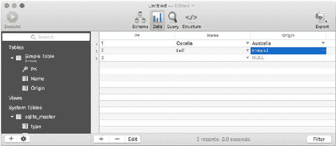
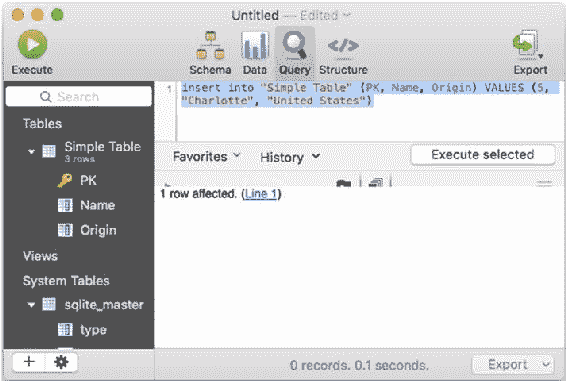

# 使用 SQLite 基础：存储与检索数据

如果你有多个 SQLite 数据库，那你就拥有多个文件。（可能存在一些相关文件——参见第 4 章的“预写式日志”。）在你的数据库窗口中，通常会看到数据库中项目的列表（如果存在的话）。你通常关心的主要项目包括：

-   包含数据的 `Tables`（表）。你可以使用 `query`（查询）来检索数据。

查询会返回表——它们可能没有行或列，因此是空的，但它们仍然是表。



-   `Views`（视图）是保存的查询，像所有查询一样，它们产生的结果是一个表。因此，视图不仅仅是一个保存的查询：它也可以被当作一个表（查询的结果）来使用。
-   `System tables`（系统表）是在每个数据库中自动为你创建的 SQLite 表。你可能认为你只是在创建一个新表，确实如此，但除此之外，你还在更新 `sqlite_master`，它跟踪数据库中的每个表。

如果还没有任何表——如果你刚刚创建了一个新数据库就是这种情况——你通常会看到一个如图 3-1 左侧所示的列表。这里包含了表（Tables）和视图（Views）的标题（目前都没有，因为这是一个新数据库）。在系统表（System Tables）标题下，你可以看到唯一的 `sqlite_master` 表，它存在于每个 SQLite 数据库中。

***图 3-1.** 探索 sqlite_master*

> **注意** 在 SQLite 中，大小写无关紧要，但本书文本遵循 SQL 语法使用大写字母、表和视图名称使用大写名称的惯例。这些仅仅是惯例。代码示例同时使用了大写和小写。

请记住，这些是选项和惯例，因此请使用你喜欢的风格。如果你参与多个项目，你可能会遇到各种不同的风格和惯例。有些人（包括我）习惯在墙上贴一张大纸，上面写明当前项目的惯例。

如果你打开 `sqlite_master`，你可以看到该表中的列，如图 3-1 左侧所示。具体如下：

-   `type` 对于表来说是 `TABLE`。（其他值将在遇到时讨论。）
-   `name` 是表名。
-   `tbl_name` 是一个简短的表名，但可能与 `name` 相同。
-   `rootpage` 用于标识在数据库中找到该表的位置。你通常不需要引用这个。
-   `sql` 是用于创建该项目的 SQL 代码。它将随着修改而更新，因此它是用于创建当前配置的项目的代码（而不是其原始配置时的代码）。

## 创建表

以下是使用图形化 SQLite 编辑器或命令行与 `sqlite3` 创建表的方法。

### 使用图形化 SQLite 编辑器

在图 3-1 所示的表列表底部（在其他编辑器中也类似），你会发现一个 `+` 号，它允许你向列表中添加另一个表。图 3-2 显示了点击 `+` 号后的结果。

***图 3-2.** 开始创建新表*



你会看到一个可以输入表名的表单。窗口中会放置一个单独的列。你通常做的第一件事是重命名表和第一列。

### 创建表列

你可以使用 `+` 来创建额外的列。在这种情况下，你知道表应该是什么样子（你已经在表 3-1 中看到过），因此在图 3-3 中设置列并不困难。

***图 3-3.** 向表中添加列*

数据类型和大小属性的细节应该不难设置，因为你有弹出菜单可以使用。SQLite Pro for SQLite 中数据类型的可能值包括：

-   `blob`
-   `char`
-   `double`
-   `float`
-   `integer`
-   `varchar`, `nvarchar`
-   `text`

这些与它们在大多数语言中的含义相同，但在 SQLite 中，类型相对不重要，因为 SQLite 不是强类型的。它实际上使用五种基本存储类。

-   `NULL`
-   `INTEGER`
-   `REAL`
-   `TEXT`
-   `BLOB`

这些存储类在 SQLite 的实现中很有用。正如 http://sqlite.org/datatype3.html 文档中指出的：

> 在 SQLite 版本 3 的数据库中，除了 `INTEGER PRIMARY KEY` 列之外，任何列都可以用来存储任何存储类的值。

这并不意味着你应该忽略类型定义。事实上，当 SQLite 被嵌入到一个框架、DBMS 或语言中时，很可能会强制执行更严格的类型检查。但是，是框架、DBMS 或语言强制执行了那种类型检查。

`NULL` 值在内部由一个特殊的代码表示，代表不存在——`NULL`。这远比使用一个实际值（通常是 0 或 -1）来表示缺失数据要好得多。一旦你为缺失数据提供了任何值，你就冒着意外地将该缺失数据值用作真实数据值的风险。（问问任何处理过千年问题（Year 2000 problem）的人，这样做的后果是什么。）当 `NULL` 不是可接受的值时，这意味着相关列必须有一个值或其他值。它不能完全为空。

在图 3-3 所示的表中，`PK` 和 `Name` 不能为 `NULL`，但 `Origin` 可以为空。

> **注意** 一个非空的文本字段必须有一个值，但给它一个空字符串的值是完全可以接受的——也就是说，一个由引号包围的零字符字符串，如 `""`。

当你完成指定表名及其列后，点击“接受”（Accept）或你的编辑器所称的按钮，表就创建好了。记住，在 `sqlite_master` 内部，每个表都有一个名为 `sql` 的字段。该字段包含生成表的代码（不是其数据）。你可以通过点击图 3-4 顶部的“结构”（Structure）按钮在 SQLPro for SQLite 中查看该代码。



***图 3-4.** 查看生成表的 SQL 代码*

### 使用 SQLite3

以下是 `sqlite3` 的语法。请注意，此语法同时创建表及其列。`ALTER TABLE` 命令允许你稍后回来修改表的列。

```
sqlite> CREATE TABLE "SimpleTable" (
   ...> PK integer PRIMARY KEY NOT NULL,
   ...> Name char(128) NOT NULL,
   ...> Origin char(128)
   ...> )WITHOUT ROWID;
```

## 将数据插入表中

与上一节一样，你将看到如何通过图形用户界面（GUI）和命令行来完成此操作。

### 使用图形用户界面

在 SQLPro for SQLite 中，图 3-5 所示窗口顶部的“数据”（Data）按钮允许你向列中添加更多行。你可以输入你想要的数据。图 3-5 显示创建了三个新行，但输入的唯一数据位于第一行。你会注意到 `PK` 主键是自动填充的，即使在第三行也是如此：SQLite 已经处理了这一点，因为它是主键。




***图 3-5.** 图形化输入数据*

如果你想通过查询输入数据（以下是从命令行界面执行此操作的方法），你可以使用如图 3-6 所示的“查询”（Query）按钮来输入。

***图 3-6.** 使用查询输入数据*


