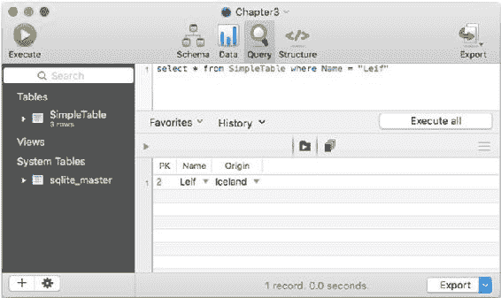

# 第 3 章：使用 SQLite 基础 —— 存储和检索数据

> **注意：** 当表名包含空格时，你需要将其放入引号中。请注意，在此示例中，原 `SimpleTable` 已被重命名为 `Simple Table`，因此在查询中需要用引号括起来。在 SQLpro for SQLite 中，表列表下方的齿轮图标有一个 `重命名` 命令，你可以用来创建或避免这种情况。

### 使用 SQLite3

以下是输入所有三条记录的 `sqlite3` 代码：

```sql
INSERT INTO SimpleTable (PK, Name, Origin) VALUES (1, "Cecelia", "Australia");
INSERT INTO SimpleTable (PK, Name, Origin) VALUES (2, "Leif", "Iceland");
sqlite> INSERT INTO SimpleTable (PK, Name, Origin) VALUES (5, "Charlotte", "United States");
```

## 检索数据

如果你想从表中检索数据，你需要使用 `SELECT` 查询。这是一个例子：

```sql
SELECT * FROM SimpleTable WHERE Name = "Leif"
```

### 使用图形用户界面

你可以将其输入到查询窗格中，如图 3-7 所示。



**图 3-7.** 使用查询选择数据

## 使用 sqlite3

这是 `sqlite3` 中的代码。注意返回的数据格式化时，列之间用竖线分隔。

```
sqlite> SELECT * FROM SimpleTable WHERE Name = "Leif";
2|Leif|Iceland
sqlite>
```

## 删除数据

如果你在操作数据，可能会最终得到不需要的数据。特别是，你可能会遇到错误，因为 `PK` 字段必须是唯一的，所以你不能重新输入已经输入过的数据。

以下是删除 `PK` 值为 1 的行的方法。

```sql
DELETE FROM SimpleTable WHERE PK = 1;
```

## 总结

本章向你展示了创建表、向其中插入数据然后检索数据的基础知识。请记住，这些仅仅是基础：在后面的章节中，你将看到 SQLite 的更多功能，但贯穿始终，你在本章中看到的相同基本 SQLite 命令会以各种变体和选项重现。（提醒一下，这些命令是 `CREATE`、`INSERT` 和 `SELECT`。）

