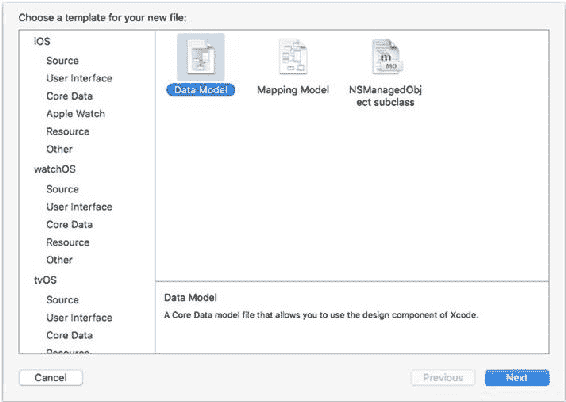
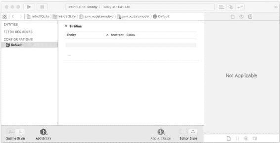
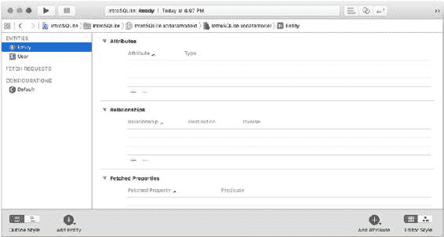
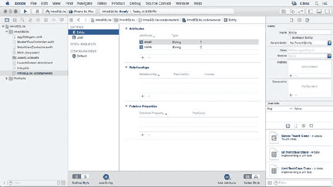

# 第 8 章：在 Core Data 中使用 SQLite（iOS 和 OS X）

**图 8-1.** 向你的项目中添加一个新的数据模型

> **注意：** 数据模型编辑器内置于 `Xcode` 中，这是苹果项目的集成开发环境。本章假设你了解 `Xcode` 的基础知识。如果还不了解，请访问 `developer.apple.com` 查找文档并下载 `Xcode`。它也可以在 Mac App Store 中免费获取。

你从一个空的数据模型开始，如图 8-2 所示。

**图 8-2.** 从一个新的数据模型开始

Core Data 模型编辑器的中心区域让你可以创建数据模型。编辑器有两种样式可供使用：*表格样式* 和 *图形样式*（本节稍后会看到两种样式）。当你处理数据模型时，编辑窗口右侧会有一个数据模型检查器。它将包含你在 Core Data 模型编辑器中所选内容的相关数据。（在图 8-2 的情况下，没有选中任何具有附加信息的内容。）

在数据模型编辑器的左侧，你可以管理三组对象。

-   **实体** 在后台是 `SQLite` 表。
-   **获取请求** 是类似于你可以在 `SQLite` 中创建的预定义查询。它们可以包含在查询时被替换的变量。
-   **配置** 在内部使用。对于基本开发，你不需要做任何事情，因为默认配置就能工作。

要向 Core Data 模型编辑器添加新对象，你可以使用窗口左下角的 `+` 按钮。`+` 旁边的小向下三角形让你可以选择添加实体、获取请求或配置。你的选择会保持有效——这意味着在你选择添加获取请求后，`+` 将会继续添加其他获取请求，直到你更改默认值。

### 使用实体

添加新实体后，它将出现在编辑窗口的中心，包含三个部分（参见图 8-3）：

-   **属性** 在后台是 `SQLite` 列。
-   **关系** 是你习惯的 `SQL` 中的逻辑关系。在 Core Data 中，它们有一个根本性的区别，这将在本章后面的“管理关系”中解释。
-   **获取属性** 允许你从不同的持久存储中获取属性。它们面向高级用户，本 Core Data 入门介绍中不涉及。

**图 8-3.** 添加一个新实体

实体最重要的一个方面或许是，当你在运行时获取它时，它是作为 `NSManagedObject`（或其子类）的实例被获取的。作为该获取的结果，实体成为一个类实例，其属性成为该实例的属性。你将在第 [9](http://dx.doi.org/10.1007/978-1-4842-1766-5_9) 章看到如何创建子类。

> **注意：** 实际上，当你使用 Core Data 获取对象时，它最初是作为 *故障* 被获取的。这不是一个错误。它代表了 Core Data 为继续执行所需的绝对最小信息量。基本上，它是一个 `NSManagedObject` 或其子类的实例，但持久化属性尚未填充。这意味着你可以以某些方式使用它，但当你真正需要数据时，故障会 *触发*，然后数据被填充进去。当故障已触发且数据已填充后，故障被认为是 *已实现*。这发生在后台，因此除了查看调试信息时，在 Core Data 的上下文中，“故障” 并不表示错误。故障机制是 Core Data 优化性能的方式之一。

当你在侧边栏中选择一个实体时，其详细信息会显示在编辑窗口的中央。你可以使用属性表下方的 `+` 按钮来添加新属性。初始时，每个属性会有一个占位符名称，如 `attribute` 或 `attribute1`。要为你的实体（或在 Core Data 模型编辑器中选择的任何其他对象）添加详细信息，请选中它，然后打开窗口右侧的数据模型检查器，如图 8-4 所示。

**图 8-4.** 使用数据模型检查器

你可以重命名实体。你还可以提供一些在代码中使用时有用的附加详细信息。有关此主题的更多详细信息，请参见第 9 章和第 10 章。

