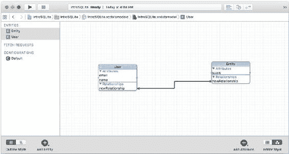

# 第 8 章 ■ 在 iOS 和 OS X 中使用 Core Data 与 SQLite

> **提示** 无论你使用何种数据管理工具来管理其持久存储，这些类型都适用于 Core Data。如果将此列表与 SQLite 中的类型列表进行比较，你可以看到，由于这些类型并未与 SQLite 类型提供一一对应的关系，Core Data 本身必须提供映射。在实践中，这意味着类型检查是在 Core Data 中完成的，并且比单独的 SQLite 库更严格，后者的一个指导原则是“任何列仍然可以存储任何类型的数据”（http://www.sqlite.org/datatype3）。

`Transformable` 数据类型正如其名：你可以将一种类型转换为另一种类型。它通常用于存储诸如图像和其他资源之类的数据类型，这些资源可以存储为通用数据类型，然后由应用程序直接作为资源类型使用，Core Data 在幕后双向提供转换。

图 8-5 显示了一个实体的属性及其类型。请注意，首次创建时，它被称为 `Entity`。你可以通过双击侧边栏中的它来重命名。

**图 8-5.** 为每个属性命名并设置类型

### 管理关系

当你设计关系数据库时，需要在数据对象之间建立关系。

在纸上、白板上或各种图形化关系数据编辑器中绘制这些关系的方式有很多种。当你编写诸如

`WHERE department.employee_name = corporate.manager_name`

这样的子句时，这些关系在查询中实现。

