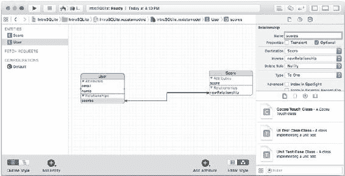
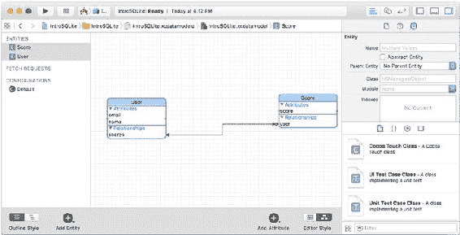
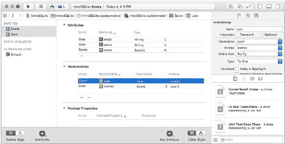

# 第 8 章 ■ 在 iOS 和 OS X 中使用 Core Data 与 SQLite


在 Core Data 中，**关系**是数据模型的一部分。Core Data 会管理它们（根据需要生成 `WHERE` 子句）。这意味着你无需自己编写 `WHERE` 子句（部分原因在于你不会自己编写 SQLite 语法，因此没有地方可以写它们）。一旦在数据模型中创建了两个**实体**，就可以使用 Xcode 的 Core Data 模型编辑器在它们之间建立关系。（是的，你可以在单个表中创建自连接，但这是一个更高级的话题。）创建关系最简单的方法是切换到图形样式（使用编辑区右下角的 `编辑器样式` 控件）。你可能需要重新排列实体，以便同时轻松看到你关心的两个实体。然后，从一个实体按住 Control 键拖拽到另一个实体，如图 8-6. 所示。

***图 8-6.** 创建一个关系*

新关系会被赋予默认名称：双击可更改名称。你需要指定关系的详细信息，因此请打开窗口右侧的 `数据模型` 检查器，如图 8-7 所示。这也是除了在表或图形编辑器中双击之外，另一个可以更改关系名称的地方。





第 8 章 ■ 在 iOS 和 OS X 中使用 Core Data 与 SQLite

***图 8-7.** 完善你的关系*

关系是双向的，但你需要在图形视图中配置关系的每一侧，然后在 `数据模型` 检查器中进行修改。图 8-7 显示了高亮显示的 `scores` 关系。`数据模型` 检查器中最重要的项目是 `名称`。你可以在这里更改它，也可以在图形视图中双击更改。

你经常需要更改 `类型` 设置，在 `对一` 和 `对多` 之间切换。当你这样做时，你会看到关系末端的箭头从单箭头变为双箭头（这是标准关系图表示法）。`类型` 有时被称为 *基数*。

图 8-8 显示了从 `User` 到 `Score` 的新关系，这是一个对多关系（注意双箭头）；其逆关系是一个对一关系（注意 `User` 端的单箭头）。

***图 8-8.** 指定关系的基数*



第 8 章 ■ 在 iOS 和 OS X 中使用 Core Data 与 SQLite

在配置关系时，人们经常使用窗口右下角的控件在图形视图和表视图之间来回切换。图 8-9 显示了表视图。

***图 8-9.** 在关系中使用表视图*

删除规则让你指定当尝试删除关系的一端时会发生什么。简而言之，你可以指定删除关系的源对象可能产生以下任何结果：

- **级联**。删除关系的一端会删除所有相关的对象。
- **置空**。删除关系的一端，会导致剩余对象中对它的引用被设置为 `null`。
- **拒绝**。你无法删除关系的一端。你必须通过删除子对象来逐步处理，直到没有相关对象留下，但你必须编写自己的代码来实现这一点。
- **无操作**。即使会产生悬垂指针，你也可以删除关系的一端。

第 8 章 ■ 在 iOS 和 OS X 中使用 Core Data 与 SQLite

## 总结

本章介绍了 Core Data，这个框架为 OS X、iOS、watchOS 和 tvOS 实现了对 SQLite 的访问。你已经学习了如何使用 Xcode 数据模型编辑器构建你的数据模型，以及如何构建关系——当 Core Data 在它生成并运行的 `SELECT` 语句中创建相应的 `WHERE` 子句时，这些关系会为你实现。

与 PHP 和 Android 相比，SQLite 数据建模的这一方面更具图形化而非面向文本的特性。然而，如果你喜欢编写传统代码，也无需担心。章节 [9](http://dx.doi.org/10.1007/978-1-4842-1766-5_9) 和 [10](http://dx.doi.org/10.1007/978-1-4842-1766-5_10) 展示了实现你的 SQLite 数据模型的 Objective-C 和 Swift 代码。

## 第 9 章：在 Swift 中使用 SQLite/Core Data (iOS 和 OS X)

在了解了让你能够以图形方式构建 Core Data 环境的 Xcode Core Data 模型编辑器之后，现在该转向实现它的代码了。Core Data 封装了**持久化存储**，在许多情况下，对于 OS X、iOS、watchOS 和 tvOS，这指的是内置的 SQLite 库。

本章将介绍 **Core Data 栈**——在所有情况下执行工作的对象。它还将探讨你在实现自己的应用程序时可能使用的特定对象。

在其他环境中暴露的 SQLite 语法在这里仍然有效，正如你在第 [8](http://dx.doi.org/10.1007/978-1-4842-1766-5_8) 章关于数据类型的讨论中所看到的，实际工作是由 SQLite 完成的。

### 了解 Core Data 栈

Core Data 栈是一组协同工作以提供功能的对象的集合。它们如下：

- **托管对象模型**。这就是你在第 [8](http://dx.doi.org/10.1007/978-1-4842-1766-5_8) 章中看到的以图形方式构建的东西。它非常类似于通常所说的数据库模式。（模式是用形式化语言而非图形方式描述的。）请记住，关系在 Core Data 数据模型中是显式定义的，而在 SQLite（以及一般的 SQL）中，关系是通过你编写的 `WHERE` 子句来实现的。
- **持久化存储协调器**。每个 SQLite 表通常表示为 Core Data 中的一个持久化存储。这种持久化存储和数据库表之间的一一对应关系在大多数情况下是足够的。然而，你可以拥有多个持久化存储以提高性能或提供其他优化。就 Core Data 栈而言，三个关键元素之一是持久化存储协调器，它负责协调给定 Core Data 应用程序的所有持久化存储。
  在大多数情况下，持久化存储协调器处理单个持久化存储。然而，仍然使用其全称（持久化存储协调器），因为在更复杂的解决方案中，持久化存储协调器实际上管理多个持久化存储。正是持久化存储协调器及其持久化存储，完成了从平面的 SQLite 数据库文件到你在 Core Data 应用程序中使用的对象的转换。因此，在创建持久化存储时，你可以使用一些选项来指定底层数据是什么（在 OS X 上是 XML，在任何平台上都可以是 SQLite，内存存储，以及未来可能创建的其他类型）。定义的存储类型包括 `NSSQLiteStoreType`、`NSXMLStoreType` (OS X)、`NSBinaryStoreType` (OS X) 和 `NSInMemoryStoreType` (OS X)。
- **托管对象上下文**。托管对象上下文就像一个暂存区：它包含从持久化存储检索到的、并且可能已经被你的应用程序修改过的数据。当你完成修改后，你就保存托管对象上下文。如果你想取消操作，只需销毁托管对象上下文即可。

Core Data 栈由这三个对象组成，它们相互关联以创建一个单一的实体。

### 获取数据到 Core Data 栈

获取请求可以在 Xcode Core Data 模型编辑器或你的代码中创建。它们从持久化存储（通过持久化存储协调器）检索数据，并将其放置到托管对象上下文中。获取请求不是 Core Data 栈的一部分，这一事实体现在 Core Data 的标准架构中（将在下一节描述）。

### 构建一个 Core Data 应用程序


基本的 Core Data 栈（包括持久化存储协调器、数据模型和托管对象上下文）通常被放置于应用程序中全局可访问的位置。最常见的做法（如 Xcode 内置的 Master-Detail Application 和 Single View Application 模板所示）是将 Core Data 栈置于 `AppDelegate` 中。`AppDelegate` 通常负责创建应用程序内的视图和其他对象。如果这些视图或对象需要使用 Core Data 栈的部分功能，`AppDelegate` 会在它们被创建时或创建后由其管理时，将相关部分传递下去。

## 第 9 章 ■ 在 Swift 中使用 SQLite/Core Data（iOS 和 OS X）在 iOS 中将托管对象上下文传递给视图控制器

以下是 iOS 的 Master-Detail Application 模板将托管对象上下文传递给视图的方式。（与 Apple 的代码示例以及当今编写的大量新代码一样，这是 Swift 代码。）

```
func application(application: UIApplication,
    didFinishLaunchingWithOptions launchOptions: [NSObject: AnyObject]?) -> Bool {
    // 应用程序启动后的自定义切入点。
    let splitViewController = self.window!.rootViewController as! UISplitViewController
    let navigationController = splitViewController.viewControllers[splitViewController.viewControllers.count-1] as! UINavigationController
    navigationController.topViewController!.navigationItem.leftBarButtonItem = splitViewController.displayModeButtonItem()
    splitViewController.delegate = self
    let masterNavigationController = splitViewController.viewControllers[0] as! UINavigationController
    let controller = masterNavigationController.topViewController as! MasterViewController
    controller.managedObjectContext = self.managedObjectContext
    return true
}
```

视图是从故事板创建的，此代码从基本的窗口开始，逐级向下查找，直到找到分割视图控制器左侧的导航控制器。然后，它再深入到导航控制器内的 `MasterViewController`。获取到该控制器后，便将 `MasterViewController` 的 `managedObjectContext` 属性设置为在 `AppDelegate` 的 Core Data 栈中创建的 `managedObjectContext`（即以粗体显示的那行代码）。这是标准做法。

你也可以通过查找应用程序委托，然后从 `AppDelegate` 内部访问栈对象之一来获取 Core Data 栈。这破坏了封装的思想，因为你在探查应用程序委托的内部。然而，你会在各处发现一些示例代码这样做，如果你只是偶尔（比如只用一次）需要访问栈，那么这种做法也有一个（较弱的）理由支持。以下是这种获取栈方式的代码。

```
let appDelegate = UIApplication.sharedApplication().delegate as! AppDelegate
// 使用 appDelegate.managedObjectContext 或其他栈属性
```

## 第 9 章 ■ 在 Swift 中使用 SQLite/Core Data（iOS 和 OS X）在 iOS 的 AppDelegate 中设置 Core Data 栈

此代码来自 Xcode 内置的 Single View Application 模板。它包含对以下内容的 `lazy var` 声明：

-   `applicationDocumentsDirectory`。这是数据模型将放置在应用程序内的目录。它只是一个实用函数。
-   `managedObjectModel`
-   `persistentStoreCoordinator`
-   `managedObjectContext`

通过使用 `lazy var`，初始化代码仅在实际需要时才运行。因此，除非你使用 Core Data，否则模板中的这段代码永远不会运行。此处包含了模板代码的注释。

#### 在 iOS 中创建 `applicationDocumentsDirectory`

此代码使用默认的文件管理器来查找应用程序的文档目录。

如果你想更改数据模型目录的位置，请在粗体显示的代码处进行更改。可以使用不同的目录或创建自己的目录（不使用默认目录时请小心）。

```
lazy var applicationDocumentsDirectory: NSURL = {
```


