# 在 iOS 中创建 managedObjectContext

最后，创建托管对象上下文。（请注意，由于惰性初始化，“最后”可能并不准确，因为 Core Data 栈组件的创建顺序取决于首先访问的是哪一个。）

`第 9 章 ■ 在 Swift 中使用 sQLite/Core Data（iOS 和 os X）`
```swift
lazy var managedObjectContext: NSManagedObjectContext = {
    // 返回应用程序的托管对象上下文
    // （它已经绑定到应用程序的持久化存储协调器。）
    // 此属性是可选的，因为存在可能导致上下文创建失败的合法错误情况。
    let coordinator = self.persistentStoreCoordinator
    var managedObjectContext = NSManagedObjectContext(concurrencyType: .MainQueueConcurrencyType)
    managedObjectContext.persistentStoreCoordinator = coordinator
    return managedObjectContext
}()
```

## 为 OS X 在 AppDelegate 中设置 Core Data 栈

此代码来自 Xcode 内置的 OS X Cocoa 应用程序模板。它包含以下内容的惰性变量声明：

- `applicationDocumentsDirectory`。这是你的数据模型在应用程序内部将被放置的目录。
- `managedObjectModel`
- `persistentStoreCoordinator`
- `managedObjectContext`

通过使用惰性变量，初始化代码只在你实际需要时才运行。因此，除非你使用 Core Data，否则模板中的这段代码永远不会运行。此处包含了模板代码中的注释。

### 在 OS X 中创建 applicationDocumentsDirectory

此代码与 iOS 不同，以反映文件结构不同的事实。其目的是相同的。以粗体显示的代码是在你设置项目时根据你的设置创建的。如果你更改了开发者 ID 或项目名称，你可能需要更改此内容。

```swift
lazy var applicationDocumentsDirectory: NSURL = {
    // 应用程序用于存储 Core Data 存储文件的目录。
    // 此代码使用用户 Application Support 目录中名为
    // "com.champlainarts.OSXProjectSwift"的目录。
    let urls = NSFileManager.defaultManager().URLsForDirectory(.ApplicationSupportDirectory, inDomains: .UserDomainMask)
    `第 9 章 ■ 在 Swift 中使用 sQLite/Core Data（iOS 和 os X）`
    let appSupportURL = urls[urls.count - 1]
    return appSupportURL.URLByAppendingPathComponent("com.champlainarts.OSXProjectSwift")
}()
```

### 在 OS X 中创建 managedObjectModel

除了项目名称外，代码与 iOS 相同。在 iOS 中以粗体显示的代码对于 OS X 将更改为以下内容（假设你的项目名称是合适的）。

```swift
let modelURL = NSBundle.mainBundle().URLForResource("OSXProjectSwift", withExtension: "momd")!
```

### 在 OS X 中创建 persistentStoreCoordinator

```swift
lazy var persistentStoreCoordinator: NSPersistentStoreCoordinator = {
    // 应用程序的持久化存储协调器。此实现创建并返回一个协调器，
    // 已为应用程序向其添加了存储。（如果需要，会创建存储目录。）
    // 此属性是可选的，因为存在可能导致存储创建失败的合法错误情况。
    let fileManager = NSFileManager.defaultManager()
    var failError: NSError? = nil
    var shouldFail = false
    var failureReason = "创建或加载应用程序保存的数据时发生错误。"
    // 确保应用程序文件目录存在
    do {
        let properties = try self.applicationDocumentsDirectory.resourceValuesForKeys([NSURLIsDirectoryKey])
        if !properties[NSURLIsDirectoryKey]!.boolValue {
            failureReason = "预期是一个存储应用程序数据的文件夹，但找到的是文件 \(self.applicationDocumentsDirectory.path)。"
            shouldFail = true
        }
    } catch {
        let nserror = error as NSError
        `第 9 章 ■ 在 Swift 中使用 sQLite/Core Data（iOS 和 os X）`
        if nserror.code == NSFileReadNoSuchFileError {
            do {
                try fileManager.createDirectoryAtPath(self.applicationDocumentsDirectory.path!,
                    withIntermediateDirectories: true, attributes: nil)
            } catch {
                failError = nserror
            }
        } else {


# 第 9 章 在 Swift 中使用 SQLite/Core 数据（iOS 和 OS X）

## 在 OS X 中创建`托管对象上下文`

此代码与 iOS 中的相同。

```swift
failError = nserror
}

}

// 创建协调器和存储
var coordinator: NSPersistentStoreCoordinator? = nil
if failError == nil {
coordinator = NSPersistentStoreCoordinator(managedObjectModel: self.managedObjectModel)
let url = self.applicationDocumentsDirectory.URLByAppendingPathComponent("CocoaAppCD.storedata")
do {
try coordinator!.addPersistentStoreWithType(NSXMLStoreType, configuration: nil, URL: url, options: nil)
} catch {
failError = error as NSError
}
}
if shouldFail || (failError != nil) {
// 报告遇到的任何错误。
var dict = [String: AnyObject]()
dict[NSLocalizedDescriptionKey] = "Failed to initialize the application's saved data"
dict[NSLocalizedFailureReasonErrorKey] = failureReason
if failError != nil {
dict[NSUnderlyingErrorKey] = failError
}
let error = NSError(domain: "YOUR_ERROR_DOMAIN", code: 9999, userInfo: dict)
NSApplication.sharedApplication().presentError(error)
abort()
} else {
return coordinator!
}
}()
```

## 在 iOS 中创建获取请求

在 iOS 中，标准做法是在应用委托中创建 Core 数据栈，正如本章前面"构建 Core 数据应用结构"一节所示。除了 Core 数据栈，你通常还会使用获取请求，将数据从持久化存储提取到托管对象上下文中。（在 OS X 上，你使用绑定而非视图控制器和获取请求。）

这段代码相当常见。这里，它用于获取具有给定名称（`Event`）的所有实体。实体描述从托管对象上下文中检索（该行已加粗），并且获取结果控制器是引用该托管对象上下文创建的。为`fetchedResultsController`创建了一个名为`_fetchedResultsController`的支撑变量。这种设计模式经常被使用：如果支撑变量（以下划线开头）存在，则按需返回它。如果不存在，则创建获取结果控制器，并将其设置到下划线支撑变量中以备下次需要时使用。

```swift
var fetchedResultsController: NSFetchedResultsController {
if _fetchedResultsController != nil {
return _fetchedResultsController!
}
let fetchRequest = NSFetchRequest()
// 根据需要编辑实体名称。
let entity = NSEntityDescription.entityForName("Event", inManagedObjectContext: self.managedObjectContext!)
fetchRequest.entity = entity
// 将批处理大小设置为合适的数值。
fetchRequest.fetchBatchSize = 20
// 根据需要编辑排序键。
let sortDescriptor = NSSortDescriptor(key: "timeStamp", ascending: false)
fetchRequest.sortDescriptors = [sortDescriptor]
// 根据需要编辑分区名称键路径和缓存名称。
// 分区名称键路径为 nil 表示“无分区”。
let aFetchedResultsController = NSFetchedResultsController(fetchRequest: fetchRequest, managedObjectContext: self.managedObjectContext!, sectionNameKeyPath: nil, cacheName: "Master")
aFetchedResultsController.delegate = self
_fetchedResultsController = aFetchedResultsController
do {
try _fetchedResultsController!.performFetch()
} catch {
// 请用适当的错误处理代码替换此实现。
// abort()会导致应用程序生成崩溃日志并终止。
// 在发布的应用程序中不应使用此函数，尽管在开发过程中可能很有用。
print("Unresolved error \(error), \(error.userInfo)")
abort()
}
return _fetchedResultsController!
}
var _fetchedResultsController: NSFetchedResultsController? = nil
```

如果你已在第 8 章所述的数据模型中创建了获取请求，你可以用它来创建一个`fetchedResultsController`。

## 保存托管对象上下文

尽管这在 iOS 和 OS X 中基本相同，但仍有一些细微差别。

### 在 iOS 中保存


# 第 9 章 ■ 在 Swift（iOS 和 OS X）中使用 SQLite/Core Data

Core Data 在应用委托中的最后一部分是用于保存上下文及其更改的工具代码。如果不保存被管理对象上下文，这些更改就会丢失。

```
func saveContext () {
    if managedObjectContext.hasChanges {
        do {
            try managedObjectContext.save()
        } catch {
            // 用适当的代码替换此实现以处理错误。
            // abort() 会导致应用程序生成崩溃日志并终止。
            // 在已发布的应用程序中不应使用此函数，尽管它在开发过程中可能很有用。
            let nserror = error as NSError
            NSLog("Unresolved error \(nserror), \(nserror.userInfo)")
            abort()
        }
    }
}
```

这是将被管理对象上下文传递给由应用委托创建或管理的视图的主要原因之一（参见“在 iOS 中将被管理对象上下文传递给视图控制器”部分）。如果视图拥有被管理对象上下文，那么当它在处理视图的更改时，就可以使用 `managedObjectContext.save` 来保存这些更改。

以下是一个可以保存数据的标准视图控制器代码示例。

```
do {
    try context.save()
} catch {
    // 用适当的代码替换此实现以处理错误。
    // abort() 会导致应用程序生成崩溃日志并终止。
    // 在已发布的应用程序中不应使用此函数，尽管它在开发过程中可能很有用。
    print("Unresolved error \(error), \(error.userInfo)")
    abort()
}
```

### 在 OS X 中保存

凭借 OS X 中的菜单栏及其命令，你经常使用“保存”操作来保存数据。以下是一个典型的 OS X `saveAction` 函数。

```
@IBAction func saveAction(sender: AnyObject!) {
    // 为应用程序执行保存操作，即向应用程序的被管理对象上下文发送 save: 消息。
    // 遇到的任何错误都会呈现给用户。
    if !managedObjectContext.commitEditing() {
        NSLog("\(NSStringFromClass(self.dynamicType)) unable to commit editing before saving")
    }
    if managedObjectContext.hasChanges {
        do {
            try managedObjectContext.save()
        } catch {
            let nserror = error as NSError
            NSApplication.sharedApplication().presentError(nserror)
        }
    }
}
```

## 使用 `NSManagedObject`

在任何使用 Core Data 的应用程序中，你都需要一个 Core Data 栈，并且每次创建它的方式基本相同，除了你会自定义项目的名称。

（如果你是从 Xcode 的内置模板之一构建应用，可能会有一个 Core Data 复选框，可用于自动插入 Core Data 栈代码以及你的项目名称。）

那么你的数据呢？这将由你的 Core Data 栈来管理，但它肯定需要特殊的编码。事实上，与 Core Data 的常见情况一样，SQLite 语法在幕后为你处理好了。你已经拥有一个数据模型（要么是模板自带的，要么是经过你修改的），如果你没有，你需要使用 文件 ➤ 新建 ➤ 文件 来创建一个数据模型。

`Note` 在 OS X 中，通常不使用视图控制器；而是使用绑定。该主题在 developer.apple.com 中有介绍。

数据模型中的每个实体将在运行时转换为一个类的实例。这些实例中的每一个都是 `NSManagedObject` 或其子类的实例。本节将向你介绍基础知识。

本节中的示例使用本书前面使用的相同的两个实体：`User` 和 `Score`。`图 9-1.` 显示了它们在 Xcode Core Data 模型编辑器图形视图中的样子。

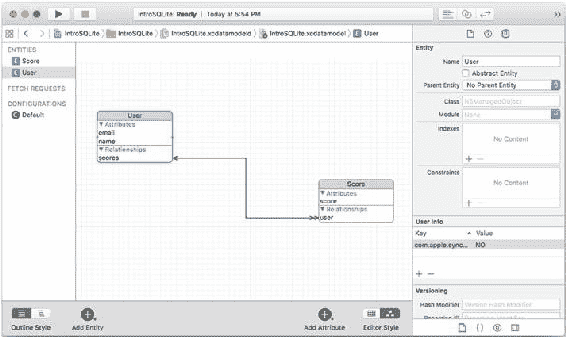

`图 9-1.` 数据模型中的 User 和 Score 实体

### 创建新的 `NSManagedObject` 实例

有几种方法可以创建新的 Core Data 实例。最常见的一种可以在 iOS 的 Master-Detail Application 模板中找到。以下是那里使用的代码。它连接到 MasterViewController 视图中的一个 +。用户可以点击 + 来创建一个新对象。


# 第 9 章 ■ 在 Swift 中使用 SQLite/Core Data（iOS 和 OS X）

```swift
func insertNewObject(sender: AnyObject) {

    let context = self.fetchedResultsController.managedObjectContext

    let entity = self.fetchedResultsController.fetchRequest.entity!

    let newManagedObject =
        NSEntityDescription.insertNewObjectForEntityForName(entity.name!,
                                                           inManagedObjectContext: context)

    do {

        try context.save()

    } catch {

        abort()

    }

}
```

每当创建一个新的 `NSManagedObject` 时，你都会使用这段代码（或非常类似的代码）。这段代码的开头部分只是定位托管对象上下文。它可能是你正在使用的类中的一个属性，例如 `fetchedResultsController`。如果不是，你可能需要添加一个本地属性，这个属性在你的类实例化时或从故事板加载实例时被创建（或传递）。

接下来，你创建一个实体描述，它是 `NSEntityDescription` 的一个子类。它封装了你在数据模型中管理的实体信息。在此处显示的代码中，实体描述（名为 `entity`）是从一个获取结果控制器中检索到的。

代码的第三行实际创建了一个名为 `newManagedObject` 的新实例。这行代码值得详细审视。它其实相当简单，但它是 Core Data 的核心。

```swift
let newManagedObject =
    NSEntityDescription.insertNewObjectForEntityForName(entity.name!,
                                                       inManagedObjectContext: context)
```

你使用 `NSEntityDescription` 的一个类方法来创建新对象——`insertNewObjectForEntityForName`。你需要指定要创建的新对象的名称以及将其放入的托管对象上下文。

如果你知道要创建的对象名称，可以省略创建 `entity` 的那行代码（此代码的第二行），并像下面的代码片段那样，通过名称来引用它。

```swift
let newManagedObject =
    NSEntityDescription.insertNewObjectForEntityForName("User",
                                                       inManagedObjectContext: context)
```

显然，这段代码的可重用性较差，但它可以工作。

在你创建了那个新的托管对象之后，你将插入了它的托管对象上下文保存下来。

```swift
do {
    try context.save()
} catch {
    abort()
}
```

正如模板代码中的注释以及本书其他地方所指出的，**不要**在发布的应用程序中使用 `abort()`。相反，应该捕获错误并记录它，让用户知道存在问题（如果用户能对此做些什么的话），或者直接在你的代码中修复问题。

这就是创建一个新的托管对象所需的全部步骤。

如果你想为在数据模型中为实体定义的属性设置一个值，你可以使用键值编码（key-value coding）来做，使用类似以下的一行代码：

```swift
newManagedObject.setValue("New User", forKey: "name")
```

如果你为属性设置的值是无效的，保存托管对象上下文将会失败。如果你在 Xcode 数据模型编辑器中声明了验证规则，这种情况尤其会发生。在你彻底调试好验证规则之前，你可能需要适当地处理错误。（当然，如果你允许用户输入，可能会发生大量用户生成的错误。）

`提示`：如果你真的想深入理解 Core Data，请梳理一下在幕后必须生成的 SQLite 语法，以实现此处展示的代码。它肯定正在被执行，但你不需要手动输入它。

## 使用 `NSManagedObject` 的子类

你可以创建 `NSManagedObject` 的一个子类，而不是直接使用 `NSManagedObject` 的实例。如果你创建了一个子类（过程将在后面描述），主要好处是，你可以使用像下面这样的代码来为 `newManagedObject` 设置值，而不必使用键值编码：

```swift
newManagedObject.name = "New User"
```

使用 Xcode Core Data 模型编辑器可以轻松地创建一个新的 `NSManagedObject` 子类。以下是涉及的步骤。首先打开你的数据模型，如图 9-1 所示。（你是在看图表视图还是表格视图并不重要。）选择 **Editor**


# 第九章：在 Swift (iOS 和 OS X) 中使用 SQLite/Core Data

### 选择你的数据模型

选择“Create NSManagedObject Subclass”来打开图 9-2 所示的窗口。选择要使用的数据模型，如图 9-2 所示（通常只有一个。如果你一直在修改数据模型，可能会有多个。）

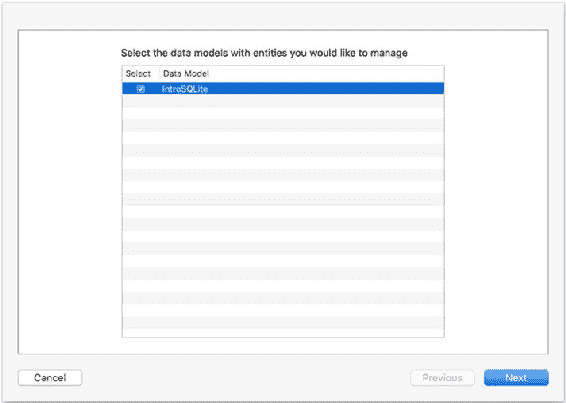

**图 9-2. 选择你的数据模型**

### 选择要生成子类的实体

点击“Next”后，选择想要为其创建子类的实体（见图 9-3）。

默认情况下，你在图形或表格视图（如图 9-1 所示）中选择的实体会被选中。你不必为所有实体都创建子类。

有时，你会选择为更复杂的实体创建子类，而将其他的保留为 `NSManagedObject` 实例。

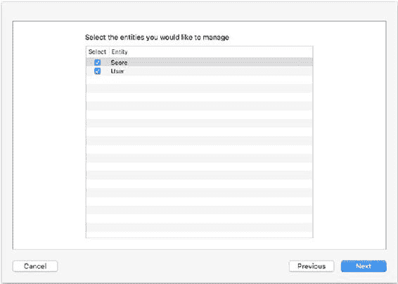

**图 9-3. 选择要创建子类的实体**

### 保存子类文件

点击“Next”，选择新文件的保存位置，如图 9-4 所示。同时为子类文件选择你想要的编程语言。（你可以混合搭配使用 Swift 和 Objective-C。）

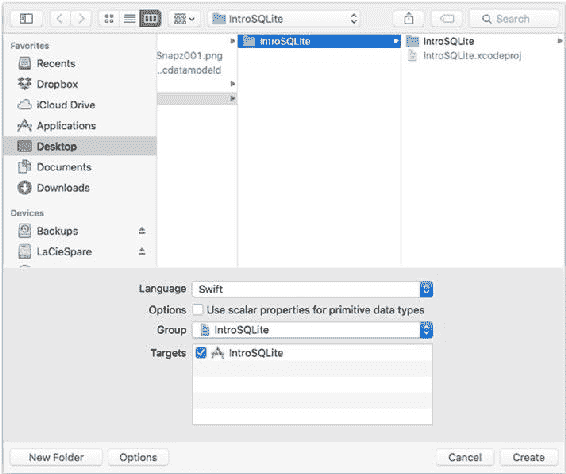

**图 9-4. 选择子类文件的保存位置和你想要使用的语言**

你应该仔细检查一下分组（用于导航器）和目标，但通常它们都是正确的。

### 关于标量属性的选项

“Use scalar types for scalar property types”这个选项需要稍作解释。默认情况下，你的实体属性会被转换为使用原生 Cocoa 或 Cocoa Touch 类型（如 `NSNumber` 对应 `Double`）的 Swift 或 Objective-C 属性。因此，一个 `Double` 会被转换为 `NSNumber`。`NSNumber` 是一个比 `Double` 强大得多的结构（首先，它是一个类）。如果你经常处理这样的属性，有时 `NSNumber` 的强大功能反而会碍事。选择使用标量类型将使用基本平台（非对象）类型（如 `Double`），这可能会让你的代码更简单。

### 桥接头文件

如果你的项目基本上是用 Swift 编写的，而你选择用 Objective-C 创建子类，系统可能会询问你是否要在两种语言之间创建一个桥接头文件（Bridging Header），如图 9-5 所示。是的，你应该这样做。

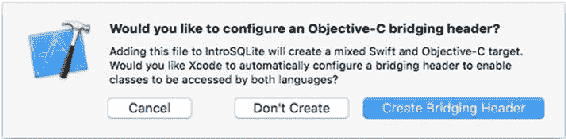

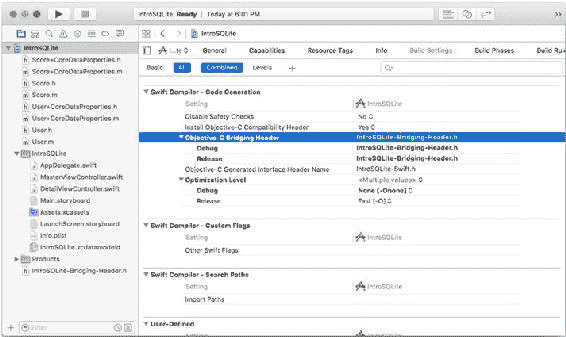

**图 9-5. 你可以选择创建桥接头文件**

在一个混合语言的项目中，如果没有被询问关于桥接头文件的事，也不必担心。它只需要创建一次，所以第一次之后，就不会再被询问了。

桥接头文件会在你的项目构建设置中为你创建好，如图 9-6 所示。你不需要再做任何事情。

**图 9-6. 带有桥接头文件的构建设置**

### 生成的 Swift 文件

如果你创建的是 Swift 子类，`Xcode` 会为你选择的每个实体创建两个文件。第一个是类的基础文件（本例中是 `User`）：它是空的，内容如下：

```swift
import Foundation
import CoreData

class User: NSManagedObject {

    // 在此处插入代码，为你的托管对象子类添加功能

}
```

文件将被命名为 `User.swift`。正如代码中的注释所示，你可以向这个新创建的类添加任何你想要的代码。

`Xcode` 为你创建的配套文件是一个 *类扩展*。（Swift 的类扩展类似于 Objective-C 的 category，但没有名称。）它的名称格式如下：

`User+CoreDataProperties.swift`

文件内容如下：

```swift
import Foundation
import CoreData

extension User {

    @NSManaged var name: String?
    @NSManaged var email: String?
    @NSManaged var scores: NSManagedObject?

}
```

在运行时，这个扩展会与基础类合并，因此你可以通过以下方式访问 `User` 实例的 `name` 属性：

```swift
myName.name = "test"
```

这就是创建 `NSManagedObject` 子类的全部过程。


**注意**：关于如何使用子类，请参见[第 12 章](http://dx.doi.org/10.1007/978-1-4842-1766-5_12)。

# 总结

本章向你展示了如何使用`Swift`——`Cocoa`和`Cocoa Touch`更现代的语言——在 OS X 和 iOS 上操作`SQLite`/`Core Data`。目前仍有大量`Objective-C`代码存在，而[第 10 章](http://dx.doi.org/10.1007/978-1-4842-1766-5_10)介绍了相关代码。

## `第 10 章`：使用`Objective-C`操作`SQLite`/`Core Data`（iOS 和 Mac）

第[9 章](http://dx.doi.org/10.1007/978-1-4842-1766-5_9)详细描述的`Core Data`栈是本章的核心，但背景是`Objective-C`。是的，使用`Swift`和`Objective-C`操作`SQLite`的过程非常相似，但实现细节的差异足以使它们被分置于不同的章节，这样你无需来回翻页就能找到所需内容。如果你已经阅读了第[9 章](http://dx.doi.org/10.1007/978-1-4842-1766-5_9)（或者相反，如果你在阅读第[9 章](http://dx.doi.org/10.1007/978-1-4842-1766-5_9)之前先读了[第 10 章](http://dx.doi.org/10.1007/978-1-4842-1766-5_10)），请随意跳过任何重复的内容，以便你在掌握`SQLite`和这两种 Apple 语言时游刃有余。

`Objective-C`是后来演变为`Cocoa`和`Cocoa Touch`的原始语言。它在 20 世纪 80 年代初为`NeXTSTEP`设计。当时，面向对象编程正成为软件开发的主要方式。多种语言被设计出来以实现这一新范式。有些是从头构建的，而另一些则构建在当时已有的语言（如`C`）之上。（甚至还有`Object COBOL`语言。）

`Objective-C`曾是`NeXTSTEP`以及后来的`Cocoa`和`Cocoa Touch`开发的唯一语言。2014 年，`Swift`加入其中。如同之前的`Objective-C`一样，它也基于当时的编程风格和语言，但就`Swift`而言，这些语言是“`Objective-C`、`Rust`、`Haskell`、`Ruby`、`Python`、`C#`、`CLU`，以及太多无法列举的语言”，维基百科引用 Chris Lattner 的话说道。（Lattner 是`Swift`的原始开发者。）

两种语言在`Core Data`栈的实现上存在重要差异，但其架构对两者而言是相同的。

### 第 10 章 ■ 使用`Objective-C`操作`SQLite`/`Core Data`（iOS 和 Mac）：审视 Core Data 栈

`Core Data`栈是一组提供功能的三个对象。如下所示：

*   **托管对象模型**。这是你在第[8 章](http://dx.doi.org/10.1007/978-1-4842-1766-5_8)中看到以图形方式构建的内容。它非常类似于通常被称为数据库模式的东西。（模式是用形式化语言而非图形描述的。）请记住，在`Core Data`模型中关系是显式定义的，而在`SQLite`（以及一般的`SQL`）中，关系是在你编写的`WHERE`子句中实现的。
*   **持久化存储协调器**。每个`SQLite`表在`Core Data`中通常表示为一个持久化存储。持久化存储和数据库表之间的这种一对一映射在大多数情况下是足够的。然而，你可以拥有多个持久化存储以提高性能或提供其他优化。就`Core Data`栈而言，三个关键元素之一是持久化存储协调器，它协调给定`Core Data`应用程序的所有持久化存储。

在大多数情况下，持久化存储协调器处理单个持久化存储。然而，其全称（持久化存储协调器）仍在使用，因为在更复杂的解决方案中，持久化存储协调器确实管理多个持久化存储。正是持久化存储协调器及其持久化存储完成了从扁平的`SQLite`数据库文件到你在`Core Data`应用程序中操作的对象的转换。因此，在创建持久化存储时，你会使用一些选项来指定底层的...


# Core Data 存储类型与架构

数据可以是（在 OS X 上为 XML，在任意平台上为 SQLite，以及内存存储，未来可能创建的其他类型）。

已定义的存储类型包括：

-   `NSSQLLiteStoreType`
-   `NSXMLStoreType` (OS X)
-   `NSBinaryStoreType` (OS X)
-   `NSInMemoryStoreType` (OS X)

## 托管对象上下文

**托管对象上下文**就像一个暂存器：它包含从持久存储中检索出的数据，并且可能已被你的应用程序修改。当你完成修改后，就保存托管对象上下文。如果想要取消操作，直接销毁该托管对象上下文即可。

Core Data 栈由这三个对象组成，它们相互关联以创建一个单一实体。

## 获取数据到 Core Data 栈

获取请求可以在 Xcode 的 Core Data 模型编辑器中创建，也可以在代码中创建。它们从持久存储（通过持久存储协调器）中检索数据，并将其放入托管对象上下文。获取请求不是 Core Data 栈的一部分，这一点在 Core Data 的标准架构中有所体现（将在下一节描述）。

# Objective-C 语言要点

Objective-C 在许多方面看起来像你可能熟悉的其他编程语言，但存在一些差异。Objective-C 对许多人来说看起来尤其不同。以下是一些主要区别。关于 Objective-C 的更多信息可在 developer.apple.com 上找到。此外，本章中的代码片段将为你提供一些关键示例，但这里的重点是 SQLite 及其语法以及 Core Data。

## 使用带引号的字符串

在 Objective-C 中，带引号的字符串以 `@` 开头，例如 `@"myString"`。

## Objective-C 是一种消息传递语言

最重要的区别在于 Objective-C 是一种 **基于消息** 的语言，并且它是 **动态** 的。在当今许多面向对象的编程语言中，你使用如下语法调用类的方法或函数：

```
myObject.myFunction ();
```

与调用 **函数** 或 **方法**（尽管有细微差别，但这里这两个术语可以互换使用）不同，在 Objective-C 中，你是向一个对象发送 **消息**。这个消息的名称可能让你认为它是一个函数调用，但本质上并非如此。在 Objective-C 中，前面那行代码会写作：

```
[myObject myFunction];
```

`myFunction` **消息** 被发送给了 `myObject`。

## 在 Objective-C 中使用括号

如上一节所示，Objective-C 看起来不同。消息被括号包围。接收者是括号内的第一个项目，消息选择器是第二个。（消息选择器标识要发送的消息。它通常看起来像函数或方法的名称，但它不是一个带引号的字符串。）接收者或消息选择器都可以是运行时计算的表达式——因此它具有动态性。

方括号长期以来对某些人来说是阅读 Objective-C 的一个障碍。因此，出现了一些变体。苹果收购 NeXT 后，在经典 Objective-C 方括号之外引入了 **现代语法**。那个特定的变体不再被支持，但 Objective-C 2.0（2006）引入了 **点语法**，其中方括号被更易接受的语法取代。这两种变体都可以与经典 Objective-C 表示法共存，因为它们不会改变编译器内部发生的事情。本章“在 iOS 中将托管对象上下文传递给视图控制器”一节中的代码对 Objective-C 使用了点语法。

### 链式消息

与 Swift 和其他语言一样，如果语句产生结果，你可以将它们链接在一起。因此，你可以编写这段代码（假设 `myFunction` 返回一个能响应 `myFunction2` 的对象）。

```
((myObject.myFunction ()).myFunction2 ()
```

这等同于编写

```
x = myObject.myFunction ();
y = x.myFunction2 ();
```

而且，在 Objective-C 中你可以写

`[[myObject myFunction] myFunction2]`

这等同于书写

```
x = [myObject myFunction];

y = [x myFunction2];
```

**以分号结束语句**

Objective-C 语句以分号结尾。（你可以在 `Swift` 语句末尾加上分号，但这是可选的。如果在同一行上有两条 `Swift` 语句，则是必需的：第一条语句和第二条语句之间用分号分隔。）

**在 Objective-C 中分隔头文件与实现文件**

在 `Swift` 及许多其他现代语言中，每个类对应一个单独的文件。而在 Objective-C 中有两个文件——一个扩展名为 `.h` 的头文件和一个扩展名为 `.m` 的实现文件。

第 10 章 ■ 在 Objective-C（iOS 和 Mac）中使用 SQLite/Core Data
**查看方法声明**

方法声明的语法与 `Swift` 不同。最快了解差异的方法是查阅“在 iOS 的 AppDelegate 中设置 Core Data 栈”一节中的示例。

**在 Objective-C 中处理 `nil`**

在面向对象语言中，通常会有指向对象实例的引用，这些实例在大多数情况下存储在*堆*上（即，应用程序可以按需使用的一块内存区域）。这与*栈*不同，后者是一种后进先出（LIFO）的抽象内存结构。（“抽象”是指其行为表现得像是一个单一结构，但在某些实现中并不一定如此。）栈数据通常属于某个特定函数，因此当函数执行完毕时，栈可以被*回缩*，其变量也随之从内存中移除。

对象的实例在堆上分配，不会自动回缩。它们需要通过某种方式移除。在 Objective-C 中，随着时间的推移，已经实现了几种清理未使用内存的策略。当前的版本依赖于引用计数：当分配一个实例时，其引用计数被设为 1。每次使用该实例时，使用它的代码通常会增加引用计数。当每次使用实例的代码执行完毕时，引用计数减少 1。当引用计数达到 0 时，操作系统就可以重用这块内存。

这种内存管理策略依赖于软件工程师来管理引用计数。随着时间的推移，已经提供了自动化和半自动化的工具。然而，你仍然会看到使用主要内存管理工具的代码：`retain` 和 `release`，它们分别将引用计数增加和减少 1。

通过自动引用计数（`ARC`），这在很大程度上实现了自动化。

在 Objective-C 中，通过指针访问对象的实例。使用的是传统的 `C` 语言指针语法（星号——`*`）。因此，在 Objective-C 中你会看到如下声明：

```
NSView *myView;
```

或

```
NSView* myView;
```

星号的位置无关紧要。这声明了一个名为 `myView` 的指针变量，它指向一个 `NSView` 的实例。

**大概吧。**

`myView` 可能并未指向 `NSView` 的实例，而是 `nil`。你会发现 Objective-C 中有大量代码会在使用指针之前检查其是否为 `nil`。这是一个好习惯。

在 Objective-C 对象的生命周期中，它会经历几个状态。首先，它被声明，如：

```
NSView *myView;
```

第 10 章 ■ 在 Objective-C（iOS 和 Mac）中使用 SQLite/Core Data
然后它被初始化为某个值。这可以在一个单独的语句中发生，也可以在一个组合语句中发生。

```
NSView *myView;

myView = nil;
```

或

```
NSView *myView = nil;
```

如果在声明和被设置为某个有效值（例如 `nil` 或一个实际的实例）之间存在一段时间，那么该指针是未定义的。如果你使用它，你的应用程序的行为可能是任何情况，但“崩溃”很可能是描述的一部分。Objective-C 中的悬垂指针问题已存在多年，并且已有许多方法来解决它。如今，在 Objective-C 中，`ARC` 是解决该问题的主要方式。而在 `Swift` 中，实现可选类型（optionals）的主要原因之一就是为了杜绝这类悬垂指针。


# 使用 Objective-C 构建 Core Data 应用

如果你是从其他语言转过来的，那么方括号的使用、`nil` 的处理（以及正确初始化指针的必要性）可能是你在处理可能存在也可能不存在的 Core Data 对象时需要适应的两大最大变化（数据库和网络的本质意味着你不能依赖事物总是存在）。

基本的 Core Data 栈（`persistentStoreCoordinator`、数据模型和 `managedObjectContext`）通常放置在应用全局可访问的位置。最常见的情况（Xcode 内置的 Master-Detail Application 和 Single View Application 模板中使用）是将 Core Data 栈放在 `AppDelegate` 中。`AppDelegate` 通常负责创建应用内的视图和其他对象。如果这些视图和对象需要使用 Core Data 栈的某些部分，`AppDelegate` 会在它们创建时，或者在 `AppDelegate` 管理由他人创建的对象时，将栈传递给视图控制器和视图。

### 在 iOS 中将托管对象上下文传递给视图控制器

以下是 iOS 的 Master-Detail Application 模板将托管对象上下文传递给视图控制器的方式。（此代码使用 Objective-C 的点语法。）

```objective-c
- (BOOL)application:(UIApplication *)application didFinishLaunchingWithOptions:(NSDictionary *)launchOptions {
    // Override point for customization after application launch.
    UISplitViewController *splitViewController = (UISplitViewController *)self.window.rootViewController;
    UINavigationController *navigationController = [splitViewController.viewControllers lastObject];
    navigationController.topViewController.navigationItem.leftBarButtonItem = splitViewController.displayModeButtonItem;
    splitViewController.delegate = self;
    UINavigationController *masterNavigationController = splitViewController.viewControllers[0];
    MasterViewController *controller = (MasterViewController *)masterNavigationController.topViewController;
    controller.managedObjectContext = self.managedObjectContext;
    return YES;
}
```

视图是从故事板创建的，这段代码从基本窗口开始，逐步向下查找，直到找到分割视图控制器左侧的导航控制器。然后，它再深入到导航控制器内部的 `MasterViewController`。获取到该控制器后，它便将 `MasterViewController` 的 `managedObjectContext` 属性设置为在 `AppDelegate` 的 Core Data 栈中创建的 `managedObjectContext`。这是标准做法。

你也可以通过找到应用委托，然后访问栈中的某个对象来获取 Core Data 栈。这破坏了封装性，因为你正在窥视应用委托的内部。不过，你会在各种地方找到一些示例代码是这样做的，如果你只是偶尔——比如仅一次——需要访问栈，那么这样做也可以提出一个（较弱的）理由。以下是这种获取栈方式的代码。

```objective-c
AppDelegate *appDelegate = (AppDelegate *)[[UIApplication sharedApplication] delegate];
// use appDelegate.managedObjectContext or some other stack property
```

## 在 iOS 的 AppDelegate 中设置 Core Data 栈

这段代码来自 Xcode 内置的 Single View Application 模板。它由以下各项的懒加载 `var` 声明组成：

*   `applicationDocumentsDirectory`。这是你的数据模型在应用内部的存放目录。
*   `managedObjectModel`
*   `persistentStoreCoordinator`
*   `managedObjectContext`

通过使用懒加载 `var`，初始化代码只在你实际需要时才运行。因此，除非你使用了 Core Data，否则模板中的这段代码永远不会运行。这里包含了模板代码的注释。

#### 创建应用委托头文件

这是在 Objective-C 中创建 `AppDelegate` 的代码。请注意，`import` 语句与 Swift 不同。同时，像 `@property` 这样的编译器指令……


## Objective-C 中的接口声明与属性合成

`@interface` 和 `@end` 在 Swift 中不存在。方法声明（如 `saveContext` 和 `applicationDocumentsDirectory`）是 Objective-C 中声明的很好示例。

```objective-c
#import <UIKit/UIKit.h>
#import <CoreData/CoreData.h>

@interface AppDelegate : UIResponder <UIApplicationDelegate>

@property (strong, nonatomic) UIWindow *window;
@property (readonly, strong, nonatomic) NSManagedObjectContext *managedObjectContext;
@property (readonly, strong, nonatomic) NSManagedObjectModel *managedObjectModel;
@property (readonly, strong, nonatomic) NSPersistentStoreCoordinator *persistentStoreCoordinator;

- (void)saveContext;
- (NSURL *)applicationDocumentsDirectory;

@end
```

## 在 AppDelegate.m 中合成属性

属性在头文件中声明，但必须在实现文件中合成。`@synthesize` 编译器指令通常会创建一个与属性同名的后备变量，并在实现内部直接访问它。在头文件中暴露的属性使用点语法访问，而底层的属性访问器则与后备变量（带下划线的变量）协同工作。

除了像 Core Data 这样的特殊情况，如果你希望使用默认的后备变量名，大部分工作都会自动为你完成。

```objective-c
@synthesize managedObjectContext = _managedObjectContext;
@synthesize managedObjectModel = _managedObjectModel;
@synthesize persistentStoreCoordinator = _persistentStoreCoordinator;
```

## 在 iOS 中创建 applicationDocumentsDirectory

此代码使用默认的文件管理器来查找应用的文档目录。如果你想更改数据模型目录的位置，请在此处修改粗体所示的代码。可以使用不同的目录或创建自己的目录（当你不使用默认目录时请务必小心）。

```objective-c
- (NSURL *)applicationDocumentsDirectory {
    // 应用程序用于存储 Core Data 商店文件的目录。
    // 此代码使用应用程序文档目录中一个名为 "com.champlainarts.SingleViewAppOC" 的目录。
    return [[[NSFileManager defaultManager] URLsForDirectory:NSDocumentDirectory
                                                   inDomains:NSUserDomainMask] lastObject];
}
```

## 在 iOS 和 OS X 中创建 managedObjectModel

这里的 `managedObjectModel` 代码按需创建。粗体所示的行是在使用模板时生成的。如果你更改了项目名称，请修改这行代码。另外请注意，默认情况下，Core Data 模型存储在应用包中。你使用 Xcode Core Data 模型编辑器构建的 `.xcdatamodeld` 文件在构建过程中会被编译成 `.momd` 文件。

```objective-c
- (NSManagedObjectModel *)managedObjectModel {
    // 应用程序的托管对象模型。如果应用无法找到并加载其模型，这是一个致命错误。
    if (_managedObjectModel != nil) {
        return _managedObjectModel;
    }
    NSURL *modelURL = [[NSBundle mainBundle] URLForResource:@"SingleViewAppOC"
                                              withExtension:@"momd"];
    _managedObjectModel = [[NSManagedObjectModel alloc] initWithContentsOfURL:modelURL];
    return _managedObjectModel;
}
```

## 在 iOS 中创建 persistentStoreCoordinator

此代码根据你的托管对象模型创建一个持久化存储协调器。第一行粗体所示的代码是根据你的项目名称生成的，它包含了 SQLite 数据库文件的位置。你通常不会移动这个文件，但如果你更改了项目名称，这是另一个可能需要更改文件名的地方。

请注意，在使用数据模型时，如果 `self.managedObjectModel` 尚不存在，它将在此处的引用之后被创建。注意这与 Swift 中的做法不同。

另外，值得指出的是选择新持久化存储的 `SQLiteStoreType` 的那一行。它在第二行粗体中显示。

```objective-c
- (NSPersistentStoreCoordinator *)persistentStoreCoordinator {
    // 应用程序的持久化存储协调器。此实现创建并返回一个协调器，并为应用添加了存储。
    if (_persistentStoreCoordinator != nil) {
        return _persistentStoreCoordinator;
    }
    // 创建协调器和存储
    NSURL *storeURL = [[self applicationDocumentsDirectory] URLByAppendingPathComponent:@"SingleViewAppOC.sqlite"];
    NSError *error = nil;
    _persistentStoreCoordinator = [[NSPersistentStoreCoordinator alloc] initWithManagedObjectModel:[self managedObjectModel]];
    if (![_persistentStoreCoordinator addPersistentStoreWithType:NSSQLiteStoreType
                                                   configuration:nil
                                                             URL:storeURL
                                                         options:nil
                                                           error:&error]) {
        /*
         此处错误的典型原因包括：
         * 父目录不存在、无法创建或不允许写入。
         * 持久化存储不可访问，原因是设备锁定时的权限或数据保护。
         * 设备空间不足。
         * 存储无法迁移到当前模型版本。
         检查错误消息以确定实际问题是什么。
         */
        NSLog(@"未解决的错误 %@, %@", error, [error userInfo]);
        abort();
    }
    return _persistentStoreCoordinator;
}
```


## 创建持久化存储协调器

以下是应用程序的持久化存储协调器的实现。此实现创建并返回一个协调器，并将应用程序的存储添加到其中。

```objective-c
if (_persistentStoreCoordinator != nil) {
    return _persistentStoreCoordinator;
}

// Create the coordinator and store
_persistentStoreCoordinator = [[NSPersistentStoreCoordinator alloc]
    initWithManagedObjectModel:[self managedObjectModel]];

NSURL *storeURL = [[self applicationDocumentsDirectory]
    URLByAppendingPathComponent:@"SingleViewAppOC.sqlite"];

NSError *error = nil;
NSString *failureReason = @"There was an error creating or loading the application's saved data.";

if (![_persistentStoreCoordinator addPersistentStoreWithType:NSSQLiteStoreType
                                                configuration:nil
                                                          URL:storeURL
                                                        options:nil
                                                          error:&error]) {
    // Report any error we got.
    NSMutableDictionary *dict = [NSMutableDictionary dictionary];
    dict[NSLocalizedDescriptionKey] = @"Failed to initialize the application's saved data";
    dict[NSLocalizedFailureReasonErrorKey] = failureReason;
    dict[NSUnderlyingErrorKey] = error;

    error = [NSError errorWithDomain:@"YOUR_ERROR_DOMAIN" code:9999 userInfo:dict];

    // Replace this with code to handle the error appropriately.
    // abort() causes the application to generate a crash log and terminate. You
    // should not use this function in a shipping application, although it may be
    // useful during development.
    NSLog(@"Unresolved error %@, %@", error, [error userInfo]);
    abort();
}

return _persistentStoreCoordinator;
}
```

## 在 iOS 中创建托管对象上下文

最后，创建托管对象上下文。它整合了持久化存储协调器，而持久化存储协调器又引用了托管对象模型。这样，你就拥有了完整的 Core Data 栈。

### 第 10 章 ■ 在 iOS 和 Mac 中使用 SQLite/Core Data 与 Objective-C

```objective-c
- (NSManagedObjectContext *)managedObjectContext {
    // Returns the managed object context for the application (which is already
    // bound to the persistent store coordinator for the application.)
    if (_managedObjectContext != nil) {
        return _managedObjectContext;
    }

    NSPersistentStoreCoordinator *coordinator = [self persistentStoreCoordinator];
    if (!coordinator) {
        return nil;
    }

    _managedObjectContext = [[NSManagedObjectContext alloc]
        initWithConcurrencyType:NSMainQueueConcurrencyType];
    [_managedObjectContext setPersistentStoreCoordinator:coordinator];

    return _managedObjectContext;
}
```

## 在 OS X 的 AppDelegate 中设置 Core Data 栈

这段代码来自 Xcode 内置的 OS X Cocoa 应用程序模板。它包含的声明提供了与 Swift 中延迟声明类似的功能。这些声明用于以下内容：

* `applicationDocumentsDirectory`。这是你的数据模型将放置在应用程序内部的目录。
* `managedObjectModel`
* `persistentStoreCoordinator`
* `managedObjectContext`

#### 在 OS X 中创建 `applicationDocumentsDirectory`

此代码与 iOS 版本不同，以反映文件结构不同的事实。其目的是相同的。粗体显示的代码是根据你设置项目时的设置创建的。如果你更改了开发者 ID 或项目名称，可能需要更改此处。

```objective-c
- (NSURL *)applicationDocumentsDirectory {
    // The directory the application uses to store the Core Data store file.
    // This code uses a directory named "com.champlainarts.OSXProjectOC" in
    // the user's Application Support directory.

    // 第 10 章 ■ 在 iOS 和 Mac 中使用 SQLite/Core Data 与 Objective-C
    NSURL *appSupportURL = [[[NSFileManager defaultManager]
        URLsForDirectory:NSApplicationSupportDirectory inDomains:NSUserDomainMask]
        lastObject];

    return [appSupportURL
        URLByAppendingPathComponent:@"com.champlainarts.OSXProjectOC"];
}
```

#### 在 OS X 中创建 `managedObjectModel`

除了项目名称外，此代码与 iOS 版本相同。iOS 版本中粗体显示的代码在 OS X 中会更改为以下内容（假设你的项目名称是合适的）。

```objective-c
NSURL *modelURL = [[NSBundle mainBundle] URLForResource:@"SingleViewAppOC"
                                           withExtension:@"momd"];
```


#### 在 OS X 中创建 `persistentStoreCoordinator`

Xcode 会为你创建这个（或者如果你正在构建自己的 Core Data 栈，你也可以自己创建）。注意加粗的那行：它取自你的项目设置，你需要为你自己的项目更改它。

```objective-c
- (NSPersistentStoreCoordinator *)persistentStoreCoordinator {
    // 应用程序的持久化存储协调器。此实现
    // 创建并返回一个协调器，已为应用程序
    // 添加了存储。（如果需要，会创建存储目录。）
    if (_persistentStoreCoordinator) {
        return _persistentStoreCoordinator;
    }

    NSFileManager *fileManager = [NSFileManager defaultManager];
    NSURL *applicationDocumentsDirectory = [self applicationDocumentsDirectory];
    BOOL shouldFail = NO;
    NSError *error = nil;
    NSString *failureReason = @"创建或加载应用程序保存数据时出错。";

    // 确保应用程序文件目录存在
    NSDictionary *properties = [applicationDocumentsDirectory
        resourceValuesForKeys:@[NSURLIsDirectoryKey] error:&error];

    if (properties) {
        if (![properties[NSURLIsDirectoryKey] boolValue]) {
            failureReason = [NSString stringWithFormat:
                @"预期是一个存储应用程序数据的文件夹，却找到了一个文件 (%@)。",
                [applicationDocumentsDirectory path]];
            shouldFail = YES;
        }
    } else if ([error code] == NSFileReadNoSuchFileError) {
        error = nil;
        [fileManager createDirectoryAtPath:[applicationDocumentsDirectory path]
            withIntermediateDirectories:YES attributes:nil error:&error];
    }

    if (!shouldFail && !error) {
        NSPersistentStoreCoordinator *coordinator = [[NSPersistentStoreCoordinator alloc]
            initWithManagedObjectModel:[self managedObjectModel]];
        NSURL *url = [applicationDocumentsDirectory
            URLByAppendingPathComponent:@"OSXCoreDataObjC.storedata"];
        if (![coordinator addPersistentStoreWithType:NSXMLStoreType configuration:nil
            URL:url options:nil error:&error]) {
            coordinator = nil;
        }
        _persistentStoreCoordinator = coordinator;
    }

    if (shouldFail || error) {
        // 报告我们遇到的任何错误。
        NSMutableDictionary *dict = [NSMutableDictionary dictionary];
        dict[NSLocalizedDescriptionKey] = @"初始化应用程序保存数据失败";
        dict[NSLocalizedFailureReasonErrorKey] = failureReason;
        if (error) {
            dict[NSUnderlyingErrorKey] = error;
        }
        error = [NSError errorWithDomain:@"YOUR_ERROR_DOMAIN" code:9999 userInfo:dict];
        [[NSApplication sharedApplication] presentError:error];
    }

    return _persistentStoreCoordinator;
}
```

#### 在 OS X 中创建 `managedObjectContext`

这段代码与 iOS 中的相同。

### 第 10 章：在 Objective-C（iOS 和 Mac）中使用 SQLite/Core Data

## 在 iOS 中创建获取请求

在 iOS 中，标准做法是在应用委托中创建 Core Data 栈，如本章前面“在 iOS 的 AppDelegate 中设置 Core Data 栈”和“在 OS X 的 AppDelegate 中设置 Core Data 栈”所示。除了 Core Data 栈，你通常还使用获取请求来将数据从持久化存储提取到托管对象上下文中。（在 OS X 上，你使用绑定而不是视图控制器和获取请求。）

这段代码相当常见。这里，它用于获取具有给定名称（`Event`）的所有实体。实体描述是从托管对象上下文中获取的（该行以粗体显示），而获取结果控制器是使用对该托管对象上下文的引用创建的。为 `fetchedResultsController` 创建了一个名为 `_fetchedResultsController` 的支持变量。这种设计模式经常被使用：如果支持变量（以下划线开头）存在，则在请求时返回它。如果不存在，则创建获取结果控制器，并将带下划线的支持变量设置为它，以便下次需要时使用。

```objective-c
- (NSFetchedResultsController *)fetchedResultsController {
    if (_fetchedResultsController != nil) {
        return _fetchedResultsController;
    }

    NSFetchRequest *fetchRequest = [[NSFetchRequest alloc] init];
    // 根据需要编辑实体名称。
    // ...
}
```


# 第 10 章 ■ 在 Objective-C（iOS 与 Mac）中使用 SQLite/Core Data

```
NSEntityDescription *entity = [NSEntityDescription entityForName:@"Event" inManagedObjectContext:self.managedObjectContext];
[fetchRequest setEntity:entity];

// 将批处理大小设置为合适的数值。
[fetchRequest setFetchBatchSize:20];

// 根据需要编辑排序键。
NSSortDescriptor *sortDescriptor = [[NSSortDescriptor alloc] initWithKey:@"timeStamp" ascending:NO];
[fetchRequest setSortDescriptors:@[sortDescriptor]];

// 根据需要编辑分区名键路径和缓存名称。
// 分区名键路径为 nil 表示“无分区”。
NSFetchedResultsController *aFetchedResultsController = [[NSFetchedResultsController alloc] initWithFetchRequest:fetchRequest managedObjectContext:self.managedObjectContext sectionNameKeyPath:nil cacheName:@"Master"];
aFetchedResultsController.delegate = self;
self.fetchedResultsController = aFetchedResultsController;

NSError *error = nil;
if (![self.fetchedResultsController performFetch:&error]) {
    // 请用适当的错误处理代码替换此实现。
    // abort() 会导致应用程序生成崩溃日志并终止。在
    // 发布的应用程序中不应使用此函数，尽管在
    // 开发阶段可能有用。
    NSLog(@"未解决的错误 %@, %@", error, [error userInfo]);
    abort();
}
return _fetchedResultsController;
}
```

如果你按照第 8 章所述在数据模型中创建了获取请求，就可以用它来创建一个 `fetchedResultsController`。

## 保存托管对象上下文

虽然在 iOS 和 OS X 中这基本相同，但仍存在一些细微差别。

### 在 iOS 中保存

```
- (void)saveContext {
    NSManagedObjectContext *managedObjectContext = self.managedObjectContext;
    if (managedObjectContext != nil) {
        NSError *error = nil;
        if ([managedObjectContext hasChanges] && ![managedObjectContext save:&error]) {
            // 请用适当的错误处理代码替换此实现。
            // abort() 会导致应用程序生成崩溃日志并
            终止。在
            // 发布的应用程序中不应使用此函数，尽管在
            // 开发阶段可能有用。
            NSLog(@"未解决的错误 %@, %@", error, [error userInfo]);
            abort();
        }
    }
}
```

### 在 OS X 中保存

在 OS X 中，借助菜单栏及其命令，你经常使用“存储”操作来保存数据。以下是 OS X 中一个典型的 `saveAction` 函数。

```
- (IBAction)saveAction:(id)sender {
    // 执行应用程序的保存操作，即向应用程序的
    托管对象上下文发送
    // save: 消息。遇到的任何错误都会
    // 呈现给用户。
    if (![[self managedObjectContext] commitEditing]) {
        NSLog(@"%@:%@ 在存储前无法提交编辑", [self class], NSStringFromSelector(_cmd));
    }
    NSError *error = nil;
    if ([[self managedObjectContext] hasChanges] && ![[self managedObjectContext] save:&error]) {
        [[NSApplication sharedApplication] presentError:error];
    }
}
```

## 使用 NSManagedObject

在任何使用 Core Data 的应用程序中，你都需要一个 Core Data 栈，而且每次创建它的方式几乎相同，只是你需要自定义项目名称。（如果你是从某个内置的 Xcode 模板构建应用程序，可能会有一个 Core Data 复选框，用于自动插入 Core Data 栈代码以及你的项目名称。）

那么你的数据呢？数据将由你的 Core Data 栈管理，但它肯定需要特殊的编码。事实上，就像 Core Data 的许多方面一样，SQLite 语法是在后台为你处理的。你已经有了一个数据模型（可能是模板自带的，也可能是你修改过的），如果你还没有，你需要通过“文件” ➤ “新建” ➤ “文件”来创建一个。

**注意** 在 OS X 中，通常不使用视图控制器；而是使用绑定（bindings）。该主题在 developer.apple.com 上有介绍。

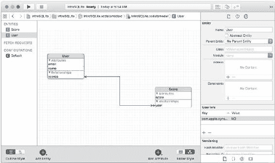

数据模型中的每个实体都将在运行时转换为一个类的实例。每个这样的实例都是 `NSManagedObject` 或其子类的实例。本节将介绍其基础知识。

本节中的示例使用了本书前面用过的两个实体：`User` 和 `Score`。图 10-1 在 Xcode Core Data 模型编辑器的图表视图中显示了它们。

**图 10-1.** 数据模型中的 User 和 Score 实体

### 创建新的 NSManagedObject 实例

有几种方法可以创建新的 Core Data 实例。最常见的方法之一可以在 Objective-C 的 Master-Detail Application 模板中找到。以下是其中使用的代码。它连接到 `MasterViewController` 视图中的一个 + 号按钮，但界面上的任何对象都可以连接到类似的操作。（这发生在 `MasterViewController.ViewDidLoad` 中。）

```
- (void)insertNewObject:(id)sender {
    NSManagedObjectContext *context = [self.fetchedResultsController managedObjectContext];
    NSEntityDescription *entity = [[self.fetchedResultsController fetchRequest] entity];
    NSManagedObject *newManagedObject = [NSEntityDescription insertNewObjectForEntityForName:[entity name] inManagedObjectContext:context];
    NSError *error = nil;
    if (![context save:&error]) {
        NSLog(@"未解决的错误 %@, %@", error, [error userInfo]);
        abort();
    }
}
```

无论何时创建新的 `NSManagedObject`，你都会使用这段代码（或非常类似的代码）。这段代码的开头只是定位托管对象上下文。它可能是你所使用类中的一个属性。如果不是，你可能需要添加一个局部属性，该属性在类实例化或实例从故事板加载时被创建（或传递）。

接下来，你创建一个实体描述，它是 `NSEntityDescription` 的子类。它封装了你在数据模型中管理的实体信息。在此处显示的代码中，实体描述（称为 `entity`）是从获取结果控制器中检索到的。

代码的第四行实际创建了一个名为 `newManagedObject` 的新实例。这行代码值得仔细研究。它实际上非常简单，但却是 Core Data 的核心。

```
NSManagedObject *newManagedObject = [NSEntityDescription insertNewObjectForEntityForName:[entity name] inManagedObjectContext:context];
```

你使用 `NSEntityDescription` 的类方法 `insertNewObjectForEntityForName` 来创建新对象。你需要要创建的新对象的名称，以及要将其放入的托管对象上下文。

如果你知道要创建的对象的名称，可以省略创建 `entity` 的那一行（此代码的第二行），并将这行代码改为按名称引用它。

```
NSManagedObject *newManagedObject = [NSEntityDescription insertNewObjectForEntityForName: "User" inManagedObjectContext:context];
```

显然，这段代码的可重用性较差，但它可以工作。

创建完这个新的托管对象后，你需要保存插入它的托管对象上下文：

```
NSError *error = nil;
if (![context save:&error]) {
    NSLog(@"未解决的错误 %@, %@", error, [error userInfo]);
    abort();
}
```

正如模板代码中的注释以及本书其他地方所述，在发布的应用程序中不要使用 `abort()`。而应捕获错误并记录它，让用户知道存在问题（如果用户可以解决的话），或者直接在代码中修复问题。

这就是创建一个新的托管对象所需的全部步骤。

如果你想为数据模型中为实体定义的属性设置值，你可以使用键值编码（key-value coding）来实现，就像下面这样的代码行：


# Core Data 中的 NSManagedObject 子类化

```objective-c
[newManagedObject setValue:@"New User" forKey:@"name"];
```
如果为属性设置的值无效，托管对象上下文的保存将会失败。特别是在 Xcode 数据模型编辑器中声明了验证规则时，这种情况更容易发生。在完善验证规则之前，您可能需要适当地处理错误。（当然，如果允许用户输入，可能会发生大量用户生成的错误。）

■ **提示** 如果您真的想深入了解 Core Data，请研究幕后必须生成的 SQLite 语法以实现此处展示的代码。它确实会被执行，但您无需手动输入。

## 使用 NSManagedObject 的子类

您可以创建 `NSManagedObject` 的子类，而不是直接使用 `NSManagedObject` 实例。如果您创建子类（过程将在下文描述），主要好处是，您可以使用如下代码为 `newManagedObject` 设置值，而不是像上一节那样使用键值编码 `setValue:forKey:`：

```objective-c
newManagedObject.name = "New User"
```

使用 Xcode Core Data 模型编辑器可以轻松创建 `NSManagedObject` 的新子类。以下是涉及的步骤。从打开的数据模型开始，如图 10-1 所示。（查看图表视图还是表格视图并不重要。）选择“编辑器” ➤ “创建 NSManagedObject 子类”以打开如图 10-2 所示的窗口。

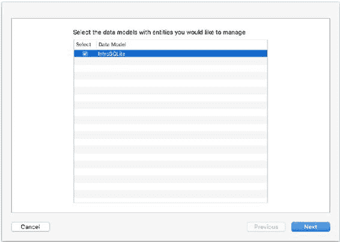

***图 10-2. 选择您的数据模型***

单击“下一步”后，选择要子类化的实体，如图 10-3 所示。默认情况下，在图表或表格视图中选中的实体（如图 10-1 所示）会在此处被选中。您不必为所有实体创建子类。有时，您会选择为更复杂的实体创建子类，而将其他实体保留为 `NSManagedObject` 实例。

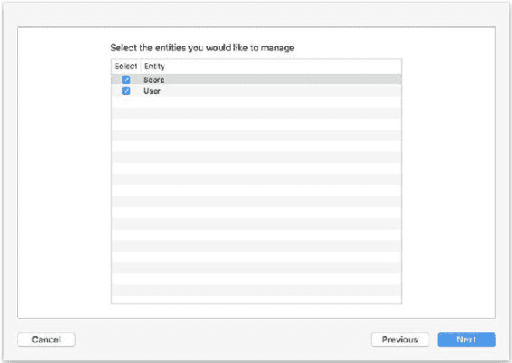

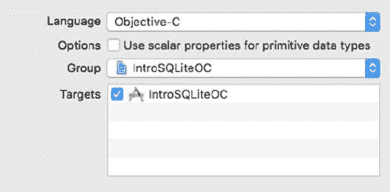

***图 10-3. 选择要子类化的实体***

单击“下一步”，选择保存新文件的位置，如图 10-4 所示。同时选择子类文件的编程语言。（您可以混合使用 Swift 和 Objective-C。）

***图 10-4. 选择保存子类文件的位置和所需语言***

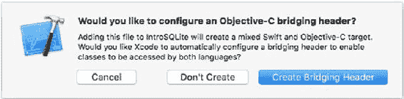

您应仔细检查组（用于导航器）和目标，但通常它们都是正确的。“使用标量属性”选项需要稍作解释。默认情况下，您的实体属性会使用原生 Cocoa 或 Cocoa Touch 类型转换为 Swift 或 Objective-C 属性。因此，`Double` 会被转换为 `NSNumber`。`NSNumber` 是比 `Double` 强大得多的构造（首先，它是一个类）。如果您大量使用此类属性，有时 `NSNumber` 的强大功能反而会带来不便。选择使用标量类型将使用基本的平台（非对象）类型，这可能会使您的代码更简单。

如果您的项目主要用 Swift 编写，而您选择用 Objective-C 创建子类，系统可能会询问您是否要在两种语言之间创建桥接头文件，如图 10-5 所示。是的，您需要这样做。

***图 10-5. 您可以选择创建桥接头文件***

在混合语言项目中，如果没有被询问关于桥接头文件，请不要担心。它只需要创建一次，因此第一次之后就不会再被询问。

桥接头文件会在您的项目构建设置中为您创建，如图 10-6 所示。您无需进行任何进一步操作。

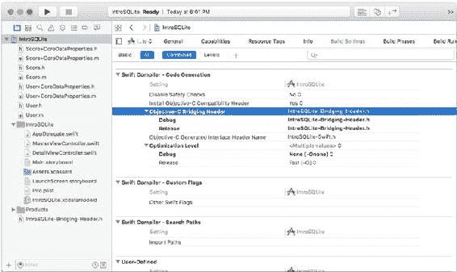

***图 10-6. 包含桥接头的构建设置***

如果您创建的是 Objective-C 子类，Xcode 将为您选择的每个实体创建两个文件。与 Swift 不同，它们将是头文件（.h）和实现文件（.m）。

第一个是接口文件，如下所示：

```objective-c
#import "User.h"

NS_ASSUME_NONNULL_BEGIN

@interface User (CoreDataProperties)

@property (nullable, nonatomic, retain) NSString *email;

@property (nullable, nonatomic, retain) NSString *name;

@property (nullable, nonatomic, retain) NSSet<NSManagedObject *> *scores;

@end

@interface User (CoreDataGeneratedAccessors)

- (void)addScoresObject:(NSManagedObject *)value;

- (void)removeScoresObject:(NSManagedObject *)value;

- (void)addScores:(NSSet<NSManagedObject *> *)values;

- (void)removeScores:(NSSet<NSManagedObject *> *)values;

@end

NS_ASSUME_NONNULL_END
```

这与 Swift 中的扩展文件不同。首先，它被 `NS_ASSUME_NONNULL_BEGIN` 和 `NS_ASSUME_NONNULL_END` 包裹。这些宏实现了 Objective-C 中的一个特性，该特性会反馈到 Swift 中。在带有这些括号的节内，所有指针都被假定为非空（`non-null`），因此在代码中依赖此假定是安全的。（从 Swift 使用时，这些属性将被转换为使用 `!` 的强制解包属性。）在 `.h` 文件内部，您将看到类别 `CoreDataProperties` 的属性声明，其中声明了 `User` 实体的两个属性（`email` 和 `name`）。关系（`scores`）以 `NSSet` 的形式呈现。请注意，由于此节被括号标记为非空，因此属性需要显式标记为可空（`nullable`）。

这看起来可能是自相矛盾的，但随着代码的增长，您会发现将可空性作为例外而非默认值，会使您的代码更简洁、更健壮。

配套的 `.m` 文件如下所示：

```objective-c
#import "User+CoreDataProperties.h"

@implementation User (CoreDataProperties)

@dynamic email;

@dynamic name;

@dynamic scores;

@end
```

`@dynamic` 表示承诺该属性将在运行时（当从持久存储中检索时）被填充。

这就是在 Objective-C 中创建 `NSManagedObject` 子类的全部过程。

■ **注意** 要了解如何使用您的子类，请参见第 12 章。

## 总结

本章向您展示了如何在 OS X 和 iOS 上使用 Objective-C（Cocoa 和 Cocoa Touch 的原始语言）来使用 SQLite/Core Data。

## 第 11 章：在 PHP 网站中使用简单数据库

本书是关于 SQLite 的入门介绍，但即使只是入门，SQLite（以及作为其关键组件的 SQL 本身）的基础知识也并非特别复杂。

确实，当您开始构建功能越来越多（以及越来越健壮的错误检查）的复杂应用时，您的代码会变得更长、更复杂。对许多人来说，关系数据库世界具有吸引力的地方在于，基本元素就是基础。您以各种组合方式使用和重用它们来构建越来越强大的应用。

《SQLite 入门指南》的最后两章为您提供了两个基于 SQLite 构建的应用。在本章中，您将看到如何在 SQLite 上构建一个基于 PHP 的应用，在第 12 章中，您将看到如何为 iOS 构建一个大致可比的应用。

# 第 11 章：将简单数据库用于 PHP 网站

本章选择的应用程序展示了人们在集成 PHP 和 SQLite 时希望使用的许多功能。具体来说，您将了解如何通过 PHP 代码和 SQLite 检索及输入数据，并了解如何处理 SQLite 数据库数据与 PHP 的集成，例如如何根据从数据库中检索的数据构建下拉菜单（HTML `SELECT` 元素）。

## 回顾数据库

本章的数据与之前本书中使用的相同关系型数据，但有一些您应该注意的微调。本节将对此进行描述。

该数据库由三个表组成，可用于跟踪人员的值。这里的命名暗示它们可能用于跟踪用户的分数，但这只是一种可能性。如果您重用这些表，可以随意重命名属性。此外，请注意，在绝大多数情况下，*属性（attribute）*、*属性（property）*、*列（column）* 和 *字段（field）* 可互换使用，指代数据库中存储的数据。*属性（attribute）* 常用于数据库，*属性（property）* 用于指代面向对象编程中的对象。*列（column）* 在关系表的上下文中使用，而 *字段（field）* 的用法可以追溯到纸质表格。

### 关于命名约定的说明

■ **注意**：本章相对于之前版本的最大变化是标准化了大小写：表名大写，属性、关系名不大写。当一个表包含多个条目（例如 `User` 表中的用户）时，表名大写且为单数。这些是苹果 `Core Data` 框架强制执行的样式，与许多人使用的最佳实践一致。"许多人"并不意味着"所有人"：特别是关于用户表是称为 `User` 还是 `Users`，有两种逻辑方法可取，并且有很多人强烈支持其中一种或另一种。对许多人来说，采用一种方法或另一种方法并不是真正的解决方案，因为我们并非在孤立的项目上工作。当客户 A 坚持使用单数名称而客户 B 坚持使用复数名称时，您通常会采取最实用的方法（使用每个客户想要的样式）。

#### User 表

第一个表 `User` 跟踪人员信息。在本演示中设置，它包含姓名和电子邮件地址。它为每一行使用一个唯一的 `rowid`。`rowid` 由 SQLite 生成。如表 11-1 所示。

**表 11-1. User 表**

| rowid | 名称 | 电子邮件 |
| :--- | :--- | :--- |
| 1 | Rex | rex@champlainarts.com |
| 2 | Anni | anni@champlainarts.com |
| 3 | Toby | toby@champlainarts.com |

#### Score 表

`Score` 表跟踪用户的值。它使用 `userid` 属性引用相关用户。这与 `User` 表中相关记录的 `rowid` 属性相匹配。

这样，您可以连接 `Score` 和 `User` 表，以获取个人的分数和姓名（见表 11-2）。

**表 11-2. Score 表**

| userid | 分数 |
| :--- | :--- |
| 1 | 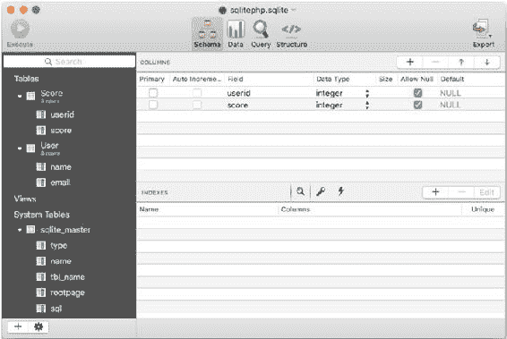 |
| 2 | 500 |
| 3 | 750 |

当 `Score` 和 `User` 表基于 `userid`/`rowid` 关系关联时，可以创建如表 11-3 所示的表。请注意，这是使用 `SELECT` 语句中的 `WHERE` 子句创建的：该表仅在运行时存在。

**表 11-3. 关联的用户和分数表**

| 名称 | 分数 |
| :--- | :--- |
| Rex | 1000 |
| Anni | 500 |
| Toby | 750 |

如果您想使用 SQLPro for SQLite 等工具构建表，当 `Score` 表高亮显示以便您可以看到其行（`userid` 和 `score`）时，数据库将如图 11-1 所示。默认情况下，此显示中不显示 `rowid`（SQLite 生成的主键）。另外，请注意表是按字母顺序呈现的。

**图 11-1. Score 表及其行**

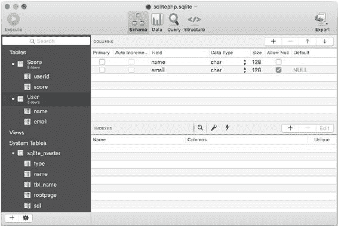


## 预览网站

在图 11-2 中，您可以看到 `User` 表及其行。

**图 11-2. `User` 表及其行**

本章展示如何构建一个 PHP 网站来查询和更新数据库。

这是一个简单的过程，但它涵盖了集成 PHP 和 SQLite 最常用的许多方面。首先，您可以看到一个简单的页面（其中包含的诊断信息将在本章中解释）。其核心是下拉列表，允许您选择一个用户。这是通过 HTML `SELECT` 元素实现的，下拉列表的值来自数据库。

图 11-3 显示了该应用程序的外观。它包含诊断消息。

（您将在本章后面看到代码，并且可以按照引言中的描述下载它。）

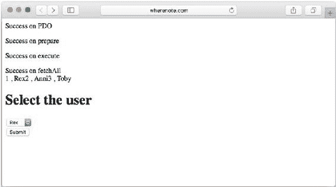

**图 11-3. 从数据库创建下拉列表**

在图 11-4 中，您此时可以看到表中的数据。（那些值为 99 的数据是用于调试的。您将提供自己的数据。）

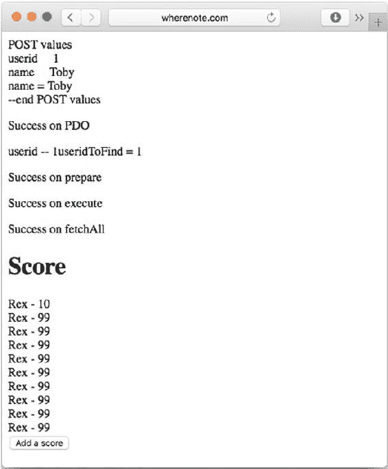

**图 11-4. 显示数据**

在图 11-4 中，您可以看到一个用于添加更多数据的按钮。图 11-5 显示了结果。（别担心，代码将在本章后面展示：在添加数据的确认背后，有很多事情在幕后进行。）

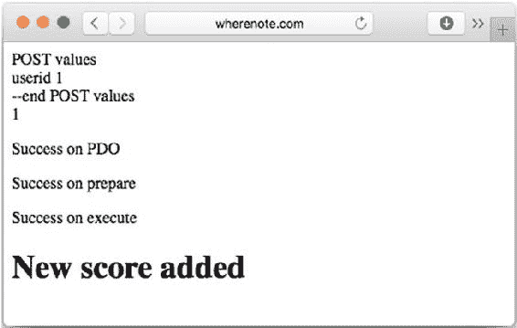

**图 11-5. 您可以添加新数据**

## 实现 PHP 网站

由于 Web 被设计为无状态结构，每个网页都是自包含的。

如今，有很多策略用于在网站中构建连续性，其中包括 PHP 会话、`cookie`，或者将数据从一个 PHP 页面传递到另一个页面（通常通过 `POST` 请求），但基本上每个页面仍然是一个无状态实体。这意味着当您访问一个页面（即，当您运行生成该页面的 PHP 代码时），页面是根据 PHP 文件中可能从数据库检索的数据生成的。

在典型的模式中，用户单击按钮或使用另一个界面元素来加载来自 PHP 代码的新页面。为了实现这一点，关键数据从第一页传递到第二页，或者，如前所述，相关数据可能被缓存在 `cookie` 中或在参数中传递。

> **注意**：这里使用的示例名为 `phpsql`。各个文件编号为 1、2 和 3。如果您在移动设备上阅读，根据您使用的字体，文件名可能看起来不像是 `phpsql` 后跟一个数字。在某些字体中，它可能看起来像是 `phpsq` 后跟一个两位数（字母 `l` 有时看起来像数字 1）。

因此，本示例中使用了三个 PHP 文件。

*   `phpsql1.php` 构建了如图 11-3 所示的页面。它使用 SQLite 数据库调用来检索下拉菜单的值。当您单击“提交”时，关键值（在本例中是所选用户）会传递到下一页。
*   `phpsql2.php` 构建了如图 11-4 所示的页面。它接收所选用户，然后查询数据库以获取该用户的值。正如您将看到的，这个查询连接了表 11-1 (`User`) 和表 11-2 (`Score`)。名字来自 `User`，分数来自 `Score`。这个连接是通过匹配 `User` 表中的 `rowid` 和 `Score` 表中的 `userid` 来处理的（您将在本章后面看到这一点）。如果单击“添加分数”按钮，控制权将传递到下一页。
*   `phpsql3.php` 为图 11-3 中选择的用户添加数据。为此，`phpsql2.php` 将所选的 `userid`/`rowid` 传递给 `phpsql3.php`。因为 `User` 和 `Score` 表...


# 在 PHP 网站中使用简单数据库

## 查看基础 PHP/SQLite 结构

所有 PHP/SQLite 文件都将使用相同的基础结构。根据你的偏好，尤其是在处理需要传递的 HTML 内容时，你可能会使用不同的 PHP 语法（选择是停留在 PHP 世界中使用 `echo`，还是暂时离开 PHP 代码段，仅使用 HTML，直到需要切回 PHP）。许多人两种风格都会使用。

以下是基础结构。（显然，你通常需要为 `HEAD` 元素和文件的其他类似部分添加自己的代码。）此文件中保留了诊断代码。在确定控制流正确之前，保留它们是最简单的。（另外，请记住，`or die` 语法是健壮错误捕获和良好用户界面的占位符。）

通过在 `User` 表的 `rowid` 和 `Score` 表的 `userid` 上进行连接，它们具有相同的值，因此传递哪个值给 `phpsql3.php` 并不重要。每个文件都将在以下部分中描述。你将首先看到完整代码，然后是对关键组件的讨论。

```php
<html>
<head>
</head>
<body>
<?php
$db = 'sqlite:sqlitephp.sqlite';
// 这应该自定义为你的数据库名称。sqlite: 是 PHP
// 数据对象（PDO）语法的一部分。它必须位于文件名之前。
$sqlite = new PDO($db) or die ("<h1>无法打开数据库</h1>");
echo "<p>PDO 连接成功</p>";
$query = $sqlite->prepare; // 在此处插入你的查询
// 这应该自定义为你想运行的查询。在本章末尾，你将看到另一种可以使用的模式。除了 prepare 和 execute，你可以直接使用 PDO query 语句执行单个查询。
echo "<p>Prepare 准备成功</p>";
$query->execute() or die ("无法执行");
echo "<p>Execute 执行成功</p>";
$result = $query->fetchAll() or die ("无法 fetchAll");
echo "fetchAll 获取成功<br />"; // 用于调试
// 记住，fetchAll 获取的是查询的所有数据——而不是表中的所有数据。
// 对结果进行处理。foreach 只是一个例子。
foreach ($result as $row) {
    echo $row['rowid'], " , ", $row['name'];
}
// 这部分代码绝对需要为每个用途进行自定义。这里你看到的只是一个重复显示已检索数据的诊断信息。在此处使用类似这样的代码通常很有用。
?>
<h1>选择用户</h1>
<form method="post" action="phpsql2.php">
// 使用链中下一个 PHP 文件（用户的下一个页面）的名称来自定义此处。
<?php
// 这里是你整合 PHP 和 SQLite 的地方——按你的意愿自定义。
echo '<input type="submit" value="提交">';
echo '</form>';
// 如果你使用表单，请确保正确结束它并添加提交按钮。
// 注意，你可以如这里所示，在 HTML 中开始表单并在 PHP 中完成它。
?>
</body>
</html>
```

### 构建下拉选择列表 (`phpsql1.php`)

以下是 `phpsqlite.php` 的完整列表。注释和说明穿插其中，但请记住参考前面的部分“查看基础 PHP/SQLite 结构”以获取一般细节。此代码构建了如图 11-3 所示的页面。

```php
<html>
<head>
</head>
<body>
<?php
$db = 'sqlite:sqlitephp.sqlite';
$sqlite = new PDO($db) or die ("<h1>无法打开数据库</h1>");
echo "<p>PDO 连接成功</p>";
$query = $sqlite->prepare ("select name, rowid from User;") or die ("<h1>无法准备查询</h1>");
// 查询将是：SELECT name, rowid FROM User;
echo "<p>Prepare 准备成功</p>";
$query->execute() or die ("无法执行");
echo "<p>Execute 执行成功</p>";
$result = $query->fetchAll() or die ("无法 fetchAll");
echo "fetchAll 获取成功<br />";
?>
<h1>选择用户</h1>
<form method="post" action="phpsql2.php">
<?php
echo "<select name='userid'>";
foreach ($result as $row) {
    echo "<option value = ".$row['rowid'].">".$row['name']."</option>";
}
echo '<input type = "hidden" name = "name" value = '.$row["name"].'>';
// 隐藏字段非常重要：它是连接到下一个 PHP 文件 (`phpsql2.php`) 的链接。
// `name` 的值将从该文件开头的 `POST` 变量中检索。
// `userid` 以 `userid` 作为名称从 `SELECT` 元素传入，而 `username`（用于下一个页面的标题）在此处传入。`SELECT` 对用户可见，但这个隐藏字段不可见。
echo '</select> <br >';
echo '<input type="submit" value="提交">';
echo '</form>';
// `SELECT` 元素的名称是 `userid`。当下一个文件解包 `POST` 值时，它将是下拉菜单中所选项的键。你可能想自定义提交按钮。
?>
</body>
</html>
```

## 显示所选数据 (`phpsql2.php`)

这是构建如图 11-4 所示页面的代码。

```php
<html>
<head>
</head>
<body>
<?php
print "POST 值<br/>";
foreach ($_POST as $key => $value) {
    echo "$key &nbsp;&nbsp;&nbsp $value <br />";
}
print "--POST 值结束<br/>";
$name = $_POST['name'];
print "name = $name <br/>";
// 此代码对调试很有用：它打印出所有的 `POST` 键和值。当你对代码满意后，请将其移除。设置局部变量 `$name` 并`不是`用于调试。随后的 print 语句是调试用的，但你需要从前一个页面的隐藏字段中获取 `username`，以便在此页面的标题中显示它。你可以在需要时从 `POST` 变量中提取它，但许多人更喜欢在文件开头就加载 `POST` 变量。
$db = 'sqlite:sqlitephp.sqlite';
$sqlite = new PDO($db) or die ("<h1>无法打开数据库</h1>");
echo "<p>PDO 连接成功</p>";
echo "userid ".$_POST["userid"];
$useridToFind = $_POST['userid'];
echo "useridToFind = $useridToFind";
$query = $sqlite->prepare ("select name, score from Score s, User u where s.userid = u.rowid and $useridToFind = s.userid ORDER BY Score;") or die ("<h1>无法准备查询</h1>");
echo "<p>Prepare 准备成功</p>";
$query->execute() or die ("无法执行");
echo "<p>Execute 执行成功</p>";
$result = $query->fetchAll() or die ("无法 fetchAll");
echo "fetchAll 获取成功<br />"; // 用于调试
foreach ($result as $row) {
    echo "<h1>".$row['name']." 的分数</h1>";
    $userName = $row['name'];
    echo $row['name'], " - ", $row['score'];
}
echo '<form method="post" action="phpsql3.php">';
echo "<input type='hidden' name='userid' value=$useridToFind>";
// 这是另一个隐藏字段——这次是将 `userid` 向前传递给下一个 PHP 文件。
echo '<input type="submit" value="添加分数">';
echo '</form>';
?>
</body>
</html>
```

### 添加新数据 (`phpsql3.php`)

现在是向文件添加新数据的时候了。这涉及到将基本的 SQLite `INSERT` 语法与你之前在 PHP 页面中使用的相同类型的代码结合起来。你应该开始习惯这一点：使用 PHP 和 SQLite 的模式是不断重复的。

以下是 `phpsql3.php` 的代码：

```php
<html>
<head>
</head>
<body>
<?php
print "POST 值<br/>";
foreach ($_POST as $key => $value) {
    echo "$key $value <br />";
}
print "--POST 值结束<br/>";
$userid = $_POST["userid"];
print $userid;
// 这是相同的代码，提供诊断功能，显示所有 `POST` 变量及其键。另外，请注意 `$userid` 在此设置，以便在本文件后面使用。它是从前一个文件传来的隐藏字段，被复制到一个局部变量中。
$db = 'sqlite:sqlitephp.sqlite';
$sqlite = new PDO($db) or die ("<h1>无法打开数据库</h1>");
echo "<p>PDO 连接成功</p>";
$query = $sqlite->prepare ("INSERT INTO Score ('score', 'userid') VALUES (99, $userid);") or die ("<h1>无法准备查询</h1>");
echo "<p>Prepare 准备成功</p>";
```


这是代码的核心部分。注意，`99` 用于调试。在此文件的某处，你会放置你的用户界面代码以提供实际值。你可以在这里实现，也可以在前面的文件（`phpsql2.php`）中提供用户界面，并与“添加分数”按钮结合使用。它可以弹出一个对话框，或者从当前游戏中获取一个值，或者任何对你和用户来说有意义的实现方式。如果你从前一个文件获取值，请将其存储在隐藏字段中，并像其他地方处理 `userid` 和 `name` 那样传递过来。

`$query->execute()` 或 die (`"无法执行"`);

`echo "<p>执行成功</p>";`

`//$result = $query->fetchAll()` 或 die (`"无法获取所有结果"`);

`//echo "获取所有结果成功<br />";`

# 第 11 章 ■ 在 PHP 网站中使用简单数据库

这段代码被注释掉了，以提醒你它用于检索数据的情况，而这里*不需要*它。`execute` 会成功或失败，但没有单独的结果集。

`?>`

`<h1>已添加新分数</h1>`

`</body>`

`</html>`

## 在 PHP 和 PDO 中使用 Try/Catch 块

本文件中使用的成功测试采用了传统的 PHP 和 PDO 编码方式。你可以使用更现代的 `try`/`catch` 块编码。（本章前面用作占位符的 `or die` 代码完全可以转换为此风格。）以下是通用模式：

```php
try {
    $sqlite->query("DELETE FROM Score WHERE rowid = $rowIDToDelete");
} catch (PDOException $e) {
    echo $e->getMessage();
}
```

这段代码假设“删除”按钮在一个隐藏字段中传递了要删除分数的 `rowid`。请记住，除非你选择提供主键，否则 `rowid` 由 SQLite 提供。大多数情况下，你会发现使用默认的 SQLite `rowid` 对于这类需要删除特定行的场景很有用。

另外请注意，对于单个查询，这种语法可能比 `prepare` 和 `execute` 更简单。当你需要重用一个查询时，通常 `prepare` 和 `execute` 更好。

## 总结

本章提供了一个在 PHP 中使用 SQLite 数据库的简单模型。这个过程很简单。

1.  让用户选择要查看的数据。
2.  显示请求的数据。
3.  允许用户添加新数据。

最后一步并非在所有情况下都需要，但另一个步骤经常需要：允许用户删除第 2 步中显示的请求数据。你会在该页面添加一个“删除”按钮。将其放在表单内，并将控制权传递给执行删除操作的另一个页面。

删除操作看起来会非常类似于 `phpsql3.php`，只是你将使用 `DELETE` 而不是 `INSERT`。（前一节“在 PHP 和 PDO 中使用 Try/Catch 块”中有一个 `DELETE` 语句的例子。）

# 第 12 章 ■ 在核心数据/iOS 应用程序中使用简单数据库

本章将向你展示如何使用核心数据构建一个 iOS 应用程序，以重新实现第 11 章中展示的 PHP 页面。从核心数据的角度来看，此应用程序的基础知识同样适用于 OS X 和 iOS，但主从应用程序模板是专门为利用 iOS 的特性而设计的。OS X 有一个单独的特性，即绑定，它也能非常方便地与核心数据协同工作。然而，它与 iOS 上使用的基于表格的界面不同。

现在，是时候继续前进了，使用核心数据/iOS 来实现第 11 章中的 PHP 代码。

## 故事仍在继续…

第 8 章提供了使用 Xcode 核心数据模型编辑器的指南。你看到了从 Xcode 附带的主从应用程序模板创建新项目所涉及的步骤，然后将其转换为更复杂的数据结构。在本章末尾，你有了两个实体和连接它们的两种关系。图 12-1 显示了在核心数据模型编辑器中，第 8 章结束时的数据库情况。（注意，在边栏中同时选择了 `Score` 和 `User`，因此编辑器中显示的属性和关系是这两个实体的并集——用数据库术语来说，就是使用的属性和关系的并集。）

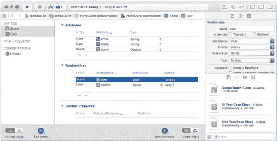

`图 12-1. 从第 9 章的数据库开始`

如果你想跟随本章操作，你可以复制该数据库，也可以下载本章的示例文件。（对于本章，已创建了一个名为 `Scores` 的新项目，但项目名称完全由你决定。）核心数据模型中的两个实体 `User` 和 `Score` 与你一直使用的表相同。核心数据的一个重要部分是，它会为你管理主键和外键。SQLite 确实会为你创建一个主键（`rowid`），除非你明确表示不想使用它。使用 SQLite 的核心数据也会这样做，但这是在幕后发生的。如果你用实用工具打开一个核心数据的 SQLite 文件，你会看到数据库中的这些键。

> **警告** 你可以查看 SQLite 数据库，但请记住核心数据在管理它们。不要对它们进行修改。在最好的情况下，你会立即破坏你的核心数据项目。在最坏的情况下，你会制造一个定时炸弹，它会在你（和你的用户）最意想不到、最没有时间处理的时候爆炸。如果你已经有一个 SQLite 数据库并想将其导入核心数据，最简单的方法是导出数据（可能导出为中性格式，如 CSV——或逗号分隔值），然后将其导入到你的核心数据应用程序中。

## 为 Core Data 调整数据模型和模板

需要修改数据模型，使其不再依赖显式键（核心数据在后台使用它们），并且需要对现有代码进行一些微调，使其能正常运行。

### 摆脱键并修订数据模型

第 8 章中使用的数据模型旨在匹配本书中各种项目使用的基础数据。在本章中，可以修改该数据模型，以摆脱核心数据不需要的一些额外负担。具体来说，你可以进行的主要更改是移除主键。核心数据管理自己的主键，因此没有理由重复这个。

“但是等等！”你可能会想。“没有主键，我如何将分数与用户关联起来？”

当精通数据库的开发人员初次使用核心数据时，这个问题非常常见。多年来（对许多人来说是几十年），我们一直依赖那些主键。摆脱它们很困难——这几乎是一种生理上的不适。重要的是要记住，你的目标是关联两个实体——在这里，是将特定分数与特定用户关联起来。一边的主键和另一边的外键使得这成为可能，但它们是一个实现问题：你想做的是将特定分数与特定用户关联起来。

来自第 8 章的数据模型（如图 12-1 所示）省略了这些键——包括主键和外键。缺少这些键在第 8 章中没有造成困难，现在也没有问题。到目前为止使用的数据库表视图被设计为在各种平台上实现，但对于构建核心数据应用程序，可以修改它们以省略不再需要的键。

将 `timeStamp` 改为 `name`


# 使用 Core Data/iOS 应用的简单数据库

## 修改数据模型

如果你修改了第 9 章（`http://dx.doi.org/10.1007/978-1-4842-1766-5_9`）的代码或 Xcode Master-Detail Application 模板，你很可能已将 `Event` 实体改为 `User`，并将 `timeStamp` 日期属性替换为 `name` 字符串属性。不一定非要按此顺序操作，但这可能是你已完成的步骤。接着，你可能创建了一个新实体 `Score`。

另一种可能是将 `Event` 改为 `Score` 并创建 `User` 作为新实体。还有一种情况是删除 `Event`，并为 `User` 和 `Score` 都创建新实体。无论哪种方式，你最终应该得到如图 12-1 所示的数据模型。

使用 Xcode 中的查找导航器在项目中搜索 `timeStamp`。如果你已经更改了数据模型，唯一能找到的引用将是 `MasterViewController` 的 `insertNewObject` 函数中的初始化代码。如果你已将 `timeStamp` 改为 `name`，你将得到以下代码行：

```swift
newManagedObject.setValue(NSDate(), forKey: "name")
```
（这段代码最初是 `forKey: "timeStamp"`）。

新属性是字符串，而不是日期。你可以很容易地解决这个问题：只需使用大多数 `NSObject` 实例（及其子类）的 `description` 函数。该函数返回实例的字符串值。因此，将该行修改为：

```swift
newManagedObject.setValue(NSDate().description, forKey: "name")
```
它仍然会设置当前日期，但这次它将作为字符串（`description`）而非 `NSDate` 实例使用。

### 在你的设备或模拟器上创建新数据库

从模拟器或你的设备上移除该应用。你会收到一个警告，提示将删除其所有数据：这正是你想要做的。你已经更改了数据模型，用先前数据模型创建的数据将无法工作。（Core Data 中有迁移例程，但它们超出了 *Introducing SQLite* 的范围。）

### 向应用添加 Score 表和界面

第一步是查看你当前拥有的内容。然后你可以继续添加 `Score` 详细信息。

#### 确保你可以在 Master View Controller 中用 `+` 添加新用户

如果你在点击主视图控制器左上角的 `+` 时没有看到时间戳，你可能已将 `Event` 实体替换为 `Score`。控制使用 `+` 创建哪个实体的代码位于 `MasterViewController.swift` 的 `fetchedResultController` 中。

以下是相关代码行：

```swift
let entity = NSEntityDescription.entityForName
("User", inManagedObjectContext: self.managedObjectContext!)
```
在 Xcode 模板中，它最初是：

```swift
let entity = NSEntityDescription.entityForName
("Event", inManagedObjectContext: self.managedObjectContext!)
```
经过你的修订，你可能最终得到：

```swift
let entity = NSEntityDescription.entityForName
("Score", inManagedObjectContext: self.managedObjectContext!)
```
你需要创建 `User` 实体，所以确保在必要时修订了代码。

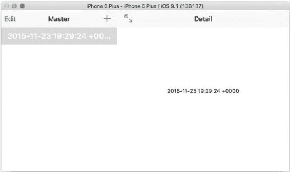

#### 使用详细视图

当你现在运行应用时，你将能够向用户列表（原事件列表，但你只是更改了名称）添加新项目。当你添加一个新用户时，你可以点击/轻触它以在详细视图控制器中查看其详细信息，如图 12-2 所示。

**图 12-2.** 在详细视图（右）中查看详细信息，主视图在左侧

确保你所看到的内容与图 12-2（至少大致匹配——这是一台横向的 iPhone 6 Plus）相符。一旦完成，你就可以继续了。

#### 为 Score 使用详细视图

此处的目标是用表控制器替换现有的详细视图，该控制器显示给定用户的所有分数，并让你能够添加新分数。图 12-3 展示了你的目标。

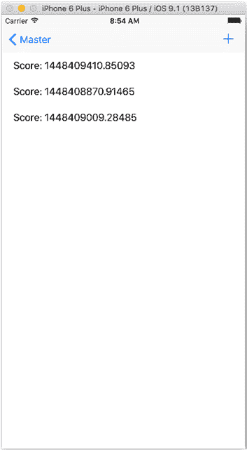


# 第 12 章 ■ 在 Core Data/iOS 应用中使用简单数据库

***图 12-3.** 用于显示分数的基于表格的详情视图*

■ **注意** 分数值是 Unix 时间戳（自 1970 年 1 月 1 日以来的秒数）。

Cocoa 和 Cocoa Touch 中的 `NSDate` 可以方便地提供这些值，它们也为测试代码提供了不同的数值。`MasterViewController` 继续使用显示为时间戳的值。

这将包含三个步骤：

1.  为 `User` 和 `Score` 创建 `NSObject` 的子类。（这已在第 9 章描述。）
2.  修改 `MasterViewController` 以使用新的子类。
3.  在故事板中用基于表视图控制器的详情视图控制器替换现有的详情视图控制器。
4.  修改 `DetailViewController` 中的代码，使其与基于表视图控制器的详情视图控制器配合工作。
5.  修改 `MasterViewController`，将对当前 `User` 的引用传递给新的详情视图控制器，以便可以显示其分数。

第一步之后，这些步骤可以按任何顺序完成。

## 使用 NSManagedObject 子类

`MasterViewController` 中的代码按照前一节的描述创建了一个新的 `User` 实体。一旦有了可用的子类，你就应该使用它们。在 `ManagedObjectController` 的 `insertNewObject` 方法中，找到以下代码行：

```swift
let newObject = NSEntityDescription.insertNewObjectForEntityForName
(entity.name!, inManagedObjectContext: context)
```

将其改为：

```swift
let newUser = NSEntityDescription.insertNewObjectForEntityForName
(entity.name!, inManagedObjectContext: context) as! User
```

在接下来的一行中，使用子类而不是键值编码。将

```swift
newManagedObject.setValue(NSDate().description, forKey: "name")
```

替换为使用新子类的以下代码行：

```swift
newUser.name = NSDate().description
```

### 为 DetailViewController 使用表视图控制器

最简单的方法是从故事板中移除当前的 `DetailViewController`。（如图 12-4 所示。）

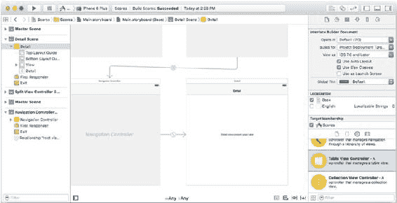

***图 12-4.** 在故事板中找到详情视图控制器并将其移除*

然后，从窗口右侧的对象库中拖动一个表视图控制器到故事板中。将其放置在原详情视图控制器的位置，并从导航控制器按住 Control 键拖动到新的表视图控制器。对于关系，选择 *root view controller*（当你松开 Control 键拖动时，系统会立即提示你选择）。

### 修改 DetailViewController 的代码

`DetailViewController` 需要进行一些更改。

#### 使用子类

你需要修改代码，使 `DetailViewController` 成为 `UITableViewController` 的子类，而不是 `UIViewController`。

将文件顶部的这一行从

```swift
class DetailViewController: UIViewController {
```

改为：

```swift
class DetailViewController: UITableViewController {
```

同时修改故事板，使新的 `DetailViewController` 的类型是 `DetailViewController`（它可能还不是）。

从 `DetailViewController` 中移除对标签的引用（它被称为 `DetailDescriptionLabel`）。

有一些清理代码的整理工作要做。将 `detail` 的变量声明改为 `detailUser`（在文件顶部）。

```swift
var detailUser: User? {
    didSet {
        // 更新视图。
        self.configureView()
    }
}
```

### 修改 configureCell 以使用子类

以下是 `configureCell` 现在的样子，因为它使用了 `Score` 子类。请注意，这里有一些转换过程：给定用户（一种关系）的 `NSSet` 形式的分数集被转换为数组（以便可以找到表格中第 n 个元素）。然后，检查第 n 个元素（它是一个 `Score`）以找到其分数值（`Score.score`）。

```swift
func configureCell(cell: UITableViewCell, atIndexPath indexPath: NSIndexPath) {
```


# 第 12 章 ■ 在 Core Data/iOS 应用中使用简单数据库

```swift
if let scores = detailUser?.scores {
    let scoresArray = scores.allObjects as NSArray
    let selectedRowArrayElement = scoresArray[indexPath.row] as! Score
    let scoreForSelectedRow = selectedRowArrayElement.score
    cell.textLabel!.text = "Score: " + scoreForSelectedRow.description
}
```

### 修改 MasterViewController 以将用户传递给 DetailViewController

默认情况下，在主从细节视图列表中选择的对象会被传递给 `DetailViewController` 中的 `DetailItem`。该变量被声明为 `AnyObject?`。你需要将其更改为你已创建的新 `detailUser` 变量。在 `prepareForSegue` 方法中，将 `controller.detailItem = object` 这一行修改为以下内容：

```swift
controller.detailUser = (object as! User)
```

现在你需要连接表格视图并支持相关协议。这段代码实际上在 `MasterViewController` 中，因为你在那里需要管理一个表格视图控制器。你只需将其复制到 `DetailViewController` 即可。

并且你需要在 `DetailViewController` 的顶部导入 `CoreData`。

```swift
import CoreData
```

## 总结

现在你已经掌握了一个应用的基础知识，该应用使用了内置的 SQLite 数据库、Xcode Core Data 模型编辑器和 Core Data 框架来操作数据库，并利用 iOS 的 Cocoa Touch 框架将所有部分整合在一起。

通过 PHP 和 Core Data 的实践以及对 Android 的概述，你可以看到存在一些语言（PHP 等）以及框架（Cocoa Touch 和 Cocoa）和应用程序编程接口（API）（Android），它们都构建在 SQLite 之上。SQLite 的 SQL 语法被暴露的程度各不相同，从很少（Core Data）到大量（PHP），以及各种中间路径（如 Android）。

重要的是你要理解其中的原理和功能。

同时请记住，在构建任何数据库驱动的应用时，你能放入数据库的功能越多，你需要编写的代码就越少。充分利用验证选项、`GROUP BY` 子句以及其他你能找到的一切功能。你编写的代码越少，所花费的时间（编写和调试！）就越少。

## 索引

### **A, B**

- 和模板，136
- `timeStamp` 命名，137

#### AppDelegate

##### iOS

- `configureCell`，143
- 文档目录，104
- `detailUser`，143
- 头文件创建，104
- 详细视图，139
- 托管对象模型，105–106
- `Master View Controller`，138, 143
- 持久化存储

##### NSManagedObject 子类

- `Table View Controller`，141
- 合成属性，104
- 使用子类，142

##### OS X

- Core Data 栈
- `applicationDocuments`

##### AppDelegate, iOS

- 目录，107 ( *参见* `AppDelegate, iOS`)
- `managedObjectContext`，109

##### AppDelegate, OS X

- `managedObjectModel`，108 ( *参见* `AppDelegate, OS X`)
- `persistentStoreCoordinator`，108

- 方括号，99–100
- 自动引用计数 (ARC)，101
- 链式语句，100
- 获取数据，110

### **C, D, E**

- 函数或方法，99
- 头文件和主体，100

#### Core Data

- 托管对象上下文，98
- 属性，66, 68–69
- 托管对象模型，98
- 数据模型，64
- 基于消息的语言，99
- 数据模型检查器，67
- 方法声明，101
- 获取属性，66


## 索引

### F, G, H

`test.php`，47

`用户与分数表`，49

`foreach 循环`，56

`用户表`，48

`外键 (FK)`，35

### PHP 网站

### 数据库

### I, J, K, L, M

`添加数据`，127

`属性`，121

##### iOS

`列`，121

`创建文档目录`，78

`显示数据`，126

`托管对象上下文`，80

`属性`，121

`managedObjectModel 代码`，78

`查询与更新`，124

与 OS X ( *参见* `Core Data`)

`分数与用户表`，123

`持久化存储协调器`，79

`分数表`，122

`用户表`，122

### N

### 实现

`添加新数据`，133

`NSManagedObject`

`下拉列表`，130

`构建设置`，94

`POST 变量`，131

`选择桥接头文件`，94

`结构`，128

`选择实体`，92

`尝试/捕获块`，134

`选择语言`，93

`创建子类`，90

`数据模型`，88

`newManagedObject`，89

### O

### Objective-C, ARC, 101

### 有组织的数据, 1

##### OS X

`documentsdirectory`，81

`managedObjectContext`，84

`managedObjectModel`，82

`persistentStoreCoordinator`，82

### P, Q, R

`PHP 与 Android 应用`，61

`删除数据`，27

`PHP 数据对象 (PDO)`，42，61

`图形化 SQLite 编辑器`

### PHP/SQLite

`添加列`，22

`创建数据库`，48

`修改表`，24

`创建 PDO 对象`，51

`创建新表`，21

`执行方法`，52

`数据类型`，22

`获取方法`，52

`sqlite_master 表`，20

`预处理方法`，52

`SQL 结构`，24

`$result`，53

`系统表`，20

`$row`，53

`表`，19

`分数表`，48

`视图`，20

`插入数据`，24

`mydatabase`，17

`打开现有数据库`，17

`查询结构`

`检索数据`，26

`列名`，6

`语法`，18

`数据源`，6

`选择数据`，6

`WHERE 子句`，7

`静态值`

`APIs`，57

`db.insert 方法`，59

`NoteBookProvider.java`，57

`NotePad 类`，57

### SQLite/Core Data, Swift

`连接表`，37

`AppDelegate`，77

`分数表`，31

iOS ( *参见* `iOS`)

`SELECT 语句`，32

OS X ( *参见* `OS X`)

`主键`，33

`获取请求`，84

`UPDATE 命令`，34

`托管对象上下文`，76

`使用外键`，34

`托管对象模型`，75

`用户表`，30

### 主从细节

`SQLite 语句`，39

`应用程序`，77

`数据分组`，41

### 持久化存储

`数据排序`，40

`协调器`，75

`PDO`，42

`检索数据`，76

`测试数据`，40

`保存 iOS 数据`，85

`保存 OS X 数据`，86

`结构化数据`，1

### SQLite, 数据库

`属性`，2

`基本概念`，4

`实现`，3

`Xcode 核心数据模型编辑器`，63

### S, T, U, V, W

`分数表`，31

`自连接`，29

`SQLite`，9

`定义`，10

`多用户`，11

`*自包含*`

`代码`，12

`数据`，13

`单用户`，11

`事务与`

`符合 ACID`，13–14

### Sqlite3

`创建数据库`，16

`删除数据库`，17

`删除数据`，27

`图形化 SQLite 编辑器`

`创建数据库`，48

`创建 PDO 对象`，51

`创建新表`，21

`执行方法`，52

`获取方法`，52

`预处理方法`，52

`服务器端`

`编程语言`，46

`查询结构`

`检索数据`，26

`选择数据`，6

`SQLite, Android/Java`

`框架/语言`，55

`继承 SQLiteOpenHelper`，58

`关系模型`，4

`关系表`，5

`结构化且有组织`，2

`SQLite, Objective-C.`

`NoteBookProvider.java`，57

*参见* `Core Data 栈`

`NotePad 类`，57

`Sqlite, 关系模型`

`分数表`，31

`SELECT 语句`，32

`主键`，33

`使用外键`，34

`SQLite 语句`，39

`数据分组`，41

`数据排序`，40

`PDO`，42

`测试数据`，40

`存储与检索数据`，15

`结构化数据`，1

`属性`，2

### X, Y, Z

`Xcode 核心数据模型编辑器`，63

## NSManagedObject

`框架`，62

`桥接头文件`，118–119

`关系数据库`，69

`选择实体`，116–117

`创建`，70

`创建实例`，113

`图形视图`，71

`创建子类`，115

`规则`，72

`图形视图`，113

`表格视图`，72

`持久化存储协调器`，98

`用户到分数`，71

`带引号的字符串`，99

`关系`，66

`检索数据`，99

## 核心数据/iOS

`保存，iOS`，111

### 数据模型

`保存，OS X`，112

`摆脱键`，137

`分号`，100

`模拟器`，138

`视图控制器`，102

### 关系模型

`连接表`，37

`获取请求`，84

`托管对象上下文`，76

`托管对象模型`，75

`持久化存储协调器`，75

`检索数据`，76

`保存 iOS 数据`，85

`保存 OS X 数据`，86


# 目录概览
*   目录
*   关于作者
*   关于技术审阅者
*   致谢
*   前言

## 第 1 章：快速掌握数据库与 SQLite
### 超越“大”的概念
#### 数据库是结构化的
## 数据库是智能的
##### 编写代码仅仅是开始
##### 你会`Python`吗？懂`Scala`吗？
### 关系数据库和 SQL 来救场
### 深入了解关系表和查询
### 基本查询结构
#### SQL 操作：`SELECT`
#### 要选择的 SQL 数据：列名列表
#### SQL 数据源：表名
#### SQL 条件：`WHERE`
#### 探索其他查询选项

## 第 2 章：理解 SQLite 是什么
### 正确看待数据库
## 定义 SQLite
#### SQLite 是为单用户设计的
##### 单用户不等于单线程
##### 在多用户场景下使用 SQLite
### SQLite 是自包含的
##### 自包含的代码
##### 自包含的数据
### SQLite 支持事务并符合 ACID 原则

## 第 3 章：使用 SQLite 基础：存储和检索数据
### 使用`sqlite3`
#### 运行`sqlite3`并让它创建一个新数据库
### 创建并命名一个新的`sqlite3`数据库
### 删除数据库
#### 运行`sqlite3`并打开一个现有数据库
### 尝试 SQLite 语法
## 使用图形化 SQLite 编辑器探索你的`sqlite3`数据库
## 创建表
### 使用图形化 SQLite 编辑器
### 创建表列
#### 使用`SQLite3`
### 将数据插入表中
### 使用图形用户界面
#### 使用`SQLite3`
## 检索数据
### 使用图形用户界面
### 使用`sqlite3`
## 删除数据
## 本章小结

## 第 4 章：使用关系模型和 SQLite
## 构建用户表
## 构建分数表
## 关联表
#### 在`SELECT`语句中使用别名标识多个表
### 使用`rowid`主键
### 在一个表中更改名称
### 使用外键
## 连接表
## 本章小结

## 第 5 章：使用 SQLite 特性——你能用`SELECT`语句做什么
## 查看测试数据
#### 数据排序使其更易用
#### 数据分组可以整合数据
## 在查询中使用变量
## 本章小结

## 第 6 章：在 PHP 中使用 SQLite
### 将 PHP 与 SQLite 结合：基础
#### 验证你的环境中的 PHP
### 准备 SQLite 数据库
## 连接到你的 SQLite 数据库
#### 1. 创建一个新的`PDO`对象
### 2. 创建并准备查询
### 3. 执行查询
### 4. 获取结果
### 5. 使用结果
## 本章小结

## 第 7 章：在 Android/Java 中使用 SQLite
## 将 SQLite 与任何操作系统、框架或语言集成
### 使用 Android 和 SQLite
### 使用静态值
##### 静态值可能存在于 API 中
##### 静态值可能存在于导入的文件中。
##### 静态值可能存在于主文件中
#### 扩展`SQliteOpenHelper`
## 本章小结

## 第 8 章：在 Core Data 中使用 SQLite（iOS 和 OS X）
## 介绍 Core Data 框架
## 使用 Core Data 模型编辑器
### 使用实体
### 处理属性
### 管理关系
## 本章小结

## 第 9 章：在 Swift 中使用 SQLite/Core Data（iOS 和 OS X）
### 了解 Core Data 栈
### 将数据获取到 Core Data 栈
### 构建一个 Core Data 应用
### 在 iOS 中将托管对象上下文传递给视图控制器
#### 在 iOS 的`AppDelegate`中设置 Core Data 栈
##### 在 iOS 中创建`applicationDocumentsDirectory`
##### 在 iOS 中创建`managedObjectModel`
##### 在 iOS 中创建`persistentStoreCoordinator`
##### 在 iOS 中创建`managedObjectContext`
#### 在 OS X 的`AppDelegate`中设置 Core Data 栈
##### 在 OS X 中创建`applicationDocumentsDirectory`
##### 在 OS X 中创建`managedObjectModel`
##### 在 OS X 中创建`persistentStoreCoordinator`
##### 在 OS X 中创建`managedObjectContext`
## 在 iOS 中创建获取请求
## 保存托管对象上下文
### 在 iOS 中保存
### 在 OS X 中保存
### 处理`NSManagedObject`
#### 创建一个新的`NSManagedObject`实例


## 使用 NSManagedObject 的子类

## 概要

# 第 10 章：使用 SQLite/Core Data 与 Objective-C (iOS 和 Mac)

## 查看 Core Data 栈

## 向 Core Data 栈获取数据

## Objective-C 亮点

### 使用带引号的字符串

### Objective-C 是一门消息传递语言

### 在 Objective-C 中使用方括号

### 链式传递消息

### 以分号结束语句

### 在 Objective-C 中分隔头文件和实现体

### 查看方法声明

## 在 Objective-C 中处理 nil

## 使用 Objective-C 构建 Core Data 应用程序结构

### 在 iOS 中将托管对象上下文传递给视图控制器

### 在 iOS 的 AppDelegate 中设置 Core Data 栈

#### 创建应用委托头文件

#### 在 `AppDelegate.m` 中合成属性

#### 在 iOS 中创建 `applicationDocumentsDirectory`

#### 在 iOS 和 OS X 中创建 `managedObjectModel`

#### 在 iOS 中创建 `persistentStoreCoordinator`

#### 在 iOS 中创建 `managedObjectContext`

### 在 OS X 的 AppDelegate 中设置 Core Data 栈

#### 在 OS X 中创建 `applicationDocumentsDirectory`

#### 在 OS X 中创建 `managedObjectModel`

#### 在 OS X 中创建 `persistentStoreCoordinator`

#### 在 OS X 中创建 `managedObjectContext`

## 在 iOS 中创建获取请求

## 保存托管对象上下文

### 在 iOS 中保存

### 在 OS X 中保存

## 使用 NSManagedObject

### 创建一个新的 NSManagedObject 实例

## 使用 NSManagedObject 的子类

## 概要

# 第 11 章：使用简单数据库与 PHP 网站

## 复习数据库

## 预览网站

## 实现 PHP 网站

### 查看基本的 PHP/SQLite 结构

### 构建下拉选择列表 (`phpsql1.php`)

### 显示所选数据 (`phpsql2.php`)

### 添加新数据 (`phpsql3.php`)

## 在 PHP 和 PDO 中使用 Try/Catch 块

## 概要

# 第 12 章：使用简单数据库与 Core Data/iOS 应用

## 故事继续...

## 调整数据模型和模板以适应 Core Data

### 去除键并修订数据模型

### 将 `timeStamp` 更改为 `name`

### 在您的设备或模拟器上创建新数据库

### 向应用添加分数表和界面

#### 确保您能在主视图控制器中通过 `+` 添加新用户

#### 使用详情视图

## 处理分数的详情视图

## 使用 NSManagedObject 子类

### 为 `DetailViewController` 使用表视图控制器

### 为 `DetailViewController` 修改 `DetailViewController` 代码

#### 使用子类

#### 将 `detail` 更改为 `detailUser`

#### 修改 `configureCell` 以使用子类

### 修改 `MasterViewController` 以将用户传递给 `DetailViewController`

## 概要

## 索引
