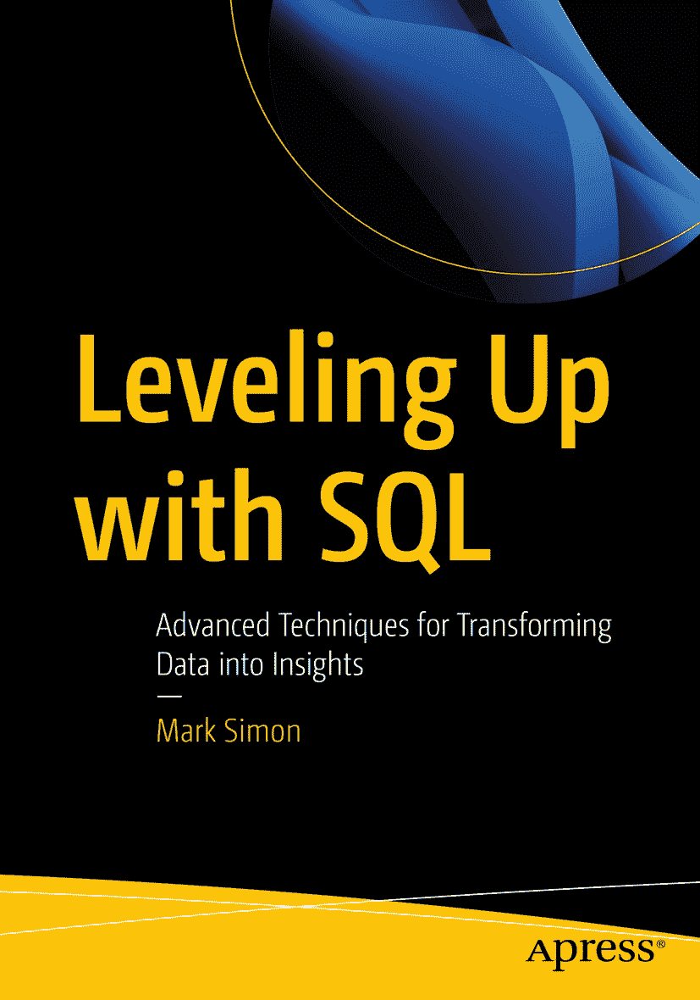

# 版权页

ISBN `978-1-4842-9684-4` e-ISBN `978-1-4842-9685-1` [`doi.org/10.1007/978-1-4842-9685-1`](https://doi.org/10.1007/978-1-4842-9685-1) © Mark Simon 2023

本作品受版权保护。出版方拥有所有权利的独家许可，无论涉及材料的全部或部分，具体包括翻译、转载、插图再利用、朗诵、广播、缩微胶片或其他任何物理方式的复制，以及信息存储与检索、电子改编、计算机软件，或任何目前已知或未来开发的类似或不同的方法。在本出版物中使用通用描述性名称、注册商标、服务标志等，即使未作特别声明，也不意味着这些名称不受相关保护性法律法规的约束，因此可自由用于一般用途。出版商、作者和编辑可以安全地假设本书中的建议和信息在出版时是真实准确的。对于所含材料或可能出现的任何错误或遗漏，出版商、作者或编辑均不提供任何明示或暗示的保证。对于出版地图中的管辖权主张和机构隶属关系，出版商保持中立。

本 `Apress` 印记由注册公司 `APress Media, LLC`（`Springer Nature` 的一部分）出版。

注册公司地址为：`1 New York Plaza, New York, NY 10004, U.S.A.`

*献给布莱恩。你造就了今天的我的一部分。*

