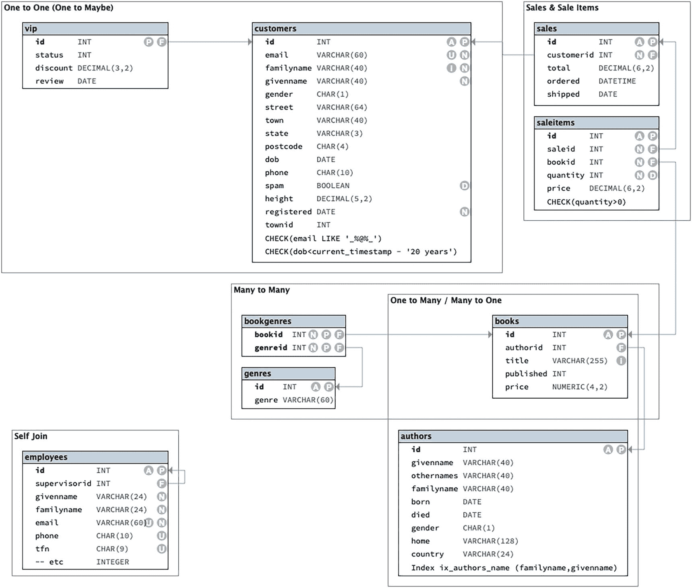
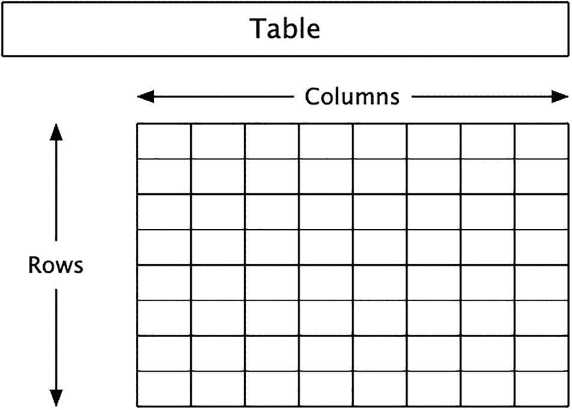
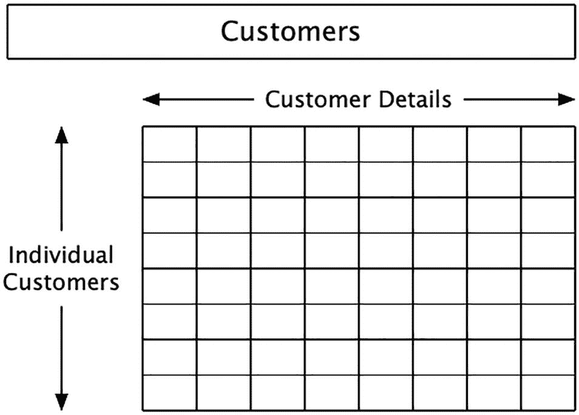
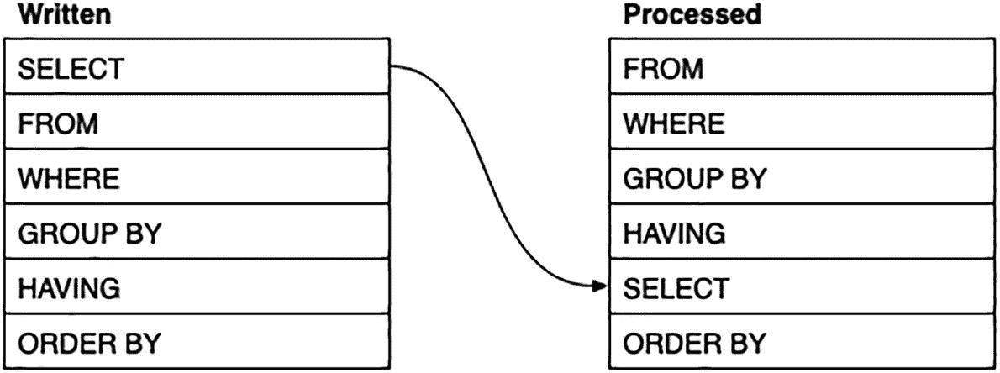

# 1. 准备工作

如果你正在阅读本书，那么你应该已经了解一些 `SQL` 知识，无论是通过之前的学习，还是通过痛苦的经验，或者更可能的是，两者兼有一点。在这个过程中，可能有一些内容你遗漏了、忘记了，或者看不出其意义所在。

我们将假设你对 `SQL` 足够熟悉，能够完成基本操作，这主要是指从一个或多个表中获取数据。你甚至可能已经操作过其中的一些数据或者表本身。

我们*不会*假设你认为自己在这方面是专家。请查看“你可能已经知道什么”一节，核对我们认为你已具备的经验类型。如果有些领域你不太确定，不必惊慌。每一章都会包含一些背景概念，这些概念将带你进入下一个层次。

如果这一切对你来说有点陌生，也许我们可以推荐一本入门书。书名是 Mark Simon 所著的《*SQL 与数据库入门*》，你可以在 [`https://link.springer.com/book/10.1007/978-1-4842-9493-2`](https://link.springer.com/book/10.1007/978-1-4842-9493-2) 了解更多信息。


## 关于示例数据库

对于示例数据库，我们假设正在运营一家名为**BookWorks**的在线书店。在此场景中：

*   客户访问网站。
*   在某个时刻，客户会注册并提供详细信息。
*   然后他们将一本或多本书的一本或多本副本添加到购物车。
*   希望他们接着结账并付款。
*   BookWorks 随后将采购书籍，并在某个时候将它们发货给客户。

为了管理这一切，数据库表的布局类似于图 1-1。



一幅示意图展示了不同数据库表（如`vip`、`customers`、`sales`、`sale_items`、`book_genres`、`genres`、`books`、`employees`和`authors`）的布局以及它们之间的交互。

图 1-1

BookWorks 模式

在现实生活中，情况要更复杂。例如，我们没有包含支付或配送方式，也没有包含登录凭证。也没有库存数据，尽管我们将假设书籍是按需订购的。

但这个数据库包含的内容已经足够我们在发展和提高 SQL 技能的过程中使用了。

## 设置

你可以坐在舒适的椅子上，手边放一杯最爱的饮品和一盒美味的巧克力，从头到尾阅读本书。然而，如果你参与示例实践，你会从本书中获得更多收获。

### 数据库管理软件

首先，你需要能够访问数据库管理软件（DBMS）。本书中使用的五个半 DBMS 是：

*   PostgreSQL
*   MariaDB/MySQL
*   Microsoft SQL Server
*   SQLite
*   Oracle

PostgreSQL、MariaDB/MySQL 和 SQLite 都是免费的。Microsoft SQL Server 和 Oracle 是付费产品，但有免费版本。

MariaDB 是 MySQL 的一个分支，这就是为什么它们被放在一起讨论。它们在功能上几乎完全相同，但你会发现一些细微差别。

如果你使用 MariaDB/MySQL，我们假设你正在**ANSI 模式**下运行它。在会话开始时很容易做到：

```
SET SESSION sql_mode = 'ANSI';
```

你可能在本书中多次看到这条消息。附录会告诉你原因。

很可能——甚至非常可能——你已经安装了 DBMS。只需确保：

*   它是一个相当新的版本。你要学习的一些功能在某些旧版本的 DBMS 中不可用。特别是注意 MySQL：你需要 2018 年发布的 8 版本才能使用一些更复杂的功能。
*   你有足够的权限来创建数据库以及创建和修改表。本书大部分内容不需要这些，但第 2 章肯定需要。
    至少，你需要能够安装示例数据库。

如果你无法更改数据库，你仍然可以完成本书的大部分内容，只是阅读第 2 章时，你可能需要礼貌地点头同意我们在该章中对数据库所做的几处修改。在创建视图时，你可能也会遇到一些困难，这将在第 6 章及其他章节中介绍。

### 数据库客户端

你还需要一个数据库客户端。所有主流的 DBMS 供应商都有自己的免费客户端，同时也有许多免费和付费的第三方替代品。

### 示例数据库

当然，你还需要安装示例数据库。

本书的示例数据库和额外的代码文件可通过本书产品页面在 GitHub 上获取，地址位于 [`www.apress.com/ISBN`](http://www.apress.com/ISBN)。

你也可以通过访问 [`www.sample-db.net/`](https://www.sample-db.net/) 并点击几个按钮来直接下载脚本。

你需要执行以下操作：

1.  为你的 DBMS 创建示例数据库。如果想不到更好的名字，`bookworks`是个不错的名字。对于大多数 DBMS，你可以运行：
    ```
    CREATE DATABASE bookworks;
    ```
    然后你需要连接到该数据库。
2.  使用前面的链接，为你的 DBMS 选择选项。对于此示例，你应该选择“Book Works”示例（步骤 2）以及额外的“Towns”和“Countries”表（步骤 4）。下载文件。它是一个 ZIP 文件，因此你需要解压它。
3.  使用你的数据库客户端，连接到新创建的数据库，打开下载的脚本文件并运行该脚本。

## 你可能已经知道的内容

……或者说，SQL 速成课

如果你在阅读下文时有似曾相识的感觉，那是对我之前 Apress 图书《SQL 和数据库入门》所学内容的总结。如果你对这些概念很有信心，可以直接跳到下一章，但复习一下以保持记忆清新也是值得的。

在本节中，我们将回顾以下概念：

*   一些哲学概念
*   编写 SQL
*   基础 SQL
*   数据类型
*   SQL 子句
*   计算列
*   连接
*   聚合
*   使用表
*   操作数据
*   集合运算

这是你在之前书籍中会遇到的内容的总结。其中一些主题将在后续章节中进一步探讨。

### 一些哲学概念

有些人对计算机，特别是数据库内部的工作原理有错误的理解。在这里，我们将澄清这一点，并明确术语——这些词的含义是什么。

**数据库**是数据的集合。嗯，很明显，但当我们谈论 SQL 时，我们谈论的是以特定方式组织和访问的数据。首先，数据库的设计遵循所谓的**关系模型**，这是一套关于数据如何组织的基本原则。这个模型追求纯粹和清晰。每个数据项都有一个确切的位置，它属于那里并以其最纯粹的形式存储。相关的数据项被收集在一起。

关系数据库的纯粹主义者会毫不犹豫地指出，SQL 数据库并没有严格遵循这些原则，甚至在有些情况下偏离得很远。尽管如此，关系模型仍然是 SQL 数据库构建的基础。


#### 数据 vs. 信息 vs. 值

数据库存储的是 `数据`。这是其名称所暗示的，但重要的是要明白，这与 `信息` 并非同一回事，即使我们有时会忍不住混用这两个词。

数据是中性的。它本身没有意义。比如，你的身高可能是 175（厘米），但数据库既不知道也不关心这是好是坏。它只是一个数字，而且即使这个数字不正确，它也不在意。

然而，数据库关心的是输入的数据是否遵循了数据库设计中预定义的规则。这可能包括输入数据的类型或可能的取值范围。

然而，`信息` 是人类赋予的东西。我们赋予它意义并进行判断。在这里，我们判断身高是否符合预期，或是否有其他意义。

为什么这很重要呢？以你的出生日期为例。它有可能改变吗？

简短的回答是不行，你无法（就我们所知）回到过去更改你的出生日期。然而，实际的 `数据` 本身可以改变，例如当初输入错误时，或者日历系统发生了更改（虽然这种情况确实不常发生）。

这影响了数据库的设计方式：你必须考虑到错误的存在，并且需要考虑在定义中添加哪些合理性检查。你不能仅仅因为出生日期“不应当”改变，就将其锁定。

另一个概念是 `值`。可以将数据视为问题，而值则是答案。你的名字（数据）是什么？答案就是它的值。

这一点很重要，因为数据库设计的很多方面是围绕 `数据` 进行的，而非实际的值。

例如，一个设计良好的数据库应该只存储一次你的名字 `数据`。然而，实际的值（如“Fred”、“Wilma”）很可能与其他人的数据一起出现。值可以重复，如果重复了，我们只将其视为巧合。真正的迹象是，你可以更改一个人的名字值，而无需在其他地方也做同样的更改。

简而言之：

*   `数据` 是一个占位符。它永远不应该在其他地方被复制。
*   `值` 是数据的内容。它可能是 `NULL`（意味着你没有这个值），并且它可能因为各种原因而被重复。
*   `信息` 是你个人赋予数据库的意义，数据库对此既不了解也不关心。我们在这里不会过多讨论信息。

我们可能会宽松地使用“信息”一词来指代数据，但它们真的不是一回事。

#### 数据库表

SQL 数据库将数据存储在一个或多个 `表` 中。反过来，表通过 `行` 和 `列` 来呈现数据。你可以通过图 1-2 获得直观理解。



一张插图展示了一个网格，水平轴和垂直轴分别标记了列和行。网格顶部有一个标记为“table”的矩形块。

图 1-2：一个数据库表

一行是数据的一个实例，例如书籍表中的一本书或客户表中的一位客户。列用于存储详细信息，例如客户的名字或书籍的标题。图 1-3 给出了概念示意。



一张插图展示了一个网格，水平轴和垂直轴分别标记了列的细节和各个客户。网格顶部有一个标记为“customers”的矩形块。

图 1-3：一个客户表

以下是一个设计良好的表的一些重要属性：

*   数据是原子的：在每一行中，每一列只存储一条数据。
*   行的顺序无关紧要：你可以按喜好对它们排序，但行的顺序本身没有实际意义。
*   行是唯一的：你不会拥有两行描述相同内容的记录。
*   行是独立的：一行中的数据不应影响其他任何行。
*   列彼此独立：更改一列中的内容不应影响另一列中的内容。
*   列是单一类型的：你不能在同一列中混合类型。
*   列名是唯一的。显然如此。
*   列的顺序无关紧要：这可能有点令人困惑，因为显然列的顺序可能是区分不同列的唯一线索。然而，你选择哪种顺序并不重要。

由此产生的一个重要结果是，列绝不应用于存储多个值，无论是单独还是组合。这意味着：

*   单个列不应包含多个值。
*   多个列不能具有相同的角色。

还有一些额外的规则，但它们更多是对基本原则的微调。

SQL 在两种有重叠的场景中使用“表”这个术语：

*   数据以表的形式存储在数据库中。数据以行和列的形式被访问；也就是说，数据处于表格式。
    存在一种叫做 `临时表` 的东西。它与前面提到的真实表相同，区别在于当你结束会话时，它会自我销毁。
*   数据也可能以表格式短暂持有，而无需实际存储。
    你可能通过连接（join）、公用表表达式（common table expression）、视图（view），甚至另一个 `SELECT` 语句的结果获得这种表数据。

当我们需要引用这种生成的表数据时，我们将使用术语 `虚拟表` 来明确这一点。

### 编写 SQL

`SQL` 是一种简单的语言，它有一些规则和一些关于可读性的建议：

*   `SQL` 在使用额外空格方面比较宽松。你应该使用足够的空格来让你的 `SQL` 更易读。
*   每个 `SQL` 语句以分号 (`;`) 结尾。
*   `SQL` 语言不区分大小写，列名也是如此。表名可能区分大小写，这取决于操作系统。

微软 `SQL` 对分号的使用比较宽松，许多 `MSSQL` 开发者养成了忘记分号的坏习惯。然而，微软强烈建议你使用它们，而且如果你过于随意，某些 `SQL` 可能无法正常工作。请参阅 [`https://docs.microsoft.com/en-us/sql/t-sql/language-elements/transact-sql-syntax-conventions-transact-sql#transact-sql-syntax-conventions-transact-sql`](https://docs.microsoft.com/en-us/sql/t-sql/language-elements/transact-sql-syntax-conventions-transact-sql%2523transact-sql-syntax-conventions-transact-sql)。

如果你记得包含分号，就能避免麻烦。

请记住，语言的某些部分是灵活的，但仍需遵循严格的语法。

### 基础 SQL

用于从表中获取数据的基本语句是 `SELECT` 语句。其最简单的形式如下：

*   `SELECT` 语句将从表中选择一列或多列数据。
*   你可以以任意顺序选择列。
*   `SELECT *` 表达式用于选择所有列。
*   列可以是计算得出的。

```sql
SELECT ...
FROM ...;
```

计算列应使用别名命名；非计算列也可以使用别名。

注释是供人类阅读者参考的额外文本，会被 `SQL` 忽略：

*   `SQL` 有标准的单行注释：`-- 等`
*   大多数 `DBMS` 也支持非标准的块注释：`/* ... */`
*   注释可用于解释某些内容，或作为章节标题。它们也可以用来禁用部分代码，就像你在排除故障或测试时可能做的那样。


### 数据类型

粗略来说，主要有三种数据类型：

*   数字
*   字符串
*   日期和时间

数字字面量以裸露形式表示：它们没有任何引号。

数字按照数轴顺序进行比较，并且可以使用基本的比较运算符进行筛选。

字符串字面量用单引号书写。一些数据库管理系统也允许使用双引号，但双引号更准确地应用于列名而非值。

*   在某些数据库管理系统和数据库中，大小写可能不匹配。
*   尾随空格应该被忽略，但并非总是如此。

日期字面量也使用单引号。

*   首选的日期格式是 ISO8601 (`yyyy-mm-dd`)，尽管 Oracle 不太喜欢这种格式。
*   大多数数据库管理系统允许替代格式，但应避免使用 `??/??/yyyy` 格式，因为它在各地的含义并不相同。

日期按照历史顺序进行比较。

### SQL 子句

在典型的 `SELECT` 语句中，我们最多使用六个子句。SQL 子句按照特定顺序书写。然而，它们的处理顺序略有不同，如图 1-4 所示。



图 1-4：SQL 子句顺序。一幅示意图代表了两个分别标记为“书写顺序”和“处理顺序”的数据库表，列出了六个子句。在“书写顺序”表中，SELECT 子句列在顶部，而在“处理顺序”表中，它移动到了第五位。

需要记住的重要一点是，在 `ORDER BY` 子句之前，`SELECT` 子句是最后被求值的。这意味着只有 `ORDER BY` 子句可以使用在 `SELECT` 子句中生成的值和别名。^²

正如我们将在本书后面看到的，还有一些额外的子句是对我们这里所介绍内容的扩展。

#### 使用 WHERE 子句筛选数据

可以使用 `WHERE` 子句对表进行筛选。

当你拥有大量行时，你可以使用 `WHERE` 子句对它们进行筛选。`WHERE` 子句后跟一个或多个断言，这些断言的评估结果要么为真，要么为假，从而决定某一行是否应包含在结果集中。

`WHERE` 子句的语法是

```
SELECT columns
FROM table
WHERE conditions;
```

条件是一个或多个断言，即评估结果为真或不为真的表达式。如果一个断言不为真，它也未必为假。通常，如果表达式涉及 `NULL`，结果将是未知的，这同样不是真。

*   `NULL` 代表一个缺失的值，因此测试它很棘手。
*   `NULL` 在任何比较中（例如等号运算符 `=`）总是会失败。

测试 `NULL` 需要特殊的表达式 `IS NULL` 或 `IS NOT NULL`。

##### 多重断言

你可以使用逻辑 `AND` 和 `OR` 运算符组合多个断言。当你组合它们时，`AND` 的优先级高于 `OR`。

`IN` 运算符将与列表中的值进行匹配。它等同于多个 `OR` 表达式。它也可以与生成单列值的子查询一起使用。

##### 通配符匹配

可以使用通配符模式和 `LIKE` 运算符更宽松地比较字符串。

*   通配符包括特殊的模式字符。
*   一些数据库管理系统允许你将 `LIKE` 与非字符串数据一起使用，会隐式地将其转换为字符串进行比较。
*   一些数据库管理系统用额外的模式补充了标准的通配符字符。
*   一些数据库管理系统支持正则表达式，它比常规的通配符模式匹配更为复杂。

#### 使用 ORDER BY 子句排序

SQL 表是行的无序集合。

*   行的顺序无关紧要，并且可能出人意料。
*   你可以使用 `ORDER BY` 子句对结果进行排序。

对表进行排序是使用 `ORDER BY` 子句完成的：

```
SELECT columns
FROM table
--  WHERE ...
ORDER BY ...;
```

`ORDER BY` 子句既是最后书写的，也是最后被求值的。

*   排序不会改变实际的表，只会改变当前查询结果的顺序。
*   你可以使用原始列或计算值进行排序。
*   你可以使用多个列进行排序，这将有效地对行进行分组；列的顺序是任意的，但会影响分组的方式。
*   默认情况下，每个排序列按递增（升序）顺序排序。每个排序列都可以通过 `DESC` 子句进行限定，该子句将按递减（降序）顺序排序。你也可以添加 `ASC`，这不会有任何改变，因为它本来就是默认值。
*   不同的数据库管理系统对于排序后的 `NULL` 值放置位置有各自的做法，但它们都会将 `NULL` 值分组在开头或末尾。
*   数据类型会影响排序顺序。
*   一些数据库管理系统会分别对大小写值进行排序。

##### 限制结果数量

`SELECT` 语句也可以包含对行数的限制。这个功能长期以来一直是非官方的特性，但现在已成为官方功能。

官方形式类似于

```
SELECT ...
FROM ...
ORDER BY ... OFFSET ... ROWS FETCH FIRST ... ROWS ONLY;
```

这在 PostgreSQL、MSSQL 和 Oracle 中得到支持。

许多数据库管理系统仍然提供其专有的、非官方的限制子句。最常见的非官方版本类似于

```
SELECT ...
FROM ...
ORDER BY ... LIMIT ... OFFSET ...;
```

这在 PostgreSQL（它也支持 `OFFSET ... FETCH`）、MariaDB/MySQL 和 SQLite 中得到支持。

MSSQL 还有一个简单的 `TOP` 子句，可以添加到 `SELECT` 子句中。

##### 排序字符串

按字母顺序排序在很大程度上是没有意义的。然而，有一些技术可以以更有意义的顺序对字符串进行排序。

#### 计算列

在 SQL 中，主要有三种数据类型：数字、字符串和日期。每种数据类型都有其自己的计算值的方法和函数：

*   对于数字，你可以进行简单的算术运算，并使用更复杂的函数进行计算。还有一些函数可以对数字进行近似计算。
*   对于日期，你可以计算日期之间的年龄或对日期进行偏移。你也可以提取日期的各个部分。
*   对于字符串，你可以连接它们、更改字符串的部分内容或提取字符串的部分内容。
*   对于数字和日期，你可以生成格式化的字符串，这可能会提供更友好的版本。

#### 使用 NULL 值进行计算

每当计算涉及 `NULL` 时，它会对结果产生灾难性的影响，结果通常会是 `NULL`。

在某些情况下，你或许可以使用 `coalesce()` 替换一个值，它会用一个合理的替代值替换 `NULL`。当然，你需要确定什么对于你来说是“合理的”。

### 别名

每一列都应该有一个不同的名称。当你计算一个值时，你可以使用 `AS` 提供这个名称作为别名。你也可以对非计算列这样做，以提供一个更合适的名称。

别名和其他名称应该是唯一的。它们还应遵循标准的列命名规则，例如不与 SQL 关键字相同，并且不包含特殊字符。

如果由于任何原因，名称或别名需要打破命名规则，你总是可以将名称用双引号 (`"双引号"`) 括起来，或者使用数据库管理系统提供的任何替代符号。

一些数据库管理系统有双引号的替代符号，但如果可能，你应该优先使用双引号。

##### 子查询

子查询是一个额外的 `SELECT` 语句，用作主查询的一部分。

一列也可以包含源自子查询的值。如果你想包含来自单独相关表的数据，这尤其有用。如果子查询涉及来自主表的值，则称为相关子查询。这种子查询可能开销很大，但仍然是一种有用的技术。

### CASE 表达式

你可以使用 `CASE ... END` 生成类别，它测试一个值与可能的匹配项，并从多个备选值中得出一个结果。


### 类型转换

你可以使用 `cast()` 来更改值的数据类型：

*   你可以在主类型内部，更改为细节更多或更少的类型。
*   如果值与其他类型足够相似，你有时可以在主要类型之间进行转换。

有时转换会自动执行，但有时你需要手动操作。

一个你可能需要从字符串转换的情况是当你需要日期字面量时。由于字符串和日期字面量都使用单引号，SQL 可能会将日期误认为是字符串。

### 视图

你可以通过创建视图将 `SELECT` 语句保存到数据库中。视图允许你将复杂的语句保存为虚拟表，以便以后以更简单的形式使用。

视图是构建有用语句集合的好方法。

#### 连接

你经常会创建涉及来自多个表的数据的查询。连接通过附加来自其他表的对应行来有效地扩展表。

连接的基本语法是

```sql
SELECT columns
FROM table JOIN table;
```

存在一种使用 `WHERE` 子句的旧语法，但对于大多数连接来说它不那么有用。

尽管表是成对连接的，但你可以连接任意数量的表以从任何相关表中获取结果。

连接表时，最好区分列。如果表有共同的列名，这一点尤其重要：

*   你应该完全限定所有列名。
*   使用表别名来简化名称很有帮助。然后这些别名可用于限定列。

### ON 子句

`ON` 子句用于描述一个表中的哪些行与另一个表中的哪些行连接，通过声明来自每个表的哪些列应该匹配来实现。

最明显的连接是从子表的外键到父表的主键。更复杂的连接也是可能的。

你还可以创建匹配非固定关系列的 `临时` 连接。

### 连接类型

默认的连接类型是 `INNER JOIN`。当未指定连接类型时，假定为 `INNER`：

*   `INNER JOIN` 的结果仅包含有父行的子行。外键为 `NULL` 的行会被忽略。
*   `OUTER JOIN` 是 `INNER JOIN` 与不匹配行的组合。`OUTER JOIN` 有三种类型：
    *   `LEFT` 或 `RIGHT` 连接包含来自其中一个连接表的不匹配行。
    *   `FULL` 连接包含来自两个表的不匹配行。
    *   `NATURAL` 连接匹配两个名称相同的列，不需要 `ON` 子句。它在连接一对一的表时特别有用。并非所有数据库管理系统都支持此功能。

还有一种 `CROSS JOIN`，它将一个表中的每一行与另一个表中的每一行组合起来。它通常不太有用，但当你与单行变量进行交叉连接时可能很方便。

## 聚合

除了仅仅从数据库表中获取简单数据，你还可以使用聚合查询生成各种摘要。聚合查询使用一个或多个聚合函数，并暗示数据的某些分组。

聚合查询有效地将数据转换为二级摘要表。使用总计聚合时，你只能选择摘要。你不能同时选择非聚合值。

主要的聚合函数包括

*   `count()`，计算列中的行数或值的数量
*   `min()` 和 `max()`，按排序顺序获取列中的第一个或最后一个值

对于数字，你还有

*   `sum()`、`avg()` 和 `stdev()`（或 `stddev()`），它们对数字列执行求和、平均值和标准差运算

在处理数字时，并非所有数字的用法都相同，因此并非所有数字都应被汇总。

对于字符串，你还有

*   `string_agg()`、`group_concat()` 或 `listagg()`（取决于数据库管理系统），它们连接列中的字符串

在所有情况下，聚合函数只对值起作用：它们都会跳过 `NULL`。

你可以控制列中包含哪些值：

*   你可以使用 `DISTINCT` 来仅计算每个值的一个实例。
*   你可以使用 `CASE ... END` 作为特定值的过滤器。

如果没有 `GROUP BY` 子句，或者使用 `GROUP BY ()`，聚合就是总计：你将得到一行摘要。

你也可以使用 `GROUP BY` 来生成多个组的摘要。每个组都是独立的。这样做时，你会得到每个组的摘要，以及包含组值本身的附加列。

聚合不仅限于单个表：

*   你可以连接多个表并对结果进行聚合。
*   你可以将一个聚合连接到一个或多个其他表。

在许多情况下，分多步处理聚合是有意义的。为此，将第一步放入公用表表达式很方便，这是一种虚拟表，可以与下一步一起使用。

对数据进行分组时，有时你想要筛选某些组。这可以通过 `HAVING` 子句完成，该子句添加在 `GROUP BY` 子句之后。

## 表操作

表是使用 `CREATE TABLE` 语句创建的。该语句包括

*   列名
*   数据类型
*   其他表和列属性

表设计可以稍后更改，例如添加触发器或索引。更严重的更改，例如添加或删除列，可以使用 `ALTER TABLE` 语句来实现。

### 数据类型

数据主要有三种类型：

*   数字
*   字符串
*   日期

上述类型有许多变体，这使得数据存储和处理更加高效，并有助于验证数据值。

还有一些额外的类型，如布尔型或二进制数据，在典型的数据库中不太常见。

### 约束

约束定义了哪些值被视为有效。标准约束包括

*   `NOT NULL`
*   `UNIQUE`
*   `DEFAULT`
*   外键（`REFERENCES`）

你可以使用通用的 `CHECK` 约束来构建自己的附加约束。在这里，你添加一个类似于 `WHERE` 子句的条件，该条件定义了你自己特定的验证规则。

### 外键

外键是对另一个表的引用，也被视为一种约束，因为它将值限制为与另一个表匹配的值。

外键在子表中定义。

外键还会影响任何尝试从父表中删除行的操作。默认情况下，如果存在匹配的子行，则无法删除父行。但是，这可以更改为 (a) 将外键设置为 `NULL` 或 (b) 级联删除到所有子行。

