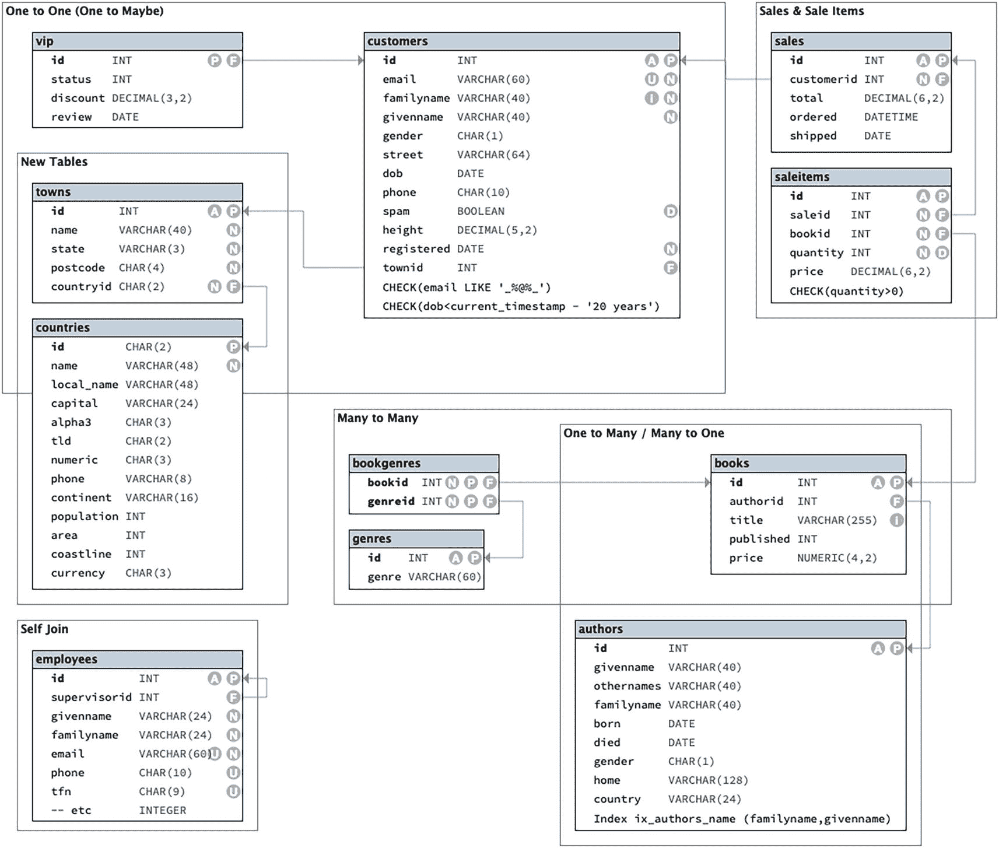

# 索引

索引是对表的一种补充，它将选定的数据按顺序存储，并包含对原始表中数据的引用。使用索引，数据库管理系统可以更快地搜索数据。

主键和唯一列会自动创建索引。你可以在任何其他列上添加索引。

索引有一些成本，因此不应无故添加。成本包括存储和维护。

可以添加唯一索引以确保特定列或列组合的值是唯一的。

### 最终成果

在对表结构进行更改后，你的数据库将类似于图 2-1 中的设计。

图 2-1
改进后的数据库设计

