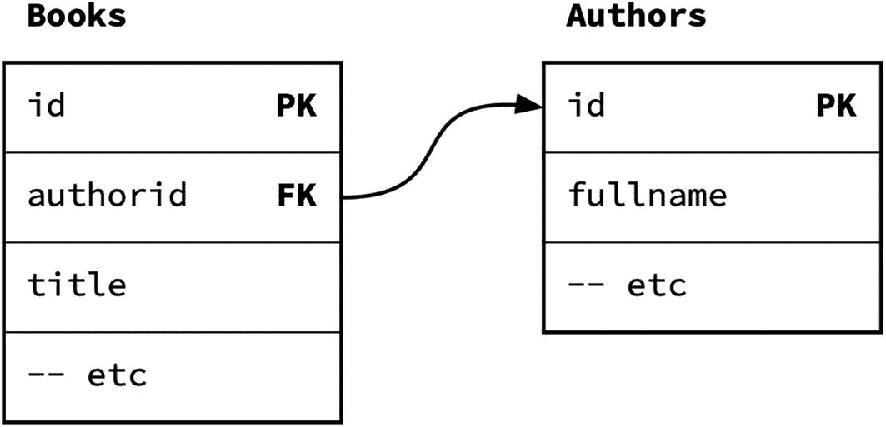
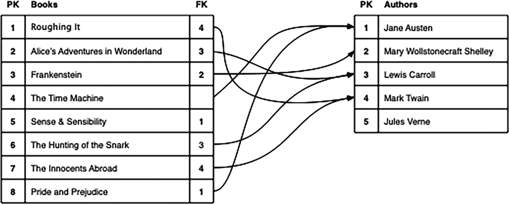
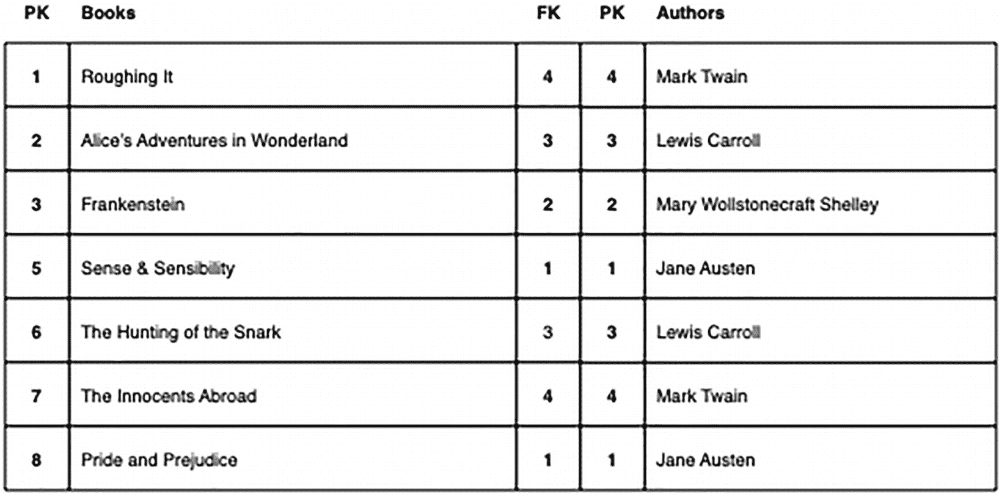
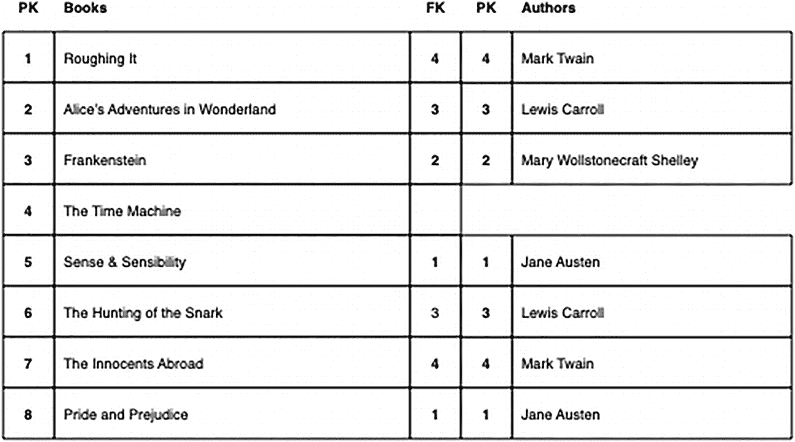
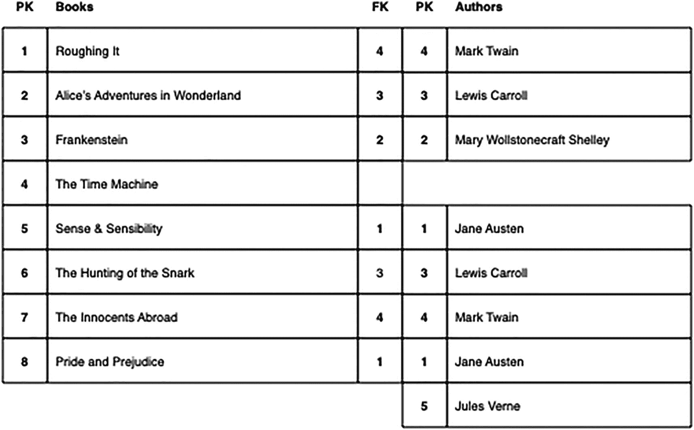
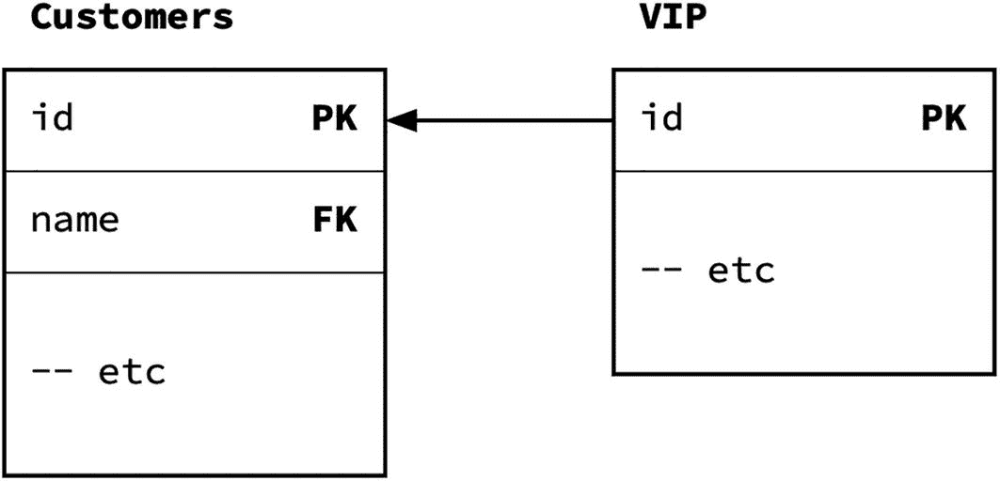
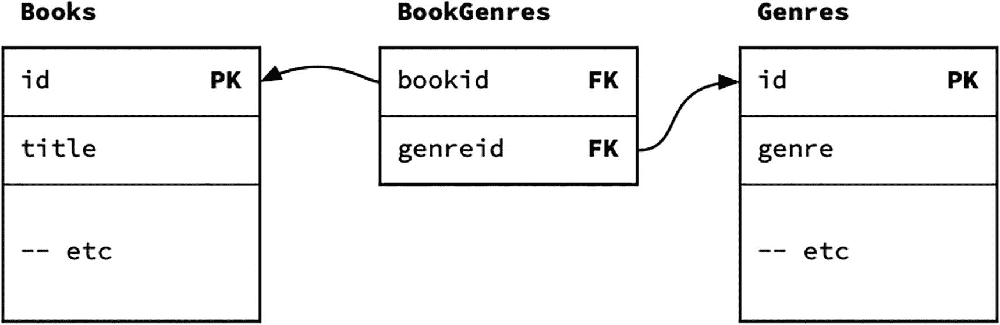
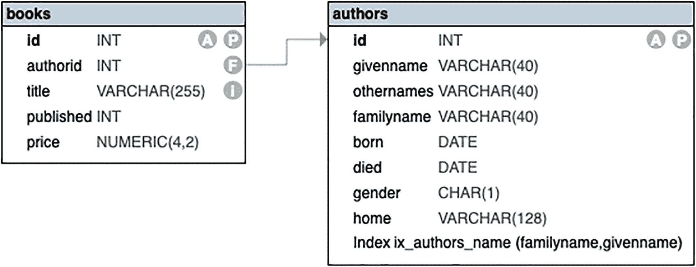
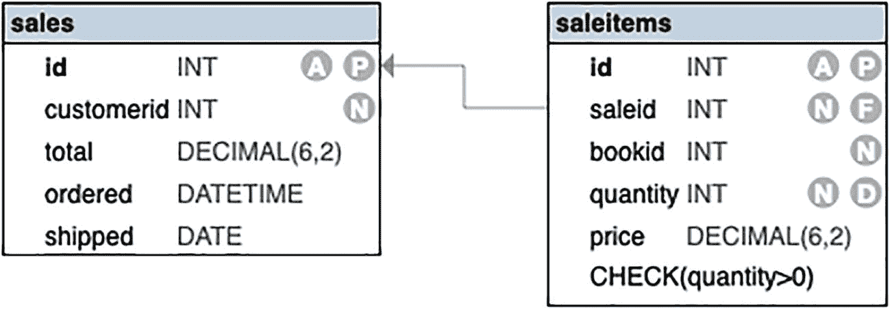

# 3. 表关系与连接

一个数据库并非只有一张表。当然，它可以只有一张表，但任何一个复杂的数据库——比如你用来管理在线书店的数据库——都会包含多张表，每张表分别处理不同的数据集合。

虽然通过查看单张表可以获得一些有用的信息，但通过组合多张表，你将获得远多于此的信息。

在本章中，我们将探讨如何处理多张表、它们之间如何关联，以及在需要时如何将它们组合起来。

具体来说，我们将看看：

*   表关系及其主要类型是什么意思
*   如何使用一对多关系来管理多个值
*   如何使用一对一关系用一张表来扩展另一张表
*   如何使用多对多关系来管理更复杂的多个值
*   如何在多张表中处理数据的插入和更新

我们将探讨数据库为何要以这种多表结构来构建，以及如何使用连接（join）将它们组合成虚拟表。

## 关系概述

一个结构良好的数据库遵循若干重要的设计原则。其中两条如下：

*   每张表只包含一种类型的数据，不包含本应属于另一张表的数据。
    例如，`customers`（客户）表不包含书籍详情，而`books`（书籍）表不包含客户详情。这也适用于`books`和`authors`（作者）表。
    这并不是说`books`表完全不知道作者信息。我们稍后会探讨这一点。
*   数据从不重复。同一数据项不会出现在不同的表中，也不会在同一张表中重复出现。
    例如，如果你在`books`表中包含作者姓名和其他详情，你会发现对于同一作者的其他书籍，这些详情会被重复记录。

这两条原则是相互关联的：如果你将作者详情与书籍混在一起，违反了第一条原则，最终就会导致为多本书重复记录相同的详情，从而违反了第二条原则。

管理书籍和作者的正确方式是，将作者详情放在一个单独的表中，并在`books`表中包含一个指向某位作者的`引用`。这样，我们说这两个表之间存在一个`关系`。

同样的原则也适用于`books`和`customers`表。由于目标是让客户购买书籍，因此这些表之间也应该存在关系。不过，这种关系稍微复杂一些，我们稍后会看到。

关系主要有三种类型：

*   `一对多`关系存在于一张表的`主键`与另一张表的外键之间。
    例如，`authors`和`books`表之间是一对多关系：一位作者可以有多本书，多本书可以对应同一位作者。
*   `一对一`关系存在于一张表的`主键`与另一张表的`主键`之间。通常这种情况较少见，你更可能看到的是它的一种变体。
    例如，有一个`vip`（贵宾）表，用于存储客户的额外功能。对于每个客户，只能有一个`vip`条目，因此这两个表之间存在一种（改良的）一对一关系。
*   `多对多`关系不是直接关系，而是涉及在两张主表之间的一张连接表。
    例如，有一个`genres`（体裁）表，其中包含书籍可能的体裁标签。由于一本书可以有多种体裁，一种体裁可以适用于多本书，因此这两个表之间存在多对多关系。
    你会看到，这是通过一张额外的表来实现的。

这些关系可以被描述为`计划内`的关系。它们通常通过外键约束来强制实现，通常涉及主键，并为数据库定义了一个紧密的结构。

也可能会存在计划外的关系。例如，你可能会考虑客户生日与作者生日之间的关系。这种关系很可能只是巧合，但在某些情况下可能值得探究——也许天蝎座的人会对其他天蝎座的人感到亲切。

我们将计划外的关系称为`临时`关系，并稍后看几个例子。

如果多张表处于计划内或计划外的关系中，你可以使用`JOIN`（连接）来查看它们的组合。


## 一对多关系

这是两个表之间最常见的一种关系类型。这种关系存在于一张表的主键与另一张表的外键之间。但实际上，它是通过从外键到主键的引用来实现的。

这种关系用于描述许多可能的情景。例如：

*   一位作者（Author）写了多本书（Book）。
*   一位客户（Customer）有多笔销售（Sale）。
*   一笔销售（Sale）包含多个商品项（Item）。

请注意，*许多*一词可以表示从 0 到∞的任何数量。
在上述情况中，一张表被称为 **一** 表，而另一张表被称为 **多** 表，但这种命名方式信息量有限。有时，将 **一** 表视为 **父** 表，将 **多** 表视为 **子** 表，会更易于理解。

一对多关系是通过从子表到父表的引用来实现的，例如，对于书籍和作者表：

```
CREATE TABLE authors (          --  父表 (一)
id INT PRIMARY KEY
--  其他列
);
CREATE TABLE books (            --  子表 (多)
id INT PRIMARY KEY,
bookid INT REFERENCES parent(id)
--  其他列
);
```

从视觉上看，它类似于图 3-1。


两个方块，例如书籍和作者，说明了一对多连接。`books`表中的`authorid`外键（FK）链接到`authors`表中的`authorid`主键（PK）。
图 3-1
一对多连接

请注意，虽然子表持有对父表的引用，但父表并*不*持有对子表的引用。

你可以使用`JOIN`来合并父表和子表：

```
--  非 Oracle 语法
SELECT
b.id, b.title,      --  等
a.givenname, a.familyname   --  等
FROM books AS b JOIN authors AS a ON b.authorid=a.id;
--  Oracle 语法：表别名中不使用 AS
SELECT
b.id, b.title,       --  等
a.givenname, a.familyname   --  等
FROM books b JOIN authors a ON b.authorid=a.id;
```

这将为你提供书籍及其匹配的作者：

| `id` | `title` | `givenname` | `familyname` |
| --- | --- | --- | --- |
| 2078 | The Duel | Heinrich | von Kleist |
| 503 | Uncle Silas | J. | Le Fanu |
| 2007 | North and South | Elizabeth | Gaskell |
| 702 | Jane Eyre | Charlotte | Brontë |
| 1530 | Robin Hood, The Prince of ... | Alexandre | Dumas |
| 1759 | La Curée | Émile | Zola |
| ~ 1172 行 ~ |

请注意 Oracle 有一个怪癖，不允许在表别名中使用 `AS`。如果你使用 Oracle，需要记住这一点，因为在后续包含 `AS` 的示例中需要注意。

记住，如果有匿名书籍（即 `authorid` 为 `NULL` 的书籍），你将需要一个外连接：

```
--  非 Oracle 语法
SELECT
b.id, b.title,       --  等
a.givenname, a.familyname   --  等
FROM books AS b LEFT JOIN authors AS a ON b.authorid=a.id;
--  Oracle 语法：记住表别名中不使用 AS
SELECT
b.id, b.title,       --  等
a.givenname, a.familyname   --  等
FROM books b LEFT JOIN authors a ON b.authorid=a.id;
```

这将为你提供所有书籍，无论它们是否有匹配的作者：

| `id` | `title` | `givenname` | `familyname` |
| --- | --- | --- | --- |
| 1868 | The Tenant of Wildfell Hall | Anne | Brontë |
| 661 | The Narrative of Arthur Gordon Pym ... | Edgar | Poe |
| 91 | My Bondage and My Freedom | Frederick | Douglass |
| 848 | The Charterhouse of Parma | [NULL] | Stendhal |
| 440 | The Princess and the Goblin | George | MacDonald |
| 881 | Against Nature | Joris-Karl | Huysmans |
| ~ 1201 行 ~ |

一对多关系是表之间最常见的关系。

请记住 SQLite 不支持 `RIGHT JOIN`。如果你想要一个外连接，你需要将未匹配行所在的表放在左边，并确保使用 `LEFT JOIN`。

### 计算一对多连接的结果数

当你不太确定数据库是如何设置的，也不确定是否将正确的列连接到了匹配的列时，估算连接应该产生的结果数量可能会有所帮助。

为了对我们的目标有个概念，假设我们有一个简化的书籍和作者表，如图 3-2 所示。


两个表，books 和 authors，演示了一对多连接的计数。包括简·奥斯汀、刘易斯·卡罗尔和马克·吐温的两本书。
图 3-2
书籍和作者

在前面的例子中，我们选择了 `LEFT JOIN`。当你将子表连接到父表时，通常有四种选择：

*   只返回匹配的行
*   包含所有未匹配的子行
*   包含所有未匹配的父行
*   包含所有未匹配的子行*和*父行

第一种选择当然是 `INNER JOIN`，或者更简单地称为 `JOIN`。
结果将如图 3-3 所示。


一个表格列出了书籍及其对应的作者。这代表了内连接。
图 3-3
一个内连接

你会注意到，该连接不包含未匹配的书籍或作者。

第二和第三种选项是 `LEFT OUTER JOIN` 或 `RIGHT OUTER JOIN`，取决于未匹配行是在左侧还是右侧；同样，我们可以简单地写作 `LEFT JOIN` 或 `RIGHT JOIN`。在这种情况下，`LEFT JOIN` 会包含未匹配的书籍，如图 3-4 所示。


两个表格列出了书籍及其作者，代表了一个外连接。
图 3-4
一个外连接

大多数 DBMS（不包括 SQLite 或 MySQL/MariaDB）有第四种选项：包含所有未匹配的父行和子行。这被称为 `FULL OUTER JOIN`，或者亲切地称为 `FULL JOIN`。这将包含来自两侧的未匹配行，如图 3-5 所示。


两个表格列出了书籍及其作者，代表了一个全连接。
图 3-5
一个全连接

在这种情况下，我们选择了 `LEFT JOIN`，因为子表在左边，我们希望包含所有子表记录，无论是否匹配。

尽管表面上看起来对称，但所有连接并不都是等价的。当你将子表连接到父表时，结果的数量通常反映子表的情况。这是因为许多子行可能共享同一个父行。

因此，为了对可能得到的结果数量有一个合理的估计，你应该从计数开始。

要获得 `INNER JOIN` 的结果数，你需要统计匹配到父行的子行数量——即外键为 `NOT NULL` 的那些：

```
--  子表内连接计数
SELECT count(*) FROM books WHERE authorid IS NOT NULL;
```

这应该会得到前面 `INNER JOIN` 的行数：

| `Count` |
| 1172 |

要统计未匹配的子行数量，你只需要统计那些外键为 `NULL` 的行：

```
--  未匹配的子行
SELECT count(*) FROM books WHERE authorid IS NULL;
```

这将给出在 `INNER JOIN` 中缺失的行数：

| `Count` |
| 29 |

如果你将这个数字加到 `INNER JOIN` 的数字上，就会得到书籍的总数，也就是之前 `OUTER JOIN`（子表）中的行数。

要获得未匹配的父行数量则更棘手一些。你需要统计父表中，其主键*不*在子表的外键列表中的行数：

```
--  未匹配的父行
SELECT count(*) FROM authors
WHERE id NOT IN(SELECT authorid FROM books WHERE authorid IS NOT NULL);
```

这将给出未匹配的父行数：

| `Count` |
| 45 |


该子查询选取那些 `id` 确实出现在 `books` 表中的作者。`NOT IN` 表达式则选取其余的作者。子查询中包含 `WHERE authorid IS NOT NULL` 子句的原因，在于 `NOT IN` 与 `NULL` 值搭配时行为的一个怪癖。这一点将在后文解释。

现在，你拥有了估算连接行数所需的所有数字。你可以使用以下组合：

| `JOIN` 类型 | `计算公式` |
| --- | --- |
| `INNER JOIN` | `INNER JOIN` |
| 子表 `OUTER JOIN` | `INNER JOIN` + 未匹配的子表行 = 子表行数 |
| 父表 `OUTER JOIN` | `INNER JOIN` + 未匹配的父表行数 |
| 全 `OUTER JOIN` | `INNER JOIN` + 未匹配的子表行数 + 未匹配的父表行数 |

这就是从一个子表外连接（即 `LEFT JOIN` 或 `RIGHT JOIN`，取决于你将子表放在连接的哪一侧）中可以预期得到的行数。

当然，事情不一定到此为止。如果你进行的是内连接，并且存在一些 `NULL` 外键值，那么你最终得到的行数会少于估算值。如果你选择父表外连接，那么当存在没有匹配子表的父表记录时，行数会更多。

不过，这是一个很好的起点。

### NOT IN 的怪癖

你可能会想，如果 `IN(...)` 用于查找匹配某些值的行，那么 `NOT IN(...)` 应该会找到其他的行。这在大多数情况下是正确的，**除非**列表中包含一个 `NULL` 值。

例如，要查找位于两个州的客户，你可以使用：

```sql
SELECT * FROM customerdetails
WHERE state IN ('VIC','QLD');
```

要查找位于其他州的客户，你可以使用 `NOT IN`：

```sql
SELECT * FROM customerdetails
WHERE state NOT IN ('VIC','QLD');
```

这符合预期。然而，如果你在列表中包含了 `NULL`，情况就会变得混乱。你需要记住 `IN(...)` 是如何被解释的。例如：

```sql
SELECT * FROM customerdetails
WHERE state IN ('VIC','QLD',NULL);
```

等价于：

```sql
SELECT * FROM customerdetails
WHERE state='VIC' OR state='QLD' OR state=NULL;
```

最后一项 `state=NULL` 将**总是**失败，因为 `NULL` 值在比较时*总是*返回未知（FALSE），但如果它匹配了其他项中的任一个，那也没问题。

然而，`NOT IN` 版本：

```sql
SELECT * FROM customerdetails
WHERE state NOT IN ('VIC','QLD',NULL);
```

等价于：

```sql
SELECT * FROM customerdetails
WHERE state<>'VIC' AND state<>'QLD' AND state<>NULL;
```

当你对一个逻辑表达式进行否定时，你不仅否定了各个项，还否定了它们之间的运算符。

再次强调，项 `state<>NULL` 总是失败，但由于它现在是与其余部分进行 `AND` 运算，这会导致整个表达式失败。

这个故事的寓意是：如果列表中包含 `NULL` 值，你就**不能**使用 `NOT IN`。

### 创建书籍与作者视图

通常来说，如果你做了一些稍微复杂的事情，你会不想再重复做一次。连接 `books` 和 `authors` 表并不算特别复杂，但仍然值得考虑一种更简单的方法。

一条 `SELECT` 语句可以作为 `View` 永久保存在数据库中。`View` 只是一个被保存的查询。虽然你可以像使用表一样使用它，但它实际上并不保存数据，因此开销很小。

还有一种叫做 `物化视图` 的东西，它确实会保存结果，但它并非旨在作为新数据的永久存储。当你的视图相当复杂，并且你有大量的结果需要处理时，物化视图会很有用；它不必每次都重新计算结果。

要创建视图，你需要使用 `CREATE VIEW`：

```sql
--  删除旧版本 (非 Oracle)
DROP VIEW IF EXISTS bookdetails;
--  删除旧版本 (Oracle)
DROP VIEW bookdetails;
--  (重新) 创建视图
CREATE VIEW bookdetails AS
SELECT
b.id, b.title, b.published, b.price,
a.givenname, a.othernames, a.familyname,
a.born, a.died, a.gender, a.home
FROM
books AS b
LEFT JOIN authors AS a ON b.authorid=a.id
;
```

你可以使用 `DROP VIEW` 来删除一个已有的视图。对于大多数 `DBMS`，如果你不确定它（是否）存在，可以使用 `DROP VIEW IF EXISTS`。但是 Oracle 不支持此语法。

Microsoft SQL 有一个额外的怪癖：`CREATE VIEW` 语句必须是其批处理中唯一的语句，因此你需要将该语句放在 `GO` 关键字之间，该关键字标记了一个批处理的结束和另一个批处理的开始：

```sql
DROP VIEW IF EXISTS bookdetails;
--  仅适用于 MSSQL:
GO
CREATE VIEW bookdetails AS
SELECT
b.id, b.title, b.published, b.price,
b.authorid, a.givenname, a.othernames, a.familyname,
a.born, a.died, a.gender, a.home
FROM
books AS b
LEFT JOIN authors AS a ON b.authorid=a.id
;
GO
```

我们包含了 `authorid`，以防你想用它来获取更多作者详细信息。

一旦你保存了一个视图，就可以把它当作另一张表来用：

```sql
SELECT * FROM bookdetails;
```

你将用少一点的工作量获得与之前相同的结果。

### 一对一关系

一对一关系将一个表中的一行与另一个表中的一行关联起来。这通常发生在两个主键之间。

如果第一个表中的每一行都与第二个表中的一行相关联，那么你可以将第二个表视为第一个表的扩展。如果是这种情况，为什么不把所有列都放在同一个表中呢？原因包括：

*   你想添加更多细节，但不想修改原始表。
*   你想添加更多细节，但你*无法*修改原始表（可能因为权限问题）。
*   附加表包含的细节可能是可选的：并非原始表中的所有行都需要这些附加列。
*   你想将某些细节保存在单独的表中，以便为这些附加细节增加另一层安全性。


### 一对多可能关系

从技术上讲，一个*真正*的**一对一**关系要求两个表相互引用。除其他因素外，这很难实现，因为它可能需要同时添加两个表的行。

由于表 A 的一行必须引用表 B 的一行，因此在向表 A 添加数据之前，你需要先拥有表 B 的行。但是，如果表 B 的一行也必须引用表 A 的一行，那么你又需要先向表 A 添加数据。这显然是矛盾的。

实现这一点的一种方法是**延迟**外键约束，直到你以任意顺序向两个表添加完数据之后。不幸的是，大多数数据库管理系统不允许你这样做，因此你只能困在这种不可能的境地中。

这种关系的一个更常见的变体是**一对多可能**关系。^(⁴) 这允许第二个表包含的数据不一定适用于第一个表的每一行。

例如，`vip`表包含了一些客户的额外详细信息。在 SQL 中，它看起来像这样：

```sql
CREATE TABLE customers (        --  主表
id INT PRIMARY KEY
--  主数据
);
CREATE TABLE vip (         --  辅助表
id INT PRIMARY KEY REFERENCES customers(id)
--  附加列
);
```

视觉上，它如图 3-6 所示。



两个块，即 customers 和 V I P，描述了一对多可能连接。V I P i d 和 P K 链接到 customer i d 和 P K。

图 3-6

一对多可能连接

在这里，辅助表包含了主表中*部分*行的额外数据。

请注意，这种关系是通过将辅助表中的 `id` 同时设为主键和外键来实现的。

例如，`vip`表为一些客户包含了额外的特性：

```sql
SELECT * FROM customers ORDER BY id;
SELECT * FROM vip ORDER BY id;
```

你可以看到所有的客户，其中一些也有 VIP 数据：

| **Id** | **givenname** | **familyname** | **...** |
| --- | --- | --- | --- |
| 1 | Pierce | Dears | ... |
| 2 | Arthur | Moore | ... |
| 5 | Ray | King | ... |
| 6 | Gene | Poole | ... |
| 9 | Donna | Worry | ... |
| 10 | Ned | Duwell | ... |
| ~ 303 rows ~ |
| **Id** | **status** | **discount** | **review** |
| 5 | 3 | 0.05 | 2023-12-01 |
| 10 | 2 | 0.1 | 2023-08-23 |
| 21 | 1 | 0.15 | 2024-03-14 |
| 26 | 1 | 0.15 | 2024-02-24 |
| 40 | 1 | 0.15 | 2023-11-11 |
| 41 | 3 | 0.05 | 2024-03-09 |
| ~ 81 rows ~ |

你会注意到`vip`表中的行没有`customers`表那么多。如果每个客户都是 VIP，可能会有那么多，但在这种情况下并非如此。

你可以使用连接查看它们如何关联：

```sql
SELECT c.*, v.*
FROM customers AS c LEFT JOIN vip AS v ON c.id=v.id;
```

这实际上给你一个扩展的`customers`表：

| **id** | **givenname** | **familyname** | **...** | **id** | **status** | **discount** | **review** |
| --- | --- | --- | --- | --- | --- | --- | --- |
| 42 | May | Knott | ... | 42 | 3 | 0.05 | 2024-01-03 |
| 459 | Rick | Shaw | ... |   |   |   |   |
| 597 | Ike | Andy | ... |   |   |   |   |
| 186 | Pat | Downe | ... |   |   |   |   |
| 352 | Basil | Isk | ... | 352 | 1 | 0.15 | 2023-08-06 |
| 576 | Pearl | Divers | ... |   |   |   |   |
| ~ 303 rows ~ |

这给出了所有客户，附带他们的 VIP 数据，或者在额外列中为 NULL。

注意

*   我们需要 `LEFT JOIN` 来包含非 VIP 客户。如果你只想要 VIP 客户，一个简单的（内）`JOIN`会更好。

    我们本可以使用 `SELECT *`，但使用 `c.*, v.*` 可以让你决定你更感兴趣的是哪些表。

作为特例，你也可以只选择 VIP 客户，而不包含额外的 VIP 列，使用

```sql
SELECT c.*
FROM customers AS c JOIN vip AS v ON c.id=v.id;
```

在这里，内连接只选择 VIP 客户，而 `c.*` 只选择客户列。

当然，你是否想这样做取决于你自己。

### 多值处理

数据库设计中的一个主要问题是如何处理多值。适当规范化的表的原则禁止在一行中包含多值：

*   单列不能包含多个值。

    例如，你不应该在单列中存储多个电话号码，例如 `0270101234,0355505678`。这将无法正确排序或搜索，并且维护起来将是一场真正的噩梦。

*   你不应该有多个具有相同作用的列。

    例如，你不应该有多个电话号码列，如 `phone1`、`phone2`、`phone3` 等。这会使搜索变得困难，因为你无法确定要搜索哪一列。你还会遇到列过多或不足的问题。

    请注意，如果电话号码的*类型*有明确区分，你*可以*这样做。例如，你合理地拥有单独的 `fax`（还有人记得这个吗？）、`mobile` 和 `landline` 号码列。

例如，假设我们希望记录一本书的多个流派。以下是两种*不正确*的尝试解决方案：

*   一个包含多个（分隔）值的列

    其想法是流派列将包含多个流派或流派 ID，可能用逗号分隔。问题在于数据不是原子性的，这使得排序、搜索和更新变得非常困难。你还需要额外的工作来使用这些数据。

*   多个流派列

    你不能有多个同名的列，因此这些列可能被称为 `genre1`、`genre2` 等。这里的问题是：(a) 你最终会有太多或不足的列，(b) 没有“正确”的列来对应特定值，(c) 搜索和排序不切实际。

记录流派的问题更为复杂，因为不仅一本书可以有多个流派，一个流派也可以应用于多本书。这是一个**多对多**关系的例子。

这不能直接在两个表之间实现；相反，它需要一个额外的表在两者之间。

如果你有勇气查看创建和填充示例数据库的脚本，你会发现一个名为 `booksgenres` 的表（不要与 `bookgenres` 表混淆，后者当然*完全*不同），它确实将流派合并到了单列中。这当然是作弊。

`booksgenres` 表被用作一种简单的方法来承载将在另外两个表中出现的数千行数据，脚本后面有一部分相当吓人的代码将这些数据拆开以填充那些表。然后 `booksgenres` 表将被删除以销毁证据。

这是一个你可能为了仅用于传输或备份数据而打破规则的案例。但是，数据*绝不应*长期保持这种格式。


## 多对多关系

要表示表之间的多对多关系，你需要另一张表来连接这两张表。

这样的表被称为**关联**表或**桥接**表。

其结构如图 3-7 所示。



三个方块，即 books（书籍）、book genres（书籍流派）和 genres（流派），描述了多对多关系。books 的 i d P K 连接到 book genres 的 book i d F K，以及 genres 的 i d P K。

图 3-7

一个多对多关系

以下是两个表摘录来说明这一点：

```
--  书籍表
CREATE TABLE books (
id int PRIMARY KEY,
title varchar,
--  等等
);
--  流派表
CREATE TABLE genres (
id int PRIMARY KEY,
name varchar,
description varchar
--  等等
);
```

`genres` 表包含一个代理主键。它还包含实际的流派名称和描述，以便明确该特定流派的用途。

你可以使用简单的 `SELECT` 语句查看这两个表的内容：

```
SELECT * FROM books;
SELECT * FROM genres;
```

你会看到两组明显不相关的数据：

| **id** | **authorid** | **title** | **published** | **price** |
| --- | --- | --- | --- | --- |
| 2078 | 765 | The Duel | 1811 | 12.5 |
| 503 | 128 | Uncle Silas | 1864 | 17 |
| 2007 | 99 | North and South | 1854 | 17.5 |
| 702 | 547 | Jane Eyre | 1847 | 17.5 |
| 1530 | 28 | Robin Hood, The Prince of Thieves | 1862 | 12.5 |
| 1759 | 17 | La Curée | 1872 | 16 |
| ~ 1201 行 ~ |
| **id** | **Genre** |
| 1 | Biology |
| 2 | Ancient History |
| 3 | Academia |
| 4 | Science |
| 5 | College |
| 6 | Comics |
| ~ 166 行 ~ |

这两个表都没有引用对方。因此，你需要一个额外的表。

**关联**表将把书籍与流派连接起来：

```
--  关联表
CREATE TABLE book_genres (
bookid int REFERENCES books(id),
genreid int REFERENCES genres(id)
);
```

你可以通过以下语句查看此表的内容：

```
SELECT * FROM bookgenres;
```

你会得到一个非常简单、非常枯燥的结果：

| **bookid** | **Genreid** |
| --- | --- |
| 456 | 8 |
| 789 | 8 |
| 123 | 52 |
| 456 | 38 |
| 789 | 38 |
| 123 | 80 |
| 456 | 94 |
| 356 | 1 |
| 789 | 113 |
| 123 | 9 |
| 1914 | 1 |
| 936 | 1 |
| 1198 | 1 |
| 918 | 1 |
| 456 | 35 |
| 789 | 68 |
| 456 | 146 |
| 789 | 80 |
| 456 | 101 |
| 456 | 145 |
| 1618 | 2 |
| 844 | 3 |
| ~ 8011 行 ~ |

这个表是一个简单的表，它只有一个任务：记录哪些书籍与哪些流派相关。

每一列都必须是另一个表的外键；否则，关联的整个意义就丧失了。这种关联允许一本书与多个流派相关联，一个流派也可以与多本书相关联。

例如，在上表中，书籍 `123` 有多个流派。书籍 `456` 也有两个流派。其中一些流派同时出现在这两本书中，并且，据我们所知，以后可能还会出现在其他书中。也就是说，一本书可以有多个流派，一个流派也可以与多本书相关联。

还有一个要求。组合应该是唯一的。将一本书与同一个流派关联多次是没有意义的。由于表中没有其他数据，将组合设为复合主键是合适的：

```
--  关联表
CREATE TABLE book_genres (
bookid int REFERENCES books(id),
genreid int REFERENCES genres(id),
PRIMARY KEY (bookid,genreid)
);
```

我们*可能*会这样设计表：

```
CREATE TABLE bookgenres (
id INT PRIMARY KEY,
bookid INT REFERENCES books(id),
genreid INT REFERENCES genres(id),
UNIQUE (bookid,genreid)
);
```

这个设计在书籍/流派组合上有一个 `UNIQUE` 约束，以及一个单独的主键。然而，根据定义，主键已经是唯一的，因此我们可以使用像之前那样更紧凑的设计。

请注意，这是主键不是单列而是列组合的少数情况之一。因此，`PRIMARY KEY` 是单独添加到各个列上的。

## 连接多对多表

要查看书籍和流派之间的关系，你需要通过关联表来连接这两个表。

通常，你会考虑计算子表中的行数来估计连接结果的数量。在这种情况下，关联表是其他两个表的子表。

计算行数：

```
SELECT count(*) FROM bookgenres;
```

我们现在已经知道结果了：

| **Count** |
| 8011 |

要连接表，你只需要一个 `INNER JOIN`：

```
SELECT *
FROM
bookgenres AS bg
JOIN books AS b ON bg.bookid=b.id
JOIN genres AS g ON bg.genreid=g.id
;
```

这会给出一个非常长的列表，因为 `bookgenres` 表非常长：

| **bookid** | **genreid** | **id** | **title** | **...** | **id** | **Genre** |
| --- | --- | --- | --- | --- | --- | --- |
| 1732 | 8 | 1732 | In His Steps | ... | 8 | Fiction |
| 414 | 8 | 414 | Poesies | ... | 8 | Fiction |
| 241 | 106 | 241 | Researches in Teutoni… | ... | 106 | Fantasy |
| 247 | 153 | 247 | The King in Yellow | ... | 153 | Gothic |
| 1914 | 38 | 1914 | Voyage of the Beagle | ... | 38 | Classics |
| 936 | 38 | 936 | The Origin of Species | ... | 38 | Classics |
| ~ 8011 行 ~ |

这里，我们从中间开始连接，因为我们关注的是关联表。你也可以很容易地从一端开始：

```
SELECT *
FROM
books AS b
JOIN bookgenres AS bg ON b.id=bg.bookid
JOIN genres AS g ON bg.genreid=g.id
;
```

你会得到相同的数据，但由于表的顺序不同，列的顺序也会不同。

实际上，你最终会得到太多的列，其中两列因为连接而重复。你可以简化结果如下：

```
SELECT b.id, b.title, g.genre
FROM
bookgenres AS bg
JOIN books AS b ON bg.bookid=b.id
JOIN genres AS g ON bg.genreid=g.id
;
```

你会得到一个更简洁的结果：

| **id** | **title** | **Genre** |
| --- | --- | --- |
| 1732 | In His Steps | Fiction |
| 414 | Poesies | Fiction |
| 241 | Researches in Teutonic Mythology | Fantasy |
| 247 | The King in Yellow | Gothic |
| 1914 | Voyage of the Beagle | Classics |
| 936 | The Origin of Species | Classics |
| ~ 8011 行 ~ |

书籍的 `id` 很重要，因为不同的书籍完全可能有相同的标题。

既然你已经列出了特定的列，列的顺序就不再依赖于连接中表的顺序。

就其本质而言，关联表不能为 `bookid` 或 `genreid` 包含 `NULL` 值。因此，不需要外连接。


## 对多个值进行汇总

前面生成的表行数非常多，且单本书籍会因关联不同体裁而多次出现。你可以使用 `GROUP BY` 查询来合并多个值。

这可能会有些棘手，因为你尝试汇总的并非简单表，而是以连接形式生成的虚拟表。你可以使用公用表表达式来完成此操作：

```
WITH cte AS (
SELECT b.id, b.title, g.genre
FROM bookgenres AS bg
JOIN books AS b ON bg.bookid=b.id
JOIN genres AS g ON bg.genreid=g.id
)
--等等
;
```

公用表表达式 (`CTE`) 将 `SELECT` 语句的结果保存到一个虚拟表中，以便你可以在后续阶段使用这些结果。你将在第 7 章和第 9 章中了解更多关于 `CTE` 的内容。

现在，你可以使用 `count()` 和 `string_agg()` 两个函数来汇总 `CTE` 的结果：

```
WITH cte AS (
SELECT b.id, b.title, g.genre
FROM
bookgenres AS bg
JOIN books AS b ON bg.bookid=b.id
JOIN genres AS g ON bg.genreid=g.id
)
SELECT
id, title,
count(*) AS ncategories,        --  实际上并非必需
--  PostgreSQL, MSSQL
string_agg(genre,', ') AS genres
--  MySQL / MariaDB
--  group_concat(genre separator ', ') AS genres
--  SQLite
--  group_concat(genre, ', ') AS genres
--  Oracle
--  listagg(genre separator ', ') AS genres
FROM cte
GROUP BY id, title
ORDER BY id;
```

现在，你得到了一个更紧凑的列表：

| `id` | `书名` | `类别数` | `体裁` |
| --- | --- | --- | --- |
| 4 | 基础（节选） ... | 6 | 经典，德国文学，非小 ... |
| 5 | 劳工（节选） ... | 7 | 欧洲文学，法国文学 ... |
| 6 | 美国参议员 ... | 12 | 经典文学，欧洲文学 ... |
| 7 | 天真与经验之歌 ... | 5 | 18 世纪，诗歌，经典， ... |
| 9 | 面具之后，奥 ... | 8 | 文学，美国，历史小 ... |
| 11 | 苏珊夫人 ... | 4 | 罗曼史，历史小说，经 ... |
| ~ 1200 行 ~ |

`string_agg(列名,分隔符)` 函数使用指定的分隔符连接列中的值。你无疑会惊讶地发现，各 `DBMS` 在此函数的实现上存在差异。正如你所见，在某些 `DBMS` 中它被称为 `GROUP_CONCAT` 或 `listagg`。

请注意，我们同时按书籍的 `id` 和 `title` 列进行了分组。由于 `id` 是主键，因此具有唯一性，通常没有必要像之前那样尝试进行子分组。然而，这是在 `SELECT` 子句中包含 `title` 的一种简单方法，因为 `SELECT` 子句只能包含分组列和汇总结果。

## 组合连接

一旦我们知道了如何处理书籍与作者、书籍与体裁的关系，就可以将它们全部连接在一起：

```
--  不适用于 SQLite
SELECT
b.id, b.title, b.published, b.price,
g.genre,
a.givenname, a.othernames, a.familyname,
a.born, a.died, a.gender, a.home
FROM
authors AS a
RIGHT JOIN books AS b ON a.id=b.authorid
LEFT JOIN bookgenres AS bg ON b.id=bg.bookid
JOIN genres AS g ON bg.genreid=g.id
;
```

这将得到一个相当全面的数据集：

| `id` | `截断` | `...` | `体裁` | `名` | `中间名` | `姓` | `...` |
| --- | --- | --- | --- | --- | --- | --- | --- |
| 1732 | 跟随他的脚步 ... | ... | 小说 | Charles | M. | Sheldon | ... |
| 414 | 诗集 ... | ... | 小说 | Stéphane |   | Mallarmé | ... |
| 241 | 对北欧神话的研究 ... | ... | 奇幻 | Viktor |   | Rydberg | ... |
| 247 | 黄衣之王 ... | ... | 哥特 | Robert | W. | Chambers | ... |
| 1914 | 小猎犬号航行记 ... | ... | 经典 | Charles |   | Darwin | ... |
| 936 | 物种起源 ... | ... | 经典 | Charles |   | Darwin | ... |
| ~ 8011 行 ~ |

在上面的示例中，我们包含了四个表中的大部分列，省略了外键和大部分其他主键。

这些表从 `authors` 表到 `genres` 表呈线性连接。由于我们想要所有的书籍，无论它们是否关联了作者或体裁，因此使用了两个外连接。结果证明，我们看到了三种主要连接类型的示例。

`SQLite` 不支持 `RIGHT JOIN`，所以这个查询在 SQLite 中无法运行。

如果你愿意，可以从 `books` 表开始编写连接：

```
SELECT
b.id, b.title, b.published, b.price,
g.genre,
a.givenname, a.othernames, a.familyname,
a.born, a.died, a.gender, a.home
FROM
books AS b
LEFT JOIN bookgenres AS bg ON b.id=bg.bookid
JOIN genres AS g ON bg.genreid=g.id
LEFT JOIN authors AS a ON b.authorid=a.id
;
```

从视觉上看，这似乎将重点放在了 `books` 表上，但它将产生与之前完全相同的结果。

这一次，`SQLite` 就没问题了。

不过，还有一种替代方法，它利用了之前创建的视图。

首先，你可以用 `bookdetails` 视图替换对单独 `books` 和 `authors` 表的引用：

```
SELECT
bd.id, bd.title, bd.published, bd.price,
g.genre,
bd.givenname, bd.othernames, bd.familyname,
bd.born, bd.died, bd.gender, bd.home
FROM
bookdetails AS bd
LEFT JOIN bookgenres AS bg ON bd.id=bg.bookid
JOIN genres AS g ON bg.genreid=g.id;
```

这是一个更简单的查询，基于你已经准备好的一个查询。请注意：

*   `bookdetails` 视图被别名为 `bd`。
*   除了来自 `genres` 表的 `genre` 列外，所有列都来自 `bookdetails` 视图。

如果你想合并体裁名称，可以在一个 `CTE` 中完成，然后将结果与视图连接：

```
WITH cte AS (
SELECT bg.bookid, string_agg(g.genre,', ') AS genres
FROM bookgenres AS bg JOIN genres AS g ON bg.genreid=g.id
GROUP BY bg.bookid
)
SELECT *
FROM bookdetails AS b JOIN cte ON b.id=cte.bookid;
```

现在，你也能得到完整的体裁详细信息了：

| `id` | `书名` | `...` | `体裁` | `名` | `姓` | `...` |
| --- | --- | --- | --- | --- | --- | --- |
| 4 | 基础（节选） ... | ... | 经典，德国 ... | Immanuel | Kant | ... |
| 5 | 劳工（节选） ... | ... | 欧洲文学 ... | Victor | Hugo | ... |
| 6 | 美国参议员 ... | ... | 经典文学 ... | Anthony | Trollope | ... |
| 7 | 天真与经验之歌 ... | ... | 18 世纪，诗歌 ... | William | Blake | ... |
| 9 | 面具之后，奥 ... | ... | 文学，美国 ... | A.M. | Barnard | ... |
| 11 | 苏珊夫人 ... | ... | 罗曼史，历史 ... | Jane | Austen | ... |
| ~ 1200 行 ~ |

你可能想要筛选体裁。你可以在 `CTE` 内部完成此操作。


```
WITH cte AS (
SELECT bg.bookid, string_agg(g.genre,', ') AS genres
FROM bookgenres AS bg JOIN genres AS g ON bg.genreid=g.id
WHERE g.genre IN('Fantasy','Science Fiction')
GROUP BY bg.bookid
)
SELECT *
FROM bookdetails AS b JOIN cTE ON b.id=cte.bookid;
```
然后你将得到一个筛选后的列表：

| **id** | **truncate** | **...** | **genres** | **givenname** | **familyname** | **...** |
| --- | --- | --- | --- | --- | --- | --- |
| 589 | The Story of ... | ... | Fantasy ... | Stanley | Waterloo | ... |
| 96 | Bee: The Pri ... | ... | Fantasy ... | Anatole | France | ... |
| 880 | The Journey ... | ... | Fantasy, Science F… | Ludvig | Holberg | ... |
| 591 | The Story of ... | ... | Fantasy ... | E. | Nesbit | ... |
| 1938 | Histoire Com ... | ... | Science Fiction ... | Cyrano | de Bergerac | ... |
| 128 | The Year 3000… | ... | Science Fiction ... | Paolo | Mantegazza | ... |
| ~ 163 行 ~ |

请注意，拼接后的 `genres` 列已被别名为 `` `genres` ``。这与 `genres` 表名相同，因此你可能会感到困惑。好消息是 SQL 不会混淆，所以你可以这样用。另一方面，如果你对此担心，可以随时使用双引号：`AS "genres"`。当然，你也可以选择一个更好的别名。

然而，需要提醒一句。当你开始在查询中使用视图时，必须考虑一些可能的副作用：
*   由于视图不是原始数据库的一部分，它可能会给其他用户带来一些混淆，因为视图看起来像表，但与其余的表并不相同。
*   如果一个查询中有太多视图，DBMS 优化器可能无法为执行查询制定出最有效的计划。这可能是因为某些视图产生的数据超出了下一个查询的需要，而优化器可能无法确定你真正想要什么。
*   如果视图有任何更改，当然会影响查询的结果。
*   如果你开始基于其他视图来创建视图，这些副作用会更加显著。通常从头开始创建新视图更安全。

这并不意味着你不应该在查询中使用视图——这正是创建视图的意义所在。然而，它确实意味着在叠加使用视图时需要小心。

## 多对多关系无处不在

任何时候，当一个表与另外两个表相关联时，你就有了一个多对多关系。

例如，数据库包含 `customers`、`sales`、`saleitems` 和 `books` 表。所有这些表都通过外键/主键关系连接。这意味着客户和书籍之间存在多对多关系：一个客户可以购买多本书，而一本书可以被多个客户购买（当然不是同一本，而是这本书的副本）。

这意味着 `sales` 和 `saleitems` 表，特别是 `saleitems` 表，承担了关联表的角色。

本例中的 `sales` 和 `saleitems` 表与前一个示例中的 `bookgenres` 表有两个主要区别：
*   关联不需要是唯一的。同一个客户在另一场合购买同一本书是完全可行的。事实上，如果这种情况更常发生，对生意还有好处。
*   关联并非全部。你还需要记录其他销售细节，例如日期、支付金额等等。

在这种情况下，销售表并非纯粹的关联表，因为它们包含自身的新数据，但它们仍然在做关联的工作。

## 另一个多对多示例

当前数据库假设每本书只有一位作者。原则上，一本书可以由多位作者撰写。这在小说中不常见，但在非小说类书籍中更常见。

为此，你需要按如下方式修改你的设计：
*   从 `books` 表中移除 `authorid` 列。
*   创建一个 `authorship` 表，用于关联书籍和作者。

这里有一些不属于主数据库的额外表，我们可以用来阐明概念：
*   `multibooks`：一个没有作者 id 的小型书籍表。
*   `multiauthors`：前述书籍的作者表。
*   `authorship`：一个关联书籍和作者的关联表。

表结构如下所示：
```
CREATE TABLE books (
id INT PRIMARY KEY,
title varchar(60)
--  其他书籍详情，不包括作者
);
CREATE TABLE authors (
id INT PRIMARY KEY,
givenname varchar(24),
familyname varchar(24)
--  其他作者详情，不包括书籍
);
CREATE TABLE authorship (
bookid INT REFERENCES books(id),
authorid INT REFERENCES authors(id),
PRIMARY KEY(bookid,authorid)
);
```
一个拥有多位作者的书籍示例如下：
```
INSERT INTO books(title)
VALUES('Good Omens');
INSERT INTO authors(givenname,familyname)
VALUES
('Terry','Pratchett'),
('Neil','Gaiman');
INSERT INTO authorship(bookid,authorid)
VALUES
(1,1),  --  Good Omens, Terry Pratchett
(1,2);  --  Good Omens, Neil Gaiman
```
你不需要运行前面的示例，因为数据已经存在于示例表中。

你可以使用类似下面的查询来获取关联数据：
```
SELECT *
FROM
multibooks AS b
JOIN authorship AS ba ON b.id=ba.bookid
JOIN multiauthors AS a ON ba.authorid=a.id;
```
你将得到类似这样的结果：

| **id** | **title** | **authorid** | **bookid** | **id** | **givenname** | **familyname** |
| --- | --- | --- | --- | --- | --- | --- |
| 18 | The Gilded Age | 9 | 18 | 9 | Charles | Warner |
| 9 | The Syndic | 7 | 9 | 7 | Cyril | Kornbluth |
| 21 | Seller | 7 | 21 | 7 | Cyril | Kornbluth |
| 8 | Wolfbane | 7 | 8 | 7 | Cyril | Kornbluth |
| 12 | Takeoff | 7 | 12 | 7 | Cyril | Kornbluth |
| 8 | Wolfbane | 6 | 8 | 6 | Frederik | Pohl |
| ~ 31 行 ~ |

你也可以结合使用 CTE 和聚合查询来合并每本书的作者：
```
WITH cte AS (
SELECT
ba.bookid,
string_agg(a.givenname||' '||a.familyname,' & ')
AS authors
FROM authorship AS ba JOIN multiauthors AS a
ON ba.authorid=a.id
GROUP BY ba.bookid
)
SELECT b.id, b.title, cte.authors
FROM multibooks AS b JOIN cte ON b.id=cte.bookid
ORDER BY b.id;
```
现在你得到了一个包含所有作者的书籍列表：

| **id** | **title** | **Authors** |
| --- | --- | --- |
| 1 | Man Plus | Frederik Pohl |
| 2 | Proxima | Stephen Baxter |
| 3 | The Long Mars | Stephen Baxter & Terry Pratchett |
| 4 | The Shining | Stephen King |
| 5 | The Talisman | Peter Straub & Stephen King |
| 6 | The Long Earth | Stephen Baxter & Terry Pratchett |
| ~ 23 行 ~ |

主示例数据库不包含多位作者，仅仅是因为在经典文学中这种情况不够频繁，不值得因此而使示例复杂化。

然而，关键点在于，无论何时你有多个值，你都需要额外的表，而不是额外的列或复合列。多个值应该出现在行中，而不是列中。

## 向关联表中插入数据

如你所见，一对一关系在 SQL 数据库中非常常见。当你需要在一个事务中向多个表添加数据时，这带来了额外的挑战。

这些挑战包括：
*   你可能需要在向子表（多）添加数据之前，先向父表（一）添加数据。这是因为子表会引用父表。
*   向父表添加数据时，需要记住新的主键值。当主键由数据库自身生成时，这就变成了一个挑战，因此你需要获取新值。
*   在此过程中，其中一个步骤可能会失败。这可能导致部分完成的操作，留下一些无效数据作为残留。

在这里，我们将看看这在实践中是如何运作的。


### 添加一本书和一位作者

`books`（书籍）集合中 20 世纪的作品非常少，且不包含阿加莎·克里斯蒂的任何作品。在这里，我们将添加她的一本书。

这将涉及两个表：`books`（书籍）表和`authors`（作者）表，如图 3-8 所示。



两个表，即 `books` 和 `authors`，列出了以下详情。`Books` 包含 `i d`、`author i d`、`title`、`published` 和 `price`。`Authors` 包含 `i d`、`given name`、`other names`、`family name`、`born`、`died`、`gender`、`home` 和 `index`。

图 3-8

书籍和作者

向数据库添加新书

1.  检查该作者是否已存在于 `authors` 表中。
2.  如果不存在，则将该作者添加到 `authors` 表。
3.  如果您刚刚添加了一位新作者，请获取其主键。
4.  否则，获取现有作者的主键。
5.  使用此主键，将新书添加到 `books` 表。

首先，我们将检查作者是否已添加到 `authors` 表中：

```sql
SELECT * FROM authors WHERE familyname='Christie';
```

看来没有，所以我们需要添加她。

#### 添加一位作者

原则上，您会使用以下语句添加新作者：

```sql
--  先不要运行这个：
INSERT INTO authors(givenname, othernames, familyname,
born, died, gender,home)
VALUES('Agatha','Mary Clarissa','Christie',
'1890-09-15','1976-01-12','f',
'Tourquay, Devon, England');
--  对于 Oracle，您需要在日期前加上
--  date 关键字：date'1890-09-15', date'1976-01-12'
```

如注释所说，先不要运行此语句。因为作者的 `id` 是自动生成的，我们需要在插入行后获取新的 `id`。您可以在添加行后进行搜索，但或许可以让数据库管理系统直接告诉您新的 `id` 是什么。

不同的数据库管理系统有不同的获取此 `id` 的方法。

对于 PostgreSQL，您可以在 `INSERT` 语句末尾简单地使用一个 `RETURNING` 子句：

```sql
--  PostgreSQL
INSERT INTO authors(givenname, othernames, familyname,
born, died, gender,home)
VALUES('Agatha','Mary Clarissa','Christie',
'1890-09-15','1976-01-12','f',
'Tourquay, Devon, England')
RETURNING id;   --  注意这个！
```

对于 MySQL/MariaDB、Microsoft SQL 和 SQLite，您需要在操作后运行一个单独的函数。请注意，您应该通过在运行前高亮选中两条语句来*一起*运行它们：

```sql
--  MSSQL: 选中两条语句并运行：
INSERT INTO authors(givenname, othernames, familyname,
born, died, gender,home)
VALUES('Agatha','Mary Clarissa','Christie',
'1890-09-15','1976-01-12','f',
'Tourquay, Devon, England');
SELECT scope_identity();        --  注意这个！
--  MySQL / MariaDB: 选中两条语句并运行：
INSERT INTO authors(givenname, othernames, familyname,
born, died, gender,home)
VALUES('Agatha','Mary Clarissa','Christie',
'1890-09-15','1976-01-12','f',
'Tourquay, Devon, England');
SELECT last_insert_id();        --  注意这个！
--  SQLite: 选中两条语句并运行：
INSERT INTO authors(givenname, othernames, familyname,
born, died, gender,home)
VALUES('Agatha','Mary Clarissa','Christie',
'1890-09-15','1976-01-12','f',
'Tourquay, Devon, England');
SELECT last_insert_rowid();     --  注意这个！
```

前面的额外 `SELECT` 语句都用于获取新生成的 `id`。

另一方面，Oracle 的处理方式相当棘手。它确实支持 `RETURNING` 子句，但只能返回到变量中。您可以获取新生成的 `id`，但这涉及到一些寻找序列的额外技巧。最简单的方法确实是使用您刚输入的数据来选择刚插入的行：

```sql
--  Oracle
INSERT INTO authors(givenname, othernames, familyname,
born, died, gender,home)
VALUES('Agatha','Mary Clarissa','Christie',
date '1890-09-15',date '1976-01-12','f',
'Tourquay, Devon, England');
SELECT id FROM authors
WHERE givenname='Agatha' AND othernames='Mary Clarissa'
AND familyname='Christie';
```

当然，您不一定需要过滤所有新值：只需过滤足够的信息以确保您找到了正确的那个。

#### 添加一本书

之后，剩下的就简单了。

无论您是否刚刚添加了新作者，您都可以简单地搜索 `authors` 表以获取作者 `id`：

```sql
SELECT * FROM authors WHERE familyname='Christie';
```

特别记下 `id`，您可以使用以下语句插入书籍：

```sql
--  使用作者的 id：
INSERT INTO books(authorid,title,published,price)
VALUES ( ... , 'The Mysterious Affair at Styles',
1920, 16.00);
```

当然，您需要在前面的语句中提供正确的 `id`，可以来自上一节中的 `INSERT` 语句，也可以来自前面的 `SELECT` 语句。

请注意，我们为价格选择了一个任意值 `16.00`。当然，它不需要小数部分，但这使目的更清晰。

### 添加一笔新销售

添加一本书足够简单，但很繁琐。然而，添加一笔新销售会增加另一层复杂性。请记住，一笔销售包括 `sales`（销售）表中的一行和 `saleitems`（销售项目）表中的一行或多行，如图 3-9 所示。



两个表，即 `sales` 和 `sales items`，列出了以下详情。`Sales` 包含 `i d`、`customer i d`、`total`、`ordered` 和 `shipped`。`Sales items` 包含 `i d`、`sale i d`、`book i d`、`quantity`、`price` 和 `check`。

图 3-9

销售和销售项目

流程将是

1.  在 `sales` 表中创建一个新行。
2.  获取新销售的主键。
3.  在 `saleitems` 表中添加一行或多行，使用前面的主键来引用新销售。这将包括 `bookid` 和 `quantity`，但 `price` 需要单独获取。
4.  对于每个销售项目，使用 `bookid` 从 `books` 表中获取每个项目的价格。
5.  用新销售项目的总价值更新新销售记录。

在这里，我们将处理添加一笔新销售。

对于我们的示例数据，我们将使用以下值：

| **数据** | **值** |
| --- | --- |
| 客户 ID | `42` |
| 书籍 ID | `123, 456, 789` |
| 数量 | `3, 2, 1` |

我们还将使用 `current_timestamp` 作为日期。

#### 在销售表中添加一笔新销售

添加主要的销售记录是容易的部分，但同样，我们需要新的 `id`。要添加一笔销售，我们可以使用

```sql
--  PostgreSQL
INSERT INTO sales(customerid, ordered)
VALUES (42,current_timestamp)
RETURNING id;
--  MSSQL
INSERT INTO sales(customerid, ordered)
VALUES (42,current_timestamp);
SELECT scope_identity();
--  MySQL / MariaDB
INSERT INTO sales(customerid, ordered)
VALUES (42,current_timestamp);
SELECT last_insert_id();
--  SQLite
INSERT INTO sales(customerid, ordered)
VALUES (42,current_timestamp);
SELECT last_insert_rowid();
--  Oracle
INSERT INTO sales(customerid, ordered, total)
VALUES (42,current_timestamp,0);
SELECT id FROM sales WHERE id=42 AND total=0;
```

对于 Oracle，我们采用了一种稍有不同的方法，包含了一个虚拟的 `total` 值 `0`。当销售完全添加后，该值不应为零，所以我们用它作为一个临时的占位符来帮助识别新销售。

记住，我们需要记住新的销售 `id`。


#### 添加销售项目并获取价格

有了新的销售 ID 后，剩下的事情就简单了。要添加销售项目，我们可以使用

```
-- 非 Oracle 数据库
INSERT INTO saleitems(saleid, bookid, quantity)
VALUES
( ... , 123, 3),
( ... , 456, 1),
( ... , 789, 2);
-- Oracle 数据库
INSERT INTO saleitems(saleid, bookid, quantity)
VALUES ( ... , 123, 3);
INSERT INTO saleitems(saleid, bookid, quantity)
VALUES ( ... , 456, 1);
INSERT INTO saleitems(saleid, bookid, quantity)
VALUES ( ... , 789, 2);
```

请记得在上述语句中使用你新的销售`id`。

同时，请记住 Oracle 不喜欢单个`INSERT`语句中包含多个值，这就是为什么需要多个语句。如果你愿意，也可以在其他数据库管理系统中使用这种方式，但并非必须。

价格来自另一个表。你可以使用子查询将这些价格获取到新的销售项目中：

```
UPDATE saleitems
SET price=(SELECT price FROM books WHERE
books.id=saleitems.bookid)
WHERE saleid = ... ;
```

这个关联子查询会从`books`表中为匹配的书籍（`WHERE books.id=saleitems.bookid`）获取价格。

主查询中的`WHERE`子句确保只有新的销售项目会被设置价格。这很重要，因为你可能不想将价格复制到旧的销售项目中：自旧交易完成以来，价格可能已经发生变化，你不应该让这种变化影响旧的交易。

#### 完成销售

最后，你应该计算销售项目的总额并将其存入新的销售记录中。

要获取销售项目的总额，可以使用聚合查询：

```
SELECT sum(quantity*price)
FROM saleitems
WHERE saleid = ... ;
```

这个结果是正确的，但也是不完整的。缺失的部分是税费和任何适用的 VIP 折扣。

我们假设税率为 10%——当然，各国税率不同，你可能需要进行调整。这意味着你最终将支付总额的(1 + 10%)倍：

```
SELECT sum(quantity*price) * (1 + 0.10)
FROM saleitems
WHERE saleid = ... ;
```

在实际生活中，你当然可以直接写`1.1`，但前面的表达式提醒了数值的来源以及你如何根据不同的税率进行调整。

VIP 折扣取决于客户。你可以从 VIP 表中读取这个折扣：

```
SELECT 1 - discount FROM vip WHERE id = 42 ;
```

之所以要从`1`中减去它，是因为这是一个折扣：它从总价中扣除。

你可以在一个子查询中使用计算出的总额：

```
SELECT
sum(quantity*price)
* (1 + 0.1)
* (SELECT  1 - discount FROM vip WHERE id = 42)
FROM saleitems
WHERE saleid = ... ;
```

但情况不一定总是如此。有些客户不是 VIP，所以子查询可能返回`NULL`。这会破坏整个计算。由于缺失的 VIP 值意味着没有折扣，我们应该将子查询结果合并为`1`：

```
SELECT
sum(quantity*price)
* (1 + 0.1)
* coalesce((SELECT  1 - discount FROM vip
WHERE id = 42),1)
FROM saleitems
WHERE saleid = ... ;
```

最后，我们可以将这个值存入`sales`表：

```
UPDATE sales
SET total = (
SELECT
sum(quantity*price)
* (1 + 0.1)
* coalesce((SELECT  1 - discount FROM vip
WHERE id = 42),1)
FROM saleitems
WHERE saleid = ...
)
WHERE id = ... ;
```

这里发生了很多事情。首先，`UPDATE`查询将一个值设置为一个子查询，而这个子查询又使用另一个子查询来获取值。你还会发现这个查询两次使用了销售`id`，一次用于筛选销售项目，另一次用于选择销售记录。

## 回顾

SQL 数据库的一个主要特点是存在多个表，并且这些表相互关联。

关系通常通过主键和外键建立，外键引用相关表中的主键。外键通常以约束的形式存在，保证外键引用的是另一张表中有效的主键值（尽管不一定是正确的值）。

也可能存在一些未被规划或强制的`临时(ad hoc)`关系。

### 关系类型

主要有三种关系类型：

*   `一对多`关系存在于一个表的外键（通常称为`子表`）与另一个表的主键（`父表`）之间。通常，一个父记录可以有多个子记录。

    这是最常见的关系类型。

*   `一对一`关系存在于两个表的主键之间。一个表中的主键同时兼作另一个表中的外键。

    真正的一对一关系要求两个主键都是对方表的外键。在实践中这难以实现，外键通常只存在于一个表中。这种关系可能非正式地被称为`一对可能`关系。

*   `多对多`关系允许一个表中的一行与另一个表中的多行相关，反之亦然。由于列只能包含单个值，这种关系是通过另一个表（通常称为`关联表`）创建的，该表包含两组一对一关系。

    在任何规模合理的数据库中，由于存在许多具有一对多关系的表，最终会产生多对多关系。

数据库的一个基本原则是，一个列不应该包含多个值，也不应该有多个列做同样的工作。处理多个值的方法是使用额外的表，通过一对多或多对多关系来实现。

### 连接表

当表之间建立了关系后，你可以使用连接（join）来合并它们的内容。

有时，你可能想计算预期的结果数量，以检查你的连接类型是否符合预期。

当你连接表时，通常会得到一些来自父表的重复数据行。你可以通过对父表数据进行分组并对子表数据进行聚合来简化结果。因为你只能选择你汇总的内容，所以你可能需要再次连接结果以获取更多详细信息。

### 视图

从多个相关表中选择所需内容可能并不方便。你可以将复杂的连接查询保存在一个视图（view）中供将来使用，之后就可以像使用简单表一样使用它。

### 向相关表插入数据

通常，向一个表插入数据并不那么简单。在某些情况下，如果是子表，你可能还需要先向父表插入数据，以便子表能够引用它。

在其他情况下，例如当父表用作子数据的容器时，你可能需要分多个步骤向多个表插入数据。

如果主键是自动生成的，这个过程可能会很复杂。

