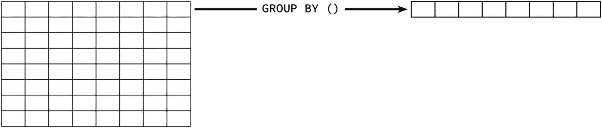
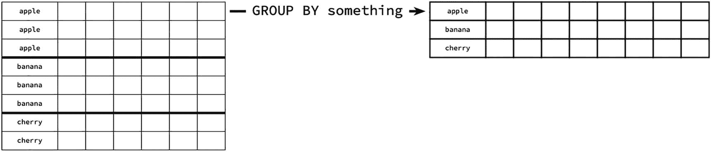
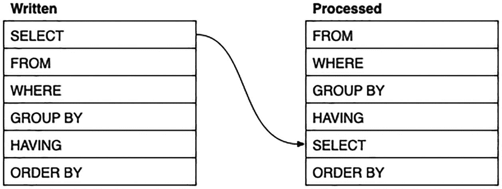
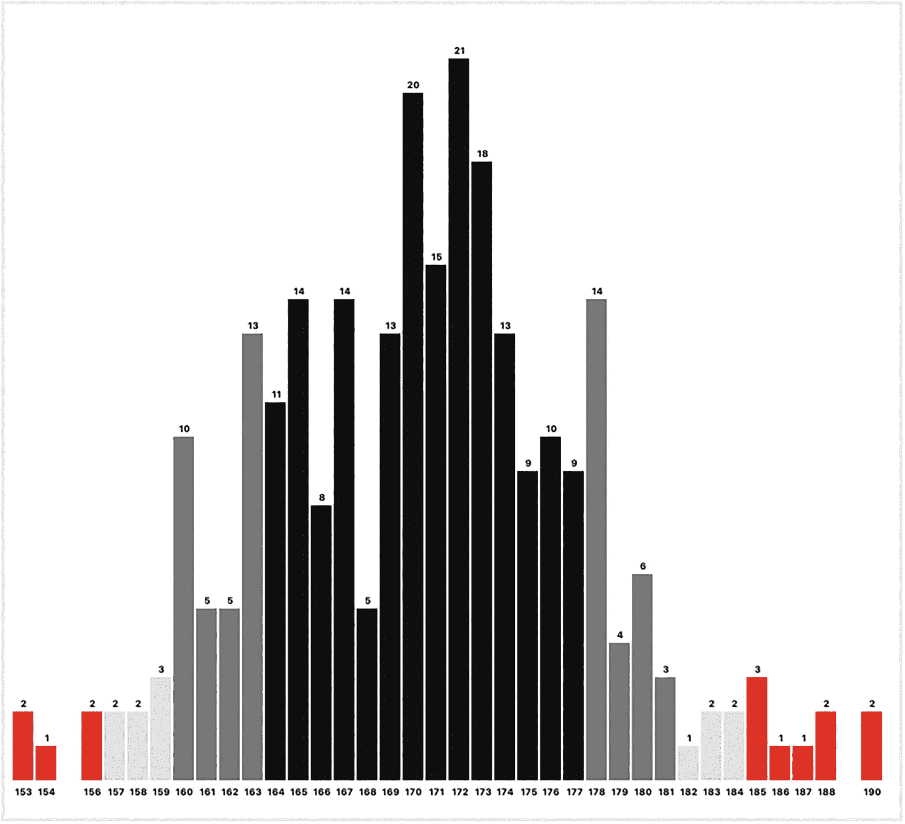

# 5. 汇总数据

数据库存储数据。这一点显而易见，但数据本身是相当静态的——你保存它，检索它，有时修改它。这对于某些需求来说没问题，但有时你希望数据能发挥更大作用。

当你开始对数据进行汇总时，就能让数据“工作”起来。这样你可以观察趋势、预见走向，或者仅仅是获得一个数据概览。

聚合函数用于计算数据的摘要。它们有三种应用场景：

*   对整张表进行汇总。
*   使用 `GROUP BY` 进行分组汇总。
*   逐行包含摘要。这是通过使用 `OVER` 子句的 `窗口函数` 来完成的。

你将在第 8 章学习窗口函数。在本章中，我们将探讨如何使用 SQL 内置的聚合函数来计算摘要，无论是整体还是分组计算。

### 基本聚合函数

毫无疑问，你已经对聚合函数有了一些经验。聚合函数本质上是统计性的，包括：

*   `count`

    计算一列中值的数量，无论实际值是什么。特殊情况是，`count(*)` 计算表中的行数。
*   `sum` 和 `avg`

    对列中的值进行求和或计算平均值。当然，这仅在该列是数值类型时才能进行。
*   `max` 和 `min`

    找出列中的最大或最小值。如果含义不明确的话，它们相当于使用 `ORDER BY` 时你会得到的第一个和最后一个值，当然，`NULL` 值总是被忽略。
*   `stddev`、`stddev_samp`、`stddev_pop` (PostgreSQL, MySQL/MariaDB, Oracle) 或 `stdev`、`stdevp` (MSSQL)

    计算列值的标准差。这可以是总体标准差或样本标准差。同样，这只适用于数值列。

    具体的函数名称（和拼写）在不同的数据库管理系统（DBMS）之间可能略有不同。PostgreSQL 将 `stddev` 视为 `stddev_samp` 的同义词。MySQL/MariaDB 将其视为 `stddev_pop` 的同义词。Oracle 将其视为 `stddev_samp` 的一种变体。

根据所使用的 DBMS，还存在其他各种聚合函数，但前面列出的这些是相当典型的。

例如：

```sql
--  图书数据
SELECT
--  计算行数：
count(*) AS nbooks,
--  计算一列中的值数：
count(price) AS prices,
--  最便宜和最贵的价格
min(price) AS cheapest, max(price) AS priciest
FROM books;
```

你会得到类似这样的结果：

| **nbooks** | **prices** | **cheapest** | **priciest** |
| --- | --- | --- | --- |
| 1201 | 1096 | 10 | 20 |

或者用于数值统计：

```sql
--  客户数据
SELECT
--  计算行数：
count(*) AS ncustomers,
--  计算一列中的值数：
count(phone) AS phones,
--  身高统计
stddev_samp(height) AS sd   --  MSSQL: stdev(height)
FROM customers;
```

你会得到类似这样的结果：

| **ncustomers** | **phones** | **sd** |
| --- | --- | --- |
| 303 | 286 | 6.992 |

所有这些函数都适用于数字，但只有以下函数可用于其他数据类型，如字符串和日期：

*   `count`
*   `max` 和 `min`

例如：

```sql
SELECT
--  计算一列中的值数：
count(dob) AS dobs,
--  最早和最晚的日期
min(dob) AS earliest, max(dob) AS latest
FROM customers;
```

得到

| **Dobs** | **earliest** | **latest** |
| --- | --- | --- |
| 239 | 1943-05-18 | 2003-01-27 |

我们在前面的描述中有些表述比较宽松。特别是：

*   表可以是虚拟表，例如视图、连接或公用表表达式。
*   任何带有 `WHERE` 子句的表都会在应用聚合函数*之前*进行过滤。
*   “值”我们肯定不包括 `NULL`。当你发现 `count()` 忽略 `NULL` 而 `avg()` 的除数是非 `NULL` 值时，这一点尤其明显。
*   这些函数适用于整张表或行组。

### `NULL`

聚合函数不包含 `NULL`。唯一不那么明显的情况是使用求和函数时。然而，需要注意以下几点：

*   `count(column)` 只会计数该列中的非 `NULL` 值，因此你得到的结果可能少于总行数。
*   `avg(column)` 也会忽略 `NULL` 值，因此平均值只除以值的数量，而不一定是行数。

换句话说，`NULL` 与 `0` 或 `''` 有着天壤之别。

我们稍后在研究聚合过滤器时，将会利用这一事实。


## 理解聚合

使用聚合函数有时会遇到一些问题，并且似乎有一些古怪的规则。如果你真正理解了聚合的工作原理，这一切就说得通了。

当你聚合数据时，原始数据实际上被转换成一个新的虚拟表，其中包含一个或多个分组的摘要。

例如，查询
```sql
SELECT
    count(*) AS rows,
    count(phone) AS phones
FROM customers;
```
可以被视为
```sql
SELECT
    count(*) AS rows,
    count(phone) AS phones
FROM customers
GROUP BY () --  仅 PostgreSQL, MSSQL, Oracle 有效
;
```

请注意，`GROUP BY ()` 子句并非适用于所有数据库管理系统（DBMS），例如 MariaDB/MySQL 或 SQLite。不过这没关系，因为分组无论如何都会发生。

关键是，无论有没有 `GROUP BY ()` 子句，只要 SQL 在查询中发现聚合函数，就会生成虚拟的汇总表。

在前面的例子中，数据被汇总成一个单行的虚拟汇总表。反过来，这个虚拟表包含每个列的总计，如图 5-1 所示。


图 5-1：形象化理解 GROUP BY ()

这就是为什么你不能在聚合查询中包含单个行数据。例如，这样就行不通：
```sql
SELECT
    id,                     --  哎呀
    count(*) AS rows,
    count(phone) AS phones
FROM customers;
```
你会得到一个错误消息，基本上告诉你不能在查询中使用 `id`。

请注意，在传统模式下的 MariaDB/MySQL 中，你确实可以成功运行此语句。但是，DBMS 会选择它能找到的第一个 `id`，而这实际上没有有意义的值。只有当你能够确定所有非聚合值都相同时，这个方法才主要有用。

当你包含一个更有意义的 `GROUP BY` 子句时，结果是类似的，除了：

* 现在每个组有一个汇总行。
* 每个分组列还会增加一个额外的列。

看起来如图 5-2 所示。


图 5-2：GROUP BY 某个字段

例如：
```sql
SELECT
    town, state,                --  分组列
    count(phone) AS phones, --  每个组的摘要：
    min(dob) AS oldest
FROM customerdetails
GROUP BY town, state;
```
你会得到类似这样的结果：

| **town** | **State** | **phones** | **oldest** |
| --- | --- | --- | --- |
| [NULL] | [NULL] | 24 | 1946-04-30 |
| The Gap | QLD | 5 | 1998-04-22 |
| Lilydale | TAS | 3 | 1945-08-31 |
| Guildford | WA | 3 | 1985-10-06 |
| Kingston | VIC | 2 | 1947-09-29 |
| Reedy Creek | NSW | 6 | 1960-12-30 |
| ~ 约 92 行 ~ |

（你可能会在开头或结尾得到一组 `NULL` 值，因为我们没有过滤掉 `NULL` 地址。）

在整体流程中，（虚拟的）`GROUP BY` 子句出现在 `FROM` 之后，并可能在 `WHERE` 子句之后，并在那个位置进行求值：
```sql
SELECT ...
FROM ...
WHERE ...
GROUP BY ...
--  SELECT
ORDER BY ...
```

通常，`SELECT` 在 `ORDER BY` 之前最后求值，尽管它在书写时写在最前面，如图 5-3 所示。


图 5-3：子句顺序

SQL 既不知道也不关心数据的实际含义，因此不会检查你是否应该将这些聚合函数应用于特定的列。

## 聚合部分值

在某些情况下，你可能只希望聚合列中的某些值。在这里，我们将看看如何聚合唯一值，以及如何筛选要聚合的值。

### 唯一值

大多数聚合函数可以应用于唯一值，但这可能在统计上是无效的。然而，如果你*计数*唯一值，它可能是有意义的，如下例所示：
```sql
SELECT
    count(state) AS addresses,
    count(DISTINCT state) AS states
FROM customerdetails;
```
这将统计客户详细信息中有多少个不同的州。这并不是说无论如何都不能计数 `state` 列，因为它表示有多少行具有任何地址信息：

| **Addresses** | **states** |
| --- | --- |
| 278 | 8 |

不过要小心。可能该列不能反映全貌。例如，如果你尝试
```sql
SELECT count(DISTINCT town) FROM customerdetails;
```
你会得到一个结果，但这可能会被误解。你得到的是不同的*城镇名称*，但其中许多城镇名称出现在不止一个州中。你不应该将此解释为不同的*城镇*。

至于其他聚合函数，通常对每个样本只应用任何其他统计计算是没有意义的。

### 聚合筛选器

通常，聚合函数应用于整个表或整个组。例如，`count(*)` 会计算表或组中的所有行。

一个相对较新的特性允许你将聚合函数应用于部分行。这可以在查询中多次应用。

例如，以下查询将统计 customers 表中的所有客户：
```sql
SELECT count(*) FROM customers;
```

假设你想将客户分为年轻客户和年长客户。

你可能会本能地尝试这样做：
```sql
--  别费心尝试这个：
SELECT
    count(dob='1980-01-01') AS younger
FROM customers;
```

如果前面的查询没有产生错误，很可能会被误解。

SQL 确实提供了一种有效的方法来筛选你想要筛选的内容。你可以输入：
```sql
--  PostgreSQL:
SELECT
    count(*) FILTER (WHERE dob='1980-01-01') AS younger
FROM customers;
```
你会得到类似这样的结果：

| **older** | **younger** |
| --- | --- |
| 133 | 106 |

不幸的是，这并没有得到很好的支持（目前仅在 PostgreSQL 中支持）。然而，以下替代方法可以实现相同的效果：
```sql
SELECT
    count(CASE WHEN dob='1980-01-01' THEN 1 END) AS young
FROM customers;
```
这使用 `CASE` 表达式来分离出生日期值。它们要么是 `1`，要么是 `NULL`，而 `count()` 函数只计算 `1`。

你也可以将此技术用于其他聚合函数。例如：
```sql
--  新标准
SELECT
    sum(total),
    sum(total) FILTER (WHERE ordered ='...') AS newer
FROM sales;
--  替代方法
SELECT
    sum(total),
    sum(CASE WHEN ordered='...' THEN total END) AS newer
FROM sales;
```
在这里，值要么是 `total`，要么是 `NULL`，而 `sum()` 会礼貌地忽略 `NULL`。

| **Sum** | **older** | **newer** |
| --- | --- | --- |
| 342836.22 | 162045 | 164873.22 |

但是，如果你有兴趣为不同的类别进行筛选，使用分组可能会更符合你的需求。


## 按计算值分组

前述技术是将不同组水平分隔，即每个值位于同一行。你也可以垂直分隔这些派生组。这是通过使用 `GROUP BY` 子句实现的。

你可能已经熟悉使用 `GROUP BY` 对简单的列值进行分组：
```sql
SELECT state, count(*)
FROM customerdetails
GROUP BY state;
```

你也可以按一个派生值进行分组。例如，你可以按客户的出生月份对他们进行分组：
```sql
--  PostgreSQL, Oracle
SELECT EXTRACT(month FROM dob) as monthnumber,
count(*) AS howmany
FROM customerdetails
GROUP BY EXTRACT(month FROM dob)
ORDER BY monthnumber;
--  MSSQL
SELECT month(dob) AS monthnumber, count(*) AS howmany
FROM customerdetails
GROUP BY month(dob)
ORDER BY monthnumber;
--  MySQL / MariaDB
SELECT month(dob) AS monthnumber, count(*) AS howmany
FROM customerdetails
GROUP BY month(dob)
ORDER BY monthnumber;
--  SQLite
SELECT strftime('%m',dob) as monthnumber,
count(*) AS howmany
FROM customerdetails
GROUP BY strftime('%m',dob)
ORDER BY monthnumber;
```

在此示例中，月份编号被命名为 `monthnumber`，同时也用于对结果进行排序。

| **月份编号** | **数量** |
| --- | --- |
| 1 | 19 |
| 2 | 14 |
| 3 | 17 |
| 4 | 23 |
| 5 | 24 |
| 6 | 15 |
| 7 | 27 |
| 8 | 18 |
| 9 | 18 |
| 10 | 24 |
| 11 | 17 |
| 12 | 23 |
| [NULL] | 64 |

请注意，计算出现了两次，一次在 `SELECT` 子句中，另一次在 `GROUP BY` 子句中。这是因为 `SELECT` 是在 `GROUP BY` 之后才进行求值的，所以，遗憾的是，它的别名在 `GROUP BY` 中还不可用。

这并不算真正的问题，因为 SQL 优化器会很乐意地复用该计算，所以实际上它只执行了一次计算。

不幸的是，月份编号不是很友好，因此我们可以使用月份名称。然而，不方便的是，月份名称的排序顺序不对，所以我们两者都需要：
```sql
--  非 SQLite
--  PostgreSQL, Oracle
SELECT EXTRACT(month FROM dob) as monthnumber,
to_char(dob,'Month') AS monthname,
count(*) AS howmany
FROM customerdetails
GROUP BY EXTRACT(month FROM dob), to_char(dob,'Month')
ORDER BY monthnumber;
--  MSSQL
SELECT month(dob) AS monthnumber,
datename(month,dob) AS monthname, count(*) AS howmany
FROM customerdetails
GROUP BY month(dob), datename(month,dob)
ORDER BY monthnumber;
--  MySQL / MariaDB
SELECT month(dob) AS monthnumber,
monthname(dob) AS monthname, count(*) AS howmany
FROM customerdetails
GROUP BY month(dob), monthname(dob)
ORDER BY monthnumber;
```

这样看起来好多了：

| **月份编号** | **月份名称** | **数量** |
| --- | --- | --- |
| 1 | January | 19 |
| 2 | February | 14 |
| 3 | March | 17 |
| 4 | April | 23 |
| 5 | May | 24 |
| 6 | June | 15 |
| 7 | July | 27 |
| 8 | August | 18 |
| 9 | September | 18 |
| 10 | October | 24 |
| 11 | November | 17 |
| 12 | December | 23 |
| [NULL] | [NULL] | 64 |

如你所见，在 SQLite 中无法完全做到这一点，因为它没有获取月份名称的函数。

从技术上讲，按两者分组是冗余的，因为每个月只有一个月份名称。但是，我们需要两者，以便我们可以显示一个，但按另一个排序。

尽管重复计算不是问题，但这确实使查询的可读性降低且更难维护。我们可以利用公用表表达式：
```sql
WITH cte AS (
...
)
SELECT monthname, count(*)
FROM cte
GROUP BY monthnumber, monthname
ORDER BY monthnumber;
```

你可以将 `GROUP BY` 与任何计算字段一起使用，但请注意：

*   由于简单的计算并不总是能产生值得分组的结果，因此你能用它们做的事情是有限的。
*   如前所述，计算需要同时出现在 `SELECT` 子句和 `GROUP BY` 子句中，这使得过程变得繁琐。

前面提到的第二点可以通过使用公用表表达式来缓解。第一点则可以通过使用 CASE 语句来解决。

### 使用 CASE 语句进行分组

基本的 `GROUP BY` 假定你已经有可以分组的值。有时，这样的值可以是派生的，例如月份或星期名称。

更任意的分组可以使用 `CASE` 语句创建。

例如，假设我们想统计年轻和年长的客户。我们可以通过使用一个 `CASE` 语句来区分他们：
```sql
CASE
WHEN dob<'1980-01-01' THEN 'older'
WHEN dob IS NOT NULL then 'younger'
--  ELSE NULL
END
```

请记住，一些 `dob` 可能为 `NULL`，所以你需要过滤掉它们才能得到年轻客户。还要记住，默认的 `ELSE` 是 `NULL`，所以我们不需要包含它。

为了统计他们，我们可以将此语句包含在 `GROUP BY` 子句中，如下所示：
```sql
SELECT count(*)
FROM customers
GROUP BY CASE
WHEN dob<'1980-01-01' THEN 'older'
WHEN dob IS NOT NULL then 'younger'
END;
```

这会给你一些结果：

| **计数** |
| 64 |
| 133 |
| 106 |

但如果没有某种标签，这些结果是无用的。我们可以通过在 `SELECT` 子句中重复该计算来实现：
```sql
SELECT
CASE
WHEN dob<'1980-01-01' THEN 'older'
WHEN dob IS NOT NULL then 'younger'
END AS agegroup,
count(*)
FROM customers
GROUP BY CASE
WHEN dob<'1980-01-01' THEN 'older'
WHEN dob IS NOT NULL then 'younger'
END;
```

这样就可以工作了：

| **年龄组** | **计数** |
| --- | --- |
| [NULL] | 64 |
| Older | 133 |
| Younger | 106 |

但从编码的角度来看，这比上一节中的计算列更糟糕，所以这绝对会受益于使用公用表表达式：
```sql
WITH cte AS (
SELECT
*,
CASE
WHEN dob<'1980-01-01' THEN 'older'
WHEN dob IS NOT NULL then 'younger'
END AS agegroup FROM customers
)
SELECT agegroup,count(*)
FROM cte
GROUP BY agegroup;
```

现在这将给你一个更易于管理的结果。

### 重新审视配送状态

还记得在之前的章节中，我们使用嵌套的 `CASE` 语句创建了配送统计信息：
```sql
WITH salesdata AS (
--  PostgreSQL, MariaDB / MySQL, Oracle
SELECT
ordered, shipped, total,
current_date - cast(ordered as date) AS ordered_age,
shipped - cast(ordered as date) AS shipped_age
FROM sales
--  MSSQL
SELECT
ordered, shipped, total,
datediff(day,ordered,current_timestamp)
AS ordered_age,
datediff(day,ordered,shipped) AS shipped_age
FROM sales
--  SQLite
SELECT
ordered, shipped, total,
julianday('now')-julianday(ordered) AS ordered_age,
julianday(shipped)-julianday(ordered) AS shipped_age
FROM sales
)
SELECT
ordered, shipped, total,
CASE
WHEN shipped IS NOT NULL THEN
CASE
WHEN shipped_age>14 THEN 'Shipped Late'
ELSE 'Shipped'
END
ELSE
CASE
WHEN ordered_age<7 THEN 'Current'
WHEN ordered_age<14 THEN 'Due'
ELSE 'Overdue'
END
END AS status
FROM salesdata;
```

（当然，删除未使用的 `SELECT` 语句。）你会得到：

| **订购日期** | **发货日期** | **总计** | **状态** |
| --- | --- | --- | --- |
| 2022-05-15 21:12:07.988741 | 2022-05-23 | 28 | Shipped |
| 2022-05-16 03:03:16.065969 | 2022-05-24 | 34 | Shipped |
| 2022-05-16 10:09:13.674823 | 2022-05-22 | 58.5 | Shipped |
| 2022-05-16 15:02:43.285565 | [NULL] | 50 | Overdue |
| 2022-05-16 16:48:14.674202 | 2022-05-28 | 17.5 | Shipped |
| [NULL] | [NULL] | 13 | Overdue |
| ~ 5549 行 ~ |

如果你想将其汇总到状态组中，你可以再次将整个语句放入一个 CTE，然后对该 CTE 进行汇总。你已经有一个 CTE 用于预计算时长，因此我们需要另一个 CTE 来保存前面的结果：
```sql
WITH
salesdata AS (
--  同上
),
statuses AS (
SELECT
ordered, shipped, total,
CASE
WHEN shipped IS NOT NULL THEN
CASE
WHEN shipped_age>14
THEN 'Shipped Late'
ELSE 'Shipped'
END
ELSE
CASE
WHEN ordered_age<7 THEN 'Current'
WHEN ordered_age<14 THEN 'Due'
ELSE 'Overdue'
END
END AS status
FROM salesdata
)
SELECT status, count(*) AS number
FROM statuses
GROUP BY status;
```

这将给你汇总的数据：

| **状态** | **数量** |
| --- | --- |
| Due | 94 |
| Current | 78 |
| Shipped | 3808 |
| Overdue | 1273 |
| Shipped Late | 296 |

下一步是让结果按正确的顺序显示。


## 按任意字符串排序

当然，当涉及对结果进行排序时，真正的问题在于 SQL 的想象力有限，它只会按字母顺序对字符串进行排序。这只在状态值本身也按字母顺序排列时才有效，但事实并非如此。

你可以采用几种方法：

*   你可以在每个字符串开头包含一个数字，然后使用 `ORDER BY`。这是一种取巧的办法，而且看起来不太合适。
*   你可以用另一个表来存储状态值及其位置编号，然后将该表连接到主查询中。这很复杂，但在某些情况下可能有用。
*   你可以用数字而不是字符串复制 `CASE` 表达式，并按该列排序。不幸的是，无法从单个 `CASE` 表达式中得到两列。这真的很混乱。
*   你通过字符串在更长字符串中的*位置*（`position`）来排序。

我们将采用最后一种方法，因为它易于实现且不会影响结果。

大多数 DBMS 都包含一个用于在更大字符串中查找子串的函数。它有各种名称和形式：

```sql
--  PostgreSQL
POSITION(substring IN string)
--  MariaDB / MySQL & SQLite
INSTR(substring,string)
--  Oracle
INSTR(string,substring)
--  MSSQL
CHARINDEX(substring,string)
```

在本例中，我们可以找到 `status` 字符串在包含按顺序排列的状态值的更长字符串中的位置：

```sql
'Shipped,Shipped Late,Current,Due,Overdue'
```

逗号不是必需的，但它们使字符串更具可读性。更重要的是，状态字符串按你期望的顺序排列，并且位置函数会为更早找到的字符串返回更低的值。剩下的就由 `ORDER BY` 子句来完成。

我们可以使用定位函数对前面的查询进行排序，如下所示：

```sql
WITH
salesdata AS (
--  如上所述
),
statuses AS (
--  如上所述
)
SELECT status, count(*) AS number
FROM cte
GROUP BY status
--  PostgreSQL
ORDER BY POSITION(status IN
'Shipped,Shipped Late,Current,Due,Overdue')
--  MariaDB / MySQL & SQLite
ORDER BY INSTR(status,
'Shipped,Shipped Late,Current,Due,Overdue')
--  Oracle
ORDER BY INSTR(status,
'Shipped,Shipped Late,Current,Due,Overdue')
--  MSSQL
ORDER BY CHARINDEX(status,
'Shipped,Shipped Late,Current,Due,Overdue')
;
```

你现在将按顺序得到结果：

| **状态** | **数量** |
| --- | --- |
| Shipped | 3808 |
| Shipped Late | 296 |
| Current | 78 |
| Due | 94 |
| Overdue | 1273 |

你可以将此技术用于任何非字母顺序的字符串排序，例如一周中的日子或彩虹中的颜色。

## 字符串拼接

还有一个函数可用于聚合字符串数据。此函数将使用可选的分隔符连接字符串。

这个函数有几个不同的名称：

| DBMS | 函数 |
| --- | --- |
| PostgreSQL | `string_agg(column, delimiter)` |
| SQL Server 2017+ | `string_agg(column, delimiter)` |
| SQLite | `group_concat(column, delimiter)` |
| MySQL and MariaDB | `group_concat(column /* ORDER BY column */SEPARATOR delimiter)` |
| Oracle | `listagg(column, delimiter)` |

例如，你可以用这种方式获取每位作者的所有书籍列表：

```sql
SELECT
a.id, a.givenname, a.familyname,
--  PostgreSQL, MSSQL
string_agg(b.title, '; ') AS works
--  SQLite
--  group_concat(b.title, '; ') AS works
--  Oracle
--  listagg(b.title, '; ') AS works
--  MariaDB / MySQL
--  group_concat(b.title SEPARATOR '; ') AS works
FROM authors AS a LEFT JOIN books AS b ON a.id=b.authorid
GROUP BY a.id, a.givenname, a.familyname;
```

你将得到类似这样的结果：

| **id** | **givenname** | **familyname** | **works** |
| --- | --- | --- | --- |
| 146 | Washington | Irving | Rip Van Wink ...; Tales of the ...; The ... |
| 963 | Richard | Marsh | The Beetle ... |
| 390 | Jean | Racine | Andromaque ...; Britannicus ...; Bérénice ... |
| 766 | Evelyn | Everett-Green | True to the ... |
| 296 | Henri | Bergson | Matter and M ...; Laughter ...; Time and Fre ... |
| 464 | Ambrose | Bierce | An Occurrenc ...; The Monk and ...; Tales ... |
| ~ 488 行 ~ |

`works` 列包含所有用 `;` 连接起来的书名。注意，`GROUP BY` 子句使用了作者 `id`，但也包含了冗余的作者姓名以便选择它们。

不过要小心。很容易对这个函数过度使用，你会看到书籍列表可能非常长，而连接后的字符串也可能变得非常、非常长。

## 使用分组集汇总总计

传统上，使用 `GROUP BY` 会给出每组组合的总计。例如：

```sql
SELECT state, town, count(*)
FROM customerdetails
GROUP BY state, town;
```

将给出每个 `state`/`town` 组合的细分小计。

有时，你可能希望包含这些小计的汇总，例如每个 `state` 的总计以及总体总计。

通常，你会认为**总计**（`total`）是求和，而**小计**（`subtotal`）是子组的总和。这暗示着要使用 `sum()` 函数。在本次讨论中，我们将更宽松地使用术语，将这个词用于任何聚合，例如 `count()`。在这里，小计将意味着对子组进行计数。

在前面的示例中，你可以获得四种可能的总计：

*   每个 `state`/`town` 组合的 `count()`；这是你通常得到的。
*   每个 `state` 组的 `count()`。
*   每个 `town` 组的 `count()`。在这个例子中，它不太有用，因为有些城镇名称在各州之间重复，因此你会合并本不应合并的值。然而，在其他例子中，这会很有用。
*   整个日志的 `count()`——总计。

除了最后一个，其他都可以被认为是某种程度上的小计。

当我们稍后处理这个例子时，我们将按三列进行聚合，将会有八种组合，因此我们可以计算八个总计和小计。

现代 SQL 允许你生成一个包含表数据和聚合数据的总计和小计组合的结果集。根据 DBMS 的不同，这可能包括对 `GROUP BY` 子句的修改：

*   `GROUPING SETS` 允许你指定要包含哪些附加汇总。例如，你可以决定包含前面四种可能性中的哪几种。
    PostgreSQL、Microsoft SQL 和 Oracle 支持此功能。
*   `ROLLUP` 是 `GROUPING SETS` 的简化版本，它产生*部分*可能的小计，将列视为层次结构。在前面的示例中，你将获得 `state`/`town`、`state` 和总计。
    PostgreSQL、Microsoft SQL、Oracle 和 MariaDB/MySQL 支持此功能。
*   `CUBE` 也是 `GROUPING SETS` 的专门版本，它产生*所有*可能的小计。在前面的示例中，它就是所有四种可能的总计。

在这里，我们将看看如何生成这样的汇总。但是，我们不会处理客户的地址，而是看一下销售数据。


## 准备用于汇总的数据

通常情况下，你的原始数据可能并未完全准备好用于汇总。例如，`sales` 表包含了每笔订单的 `time`，但对其进行分组可能非常困难。在我们的示例中，我们将致力于汇总以下内容：

*   订单的月份
*   客户 ID
*   客户居住的州

请注意，这三个列彼此独立，不像原始示例中的 `state` 和 `town` 那样。这意味着对任意组合进行合计都是有意义的。

为了准备数据，我们可以使用以下查询：

```sql
SELECT
--  PostgreSQL, Oracle
to_char(s.ordered,'YYYY-MM') AS ordered,
--  MariaDB / MySQL
--  date_format(s.ordered,'%Y-%m') AS ordered,
--  MSSQL
--  format(s.ordered,'yyyy-MM') AS ordered,
--  SQLite
--  strftime('%Y-%m',s.ordered) AS ordered,
s.total, c.id, c.state
FROM sales AS s JOIN customerdetails AS c
ON s.customerid=c.id
WHERE s.ordered IS NOT NULL;
```

你会看到类似这样的结果：

| **ordered** | **total** | **id** | **state** |
| --- | --- | --- | --- |
| 2022-05 | 28 | 28 | NSW |
| 2022-05 | 34 | 27 | NSW |
| 2022-05 | 58.5 | 1 | WA |
| 2022-05 | 50 | 26 | VIC |
| 2022-05 | 17.5 | 26 | VIC |
| 2022-07 | 15 | 105 | VIC |
| ~ 5295 行 ~ |

没有哪个版本的 SQL 提供了一种直接提取年-月组合的简单方法，所以我们使用一个格式化函数。它返回一个字符串，但这对于我们想要用它做的事情来说没问题。

在使用这个查询时，你可以在一个 CTE（公共表表达式）中使用它，但这并不是很方便，所以我们将其保存为一个视图：

```sql
DROP VIEW IF EXISTS salesdata;  --  非 Oracle 语法
CREATE VIEW salesdata AS
SELECT
--  PostgreSQL, Oracle
to_char(s.ordered,'YYYY-MM') AS ordered,
--  MariaDB / MySQL
--  date_format(s.ordered,'%Y-%m') AS ordered,
--  MSSQL
--  format(s.ordered,'yyyy-MM') AS ordered,
--  SQLite
--  strftime('%Y-%m',s.ordered) AS ordered,
s.total, c.id, c.state
FROM sales AS s JOIN customerdetails AS c
ON s.customerid=c.id
WHERE s.ordered IS NOT NULL;
```

如果你使用的是 Microsoft SQL Server，记得将你的 `CREATE VIEW` 语句用一对 `GO` 包围起来：

```sql
-- MSSQL DROP VIEW IF EXISTS salesdata;
GO
CREATE VIEW salesdata AS
SELECT
format(s.ordered,'yyyy-MM') AS ordered,
s.total, c.id, c.state
FROM sales AS s JOIN customerdetails AS c
ON s.customerid=c.id
WHERE s.ordered IS NOT NULL;
GO
```

首先，我们将分别生成汇总结果，然后用一个 `UNION` 子句将它们组合起来。

## 使用 UNION 子句组合汇总结果

大多数数据库管理系统（DBMS）都有一种更简单的方法来完成此操作，但通过（不太）漫长的方式来做，你会更好地理解这一切是如何工作的。

首先，你可以使用以下查询按州、客户 ID 和日期获取汇总：

```sql
--  所有分组汇总
SELECT state, id, ordered, count(*) AS nsales, sum(total) AS total
FROM salesdata
GROUP BY state,id,ordered
ORDER BY state,id,ordered;
```

你会得到每个州/客户 ID/订单日期组合的汇总。

| **state** | **id** | **ordered** | **nsales** | **total** |
| --- | --- | --- | --- | --- |
| ACT | 85 | 2022-06 | 2 | 117 |
| ACT | 85 | 2022-07 | 2 | 104.5 |
| ACT | 85 | 2022-08 | 5 | 269.5 |
| ACT | 85 | 2022-09 | 3 | 253.5 |
| ACT | 85 | 2022-10 | 5 | 476 |
| ACT | 85 | 2022-11 | 3 | 179.5 |
| ~ 1802 行 ~ |

下一步是生成按州和客户 ID 的汇总：

```sql
--  州, 订单日期 汇总
SELECT
state, id, NULL, count(*) AS nsales,
sum(total) AS total
FROM salesdata
GROUP BY state, id
ORDER BY state, id;
--  州 汇总
SELECT
state, NULL, NULL, count(*) AS nsales,
sum(total) AS total
FROM salesdata
GROUP BY state
ORDER BY state;
```

你会得到类似以下的结果：

| state | id | ?column? | nsales | total |
| --- | --- | --- | --- | --- |
| ACT | 85 | [NULL] | 37 | 2418.5 |
| ACT | 112 | [NULL] | 20 | 1272.5 |
| ACT | 147 | [NULL] | 32 | 2202 |
| ACT | 355 | [NULL] | 13 | 689.5 |
| ACT | 489 | [NULL] | 3 | 199 |
| NSW | 10 | [NULL] | 48 | 2931.5 |
|  ~ 266 行 |

以及

| state | ? | ? | nsales | total |
| --- | --- | --- | --- | --- |
| ACT | [NULL] | [NULL] | 105 | 6781.5 |
| NSW | [NULL] | [NULL] | 1668 | 102010.22 |
| NT | [NULL] | [NULL] | 103 | 6151 |
| QLD | [NULL] | [NULL] | 869 | 53331.5 |
| SA | [NULL] | [NULL] | 499 | 30977.5 |
| TAS | [NULL] | [NULL] | 456 | 28193 |
| VIC | [NULL] | [NULL] | 1273 | 79199.5 |
| WA | [NULL] | [NULL] | 322 | 20274 |

不用担心缺失的列名，我们会在 `UNION` 中得到它们。

包含所有这些 `NULL` 的原因是为了在 `UNION` 中组合结果时对齐列。

最后，获取总计：

```sql
--  总计
SELECT
NULL, NULL, NULL, count(*) AS nsales,
sum(total) AS total
FROM salesdata
--  GROUP BY ()
;
```

这会给你一行总计结果：

| **?** | **?** | **?** | **nsales** | **total** |
| --- | --- | --- | --- | --- |
| [NULL] | [NULL] | [NULL] | 5295 | 326918.22 |

注意这里包含了被注释掉的 `GROUP BY ()` 子句，只是为了提醒这是一个总计；当然，你并不需要它。

`UNION` 子句可用于组合多个 `SELECT` 语句的结果。唯一的要求是它们的列数和列类型匹配。

```sql
--  所有分组汇总
SELECT
state, id, ordered, count(*) AS nsales,
sum(total) AS total
FROM salesdata
GROUP BY state,id,ordered
--  州, 客户 ID 汇总
UNION
SELECT state, id, NULL, count(*), sum(total)
FROM salesdata
GROUP BY state,id
--  州 汇总
UNION
SELECT state, NULL, NULL, count(*), sum(total)
FROM salesdata
GROUP BY state
--  总计
UNION
SELECT NULL, NULL, NULL, count(*), sum(total)
FROM salesdata
--  排序
ORDER BY state,id,ordered;
```

现在你得到了合并后的结果：

| state | id | ordered | nsales | total |
| --- | --- | --- | --- | --- |
| ACT | 85 | 2022-06 | 2 | 117 |
| ACT | 85 | 2022-07 | 2 | 104.5 |
| ACT | 85 | 2022-08 | 5 | 269.5 |
| ACT | 85 | 2022-09 | 3 | 253.5 |
| ACT | 85 | 2022-10 | 5 | 476 |
| ACT | 85 | 2022-11 | 3 | 179.5 |
| ACT | 85 | 2022-12 | 2 | 84 |
| ACT | 85 | 2023-01 | 4 | 248.5 |
| ACT | 85 | 2023-03 | 3 | 209 |
| ACT | 85 | 2023-04 | 6 | 384 |
| ACT | 85 | 2023-05 | 2 | 93 |
| ACT | 85 | [NULL] | 37 | 2418.5 |
| ACT | 112 | 2022-07 | 2 | 72 |
| ACT | 112 | 2022-08 | 2 | 78 |
| ACT | 112 | 2022-09 | 1 | 49 |
| ACT | 112 | 2022-10 | 1 | 70.5 |
| ~ 2077 行 |


请注意，在 `UNION` 中，只有第一个查询为销售数量和总金额设置了别名；第一个查询的列名适用于整个结果集。如果这让你感觉更好，你可以为其余部分添加别名，但这不会产生任何影响。

当组合不同级别的汇总时，较高级别的汇总中会出现 `NULL` 而不是实际值。这是正确的，但很不方便：

- 当排序时，`NULL` 可能出现在列表的开头或结尾。SQL 标准对此态度模糊，不同的数据库管理系统（DBMS）有不同的看法，有些甚至让你选择。
- 无论如何，结果集中的 `NULL` 是不清晰且无用的。

为了解决排序问题，我们可以添加一个特殊值来强制排序顺序：

```sql
--  所有分组汇总
SELECT
state, id, ordered, count(*) AS nsales,
sum(total) AS total,
0 AS state_level, 0 AS id_level, 0 AS ordered_level
FROM salesdata
GROUP BY state,id,ordered
--  state, ordered 汇总
UNION
SELECT
state, id, NULL, count(*), sum(total),
0, 0, 1
FROM salesdata
GROUP BY state,id
--  state 汇总
UNION
SELECT
state, NULL, NULL, count(*), sum(total),
0, 1, 1
FROM salesdata
GROUP BY state
--  总计
UNION
SELECT
NULL, NULL, NULL, count(*), sum(total),
1, 1, 1
FROM salesdata
--  排序
ORDER BY state_level, state, id_level, id,
ordered_level, ordered;
```

为了得到正确的结果顺序，我们引入了两个值 `state_level` 和 `town_level`，这样我们就可以将总计行推到其他值之下。

| **state** | **id** | **ordered** | **nsales** | **total** | **state_level** | **id_level** | **ordered_level** |
| --- | --- | --- | --- | --- | --- | --- | --- |
| ACT | 85 | 2022-06 | 2 | 117 | 0 | 0 | 0 |
| ACT | 85 | 2022-07 | 2 | 104.5 | 0 | 0 | 0 |
| ACT | 85 | 2022-08 | 5 | 269.5 | 0 | 0 | 0 |
| ACT | 85 | 2022-09 | 3 | 253.5 | 0 | 0 | 0 |
| ACT | 85 | 2022-10 | 5 | 476 | 0 | 0 | 0 |
| ACT | 85 | 2022-11 | 3 | 179.5 | 0 | 0 | 0 |
| ACT | 85 | 2022-12 | 2 | 84 | 0 | 0 | 0 |
| ACT | 85 | 2023-01 | 4 | 248.5 | 0 | 0 | 0 |
| ACT | 85 | 2023-03 | 3 | 209 | 0 | 0 | 0 |
| ACT | 85 | 2023-04 | 6 | 384 | 0 | 0 | 0 |
| ACT | 85 | 2023-05 | 2 | 93 | 0 | 0 | 0 |
| ACT | 85 | [NULL] | 37 | 2418.5 | 0 | 0 | 1 |
| ACT | 112 | 2022-07 | 2 | 72 | 0 | 0 | 0 |
| ACT | 112 | 2022-08 | 2 | 78 | 0 | 0 | 0 |
| ACT | 112 | 2022-09 | 1 | 49 | 0 | 0 | 0 |
| ACT | 112 | 2022-10 | 1 | 70.5 | 0 | 0 | 0 |
| ~ 2077 rows ~ |

为了从结果集中消除排序列，你可以将其转换为公用表表达式（Common Table Expression）：

```sql
WITH cte AS (
--  上面的 UNION 查询
)
SELECT state, id, ordered, nsales, total
FROM cte
ORDER BY state_level,state,id_level,id,ordered_level,ordered;
```

虽然得到这个结果需要一些工作，但可能有更简单的方法。

### 使用 GROUPING SETS、CUBE 和 ROLLUP

分组集（`GROUPING SETS`）为上面的 `UNION` 提供了一种更简单的替代方案。它们的语法不是立即显而易见的，但遵循与 `GROUP BY` 子句类似的模式。

并非所有数据库管理系统都完全支持分组集。大多数支持一个更简单的版本，但 SQLite 完全不支持。如果你使用 SQLite，你能做的最好就是像我们之前用 `UNION` 所做的那样。

在大多数情况下，你可能想要的是稍后描述的 `ROLLUP`。

#### GROUPING SETS 和 CUBE（PostgreSQL、MSSQL 和 Oracle）

最通用的技术是使用 `GROUPING SETS` 子句。在此子句中，你可以指定要包含在汇总中的列的组合。

语法是

```sql
SELECT columns
FROM table
GROUP BY GROUPING SETS ((set),(set));
```

回想一下，前面的例子有按 `state`、客户 `id`、`ordered` 日期分组的 `SELECT` 语句，以及一个总计。这可以按如下方式生成：

```sql
SELECT state,town,count(*)
FROM customers
GROUP BY GROUPING SETS ((state,id,ordered),(state,id),(state),());
```

这里，集合 `()` 表示总计。

还可以使用许多其他组合（例如 `(state,ordered)`）。如果你真的想要所有组合，可以使用 `CUBE`：

```sql
SELECT state, id, ordered, count(*), sum(total)
FROM salesdata
GROUP BY CUBE (state,id,ordered)
```

当你没有太多分组列，并且它们彼此都无关时，`CUBE` 变体效果最好。记住，三列会给你八种可能的组合。可能性的数量可以计算为 `2^n`，其中 `n` 是列数。在这种情况下，是 `2³ = 8`。如果你有四列，你将有 16 种可能的总计和小计，这可能开始变得难以处理。

#### 使用 ROLLUP（PostgreSQL、MSSQL、Oracle 和 MariaDB/MySQL）

一个更简单、更易读（但灵活性稍差）的替代方法是使用 `ROLLUP`。它有两种形式：

```sql
--  ROLLUP(...)       -   PostgreSQL, MSSQL, Oracle
SELECT state, id, ordered, count(*), sum(total)
FROM salesdata
GROUP BY ROLLUP (state, id, ordered);
--  ... WITH ROLLUP   -   MariaDB / MySQL, MSSQL
SELECT state, id, ordered, count(*), sum(total)
FROM salesdata
GROUP BY state, id, ordered WITH ROLLUP;
```

两种形式都会给你相同的结果。请注意，MSSQL 允许你选择使用任一形式。

`ROLLUP` 做出了一个重要假设，即这些列形成了某种层次结构。在客户 `state` 和客户 `id` 的情况下，这是显而易见的。你是否将 `ordered` 日期视为层次结构的末端取决于你。

你可以在结果中看到这种层次结构，并且它与之前的 `GROUPING SETS` 示例相匹配。你将获得以下结果：

1.  `(state, id, ordered)` 组合
2.  `(state, id)` 组合
3.  `(state)` 值
4.  `()` – 总计

显然，使用 `ROLLUP` 是获得这些结果的更简单方法，你可能不会太怀念 `GROUPING SETS` 的灵活性。


## 概述

### 排序结果

在一些数据库管理系统中，您可能会看到结果自动按之前 `UNION` 版本相同的顺序排序。在其他系统中，您需要自己进行排序。

这又遇到了前面提到的与 `UNION` 版本相关的两个问题。为了解决第二个问题，即排序顺序问题，我们可以使用 `grouping(column)` 函数，它指示被汇总列的层级。值为 `1` 表示这是一个汇总行，`0` 表示不是。这将与前面虚构的层级列具有相同的效果：

```sql
--  ROLLUP(...):      PostgreSQL, MSSQL, Oracle
SELECT state, id, ordered, count(*), sum(total)
FROM salesdata
GROUP BY ROLLUP (state,id,ordered)
ORDER BY grouping(state), state, grouping(id), id,
grouping(ordered), ordered;
--  ... WITH ROLLUP: MySQL, MSSQL
--  (MariaDB 不支持 grouping())
SELECT state, id, ordered, count(*), sum(total)
FROM salesdata
GROUP BY state,id,ordered WITH ROLLUP
ORDER BY grouping(state), state, grouping(id), id,
grouping(ordered), ordered;
```

您将获得一个排序更好的表。

请注意，虽然 MySQL 支持 `grouping()`，但 MariaDB *不支持* `grouping()` 函数！

在 PostgreSQL 和 MySQL 中，您可以在多个列上使用 `grouping()`。这将给出一个组合层级，它是 `1` 和 `0` 的二进制组合。在 MSSQL 和 Oracle 中，您需要使用 `grouping_id()` 函数来实现这一点。

为了解决第一个问题，即无意义的 `NULL` 标记问题，我们必须对 `SELECT` 子句进行更有创意的处理。在这种情况下，我们可以使用 `coalesce` 来选取 `NULL` 并提供替代值：

```sql
--  PostgreSQL, MSSQL;
SELECT
coalesce(state,'National Total') AS state,
coalesce(cast(id as varchar),state||' Total') AS id,
coalesce(ordered,'Total for '||cast(id as varchar))
AS ordered,
count(*), sum(total)
FROM salesdata
GROUP BY ROLLUP (state,id,ordered)
ORDER BY grouping(state), state,
grouping(id), id, grouping(ordered), ordered;
--  MySQL, MSSQL (MariaDB 不支持 grouping())
SELECT
coalesce(state,'National Total') AS state,
coalesce(cast(id as varchar),state||' Total') AS id,
coalesce(ordered,'Total for '||cast(id as varchar))
AS ordered,
count(*), sum(total)
FROM salesdata
GROUP BY state,id,ordered WITH ROLLUP
ORDER BY grouping(state), state,
grouping(id), id, grouping(ordered), ordered;
--   NOT Oracle
```

这将为您在汇总行提供一些有意义的内容。

### 在 Oracle 中重命名值

您会注意到这对 Oracle 无效。在这方面，Oracle 被证明是无帮助的，因为 (a) `NULL` 字符串等同于空字符串 (`''`)，因此它们不会合并，(b) 所选列不再被认为匹配 `GROUP BY` 子句，以及 (c) 当您进行了其他更改后，在使用 `grouping()` 函数排序时也会遇到问题。

使其工作的最直接方法是对列使用 `CASE` 表达式：

```sql
SELECT
coalesce(state,'National Total') AS state,
grouping(state) AS statelevel,
CASE
WHEN state IS NULL THEN NULL
WHEN id IS NULL THEN 'Total for '||state
ELSE cast(id AS varchar(3))
END AS id,
grouping(id) AS idlevel,
CASE
WHEN id IS NULL THEN NULL
WHEN ordered IS NULL THEN
'Total for '||cast(id as varchar(3))
ELSE ordered
END AS ordered,
grouping(ordered) AS orderedlevel,
count(*) AS count, sum(total) AS sum
FROM salesdata
GROUP BY ROLLUP (state,id,ordered)
ORDER BY statelevel, state, idlevel, id, orderedlevel, ordered
;
```

它看起来像这样：

| **state** | statelevel | **id** | idlevel | **ordered** | orderedlevel | **count** | **sum** |
| --- | --- | --- | --- | --- | --- | --- | --- |
| ACT | 0 | 112 | 0 | 2022-07 | 0 | 2 | 72 |
| ACT | 0 | 112 | 0 | 2022-08 | 0 | 2 | 78 |
| ACT | 0 | 112 | 0 | 2022-09 | 0 | 1 | 49 |
| ACT | 0 | 112 | 0 | 2022-10 | 0 | 1 | 70.5 |
| ACT | 0 | 112 | 0 | 2022-11 | 0 | 1 | 94 |
| ACT | 0 | 112 | 0 | 2022-12 | 0 | 4 | 224 |
| ACT | 0 | 112 | 0 | 2023-01 | 0 | 1 | 48.5 |
| ACT | 0 | 112 | 0 | 2023-02 | 0 | 5 | 320 |
| ACT | 0 | 112 | 0 | 2023-03 | 0 | 2 | 191.5 |
| ACT | 0 | 112 | 0 | 2023-05 | 0 | 1 | 125 |
| ACT | 0 | 112 | 0 | Total for 112 | 1 | 20 | 1272.5 |
| ACT | 0 | 147 | 0 | 2022-08 | 0 | 8 | 392 |
| ACT | 0 | 147 | 0 | 2022-09 | 0 | 2 | 199.5 |
| ACT | 0 | 147 | 0 | 2022-10 | 0 | 2 | 162 |
| ACT | 0 | 147 | 0 | 2022-11 | 0 | 3 | 228.5 |
| ACT | 0 | 147 | 0 | 2022-12 | 0 | 3 | 251 |
| ~ 2077 行 ~ |

这里，`grouping()` 函数在 `SELECT` 子句中使用，然后用于排序。`id` 和 `ordered` 列使用 `CASE ... END` 表达式计算，以解决 `NULL` 字符串的问题。

当然，现在您有那三个用于排序的额外列。要隐藏它们，您可以使用 CTE：

```sql
WITH cte AS (
-- 上面的 SELECT 语句
--  无需包含 ORDER BY 子句
)
SELECT state, id, ordered, count, sum
FROM cte
ORDER BY statelevel, state, idlevel, id, orderedlevel, ordered
;
```

顺便说一下，前面的语句包含了 `ORDER BY` 子句。您可以将其包含在 CTE 中（在 MSSQL 中不行），但这是不必要的，因为我们在主查询中无论如何都会进行排序，所以您应该省略它。

### 直方图、平均值、众数和中位数

您可能在学校学过一些简单的统计知识。以下是一些基本概念的提醒：

*   **频数表** 是值及其出现频率的表格。
*   **平均值**，或更专业地称为 **算术平均数**，就是我们通常所说的 **平均值**：它是总和除以值的个数。
*   **众数** 是出现最频繁的值。
*   **中位数** 是值的中间值（如果它们都按顺序排列）。

您可以使用频数表生成 **直方图**，这就是电子表格程序所说的条形图。例如，您可以生成按身高（厘米）划分的客户数量的频数表和直方图。它看起来像图 5-4。



直方图说明了正态分布。大多数值落在 166 到 177 之间。

图 5-4

直方图

如果您的值基于多个不同的因素，它们倾向于沿着众所周知的“钟形曲线”分布。大多数值出现在中间附近，离中间越远，值出现的频率就越低。这更专业地称为 **正态分布**。

您的身高取决于许多因素，其中一些包括遗传、饮食和其他生活方式因素。因此，正如您在上图中看到的那样，客户身高往往遵循正态分布。当然，如果我们有更大的数据集合，这种趋势会变得更强：如果只有几百个样本，那么数据就不会那么紧密地拟合。

出于本次讨论的目的，我们将重点讨论客户身高，因为它们往往更容易以这种方式进行分析。

尽管样本数据是随机的，但它是按照小样本中可能预期的正态分布生成的。

对于澳大利亚成年人，平均身高约为 168.7 厘米。实际上，有两个平均身高，一个是成年女性，一个是成年男性，但两者的平均值是 168.7 厘米。标准差是 7 厘米。您可以在 [`https://en.wikipedia.org/wiki/Average_human_height_by_country`](https://en.wikipedia.org/wiki/Average_human_height_by_country) 获取更多信息。


### 计算均值

在统计学和数学中，“平均值”这个词有些模糊，因为有多种测量方式可以描述平均情况。我们这里感兴趣的是**算术平均值**。你已经有一个内置的聚合函数 `avg()` 来计算平均值：

```sql
SELECT avg(height) AS mean FROM customers;
```

你将得到类似下面的结果：

| **平均值** |
| 170.844 |

如果愿意，你可以使用 `sum(height)/count(height)` 来计算平均值，但这除了证明两者相同外，没有其他意义。

这个数字相当合理。成年人的平均身高约为 168.7 厘米。

### 生成频率表

频率表列出了一个值在表中出现的次数。如果这听起来像是你以前做过的事情，那你是对的。这只不过是结合使用 `GROUP BY` 和 `count(*)`。

然而，首先我们需要让数据更容易分组。如果数据粒度太细，就不会有太多重复项——讽刺的是，细节过多反而难以总结。

这里，身高测量到了 0.1 厘米。我们将通过将其四舍五入到整数厘米来准备数据：

```sql
SELECT floor(height+0.5) AS height
FROM customers
WHERE height IS NOT NULL;
```

我们还过滤掉了缺失的身高值，为你提供

| **身高** |
| 169 |
| 171 |
| 153 |
| 176 |
| 156 |
| 176 |
| ~ 267 行 ~ |

我们本可以使用 `round()` 函数进行四舍五入，但某些数据库管理系统倾向于四舍五入到最近的偶数，因此上述方法会更可靠。

将数据放入一个公共表表达式中，然后我们可以使用简单的 `GROUP BY` 查询：

```sql
WITH heights AS (
SELECT floor(height+0.5) AS height
FROM customers
WHERE height IS NOT NULL
)
SELECT height, count(*) AS frequency
FROM heights
GROUP BY height
ORDER BY height;
```

这将得到

| **身高** | **频数** |
| --- | --- |
| 153 | 1 |
| 154 | 3 |
| 156 | 1 |
| 157 | 3 |
| 158 | 1 |
| 159 | 2 |
| ~ 36 行 ~ |

注意可能存在一些缺失值。这很自然，尤其是在我们这样相对较小的样本中。然而，由于这些间隔，它还不完全适合制作直方图。稍后，当我们更仔细地研究递归公共表表达式时，我们将看到如何填补这些空白。

### 计算众数

众数是出现最频繁的值。实际上，可能有多个众数并列第一。

要获得众数，你首先需要获得频数，然后找到最大频数。原则上，你是在寻找 `max(count(*))`，但你不能像那样嵌套聚合函数。这意味着需要多一步操作，而这又意味着需要更多的公共表表达式。

从前面的频率表开始，我们可以将结果放入另一个公共表表达式中：

```sql
WITH
heights AS (
SELECT floor(height+0.5) AS height
FROM customers
WHERE height IS NOT NULL
),      --  别忘了在这里加逗号
frequency_table AS (
SELECT height, count(*) AS frequency
FROM heights
GROUP BY height
)
...
```

你还需要最大频数，这必须作为一个单独的步骤来计算：

```sql
WITH
heights AS (
...
),
frequency_table AS (
...
),      --  别忘了在这里加逗号
limits AS (
SELECT max(frequency) AS max FROM frequency_table
)
...
```

最后，你可以将频率表与 `limits` 公共表表达式进行交叉连接，以找到众数：

```sql
WITH
heights AS (
...
),
frequency_table AS (
...
),
limits AS (
...
)
SELECT height, frequency
FROM frequency_table,limits
WHERE frequency_table.frequency=limits.max
ORDER BY height;
```

你将得到类似下面的结果：

| **身高** | **频数** |
| --- | --- |
| 172 | 22 |

在一组完美的正态数据中，众数应该与均值完全匹配。在现实生活中，它应该是接近的。

### 计算中位数

中位数是中间值。这意味着一半的值应低于中位数，一半应高于中位数。

要找到中位数，需要将所有值排序并找到中点。如果你愿意，可以这样做，但这涉及到我们尚未掌握的一些技巧，特别是获取行号。我们将在后面关于窗口函数的章节中探讨这一点。

幸运的是，现代 SQL 包含一个名为 `percentile_cont` 的函数。不幸的是，并非所有数据库管理系统都以相同方式使用它，而 SQLite 则完全不支持它。

`percentile_cont()` 函数根据百分位数来查找值。百分位数是按 100 组分组。第 50 百分位数将位于中间。

要在 PostgreSQL 中查找中位数：

```sql
--  PostgreSQL: 仅聚合函数
SELECT percentile_cont(0.5)
WITHIN GROUP (ORDER BY height)
FROM customers
WHERE height IS NOT NULL;
```

这应该会给出类似的结果

| **percentile_cont** |
| 171.2 |

如注释所述，在 PostgreSQL 中，`percentile_cont()` 仅是一个聚合函数，而这正是我们想要的。

聚合函数的替代方案是什么？它是我们稍后将研究的窗口函数之一。窗口函数类似于聚合函数，但它为每一行计算，而不仅仅是作为一个摘要。

使用窗口函数版本，我们可以用

```sql
--  MySQL / MariaDB, MSSQL, Oracle: 仅窗口函数
SELECT percentile_cont(0.5)
WITHIN GROUP (ORDER BY height) OVER()
FROM customers
WHERE height IS NOT NULL;
```

问题是你将在多行中得到相同的值。为了完成这项工作，你可以使用 `DISTINCT`：

```sql
--  MySQL / MariaDB, MSSQL, Oracle: 仅窗口函数
SELECT DISTINCT percentile_cont(0.5)
WITHIN GROUP (ORDER BY height) OVER()
FROM customers
WHERE height IS NOT NULL;
```

这样现在就会给你中位数。

### 标准差

标准差是衡量数据变化程度的指标。对于正态分布，大约 68%的结果应落在均值的一个标准差范围内。

低于预期的标准差表明结果相当接近，而高于预期的标准差则表明结果比预期的更随机。无论哪种情况，你都会怀疑数据存在偏差——无论是由于数据选择方式，还是暗示部分数据是编造的。

例如，如果身高是正态分布的，你会发现一个标准差相当于 7 厘米，并且 68%的客户应位于均值两侧 7 厘米的范围内。

要计算标准差，SQL 有一个简单的聚合函数，你之前已经见过。

你可能想知道为什么有两个。如果你知道你拥有所有值，你可以使用 `stddev_pop(height)` （或者对于 MSSQL 使用 `stdevp(height)`）。然而，我们并不知道，所以我们可以将我们所拥有的视为一个样本。为此，我们使用 `stddev_samp(height)` （或者对于 MSSQL 使用 `stdev(height)`）：

```sql
SELECT
stddev_pop(height) AS sd
--  stdevp(height) AS sd        --  MSSQL
FROM customers;
```

你应该得到接近 7 的值：

| **Sd** |
| 6.979 |

请记住，只有当你认为底层数据遵循正态分布时，标准差才有意义。

