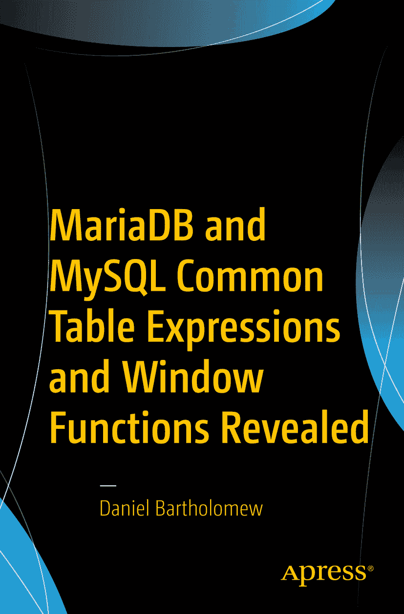

# Daniel Bartholomew MariaDB 与 MySQL 中的公用表表达式与窗口函数揭秘

本书作者引用的任何源代码或其他补充材料，读者均可通过本书产品页面在 GitHub 上获取，地址为 [`www.apress.com/9781484231197`](http://www.apress.com/9781484231197)。如需更详细信息，请访问 [`http://www.apress.com/source-code`](http://www.apress.com/source-code)。

ISBN 978-1-4842-3119-7  
e-ISBN 978-1-4842-3120-3  
[`doi.org/10.1007/978-1-4842-3120-3`](https://doi.org/10.1007/978-1-4842-3120-3)

国会图书馆控制号：2017958968

© Daniel Bartholomew 2017

本作品受版权保护。出版者保留所有权利，无论涉及材料的全部或部分，特别是翻译、转载、插图重用、朗诵、广播、缩微胶片或其他任何物理方式的复制，以及信息存储与检索、电子改编、计算机软件，或当前已知或未来开发的类似或不同方法的传播权利。本书中可能出现商标名称、标识和图像。我们并非每次出现商标名称、标识和图像时都使用商标符号，而是仅在编辑需要时使用，并旨在使商标所有者受益，无侵权之意。本书中使用的商品名称、商标、服务标志及类似术语，即使未特别标识，也不应被视为表达其是否受专有权利约束的意见。尽管本书中的建议和信息在出版时被认为是真实准确的，但作者、编辑或出版商均不承担任何可能存在的错误或遗漏的法律责任。出版商对本出版物所含材料不作任何明示或暗示的保证。

使用无酸纸印刷

由 Springer Science+Business Media New York 向全球书商发行，地址：233 Spring Street, 6th Floor, New York, NY 10013。电话：1-800-SPRINGER，传真：(201) 348-4505，邮箱：orders-ny@springer-sbm.com，或访问 [www.springeronline.com](http://www.springeronline.com)。

Apress Media, LLC 是一家位于加利福尼亚州的有限责任公司，其唯一成员（所有者）是 Springer Science + Business Media Finance Inc (SSBM Finance Inc)。SSBM Finance Inc 是一家特拉华州公司。

献给 Amy, Ila, Lizzy, Anthon 和 Rachel。我保证，现在可以多玩些桌游了。

## 引言

在软件领域，有标准以及这些标准的实现。有时，实现先行，由渴望推动技术发展的开发者引入特性，之后才被正式标准化。另一些时候，标准先行，由供应商、开发者等共同制定并达成一致，然后标准的实现——有些忠实，有些则不那么忠实——再进入生产软件。

公用表表达式（`CTE`）和窗口函数在 `ANSI SQL` 标准中已存在很长时间。`CTE` 早在 `SQL99` 版本的标准中就已引入，而窗口函数则是在 `SQL2003` 版本中引入。其他数据库系统较早地实现了这两者。`Oracle`、`SQL Server`、`PostgreSQL`，甚至 `SQLite` 都已有多年这些特性的实现。

`MariaDB` 和 `MySQL` 稍晚一些，但它们现在也有了符合标准的窗口函数和公用表表达式实现。`MariaDB` 在其 `MariaDB 10.2` 版本中添加了这些功能，该版本于 2017 年 5 月宣布为稳定版（`GA`）。`MySQL` 正在其即将发布的 `8.0` 版本中引入这些功能，在我撰写本文时，该版本正处于发布候选阶段。这两个实现是各自独立开发的，但都紧密遵循标准，因此它们之间的兼容性良好。一般而言，在 `MariaDB` 中能运行的查询很可能也能在 `MySQL` 中运行，反之亦然。不过，存在一些差异，本书会在遇到时加以说明。

## 语法

本书中的语法定义遵循以下约定：

*   `< >` —— 尖括号包围元素，其名称由你提供。括号本身不是语法的一部分，不应包含在内。
*   `[ ]` —— 方括号包围可选元素。是否包含它们取决于你的选择。括号本身不是语法的一部分，不应包含在内。
*   `|` —— 管道符或竖线分隔元素组。你选择你想在语句中包含的哪个元素。管道符本身不是语法的一部分，不应包含在内。
*   `…` —— 省略号或连续三个句点，表示前面的部分可以重复。省略号本身不是语法的一部分，不应包含在内。
*   `( )` —— 圆括号，当它们出现时，是语法的一部分，通常必须包含在你的 SQL 语句中。

以 `大写字母` 书写的单词是关键字。它们可以以 `大写` 或 `小写` 形式书写，但必须按所示书写。它们通常也不应（在某些情况下不能）用作表、函数和其他你命名的元素的名称。

以 `小写字母` 书写的单词代表你提供的值。根据所编写的 SQL 语句的需要，它们可以是整数、语句或 SQL 语句的其他元素。

## 致谢

我要感谢 `MariaDB` 的 Sergey Petrunia、Vicențiu Ciorbaru 以及其他人，他们对本书中的示例提供了很大帮助。我还要感谢 `Apress` 的 Jonathan Gennick、Jill Balzano 以及其他出色的工作人员，他们指导本书从概念到完成。

最后，我要感谢 Monty、Rasmus 以及 `MariaDB` 和 `MySQL` 的众多开发者和用户。通过合作，我们创造了美好的事物。

## 目录

**内容第一部分：公用表表达式**

## 1. 公用表表达式基础
开始之前 3
什么是公用表表达式？ 4
基本 CTE 语法 4
CTE 的动机 6
临时性 6
可读性 6
在单一或多处使用 7
权限 7
嵌套 7
多路复用 8
递归 9
总结 9

## 2. 非递归公用表表达式
开始之前 11
使用 CTE 进行同比比较 12
将个体与其所在组进行比较 15
将子查询转换为 CTE 16
总结 18

## 3. 递归公用表表达式
开始之前 19
递归 CTE 语法 20
数字累加 21
计算斐波那契数 24
在树中查找祖先 27
查找所有可能的目的地 30
查找所有可能的路径 33
总结 38

