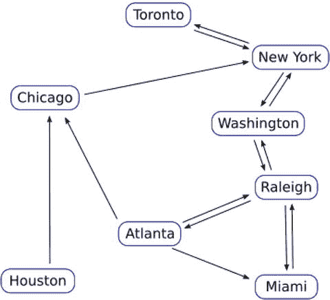

# 3. 递归公共表表达式

递归是计算机科学中一项非常有用的技术。递归算法非常适合于遍历树（其中项目包含其他项目，而这些项目也可能包含更多项目）和图（用于跟踪项目之间的连接或路径）等数据结构。SQL 在历史上对此处理得并不好。

Oracle 在 1980 年代尝试使用其非标准的 `CONNECT BY` 语法为 SQL 添加递归支持，但现在这已被官方 SQL 标准（SQL99 版本）中的递归 CTE 所取代、改进和标准化。该标准的实现大约从 2007 年开始出现在各种数据库中，如 Oracle 和 SQL Server，而 MariaDB 和 MySQL 大约在十年后才最终赶上并支持它们。

简单来说，递归 CTE 是在其 `<cte_body>` 中引用自身的 CTE。让 CTE 引用自身可能看起来很复杂，但一旦掌握，其实并不难，而且通过使用递归，你可以做很多很酷的事情。本章将提供一些示例，展示你可以用递归 CTE 做些什么。


### 开始之前

与其他章节一样，本章的示例使用了样本数据。本章我们将使用两个表，一个名为 `tudors`，另一个名为 `routes`。`tudors` 表可以通过以下查询创建：

```sql
CREATE TABLE tudors (
id serial primary key,
name VARCHAR(100) NOT NULL,
father BIGINT(20),
mother BIGINT(20)
);
```

数据位于一个名为 `bartholomew-ch03-tudors.csv` 的 CSV 文件中。可以通过类似于以下的查询来加载数据（假设该文件位于运行 MariaDB 或 MySQL 服务器的计算机的 `/tmp/` 文件夹中）：

```sql
LOAD DATA INFILE '/tmp/bartholomew-ch03-tudors.csv'
INTO TABLE tudors
FIELDS TERMINATED BY ','
OPTIONALLY ENCLOSED BY '"';
```

`routes` 表可以通过以下查询创建：

```sql
CREATE TABLE routes (
id serial primary key,
departing VARCHAR(100) NOT NULL,
arriving VARCHAR(100) NOT NULL
);
```

数据位于一个名为 `bartholomew-ch03-routes.csv` 的 CSV 文件中。可以通过类似于以下的查询来加载数据（假设该文件位于运行 MariaDB 或 MySQL 服务器的计算机的 `/tmp/` 文件夹中）：

```sql
LOAD DATA INFILE '/tmp/bartholomew-ch03-routes.csv'
INTO TABLE routes
FIELDS TERMINATED BY ','
OPTIONALLY ENCLOSED BY '"';
```

**注意**
有关在 Windows 上加载文件以及处理 `secure_file_priv` 问题的额外信息，请参阅章节 1 的“开始之前”部分。

现在，我们已经准备好开始了。

### 递归 CTE 语法

递归 CTE 查询的语法与非递归 CTE 类似，但有几个区别。以下是基本语法：

```sql
WITH RECURSIVE <cte_name> AS (
    <anchor>
    UNION [ALL]
    <recursive>
)
```

你会立刻注意到引入了 `RECURSIVE` 关键字。在 MariaDB 和 MySQL 中，递归 CTE 必须包含此关键字。在其他数据库（如 Oracle 和 SQL Server）中，递归 CTE 不需要此关键字。

另一个与非递归 CTE 的不同之处在于，`<cte_body>` 被分为两部分，中间用 `UNION` 或 `UNION ALL` 分隔。第一部分是 `<anchor>`。它是一个非递归查询，类似于非递归 CTE 的 `<cte_body>`。然后，在 `UNION` 或 `UNION ALL` 之后是递归部分。这部分将包含对 `<cte_name>` 的引用，正是这个引用使得 CTE 成为递归的，因此为简便起见，我们称这部分为 `<recursive>`。

### 数字累加

刚开始使用递归 CTE 时，最重要的一点是记住递归的实际工作方式可能与我们预期的并不完全一致。

我们可以通过一个很好的（虽然是人为构造的）例子来说明递归 CTE 的工作方式：将数字相加。假设我们想把从 1 到 100 的所有数字加在一起。手动计算 `1 + 2 + 3 + 4 + ... + 100` 会非常繁琐。如果有一个递归循环能为我完成重复的部分，那会好得多。这个例子的好处是不需要我们创建任何表。别担心，我们将在本章后面讨论我们的 `tudors` 和 `routes` 表。

为了开始将我们的数字相加，我们需要一个循环，执行以下操作：

1.  将当前数字加到当前总和上
2.  将当前数字加 1
3.  重复，直到当前数字等于 100

首先，我们需要两列——一列用于跟踪当前数字的计数器，另一列用于存储总和。我们将它们分别称为 `Count` 和 `Total`，并从零开始。在 SQL 中表达这一点最简单的方式是：

```sql
SELECT
    0 AS Count,
    0 AS Total
```

这将作为我们的 `<anchor>`，即我们的起始点。

现在，我们需要将 `Count` 加 1，并将当前的 `Count` 加到 `Total` 上。这将作为我们的 `<recursive>` 部分。SQL 如下所示：

```sql
SELECT
    Count + 1,
    Total + Count
```

通过在前面加上 `WITH RECURSIVE TotalSum AS` 部分，在两个示例查询之间加上 `UNION ALL`，添加一个 `FROM` 来引用我们的 `<cte_name>`，一个 `WHERE` 子句以便我们知道 CTE 何时结束，最后添加一个简单的 `SELECT * FROM <cte_name>` 作为输出，我们得到一个如下所示的 CTE 查询：

```sql
WITH RECURSIVE TotalSum AS (
    SELECT
        0 AS Count,
        0 AS Total
    UNION ALL
    SELECT
        Count + 1,
        Total + Count
    FROM TotalSum
    WHERE Count <= 100
)
SELECT * FROM TotalSum;
```

这看起来很合理，但当我们运行这个查询时，结果看起来并不完全正确：

```
+-------+-------+
| Count | Total |
+-------+-------+
|     0 |     0 |
|     1 |     0 |
|     2 |     1 |
|     3 |     3 |
|     4 |     6 |
|     5 |    10 |
...
|    96 |  4560 |
|    97 |  4656 |
|    98 |  4753 |
|    99 |  4851 |
|   100 |  4950 |
|   101 |  5050 |
+-------+-------+
```

`Count` 列看起来没问题，直到最后它停在了 101，而不是我们想要的 100。此外，虽然 `Total` 列最终得到了正确的答案 5050，但这令人困惑，因为在开始时当 `Count` 为 1 时，`Total` 仍然等于 0，而在结束时当 `Count` 为 101 时，总和 5050 是在加上最后的 100 之后得到的，而不是在加上 101 之后。

这种行为可以通过理解数据库如何执行我们的 `TotalSum` CTE 的 `<anchor>` 和 `<recursive>` 部分之间的 `UNION ALL` 来解释。

首先，当我们开始时，`Count` 和 `Total` 都设置为 0，输出的第一行反映了这一点：

```
+-------+-------+
| Count | Total |
+-------+-------+
|     0 |     0 |
+-------+-------+
```

然后，我们用 `Count + 1` 和 `Total + Count` 表达式对这个表进行 `UNION ALL`。`Count + 1` = `0 + 1` = `1`，但是 `Total + Count` = `0 + 0` = `0`，因为在计算 `Count` 的值时，`Count` 的值是从之前的输出行中取出的，而不是从将 `Count` 加 1 的那一行表达式中取出的。`UNION ALL` 只查看前一行的输出，而在那一行中，`Count = 0`。所以，我们的第二行输出看起来可能不对，但从数据库的角度来看，它是完全准确的：

```
+-------+-------+
| Count | Total |
+-------+-------+
|     1 |     0 |
+-------+-------+
```

那么，修复方法就很简单了。在计算 `Total` 列时，我们像处理 `Count` 列一样给它加 1。做了这个改动后，我们还需要将 `WHERE Count <= 100` 改为 `WHERE Count < 100`，因为当 `Count` 实际达到 100 时，我们已经完成了。做这些修改后，我们的递归 CTE 现在看起来像下面这样：

```sql
WITH RECURSIVE TotalSum AS (
    SELECT
        0 AS Count,
        0 AS Total
    UNION ALL
    SELECT
        Count + 1,
        Total + Count + 1
    FROM TotalSum
    WHERE Count < 100
)
SELECT * FROM TotalSum;
```

这个版本的输出看起来好多了，正是我们所期望的：

```
+-------+-------+
| Count | Total |
+-------+-------+
|     0 |     0 |
|     1 |     1 |
|     2 |     3 |
|     3 |     6 |
|     4 |    10 |
|     5 |    15 |
...
|    96 |  4656 |
|    97 |  4753 |
|    98 |  4851 |
|    99 |  4950 |
|   100 |  5050 |
+-------+-------+
```

从这个练习中得出的关键点是，要记住在 `UNION` 或 `UNION ALL` 之后的 `<recursive>` 部分在进行计算时，参考的是之前检索到或计算出的行，而不是当前行。


### 计算斐波那契数列

递归的另一个有趣应用是计算斐波那契数列。在这个数字序列中，每一个新数字都是前两个数字之和。因为该序列依赖于两个数字，我们必须定义两个起始值；可以选择 0 和 1，或者 1 和 1。在本例中，我们将采用前者，并将它们称为 `Current` 和 `Next`。一个用于我们 `<anchor>` 部分的简单 SQL 如下所示：

```sql
SELECT
0 AS Current,
1 AS Next
```

对于我们的 `<recursive>` 部分，循环需要执行以下操作：

1.  将 `Current` 移动到 `Next`。
2.  通过 `Current + Next` 计算新的 `Next`。
3.  重复执行直到我们发出停止指令。

数学部分很直接：

```sql
SELECT
Next AS Current,
Current + Next AS Next
```

将两者结合起来，设置上限为 1000，并使用简单的 `SELECT * FROM <cte_name>` 作为输出，我们得到以下结果：

```sql
WITH RECURSIVE fibonacci AS (
    SELECT
        0 AS Current,
        1 AS Next
    UNION ALL
    SELECT
        Next AS Current,
        Current + Next AS Next
    FROM fibonacci
    WHERE Next < 1000
)
SELECT * FROM fibonacci;
```

这个递归 CTE 的输出如下所示：

```
+---------+------+
| Current | Next |
+---------+------+
|       0 |    1 |
|       1 |    1 |
|       1 |    2 |
|       2 |    3 |
|       3 |    5 |
|       5 |    8 |
|       8 |   13 |
|      13 |   21 |
|      21 |   34 |
|      34 |   55 |
|      55 |   89 |
|      89 |  144 |
|     144 |  233 |
|     233 |  377 |
|     377 |  610 |
|     610 |  987 |
|     987 | 1597 |
+---------+------+
```

和前面的例子一样，这个结果可能不是我们想要的。我们得到的不是简单的斐波那契数列，而是两个并行的序列，`Current` 和 `Next` 列在序列顺序上相差一。这同样与 `<recursive>` 部分的计算方式有关。

开始时，`Current = 0` 且 `Next = 1`。这是输出的第一行：

```
+---------+------+
| Current | Next |
+---------+------+
|       0 |    1 |
+---------+------+
```

在我们的第一次 `<recursive>` 部分运行中，我们首先将 `Next` 的值（1）移动到 `Current`，因此对于下一行，`Current` 将等于 1。然后，我们将 `Next` 设置为初始行的 `Current + Next`，即 `0 + 1`，也就是 1。所以，第二行中，`Current` 和 `Next` 都等于 1：

```
+---------+------+
| Current | Next |
+---------+------+
|       1 |    1 |
+---------+------+
```

循环现在重复，在 `<recursive>` 部分我们将第二行的 `Next` 值移动到 `Current`。因此，第三行它仍然是 1。然后，我们将 `Next` 的值设置为第二行的 `Current + Next`，即 `1 + 1`，也就是 2。所以，第三行的值是：

```
+---------+------+
| Current | Next |
+---------+------+
|       1 |    2 |
+---------+------+
```

这个过程一直重复，直到满足我们的 `WHERE` 条件，这发生在循环查看第 17 行时，其副作用是我们的输出超出了 1000 的限制，因为在此之前 `Next` 的值总是小于它。

为了得到我们想要的输出——一个包含斐波那契数列且最高数字小于 1000 的单列——你可能猜到我们需要做什么：我们只需从 CTE 中 `SELECT` `Current` 列，而不是选择所有列。我们可以重命名它以进一步优化输出：

```sql
WITH RECURSIVE fibonacci AS (
    SELECT
        0 AS Current,
        1 AS Next
    UNION ALL
    SELECT
        Next AS Current,
        Current + Next AS Next
    FROM fibonacci
    WHERE Next < 1000
)
SELECT Current AS fibonacci_series FROM fibonacci;
```

现在，我们的 `fibonacci` CTE 的输出如下：

```
+------------------+
| fibonacci_series |
+------------------+
|                0 |
|                1 |
|                1 |
|                2 |
|                3 |
|                5 |
|                8 |
|               13 |
|               21 |
|               34 |
|               55 |
|               89 |
|              144 |
|              233 |
|              377 |
|              610 |
|              987 |
+------------------+
```

我们在这里还可以做一些额外的事情，例如设置一个计数器来跟踪我们处于斐波那契数列的哪个位置，并可能将其用作限制条件，而不是我们当前所处的实际斐波那契数值。例如，我们可以修改 CTE 并计算 100 位的斐波那契数列。

### 在树中查找祖先

使用递归 CTE 来解决数学问题，如前两个例子，甚至创建一个递归 CTE 的埃拉托斯特尼筛法，可能是有趣的小消遣，但它们在现实世界中并不常用。因此，让我们离开这些，来解决一些你可能会实际遇到的例子。我们将从使用 `tudors` 表开始。

这个表包含关于英国都铎王朝君主的数据——你知道的，亨利八世、伊丽莎白一世、血腥玛丽，那些人。有四个列：`id`、`name`、`father` 和 `mother`。如果已填充，`father` 和 `mother` 列会指向该人的父亲和母亲的记录，正如你所期望的那样。

数据从伊丽莎白一世开始，然后包含向前几代的数据，以及她的一些堂/表兄弟姐妹、阿姨和叔叔。方便的是，她的 `id` 是 `1`。以下是提取她记录的 SQL：

```sql
SELECT * FROM tudors
WHERE id = 1;
```

结果如下所示：

```
+----+------------------------+--------+--------+
| id | name                   | father | mother |
+----+------------------------+--------+--------+
|  1 | Elizabeth I of England |      2 |      3 |
+----+------------------------+--------+--------+
```

如果不使用 CTE，我们可以做很多事情来找到她的父母；例如，这里有一种使用简单 `JOIN` 的方法：

```sql
SELECT
    elizabeth.id, elizabeth.name, tudors.id, tudors.name
FROM
    tudors AS elizabeth
    JOIN tudors ON
        tudors.id = elizabeth.father
        OR
        tudors.id = elizabeth.mother
WHERE elizabeth.id=1;
```

这个查询虽然不容易读，但也不算太糟。结果如下所示：

```
+----+------------------------+----+-----------------------+
| id | name                   | id | name                  |
+----+------------------------+----+-----------------------+
|  1 | Elizabeth I of England |  2 | Henry VIII of England |
|  1 | Elizabeth I of England |  3 | Anne Boleyn           |
+----+------------------------+----+-----------------------+
```

这个结果给了我们伊丽莎白的父母，但如果我们想获取伊丽莎白的所有祖先：父母、祖父母、曾祖父母等等，该怎么办？这正是递归 CTE 被创造出来要解决的那种查询。

对于我们查询的 `<anchor>` 部分，我们可以使用仅检索伊丽莎白记录的查询，而对于 `<recursive>` 部分，我们可以使用类似于我们基于 `JOIN` 的查询，但语法上更合理的东西：

```sql
WITH RECURSIVE elizabeth AS (
    SELECT * FROM tudors
    WHERE id = 1
    UNION
    SELECT tudors.*
    FROM tudors, elizabeth
    WHERE
        tudors.id = elizabeth.father OR
        tudors.id = elizabeth.mother
)
SELECT * FROM elizabeth;
```

使用 `elizabeth` 作为 `<cte_name>` 既合理又不合理。它合理是因为在循环的第一次运行中，我们确实在寻找伊丽莎白的父亲和母亲。对于未来的循环运行则不合理，因为在第二次循环中，我们在寻找亨利八世和安妮·博林（伊丽莎白的祖父母）的父母，在第三次循环中寻找她的曾祖父母，依此类推。

然而，至少对我而言，这个命名在编写 `<recursive>` 部分时有所帮助。递归思考已经够难了，所以在命名 CTE 方面能找到的任何优势都是好事。

这个查询的（截断的）结果如下所示：


### SQL 递归 CTE 详解与示例

```
+----+---------------------------------------+--------+--------+
| id | name                                  | father | mother |
+----+---------------------------------------+--------+--------+
|  1 | Elizabeth I of England                |      2 |      3 |
|  2 | Henry VIII of England                 |      4 |      5 |
|  3 | Anne Boleyn                           |      6 |      7 |
|  4 | Henry VII of England                  |      8 |      9 |
|  5 | Elizabeth of York                     |     10 |     11 |
|  6 | Thomas Boleyn, 1st Earl of Wiltshire  |     12 |     13 |
|  7 | Elizabeth Howard                      |     14 |     15 |
|  8 | Edmund Tudor, 1st Earl of Richmond    |     16 |     17 |
|  9 | Margaret Beaufort                     |     18 |     19 |
| 10 | Edward IV of England                  |     20 |     21 |
...
+----+---------------------------------------+--------+--------+
```

你会注意到，这个递归 CTE 有一个`WHERE`子句，和我们之前的一样，但它没有像`WHERE tudors.id < 100`那样设置明确的停止点。那么，CTE 如何知道何时完成呢？为了找出答案，让我们一步步分析这个查询的执行过程。

首先，是我们的锚点部分，在第一次执行时它的结果会被输出。然后，递归部分会查找`father`或`mother`字段与`id`匹配的记录。找到的记录会被合并到结果表中。

接着，CTE 会循环回来，再次进行相同的搜索，这次通过`UNION`将之前的结果包含进来，并忽略已在结果表中的记录。这个过程会一直重复，直到没有新结果返回。这就是触发 CTE 停止循环的条件。

对于我们的示例数据，循环直到没有新结果返回没有问题，因为它只循环了几次。但是，如果我们正在遍历一个巨大的数据树呢？有什么能防止我们的查询无限循环呢？

答案取决于你使用的是 MariaDB 还是 MySQL。

在 MariaDB 中，作为最终的保护措施，有一个`@@max_recursive_iterations`变量，它控制服务器在停止前将执行的最大循环次数。你可以用以下命令查看其当前值：

```
SHOW VARIABLES LIKE '%recursive%';
```

默认设置非常高，`4294967295`，这对于几乎所有查询来说都应该足够了，但如果需要，可以像任何其他变量一样更改它。将其设置为`0`会禁用此限制，应谨慎操作。

截至目前，MySQL 中没有对应的变量。在那里，目前唯一的保护措施是设置`@@max_statement_time`为允许查询运行的最长时间，超过该时间查询将被终止。

#### 查找所有可能的目的地

本章的最后两个示例使用`routes`表。此表包含北美各城市之间假设的火车路线列表。每条路线有一个出发城市和一个到达城市。有些城市之间有两条路线——每个方向一条。其他城市的路线只朝一个方向。图 3-1 显示了所有的路线和城市。



图 3-1. 所有城市之间的所有路线

从路线上可以看到，路径中存在一些循环。例如，罗利 -> 亚特兰大 -> 迈阿密 -> 罗利。

假设我们想找出从罗利出发可以到达的所有目的地。我们该如何使用 CTE 来实现呢？这里是一套建议的步骤：

1.  查找从罗利出发的所有目的地。
2.  获取这些结果，并查找它们的所有目的地。
3.  重复，直到找到所有目的地。

第一步非常适合用作我们的锚点部分，其余两步放在递归部分。显而易见的锚点是`SELECT`每条从罗利出发的路线：

```
SELECT arriving FROM routes
WHERE departing='Raleigh';
```

这个查询给出以下输出：

```
+------------+
| arriving   |
+------------+
| Washington |
| Atlanta    |
| Miami      |
+------------+
```

对于 CTE 的递归部分，我们需要`SELECT`那些以这些城市为出发城市的路线记录。我们可以通过查找锚点部分返回的初始出发城市（即到达城市）作为新的出发城市的路线来实现，并重复此过程，直到我们获得所有可能的目的地列表。

这是一个名为`destinations`的递归 CTE 的完整写法：

```
WITH RECURSIVE destinations AS (
SELECT arriving
FROM routes
WHERE departing='Raleigh'
UNION
SELECT routes.arriving
FROM destinations, routes
WHERE
destinations.arriving=routes.departing
)
SELECT * FROM destinations;
```

这个 CTE 返回的结果是：

```
+------------+
| arriving   |
+------------+
| Washington |
| Atlanta    |
| Miami      |
| Chicago    |
| Raleigh    |
| New York   |
| Toronto    |
+------------+
```

正如预期，唯一无法从罗利到达的城市是休斯顿。实际上，没有人能通过火车到达休斯顿，因为没有去休斯顿的路径，只有一条从休斯顿出来的路径。我们应该铺些铁轨来解决这个问题。

除了没有休斯顿，关于这个结果还有两点需要注意。首先是罗利本身出现在了输出中，其次是 CTE 足够智能，没有无限循环。

是什么为我们的 CTE 提供了终止条件，防止这些循环一直运行直到达到`@@max_recursive_iterations`或`@@max_statement_time`限制呢？是因为我们使用了`UNION`而不是`UNION ALL`。当`UNION`看到重复的结果时会忽略它，因此一旦所有可能的城市都被定位到，唯一被返回的城市将是它已经见过的，于是 CTE 终止。

关于包含罗利呢？嗯，如果你回顾图 3-1，你会看到从罗利出发有几条路径最终回到了罗利。所有离开罗利的路径都有返回罗利的路径；例如，罗利 -> 迈阿密 -> 罗利。还有一个大循环：罗利 -> 亚特兰大 -> 芝加哥 -> 纽约 -> 华盛顿 -> 罗利。因为罗利最初不在我们的列表中，它像任何其他有效目的地一样被包含在结果中，但只出现一次。罗利在新结果中再次出现时，会被忽略。

如果我们想从结果中移除罗利，只需将最后一行改为：

```
SELECT * FROM destinations WHERE arriving!='Raleigh';
```

或者，我们也可以将罗利移动到结果的第一位，这在逻辑上更合理。毕竟，我们能到达的第一个地点就是我们当前所在的位置。为此，我们需要“取巧”一下，告诉解析器我们正在选择罗利作为到达城市，尽管我们实际上是在选择它作为出发城市。SQL 如下：

```
SELECT departing AS arriving
FROM routes
WHERE departing='Raleigh';
```

单独运行这个查询会得到：

```
+----------+
| arriving |
+----------+
| Raleigh  |
| Raleigh  |
| Raleigh  |
+----------+
```

这个结果是预期的，因为有三条从罗利到其他城市的路线。我们现在可以将其插入到我们的 CTE 中：

```
WITH RECURSIVE destinations AS (
SELECT departing AS arriving
FROM routes
WHERE departing='Raleigh'
UNION
SELECT routes.arriving
FROM destinations, routes
WHERE
destinations.arriving=routes.departing
)
SELECT * FROM destinations;
```

结果是：

```
+------------+
| arriving   |
+------------+
| Raleigh    |
| Washington |
| Atlanta    |
| Miami      |
| Chicago    |
| New York   |
| Toronto    |
+------------+
```

这仍然在输出中包含了罗利，但至少它是第一个结果，而不是令人困惑地出现在结果中间。

#### 查找所有可能路径

找到从 Raleigh 出发所有可能的目的地固然不错，但如何找出从 Raleigh 到所有可达城市的所有可能路径呢？

以下是操作步骤：

1.  从起点查询目的地。
2.  从该点查找目的地并添加它们；`UNION` 将防止重复。
3.  重复直到找到所有可能的路径。

因为我们想从 Raleigh 出发，所以对于 `<锚定>` 部分，我们需要做类似于上一节的操作，并以某种方式发出 `SELECT` 查询，使其从 Raleigh 开始。这是一个可能的 `<锚定>` 候选：

```
SELECT departing, arriving
FROM routes
WHERE departing='Raleigh';
```

这给出了我们期望的结果：

```
+-----------+------------+
| departing | arriving   |
+-----------+------------+
| Raleigh   | Washington |
| Raleigh   | Atlanta    |
| Raleigh   | Miami      |
+-----------+------------+
```

我们的 `<递归>` 部分会更复杂一些。我们想要展示所有可能路径的完整集合，而不仅仅是终点列表。因此，我们想要将任何新增的部分（如果有的话）添加到现有路径的末尾，并用分隔符隔开。`CONCAT()` 函数正是为此而设计，而 `departing` 列看起来是我们需要连接的列，因为那是我们的起点 Raleigh 所在的位置。

在 `<递归>` 部分的第一次运行后，我们应该将 `departing` 和 `arriving` 列连接起来作为新的 `departing` 列，然后也包含我们的 `arriving` 列用于循环的下一次运行。我们应该得到一个结果，输出看起来像这样：

```
+----------------------+------------+
| departing            | arriving   |
+----------------------+------------+
| Raleigh > Washington | Washington |
| Raleigh > Atlanta    | Atlanta    |
| Raleigh > Miami      | Miami      |
+----------------------+------------+
```

实际上，`departing` 列名不太合理，因为它保存的是我们的路径，而不是初始出发城市，所以在实际的 CTE 中我们将其称为 `path`。

我们现在准备好编写 CTE 了吗？其实，还没有！还有另一个问题我们应该先解决。再次查看图 3-1；我们能做些什么来防止像下面这样愚蠢的结果？

```
Raleigh > Washington > New York > Washington > Raleigh > Miami
```

这是一个完全有效的路径，但任何理智的人都不会走这条路线。如果我们想从 Raleigh 去 Miami，我们会走那条路线；我们绝不会先去纽约，然后经由 Raleigh 返回再去 Miami。我们能做些什么来防止这种情况？`LOCATE()` 函数提供了一个简单的方法。它在字符串中搜索给定的子字符串，如果未找到子字符串则返回 `0`。所以，我们只需在 `<递归>` 部分的 `WHERE` 子句中添加类似以下的内容：

```
LOCATE(routes.arriving, .paths)=0
```

我们当然会将 `<cte_name>` 替换为实际 CTE 的名称。

让我们尝试将所有内容整合到一个名为 `full_routes` 的 CTE 中：

```
WITH RECURSIVE full_routes AS (
SELECT departing AS path, arriving
FROM routes
WHERE departing='Raleigh'
UNION
SELECT
CONCAT(full_routes.path, ' > ',
routes.arriving),
routes.arriving
FROM full_routes, routes
WHERE
full_routes.arriving=routes.departing
AND
LOCATE(routes.arriving, full_routes.path)=0
) SELECT * FROM full_routes;
```

这个 CTE 看起来合理，但当我们运行它时，结果显然是错误的：

```
+-------------------------------------------+------------+
| path                                      | arriving   |
+-------------------------------------------+------------+
| Raleigh                                   | Washington |
| Raleigh                                   | Atlanta    |
| Raleigh                                   | Miami      |
| Raleigh > Chicago                         | Chicago    |
| Raleigh > New York                        | New York   |
| Raleigh > Miami                           | Miami      |
| Raleigh > Chicago > New York              | New York   |
| Raleigh > New York > Washington           | Washington |
| Raleigh > New York > Toronto              | Toronto    |
| Raleigh > Chicago > New York > Washington | Washington |
| Raleigh > Chicago > New York > Toronto    | Toronto    |
+-------------------------------------------+------------+
```

这是怎么回事？我们期望的 Raleigh > Washington, Raleigh > Atlanta, 和 Raleigh > Miami 路径在哪里？而且，没有办法直接从 Raleigh 到 Chicago，因为你需要先经过 Washington。实际上，所有路径都缺少一站。

如果我们仔细看看递归 CTE 的逻辑，原因就清楚了。

在 `<递归>` 部分的第一次运行期间，我们的 `WHERE` 子句正在 `arriving` 列中查找那些也出现在 `routes` 表 `departing` 列中的城市。在初始循环结果集时，我们的递归 CTE 只能访问 `<锚定>` 部分返回的内容，即 Washington、Atlanta 和 Miami 这三个城市。正如我们所要求的，我们的递归 CTE 首先在 `routes` 表中查找 `departing` 列为 Washington 的行，它找到的第一个结果是 Washington 到 Chicago 的条目。然后它尽职地将 Chicago 连接到 `path` 列的值（即 Raleigh）之后，作为新的结果行。这就是为什么我们输出的第四行是：

```
+-------------------+----------+
| path              | arriving |
+-------------------+----------+
| Raleigh > Chicago | Chicago  |
+-------------------+----------+
```

要解决这个问题，我们需要以某种方式设置我们的 `<锚定>`，使起点仅为 Raleigh。然后，在第一次运行期间，它将正确地将 Washington、Atlanta 和 Miami 连接到路径后面。如果我们的 `<锚定>` 不返回 Raleigh 的实际连接，而是再次选择 `departing` 列并告诉 CTE 那是 `arriving` 列会怎样？这似乎有点取巧，但 SQL 是完全有效的：

```
SELECT departing AS path, departing AS arriving
FROM routes
WHERE departing='Raleigh';
```

重要的是，这个查询的结果包含一个应该完全可以作为我们 `<锚定>` 的结果：

```
+---------+----------+
| path    | arriving |
+---------+----------+
| Raleigh | Raleigh  |
| Raleigh | Raleigh  |
| Raleigh | Raleigh  |
+---------+----------+
```

将我们新的 `<锚定>` 放入 `full_routes` CTE 后，它现在看起来像这样：

```
WITH RECURSIVE full_routes AS (
SELECT departing AS path, departing AS arriving
FROM routes
WHERE departing='Raleigh'
UNION
SELECT
CONCAT(full_routes.path, ' > ',
routes.arriving),
routes.arriving
FROM full_routes, routes
WHERE
full_routes.arriving=routes.departing
AND
LOCATE(routes.arriving, full_routes.path)=0
) SELECT * FROM full_routes;
```

而结果正是我们所期望的：


+-----------------------------------------------------+------------+
| 路径                                                | 到达地     |
+-----------------------------------------------------+------------+
| Raleigh                                             | Raleigh    |
| Raleigh > Washington                                | Washington |
| Raleigh > Atlanta                                   | Atlanta    |
| Raleigh > Miami                                     | Miami      |
| Raleigh > Atlanta > Chicago                         | Chicago    |
| Raleigh > Washington > New York                     | New York   |
| Raleigh > Atlanta > Miami                           | Miami      |
| Raleigh > Atlanta > Chicago > New York              | New York   |
| Raleigh > Washington > New York > Toronto           | Toronto    |
| Raleigh > Atlanta > Chicago > New York > Washington | Washington |
| Raleigh > Atlanta > Chicago > New York > Toronto    | Toronto    |
+-----------------------------------------------------+------------+

第一个结果有点傻，`path`和`arriving`列都是 Raleigh，但其余结果完全符合预期。而且，实际上，下次我需要乘火车从 Raleigh 去 Washington 时，我应该选择风景优美的路线，经由 Atlanta、Chicago 和 New York 抵达。

为了好玩，我移除了`WHERE`子句中的`LOCATE`部分，看看有多少种可能的不重复组合。在 MySQL 8.0.2 DMR 上，它返回了一个错误：

```
ERROR 1406 (22001): Data too long for column 'path' at row 231
```

然而，在 MariaDB 10.2 上，它返回了所有可能的组合。数量很多。对于《龙珠 Z》的粉丝来说，这很贴切：它超过了 9000！

确切地说是 9117。

### 总结

在本章中，我们探讨了递归 CTE 与非递归 CTE 的区别。我们探索了它们的一些用途：

*   解决递归数学问题
*   遍历家谱树以匹配子女与祖先
*   查找两点之间的所有可能路线

还有更多用途，但我们将在接下来的三章中转换主题，探索本书的第二个主要主题：窗口函数。然后我们将在第 7 章回归 CTE 并将其与窗口函数结合使用，为什么不呢？

