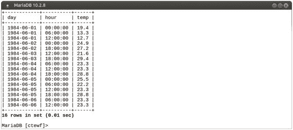
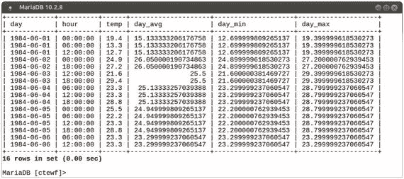
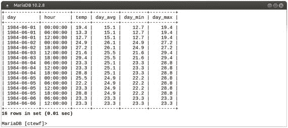
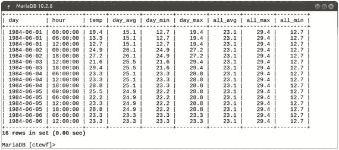
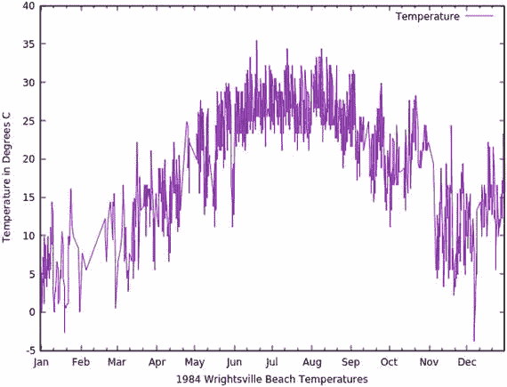
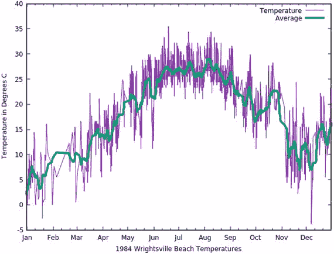
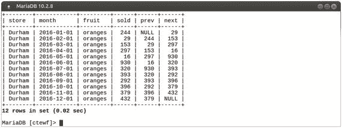
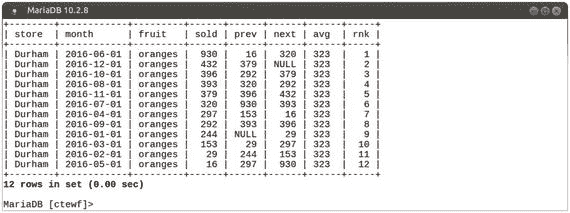
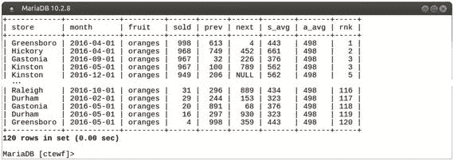

# 窗口函数

窗口函数由于其操作方式，根本不会使用索引。它们甚至不会去查找索引。这可以视为使用窗口函数的一个附带好处。如果你能通过使用窗口函数来消除昂贵的自连接和子查询，那么你可能就不需要花费时间、精力和开销去创建和维护索引了。

### 对结果集中的行进行排名

另一个常见的分析查询是找出前 N 名的数据，无论是销售额前五的商品、薪资前十的员工，还是青年篮球联赛的前三名得分手。

再次使用我们的 `commissions` 表，用 SQL 找出佣金收入前五名是轻而易举的事。一种方法是使用以下 SQL（使用 `LIMIT 5` 来限制输出行数）：

```sql
SELECT
id, salesperson_id AS sid,
commission_id AS cid,
commission_amount AS amount,
commission_date AS date
FROM commissions
ORDER BY commission_amount DESC
LIMIT 5;
```

该查询的结果如下所示：

```
+------+-----+-------+--------+------------+
| id   | sid | cid   | amount | date       |
+------+-----+-------+--------+------------+
| 2897 | 121 | 17970 | 499.97 | 2017-11-03 |
| 2269 | 105 | 17340 | 499.90 | 2017-06-15 |
| 1916 | 131 | 16987 | 499.55 | 2017-03-22 |
| 2680 |  66 | 17756 | 499.43 | 2017-09-18 |
| 1610 |  40 | 16688 | 499.41 | 2017-01-16 |
+------+-----+-------+--------+------------+
```

我们可以通过与 `employees` 表进行 `JOIN` 操作来改进此查询，以便在显示佣金金额的同时显示员工姓名及其办公地点。以下 SQL 正是这样做的：

```sql
SELECT
commissions.commission_date AS date,
commissions.commission_id AS cid,
employees.name AS salesperson,
employees.office AS office,
commissions.commission_amount AS amount
FROM commissions LEFT JOIN employees
ON (commissions.salesperson_id = employees.id)
ORDER BY amount DESC
LIMIT 5;
```

结果如下：

```
+------------+-------+-----------------+-----------+--------+
| date       | cid   | salesperson     | office    | amount |
+------------+-------+-----------------+-----------+--------+
| 2017-11-03 | 17970 | Christina Terry | Wichita   | 499.97 |
| 2017-06-15 | 17340 | Alonzo Page     | Cleveland | 499.90 |
| 2017-03-22 | 16987 | Rene Gibbs      | Dallas    | 499.55 |
| 2017-09-18 | 17756 | Kathryn Barnes  | Dallas    | 499.43 |
| 2017-01-16 | 16688 | Joyce Beck      | Memphis   | 499.41 |
+------------+-------+-----------------+-----------+--------+
```

这一切都很好，我们现在知道了全公司范围内获得最高佣金的人员，但如果我们想找出每个办公地点佣金最高的前两名呢？这似乎是前一个查询的合理扩展，但它使我们查询的复杂度大幅增加。可能有其他方法可以实现，但这里有一个可行的查询：

```sql
SELECT * FROM (
SELECT
commissions.commission_date AS date,
commissions.commission_id AS cid,
employees.name AS salesperson,
employees.office AS office,
commissions.commission_amount AS amount
FROM commissions LEFT JOIN employees
ON (commissions.salesperson_id = employees.id)
) AS c1
WHERE (
SELECT count(c2.amount)
FROM (
SELECT
commissions.commission_id AS cid,
commissions.salesperson_id AS sp_id,
employees.office AS office,
commissions.commission_amount AS amount
FROM commissions LEFT JOIN employees
ON (commissions.salesperson_id = employees.id)
) AS c2
WHERE
c1.cid != c2.cid
AND
c1.office = c2.office
AND
c2.amount > c1.amount) < 2
ORDER BY office,amount desc;
```

这里发生了很多事情，但基本上，我们有原始的查询、一些派生表，以及 `WHERE` 子句中的一个子查询，该子查询使用 `COUNT` 函数来统计 `commissions` 表中来自同一办公地点 (`AND`) 且佣金金额大于当前行的佣金数量，然后将结果限制为前两名。这或许有点偏离了“基本”的定义。坦率地说，这有点混乱，普通人很难阅读和解析它。从积极的一面看，它确实有效。这个复杂查询的结果如下：

```
+------------+-------+------------------+-------------+--------+
| date       | cid   | salesperson      | office      | amount |
+------------+-------+------------------+-------------+--------+
| 2017-09-22 | 17776 | Jack Green       | Chicago     | 497.83 |
| 2017-05-12 | 17215 | Deborah Peterson | Chicago     | 497.29 |
| 2017-06-15 | 17340 | Alonzo Page      | Cleveland   | 499.90 |
| 2017-05-25 | 17261 | Alonzo Page      | Cleveland   | 499.29 |
| 2017-03-22 | 16987 | Rene Gibbs       | Dallas      | 499.55 |
| 2017-09-18 | 17756 | Kathryn Barnes   | Dallas      | 499.43 |
| 2017-01-16 | 16688 | Joyce Beck       | Memphis     | 499.41 |
| 2017-03-02 | 16890 | Tammy Castro     | Memphis     | 497.58 |
| 2017-12-11 | 18116 | Terrance Reese   | Minneapolis | 499.31 |
| 2017-04-05 | 17047 | Ruby Boyd        | Minneapolis | 495.98 |
| 2017-08-30 | 17674 | Dorothy Anderson | Nauvoo      | 497.91 |
| 2017-12-11 | 18115 | Dorothy Anderson | Nauvoo      | 468.99 |
| 2017-01-20 | 16706 | John Conner      | Raleigh     | 499.33 |
| 2016-08-26 | 16082 | Randal Hogan     | Raleigh     | 499.07 |
| 2017-11-03 | 17970 | Christina Terry  | Wichita     | 499.97 |
| 2016-10-31 | 16345 | Christina Terry  | Wichita     | 497.83 |
+------------+-------+------------------+-------------+--------+
```

除了上述的可读性问题外，该查询的主要缺点是速度慢，尤其是在表没有索引的情况下。例如，在我的笔记本电脑上，这个查询需要超过十秒钟才能运行。即使有索引存在，也会有创建和维护索引的开销，如果我们表更新频繁，这可能是个问题。

一个更好、更快的方法来实现我们想要的结果是使用窗口函数，特别是 `RANK` 函数。首先，我们可以简单地采用带有 `JOIN` 的原始查询，并向其中添加 `RANK` 函数。

因为我们想找出每个办公地点佣金最高的前两名，所以在 `OVER` 子句中，我们将 `ORDER BY` `commissions` 表中的 `commission_amount` 列，并 `PARTITION BY` `employees` 表中的 `office` 列。为了简单起见，我们将 `RANK` 函数的结果称为 `rnk`。

最后，为了获得正确的排序，我们将 `ORDER BY office` 和我们新的 `rnk` 列。

将所有这些放在一起，我们最终得到如下所示的 SQL：

```sql
SELECT
RANK() OVER (
PARTITION BY employees.office
ORDER BY commissions.commission_amount DESC
) AS rnk,
commissions.commission_date AS date,
commissions.commission_id AS cid,
employees.name AS salesperson,
employees.office AS office,
commissions.commission_amount AS amount
FROM commissions LEFT JOIN employees
ON (commissions.salesperson_id = employees.id)
ORDER BY office,rnk;
```

我已从此查询中删除了 `LIMIT`，因此它将输出 `commissions` 表中的每一行，这并不是我们想要的，但通过显示所有内容，我们可以验证每一行是否都已正确地按办公地点进行了排名和分区。所以，我们已经很接近了。

以下是输出的前几行：


## 6. 窗口函数实战

### 任务与问题

我们的任务是将输出限制为每个办公室的前两名。一个简单的解决方案是添加一个 `WHERE rnk <=2` 子句来查找排名小于等于 2 的记录。对我们的查询进行快速修改后得到：

```sql
SELECT
RANK() OVER (
PARTITION BY employees.office
ORDER BY commissions.commission_amount DESC
) AS rnk,
commissions.commission_date AS date,
commissions.commission_id AS cid,
employees.name AS salesperson,
employees.office AS office,
commissions.commission_amount AS amount
FROM commissions LEFT JOIN employees
ON (commissions.salesperson_id = employees.id)
WHERE rnk <= 2
ORDER BY office,rnk;
```

然而，当我们尝试运行这个新查询时，会得到以下错误：

```sql
ERROR 1054 (42S22): Unknown column 'rnk' in 'where clause'
```

表面上看，这个错误非常令人困惑。我们在 `WHERE` 和 `ORDER BY` 子句中都引用了 `rnk` 列，而且它们紧挨着。那么，为什么它在 `ORDER BY` 子句中有效，而在 `WHERE` 子句中无效呢？原因与我们之前在 `ROW_NUMBER` 示例中看到的一样。这里有必要重申一遍：窗口函数直到所有 `WHERE`、`HAVING` 和 `GROUP BY` 子句执行完毕后才会被计算。计算完成后，函数才会运行，`rnk` 列才存在。因此，按照我们查询的写法，只有 `ORDER BY` 子句能看到它。

为了解决这个问题，我们需要让 `WHERE` 子句能够看到 `rnk` 列。因此，我们需要以某种方式强制 `RANK` 函数在 `WHERE` 子句之前运行。一个简单的方法是使用派生表：将我们原始的查询（从初始的 `SELECT` 到 `WHERE` 子句之前的所有内容）放入一个简单的 `SELECT` 中，就像这样：

```sql
SELECT * FROM (

) AS ranks
```

对于 `AS ranks` 部分，我们可以使用任何名称，因为我们没有在其他地方使用或引用这个派生表。在这里，名称 `ranks` 看起来很合适。

添加派生表包装器后，我们最终的查询如下：

```sql
SELECT * FROM (
SELECT
RANK() OVER (
PARTITION BY employees.office
ORDER BY commissions.commission_amount DESC
) AS rnk,
commissions.commission_date AS date,
commissions.commission_id AS cid,
employees.name AS salesperson,
employees.office AS office,
commissions.commission_amount AS amount
FROM commissions LEFT JOIN employees
ON (commissions.salesperson_id = employees.id)
) AS ranks
WHERE rnk <= 2
ORDER BY office,rnk;
```

现在我们的主查询作为派生表运行，`WHERE` 子句能够看到 `rnk` 列，我们的输出结果如下：

```sql
+-----+------------+-------+------------------+-------------+--------+
| rnk | date       | cid   | salesperson      | office      | amount |
+-----+------------+-------+------------------+-------------+--------+
|   1 | 2017-09-22 | 17776 | Jack Green       | Chicago     | 497.83 |
|   2 | 2017-05-12 | 17215 | Deborah Peterson | Chicago     | 497.29 |
|   1 | 2017-06-15 | 17340 | Alonzo Page      | Cleveland   | 499.90 |
|   2 | 2017-05-25 | 17261 | Alonzo Page      | Cleveland   | 499.29 |
|   1 | 2017-03-22 | 16987 | Rene Gibbs       | Dallas      | 499.55 |
|   2 | 2017-09-18 | 17756 | Kathryn Barnes   | Dallas      | 499.43 |
|   1 | 2017-01-16 | 16688 | Joyce Beck       | Memphis     | 499.41 |
|   2 | 2017-03-02 | 16890 | Tammy Castro     | Memphis     | 497.58 |
|   1 | 2017-12-11 | 18116 | Terrance Reese   | Minneapolis | 499.31 |
|   2 | 2017-04-05 | 17047 | Ruby Boyd        | Minneapolis | 495.98 |
|   1 | 2017-08-30 | 17674 | Dorothy Anderson | Nauvoo      | 497.91 |
|   2 | 2017-12-11 | 18115 | Dorothy Anderson | Nauvoo      | 468.99 |
|   1 | 2017-01-20 | 16706 | John Conner      | Raleigh     | 499.33 |
|   2 | 2016-08-26 | 16082 | Randal Hogan     | Raleigh     | 499.07 |
|   1 | 2017-11-03 | 17970 | Christina Terry  | Wichita     | 499.97 |
|   2 | 2016-10-31 | 16345 | Christina Terry  | Wichita     | 497.83 |
+-----+------------+-------+------------------+-------------+--------+
```

现在剩下的唯一任务就是尝试找出如何最好地奖励这些努力工作的销售人员。也许是一张礼品卡？

### 总结

在本章中，我们探讨了在 `OVER` 子句中如何使用 `<partition_definition>`、`<order_definition>` 和 `<frame_definition>` 部分。我们还看到了 `ROW_NUMBER` 和 `RANK` 窗口函数的实际应用，包括如何解决使用它们以及其他窗口函数时出现的一些常见问题。

在下一章中，我们将继续探索窗口函数，深入研究如何使用它们来解析和生成真实世界的时间序列温度数据图表，并分析连锁店中的水果销售情况。

### 准备工作

本章中的示例使用了您可以用来跟随文本并进行实验的样本数据。本章使用的第一个表名为 `beach`，可以通过以下查询创建：

```sql
CREATE TABLE beach (
day DATE,
hour TIME,
temp FLOAT
);
```

数据本身位于一个名为 `bartholomew-ch06-beach.csv` 的 CSV 文件中，来自 NOAA 的自动天气观测系统（AWOS）。他们提供了大量数据，可以从 [`https://www.ncdc.noaa.gov/data-access/land-based-station-data/land-based-datasets/automated-weather-observing-system-awos`](https://www.ncdc.noaa.gov/data-access/land-based-station-data/land-based-datasets/automated-weather-observing-system-awos) 访问。

可以使用类似于以下查询加载数据（假设文件位于运行 MariaDB 服务器的计算机的 `/tmp/` 文件夹中）：

```sql
LOAD DATA INFILE '/tmp/bartholomew-ch06-beach.csv'
INTO TABLE beach
FIELDS TERMINATED BY ','
OPTIONALLY ENCLOSED BY '"';
```

本章的第二部分使用了一个名为 `fruitmart` 的表，可以通过以下查询创建：

```sql
CREATE TABLE fruitmart (
store TEXT,
month DATE,
fruit TEXT,
sold  INT
);
```

数据本身位于一个名为 `bartholomew-ch06-fruitmart.csv` 的 CSV 文件中。可以使用类似于以下查询加载它（假设文件位于运行 MariaDB 服务器的计算机的 `/tmp/` 文件夹中）：

```sql
LOAD DATA INFILE '/tmp/bartholomew-ch06-fruitmart.csv'
INTO TABLE fruitmart
FIELDS TERMINATED BY ','
OPTIONALLY ENCLOSED BY '"';
```

> 注意
>
> 有关在 Windows 上加载文件以及解决与 `secure_file_priv` 相关问题的额外信息，请参阅第 1 章的“准备工作”部分。

我们现在可以开始了。


### 处理时间序列数据

`beach`表包含美国北卡罗来纳州赖茨维尔海滩 1984 年的温度记录，温度单位为摄氏度。

我们可以通过以下`SELECT`查询示例数据，例如选择六月的前六天，以保持输出简洁：

```
SELECT day, hour, temp
FROM beach
WHERE day BETWEEN '1984-06-01' AND '1984-06-06'
ORDER BY day,hour;
```

图 6-1 显示了输出结果。



图 6-1：1984 年 6 月 1 日至 6 日的温度

这个结果缺乏任何分析。我们可以依赖外部包来获取原始数据并进行分析，但窗口函数允许我们在`mysql`客户端内部完成大量分析工作。

#### 同时使用多个窗口函数

有几种窗口函数可以帮助我们分析数据以寻找趋势。`AVG`函数可以给出设定时间段内的平均温度，`MIN`函数可以告诉我们记录的最低温度，而`MAX`函数可以告诉我们最高温度。如果我们使用`PARTITION BY day`将框架设置为每一天，我们的输出将显示我们所需的信息，同时仍然显示所有单独的温度（这是一个使用常规聚合函数难以做到的技巧）。

这是查询的首次尝试：

```
SELECT day, hour, temp,
AVG(temp) OVER (
PARTITION BY day
ORDER BY hour
ROWS BETWEEN
UNBOUNDED PRECEDING
AND
UNBOUNDED FOLLOWING
) AS day_avg,
MIN(temp) OVER (
PARTITION BY day
ORDER BY hour
ROWS BETWEEN
UNBOUNDED PRECEDING
AND
UNBOUNDED FOLLOWING
) AS day_min,
MAX(temp) OVER (
PARTITION BY day
ORDER BY hour
ROWS BETWEEN
UNBOUNDED PRECEDING
AND
UNBOUNDED FOLLOWING
) AS day_max
FROM beach
WHERE day BETWEEN '1984-06-01' AND '1984-06-06'
ORDER BY day,hour;
```

这个查询有效，但存在一些问题，首先是输出。我们查看的是温度，因此不需要计算精确到 15 位小数，但这正是这些函数默认所做的。图 6-2 显示了输出结果。



图 6-2：默认精度的输出

除了 6 月 3 日的平均值，其余结果对于我们的需求来说过于精确。因此，作为查询的第一次优化，让我们将函数包装在`ROUND`函数中，将精度四舍五入到一位小数，以匹配我们的原始数据。这是我们修改后的查询：

```
SELECT day, hour, temp,
ROUND (AVG(temp) OVER (
PARTITION BY day
ORDER BY hour
ROWS BETWEEN
UNBOUNDED PRECEDING
AND
UNBOUNDED FOLLOWING
),1) AS day_avg,
ROUND (MIN(temp) OVER (
PARTITION BY day
ORDER BY hour
ROWS BETWEEN
UNBOUNDED PRECEDING
AND
UNBOUNDED FOLLOWING
),1) AS day_min,
ROUND (MAX(temp) OVER (
PARTITION BY day
ORDER BY hour
ROWS BETWEEN
UNBOUNDED PRECEDING
AND
UNBOUNDED FOLLOWING
),1) AS day_max
FROM beach
WHERE day BETWEEN '1984-06-01' AND '1984-06-06'
ORDER BY day,hour;
```

我们的查询对于人类解析来说变得有点过于复杂了，但如图 6-3 所示，输出看起来好多了。



图 6-3：四舍五入后的结果

既然我们已经处理了输出，现在是时候看看能否让查询本身看起来更美观了。幸运的是，我们有`WINDOW`子句来帮助我们清理查询。这个子句在第 4 章介绍过，但我们还没有使用过。现在正是使用它的完美时机。我们所有的`OVER`子句都是相同的，因此我们可以创建一个`WINDOW`子句，并让所有`OVER`子句都引用它，如下所示：

```
SELECT day, hour, temp,
ROUND (AVG(temp) OVER w1,1) AS day_avg,
ROUND (MIN(temp) OVER w1,1) AS day_min,
ROUND (MAX(temp) OVER w1,1) AS day_max
FROM beach
WHERE day BETWEEN '1984-06-01' AND '1984-06-06'
WINDOW
w1 AS (
PARTITION BY day
ORDER BY day,hour
ROWS BETWEEN
UNBOUNDED PRECEDING
AND
UNBOUNDED FOLLOWING
)
ORDER BY day,hour;
```

有了`WINDOW`子句，查询立刻变得更容易理解了。现在特别容易看出`ROUND`函数如何包裹我们的窗口函数。而且输出结果是一样的。双赢！

使查询更具可读性的一个额外好处是，通过向`WINDOW`子句添加第二个窗口定义，可以更容易地扩展它。例如，我们可以定义额外的列，这些列给出整个结果集上的最小、最大和平均温度，如下所示：

```
SELECT day, hour, temp,
ROUND (AVG(temp) OVER w1,1) AS day_avg,
ROUND (MIN(temp) OVER w1,1) AS day_min,
ROUND (MAX(temp) OVER w1,1) AS day_max,
ROUND (AVG(temp) OVER w2,1) AS all_avg,
ROUND (MAX(temp) OVER w2,1) AS all_max,
ROUND (MIN(temp) OVER w2,1) AS all_min
FROM beach
WHERE day BETWEEN '1984-06-01' AND '1984-06-06'
WINDOW
w1 AS (
PARTITION BY day
ORDER BY day,hour
ROWS BETWEEN
UNBOUNDED PRECEDING
AND
UNBOUNDED FOLLOWING
),
w2 AS (
ORDER BY day,hour
ROWS BETWEEN
UNBOUNDED PRECEDING
AND
UNBOUNDED FOLLOWING
)
ORDER BY day,hour;
```

考虑到我们的结果集只有六天，一个月会更有意义，结果如图 6-4 所示。



图 6-4：向输出添加额外列

如果我们能优化查询以消除`w1`和`w2` `WINDOW`定义中重复的<frame_definition>部分就好了，但`WINDOW`定义中排序的语法规则使这成为不可能。


### 绘制时间序列结果

到目前为止，我们所做的分析相当不错，但我们仍然只是在看数字。这使得很难将随时间变化的趋势可视化。当我们只看六天的数据时可能还不那么明显，但如果我们将查询扩展到覆盖一整个月，所有的数字就开始模糊在一起了——至少对我来说是这样。图形是将大量数据浓缩为一目了然之物的好方法。`mysql`命令行客户端程序本身没有任何绘图功能，但有许多外部工具可以帮助我们做到这一点。一个流行的工具叫做`gnuplot`。在 Linux 上，你可以通过发行版的软件包仓库轻松获取它；对于 Windows 用户，可以从`gnuplot`的主网站 [`http://gnuplot.info/`](http://gnuplot.info/) 下载。

在运行下面的例子之前，请测试你的`gnuplot`安装是否正常工作。如果需要帮助，请参考`gnuplot`文档。

`gnuplot`程序期望数据位于由空白字符（制表符和/或空格）分隔的列中。为了将我们的数据导出到`gnuplot`可以读取的文件，我们只需在之前的任何查询的分号 (`;`) 前添加以下一行：

```
INTO OUTFILE '/tmp/out.dat'
```

然而，这样做有一些缺点。其一是，如果你的 MariaDB 或 MySQL 服务器启用了`secure_file_priv`选项，在这种情况下，你只能写入到配置的目录中。如果你在查询中添加了前面这行并得到了以下错误，说明你受到了影响：

```
ERROR 1290 (HY000): The MySQL server is running with the --secure-file-priv option so it cannot execute this statement
```

在这种情况下，你可以选择在`my.cnf`或`my.ini`文件中禁用该选项并重启你的 MySQL 或 MariaDB 服务器，或者将输出定向到配置的目录中。你可以使用以下命令查看配置的目录：

```
SHOW VARIABLES LIKE 'secure_file_priv';
```

使用`INTO OUTFILE`的另一个问题是，如果文件已存在，MySQL 或 MariaDB 将拒绝覆盖它。这是一项安全措施，但当你只是想快速重新运行一个稍微调整过的查询时，处理起来可能会很烦人。

### 使用 gnuplot 绘图

有一种方法可以规避这两个限制，并且在以自动化方式查询数据库时尤其有用，那就是从 shell 中调用`mysql`命令行客户端，像这样包装查询：

```
mysql -p --column-names=0 -e "" > /tmp/out.dat
```

将`<database_name>`替换为表所在的数据库名称，并将`<query>`替换为实际的查询。在这个例子中，我们将数据导出到文件`/tmp/out.dat`，但我们可以把它放在服务器上任何方便的地方。它还有一个优点，同时也是危险之处，就是每次运行时，我们输出到的文件都会被新结果覆盖。

如果你不熟悉，`--column-names=0`标志会从输出中移除列标题。我们不需要它们，如果包含它们，反而会混淆`gnuplot`。

让我们绘制`beach`表中的数据。这是一个简单的查询，输出`beach`表中每一天的所有温度：

```
SELECT day, hour, temp
FROM beach
ORDER BY day,hour
INTO OUTFILE '/tmp/out.dat';
```

这是使用`mysql`命令行客户端从 shell 运行时的相同查询。它假设所有示例表所在的数据库名为`apress`：

```
mysql -p --column-names=0 apress -e "
SELECT day, hour, temp
FROM beach
ORDER BY day,hour;
" > /tmp/out.dat
```

为了保持查询的一致性，在本节的其余部分，我们将在示例中使用这种查询变体。

无论我们使用哪种方法将查询结果获取到文件中，我们现在都已准备好使用`gnuplot`绘制数据。从命令行 shell 启动后，`gnuplot`会显示一个`gnuplot>`提示符，并准备接受命令。我们可以输入以下命令来创建图形：

```
set xdata time
set style data lines
set timefmt "%Y-%m-%d  %H:%m:%s"
set format x "%b"
set xlabel "1984 Wrightsville Beach Temperatures"
set ylabel "Temperature in Degrees C"
set autoscale y
set xrange ["1984-01-01":"1984-12-31"]
plot "/tmp/out.dat" using 1:3 title "Temperature" with lines
```

这些命令中的一些，比如用于设置 x 轴和 y 轴标签的`xlabel`和`ylabel`，是不言自明的，其他的则不然。`gnuplot`内置了文档，所以如果你对任何命令的功能有疑问，可以查阅它们。例如，以下命令将显示`set xrange`命令的文档：

```
help set xrange
```

执行`plot`命令后，`gnuplot`将打开一个包含数据图形的窗口。它应该类似于图 6-5。



**图 6-5.** 1984 年莱特维尔海滩温度

如果我们在远程服务器上运行`gnuplot`，我们需要告诉它将图形直接导出到文件。为此，我们可以在绘制行之前，将以下两行添加到我们的`gnuplot`命令中：

```
set terminal png size 640,480 enhanced
set output 'output.png'
```

输入这两行后，当我们运行绘制行时，我们的图形将被输出到当前工作目录下一个名为`output.png`的文件中。

在 Linux 上的另一种方法是，使用`-X`标志启用 X11 转发来`ssh`到远程数据库服务器，例如 `ssh -X <remote_host>`。这样，在运行`plot`命令时，`gnuplot`会在一个窗口中打开图形。

### 平滑数据线

观察图形，有几件有趣的事情可以看到。其一是二月份和十月份我们缺失了一些数据，导致图形中出现缺口。同样容易看出温度从早到晚的变化，有时差异相当大。然而，随着线条的上下起伏，很难感受到莱特维尔海滩全年平均温度的趋势。这可以通过使用`AVG()`窗口函数生成一条更平滑的线来轻松实现。我们可以修改原始查询以包含一个新列`average`，该列查看当前行、前十行和后十行。这样做的效果会使数据变得更平滑，如下所示：

```
mysql -p --column-names=0 apress -e "
SELECT day, hour, temp,
AVG(temp) over (
ORDER BY day,hour
ROWS BETWEEN
10 PRECEDING
AND
10 FOLLOWING
) AS average
FROM beach
ORDER BY day,hour;
" > /tmp/out.dat
```

然后我们可以启动`gnuplot`并运行以下命令来生成新的图形：

```
set xdata time
set style data lines
set timefmt "%Y-%m-%d  %H:%m:%s"
set format x "%b"
set xlabel "1984 Wrightsville Beach Temperatures"
set ylabel "Temperature in Degrees C"
set autoscale y
set linetype 2 linewidth 4
set xrange ["1984-01-01":"1984-12-31"]
plot "/tmp/out.dat" using 1:3 title "Temperature" with lines, \
"/tmp/out.dat" using 1:4 title "Average" with lines
```

这些命令与之前的`gnuplot`命令基本相同，只有几个关键的补充。首先，`plot`命令（现在为了更易读而分成两行）定义了一个额外的数据行，即我们输出中的`average`列。其次，有一个`set linetype`命令，它使图形上表示平均值的线比温度线更粗，以便更好地突出显示。`gnuplot`的输出应该类似于图 6-6。



**图 6-6.** 1984 年莱特维尔海滩温度，含平均值

如果平均线仍然过于粗糙，我们只需将查询中的十改为更大的数字，然后重新运行`gnuplot`命令。


随着物联网的兴起，能够高效地分析这类时序数据正变得越来越重要。越来越多的传感器每天都在收集各种各样的数据，环绕在我们周围。诸如 `AVG` 之类的聚合窗口函数提供了新的工具，帮助我们分析和处理这些数据。

### 分析水果销售

本章剩余部分将聚焦于一家名为 FruitMart 的虚构水果公司。该公司在美国北卡罗来纳州拥有十家门店，销售五种不同的水果。我们的任务是分析销售数据，以便有效地运营业务。

#### 单店内的水果销售

一项非常有用的分析是比较水果销售额按月的变化情况。`LEAD` 和 `LAG` 函数让我们可以直接将一个值与下个月及上个月的销售额进行比较。

借鉴之前的例子，我们将定义一个包含 `PARTITION BY` 和 `ORDER BY` 子句的 `WINDOW` 子句。在这个例子中，我们只对将特定门店的销售与同一门店的销售进行比较感兴趣，因此我们将按门店分区 `PARTITION BY store`。我们还将水果加入分区条件，以免将苹果与橙子进行比较（抱歉，我忍不住开了个玩笑）。

接下来，我们将同时按 `store` 和 `month` 进行排序 `ORDER BY`，以保持输出合理。在最终的 `ORDER BY` 子句中，我们会改为按 `fruit, store` 排序。这样做的效果是让我们先看到所有门店的苹果销售结果，然后是所有香蕉的结果，依此类推。

遗憾的是，完整的输出相当庞大，因此为了保持输出简洁，我们将添加一个 `WHERE` 子句，将查询限制在单个门店 `Durham` 和单一水果 `oranges`。

以下是我们完成的查询：

```
SELECT store, month, fruit, sold,
LAG(sold)  OVER w1 AS prev,
LEAD(sold) OVER w1 AS next
FROM fruitmart
WHERE fruit = 'oranges'
AND store = 'Durham'
WINDOW w1 AS (
PARTITION BY fruit,store
ORDER BY store,month
)
ORDER BY fruit,store;
```

图 6-7 显示了输出结果。


图 6-7.
Durham 门店售出的橙子

第一列 `prev` 为 NULL，因为 `LAG` 函数没有更早的条目可供查看。最后一列 `next` 的情况也是如此，因为没有更多的条目可供 `LEAD` 函数查看。

如果我们想查看所有门店的完整结果，只需从查询中删除以下两行并重新运行即可：

```
WHERE fruit = 'oranges'
AND store = 'Durham'
```

像这样按时间顺序查看结果很有用，但你可能想知道其意义何在；毕竟，`prev` 和 `next` 的值只需查看前一行和后一行就能轻易看到。

将它们放在同一行在排名销售时非常方便。我们可以在查询中添加 `RANK` 函数，然后在最终的 `ORDER BY` 子句中按排名排序。它需要一个稍有不同的 `OVER` 子句，因此我们不会使用另外两个窗口函数所使用的 `w1 WINDOW`。相反，我们将定义一个 `w2 WINDOW` 来与之搭配使用。

同时，我们可以扩展新的 `w2 WINDOW` 来创建一个 `w3 WINDOW`，用于获取特定门店特定水果的平均销售额。

以下是完整的查询：

```
SELECT store, month, fruit, sold,
LAG(sold)       OVER w1  AS prev,
LEAD(sold)      OVER w1  AS next,
ROUND(AVG(sold) OVER w3) AS avg,
RANK()          OVER w2  AS rnk
FROM fruitmart
WHERE fruit = 'oranges'
AND store = 'Durham'
WINDOW
w1 AS (
PARTITION BY fruit,store
ORDER BY store,month
),
w2 AS (
PARTITION BY fruit,store
ORDER BY sold DESC
),
w3 AS (w2
ROWS BETWEEN
UNBOUNDED PRECEDING
AND
UNBOUNDED FOLLOWING
)
ORDER BY fruit,store,rnk;
```

图 6-8 所示的结果显然比之前更有趣。


图 6-8.
包含平均值和排名的 Durham 门店橙子销售情况

首先，我们的最高销售额是 6 月份的 930，但得益于 `prev` 和 `next` 列，我们可以看到这并非一个更广泛趋势的一部分；事实上，在上个月，我们在 Durham 的橙子销售额是全年最低的 16，而在下个月，销售额几乎正好下降到了我们的平均销售水平 323。

同样值得探究的是，为什么我们销售额最低的三个月之前都是低于平均水平的月份。

与之前的查询一样，我们可以移除 `WHERE` 子句来查看所有门店所有水果的销售结果，或者简单地修改它以选择不同的门店和/或水果。

#### 比较所有门店间的水果销售

分析单店销售表现固然很好，但进行额外的分析来比较所有门店的情况也很有用。

将我们的查询改为比较所有门店的水果销售额所需的变化实际上非常小。

首先，我们需要让 `rnk` 列的应用范围覆盖特定水果在所有门店的数据。这可以通过简单地从 `w2 WINDOW` 的 `PARTITION BY` 子句中移除 `store` 来实现。

对 `w2` 做出更改后，我们的 `avg` 列现在将计算特定水果所有销售的平均值。但可能仍然需要列出门店销售平均值。为此，我们将定义一个新的 `WINDOW`，即 `w4`，它重新创建了之前 `w2` + `w3` 组合的功能。我们将这个新列称为门店平均值 `s_avg`，并且为了清晰起见，我们应该将 `avg` 列改为所有平均值 `a_avg`。

最后一个改动是从最终的 `ORDER BY` 子句中移除 `store`。这只是为了让排名正确对齐。

以下是查询：

```
SELECT store, month, fruit, sold,
LAG(sold)       OVER w1  AS prev,
LEAD(sold)      OVER w1  AS next,
ROUND(AVG(sold) OVER w4) AS s_avg,
ROUND(AVG(sold) OVER w3) AS a_avg,
RANK()          OVER w2  AS rnk
FROM fruitmart
WHERE fruit = 'oranges'
WINDOW
w1 AS (
PARTITION BY fruit,store
ORDER BY store,month
),
w2 AS (
PARTITION BY fruit
ORDER BY sold DESC
),
w3 AS (w2
ROWS BETWEEN
UNBOUNDED PRECEDING
AND
UNBOUNDED FOLLOWING
),
w4 AS (
PARTITION BY fruit,store
ORDER BY sold DESC
ROWS BETWEEN
UNBOUNDED PRECEDING
AND
UNBOUNDED FOLLOWING
)
ORDER BY fruit,rnk;
```

和之前一样，`WHERE` 子句可以被移除以显示所有水果。它在我们的查询中只是为了减少输出量。当然，既然我们现在是查看所有门店的橙子，输出量比之前多了十倍，但图 6-9 展示了结果的前五行和后五行。


图 6-9.
所有门店的橙子销售情况

从我们的结果中，有一件非常奇怪但可能有用的事情是，销售额最低的三个月都发生在五月。但五月也是 Kinston 门店年度销售额最高的时候。这是怎么发生的？是运输问题吗？Kinston 有什么因素吸引了橙子远离其他门店？还是其他原因？这绝对值得调查。

### 总结

在本章中，我们探讨了一些在现实世界中使用窗口函数的示例。我们在单个查询中使用了多个窗口函数，在处理大量数据时绘制了结果图，然后使用窗口函数在一家虚构的水果公司中以各种方式分析销售情况。下一章，我们将通过结合使用 CTEs 和窗口函数，把本书的前半部分和后半部分联系起来。

## 7. 结合使用窗口函数和 CTEs

窗口函数和 CTEs 单独使用时就很棒，但结合使用时也非常有用。本章将通过一些示例来演示如何将窗口函数和 CTEs 结合使用。我们将从一个简单的降雨数据平均值计算开始，然后转向如何结合使用 CTEs 和窗口函数来修复一个常见的模式问题。最后，我们将使用它们对降雨数据进行更深入的分析，以找出数据集中的缺口和岛屿。


### 开始之前

本章示例中使用的表名为 `precip`，可以通过以下查询创建：

```
CREATE TABLE precip (
location TEXT,
day DATE,
precip FLOAT
);
```

数据位于一个名为 `bartholomew-ch07-precip.csv` 的 CSV 文件中。可以使用类似以下的查询加载数据（假设文件位于运行 MariaDB 或 MySQL 服务器的计算机的 `/tmp/` 文件夹中）：

```
LOAD DATA INFILE '/tmp/bartholomew-ch07-precip.csv'
INTO TABLE precip
FIELDS TERMINATED BY ','
OPTIONALLY ENCLOSED BY '"';
```

注意
有关在 Windows 上加载文件以及处理 `secure_file_priv` 问题的额外信息，请参见第 1 章的“开始之前”部分。

现在我们已准备就绪。

### 计算降水日之间的平均间隔时间

`precip` 表包含了 1976 年美国北卡罗来纳州三个城市（Asheville、Raleigh 和 Wilmington）的降雨时间和降雨量数据。数据来自美国国家海洋和大气管理局（NOAA）网站 [`https://www.ncdc.noaa.gov/cdo-web/search`](https://www.ncdc.noaa.gov/cdo-web/search)。

分析降水或其他基于时间的数据时，一个常见的查询是计算事件之间的平均时间是多少，对于我们的数据而言，即计算下雨日之间的平均天数。

通过使用不带窗口函数的 CTE，我们可以用一种稍微迂回的方式从 `precip` 表中选择数据，然后在遍历结果时，使用 `DATEDIFF` 函数来确定当前日期与之前查看过的最大日期之间的天数，并使用自连接来确保我们查看的是正确的数据。

我们完成的 `<cte_body>` 部分如下所示：

```
SELECT
p1.location,
p1.day, MAX(p2.day),
DATEDIFF(p1.day, MAX(p2.day)) AS diff
FROM precip AS p1,
precip AS p2
WHERE
p1.location = p2.location
AND
p2.day < p1.day
GROUP BY p1.day,p1.location
ORDER BY location;
```

此查询输出的前十行如下所示：

```
+------------+------------+-------------+------+
| location   | day        | MAX(p2.day) | diff |
+------------+------------+-------------+------+
| Asheville  | 1976-01-07 | 1976-01-03  |    4 |
| Asheville  | 1976-01-13 | 1976-01-07  |    6 |
| Asheville  | 1976-01-16 | 1976-01-13  |    3 |
| Asheville  | 1976-01-17 | 1976-01-16  |    1 |
| Asheville  | 1976-01-26 | 1976-01-17  |    9 |
| Asheville  | 1976-01-27 | 1976-01-26  |    1 |
| Asheville  | 1976-02-01 | 1976-01-27  |    5 |
| Asheville  | 1976-02-02 | 1976-02-01  |    1 |
| Asheville  | 1976-02-15 | 1976-02-02  |   13 |
| Asheville  | 1976-02-18 | 1976-02-15  |    3 |
...
+------------+------------+-------------+------+
```

对于我们的 `<cte_query>` 部分，我们希望按 `location` 列进行 `GROUP BY` 分组，并使用 `AVG` 函数计算 `diff` 列的平均值。将我们的 CTE 命名为 `precip_avg`，这是完成的查询：

```
WITH precip_avg AS (
SELECT
p1.location,
p1.day, MAX(p2.day),
DATEDIFF(p1.day, MAX(p2.day)) AS diff
FROM precip AS p1,
precip AS p2
WHERE
p1.location = p2.location
AND
p2.day < p1.day
GROUP BY p1.day,p1.location
ORDER BY location
)
SELECT
location,
AVG(diff) AS avg_days
FROM precip_avg
GROUP BY location
ORDER BY location;
```

结果是：

```
+------------+----------+
| location   | avg_days |
+------------+----------+
| Asheville  | 3.3611   |
| Raleigh    | 3.7423   |
| Wilmington | 3.3645   |
+------------+----------+
```

这个查询很好，但我们可以通过使用 `LAG` 窗口函数来简化它，从而消除自连接的需要。

和之前一样，我们将从 `<cte_body>` 部分开始，这里我们不是使用自连接，而是直接调用 `LAG` 函数，以 `day` 列作为值，按 `location` 进行分区（PARTITION BY），并按 `day` 列排序（ORDER BY）。这个查询如下所示：

```
SELECT
location,day,
LAG(day) OVER (
PARTITION BY location
ORDER BY day
) AS prev_day
FROM precip;
```

这个查询的输出与我们自连接版本得到的结果不同：

```
+------------+------------+------------+
| location   | day        | prev_day   |
+------------+------------+------------+
| Asheville  | 1976-01-03 | NULL       |
| Asheville  | 1976-01-07 | 1976-01-03 |
| Asheville  | 1976-01-13 | 1976-01-07 |
| Asheville  | 1976-01-16 | 1976-01-13 |
| Asheville  | 1976-01-17 | 1976-01-16 |
| Asheville  | 1976-01-26 | 1976-01-17 |
| Asheville  | 1976-01-27 | 1976-01-26 |
| Asheville  | 1976-02-01 | 1976-01-27 |
| Asheville  | 1976-02-02 | 1976-02-01 |
| Asheville  | 1976-02-15 | 1976-02-02 |
...
+------------+------------+------------+
```

主要区别是添加了第一行，其 `prev_day` 列的结果为 NULL。另一个主要区别是我们没有了 `diff` 列，因为我们移除了 `DATEDIFF` 函数。

由于输出不同，我们需要稍微修改 `<cte_query>` 部分。我们将在 `AVG` 函数内部重新添加 `DATEDIFF` 函数，而且因为它现在位于 `<cte_body>` 之外，我们可以简单地使用 `day` 列和 `LAG` 函数生成的新 `prev_day` 列来调用它。

我们更简单的查询现在看起来像这样：

```
WITH precip_avg AS (
SELECT
location,day,
LAG(day) OVER (
PARTITION BY location
ORDER BY day
) AS prev_day
FROM precip
)
SELECT location,
AVG(DATEDIFF(day, prev_day)) AS avg_day
FROM precip_avg
GROUP BY location;
```

我们的查询只从 19 行减少到了 13 行，但由于没有了令人困惑的自连接，可读性大大提高。更重要的是，结果是相同的，而移除自连接的一个附带好处是性能得到了提升。或者至少，如果我们的表更大，我们会看到性能提升；我们的数据集实在太小，看不出太大差别。


### 添加主键列

并非所有表都是完美的。甚至可能有人会说，没有表是真正完美的。由于需求更新、维护、错误以及诸多其他原因，表会定期被修改，这是生活中的常态。

假设在你外出度假时，收到一个请求：需要在 `precip` 表中添加一个 `precip_id` 列。但一位初级数据库管理员（DBA）并非将其添加为自增主键，而是不知出于何种原因，将其添加为一个 `INT` 类型，并赋予了十六进制数 `1a` 作为默认值。这位初级 DBA 执行的代码如下：

```sql
ALTER TABLE precip
ADD COLUMN precip_id INT DEFAULT 0x1a FIRST;
```

由于这是一个新列，当 `ALTER TABLE` 语句执行后，`precip_id` 列在每一行都被赋值为 26（即十六进制 `1a` 对应的十进制数）。一段时间后，你发现了这个错误，现在的任务就是修复这个烂摊子，`ALTER` `precip` 表，使 `precip_id` 列成为原本应有的自增主键。

我们可能会尝试执行以下操作：

```sql
ALTER TABLE precip
MODIFY COLUMN precip_id SERIAL PRIMARY KEY FIRST;
```

但是，由于每一行的 `precip_id` 列都已经有了值，我们将得到如下错误，而非预期结果：

```text
ERROR 1062 (23000): ALTER TABLE causes auto_increment resequencing, resulting in duplicate entry '26' for key 'PRIMARY'
```

另一个选项是删除或重命名当前的 `precip_id` 列，然后使用正确的定义重新添加它。为了本示例的讨论，我们假设这个方案不可行。

那么，我们该怎么办？得益于**窗口函数**和**公共表表达式**，我们有第三种可用的方案。其思路是将一个公共表表达式与 `ROW_NUMBER()` 窗口函数结合，生成一个看起来像我们希望 `precip` 表最终样子的表。然后，我们使用这个由 CTE 派生的表作为更新实际 `precip` 表的数据源。

遗憾的是，这个技巧目前仅在 MySQL 上有效，但 MariaDB 的开发者们可能很快也会为其增加支持。

我们首先定义 `<cte_body>`。这将是一个简单的 `SELECT` 语句，按 `day` 列排序，并使用 `ROW_NUMBER()` 窗口函数为输出的每一行分配一个唯一的编号。代码如下：

```sql
SELECT
ROW_NUMBER() OVER(
ORDER BY day
) AS rnum,
location, day, precip
FROM precip
ORDER BY day;
```

当单独运行此查询时，其输出的前几行如下所示：

```text
+------+------------+------------+--------+
| rnum | location   | day        | precip |
+------+------------+------------+--------+
|    1 | Asheville  | 1976-01-03 |    0.2 |
|    2 | Wilmington | 1976-01-03 |   0.01 |
|    3 | Raleigh    | 1976-01-03 |   0.09 |
|    4 | Wilmington | 1976-01-04 |   0.11 |
|    5 | Asheville  | 1976-01-07 |   0.36 |
|    6 | Wilmington | 1976-01-07 |   0.07 |
|    7 | Raleigh    | 1976-01-07 |   0.47 |
|    8 | Wilmington | 1976-01-08 |   0.16 |
|    9 | Raleigh    | 1976-01-08 |    0.1 |
|   10 | Wilmington | 1976-01-11 |   0.01 |
...
+------+------------+------------+--------+
```

对于 `<cte_name>`，我们使用 `precip_update`，因此我们将 `<cte_body>` 包裹在 `WITH precip_update AS` 子句中。

现在我们进入 `<cte_query>` 部分。与之前 CTE 示例中使用 `SELECT` 语句不同，这次我们将使用 `UPDATE` 语句。在此语句中，我们首先需要引用我们的 CTE 和原始的 `precip` 表。然后，在两张表的 `location` 和 `day` 均匹配的地方，我们将 `precip.precip_id` 设置为 `precip_update.rnum` 的值。

最终代码如下所示：

```sql
WITH precip_update AS (
SELECT
ROW_NUMBER() OVER(
ORDER BY day
) AS rnum,
location, day, precip
FROM precip
ORDER BY day
)
UPDATE precip, precip_update
SET precip.precip_id = precip_update.rnum
WHERE
precip.location = precip_update.location
AND
precip.day = precip_update.day;
```

与通常的 `UPDATE` 命令一样，输出只会告诉我们匹配并更改了多少行，以及是否有任何警告。

注意

如果您尝试使用图形化客户端（如 MySQL Workbench）运行此查询，可能会遇到关于启用了安全更新模式的错误。如果发生这种情况，请改用命令行 `mysql` 客户端，或在“首选项 > SQL 编辑器”中禁用安全模式并重新连接。

要查看更改结果，我们可以执行一个简单的 `SELECT`：

```sql
SELECT * FROM precip ORDER BY precip_id;
```

输出的前几行如下所示：

```text
+-----------+------------+------------+--------+
| precip_id | location   | day        | precip |
+-----------+------------+------------+--------+
|         1 | Asheville  | 1976-01-03 |    0.2 |
|         2 | Wilmington | 1976-01-03 |   0.01 |
|         3 | Raleigh    | 1976-01-03 |   0.09 |
|         4 | Wilmington | 1976-01-04 |   0.11 |
|         5 | Asheville  | 1976-01-07 |   0.36 |
|         6 | Wilmington | 1976-01-07 |   0.07 |
|         7 | Raleigh    | 1976-01-07 |   0.47 |
|         8 | Wilmington | 1976-01-08 |   0.16 |
|         9 | Raleigh    | 1976-01-08 |    0.1 |
|        10 | Wilmington | 1976-01-11 |   0.01 |
...
+-----------+------------+------------+--------+
```

我们还没有完成，但最后一步非常简单。如果我们执行 `DESCRIBE precip;`，会看到 `precip_id` 列仍然不是主键，也不能自动递增：

```text
+-----------+---------+------+-----+---------+-------+
| Field     | Type    | Null | Key | Default | Extra |
+-----------+---------+------+-----+---------+-------+
| precip_id | int(11) | YES  |     | 26      |       |
| location  | text    | YES  |     | NULL    |       |
| day       | date    | YES  |     | NULL    |       |
| precip    | float   | YES  |     | NULL    |       |
+-----------+---------+------+-----+---------+-------+
```

然而，现在，多亏了 `ROW_NUMBER()` 窗口函数，我们 `precip_id` 列的每一行都是一个唯一的数字。这时，我们可以执行之前失败的那个 `ALTER TABLE` 命令：

```sql
ALTER TABLE precip MODIFY COLUMN precip_id SERIAL PRIMARY KEY FIRST;
```

这一次，`ALTER TABLE` 成功了。如果我们再次 `DESCRIBE precip;`，会看到 `precip_id` 列已经完全符合我们的要求：

```text
+-----------+---------------------+------+-----+---------+----------------+
| Field     | Type                | Null | Key | Default | Extra          |
+-----------+---------------------+------+-----+---------+----------------+
| precip_id | bigint(20) unsigned | NO   | PRI | NULL    | auto_increment |
| location  | text                | YES  |     | NULL    |                |
| day       | date                | YES  |     | NULL    |                |
| precip    | float               | YES  |     | NULL    |                |
+-----------+---------------------+------+-----+---------+----------------+
```

### 寻找数据缺口与连续段

序列化数据和基于时间的数据通常在预定的时间到达，例如每次轮询进程启动时。但有时数据中会出现意外的缺口，或者像我们 `precip` 表中的天气数据那样，缺口是预料之中的。毕竟，并不是每天都下雨。

在分析此类数据时，找到这些数据的缺口和连续段会非常有用。


#### 间隙

要找出数据中的间隙，我们基本上需要查看那些预期时间间隔被跳过的情况。以`precip`表为例，预期间隔是一天。每天，如果有降水记录，就会向表中添加一行。

`LEAD`窗口函数非常适合查看给定行并找出下一行的内容，因此将该函数包含在我们的`<cte_body>`中是合理的。我们还应该包含其他元素，例如使用`DAYOFYEAR`函数来简化计算，从而获得当前日期的列。同样，我们需要使用`LEAD`函数嵌套在`DAYOFYEAR`函数中来获得序列中下一个日期的正确数值。最后，我们应该选择基本的列，以便看到实际的日期。

这是我们的`<cte_body>`查询：

```
SELECT
location, day,
DAYOFYEAR(day) AS current,
LEAD(day) OVER w1 AS day_next,
DAYOFYEAR(LEAD(day) OVER w1) AS next
FROM precip
WHERE location='Raleigh'
WINDOW w1 AS (
PARTITION BY location
ORDER BY day
);
```

以下是查询结果的前几行：

```
+----------+------------+---------+------------+------+
| location | day        | current | day_next   | next |
+----------+------------+---------+------------+------+
| Raleigh  | 1976-01-03 |       3 | 1976-01-07 |    7 |
| Raleigh  | 1976-01-07 |       7 | 1976-01-08 |    8 |
| Raleigh  | 1976-01-08 |       8 | 1976-01-11 |   11 |
| Raleigh  | 1976-01-11 |      11 | 1976-01-14 |   14 |
| Raleigh  | 1976-01-14 |      14 | 1976-01-16 |   16 |
| Raleigh  | 1976-01-16 |      16 | 1976-01-17 |   17 |
| Raleigh  | 1976-01-17 |      17 | 1976-01-26 |   26 |
| Raleigh  | 1976-01-26 |      26 | 1976-01-27 |   27 |
| Raleigh  | 1976-01-27 |      27 | 1976-02-01 |   32 |
| Raleigh  | 1976-02-01 |      32 | 1976-02-02 |   33 |
...
+----------+------------+---------+------------+------+
```

接下来是`<cte_query>`部分，我们保持简单，先选择基本列，然后对`current`和`next`列进行一些简单的数学计算来定义间隙所在的位置。间隙的开始是`current`加一，间隙的结束是`next`减一。

等于 1 的间隙并不有趣，因为它们并不是真正的间隙。间隙为 1 表示数据是连续的——这不是我们在此寻找的。因此，我们需要确保间隙大于 1。

这是我们完成后的 Gaps CTE：

```
WITH gaps AS (
SELECT
location, day,
DAYOFYEAR(day) AS current,
LEAD(day) OVER w1 AS day_next,
DAYOFYEAR(LEAD(day) OVER w1) AS next
FROM precip
WINDOW w1 AS (
PARTITION BY location
ORDER BY day
)
)
SELECT
location,day,day_next,
current + 1 AS gap_start,
next - 1 AS gap_end
FROM gaps
WHERE
next - current > 1
AND
location = 'Raleigh'
ORDER BY day;
```

查询结果的前几行如下：

```
+----------+------------+------------+-----------+---------+
| location | day        | day_next   | gap_start | gap_end |
+----------+------------+------------+-----------+---------+
| Raleigh  | 1976-01-03 | 1976-01-07 |         4 |       6 |
| Raleigh  | 1976-01-08 | 1976-01-11 |         9 |      10 |
| Raleigh  | 1976-01-11 | 1976-01-14 |        12 |      13 |
| Raleigh  | 1976-01-14 | 1976-01-16 |        15 |      15 |
| Raleigh  | 1976-01-17 | 1976-01-26 |        18 |      25 |
| Raleigh  | 1976-01-27 | 1976-02-01 |        28 |      31 |
| Raleigh  | 1976-02-02 | 1976-02-06 |        34 |      36 |
| Raleigh  | 1976-02-06 | 1976-02-14 |        38 |      44 |
| Raleigh  | 1976-02-14 | 1976-02-18 |        46 |      48 |
| Raleigh  | 1976-02-18 | 1976-02-22 |        50 |      52 |
...
+----------+------------+------------+-----------+---------+
```

我们其实并不需要`gap_start`和`gap_end`列，因为我们真正感兴趣的是间隙的大小。在我们的例子中，由于表中的每一行都代表那天有降水，一个间隙就代表没有降水的天数。因此，我们应该修改查询，去掉开始和结束列，改为计算间隙的大小。

大小等于以下表达式：

```
next - current - 1
```

表面上看，`- 1`有点奇怪，但这是必需的，因为我们计算的是`day`和`day_next`之间的天数，而不是`next`和`current`列之间的天数。

在调整的同时，我们也可以修改`WHERE`子句，只显示持续时间超过一周的无降水时期。

这是我们用于显示间隙的最终查询：

```
WITH gaps AS (
SELECT
location, day,
DAYOFYEAR(day) AS current,
LEAD(day) OVER w1 AS day_next,
DAYOFYEAR(LEAD(day) OVER w1) AS next
FROM precip
WINDOW w1 AS (
PARTITION BY location
ORDER BY day
)
)
SELECT
location,day,day_next,
next - current - 1 AS size
FROM gaps
WHERE
next - current - 1 >= 8
AND
location = 'Raleigh'
ORDER BY day;
```

结果如下：

```
+----------+------------+------------+------+
| location | day        | day_next   | size |
+----------+------------+------------+------+
| Raleigh  | 1976-01-17 | 1976-01-26 |    8 |
| Raleigh  | 1976-02-22 | 1976-03-06 |   12 |
| Raleigh  | 1976-03-16 | 1976-03-25 |    8 |
| Raleigh  | 1976-04-01 | 1976-04-30 |   28 |
| Raleigh  | 1976-06-04 | 1976-06-16 |   11 |
| Raleigh  | 1976-07-07 | 1976-07-28 |   20 |
| Raleigh  | 1976-09-16 | 1976-09-26 |    9 |
| Raleigh  | 1976-10-31 | 1976-11-12 |   11 |
| Raleigh  | 1976-11-15 | 1976-11-26 |   10 |
+----------+------------+------------+------+
```

有一点很清楚：1976 年 4 月的罗利非常干燥，而 7 月的干燥时间也几乎同样长。


#### 岛屿

寻找数据中缺口（gap）的反面是寻找岛屿（island）。以`precip`表为例，岛屿指的是连续的降雨日。

在某些方面，寻找缺口是一个更容易解决的问题，但多亏了公共表表达式（CTE）和窗口函数，我们拥有识别数据岛屿所需的工具。

`DENSE_RANK`函数具有一个非常适合此任务的特性。与`RANK`函数不同——`RANK`在遇到多个匹配值时会跳过数字——`DENSE_RANK`从不跳过。例如，给定值`1,2,2,3,4`，`RANK`和`DENSE_RANK`的结果将是：

```
+-------+------+--------+
| value | rank | d_rank |
+-------+------+--------+
|     1 |    1 |      1 |
|     2 |    2 |      2 |
|     2 |    2 |      2 |
|     3 |    4 |      3 |
|     4 |    5 |      4 |
+-------+------+--------+
```

所以，如果我们有数字`2,3,4,8,9,12`，并对它们使用`DENSE_RANK`，我们会得到：

```
+-------+--------+
| value | d_rank |
+-------+--------+
|     2 |      1 |
|     3 |      2 |
|     4 |      3 |
|     8 |      4 |
|     9 |      5 |
|    12 |      6 |
+-------+--------+
```

如果我们然后用值减去`DENSE_RANK`，一个有用的模式就出现了：

```
+-------+--------+-----+
| value | d_rank | v-d |
+-------+--------+-----+
|     2 |      1 |   1 |
|     3 |      2 |   1 |
|     4 |      3 |   1 |
|     8 |      4 |   4 |
|     9 |      5 |   4 |
|    12 |      6 |   6 |
+-------+--------+-----+
```

任何连续的数字序列都将具有相同的`value - dense_rank`（或`v-d`）值。这个值实际上成为了我们的岛屿标识符。

你可能认为`RANK`和`ROW_NUMBER`函数也适用于此目的，但如果表中的值允许重复，它们都会出现问题。下面是之前的同一个表，但这次包含了`RANK`和`ROW_NUMBER`列，以及它们的计算方式。

```
+-------+--------+-----+------+-----+-------+------+
| value | d_rank | v-d | rank | v-r | r_num | v-rn |
+-------+--------+-----+------+-----+-------+------+
|     2 |      1 |   1 |    1 |   1 |     1 |    1 |
|     3 |      2 |   1 |    2 |   1 |     2 |    1 |
|     4 |      3 |   1 |    3 |   1 |     3 |    1 |
|     8 |      4 |   4 |    4 |   4 |     4 |    4 |
|     8 |      4 |   4 |    4 |   4 |     5 |    3 |
|     9 |      5 |   4 |    6 |   3 |     6 |    3 |
|    12 |      6 |   6 |    7 |   5 |     7 |    5 |
|    13 |      7 |   6 |    8 |   5 |     8 |    5 |
|    13 |      7 |   6 |    8 |   5 |     9 |    4 |
|    14 |      8 |   6 |   10 |   4 |    10 |    4 |
+-------+--------+-----+------+-----+-------+------+
```

由于`value - rank`（`v-r`）和`value - row number`（`v-rn`），当一个值重复时，岛屿会被拆分。

因为我们处理的是日期而不是简单的整数，我们将使用`DAYOFYEAR`函数来简化数学计算。下面的查询将范围限制在罗利（Raleigh）的记录，并将`day - DENSE_RANK`的结果称为岛屿（`island`）：

```
SELECT
location, day,
DENSE_RANK() OVER w1 AS d_rank,
DAYOFYEAR(day) - DENSE_RANK() OVER w1 AS island
FROM precip
WHERE location = 'Raleigh'
WINDOW w1 AS (
PARTITION BY location
ORDER BY day
)
ORDER BY day;
```

为了保持`DENSE_RANK`的正确顺序，我们使用`PARTITION BY location`和`ORDER BY day`。

结果如下所示：

```
+----------+------------+--------+--------+
| location | day        | d_rank | island |
+----------+------------+--------+--------+
| Raleigh  | 1976-01-03 |      1 |      2 |
| Raleigh  | 1976-01-07 |      2 |      5 |
| Raleigh  | 1976-01-08 |      3 |      5 |
| Raleigh  | 1976-01-11 |      4 |      7 |
| Raleigh  | 1976-01-14 |      5 |      9 |
| Raleigh  | 1976-01-16 |      6 |     10 |
| Raleigh  | 1976-01-17 |      7 |     10 |
| Raleigh  | 1976-01-26 |      8 |     18 |
| Raleigh  | 1976-01-27 |      9 |     18 |
| Raleigh  | 1976-02-01 |     10 |     22 |
| Raleigh  | 1976-02-02 |     11 |     22 |
| Raleigh  | 1976-02-06 |     12 |     25 |
...
+----------+------------+--------+--------+
```

这个查询完美地充当了我们的`<cte_body>`。接下来是我们的`<cte_query>`部分，我们可以按`island`列对结果进行分组，并使用`MIN`和`MAX`函数轻松找出岛屿的开始和结束位置。我们需要定义的 CTE 另一部分是`<cte_name>`，而`islands`似乎很合适。以下是查询：

```
WITH islands AS (
SELECT
location, day,
DENSE_RANK() OVER w1 AS d_rank,
DAYOFYEAR(day) - DENSE_RANK() OVER w1 AS island
FROM precip
WHERE location = 'Raleigh'
WINDOW w1 AS (
PARTITION BY location
ORDER BY day
)
ORDER BY day
)
SELECT
location,
MIN(day) AS beginning,
MAX(day) AS ending
FROM islands
GROUP BY island;
```

这个查询的部分结果是：

```
+----------+------------+------------+
| location | beginning  | ending     |
+----------+------------+------------+
| Raleigh  | 1976-01-03 | 1976-01-03 |
| Raleigh  | 1976-01-07 | 1976-01-08 |
| Raleigh  | 1976-01-11 | 1976-01-11 |
| Raleigh  | 1976-01-14 | 1976-01-14 |
| Raleigh  | 1976-01-16 | 1976-01-17 |
| Raleigh  | 1976-01-26 | 1976-01-27 |
| Raleigh  | 1976-02-01 | 1976-02-02 |
| Raleigh  | 1976-02-06 | 1976-02-06 |
| Raleigh  | 1976-02-14 | 1976-02-14 |
| Raleigh  | 1976-02-18 | 1976-02-18 |
...
+----------+------------+------------+
```

事情开始有眉目了，但我们现在应该进行最后一次优化。观察结果，有很多岛屿开始和结束于同一天，这意味着某一天没下雨，接下来的一天下了雨，但再之后一天又没下。我们应该过滤掉这些单日岛屿，顺便也过滤掉两日岛屿，只保留三天及以上的岛屿。

我们实现这一目标的第一步是添加一个新列来计算岛屿的大小，像这样：

```
MAX(DAYOFYEAR(day)) - MIN(DAYOFYEAR(day)) + 1 AS size
```

唯一的问题与我们在第 5 章遇到的问题相同。我们需要使用`WHERE`子句将输出限制为仅那些大于或等于 3 的岛屿，但在 CTE 内部，`WHERE`子句无法看到我们的新`size`列。因此，作为最后一步，我们将 CTE 包装在一个派生表包装器中。这是最终的查询：

```
SELECT * FROM (
WITH islands AS (
SELECT
location, day,
DENSE_RANK() OVER w1 AS d_rank,
DAYOFYEAR(day) - DENSE_RANK() OVER w1 AS island
FROM precip
WHERE location = 'Raleigh'
WINDOW w1 AS (
PARTITION BY location
ORDER BY day
)
ORDER BY day
)
SELECT
location,
MIN(day) AS beginning,
MAX(day) AS ending,
MAX(DAYOFYEAR(day)) - MIN(DAYOFYEAR(day)) + 1 AS size
FROM islands
GROUP BY island
) AS islands_wrapper
WHERE
size >= 3;
```

输出如下：

```
+----------+------------+------------+------+
| location | beginning  | ending     | size |
+----------+------------+------------+------+
| Raleigh  | 1976-03-30 | 1976-04-01 |    3 |
| Raleigh  | 1976-05-14 | 1976-05-18 |    5 |
| Raleigh  | 1976-06-02 | 1976-06-04 |    3 |
| Raleigh  | 1976-06-19 | 1976-06-22 |    4 |
| Raleigh  | 1976-11-26 | 1976-11-29 |    4 |
| Raleigh  | 1976-12-06 | 1976-12-08 |    3 |
+----------+------------+------------+------+
```

有一点是肯定的：1976 年的那个黑色星期五周末（感恩节）肯定很潮湿。但至少感恩节当天没有降水。


### 总结

在本章中，我们探索了如何将窗口函数与公共表表达式结合起来。我们以多种方式分析了降水数据，计算了降雨之间的平均天数，寻找数据的间隙与孤岛，甚至探讨了如何将静态列转换为主键列。

公共表表达式和窗口函数是过去几年中引入 MariaDB 和 MySQL 的最令人兴奋的两大功能。现在你已经掌握了基础知识，可以开始在你的应用程序和数据中使用它们了。

### 索引

**A**
`AVG()` 聚合函数

**B**
`BIT_AND` 聚合函数
`BIT_OR` 聚合函数
`BIT_XOR` 聚合函数

**C**
佣金
公共表表达式
加法，数字
CTE 语法
数据权限
目的地可能性
员工
斐波那契数
包含
MariaDB/MySQL 服务器
多路复用
MySQL 8.0
嵌套
递归
路由表
`secure_file_priv` 设置
`SELECT` 语句
SQL 语法
临时性
树
都铎王朝
Unix 时间戳
`COUNT` 聚合函数
`CUME_DIST` 函数

**D, E**
数据分析
间隙
孤岛
`DENSE_RANK` 函数
重复子查询

**F**
斐波那契序列
`FIRST_VALUE` 函数
水果销售数据
单店内
店铺对比

**G, H**
数据中的间隙

**I, J, K**
数据中的孤岛

**L, M**
`LAG` 函数
`LAST_VALUE` 函数
`LEAD` 函数

**N, O**
非重复组合
非递归 CTE
佣金数据
佣金年度对比
筛选列表
MariaDB/MySQL 服务器
修改
查询
`salesperson_id` 列
示例数据
子查询
转换
`WHERE` 子句
`NTH_VALUE` 函数
`NTILE` 函数

**P, Q**
`PERCENT_RANK` 函数
前置代码
降水表
添加主键列
间隙
孤岛

**R**
`RANK` 函数
`ROW_NUMBER` 函数

**S**
`salesperson_id` 字段
自连接 vs. 窗口函数
子查询转换
`SUM` 聚合函数

**T, U, V**
时间序列数据
结果图表化
多个窗口函数

**W, X, Y, Z**
窗口函数
`AVG()` 聚合函数
`BIT_AND` 聚合函数
`BIT_OR` 聚合函数
`BIT_XOR` 聚合函数
`COUNT` 聚合函数
`CUME_DIST` 函数
`DENSE_RANK` 函数
`FIRST_VALUE` 函数
`LAG` 函数
`LAST_VALUE` 函数
`LEAD` 函数
`NTH_VALUE` 函数
`NTILE` 函数
`PERCENT_RANK` 函数
问题解决
维护
分区和排序结果
结果集中的行排名
`RANK` 函数
`ROW_NUMBER` 函数
vs. 自连接
`SUM` 聚合函数
语法
```
<帧定义>
<排序定义>
<分区定义>
```
`WINDOW` 子句
时间序列数据
结果图表化
多个函数
