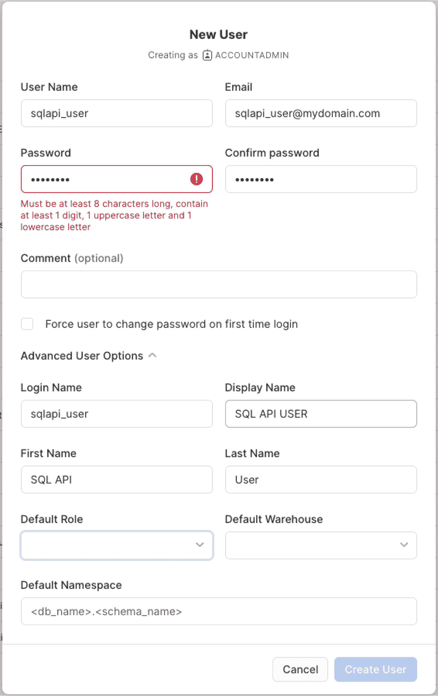

# 2. Snowflake 数据云

## 基础知识

在我们深入探讨如何使用 Snowflake SQL API 的细节之前，为其使用建立一些基础原则很重要。在本书中，我们有时会交替使用 `Snowflake SQL API`、`Snowflake API`、`SQL API` 和 `API`。除非另有说明属于其他 API 服务（如 `Snowpark API`），否则所有这三种用法都特指 Snowflake SQL API。随着 Snowflake 的持续发展，他们不断迭代和演进 Snowflake SQL API，并引入新的 API 库供用户利用，使开发者能够更轻松地挖掘 Snowflake 的强大功能。因此，本书分享的技术可能并不适用于 Snowflake 旗下的所有产品。

## 理解 Snowflake 的演进

除了 Snowflake SQL API，Snowflake 还支持使用其 `Snowflake Native App Framework` 和 `Snowpark API`。理解这些解决方案与 `SQL API` 的区别，将有助于您更好地理解 Snowflake 提供的功能。在本书的高级章节中，我们将简要介绍这两种平台功能。为了提供一个详尽的入门介绍，我们将在此讨论二者的不同之处。

## Snowpark API

`Snowpark` 库为开发者提供了一个直观的库，用于在 Snowflake 中大规模查询和处理数据。该库支持三种流行的 AI 和机器学习编程选项之一，让开发者可以自由选择他们熟悉的工作语言：`Python`、`Scala` 和 `Java`。`Snowpark API` 可以被视为 Snowflake Connector for Spark 的一次迭代，后者允许开发者将 Snowflake 引入 Apache Spark 生态系统。这使他们能够使用 Spark 从 Snowflake 读取数据以及向 Snowflake 写入数据。

从那里开始，比较开始出现分歧。Snowpark 开发者可以选择受益于以下优势：使用为不同语言专门构建的库和模式直接在 Snowflake 中交互数据，同时保持性能和功能；支持大多数代码 IDE（例如 `Jupyter`、`VS Code` 和 `IntelliJ`）；支持将数据转换和繁重任务（例如 Snowflake `UDF`）卸载到 Snowflake 数据云；并且不需要您在 Snowflake 之外维护单独的工作集群来运行计算。

由于其原生支持这些语言的能力，开发者可以使用原生语言结构内的类型检查来执行 `SQL` 语句，或者选择指定他们希望执行的 SQL 语句。一个很好的例子是能够使用流行 Python 库 `DataFrames` 提供的代码结构来构建 `SQL` select 查询。

由于 `Snowpark` 在 Snowflake 内原生运行，所有操作都在服务器上延迟执行，这允许开发者使用该库将转换的运行时间推迟到管道更晚的阶段，同时还提供了将多个操作批量处理为单次调用的灵活性。这使得开发者能够减少在客户端和 Snowflake 数据库之间传输数据所需的时间，并提供额外的性能改进。

使用 `Snowpark API` 提供的工具箱，开发者可以直接在 Snowpark 应用中创建用户定义函数（`UDF`）。`Snowpark` 可以将您的代码推送到服务器，并在您的数据上大规模执行您的 `UDF`。这为处理数据提供了许多有用且强大的选项，包括循环或批处理功能，其中创建 `UDF` 允许 Snowflake 在 Snowflake 内大规模并行化和应用代码。

通过在您的代码中定义自定义 `UDF`，您可以使用编写客户端代码的同一种语言编写函数，从而使您能够直接在 Snowflake 数据库中处理数据。`Snowpark` 能够神奇地处理将 `UDF` 的自定义代码推送到 Snowflake 数据库，并可以在您的客户端代码中被调用。这意味着您无需先将数据传输到本地客户端就能在数据上执行函数，从而为您节省时间、代码、金钱和性能。

## Snowflake Native App Framework

`Snowflake Native App Framework` 允许开发者通过与其他 Snowflake 账户共享数据和相关业务逻辑来扩展其他 Snowflake 功能的能力；允许通过 Snowflake 市场将应用程序作为免费或付费应用与消费者共享；并包含使用 `Streamlit` 的功能丰富的可视化。Snowflake 通过允许您创建直接利用核心 Snowflake 功能的数据应用程序来实现这一点。

Snowflake 构建其 `Native App Framework` 是为了符合大多数开发标准，包括在您的账户内轻松利用测试环境；一个健壮的开发者工作流，在源代码控制中管理代码，同时在 Snowflake 内维护数据和相关数据库对象；能够随着应用程序的不断演进对其进行版本控制和打补丁；向消费者增量发布更新；以及支持日志记录和非结构化事件，使您的开发者能够对应用程序进行故障排除和监控。

目前，`Native App Framework` 存在一些开发者应注意的限制。这些包括有限的支持（在 Microsoft Azure 或 Google Cloud Platform 上不支持）；除某些 AWS 区域外，不支持跨云自动履行；不支持政府云启用的区域；对虚拟私有 Snowflake (`VPS`) 的有限单组织支持；要求用户在新建表时使用序列而非 `AUTOINCREMENT`；不支持临时表或临时阶段；对 `Streamlit` 的有限支持；以及对引用的限制。Snowflake 围绕提供者-消费者模型构建其 `Native App Framework`，该模型也用于 Snowflake Collaboration 和 Secure Data Sharing 等功能中。

为了支持原生应用，提供者（即希望与其他用户共享数据内容和应用程序逻辑的用户）必须遵循特定的架构，以启用应用程序包的代码、分配和维护许可证与授权、提供对专有数据的访问以及提供对应用程序事件的访问。一旦应用程序准备好发布，提供者可以将其作为公共列表推送到 Snowflake Marketplace，或私下列出其应用程序以实现更可控的访问。

消费者（即希望访问提供者共享的数据内容和应用程序逻辑的 Snowflake 用户）可以前往该列表并启用该应用程序。该应用程序安装在消费者的 Snowflake 实例中，能够连接到其本地数据，并且可以与消费者的外部系统集成。

## 关键概念：云中的数据仓库

## Snowflake 架构

`Snowflake` 是一个自我管理的数据平台服务，它提供的数据存储、处理和分析解决方案比传统数据库产品更快、更易于使用且更灵活。它采用了一种新的、最先进的 `SQL` 查询引擎，部署在一个为云原生设计的创新架构上。由于它是一项基于云的服务，因此无需选择或配置管理硬件，也无需维护软件，持续的维护和调优直接由 Snowflake 处理。

在本节中，我们将深入探讨 Snowflake 的架构基础，它是当今可用的最具创新性和功能最强大的云数据仓库平台之一。对于任何希望充分利用 Snowflake 功能潜力的人来说，理解其架构都是至关重要的。

### 多层级、多集群的方法

Snowflake 架构的核心是其多层级、多集群的设计。这种独特的结构使得 Snowflake 能够无缝地处理大规模数据存储和查询处理。Snowflake 架构主要包括`存储层`、`计算层`和`服务层`。

`存储层`负责以高度压缩的列式格式高效管理和存储数据。Snowflake 的专利对象存储（您的数据安全存储于此）可以驻留在云存储服务中，例如 Amazon Web Services (AWS)、Microsoft Azure 和 Google Cloud Platform (GCP)。

`计算层`由虚拟机集群（在 Snowflake 中通常称为`虚拟仓库`）组成，这些集群负责处理查询。Snowflake 会动态分配和扩展这些集群，以确保即使面对变化的工作负载，也能获得最佳的查询性能。`计算层`采用基于消耗的模型，由`信用额度`构成，其消耗基于查询运行所需的时间以及`虚拟仓库`的大小。

最后，`服务层`作为 Snowflake 的控制平面，管理身份验证、查询路由、元数据存储等。`服务层`协调`存储层`和`计算层`之间的活动，确保数据的一致性和完整性。

Snowflake SQL API 允许您直接在您的应用程序中充分利用这些强大的层级，为您提供自定义和灵活性，让您能够按照自己的方式构建应用程序，同时还能获得 Snowflake 架构的优势。

Snowflake 是如何实现这种方法的？通过结合传统的`共享磁盘`和`无共享`数据库架构的混合方式。对于可从`计算层`访问的持久化数据，Snowflake 使用一个中央数据存储库。此外，`计算层`中的每个计算集群都在本地存储一部分完整数据集，然后可以使用`大规模并行处理`来处理查询。这使得 Snowflake 用户能以更简单、更熟悉的形式进行数据管理，同时在横向扩展架构中提供更优的性能。

为了处理所有这些，Snowflake 的架构有其独特的三层结构：`数据库存储`、`查询处理`和`云服务`。当数据加载到 Snowflake 时，`数据库存储`层将数据转换为压缩的列式格式，然后存储在云存储中。这些数据对象对客户不可见也不可直接访问，只能通过 SQL 查询来访问。这包括数据的组织方式、每个数据页的文件大小、结构、元数据和统计信息。`查询执行`层是用户访问所有数据的地方，它运行在采用`大规模并行处理`计算集群的`虚拟仓库`上。`虚拟仓库`不是与其他 Snowflake 客户或其他`虚拟仓库`共享的资源，因此最大限度地减少了任何对处理的性能影响。在`云服务`层中，进行 Snowflake 的编排。Snowflake 提供的所有用于代表用户处理请求的服务都在`云服务`层中进行。这包括身份验证、Snowflake 基础设施管理、元数据管理、查询处理和访问控制。

### Snowflake SQL API：全面概述

Snowflake SQL API（截至本文撰写时版本为 6.3）由一个资源和三个端点组成。第一个端点，也是资源本身，用于提交 SQL 语句执行：`/api/v2/statements/`。REST API 支持的第二个端点通过向`/api/v2/statements/<uuid>`传递一个唯一标识符来检查语句状态。最后，如果语句挂起、陷入无限循环或执行时间过长，可以通过向`/api/v2/statements/<uuid>/cancel`传递唯一标识符来取消语句。SQL API 的设计旨在消除并发限制，使您能够从多个线程检索查询结果。

执行新的 SQL 语句时，会创建一个包含 SQL 语句的 JSON 主体，并使用`HTTP POST`方法将其发送到端点。您可以在请求中选择性地包含一个`UUID`；否则，Snowflake 将自动为您生成一个。建议使用`UUID`生成器创建自己的`UUID`值，以便于后续的 API 调用，包括对失败查询的重试。Snowflake 允许您指定是否要在请求中或作为 Snowflake 内的设置异步执行语句。

所有发送到 API 的请求都将返回一个`202`状态码，表明 Snowflake 已收到请求并正在处理。负载还将包含一个`语句句柄`和一个`语句状态 URL`，您的代码可以轮询这些以获取结果。这使您能够轻松构建应用程序，实现界面的延迟加载，并使用诸如`AJAX`或其他 JavaScript 方法在之后轮询结果进行加载。

轮询结果使用`HTTP GET`方法，建议在请求结果之间提供短暂延迟，以便 Snowflake 有足够的时间完全执行查询并将结果加载到响应体中。一旦结果完成，Snowflake 将返回一个`200`状态码以及查询数据的第一页，还有您需要提取其他页（分区）的额外信息。由于 API 的灵活性，您可以选择顺序或并行提取其他页面。

### 开始使用 Snowflake SQL API

#### 简介

本章旨在让您熟悉有效利用 SQL API 进行数据管理和分析所需的基本概念和关键步骤。无论您是经验丰富的 SQL 开发人员，还是云数据平台的新手，本章都提供了必要的背景知识和实践指导，帮助您开始使用 Snowflake。

我们将从探索 Snowflake SQL API 的基础知识开始，包括如何连接到平台并执行您的第一个查询。您将学习如何导航 Snowflake 环境、与各种数据库对象交互，并理解构成 Snowflake 架构的关键组件。此外，本章还将指导您完成设置 Snowflake 账户、配置工作区和导入数据的过程，确保您拥有坚实的基础。在本章结束时，您将具备开始利用 Snowflake SQL API 进行高效有效数据分析的知识和技能。

## 设置您的 Snowflake 账户

Snowflake 使用基于浏览器的 Web 界面与平台进行交互，同时也提供命令行界面 (`SnowSQL`)、各种数据库驱动程序和 API 访问。如果您是首次开始使用 Snowflake，您需要先使用名为 `Snowsight` 的 Snowflake 基于 Web 的客户端登录以开始使用。注册账户并同意服务条款后，您将收到一封包含首次登录说明的电子邮件。

登录 Snowflake 使用的是一个包含账户标识符的独特 URL。账户标识符是在您的组织内唯一标识您的 Snowflake 账户的一种方式，并将其与其他 Snowflake 账户的全局网络区分开来。账户标识符使用您的账户名称以及组织名称（例如，`myorg-account123`）来引用您的独特账户。您可以选择使用 Snowflake 分配的账户定位器作为标识符，但这种旧版格式不推荐使用，因为 Snowflake 计划逐步淘汰它。您可以通过多种方式使用 Snowflake 独特账户标识符，包括

1.  通过 Web 浏览器访问 Snowflake Web 界面
2.  使用 `SnowSQL` 和其他客户端连接到 Snowflake
3.  Snowflake 生态系统内的第三方应用程序和服务
4.  保护您 Snowflake 账户的安全功能
5.  全局功能，例如安全数据共享和复制
6.  访问 Snowflake `SQL` 和 `Snowpark` API

需要注意的是，初次注册时，您将同时获得一个账户标识符和一个组织标识符。组织使您业务中的管理员能够管理与您业务实体相关的 Snowflake 合同的各个方面。一个组织可以关联一个或多个账户，每个账户都有自己的唯一标识符，这为您提供了灵活性，可以按照满足业务独特需求的方式设置云数据中心。如果您的业务不是通过自助服务选项注册的，Snowflake 将已经为您创建了一个组织并将其分配给您的 `ORGADMIN`（您组织的拥有者）。账户标识符，包括旧版标识符和其他较少使用的格式，在 Snowflake 文档中有详细说明，但这超出了本书的范围。我们将使用 Snowflake 推荐的首选格式，但您可以在以下位置查看所有其他格式及其相关信息：[`https://docs.snowflake.com/en/user-guide/admin-account-identifier`](https://docs.snowflake.com/en/user-guide/admin-account-identifier)

### 配置和管理您的环境

要开始使用，您需要登录您的 Snowflake 环境。您可以直接访问 Snowflake 在您注册时提供的独特 URL，或者访问 [`https://app.snowflake.com`](https://app.snowflake.com)，并使用您的账户名和 Snowflake 凭证登录。登录 `Snowsight` 后，您需要导航到左侧导航栏中的“管理”部分。在这里，我们将为您的 API 创建一个新用户。由于 API 的强大功能，不建议使用具有 `ACCOUNTADMIN` 或 `ORGADMIN` 访问权限的用户。

我们暂时不定义默认角色或默认仓库。继续并点击“创建用户”，然后测试您是否能够使用该用户登录。完成后，使用您的 `ACCOUNTADMIN` 凭证重新登录 `Snowsight`，我们将继续创建您的第一个角色。角色为您提供了一种简单的方法，将用户分组到单个团队、部门或权限集中。当您在 Snowflake 中管理安全时，您将直接向角色 `GRANT`（授予）对 Snowflake 对象的访问权限。角色使用继承机制工作，允许您为角色创建树状结构以继承权限，并减少冗余的 `GRANTS`（授权）。我们将创建一个基本角色并将其分配给我们先前创建的用户。确保该角色除非您需要，否则不继承来自其他角色的任何权限。在大多数情况下，建议您的 API 角色不继承来自其他角色的任何权限，并且权限是根据您希望应用程序执行的操作量身定制的。这可以防止您开放过多访问权限，并错误地移除可能破坏应用程序的访问权限。

接下来，我们需要导航到“仓库”并创建一个新仓库。根据您的应用程序和业务逻辑的结构，您可能需要根据资源需求，在应用程序的各个区域调用多个仓库。但在很大程度上，您应该有一个专门用于 API 用户的仓库，即默认仓库。这使您能够在应用程序增长时逐步扩展和增大仓库规模，同时不影响其他 Snowflake 查询。创建新仓库后，回到我们之前创建的用户，点击“编辑”，并分配我们刚创建的默认角色和默认仓库。

图 3-1：新用户创建

### 导航 Snowflake Web 界面

Snowflake 为用户提供了两种主要方式与 Snowflake 云平台交互：`SnowSQL` 命令行实用程序和基于 Web 的 Snowflake UI（称为 `Snowsight`）。两者中，Snowflake Web UI 是与 Snowflake 交互最常用的方式，包括执行查询以及执行管理功能，如管理仓库、数据库对象、安全性和审查成本与性能。

Snowflake 同时提供 `Snowsight` UI 和经典 UI，但我们将重点介绍前者，考虑到经典 UI 的路线图是将被完全淘汰。登录后，您会看到仪表板页面和左侧导航。我们将讨论该导航中的每个部分，包括子菜单项以及在 Snowflake 中工作时如何使用它们。这些信息虽然基础，但对于理解至关重要，以便我们能更好地演示 Snowflake `SQL` API 的功能并传达其限制。

#### 仪表板

仪表板为 Snowflake 用户提供了一种灵活的方式来创建查询集合（以磁贴形式排列），这些集合直接由您的 Snowflake 数据的查询结果填充。这使您能够构建快速的解决方案来监控您的 Snowflake 账户，并从中获取可重复使用并与其他团队成员共享的快速数据洞察。仪表板指标是完全可定制的，并支持广泛的筛选选项，为最终用户提供交互式、动态的筛选功能。虽然它是您工具库中一个强大的补充，但需要指出的是，Snowflake 中的仪表板功能并非旨在替代您传统的 BI 工具。相反，它应该被用作一种方式，以获得对您账户和数据的一些快速、高层次的洞察。

#### 工作表

Snowflake 的 Snowsight UI 支持一个基于 Web 的查询工具，称为 `Worksheets`，其行为类似于 `DBeaver`、`PHPMyAdmin`、`pgAdmin` 等 SQL 工具。当你首次打开 `Worksheets` 时，你会在屏幕左侧看到一个最近打开文件的列表和一个文件资源管理器。文件资源管理器支持创建和组织文件及文件夹，为你提供了一个基于云的编辑器。点击任何文件都会在新标签页中打开它，这些标签页可以在屏幕顶部管理，同时也允许你导航到其他已打开的标签页。使用 `Worksheets`，用户可以创建 `SQL` 和 `Python Worksheets`。

当使用 `SQL Worksheets` 时，你可以像使用桌面工具一样编写和运行 SQL 语句，浏览查询结果，应用过滤器，并为查询结果生成快速的可视化图表。对于你创建的任何 `Worksheet`，你可以修改一些标准元数据，例如 `Worksheet` 的标题，并与 Snowflake 实例中的其他用户共享设置。

与 `SQL Worksheets` 类似，`Python Worksheets` 允许你直接在 Snowflake 环境中执行原始的 **Python** 代码。这是一个很棒的工具，不需要像 `Jupyter notebooks` 那样大量的开销配置，并允许你直接针对数据运行 **Python**，而无需先下载数据和上传结果。`Python Worksheets` 为你提供了与 Snowflake 的 `Snowpark` 工具的直接集成，释放了 **Python** 的全部潜力，进而支持众多用于人工智能和机器学习编程的包。

#### 数据

本节介绍导航窗格中的“数据”选项卡，它包含与 Snowflake 实例中数据相关的各种功能区域。除了 `Worksheets`，用户将在 Snowsight 的这一部分花费大量时间，执行各种数据任务，如数据库管理、数据共享和治理。

##### 数据库

“数据库”部分允许用户充分利用授予其当前角色的 `GRANTS`。Snowflake 允许你使用屏幕左上角的选项随时更改你的角色，并根据该角色拥有的 `GRANTS` 更新“数据库”页面。这是在为用户分配角色之前，测试不同角色访问权限的好方法。

“数据库”部分有一个嵌套的导航面板，允许你对授予当前角色的数据库进行分层视图排序。这包括能够下钻到你的角色支持的数据库的最低层级。为了对此部分进行最详尽的解释，我们将假设你使用的是 `ACCOUNTADMIN` 角色，这让你可以完全访问 Snowflake 实例中的所有数据库对象。除了你在组织中创建的任何数据库外，你很可能会看到另外两个数据库：`SNOWFLAKE` 和 `SNOWFLAKE_SAMPLE_DATA`。`SNOWFLAKE` 数据库提供了各种视图和函数，允许你检索有关 Snowflake 实例的大量元数据，包括查询历史、访问历史、仓库使用情况、信用消耗等。`SNOWFLAKE_SAMPLE_DATA` 数据库为你提供了完整的测试数据集，可用于学习更多关于 Snowflake 的知识。这两个数据库都是 Snowflake 的标准配置，不在本文讨论范围内。

在顶层，点击一个数据库名称将展开该数据库的节点，并更新信息屏幕以显示更多详细信息。“数据库详情”概述了有权访问该数据库的角色及其显式权限，而“模式”则会列出属于该数据库的当前模式列表。在页面的右上角，你有一些额外的选项，包括删除数据库、克隆数据库、修改数据库和转移数据库所有权。从此屏幕，你还可以使用 “+ 模式” 按钮创建一个新的 `Schema`。

点击树中的任何 `Schema` 将带你进入“模式详情”页面，列出授予该模式的角色和权限。如果你不熟悉角色在 Snowflake 中的工作原理，建议你查阅文档。简而言之，角色具有最高限制性。例如，如果你被授予了对一个 `Schema` 的访问权限，但没有访问其父数据库的权限，你将无法查看该模式。

在一个模式内，你还可以看到你的角色有权访问的表、暂存区、文件格式和过程。在右上角，你有几个修改模式的选项，以及一个 “创建” 按钮，允许你通过图形表单编辑器快速创建表、视图、暂存区、存储集成、文件格式、序列、管道、流、任务、函数、过程和动态表。

随着你继续下钻到表、视图和过程等对象中，你会发现类似的信息和编辑选项。下钻到对象时需要注意的一件重要事情是，信息屏幕现在将开始显示一个定义窗口，其中包含创建该对象所需的完整 SQL 查询。这对于调试对象或在需要在新数据库中重新创建对象时非常有用。

##### 私有共享

`Private Sharing` 是一项功能，可让你与 Snowflake 实例中的其他 Snowflake 帐户共享选定数据，并可能将你的数据货币化。“与您共享”下的“直接共享”会显示共享到你的 Snowflake 帐户的任何数据。“由帐户共享”会显示你通过指定直接消费者、发布到 `Marketplace` 或创建 `Direct Share` 而与其他 Snowflake 客户共享的任何数据。最后一个选项卡“阅读者帐户”，允许你指定共享给非 Snowflake 客户个人的数据，为他们提供对数据的只读访问权限，而无需 Snowflake 帐户。

##### 提供者工作室

`Provider Studio` 是一个更高级的主题，超出了本文的范围。它允许你创建 Snowflake 应用程序并将其发布到 Snowflake `Marketplace`，管理你的列表，并查看你列在 `Marketplace` 上的任何应用程序的分析数据。如果你计划利用 `Marketplace` 发布应用程序，“学习”选项卡中有许多值得阅读的文章。Snowflake 甚至提供了多种方式来为你发布的应用程序的使用收集付款，包括能够使用 Snowflake 信用额度作为数字货币。

##### 治理

截至撰写本文时，`Governance` 是 Snowsight 中一个相对较新的功能。“仪表板”页面可让你快速查看你拥有多少 Snowflake 对象、分配给这些对象的任何标签和策略，以及一些统计数据，如最常用的标签和最常用的策略。“标记的对象”标签显示 Snowflake 实例中的所有对象列表、分配给它们的任何标签以及已分配的任何策略。

#### 市场

“市场”页面允许你探索和搜索已发布的提供者应用程序和数据集，这些资源可在你的 Snowflake 实例中使用。这里有免费、增值和付费列表的混合，你可以在你的组织中探索和启用它们。

#### 活动

“活动”选项卡为你提供了几种探索 Snowflake 实例中用户活动的方法。这可能是我 Snowflake 实例中第二常用的部分，尤其是在使用 Snowflake SQL API 时，因为它让我更深入地了解我的 API 调用实际执行了哪些活动，并提供了关于我可能遇到的任何错误的丰富细节。

