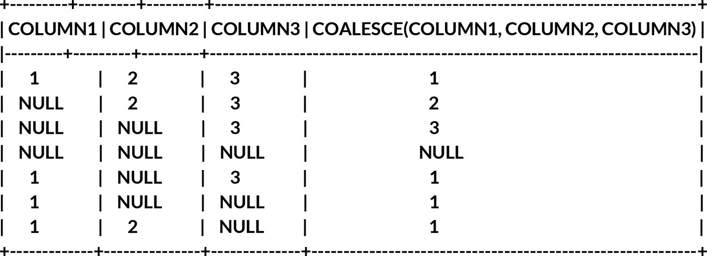

# 5. 使用 Snowflake SQL API 的高级 SQL 技术

在本章中，我们将超越常规数据查询的边界，深入探索复杂的数据操作。我们将踏上一段旅程，将您的 SQL 技能提升到新的高度，为您提供工具和技术，以便自信而精确地应对复杂的数据挑战。

## 子查询与公用表表达式 (CTEs)

子查询和 CTE 是一种通过在（例如）将数据与其他表连接之前先过滤初始数据集来提升查询性能的方法。想象一下，您的大学数据库中有超过一百万学生，以及超过五百万条课程注册记录。这里假设每个学生只选了五门课，而每门课都有学生注册。众所周知，一所大学很可能远不止五门课，而且如果课程对应不同的学期，可以被视为不同的课程，同时每门课通常会有多个学生注册。数据量可能会迅速膨胀，导致您的查询运行缓慢甚至超时。在 Snowflake 的世界里，这可能会非常昂贵，因为 Warehouse 必须运行更长时间并消耗更多的信用点。那么，我们如何解决这个问题呢？一种方法是使用子查询。

```sql
SELECT s.full_name, s.student_id, ec.class_name, ec.class_code FROM students s
INNER JOIN enrolled_classes ec ON ec.student_id = s.student_id
ORDER BY s.student_id ASC
```

这个查询将按 `student_id` 从小到大的顺序返回所有学生，以及他们曾经注册过的任何课程。这可能是一个巨大的数据量。如果我们想过滤学生数量，可以使用 `WHERE` 子句，但也许我们用于过滤的数据存在于另一个表中。子查询可以解决这个问题：

```sql
SELECT s.full_name, s.student_id, ec.class_name, ec.class_code
FROM (
    SELECT sqs.full_name, sqs.student_id FROM students sqs
    INNER JOIN class_grades sqcg ON sqcg.student_id = sqs.student_id
    WHERE AVG(sqcg.grade) < 72
) s
INNER JOIN enrolled_classes ec ON ec.student_id = s.student_id
ORDER BY s.student_id ASC
```

上面的例子将首先运行 `FROM` 子句内部的查询，为所有平均绩点低于 72% 的学生返回一个 `student_name` 和 `student_id` 值的列表。我们认为这些学生有因 GPA 低而退学或失去助学金的风险。一旦我们有了这个学生子集，就返回这些学生及其课程名称和课程代码。我认为我们还可以进一步过滤。

```sql
SELECT s.full_name, s.student_id, ec.class_name, ec.class_code
FROM (
    SELECT sqs.full_name, sqs.student_id FROM students sqs
    INNER JOIN class_grades sqcg ON sqcg.student_id = sqs.student_id
    WHERE AVG(sqcg.grade) < 72
) s
INNER JOIN (
    SELECT sqec.class_name, sqec.class_code FROM enrolled_classes sqec
    INNER JOIN class_semesters sqcs ON sqec.class_code = sqcs.class_code
    WHERE sqcs.semester_name = 'Fall' AND sqcs.semester_year = '2023'
) ec ON ec.student_id = s.student_id
ORDER BY s.student_id ASC
```

此查询将首先根据我们已经看过的第一个子查询获取学生列表。然后，第二个子查询将评估并仅返回 2023 年秋季学期的课程。两个子查询都评估后，结果数据将被连接，任何不匹配的数据将因 `INNER JOIN` 而被过滤掉，最终返回一个更易于管理的数据集。

## 使用绑定变量

回到 Snowflake SQL API 的主题，使用绑定变量使得编写更清晰、更动态的代码变得更容易。让我们看一个在 API 上下文中使用绑定变量的示例。

```php
$query = Http::withHeaders([
    'Content-Type' => 'application/json',
    'User-Agent' => 'myApplication/1.0',
    'X-Snowflake-Authorization-Token-Type' => 'KEYPAIR_JWT',
])->acceptJson()->withToken($jwt)->post($snowflake_api_base_url.'/api/v2/statements', [
    'statement' => "SELECT CREATED_ON, ADDRESS, ZIP FROM customers WHERE LAST_ORDER_DATE BETWEEN ? AND ?;",
    'database' => $database,
    'warehouse' => $connection->warehouse,
    'schema' => $schema,
    'role' => $connection->role,
    'parameters' => [
        'query_tag' => 'black-diamond',
    ],
    'bindings' => [
        '1' => [
            'type' => 'TEXT',
            'value' => '2023-10-01'
        ],
        '2' => [
            'type' => 'TEXT',
            'value' => '2023-12-31'
        ],
    ],
]);
```
*列表 4-8：使用绑定变量的 Laravel API 处理程序*

上面的查询在 `statement` 中使用了 `BETWEEN` 函数，以查找在特定日期范围内有过订单的所有客户。我们使用两个问号 (`?`) 来表示需要绑定变量的位置。第一个问号对应绑定 `1`，第二个对应绑定 `2`，依此类推，按它们出现的顺序排列。

如果您将两个绑定的值替换为动态代码，例如 `$quarterstartdate` 和 `$quarterenddate`，那么您的代码就可以基于某些先前的逻辑来指定一个季度的开始和结束日期。通过将这些值移入 `bindings`，意味着 `statement` 部分整体上看起来更清晰，并形成一个更整洁的代码块。此外，使用绑定变量还有一个安全优势。通过使用绑定变量，您可以防止来自中间人攻击或用户输入的 SQL 注入攻击。


## 使用 `CASE` 和 `COALESCE` 进行数据转换

### `CASE` 语句

`CASE` 语句是 SQL 开发人员工具箱中的一款强大工具，为查询中的条件逻辑和值转换提供了一种灵活的机制。在本节中，我们将深入探讨 `CASE` 语句的细节，揭示其广泛的应用，并展示它如何提升你的 SQL 查询的复杂程度。

从根本上讲，`CASE` 语句提供了一种在 SQL 查询中实现条件逻辑的灵活方式，允许开发人员根据指定条件执行不同的操作。无论你需要对数据进行分类、计算衍生值，还是自定义查询输出，`CASE` 语句都提供了简洁直观的语法来实现这些目标。通过掌握 `CASE` 语句的细微差别，你将在 Snowflake 的动态生态系统中，为数据操作和分析开启一片充满可能性的天地。

除了基本功能外，`CASE` 语句在处理复杂的业务逻辑和动态转换数据方面表现出色。对多个条件和嵌套 `CASE` 表达式的支持，使开发人员能够以精确和高效的方式应对各种场景。从数据清洗和标准化，到高级报告和决策制定，`CASE` 语句都是推动可操作性见解、提升你的 SQL 查询价值的基石。以下是一个 `CASE` 查询的示例。

```sql
SELECT
    s.full_name
    , s.student_id
    , CASE
        WHEN ec.class_code LIKE 'MATH%' THEN 'Mathematics'
        WHEN ec.class_code LIKE 'SCI%' THEN 'Sciences'
        WHEN ec.class_code LIKE 'PSY%' THEN 'Psychologies'
        ELSE ec.class_code
    END AS ClassType
    , CASE
        WHEN RIGHT(ec.class_code, 1) = 1 THEN '1 Credit'
        WHEN RIGHT(ec.class_code, 1) = 2 THEN '2 Credits'
        WHEN RIGHT(ec.class_code, 1) = 3 THEN '3 Credits'
        WHEN RIGHT(ec.class_code, 1) = 4 THEN '4 Credits'
    END AS Credits
FROM students s
INNER JOIN enrolled_classes ec ON ec.student_id = s.student_id
ORDER BY s.student_id ASC
```
*清单 5-1: Snowflake `CASE` 查询*

在这个例子中，我们获取 `class_code` 并查看其首字符。大多数课程代码类似于 `MATH 2433` 或 `ARTS 1123`。课程代码的第一部分表示课程类型，而最后一个数字通常表示该课程的学分值。我们看到的第一个 `CASE` 语句接收 `class_code` 并确定我们的课程类型（数学、科学、化学等）。如果没有匹配项，`ELSE` 语句将显示完整的课程代码（例如 `ORG 1211`）。`LIKE` 函数对值进行模糊匹配。结合 `%` 符号，我们告诉 `CASE` 语句严格按顺序匹配开头的字符，并接受其后的任何字符，正如 `%` 符号所表示的那样。

在第二个 `CASE` 语句中，我们使用 `RIGHT()` 函数来获取字符串最右侧的第一个字符。在本例中，即 `class_code` 的最后一个数字。使用等于限定符，我们确定最后一个数字，然后将其对应的学分数指定为值。由于我们的大学示例中没有学分小于 1 或大于 4 的课程，因此不存在 `ELSE` 语句。这是 `ELSE` 语句可选性的一个很好例证。

### `COALESCE` 语句

`COALESCE` 语句在 SQL 开发中成为一项基础工具，为处理查询中的 `NULL` 值提供了一种简洁的解决方案。让我们深入探讨 `COALESCE` 语句的多功能性，展示其在各种场景中简化数据操作和增强查询结果的能力。

本质上，`COALESCE` 语句是一种用备选的非 `NULL` 值替换 `NULL` 值的强大机制。无论你是在处理数据导入、连接表，还是执行计算，`COALESCE` 语句都提供了一种管理 `NULL` 值的有效直接方法。通过在 SQL 查询中策略性地整合 `COALESCE`，你可以确保数据完整性、提高查询的可读性，并减轻因 `NULL` 处理而可能产生的错误。

此外，`COALESCE` 语句在处理多个输入值时提供了灵活性，允许开发人员根据预定义的优先级对值进行排序。在数据质量或完整性因来源而异的情况下，此功能非常宝贵，它使开发人员能够无缝地优先选择备用值或默认选项。通过利用 `COALESCE` 语句的功能，SQL 开发人员可以简化数据处理工作流程，并增强其查询逻辑的稳健性，最终有助于实现更高效、更可靠的数据分析。

Snowflake 中的 `COALESCE` 语句返回第一个非 `NULL` 的表达式，如果所有参数都是 `NULL`，则返回 `NULL`。让我们看一个例子。

```sql
SELECT column1, column2, column3, coalesce(column1, column2, column3)
FROM (values
    (1,    2,    3   ),
    (null, 2,    3   ),
    (null, null, 3   ),
    (null, null, null),
    (1,    null, 3   ),
    (1,    null, null),
    (1,    2,    null)
) v;
```
*清单 5-2: Snowflake `COALESCE` 查询*



在上面的例子中，第一行返回的值为 1，因为 `column1` 等于 1。在第三行中，前两列是 `NULL`，但最后一列等于 3，所以我们返回 3。在第四行中，所有三列都是 `NULL`，因此函数返回 `NULL`。


## 处理日期与时间数据

处理日期和时间数据是数据管理与分析的一个关键方面，尤其在时间维度洞察至关重要的场景中。本节将探讨在 Snowflake 的 SQL 环境中有效管理日期和时间数据的最佳实践与技术，使开发人员能够提取有意义的洞见并推动数据驱动的决策。

首先，理解日期和时间数据固有的复杂性至关重要。Snowflake 提供了一套强大的函数和运算符，专门用于处理各种与日期和时间相关的任务，从简单的日期运算到复杂的时间计算。通过熟悉这些函数，开发人员可以轻松地操作日期和时间数据、执行趋势分析，并从时间数据集中获取可操作的洞见。

其次，在处理日期和时间数据时，确保数据的一致性和标准化至关重要。Snowflake 对标准化日期和时间格式的支持，以及其全面的转换函数范围，有助于在不同来源之间实现无缝的数据转换和集成。无论是整合来自不同系统的数据，还是使数据与组织标准保持一致，Snowflake 都提供了必要的工具来简化流程，并在数据管道的整个过程中维护数据完整性。

最后，利用高级功能（如窗口函数和特定于日期的聚合函数）可以增强时间分析的深度和粒度。窗口函数使开发人员能够在定义的时间间隔上执行计算，便于进行趋势分析、移动平均和其他时间序列操作。同样，特定于日期的聚合函数（例如 `DATE_TRUNC`）允许在各种时间粒度上汇总数据，使开发人员能够提取所需详细级别的洞见。通过利用这些高级功能，开发人员可以释放 Snowflake 中日期和时间数据的全部潜力，推动可操作的洞见并促进数据驱动的决策。

Snowflake 支持超过 20 个日期和时间函数，您可以在查询中使用它们，同时也支持常用的时间部分。由于 Snowflake 中存在多种可能影响日期和时间显示方式的配置选项（尤其是在处理时区时），建议使用 Laravel 辅助库进行日期和时间操作，并在您的应用程序和 Snowflake 之间传递数据。如果您采用此方法，在 SQL 中可能最常用的函数之一就是 `TO_TIMESTAMP()` 函数。它可以让您将 Snowflake 中的输入和输出数据格式化为易于处理的时间戳值。

需要注意的一点是，Snowflake API 会以 EPOCH 格式将数据传回您的应用程序。要在 Laravel 中转换此格式，示例可能如代码清单 5-3 所示。

```php
$query = Http::withHeaders([
    'Content-Type' => 'application/json',
    'User-Agent' => 'myApplication/1.0',
    'X-Snowflake-Authorization-Token-Type' => 'KEYPAIR_JWT',
])->acceptJson()->withToken($jwt)->post($snowflake_api_base_url.'/api/v2/statements', [
    'statement' => "SELECT CREATED_ON, ADDRESS, ZIP FROM customers;",
    'database' => $database,
    'warehouse' => $connection->warehouse,
    'schema' => $schema,
    'role' => $connection->role,
    'parameters' => [
        'query_tag' => 'black-diamond',
    ],
]);
$epoch = $query['data'][0][0];
$dt = new DateTime("@$epoch");
echo $dt->format('Y-m-d H:i:s');
```
代码清单 5-3：处理时间值的 Laravel API 处理程序

上面的代码将获取第一条记录的第一列（即 `CREATED_ON` 列），并将 epoch 值分配给一个变量。然后，它使用 `DateTime` 库将其设置为 epoch 日期时间值，接着我们将其格式化为人类可读的格式。

## 动态 SQL 与存储过程

动态 SQL 代表了一种构建 SQL 查询的灵活方法，允许开发人员在运行时动态生成和执行 SQL 语句。在查询结构或内容可能根据用户输入、数据条件或应用程序逻辑而变化的场景中，这种能力尤其有价值。在本节中，我们将深入探讨 Snowflake 背景下动态 SQL 的细节，探索其优势、挑战以及实现的最佳实践。

动态 SQL 的关键优势之一是其适应不断变化的需求和动态数据环境的灵活性。通过动态生成 SQL 语句，开发人员可以为特定用例、条件或用户偏好量身定制查询。这种灵活性扩展到即席报告、数据驱动的应用程序逻辑和动态过滤等场景，在这些场景中，能够即时构建 SQL 语句增强了系统的敏捷性和响应能力。然而，动态 SQL 也引入了与安全性、性能和可维护性相关的考虑因素，需要仔细规划并遵循最佳实践，以减轻潜在风险并确保最佳的查询执行。

存储过程是在 Snowflake 中封装 SQL 逻辑的一个强大工具，使开发人员能够在服务器端执行复杂操作、事务和业务逻辑。本质上，存储过程是预编译的 SQL 代码块，存储在数据库中并根据需要执行。在本节中，我们将探讨 Snowflake 中存储过程的好处和功能，重点介绍它们在数据驱动应用程序中增强性能、安全性和可维护性方面的作用。

存储过程的主要优势之一是，通过集中化和标准化 SQL 逻辑来简化数据库操作。通过将常用的查询、数据转换和业务规则封装在存储过程中，开发人员可以促进代码重用、最小化冗余并提高整体代码的可维护性。此外，存储过程促进了模块化开发实践，允许开发人员将复杂的任务分解为更小、更易管理的代码单元。这种模块化方法不仅增强了代码组织，还简化了调试、测试和版本控制，从而带来更健壮、更可扩展的数据库应用程序。

假设我们在 `DATAVAULT` 中有一个想要一次性调用的存储过程列表。我们可以向 Snowflake 发送一个动态查询，以获取一个可调用的存储过程列表，如代码清单 5-4 所示。

```sql
SELECT 'CALL ' || PROCEDURE_CATALOG || '.' || PROCEDURE_SCHEMA || '.' || PROCEDURE_NAME || '();' cmd
FROM datavault.information_schema.procedures
WHERE PROCEDURE_CATALOG = 'DATAVAULT' AND PROCEDURE_SCHEMA = 'SOURCE';
```
代码清单 5-4：Snowflake 存储过程字典

上面的示例可能会以 `CALL SPROC_NAME();` 的格式输出一个存储过程列表。该列表可能类似于代码清单 5-5。

```php
$sprocs = $query['data'];
foreach ($sprocs AS $sproc)
{
    $query2 = Http::withHeaders([
        'Content-Type' => 'application/json',
        'User-Agent' => 'myApplication/1.0',
        'X-Snowflake-Authorization-Token-Type' => 'KEYPAIR_JWT',
    ])->acceptJson()->withToken($jwt)->post($snowflake_api_base_url.'/api/v2/statements', [
        'statement' => $sproc[0],
        'database' => $database,
        'warehouse' => $connection->warehouse,
        'schema' => $schema,
        'role' => $connection->role,
        'parameters' => [
            'query_tag' => 'black-diamond',
        ],
    ]);
    wait 5;
}
```
代码清单 5-5：用于存储过程的 Laravel REST API 处理程序

上面的代码将获取存储过程列表并调用每一个。我们在 `foreach` 循环结束时设置了 5 秒的等待时间，以防止过多的查询同时排队，并减轻 Snowflake Warehouse 的部分负载。


## 用户自定义函数（UDF）

用户自定义函数（`UDFs`）在扩展`Snowflake`中`SQL`查询的功能方面发挥着**关键作用**，它使开发人员能够实现根据特定需求定制的自定义逻辑和计算。本质上，`UDFs`允许开发人员将复杂的算法或业务逻辑封装成可复用的代码片段，然后可以无缝集成到`SQL`查询中。在本节中，我们将深入探讨`UDFs`在`Snowflake`中的多功能性和实用性，探索它们在各种用例和场景中的应用。

`UDFs`的主要优势之一是，它们能够通过将复杂操作抽象成简洁直观的函数调用来增强查询的表达力和可读性。无论是执行数据转换、计算还是字符串操作，`UDFs`都提供了一种在`SQL`查询中实现自定义逻辑的简化方法。通过将复杂操作封装在可复用的函数中，开发人员可以促进代码重用、提高代码可维护性，并降低跨查询出现错误或不一致的风险。

此外，`UDFs`使开发人员能够扩展`Snowflake`的`SQL`引擎的**原生功能**，便于实现内置`SQL`函数不原生支持的专门算法或计算。无论是实现自定义统计函数、地理空间计算还是特定领域的逻辑，`UDFs`都赋予了开发人员满足独特需求并从数据中提取宝贵见解的能力。另外，`UDFs`可用于封装常见的数据处理任务，例如数据清理、验证或充实，从而简化数据准备工作流程并提高数据处理管道的效率。

`Snowflake`允许您使用`Java`、`JavaScript`、`Python`和`SQL`来创建`UDFs`。如果使用`JavaScript`或`SQL`，则在创建函数时无需定义`HANDLER`类型，因为`Snowflake`会自动识别它们。在数据科学应用中，可能会创建一个`UDF`来清理数据，并将其返回给存储过程，然后通过`Snowpark`用`Scala`或`Python`进行处理。

