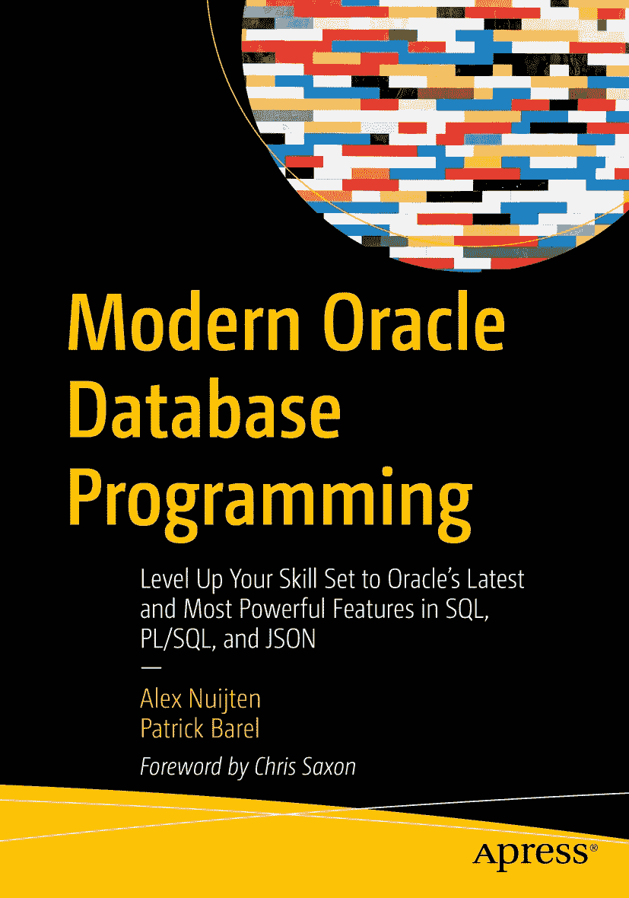

ISBN 978-1-4842-9165-8e-ISBN 978-1-4842-9166-5 [`doi.org/10.1007/978-1-4842-9166-5`](https://doi.org/10.1007/978-1-4842-9166-5) © Alex Nuijten, Patrick Barel 2023 本作品受版权保护。出版商对本作品所有内容（无论涉及材料整体或部分）的版权拥有**唯一且排他性的许可**，特别是翻译、转载、插图重用、朗诵、广播、缩微胶片或其他任何物理方式的复制，以及信息存储与检索、电子改编、计算机软件或目前已知及未来开发的类似/相异方法的传播权利。本出版物中对通用描述性名称、注册名称、商标、服务标识等的使用，即便未作特别说明，也不意味着这些名称可不受相关保护性法律法规约束而自由使用。出版商、作者和编辑均合理相信本书中的建议和信息在出版时真实准确。出版商、作者或编辑均不对本书材料或可能存在的错误与遗漏提供任何明示或暗示的保证。对于出版地图中的辖区主张及机构隶属关系，出版商保持中立。

此 Apress 标识版本由 Springer Nature 旗下的注册公司 APress Media, LLC 出版。

注册公司地址为：1 New York Plaza, New York, NY 10004, U.S.A.

