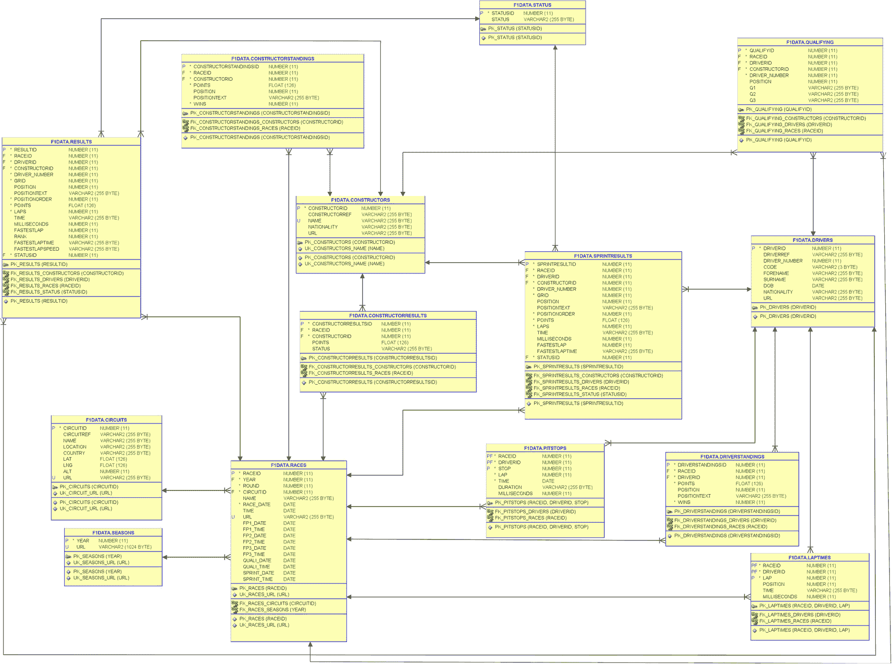
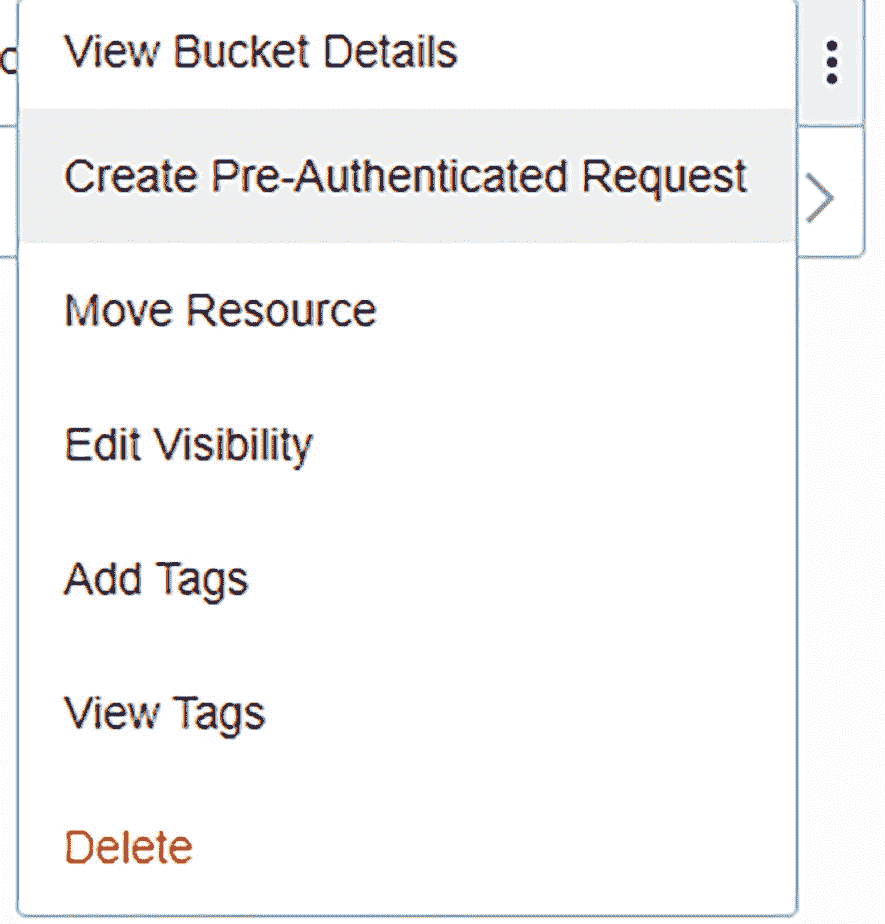
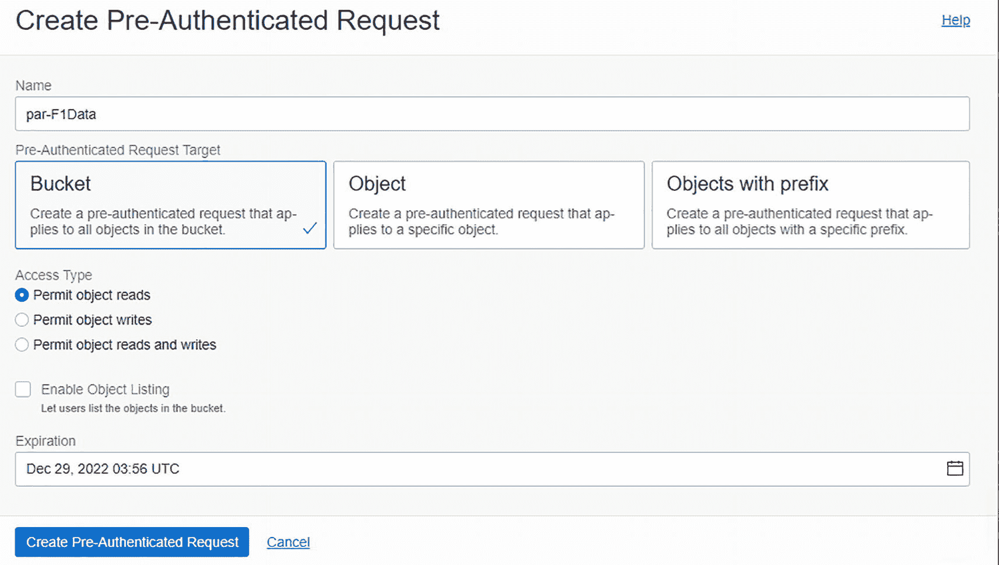
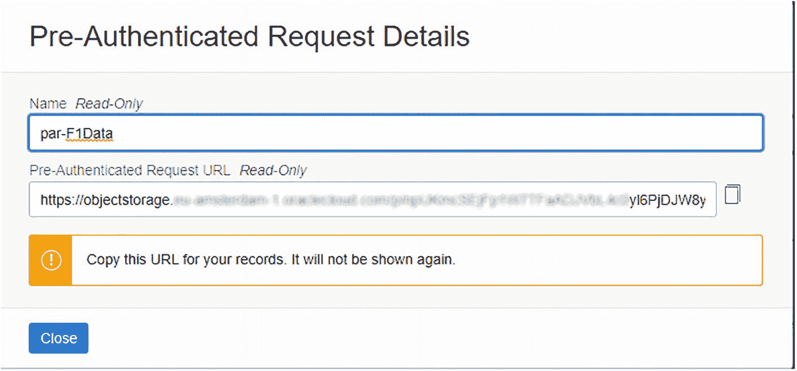
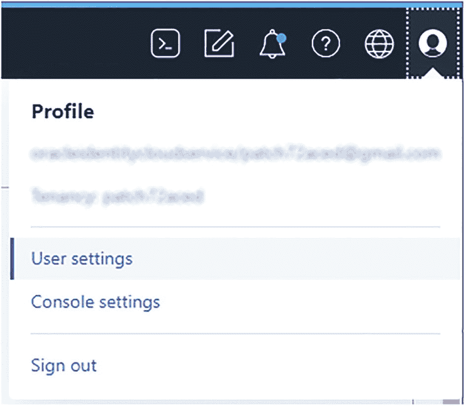
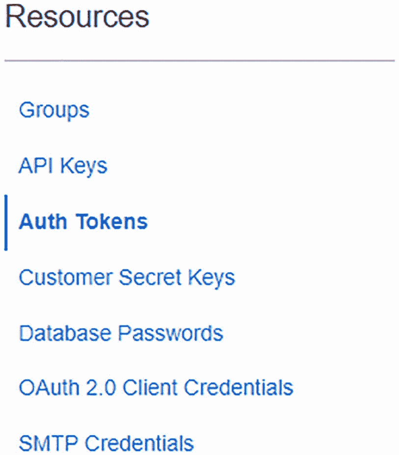
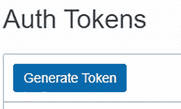
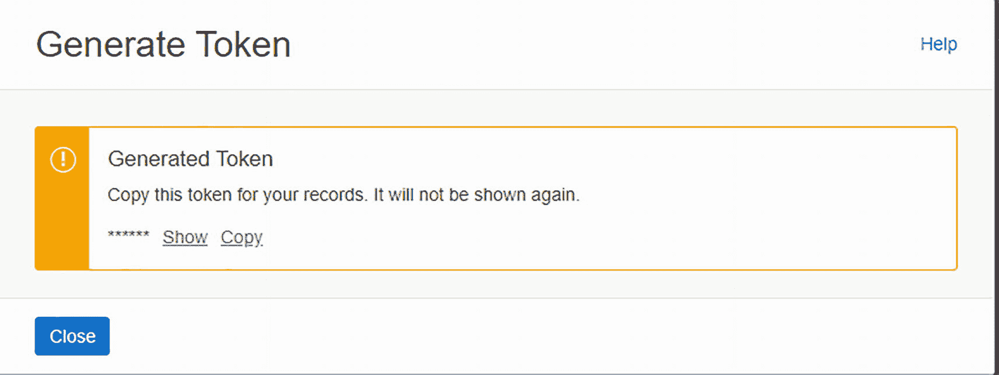

# 第三部分：Oracle 提供的功能

Oracle 数据库开箱即用，提供了大量可用的功能。在本书的第三部分，其中一些功能将占据核心地位。

即使 `APEX` 未被用于前端开发，它也提供了一些非常有用的包，可用于日常的数据库开发。基于版本的重定义（Edition-based redefinition）能够实现定制应用程序的零停机升级。获取当前基于有效期的数据，可以通过数据库处理，而无需编写复杂的 `SQL` 语句。

## Oracle 云中的模式

本书中大部分示例使用的数据模型取自 Ergast 赛车数据网站（[`https://ergast.com/mrd/`](https://ergast.com/mrd/)），并导入到 Oracle 数据库 19c 和 21c 中。

Ergast F1 数据模型的示意图如 I-1 图所示。我们使用 Oracle Always Free 云服务作为数据库。我们通过以下步骤使模式（schema）启动并运行。假设你已经创建了数据库并有权访问`admin`用户。

F1 数据状态、排位赛、车手、冲刺赛结果、车队、车队结果、比赛、赛道、赛季、进站、车手积分榜、单圈时间和比赛结果的流程结构图。

图 I-1：F1DATA 模式

使用列出的模式执行以下脚本。

- **ADMIN**：创建用户`F1DATA`。脚本：`F1Data_Create_User`
- **F1DATA**：创建表。脚本：`F1Data_Tables`
- **F1DATA**：对列添加注释。脚本：`F1Data_Comments`
- **F1DATA**：创建公共同义词并向公众授予表的访问权限。脚本：`F1Data_Grants_And_Synonyms`
- **F1DATA**：创建多态表函数以拆分 CSV 行。该函数在第 8 章中解释。脚本：`F1Data_Separated_PTF`

在云控制台中，执行以下步骤。

在你的云环境中创建一个存储桶（bucket）来存放 CSV 文件。为此存储桶创建一个预认证请求。转到*创建预认证请求*。

屏幕显示菜单视图：查看存储桶详情、创建预认证请求、移动资源、编辑可见性、添加标签、查看标签和删除。

图 I-2：创建预认证请求菜单

填写详细信息，然后单击*创建预认证请求*。

屏幕显示创建预认证请求，包含名称、请求目标、存储桶、对象和带前缀的对象、允许的对象读取、写入和读写选项、过期日期，以及底部的创建请求按钮。

图 I-3：创建预认证请求

复制预认证请求 URL 并将其存储在安全的地方。*它不会再次显示。*

屏幕显示创建预认证请求：名称只读、请求 URL 只读，以及“复制此 URL 以备记录。它不会再次显示。”底部是关闭按钮。

图 I-4：预认证请求详情

从 Ergast 开发者 API 网站下载最新的 CSV 文件：[`http://ergast.com/downloads/f1db_csv.zip`](http://ergast.com/downloads/f1db_csv.zip)。

将 CSV 解压缩到你的本地机器。将文件上传到你的存储桶。

创建一个对象存储认证令牌。转到*用户设置*。

屏幕显示配置文件，包含用户设置、控制台设置和注销。

图 I-5：用户设置

在资源下点击*认证令牌*。

屏幕显示资源，包含选项：组、API 密钥、认证令牌、客户机密钥、数据库密码、OAuth 2.0 客户端凭据和 SMTP 凭据。

图 I-6：认证令牌

点击*生成令牌*。

屏幕显示认证令牌，带有一个生成令牌按钮。

图 I-7：生成令牌

复制生成的令牌并将其存储在安全的地方。*它不会再次显示。*

屏幕显示生成的令牌：复制此令牌以备记录。它不会再次显示。下方是显示、复制和关闭按钮选项。

图 I-8：已生成的令牌

在`ADMIN`模式中，执行以下文件。

- **ADMIN**：创建凭据。将`<<Authorization Token>>`替换为你在上一步生成的令牌。脚本：`F1Data_Create_Credential`
- **ADMIN**：将数据导入表中。将`<<URL Path (URI)>>`替换为你的预认证请求 URL 路径。脚本：`F1Data_Import_Data`

### 致谢

当最初有人邀请我写这本书时，我的第一反应是：“不，别再来了，工作量太大，没时间。”经过一夜好眠后，它变成了“可以，但不能独自一人。”值得庆幸的是，我的好朋友兼同事 Patrick Barel 勇敢地加入了我这次的探索之旅。我喜欢与你共事并交流想法。谢谢你，Patrick。

如果没有彻底的技术审校，这本书将会面目全非。感谢你，Kim Berg Hansen，感谢你的见解、建议和宝贵的反馈。当然，我所负责章节中的任何遗留错误都是我的责任。

我们在书中用来展示示例的数据来自[`http://ergast.com`](http://ergast.com)。管理员 Chris 非常友善地允许我们使用它。

如果没有我的妻子 Rian 和我的孩子们 Tim 和 Lara 的持续支持，我永远不可能完成这项工作。如果不是你们如此理解，我把自己关在办公室里无数个日夜是不可能的。

最后，我感谢 Apress 对这个项目的信心。谢谢你，Jonathan Gennick，感谢你最初的想法，还有 Sowmya Thodur 让我们保持正轨。

—Alex

我要感谢所有让这个项目成为可能的人，感谢 Jonathan Gennick 邀请我们撰写这本书，感谢 Apress 对我们撰写本书的信心；感谢 Sowmya Thodur 让我们专注于按时完成书稿；感谢 Kim Berg Hansen 审阅了所有章节——感谢你额外的见解和细致的纠错。

我也感谢 Alex 邀请我与他合著这本书。写一本书一直是我心愿清单上的重要一项，但我从未真正着手。我真的很享受与你在这个项目上合作。

当然，我也要感谢我亲爱的妻子 Dana，给了我写作的空间和时间，还有我的孩子们——Quinty、Kayleigh 和 Mitchell，在我因为书稿而分心、没能好好陪伴你们时给予的理解。非常爱你们。

—Patrick

### 关于作者

### 关于技术审校

