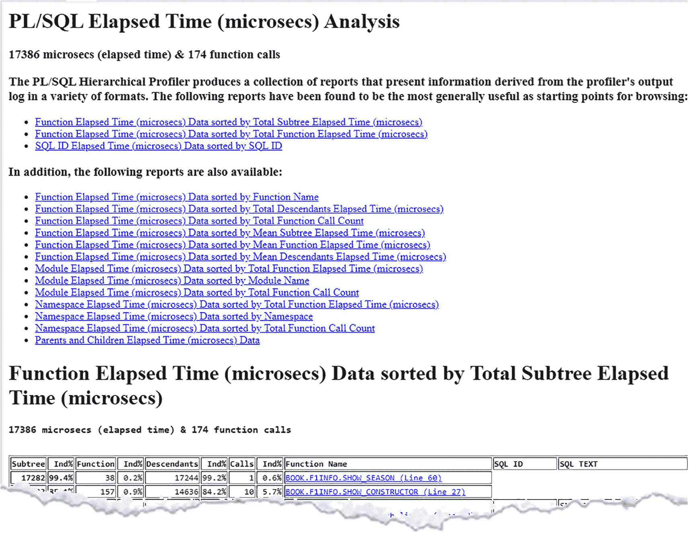

# 第二部分 多重技术与语言

## 8. 多态表函数与 SQL 宏

Oracle 数据库开箱即用地提供了大量功能。大多数常见的函数和过程都触手可及。但是，当您需要一些 Oracle 未提供的功能时，它们能提供什么呢？假设您只有签到和签退时间，需要计算总工作时间。一个能够对开始时间和结束时间之间的间隔差进行求和的聚合函数将非常有用。遗憾的是，Oracle 数据库目前尚未提供这样的聚合函数。（您永远不知道他们什么时候会实现这样的功能。）您可以创建一个“普通”的 PL/SQL 函数，但那样您总是会承受性能损失。

如果您正在从其他数据库（如 SQL Server）迁移，那里有一个用于确定当前日期和时间的函数（`SYSDATE`），而您不想更改应用程序使用的所有代码，该怎么办？

在之前的 Oracle 数据库版本中，您可以利用 Oracle 数据盒式接口（`ODCI`），但正确实现它并非易事。最难实现的事情之一是使您的 `ODCI` 函数能够与并行查询处理正确协作。

随着 *多态表函数*（`PTF`）的引入，实现您自己的 SQL 函数变得简单多了，尽管并非微不足道。Oracle 负责底层的“管道铺设”，以确保 `PTF` 与并行查询良好协作。

SQL 宏也可以用于此领域，使一些 `PTF` 的实现变得稍微容易一些。使用 SQL 宏，您可以创建可重用的 SQL 片段。一次实现，即可在您的 SQL 语句中使用，并且不会带来常规 PL/SQL 函数调用所导致的性能影响。

### 多态表函数

SQL:2016 标准对 *多态表函数* 的描述如下。

> *... 可以在 FROM 子句中调用的用户定义函数。它们可以处理在定义时行类型未声明的表，并生成一个在定义时行类型可能已声明也可能未声明的结果表。多态表函数允许应用程序开发者利用长期定义的动态 SQL 功能来创建强大而复杂的自定义函数。*

Oracle 数据库 18c 引入了这一概念。根据输入参数的不同，返回类型在运行时定义。这与传统的表函数不同，传统表函数的返回类型在编译时是固定的。

一个多态表函数由两部分组成。

*   一个包含 `PTF` 实现所有代码的 PL/SQL 包。
*   一个独立的或打包的函数，它作为接口命名 `PTF` 及其关联的实现包。

PL/SQL 包包含实现 `PTF` 的程序。这些程序接受接口函数中提供的参数的 PL/SQL 版本。


#### 函数

包装函数（wrapper function）负责从 SQL 语句到 PTF 的接口转换。`table` 伪运算符用于将表对象转换为 `dbms_tf.table_t` PL/SQL 类型。引入了一个新的伪运算符 `columns`，以方便将列转换为 `dbms_tf.columns_t` 类型。其他参数（如果有）则使用其对应的 SQL 形式。包装函数没有函数体。它仅仅是通往 PTF 包的接口。

该函数指定了以下内容。

*   PTF 名称
*   恰好一个类型为 `table` 的参数，以及任意数量的 `non-table` 参数
*   返回类型是 `table`
*   PTF 的类型，即 `row` 或 `table` 语义
*   实现 PTF 的包名称

```
create [ or replace ] [ editionable | noneditionable ]
function [ schema. ] function_name
[ ( parameter_declaration [, parameter_declaration]... ) ]
return table
pipelined ( row | table ) polymorphic
using [ schema. ] implementation_package
```

如果 PTF 定义为 `row semantics`（行语义），则输入为单行。PTF 所需的所有信息都包含在此单行中。PTF 不知道也不需要知道其他行的任何信息。如果 PTF 定义为 `table semantics`（表语义），则输入是一组行。PTF 可以利用来自多行的信息，例如，用于构建你自己的聚合函数。当你拥有一个 `table semantics` PTF 时，你可以选择使用 `partition by` 子句和/或 `order by` 子句来扩展表参数。

#### 包

该包包含实现 PTF 所需的所有代码。它必须包含一个 `describe` 函数，但也可以包含 `open`、`fetch_rows` 和 `close` 过程。`describe` 函数是必需的；所有其他过程都是可选的。

#### describe

传递给 `describe` 函数的参数可以是可传递给常规表函数的标准标量参数。但 PTF 也接受一个表参数。表参数必须是一个基本表名，它可以是一个 `with` 子句查询，或者是 `from` 子句中允许的任何模式级对象（表、视图或表函数）。`describe` 函数也可以接受一个 `columns` 参数。

在 `describe` 函数中，你可以指定哪些输入表列应被读取 (`for_read`)，以及哪些列应被传递 (`pass_through`) 到结果中。如果某列的 `for_read` 属性设置为 `true`，则其 `values` 在 PTF 的其他过程中可用。如果设置为 `FALSE`，则不可用。

如果你希望该列出现在结果列中，你必须将 `pass_through` 属性设置为 `true`。如果此属性设置为 `FALSE`，则该列在结果列中不可见。

你不仅可以选择显示或隐藏现有列，还可以创建仅存在于结果集中的全新列。

#### open

如果存在 `open` 过程，它会在 `fetch_rows` 过程之前被调用一次。它可用于初始化和分配特定状态。这在实现 `table semantics` PTF 时尤为有用。由于执行状态是会话和游标私有的（如同普通包一样），`table semantics` PTF 可以使用包全局变量来存储执行状态。PTF 使用数据库提供的唯一执行 ID 来标识该状态。你可以使用 `get_xid` 函数获取此执行状态的唯一 ID。此 ID 对于 PTF 的所有执行函数保持不变。

#### fetch_rows

`fetch_rows` 过程是真正执行工作的地方。它产生一个输出行集，该行集被发送回请求进程。根据数据情况，此过程可能会被多次调用。调用的频率在查询执行期间确定。看起来这个过程似乎是每批 1024 行调用一次，但这一点似乎没有在任何地方有文档记载。

#### close

`close` 过程在 PTF 执行结束时被调用一次。使用此过程释放与 PTF 执行状态关联的资源。你还可以将全局设置重置回其原始值。

#### 用法

在开发 PTF 时，你可能希望使用跟踪功能来查看程序的运行情况。你可以为此使用 `dbms_output.put_line`，但 `DBMS_TF` 包提供了一个重载的 `trace` 过程。你不仅可以编写类似于 `dbms_output.put_line` 的消息，它还具有重载功能，可以打印整个行集、表信息、完整环境等。

```
procedure trace(msg                   varchar2,
with_id               boolean   default false,
separator             varchar2  default null,
prefix                varchar2  default null);
procedure trace(rowset             in row_set_t);
procedure trace(env                in env_t);
procedure trace(columns_new        in columns_new_t);
procedure trace(cols               in columns_t);
procedure trace(columns_with_type  in columns_with_type_t);
procedure trace(tab                in table_t);
procedure trace(col                in column_metadata_t);
```

这在开发过程中可以提供大量信息。你可能希望使用条件编译（参见第 6 章）来包含对跟踪函数的调用，这样你就可以在编译时开启或关闭此功能，而无需更改源代码。

### 用例

一个常见的需求是根据分隔符将字符串拆分为更小的部分。由于 SQL 中没有内置功能来实现这一点，这正是 PTF 可以填补的空白。


### 拆分

假设你有许多需要加载到数据库中的 CSV 文件。可能存在多种不同的布局，因此你必须为每种布局创建不同的代码。这不仅是一项繁琐的工作，而且容易出错。你可能会从早期的程序中复制代码并根据需要进行调整，但很可能会遗漏一两个细节。

如果你使用一个 PTF，不仅能大大简化使用，还能减少出错的可能性。

对于这个 PTF，假设需要拆分的行位于结果集（表、视图等）的第一列，并且使用分号 (`;`) 作为分隔符。你需要一个包含强制 `describe` 函数和一个 `fetch_rows` 过程的包（`split_ptf`），因为你想要单独处理每一行。此 PTF 具有行语义，因此不需要 `open` 和 `close` 过程。

`describe` 函数需要接受表参数的 PL/SQL 版本（在以下代码中称为 `tab`）以及一个参数 (`cols`)，以告知 PTF 在输出中创建哪些列。

```
function describe
(
tab  in out dbms_tf.table_t
, cols in     dbms_tf.columns_t default null
) return dbms_tf.describe_t;
```

`fetch_rows` 过程不需要任何参数。

清单 8-1 是完整的包头。

```
create or replace package split_ptf is
function describe
(
tab  in out dbms_tf.table_t
, cols in     dbms_tf.columns_t default null
) return dbms_tf.describe_t;
procedure fetch_rows;
end split_ptf;
/
Listing 8-1
split_ptf 包头
```

函数的设置在 `describe` 函数中完成。由于表的第一列必须保存要拆分的数据，因此将此列标记为由引擎读取，该引擎将分号分隔的字符串转换为单独的部分。

```
tab.column( 1 ).for_read     := true;
```

将字符串拆分为单独的部分后，你就不希望它再出现在结果集中了。要将其从结果集中移除，需将 `pass_through` 参数设置为 FALSE。

```
tab.column( 1 ).pass_through := false;
```

完成此操作后，根据 `cols` 参数中的指定创建新列。此参数的类型是 `dbms_tf.columns`，但只包含列名。你将所有这些列定义为 VARCHAR2 类型，最大长度为 4000。你可以依赖这些值的默认值，但我们希望使代码更加明确。这样，即使默认值发生变化，代码也能以相同的方式工作。

```
l_new_col := dbms_tf.column_metadata_t
( type    => dbms_tf.type_varchar2
, max_len => 4000
, name    => cols( indx )
);
-- 将新列添加到新列列表中
l_new_cols( l_new_cols.count + 1 ) := l_new_col;
```

当你构建一组新列时，会返回以下内容。

```
return dbms_tf.describe_t( new_columns => l_new_cols );
```

现在是 `fetch_rows` 过程的时间了。此过程每次调用处理 1024 行，因此它不是逐行处理。因此，你必须创建集合来保存传入的数据和产生的数据。

```
type colset is table of dbms_tf.tab_varchar2_t
index by pls_integer;
-- 用于保存检索到的行集的变量
l_rowset dbms_tf.row_set_t;
-- 用于保存检索到的行数的变量
l_rowcount pls_integer;
-- 用于保存（输出）列数的变量
l_putcolcount pls_integer :=
dbms_tf.get_env().put_columns.count;
-- 用于保存新值的变量
l_newcolset colset;
```

现在所有的变量和设置都已就绪，让我们开始实际的代码。首先，将行获取到本地行集中。这将产生一个最多包含 1024 行的集合。第二个参数给出当前集的行数，你也可以获取列数，但对于此函数可以忽略。

```
dbms_tf.get_row_set( rowset    => l_rowset
, row_count =>  l_rowcount );
```

现在你已将行放入集合中，是时候开始处理数据了。因此，从两个循环开始。第一个循环遍历每一行。

```
for rowindx in 1 .. l_rowcount
loop
```

在该循环内，启动一个循环遍历输出集中定义的每一列。

```
for colindx in 1 .. l_putcolcount
loop
```

使用 `dbms_tf.col_to_char` 函数，通过正则表达式检索要拆分的列，为正确的输出列提取正确的部分。

```
l_columnvalue := trim(both '"' from
dbms_tf.col_to_char( l_rowset( 1 )
, rowindx ) );
l_newcolset(colindx)(rowindx) := trim( ';' from
regexp_substr( l_columnvalue
, '[^;]*;{0,1}'
, 1
, colindx
)
);
```

处理完当前集中的每一行后，将结果集合添加到输出行集中。

```
for indx in 1 .. l_putcolcount
loop
dbms_tf.put_col( columnid   => indx
, collection => l_newcolset( indx )
);
end loop;
```

清单 8-2 展示了 `split_ptf` 包体的完整实现。

```
create or replace package body split_ptf as
subtype maxvarchar2 is varchar2( 32767 );
function describe
(
tab  in out dbms_tf.table_t
, cols in     dbms_tf.columns_t default null
) return dbms_tf.describe_t as
-- 要添加列的元数据
l_new_col dbms_tf.column_metadata_t;
-- 要添加的列的表
l_new_cols dbms_tf.columns_new_t;
begin
-- 将第一列标记为读取，并且不再显示它
tab.column( 1 ).for_read     := true;
tab.column( 1 ).pass_through := false;
-- 添加新列，如 cols 参数中所指定
for indx in 1 .. cols.count
loop
-- 为名为 cols(indx) 的列定义元数据
l_new_col := dbms_tf.column_metadata_t
( type    => dbms_tf.type_varchar2
, max_len => 4000
, name    => cols( indx )
);
-- 将新列添加到新列列表中
l_new_cols( l_new_cols.count + 1 ) := l_new_col;
end loop;
-- 现在我们返回一个特定的 DESCRIBE_T 来添加新列
return dbms_tf.describe_t( new_columns => l_new_cols );
end;
procedure fetch_rows is
-- 定义一个 varchar2 表的表类型
type colset is table of dbms_tf.tab_varchar2_t
index by pls_integer;
-- 用于保存检索到的行集的变量
l_rowset dbms_tf.row_set_t;
-- 用于保存检索到的行数的变量
l_rowcount pls_integer;
-- 用于保存（输出）列数的变量
l_putcolcount pls_integer :=
dbms_tf.get_env().put_columns.count;
-- 用于保存新值的变量
l_newcolset colset;
-- 列的值
l_columnvalue maxvarchar2;
begin
-- 将行获取到本地行集中
-- 此时，行将包含
-- 从传入的表/视图/查询中获取的列
dbms_tf.get_row_set( rowset    => l_rowset
, row_count =>  l_rowcount
);
-- 对于行集中的每一行...
for rowindx in 1 .. l_rowcount
loop
-- 对于每一列
for colindx in 1 .. l_putcolcount
loop
l_columnvalue := trim(both '"' from
dbms_tf.col_to_char( l_rowset( 1 )
, rowindx ) );
l_newcolset(colindx)(rowindx) := trim( ';' from
regexp_substr( l_columnvalue
, '[^;]*;{0,1}'
, 1
, colindx
)
);
end loop; -- 每一列
end loop; -- 行集中的每一行
-- 将新填充的列添加到行集中
for indx in 1 .. l_putcolcount
loop
dbms_tf.put_col( columnid   => indx
, collection => l_newcolset( indx )
);
end loop;
end;
end split_ptf;
/
Listing 8-2
split_ptf 包体
```

现在包已完成，让我们为这个 PTF 编写包装函数。包装函数具有与包中 `describe` 函数相同的参数，只是这次使用的是 PL/SQL 类型的 SQL 等价物。此外，还声明了 PTF 的语义类型。在本例中，它是一个行语义函数，因为 PTF 是按行工作的。

清单 8-3 展示了包装函数。

```
create or replace function split
(
tab  in table
, cols in columns default null
) return table
pipelined row polymorphic using split_ptf;
/
Listing 8-3
Split 包装函数


#### 调用多态表函数

表 8-1 列出了 F1 赛车手。

表 8-1 以分号分隔格式列出的 F1 赛车手

| `DRIVER` |
| 44;HAM;Lewis;Hamilton;1985-01-07;British |
| 16;LEC;Charles;Leclerc;1997-10-16;Monegasque |
| 4;NOR;Lando;Norris;1999-11-13;British |
| 11;PER;Sergio;Pérez;1990-01-26;Mexican |
| 3;RIC;Daniel;Ricciardo;1989-07-01;Australian |
| 63;RUS;George;Russell;1998-02-15;British |
| 55;SAI;Carlos;Sainz;1994-09-01;Spanish |
| 33;VER;Max;Verstappen;1997-09-30;Dutch |

PTF（多态表函数）使得将这些分隔的值转换成独立的列变得轻而易举。

```sql
select permanentNumber
, code
, givenName
, familyName
, dateOfBirth
, nationality
from   split( tab  => f1drivers
, cols => columns( permanentNumber
, code
, givenName
, familyName
, dateOfBirth
, nationality
)
)
/
```

注意：确保你在包装函数中使用的参数名称与包中使用的名称相同；否则，使用具名表示法会失败。

表 8-2 拆分多态表函数的输出

| PERMANENTNUMBER | CODE | GIVENNAME | FAMILYNAME | DATEOFBIRTH | NATIONALITY |
| --- | --- | --- | --- | --- | --- |
| 44 | HAM | Lewis | Hamilton | 1985-01-07 | British |
| 16 | LEC | Charles | Leclerc | 1997-10-16 | Monegasque |
| 4 | NOR | Lando | Norris | 1999-11-13 | British |
| 11 | PER | Sergio | Pérez | 1990-01-26 | Mexican |
| 3 | RIC | Daniel | Ricciardo | 1989-07-01 | Australian |
| 63 | RUS | George | Russell | 1998-02-15 | British |
| 55 | SAI | Carlos | Sainz | 1994-09-01 | Spanish |
| 33 | VER | Max | Verstappen | 1997-09-30 | Dutch |

#### 求和时间间隔

如果你有一组想要相加的时间间隔值，Oracle 数据库目前没有提供现成的求和聚合函数来实现这一点。使用多态表函数，你可以自己构建此功能。

让我们从构建包规范开始。`describe` 函数需要一个用于表的参数（必需）和一个用于你想要计算其总和的列的参数。

```sql
function describe
(
tab  in out dbms_tf.table_t
, cols in     dbms_tf.columns_t default null
) return dbms_tf.describe_t;
/
```

`fetch_rows` 过程不需要任何特定参数。

清单 8-4 展示了用于求和间隔的多态表函数的完整包规范。

```sql
create or replace package suminterval_ptf is
function describe
(
tab  in out dbms_tf.table_t
, cols in     dbms_tf.columns_t default null
) return dbms_tf.describe_t;
procedure fetch_rows;
end suminterval_ptf;
/
```
清单 8-4 `suminterval_ptf` 包规范

在 `describe` 函数中，标记所有不需要传递到结果集的列，因为你对这些列的值不感兴趣，只对它们产生的聚合值感兴趣。

```sql
for indx in tab.column.first .. tab.column.last
loop
tab.column(indx).pass_through := false;
```

只有你感兴趣的列才应被标记为需要读取。所有其他列可以被忽略（即，将 `for_read` 设置为 `FALSE`）。标记为需要读取的列会将其时间间隔值相加。

```sql
tab.column(indx).for_read := false;
for colindx in cols.first .. cols.last
loop
if tab.column(indx).description.name = cols(colindx)
then
tab.column(indx).for_read := true;
```

由于这是一列你感兴趣的列，请创建一个新列以将其与实际列区分开来，新列具有特定的名称（`SUM_<列名>_`），但类型与原始列相同。

```sql
-- 并添加一个相同类型但名称为 SUM_colname_ 的新列
sum_cols(colindx) :=
dbms_tf.column_metadata_t
( name => 'SUM_' ||
replace( tab.column(indx).description.name
, '"'
) ||
'_'
, type => tab.column( indx ).description.type );
```

在构建完新的列集后，返回以下内容。

```sql
-- 现在我们返回一个特定的 DESCRIBE_T，它添加了新列
return dbms_tf.describe_t( new_columns => sum_cols );
```

在 `fetch_rows` 过程中，初始化一个变量来保存此函数的环境。

```sql
env dbms_tf.env_t := dbms_tf.get_env();
```

此记录包含有关多态表函数执行时属性的元数据。此记录的属性之一是 `get_columns` 集合。这些是数据在多态表函数中可用（`for_read = true`）的列。

遍历此集合，检查列的数据类型，因为支持的两种数据类型需要不同的处理。

```sql
for colindx in 1 .. env.get_columns.count
loop
case env.get_columns( colindx ).type
```

对于每种支持的类型，将整个列获取到本地集合中。

```sql
-- 当列类型为 INTERVAL YEAR TO MONTH 时
when dbms_tf.type_interval_ym then
-- 获取列的内容
dbms_tf.get_col( columnid   => colindx
, collection => l_intervalym
);
```

然后遍历此集合中的所有值，并将它们简单地相加。

```sql
-- 遍历所有值并将它们相加
for indx in 1 .. l_intervalym.count
loop
l_sum_recs( colindx ).sumym :=
l_sum_recs( colindx ).sumym + l_intervalym( indx );
end loop;
```

对于另一种时间间隔类型 `INTERVAL DAY TO SECOND`，添加类似的代码。

当处理完所有列后，就该构建要返回的行集了。这仅包含一行，但具有求和后的值。

```sql
-- 从现在起完全忽略当前的行集，只需
-- 开始一个新的集合，其中只包含总计
-- 遍历 put_columns 以填充结果行
for colindx in 1 .. env.put_columns.count
loop
case env.put_columns( colindx ).type
-- 当列类型为 INTERVAL YEAR TO MONTH 时
when dbms_tf.type_interval_ym then
-- 将此值添加到结果行
l_rowset( colindx ).tab_interval_ym( 1 ) :=
l_sum_recs( colindx ).sumym;
-- 当列类型为 INTERVAL DAY TO SECOND 时
when dbms_tf.type_interval_ds then
-- 将此值添加到结果行
l_rowset(colindx ).tab_interval_ds( 1 ) :=
l_sum_recs( colindx ).sumds;
end case;
end loop;
```

然后返回此行集，而不是所有传入的数据。

```sql
dbms_tf.put_row_set( l_rowset );
```

清单 8-5 展示了用于求和间隔的多态表函数的包主体的完整实现。


### SQL 宏

```
create or replace package body suminterval_ptf as
-- 用于保存不同 INTERVAL 求和结果的记录类型
type sum_rec is record(
sumym interval year to month
, sumds interval day to second
);
-- 每列对应的集合类型
type sum_recs is table of sum_rec index by pls_integer;
--
function describe
(
tab  in out dbms_tf.table_t
, cols in     dbms_tf.columns_t default null
) return dbms_tf.describe_t as
sum_cols dbms_tf.columns_new_t;
begin
-- 检查源表中的每一列
for indx in tab.column.first .. tab.column.last
loop
-- 将每一列的 pass_through 标记为 false，这样它
-- 将不再出现在结果中
tab.column( indx ).pass_through := false;
-- 首先标记该列不被读取，除非...
tab.column( indx ).for_read     := false;
for colindx in cols.first .. cols.last
loop
if tab.column( indx ).description.name = cols( colindx )
then
-- ...请求该列的求和结果
-- 则读取此列
tab.column( indx ).for_read := true;
-- 并添加一个同类型的新列，命名为 SUM_ 列名 _
sum_cols( colindx ) :=
dbms_tf.column_metadata_t
( name => 'SUM_' ||
replace( tab.column(indx).description.name
, '"' ) ||
'_'
, type => tab.column( indx ).description.type
);
end if;
end loop;
end loop;
-- 我们不是返回 NULL，而是返回一个特定的
-- DESCRIBE_T，用于添加新列
return dbms_tf.describe_t( new_columns => sum_cols );
end;
procedure fetch_rows is
-- 用于保存检索到的行集的变量
l_rowset dbms_tf.row_set_t;
-- 用于保存每列求和值的变量
l_sum_recs sum_recs;
-- 用于保存环境值的变量
env dbms_tf.env_t := dbms_tf.get_env();
-- 用于保存所有 YEAR TO MONTH INTERVAL 的变量
l_intervalym dbms_tf.tab_interval_ym_t;
-- 用于保存所有 DAY TO SECOND INTERVAL 的变量
l_intervalds dbms_tf.tab_interval_ds_t;
begin
for colindx in 1 .. env.get_columns.count
loop
case env.get_columns( colindx ).type
-- 当列类型为 INTERVAL YEAR TO MONTH 时
when dbms_tf.type_interval_ym then
-- 获取该列的内容
dbms_tf.get_col( columnid   => colindx
, collection => l_intervalym
);
-- 初始化记录值，否则将某物加到 NULL 上结果仍为 NULL
l_sum_recs( colindx ).sumym := interval '0-0' year
to month;
-- 遍历所有值并求和
for indx in 1 .. l_intervalym.count
loop
l_sum_recs( colindx ).sumym :=
l_sum_recs( colindx ).sumym + l_intervalym( indx );
end loop;
-- 当列类型为 INTERVAL DAY TO SECOND 时
when dbms_tf.type_interval_ds then
-- 获取该列的内容
dbms_tf.get_col( columnid   => colindx
, collection => l_intervalds
);
-- 初始化记录值，否则将某物加到 NULL 上结果仍为 NULL
l_sum_recs( colindx ).sumds := interval '0 0:0:0' day
to second;
-- 遍历所有值并求和
for indx in 1 .. l_intervalds.count
loop
l_sum_recs( colindx ).sumds :=
l_sum_recs( colindx ).sumds + l_intervalds( indx );
end loop;
else
-- 捕获所有其他类型
dbms_output.put_line( q'[此类型（]' ||
env.get_columns(colindx).type ||
q'[）的列暂不支持（尚未实现）。]'
);
end case;
end loop;
-- 从现在起完全忽略当前的行集，直接
-- 创建一个只包含总计的新集合
-- 遍历 put_columns 以填充结果行
for colindx in 1 .. env.put_columns.count
loop
case env.put_columns( colindx ).type
-- 当列类型为 INTERVAL YEAR TO MONTH 时
when dbms_tf.type_interval_ym then
-- 将此值添加到结果行
l_rowset( colindx ).tab_interval_ym( 1 ) :=
l_sum_recs( colindx ).sumym;
-- 当列类型为 INTERVAL DAY TO SECOND 时
when dbms_tf.type_interval_ds then
-- 将此值添加到结果行
l_rowset( colindx ).tab_interval_ds( 1 ) :=
l_sum_recs( colindx ).sumds;
end case;
end loop;
dbms_tf.put_row_set( l_rowset );
end;
end suminterval_ptf;
/
```
代码清单 8-5 `suminterval_ptf` 包体

现在包已完成，让我们为这个 PTF 编写包装器函数。包装器函数的参数与包中 `describe` 函数的参数相同，只是这次使用的是 PL/SQL 类型对应的 SQL 等效类型。同时，也声明了 PTF 的类型。在本例中，它是一个表语义函数，因为需要多行来计算最终结果。

代码清单 8-6 展示了包装器函数。

```
create or replace function suminterval_fnc
(
tab  in table
,cols in columns default null
) return table
pipelined table polymorphic using suminterval_ptf;
/
```
代码清单 8-6 `suminterval` 包装器函数

#### 聚合时间间隔

假设你有一张一级方程式赛车的单圈时间表。注意，单圈时间以间隔形式记录：`INTERVAL_DAY_TO_SECOND`。表 8-3 列出了部分单圈时间样本。

表 8-3 单圈时间表

| **RACENUMBER** | **LAPNUMBER** | **DRIVERID** | **POSITION** | **LAPTIME** |
| --- | --- | --- | --- | --- |
| 15 | 1 | max_verstappen | 1 | +000000000 00:01:17.665000000 |
| 15 | 2 | max_verstappen | 1 | +000000000 00:01:14.978000000 |
| 15 | 3 | max_verstappen | 1 | +000000000 00:01:14.813000000 |
| 15 | 4 | max_verstappen | 1 | +000000000 00:01:14.917000000 |
... | 15 | 21 | max_verstappen | 1 | +000000000 00:01:18.594000000 |
| 15 | 22 | max_verstappen | 2 | +000000000 00:01:32.574000000 |
| 15 | 23 | max_verstappen | 2 | +000000000 00:01:14.223000000 |
| 15 | 24 | max_verstappen | 2 | +000000000 00:01:14.257000000 |
| 15 | 25 | max_verstappen | 2 | +000000000 00:01:14.607000000 |
| 15 | 26 | max_verstappen | 2 | +000000000 00:01:15.352000000 |
| 15 | 27 | max_verstappen | 2 | +000000000 00:01:14.393000000 |
| 15 | 28 | max_verstappen | 2 | +000000000 00:01:14.683000000 |
| 15 | 29 | max_verstappen | 2 | +000000000 00:01:15.222000000 |
| 15 | 30 | max_verstappen | 1 | +000000000 00:01:16.362000000 |
| 15 | 31 | max_verstappen | 1 | +000000000 00:01:15.134000000 |
| 15 | 32 | max_verstappen | 1 | +000000000 00:01:14.886000000 |
...

使用该 PTF 计算马克斯·维斯塔潘的总比赛用时非常简单。

```
with verstappen_zandvoort as
( select l.laptime
from   laps l
where  l.racenumber = 15
and    l.driverid = 'max_verstappen'
)
select *
from   suminterval_fnc( tab  => verstappen_zandvoort
, cols => columns( laptime ) )
where  rownum = 1
/
SUM_LAPTIME_

+0 01:30:05
```

注意

行并未被聚合；添加 `where rownum = 1` 以仅获取一行结果。

### SQL 宏

Oracle Database 21c (21.1) 引入了 SQL 宏。它被 backport（向后移植）到 19c (19.10)，但仅支持表类型的 SQL 宏。通过 SQL 宏，你可以利用 PL/SQL 的全部功能——包括 PTF 中引入的所有功能——在运行时创建一个 SQL 片段，该片段会被包含在 SQL 引擎执行的 SQL 语句中。

你可以将在 PTF 中学到的很多知识应用于 SQL 宏。PTF 允许你访问流经处理过程的实际数据，而 SQL 宏仅提供在 SQL 语句执行前对其进行操纵的权限。你只调用一次 PL/SQL 函数（在 SQL 语句执行前），并返回一个 SQL 片段，该片段会被插入到待执行的文本中。你可以使用 SQL 宏来集中实现那些之前可能封装在 PL/SQL 函数中的功能，但无需承担所有上下文切换的开销。

函数中不应包含 PL/SQL 逻辑；传入的字符串参数为 null。所有逻辑都应放入 SQL 表达式中。

SQL 宏有两种类型：标量（scalar）和表（table）。它们有什么区别？

表类型的 SQL 宏可用于 SQL 语句的`from`子句。标量类型的 SQL 宏可用于 SQL 语句中其他任何地方，例如`select`列表、`where`、`having`、`group by`和`order by`子句。

当你有一个封装在 PL/SQL 函数中的公式用于集中其实现，并且该公式可以用纯 SQL 编写时，那么你就有了一个使用 SQL 宏的用例。


#### 表类型 SQL 宏

表类型 SQL 宏返回一段 SQL 文本，该文本的结果是一组行。参数化视图是表类型 SQL 宏的一种用例。视图让你访问有限的数据集。SQL 宏中的参数化视图可以根据你提供的参数，让你访问该数据集的一个子集。

当然，你可以通过利用应用上下文并在视图的 `where` 子句中使用 `SYS_CONTEXT` 来实现一个伪参数化视图，但这需要更多的组件，并且可能并不总是能明显地看出如何使用该视图。而使用 SQL 宏，你可以传递一个参数来限制结果集的输出，这一点是显而易见的。

```
select *
from   drivers( nationality => 'Dutch' )
/
```

注意
关于如何实现此 SQL 宏，请参见列拆分器用例中的“参数化视图”。

但你也可以操作为每一行返回的数据。只要你能用纯 SQL 构建它，你就可以为其构建 SQL 宏。

#### 标量类型 SQL 宏

标量类型 SQL 宏返回一段 SQL 文本，该文本的结果是一个标量值。标量类型 SQL 宏不能有表参数，只能有标量参数。

### 用例

SQL 宏的用例无穷无尽。你可以构建一个列拆分器，就像用 PTF 实现的那个——只是简单得多。你可以构建参数化视图。你可以构建标量宏来捕获你通常在 PL/SQL 函数中实现的公式。你还可以实现对其他数据库（如 MySQL）中可用功能的支持。

##### 参数化视图

如果你想显示特定比赛中每位车手的总时间、圈数和平均圈速，可以创建一个视图来返回所有比赛的这些值（参见清单 8-7）。

```
create or replace view v_averagelaptime as
select ltm.raceid              as raceid
, ltm.driverid            as driverid
, sum( ltm.milliseconds ) as totalmilliseconds
, count( ltm.lap )        as lapcount
, avg( ltm.milliseconds ) as averagemilliseconds
from   f1data.laptimes ltm
group  by ltm.raceid
, ltm.driverid
/
清单 8-7
v_averagelaptime 视图
```

在你的查询中，必须通过添加一个谓词来限制返回的结果。

```
select *
from   v_averagelaptime alp
where  alp.raceid = 1093 -- 2022 年美国大奖赛
and  alp.driverid = 830 -- 马克斯·维斯塔潘
/
RACEID DRIVERID TOTALMILLISECONDS LAPCOUNT AVERAGEMILLISECONDS
------ -------- ----------------- -------- -------------------
1093      830           6131687       56    109494,410714286

select *
from   v_averagelaptime alp
where  alp.raceid = 1093 -- 2022 年美国大奖赛
and  alp.driverid = 1  -- 刘易斯·汉密尔顿
/
RACEID DRIVERID TOTALMILLISECONDS LAPCOUNT AVERAGEMILLISECONDS
------ -------- ----------------- -------- -------------------
1093        1           6136710       56    109584,107142857
```

如果你将此视图封装在一个 SQL 宏中，它就变成了一个参数化视图。

```
create or replace
function averagelaptime( raceid_in   in number
, driverid_in in number )
return varchar2 sql_macro( table ) is
begin
return q'[
select ltm.raceid              as raceid
, ltm.driverid            as driverid
, sum( ltm.milliseconds ) as totalmilliseconds
, count( ltm.lap )        as lapcount
, avg( ltm.milliseconds ) as averagemilliseconds
from   f1data.laptimes ltm
where  ltm.raceid   = raceid_in
and    ltm.driverid = driverid_in
group  by ltm.raceid
, ltm.driverid
]';
end;
/
清单 8-8
averagelaptime SQL 宏
```

然后你的查询就变得更简单了。

```
select *
from   averagelaptime( raceid_in   => 1093
, driverid_in => 830 )
/
RACEID DRIVERID TOTALMILLISECONDS LAPCOUNT AVERAGEMILLISECONDS
------ -------- ----------------- -------- -------------------
1093      830           6131687       56    109494,410714286

select *
from   averagelaptime( raceid_in   => 1093
, driverid_in => 1 )
/
RACEID DRIVERID TOTALMILLISECONDS LAPCOUNT AVERAGEMILLISECONDS
------ -------- ----------------- -------- -------------------
1093        1           6136710       56    109584,107142857
```

#### 列拆分器（表）

你已经看到了使用 PTF 将一列拆分为多列的示例。让我们重新审视该功能，但这次使用 SQL 宏。

对于这个函数，你需要一个表参数来指定要处理的表（或视图或结果集），以及一个参数来告诉宏在输出中创建哪些列。

```
create or replace function split
(
table_in   in dbms_tf.table_t
, columns_in in dbms_tf.columns_t default null
)
```

该函数返回一个 `VARCHAR2`，即一个 `table` 类型的 `sql_macro`。

```
return varchar2 sql_macro( table ) is
```

在宏中，构建 SQL 文本以将列拆分为新列。

```
for cols in columns_in.first .. columns_in.last
loop
l_split := l_split || q'[, trim( ';]' ||
q'[' from regexp_substr( ]' ||
table_in.column( 1 ).description.name ||
q'[, '{0,1}', 1, ]' ||
cols || q'[ ) ) ]' ||
columns_in( cols );
end loop;
```

这与在 PTF 示例中使用的代码大致相同。

因为每个新列都有一个前导空格，最终你会得到一个列列表，你必须去除前导逗号（`,`）才能使其成为有效的 SQL 文本。

```
l_split := trim( leading ',' from l_split );
```

现在让我们构建完整的 SQL 语句，该语句将生成你可以从中选择的表。

```
l_sql   := q'[select t.*, ]' ||
l_split ||
q'[ from table_in t]';
```

在上面的语句中，`table_in` 被 `table_in` 参数的值所替换。

清单 8-9 是完整的脚本。

```
create or replace function split
(
table_in   in dbms_tf.table_t
, columns_in in dbms_tf.columns_t default null
)
return varchar2 sql_macro( table ) is
l_sql         varchar2( 32767 );
l_split       varchar2( 32767 );
begin
for cols in columns_in.first .. columns_in.last
loop
l_split := l_split ||
q'[, trim( ';' from regexp_substr( ]'||
table_in.column( 1 ).description.name ||
q'[, '[^;]*;{0,1}', 1, ]' ||
cols || q'[ ) ) ]' ||
columns_in( cols );
end loop;
l_split := trim( leading ',' from l_split );
l_sql   := q'[select t.*, ]' ||
l_split ||
q'[ from table_in t]';
dbms_tf.trace( l_sql );
return l_sql;
end;
/
清单 8-9
拆分 SQL 宏
```

##### 使用 SQL 宏拆分列

使用与拆分函数的 PTF 示例中相同的表，你可以使用类似的 SQL 语句将这些分隔值转换为单独的列。

```
select permanentNumber
, code
, givenName
, familyName
, dateOfBirth
, nationality
from split( f1drivers
, columns( permanentNumber
, code
, givenName
, familyName
, dateOfBirth
, nationality
)
)
/
```

你会得到与使用 PTF 相同的结果。如你所见，这种方法涉及的代码量要少得多。


##### 参数化视图

您不能在 SQL 宏中嵌套 SQL 宏，但可以基于此查询构建视图，如`Listing 8-10`所示。

```
create or replace view v_f1drivers as
select permanentNumber
, code
, givenName
, familyName
, dateOfBirth
, nationality
from split( table_in   => f1drivers
, columns_in => columns( permanentNumber
, code
, givenName
, familyName
, dateOfBirth
, nationality
)
)
/
Listing 8-10
view v_f1drivers
```

您必须通过添加谓词来限制查询中返回的结果。

```
select d.givenname
, d.familyname
, d.nationality
from   v_f1drivers d
where  d.nationality like 'British'
/
GIVENNAME       FAMILYNAME      NATIONALITY
--------------- --------------- ---------------
Lewis           Hamilton        British
Lando           Norris          British
George          Russell         British
select d.givenname
, d.familyname
, d.nationality
from   v_f1drivers d
where  d.givenname like 'M%'
/
GIVENNAME       FAMILYNAME      NATIONALITY
--------------- --------------- ---------------
Max             Verstappen      Dutch
```

如果将此视图封装在 SQL 宏中，就可以使其参数化。您可以使用多个可选参数，如`Listing 8-11`所示。

```
create or replace
function drivers( code            in varchar2 default null
, givenName       in varchar2 default null
, familyName      in varchar2 default null
, nationality     in varchar2 default null
) return varchar2 sql_macro( table )
is
begin
return q'[
select f1d.permanentnumber
, f1d.code
, f1d.givenname
, f1d.familyname
, f1d.dateofbirth
, f1d.nationality
from   v_f1drivers                 f1d
where  (   drivers.code            is null
or f1d.code                like drivers.code)
and    (   drivers.givenname       is null
or f1d.givenname           like drivers.givenname)
and    (   drivers.familyname      is null
or f1d.familyname          like drivers.familyname)
and    (   drivers.nationality     is null
or f1d.nationality         like drivers.nationality)
]';
end;
/
Listing 8-11
drivers SQL Macro
```

现在您可以使用参数来查询该视图。

```
select d.givenname
, d.familyname
, d.nationality
from   drivers( nationality => 'British' ) d
/
GIVENNAME       FAMILYNAME      NATIONALITY
--------------- --------------- ---------------
Lewis           Hamilton        British
Lando           Norris          British
George          Russell         British
select d.givenname
, d.familyname
, d.nationality
from   drivers( givenname => 'M%' ) d
/
GIVENNAME       FAMILYNAME      NATIONALITY
--------------- --------------- ---------------
Max             Verstappen      Dutch
```

#### 模仿其他数据库（标量函数）

如果您的代码在其他数据库（例如 MySQL）中有效，并且您正在迁移到 Oracle 数据库，您可能会遇到 SQL 语句中使用的某些函数在 Oracle 数据库中不可用的问题。您可以构建一组 SQL 宏来确保语句正常工作，并执行正确的 Oracle SQL。

##### 日期函数

表`Table 8-4`描述了针对几个 MySQL 日期函数的 SQL 宏。

**Table 8-4**
**MySQL 日期函数**

| 函数 | 描述 |
| --- | --- |
| CURDATE() | 获取当前日期。 |
| NOW() | 返回语句执行的日期和时间。 |
| DAY() | 返回指定日期的天数。 |
| DAYNAME() | 返回指定日期的星期名称。 |
| DAYOFWEEK() | 返回指定日期的星期索引。 |
| MONTH() | 返回指定日期的月份编号。 |
| WEEK() | 返回指定日期的周数。 |
| WEEKDAY() | 返回指定日期的星期索引。 |
| YEAR() | 返回指定日期的年份。 |

`curdate()`函数返回不带时间组件的当前日期。Oracle 日期始终包含时间组件，因此我们返回`sysdate`的不带时间组件的字符串表示。

```
create or replace function curdate
( format_in in varchar2 default 'DD/MM/YYYY' )
return varchar2 sql_macro( scalar ) is
begin
return 'to_char( sysdate, format_in )';
end;
/
Listing 8-12
curdate SQL Macro
```

`now()`函数返回包含时间组件的当前日期。这与`sysdate`相同。

```
create or replace function now
return varchar2 sql_macro( scalar ) is
begin
return 'sysdate';
end;
/
Listing 8-13
now SQL Macro
```

`day()`函数返回指定日期的月份中的天数。这可以通过`extract( day from date_in )`实现。

```
create or replace function day( date_in in date )
return varchar2 sql_macro( scalar ) is
begin
return q'[extract( day from date_in )]';
end;
/
Listing 8-14
day SQL Macro
```

`dayname()`函数返回指定日期的星期名称。这可以通过`to_char( date_in, 'DAY' )`实现。

```
create or replace function dayname( date_in in date )
return varchar2 sql_macro( scalar ) is
begin
return q'[to_char( date_in, 'DAY' )]';
end;
/
Listing 8-15
dayname SQL Macro
```

`dayofweek()`函数返回指定日期是星期几（1-7）。这可以通过`to_char( date_in, 'D' )`实现。

```
create or replace function dayofweek( date_in in date )
return varchar2 sql_macro( scalar ) is
begin
return q'[to_char( date_in, 'D' )]';
end;
/
Listing 8-16
dayofweek SQL Macro
```

`month()`函数返回指定日期的月份编号。这可以通过`extract( month from date_in )`实现。

```
create or replace function month( date_in in date )
return varchar2 sql_macro( scalar ) is
begin
return q'[extract( month from date_in )]';
end;
/
Listing 8-17
month SQL Macro
```

`week()`函数返回指定日期的周数。这可以通过`to_char( date_in, 'IW' )`实现。

```
create or replace function week( date_in in date )
return varchar2 sql_macro( scalar ) is
begin
return q'[to_char( date_in, 'IW' )]';
end;
/
Listing 8-18
week SQL Macro
```

`weekday()`函数返回指定日期是星期几（1-7）。这与`dayofweek()`函数相同。与其返回另一个字符串，您也可以调用另一个 SQL 宏。由于它返回一个字符串，您只需调用不同的函数。

```
create or replace function weekday( date_in in date )
return varchar2 sql_macro( scalar ) is
begin
return dayofweek( date_in );
end;
/
Listing 8-19
weekday SQL Macro
```

`year()`函数返回指定日期的年份。这可以通过`extract( year from date_in )`实现。

```
create or replace function year( date_in in date )
return varchar2 sql_macro( scalar ) is
begin
return q'[extract( year from date_in )]';
end;
/
Listing 8-20
year SQL Macro
```


# 8. SQL 宏

##### 字符串函数

MySQL 数据库提供了 `left` 和 `right` 字符串操作函数。这些函数在 Oracle SQL 中并不直接可用。但你可以使用 `substr` 功能来实现它们，并将其封装在 SQL 宏中，这样就能将你的 MySQL 查询直接移植到 Oracle 数据库（参见表 8-5）。

表 8-5

MySQL 字符串函数

| 函数 | 结果 |
| --- | --- |
| left ('Oracle Database', 6) | 'Oracle' |
| left ('Oracle Database', 0) | '' |
| left ('Oracle Database', -6) | '' |
| right ('Oracle Database', 8) | 'Database' |
| right ('Oracle Database', 0) | '' |
| right ('Oracle Database', -8) | '' |

`left` 函数很容易实现。它是一个子字符串，从位置 1 开始，然后获取指定数量的字符。

```sql
create or replace function left
(
string_in in varchar2
, left_in   in number
) return varchar2 sql_macro( scalar ) is
l_sql varchar2( 64 );
begin
l_sql := 'substr( string_in, 1, left_in )';
return l_sql;
end left;
/
```

代码清单 8-21
`left` SQL 宏

`right` 函数稍微复杂一些。你必须自己处理好边界情况。如果请求的字符数为 0 或负数，函数应返回 NULL 值。如果请求的字符数大于可用字符数，则返回整个字符串。否则，从右侧开始返回指定数量的字符。

```sql
create or replace function right
(
string_in in varchar2
, right_in  in number
) return varchar2 sql_macro( scalar ) is
l_sql varchar2( 32767 );
begin
l_sql := '
case
when right_in <= 0 then null
when right_in > length( string_in ) then  string_in
else substr( string_in, -right_in )
end
';
return l_sql;
end right;
/
```

代码清单 8-22
Right SQL 宏

### expand_sql_text

`dbms_utility.expand_sql_text` 可以让你检查实际执行的是哪条语句。假设你有一个简单的 SQL 宏。

```sql
create or replace
function total_laptime( raceid_in   in number
, driverid_in in number )
return varchar2 sql_macro( table ) is
begin
return q'[
select ltm.raceid              as raceid
, ltm.driverid            as driverid
, sum( ltm.milliseconds ) as totalmilliseconds
from   f1data.laptimes ltm
where  ltm.raceid   = raceid_in
and    ltm.driverid = driverid_in
group  by ltm.raceid
, ltm.driverid
order  by ltm.raceid
, ltm.driverid
]';
end;
/
```

代码清单 8-23
`total_laptime` SQL 宏

以下是你执行的语句。

```sql
select * from total_laptime(1093, 830)
```

如果你将这个语句作为参数传递给 `dbms_utility.expand_sql_text` 过程，如下所示。

```sql
declare
output_text clob;
begin
dbms_utility.expand_sql_text(
input_sql_text  => q'[select * from total_laptime(1093, 830)
]'
, output_sql_text => output_text
);
dbms_output.put_line( output_text );
end;
/
```

你会得到实际执行的语句（为了可读性进行了格式化）。

```sql
select "A1"."RACEID"            "RACEID"
, "A1"."DRIVERID"          "DRIVERID"
, "A1"."TOTALMILLISECONDS" "TOTALMILLISECONDS"
from   (select "A2"."RACEID"            "RACEID"
, "A2"."DRIVERID"          "DRIVERID"
, "A2"."TOTALMILLISECONDS" "TOTALMILLISECONDS"
from   (select "A3"."RACEID" "RACEID"
, "A3"."DRIVERID" "DRIVERID"
, sum("A3"."MILLISECONDS")
"TOTALMILLISECONDS"
from   "F1DATA"."LAPTIMES" "A3"
where  "A3"."RACEID"   = 1093
and    "A3"."DRIVERID" = 830
group  by "A3"."RACEID"
, "A3"."DRIVERID"
order  by "A3"."RACEID"
, "A3"."DRIVERID") "A2") "A1"
```

### 本章小结

本章讨论了多态表函数以及如何构建和使用它们。你还了解了 SQL 宏，它有时能提供比 PTF 更简单的解决方案。那么，为什么你还应该学习多态表函数呢？嗯，有些问题无法用纯 SQL 解决，但可以使用 PL/SQL 来解决。SQL 宏总是返回一段 SQL 代码片段。PL/SQL 被用来构建这个代码片段，但其使用方式是纯 SQL 的。PTF 允许你访问查询中的实际值，因此你可以操作从查询中输出的内容。你可以使用 SQL 宏在执行前操作语句，但这仍然是在创建纯 SQL。

## 9. 子查询因式分解，WITH 子句详解

子查询因式分解也称为公共表表达式（CTE）。通常被称为 `with` 子句。CTE 是一个命名的临时结果集，它存在于单条语句的作用域内，并且可以在该语句的后面部分被引用，可能被多次引用。

你可以在查询的 `from` 子句中指定一个子查询，这称为内联视图；但如果你想多次连接同一个查询，你就必须多次重复该子查询。而且如果那个内联视图发生了变化，你就不得不在多处进行相同的更改。使用子查询因式分解后，情况就不同了。你只需定义一次子查询，然后通过名称引用它，这遵循了“一次定义，多次重用”的模式。


### 摩纳哥领奖台

数据库中包含了自 1950 年以来在摩纳哥举行的所有比赛结果。我们的目标是检索摩纳哥赛道的前三名车手，并将他们以不同列的形式漂亮地展示在领奖台上。这个例子是人为设计的，虽然可以简化，但被用来演示子查询因子化子句。子查询因子化几乎让编写 SQL 查询有了过程化的感觉。

第一步是获取摩纳哥赛道的前三名车手。这可以通过连接 `CIRCUITS`、`RACES` 和 `RESULTS` 表来完成。以下查询展示了一个名为 `monaco` 的子查询。这个命名子查询在 `WITH` 子句之后的主查询中被使用。

```sql
with monaco as (
select rsl.driverid
, rsl.position
, rcs.year
from   f1data.circuits cct
join   f1data.races rcs
on   cct.circuitid = rcs.circuitid
join   f1data.results rsl
on   rcs.raceid = rsl.raceid
where  cct.circuitref = 'monaco'
and    rsl.position >
)
```

这给出了一个包含车手 ID、他们的名次以及他们登上领奖台的年份的列表。由于 `driverid` 没有意义，添加车手的名字会更有帮助。在 `monaco` 子查询的最后一个括号之后，添加了以下命名子查询以提供格式良好的车手姓名。

```sql
, motorists as (
select drv.driverid
, drv.forename
|| ' ' ||
drv.surname as driver
from   f1data.drivers drv
)
```

现在可以修改主查询以包含车手姓名。

```sql
select year
, position
, driver
from   monaco mon
join   motorists mtt
on   mon.driverid = mtt.driverid
/
YEAR   POSITION DRIVER
------ ---------- -------------------------
1950          3 Louis Chiron
1950          2 Alberto Ascari
1950          1 Juan Fangio
1955          1 Maurice Trintignant
1955          3 Cesare Perdisa
1955          3 Jean Behra
1955          2 Eugenio Castellotti
1956          2 Juan Fangio
1956          3 Jean Behra
1956          2 Peter Collins
1956          1 Stirling Moss
1957          2 Tony Brooks
1957          1 Juan Fangio
1957          3 Masten Gregory
>
```

结果集包括年份、领奖台名次和车手全名。这个查询被添加到子查询因子化子句中，并命名为 `monaco_podiums`。

```sql
monaco_podiums as (
select mon.year
, mon.position
, mtt.driver
from   monaco mon
join   motorists mtt
on   mon.driverid = mtt.driverid
)
```

`PIVOT` 子句可以将第一名、第二名和第三名的领奖台位置显示在不同的列中。这完成了任务。

```sql
select year
, first
, second
, third
from monaco_podiums
pivot (
min(driver)
for position in ( 1 as first
, 2 as second
, 3 as third
)
)
/
```

以下是包含所有子查询因子化的完整查询。

```sql
with monaco as (
select rsl.driverid
, rsl.position
, rcs.year
from   f1data.circuits cct
join   f1data.races rcs
on   cct.circuitid = rcs.circuitid
join   f1data.results rsl
on   rcs.raceid = rsl.raceid
where  cct.circuitref = 'monaco'
and    rsl.position >
Listing 9-1
检索摩纳哥前三名
```

> 注意
>
> 这些结果并不反映现实。1955 年，有两位并列第三名：Jean Behra 和 Cesare Perdisa。由于名次在一年内不是唯一的，`MIN` 函数按名字的字母顺序解决了这个问题。1956 年也是如此，当时有两位并列第二名：Peter Collins 和 Juan Fangio。

### 在 WITH 子句中使用函数

从 Oracle Database 12c 开始，可以在 `WITH` 子句中构建 PL/SQL 函数。从 SQL 语句调用 PL/SQL 函数由于上下文切换而代价高昂，应尽可能避免。当一个函数被添加到子查询因子化子句时，该函数会在 SQL 引擎中编译。这不完全准确，但可以这样理解，从而消除了昂贵的上下文切换。

在下面的例子中，在 `WITH` 子句中构建了两个函数。一个函数用于将车手和制造商的名字格式化为单个字符串，另一个用于将前三名车手格式化为单个列。

第一个函数名为 `fullname`，接受三个参数。

```sql
function fullname( forename_in    in varchar2
, surname_in     in varchar2
, constructor_in in varchar2 )
return varchar2
is
begin
return forename_in
|| ' ' || surname_in
|| ' (' || constructor_in || ')';
end fullname;
```

第二个函数名为 `formattop3`，也接受三个参数。

```sql
function formattop3( pos1 in varchar2
, pos2 in varchar2
, pos3 in varchar2 )
return varchar2
is
begin
return '1) ' || pos1 || chr(10)
|| '2) ' || pos2 || chr(10)
|| '3) ' || pos3 || chr(10);
end formattop3;
```

函数必须在 `WITH` 子句的开头声明，也就是在任何因子化子句之前。与子查询不同，函数之间不用逗号分隔。第一个命名查询之前也没有逗号。另一个特殊之处在于，在 SQL 语句中使用的函数不能使用命名表示法来指定哪个参数被赋予哪个值。

由于也希望列出制造商，因此清单 9-1 中的命名子查询应替换为以下内容。

```sql
, motorists as (
select drv.driverid
, fullname ( drv.forename
, drv.surname
, ctr.name
) as driver
from   f1data.drivers      drv
join   f1data.results      rsl
on   drv.driverid = rsl.driverid
join   f1data.constructors ctr
on   rsl.constructorid = ctr.constructorid
)
```

这通过调用 `fullname` 函数，按要求格式化了车手姓名和制造商。

清单 9-1 中的透视查询被包装到名为 `monaco_pivot` 的子查询中。该查询在最终查询中使用，如清单 9-2 所示。（仅显示了截至 1957 年的结果。）


### 使用 PL/SQL 与递归子查询因子化

```
with
function fullname( forename_in    in varchar2
, surname_in     in varchar2
, constructor_in in varchar2 )
return varchar2
is
begin
return forename_in
|| ' ' || surname_in
|| ' (' || constructor_in || ')';
end fullname;
function formattop3( pos1 in varchar2
, pos2 in varchar2
, pos3 in varchar2 )
return varchar2
is
begin
return '1) ' || pos1 || chr(10)
|| '2) ' || pos2 || chr(10)
|| '3) ' || pos3 || chr(10);
end formattop3;
monaco as (
select rsl.driverid
, rsl.position
, rcs.year
from   f1data.circuits cct
join   f1data.races rcs
on   cct.circuitid = rcs.circuitid
join   f1data.results rsl
on   rcs.raceid = rsl.raceid
where  cct.circuitref = 'monaco'
and    rsl.position <= 3
)
, motorists as (
select drv.driverid
, fullname ( drv.forename
, drv.surname
, ctr.name
) as driver
from   f1data.drivers      drv
join   f1data.results      rsl
on   drv.driverid = rsl.driverid
join   f1data.constructors ctr
on   rsl.constructorid = ctr.constructorid
)
, monaco_podiums as (
select mon.year
, mon.position
, mtt.driver
from   monaco mon
join   motorists mtt
on   mon.driverid = mtt.driverid
)
, monaco_pivot as (
select year
, first
, second
, third
from   monaco_podiums
pivot  (
min(driver)
for position in ( 1 as first
, 2 as second
, 3 as third
)
)
)
select year
, formattop3 ( first
, second
, third
) as formatted
from   monaco_pivot
where  year < 1958
order by year
/
YEAR FORMATTED
------ ----------------------------------------
1950 1) Juan Fangio (Alfa Romeo)
2) Alberto Ascari (Ferrari)
3) Louis Chiron (Lancia)
1955 1) Maurice Trintignant (Aston Martin)
2) Eugenio Castellotti (Ferrari)
3) Cesare Perdisa (Ferrari)
1956 1) Stirling Moss (BRM)
2) Juan Fangio (Alfa Romeo)
3) Jean Behra (BRM)
1957 1) Juan Fangio (Alfa Romeo)
2) Tony Brooks (BRM)
3) Masten Gregory (BRM)
列表 9-2
获取格式化的摩纳哥前三名
```

也可以在 `with` 子句中创建过程，但无法从 SQL 中调用它们，因为过程没有返回值。在因子化查询中使用 PL/SQL 的优势是上下文切换的开销远低于调用 PL/SQL 函数。而在查询中使用 PL/SQL 的缺点是代码不可复用。第 10 章提供了更多关于从 SQL 调用 PL/SQL 的信息。如果你要在不同的查询中使用相同的代码，必须在那里复制一份代码。另一种选择是使用 SQL 宏（参见第 8 章）。

### 递归子查询因子化

传统上，数据模型中的递归关系是指存在指向同一表主键的外键关系。典型的例子是在 SCOTT 方案中，特别是 `EMP` 表。该表中存储了员工以及经理。`mgr` 列（作为外键）引用同一表的主键 `empno`，从而在两者之间创建了层级关系。

本书使用的数据模型中不存在这种关系。以下示例探讨了 `CONSTRUCTORS`（车队）与 `DRIVERS`（车手）之间的层级关系。

第一步是创建一个仅涉及三列的车队和车手列表。

*   一个伪“主键”，由字母 `'c'` 和真实的 `constructorid` 组成（当是车手记录时，则是 `'d'` 和 `driverid`）
*   车队或车手的名称
*   指向该“主键”的“外键”

这是在一个命名的子查询中完成的。

```
with constructor_drivers as (
select 'c'||to_char (ctr.constructorid) as pk
, ctr.name
, null as fk
from   f1data.constructors ctr
where  ctr.constructorref in ('ferrari', 'mercedes')
union all
select distinct
'd'||to_char (drv.driverid)
, drv.surname as driver
, 'c'||to_char (rst.constructorid) ctr_id
from   f1data.results rst
join   f1data.drivers drv
on   drv.driverid = rst.driverid)
select *
from constructor_drivers
/
PK         NAME                           FK
---------- ------------------------------ ----------
c6         Ferrari
c131       Mercedes
d17        Webber                         c9
d14        Coulthard                      c9
d13        Massa                          c6
d8         Räikkönen                      c6
d847       Russell                        c131
d1         Hamilton                       c131
d844       Leclerc                        c6
d832       Sainz                          c6
d20        Vettel                         c6
d608       Castellotti                    c6
d802       Serafini                       c6
d791       Biondetti                      c6
>
```

从输出中可以看到，第一列 (`PK`) 是字母“c”（代表 constructor）或“d”（代表 driver）与底层表真实主键的组合。`name` 列显示车队*或*车手的名称。最后一列 (`FK`) 对于车手记录，显示他曾经或正在为之效力的车队。当记录是车队时，`FK` 列为空。

将底层表的主键与一个字母组合的原因是为了防止父子关系之间出现歧义。`FK` 列值为 6 可能指向车队 Ferrari，也可能指向车手 Kazuki Nakajima。

采用这种格式的数据，递归关系可以很容易地发现：`FK` 列引用结果集中的 `PK` 列。

递归子查询因子化子句*必须*包含两个通过 `union all` 集合运算符组合的查询块。查询的第一个块定义了锚记录，表示递归的开始。该结果集的锚点可以按如下方式查询。

```
select pk
, name
, fk
from   constructor_drivers
where  fk is null
```

此锚点查询*仅*选择那些包含车队的记录。对于它们，`FK` 列始终为空。

下一个块，即递归成员，选择与刚刚选定的锚点相关的子记录，并且必须引用一次查询名称。

```
select cdv.pk
, cdv.name
, cdv.fk
from   constructor_drivers cdv
join   hierarchy hier
on   hier.pk = cdv.fk
```

前面查询中的表“hierarchy”就是命名查询本身，指的是自身。查询块中的这种自引用使其成为一个递归子查询。请注意，名为 `constructor_drivers` 的查询也有一个 `union all`，但它没有自引用，因此不是递归的。


### 递归子查询示例

列别名（在下例中为 `hierarchy`）后括号内列出的是必需的。以下是完整的递归子查询。

```
hierarchy (pk, name, fk)
as (
select pk
, name
, fk
from   constructor_drivers
where  fk is null
union  all
select cdv.pk
, cdv.name
, cdv.fk
from   constructor_drivers cdv
join   hierarchy hier
on   hier.pk = cdv.fk
)
```

在主查询中，“`hierarchy`”显示了 `CONSTRUCTORS` 和 `DRIVERS` 之间的层级关系。将所有部分组合起来，得到以下查询。

```
with constructor_drivers as
(
select 'c'||to_char (ctr.constructorid) as pk
, ctr.name
, null as fk
from   f1data.constructors ctr
where  ctr.constructorref in ('ferrari', 'mercedes')
union  all
select distinct
'd'||to_char (drv.driverid)
, drv.surname as driver
, 'c'||to_char (rst.constructorid) ctr_id
from   f1data.results rst
join   f1data.drivers drv
on   drv.driverid = rst.driverid
)
, hierarchy (pk, name, fk)
as (
select pk
, name
, fk
from   constructor_drivers
where  fk is null
union  all
select cdv.pk
, cdv.name
, cdv.fk
from   constructor_drivers cdv
join   hierarchy hier
on   hier.pk = cdv.fk
)
select pk
, name
, fk
from   hierarchy
/
PK         NAME                           FK
---------- ------------------------------ ----------
c6         Ferrari
c131       Mercedes
d3         Rosberg                        c131
d579       Fangio                         c131
d475       Moss                           c131
d609       Simon                          c131
d691       Lang                           c131
d478       Herrmann                       c131
d30        Schumacher                     c131
d641       Taruffi                        c131
d1         Hamilton                       c131
d648       Kling                          c131
d822       Bottas                         c131
d847       Russell                        c131
d386       Ginther                        c6
d435       Mairesse                       c6
d577       Musso                          c6
d607       Perdisa                        c6
d387       Parkes                         c6
d483       Scarlatti                      c6
代码清单 9-3
构造者与车手的层级列表
```

结果看起来与之前显示的非常相似。最大的区别是并未列出所有车手，仅列出了法拉利或梅赛德斯的车手，并且执行了树遍历。

#### 模拟内置递归函数

对于传统的递归查询 (`start with ... connect by`)，递归子查询因子分解中不提供某些内置函数，但这些函数可以轻松模拟。本节仅显示名为 `hierarchy` 的查询。名为 `constructor_drivers` 的查询定义如下。

```
with constructor_drivers as
(
select 'c'||to_char (ctr.constructorid) as pk
, ctr.name
, null as fk
from   f1data.constructors ctr
where  ctr.constructorref in ('ferrari', 'mercedes')
union  all
select distinct
'd'||to_char (drv.driverid)
, drv.surname as driver
, 'c'||to_char (rst.constructorid) ctr_id
from   f1data.results rst
join   f1data.drivers drv
on   drv.driverid = rst.driverid
union  all
select 'champ'||to_char (min (dsg.driverstandingsid))
, to_char (rce.year)
||' (' || to_char (max (dsg.points) )
|| ' points)' as points
, 'd'||to_char (
max (dsg.driverid)
keep (dense_rank first
order by dsg.points desc
)) as driver
from f1data.races rce
join f1data.driverstandings dsg
on rce.raceid = dsg.raceid
group by rce.year
)
```

前面的命名查询添加了第三级，列出了历年的冠军，其中 `PK` 列是“`champ`”和一个 `ID` 的缩写，`FK` 列是“`d`”和该年冠军的 `driverid` 的缩写。`NAME` 列显示年份和所得积分。部分结果如下所示。

```
PK         NAME               FK
---------- ------------------ ----------
champ43201 1950 (30 points)   d642
champ43620 1951 (31 points)   d579
champ44133 1952 (36 points)   d647
champ44723 1953 (34.5 points) d647
champ51463 1954 (42 points)   d579
champ46077 1955 (40 points)   d579
champ46506 1956 (30 points)   d579
champ46985 1957 (40 points)   d579
champ48974 1958 (42 points)   d578
champ61951 1959 (31 points)   d356
```

#### Level 伪列

`level` 伪列返回一个整数，指示层级的级别。根级别为 1，下面的级别为 2，再下一级为 3，依此类推。

为了模拟 `level` 伪列，递归子查询因子分解的锚点成员被赋予一个值为 1 的整数。在每次迭代中，该值增加一。在以下查询中，添加了 `LVL` 列。

```
, hierarchy (pk, name, fk, lvl)
as (
select pk
, name
, fk
, 1 as lvl
from   constructor_drivers
where  fk is null
union  all
select cdv.pk
, lpad ('.', hier.lvl * 2, '.')||cdv.name
, cdv.fk
, hier.lvl + 1
from   constructor_drivers cdv
join   hierarchy hier
on   hier.pk = cdv.fk
)
select *
from   hierarchy
/
PK         NAME                      FK                LVL
---------- ------------------------- ---------- ----------
c6         Ferrari                                       1
c131       Mercedes                                      1
d63        ..Salo                    c6                  2
d203       ..Villeneuve              c6                  2
d832       ..Sainz                   c6                  2
d477       ..Allison                 c6                  2
d278       ..Amon                    c6                  2
d581       ..Collins                 c6                  2

champ43201 ....1950 (30 points)      d642                3
champ20433 ....1985 (73 points)      d117                3
champ19944 ....1986 (72 points)      d117                3
champ18159 ....1989 (76 points)      d117                3
champ9351  ....1993 (99 points)      d117                3
champ63737 ....2010 (256 points)     d20                 3

```

`LVL` 列也用于格式化输出中的名称。法拉利和梅赛德斯的记录位于第 1 级，车手位于第 2 级，冠军信息位于第 3 级。


# sys_connect_by_path, connect_by_root, connect_by_isleaf

`sys_connect_by_path` 函数返回从层次结构的根节点到当前节点的路径。

为了在递归子查询因子化中模拟此功能，在锚定成员中添加一列并将其指定为根节点，在以下查询中别名为 `SCBP`。在每次迭代中，通过从递归成员中连接一个值来扩展此值，如清单 9-4 所示。

`connect_by_root` 一元操作符返回当前行用作其根节点的列。清单 9-4 在 `CBR` 列中模拟了这一点。根节点的值在锚定成员中设置，并在递归成员中重复。

`connect_by_isleaf` 伪列在当前行是层次结构中的叶节点时返回 1；否则返回 0。此函数可以在最终查询中使用 `CASE` 表达式和分析函数来实现。然而，有一个注意事项：所示的 `CASE` 表达式和分析函数仅在搜索条件设置为 `search depth first` 时才有效。

这一点在清单 9-4 中展示。

```sql
with constructor_drivers as
(
select 'c'||to_char (ctr.constructorid) as pk
, ctr.name
, null as fk
from   f1data.constructors ctr
where  ctr.constructorref in ('ferrari', 'mercedes')
union  all
select distinct
'd'||to_char (drv.driverid)
, drv.surname as driver
, 'c'||to_char (rst.constructorid) ctr_id
from   f1data.results rst
join   f1data.drivers drv
on   drv.driverid = rst.driverid
union  all
select 'champ'||to_char (min (dsg.driverstandingsid)),
to_char (rce.year)||' ('
|| to_char (max (dsg.points)|| ' points)') as points,
'd'||to_char (max (dsg.driverid) keep (dense_rank first order  by dsg.points desc)) as driver
from   f1data.races rce
join   f1data.driverstandings dsg
on   rce.raceid = dsg.raceid
group  by rce.year
)
, hierarchy (pk, name, fk, lvl, scbp, cbr)
as (
select pk
, name
, fk
, 1    as lvl
, name as scbp
, name as cbr
from   constructor_drivers
where  fk is null
union  all
select cdv.pk
, lpad ('.', hier.lvl * 2, '.')||cdv.name
, cdv.fk
, hier.lvl + 1
, hier.scbp ||', '||cdv.name
, hier.cbr
from   constructor_drivers cdv
join   hierarchy hier
on   hier.pk = cdv.fk
) search depth first by name set seq
select lvl
, scbp
, cbr
, case
when lvl >= lead ( lvl, 1, 1 )
over ( order by seq )
then 'Y'
else 'N'
end as leaf
from   hierarchy
order  by seq
/
LV SCBP                                     CBR        L
-- ---------------------------------------- ---------- -
1 Ferrari                                  Ferrari    N
2 Ferrari, Adolff                          Ferrari    Y
2 Ferrari, Alboreto                        Ferrari    Y
2 Ferrari, Alesi                           Ferrari    Y
2 Ferrari, Allison                         Ferrari    Y
2 Ferrari, Alonso                          Ferrari    N
3 Ferrari, Alonso, 2005 (133 points)       Ferrari    Y
3 Ferrari, Alonso, 2006 (134 points)       Ferrari    Y
2 Ferrari, Amon                            Ferrari    Y
2 Ferrari, Andretti                        Ferrari    N
3 Ferrari, Andretti, 1978 (64 points)      Ferrari    Y
2 Ferrari, Arnoux                          Ferrari    Y

Listing 9-4
sys_connect_by_path simulation
```

### 对结果排序

递归子查询因子化提供了两种对结果集进行排序的选项。层次结构可以从根级别遍历到其节点，然后再转到下一个根节点及其节点。使用传统编写层次查询的方法时，这是唯一的方式。

层次结构可以遍历所有根节点，然后再向下深入一级。它输出该级别的所有记录，再深入下一级，输出这些记录，依此类推。

通过指定以下内容之一，将 `search` 子句添加到递归子查询因子化查询中：

```sql
search depth first by  set 
```

或

```sql
search breadth first by  set 
```

`search depth` 在转到下一个根节点之前，从根节点导航到叶节点。`search breadth` 在导航到下一级别之前，输出同一级别的所有内容。

> **注意**
> 与所有未指定 `order by` 子句的查询一样，返回的结果集没有特定顺序。对于递归子查询也是如此。当需要排序时，需要在查询中添加 `order by` 子句。似乎递归子查询的默认排序是执行 `breadth first` 搜索，并且在每个级别内的顺序是不确定的。

它可以是任何用于对结果排序的列。在 `set` 关键字之后，指定一个排序列，类似于搜索条件的别名。

```sql
, hierarchy (pk, name, fk, lvl)
as (
select pk
, name
, fk
, 1    as lvl
from   constructor_drivers
where  fk is null
union  all
select cdv.pk
, lpad ('.', hier.lvl * 2, '.')||cdv.name
, cdv.fk
, hier.lvl + 1
from   constructor_drivers cdv
join   hierarchy hier
on   hier.pk = cdv.fk
) search depth first by name set seq
select lvl
,name
from   hierarchy
order  by seq
/
LV NAME
-- -------------------------
1 Ferrari
2 ..Adolff
2 ..Alboreto
2 ..Alesi
2 ..Allison
2 ..Alonso
3 ....2005 (133 points)
3 ....2006 (134 points)
2 ..Amon
2 ..Andretti
3 ....1978 (64 points)
2 ..Arnoux
2 ..Ascari
3 ....1952 (36 points)
3 ....1953 (34.5 points)

1 Mercedes
2 ..Bottas
2 ..Fangio
3 ....1951 (31 points)
3 ....1954 (42 points)
3 ....1955 (40 points)
3 ....1956 (30 points)
3 ....1957 (40 points)

```

前面的结果集显示了构造函数 Ferrari，然后是其车手（按字母顺序排列），以及该车手成为冠军的年份。在列出所有车手之后，显示了构造函数 Mercedes 及其车手。

将搜索条件更改为：

```sql
search breadth first by name set seq
```

它产生以下结果：

```sql
LV NAME
-- -------------------------
1 Ferrari
1 Mercedes
2 ..Adolff
2 ..Alboreto
2 ..Alesi
2 ..Allison
2 ..Alonso
2 ..Amon

2 ..de Tomaso
2 ..de Tornaco
2 ..von Stuck
2 ..von Trips
3 ....1950 (30 points)
3 ....1951 (31 points)
3 ....1951 (31 points)
3 ....1952 (36 points)
3 ....1953 (34.5 points)
3 ....1954 (42 points)

```

首先，显示级别 1 的所有记录（按字母顺序），然后是级别 2 的所有记录，最后是级别 3 的所有记录。


### 循环检测

在以下示例中，名为 `constructor_drivers` 的子查询定义如下。

```
with constructor_drivers as
(
select ctr.constructorid as pk
, ctr.name
, null as fk
from   f1data.constructors ctr
where  ctr.constructorid in ( 1   -- McLaren
, 131 -- Mercedes
)
union all
select distinct
drv.driverid
, drv.surname as driver
, rst.constructorid
from   f1data.results rst
join   f1data.drivers drv
on   drv.driverid = rst.driverid
where  drv.driverid in ( 1   -- Hamilton
, 131 -- Modena
)
)
/
PK NAME                              FK
---------- ------------------------- ----------
1 McLaren
131 Mercedes
1 Hamilton                           1
131 Modena                            17
131 Modena                            25
131 Modena                            34
131 Modena                            44
1 Hamilton                         131
```

这里仅选择了两个车队和两位车手。与之前示例的主要区别在于，`PK` 和 `FK` 列的前缀被移除，这导致了错误的关联关系（假阳性），并在数据中造成了循环。

使用传统的 `start with ... connect by` 语法也可以进行循环检测。当数据中存在循环时，会引发以下错误。

```
ORA-01436: CONNECT BY loop in user data
```

`connect_by_iscycle` 伪列在当前行的子记录同时也是其父记录之一（直系父级、祖父级等）时返回 1。此伪列仅在 `connect by` 子句中指定了 `nocycle` 时才能使用。

使用递归子查询分解时，循环关系是指当前行也是其祖先之一。可以在递归子查询分解中添加 `cycle` 子句来检测循环关系。当递归子查询分解中存在循环关系时，会引发以下异常。

```
ORA-32044: cycle detected while executing recursive WITH query
```

以下示例展示了 `cycle` 子句的用法。

```
, hierarchy (pk, name, fk)
as (
select pk
, name
, fk
from   constructor_drivers
where  fk is null
union  all
select cdv.pk
, cdv.name
, cdv.fk
from   constructor_drivers cdv
join   hierarchy hier
on   hier.pk = cdv.fk
) search depth first by name set seq
cycle name set is_cycle to 'Y' default 'N'
select pk
, name
, fk
, is_cycle
from   hierarchy
/
PK NAME                    FK I
---------- --------------- ---------- -
1 McLaren                    N
1 Hamilton                 1 N
1 Hamilton                 1 Y
131 Mercedes                   N
1 Hamilton               131 N
1 Hamilton                 1 Y
```

如最后一列所示，检测到了循环关系。用于循环检测的列可以设置为任何列，不一定是直接参与层次结构的列，而这在 `connect by` 层次查询中是无法实现的。

### 总结

子查询分解是编写 SQL 语句的一项非常有用的技术。因为它可以将结果集分解为更小的、易于理解的部分，所以它几乎具有过程化的感觉。子查询分解有助于保持 SQL 语句的清晰，而不是编写一个庞大的查询。

递归子查询分解提供了与传统 `start with .. connect by` 语法几乎相同的功能，但具有更高级的循环检测能力。因为递归成员是一个独立的子查询，所以它可以更加灵活，可以包含多个表、更复杂的列表达式以及先前迭代的结果。当需要时，它允许更大的灵活性和处理更复杂的情况。

## 10. 从 SQL 调用 PL/SQL

调用存储在 PL/SQL 函数（打包的或独立的）中的可重用代码会导致上下文切换。SQL 引擎会停止正在执行的操作，并将控制权交给 PL/SQL 引擎，后者完成其工作，然后将控制权交还给 SQL 引擎。这些上下文切换的开销相对较大。在真正的工作开始之前，两个引擎都需要做大量工作来传递所有相关信息。Oracle 数据库提供了多种可能的解决方案来最小化这种开销。

### UDF 编译指示

UDF 编译指示告诉编译器此函数主要在 SQL 中使用，因此代码会为此进行优化，这可能会提高性能。UDF 代表 *用户定义函数*。你能得到的唯一保证是，当从 SQL 调用时，它不比未使用此编译指示的函数慢。如果此函数从 PL/SQL 调用，你可能会看到性能下降。清单 10-1 是一个带有 UDF 编译指示的函数示例。

```
create or replace function fullname_udf
( forename_in in varchar2
, surname_in  in varchar2 )
return varchar2
is
pragma udf;
l_returnvalue varchar2( 32767 );
begin
l_returnvalue := initcap( forename_in )
|| ' '
|| initcap( surname_in );
return l_returnvalue;
end;
/
清单 10-1
带有 UDF 编译指示的函数
```

你可能会看到显著的性能提升，也可能完全没有提升。效果可能因情况而异。如果你确定该函数仅从 SQL 调用，那么包含此编译指示可能是个好主意，否则，请务必测试不同场景，然后决定是否要使用它。


#### 确定性

声明为确定性的函数会在执行 SQL 语句期间缓存其参数。如果输入参数与之前某次执行时相同，则不会再次执行函数体。结果将直接从缓存中获取并返回。当你将一个函数标记为确定性时，你是在告诉数据库：对于相同的输入，该函数 `总是` 返回相同的输出。这意味着一个确定性函数的输出绝不能依赖于表数据、`SYSDATE` 之类的因素——其输出必须 `仅仅` 依赖于输入。

这可以带来显著的性能提升，因为函数体不再需要被执行。而且，无论你的代码有多快，不执行它总是更快的。

为了演示性能提升，先创建一个包含单列的简单表。
```
create table t ( c number )
/
```

然后向这个表中插入十行，包含三个不同的值。
```
begin
insert into t( c ) values ( 1 );
insert into t( c ) values ( 2 );
insert into t( c ) values ( 3 );
insert into t( c ) values ( 1 );
insert into t( c ) values ( 2 );
insert into t( c ) values ( 3 );
insert into t( c ) values ( 1 );
insert into t( c ) values ( 2 );
insert into t( c ) values ( 3 );
insert into t( c ) values ( 1 );
commit;
end;
/
```

出于演示目的，创建一个函数，它除了在返回 `in` 参数提供的值之前休眠一秒钟外，什么也不做（参见清单 10-2）。
```
create or replace function myslowfunction( p_in in number )
return number
is
begin
dbms_session.sleep( 1 );
return p_in;
end;
/
清单 10-2
一个非常慢的函数
```

然后对表中的每一行调用该函数。
```
set timing on
select myslowfunction( t.c ) from t
/
set timing off
MYSLOWFUNCTION(T.C)

10 rows selected
Executed in 10,384 seconds
```

如你所见，执行花了 10 秒多一点，这是合理的，因为该函数被调用了十次，而且除了休眠一秒外没做太多事情。

如果你修改该函数并添加关键字 `deterministic`，你可以再次运行相同的查询（参见清单 10-3）。
```
create or replace function myslowfunction( p_in in number )
return number
deterministic
is
begin
dbms_session.sleep( 1 );
return p_in;
end;
/
set timing on
select myslowfunction( t.c ) from t
/
set timing off
MYSLOWFUNCTION(T.C)

10 rows selected
Executed in 3,234 seconds
清单 10-3
一个非常慢的确定性函数
```

如你所见，现在语句执行花了 3 秒多一点。该函数只需要执行三次，因为有三个不同的值。每次使用已经见过的参数调用该函数时，都不会执行函数体，结果直接从缓存中返回。

#### 结果缓存

当一个函数使用 `result_cache` 关键字声明时，其效果与函数被声明为确定性时几乎相同；但在这种情况下，函数可以依赖表数据。当表数据发生变化时，Oracle 数据库会自动使缓存失效。

将其声明为结果缓存的另一个优势是，缓存在数据库的会话之间共享。这意味着第一个使用某组参数调用该函数的人将承担执行整个函数的开销。同时，还需要一点时间来填充缓存。当该函数被（任何会话）第二次调用时，将直接从缓存返回结果，而不执行函数体（参见清单 10-4）。
```
create or replace function myslowfunction( p_in in number )
return number
result_cache
is
begin
dbms_session.sleep( 1 );
return p_in;
end;
/
set timing on
select myslowfunction( t.c ) from t
/
set timing off
MYSLOWFUNCTION(T.C)

10 rows selected
Executed in 3,237 seconds
disconnect
connect book/>
set timing on
select myslowfunction( t.c ) from t
/
set timing off
MYSLOWFUNCTION(T.C)

10 rows selected
Executed in 0,097 seconds
清单 10-4
一个非常慢的 result_cache 函数
```

### 分层分析器

为了确定你应该将注意力集中在哪里以提高性能，深入了解程序的时间消耗点是个好主意。你可以通过分析代码来实现这一点。启动一个分析会话并执行你的程序。分层分析器可以在这个过程中提供帮助。

如果你有一段代码需要分析，可以采取几个步骤。首先，编译你要跟踪的程序。让我们创建一个包来显示给定年份的车队及其车手的信息。

注意

这不是构建显示车队和车手信息的存储过程的最佳和/或最快方法，这样做是为了演示分层分析器的用法。

包规范只包含一个过程，如清单 10-5 所示。
```
create or replace package f1info is
procedure show_season(year_in in number);
end f1info;
/
清单 10-5
f1info 包
```

在包体中，构建一个私有过程来显示车手信息。
```
procedure show_driver(driverid_in in number)
is
l_forename    f1data.drivers.forename%type;
l_surname     f1data.drivers.surname%type;
l_nationality f1data.drivers.nationality%type;
begin
select d.forename
, d.surname
, d.nationality
into   l_forename
, l_surname
, l_nationality
from   f1data.drivers d
where  d.driverid = driverid_in;
dbms_output.put_line( '  '
||l_forename
||' '
||l_surname
||'('
||l_nationality
||')'
);
end show_driver;
```

另外，创建一个过程来显示车队的信息。该过程为在请求年份为该车队效力的所有车手调用 `show_driver` 过程。
```
procedure show_constructor( year_in          in number
, constructorid_in in number
)
is
l_name        f1data.constructors.name%type;
l_nationality f1data.constructors.nationality%type;
begin
select c.name
, c.nationality
into   l_name
, l_nationality
from   f1data.constructors c
where  c.constructorid = constructorid_in;
dbms_output.put_line( l_name
||'('
||l_nationality
||')'
);
for driver in
(select distinct res.driverid
from   f1data.results res
join   f1data.races   r
on   (res.raceid = r.raceid)
where  1=1
and    r.year = year_in
and    res.constructorid = constructorid_in
) loop
show_driver( driverid_in => driver.driverid );
end loop;
end show_constructor;
```

最后，实现 `show_season` 过程。
```
procedure show_season(year_in in number)
is
begin
for constructor in
(select distinct res.constructorid
from   f1data.results res
join   f1data.races   r
on   (res.raceid = r.raceid)
where  1=1
and    r.year = year_in
) loop
show_constructor
( year_in          => year_in
, constructorid_in => constructor.constructorid
);
end loop;
end show_season;
```

清单 10-6 是完整的包体，可以从本书的 GitHub 页面下载。

#### DBMS_HPROF

为了帮助分析你的代码，你可以使用 `DBMS_HPROF` 包。该包包含一个过程，用于创建启动和停止分析以及分析所获取数据所需的表、过程和函数。

### create_tables

`create_tables` 过程创建存储所有分析数据所需的表。
```
begin
dbms_hprof.create_tables;
end;
/
```

如果你第二次运行此过程，会收到一个错误，提示表已存在。如果你想删除并重新创建这些表，可以将 `force_it` 参数设置为 `TRUE` 来调用该过程。
```
begin
dbms_hprof.create_tables( force_it => true );
end;
/
```

此过程也会重新创建两个序列。


### start_profiling

要启动性能分析会话，你需要调用 `start_profiling` 函数。

```
function start_profiling( max_depth   PLS_INTEGER DEFAULT NULL
, profile_uga BOOLEAN     DEFAULT NULL
, profile_pga BOOLEAN     DEFAULT NULL
, sqlmonitor  BOOLEAN     DEFAULT TRUE
, run_comment VARCHAR2    DEFAULT NULL
) return number;
```

表 10-1 解释了这些参数的含义。

**表 10-1**

**dbms_hprof.start_profiling 函数参数**

| 参数 | 描述 |
| --- | --- |
| `max_depth` | 当为 `NULL` 时，收集所有调用深度级别的函数的性能分析信息。当提供非 `NULL` 值时，收集到指定调用深度级别的所有函数的性能分析信息。在深度大于指定级别的函数中所花费的时间，会计入其祖先函数。 |
| `profile_uga` | 意为分析会话内存使用情况（未文档化，仅供内部使用）。 |
| `profile_pga` | 意为分析进程内存使用情况（未文档化，仅供内部使用）。 |
| `sqlmonitor` | 当为 `TRUE` 时，分析器运行结束时会生成一份实时监控报告。 |
| `run_comment` | 意为此次性能分析数据收集运行的任意注释。 |

收集的数据存储在 `DBMSHP_TRACE_DATA` 表中（见表 10-2）。

**表 10-2**

**DBMSHP_TRACE_DATA**

| 名称 | 类型 | 可空 |
| --- | --- | --- |
| `trace_id` | `NUMBER` |  |
| `Rawdata` | `CLOB` | y |
| `Sqlmonitor` | `CLOB` | y |
| `trace_timestamp` | `TIMESTAMP(6)` | y |
| `run_comment` | `VARCHAR2(2047)` | y |

当数据生成并存储在此表中时，会使用同样被创建的 `dbmshp_tracenumber` 序列生成一个唯一的 `trace_id`。此 `trace_id` 由函数返回。

现在告诉 Oracle 数据库开始分析。将 `trace_id` 检索到一个本地变量中供后续使用。为性能分析添加一个注释是个好主意，这样以后可以轻松找到它。

```
l_trace_id := dbms_hprof.start_profiling( run_comment => 'HProf Demo' );
```

接下来是对要追踪的程序的调用。

```
f1info.show_season(2022);
```

### stop_profiling

一旦程序执行完毕，就告诉 Oracle 数据库结束你的性能分析会话。

```
dbms_hprof.stop_profiling;
```

所有收集的数据都会被刷新到 `dbmshp_trace_data` 表中。你也可以调用 `stop_profiling` 函数，它会将性能分析结果返回到一个 CLOB 变量中。

```
function stop_profiling return clob;
```

该 CLOB 包含一个类似如下的文本文档。

```
P#V PLSHPROF Internal Version 1.0
P#! PL/SQL Timer Started
P#C SQL."SYS"."DBMS_HPROF"::11."__static_sql_exec_line700" #700."8ggw94h7mvxd7"
P#! COMMIT
P#X 100
P#R
P#C PLSQL."BOOK"."F1INFO"::11."SHOW_SEASON"#e17d780a3c3eae3d #58
P#X 22
P#C SQL."BOOK"."F1INFO"::11."__sql_fetch_line62" #62."dajrzh30ttucf"
P#! SELECT DISTINCT RES.CONSTRUCTORID FROM F1DATA.RESU
P#X 84115
P#R
>
```

表 10-3 展示了对前缀的解释。

**表 10-3**

**文档中的前缀**

| 前缀 | 含义 |
| --- | --- |
| `P#V` | 带版本号的 PLSHPROF 标识 |
| `P#C` | 对子程序的调用（调用事件） |
| `P#R` | 从子程序返回 |
| `P#X` | 前一个事件与后一个事件之间经过的时间 |
| `P#!` | 注释 |

与其自己审阅和分析文档，你可以调用 `analyze` 过程或函数。

### analyze

`analyze` 过程（也有一个重载的同名函数）分析性能分析器数据表中的数据，并生成一个包含性能分析器报告的 HTML 文档，或者生成一组表中的行，以便你构建自己的报告。

```
procedure analyze
(
trace_id    number
, report_clob out clob
, trace       varchar2 default null
, skip        pls_integer default 0
, collect     pls_integer default null
, profile_uga boolean default null
, profile_pga boolean default null
);
```

`analyze` 过程接受表 10-4 中描述的参数，并通过其 `out` 参数返回一个 CLOB。

**表 10-4**

**分析过程参数**

| 参数 | 必填 | 描述 |
| --- | --- | --- |
| `trace_id` | Y | 性能分析器数据表（`dbmshp_data`）中的 `traceid` 条目 |
| `report_clob` | Y | 分析得到的 HTML 报告，以 CLOB 形式输出（输出） |
| `Trace` |  | 当为 `NULL`（默认）时，为整个运行生成分析/报告。仅为以指定“`trace`”条目为根的子树进行分析。必须以限定格式指定；例如，“BOOK”.”F1INFO”.”SHOW_DRIVER”（如果过程或函数被重载，则分析所有重载版本。） |
| `Skip` |  | 仅在指定了“`trace`”时使用。跳过对“`trace`”的前“`skip`”次调用。默认值为 0。 |
| `Collect` |  | 仅在指定了“`trace`”时使用。分析“`collect`”次对“`trace`”的调用（从第“`skip`”+1 次调用开始）。默认只分析 1 次调用。 |
| `profile_uga` |  | 报告 UGA 使用情况。 |
| `profile_pga` |  | 报告 PGA 使用情况。 |

```
function analyze
(
trace_id     number
, summary_mode boolean default false
, trace        varchar2 default null
, skip         pls_integer default 0
, collect      pls_integer default null
, run_comment  varchar2 default null
, profile_uga  boolean default null
, profile_pga  boolean default null
) return number;
```

`analyze` 函数返回 `runnumber`，这是它在不同表中生成的行的键。该函数接受表 10-5 中描述的参数。

**表 10-5**

**分析函数参数**

| 参数 | 必填 | 描述 |
| --- | --- | --- |
| `trace_id` | Y | 性能分析器数据表（`dbmshp_data`）中的 `traceid` 条目 |
| `summary_mode` |  | 当为 `FALSE`（默认）时，进行完整分析。当为 `TRUE` 时，只生成顶层摘要。 |
| `Trace` |  | 当为 `NULL`（默认）时，为整个运行生成分析/报告。仅为以指定“`trace`”条目为根的子树进行分析。必须以限定格式指定；例如，“BOOK”.”F1INFO”.”SHOW_DRIVER”（如果过程或函数被重载，则分析所有重载版本。） |
| `Skip` |  | 仅在指定了“`trace`”时使用。跳过对“`trace`”的前“`skip`”次调用。默认值为 0。 |
| `collect` |  | 仅在指定了“`trace`”时使用。分析“`collect`”次对“`trace`”的调用（从第“`skip`”+1 次调用开始）。默认分析 1 次调用。 |
| `run_comment` |  | 分析运行的任意注释。 |
| `profile_uga` |  | 报告 UGA 使用情况。 |
| `profile_pga` |  | 报告 PGA 使用情况。 |

`analyze` 函数使用以下三个表（均使用 `dbms_hprof.create_tables` 过程创建）。

*   `dbmshp_runs`
*   `dbmshp_function_info`
*   `dbmshp_parent_child_info`

对于每条已被分析的追踪记录，会在 `dbmshp_runs` 表中添加一条记录（见表 10-6）。

**表 10-6**

**dbmshp_runs**

| 名称 | 类型 | 可空 |
| --- | --- | --- |
| `Runid` | `NUMBER` |  |
| `run_timestamp` | `TIMESTAMP(6)` | y |
| `total_elapsed_time` | `INTEGER` | y |
| `run_comment` | `VARCHAR2(2047)` | y |
| `trace_id` | `NUMBER` | y |

每个过程、函数和 SQL 语句都会在 `dbmshp_function_info` 表中获得一行，使用与 `dbmshp_runs` 表中记录相同的运行 ID（见表 10-7）。

**表 10-7**

**dbmshp_function_info**

### Oracle 层级分析器 数据表与使用指南

#### 数据表结构

### dbmshp_function_info 表

该表包含函数级的性能分析信息。

| 名称 | 类型 | 可为空 |
| --- | --- | --- |
| Runid | NUMBER |   |
| Symbolid | NUMBER |   |
| Owner | VARCHAR2(128) | y |
| Module | VARCHAR2(128) | y |
| Type | VARCHAR2(32) | y |
| Function | VARCHAR2(4000) | y |
| line# | NUMBER | y |
| Hash | RAW(32) | y |
| Namespace | VARCHAR2(32) | y |
| subtree_elapsed_time | INTEGER | y |
| function_elapsed_time | INTEGER | y |
| Calls | INTEGER | y |
| sql_id | VARCHAR2(13) | y |
| sql_text | VARCHAR2(4000) | y |

### dbmshp_parent_child_info 表

`dbmshp_parent_child_info` 表包含父级与子级层级的性能分析信息。它还包含此过程/函数的计时信息，以及在子过程或函数中累积花费的时间（参见表 10-8）。

表 10-8

**dbmshp_parent_child_info**

| 名称 | 类型 | 可为空 |
| --- | --- | --- |
| Runid | NUMBER | y |
| Parentsymid | NUMBER | y |
| Childsymid | NUMBER | y |
| subtree_elapsed_time | INTEGER | y |
| function_elapsed_time | INTEGER | y |
| Calls | INTEGER | y |

唯一的运行编号由 `dbmshp_runnumber` 序列生成。

性能分析数据存储在 `dbmshp_trace_data` 表中。您可以调用 `analyze` 过程来获取包含跟踪报告的 CLOB。

```sql
dbms_hprof.analyze( trace_id => l_trace_id
, report_clob => l_clob
);
```

您也可以调用 `analyze` 函数将所有信息写入表中。

```sql
l_analyze_id := dbms_hprof.analyze( trace_id => l_trace_id
, run_comment => 'HProf Demo'
);
```

#### 生成报告

在分析收集到的跟踪信息时，您可以选择两种选项之一。清单 10-7 中的脚本将收集到的数据分析为 HTML 报告。

```sql
create table profiler
( reports clob )
/
declare
l_trace_id number;
l_clob clob;
begin
dbms_hprof.create_tables( force_it => true );
l_trace_id := dbms_hprof.start_profiling
( run_comment => 'HProf Demo' );
f1info.show_season(2022);
dbms_hprof.stop_profiling;
dbms_hprof.analyze( trace_id => l_trace_id
, report_clob => l_clob
);
insert into profiler(reports) values (l_clob);
end;
/
```
清单 10-7
生成 HTML 文档的脚本

生成的报告部分内容如图 10-1 所示。



图 10-1
层级分析器输出

#### 生成表格数据

清单 10-8 中的脚本重新创建性能分析表，启动分析器，运行程序，结束分析器，并将收集到的数据分析为表中的记录。

```sql
declare
l_trace_id number;
l_analyze_id number;
begin
dbms_hprof.create_tables( force_it => true );
l_trace_id := dbms_hprof.start_profiling
( run_comment => 'HProf Demo' );
f1info.show_season(2022);
dbms_hprof.stop_profiling;
l_analyze_id := dbms_hprof.analyze
( trace_id => l_trace_id
, run_comment => 'HProf Demo'
);
dbms_output.put_line( l_analyze_id );
end;
/
Ferrari(Italian)
Carlos Sainz(Spanish)
Charles Leclerc(Monegasque)
Haas F1 Team(American)
Mick Schumacher(German)
Kevin Magnussen(Danish)
Alfa Romeo(Swiss)
Guanyu Zhou(Chinese)
Valtteri Bottas(Finnish)
Mercedes(German)
Lewis Hamilton(British)
George Russell(British)
McLaren(British)
Lando Norris(British)
Daniel Ricciardo(Australian)
Red Bull(Austrian)
Sergio Pérez(Mexican)
Max Verstappen(Dutch)
Alpine F1 Team(French)
Fernando Alonso(Spanish)
Esteban Ocon(French)
Williams(British)
Nyck de Vries(Dutch)
Alexander Albon(Thai)
Nicholas Latifi(Canadian)
AlphaTauri(Italian)
Yuki Tsunoda(Japanese)
Pierre Gasly(French)
Aston Martin(British)
Lance Stroll(Canadian)
Nico Hülkenberg(German)
Sebastian Vettel(German)
```
清单 10-8
在表中生成性能分析数据的脚本

您可以使用函数返回的运行编号来查询这些表。

```sql
select runid, total_elapsed_time, run_comment
from dbmshp_runs
where runid = 1
/
RUNID TOTAL RUN_COMMENT
----- ----- -----------------
1 17722 HProf Demo
select
owner, module, type, function, line#, namespace, calls,
function_elapsed_time, subtree_elapsed_time
from dbmshp_function_info
where runid = 1
/
>
OWNER MODULE      TYPE         FUNCTION
LINE# NAMESPAC CALLS FUNCT SUBTR
----- ----------- ------------ --------------------------------
----- -------- ----- ----- -----
BOOK  F1INFO      PACKAGE BODY SHOW_CONSTRUCTOR
27 PLSQL       10   173 15463
BOOK  F1INFO      PACKAGE BODY SHOW_DRIVER
2 PLSQL       22   106   755
BOOK  F1INFO      PACKAGE BODY SHOW_SEASON
60 PLSQL        1    42 17865
SYS   DBMS_HPROF  PACKAGE BODY STOP_PROFILING
747 PLSQL        1     0     0
SYS   DBMS_OUTPUT PACKAGE BODY NEW_LINE
117 PLSQL       32    11    11
SYS   DBMS_OUTPUT PACKAGE BODY PUT
77 PLSQL       32    80    80
SYS   DBMS_OUTPUT PACKAGE BODY PUT_LINE
109 PLSQL      32    54   145
BOOK  F1INFO      PACKAGE BODY __sql_fetch_line48
48 SQL         10 14288 14288
BOOK  F1INFO      PACKAGE BODY __sql_fetch_line64
64 SQL          1  2360  2360
BOOK  F1INFO      PACKAGE BODY __static_sql_exec_line35
35 SQL         10   211   211
BOOK  F1INFO      PACKAGE BODY __static_sql_exec_line8
8 SQL         22   540   540
SYS   DBMS_HPROF  PACKAGE BODY __static_sql_exec_line700
700 SQL          1    95    95
```

#### 分析数据

清单 10-9 显示了一个以可读形式展示已分析数据的脚本。

```sql
select
lpad(' ', level, ' ')||pf.function||' -> '||cf.function call,
pc.subtree_elapsed_time,
pc.function_elapsed_time,
pc.calls,
cf.line#
from
(select * from dbmshp_parent_child_info where runid=1) pc,
dbmshp_function_info pf,
dbmshp_function_info cf
where pc.runid=pf.runid
and pc.parentsymid=pf.symbolid
and pc.runid=cf.runid
and pc.childsymid=cf.symbolid
connect by prior pc.childsymid=pc.parentsymid
start with pc.parentsymid = 3
/
>
CALL
SUBTREE_ELAPSED_ FUNCTION_ELAPSED CALLS LINE#

---------------- ---------------- ----- -----
SHOW_SEASON -> SHOW_CONSTRUCTOR
14107              145    10    27
SHOW_CONSTRUCTOR -> SHOW_DRIVER
673              120    22     2
SHOW_DRIVER -> PUT_LINE
73               33    22   109
PUT_LINE -> NEW_LINE
7                7    32   117
PUT_LINE -> PUT
56               56    32    77
SHOW_DRIVER -> __static_sql_exec_line8
480              480    22     8
SHOW_CONSTRUCTOR -> PUT_LINE
28                5    10   109
PUT_LINE -> NEW_LINE
7                7    32   117
PUT_LINE -> PUT
56               56    32    77
SHOW_CONSTRUCTOR -> __sql_fetch_line48
13059            13059    10    48
SHOW_CONSTRUCTOR -> __static_sql_exec_line35
202              202    10    35
SHOW_SEASON -> __sql_fetch_line64
2020             2020     1    64
12 rows selected
```
清单 10-9
显示分析数据

#### 性能优化分析

如您所见，大部分时间花在第 48 行的一个 SQL 获取操作上。该行被调用了十次，因此平均花费时间为 1306 毫秒。第 64 行的 SQL 获取只执行了一次，但耗时 2020 毫秒。如果您能改进第 48 行 SQL 获取的性能，该改进对整体性能的影响将是单个改进的十倍，因此这可能是一个很好的优化候选。但也许您可以对第 64 行 SQL 获取的改进幅度超过第 48 行改进幅度的十倍。分析器报告不会告诉您应该将优化工作聚焦在何处，但它可以帮助您做出选择。

> 注意
>
> 分析器的工作方式有时会因版本而异。本示例使用的是 Oracle Database 19c。

### 摘要

在 Oracle 数据库中，有多种方法可以加速你的 PL/SQL 代码。`UDF`编译指示告知编译器该函数主要用于 SQL，从而可以针对此场景进行优化。`deterministic`和`result_cache`函数则能最小化代码的执行次数。如果参数相同，预期结果也相同，那么就可以从先前的运行中检索结果。
所有这些选项都伴随着一定的成本，例如内存消耗、性能开销、缓存未填充或值被从缓存中清除等。为了深入了解何处可以尝试优化，你可以使用`DBMS_HPROF`包中的过程和函数。

## 11. 在数据库中存储 JSON

处理 JSON 文档时，你必须决定*是否*以及*如何*在数据库中存储 JSON。第一个决策，*是否*，需要尽早做出。你是否需要保留 JSON 文档的原始格式？在以下情况下，你可以选择这样做：你没有将所有数据存储在关系表中，并且 JSON 文档可能包含未来可能有价值的数据。
当所有 JSON 数据都以关系格式存储时，你是否还需要保留 JSON 文档？
一旦决定按原样存储 JSON 文档，最好的存储方式是什么？本章将探讨各种可能性。

### 在处理前暂存数据

当你将数据导入数据库时（例如通过调用一个应返回 JSON 文档的 Web 服务），将返回的值存储到一个没有限制的表中可能是有益的。
一个常见的问题是，当无法访问应返回 JSON 文档的 Web 服务时，它可能返回一个 HTML 文档。如果 Web 服务宕机或防火墙限制了访问，就会返回 HTML 文档。
试图将 HTML 文档当作 JSON 文档来解析，必然会引发异常。在处理 JSON 文档之前，建议先存储响应，然后在加载后再决定如何处理该文档。首先将结果转储到临时暂存表还有一个好处：调用 Web 服务的耗时不会超过实际需要。文档的处理可以推迟到以后进行。当解析 JSON 文档需要相当长的时间时，这一点尤其有用。

### 选择哪种数据类型？

由于 JSON 文档只是文本，但采用特殊格式，大多数开发人员倾向于将其存储在“可读”的东西中，例如`VARCHAR2`或`CLOB`列，但这可能并非总是最佳选择。
将 JSON 文档存储在文本列中，对于检查文档内容非常方便。你不需要特殊的查询来提取相关信息，只需选择该列即可检查 JSON 文档。
当你只处理非常小的 JSON 文档（小于 4000 字节）时，`VARCHAR2`列就足够了。稍大的文档（启用扩展数据类型后，最大可达 32,767 字节）也可以存储在`VARCHAR2`列中。
如果需要存储大于 32K 的文档，那么请选择`BLOB`列。此建议在使用 Oracle Database 19c 或更低版本时尤其适用。对于 Oracle Database 21c（或更高版本），Oracle 推荐使用原生 JSON 数据类型。
为什么选择`BLOB`而不是`CLOB`列？主要原因是存储空间。`CLOB`列使用`UCS2`（类似于`UTF16`）对字符进行编码，这意味着每个字符占用两个字节。这可能导致你原本 100 字节的 JSON 文档，存储在`CLOB`列中会占用 200 字节。
文本格式的 JSON 使用 Unicode 编码（`UTF-8`或`UTF-16`），但加载到数据库时会自动转换为`UTF-8`。`BLOB`列则按原样存储 JSON 文档，避免了字符集转换。这比`CLOB`列占用更少空间，加载所需的 IO 也更少。
使用`BLOB`列有一个缺点，主要是对于需要检查整个 JSON 文档的开发人员来说，因为二进制数据不易阅读。你需要类似如下的查询使 JSON 文档可读：
```
select json_query
(stg.json_payload
,'$' returning clob pretty)
from staging stg
/
```
此查询将 JSON 文档作为`CLOB`返回，并带有良好的格式，包含换行和缩进。

### JSON 约束

无论你使用哪种数据类型存储 JSON 文档，都希望确保其中包含的值是格式正确的 JSON 文档。对于原生 JSON 数据类型，只要 JSON 文档中使用的键是唯一的，此约束是隐式的。
让我们看一个实现 JSON 检查约束的示例，从一个包含`VARCHAR2`列的表开始。
```
create table json_test
(json_document varchar2(500))
/
```
实现以下检查约束，以确保仅在`json_document`列中存储 JSON 文档。
```
alter table json_test
add constraint jt_chk check (json_document is json)
/
```
`is json`条件确保输入数据遵循格式良好的 JSON 格式。考虑以下插入语句。
```
insert into json_test
values ('{
driverId: "max_verstappen",
"permanentNumber": "33",
"code": "VER",
"url": "http://en.wikipedia.org/wiki/Max_Verstappen",
"givenName": "Max",
"familyName": "Verstappen",
"dateOfBirth": "1997-09-30",
"nationality": "Dutch"
}')
/
1 row inserted.
```
在此 JSON 文档中，第一个键（driverId）没有引号，而所有其他键都有引号。这是不正确的，因为所有键都应该用引号括起来。不幸的是，并非每个人都遵循此标准，因此你可能会收到键未加引号的数据。默认情况下，`is json`检查以宽容模式工作，允许键不加引号。
这种行为并非总是可取的，你可能希望阻止它。在这种情况下，应如下创建约束。
```
alter table json_test
add constraint jt_chk check (json_document is json strict)
/
```
在检查约束定义中添加`strict`关键字，可防止键不加引号。
尝试执行相同的插入语句会引发异常。
```
insert into json_test
values ('{
driverId: "max_verstappen",
"permanentNumber": "33",
"code": "VER",
"url": "http://en.wikipedia.org/wiki/Max_Verstappen",
"givenName": "Max",
"familyName": "Verstappen",
"dateOfBirth": "1997-09-30",
"nationality": "Dutch"
}')
/
Error starting at line : 1 in command -
insert into json_test
values ('{
driverId: "max_verstappen",
"permanentNumber": "33",
"code": "VER",
"url": "http://en.wikipedia.org/wiki/Max_Verstappen",
"givenName": "Max",
"familyName": "Verstappen",
"dateOfBirth": "1997-09-30",
"nationality": "Dutch"
}')
Error report -
ORA-02290: check constraint (BOOK.JT_CHK) violated
```
在检查约束中添加了`strict`后，不再允许键不加引号。
不幸的是，JSON 规范没有提及重复键的问题。以下插入语句创建了一个技术上正确的 JSON 文档。
```
insert into json_test
values ('{
"driverId": "max_verstappen",
"driverId": "lewis_hamilton",
"permanentNumber": "33",
"code": "VER",
"url": "http://en.wikipedia.org/wiki/Max_Verstappen",
"givenName": "Max",
"familyName": "Verstappen",
"dateOfBirth": "1997-09-30",
"nationality": "Dutch"
}')
/
1 row inserted.
```
在上述插入语句的 JSON 文档中，键“driverId”出现了两次，如你所见，这是允许的。尽管允许，但你可以想象，这是非常不可取的。幸运的是，JSON 文档中出现重复键的情况很少发生。
修改检查约束可以防止重复键。
```
alter table json_test
add constraint jt_chk check
(json_document is json with unique keys)
```
添加`with unique keys`检查约束可确保键在 JSON 文档中只出现一次。

### 内部机制

在向列添加正确的 JSON 检查约束后，这些列在数据字典中将显示为 JSON 列。你可以通过三个数据字典表来检查这些 JSON 列：
*   `USER_JSON_COLUMNS`
*   `ALL_JSON_COLUMNS`
*   `DBA_JSON_COLUMNS`

让我们看看当你创建不同的数据类型来存储 JSON 文档并添加适当的 `is json` 检查约束时，数据字典会显示什么。首先是原生 JSON 数据类型。

```
create table native_json
(json_document json)
```

这个列不需要检查约束来确保输入的数据是格式良好的 JSON。查询数据字典时，你会看到以下结果。

```
select object_type
,column_name
,format
,data_type
from user_json_columns
where table_name = 'NATIVE_JSON'
/
OBJECT_TYPE COLUMN_NAME              FORMAT    DATA_TYPE
----------- ------------------------ --------- -------------
TABLE       JSON_DOCUMENT            OSON      JSON
```

结果集中突出的是 `FORMAT` 列。原生 JSON 数据类型的格式是 `OSON`。Oracle 使用这种内部二进制格式来加载和扫描 JSON 文档。这种 `OSON` 格式是 Oracle 独有的。

由于 `OSON` 是 JSON 文档的二进制表示，这是否意味着当你使用 `BLOB` 列来保存数据时，它也以 `OSON` 格式存储？让我们接下来检查这一点。

```
create table blob_json
(json_document blob)
/
alter table blob_json
add constraint blob_chk check (json_document is json)
/
```

`BLOB_JSON` 表在 `JSON_DOCUMENT` 列上有一个检查约束以确保其为 JSON。数据字典揭示了以下信息。

```
select object_type
,column_name
,format
,data_type
from user_json_columns
where table_name = 'BLOB_JSON'
/
OBJECT_TYPE COLUMN_NAME              FORMAT    DATA_TYPE
----------- ------------------------ --------- -------------
TABLE       JSON_DOCUMENT            TEXT      BLOB
```

简短的回答：否，`BLOB` 列使用文本格式来存储 JSON 文档。如前所述，它按原样存储 JSON 文档，不进行字符集转换。

对于其他数据类型，`VARCHAR2` 和 `CLOB` 也是如此。这些列使用 `TEXT` 格式。

```
create table clob_json
(json_document clob)
/
alter table clob_json
add constraint clob_chk check (json_document is json)
/
create table varchar2_json
(json_document varchar2(4000))
/
alter table varchar2_json
add constraint varchar2_chk check (json_document is json)
/
select object_type
,column_name
,format
,data_type
from user_json_columns
where table_name in ('CLOB_JSON', 'VARCHAR_JSON')
/
OBJECT_TYPE COLUMN_NAME              FORMAT    DATA_TYPE
----------- ------------------------ --------- -------------
TABLE       JSON_DOCUMENT            TEXT      CLOB
TABLE       JSON_DOCUMENT            TEXT      VARCHAR2
```

在数据字典中，当一个列在投影 JSON 文档时，对象也会出现。假设你有一个暂存表，包含 JSON 和非 JSON 数据。两个视图覆盖此表：一个只暴露 JSON 数据，另一个只暴露非 JSON 数据。以下表定义用于此示例。

```
create table no_constraint_json
(document clob)
/
```

`document` 列保存 JSON 或非 JSON 数据。覆盖视图定义如下。

```
create view json_view
as
select treat (document as json) as json_document
from no_constraint_json
where document is json
/
create view non_json_view
as
select document
from no_constraint_json
where document is not json
/
```

视图中的 `where` 条件决定了哪些数据通过视图暴露。请注意，暴露 JSON 文档的视图使用了 `treat` 函数将 `DOCUMENT` 列投影为 JSON。

`JSON_VIEW` 出现在 `USER_JSON_COLUMNS` 数据字典视图中，其特征与使用 `CLOB` 作为存储 JSON 文档的数据类型时类似。

```
select object_type
,column_name
,format
,data_type
from user_json_columns
where table_name = 'JSON_VIEW'
/
OBJECT_TYPE COLUMN_NAME              FORMAT    DATA_TYPE
----------- ------------------------ --------- -------------
VIEW        JSON_DOCUMENT            TEXT      CLOB
```

在视图定义中使用 `treat`，此技术可用于 Oracle Database 21 之前的版本。从版本 21 开始，你也可以使用 `JSON` 构造函数将列投影为原生 JSON 格式。

```
create view native_json_view
as
select json (document) as json_document
from no_constraint_json
where document is json
/
View NATIVE_JSON_VIEW created.
select object_type
,column_name
,format
,data_type
from user_json_columns
where table_name = 'NATIVE_JSON_VIEW'
/
OBJECT_TYPE COLUMN_NAME              FORMAT    DATA_TYPE
----------- ------------------------ --------- -------------
VIEW        JSON_DOCUMENT            OSON      JSON
```

如数据字典视图中的结果所示，现在视图以 `OSON` 格式暴露 JSON 列。

**提示** 当你为 JSON 文档列选择名称时，添加一些标识以便于识别。例如，总是将它们命名为 `JSON_DOCUMENT` 或添加标识其为 JSON 的后缀。这样，你可以使用数据字典视图 `*_JSON_COLUMNS` 和 `*_TAB_COLUMNS` 来识别那些应该具有 `is json` 检查约束但缺失的列。

```
insert into json_test
values ('{
"driverId": "max_verstappen",
"driverId": "lewis_hamilton",
"permanentNumber": "33",
"code": "VER",
"url": "http://en.wikipedia.org/wiki/Max_Verstappen",
"givenName": "Max",
"familyName": "Verstappen",
"dateOfBirth": "1997-09-30",
"nationality": "Dutch"
}')
/
Error starting at line : 1 in command -
insert into json_test
values ('{
"driverId": "max_verstappen",
"driverId": "lewis_hamilton",
"permanentNumber": "33",
"code": "VER",
"url": "http://en.wikipedia.org/wiki/Max_Verstappen",
"givenName": "Max",
"familyName": "Verstappen",
"dateOfBirth": "1997-09-30",
"nationality": "Dutch"
}')
Error report -
ORA-02290: check constraint (BOOK.JT_CHK) violated
```

键的唯一性只适用于可能发生歧义的相同层级。因此，即使在以下插入语句中，`driverId`、`givenName` 和 `familyName` 键在 JSON 文档中多次出现，但它们位于不同的层级，因此是被允许的。

```
insert into json_test
values ('{
"driverId": "max_verstappen",
"permanentNumber": "33",
"code": "VER",
"url": "http://en.wikipedia.org/wiki/Max_Verstappen",
"givenName": "Max",
"familyName": "Verstappen",
"dateOfBirth": "1997-09-30",
"nationality": "Dutch",
"teammate": {"driverId": "sergio_perez",
"givenName": "Sergio",
"familyName": "Pérez"
}
}')
/
1 row inserted.
```

你可以在检查约束中指定 `strict` 和 `with unique keys`。这确保所有键都被引号包围，并且在 JSON 文档中只出现一次。

原生 JSON 数据类型，添加于 Oracle Database 21，是一种受约束的数据类型。除了显而易见的 `is json` 约束外，只隐含了 `with unique keys`。当使用 JSON 数据类型时，无法强制执行 `strict` 条件或禁用 `with unique keys` 条件。存储在 JSON 列中的 JSON 文档键被引号包围，即使原始文本中的键没有引号。


### TREAT 与 JSON 构造函数之间的主要区别

在 Oracle Database 21 中，使用 JSON 构造函数将列（`VARCHAR2`、`CLOB`、`BLOB`）映射到 `JSON` 数据类型，听起来似乎不假思索。因为它使用 `OSON` 内部二进制格式，所以这必定是将任何字符串转换为 `JSON` 的最佳方式。而 `treat` 函数则将其转换为 `JSON`，但仍使用 `TEXT` 格式来生成 JSON 文档。

这两种选项的行为存在重大差异。让我们重新审视那个包含 JSON 和非 JSON 数据的表，以及覆盖该表的视图。这次，我们使用两个视图将列映射到 `JSON` 数据类型，一个使用 `treat` 函数，另一个使用 JSON 构造函数。

```sql
create table staging_table
(document varchar2(500))
/
```

同时，向该表添加一些数据，一行是格式正确的 JSON 数据，另一行则不是。

```sql
insert into staging_table
values ('{"this":"that"}')
/
insert into staging_table
values ('this is surely no json data')
/
```

对于覆盖该表的视图，使用以下定义。

```sql
create or replace
view treat_json_view
as
select treat (document as json) as document
from staging_table
/
create or replace
view native_json_view
as
select json (document) as document
from staging_table
/
```

请注意，两个视图定义都没有谓词来过滤掉有效的 JSON 数据。所有数据，无论是 JSON 还是非 JSON，都通过视图暴露出来。

查询使用 `treat` 函数的视图时，会从底层表返回所有数据，甚至是那些明显不是 JSON 的数据。

```sql
select *
from treat_json_view
/
```

```
DOCUMENT
------------------------------------------------------------
{"this":"that"}
this is surely no json data
```

另一个将列映射到原生 `JSON` 的视图行为则不同。在下面的 `SELECT` 语句中，你会看到抛出了一个异常。

```sql
select *
from native_json_view
/
```

```
Error starting at line : 1 in command -
select *
from native_json_view
Error report -
ORA-40441: JSON syntax error
```

添加一个谓词来过滤 JSON 文档，仍然会导致相同的异常。

```sql
select *
from native_json_view
where document is json
/
```

```
Error starting at line : 1 in command -
select *
from native_json_view
where document is json
Error report -
ORA-40441: JSON syntax error
```

实际上，除非修改该视图，仅使用带有 `is json` 谓词的 `where` 子句来暴露 JSON 文档，否则该视图无法使用。这里的经验教训是，在覆盖包含 JSON 和非 JSON 数据的表，并应用函数将其转换为 `JSON` 时，需要格外小心。

### 确定结构

一旦将 JSON 文档加载到数据库中，其结构可能未知。要获取结构信息，你可以使用聚合函数 `json_dataguide` 来辅助理解。

我们的示例采用了 Ergast Developer API ([`http://ergast.com/mrd/`](http://ergast.com/mrd/)) Web 服务返回的 JSON 文档。该 Web 服务提供一级方程式数据。如何调用此 Web 服务在第 15 章有概述。

在表 `native_json` 中，我加载了所有已完成赛季（1950 – 2021）的车手积分榜。请参考本书 GitHub 页面可下载的 `load_json_docs.sql` 代码文件。

使用聚合函数 `json_dataguide`，可以返回有关 JSON 结构的信息。`json_dataguide` 分析表中的所有 JSON 文档，识别每个属性、其类型、长度以及检索它所需的路径。结果是另一个称为 JSON 模式的 JSON 文档。目前没有内置功能来验证此 JSON 模式，也没有功能根据此 JSON 模式验证传入的 JSON 文档。

以下查询显示了 JSON 模式的开头部分（为简洁起见，省略了其余部分）。

```sql
select json_dataguide (json_document) as guide
from native_json
/
```

```
GUIDE
--------------------------------------------------------------------------------
[{"o:path":"$","type":"object","o:length":1},{"o:path":"$.MRData","type":"object
```

由于结果是另一个 JSON 文档，因此很容易以关系格式获取结果（未列出所有结果）。

```sql
with dataguide
as
(select json_dataguide (json_document) as guide
from native_json)
select jt.*
from dataguide dg
cross
join json_table (dg.guide, '$[*]'
columns (
json_path path '$."o:path"'
,json_type path '$."type"'
,len       path '$."o:length"'
)
) jt
/
```

```
JSON_PATH                                      JSON_TYPE    LEN
---------------------------------------------- ------------ ---
$                                              object       1
$.MRData                                       object       1
$.MRData.url                                   string       64
$.MRData.limit                                 string       4
$.MRData.total                                 string       4
$.MRData.xmlns                                 string       32
$.MRData.offset                                string       1
$.MRData.series                                string       2
$.MRData.StandingsTable                        object       1
$.MRData.StandingsTable.season                 string       4
$.MRData.StandingsTable.StandingsLists         array        1
$.MRData.StandingsTable.StandingsLists.round   string       2
$.MRData.StandingsTable.StandingsLists.season  string       4
```

对 JSON 文档的分析显示，顶层（`$`）是一个 JSON 对象，而 `limit` 属性是一个字符串，`StandingsLists` 是一个数组。JSON 路径表达式可以从 JSON 文档中提取值。

因为 `json_dataguide` 分析所有 JSON 文档，所以完成分析可能需要相当长的时间。也可以使用 JSON 搜索索引永久存储数据指南。

要创建支持数据指南的搜索索引，请执行以下语句。

```sql
create search index standing_idx on
native_json (json_document)
for json parameters ('dataguide on')
/
```

有了数据指南，你就拥有了将 JSON 文档映射为关系格式所需的所有信息。`DBMS_JSON` 包中有两个过程可以为你生成视图。

*   `CREATE_VIEW`。此过程根据你作为参数传入的数据指南，创建一个包含关系列的视图。数据指南参数可通过 `json_dataguide` 创建。当存在支持数据指南的搜索索引时，也可以使用此过程。在这种情况下，你需要使用 `dbms_json.get_index_dataguide` 函数作为参数传入。数据指南参数必须采用分层格式。


# CREATE_VIEW_ON_PATH 过程

`CREATE_VIEW_ON_PATH` 过程基于启用了数据指南的搜索索引创建一个包含关系列的视图。这种方法更灵活，因为您可以传入用于创建视图的 JSON 路径表达式和一个最小频率阈值。该频率阈值由对 JSON 文档收集的统计信息指导。

您可以运行以下语句，在具有启用了数据指南的搜索索引的表中为 JSON 文档生成一个视图。

```sql
begin
dbms_json.create_view
(viewname  => 'standingsview'
,tablename => 'native_json'
,jcolname  => 'json_document'
,dataguide => dbms_json.get_index_dataguide
(tablename => 'native_json'
,jcolname  => 'json_document'
,format    => dbms_json.format_hierarchical
)
);
end;
/
```

创建的视图具有以下结构。

```
Name                          Null?    Type
----------------------------- -------- -------------
ID                            NOT NULL NUMBER
JSON_DOCUMENT$url                      VARCHAR2(64)
JSON_DOCUMENT$limit                    VARCHAR2(4)
JSON_DOCUMENT$total                    VARCHAR2(4)
JSON_DOCUMENT$xmlns                    VARCHAR2(32)
JSON_DOCUMENT$offset                   VARCHAR2(1)
JSON_DOCUMENT$series                   VARCHAR2(2)
JSON_DOCUMENT$season                   VARCHAR2(4)
JSON_DOCUMENT$round                    VARCHAR2(2)
JSON_DOCUMENT$season_1                 VARCHAR2(4)
JSON_DOCUMENT$wins                     VARCHAR2(2)
JSON_DOCUMENT$url_2                    VARCHAR2(128)
JSON_DOCUMENT$code                     VARCHAR2(4)
JSON_DOCUMENT$driverId                 VARCHAR2(32)
JSON_DOCUMENT$givenName                VARCHAR2(32)
JSON_DOCUMENT$familyName               VARCHAR2(32)
JSON_DOCUMENT$dateOfBirth              VARCHAR2(16)
JSON_DOCUMENT$nationality              VARCHAR2(32)
JSON_DOCUMENT$permanentNumber          VARCHAR2(2)
JSON_DOCUMENT$points                   VARCHAR2(8)
JSON_DOCUMENT$position                 VARCHAR2(4)
JSON_DOCUMENT$positionText             VARCHAR2(4)
JSON_DOCUMENT$url_3                    VARCHAR2(128)
JSON_DOCUMENT$name                     VARCHAR2(32)
JSON_DOCUMENT$nationality_4            VARCHAR2(16)
JSON_DOCUMENT$constructorId            VARCHAR2(32)
```

所有列名都基于数据指南，并且区分大小写。要查询视图，您必须在列名上使用引号。

```sql
select "JSON_DOCUMENT$url"
from standingsview
/
```

正如您能想到的，这远非理想情况。可以使用过程 `dbms_json.rename_column` 重命名列。但是，有一个注意事项：这需要在视图（重新）创建之前完成，并且只能在存在已启用数据指南的搜索索引（该索引已创建）时进行。

> 提示
>
> 您可以多次运行 `dbms_json.create_view` 而无需先删除视图。这会自动为您处理。

您可以使用以下语句重命名列。

```sql
begin
dbms_json.rename_column
(tablename.     => 'native_json'
,jcolname       => 'json_document'
,path           => '$.MRData.url'
,type           => dbms_json.type_string
,preferred_name => 'URL'
);
end;
/
```

请注意，前面代码中的 `preferred_name` 参数区分大小写。当您为列指定小写名称时，它会按原样创建，从而使列再次区分大小写。

当为您创建视图时，JSON 文档中的所有数组都会被取消嵌套。这意味着原始的 71 个 JSON 文档现在变成了超过 3000 行。当您检查视图定义、`JSON_TABLE` 与用于展开 JSON 文档的几个 `NESTED PATH` 表达式结合使用时，可以观察到这一点。这是 `FROM` 子句的摘录。为简洁起见，大多数列已被移除。

```sql
from
"BOOK"."NATIVE_JSON" rt,
json_table ( "JSON_DOCUMENT", '$[*]'
columns
"URL" varchar2 ( 64 ) path '$.MRData.url',
...
nested path '$.MRData.StandingsTable.StandingsLists[*]'
columns (
"JSON_DOCUMENT$season_1" varchar2 ( 4 ) path '$.season',
nested path '$.DriverStandings[*]'
columns (
"JSON_DOCUMENT$wins" varchar2 ( 2 ) path '$.wins',
...
nested path '$.Constructors[*]'
columns (
"JSON_DOCUMENT$url_3" varchar2 ( 128 ) path '$.url',
...
),
...
)))   jt
```

### 索引 JSON 文档

由于 JSON 文档可能相当大，对其进行索引以快速查找所需内容是有意义的。

有几种索引 JSON 文档的方法，您选择的方法很大程度上取决于您的需求。本节探讨其中几种技术。

为了生成以下各节中不同查询的执行计划，每条语句都按如下方式运行。

```sql
explain plan for
<statement>
```

要检查执行计划，使用以下查询。

```sql
select *
from dbms_xplan.display (format => 'BASIC')
/
```

基本格式显示最少的信息，例如操作和名称，这足以演示特定索引的使用。

#### 查找特定键值

假设你需要查询某个特定赛季。

```sql
select *
from native_json
where json_value (
    json_document
    ,'$.MRData.StandingsTable.StandingsLists.season'
) = :season
/
```

这个查询的执行计划显示需要进行全表扫描。目前看来，没有其他方式可以获取该信息。

```sql
| Id  | 操作              | 名称         |
|---|---|---|
|   0 | SELECT STATEMENT  |              |
|   1 |  全表扫描          | NATIVE_JSON |
```

要为此查询创建索引，你可以使用查询中相同的表达式创建一个基于函数的索引。

```sql
create index race_season_idx on
native_json (
    json_value ( json_document
    ,'$.MRData.StandingsTable.StandingsLists.season' )
)
/
```

这种技术只能为每个 JSON 文档索引一个值。数组无法用这种方式索引。并且，由于无法保证 JSON 文档始终保持不变（Web 服务的创建者可能会改变主意），这可能导致意外的结果。以下是一种更好、更清晰的方式来定义这个索引。

```sql
create index race_season_idx on
native_json (
    json_value (
        json_document
        ,'$.MRData.StandingsTable.StandingsLists.season'
        error on error
        null on empty
    )
)
/
```

有了这个索引后，执行计划发生了变化，你可以看到*索引范围扫描*。

```sql
| Id  | 操作                             | 名称             |
|---|---|---|
|   0 | SELECT STATEMENT                 |                  |
|   1 |  通过索引 ROWID 批量访问表         | NATIVE_JSON      |
|   2 |   索引范围扫描                    | RACE_SEASON_IDX  |
```

关于索引能否被使用，有相同的规则适用。其中之一是索引列的数据类型与谓词中用作绑定变量的数据类型是否匹配。

在前面的例子中，`season`属性被索引，其数据类型是`VARCHAR2(4000)`。这意味着当查询谓词将索引列与数字进行比较时，索引无法被使用。

```sql
where json_value (
    json_document
    ,'$.MRData.StandingsTable.StandingsLists.season'
) = 1969 --<-- number
/

| Id  | 操作              | 名称         |
|---|---|---|
|   0 | SELECT STATEMENT  |              |
|   1 |  全表扫描          | NATIVE_JSON |
```

谓词需要将索引值与字符串进行比较。

```sql
where json_value (
    json_document
    ,'$.MRData.StandingsTable.StandingsLists.season'
) = '1969' --<-- string
/

| Id  | 操作                             | 名称             |
|---|---|---|
|   0 | SELECT STATEMENT                 |                  |
|   1 |  通过索引 ROWID 批量访问表         | NATIVE_JSON      |
|   2 |   索引范围扫描                    | RACE_SEASON_IDX  |
```

当你将索引定义改为使用`number()`项方法时，你明确指定了索引值是数值类型。对于编写查询的人来说，因为他们需要使用与基于函数的索引中定义的相同的表达式，所以也很清楚在比较中应该使用数值。

```sql
create index race_season_idx on
native_json (
    json_value (
        json_document
        ,'$.MRData.StandingsTable.StandingsLists.season.number()'
        error on error
        null on empty
    )
)
/
```

使用此索引进行测试后发现，即使你在谓词中使用字符串，索引仍然会被使用。只要 JSON 路径表达式与基于函数的索引中的表达式相同，这就是成立的。

这种索引类型，即基于函数的索引，在你确切知道要查找什么时是有效的。这听起来像是一个缺点，但在实际处理 JSON 文档时，你通常确实知道自己要找什么。

#### 使用 JSON 搜索索引进行即时搜索

从 Oracle Database 12.2 开始，可以使用 JSON 搜索索引来索引 JSON 文档。其行为类似于 Oracle Text 索引，因此可能看起来很熟悉。在后台，会为 JSON 文档创建一个 Oracle Text 索引。

JSON 搜索索引的语法非常简单，但效果很好。

```sql
create search index standing_idx on
native_json (
    json_document
)
for json
/
```

创建 JSON 搜索索引可能需要一些时间，并且它会在你的模式中创建各种`DR$`表，类似于 Oracle Text。

**提示**

要将持久化的数据指南信息作为 JSON 搜索索引的一部分创建，你可以在`parameters`子句中指定。

```sql
create search index standing_idx on native_json (json_document) for json parameters ('dataguide on');
```

或者，你也可以稍后通过重建 JSON 搜索索引来完成。

```sql
alter index standing_idx rebuild parameters ('dataguide on');
```

一旦索引创建完成，你就可以查询出现在 JSON 文档中任何位置的任何属性。例如，让我们搜索任何提到“verstappen”的 JSON 文档。

```sql
select *
from native_json
where json_textcontains (
    json_document
    ,'$'
    ,'verstappen'
)
/
```

正如你在前面的查询中看到的，就像使用 Oracle Text 一样，你可以使用一个特殊的谓词来利用 JSON 搜索索引，尽管这并非严格必要。

```sql
| Id  | 操作                      | 名称          |
|---|---|---|
|   0 | SELECT STATEMENT          |               |
|   1 |  通过索引 ROWID 访问表      | NATIVE_JSON   |
|   2 |   域索引                  | STANDING_IDX  |
```

重要的是要知道，你搜索的词需要精确匹配。传递“stap”作为搜索词不会产生任何结果。搜索“VER”或“ver”会产生结果，仅仅因为那是静态的车手代码，就像“HAM”代表汉密尔顿，“LEC”代表勒克莱尔一样（尽管在 1973 年和 1977 年也有一个制造商（LEC Refrigeration）拥有相同的标识）。

即使你使用`json_value`在谓词中查询 JSON 文档，JSON 搜索索引也可以被使用（在此示例中，之前创建的基于函数的索引已被删除）。

```sql
select *
from native_json
where json_value (
    json_document
    , '$.MRData.StandingsTable.StandingsLists.season'
) = :season
/
```

这会显示以下执行计划。

```sql
| Id  | 操作                      | 名称          |
|---|---|---|
|   0 | SELECT STATEMENT          |               |
|   1 |  通过索引 ROWID 访问表      | NATIVE_JSON   |
|   2 |   域索引                  | STANDING_IDX  |
```

#### 多值索引

当使用 JSON 数据类型存储 JSON 文档时，还可以创建多值索引来优化使用 `json_exists` 条件的查询，无论是单独作为标量值还是位于数组中。

以下示例创建了一个包含所有 F1 世界冠军的表。

```
create table f1_champions
(driver varchar2(50)
,season json
)
/
```

在 `season` JSON 列中，存储了一个 JSON 文档，列出了该车手获得世界冠军的所有赛季，例如：

```
{"winner":[1994, 1995, 2000, 2001, 2002, 2003, 2004]}
```

要查询所有自 2010 年以来成为世界冠军的车手，可以编写带有 `json_exists` 条件的查询。

```
select driver
from f1_champions f
where json_exists (f.season
,'$.winner?(@.number() >= 2010)')
/
DRIVER
--------------------
Sebastian Vettel
Lewis Hamilton
Nico Rosberg
Max Verstappen
```

多值索引可以有效地搜索所有 JSON 文档。为确保查询能使用多值索引，索引必须指定要索引的数据类型，且查询谓词必须与索引指定的类型匹配。在这种情况下，可以使用 JSON 路径表达式中的点表示法创建多值索引。

```
create multivalue index season_idx on f1_champions f
(f.season.winner.number())
/
```

用于查找自 2010 年以来所有 F1 冠军的查询的执行计划如下。

```
| Id  | Operation                           | Name         |
|-----|-------------------------------------|--------------|
|   0 | SELECT STATEMENT                    |              |
|   1 |  TABLE ACCESS BY INDEX ROWID BATCHED| F1_CHAMPIONS |
|   2 |   HASH UNIQUE                       |              |
|   3 |    INDEX RANGE SCAN (MULTI VALUE)   | SEASON_IDX   |
```

多值索引也可以索引标量值，但一个简单的基于函数的索引通常就足够了。

### 本章小结

本章介绍了在 Oracle 数据库中存储 JSON 文档时的不同选择以及一些索引 JSON 文档的技术。通过 JSON 数据指南可以熟悉 JSON 文档的结构，它可以帮助你基于 JSON 文档生成视图。存储方式的最佳选择取决于你使用的版本。当你使用 Oracle Database 21 或更高版本时，选择 JSON 数据类型是合乎逻辑的，这为创建多值索引提供了可能。

## 12. JSON 中的路径表达式

要有效地使用 JSON，从基础功能开始很重要。最重要的一点是学习路径表达式、导航和定位正确的 JSON 键。路径表达式在 SQL 和 PL/SQL 中都是必需的。本章介绍路径表达式及其过滤功能和错误处理。最后，你将了解如何使用易于理解的 SQL 语句，通过点表示法从 JSON 文档中提取值。

### 示例数据

本章的示例使用了如下创建的表。

```
create table f1_drivers_json
(json_document json)
/
```

列表 12-1 中的 JSON 文档存储在此表中。

```
{
"MRData": {
"series": "f1",
"DriverTable": {
"Drivers": [
{
"driverId": "coulthard",
"code": "COU",
"givenName": "David",
"familyName": "Coulthard",
"dateOfBirth": "1971-03-27",
"nationality": "British",
"champion": false,
"nickname": "DC"
},
{
"driverId": "vettel",
"permanentNumber": "5",
"code": "VET",
"givenName": "Sebastian",
"familyName": "Vettel",
"dateOfBirth": "1987-07-03",
"nationality": "German",
"champion": true,
"nickname": null,
"Constructors": [
{
"constructorId": "red_bull",
"name": "Red Bull",
"nationality": "Austrian"
},
{
"constructorId": "aston_martin",
"name": "Aston Martin",
"nationality": "British"
}]
}
]
}
}
}
```
列表 12-1
示例 JSON 文档

脚本 `f1_drivers_json.sql`（可在本书的 GitHub 页面上找到）创建了该表并插入了 JSON 文档。

该 JSON 文档包含对象和数组。请注意，JSON 文档中的键包含大写和小写字符。并非两位车手的所有属性都存在，例如永久号码。Coulthard 没有，而 Vettel 有。

### JSON 数据类型

JSON 文档可以由对象、数组和/或标量值组成。

JSON 文档内值的数据类型可以是 OBJECT、ARRAY 或标量类型：NUMBER、STRING、BOOLEAN 或 NULL。

从 JSON 文档中提取值时，JSON 数据类型必须映射到可比较的 SQL 数据类型才能有用。JSON 数据不能用于排序、分组或比较。

如何将 JSON 值映射到 SQL 数据类型由开发者决定。例如，JSON 字符串可以映射到 `VARCHAR2`、`CLOB`、`BLOB`，甚至当值为数字时可以映射到 `NUMBER`。这些 JSON 值的映射方式取决于你使用的 SQL 函数；例如，通过 `json_value` 函数的 `returning` 子句，你可以指定希望 JSON 值映射到哪种 SQL 类型。

由于没有与 JSON BOOLEAN（只有 true 或 false）匹配的数据类型，开发者必须决定如何处理它，要么将其映射为 0 和 1，要么映射为 "true" 或 "false" 字符串。

可以使用 `type()` 项方法检查 JSON 数据类型，关于项方法的更多信息请参见本章相关章节。


### 路径表达式与过滤器

无论您是在使用 SQL 还是 PL/SQL，在 JSON 文档中进行导航都至关重要。这是通过 JSON 路径表达式实现的。

JSON 路径表达式在某种程度上可与用于 XML 文档的 XQuery 或 XPath 表达式相媲美。JSON 路径表达式描述了获取目标值的路径。JSON 路径表达式的起点由一个特殊符号定义——上下文项。JSON 路径表达式以绝对上下文项符号 (`$`) 开头，后跟零个或多个步骤。在过滤条件中，相对上下文项符号是 at 符号 (`@`)。当 JSON 路径表达式中只包含绝对上下文项符号时，即表示整个 JSON 文档。

JSON 路径表达式中的每个步骤可以是对象、数组或后代步骤。这些被称为 `非函数步骤`，并用句点 (`.`) 分隔。每个 `非函数步骤` 后可以跟一个过滤表达式和/或一个函数步骤。`函数步骤`，也称为项方法，是可应用于 JSON 路径表达式最后一个步骤的内置函数。

让我们看一个仅包含 `非函数步骤` 的简单路径表达式。以下查询中的 `json_value` 函数根据 JSON 路径表达式的指示从 JSON 文档中提取一个标量值。

```
select json_value (
f.json_document
,'$.MRData.series'
) as series
from f1_drivers_json f
/
SERIES

f1
```

该 JSON 路径表达式提取了 `series` 字段的值。上下文项 (`$`) 后紧跟一个句点 (`.`) 以导航到 `MRData`，这是一个 JSON 对象。

在下面的示例中，提取了所有车手的代码。车手代码位于 `Drivers` 数组中。要从数组中提取值，需使用方括号。方括号中的星号 (`*`) 表示要提取所有值。在这种情况下，由于结果是值的数组而非标量值，因此不能使用 `json_value` 函数，而应改用 `json_query` 函数，并搭配 `with array wrapper` 子句。查询的结果是一个 JSON 数组。

```
select json_query (
f.json_document
,'$.MRData.DriverTable.Drivers[*].code'
with array wrapper
) as driver_codes
from f1_drivers_json f
/
DRIVER_CODES

["COU","VET"]
```

除了在方括号中使用星号，也可以指定要提取的数组中的特定条目。由于 JSON 数组的索引从零开始，因此 `[0]` 提取第一个值，`[1]` 提取第二个值，依此类推。也可以在方括号中指定多个索引值或一个索引值范围，如下面的示例所示。

```
select json_query (
f.json_document
,'$.MRData.DriverTable.Drivers[0 to 1].code'
with array wrapper
) as codes
from f1_drivers_json f
/
CODES

["COU","VET"]
```

通过指定 `[0,1]` 也能得到相同的结果。在处理 JSON 数组时，也可以使用类似 `[0,2 to 6, 10]` 的写法来提取数组中索引为第一、第三到第七以及第十一的值。

除了前面示例中采用的对象和数组步骤外，还有一个 `后代步骤`。`后代步骤` 由两个句点 (`..`) 组成。`后代步骤` 会递归地深入到前一步骤下的每个对象或数组中，并收集所有与字段名称匹配的字段值。以下查询提取了所有的国籍信息，无论 `nationality` 键出现在 JSON 文档的哪个位置。有些在车手信息内，另一些在 `Constructors` 对象内。

```
select json_query (f.json_document
,'$..nationality'
with array wrapper
) as nationalities
from f1_drivers_json f
/
NATIONALITIES

["British","German","Austrian","British"]
```

#### 使用过滤条件

除了可用于遍历 JSON 文档的步骤外，还可以在 JSON 路径表达式中添加过滤器。当值与过滤器匹配时，它返回 `true`；否则返回 `false`。

过滤表达式以问号 (`?`) 开头，后跟括号中的过滤条件。在过滤条件内部，您使用相对路径表达式，这些表达式以 at 符号 (`@`) 作为上下文项符号，而不是美元符号。

一个过滤条件可能如下所示。

```
?(@.code == "COU")
```

将属性 `code` 与字符串 `"COU"` 进行相等比较。由于过滤条件应用于前面的 JSON 路径表达式，因此过滤器之前的 JSON 路径表达式很重要，它只有在所选的 JSON 对象中出现 `code` 属性时才有可能评估为 `true`。在我们的示例 JSON 文档中，`code` 属性仅出现在 `Drivers` 数组中，因此完整的 JSON 路径表达式如下。

```
$.MRData.DriverTable.Drivers[*]?(@.code == "COU")
```

可以在过滤条件内指定多个条件，每个条件都有自己的括号。

表 12-1 展示了组合过滤条件的概览。

表 12-1

组合过滤条件

| 条件 | 含义 |
| --- | --- |
| ( condition ) | 使用括号进行分组，并将过滤条件与其他过滤条件分开 |
| && | 与 (AND)；两侧的条件都必须评估为 true |
| &#124;&#124; | 或 (OR)；必须有一个条件评估为 true，或者两个条件都评估为 true |
| ! ( condition ) | 条件的否定，该条件不得被满足 |
| exists ( condition ) | 条件中的目标必须存在 |
| == | 等于 |
| <> or != | 不等于 |
| < | 小于 |
| <= | 小于或等于 |
| > | 大于 |
| >= | 大于或等于 |
| has substring | 匹配的数据值包含指定的子字符串 |
| starts with | 匹配的数据值以指定的字符串为前缀 |
| like | 类似于 SQL `like`；`%` 匹配零个或多个字符，`_` 匹配单个字符 |
| like_regex | 类似于 SQL `regexp_like`。使用正则表达式将数据值与指定字符串匹配 |
| eq_regex | 根据其正则表达式语法匹配整个 JSON 字符串数据值 |
| in (value1, value2) | 匹配的数据值是指定值列表中的一个，值列表用括号括起来，并以逗号分隔 |

过滤表达式应用的层级对返回的结果有影响。以下两个过滤表达式看起来非常相似，它们具有相同的过滤条件（将 `code` 与 `"COU"` 进行相等比较），但结果却大不相同。

```
$.MRData.DriverTable.Drivers[*]?(@.code == "COU")
```

该 JSON 路径表达式返回 `Drivers` 数组中 `code` 属性值为 `"COU"` 字符串的对象。

下面的 JSON 路径表达式返回 `DriverTable` 的对象，前提是存在一个 `Drivers` 数组，其中某个 `code` 属性的值为 `"COU"` 字符串。

```
$.MRData.DriverTable?(@.Drivers[*].code == "COU")
```

在查询中同时使用这两个过滤条件时，可以看到不同的结果。

```
select json_query (f.json_document
,'$.MRData.DriverTable
?(@.Drivers[*].code == "COU")
.Drivers[*].familyName'
with array wrapper
) as drivertable
,json_query (f.json_document
,'$.MRData.DriverTable
.Drivers[*]?(@.code == "COU")
.familyName'
with array wrapper
) as drivers
from f1_drivers_json f
/
DRIVERTABLE                    DRIVERS
------------------------------ ------------------------------
["Coulthard","Vettel"]         ["Coulthard"]
```


### SQL/JSON 路径过滤：条件应用与变量传递

过滤条件并不一定作用于同一个对象。让我们看下面这个例子，其目标是检索一位英国冠军的名字（请注意，在我们这个小的示例 JSON 中，只有一位英国车手，但他不是世界冠军；另一位车手是德国人，他是世界冠军）。在 `DriverTable` 对象上使用以下过滤条件能得到结果，但并非预期的结果。

```sql
?(@.Drivers[*].champion == true
&& @.Drivers[*].nationality=="British")
```

两个过滤条件都必须为真。这里有一个 `and` 条件 (`&&`)。第一个过滤条件检查 `Drivers` 数组内的 `champion` 属性是否为 `true`。

第二个过滤条件检查 `Drivers` 数组内的 `nationality` 属性是否为 `British`。然而，它并没有检查这两个条件是否在 `Drivers` 数组内的同一个对象上都为真。

当此过滤条件在查询中使用时，你会得到以下结果。

```sql
select json_query (f.json_document
,'$.MRData.DriverTable
?(@.Drivers[*].champion == true
&& @.Drivers[*].nationality=="British"
).Drivers[*].familyName
'
with array wrapper
) as champions
from f1_drivers_json f
/
CHAMPIONS

["Coulthard","Vettel"]
```

测试是在 `DriverTable` 对象上进行的。在 `DriverTable` 对象中，有一个值为 `true` 的 `champion` 属性，也有一个值为 `British` 的 `nationality` 属性。两个条件都满足了，因此返回了完整的对象。

正确的过滤方式，用于查找曾是世界冠军的英国车手，应该是再向下导航一层到 `Drivers` 数组，然后再应用过滤条件。

```sql
select json_query (f.json_document
,'$.MRData.DriverTable
.Drivers[*]?(@.champion == true
&& @.nationality=="British"
).familyName
'
with array wrapper
) as champions
from f1_drivers_json f
/
CHAMPIONS

null
```

现在，两个过滤条件都在同一层级上应用，即 `Drivers` 数组中的各个独立对象上。

#### 传递变量

到目前为止，过滤条件只包含静态值。在过滤条件中也可以使用绑定变量。

在过滤条件中，绑定变量以美元符号 (`$`) 开头，后跟变量名。绑定变量的名称区分大小写。传入的值在 `passing` 子句中定义。在下面的例子中，有一个绑定变量 `$nationality`，传入的值是 `"British"`。

```sql
select json_query (f.json_document
,'$.MRData.DriverTable.Drivers[*]
?(@.nationality == $nationality).familyName'
passing 'British' as "nationality"
) as lastname
from f1_drivers_json f
/
LASTNAME

"Coulthard"
```

命名变量可以在过滤条件中多次使用。在下面的例子中，绑定变量用于比较车手的国籍和车队的国籍。

```sql
select json_query (f.json_document
,'$.MRData.DriverTable.Drivers[*]
?(@.nationality == $nationality
|| @.Constructors[*].nationality == $nationality
).familyName'
passing 'British' as "nationality"
with conditional array wrapper
) as lastname
from f1_drivers_json f
/
LASTNAME

["Coulthard","Vettel"]
```

#### 空字符串与 NULL

处理 `NULL` 总是棘手的，在 JSON 领域更是如此。在 JSON 中，`NULL` 是其自身的数据类型。JSON 中的 `NULL` 与 SQL 的 `NULL` 并不相同，即使它们看起来可能一样。这些值会相互映射。当你使用 `NULL` 进行 JSON 相等性比较时，这一点变得很明显。

```sql
[*]?(@.nickname == null)
```

但是，像下面这样将 `NULL` 作为绑定变量传入是不允许的，它会引发错误。

```sql
select json_query (f.json_document
,'$.MRData.DriverTable.Drivers[*]
?(@.nickname == $bind ).code'
passing null as "bind"
) as drivercode
from f1_drivers_json f
/
Error at Command Line : 6 Column : 11
Error report -
SQL Error: ORA-40576: Invalid use of bind variable in SQL/JSON path.
40576. 00000 -  "Invalid use of bind variable in SQL/JSON path."
*Cause:    An attempt was made to bind a non-runtime constant to
a bind variable in SQL/JSON path.
*Action:   Bind either compile time constant or runtime SQL bind variable value to a bind variable for SQL/JSON path.
```

传入空字符串不会引发错误。

```sql
select json_query (f.json_document
,'$.MRData.DriverTable.Drivers[*]
?(@.nickname == $bind ).code'
passing '' as "bind"
) as drivercode
from f1_drivers_json f
/
DRIVERCODE

```

当引用调用环境（如下例中的 `SQLcl`）中的绑定变量时，也不会引发错误。

```sql
var b varchar2 (3)
select json_query (f.json_document
,'$.MRData.DriverTable.Drivers[*]
?(@.nickname == $bind ).code'
.       passing :b as "bind"
) as drivercode
from f1_drivers_json f
/
DRIVERCODE

```

最后两个例子不会引发错误，但它们也没有返回正确的结果。当搜索 JSON `null` 时，唯一的选择是进行不使用绑定变量的相等性比较。

**注意**
在 JSON 中，空字符串和 `NULL` 是有区别的，而 Oracle SQL 中不存在这种区别。JSON 空字符串等于 SQL 空字符串，但不等于 SQL `NULL`。

```sql
select 'empty strings are the equal' as same
from dual where json_exists('{a:""}'       ,'$?(@.a == $b)'       passing '' as "b"       )/
SAME
______________________________
empty strings are the equal
```


### 项方法

在“使用过滤条件”章节的最后一个查询中，过滤器尝试匹配一位英国冠军车手，返回了一个 `null` 的 JSON 数据类型值。

当使用 CTAS（`Create Table As Select`）将查询具体化为表时，这一点变得非常清晰。

```
create table champions
as
select json_query (f.json_document
,'$.MRData.DriverTable
.Drivers[*]?(@.champion == true
&& @.nationality=="British"
).familyName
'
with array wrapper
) as champions
from f1_drivers_json f
/
Table CHAMPIONS created.
```

对新建表进行描述（`desc`）显示其数据类型为 JSON。

```
desc champions
Name      Null? Type
--------- ----- ----
CHAMPIONS       JSON
```

此语句在具有 JSON 数据类型的 Oracle Database 21c 中执行。如果在 Oracle Database 19c 中执行前面的语句，数据类型将是 `varchar2(4000)`。

到目前为止，JSON 路径表达式的结果始终是 JSON 数据类型。让查询返回 JSON 并不是很有用。它们无法被比较、排序或分组；相反，返回 SQL 标量数据类型更有意义。

借助*项方法*，你可以将返回的数据类型转换为 SQL 数据类型，如 `VARCHAR2`、`NUMBER` 或 `DATE`。它还可以为你提供有关返回值的信息，例如 JSON 数据类型或数组的长度。

项方法应用于 JSON 路径表达式的末尾。以下是最常见的用于转换为相应 SQL 数据类型的方法。

*   `number()`、`numberOnly()`、`string()`、`stringOnly()`、`boolean()`、`booleanOnly()`、`date()` 和 `timestamp()`。

`number()` 项方法将匹配的 JSON 值转换为 SQL 数字，即使 JSON 数据类型是字符串。当使用 `numberOnly()` 项方法时，JSON 数据类型*必须*也是数字，不会发生隐式数据类型转换。这对于其他带有 `Only()` 变体的项方法也是如此，例如 `stringOnly()` 和 `booleanOnly()`。可以安全地说，这些项方法也充当过滤器。

在以下示例中，提取了 Vettel 的 `permanentNumber` 属性，并应用 `number()` 项方法将其转换为 SQL NUMBER 数据类型。

```
select json_value (f.json_document
,'$.MRData.DriverTable
.Drivers[1]
.permanentNumber.number()'
)  as permanentNumber
from f1_drivers_json f
/
PERMANENTNUMBER
```

如前面的结果所示，`permanentNumber` 在列中右对齐，就像 SQL 中的数字一样。而当应用 `numberOnly()` 项方法时，结果为 `null`。JSON 文档中 `permanentNumber` 属性的数据类型是字符串，与请求的数据类型不匹配。

```
select json_value (f.json_document
,'$.MRData.DriverTable
.Drivers[1]
.permanentNumber.numberOnly()'
)  as permanentNumber
from f1_drivers_json f
/
PERMANENTNUMBER
```

对于 `date()` 和 `timestamp()`，目标 JSON 值必须符合 ISO-8601 标准。由于车手的出生日期采用 ISO 8601 标准，你可以提取它并将其转换为 SQL 日期。

```
alter session set nls_date_format ='dd-mm-yyyy'
/
Session altered.
select json_value (f.json_document
,'$.MRData.DriverTable
.Drivers[0]
.dateOfBirth.date()'
)  as birthdate
from f1_drivers_json f
/
BIRTHDATE
27-03-1971
```

与 JSON 路径表达式不同，你应用的项方法不会引发错误；返回的值是 SQL `NULL`。

有四个项方法提供有关目标 JSON 值的信息：`type()`、`size()`、`count()` 和 `length()`。

`type()` 方法可以返回的值列于表 12-2 中。

表 12-2
`type()` 返回的数据类型名称

| JSON 数据类型 |          | 备注 |
| --- | --- | --- |
| "array" | 数组 |          |
| "object" | 对象 |          |
| "string" | 对应于 `varchar2` 的值 |          |
| "null" | `null` |          |
| "boolean" | True 或 false |          |
| "double" | 对应于 `binary_double` 的数字 | 仅当使用 JSON 数据类型时 |
| "float" | 对应于 `binary_float` 的数字 | 仅当使用 JSON 数据类型时 |
| "binary" | 对应于 `raw` 的值 | 仅当使用 JSON 数据类型时 |
| "date" | 对应于 `date` 的值 | 仅当使用 JSON 数据类型时 |
| "timestamp" | 对应于 `timestamp` 的值 | 仅当使用 JSON 数据类型时 |
| "daysecondInterval" | 对应于 `interval day to second` 的值 | 仅当使用 JSON 数据类型时 |
| "yearmonthInterval" | 对应于 `interval year to month` 的值 | 仅当使用 JSON 数据类型时 |

`type()` 项方法在其应用的级别提供信息。当在 Drivers 数组上应用 `type()` 项方法时，结果是 "array"。当将相同的项方法应用于 Drivers 数组的*内容*时，结果是一个包含两个 "object" 的数组，因为每个车手都是其自身的对象。

```
$.MRData.DriverTable.Drivers.type()
"array"
$.MRData.DriverTable.Drivers[*].type()
["object","object"]
```

再往下一层可以提供有关属性的信息。

```
$.MRData.DriverTable.Drivers[*].nickname.type()
["string","null"]
```

`size()` 项方法提供有关目标元素数量的信息。当 JSON 路径表达式的目标是标量时，`size()` 为一。对于对象也是如此。当目标是数组时，`size()` 给出数组中元素的数量。

```
$.MRData.DriverTable.Drivers.size()
```

`count()` 项方法提供有关目标 JSON 值数量的信息，无论其类型如何。如果没有目标 JSON 值，则会引发错误。

`length()` 项方法提供字符串中字符数的信息，它不适用于任何其他数据类型。

JSON 路径表达式最多可以长达 32 KB，但很难达到这个限制。


### JSON 路径表达式中的错误处理

JSON 路径表达式的每个步骤都会尝试进行匹配。当某个匹配步骤失败时，其他步骤将不会被评估，整个 JSON 路径表达式即告失败。即使 JSON 路径表达式失败，默认情况下查询仍会成功执行。对于失败的 JSON 路径表达式，将返回一个`NULL`。这意味着，当你看到`NULL`时，它可能表示 JSON 路径表达式失败（其中可能存在错误），也可能表示该属性*确实*存在，但其值为`NULL`。

#### 错误子句

根据指定的错误子句（可用于`json_value()`、`json_query()`和`json_table()`函数），返回值可以是`NULL`、特定的错误信息，也可能是默认值。并非所有 SQL 函数都有相同的选项；例如，`json_query()`不允许定义默认值。

以下示例尝试使用不同的错误子句从 JSON 文档中一个不存在的节点提取值。首先，使用默认错误子句`null on error`，不会引发异常，而是返回`NULL`。

```sql
select json_value (
f.json_document
,'$.MRData.non_existing_node'
null on error
) as nothing
from f1_drivers_json f
/
```

```
NOTHING
---------
```

当错误子句设置为`error on error`时，语句将失败并引发异常，指出`json_value()`函数评估后没有值。

```sql
select json_value (
f.json_document
,'$.MRData.non_existing_node'
error on error
) as nothing
from f1_drivers_json f
/
```

```
Error starting at line : 1 in command -
select json_value (
f.json_document
,'$.MRData.non_existing_node'
error on error
) as nothing
from f1_drivers_json f
Error report -
ORA-40462: JSON_VALUE evaluated to no value
```

对于某些 SQL 函数，还可以在遇到错误时定义一个默认值。默认值必须是一个常量。以下语句展示了如何使用`default <constant> on error`。

```sql
select json_value (
f.json_document
,'$.MRData.non_existing_node'
default 'node does not exist' on error
) as nothing
from f1_drivers_json f
/
```

```
NOTHING
---------------------------------
node does not exist
```

当使用的函数期望标量值，但 JSON 路径表达式定位到了多个值时，同样会引发错误。

#### 处理空结果

缺少属性是一种特殊情况，由`on error`子句处理，但也可以由`on empty`子句处理。当两者同时存在时，`on empty`子句优先于`on error`子句。以下语句定位 JSON 文档中一个不存在的属性，并同时包含了`on error`和`on empty`子句。

```sql
select json_value (
f.json_document
,'$.MRData.non_existing_node'
default 'node error' on error
default 'node empty' on empty
) as nothing
from f1_drivers_json f
/
```

```
NOTHING
-----------
node empty
```

#### 处理类型不匹配

当应用一个项方法，尝试将选定的 JSON 值转换为不兼容的 SQL 数据类型时，也可能引发错误。针对这种情况也有一个特殊的子句：`on mismatch`。在下面的例子中，尝试使用`number()`项方法将`Driver`代码转换为 SQL `NUMBER`类型。当两者同时存在时，`on mismatch`子句会覆盖`on error`子句。

```sql
select json_value (f.json_document
,'$.MRData.DriverTable.Drivers[0].code.number()'
default '-10' on error
error on mismatch
)
from f1_drivers_json f
/
```

```
Error starting at line : 1 in command -
select json_value (f.json_document
,'$.MRData.DriverTable.Drivers[0].code.number()'
default '-10' on error
error on mismatch
)
from f1_drivers_json f
Error report -
ORA-01722: invalid number
```

### 点表示法

从 JSON 文档中提取值的最简单方法是使用点表示法语法。点表示法语法使用表别名、JSON 列名以及 JSON 文档中的一个或多个字段名，所有部分用句点分隔。这可以用于 JSON 对象和 JSON 数组。

返回值取决于存储 JSON 文档的列的数据类型。当列的数据类型为`JSON`时，返回值是`JSON`数据类型的实例。在所有其他情况下，返回值是`VARCHAR2`。

点表示法语法*仅*在 JSON 文档以以下方式之一存储时才能使用。

*   `JSON`数据类型
*   `VARCHAR2`、`CLOB`、`BLOB`列，并且存在`is json`检查约束
*   `VARCHAR2`、`CLOB`、`BLOB`列，并且在查询中使用`treat (<column_name> as json)`。

#### 点表示法基本示例

让我们从使用点表示法提取键“series”的值开始。

```sql
select f.json_document."MRData"."series"
from f1_drivers_json f
/
```

```
MRDATA
-------
"f1"
```

JSON 文档中的键是大小写敏感的；因此在早期的 Oracle 数据库版本中，键必须用引号括起来。在较新的 Oracle 数据库版本（18 及更高版本）中，这不再是必需的。必须遵循 JSON 中键的大小写。以下查询省略了引号，仍然得到相同的结果。

```sql
select f.json_document.MRData.series
from f1_drivers_json f
/
```

```
MRDATA
-------
"f1"
```

在本章的剩余部分，除非绝对必要，否则查询中不会使用引号。当 JSON 键与 SQL 中的保留字同名，或者存在与 SQL 配合不佳的特殊字符（如星号*）时，可能需要使用引号。

**注意**：当您使用代码格式化程序时，请注意使用 JSON 路径表达式的查询会发生什么变化。如果所有文本都被转换为（例如）小写，查询可能不再产生原来的结果。

查询返回的结果是`JSON`数据类型。使用的数据库版本是 Oracle 21c 数据库。前面的查询返回了一个 JSON 标量。当 JSON 路径表达式定位单个值时，返回值可以是 JSON 标量、对象或数组。当 JSON 路径表达式定位多个值时，将返回 JSON 数组。

前面讨论的项方法，如`number()`、`string()`、`size()`，也可以在点表示法语法中使用。

你可以使用项方法将返回值转换为相应的 SQL 标量。在下面的查询中，`series`属性作为字符串返回，车手的`permanentNumber`作为数字返回。

```sql
select f.json_document.MRData.series.string() as serie
,f.json_document.MRData.DriverTable
.Drivers.permanentNumber
.number() as permanentnumber
from f1_drivers_json f
/
```

```
SERIE      PERMANENTNUMBER
---------- ---------------
f1                       5
```

前面的查询之所以能“工作”，是因为 JSON 文档中只有一名车手（维特尔）拥有永久号码。这个 JSON 标量值可以被转换为 SQL `number`数据类型。

让我们看看当你尝试提取两名车手（车手们在一个名为`Drivers`的数组中）的出生日期，并对结果应用`date()`项方法时会发生什么。以下查询同时显示了 JSON 结果（在`j_dateofbirth`列中）和`date()`项方法的应用结果。

```sql
select f.json_document.MRData
.DriverTable.Drivers.dateOfBirth as j_dateOfBirth
,f.json_document.MRData
.DriverTable.Drivers.dateOfBirth.date() as dateOfBirth
from f1_drivers_json f
/
```

```
J_DATEOFBIRTH                  DATEOFBIR
------------------------------ ---------
["1971-03-27","1987-07-03"]
```


由于两位车手都有出生日期，返回值是一个数组，而数组无法转换为 `scalar` SQL 数据类型。要获取每位车手的出生日期，你需要修改查询以反映这一点，并在点符号语法中引入数组步骤。数组步骤使用方括号和索引号来指示你想从数组中检索的哪个元素。数组索引从零开始。

```
select f.json_document.MRData
.DriverTable.Drivers[0]
.dateOfBirth.date() as dateOfBirth
,f.json_document.MRData
.DriverTable.Drivers[1]
.dateOfBirth.date() as dateOfBirth
from f1_drivers_json f
/
DATEOFBIR DATEOFBIR
--------- ---------
27-MAR-71 03-JUL-87
```

表 12-3 列出了一些点符号语法的例子。在路径表达式中，省略了表别名和列名。这些应作为前缀添加到路径表达式中以形成完整的路径表达式：`f.json_document.MRData.series`。

表 12-3: 点符号语法示例

| 路径表达式 | 含义 |
| --- | --- |
| `MRData.series` | `series` 字段的值，它是 `MRData` 的子级 |
| `MRData.DriverTable.Drivers[1]` | `Drivers` 数组的第二个元素 |
| `MRData.DriverTable.Drivers[*]` | `Drivers` 数组的所有元素。星号 (`*`) 是通配符 |
| `MRData.DriverTable.Drivers.code` | 字段 `code` 的值，该字段出现在 `Drivers` 数组中。返回值是一个字符串数组：`["COU","VET"]` |

### 总结

处理 JSON 文档时有很多需要学习的地方。掌握路径表达式和过滤器可能是本章最重要的内容。理解路径表达式和过滤器的工作原理可以使处理 JSON 文档变得简单得多。处理路径表达式中的错误可以澄清何时遇到空值。

最后，介绍了点符号语法，这是一种将 JSON 文档转换为关系格式的简便方法。

## 13. SQL/JSON 与条件

将 JSON 文档存储在数据库中是一回事，知道如何遍历文档是另一回事，但将数据提取为关系格式才是其核心目的。

本章重点介绍这种转换，即使用 SQL 语句从 JSON 文档创建关系输出。

本章的示例使用了上一章的示例数据。

### SQL/JSON 函数

有四个 SQL 函数可用于从 JSON 文档中提取值。

*   `json_value` 提取标量 JSON 值并返回等效的 SQL 值
*   `json_query` 提取 JSON 文档的一个片段
*   `json_table` 将 JSON 文档转换为关系格式
*   `json_serialize` 转换 JSON 文档并返回其文本表示形式

这些函数将在接下来的小节中逐一探讨。

#### JSON_VALUE

SQL/JSON `json_value` 函数*必须*针对标量 JSON 值。当它针对非标量值、`OBJECT` 或 `ARRAY` 时，会引发错误。默认情况下，JSON 路径表达式中的错误会返回 `NULL` 值，这可以在 `on error` 子句中被覆盖。

错误可能由多种原因引起，可以在 `on error` 子句中进行处理。

*   JSON 文档格式不正确。
*   当 JSON 数据由 JSON 路径表达式求值时，发现非标量值。
*   当 JSON 数据求值时未找到匹配项，例如属性不存在；这种情况也可以通过 `on empty` 子句处理，该子句优先于 `on error`。
*   返回值数据类型不足以容纳返回的值。

传递给 `json_value` 函数的第一个参数可以是任何文本字面量、`BLOB` 或 `JSON`。如果文本字面量或 `BLOB` 不是格式正确的 JSON，则会引发错误。

第二个参数是目标为感兴趣值的 JSON 路径表达式。此 JSON 路径表达式可以包括过滤条件以及项目方法。项目方法可以影响从 JSON 文档中检索的数据类型；但是，也可以在 `returning` 子句中指定 `json_value` 应返回的数据类型。

在 `returning` 子句中，可以指定 SQL 数据类型以决定如何返回 JSON 值。默认情况下，当省略 `returning` 子句时，返回 `varchar2(4000)`。

**提示：** 使用 `returning` 子句可以更好地控制返回的数据类型。例如，可以指定字符串的长度，如 `varchar2(10)`。这在 `string()` 项目方法中是无法实现的。

本节涵盖了最常见的数据类型，如 `STRING`、`NUMBER`、`DATE` 和 `BOOLEAN`，但也可以返回其他数据类型，如 `TIMESTAMP`（带或不带时区）、`INTERVAL`、`CHAR`、`BLOB`、`CLOB` 或 `SDO_GEOMETRY`。

在下面的查询中，目标是车手的姓氏，并返回一个 `varchar2(6)`。

```
select json_value (f.json_document
,'$.MRData.DriverTable.Drivers[1].familyName'
returning varchar2(6)
) as familyname
from f1_drivers_json f
/
FAMILY
------
Vettel
```

车手的名字是六个字符，`returning` 子句指定了 `varchar2(6)`。上面的查询工作正常。当 JSON 路径表达式针对另一个名字有九个字符的车手时，会引发错误（默认情况下，发生错误时返回 null）。

```
select json_value (f.json_document
,'$.MRData.DriverTable.Drivers[0].familyName'
returning varchar2(6)
) as familyname
from f1_drivers_json f
/
FAMILY
------
```

除了增加返回值的大小，还可以在 `returning` 子句中添加 `truncate` 子句。每当目标值超过请求的长度时，返回值都会被截断。

```
select json_value (f.json_document
,'$.MRData.DriverTable.Drivers[0].familyName'
returning varchar2(6) truncate
) as familyname
from f1_drivers_json f
/
FAMILY
------
Coulth
```

车手的永久号码是数字类型，但在 JSON 文档中，它是一个字符串。使用 `returning` 子句，可以将其转换为数字。结果集中的右对齐表明它是一个真正的数字。

```
select json_value (f.json_document
,'$.MRData.DriverTable.Drivers[1].permanentNumber'
returning number
) as permanentNumber
from f1_drivers_json f
/
PERMANENTNUMBER
---------------
```

JSON 文档中的出生日期是一个字符串。JSON 没有日期数据类型。`dateOfBirth` 字符串采用 ISO 8601 格式，因此可以将其转换为 SQL 日期数据类型。

```
select json_value (f.json_document
,'$.MRData.DriverTable.Drivers[0].dateOfBirth'
returning date
) as dateofbirth
from f1_drivers_json f
/
DATEOFBIR
---------
27-MAR-71
```


### Oracle 数据库中的 JSON 处理：json_value 与 json_query 函数

#### 日期与时间处理

`ISO 8601`格式可以包含时间部分，但使用的示例`JSON`没有。在`returning`子句中，可以指定如何处理日期的时间部分，是保留还是移除。由于示例`JSON`文档中的日期没有时间部分，以下示例使用了`SYSDATE`，通过在子查询因子化子句（`with`子句，命名为`datesampler`）中使用`json_scalar`函数转换为`JSON`值。此会话的日期格式被修改为显示日期的时间部分。

```sql
alter session set nls_date_format = 'dd-mm-yyyy hh24:mi:ss'
/
Session altered.
with datesampler
as
(select json_scalar (sysdate) as dt
from dual)
select json_value (dt, '$' returning date) as d1
,json_value (dt, '$' returning date truncate time) as d2
,json_value (dt, '$' returning date preserve time) as d3
from datesampler
/
D1                  D2                  D3
------------------- ------------------- -------------------
05-08-2022 00:00:00 05-08-2022 00:00:00 05-08-2022 12:33:07
```

默认情况下，返回日期时，时间部分会被截断（列`D1`）。这也可以通过添加`truncate time`来显式完成（列`D2`）。当需要保留时间部分时，在将`JSON`值作为日期返回时添加`preserve time`（列`D3`）。

#### 布尔值处理

`JSON`具有并需要映射到`SQL`数据类型的另一种数据类型是布尔值。目前，`SQL`没有原生的布尔数据类型。根据偏好，布尔值可以表示为数字（`0`或`1`）或字符串（`true`或`false`）。这两种符号格式都可以在`returning`子句中指定。

示例中的驾驶员信息用一个布尔值指明他是否曾是冠军。当使用`returning varchar2`并且目标是布尔值时，会返回`true`或`false`。

```sql
select json_value (f.json_document
,'$.MRData.DriverTable.Drivers[0].champion'
returning varchar2
) as champion
from f1_drivers_json f
/
CHAMPION
--------------------------------
false
```

如果希望返回数字值，简单地指定`returning number`是不起作用的。

```sql
select json_value (f.json_document
,'$.MRData.DriverTable.Drivers[0].champion'
returning number
) as champion
from f1_drivers_json f
/
CHAMPION
----------
```

前面查询中返回的`null`表明有问题；添加`on error`子句可以揭示原因。

```sql
select json_value (f.json_document
,'$.MRData.DriverTable.Drivers[0].champion'
returning number
error on error
) as champion
from f1_drivers_json f
/
Error report -
ORA-40799: cannot convert Boolean value to number
```

必须显式声明允许将`JSON`布尔值转换为数字。

```sql
select json_value (f.json_document
,'$.MRData.DriverTable.Drivers[0].champion'
returning number
allow boolean to number conversion
) as champion
from f1_drivers_json f
/
CHAMPION
----------
```

在`Oracle Database 21`之前，前面查询中的布尔关键字``must``必须省略。

## json_query 函数

使用`json_query`可以提取`JSON`文档的一个片段。与`json_value`最大的区别是，`json_query`可以将多个目标值作为`JSON`片段返回。

默认情况下，返回值的`数据类型`是`varchar2(4000)`，但这可以在`returning`子句中更改，并且始终是格式良好的`JSON`。截断返回值可能看起来像是格式不良的`JSON`，但事实并非如此。截断是在值被`json_query`定位之后进行的。唯一允许的返回类型是`VARCHAR2`、`CLOB`、`BLOB`或`JSON`。

使用`json_query`可以模仿`json_value`来提取标量值，但有一个细微差别。`json_query`函数返回的是`JSON`片段的字符串化版本，当目标是标量时，它会被括在引号中，使其成为格式良好的`JSON`。下面查询中的`drivercode`长度为五个字符。

```sql
select json_query (f.json_document
,'$.MRData.DriverTable.Drivers[0].code'
) as drivercode
from f1_drivers_json f
/
DRIVERCODE
--------------------------------
"COU"
```

当请求与`JSON`类型不同的`SQL`数据类型时，会尝试进行隐式转换，如果成功则返回。以下示例返回驾驶员的永久编号（在`JSON`示例中是一个字符串），并将其转换为数字。

```sql
select json_value (f.json_document
,'$.MRData.DriverTable.Drivers[1].permanentNumber'
returning number
) as permanentnumber
from f1_drivers_json f
/
PERMANENTNUMBER
---------------
```

查询结果的右对齐表明它是数字`SQL`数据类型。使用`JSON`路径表达式中的`number()`项方法也可以得到相同的查询结果。

与`json_value`不同，`json_query`可以返回对象或数组。在以下示例中，返回了第一位驾驶员的驾驶员对象。通过添加`returning varchar2 pretty`，结果通过添加换行和缩进变得更易于阅读。

```sql
select json_query (f.json_document
,'$.MRData.DriverTable.Drivers[0]'
returning varchar2 pretty
) as drivercode
from f1_drivers_json f
/
DRIVERCODE
--------------------------------------------------------------------------------
{
  "driverId" : "coulthard",
  "code" : "COU",
  "givenName" : "David",
  "familyName" : "Coulthard",
  "dateOfBirth" : "1971-03-27",
  "nationality" : "British",
  "champion" : false,
  "nickname" : "DC"
}
```

当定位多个值并希望结果是格式良好的`JSON`时，这些值可能需要一个数组包装器。这意味着结果被包装在方括号中。在以下查询中，定位了驾驶员代码。示例`JSON`中有两个代码。两个标量值必须包装在方括号中，使结果再次成为有效的`JSON`。

```sql
select json_query (f.json_document
,'$.MRData.DriverTable.Drivers[*].code'
with array wrapper
) as drivercode
from f1_drivers_json f
/
DRIVERCODE
--------------------------------
["COU","VET"]
```

默认的包装子句是`without array wrapper`，当定位到多个值时，会引发错误，默认情况下导致`null`。

> 提示
> > 当您不希望*总是*将结果括在数组中时，也可以使用`with conditional array wrapper`，让`Oracle Database`来决定何时需要将结果包装在数组中。

有几种原因可能导致错误，这些错误可以在`on error`子句中处理。

*   传递给函数的输入不是格式良好的`JSON`数据。
*   `JSON`路径表达式未找到匹配项。属性可能不存在。此错误也可以由`on empty`子句处理，该子句优先于`on error`子句。
*   返回值数据类型不足以容纳返回值。
*   返回值数据类型无法隐式转换为请求的返回类型。此错误也可以由`on mismatch`子句处理，该子句优先于`on error`子句。
*   定位了多个值，并且省略了`with array wrapper`。

### JSON 值处理与 JSON_TABLE 函数

默认处理方法是返回空值。这可以通过`null on error`、`null on empty`和`null on mismatch`子句来显式指定。

除了使用`error on error`和`error on empty`来传播错误外，还可以通过指定`empty object on error`、`empty array on error`、`empty object on empty`或`empty array on empty`来返回空对象或数组。

当返回值超出`returning`子句指定的范围时，会引发错误。除了调整返回数据类型，也可以截断结果。

```sql
select json_query (f.json_document
, '$.MRData.DriverTable.Drivers[0].familyName'
returning varchar2(3) truncate
) as familyname
from f1_drivers_json f
/
FAM

"Co
```

为了演示`on mismatch`子句，下面的查询针对车手代码（`code`），并请求在查询结果中返回一个 SQL 数值。这行不通，因为代码不是数字。默认情况下，会返回空值。

```sql
select json_value (f.json_document
,'$.MRData.DriverTable.Drivers[1].code'
returning number
) as numericCode
from f1_drivers_json f
/
NUMERICCODE

```

可以同时使用`on error`子句和`on mismatch`子句。`on mismatch`子句具有优先权。

```sql
select json_value (f.json_document
,'$.MRData.DriverTable.Drivers[0].code'
returning number
default -99 on error
error on mismatch
)
from f1_drivers_json f
/
ORA-01722: invalid number
```

当省略`on mismatch`子句时，会返回-99。`on mismatch`子句可以处理`returning`子句数据类型不匹配，以及上述案例中的`number()`项方法。

#### JSON_TABLE

使用`json_table`函数，可以创建 JSON 数据的关系视图。此函数只能出现在 SQL 语句的`from`子句中。

JSON 路径表达式决定了用于将 JSON 数据投影为关系格式的行源。在`json_table`函数内部，`columns`子句对行源进行求值以找到 JSON 值，并将其作为 SQL 值返回到关系数据行的列中。

在以下示例中，`Drivers`数组的一部分被投影为关系格式。

```sql
select d.*
from   f1_drivers_json f
cross
apply  json_table
( f.json_document
, '$.MRData.DriverTable.Drivers[*]'
columns
( driverid  varchar2(10) path '$.driverId'
, code      varchar2(3)  path '$.code'
, firstname varchar2(10) path '$.givenName'
, lastname  varchar2(10) path '$.familyName'
, dob       date         path '$.dateOfBirth'
)
) d
/
DRIVERID   COD FIRSTNAME  LASTNAME   DOB
---------- --- ---------- ---------- -------------------
coulthard  COU David      Coulthard  27-03-1971 00:00:00
vettel     VET Sebastian  Vettel     03-07-1987 00:00:00
```

关系表`f1_drivers_json`与`json_table`进行连接以创建笛卡尔积。JSON 路径表达式将`Drivers`数组作为行源。在`columns`子句中，路径表达式指示相对于行源可以在何处找到 JSON 值。`columns`子句中的`$`上下文项指的是`json_table`级别路径表达式的输出。

> 提示：
> 除了使用`cross apply`，也可以使用`cross join`将 JSON 文档投影为关系格式。使用`cross apply`反映了连接是横向的（`lateral`），因为关系表与`json_table`之间存在关联。

在当前的 Oracle Database 版本中，也可以只指定行源的键。只要 JSON 文档中的键名匹配（区分大小写！），就可以返回值。以下查询返回与之前相同的数据，但存在一些显著差异。

```sql
select d.*
from   f1_drivers_json f
cross
apply  json_table
( f.json_document
, '$.MRData.DriverTable.Drivers[*]'
columns
( driverId
, code
, givenName
, familyName
, dateOfBirth
)
) d
/
DRIVERID   COD GIVENNAME  FAMILYNAME DATEOFBIRT
---------- --- ---------- ---------- ----------
coulthard  COU David      Coulthard  1971-03-27
vettel     VET Sebastian  Vettel     1987-07-03
```

为每一列返回的 SQL 数据类型是`varchar2(4000)`，列名源自 JSON 键。

可以通过在`columns`子句中添加所需的类型来更改特定列的 SQL 数据类型。在以下示例中，指定了数据类型，例如出生日期为 SQL 日期，通过截断`givenName`属性的其余部分，只返回了车手名的首字母。

```sql
select d.*
from   f1_drivers_json f
cross
apply  json_table
( f.json_document
, '$.MRData.DriverTable.Drivers[*]'
columns
( driverId    varchar2(10)
, code        varchar2(3)
, givenName   varchar2(1) truncate
, familyName  varchar2(10)
, dateOfBirth date
)
) d
/
DRIVERID   COD G FAMILYNAME DATEOFBIR
---------- --- - ---------- ---------
coulthard  COU D Coulthard  27-MAR-71
vettel     VET S Vettel     03-JUL-87
```

对于每一列，可以使用`json_value`和`json_query`函数中所有可用的选项，例如`on error`或`on empty`子句。由于之前已经讨论过，本节将不再赘述。

除了为每一列指定`error on error`，也可以在最高级别定义一次。这需要在`columns`子句之前完成。列中的错误子句优先于表级别的子句。以下查询演示了在表级别使用`error on error`以及在列级别进行覆盖。


#### 基础查询与结果

```sql
select d.*
from   f1_drivers_json f
cross
apply  json_table
( f.json_document
, '$.MRData.DriverTable.Drivers[*]'
error on error
columns
( driverId
, does_not_exist default 'x' on empty
)
) d
/
DRIVERID   DOES_
---------- -----
coulthard  x
vettel     x
```
只有一名车手（Vettel）拥有 `permanentNumber` 属性。Coulthard 没有这个属性。两人都有 `nickname` 属性，但只有 Coulthard 拥有非空值。当你提取 `familyName` 属性时，Coulthard 的 `permanentNumber` 为 null（属性缺失），而 Vettel 的昵称为 null（因为其 JSON 值为 null）。

```sql
select d.*
from   f1_drivers_json f
cross
apply  json_table
( f.json_document
, '$.MRData.DriverTable.Drivers[*]'
columns
( familyName
, permanentNumber
, nickname
)
) d
/
FAMILYNAME      PERM NICKN
--------------- ---- -----
Coulthard            DC
Vettel          5
```
在查询结果中，无法直接看出 NULL 值产生的原因。在列级别，可以使用 `exists` 子句来测试属性是否存在。在以下示例中，添加了两个额外列来测试指定路径上属性的存在性。对 `permanentNumber` 属性的存在性测试返回一个 VARCHAR2（true 或 false），而对 “nickname” 的测试返回一个数字（0 或 1）。紧接在列名（`has_nickname`）之后，在 `exists` 关键字之前指定了要返回的数据类型。

```sql
select d.*
from   f1_drivers_json f
cross
apply  json_table
( f.json_document
, '$.MRData.DriverTable.Drivers[*]'
columns
( familyName
, permanentNumber
, has_permanentNumber exists path permanentNumber
, nickname
, has_nickname number exists path nickname
)
) d
/
FAMILYNAME      PERM HAS_P NICKN HAS_N
--------------- ---- ----- ----- -----
Coulthard            false DC        1
Vettel          5    true            1
```
在结果中，`permanentNumber` 的 null 是由 Coulthard 缺失该属性导致的（`has_permanentnumber` 列为 false），而 Vettel 的昵称有一个 NULL JSON 值（`has_nickname` 列为 1）。

示例 JSON 文档有两个数组：Drivers 和 Constructors。`nested path` 子句及其自身的 `columns` 子句将嵌套数组中的数据转换为关系格式。

以下查询展示了在 `columns` 子句中使用 `nested path`。

```sql
select d.*
from   f1_drivers_json f
cross
apply  json_table
( f.json_document
, '$.MRData.DriverTable.Drivers[*]'
columns
( code
, nested path '$.Constructors[*]'
columns
( constructorId
, name
, nationality
)
)
) d
/
CODE  CONSTRUCTORID   NAME              NATIONALITY
----- --------------- ----------------- ------------
COU
VET   red_bull        Red Bull          Austrian
VET   aston_martin    Aston Martin      British
```
当 JSON 文档中的一个属性出现多次并需要以关系格式显示时，需要特别小心。在示例 JSON 中，`nationality` 属性同时出现在 Drivers 数组和 Constructors 数组中。将两者都添加到查询中会导致错误。

```sql
00918. 00000 -  "column ambiguously defined"
```
发生这种情况时，需要为其中一个列分配不同的名称。在以下示例中，构造器的国籍被重命名为 `cnationality`。

```sql
select d.*
from   f1_drivers_json f
cross
apply  json_table
( f.json_document
, '$.MRData.DriverTable.Drivers[*]'
columns
( code
, nationality
, nested path '$.Constructors[*]'
columns
( name
, cnationality path '$.nationality'
)
)
) d
/
CODE  NATIONALITY     NAME            CNATIONALITY
----- --------------- --------------- ---------------
COU   British
VET   German          Red Bull        Austrian
VET   German          Aston Martin    British
```
请注意，在上面的查询结果中，车手代码 VET 在结果集中出现了两次。这是因为 Constructors 数组中有两个条目。

由于示例 JSON 文档的大小有限，很容易看出哪些数据是属于一起的，但情况并非总是如此。

可以添加 `for ordinality` 子句来生成行号，以阐明关系视图中的哪些记录属于一起。每个 `json_table` 或 `nested` 子句只能有一个序数列。以下示例为车手和构造器分别添加了一个序数列。

```sql
select d.*
from   f1_drivers_json f
cross
apply  json_table
( f.json_document
, '$.MRData.DriverTable.Drivers[*]'
columns
( dseq for ordinality
, code
, nationality
, nested path '$.Constructors[*]'
columns
( cseq for ordinality
, name
)
)
) d
/
DSEQ CODE  NATIONALITY           CSEQ NAME
---------- ----- --------------- ---------- ---------------
1 COU   British
2 VET   German                   1 Red Bull
2 VET   German                   2 Aston Martin
```

#### JSON 片段提取与注意事项

在某些情况下，需要提取 JSON 文档的一个片段以供后续处理。例如，当提供的 JSON 文档包含客户信息（多个客户）及其所有相关订单时。为了将该 JSON 文档分发到多个数据库表中，可能需要先提取客户数据并将其存储在客户表中，同时以 JSON 格式提取相关的订单数据，以便传递给下一个 `json_table` 函数来解析该客户的订单数据。这样，就无需多次解析完整的 JSON 文档，而只需解析特定任务所需的部分。

以下查询提取了构造器的 JSON 片段，在 `columns` 子句中添加了 `format json`。

```sql
select d.*
from   f1_drivers_json f
cross
apply  json_table
( f.json_document
, '$.MRData.DriverTable.Drivers[*]'
columns
( code
, constructors format json path '$.Constructors'
)
) d
/
CODE  CONSTRUCTORS
----- --------------------------------------------------
COU
VET   [{"constructorId":"red_bull","name":"Red Bull","na
tionality":"Austrian"},{"constructorId":"aston_mar
tin","name":"Aston Martin","nationality":"British"
}]
```
只有一名车手关联了一个 Constructors 数组。

**Caution**

Coulthard 没有 Constructors 数组，上面的查询结果反映了这一点。当仅使用表级别或列级别的 `error on error` 子句与 `format json` 时，会引发错误。错误指出没有目标值，这在当前情况下是正确的。在这种情况下，还需要添加 `null on empty` 子句。当在 `columns` 子句中使用 `nested path` 时，也会发生这种情况。


### JSON_SERIALIZE

`json_serialize`函数可以将 JSON 文档转换为文本表示形式。当 JSON 文档存储在 BLOB 中并且需要读取其内容时，这特别有用。

复制了示例 JSON 表，以演示`json_serialize`如何将 JSON 文档转换为不同的数据类型，但这次使用二进制格式的 JSON。

```
create table f1_drivers_blob
as
select json_serialize
( json_document returning blob ) as json_document
from   f1_drivers_json
/
```

在这种情况下，`returning`子句指定了所需的 BLOB 数据类型。

在`returning`子句后添加`pretty`可以使文本表示更易于阅读。

```
select json_serialize
( json_document returning clob pretty ) as json_document
from f1_drivers_blob
/
JSON_DOCUMENT

{
"MRData" :
{
"series" : "f1",
"DriverTable" :
{
"Drivers" :

{
"driverId" : "coulthard",
```

当 JSON 文档包含非 ASCII 字符时，可以通过在`returning`子句后添加`ascii`来转义这些字符。由于我们的示例数据不包含此类特殊字符，以下示例使用从 dual 中选择来演示`ascii`子句的作用。

![

一张图片显示了一个编码窗口。它以文本开头，select jason underscore serialize。第一个代码不包含 A S C I I，而第二个包含。

### SQL 条件

过滤掉满足特定条件的行是在查询的`where`子句中完成的。当这些条件涉及 JSON 文档时，有几种选项可用。

当有一个包含 JSON 文档和其他非 JSON 文档的表时，可以使用`is json`和`is not json`条件。

以下示例创建了一个暂存表（`f1_staging`）来存储所有数据。目的是稍后处理这些数据。

```
create table f1_staging
(all_data clob)
/
```

插入了两条记录：一条非 JSON 和另一条 JSON。

```
insert into f1_staging
values ('David Marshall Coulthard MBE born 27 March 1971) is a British former racing driver from Scotland, later turned presenter, commentator and journalist. Nicknamed "DC", he competed in 15 seasons of Formula One between 1994 and 2008, taking 13 Grand Prix victories and 62 podium finishes. He was runner-up in the 2001 championship, driving for McLaren.')
/
insert into f1_staging
values ('{"driverId":"coulthard","code":"COU","givenName":"David","familyName":"Coulthard","dateOfBirth":"1971-03-27","nationality":"British","champion":false,"nickname":"DC"}')
/
commit
/
```

使用以下语句过滤掉非 JSON 数据。

```
select *
from   f1_staging
where  all_data is not json
/
ALL_DATA

David Marshall Coulthard MBE born 27 March 1971) is a British
```

以下语句用于过滤 JSON 数据。

```
select *
from   f1_staging
where  all_data is json
/
ALL_DATA

{"driverId":"coulthard","code":"COU","givenName":"David","familyName":"Coulthard
```

可以使用`json_exists`在 JSON 文档中过滤特定属性和/或与该属性关联的值。

在以下示例中，驾驶员对象已在`f1_drivers_obj`表中被分成两行。Coulthard 一行，Vettel 一行。

JSON 路径表达式定位要测试其属性是否存在的属性。以下查询测试`driverId`属性的存在性。

```
select f.driver.givenName.string() as firstname
from   f1_drivers_obj f
where  json_exists ( f.driver
, '$.driverId'
)
/
FIRSTNAME

David
Sebastian
```

两个驾驶员都有`driverId`属性，因此两行都被返回。

以下示例使用`json_exists`条件从表中过滤正确的 JSON 文档。使用过滤条件测试`driverId`是否为名称“coulthard”。

```
select f.driver.givenName.string() as firstname
from   f1_drivers_obj f
where  json_exists ( f.driver
, '$?(@.driverId == "coulthard")'
)
/
FIRSTNAME

David
```

两个驾驶员都有`nickname`属性，一个值为 DC，另一个值为 JSON NULL（不是 SQL NULL）。以下过滤条件查找昵称为`null`的驾驶员。

```
select f.driver.givenName.string() as firstname
from   f1_drivers_obj f
where  json_exists ( f.driver
, '$?(@.nickname == null)'
)
/
FIRSTNAME

Sebastian
```

`json_exists`条件也可以在 CASE 表达式中使用，如以下示例所示。

```
select case
when json_exists ( f.driver
, '$?(@.champion ==true)'
)
then
'We''ve got a winner'
end as champion
from   f1_drivers_obj f
/
CHAMPION

We've got a winner
```

返回了两行，每个驾驶员一行，但因为条件只对其中一个驾驶员满足，所以只有一行有“We've got a winner”文本，而另一行是 null。

可以通过组合 JSON 路径过滤条件来测试多个条件（参见第 12 章）。然而，测试一个属性具有某个值*和*另一个属性的存在需要一个`exists`过滤器。

以下条件尝试过滤国籍为芬兰*或*存在 Constructors 数组的驾驶员。

```
$?(@.nationality == "Finnish" || @.Constructors[*])
```

这会导致以下错误。

```
SQL Error: ORA-40597: JSON path expression syntax error ('$?(@.nationality == "Finnish" || @.Constructors[*])')
JZN-00224: Unexpected characters in comparison operator
at position 51
40597\. 00000 -  "JSON path expression syntax error ('%s')%s\nat position %s"
*Cause:    The specified JavaScript Object Notation (JSON) path expression
had invalid syntax and could not be parsed.
*Action:   Specify JSON path expression with the correct syntax.
```

以下是用于测试这些条件的正确 JSON 路径表达式。

```
$?(@.nationality == "Finnish" || exists(@.Constructors[*]))
```

在`json_exists`条件中使用这个会返回以下结果。尽管驾驶员是德国人，不是芬兰人，但为他存在一个 Constructors 数组。

```
select f.driver.familyName.string() as lastname
, f.driver.nationality.string() as nationality
, f.driver.Constructors[*].nationality as c_nationalities
from   f1_drivers_obj f
where  json_exists ( f.driver
, '$?(@.nationality == "Finnish"
|| exists(@.Constructors[*]))'
)
/
LASTNAME        NATIONALITY     C_NATIONALITIES
--------------- --------------- ----------------------
Vettel          German          ["Austrian","British"]
```

当然，也可以将绑定变量传递给`json_exists`子句。以下查询显示所有驾驶员，其中*要么*他们的国籍是英国，*要么*构造函数的国籍是英国，*或者*两个条件都为真。

```
select f.driver.familyName.string() as lastname
, f.driver.nationality.string() as nationality
, f.driver.Constructors[*].nationality as c_nationalities
from   f1_drivers_obj f
where  json_exists ( f.driver
, '$?(@.nationality == $nationality
|| @.Constructors[*].nationality
== $nationality)'
passing 'British' as "nationality"
)
/
LASTNAME        NATIONALITY     C_NATIONALITIES
--------------- --------------- ----------------------
Coulthard       British         null
Vettel          German          ["Austrian","British"]
```

可以为 JSON 文档的全文搜索创建 JSON 搜索索引。JSON 搜索索引类似于 Oracle Text 索引。有关 JSON 搜索索引以及如何创建和使用它的更多信息，请参见第 11 章。


## 14. 生成、比较和操作 JSON

### 概要

本章重点介绍了 SQL/JSON 函数。`json_value` 函数可以从 JSON 文档中提取标量值。`json_query` 函数允许从 JSON 文档中提取 JSON 片段。`json_table` 函数在将 JSON 文档以关系格式投影方面起着关键作用。`json_serialize` 函数可以将 JSON 文档转换为文本格式。

最后，解释了`json_exists`的用法以及如何在`where`子句或`CASE`表达式中应用它。

从关系数据生成 JSON 文档是一个常见的需求，Oracle 数据库提供了必要的工具。本章探讨了 SQL 和 PL/SQL 中的这些可能性。

还包括在 PL/SQL 中处理 JSON 文档的信息，例如提取数据和修改 JSON 文档。

### 生成 JSON 文档

要在 SQL 中生成 JSON 文档，有多个可用的函数。

* `json` 是 Oracle Database 21c 新引入的一种非常灵活的生成 JSON 文档的方式。`JSON` 构造函数可以接受任何格式正确的 JSON 字符串并返回 JSON 数据类型，包括 JSON 标量。它也可以与花括号一起使用来构造 JSON 对象，或与方括号一起使用来生成 JSON 数组。
* `json_scalar` 接受一个 SQL 值并返回其 JSON 等效值。这在将日期、时间戳或间隔转换为正确的 ISO 8601 格式时特别有用，该功能在 Oracle Database 21c 中是新的。
* `json_object` 接受键值对并返回一个 JSON 对象。你可以使用通配符或列名作为输入。
* `json_objectagg` 是一个聚合函数，接受键值对并返回一个单一的 JSON 对象。通常，键或值是表中的列。
* `json_array` 接受一个或多个标量 SQL 表达式或列，将它们转换为 JSON 标量，并返回一个数组。
* `json_arrayagg` 是一个聚合函数，接受一个列或 SQL 表达式并返回一个单一的 JSON 数组。

所有这些函数都允许你从关系数据生成从简单到复杂的 JSON 文档。

`json_scalar` 函数在将`date`、`timestamp`和`interval`转换为其 JSON 等效值时特别有用。以下示例将这些数据类型转换为 ISO-8601 格式的 JSON。

```
select json_scalar (current_date) as now
from dual
/
NOW

"2022-08-24T08:53:29"
```

`json_scalar` 函数知道其源 SQL 数据类型。使用`json_value`函数配合相应的项方法可以将其转换回原始数据类型。以下示例显示了到 JSON 标量（作为 VARCHAR2 格式的 ISO-8601）的转换，并且数据类型被保留。

```
select json_value
( json_scalar (current_timestamp)
, '$'
) as now
, json_value
( json_scalar (current_timestamp)
, '$.type()'
) as now_datatype
from   dual
/
NOW                            NOW_DATATYPE
------------------------------ ------------------------
2022-08-24T07:13:42.365662Z    timestamp with time zone
```

以下示例使用 ISO-8601 标准将间隔转换为 JSON 等效值。

```
select json_scalar ( to_dsinterval ( '1 2:45:15' ) ) as ds
, json_scalar ( to_yminterval ( '2-3' ) ) as ym
from   dual
/
DS                   YM
-------------------- -------
"P1DT2H45M15S"       "P2Y3M"
```

提示：在 Oracle Database 21c 中，也可以在`to_dsinterval`和`to_yminterval`函数中使用 ISO-8601 间隔表示法。
```
select to_dsinterval ('P1DT2H45M15S') as ds
from dual
/
DS
--------------------
+01 02:45:15.000000
```

在以下示例中，使用了四种不同的方法来生成一个简单的对象。第一列使用显式的“key”和“value”关键字，第二列使用冒号 (`:`) 分隔键和值。第三列使用列名生成 JSON 对象。最后，`json`操作符使用花括号和冒号来定义 JSON 对象。
每种方法都生成相同的 JSON 对象（因此只显示一次）。

```
select json_object ( key 'driverid' value driverid ) as verbose
, json_object ( 'driverid' : driverid )  as colon
, json_object ( driverid ) as col
, json {'driverid' : driverid} as curly_braces
from   f1_drivers
where  givenname = 'David'
and    familyname = 'Coulthard'
/
{"driverid":"coulthard"}
```

需要注意的是，可以传入多个列名来生成 JSON 对象，甚至可以使用星号 (`*`) 来选择所有列。

```
select json_object ( familyname
, nationality
) as estebans
from   f1_drivers
where  givenname = 'Esteban'
/
ESTEBANS

{"familyname":"Tuero","nationality":"Argentine"}
{"familyname":"Gutiérrez","nationality":"Mexican"}
{"familyname":"Ocon","nationality":"French"}
```

为`f1_drivers`表中的每条记录返回一个 JSON 对象。当需要一个单一的 JSON 对象而不是三个独立的对象时，可以使用`json_objectagg`函数。

```
select json_objectagg
( key familyname value nationality ) as estebans
from   f1_drivers
where  givenname = 'Esteban'
/
ESTEBANS

{"Tuero":"Argentine","Gutiérrez":"Mexican","Ocon":"French"}
```

`json_objectagg`函数只能聚合单个键值对，但这个键值对可以是另一个 JSON 对象，以创建对象之中的对象（为了可读性，JSON 输出已被格式化）。

```
select json_objectagg
( key givenname value json_object ( familyname
, nationality
)
) as estebans
from   f1_drivers
where  givenname = 'Esteban'
/
ESTEBANS

{
"Esteban": {
"familyname": "Tuero",
"nationality": "Argentine"
},
"Esteban": {
"familyname": "Gutiérrez",
"nationality": "Mexican"
},
"Esteban": {
"familyname": "Ocon",
"nationality": "French"
}
}
```

生成 JSON 数组可以通过使用`json_array`函数来完成。使用新的`json`构造函数，当使用方括号时也可以实现这一点。以下示例显示了两种表示法。每行显示一个数组。

```
select json_array ( familyname, nationality ) as estebans
, json [familyname, nationality] as estebans
from f1_drivers
where givenname = 'Esteban'
/
ESTEBANS                ESTEBANS
----------------------- -----------------------
["Tuero","Argentine"]   ["Tuero","Argentine"]
["Gutiérrez","Mexican"] ["Gutiérrez","Mexican"]
["Ocon","French"]       ["Ocon","French"]
```

要生成一个单一的 JSON 数组，请使用`json_arrayagg`。以下示例显示了一个包含对象的单一数组。

```
select json_arrayagg
( json {key familyname value nationality} ) as estebans
from   f1_drivers
where  givenname = 'Esteban'
/
ESTEBANS

[{"Tuero":"Argentine"},{"Gutiérrez":"Mexican"},{"Ocon":"French"}]
```

提示：当创建可能超过默认 4000 字节的较大、较复杂的 JSON 文档时，请在每个对象和数组级别使用返回`CLOB`/`BLOB`或返回`JSON`（Oracle Database 21c 及以上）。特别是在遇到以下错误时：`ORA-40478: output value too large`。

以下示例展示了`json_object`、`json_array`和`json_arrayagg`的组合使用，以生成更复杂的 JSON 文档。JSON 文档的第一部分也被显示（以格式化形式）。在生成的 JSON 文档中，有几点需要注意。

* 场次在数组内按场次编号排序（`order by rce.round`）。
* 前三名由相关子查询确定。
* 当未来计划的比赛没有前三名时，前三名属性不会包含在 JSON 文档中（`absent on null`）。
* 由于 JSON 文档的大小，它作为`CLOB`返回。当至少使用 Oracle Database 21c 时，它也可以作为`JSON`返回。
* 为每一年创建一个 JSON 文档。当需要所有年份的单一文档时，请将`'raceresults'`属性的`json_array`改为`json_arrayagg`，并删除最后的`where`子句。


```sql
select json_object (
'raceresults' value json_array(
json_object (
rce.year
, 'races' value (json_arrayagg(
json_object(
rce.round
,key 'circuit' value cct.name
,rce.race_date
,key 'top3' value(
select
json_arrayagg(winners returning clob)
from
(select json_object(
rst.position
,'driver' value dvr.forename
||' '
|| dvr.surname
,'constructor' value csr.name
,dvr.nationality
) as winners
from results rst
join drivers      dvr
on rst.driverid = dvr.driverid
join constructors csr
on csr.constructorid = rst.constructorid
where rst.raceid = rce.raceid
order by rst.position
fetch first 3 rows only
)
)
absent on null returning clob)
order by rce.round
returning clob))
returning clob)
returning clob)
returning clob)
returning clob)
from races rce
join circuits cct
on rce.circuitid = cct.circuitid
where rce.year = 2022
group by rce.year
/
```

```json
{
"raceresults": [
{
"year": 2022,
"races": [
{
"round": 1,
"circuit": "Bahrain International Circuit",
"race_date": "2022-03-20T00:00:00",
"top3": [
{
"position": 1,
"driver": "Charles Leclerc",
"constructor": "Ferrari",
"nationality": "Monegasque"
},
{
"position": 2,
"driver": "Carlos Sainz",
"constructor": "Ferrari",
"nationality": "Spanish"
},
{
"position": 3,
"driver": "Lewis Hamilton",
"constructor": "Mercedes",
"nationality": "British"
}
]
},
{
"round": 15,
"circuit": "Circuit Park Zandvoort",
"race_date": "2022-09-04T00:00:00"
}
]
}
]
}
```

### 比较 JSON 文档

对于 JSON 文档，空白和属性顺序无关紧要。因此，尽管下面的 JSON 片段在文本视角下看起来不同，但从 JSON 视角来看它们是相同的。

```json
{"code":"COU","givenName":"David","familyName":"Coulthard"}
```

```json
{
"givenName" : "David",
"familyName" : "Coulthard",
"code" : "COU"
}
```

`json_equal` 函数可以比较 JSON 文档。无法直接使用 JSON 路径表达式比较 JSON 文档的一部分；只有完整的 JSON 文档是可比较的。可以使用 `json_query` 传入 JSON 文档的片段。在下面的例子中，比较了 JSON 片段。

```sql
select *
from   dual
where  json_equal ('{"code":"COU","givenName":"David","familyName":"Coulthard"}'
,'
{
"givenName" : "David",
"familyName" : "Coulthard",
"code" : "COU"
}')
/
```

```
D
-
X
```

即使 JSON 文档是二进制格式（例如存储在 BLOB 列中），比较也能进行。下面的查询比较了一个 JSON 字符串和同一 JSON 文档的二进制表示。

```sql
with test as
(
select utl_raw.cast_to_raw
('{"code":"COU","givenName":"David","familyName":"Coulthard"}') as bin_json
, json ('{"code":"COU","givenName":"David","familyName":"Coulthard"}') as j_json
from   dual)
select 'The JSON documents are the same' as result
from   test t
where  json_equal ( t.bin_json, t.j_json )
/
```

```
RESULT
-------------------------------
The JSON documents are the same
```

当此函数用于 `SELECT` 子句时，可能会遇到错误：`ORA-40600: JSON_EQUAL used outside predicate`。这可能会给人留下它只能用于查询的 `WHERE` 子句中的印象，但事实并非如此。它也可以用于 `CASE` 表达式。

### 修改 JSON 文档

可以使用 `json_transform` 函数更改 JSON 文档的结构。这个函数就像一把瑞士军刀；几乎可以对 JSON 文档进行所有可能的操作。最常见的用法是与 `UPDATE` 语句结合使用，以持久化更改后的 JSON 文档。还有 `json_mergepatch` 函数可用于更改 JSON 文档，但由于其功能有限，此处不作介绍。

表 14-1 展示了可以完成的可能修改。

**表 14-1**

使用`json_transform`进行的修改

| 修改操作 | 描述 |
| --- | --- |
| `Remove` | 删除由路径表达式定位的输入数据。 |
| `Append` | 将值追加到目标数组。如果目标不是数组，则引发错误。 |
| `Keep` | 删除所有未被路径表达式定位的输入。可以指定多个路径表达式。 |
| `Rename` | 重命名由路径表达式定位的属性。 |
| `Set` | 用新值替换现有的目标数据，或者当它不存在时创建新属性。 |
| `Replace` | 替换现有的目标数据。类似于 `set ignore on missing`。 |
| `Insert` | 当不存在时添加新值。当它已存在时引发错误。类似于 `set create on missing`。 |

下面的示例显示了一个修改后的 JSON 文档。输入是第 12 章清单 12-1 中定义的示例 JSON 文档。

```sql
select json_transform (f.json_document
, remove  '$.MRData.DriverTable.Drivers[1]'
, replace '$.MRData.series' = 'Formula 1'
, set '$.FIA' = 'Fédération Internationale de l''Automobile'
, append  '$.MRData.DriverTable.Drivers' =
json { 'code': 'RIC'
, 'givenName':'Daniel'
, 'familyName':'Ricciardo'
, 'nickname':'Honey Badger'
}
, insert  '$.MRData.Constructors' =
json ['Red Bull', 'Ferrari', 'Mercedes', 'Renault']
, rename  '$.MRData' = 'F1Data'
)
from f1_drivers_json f
/
```

```json
{
"FIA": "Fédération Internationale de l'Automobile",
"F1Data": {
"series": "Formula 1",
"DriverTable": {
"Drivers": [
{
"driverId": "coulthard",
"code": "COU",
"givenName": "David",
"familyName": "Coulthard",
"dateOfBirth": "1971-03-27",
"nationality": "British",
"champion": false,
"nickname": "DC"
},
{
"code": "RIC",
"givenName": "Daniel",
"familyName": "Ricciardo",
"nickname": "Honey Badger"
}
]
},
"Constructors": [
"Red Bull",
"Ferrari",
"Mercedes",
"Renault"
]
}
}
```

前面查询中所做的修改。

*   从 `Drivers` 数组中删除了第二个驱动程序（数组索引 1）。
*   `series` 属性的值被更改为 `Formula 1`。
*   在根级别添加了一个额外的 `FIA` 属性，其值为全名。
*   一个新的驱动程序被添加到 `Drivers` 数组。
*   添加了一个构造函数的数组。
*   `MRData` 属性的名称被更改为 `F1Data`。

使用 `keep` 修改，你可以指定应保留的 JSON 文档部分。所有其他键都会被删除。下面的示例修改了 JSON 文档，以便仅在昵称等于 `DC` 时保留 `Driver` 对象。输出已格式化以便阅读。

```sql
select json_transform
( f.json_document
, keep
'$.MRData.DriverTable.Drivers[*]?(@.nickname=="DC")'
) with_nickname
from   f1_drivers_json f
/
```

```
WITH_NICKNAME
--------------------------------------------------------------------------------
{
"MRData": {
"DriverTable": {
"Drivers": [
{
"driverId": "coulthard",
"code": "COU",
"givenName": "David",
"familyName": "Coulthard",
"dateOfBirth": "1971-03-27",
"nationality": "British",
"champion": false,
"nickname": "DC"
}
]
}
}
}
```

`keep` 修改是唯一可以处理多个 JSON 路径表达式的操作。下面的示例保留了所有驱动程序的昵称和 `Drivers` 数组中第一个驱动程序的 `code`。

```sql
select json_transform
( f.json_document
, keep '$.MRData.DriverTable.Drivers[*].nickname'
, '$.MRData.DriverTable.Drivers[0].code'
) nickname_code
from   f1_drivers_json f
/
```

```
NICKNAME_CODE
--------------------------------------------------------------------------------
{
"MRData": {
"DriverTable": {
"Drivers": [
{
"code": "COU",
"nickname": "DC"
}
]
}
}
}
```


{
"MRData": {
"DriverTable": {
"Drivers": [
{
"code": "COU",
"nickname": "DC"
},
{
"nickname": null
}
]
}
}
}
```

进行更复杂的修改，例如为每位车手添加一个 `fullname` 属性并用 `givenName` 和 `familyName` 属性的值填充它，则需要更多工作。在下面的示例中，操作如下：使用 `json_table` 提取每个 `givenname` 和 `familyname`，以及来自 `Drivers` 数组的 `Driver` 对象。`json_transform` 函数向 `Driver` 对象添加一个新属性 `fullName`，并用连接起来的 `givenname` 和 `familyname` 填充它。最后，结合使用 `json_arrayagg` 和 `json_object` 来最终生成 JSON 文档。为了使输出简洁，仅保留了新的 `fullName` 属性。

```
select json_object
( 'DriversList' value json_arrayagg
( json_transform ( jt.driver
, insert '$.fullName' =
jt.givenname||' '||jt.familyname
, keep '$.fullName'
)
)
) as just_names
from   f1_drivers_json f
cross
join   json_table
( f.json_document
, '$.MRData.DriverTable.Drivers[*]'
columns
( givenName
, familyName
, driver json path '$'
)
) jt
/
JUST_NAMES

{
"DriversList": [
{
"fullName": "David Coulthard"
},
{
"fullName": "Sebastian Vettel"
}
]
}
```

### JSON 与 PL/SQL

为了在 PL/SQL 中支持 JSON，专门设计了几种对象类型来读写 JSON 文档。这可以提高性能，尤其是在需要多次解析文档时。

通过这些对象类型，可以在内存中以编程方式操作 JSON，以验证、构造或转换 JSON 文档。

PL/SQL 对象类型列于表 14-2 中。

**表 14-2：与 JSON 相关的 PL/SQL 对象类型**

| 对象类型 | 描述 |
| --- | --- |
| `json_element_t` | 所有其他类型的超类型此类型是可实例化的使用 `treat` 函数，可以将 `json_element_t` 类型的变量实例化为某个子类型 |
| `json_object_t` | `json_element_t` 的子类型对应于 JSON 对象类型 |
| `json_array_t` | `json_element_t` 的子类型对应于 JSON 数组类型 |
| `json_scalar_t` | `json_element_t` 的子类型对应于 JSON 标量类型 |
| `json_key_list` | `json_element_t` 的子类型设计用于保存 `json_object_t` 键的 VARCHAR2(4000) 可变数组 |

对于接下来的示例，使用的 JSON 文档与第 12 章中的清单 12-1 相同，这次作为一个名为 `l_f1data`、数据类型为 `CLOB` 的局部变量。

当已知 JSON 文档的结构时，车手信息包含在一个 JSON 对象中。可以直接将其解析为相应的数据类型。

```
declare
l_f1data clob := '';
l_object json_object_t;
begin
l_object := json_object_t.parse ( l_f1data );
end;
/
```

一旦文本表示形式被解析为 JSON 文档，就可以根据需要提取对象和数组。示例中的顶级对象名为 `MRData`；为了提取此对象，在下面的示例中使用了 `get_object` 方法函数。

```
declare
l_f1data clob := '';
l_object json_object_t;
l_mrdata json_object_t;
begin
l_object := json_object_t.parse ( l_f1data );
l_mrdata := l_object.get_object ( 'MRData' );
end;
/
```

同样的方法可用于提取 `Drivers` 数组，为 JSON 文档中的每一层声明适当的数据类型，并使用 `get_object` 和 `get_array` 方法函数。

```
declare
l_f1data clob := '';
l_object json_object_t;
l_mrdata json_object_t;
l_drivertable json_object_t;
l_drivers_array json_array_t;
begin
l_object := json_object_t.parse ( l_f1data );
l_mrdata := l_object.get_object ( 'MRData' );
l_drivertable := l_mrdata.get_object ( 'DriverTable' );
l_drivers_array := l_drivertable.get_array( 'Drivers' );
end;
/
```

也可以将其浓缩，连续应用方法函数，结果是一样的。

```
declare
l_f1data clob := '';
l_drivers_array json_array_t;
begin
l_drivers_array := json_object_t.parse (l_f1data)
.get_object ('MRData')
.get_object ('DriverTable')
.get_array  ('Drivers');
end;
/
```

当 JSON 文档的结构未知时，可以检查 JSON 文档的内容。在以下示例中，JSON 文档被解析。使用 `json_element_t` 超类型以及 `is_object` 和 `is_array` 自省函数来确定 JSON 数据类型。

```
declare
l_f1data clob := '';
l_element json_element_t;
begin
l_element := json_element_t.parse ( l_f1data );
if l_element.is_object
then
sys.dbms_output.put_line ( 'It is an Object' );
elsif l_element.is_array
then
sys.dbms_output.put_line ( 'It is an Array' );
end if;
end;
/
It is an Object
```

`Drivers` 数组内包含的是表示车手的 JSON 对象。使用 `get` 方法函数可以提取这些 JSON 对象。请注意，`get` 方法函数返回的是超类型 `json_element_t`。因此，需要使用 `treat` 函数将其转换为 JSON 对象。


#### 从 JSON 对象获取属性值

转换为 JSON 对象后，可以使用 `get_string`、`get_number`、`get_date` 等方法函数来检索各个属性。以下示例展示了如何获取 JSON 对象中特定键的值。

```
declare
  l_f1data clob := '';
  l_drivers_array json_array_t;
  l_driver json_object_t;
begin
  l_drivers_array := json_object_t.parse (l_f1data)
                       .get_object ('MRData')
                       .get_object ('DriverTable')
                       .get_array  ('Drivers');
  for i in 0 .. l_drivers_array.get_size -1
  loop
    l_driver := treat (l_drivers_array.get (i)
                       as json_object_t);
    sys.dbms_output.put_line (l_driver.get_string ('driverId'));
    sys.dbms_output.put_line (l_driver.get_string ('code'));
    sys.dbms_output.put_line (l_driver.get_date ('dateOfBirth'));
  end loop;
end;
/
coulthard
COU
27-MAR-71
vettel
VET
03-JUL-87
```

#### 通用方式获取键值对

除了通过在 JSON 文档中查找每个键来获取属性值外，还可以采用更通用的方法。

`get_keys` 方法函数返回一个 `VARCHAR2` 类型的变长数组，最好存储在 `json_key_list` 类型的变量中。在以下示例中，`get_keys` 用于提取属性名称及其关联的值。

```
declare
  l_f1data clob := '';
  l_drivers_array json_array_t;
  l_driver json_object_t;
  l_driver_keys json_key_list;
begin
  l_drivers_array := json_object_t.parse (l_f1data)
                       .get_object ('MRData')
                       .get_object ('DriverTable')
                       .get_array  ('Drivers');
  for i in 0 .. l_drivers_array.get_size -1
  loop
    l_driver := treat (l_drivers_array.get (i)
                       as json_object_t);
    l_driver_keys := l_driver.get_keys;
    for key_idx in 1 .. l_driver_keys.count
    loop
      sys.dbms_output.put_line (
        l_driver_keys (key_idx)||' : '||
        l_driver.get_string (l_driver_keys (key_idx))
      );
    end loop;
  end loop;
end;
/
driverId : coulthard
code : COU
givenName : David
familyName : Coulthard
dateOfBirth : 1971-03-27
nationality : British
champion : false
nickname : DC
driverId : vettel
permanentNumber : 5
code : VET
givenName : Sebastian
familyName : Vettel
dateOfBirth : 1987-07-03
nationality : German
champion : true
nickname :
Constructors :
```

在上面的输出中，`Constructors` 属性没有显示关联的值。仔细查看示例 JSON 中的这个属性，其值是一个对象数组。为了使这些值也可见，可以创建类似的嵌套循环结构：一个循环用于获取对象，另一个循环用于从对象中获取键值对。

```
    l_constructor_array := l_driver.get_array (
                             l_driver_keys (key_idx));
    for ci in 0 .. l_constructor_array.get_size -1
    loop
      l_constructor := treat (l_constructor_array.get (ci)
                              as json_object_t);
      l_constructor_keys := l_constructor.get_keys;
      for constructor_idx in 1 .. l_constructor_keys.count
      loop
        sys.dbms_output.put_line (
          l_constructor.get_string (
            l_constructor_keys (constructor_idx))
        );
      end loop;
    end loop;
```

#### 判断 JSON 数据类型

您可以使用 `get_type` 方法函数来确定遇到的 JSON 数据类型。

以下代码使用 `dbms_output` 显示示例 JSON 内容。为简洁起见，省略了输出。

```
declare
  l_f1data clob := '';
  l_drivers_array json_array_t;
  l_driver        json_object_t;
  l_driver_keys.  json_key_list;
  l_constructor_array json_array_t;
  l_constructor_keys  json_key_list;
  l_constructor       json_object_t;
begin
  l_drivers_array := json_object_t.parse (l_f1data)
                       .get_object ('MRData')
                       .get_object ('DriverTable')
                       .get_array  ('Drivers');
  for i in 0 .. l_drivers_array.get_size -1
  loop
    l_driver := treat (l_drivers_array.get (i)
                       as json_object_t);
    l_driver_keys := l_driver.get_keys;
    for key_idx in 1 .. l_driver_keys.count
    loop
      case l_driver.get_type (l_driver_keys (key_idx))
        when 'SCALAR'
        then
          sys.dbms_output.put_line (
            l_driver_keys (key_idx)||' : '||
            l_driver.get_string (l_driver_keys (key_idx)));
        when 'ARRAY'
        then
          l_constructor_array := l_driver.get_array (
                                   l_driver_keys (key_idx));
          for ci in 0 .. l_constructor_array.get_size -1
          loop
            l_constructor := treat (l_constructor_array.get (ci)
                                    as json_object_t);
            l_constructor_keys := l_constructor.get_keys;
            for constructor_idx in 1 .. l_constructor_keys.count
            loop
              sys.dbms_output.put_line (
                l_constructor.get_string (
                  l_constructor_keys (constructor_idx))
              );
            end loop;
          end loop;
      end case;
    end loop;
  end loop;
end;
```

#### 在 PL/SQL 中使用 SQL/JSON 函数

在 PL/SQL 代码中，也可以使用 SQL/JSON 函数，如 `json_value` 和 `json_query`。因为 PL/SQL 中 *有* 布尔数据类型，所以它可以从 JSON 直接映射。以下示例展示了 `json_value` 和 `json_query` 在 PL/SQL 中的用法。

```
declare
  l_f1data clob := '';
  l_boolean boolean;
begin
  l_boolean := json_value
                 ( l_drivers
                 ,'$.MRData.DriverTable.Drivers[1].champion'
                   returning boolean
                 );
  sys.dbms_output.put_line
    ( json_value
        ( l_drivers
        , '$.MRData.DriverTable.Drivers[1].givenName'
          returning varchar2
        )
    );
  sys.dbms_output.put_line
    ( json_query
        ( l_drivers
        , '$.MRData.DriverTable.Drivers[*].champion'
          returning varchar2
          with conditional array wrapper
        )
    );
end;
/
```

> **注意**
> 请注意从 SQL/JSON 函数返回的数据类型。如果不使用项方法函数（如 `string()`、`number()`）或指定数据类型的 `returning` 子句，当使用 Oracle Database 21c 或更高版本时，它们返回 JSON；否则返回 `VARCHAR2(4000)`。


### 使用 PL/SQL 构建与操作 JSON

生成 JSON 通常基于关系型数据，但有时需要使用 PL/SQL 来创建或操作 JSON 文档。

借助 JSON PL/SQL 对象的构造函数，生成 JSON 文档变得轻而易举。在下面的示例中，一个表示 JSON 对象的字符串作为参数传递给 `json_object_t` 构造函数。它返回一个 `json_object_t` 对象，并通过 `dbms_output` 显示。

```
declare
l_driver json_object_t;
begin
l_driver := new json_object_t (
'{
"firstname": "Stirling",
"lastname": "Moss",
"extra": {
"dob": "1929-09-17",
"nationality": "British"
}
}');
sys.dbms_output.put_line ( l_driver.to_string );
end;
/
{"firstname":"Stirling","lastname":"Moss","extra":{"dob":"1929-09-17","nationality":"British"}}
```

提取嵌套对象或数组是通过引用完成的。对提取出的对象或数组进行的更改会反映在包含它的对象中。在下面的示例中，`extra` 对象被提取出来并通过添加一个额外的键值对进行修改。当检查原始对象时，这个新增的键值对也会出现。

```
declare
l_driver json_object_t;
l_extra  json_object_t;
begin
l_driver := new json_object_t (
'{
"firstname": "Stirling",
"lastname": "Moss",
"extra": {
"dob": "1929-09-17",
"nationality": "British"
}
}');
l_extra := l_driver.get_object ( 'extra' );
l_extra.put ( 'notRelated', 'Bill' );
sys.dbms_output.put_line ( l_extra.to_string );
sys.dbms_output.put_line ( l_driver.to_string );
end;
/
{"dob":"1929-09-17","nationality":"British","notRelated":"Bill"}
{"firstname":"Stirling","lastname":"Moss","extra":{"dob":"1929-09-17","nationality":"British","notRelated":"Bill"}}
```

`clone` 函数在提取嵌套对象或数组时会创建一个副本；对此副本对象或数组所做的更改不会反映在包含对象中。下面的示例展示了这一行为。包含对象中的 `extra` 嵌套对象没有改变。

```
declare
l_driver json_object_t;
l_extra  json_object_t;
begin
l_driver := new json_object_t (
'{
"firstname": "Stirling",
"lastname": "Moss",
"extra": {
"dob": "1929-09-17",
"nationality": "British"
}
}');
l_extra := l_driver.get_object ( 'extra' ).clone;
l_extra.put ( 'notRelated', 'Bill' );
sys.dbms_output.put_line ( l_extra.to_string );
sys.dbms_output.put_line ( l_driver.to_string );
end;
/
{"dob":"1929-09-17","nationality":"British","notRelated":"Bill"}
{"firstname":"Stirling","lastname":"Moss","extra":{"dob":"1929-09-17","nationality":"British"}}
```

`put` 过程用于设置 JSON 对象中特定键的值。如果对象中不存在该键，则会添加它。如果键已存在，则其值会被覆盖。对于 JSON 数组，`put` 过程的工作方式略有不同：需要指定值要添加到的位置，并且默认情况下不会覆盖该位置原有的值。但可以指定在值存在时进行覆盖。

在对象中移除和重命名键分别使用 `remove` 和 `rename_key` 过程完成。下一个示例移除了 `extra` 嵌套对象，基于名字和姓氏构造了一个占位符值，并将该键重命名为 `fullName`。

```
declare
l_driver json_object_t;
begin
l_driver := new json_object_t (
'{
"firstname": "Stirling",
"lastname": "Moss",
"extra": {
"dob": "1929-09-17",
"nationality": "British"
}
}');
l_driver.remove ( 'extra' );
l_driver.put ( 'placeholder'
, 'Sir '||
l_driver.get_string ('firstname')
||' '||
l_driver.get_string ('lastname')
);
l_driver.remove ( 'firstname' );
l_driver.remove ( 'lastname' );
l_driver.rename_key ( 'placeholder', 'fullName' );
sys.dbms_output.put_line ( l_driver.to_string );
end;
/
{"fullName":"Sir Stirling Moss"}
```

Sir Stirling Moss 从 1951 年到 1961 年参加比赛并赢得了许多胜利。下面的示例使用一个简单的 `for` 循环将比赛年份捕获到一个 JSON 数组中。`append` 过程在数组末尾添加值。使用 `put` 过程，将年份 1900 添加到第一个位置，然后用 2022 覆盖，最后将其移除。

```
declare
l_races  json_array_t;
begin
l_races := new json_array_t ();
for i in 1951 .. 1961
loop
l_races.append(i);
end loop;
sys.dbms_output.put_line
( 'Race year count: '
|| l_races.get_size
);
l_races.put ( 0,1900, false );
sys.dbms_output.put_line
( 'First race year in the Array: '
|| l_races.get_string ( 0 )
);
l_races.put ( 0,2022, true );
sys.dbms_output.put_line
( 'First race year in the Array: '
|| l_races.get_string ( 0 )
);
l_races.remove ( 0 );
sys.dbms_output.put_line
( 'First race year in the Array: '
|| l_races.get_string ( 0 )
);
end;
/
Race year count: 11
First race year in the Array: 1900
First race year in the Array: 2022
First race year in the Array: 1951
```

### 总结
本章讨论了如何从 SQL 生成 JSON 文档。使用各种函数 (`json`、`json_object`、`json_objectagg`、`json_array`、`json_arrayagg`)，可以从关系型数据构建所有 JSON 文档。使用 `json_transform` 可以轻松更改 JSON 文档，以及移除、添加或重命名键。最后，重点介绍了使用 JSON 和 PL/SQL 来提取值、操作和生成完整的 JSON 文档。

