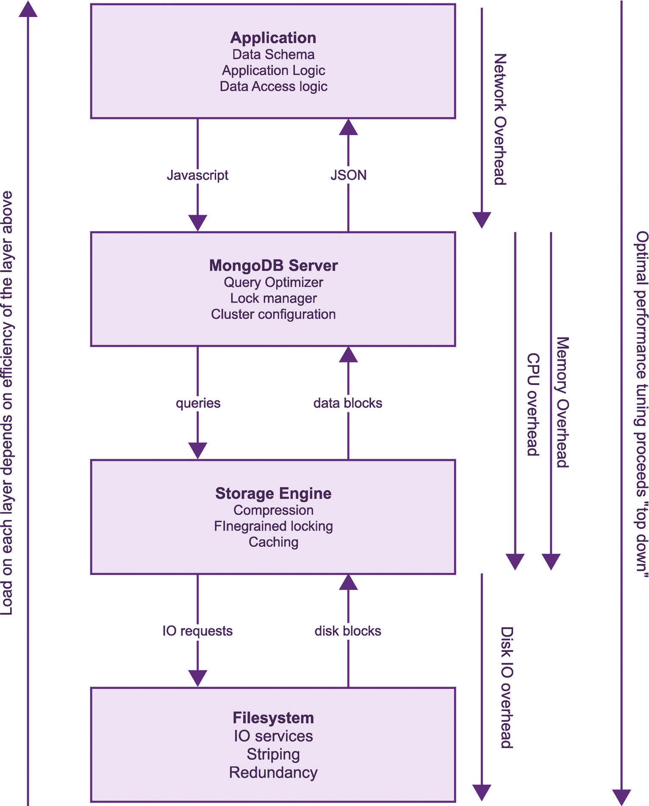

# 一、系统的性能调优

性能是任何应用的关键成功因素。如果你想想你每天使用的应用，很明显你只使用性能好的应用。如果谷歌搜索需要 2 分钟，而必应几乎是即时的，你会使用谷歌吗？当然不是。事实上，研究表明，如果一个页面的加载时间超过 3 秒，大约有一半的人会放弃这个网站。 [1](#Fn1)

应用的性能取决于许多因素，但是性能差的最常见的可避免的原因是数据库。将数据从磁盘移动到数据库，然后从数据库移动到应用，涉及应用基础架构中最慢的组件—磁盘驱动器和网络。因此，对与数据库交互的应用代码和数据库本身进行优化以获得最佳性能是至关重要的。

## 警示故事

您的 MongoDB 调优方法对于调优工作的最终成功至关重要。想想下面这个警示故事。

一个由 MongoDB 数据库支持的重要网站表现出不可接受的性能。作为一名经验丰富的 MongoDB 专业人员，您被叫来诊断问题。当您查看关键的操作系统性能指标时，有两点非常突出:主副本集上的 CPU 和 IO 都很高。CPU 平均负载和磁盘 IO 延迟都表明 MongoDB 系统需要更多的 CPU 和 IO 容量。

经过快速计算，您建议切分 MongoDB，将负载分散到四台服务器上。美元成本是巨大的，跨碎片重新分发数据所需的停机时间也是巨大的。然而，必须做些什么，所以管理层批准了费用和停工期。在实现之后，网站的性能是可以接受的，您谦虚地认为这是您的功劳。

成功的结果？你这么认为，直到

*   几个月后，性能又成了问题——每个碎片的容量都快用完了。

*   另一个 MongoDB 专家被请来，他报告说，一个简单的索引更改就可以修复原来的问题，而不需要任何成本和停机时间。此外，她指出分片实际上损害了特定查询的性能，并建议对几个集合进行分片。

*   实施新的索引后，数据库工作负载将减少到最初项目期间观察到的十分之一。管理层准备出售易贝现在过剩的硬件，并在你的咨询记录上盖上“不要再接洽”的印记。

*   你的另一半为了一个 PHP 程序员离开了你，而你最终剃了光头出家了。

经过几个月的沉默沉思，您意识到虽然您的调优工作正确地集中在数据库中消耗时间最多的活动上，但它们未能区分*原因*和*结果*。因此，你错误地处理了一个*效应*——高 CPU 和 IO 率——而忽略了*原因*(一个缺失的索引)。

## 症状性能调整

上面概述的方法可以称为*症状性能调优*。作为一名性能调优医生，我们会问应用“哪里疼”，然后尽最大努力减轻这种痛苦。

症状性性能调优有它的用武之地:如果您处于“救火”模式——在这种模式下，由于性能问题，应用实际上是不可用的——这可能是最好的方法。但是一般来说，它会产生一些不良后果:

*   我们可能会治疗表现不佳的*症状*，而不是*原因*。

*   当配置或应用更改更具成本效益时，我们可能会倾向于寻求基于硬件的解决方案。

*   我们可能会处理今天的痛苦，但无法实现永久或可扩展的解决方案。

## 系统性能调整

避免错误地关注原因而不是结果的最好方法是以自上而下的方式调优数据库系统。这种方法有时被称为“分层调优”，但我们更愿意称之为“系统性能调优”

### 数据库请求的剖析

为了避免症状方法的缺陷，我们需要我们的调优活动遵循明确定义的阶段。这些阶段是由应用、数据库和操作系统的交互方式决定的。在非常高的层次上，数据库处理发生在“层”中，如下所示:

1.  应用以调用 MongoDB API 的形式向 MongoDB 发送请求。数据库用返回代码和数据数组来响应这些请求。

2.  然后，数据库必须*解析*请求。数据库必须计算出用户打算访问什么资源，检查用户是否被授权执行所请求的活动，确定要使用的确切访问机制，并获取相关的锁和资源。这些操作使用操作系统资源(CPU 和内存),并可能与其他并发执行的数据库会话产生争用。

3.  最终，数据库请求将需要处理(创建、读取或更改)数据库中的一些数据。需要处理的确切数据量可能因数据库设计(文档模式模型和索引)和应用请求的精确编码而异。

4.  一些需要的数据将在内存中。数据在内存中的机会主要取决于数据被访问的频率和可用于缓存数据的内存量。当我们访问内存中的数据库数据时，这被称为*逻辑读取*。

5.  如果数据不在内存中，则必须从磁盘访问，从而导致一次*物理读取*。到目前为止，物理磁盘 IO 是所有操作中最昂贵的。因此，数据库会尽力避免这些物理读取。但是，某些磁盘活动是不可避免的。

每一层的活动都会影响下一层的需求。例如，如果提交的请求由于某种原因未能利用索引，它将需要大量的逻辑读取，这反过来将最终涉及大量的物理读取。

Tip

当您看到大量 IO 或争用时，很容易通过调整磁盘布局来直接处理症状。但是，如果您对您的调优工作进行排序，以便按顺序完成各个层，那么您就有更好的机会修复根本原因并缓解较低层的性能。

简而言之，下面是系统性能调优的三个步骤:

1.  通过调优数据库请求和优化数据库设计(索引和文档建模)，将应用需求降低到其逻辑最小值。

2.  在前面的步骤中降低了对数据库的需求后，优化内存以尽可能避免更多的物理 IO。

3.  现在，物理 IO 需求是现实的，通过提供足够的 IO 带宽并平均分配产生的负载，配置 IO 子系统以满足该需求。

### MongoDB 数据库的层次

MongoDB——事实上，几乎所有的数据库管理系统——都由多层代码组成，如图 [1-1](#Fig1) 所示。

图 1-1

*MongoDB 应用的关键层*

第一层代码是*应用层*。尽管您可能认为应用代码不是数据库的一部分，但它仍然在执行数据库驱动程序代码，并且是数据库性能图中不可或缺的一部分。应用层定义了数据模型(模式)和数据访问逻辑。

下一层代码是 *MongoDB 数据库服务器*。数据库服务器包含处理 MongoDB 命令、维护索引和管理分布式集群的代码。

下一层是*存储引擎*。存储引擎是数据库的一部分，但也是不同的代码层。在 MongoDB 中，存储引擎有多种选择，比如内存、RocksDB 和 MMAP。然而，它通常以 *WiredTiger* 存储引擎为代表。存储引擎负责在内存中缓存数据。

最后，我们有*存储子系统*。存储子系统不是 MongoDB 代码库的一部分:它是在操作系统或存储硬件中实现的。在简单的单服务器配置中，它由文件系统和磁盘设备的固件表示。

Tip

应用堆栈的每一层上的负载由上面的层决定。在确定上面的层已经优化之前，调整较低层通常是错误的。

## 最小化应用工作负载

我们的第一个目标是最小化应用对数据库的需求。我们希望数据库以尽可能少的处理来满足应用的数据需求。换句话说，我们希望 MongoDB*更聪明地*工作，而不是*更努力地*。

我们使用两种主要技术来减少应用工作负载:

*   **调优应用代码**:这可能涉及更改应用代码——JavaScript、Golang 或 Java——以便它向数据库发出更少的请求(例如，通过使用客户端缓存)。然而，更常见的情况是，这将涉及重写特定于应用 MongoDB 的数据库调用，如`find()`或`aggregate()`。

*   **调整数据库设计**:数据库设计是应用数据库的物理实现。优化数据库设计可能涉及修改索引或更改单个集合中使用的文档模型。

第 4 章到第 9 章详细介绍了我们可以用来最小化应用工作负载的各种技术，特别是:

*   **构建应用以避免数据库过载**:应用可以避免对数据库进行不必要的请求，并且可以被设计为最小化锁、热点和其他争用。可以设计和实现与 MongoDB 交互的程序，以最小化数据库往返和不必要的请求。

*   **优化物理数据库设计**:这包括索引和结构化文档模式模型，以减少执行 MongoDB 请求所需的工作。

*   **编写高效的数据库请求**:这涉及到理解如何编写和优化`find()`、`update()`、`aggregate()`以及其他命令。

这些技术不仅代表了我们调优工作的逻辑起点，也代表了提供最显著的性能改进的技术。应用调优导致 100 倍甚至 1000 倍的性能提升并不罕见:这种提升在优化内存或调整物理磁盘布局时很少见到。

## 减少物理 IO

既然应用需求已经最小化，我们就把注意力转向减少等待 IO 的时间。换句话说，在尝试减少每个 IO 所用的时间(IO 延迟)之前，我们会尝试减少 IO 请求的数量。事实证明，无论如何，减少 IO 的数量几乎总是会减少 IO 延迟，因此首先解决 IO 的数量会事半功倍。

MongoDB 数据库中的大多数物理 IO 要么是因为应用会话请求数据来满足查询，要么是因为数据修改请求。为 WiredTiger 缓存和其他内存结构分配足够的内存是减少物理 IO 最重要的一步。第 11 章专门讨论这个话题。

## 优化磁盘 IO

此时，我们已经正常化了应用工作负载，特别是应用所需的逻辑 IO 量。我们还配置了可用内存，以最大限度地减少最终导致物理 IO 的逻辑 IO 数量。现在，也只有现在，确保我们的磁盘 IO 子系统能够应对挑战才是有意义的。

当然，优化磁盘 IO 子系统可能是一项复杂而专门的任务；但是基本原则很简单:

*   确保 IO 子系统有足够的带宽来应对物理 IO 需求。这是由您分配的不同磁盘设备的数量和磁盘设备的类型决定的。

*   将您的负载均匀分布在您分配的磁盘上，最好的方法是 RAID 0(条带化)。对于大多数数据库来说，最糟糕的方法是 RAID 5 或类似的方法，这会导致写 IO 的巨大损失。

*   在基于云的环境中，您通常不必担心条带化的机制。但是，您仍然需要确保您分配的总 IO 带宽是足够的。

IO 子系统压力过大的明显症状是对 IO 请求的响应过度延迟。例如，您可能有一个每秒能够支持 1000 个请求的 IO 子系统，但是在单个请求的响应时间降低之前，您可能只能将其提升到每秒 500 个请求。在配置 IO 子系统时，这种吞吐量/响应时间的权衡是一个重要的考虑因素。

第 12 章和第 13 章详细介绍了优化磁盘 IO 的过程。

## 集群调优

上述所有因素同样适用于单实例 MongoDB 部署和 MongoDB 集群。然而，集群化的 MongoDB 包含了额外的挑战和机遇，例如:

*   在标准副本集配置中——其中有一个主节点和多个辅助节点——我们需要在性能、一致性和数据完整性之间进行权衡。*读取关注点*和*写入偏好*参数控制如何从辅助节点写入和读取数据。调整这些方法可以提高性能，但也可能会在故障转移或读取过时数据时丢失数据。

*   在分片副本集中，有多个主节点，这为具有高事务率的超大型数据库提供了更好的可伸缩性和性能。然而，分片可能不是实现性能结果的最具成本效益的方式，并且确实涉及性能权衡。如果您使用分片，那么分片键的选择和确定要分片的集合对您的成功至关重要。

我们将在第 13 章和第 14 章详细讨论集群配置和调优。

## 摘要

当面对 IO 绑定的数据库时，人们很容易立即处理最明显的症状——IO 子系统。不幸的是，这通常导致治标不治本，而且往往是昂贵的，而且往往最终是徒劳的。因为一个数据库层中的问题可能是由更高层中的配置引起或解决的，所以优化 MongoDB 数据库的最有效的方法是在优化更低层之前优化更高层:

1.  通过优化数据库请求和调整数据库设计(索引和文档建模)，将应用需求降低到其逻辑最小值。

2.  在前面的步骤中降低了对数据库的需求后，优化内存以尽可能避免更多的物理 IO。

3.  现在，物理 IO 需求是现实的，通过提供足够的 IO 带宽并平均分配产生的负载，配置 IO 子系统以满足该需求。

<aside aria-label="Footnotes" class="FootnoteSection" epub:type="footnotes">Footnotes [1](#Fn1_source)

[T2`https://developers.google.com/web/fundamentals/performance/why-performance-matters`](https://developers.google.com/web/fundamentals/performance/why-performance-matters)

 </aside>