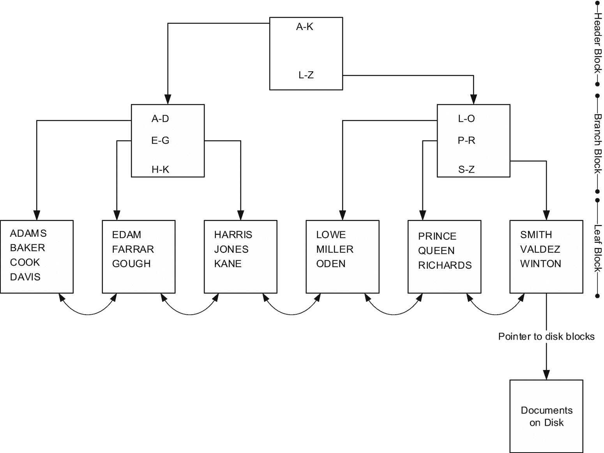
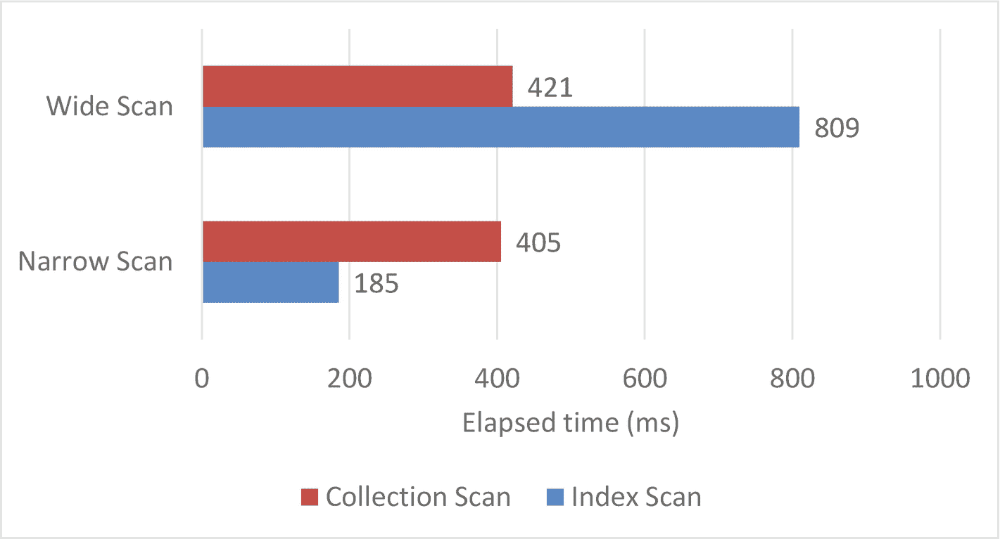
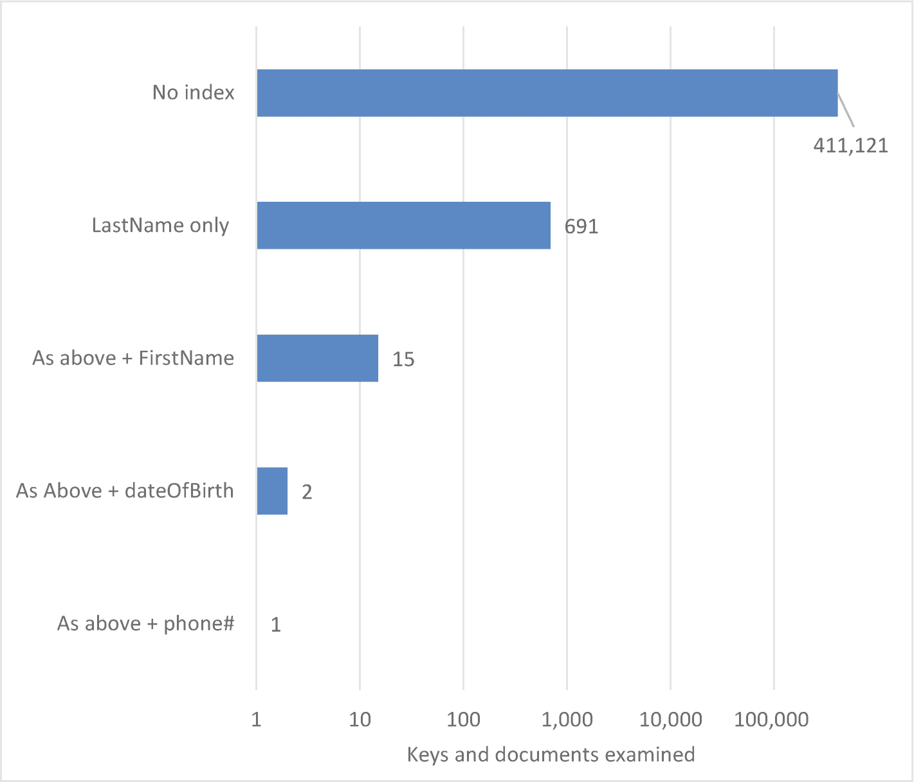
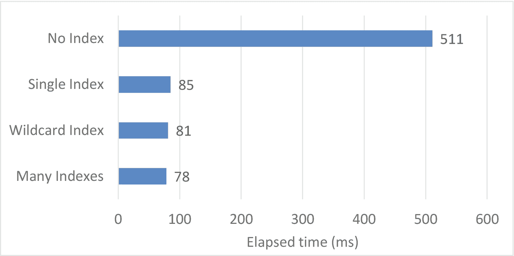
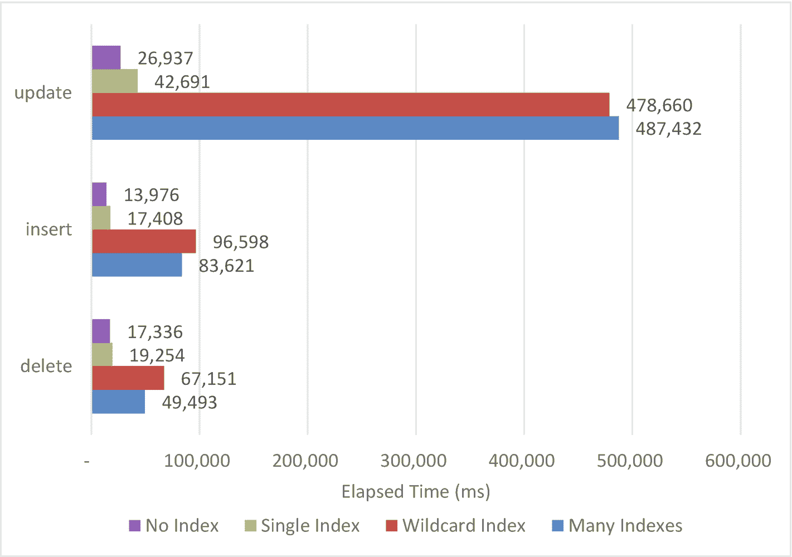
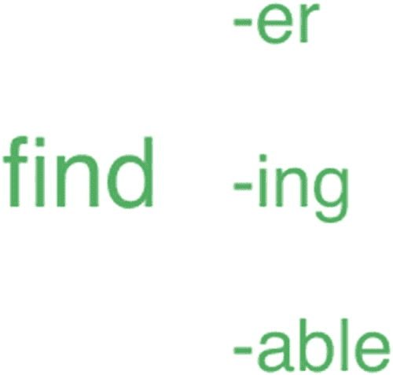
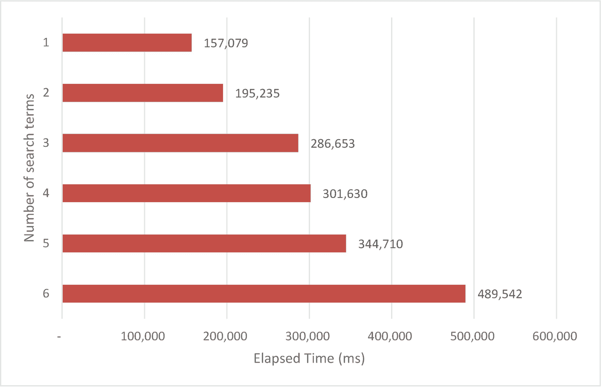

# 五、索引

索引是一个数据库对象，它有自己的存储，提供了一个快速访问集合的路径。索引的存在主要是为了提高性能，因此在优化 MongoDB 性能时，理解和有效地使用索引是至关重要的。

## b 树索引

B 树(“平衡树”)索引是 MongoDB 的默认索引结构。图 [5-1](#Fig1) 显示了 B 树索引结构的高级概述。



图 5-1

b 树索引结构

B 树索引具有分层的树结构。树的顶部是标题块。对于任何给定范围的键值，该块包含指向适当分支块的指针。对于更具体的范围，分支块通常指向适当的叶块，或者对于更大的索引，指向另一个分支块。叶块包含一个键值列表和指向磁盘上文档位置的指针。

检查图 [5-1](#Fig1) ，让我们想象一下 MongoDB 将如何遍历这个索引。如果我们需要访问“BAKER”的记录，我们将首先查阅标题块。header 块告诉我们，从 A 到 K 开始的键值存储在最左边的分支块中。访问这个分支块，我们发现从 A 到 D 开始的键值存储在最左边的叶块中。参考这个叶块，我们找到值“BAKER”及其相关的磁盘位置，然后我们将使用它来获得相关的文档。

叶块包含到上一个和下一个叶块的链接。这允许我们以升序或降序扫描索引，并允许使用索引处理使用`$gt`或`$lt`操作符的范围查询。

与其他索引策略相比，b 树索引具有以下优势:

*   因为每个叶节点都在相同的深度，所以性能是非常可预测的。理论上，集合中的任何文档都不会超过三个或四个 io。

*   b 树为大型集合提供了出色的性能，因为深度最多为四(一个头块、两级分支块和一级叶块)。一般来说，没有一个文档需要四个以上的 io 来定位。事实上，因为头块几乎总是在内存中，而分支块通常在内存中，所以实际的物理磁盘读取次数通常只有一两次。

*   B 树索引支持范围查询和精确查找。这是可能的，因为链接到前一个和下一个叶块。

B 树索引提供了灵活高效的查询性能。然而，在改变数据时维护 B 树可能是昂贵的。例如，考虑将一个带有键值“NIVEN”的文档插入到图 [5-1](#Fig1) 所示的集合中。要插入文档，我们必须在“L-O”块中添加一个新条目。如果在这个块中有空闲空间，那么成本是相当大的，但可能不会过高。但是如果块中没有空闲空间会发生什么呢？

如果叶块内没有空闲空间用于新条目，则需要*索引拆分*。分配一个新的块，并将现有块中的一半条目移动到新块中。此外，还需要在分支块中添加一个指向新创建的叶块的新条目。如果分支块中没有空闲空间，那么分支块也必须被分割。

这些索引拆分是一项开销很大的操作:分配新的块，并将索引条目从一个块移动到另一个块。因此，索引会显著降低插入、更新和删除操作的速度。

Caution

索引加速了数据检索，但是增加了插入、更新和删除操作的负担。

### 索引选择性

索引的*选择性*是对有多少文档与特定索引键值相关联的度量。如果属性或索引具有大量的唯一值和很少的重复值，则它们是选择性的。例如，`dateOfBirth`属性将是非常有选择性的(大量的可能值和相对较少的重复值)，而`gender`属性将不是有选择性的(少量的可能值和大量的重复值)。

选择性索引比非选择性索引更有效，因为它们更直接地指向特定的值。因此，MongoDB 将尝试使用最具选择性的索引。

### 唯一索引

*唯一索引*是防止组成索引的属性的任何重复值的索引。如果您尝试在包含此类重复值的集合上创建唯一索引，将会收到一个错误。同样，如果您尝试插入包含重复唯一索引键值的文档，也会收到错误。

创建唯一索引通常是为了防止重复值，而不是为了提高性能。然而，唯一索引通常非常有效——它们只指向一个文档，因此非常有选择性。

所有 MongoDB 集合都有一个内置的隐式惟一索引——在“`_id`”属性上。

### 索引扫描

除了能够找到特定的值，索引还可以优化部分字符串匹配和数据范围。这些*索引扫描*是可能的，因为 B 树索引结构包含到前一个和下一个叶块的链接。这些链接允许我们按升序或降序浏览索引。

例如，考虑以下查询，该查询检索两个日期之间出生的所有客户:

```js
db.customers. find({
  $and: [
    { dateOfBirth: { $gt: ISODate('1980-01-01T00:00:00Z') } },
    { dateOfBirth: { $lt: ISODate('1990-01-01T00:00:00Z') } }
  ]
});

```

如果在`dateOfBirth`上有一个索引，我们可以使用该索引来查找相关的客户。MongoDB 将导航到较低日期的索引条目，然后扫描整个索引，直到到达一个索引条目，其中`dateOfBirth`大于较高日期。叶块之间的链接允许这种扫描有效地发生。

如果我们检查这个查询的`explain()`输出中的`IXSCAN`步骤，我们可以看到一个`indexBounds`条目，它显示了如何使用索引在两个值之间进行扫描:

```js
"inputStage" : {
      "keyPattern" : {
      "dateOfBirth" : 1},
      "indexName" : "dateOfBirth_1",
      . . .
      "direction" : "forward",
      "indexBounds" : {
            "dateOfBirth" : [
                  "(new Date(315532800000),
                    new Date(631152000000))"
                        ]
                }
        }

```

当我们对字符串条件进行部分匹配时，也会执行索引扫描。例如，在下面的查询中，将扫描`LastName`上的索引，查找名称大于或等于“HARRIS”且小于或等于 HARRIT 的所有条目。实际上，这仅匹配名称 HARRIS 和 HARRISON，但是从 MongoDB 的角度来看，这与在高值和低值之间扫描是一样的。

```js
mongo> var explainObj=db.customers.explain('executionStats')
            .find({LastName:{$regex:/^HARRIS(.*)/}});

mongo> mongoTuning.executionStats(explainObj);

1   IXSCAN ( LastName_1 ms:0 keys:1366)
2  FETCH ( ms:0 docs:1365)

Totals:  ms: 4  keys: 1366  Docs: 1365

```

索引扫描并不总是一件好事。如果范围很大，那么索引扫描可能比根本不使用索引更糟糕。在图 [5-2](#Fig2) 中，我们看到如果值的范围很宽(在本例中，与所有可能的值一样宽)，那么最好进行集合扫描，而不是索引查找。但是，如果范围较窄，则该索引会提供更好的性能。我们将在第六章[中详细讨论优化索引范围扫描。](06.html)



图 5-2

索引扫描性能和扫描宽度

### 不区分大小写的搜索

搜索不确定大小写的文本字符串并不少见。例如，如果我们不知道输入的姓氏是“Smith”还是“SMITH”，我们可以像这样进行不区分大小写的搜索(正则表达式后面的“I”指定不区分大小写的匹配):

```js
mongo> var e=db.customers.explain('executionStats')
               .find({LastName:/^SMITH$/i},{}) ;
mongo> mongoTuning.quickExplain(e);
1   IXSCAN LastName_1
2  FETCH

```

您可能会惊喜地看到使用了一个索引来解析查询——那么也许 MongoDB 索引可以用于不区分大小写的搜索？唉，不尽然。如果我们得到`executionStats`，我们看到虽然使用了索引，但是它扫描了所有 410，000 个键。是的，索引用于查找匹配的名称，但是必须扫描整个索引。

```js
mongo> var e=db.customers.explain('executionStats')
               .find({LastName:/^SMITH$/i},{}) ;
mongo> mongoTuning.executionStats(e);

1   IXSCAN ( LastName_1 ms:8 keys:410071)
2  FETCH ( ms:8 docs:711)

Totals:  ms: 293  keys: 410071  Docs: 711

```

如果您想进行不区分大小写的搜索，那么有一个技巧可以使用。首先，创建一个不区分大小写的排序规则序列的索引。这是通过指定强度为 1 或 2 的归类序列来实现的(级别 1 忽略大小写和*音调符号*——特殊字符，如元音变音等。):

```js
db.customers.createIndex(
  { LastName: 1 },
  { collation: { locale: 'en', strength: 2 } }
);

```

现在，如果在查询中也指定了相同的排序规则，查询将返回不区分大小写的结果。例如，对“Smith”的查询现在也返回“SMITH ”:

```js
mongo> db.customers.
...   find({ LastName: 'SMITH' }, { LastName: 1,_id:0 }).
...   collation({ locale: 'en', strength: 2 }).
...   limit(1);
{
  "LastName": "Smith"
}

```

如果我们查看`executionStats`，我们会看到索引现在只正确地检索符合条件的文档(在本例中，有 700 多个“Smith”和“Smith”):

```js
 mongo> var e = db.customers.
...   explain('executionStats').
...   find({ LastName: 'SMITH' }).
...   collation({ locale: 'en', strength: 2 });
mongo> mongoTuning.executionStats(e);

1   IXSCAN ( LastName_1 ms:0 keys:711)
2  FETCH ( ms:0 docs:711)

Totals:  ms: 2  keys: 711  Docs: 711

```

## 复合索引

一个*复合索引*就是一个包含不止一个属性的索引。复合索引最显著的优势是，它通常比单一关键索引更具*选择性*。多个属性的组合将指向比由单一属性组成的索引数量更少的文档。包含所有包含在`find()`或`$match`子句中的属性的复合索引将特别有效。

如果经常查询集合中的多个属性，那么为这些属性创建一个复合索引是一个很好的主意。例如，我们可以通过`LastName`和`FirstName`查询`customers`集合。在这种情况下，我们可能希望创建一个包含`LastName`和`FirstName`的复合索引。

使用这样的索引，我们可以快速找到匹配给定的`LastName`和`FirstName`组合的所有`customers`。这样的索引将远比单独在`LastName`上的索引或者在`LastName`和`FirstName`上的单独索引更有效。

如果复合索引只能在所有键都显示为`find()`或`$match`时使用，那么复合索引的用途可能会非常有限。幸运的是，如果查询中请求了任何一个*初始*或*前导*属性，那么复合索引就可以有效地使用。前导属性是那些在索引定义中最早指定的属性。

### 复合索引性能

一般来说，当您向索引添加更多的属性时，您会看到索引性能的提高——前提是这些属性包含在查询过滤条件中。

例如，考虑以下查询:

```js
db.people.find(
      {
        "LastName" : "HENNING",
        "FirstName" : "ALBERTO",
        dateOfBirth: ISODate("1953-12-23T00:00:00Z")
      },
        { _id: 0, Phone: 1 }
      );

```

我们通过提供`FirstName`、`LastName`和`dateOfBirth`来检索客户电话号码。

图 [5-3](#Fig3) 显示了当我们给索引添加属性时，文档访问次数是如何减少的。如果没有索引，我们必须扫描所有 411，121 个文档。仅索引`LastName`一项就减少到 6918 个文档——实际上是集合中所有的“HENNING”。添加`FirstName`将文档数量减少到 15 个。通过添加`dateOfBirth,`,我们减少了两次访问:一次是读取索引条目，从那里，我们读取集合中的文档以获取电话号码。我们最后的优化是将电话号码(“`tel`”)属性添加到索引中。现在我们根本不需要访问集合——我们需要的一切都在索引中。



图 5-3

复合索引表现(对数标度)

### 复合索引键顺序

复合索引的一个优点是，它们可以支持不包含索引中所有键的查询。如果查询中包含一些主要属性，可以使用复合索引。

例如，指定为`{LastName:1, FirstName:1, dateOfBirth:1}`的索引可以用来优化对单独的`LastName`或者对`LastName`和`FirstName`的查询。然而，当单独针对`FirstName`或者针对`dateOfBirth`优化查询时，这将是无效的。为了使索引有用，查询中必须至少出现第一个或*前导*键中的一个。

Tip

复合索引可用于加速在索引表达式中包含任何或所有前导(第一个)键的查询。但是，它们无法优化索引表达式中至少不包含第一个键的查询。

### 复合索引指南

以下准则将有助于决定何时使用复合索引，以及如何确定要包含哪些属性以及包含的顺序:

*   为集合中出现在`find()`或`$match`条件下的属性创建复合索引。

*   如果属性有时在`find()`或`$match`条件中单独出现，那么将它们放在索引的开头。

*   如果复合索引还支持未指定所有属性的查询，那么它会更有用。例如，`createIndex({"LastName":1,"FirstName":1})`比`createIndex({"FirstName":1,"LastName":1})`更有用，因为只针对`LastName`的查询比只针对`FirstName`的查询更有可能发生。

*   属性的选择性越强，它在索引的前端就越有用。但是，请注意，WiredTiger 索引压缩可以从根本上收缩索引。当前导列的选择性*小于*时，索引压缩最有效。这可能意味着这样的索引更小，因此更可能适合内存。我们将在第 11 章[中对此进行更多的讨论。](11.html)

### 覆盖索引

覆盖索引的*是可用于完全解析查询的索引。类似地，可以完全通过索引解决的查询被称为*覆盖查询*。*

我们在图 [5-3](#Fig3) 中看到了一个覆盖索引的例子。使用关于`LastName`、`FirstName`、`dateOfBirth`和`Phone`的索引来解析查询，而无需从集合中检索数据。覆盖索引是优化查询的强大机制。因为索引通常远小于集合，所以不需要将集合中的文档放入内存的查询具有很高的内存和 IO 效率。

## 索引合并

前面，我们强调了在查询中的所有条件上创建复合索引通常是最有效的。

例如，在如下查询中:

```js
db.iotData.find({a:1,b:1})

```

我们可能需要一个关于`{a:1,b:1}.`的索引，但是，如果这个集合有很多属性，并且查询有很多可能的组合，那么创建我们需要的所有复合索引可能是不切实际的。<sup>[1](#Fn1)T4】</sup>

但是，如果我们在 a 上有一个索引，在 b 上有另一个索引，MongoDB 可以执行两个索引的*交集*。最终的计划如下所示:

```js
1    IXSCAN a_1
2    IXSCAN b_1
3   AND_SORTED
4  FETCH

```

AND_SORTED 步骤表示已经执行了索引交集。

`$and`条件的索引交叉点不常见。但是，MongoDB 会频繁地为`$or`条件执行索引合并。例如，在这个查询中:

```js
db.iotData.find({$or:[{a:100},{b:100}]});

```

默认情况下，MongoDB 会合并这两个索引:

```js
1     IXSCAN a_1
2     IXSCAN b_1
3    OR
4   FETCH
5  SUBPLAN

```

`OR`和`SUBPLAN`步骤表示索引合并。

Note

对于`$and`条件，复合索引优于索引合并。然而，对于一个`$or`条件，索引合并通常是最好的解决方案。

## 部分索引和稀疏索引

正如我们将在第 [11](11.html) 章中看到的，当所有数据都保存在内存中时，通常会获得最佳的 MongoDB 性能。然而，对于非常大的集合，MongoDB 可能很难在内存中保存所有的索引。在某些情况下，我们只想使用索引来扫描最近的或活动的信息。在这些场景中，我们可能想要创建一个*部分*或*稀疏*索引。

### 部分索引

部分索引是只为信息子集维护的索引。例如，假设我们有一个推文数据库，正在寻找我们账户中转发次数最多的推文:

```js
db.tweets.
  find({ 'user.name': 'Mean Magazine Bot' }, { text: 1 }).
  sort({ retweet_count: -1 }).
  limit(1);

```

一个关于`user.name`和`retweet_count`的索引可以达到这个目的，但是它会是一个相当大的索引。由于大多数推文没有被转发，我们可以只对那些被转发的推文创建部分索引:

```js
db.tweets.createIndex(
  { 'user.name': 1, retweet_count: 1 },
  { partialFilterExpression: { retweet_count: { $gt: 0 } } }
);

```

当我们寻找从未被转发的推文时，这个索引将是无用的，但假设这不是我们试图做的，部分索引将比完整索引小得多，并且更有效地存储。

注意，为了利用这个索引，我们需要在查询中指定一个过滤条件，确保 MongoDB 知道我们需要的所有数据都在索引中。在我们当前的例子中，我们可以在`retweet_count`上添加一个条件:

```js
db.tweets.find(
    { 'user.name': 'Mean Magazine Bot',
      retweet_count: { $gt: 0 } },
    { text: 1 }
  ).
  sort({ retweet_count: -1 }).
  limit(1);

```

### 稀疏索引

*稀疏* *索引*类似于部分索引，因为它们不索引集合中的所有文档。具体来说，稀疏索引不包括不包含索引属性的文档。

大多数时候，稀疏索引和普通索引一样好，而且可能要小得多。但是，稀疏索引不支持对索引属性进行`$exists:true`搜索:

```js
mongo>   var exp=db.customers.explain()
            .find({updateFlag:{$exists:false}});
mongo>   mongoTuning.quickExplain(exp);
1  COLLSCAN

```

但是，稀疏索引可以搜索`$exists:true`:

```js
mongo> var exp=db.customers.explain()
                  .find({updateFlag:{$exists:true}});
mongo> mongoTuning.quickExplain(exp);
1   IXSCAN updateFlag_1
2  FETCH

```

## 使用索引进行排序和连接

索引可用于支持按排序顺序返回数据，也可用于支持多个集合之间的连接。

### 整理

MongoDB 可以使用索引按排序顺序返回数据。因为每个叶节点都包含到后续叶节点的链接，所以 MongoDB 可以按排序的顺序扫描索引条目，返回数据而不必显式地对数据进行排序。我们将在第 6 章中研究如何使用索引来支持排序。

### 对联接使用索引

MongoDB 可以在聚合框架中使用`$lookup`和`$graphLookup`操作符连接多个集合中的数据。对于任何非平凡大小的连接，索引查找应该支持这些连接，以避免随着连接大小的增加而出现索引级下降。该主题在第 [7](07.html) 章中有详细介绍。

## 索引开销

尽管索引可以极大地提高查询性能，但它们确实会降低插入、更新和删除操作的性能。当插入或删除文档时，通常会修改集合的所有索引，并且当更新改变了出现在索引中的任何属性时，也必须修改索引。插入、更新和删除期间的索引维护通常是 MongoDB 在这些操作中必须完成的大部分工作。

因此，我们所有的索引对查询性能都有贡献是很重要的，因为这些索引会不必要地降低插入、更新和删除的性能。特别是，在对频繁更新的属性创建索引时，应该特别小心。一个文档只能插入或删除一次，但可以更新多次。因此，对频繁更新的属性或具有非常高的插入/删除率的集合进行索引将需要特别高的成本。

在第 [8](08.html) 章中，我们将详细介绍索引开销以及识别可能没有发挥其作用的索引的方法。

### 通配符索引

*通配符索引*是一种开销特别大的索引类型。

通配符索引是在子文档的每个属性上创建的索引。举例来说，我们有一些类似这样的数据:

```js
{
 "_id" : 1,
 "data" : {
  "a" : 1728,
  "b" : 6740,
  "c" : 6481,
  "d" : 2066,
  "e" : 3173,
  "f" : 1796,
  "g" : 8112
 }
}

```

可以针对`data`子文档中的任何一个属性发出查询。此外，应用可能会添加一些我们无法预料的新属性。为了优化性能，我们需要为每个属性创建一个单独的索引:

```js
db.mycollection.createIndex({"data.a":1});
db.mycollection.createIndex({"data.b":1});
db.mycollection.createIndex({"data.c":1});
db.mycollection.createIndex({"data.d":1});
db.mycollection.createIndex({"data.e":1});
db.mycollection.createIndex({"data.f":1});
db.mycollection.createIndex({"data.g":1});

```

索引太多！但是即使这样也不行，除非我能确定属性是什么。如果创建了属性“`h`”会发生什么？

在这种情况下,*通配符索引*会出手相救。 <sup>[2](#Fn2)</sup>

顾名思义，我们可以通过在属性表达式中指定通配符占位符来创建通配符索引，例如:

```js
db.mycollection.createIndex({"data.$**":1});

```

该语句为`data`文档中的每个属性创建一个索引:即使新属性是在索引创建后由应用创建的。

太好了！但显然，这是有成本的。让我们来看看通配符索引在 insert、find、update 和 delete 语句中的表现

*   完全没有索引

*   单一属性的单一索引

*   所有属性的独立索引

对于查找操作，我们看到通配符索引的性能与单属性索引一样好——不管我们创建了多少个索引，索引都提供了对相关数据的快速访问。图 [5-4](#Fig4) 说明了结果。



图 5-4

通配符索引与查找操作的其他方法

尽管通配符索引与常规索引具有相似的配置文件，但是当我们研究更新、删除和插入操作时，它们具有非常不同的开销。

图 [5-5](#Fig5) 显示了当我们有通配符索引、每个属性有单独的索引、单个属性有单个索引或者根本没有索引时，执行插入、更新和删除操作所花费的时间。



图 5-5

通配符索引与传统索引相比的开销

正如我们所料，我们看到多个索引的开销比单个索引高得多。然而，我们也看到通配符索引带来的开销至少与为每个属性创建单独的索引一样大。

Warning

不要出于懒惰而创建通配符索引。通配符索引的开销很高，只有在没有替代策略时才应该使用它们。

如果一些属性从来没有被搜索过，那么通配符索引将会增加不值得的开销。和往常一样，只创建必要的索引:所有索引都会影响性能，通配符索引更是如此。

通配符索引对您的索引库是一个非常有用的补充。但是，不要把它们仅仅作为编程的捷径:它们会给插入、更新和删除性能带来很大的开销，只有当要索引的属性不可预测时才应该使用它们。

## 文本索引

在现代应用中，允许用户执行自由形式的项目搜索已经成为标准，比如电影、购物项目或租赁物业的列表。用户不想填写复杂的表单来指定要搜索哪些属性，当然也不想学习 MongoDB `find()`语法。

要构建这类应用，您可能需要一些搜索词，然后在成千上万个文档中搜索大型文本字段，以找到最佳匹配。这就是文本索引有用的地方。

在调优或创建文本索引时，理解 MongoDB 将如何解释该索引以及该索引将如何影响查询非常重要。

MongoDB 使用一种叫做*后缀词干*的方法来构建搜索索引。

后缀词干包括在构成搜索树的根的每个单词的开头找到一个公共元素(前缀)。每一个不同的后缀都“派生”到它自己的节点上，这个节点可以进一步派生。这个过程创建了一个树，可以有效地从根(最常见的共享元素)向下搜索到叶节点，从根到叶节点的路径构成了一个完整的单词。

例如，假设我们在文档的某个地方有单词" *finder* 、 *finding* 、 *findable* "。通过使用后缀词干，我们可以在这些单词中找到一个共同的词根" *find* ，" T8】 er ， *ing* ， *able。*



MongoDB 使用同样的方法。当您在给定字段上创建文本索引时，MongoDB 将解析该字段中包含的文本，并为给定文档中生成的每个唯一词干术语创建一个索引条目。这将对每个索引字段和每个文档重复，直到该集合中的所有指定字段都有完整的文本索引。

理解这个理论很好，但是有时理解文本索引如何工作的最好方法是开始与它们交互，所以让我们创建一个新的文本索引。该命令非常简单，使用与创建任何其他类型的索引相同的语法。您只需指定要为其创建索引的字段，索引的类型指定为`"text"`:

```js
> db.listingsAndReviews.createIndex({description: "text"})
{
        "createdCollectionAutomatically" : false,
        "numIndexesBefore" : 4,
        "numIndexesAfter" : 5,
        "ok" : 1
}

```

创建文本索引就像这样简单。与我们的其他索引一样，我们可以在多个属性上创建一个文本索引:

```js
> db.listingsAndReviews.createIndex({summary: "text", space: "text"})
{
        "createdCollectionAutomatically" : false,
        "numIndexesBefore" : 4,
        "numIndexesAfter" : 5,
        "ok" : 1
}

```

尽管可以在多个索引上创建文本索引，但在任何集合上只能有一个文本索引。因此，如果您一个接一个地运行上面的两个命令，您将会收到一个错误。

Note

每个收藏只能有*个*文本索引。因此，要创建新的文本索引或包含文本索引的复合索引，必须先使用`db.collection.` `dropIndex` `("index_name")`删除旧索引。

我们还可以创建复合索引，包括文本和传统索引的混合:

```js
> db.listingsAndReviews.createIndex({summary: "text", beds: 1})
{
        "createdCollectionAutomatically" : false,
        "numIndexesBefore" : 4,
        "numIndexesAfter" : 5,
        "ok" : 1
}

```

创建文本索引时的另一个重要方面是为每个字段指定*权重*。字段的权重是指该字段相对于其他索引字段的重要性。MongoDB 将在确定返回哪些结果以在`$text`查询中使用时使用它。创建文本索引时，可以将权重指定为一个选项。

```js
> db.listingsAndReviews.createIndex({summary: "text", description: "text"}, {weights: {summary: 3, description: 2}})
{
        "createdCollectionAutomatically" : false,
        "numIndexesBefore" : 4,
        "numIndexesAfter" : 5,
        "ok" : 1
}

```

现在我们的集合上有了一个文本索引，我们可以使用`$` `text`操作符来访问它。`$text`接受一个`$search`操作符，该操作符接受一个单词列表(通常由空格分隔):

```js
> db.listingsAndReviews.findOne({$text: {$search: "oven kettle and microwave"}}, {summary: 1})
{
        "_id" : "6785160",
        "summary" : "Large home with that includes a bedroom with TV , hanging and shelf space for clothing, comfortable double bed and air conditioning. Additional private sitting room includes sofa, kettle, bar fridge and toaster. Exclusive use of large bathroom with shower, bath, double sinks and toilet. LGBTQI friendly"
}

```

当使用文本索引来投影在文本搜索期间生成的给定文档的得分时，这通常是有用的。您可以使用显示`textScore`字段的`$` `meta` `projection`来完成此操作。您通常也希望对这个投影进行排序，以确保您首先获得最相关的搜索结果。

```js
mongo> db.listingsAndReviews.
...   find(
...     { $text: { $search: 'oven kettle and microwave' } },
...     { score: { $meta: 'textScore' }, summary: 1 }
...   ).
...   sort({ score: { $meta: 'textScore' } }).
...   limit(3);
{
  "_id": "25701117",
  "summary": "Totally refurbished penthouse apartment ...",
  "score": 3.5587606837606836
}
{
  "_id": "13324467",
  "summary": "Everything, absolutely EVERYTHING NEW and ... ",
  "score": 3.5549853372434015
}

```

搜索文本索引时，您可能希望使用的另外两种重要方法是*排除*和*精确匹配*。排除项用–符号标记，完全匹配项用双引号标记。例如，查询

```js
> db.listingsAndReviews.find(
      {$text: {$search:
            "\"luggage storage\" kettle and -microwave"}})

```

将在索引中搜索短语“*行李寄存*的精确匹配，以及排除短语“*微波炉”的文档。*“以这种方式使用文本索引非常强大，尤其是在大量文本的数据集上。但是，要记住文本索引有一些限制:

*   为文本索引指定`sparse`没有任何效果。文本索引总是*稀疏的*。

*   如果您的复合索引包含一个*文本*索引，它不能包含*多键*或*地理空间*字段。您必须为这些特殊的索引类型创建单独的索引。

*   正如前面创建文本索引的例子中提到的，每个集合只能创建一个文本索引。额外的文本索引创建将引发错误。

### 文本索引性能

使用传统索引，您可以使用集合扫描而不是索引来解析查询。但是，如果没有文本索引，就根本无法执行全文搜索。因此，对于全文索引的使用，您没有太多的选择。

但是，您应该记住全文索引的一些性能特征。首先，您应该知道 MongoDB 将对搜索标准中的每个术语执行索引扫描。例如，这里我们搜索五个唯一的单词，并因此执行五次文本索引扫描:

```js
mongo> var exp = db.bigEnron.
...   explain('executionStats').
...   find( { $text: { $search:
      'Confirmation Rooms Credit card tax email ' } },
...   { score: { $meta: 'textScore' }, body: 1 } ).
...   sort({ score: { $meta: 'textScore' } }).
...   limit(3);

mongo> mongoTuning.executionStats(exp);

1        IXSCAN ( body_text ms:229 keys:53068)
2        IXSCAN ( body_text ms:764 keys:217480)
3        IXSCAN ( body_text ms:748 keys:229382)
4        IXSCAN ( body_text ms:1376 keys:398325)
5        IXSCAN ( body_text ms:362 keys:108996)
6        IXSCAN ( body_text ms:181 keys:93970)
7       TEXT_OR ( ms:494636 docs:843437)
8      TEXT_MATCH ( ms:494709)
9     TEXT ( body_text ms:494746)
10    SORT_KEY_GENERATOR ( ms:494795)
11   SORT ( ms:495015)
12  PROJECTION_DEFAULT ( ms:495072)

```

因此，如图 [5-6](#Fig6) 所示，我们拥有的搜索词越多，文本搜索所需的时间就越长。



图 5-6

文本索引性能与搜索词数量的关系

Note

MongoDB 文本索引性能与搜索中的术语数量成正比。必要时，限制搜索词的数量，以保持响应时间可控。

请注意，即使您搜索一个精确的短语，您仍将对短语中的每个单词执行一次扫描，因为索引本身不知道单词是如何按顺序使用的。如果您正在搜索一个很长的精确文本短语，您最好执行正则表达式查询和完全集合扫描。例如，此查询查找文本“你今晚会去看比赛吗”:

```js
mongo> var exp = db.bigEnron.
...   explain('executionStats').
      find( { $text: {
         $search: '"are you going to be at the game tonight"' } });
mongo>   mongoTuning.executionStats(exp);

1      IXSCAN ( body_text ms:354 keys:62838)
2      IXSCAN ( body_text ms:2136 keys:515760)
3      IXSCAN ( body_text ms:146 keys:39721)
4     OR ( ms:2767)
5    FETCH ( ms:379793 docs:563201)
6   TEXT_MATCH ( ms:383409)

7  TEXT ( body_text ms:383517)

Totals:  ms: 414690  keys: 618319  Docs: 563201

```

MongoDB 执行三次索引扫描(只有单词“game”、“going”和“tonight”被认为值得扫描)。在不到一半的运行时间内完成了完全集合扫描:

```js
mongo> var exp = db.bigEnron.
...   explain('executionStats').
      find({body:/are you going to be at the game tonight/});
mongo>   mongoTuning.executionStats(exp);

1  COLLSCAN ( ms:102289 docs:2897816)

Totals:  ms: 145925  keys: 0  Docs: 2897816

```

Tip

如果您正在搜索一个精确的短语，您可能最好进行基于集合扫描的常规查询——MongoDB 文本索引不是为高效的多词短语搜索而设计的。

以下是关于文本索引的一些额外的重要性能注意事项:

*   由于前面描述的词干方法，文本索引可能非常大，并且可能需要很长时间来创建。

*   MongoDB 建议您的系统拥有足够的内存来保存文本索引，因为否则在搜索过程中可能会涉及大量的 IO。

在查询中使用排序时，您将无法利用文本索引来确定顺序，即使在复合文本索引中也是如此。在对文本查询结果进行排序时，请记住这一点。

文本索引非常强大，可以服务于各种各样的现代应用，但是在依赖它们时要小心，否则您会发现您的`$text`查询变成了一个恼人的性能瓶颈。

MongoDB Atlas 提供了使用流行的 Lucene 平台进行文本搜索的能力。与 MongoDB 的内部文本搜索功能相比，这个工具有很多优点。

## 地理空间索引

今天的位置感知应用通常需要在地图数据中执行搜索。这些搜索可能包括搜索某个地区的租赁物业，查找附近的场地，甚至按拍摄地点对照片进行分类。如今，无论我们走到哪里，许多设备都在被动捕捉大量的位置数据。这通常被称为地理空间数据:关于地球上位置的数据。

MongoDB 既提供了查询这些数据的方法，也提供了特定的索引类型来优化查询。

以下是一些地理空间数据的示例:

```js
{
        "_id" : ObjectId("578f6fa2df35c7fbdbaed8c4"),
        "recrd" : "",
        "vesslterms" : "",
        "feature_type" : "Wrecks - Visible",
        "chart" : "US,U1,graph,DNC H1409860",
        "latdec" : 9.3547792,
        "londec" : -79.9081268,
        "gp_quality" : "",
        "depth" : "",
        "sounding_type" : "",
        "history" : "",
        "quasou" : "",
        "watlev" : "always dry",
        "coordinates" : [
                -79.9081268,
                9.3547792
        ]
}

```

数据本身可能非常简单，尽管您可能会将大量元数据与坐标一起存储。前面的数据采用传统格式，数据表示为简单的坐标对。MongoDB 还支持 *GeoJSON* 格式。

```js
{
        "_id" : ObjectId("578f6fa2df35c7fbdbaed8c4"),
        "recrd" : "",
        "vesslterms" : "",
        "feature_type" : "Wrecks - Visible",
        "chart" : "US,U1,graph,DNC H1409860",
        "latdec" : 9.3547792,
        "londec" : -79.9081268,
        "gp_quality" : "",
        "depth" : "",
        "sounding_type" : "",
        "history" : "",
        "quasou" : "",
        "watlev" : "always dry",
        "location" : {
                "type" : "Point",
                "coordinates" : [
                        -79.9081268,
                        9.3547792
                ]
        }
}

```

GeoJSON 格式指定了数据类型以及值本身，可以是单个点，也可以是许多坐标对的数组。GeoJSON 允许您定义更复杂的空间信息，如线和面，但出于本章的目的，我们将重点关注传统格式的简单点数据。

下面是一个地理空间查询，可以使用`$near`操作符在目标点的某个半径范围内查找文档:

```js
> db.shipwrecks.find(
...    {
...      coordinates:
...        { $near :
...           {
...             $geometry: { type: "Point",
                         coordinates: [ -79.908, 9.354 ] },
...             $minDistance: 1000,
...             $maxDistance: 10000
...           }
...        }
...    }
... ).limit(1).pretty();
{
        "_id" : ObjectId("578f6fa2df35c7fbdbaed8c8"),
        "recrd" : "",
        "vesslterms" : "",
        "feature_type" : "Wrecks - Submerged, dangerous",
        "chart" : "US,U1,graph,DNC H1409860",
        "latdec" : 9.3418808,
        "londec" : -79.9103851,
        "gp_quality" : "",
        "depth" : "",
        "sounding_type" : "",
        "history" : "",
        "quasou" : "depth unknown",
        "watlev" : "always under water/submerged",
        "coordinates" : [
                -79.9103851,
                9.3418808
        ]
}

```

在前面的示例中，此查询的匹配地理空间索引已经存在。在使用`$near`操作符的情况下，运行查询需要地理空间索引。如果您试图在没有索引的情况下运行这个查询，MongoDB 将返回一个错误:

```js
Error: error: {
        "ok" : 0,
        "errmsg" : "error processing query: ns=sample_geospatial.shipwrecks limit=1Tree: GEONEAR  field=coordinates maxdist=10000 isNearSphere=0\nSort: {}\nProj: {}\n planner returned error :: caused by :: unable to find index for $geoNear query",
        "code" : 291,
        "codeName" : "NoQueryExecutionPlans"
}

```

事实上，几乎所有的地理空间操作者都需要一个合适的地理空间索引。

在该查询的执行计划中，我们将第一次看到以下阶段—“`GEO_NEAR_2DSPHERE`”:

```js
mongo> var exp=db.shipwrecks.explain('executionStats').
...   find(
...     {
...       coordinates:
...         { $near :
...            {
...              $geometry: { type: "Point",
                        coordinates: [ -79.908, 9.354 ] },
...              $minDistance: 1000,
...              $maxDistance: 10000
...            }
...         }
...     }
...  ).limit(1);
mongo> mongoTuning.executionStats(exp);

1     IXSCAN ( coordinates_2dsphere ms:0 keys:12)
2    FETCH ( ms:0 docs:0)
3     IXSCAN ( coordinates_2dsphere ms:0 keys:18)
4    FETCH ( ms:0 docs:1)
5   GEO_NEAR_2DSPHERE ( coordinates_2dsphere ms:0)
6  LIMIT ( ms:0)

Totals:  ms: 0  keys: 30  Docs: 1

```

这表明我们正在使用一个`2dsphere`索引来帮助我们查询这些地理空间数据。

您可以在 MongoDB 中创建两种不同类型的地理空间索引:

*   **2dsphere** :用于索引存在于类似地球的球体上的数据

*   **2d** :用于索引像传统地图一样存在于二维平面上的数据

您选择使用哪个索引将取决于数据本身的上下文。选择索引类型时要小心。你可以在球形数据上使用一个`2d`索引；但是，结果会被扭曲。想想地图上相对两侧的两个点的例子；这两点在球面上可能很近，但在二维平面上可能很远。

要创建地理空间索引，只需指定`2dsphere`或`2d`索引类型作为值，关键字是包含位置数据的字段，可以是传统坐标数据或 GeoJSON 数据:

```js
> db.shipwrecks.createIndex({"coordinates" : "2dsphere"})

```

Warning

如果试图在不包含 GeoJSON 对象或坐标对形式的适当数据的字段上创建地理空间索引，MongoDB 将返回错误。因此，在创建这个索引之前，请检查您的数据。

### 地理空间索引性能

当讨论确保索引提高性能的方法时，地理空间索引是一个例外。因为您必须拥有这些索引(除了`$geoWithin`操作符之外)，它们不一定像允许它们运行那样给查询带来性能提升。这使得提高地理空间查询性能成为一项更具挑战性的任务，而不是创建或调整匹配索引；关于地理空间索引，您可以考虑以下几个方面:

*   与其他地理空间操作符不同，`$geoWithin`可以在没有地理空间索引的情况下使用。添加匹配索引是提高`$geoWithin`性能最简单的方法。

*   `$near`和`$nearSphere`将自动按照距离(从最近到最远)对结果进行排序，所以如果您在查询中添加一个`sort()`操作，那么最初的排序就被浪费了。如果您计划对结果进行排序，您可以通过使用`$geoWithin`或`$geoNear`聚合阶段来提高性能，这不会自动对结果进行排序。

*   当使用`$near`、`$nearSphere`或`$geoNear`操作符时，尽可能利用`minDistance`和`maxDistance`参数。这将限制 MongoDB 检查的文档数量。对于附近有许多数据点的查询，这可能不会影响性能。然而，如果附近没有匹配的值，在`maxDistance`中的查询可能会搜索整个世界！

地理空间元数据正被添加到越来越多的数据中，从图像到浏览器日志。越来越有可能在生产数据集中的某个地方，您可能有一些地理空间数据。与其他索引类型一样，您仍然应该考虑维护索引的开销是否值得提高性能。如果您不希望应用查询地理空间数据，那么地理空间索引可能没有好处。

### 地理空间索引限制

对于`2dsphere`和`2d`两种索引类型，不可能创建一个*覆盖的*查询。由于地理空间操作符的性质，必须检查文档以满足查询，所以不要期望仅仅通过创建地理空间索引来创建覆盖的查询。

此外，当使用分片的集合时(将在第 14 章[第 14 章](14.html)中介绍)，地理空间索引不能用作分片键，您将无法通过 GeoJSON 或坐标数据进行分片。但是，如果您希望在一个分片集合上有一个地理空间索引，您仍然可以创建它，因为分片键引用了一个不同于索引的字段。同样值得注意的是，和文本索引一样，`2d`和`2dsphere`索引总是*稀疏的*。

`2d`索引类型不能用于更高级的 GeoJSON 数据；只有支持传统坐标对。

MongoDB 允许在一个集合上创建多个地理空间索引。但是，创建后续地理空间索引时要小心，因为这将影响地理空间聚合的行为，甚至可能破坏现有的应用代码。例如，如果使用`$geoNear`聚合管道阶段的查询存在多个地理空间索引，则必须指定您希望使用的键。如果集合中存在多个`2dsphere`或`2d`索引，并且没有指定键，那么聚合将无法确定使用哪个索引，从而导致聚合失败。

Note

如果您最多有一个`2d`索引和一个`2dsphere`索引，您将不会收到错误。相反，查询将尝试使用`2d`索引，如果它存在的话；如果没有找到`2d`索引，它将尝试使用`2dsphere`索引。

实际上，不太可能在一个集合中创建许多不同的地理空间索引。和往常一样，在创建索引之前，请仔细考虑您可能会遇到哪些查询。

## 摘要

在这一章中，我们学习了什么是索引，它们是如何工作的，以及为什么它们是至关重要的。很多时候，正确地识别和创建与查询匹配的索引会给你带来最大的“性价比”,从而提高性能。此外，我们还学习了一些更具体的索引来帮助地理空间或文本查询。

然而，正如我们在本章中了解到的，索引并不是解决所有性能问题的通用创可贴。在某些情况下，使用不当的索引会降低性能。在决定实现哪种索引之前，考虑来自应用或用户的预期负载和数据结构是至关重要的。

索引可能是您提高 MongoDB 性能的最健壮的方法之一，但是在创建它们的时候不要偷懒；花一点时间在正确的索引上可以节省你很多时间来调整曲目。

<aside aria-label="Footnotes" class="FootnoteSection" epub:type="footnotes">Footnotes [1](#Fn1_source)

这可能是我们在第 [4](04.html) 章中讨论的“属性”模式的工作。

  [2](#Fn2_source)

这也是在第 [4](04.html) 章中介绍的属性模式可能被指出的情况。

 </aside>