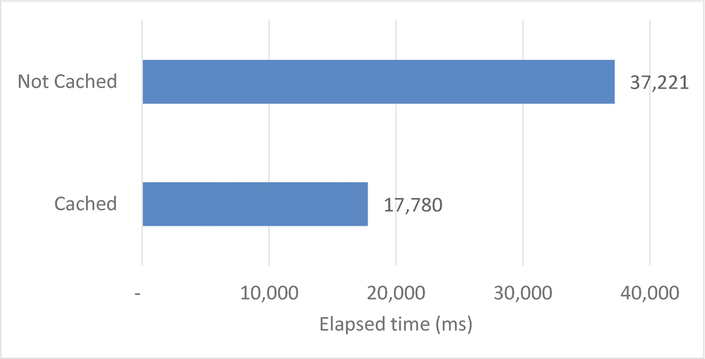
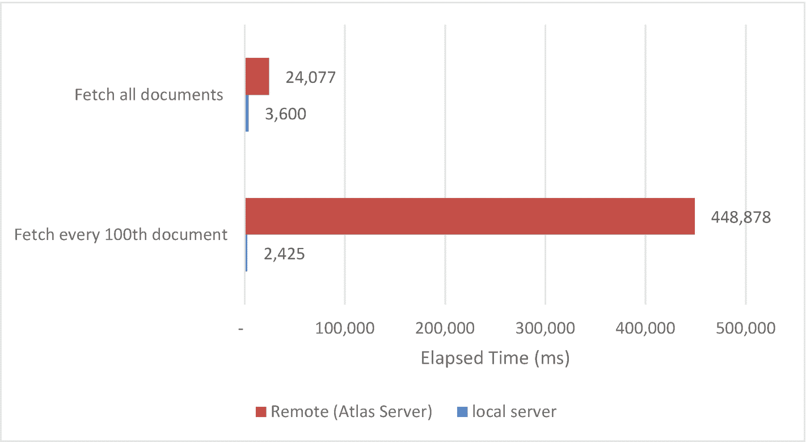
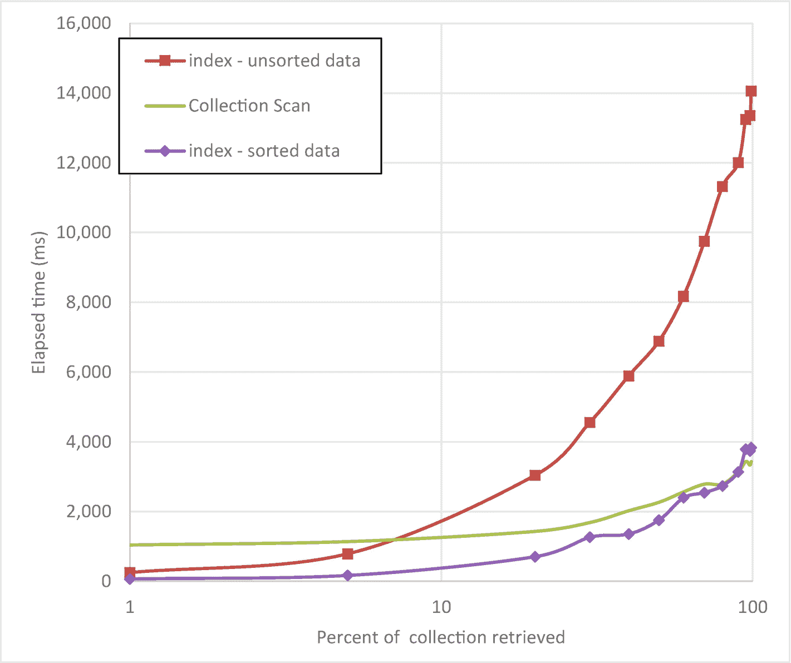
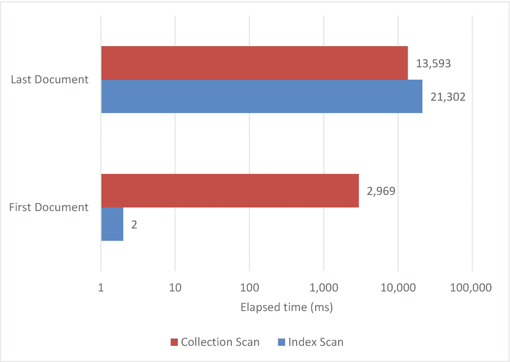
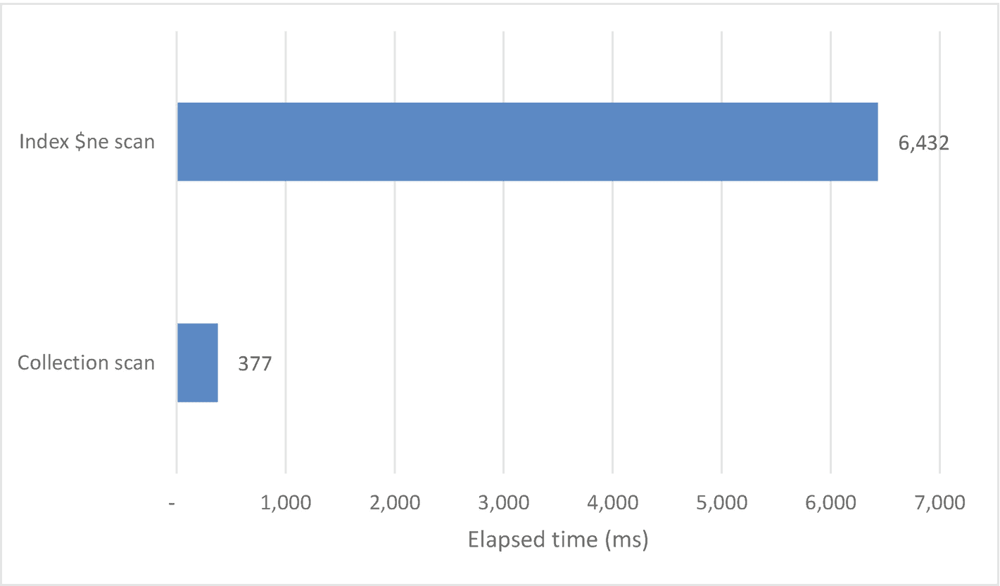

# 六、查询调优

在几乎所有的应用中，大部分数据库时间都花在数据检索上。一个文档只能被插入或删除一次，但在两次更新之间通常会被多次读取，即使是更新也必须在执行其工作之前检索数据。因此，我们大部分的 MongoDB 调优工作都集中在查找数据上，特别是`find()`语句，它是 MongoDB 数据检索的主力。

## 缓存结果

回到 Guy 主要处理基于 SQL 的数据库的黑暗日子，一位智者曾经告诉他“最快的 SQL 语句是你永远不会发送到数据库的语句。”换句话说，如果可以避免，就不要向数据库发送请求。即使是最简单的请求也需要一次网络往返，可能还需要一次 IO——所以除非万不得已，否则不要与数据库交互。

这个原则同样适用于 MongoDB。我们经常不止一次地向数据库请求相同的信息——即使我们知道信息没有改变。

例如，考虑下面的简单函数:

```js
function recordView(customerId,filmId) {
  let filmTitle=db.films.findOne({_id:filmId},{Title:1}).Title;
  db.customers.update({_id:customerId},
      {$push:{views:{filmId,title:filmTitle,
                     viewDate:new ISODate()}}});
}

```

我们在电影收藏中查找电影名称——很公平。但是电影的名字从来不会变，而且在任何一天，有些电影都会被看很多遍。那么，为什么要回到数据库去获取我们已经处理过的电影的片名呢？

这个公认更复杂的代码将电影标题缓存在本地内存中。我们再也不会向数据库查询电影片名了:

```js
var cacheDemo={};
cacheDemo.filmCache={};

cacheDemo.getFilmId=function(filmId) {
  if (filmId in cacheDemo.filmCache) {
    return(cacheDemo.filmCache[filmId]);
  }
  else
    {
      let filmTitle=db.films.findOne({_id:filmId},
                        {Title:1}).Title;
      cacheDemo.filmCache[filmId]=filmTitle;
      return(filmTitle);
    }
};

cacheDemo.recordView= function(customerId,filmId) {
  let filmTitle=cacheDemo.getFilmId(filmId);
  db.customers.update({_id:customerId},
                    {$push:{views:{filmId,title:filmTitle,
                              viewDate:new ISODate()}}});
}

```

缓存的实现要快得多。图 [6-1](#Fig1) 显示了在随机输入的情况下执行每个功能 1000 次所用的时间。



图 6-1

简单缓存带来的性能提升

缓存特别适合包含静态“查找”值的小型、频繁访问的集合。

以下是实现缓存时需要记住的一些注意事项:

*   缓存消耗客户端程序的内存。在许多环境中，内存是充足的，考虑缓存的表相对较小。但是，对于大型集合和内存受限的环境，缓存策略的实现可能会导致应用层或客户端内存不足，从而降低性能。

*   当缓存相对较小时，顺序扫描(即从第一个条目到最后一个条目检查缓存中的每个条目)可能会产生足够的性能。但是，如果缓存较大，顺序扫描可能会降低性能。为了保持良好的性能，可能有必要实现高级搜索技术，如哈希或二进制斩波。在我们前面的例子中，高速缓存实际上是通过电影 ID 索引的，因此，无论涉及多少部电影，高速缓存都将保持高效。

*   如果正在缓存的集合在程序执行期间被更新，那么这些更改可能不会反映在您的缓存中，除非您实现一些复杂的同步机制。因此，本地缓存最好在静态集合上执行。

Tip

缓存中小型静态集合中频繁访问的数据对于提高程序性能非常有效。但是，要注意内存利用和程序复杂性问题。

## 优化网络往返

数据库通常是应用中最慢的部分，原因之一是它们必须通过网络链接移动数据。每次应用从数据库中访问一些数据时，这些数据都必须通过网络传输。在极端情况下(比如当你的数据库在另一个大洲的云服务器上时)，这个距离可能是几千英里。

网络传输需要时间——通常比 CPU 周期花费的时间要多得多。因此，减少网络传输——或网络往返——是减少查询时间的基础。

我们喜欢把网络传输想象成过河的划艇。我们有一定数量的人在河的一边，我们想让他们用船渡到对岸。每次渡河时，我们能让船上的人越多，往返的次数就越少，我们就能越快让他们全部渡河。如果人代表文档，船代表单个网络包，那么同样的逻辑适用于数据库网络流量:我们的目标是将最大数量的文档打包到每个网络包中。

有两种将文档打包成网络包的基本方法:

*   通过使每个文档尽可能小

*   通过确保网络数据包没有空白空间

### 预测

投影允许我们指定应该包含在查询结果中的属性。MongoDB 程序员通常不会费心指定投影，因为应用通常会丢弃不需要的数据。但是对网络往返的影响可能是巨大的。考虑以下查询:

```js
db.customers.find().forEach((customer)=>{
    if (customer.LastName in results )
      results[customer.LastName]++;
    else
      results[customer.LastName]=1;
});

```

我们正在统计顾客的姓氏。注意，我们使用的来自`customers`集合的唯一属性是`LastName`。因此，我们可以添加一个投影，以确保结果中只包含姓氏:

```js
db.customers.find({},{LastName:1,_id:0}).forEach((customer)=>{
    if (customer.LastName in results )
      results[customer.LastName]++;
    else
      results[customer.LastName]=1;
});

```

在慢速网络上，性能差异是惊人的-投影将吞吐量提高了 10 倍。即使我们在与数据库服务器相同的主机上运行查询(因此减少了往返时间)，性能差异仍然很大。图 [6-2](#Fig2) 展示了通过增加一个投影所获得的性能提升。


图 6-2

使用投影减少网络开销

Tip

每当获取批量数据时，在`find()`操作中包含投影。预测减少了 MongoDB 需要通过网络传输的数据量，因此可以减少网络往返。

### 成批处理

MongoDB 自动管理响应查询的每个网络包中包含的文档数量。批处理被限制为 16MB 的 BSON 文档大小，但是因为网络数据包比这个小得多，所以这个限制通常不重要。然而，默认情况下，MongoDB 在初始批次中只返回 101 个文档，这意味着有时数据可能会被分成两个网络传输，而一个网络传输就足够了。

当使用游标检索数据时，可以使用`batchSize`子句指定每个操作中提取的行数。例如，下面我们有一个游标，其中变量`batchSize`控制每个网络请求中从 MongoDB 数据库检索的文档数量:

```js
  var myCursor=db.millions.find({},{n:1,_id:0})
                          .batchSize(batchsize);
  while (myCursor.hasNext()) {
    myCursor.next();
   count+=1;
  }

```

注意,`batchSize`操作符实际上并不改变返回给程序的数据量——它只是控制每次网络往返中检索到的文档数量。从你的程序的角度来看，这一切都发生在“幕后”。

修改`batchSize`的有效性很大程度上取决于底层驱动程序的实现。在 MongoDB shell 中，默认的`batchSize`已经被设置得尽可能高了。但是，在 NodeJS 驱动程序中，`batchSize`被设置为默认值 1000。因此，在 NodeJS 程序中调整`batchSize`可能会提高性能。

在图 [6-3](#Fig3) 中，我们看到了使用 NodeJS 驱动程序为从远程数据库中检索行的查询操作`batchSize`的效果。低于 1000 的`batchSize`设置会使性能变差——有时甚至更差！但是大于 1000 的设置确实提高了性能。


图 6-3

更改`batchSize`对 NodeJS 中查询性能的影响

请注意，如果您使用 MongoDB shell 重复这个实验，您将不会看到随着您增加`batchSize`而带来的性能提升。每个驱动程序和客户端实现`batchSize`都有些不同。节点驱动程序使用默认大小 1000，而 Mongo shell 使用更高的值。

Warning

调整`batchSize`很可能会降低性能，而不是提高性能。只有当您通过慢速网络拉取大量小文档时，才增加`batchSize`,并始终进行测试以确保您获得了性能提升。

### 在代码中避免过多的网络往返

`batchSize()`帮助我们在 MongoDB 驱动中透明地减少网络开销。但是有时优化网络往返的唯一方法是调整应用逻辑。例如，考虑以下逻辑:

```js
for (i = 1; i < max; i++) {
    //console.log(i);
    if ((i % 100) == 0) {
        cursor = useDb.collection(mycollection).find({
            _id: i
        });
        const doc = await cursor.next();
        counter++;
    }
}

```

我们从 MongoDB 集合中取出每一百个文档。如果收集量很大，那么将会有很多网络往返。此外，这些请求中的每一个都将通过索引查找来满足，并且所有这些索引查找的总和将会很高。

或者，我们可以在一次操作中获取整个集合，然后提取我们想要的文档。

```js
const cursor = useDb.collection(mycollection).find()
                    .batchSize(10000);
for (let doc = await cursor.next();
         doc != null;
         doc = await cursor.next()) {
    if (doc._id % divisor === 0) {
        counter++;
    }
}

```

直觉上，你可能认为第二种方法需要更长的时间。毕竟，我们现在要从 MongoDB 中检索 100 多倍的文档，对吗？但是因为光标在每一批数以千计的文档中移动(在引擎盖下)，第二种方法实际上对网络的占用要少得多。如果数据库位于慢速网络上，那么第二种方法会快得多。

在图 [6-4](#Fig4) 中，我们看到了本地服务器(例如，Guy 的笔记本电脑)与远程(Atlas)服务器的两种方法的性能。当 Mongo 服务器在 Guy 的笔记本电脑上时，第一种方法要快一点。但是当服务器是远程的时候，在一次操作中获取所有数据要快得多。



图 6-4

在客户端代码中优化网络往返

### 批量插入

正如我们希望批量从 MongoDB 中取出数据一样，我们也希望批量插入数据——至少在我们有大量数据要插入的情况下。虽然优化原理是一样的，但是实现却大不相同。由于 MongoDB 服务器或驱动程序不可能知道您将要插入多少个文档，所以由您来组织您的代码以显式地批量插入。我们将在第 [8](08.html) 章中探讨批量插入的原则和实践。

### 应用架构

还记得我们对划艇和河流的类比吗？确保划艇满载是我们减少过河次数的方法。但是，河的宽度是我们平时控制不了的。但是在应用中，我们必须移动的距离是我们可以控制的。应用服务器和数据库服务器之间的“距离”是决定每次网络往返所用时间的主要因素。

因此，应用代码离数据库服务器越近，消耗在网络开销上的时间就越少。只要有可能，您应该努力将应用服务器与数据库服务器放在同一个数据中心，甚至放在同一个网络机架上。

Tip

让您的应用代码尽可能靠近数据库服务器。两者之间的距离越远，数据库请求的平均网络延迟就越高。

当我们利用基于云的 MongoDB Atlas 服务器时，优化应用代码的位置可能会有问题。然而，我们确实对 Atlas 数据库的位置有很多控制，我们将在第 [13](13.html) 章中详细讨论这一点。

## 选择索引还是扫描

到目前为止，我们已经了解了如何减少网络流量消耗的时间。现在让我们看看如何减少 MongoDB 服务器本身所需的工作量。

我们拥有的用于查询调优的最重要的工具是索引。第 5 章专门讨论索引，我们在那一章花了很多时间学习如何创建最好的索引。

但是，索引可能并不总是查询的最佳选择。

如果你正在阅读一整本书，你不会先跳到索引，然后在每个索引条目和它所指的书的章节之间切换。那将是愚蠢的，而且极其浪费时间。你从第一页开始读一本书，然后按顺序读后面的几页。如果你想在一本书里找到一个特定的条目，这时你就要使用索引。

同样的逻辑也适用于 MongoDB 查询——如果您正在读取整个集合，那么您不希望使用索引。如果您正在阅读少量的文档，那么索引是首选。但是在什么情况下索引会比集合扫描更有效呢？例如，如果我正在阅读一半的收藏，我应该使用索引吗？

不幸的是，答案是视情况而定。影响索引检索的“盈亏平衡点”的一些因素有

*   **缓存效果**:索引检索在 WiredTiger 缓存中往往会获得非常好的命中率，而全收集扫描通常会获得很差的命中率。但是，如果所有集合都在缓存中，那么集合扫描的执行速度将接近索引速度。

*   **文档大小**:大多数情况下，文档将在单个 IO 中被检索，因此文档的大小对索引性能没有太大影响。但是，较大的文档意味着较大的集合，这将增加集合扫描所需的 IO 量。

*   **数据分布**:如果集合中的文档按照索引属性的顺序存储(如果文档按照键的顺序插入，就会发生这种情况)，那么索引可能需要访问更少的块来检索给定键值的所有文档，从而获得更高的命中率。按排序顺序存储的数据有时被称为高度*聚集的*。

图 [6-5](#Fig5) 显示了聚集数据和非聚集数据的索引扫描和集合扫描所用的时间，相对于正在检索的集合的百分比绘制。在一个测试中，数据按排序顺序加载到集合中，有利于索引查找。在另一项测试中，数据实际上是随机排列的。



图 6-5

索引和集合扫描性能相对于被访问的集合百分比绘制(对数标度)

对于随机分布的数据，如果检索到超过 8%的集合，则集合扫描比索引扫描完成得更快。但是，如果数据是高度聚集的，索引扫描的性能会超过集合扫描，达到 95%的水平。

尽管不可能为索引检索指定一个“一刀切”的截止点，但以下陈述通常是有效的:

*   **如果需要访问集合中的所有文档或大部分文档，那么全集合扫描将是最快的访问路径。**

*   如果要从一个大集合中检索单个文档，那么基于该属性的索引将提供更快的检索路径。

*   **在**这两个极端之间，可能很难预测哪条访问路径会更快。

Note

对于索引扫描访问和集合扫描访问，不存在“一刀切”的平衡点。如果只有几个文档被访问，那么索引将是首选。如果几乎所有的文档都被访问，那么全集合扫描将是首选。在这两个极端之间，你的“里程”会有所不同。

### 用提示覆盖优化器

在决定最佳访问路径时，MongoDB 优化器使用启发式规则和“实验”的组合。在为特定的查询“形状”确定一个计划之前，它通常会尝试一些不同的计划。然而，当索引存在时，优化器偏向于使用索引。例如，以下查询检索集合中的每个文档，因为没有出生于 19 世纪的客户！然而，尽管所有的文档都被检索，MongoDB 还是选择了一个索引路径。

```js
mongo> var exp=db.customers.explain('executionStats').
           find({dateOfBirth:{
                $gt:new Date("1900-01-01T00:00:00.000Z")}});
mongo> mongoTuning.executionStats(exp);

1   IXSCAN ( dateOfBirth_1 ms:16 keys:411121)
2  FETCH ( ms:53 docs:411121)

Totals:  ms: 805  keys: 411121  Docs: 411121

```

执行计划显示，IXSCAN 步骤检索集合的所有 411，121 行:在这种情况下使用索引并不理想。

我们可以通过添加一个*提示*来改变 force 这个查询使用集合扫描。如果我们追加`.` `hint` `({$` `natural` `:1})`，我们指示 MongoDB 执行集合扫描来解析查询:

```js
mongo> var exp=db.customers.explain('executionStats').
...   find({dateOfBirth:{
            $gt:new Date("1900-01-01T00:00:00.000Z")}}).
...   hint({$natural:1});
mongo> mongoTuning.executionStats(exp);

1  COLLSCAN ( ms:16 docs:411121)

Totals:  ms: 383  keys: 0  Docs: 411121

```

我们还可以使用一个提示来指定我们希望 MongoDB 使用的索引。例如，在这个查询中，我们看到 MongoDB 选择了一个关于国家的索引:

```js
mongo> var exp=db.customers.explain('executionStats').
...   find({Country:'India',
        dateOfBirth:{$gt:new Date("1990-01-01T00:00:00.000Z") }});

mongo> mongoTuning.executionStats(exp);

1   IXSCAN ( Country_1 ms:0 keys:41180)
2  FETCH ( ms:7 docs:41180)

Totals:  ms: 78  keys: 41180  Docs: 41180

```

如果我们认为 MongoDB 选择了错误的索引，那么我们可以在提示中指定希望 MongoDB 使用的索引键。这里，我们在`dateOfBirth`上强制使用一个索引:

```js
mongo> var exp=db.customers.explain('executionStats').
...   find({Country:'India',
           dateOfBirth:{$gt:new Date("1990-01-01T00:00:00.000Z") }}).hint({dateOfBirth:1});

mongo>
mongo> mongoTuning.executionStats(exp);

1   IXSCAN ( dateOfBirth_1 ms:6 keys:63921)
2  FETCH ( ms:13 docs:63921)

Totals:  ms: 143  keys: 63921  Docs: 63921

```

在应用代码中使用提示不是最佳做法。一个提示可能会阻止查询利用添加到数据库中的新索引，并且可能会阻止 MongoDB 在引入新版本的服务器时引入的优化。但是，如果所有其他方法都失败了，提示可能是强制 MongoDB 使用正确索引或强制 MongoDB 使用集合扫描的唯一方法。

Warning

考虑在查询中使用提示作为最后的手段。一个提示可能会阻止 MongoDB 利用新索引或响应数据分布的变化。

## 优化排序操作

如果一个查询包含一个排序指令，而排序后的属性上没有索引，那么 MongoDB 必须获取所有数据，然后在内存中对结果数据进行排序。在对所有行进行排序之前，查询中的第一行无法返回——因为在对所有文档进行排序之前，我们无法识别排序结果中的第一个文档。因此，非索引排序通常被称为*阻塞排序*。

如果您需要整个数据集的排序，那么块排序实际上可能比索引排序更快。但是，使用索引几乎可以立即获得前几个文档，而且在许多应用中，用户希望快速看到排序数据的第一页，而可能永远不会翻阅整个集合。在这些情况下，索引排序是非常理想的。

此外，如果内存不足，阻塞排序将会失败。对于阻塞排序 <sup>[1](#Fn1)</sup> ，您可能会得到这样的错误:

```js
Executor error during find command: OperationFailed: Sort operation used more than the maximum 33554432 bytes of RAM. Add an index, or specify a smaller limit.

```

指定了`sort()`选项并执行阻塞排序的`find()`操作将显示执行计划中的`SORT_KEY_GENERATOR`步骤，随后是`SORT`步骤:

```js
mongo> var plan=db.customers.explain()
                  .find().sort({dateOfBirth:1});
mongo> mongoTuning.quickExplain(plan);

1    COLLSCAN
2   SORT_KEY_GENERATOR
3  SORT

```

如果我们根据排序标准创建一个索引，那么我们只会看到一个 IXSCAN 和 FETCH:

```js
mongo> var plan=db.customers.explain()
            .find().sort({dateOfBirth:1});
mongo> mongoTuning.quickExplain(plan);

1   IXSCAN dateOfBirth_1
2  FETCH

```

如果我们有一个先执行过滤然后执行排序的查询，那么我们将需要在过滤条件和排序条件上都有一个索引——按照这个顺序。

例如，如果我们有这样一个查询:

```js
Mongo> db.customers.find({Country:'Japan'})
            .sort({dateOfBirth:1});

```

最初，我们可能会很高兴看到该计划使用该索引得到解决:

```js
mongo> var plan=db.customers.explain()
      .find({Country:'Japan'}).sort({dateOfBirth:1});

mongo> mongoTuning.quickExplain(plan);

1   IXSCAN dateOfBirth_1
2  FETCH

```

然而，该索引仅支持排序。如果我们希望索引支持排序和查询过滤器，那么我们需要创建一个这样的索引:

```js
db.customers.createIndex({Country:1,dateOfBirth:1});

```

Tip

要创建同时支持筛选和排序的索引，首先创建带有筛选条件的索引，然后创建排序属性。

使用索引以特定顺序返回文档并不总是最佳选择。如果你正在寻找前*个*个文档，那么索引会比分块排序更好。但是，如果您需要*所有*按排序顺序返回的文档，那么阻塞排序可能更好。

图 [6-6](#Fig6) 显示了索引如何从根本上减少检索第一个排序文档的响应时间，但实际上降低了获取集合中最后一个排序文档所需的时间。



图 6-6

检索所有文档或仅检索第一个文档时，索引对排序的影响(注意对数标度)

Tip

如果您只对排序中的前几个文档感兴趣，使用索引来优化排序是一个好策略。当您需要按排序顺序返回所有文档时，分块(非索引)排序通常会更快。

如果要对大量数据进行分块排序，可能需要为排序分配更多的内存。您可以通过调整内部参数`internalQueryExecMaxBlockingSortBytes`来实现。例如，要将排序内存大小设置为 100MB，可以发出以下命令:

```js
db.getSiblingDB("admin").
   runCommand({ setParameter: 1, internalQueryExecMaxBlockingSortBytes: 1001048576 });

```

但是要注意，增加这个限制将允许 MongoDB 将那么多的额外数据加载到内存中，从而利用更多的系统资源。如果服务器没有足够的可用内存，查询本身也可能需要更长的时间来执行。这将在第 [11](11.html) 章中进一步讨论。

## 挑选或创建正确的索引

正如我们在上一章和本章前面所看到的，可能最有效的查询优化工具是索引。当查看一个查询时——至少是一个没有获取全部或大部分集合的查询——我们的第一个问题通常是“我有支持这个查询的正确索引吗？”

正如我们所见，索引可以对查询执行三个级别的优化:

1.  索引可以快速定位符合过滤条件的匹配文档。

2.  索引可以避免阻塞排序。

3.  覆盖索引的*可以解析一个查询，而根本不涉及任何集合访问。*

因此，任何查询的理想索引应该是

1.  包括过滤条件的所有属性

2.  然后包括`sort()`标准的属性

3.  然后——可选——投影子句中的所有属性

当然，在一个投影中添加所有属性只有在只有几个属性被投影的情况下才是可行的。

Tip

一个完美的查询索引将包含来自过滤条件的所有属性、来自任何排序条件的所有属性，以及(如果可行的话)包含在查询投影中的属性。

如果您有这样一个完美的索引，您将在执行计划中看到一个`IXSCAN`后跟`PROJECTION_COVERED`。下面是一个包含索引支持排序的完全覆盖查询的示例:

```js
mongo>db.customers.createIndex(
      {Country:1,'views.title':1,LastName:1,Phone:1},
      {name:'CntTitleLastPhone_ix'});

mongo> var exp = db.customers.
...   explain('executionStats').
...   find(
...     { Country: 'Japan', 'views.title': 'MUSKETEERS WAIT' },
...     { Phone: 1, _id: 0 }
...   ).
...   sort({ LastName: 1 });

mongo> mongoTuning.executionStats(exp);

1   IXSCAN ( CntTitleLastPhone_ix ms:0 keys:770)
2  PROJECTION_COVERED ( ms:0)

```

在下面的例子中，查询中没有指定投影，所以我们不能期望看到`PROJECTION_COVERED`。相反，我们有一个`FETCH`操作——但是请注意，`FETCH`中处理的行数与`IXSCAN`中的文档数完全相同——这表明索引检索到了**我们需要的所有**文档。

```js
mongo> var exp = db.customers.
...   explain('executionStats').
...   find(
...     { Country: 'Japan', 'views.title': 'MUSKETEERS WAIT' }
...   ).
...   sort({ LastName: 1 });
mongo>
mongo> mongoTuning.executionStats(exp);

1   IXSCAN ( CntTitleLastPhone_ix ms:0 keys:770)
2  FETCH ( ms:0 docs:770)

Totals:  ms: 3  keys: 770  Docs: 770

```

Tip

如果在`FETCH`步骤中处理的文档数量与在`IXSCAN,`步骤中处理的文档数量相同，则索引成功检索到所有需要的文档。

## 过滤策略

在这一节中，我们将讨论一些特定过滤场景的策略，比如那些涉及“不等于”和范围查询的场景。

### 不等于条件

有时，您会发布基于`$ne`(不等于)条件的过滤条件。最初，您可能会高兴地发现 MongoDB 将使用索引来解决这类查询。例如，在下面的查询中，我们检索除来自“Eric Bass”的电子邮件之外的所有电子邮件:

```js
mongo> var exp = db.enron_messages.
...   explain('executionStats').
...   find({ 'headers.From': { $ne: 'eric.bass@enron.com' } });

mongo> mongoTuning.executionStats(exp);

1   IXSCAN ( headers.From_1 ms:251 keys:481269)
2  FETCH ( ms:4863 docs:481268)

Totals:  ms: 6432  keys: 481269  Docs: 481268

```

MongoDB 可以使用索引来满足不等于条件。如果我们查看原始的执行计划，我们可以看到 MongoDB 是如何使用索引的。`indexBounds`部分显示，我们从最低键值扫描到所需的值，然后从该值扫描到索引中的最大键值。

```js
mongo> exp.queryPlanner.winningPlan;
{
  "stage": "FETCH",
  "inputStage": {
    "stage": "IXSCAN",
    "keyPattern": {
      "headers.From": 1
    },
    "indexName": "headers.From_1",
    . . .
    "direction": "forward",
    "indexBounds": {
      "headers.From": [
        "[MinKey, \"eric.bass@enron.com\")",
        "(\"eric.bass@enron.com\", MaxKey]"
      ]
    }
  }
}

```

如果不等于条件匹配集合的一小部分，这种“不等于”索引扫描可能是有效的，但如果不匹配，那么我们可能会使用索引来检索集合的大部分。正如我们之前看到的，这可能是非常无效的。事实上，对于我们刚刚检查的查询，我们最好进行集合扫描:

```js
mongo> var exp = db.enron_messages.
...   explain('executionStats').
...   find({'headers.From': {$ne:'eric.bass@enron.com'}}).
...   hint({ $natural: 1 });
mongo> var exp = exp.next();

mongo> mongoTuning.executionStats(exp);

1  COLLSCAN ( ms:9 docs:481908)

Totals:  ms: 377  keys: 0  Docs: 481908

```

图 [6-7](#Fig7) 比较了不存在索引扫描和集合扫描的性能。请记住，您的结果将取决于不等于值在您的集合中出现的频率。但是，您可能经常会发现，MongoDB 选择了一个索引，而集合扫描是首选。



图 6-7

有时，索引扫描可能比集合扫描差得多

Hint

当心支持索引的`$ne`查询。它们解析为多个索引范围扫描，这可能不如集合扫描有效。

### 范围查询

我们之前看到了如何通过索引范围扫描解决`$ne`条件。B 树索引就是为了支持这种扫描而设计的，只要有可能，MongoDB 就会乐意使用这种索引扫描。但是，如果范围覆盖了索引中的大部分数据，这可能不是最佳解决方案。

在下面的例子中，`iotData`集合有 1，000，000 个文档，属性“`a`”取 0 到 1000 之间的值。即使我们构建了一个查找所有文档的范围查询，MongoDB 也会默认使用一个索引:

```js
mongo> var exp=db.iotData.explain('executionStats').
      find({a:{$gt:0}});
mongo> mongoTuning.executionStats(exp);

1   IXSCAN ( a_1 ms:83 keys:1000000)
2  FETCH ( ms:193 docs:1000000)

Totals:  ms: 2197  keys: 1000000  Docs: 1000000

```

当扫描如此广泛的范围时，我们最好使用集合扫描:

```js
mongo> var exp=db.iotData.explain('executionStats').
      find({a:{$gt:990}}).hint({$natural:1});
mongo> mongoTuning.executionStats(exp);

1  COLLSCAN ( ms:1 docs:1000000)

Totals:  ms: 465  keys: 0  Docs: 1000000

```

但是，如果该范围包含的值较少，则索引是最佳选择:

```js
mongo> var exp=db.iotData.explain('executionStats').
      find({a:{$gt:990}});
mongo> mongoTuning.executionStats(exp);

1   IXSCAN ( a_1 ms:0 keys:10434)
2  FETCH ( ms:1 docs:10434)

Totals:  ms: 23  keys: 10434  Docs: 10434

```

图 [6-8](#Fig8) 说明了这些结果。当范围扫描覆盖所有或大部分数据时，集合扫描将比索引扫描快。但是，对于狭窄范围的数据，索引扫描更优越。


图 6-8

索引范围扫描性能

Tip

仅对相对较窄范围的收集数据扫描使用索引。如果集合的大部分正在被访问，请使用集合扫描。

### $或$在运营中

针对单个索引属性的`$or`查询将以与`$in`查询相同的方式解析。例如，这两个查询实际上是等价的:

```js
db.enron_messages.
  find({ 'headers.To': { $in: ['ebass@enron.com',
                               'eric.bass@enron.com']
  } });

db.enron_messages.find({
  $or: [
    { 'headers.To': 'ebass@enron.com' },
    { 'headers.To': 'eric.bass@enron.com' }
  ]
});

```

然而，当一个`$or`条件引用多个属性时，事情就变得更有趣了。如果所有条件都被索引，那么 MongoDB 通常会对每个相关的索引执行索引扫描，然后合并结果:

```js
mongo> var exp=db.enron_messages.explain('executionStats').
   find({
...   $or: [
...     { 'headers.To': 'eric.bass@enron.com' },
...     { 'headers.From': 'eric.bass@enron.com' }
...   ]
... });
mongo> mongoTuning.executionStats(exp);

1     IXSCAN ( headers.From_1 ms:0 keys:640)
2     IXSCAN ( headers.To_1 ms:0 keys:832)
3    OR ( ms:0)
4   FETCH ( ms:0 docs:1472)
5  SUBPLAN ( ms:0)

Totals:  ms: 3  keys: 1472  Docs: 1472

```

MongoDB 从两次索引扫描中检索数据，然后在执行计划的`OR`阶段组合它们(消除重复)。

然而，这只有在所有属性都被索引的情况下才有效。如果我们向`$or`添加一个未索引的条件，MongoDB 将恢复到集合扫描:

```js
mongo> var exp=db.enron_messages.explain('executionStats').
      find({
...   $or: [
...     { 'headers.To': 'eric.bass@enron.com' },
...     { 'headers.From': 'eric.bass@enron.com' },
...     {"X-To": "EBASS@ENRON.COM"}
...   ]
... });

mongo> mongoTuning.executionStats(exp);

1   COLLSCAN ( ms:69 docs:481908)
2  SUBPLAN ( ms:69)

Totals:  ms: 873  keys: 0  Docs: 481908

```

Tip

要完全优化一个`$or`查询，需要索引$or 数组中的所有属性。

`$nor`操作符返回不满足任何一个条件的文档，通常不会利用索引。

### 数组查询

MongoDB 提供了针对数组元素的丰富查询操作，这些操作能够通过索引有效地解析。例如，以下查询查找发给 Jim Schwieger 和 Thomas Martin<sup>[2](#Fn2)的电子邮件:</sup>

```js
mongo> var exp = db.enron_messages.explain('executionStats').find({
...   'headers.To': {
...     $eq: ['jim.schwieger@enron.com',
              'thomas.martin@enron.com']
...   }
... });
mongo> mongoTuning.executionStats(exp);

1   IXSCAN ( headers.To_1 ms:0 keys:2130)
2  FETCH ( ms:1 docs:2128)
Totals:  ms: 10  keys: 2130  Docs: 2128

```

相同的索引可以支持该查询，该查询查找 Thomas 和 Jim 是收件人的所有电子邮件，包括具有其他收件人的电子邮件:

```js
mongo> var exp = db.enron_messages.
...   find({
...     'headers.To': {
...       $all: ['jim.schwieger@enron.com',
           'thomas.martin@enron.com']
...     }
...   }).
...   explain('executionStats');
mongo> mongoTuning.executionStats(exp);

1   IXSCAN ( headers.To_1 ms:0 keys:2128)
2  FETCH ( ms:1 docs:2128)

Totals:  ms: 11  keys: 2128  Docs: 2128

```

同一个索引可以支持 **$elemMatch** 查询。然而， **$size** 操作符查找具有特定数量元素的数组，并不能从数组的索引中获益:

```js
mongo> var exp = db.enron_messages.
...   explain('executionStats').
...   find({
...     'headers.To': { $size: 1 }});
mongo> mongoTuning.executionStats(exp);

1  COLLSCAN ( ms:788 docs:481908)

```

Note

MongoDB 索引可以用来搜索数组的元素。

### 正则表达式

正则表达式允许我们对字符串执行高级匹配。例如，以下查询使用正则表达式来查找姓氏中包含字符串“HARRIS”的客户:

```js
mongo> var exp=db.customers.explain('executionStats').
      find({LastName:/HARRIS/});
mongo>
mongo> mongoTuning.executionStats(exp);

1   IXSCAN ( LastName_1 ms:9 keys:410071)
2  FETCH ( ms:12 docs:1365)

Totals:  ms: 273  keys: 410071  Docs: 1365

```

虽然这个查询很有用，但是效率不高。我们实际上扫描了所有 410，000 个索引条目，因为正则表达式理论上可以包含姓氏，如“MACHARRISON”。如果我们实际上要做的是只匹配以 HARRIS 开头的名字(比如 HARRIS 和 HARRISON)，那么我们应该使用“`^`”正则表达式来表示该字符串要匹配目标的第一个字符。如果我们这样做，那么索引扫描是有效的——只扫描 1366 个索引条目:

```js
mongo> var exp=db.customers.explain('executionStats').
      find({LastName:/^HARRIS/});
mongo>
mongo> mongoTuning.executionStats(exp);

1   IXSCAN ( LastName_1 ms:0 keys:1366)
2  FETCH ( ms:0 docs:1365)

Totals:  ms: 3  keys: 1366  Docs: 1365

```

Tip

要执行有效的支持索引的正则表达式搜索，请确保正则表达式使用“^”操作符锚定在目标字符串的开头。

正则表达式通常用于执行不区分大小写的搜索。例如，该查询搜索姓氏“Harris ”,而不管它如何拼写。正则表达式中尾随的“I”指定不区分大小写的搜索:

```js
mongo> var e = db.customers.
...   explain('executionStats').
...   find({ LastName: /^Harris$/i }, {});

mongo> mongoTuning.executionStats(e);

1   IXSCAN ( LastName_1 ms:4 keys:410071)
2  FETCH ( ms:6 docs:635)

Totals:  ms: 282  keys: 410071  Docs: 635

```

正如我们在第 [5](05.html) 章中所解释的，这种不区分大小写的查询只有在所涉及的索引不区分大小写的情况下才是有效的——参见第 [5](05.html) 章中关于不区分大小写的索引的部分了解更多细节。

Tip

为了执行有效的不区分大小写的索引搜索，您必须创建一个不区分大小写的索引，如第 [5](05.html) 章所述。

### $exists 查询

使用`$exists`操作的查询可以利用索引:

```js
mongo> var exp=db.customers.explain('executionStats').
      find({updateFlag: {$exists:true}});

mongo> mongoTuning.executionStats(exp);

1   IXSCAN ( updateFlag_1 ms:11 keys:411121)
2  FETCH ( ms:32 docs:411121)

Totals:  ms: 525  keys: 411121  Docs: 411121

```

但是，请注意，这可能是一个特别昂贵的操作，因为 MongoDB 将扫描整个索引，以找到包含该键的所有条目:

```js
"indexBounds": {
      "updateFlag": [
        "[MinKey, MaxKey]"
      ]
    }

```

您最好为该列寻找一个特定的值:

```js
mongo> var exp=db.customers.explain('executionStats').
      find({updateFlag:true});

mongo> mongoTuning.executionStats(exp);

1   IXSCAN ( updateFlag_1 ms:0 keys:1)
2  FETCH ( ms:0 docs:1)

Totals:  ms: 0  keys: 1  Docs: 1

```

或者，您可以考虑创建一个稀疏索引，只对存在值的文档进行索引:

```js
mongo> db.customers.createIndex({updateFlag:1},{sparse:true});
{
  "createdCollectionAutomatically": false,
  "numIndexesBefore": 1,
  "numIndexesAfter": 2,
  "ok": 1
}
mongo> var exp=db.customers.explain('executionStats').find({
...   updateFlag: {$exists:true}});
mongo>
mongo> mongoTuning.executionStats(exp);

1   IXSCAN ( updateFlag_1 ms:0 keys:1)
2  FETCH ( ms:0 docs:1)

Totals:  ms: 0  keys: 1  Docs: 1

```

稀疏索引的缺点是它不能用于查找属性不存在的文档:

```js
mongo> var exp=db.customers.explain('executionStats').
      find({updateFlag: {$exists:false}});
mongo> mongoTuning.executionStats(exp);

1  COLLSCAN ( ms:10 docs:411121)

Totals:  ms: 295  keys: 0  Docs: 411121

```

Tip

可以通过相关属性的稀疏索引来优化`$exists:true`查找。然而，这样的索引不能优化一个`$exists:false`查询。

## 优化集合扫描

我们在 MongoDB 查询调优中对索引的强调倾向于扭曲我们的思维——我们有陷入思维陷阱的风险，即执行查询的唯一好方法是通过索引查找。

然而，在这一章中，我们已经看到了许多例子，在这些例子中，索引访问不如集合扫描有效。因此，如果集合扫描不可避免，有没有优化这些扫描的选项？

答案是肯定的！如果您发现您有一个不可避免的集合扫描，并且您需要提高扫描的性能，那么主要的技术是使集合变得更小。

减小集合大小的一种方法是将大型的、不常访问的元素移到另一个集合中。我们在第 4 章[的](04.html)中看到了这种*垂直分区*技术。

对集合进行分片可以通过允许多个集群协作进行扫描来提高集合扫描的性能。我们将在第 [14](14.html) 章讨论分片性能的各个方面。

随着时间的推移，经过大量更新和删除的集合也可能变得臃肿。MongoDB 将尝试重用当文档被删除或大小收缩时创建的空空间，但它不会释放分配回磁盘的空间，并且您的集合可能比它需要的要大。一般来说，WiredTiger 可以有效地重用空间，但是在某些极端情况下，您可以考虑运行 compact 命令来恢复浪费的空间。

请注意，compact 命令会阻止对包含相关集合的数据库的操作，因此您只能在停机时间内发出 compact 命令。

## 摘要

在这一章中，我们已经了解了如何优化涉及到`find()`命令的 MongoDB 查询，这是 MongoDB 数据访问的主力。

避免数据访问开销的最佳方式是避免不必要的数据访问——我们讨论了如何在客户端缓存数据来实现这一点。

可以通过使用投影、利用批处理以及在代码中避免不必要的网络往返来减少网络开销。

索引在查询优化中非常有效，但主要是在检索集合数据的子集时。我们研究了如何使用提示来强制 MongoDB 使用您选择的索引或执行集合扫描。

索引可用于优化排序操作，尤其是当您试图优化排序中的第一个文档时。如果您试图优化整个排序结果集，则可能需要进行集合扫描。

集合扫描的性能最终取决于集合的大小，如果集合扫描不可避免，我们研究了一些缩小集合的策略。

<aside aria-label="Footnotes" class="FootnoteSection" epub:type="footnotes">Footnotes [1](#Fn1_source)

你可以使用`internalQueryExecMaxBlockingSortBytes`为排序分配更多的内存——我们将在第 [7](07.html) 章讨论这个参数。从 MongoDB 4.4 开始，您还可以通过在查询中添加`allowDiskUse()`修饰符来执行“磁盘排序”。

  [2](#Fn2_source)

这可能不是一个非常聪明的查询，因为电子邮件地址必须严格按照指定的顺序出现。

 </aside>